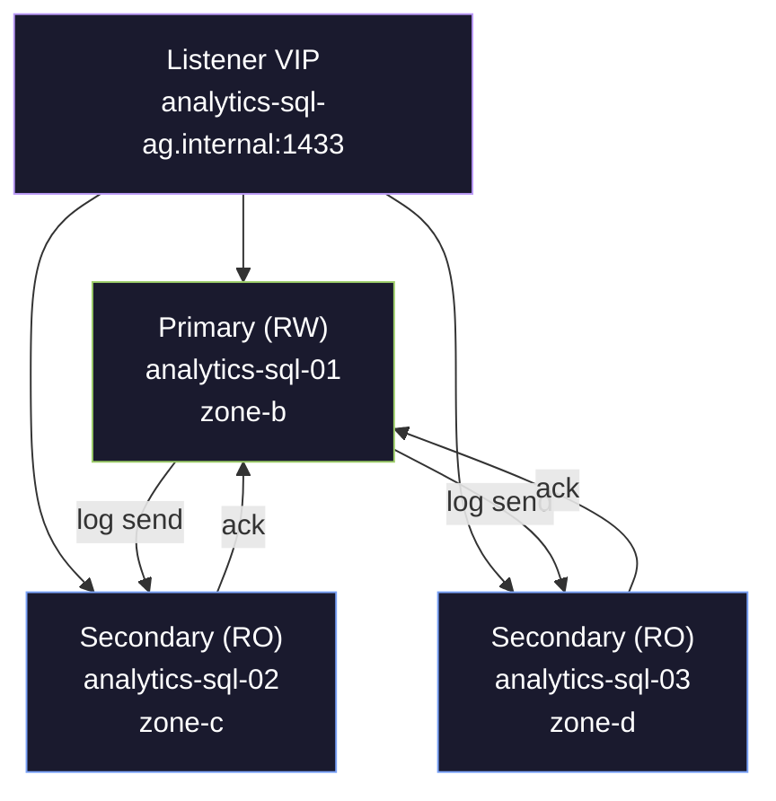

# Always On Availability Groups

> [!quote]
> "High availability is not about preventing failure — it is about recovering from failure faster than your users notice."
>
> — **Adrian Cockcroft**, Netflix tech blog

Always On Availability Groups (AGs) are the primary high-availability mechanism for SQL Server on Linux. An AG replicates a group of databases across 2–9 replicas (1 primary + up to 8 secondaries), with the primary accepting reads and writes while secondaries receive and replay transaction log records automatically.

---

## Why High Availability?

A single SQL Server instance is a single point of failure. If the VM crashes, the disk corrupts, or you need to patch the OS, your database is down. HA ensures the database remains accessible during planned maintenance and unplanned outages by maintaining redundant copies of data that can take over automatically.

#### RPO, RTO, SLA uptime — key HA metrics

| Metric | Definition | Target |
|--------|-----------|--------|
| **RTO** (Recovery Time Objective) | Maximum acceptable downtime after a failure | Seconds to minutes for HA; hours for DR |
| **RPO** (Recovery Point Objective) | Maximum acceptable data loss (how far back you'd roll back) | 0 for synchronous commit; seconds for async |
| **SLA** | Uptime guarantee expressed as a percentage | 99.9% = ~8.7h/year downtime, 99.99% = ~52min/year |

---

## HA Options for SQL Server 2022 on Linux

### Option 1: Always On Availability Groups (Recommended)



#### Synchronous vs asynchronous — AG replication modes

| Mode | How It Works | RPO | Use Case |
|------|-------------|-----|----------|
| **Synchronous commit** | Primary waits for secondary to harden the log before acknowledging the commit to the client | 0 (no data loss) | Same-region secondaries, high-value data |
| **Asynchronous commit** | Primary sends log records but doesn't wait for acknowledgment | > 0 (possible data loss) | Cross-region DR replicas, high-latency links |
| **Configuration-only** | Replica stores AG metadata but not data — acts as a quorum witness | N/A | Third node for automatic failover quorum (avoids needing 3 full replicas) |

**On Linux, Pacemaker replaces Windows Server Failover Clustering (WSFC).** The cluster manager detects failures and triggers failover. SQL Server on Linux uses the `mssql-server-ha` package to integrate with Pacemaker.

### Option 2: Failover Cluster Instance (FCI)

A single SQL Server instance that runs on one node at a time but can fail over to another node. Unlike AGs, FCI uses **shared storage** — both nodes see the same data files.

| Aspect | AG | FCI |
|--------|-----|-----|
| Shared storage | No — each replica has its own copy | Yes — shared disk (or network storage) |
| Database-level | Yes — individual databases can be in different AGs | No — entire instance fails over |
| Readable secondaries | Yes | No |
| GCP implementation | Each VM has its own persistent disk | Requires shared filesystem (GlusterFS, NFS, or iSCSI) |

> [!info] GCP Favors AGs Over FCI
>
> GCP Strongly Favors AGs Over FCI.
> GCP doesn't offer native shared storage like AWS EBS Multi-Attach or Azure Shared Disks. Setting up GlusterFS or NFS for FCI adds complexity and another failure point. Use AGs.

### Option 3: Log Shipping (Simple DR)

The primary backs up its transaction log on a schedule, copies the backup file to the secondary, and the secondary restores it.

- **RPO**: Minutes to hours (depends on backup frequency)
- **Failover**: Manual — an admin must point applications to the secondary
- **Best for**: DR complement to AGs, not the primary HA solution

### Decision Matrix

| Requirement | AG (Sync) | AG (Async) | FCI | Log Shipping |
|-------------|-----------|-----------|-----|-------------|
| Zero data loss | Yes | No | Yes | No |
| Automatic failover | Yes (with Pacemaker) | No | Yes (with Pacemaker) | No |
| Readable secondary | Yes | Yes | No | With STANDBY |
| No shared storage | Yes | Yes | No | Yes |
| Cross-region DR | Possible | Recommended | No | Yes |
| Simplicity | Medium | Medium | High complexity on GCP | Simple |

---

## Setting Up Always On AGs on Linux (GCP)

### Prerequisites

All nodes must have:
- SQL Server 2022 installed with the same version/CU
- The `mssql-server-ha` package installed
- Pacemaker + Corosync installed
- Unique hostnames resolvable by all nodes (via `/etc/hosts` or DNS)
- VPC firewall rules allowing: port 1433 (SQL), 5022 (AG endpoint), 2224 (pcsd), 3121 (Pacemaker), 5405 (Corosync)

### Step 1: Enable HADR on Every Node

```sql
-- Run on each SQL Server instance
ALTER SERVER CONFIGURATION SET HADR CLUSTER TYPE = EXTERNAL;

-- Verify
SELECT SERVERPROPERTY('IsHadrEnabled') AS hadr_enabled;
-- Returns 1
```

`EXTERNAL` tells SQL Server that an external cluster manager (Pacemaker) handles failover, not WSFC.

### Step 2: Create the Database Mirroring Endpoint on Every Node

```sql
CREATE ENDPOINT [Hadr_endpoint]
    AS TCP (LISTENER_PORT = 5022)
    FOR DATA_MIRRORING (
        ROLE = ALL,
        AUTHENTICATION = CERTIFICATE dbm_cert,
        ENCRYPTION = REQUIRED ALGORITHM AES
    );

ALTER ENDPOINT [Hadr_endpoint] STATE = STARTED;
```

> [!info] Certificate Auth on Linux
>
> Certificate-Based Authentication on Linux.
> AGs on Linux use **certificate-based authentication** (not Windows authentication). You create a certificate on the primary and copy it to all secondaries — Windows Kerberos is not available on Linux.

### Step 3: Create and Export the Certificate (Primary)

```sql
-- On primary
CREATE MASTER KEY ENCRYPTION BY PASSWORD = 'StrongMasterKeyP@ss!';

CREATE CERTIFICATE dbm_cert
    WITH SUBJECT = 'AG endpoint certificate';

BACKUP CERTIFICATE dbm_cert
    TO FILE = '/var/opt/mssql/data/dbm_cert.cer'
    WITH PRIVATE KEY (
        FILE = '/var/opt/mssql/data/dbm_cert.pvk',
        ENCRYPTION BY PASSWORD = 'CertP@ss123!'
    );
```

```bash
# Copy certificate files to each secondary
scp /var/opt/mssql/data/dbm_cert.* user@analytics-sql-02:/var/opt/mssql/data/
scp /var/opt/mssql/data/dbm_cert.* user@analytics-sql-03:/var/opt/mssql/data/

# Fix ownership on secondaries
ssh user@analytics-sql-02 'sudo chown mssql:mssql /var/opt/mssql/data/dbm_cert.*'
ssh user@analytics-sql-03 'sudo chown mssql:mssql /var/opt/mssql/data/dbm_cert.*'
```

### Step 4: Import the Certificate on Each Secondary

```sql
-- On each secondary
CREATE MASTER KEY ENCRYPTION BY PASSWORD = 'StrongMasterKeyP@ss!';

CREATE CERTIFICATE dbm_cert
    FROM FILE = '/var/opt/mssql/data/dbm_cert.cer'
    WITH PRIVATE KEY (
        FILE = '/var/opt/mssql/data/dbm_cert.pvk',
        DECRYPTION BY PASSWORD = 'CertP@ss123!'
    );
```

### Step 5: Create the Availability Group (Primary)

```sql
CREATE AVAILABILITY GROUP [project_ag]
WITH (
    CLUSTER_TYPE = EXTERNAL,
    DB_FAILOVER = ON,          -- auto-failover on critical DB errors
    REQUIRED_SYNCHRONIZED_SECONDARIES_TO_COMMIT = 1
)
FOR REPLICA ON
    N'analytics-sql-01' WITH (
        ENDPOINT_URL = N'tcp://analytics-sql-01:5022',
        AVAILABILITY_MODE = SYNCHRONOUS_COMMIT,
        FAILOVER_MODE = EXTERNAL,
        SEEDING_MODE = AUTOMATIC,
        SECONDARY_ROLE (ALLOW_CONNECTIONS = READ_ONLY)
    ),
    N'analytics-sql-02' WITH (
        ENDPOINT_URL = N'tcp://analytics-sql-02:5022',
        AVAILABILITY_MODE = SYNCHRONOUS_COMMIT,
        FAILOVER_MODE = EXTERNAL,
        SEEDING_MODE = AUTOMATIC,
        SECONDARY_ROLE (ALLOW_CONNECTIONS = READ_ONLY)
    ),
    N'analytics-sql-03' WITH (
        ENDPOINT_URL = N'tcp://analytics-sql-03:5022',
        AVAILABILITY_MODE = ASYNCHRONOUS_COMMIT,
        FAILOVER_MODE = EXTERNAL,
        SEEDING_MODE = AUTOMATIC,
        SECONDARY_ROLE (ALLOW_CONNECTIONS = READ_ONLY)
    );
```

> [!tip] Synchronized Secondary Commitment
>
> REQUIRED_SYNCHRONIZED_SECONDARIES_TO_COMMIT = 1.
> This prevents data loss during failover — the primary will not acknowledge a commit until at least 1 synchronous secondary has hardened the log. Trade-off: if both synchronous secondaries go down, the primary stops accepting writes.

> [!info] SEEDING_MODE = AUTOMATIC
>
> SQL Server streams the initial database copy over the AG endpoint instead of requiring manual backup/restore. For large databases (100+ GB), manual seeding with backup/restore is faster.

### Step 6: Join Secondaries to the AG

```sql
-- On each secondary
ALTER AVAILABILITY GROUP [project_ag] JOIN WITH (CLUSTER_TYPE = EXTERNAL);
ALTER AVAILABILITY GROUP [project_ag] GRANT CREATE ANY DATABASE;
```

The `GRANT CREATE ANY DATABASE` allows automatic seeding to create the database on the secondary.

### Step 7: Add Databases to the AG (Primary)

```sql
ALTER AVAILABILITY GROUP [project_ag] ADD DATABASE [analytics_db];
```

The database must be in FULL recovery model. If it's in SIMPLE:

```sql
ALTER DATABASE [analytics_db] SET RECOVERY FULL;
BACKUP DATABASE [analytics_db] TO DISK = '/var/opt/mssql/backup/mydb_full.bak';
-- Then add to AG
ALTER AVAILABILITY GROUP [project_ag] ADD DATABASE [analytics_db];
```

### Step 8: Configure Pacemaker

```bash
# Install on all nodes
sudo apt install -y pacemaker pacemaker-cli-utils corosync resource-agents fence-agents

# Install the SQL Server HA resource agent
sudo apt install -y mssql-server-ha
```

```sql
-- On each node — create Pacemaker login for health checks
CREATE LOGIN [pacemakerLogin] WITH PASSWORD = 'PacemakerP@ss!';

-- Grant the AG health check permission
GRANT ALTER, CONTROL, VIEW DEFINITION ON AVAILABILITY GROUP::[project_ag]
    TO [pacemakerLogin];
GRANT VIEW SERVER STATE TO [pacemakerLogin];
```

```bash
# Store credentials for the resource agent on each node
echo 'pacemakerLogin' | sudo tee /var/opt/mssql/secrets/passwd
echo 'PacemakerP@ss!' | sudo tee -a /var/opt/mssql/secrets/passwd
sudo chmod 400 /var/opt/mssql/secrets/passwd
sudo chown root:root /var/opt/mssql/secrets/passwd
```

```bash
# Configure Corosync (on primary, then sync to all nodes)
sudo cat > /etc/corosync/corosync.conf << 'EOF'
totem {
    version: 2
    cluster_name: analytics-cluster
    transport: udpu
    rrp_mode: none
}

nodelist {
    node {
        ring0_addr: analytics-sql-01
        nodeid: 1
    }
    node {
        ring0_addr: analytics-sql-02
        nodeid: 2
    }
    node {
        ring0_addr: analytics-sql-03
        nodeid: 3
    }
}

quorum {
    provider: corosync_votequorum
    two_node: 0
}
EOF

sudo systemctl restart corosync
sudo systemctl restart pacemaker
```

```bash
# Create the AG resource in Pacemaker (run on one node only)
sudo pcs resource create ag_cluster \
    ocf:mssql:ag \
    ag_name="project_ag" \
    meta failure-timeout=60s \
    op start timeout=60s \
    op stop timeout=60s \
    op promote timeout=60s \
    op demote timeout=10s \
    op monitor timeout=60s interval=10s on-fail=demote \
    op monitor timeout=60s interval=11s on-fail=restart role=Promoted \
    master notify=true

# Create a virtual IP resource for the AG listener
sudo pcs resource create ag_vip \
    ocf:heartbeat:IPaddr2 \
    ip=10.132.0.100 \
    cidr_netmask=32 \
    op monitor interval=30s

# Colocate the VIP with the primary
sudo pcs constraint colocation add ag_vip with master ag_cluster-clone INFINITY
sudo pcs constraint order promote ag_cluster-clone then start ag_vip
```

> [!info] Use ILB Instead of Floating VIP
>
> GCP: Use Internal TCP/UDP Load Balancer Instead of Floating VIP.
> GCP doesn't support Gratuitous ARP, so a floating VIP may not work reliably. Create an Internal Load Balancer (ILB) with a health check on port 1433 and backend instance group containing all AG nodes. The ILB forwards traffic only to the node that responds as primary.

---

## Monitoring the AG — Essential DMVs

#### sys.dm_hadr_availability_replica_states — replica sync health

```sql
SELECT
    ag.name                          AS ag_name,
    ar.replica_server_name           AS replica,
    ars.role_desc                    AS current_role,
    ar.availability_mode_desc        AS sync_mode,
    ars.connected_state_desc         AS connected,
    ars.synchronization_health_desc  AS sync_health,
    ars.operational_state_desc       AS operational_state,
    ars.last_connect_error_number    AS last_error,
    ars.last_connect_error_timestamp AS last_error_time
FROM sys.availability_groups ag
JOIN sys.availability_replicas ar
    ON ag.group_id = ar.group_id
JOIN sys.dm_hadr_availability_replica_states ars
    ON ar.replica_id = ars.replica_id
ORDER BY ars.role_desc, ar.replica_server_name;
```

#### Healthy AG output — SYNCHRONIZED, CONNECTED, PRIMARY/SECONDARY

```
ag_name    replica        current_role  sync_mode    connected    sync_health
project_ag   analytics-sql-01   PRIMARY       SYNCHRONOUS  CONNECTED    HEALTHY
project_ag   analytics-sql-02   SECONDARY     SYNCHRONOUS  CONNECTED    HEALTHY
project_ag   analytics-sql-03   SECONDARY     ASYNCHRONOUS CONNECTED    HEALTHY
```

Any value other than `CONNECTED` + `HEALTHY` needs investigation.

#### sys.dm_hadr_database_replica_states — log send queue and redo queue

```sql
SELECT
    d.name                              AS database_name,
    ar.replica_server_name,
    drs.synchronization_state_desc      AS sync_state,
    drs.synchronization_health_desc     AS sync_health,
    drs.log_send_queue_size             AS log_send_queue_kb,
    drs.log_send_rate                   AS log_send_rate_kb_sec,
    drs.redo_queue_size                 AS redo_queue_kb,
    drs.redo_rate                       AS redo_rate_kb_sec,
    drs.last_hardened_lsn,
    drs.last_commit_time,
    drs.is_suspended,
    drs.suspend_reason_desc
FROM sys.dm_hadr_database_replica_states drs
JOIN sys.availability_replicas ar
    ON drs.replica_id = ar.replica_id
JOIN sys.databases d
    ON drs.database_id = d.database_id
ORDER BY d.name, ar.replica_server_name;
```

#### log_send_queue_size, redo_queue_size — key replication lag columns

| Column | Alert If |
|--------|----------|
| `log_send_queue_size` | > 50,000 KB (secondary is falling behind) |
| `redo_queue_size` | > 100,000 KB (secondary redo is lagging) |
| `is_suspended` | = 1 (manual intervention needed) |
| `sync_state` | NOT SYNCHRONIZING = broken |

#### sys.dm_hadr_automatic_seeding — automatic seeding progress

```sql
-- Check seeding status when adding a new database or replica
SELECT
    ag.name                          AS ag_name,
    ar.replica_server_name           AS replica,
    d.name                           AS database_name,
    hadr_s.current_state             AS seeding_state,
    hadr_s.performed_seeding         AS seeding_done,
    hadr_s.failure_state_desc        AS failure_reason,
    hadr_s.start_time,
    hadr_s.completion_time
FROM sys.dm_hadr_automatic_seeding hadr_s
JOIN sys.availability_groups ag
    ON hadr_s.ag_id = ag.group_id
JOIN sys.availability_replicas ar
    ON hadr_s.ag_id = ar.group_id
    AND hadr_s.replica_id = ar.replica_id
JOIN sys.databases d
    ON hadr_s.ag_db_id = d.group_database_id;
```

#### dm_hadr_database_replica_states — log send and redo throughput monitoring

```sql
-- Monitor log send and redo rates over time
SELECT
    ar.replica_server_name,
    drs.log_send_queue_size / 1024.0      AS log_send_queue_mb,
    drs.log_send_rate / 1024.0            AS log_send_rate_mb_sec,
    drs.redo_queue_size / 1024.0          AS redo_queue_mb,
    drs.redo_rate / 1024.0                AS redo_rate_mb_sec,
    DATEDIFF(SECOND,
        drs.last_commit_time,
        GETUTCDATE()
    )                                     AS commit_lag_seconds
FROM sys.dm_hadr_database_replica_states drs
JOIN sys.availability_replicas ar ON drs.replica_id = ar.replica_id;
```

---

## Failover Operations

### Planned Failover (Zero Downtime, Zero Data Loss)

Used for: OS patching, SQL Server upgrades, VM maintenance.

```sql
-- Step 1: Verify the target secondary is synchronized (run on primary)
SELECT
    ar.replica_server_name,
    drs.synchronization_state_desc
FROM sys.dm_hadr_database_replica_states drs
JOIN sys.availability_replicas ar ON drs.replica_id = ar.replica_id
WHERE drs.synchronization_state_desc = 'SYNCHRONIZED';
-- The target must show SYNCHRONIZED, not SYNCHRONIZING

-- Step 2: Failover (run on the TARGET secondary, not the primary)
ALTER AVAILABILITY GROUP [project_ag] FAILOVER;
```

After failover, the old primary becomes a secondary and starts receiving log records from the new primary. Applications connected to the listener/VIP are redirected automatically (brief connection drop, ~10-30 seconds).

### Forced Failover (Emergency, Possible Data Loss)

Used when the primary is down and cannot be recovered quickly.

```sql
-- Run on the secondary you want to promote
ALTER AVAILABILITY GROUP [project_ag] FORCE_FAILOVER_ALLOW_DATA_LOSS;
```

#### Post-forced-failover checklist — resume databases, reverse replication

1. Check for data inconsistencies between the new primary and remaining secondaries
2. When the old primary comes back online, it may have transactions that the new primary doesn't — these "divergent" transactions must be resolved
3. Rejoin the old primary as a secondary:

```sql
-- On the old primary (now rejoining as secondary)
ALTER AVAILABILITY GROUP [project_ag]
    SET (ROLE = SECONDARY);
ALTER AVAILABILITY GROUP [project_ag] JOIN WITH (CLUSTER_TYPE = EXTERNAL);
```

If the databases diverged too much, drop the database on the old primary and let automatic seeding re-create it:

```sql
-- On the old primary
DROP DATABASE [analytics_db];
ALTER AVAILABILITY GROUP [project_ag] GRANT CREATE ANY DATABASE;
-- Wait for automatic seeding to complete
```

---

## Read-Only Routing

Offload read queries (dashboard, reporting) to secondaries, leaving the primary free for writes.

```sql
-- Configure read-only routing URLs on each replica
ALTER AVAILABILITY GROUP [project_ag]
MODIFY REPLICA ON N'analytics-sql-01' WITH (
    PRIMARY_ROLE (
        READ_ONLY_ROUTING_LIST = (N'analytics-sql-02', N'analytics-sql-03')
    ),
    SECONDARY_ROLE (
        READ_ONLY_ROUTING_URL = N'tcp://analytics-sql-01:1433',
        ALLOW_CONNECTIONS = READ_ONLY
    )
);

ALTER AVAILABILITY GROUP [project_ag]
MODIFY REPLICA ON N'analytics-sql-02' WITH (
    PRIMARY_ROLE (
        READ_ONLY_ROUTING_LIST = (N'analytics-sql-01', N'analytics-sql-03')
    ),
    SECONDARY_ROLE (
        READ_ONLY_ROUTING_URL = N'tcp://analytics-sql-02:1433',
        ALLOW_CONNECTIONS = READ_ONLY
    )
);
```

#### ApplicationIntent=ReadOnly — read-only routing connection strings

```
# Read-write (goes to primary)
Server=analytics-sql-ag.internal,1433;Database=analytics_db;ApplicationIntent=ReadWrite;

# Read-only (routed to a secondary)
Server=analytics-sql-ag.internal,1433;Database=analytics_db;ApplicationIntent=ReadOnly;
```

#### @@SERVERNAME, CONNECTIONPROPERTY — verify read-only routing

```sql
-- Run on a read-only connection to see which server you're on
SELECT @@SERVERNAME AS connected_to,
       DATABASEPROPERTYEX(DB_NAME(), 'Updateability') AS updateability;
-- Should show a secondary name and 'READ_ONLY'
```

---

## Troubleshooting

### Issue 1: Secondary Shows NOT SYNCHRONIZING

#### AG troubleshooting — diagnosis queries for sync lag and connection issues

```sql
-- Check if data movement is suspended
SELECT
    ar.replica_server_name,
    drs.is_suspended,
    drs.suspend_reason_desc
FROM sys.dm_hadr_database_replica_states drs
JOIN sys.availability_replicas ar ON drs.replica_id = ar.replica_id
WHERE drs.is_suspended = 1;
```

| Cause | Fix |
|-------|-----|
| Data movement manually suspended | `ALTER DATABASE [analytics_db] SET HADR RESUME` on the secondary |
| Endpoint not started | `ALTER ENDPOINT [Hadr_endpoint] STATE = STARTED` |
| Certificate expired or mismatched | Re-export from primary, re-import on secondary |
| Firewall blocking port 5022 | Check `gcloud compute firewall-rules list --filter="allowed:tcp/5022"` |
| Log send queue growing unbounded | Network throughput issue — check GCP network metrics |

### Issue 2: High Redo Queue on Secondary

The secondary is receiving log records faster than it can replay them.

```sql
-- Check redo rate vs log send rate
SELECT
    ar.replica_server_name,
    drs.redo_queue_size AS redo_queue_kb,
    drs.redo_rate AS redo_rate_kb_sec,
    CASE WHEN drs.redo_rate > 0
         THEN drs.redo_queue_size / drs.redo_rate
         ELSE -1
    END AS estimated_redo_catchup_seconds
FROM sys.dm_hadr_database_replica_states drs
JOIN sys.availability_replicas ar ON drs.replica_id = ar.replica_id
WHERE drs.redo_queue_size > 0;
```

#### AG sync lag fixes — network, redo bottleneck, log throughput
- Check secondary disk I/O: `iostat -xz 1` — look for high `%util` or `await`
- Ensure secondary has enough CPU for redo thread (it's single-threaded per database in most cases)
- If secondary is also serving read queries, those queries may hold schema locks blocking redo. Use [RCSI](https://alp78.github.io/elysium/04-SQL-Server/Concurrency/blocking-and-locking) on the secondary to avoid this
- Increase secondary VM size if I/O or CPU is the bottleneck

### Issue 3: Automatic Failover Didn't Happen

```bash
# Check Pacemaker resource status
sudo pcs status
sudo pcs resource show ag_cluster

# Check for failed actions
sudo pcs resource cleanup ag_cluster

# View detailed Pacemaker log
sudo corosync-quorumtool -s  # quorum status
sudo crm_mon -1              # one-shot cluster status
```

| Cause | Fix |
|-------|-----|
| No quorum (majority of nodes down) | Need >50% of nodes online. With 2 nodes, add a config-only replica as witness |
| Synchronous secondary not SYNCHRONIZED | Failover blocked to prevent data loss. Fix the sync issue first |
| Pacemaker resource in failed state | `sudo pcs resource cleanup ag_cluster` to reset failure count |
| STONITH not configured | Pacemaker requires fencing by default. Either configure it or disable: `sudo pcs property set stonith-enabled=false` (not recommended for production) |

### Issue 4: Split-Brain Scenario

Two nodes both think they're the primary. This is the most dangerous HA failure.

#### Split-brain prevention — witness, quorum, fencing
- Always configure proper fencing (STONITH) — Pacemaker can use `fence_gce` to forcibly shut down a GCP VM
- Set `REQUIRED_SYNCHRONIZED_SECONDARIES_TO_COMMIT = 1` so the primary stops accepting writes if it can't reach a secondary
- Use odd number of nodes (or a config-only witness) for clean majority

#### Split-brain detection — check both replicas claim PRIMARY

```sql
-- Run on both nodes — if both say PRIMARY, you have split-brain
SELECT
    ars.role_desc,
    ar.replica_server_name
FROM sys.dm_hadr_availability_replica_states ars
JOIN sys.availability_replicas ar ON ars.replica_id = ar.replica_id
WHERE ars.role_desc = 'PRIMARY';
```

#### Split-brain recovery — identify divergent data, reseed secondary
1. Immediately stop writes to both nodes (bring applications offline)
2. Determine which node has the most recent data (compare `last_hardened_lsn`)
3. Demote the stale node: force stop SQL Server, then rejoin as secondary
4. If data diverged, restore the stale node from backup or reseed

### Issue 5: Certificate Expiry

```sql
SELECT name, expiry_date, start_date
FROM sys.certificates
WHERE name = 'dbm_cert';
```

If expired, generate a new certificate on the primary, export it, and import it on all secondaries. Then alter the endpoint:

```sql
ALTER ENDPOINT [Hadr_endpoint]
    FOR DATA_MIRRORING (AUTHENTICATION = CERTIFICATE dbm_cert_new);
```

---

### Related

- [backup-types-and-strategy](https://alp78.github.io/elysium/04-SQL-Server/Administration/backup-types-and-strategy) — FULL recovery model required for AGs; backup strategy with AG
- [restore-and-recovery](https://alp78.github.io/elysium/04-SQL-Server/Administration/restore-and-recovery) — recovery point objectives and how AGs interact with restore scenarios
- [server-configuration](https://alp78.github.io/elysium/04-SQL-Server/Administration/server-configuration) — instance settings (MAXDOP, max server memory) that apply to all replicas
- [blocking-and-locking](https://alp78.github.io/elysium/04-SQL-Server/Concurrency/blocking-and-locking) — RCSI on secondary replicas to prevent redo thread blocking
- [storage-internals](https://alp78.github.io/elysium/04-SQL-Server/Storage-and-Indexes/storage-internals) — WAL and log record flow that underlies AG replication
