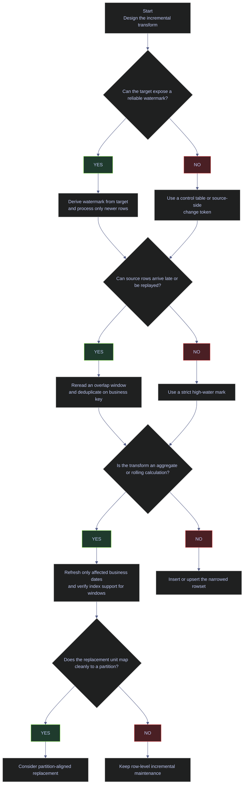

# SQL Server Incremental Transforms

Incremental transforms process only the slice of data that is new, late, or invalidated since the last successful run. In production SQL Server pipelines, that usually means three separate decisions: how to define the processing boundary, how to protect against late-arriving rows, and how to recompute downstream aggregates without touching the full history every time.

This note uses the live `stoxx` database, not placeholder schemas. The production default for this environment is: derive the watermark from the target when the target is authoritative, reread a small overlap window when late arrivals are possible, deduplicate deterministically, and reserve partition replacement or indexed views for cases where the simpler pattern is no longer sufficient.

---

## Live Baseline

The first step in any incremental design is to measure the real freshness boundaries of the source and target tables. Without that baseline, terms such as "incremental", "late-arriving", and "lagging" stay theoretical.

### Current incremental boundaries in `stoxx`

The `stoxx` pipeline already shows three distinct incremental shapes:

- `bronze.signals_daily` is a current-day raw snapshot feed.
- `silver.signals_daily` and `gold.scores_daily` have been processed through the same signal date.
- `gold.index_performance` is intentionally one day behind the current silver signal date, which makes it a useful live target for incremental aggregation examples.

#### Measure the live date coverage of the main source and target datasets

[!info]-
This query builds a single baseline table across five datasets that participate in the current `stoxx` transformation chain.

- `bronze.signals_daily` uses `CAST([timestamp] AS date)` because the bronze table stores raw event timestamps, not a separate date column.
- `silver.signals_daily` uses `signal_date`, which is already normalized to a reporting date in the transformed layer.
- `gold.scores_daily` uses `score_date`, which is the gold-layer scoring date.
- `silver.eurostoxx50_ohlcv` and `gold.index_performance` provide a longer market-history path so the note can distinguish daily snapshot transforms from multi-year market history transforms.
- `MIN(...)` and `MAX(...)` show the current processing window for each dataset.
- `COUNT(*)` shows the volume currently stored in that dataset so the reader can judge whether a full reload would still be cheap or whether an incremental pattern is mandatory.

*This query shows the live date coverage and row volume of the main source and target datasets used in the current `stoxx` pipeline.*

```sql
SELECT 'bronze.signals_daily' AS dataset,
       MIN(CAST([timestamp] AS date)) AS min_date,
       MAX(CAST([timestamp] AS date)) AS max_date,
       COUNT(*) AS row_count
FROM bronze.signals_daily
UNION ALL
SELECT 'silver.signals_daily',
       MIN(signal_date),
       MAX(signal_date),
       COUNT(*)
FROM silver.signals_daily
UNION ALL
SELECT 'gold.scores_daily',
       MIN(score_date),
       MAX(score_date),
       COUNT(*)
FROM gold.scores_daily
UNION ALL
SELECT 'silver.eurostoxx50_ohlcv',
       MIN([date]),
       MAX([date]),
       COUNT(*)
FROM silver.eurostoxx50_ohlcv
UNION ALL
SELECT 'gold.index_performance',
       MIN(perf_date),
       MAX(perf_date),
       COUNT(*)
FROM gold.index_performance
ORDER BY dataset;
```

| dataset | min_date | max_date | row_count |
|---|---|---|---:|
| `bronze.signals_daily` | 2026-04-08 | 2026-04-08 | 169 |
| `gold.index_performance` | 2021-01-05 | 2026-04-07 | 5351 |
| `gold.scores_daily` | 2026-03-04 | 2026-04-08 | 635 |
| `silver.eurostoxx50_ohlcv` | 2021-01-04 | 2026-04-07 | 67155 |
| `silver.signals_daily` | 2026-03-04 | 2026-04-08 | 635 |

_`bronze.signals_daily` is a one-day raw landing table as currently loaded, while `silver.signals_daily` and `gold.scores_daily` already cover the same processed date range through 2026-04-08. `gold.index_performance` stops at 2026-04-07, so it is a real live example of a downstream aggregate that has a known watermark lag and can be refreshed incrementally instead of recomputed from 2021 onward._

#### Quantify the current silver-to-gold freshness gap for the performance aggregate

[!info]-
This query compares the latest processed silver signal date to the latest `gold.index_performance` date for each index.

- The inner grouped subquery on `gold.index_performance` derives the current watermark per `_index`.
- The outer grouped query on `silver.signals_daily` finds the latest source date and counts how many silver rows are strictly newer than the current gold watermark.
- `SUM(CASE WHEN s.signal_date > g.max_perf_date THEN 1 ELSE 0 END)` is the key operational field: it tells you how many source rows would need to be considered by an incremental refresh if you ran it now.

*This query measures how far `gold.index_performance` currently lags behind the silver signal layer and how many silver rows are waiting beyond the current gold watermark.*

```sql
SELECT s._index,
       MAX(s.signal_date) AS silver_max_signal_date,
       g.max_perf_date,
       SUM(CASE WHEN s.signal_date > g.max_perf_date THEN 1 ELSE 0 END) AS silver_rows_newer_than_gold_perf
FROM silver.signals_daily AS s
JOIN (
    SELECT _index, MAX(perf_date) AS max_perf_date
    FROM gold.index_performance
    GROUP BY _index
) AS g
    ON g._index = s._index
GROUP BY s._index, g.max_perf_date
ORDER BY s._index;
```

| _index | silver_max_signal_date | max_perf_date | silver_rows_newer_than_gold_perf |
|---|---|---|---:|
| `euro_stoxx_50` | 2026-04-08 | 2026-04-07 | 50 |
| `oil_20` | 2026-04-08 | 2026-04-07 | 19 |
| `stoxx_asia_50` | 2026-04-08 | 2026-04-07 | 50 |
| `stoxx_usa_50` | 2026-04-08 | 2026-04-07 | 50 |

_Every index currently has exactly one newer silver date beyond the gold performance watermark. That makes this a clean incremental target: process only the 2026-04-08 silver slice instead of recomputing more than five years of `gold.index_performance` history._

---

## Watermark-Driven Incremental Loads

A watermark is the persisted boundary between "already processed" and "not yet processed" data. In SQL Server pipelines, the most common forms are a reporting date, a raw ingestion timestamp, or a monotonic change token such as an LSN. The safest production rule is: advance the watermark only after the target write commits, and reread a controlled overlap window if the source can arrive late.

### Deriving the watermark from the target

When the target table is authoritative and small enough to query cheaply, deriving the watermark from `MAX(date)` is often simpler and more reliable than storing a duplicate boundary elsewhere. That is the current fit for `gold.index_performance`.

#### Compute the overlap window from the current silver watermark

[!info]-
This query derives the current watermark from `silver.signals_daily`, subtracts one day, and counts how many raw bronze rows fall inside that reread window.

- The CTE `daily` computes `MAX(signal_date)` per `_index`.
- `DATEADD(DAY, -1, d.wm)` creates the overlap boundary. The idea is to reread recent data on purpose so that late-arriving rows still enter the pipeline.
- The join to `bronze.signals_daily` uses `CAST(b.[timestamp] AS date)` because the bronze feed stores a timestamp, not a transformed signal date.
- `COUNT(*)` measures how much work the reread window actually creates. This matters operationally because a one-day overlap is cheap if it rereads 50 rows, but it is not cheap if it rereads 50 million rows.

*This query derives a one-day overlap window from the current silver watermark and measures how many bronze rows would be reread per index.*

```sql
WITH daily AS (
    SELECT _index, MAX(signal_date) AS wm
    FROM silver.signals_daily
    GROUP BY _index
)
SELECT d._index,
       d.wm AS current_watermark,
       DATEADD(DAY, -1, d.wm) AS overlap_start,
       COUNT(*) AS bronze_rows_in_overlap_window
FROM daily AS d
JOIN bronze.signals_daily AS b
    ON b._index = d._index
   AND CAST(b.[timestamp] AS date) > DATEADD(DAY, -1, d.wm)
GROUP BY d._index, d.wm
ORDER BY d._index;
```

| _index | current_watermark | overlap_start | bronze_rows_in_overlap_window |
|---|---|---|---:|
| `euro_stoxx_50` | 2026-04-08 | 2026-04-07 | 50 |
| `oil_20` | 2026-04-08 | 2026-04-07 | 19 |
| `stoxx_asia_50` | 2026-04-08 | 2026-04-07 | 50 |
| `stoxx_usa_50` | 2026-04-08 | 2026-04-07 | 50 |

_A one-day overlap is cheap in this environment because it rereads only one fresh daily batch per index. This is the operational sweet spot for overlap windows: small enough to stay inexpensive, large enough to protect against delayed arrivals or reruns on the same business date._

#### Deduplicate the bronze daily snapshot before inserting into silver

[!info]-
This query shows the production-safe deduplication pattern for daily bronze snapshots before loading silver.

- The CTE `src` reads `bronze.signals_daily` and normalizes the raw timestamp to `signal_date`.
- `ROW_NUMBER() OVER (PARTITION BY _index, symbol, CAST([timestamp] AS date) ORDER BY _ingested_at DESC, id DESC)` keeps exactly one winning row for each business key and day.
- The partition key `_index, symbol, CAST([timestamp] AS date)` defines what "duplicate" means in this pipeline.
- The `ORDER BY` clause inside `ROW_NUMBER()` resolves ties by keeping the latest ingested row, then the highest `id` if ingestion timestamps tie.
- The outer `dedup` CTE filters to `rn = 1`, which is the rowset the pipeline would actually insert into `silver.signals_daily`.

*This query collapses raw bronze duplicates to one deterministic daily row per `_index`, `symbol`, and signal date before an insert into `silver.signals_daily`.*

```sql
WITH src AS (
    SELECT _index,
           CAST([timestamp] AS date) AS signal_date,
           symbol,
           current_price,
           forward_pe,
           price_to_book,
           ROW_NUMBER() OVER (
               PARTITION BY _index, symbol, CAST([timestamp] AS date)
               ORDER BY _ingested_at DESC, id DESC
           ) AS rn
    FROM bronze.signals_daily
    WHERE _index = 'euro_stoxx_50'
),
dedup AS (
    SELECT *
    FROM src
    WHERE rn = 1
)
SELECT TOP (10)
       _index,
       signal_date,
       symbol,
       CAST(current_price AS decimal(10,2)) AS current_price,
       CAST(forward_pe AS decimal(10,2)) AS forward_pe,
       CAST(price_to_book AS decimal(10,2)) AS price_to_book
FROM dedup
ORDER BY signal_date DESC, symbol;
```

| _index | signal_date | symbol | current_price | forward_pe | price_to_book |
|---|---|---|---:|---:|---:|
| `euro_stoxx_50` | 2026-04-08 | `ABI.BR` | 61.62 | 14.69 | 1.60 |
| `euro_stoxx_50` | 2026-04-08 | `AD.AS` | 41.69 | 14.03 | 2.60 |
| `euro_stoxx_50` | 2026-04-08 | `ADS.DE` | 130.85 | 11.18 | 4.05 |
| `euro_stoxx_50` | 2026-04-08 | `ADYEN.AS` | 844.20 | 17.69 | 5.04 |
| `euro_stoxx_50` | 2026-04-08 | `AI.PA` | 181.50 | 23.06 | 4.00 |
| `euro_stoxx_50` | 2026-04-08 | `AIR.PA` | 162.62 | 18.92 | 4.90 |
| `euro_stoxx_50` | 2026-04-08 | `ALV.DE` | 367.20 | 11.00 | 2.23 |
| `euro_stoxx_50` | 2026-04-08 | `ARGX.BR` | 648.60 | 20.95 | 6.31 |
| `euro_stoxx_50` | 2026-04-08 | `ASML.AS` | 1113.80 | 29.52 | 21.89 |
| `euro_stoxx_50` | 2026-04-08 | `BAS.DE` | 51.93 | 17.50 | 1.38 |

_This output is the shape a silver insert should consume: one row per symbol per business date after duplicates have already been resolved. The important point is not the values themselves, but the deterministic dedup boundary: if a rerun or delayed source file brings the same business key again, the row-number rule will choose one winner instead of silently duplicating the day._

### Use `rowversion` when a mutable source cannot trust a date watermark

Date watermarks are ideal when the source exposes a reliable event date or ingest timestamp. They are weaker when the source mutates rows in place without changing the business date. In that case, a `rowversion` token can act as the incremental boundary, provided the consumer understands the limits:

- it catches inserts and updates, not deletes
- it is a technical version stamp, not business time
- the consumer must reread the base row after finding changed keys

#### Demonstrate a `rowversion`-based incremental read boundary

[!warning]
`rowversion` is not a replacement for CDC or CT. It does not tell you which columns changed, it does not emit a delete event, and it changes on any update to a row with a `rowversion` column. If deletes matter, you need a separate delete path or a richer feature.

[!success]
Use `rowversion` when the source mutates in place, the current row can be reread cheaply, and the pipeline only needs a technical "changed since token X" boundary. Persist the last consumed token only after the downstream write commits.

[!info]-
This batch demonstrates a classic rowversion incremental pattern on a disposable table.

- The table starts with two rows and a `rowversion` column named `rv`.
- `@@DBTS` captures the latest database rowversion after the initial load and acts as the saved watermark.
- One row is updated and one new row is inserted after that snapshot.
- The final `SELECT ... WHERE rv > @last_consumed_rowversion` returns only the rows changed after the saved token.

*This batch captures a saved rowversion watermark, changes two rows after that point, and returns only the rows whose rowversion is newer than the stored token.*

```sql
IF OBJECT_ID('dbo.demo_rowversion_incremental', 'U') IS NOT NULL
    DROP TABLE dbo.demo_rowversion_incremental;

CREATE TABLE dbo.demo_rowversion_incremental
(
    id int NOT NULL PRIMARY KEY,
    business_key varchar(20) NOT NULL,
    payload nvarchar(50) NOT NULL,
    rv rowversion NOT NULL
);

INSERT INTO dbo.demo_rowversion_incremental(id, business_key, payload)
VALUES (1, 'ABI.BR', N'initial'),
       (2, 'AD.AS', N'initial');

DECLARE @last_consumed_rowversion varbinary(8) = @@DBTS;

UPDATE dbo.demo_rowversion_incremental
SET payload = N'revised'
WHERE id = 2;

INSERT INTO dbo.demo_rowversion_incremental(id, business_key, payload)
VALUES (3, 'ASML.AS', N'new-row');

SELECT id,
       business_key,
       payload,
       master.dbo.fn_varbintohexstr(@last_consumed_rowversion) AS last_consumed_rowversion,
       master.dbo.fn_varbintohexstr(CAST(rv AS varbinary(8))) AS current_rowversion
FROM dbo.demo_rowversion_incremental
WHERE CAST(rv AS varbinary(8)) > @last_consumed_rowversion
ORDER BY current_rowversion;

DROP TABLE dbo.demo_rowversion_incremental;
```

| id | business_key | payload | last_consumed_rowversion | current_rowversion |
|---:|---|---|---|---|
| 2 | `AD.AS` | `revised` | `0x000000000003f24d` | `0x000000000003f24e` |
| 3 | `ASML.AS` | `new-row` | `0x000000000003f24d` | `0x000000000003f250` |

_This is the minimal rowversion delta pattern. The consumer saves one token, then asks for rows with a newer token on the next run. The output also shows why rowversion is a version boundary, not a row counter: SQL Server advanced from `0x...24d` to `0x...24e` and `0x...250`, and the gap between values is not itself meaningful._

### Collapse wide-row comparisons with a stable hash signature

Wide dimensions and upsert targets often have too many business attributes for a naïve `col1 <> col1 OR col2 <> col2 ...` predicate to stay readable or maintainable. A stable hash signature can collapse that comparison to one equality check, as long as the pipeline normalizes null handling, data types, and field order consistently.

#### Compare bronze and current silver dimension rows with one SHA2 signature

[!info]-
This query computes the same SHA2-256 signature for selected business attributes in `bronze.index_dim` and the current rows in `silver.index_dim`.

- `CONCAT_WS('|', ...)` builds one deterministic string from the selected attributes in a fixed order.
- `CONVERT(varchar(10), ..., 23)` normalizes the date columns to ISO `yyyy-mm-dd` text before hashing.
- `HASHBYTES('SHA2_256', ...)` creates the signature for each side.
- The equality test reduces a wide multi-column comparison to one `UNCHANGED` or `CHANGED` outcome.
- `s.is_current = 1` makes the comparison use only the active SCD2 version in silver.

*This query collapses a wide bronze-to-silver comparison into one SHA2 signature per business row.*

```sql
SELECT TOP (8)
       b._index,
       b.symbol,
       CASE
           WHEN HASHBYTES(
                    'SHA2_256',
                    CONCAT_WS(
                        '|',
                        b.long_name,
                        b.short_name,
                        b.sector,
                        b.industry,
                        b.country,
                        b.exchange,
                        b.currency,
                        CONVERT(varchar(10), b.range_start, 23),
                        CONVERT(varchar(10), b.price_data_start, 23)
                    )
                ) = HASHBYTES(
                    'SHA2_256',
                    CONCAT_WS(
                        '|',
                        s.long_name,
                        s.short_name,
                        s.sector,
                        s.industry,
                        s.country,
                        s.exchange,
                        s.currency,
                        CONVERT(varchar(10), s.range_start, 23),
                        CONVERT(varchar(10), s.price_data_start, 23)
                    )
                ) THEN 'UNCHANGED'
           ELSE 'CHANGED'
       END AS hash_compare,
       CONVERT(
           varchar(66),
           HASHBYTES(
               'SHA2_256',
               CONCAT_WS(
                   '|',
                   b.long_name,
                   b.short_name,
                   b.sector,
                   b.industry,
                   b.country,
                   b.exchange,
                   b.currency,
                   CONVERT(varchar(10), b.range_start, 23),
                   CONVERT(varchar(10), b.price_data_start, 23)
               )
           ),
           1
       ) AS bronze_hash_prefix,
       CONVERT(
           varchar(66),
           HASHBYTES(
               'SHA2_256',
               CONCAT_WS(
                   '|',
                   s.long_name,
                   s.short_name,
                   s.sector,
                   s.industry,
                   s.country,
                   s.exchange,
                   s.currency,
                   CONVERT(varchar(10), s.range_start, 23),
                   CONVERT(varchar(10), s.price_data_start, 23)
               )
           ),
           1
       ) AS silver_hash_prefix
FROM bronze.index_dim AS b
JOIN silver.index_dim AS s
    ON s._index = b._index
   AND s.symbol = b.symbol
   AND s.is_current = 1
ORDER BY b._index, b.symbol;
```

| _index | symbol | hash_compare | bronze_hash_prefix | silver_hash_prefix |
|---|---|---|---|---|
| `euro_stoxx_50` | `ABI.BR` | `UNCHANGED` | `0x22D873792FD3E1577A10C1DD53DE9892D26D84A01C63476755936F26DC94261C` | `0x22D873792FD3E1577A10C1DD53DE9892D26D84A01C63476755936F26DC94261C` |
| `euro_stoxx_50` | `AD.AS` | `UNCHANGED` | `0xB1964179B3B733F8F4EF80639409CB458FC2E2A3D79FE1D0BABC4DFD79C380E3` | `0xB1964179B3B733F8F4EF80639409CB458FC2E2A3D79FE1D0BABC4DFD79C380E3` |
| `euro_stoxx_50` | `ADS.DE` | `UNCHANGED` | `0xF036012B8F2952957C2F024F5C2D0A09F53CD7AC30FC9F2F1C436293D30F75FD` | `0xF036012B8F2952957C2F024F5C2D0A09F53CD7AC30FC9F2F1C436293D30F75FD` |
| `euro_stoxx_50` | `ADYEN.AS` | `UNCHANGED` | `0x55EA4892B5B51D81C6D722F7DE950047BCCE6F10A8BA630743AC2B1C5E7C5CB5` | `0x55EA4892B5B51D81C6D722F7DE950047BCCE6F10A8BA630743AC2B1C5E7C5CB5` |
| `euro_stoxx_50` | `AI.PA` | `UNCHANGED` | `0xA3D9E4E4083301FC8BE948418F7C25E006B3F14CD7AFC485EDA2E0FCCB776FA4` | `0xA3D9E4E4083301FC8BE948418F7C25E006B3F14CD7AFC485EDA2E0FCCB776FA4` |
| `euro_stoxx_50` | `AIR.PA` | `UNCHANGED` | `0x41C05F72309387D9E3E5D8CF3755DBA9844AB7FCD28D481E34986E72255E3FAC` | `0x41C05F72309387D9E3E5D8CF3755DBA9844AB7FCD28D481E34986E72255E3FAC` |
| `euro_stoxx_50` | `ALV.DE` | `UNCHANGED` | `0x27E855CE95ED33CDCB85269BD3485336298C61D7D90277A3C91DE0885D379010` | `0x27E855CE95ED33CDCB85269BD3485336298C61D7D90277A3C91DE0885D379010` |
| `euro_stoxx_50` | `ARGX.BR` | `UNCHANGED` | `0x062D0887E7BC028B61CF61664DDEAE145324DB034D35A6C05745C31282B61598` | `0x062D0887E7BC028B61CF61664DDEAE145324DB034D35A6C05745C31282B61598` |

_The live sample shows the simplest healthy outcome: the selected bronze and current silver rows hash to the same signature, so there is no pending attribute drift for those rows. The real production value is maintainability. A 10-column comparison stays one equality test, which is far easier to reuse in SCD2 or upsert logic than an ever-growing chain of OR predicates._

### Production recommendation

For daily and near-daily snapshot pipelines, the production default is:

- derive the current target watermark from the authoritative target table when that query is cheap and trustworthy
- reread a small overlap window sized to the real lateness of the source
- deduplicate on the business key, not on a surrogate `IDENTITY`
- use `rowversion` only when the source mutates in place and a date watermark cannot represent those changes safely
- use stable hashes for wide-row change detection when explicit column-by-column comparisons become error-prone
- advance any persisted control-table watermark only after the target write commits successfully

If the source can mutate historical rows long after the normal overlap window, a plain high-water mark is no longer sufficient. That is the point where CDC, Change Tracking, or a versioned raw landing pattern becomes the better design.

---

## Incremental Aggregation Refresh

Not every transform loads one row into one row. Gold tables often summarize many silver rows into one daily aggregate row. The incremental question then becomes: which business dates need to be recomputed, and how far back should the refresh window extend?

### Refresh only the dates that are beyond the current gold watermark

The current `stoxx` data gives a real example: `gold.index_performance` is one day behind `silver.signals_daily`, so only the new `2026-04-08` rows need to be aggregated now.

#### Aggregate only the silver dates newer than `gold.index_performance`

[!info]-
This query derives the current gold watermark, filters silver rows to only the dates beyond that watermark, and computes the aggregate metrics that would feed a new `gold.index_performance` batch.

- The grouped subquery on `gold.index_performance` returns the current `perf_watermark` per index.
- The `WHERE s.signal_date > w.perf_watermark` predicate is the core incremental boundary.
- The grouped output is at `_index, signal_date` granularity, which matches the business grain of the aggregate refresh step.
- `COUNT(*)` is the future `stocks_count`.
- `AVG(forward_pe)`, `AVG(price_to_book)`, and `AVG(dividend_yield)` show how aggregate measures can be recomputed only for new dates.

*This query computes only the aggregate rows that are newer than the current `gold.index_performance` watermark instead of recomputing the full history.*

```sql
WITH perf_watermark AS (
    SELECT _index, MAX(perf_date) AS perf_watermark
    FROM gold.index_performance
    GROUP BY _index
)
SELECT s._index,
       s.signal_date,
       COUNT(*) AS stocks_count,
       CAST(AVG(s.forward_pe) AS decimal(10,2)) AS avg_forward_pe,
       CAST(AVG(s.price_to_book) AS decimal(10,2)) AS avg_price_to_book,
       CAST(AVG(s.dividend_yield) AS decimal(10,4)) AS avg_dividend_yield
FROM silver.signals_daily AS s
JOIN perf_watermark AS w
    ON w._index = s._index
WHERE s.signal_date > w.perf_watermark
GROUP BY s._index, s.signal_date
ORDER BY s._index;
```

| _index | signal_date | stocks_count | avg_forward_pe | avg_price_to_book | avg_dividend_yield |
|---|---|---:|---:|---:|---:|
| `euro_stoxx_50` | 2026-04-08 | 50 | 15.01 | 4.16 | 0.0333 |
| `oil_20` | 2026-04-08 | 19 | 16.24 | 3.50 | 0.0284 |
| `stoxx_asia_50` | 2026-04-08 | 50 | 43.60 | 3.23 | 0.0246 |
| `stoxx_usa_50` | 2026-04-08 | 50 | 23.67 | 5.88 | 0.0220 |

_This is the ideal shape of an incremental aggregation refresh: only four business groups need work, one per index, because the watermark already proves that all earlier dates are processed. The `stocks_count` values also give a quick sanity check: if a normally 50-stock index suddenly refreshes with 12 rows, the pipeline should treat that as suspicious before publishing the aggregate._

### Recompute a short sliding window when late arrivals can revise recent history

A strict high-water mark assumes that all earlier dates are final. That is often false in market and operational feeds. Corrections, revised closes, and late-arriving source files can affect the most recent few business dates even when the pipeline has already published them once. The safer pattern is a sliding refresh window: recompute the last `N` business dates, not just the rows strictly newer than the saved watermark.

#### Recompute the last five market dates from the dense OHLCV history

[!info]-
This query models a sliding refresh window on the dense `silver.eurostoxx50_ohlcv` history.

- The `recent_dates` CTE selects the five newest distinct market dates in the table.
- Joining the base table back to those dates narrows the refresh scope to only the recent window.
- The grouped output recomputes one daily aggregate per market date, which is the exact shape a downstream gold refresh would publish.
- `COUNT(*) AS constituents` is a structural sanity check: for this index the recent dates still show the expected 50 constituents.

*This query recomputes only the last five market dates from the dense OHLCV history instead of touching the full time series.*

```sql
WITH recent_dates AS (
    SELECT TOP (5) [date]
    FROM (
        SELECT DISTINCT [date]
        FROM silver.eurostoxx50_ohlcv
    ) AS d
    ORDER BY [date] DESC
)
SELECT o.[date],
       COUNT(*) AS constituents,
       CAST(AVG(o.[close]) AS decimal(10,2)) AS avg_close,
       CAST(AVG(CAST(o.volume AS bigint)) AS decimal(18,0)) AS avg_volume
FROM silver.eurostoxx50_ohlcv AS o
JOIN recent_dates AS r
    ON r.[date] = o.[date]
GROUP BY o.[date]
ORDER BY o.[date] DESC;
```

| date | constituents | avg_close | avg_volume |
|---|---:|---:|---:|
| 2026-04-07 | 50 | 246.10 | 5030869 |
| 2026-04-02 | 50 | 226.87 | 4767729 |
| 2026-04-01 | 50 | 228.35 | 7353787 |
| 2026-03-31 | 50 | 220.08 | 5570550 |
| 2026-03-30 | 50 | 219.01 | 4823324 |

_This is the core sliding-window idea: the refresh scope is recent enough to catch late corrections, but still tiny compared with the full OHLCV history. Recomputing five dates is operationally cheap, while recomputing five years of history every day would be pure waste._

---

## Window Functions on Incremental Datasets

Window functions are often the next stage after incremental landing: once the pipeline has narrowed the data slice, it still needs to calculate rolling statistics, rankings, and lead/lag relationships efficiently. In SQL Server, the real performance question is not just the `OVER (...)` syntax; it is whether the engine can read rows in the same order the window requires.

### Verify the supporting index before scaling a moving-window calculation

Before adding a large rolling calculation to a production transform, confirm that the target table already has an index aligned to `PARTITION BY` and `ORDER BY`. Without that alignment, SQL Server sorts, requests a larger memory grant, and may spill to TempDB.

#### Inspect the live window-supporting index on `silver.eurostoxx50_ohlcv`

[!info]-
This query inspects the current index layout of `silver.eurostoxx50_ohlcv`.

- `sys.indexes` provides the logical index objects.
- `sys.index_columns` and `sys.columns` expand each index into its key and included columns.
- `OBJECT_ID('silver.eurostoxx50_ohlcv')` limits the inspection to the table used in the moving-average example.
- `type_desc` shows whether the index is clustered or nonclustered.
- `is_primary_key` tells you whether the index is also enforcing the primary key.
- `key_ordinal` shows the order of columns inside the index key, which is what matters for `PARTITION BY symbol ORDER BY date`.

*This query inspects the live index definition that supports rolling calculations on `silver.eurostoxx50_ohlcv`.*

```sql
SELECT i.name AS index_name,
       i.type_desc,
       i.is_primary_key,
       ic.key_ordinal,
       c.name AS column_name,
       ic.is_included_column
FROM sys.indexes AS i
JOIN sys.index_columns AS ic
    ON ic.object_id = i.object_id
   AND ic.index_id = i.index_id
JOIN sys.columns AS c
    ON c.object_id = ic.object_id
   AND c.column_id = ic.column_id
WHERE i.object_id = OBJECT_ID('silver.eurostoxx50_ohlcv')
ORDER BY i.index_id, ic.key_ordinal, ic.index_column_id;
```

| index_name | type_desc | is_primary_key | key_ordinal | column_name | is_included_column |
|---|---|---:|---:|---|---:|
| `PK__eurostox__3213E83FDF67D274` | `CLUSTERED` | 1 | 1 | `id` | 0 |
| `IX_silver_eurostoxx50_ohlcv_symbol_date` | `NONCLUSTERED` | 0 | 1 | `symbol` | 0 |
| `IX_silver_eurostoxx50_ohlcv_symbol_date` | `NONCLUSTERED` | 0 | 2 | `date` | 0 |

_The important production signal is the nonclustered index on `(symbol, date)`. That is the exact ordering a query needs for `PARTITION BY symbol ORDER BY date`, so SQL Server can often avoid an expensive global sort before computing moving averages._

| Column | Value | Watch | Meaning | Implication |
|---|---|---|---|---|
| `type_desc` | `CLUSTERED` | &#9989; | The table has a clustered storage structure. | Good for base-row access, but a clustered key on `id` alone does not help symbol/date windows. |
| `type_desc` | `NONCLUSTERED` | &#9989; | Secondary index with its own key order. | This is often the index that makes a windowed calculation scalable. |
| `is_primary_key` | `1` | Context-dependent | The index enforces the primary key. | Good for entity integrity, but not automatically good for analytic ordering. |
| `is_primary_key` | `0` | &#9989; | The index is not the PK. | Fine when the index is purpose-built for query shape, as here. |
| `key_ordinal` | `1` then `2` in the right business order | &#9989; | The index key order matches the query access pattern. | This is what you want for `PARTITION BY symbol ORDER BY date`. |
| `key_ordinal` | Wrong business order | &#10060; | The index key exists but starts with the wrong column. | SQL Server may still sort, scan more broadly, or ignore the index. |
| `is_included_column` | `0` for key columns | &#9989; | The column participates in key order. | Required when the column affects seek and sort order. |
| `is_included_column` | `1` for output-only columns | Context-dependent | The column is stored only at the leaf level. | Good for covering a query, but it does not help ordering. |

#### Compute 30-day and 90-day moving averages on the live OHLCV history

[!info]-
This query computes rolling averages directly on the live `silver.eurostoxx50_ohlcv` price history.

- The inner filter limits the dataset to five symbols so the output stays readable.
- `AVG([close]) OVER (...)` is evaluated per row, not per group collapse.
- `PARTITION BY o.symbol` resets the moving window per symbol.
- `ORDER BY o.[date]` establishes chronological order inside each symbol.
- `ROWS BETWEEN 29 PRECEDING AND CURRENT ROW` and `ROWS BETWEEN 89 PRECEDING AND CURRENT ROW` define fixed trading-row windows for the 30-day and 90-day averages.
- The outer `TOP (12)` returns a small preview from the newest rows so the note shows real values without dumping the full result set.

*This query computes live 30-trading-day and 90-trading-day moving averages on the indexed OHLCV history.*

```sql
WITH s AS (
    SELECT TOP (5) symbol
    FROM silver.eurostoxx50_ohlcv
    GROUP BY symbol
    ORDER BY symbol
),
calc AS (
    SELECT o.symbol,
           o.[date],
           o.[close],
           AVG(o.[close]) OVER (
               PARTITION BY o.symbol
               ORDER BY o.[date]
               ROWS BETWEEN 29 PRECEDING AND CURRENT ROW
           ) AS sma_30,
           AVG(o.[close]) OVER (
               PARTITION BY o.symbol
               ORDER BY o.[date]
               ROWS BETWEEN 89 PRECEDING AND CURRENT ROW
           ) AS sma_90
    FROM silver.eurostoxx50_ohlcv AS o
    WHERE o.symbol IN (SELECT symbol FROM s)
)
SELECT TOP (12)
       symbol,
       [date],
       CAST([close] AS decimal(10,2)) AS close_price,
       CAST(sma_30 AS decimal(10,2)) AS sma_30,
       CAST(sma_90 AS decimal(10,2)) AS sma_90
FROM calc
ORDER BY symbol, [date] DESC;
```

| symbol | date | close_price | sma_30 | sma_90 |
|---|---|---:|---:|---:|
| `ABI.BR` | 2026-04-07 | 61.62 | 62.90 | 59.69 |
| `ABI.BR` | 2026-04-02 | 61.50 | 63.08 | 59.61 |
| `ABI.BR` | 2026-04-01 | 60.74 | 63.25 | 59.53 |
| `ABI.BR` | 2026-03-31 | 59.72 | 63.47 | 59.46 |
| `ABI.BR` | 2026-03-30 | 59.82 | 63.72 | 59.38 |
| `ABI.BR` | 2026-03-27 | 59.02 | 63.97 | 59.30 |
| `ABI.BR` | 2026-03-26 | 59.42 | 64.25 | 59.23 |
| `ABI.BR` | 2026-03-25 | 59.76 | 64.56 | 59.17 |
| `ABI.BR` | 2026-03-24 | 58.98 | 64.73 | 59.11 |
| `ABI.BR` | 2026-03-23 | 59.00 | 64.88 | 59.08 |
| `ABI.BR` | 2026-03-20 | 59.16 | 65.03 | 59.05 |
| `ABI.BR` | 2026-03-19 | 60.34 | 65.20 | 59.01 |

_The rolling averages are stable and interpretable because the query is operating on an ordered market-history table, not on a sparse snapshot feed. `sma_30` is above the latest close in these rows, which indicates that the recent `ABI.BR` close is running below its trailing 30-trading-day average._

---

## Gap Detection And Cadence Validation

Not every missing date is a data-quality bug. Some datasets are dense trading-day histories, while others are sparse snapshot feeds that publish only on selected business dates. Production pipelines need to distinguish true missing-data incidents from expected source cadence.

### Validate a dense market-history series against the trading calendar

Dense time-series tables such as OHLCV should usually match the exchange trading calendar exactly for the date range they claim to cover.

#### Verify that `ASML.AS` has no missing AMS trading days in the recent window

[!info]-
This query compares the recent `ASML.AS` OHLCV rows to the AMS trading calendar.

- The CTE `calendar_days` defines the expected date set by filtering the exchange calendar to trading days only.
- The left join to `silver.eurostoxx50_ohlcv` checks whether each expected date has an actual OHLCV row.
- `WHERE o.symbol IS NULL` turns the left join into a gap detector.
- `COUNT(*) AS gap_count` gives a compact operational result: zero means the dense series is complete for the tested window.

*This query checks whether `ASML.AS` is missing any AMS trading days between 2026-03-01 and 2026-04-07.*

```sql
WITH calendar_days AS (
    SELECT c.[date]
    FROM bronze.trading_calendar AS c
    WHERE c.exchange_code = 'AMS'
      AND c.is_trading_day = 1
      AND c.[date] BETWEEN '2026-03-01' AND '2026-04-07'
)
SELECT COUNT(*) AS gap_count
FROM calendar_days AS c
LEFT JOIN silver.eurostoxx50_ohlcv AS o
    ON o.symbol = 'ASML.AS'
   AND o.[date] = c.[date]
WHERE o.symbol IS NULL;
```

| gap_count |
|---:|
| 0 |

_`gap_count = 0` means the recent `ASML.AS` history is complete relative to the AMS trading calendar for the tested window. In a production gap-check pipeline, this is the healthy outcome: no backfill is needed, and any later downstream issue should be investigated elsewhere._

### Measure sparse-cadence gaps before treating them as defects

A sparse snapshot table may legitimately have multi-day gaps if the upstream source does not publish every business day. The correct production question is not "is there a gap?" but "does this gap violate the expected cadence of this feed?"

#### Measure the date jumps inside `silver.signals_daily`

[!info]-
This query looks at the distinct signal dates in `silver.signals_daily` and computes the gap to the next available signal date.

- The inner derived table collapses the dataset to distinct `_index, signal_date` combinations so row counts do not distort the cadence check.
- `LEAD(signal_date)` returns the next available date within each `_index`.
- `DATEDIFF(DAY, signal_date, next_signal_date)` converts that next date into a gap size.
- The final filter keeps only gaps greater than one day.

*This query measures the jumps between available signal dates in `silver.signals_daily` so the pipeline can distinguish sparse source cadence from dense time-series expectations.*

```sql
WITH next_dates AS (
    SELECT _index,
           signal_date,
           LEAD(signal_date) OVER (
               PARTITION BY _index
               ORDER BY signal_date
           ) AS next_signal_date
    FROM (
        SELECT DISTINCT _index, signal_date
        FROM silver.signals_daily
    ) AS d
)
SELECT TOP (10)
       _index,
       signal_date,
       next_signal_date,
       DATEDIFF(DAY, signal_date, next_signal_date) AS gap_days
FROM next_dates
WHERE next_signal_date IS NOT NULL
  AND DATEDIFF(DAY, signal_date, next_signal_date) > 1
ORDER BY gap_days DESC, _index, signal_date DESC;
```

| _index | signal_date | next_signal_date | gap_days |
|---|---|---|---:|
| `euro_stoxx_50` | 2026-03-12 | 2026-04-08 | 27 |
| `oil_20` | 2026-03-12 | 2026-04-08 | 27 |
| `stoxx_asia_50` | 2026-03-12 | 2026-04-08 | 27 |
| `stoxx_usa_50` | 2026-03-12 | 2026-04-08 | 27 |
| `euro_stoxx_50` | 2026-03-07 | 2026-03-12 | 5 |
| `stoxx_asia_50` | 2026-03-07 | 2026-03-12 | 5 |
| `stoxx_usa_50` | 2026-03-07 | 2026-03-12 | 5 |
| `euro_stoxx_50` | 2026-03-04 | 2026-03-07 | 3 |
| `stoxx_asia_50` | 2026-03-04 | 2026-03-07 | 3 |
| `stoxx_usa_50` | 2026-03-04 | 2026-03-07 | 3 |

_These gaps would be alarming in a dense OHLCV table, but they are not automatically wrong in a sparse snapshot feed. The correct production response is to compare them to the source SLA. If this feed is expected only on selected business dates, the gaps are normal. If it is expected daily, the same output becomes a freshness incident._

---

## Partition-Aligned Replacement

Partition-aligned replacement is the right pattern when a transform needs to replace one large time slice atomically without touching older partitions. It is not the first incremental pattern to reach for; it becomes relevant when row-by-row incremental maintenance is more expensive or more operationally fragile than replacing a whole partition at once.

### Replace one partition with `ALTER TABLE ... SWITCH`

Partition switching is a metadata-only reassignment of pages between two aligned tables. It is fast, but the operational prerequisites are strict.

#### Replace a month partition from a validated staging table

[!warning]
`ALTER TABLE ... SWITCH` is not a casual reload command. Both tables must be structurally aligned, their indexes must match exactly, the staging table must enforce the same partition boundary with a `CHECK` constraint, and the operation still needs a schema-level lock at switch time.

[!success]
Use `SWITCH` only when the table is already partitioned for operational reasons and the replacement unit is naturally a whole partition. If you only need a simple daily reread or a one-day aggregate refresh, a watermark plus overlap window is the safer default.

[!info]-
This example shows the sequence for replacing one month partition from a staging table.

- The staging table is loaded and validated first.
- The `CHECK` constraint proves to SQL Server that every staging row belongs to the target partition boundary.
- The target partition is truncated only if the operational process is a full replacement.
- The `SWITCH` itself moves the data as metadata, not row by row.

*This example replaces one monthly partition from a validated staging table using a metadata-only `SWITCH`.*

```sql
TRUNCATE TABLE staging.signals_daily;

ALTER TABLE staging.signals_daily
    ADD CONSTRAINT CK_signals_daily_2025_03
    CHECK (signal_date >= '2025-03-01' AND signal_date < '2025-04-01');

TRUNCATE TABLE silver.signals_daily
    WITH (PARTITIONS (3));

ALTER TABLE staging.signals_daily
    SWITCH TO silver.signals_daily PARTITION 3;
```

---

## Indexed Views Vs Aggregation Tables

An indexed view is SQL Server's materialized-view mechanism: the engine stores the view result and maintains it automatically during DML on the base tables. That trades zero-staleness against extra write cost. In data-pipeline systems, that trade usually favors scheduled aggregation tables unless the aggregation is small, stable, and latency-sensitive.

### Use aggregation tables by default for write-heavy pipelines

The current `stoxx` design already follows the safer default: `gold.scores_daily` and `gold.index_performance` are refreshable tables, not indexed views attached to write-heavy silver tables.

#### Create an indexed view only for a small, stable aggregate

[!warning]
Indexed views add write overhead to every base-table `INSERT`, `UPDATE`, and `DELETE`. They are a poor fit for hot staging or raw landing tables, and they come with strict `SCHEMABINDING`, `SET` option, and aggregation restrictions.

[!success]
Prefer scheduled aggregation tables for most pipeline workloads. Reach for an indexed view only when the aggregate is simple, queried frequently, and must stay current without a refresh job.

[!info]-
This example shows the minimum structural pattern of an indexed view.

- `WITH SCHEMABINDING` binds the view to the exact base-table schema.
- `COUNT_BIG(*)` is required for grouped indexed views.
- The unique clustered index is what materializes the view.
- The aggregation logic must stay within the indexed-view restrictions documented by Microsoft.

*This example shows the minimum pattern for a SQL Server indexed view that materializes a grouped aggregate.*

```sql
CREATE VIEW gold.vw_daily_avg_scores
WITH SCHEMABINDING
AS
SELECT _index,
       score_date,
       COUNT_BIG(*) AS stock_count,
       SUM(ISNULL(composite_score, 0)) AS sum_composite
FROM gold.scores_daily
GROUP BY _index, score_date;
GO

CREATE UNIQUE CLUSTERED INDEX IX_vw_daily_avg_scores
    ON gold.vw_daily_avg_scores (_index, score_date);
```

---

## Decision Guide

Use the lightest pattern that still preserves correctness.



---

## Anti-Patterns

These are the recurring failure modes in SQL Server incremental transforms.

### Advancing the watermark before the target commit

This creates silent data gaps after a failed load. The pipeline believes the boundary moved, but the target rows were never written.

### Overlap window with no deduplication

Rereading recent data is correct only if the insert logic enforces one row per business key. Without deduplication or a unique constraint, overlap windows create duplicates by design.

### Treating sparse snapshot feeds as dense daily series

A gap detector that ignores the real source cadence floods operators with false alarms. Always test missing dates against the actual contract of the feed.

### Running large windows without an ordering index

If the table cannot deliver rows in the same order the window requires, SQL Server sorts and may spill to TempDB. The query may still work, but it will not scale.

### Recomputing full-history aggregates when only one date changed

If the target already exposes a trustworthy watermark, a full-history recomputation is wasted work and adds avoidable locking, TempDB activity, and runtime variance.

### Choosing partition switching before proving that a watermark is insufficient

Partition replacement is powerful but operationally expensive. Use it when the unit of refresh is truly a partition, not as a default substitute for a simpler incremental load.

---

## Current Recommendation For `stoxx`

The current `stoxx` environment already supports a clean production pattern:

- keep deriving daily watermarks from `silver` or `gold` targets where the current maximum date is authoritative
- keep the overlap window small because the reread cost is currently tiny
- deduplicate bronze snapshots with a deterministic window function before insert
- use a short sliding refresh window when recent dates can still be revised after initial publication
- refresh `gold.index_performance` incrementally from only the dates newer than its current watermark
- reserve `rowversion` for mutable source patterns where a date watermark cannot capture in-place updates
- use the existing `(symbol, date)` index on `silver.eurostoxx50_ohlcv` as the model for any future window-heavy market-history tables
- treat gaps in `silver.signals_daily` as a cadence-validation problem, not automatically as missing-data corruption

---

## Related

- [[sql-server-loading-patterns]]
- [[sql-server-change-tracking]]
- [[sql-server-schema-layering]]
- [[sql-server-pipeline-anti-patterns]]
- [[bronze-layer-loading]]
- [[silver-transforms]]
- [[gold-transforms]]

## References

- Microsoft Learn: [SELECT - OVER clause (Transact-SQL)](https://learn.microsoft.com/en-us/sql/t-sql/queries/select-over-clause-transact-sql)
- Microsoft Learn: [rowversion (Transact-SQL)](https://learn.microsoft.com/en-us/sql/t-sql/data-types/rowversion-transact-sql)
- Microsoft Learn: [ALTER TABLE ... SWITCH partition syntax and requirements](https://learn.microsoft.com/en-us/sql/t-sql/statements/alter-table-transact-sql)
- Microsoft Learn: [Create indexed views](https://learn.microsoft.com/en-us/sql/relational-databases/views/create-indexed-views)
- ChromaDB supporting context:
  - `Data Pipelines Pocket Reference Moving and Processing Data for Analytics.pdf`
  - `Data Engineering Design Patterns.pdf`
  - `SQL Server Advanced Troubleshooting and Performance Tuning.epub`
