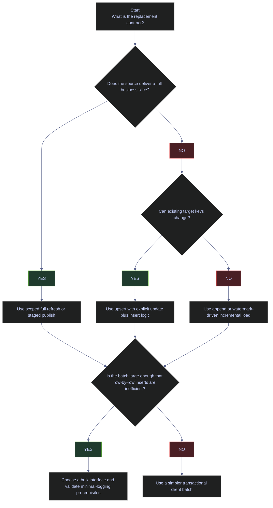

# SQL Server Loading Patterns

Loading patterns decide how data enters SQL Server safely, how much data is replaced on each run, and which interface should carry the bytes. In production, the main questions are:

- Is this a full replacement, an append, or an upsert
- Do you need a validation gate before publishing data
- Does the workload need row-by-row transactional control or raw bulk throughput
- Can the recovery model and target-table design support minimal logging

This note uses the live `stoxx` database for the baseline and then demonstrates the core SQL loading behaviors on disposable demo tables.

---

## Live Baseline

The right loading pattern depends on the real data shape. Small raw snapshots, multi-year market-history tables, and gold aggregates do not need the same load mechanics.

### Current table volumes across bronze, silver, and gold

#### Measure the live row counts of the main pipeline tables

[!info]-
This query inventories the current row counts of all user tables in the `bronze`, `silver`, and `gold` schemas.

- `sys.tables` and `sys.schemas` identify the user tables by schema.
- `sys.partitions` supplies persisted row counts for heap and clustered storage.
- `p.index_id IN (0,1)` limits the count to the base table storage, not every nonclustered index copy.
- Ordering by schema and descending row count shows which tables are operationally small snapshot loads and which ones are large historical tables that demand incremental or bulk-aware patterns.

*This query measures the live row counts of the main bronze, silver, and gold tables in `stoxx`.*

```sql
SELECT s.name AS schema_name,
       t.name AS table_name,
       SUM(p.rows) AS row_count
FROM sys.tables AS t
JOIN sys.schemas AS s
    ON s.schema_id = t.schema_id
JOIN sys.partitions AS p
    ON p.object_id = t.object_id
   AND p.index_id IN (0, 1)
WHERE s.name IN ('bronze', 'silver', 'gold')
GROUP BY s.name, t.name
ORDER BY schema_name, row_count DESC, table_name;
```

| schema_name | table_name | row_count |
|---|---|---:|
| `bronze` | `trading_calendar` | 29335 |
| `bronze` | `dim_country` | 212 |
| `bronze` | `index_dim` | 169 |
| `bronze` | `signals_daily` | 169 |
| `bronze` | `signals_quarterly` | 169 |
| `bronze` | `eurostoxx50_ohlcv` | 50 |
| `bronze` | `stoxxasia50_ohlcv` | 50 |
| `bronze` | `stoxxusa50_ohlcv` | 50 |
| `bronze` | `pulse` | 40 |
| `bronze` | `pulse_tickers` | 40 |
| `bronze` | `oil20_ohlcv` | 19 |
| `bronze` | `dim_index` | 4 |
| `gold` | `index_performance` | 5351 |
| `gold` | `scores_daily` | 635 |
| `gold` | `scores_quarterly` | 176 |
| `silver` | `eurostoxx50_ohlcv` | 67155 |
| `silver` | `stoxxusa50_ohlcv` | 66000 |
| `silver` | `stoxxasia50_ohlcv` | 64875 |
| `silver` | `oil20_ohlcv` | 25080 |
| `silver` | `signals_daily` | 635 |
| `silver` | `signals_quarterly` | 188 |
| `silver` | `index_dim` | 169 |

_This inventory shows why one loading rule is not enough. `bronze.signals_daily` is a tiny current-day snapshot, while `silver.eurostoxx50_ohlcv` already holds more than 67K rows of market history. The first can tolerate scoped full replacement; the second should not be reloaded casually from scratch on every run._

#### Inspect the most recent bronze snapshot arrival

[!info]-
This query previews the latest raw snapshot arrivals in `bronze.signals_daily`.

- `_index`, `symbol`, and `CAST([timestamp] AS date)` identify the business slice of the batch.
- `_ingested_at` shows when SQL Server received the rows.
- Ordering by `_ingested_at DESC, id DESC` surfaces the newest landed rows first.

*This query previews the latest ingested bronze daily-signal rows so the reader can see the actual raw-batch shape that the load patterns must handle.*

```sql
SELECT TOP (12)
       _index,
       symbol,
       CAST([timestamp] AS date) AS signal_date,
       _ingested_at
FROM bronze.signals_daily
ORDER BY _ingested_at DESC, id DESC;
```

| _index | symbol | signal_date | _ingested_at |
|---|---|---|---|
| `stoxx_usa_50` | `UBER` | 2026-04-08 | 2026-04-07 23:29:57.3039180 |
| `stoxx_usa_50` | `CRM` | 2026-04-08 | 2026-04-07 23:29:57.3039180 |
| `stoxx_usa_50` | `VZ` | 2026-04-08 | 2026-04-07 23:29:57.3039180 |
| `stoxx_usa_50` | `AXP` | 2026-04-08 | 2026-04-07 23:29:57.3039180 |
| `stoxx_usa_50` | `IBM` | 2026-04-08 | 2026-04-07 23:29:57.3039180 |
| `stoxx_usa_50` | `INTC` | 2026-04-08 | 2026-04-07 23:29:57.3039180 |
| `stoxx_usa_50` | `PEP` | 2026-04-08 | 2026-04-07 23:29:57.3039180 |
| `stoxx_usa_50` | `LIN` | 2026-04-08 | 2026-04-07 23:29:57.3039180 |
| `stoxx_usa_50` | `TMUS` | 2026-04-08 | 2026-04-07 23:29:57.3039180 |
| `stoxx_usa_50` | `MCD` | 2026-04-08 | 2026-04-07 23:29:57.3039180 |
| `stoxx_usa_50` | `WFC` | 2026-04-08 | 2026-04-07 23:29:57.3039180 |
| `stoxx_usa_50` | `GS` | 2026-04-08 | 2026-04-07 23:29:57.3039180 |

_This is the shape of a snapshot-style landing batch: many business rows with the same ingest timestamp. That usually favors a staged or scoped full-replacement pattern instead of row-by-row mutation logic._

---

## Loading Decision Matrix

Loading method choice should be driven by replacement semantics first and tool choice second.

### Choose the pattern before the interface

| Pattern | What it does | Best Fit | Avoid When |
|---|---|---|---|
| Scoped full refresh | Delete one business slice and reload it completely | Small snapshot batches, partition-key slices, bronze landing tables | Large historical tables with expensive reprocessing |
| Staged validation and publish | Load into stage, validate, then promote | Any load where bad data must not reach the published table | Tiny throwaway test loads where no validation gate is needed |
| Upsert | Update existing keys and insert new keys | Gold or silver tables that combine new and changed rows | Raw snapshot feeds where replacement is simpler |
| Bulk import | Use `bcp`, `BULK INSERT`, `SqlBulkCopy`, or `fast_executemany` to move many rows efficiently | Historical backfills, large file loads, service-side batch ingestion | Tiny micro-batches where tool startup dominates |

### Follow the production decision path



---

## Scoped Full Refresh

Scoped full refresh is the safest pattern when the source hands you a complete replacement for one business slice, such as one `_index`, one partition, or one reporting date.

### Replace one business slice inside a transaction

This is the default pattern for small snapshot landing tables.

#### Replace one `_index` slice atomically

[!warning]
A delete-plus-insert load without an explicit transaction can leave the target empty or partially refreshed if the process fails between steps.

[!success]
Wrap the delete and insert steps in a single transaction and scope the delete to the precise business slice being refreshed.

[!info]-
This batch creates a disposable target table, loads old rows, replaces only the `euro_stoxx_50` slice inside a transaction, returns the final state, and drops the demo table.

- The target table keeps only the business columns needed to show the pattern clearly.
- `DELETE ... WHERE _index = 'euro_stoxx_50'` scopes the replacement to one business slice instead of truncating the whole table.
- The new insert repopulates only the refreshed slice.
- The final `SELECT` shows both the replaced slice and the untouched slice.

*This batch demonstrates a scoped full refresh that replaces one business slice while leaving unrelated data untouched.*

```sql
IF OBJECT_ID('dbo.demo_full_refresh_target', 'U') IS NOT NULL
    DROP TABLE dbo.demo_full_refresh_target;

CREATE TABLE dbo.demo_full_refresh_target
(
    _index varchar(20) NOT NULL,
    symbol varchar(20) NOT NULL,
    signal_date date NOT NULL
);

INSERT INTO dbo.demo_full_refresh_target
VALUES ('euro_stoxx_50', 'OLD1', '2026-04-07'),
       ('euro_stoxx_50', 'OLD2', '2026-04-07'),
       ('stoxx_usa_50', 'MSFT', '2026-04-07');

BEGIN TRAN;

DELETE FROM dbo.demo_full_refresh_target
WHERE _index = 'euro_stoxx_50';

INSERT INTO dbo.demo_full_refresh_target(_index, symbol, signal_date)
VALUES ('euro_stoxx_50', 'ASML.AS', '2026-04-08'),
       ('euro_stoxx_50', 'AD.AS', '2026-04-08');

COMMIT;

SELECT _index, symbol, signal_date
FROM dbo.demo_full_refresh_target
ORDER BY _index, symbol;

DROP TABLE dbo.demo_full_refresh_target;
```

| _index | symbol | signal_date |
|---|---|---|
| `euro_stoxx_50` | `AD.AS` | 2026-04-08 |
| `euro_stoxx_50` | `ASML.AS` | 2026-04-08 |
| `stoxx_usa_50` | `MSFT` | 2026-04-07 |

_The refreshed slice now contains only the new `euro_stoxx_50` rows, while the unrelated `stoxx_usa_50` row survived untouched. That is exactly what a scoped full refresh is supposed to do._

---

## Staged Validation And Publish

Staged validation is the safest production default when bad data must never become visible in the published table. Load into stage first, validate business rules there, and promote only after the stage passes.

### Validate before publish

Use staged validation when the load must prove basic integrity before the published table is touched.

#### Load into stage, validate the batch, then publish it

[!warning]
Loading directly into the published table removes your validation gate. If the file has missing keys, unexpectedly low row counts, or a broken type conversion, the only recovery path is another write against the same table.

[!success]
Load into stage first, validate row count and business keys there, then promote the stage data in one controlled transaction.

[!info]-
This batch creates a disposable publish table and stage table, loads the stage, validates the batch, publishes it, returns the final published result, and drops both demo tables.

- The first insert seeds the published table with an older business date.
- The stage table receives the new `2026-04-08` batch.
- The two validation checks enforce a minimum row count and non-null business keys.
- The publish transaction inserts only after the stage has passed validation.

*This batch demonstrates a staged validation flow where the new batch is loaded, checked, and then promoted to the published table.*

```sql
IF OBJECT_ID('dbo.demo_stage_signals', 'U') IS NOT NULL
    DROP TABLE dbo.demo_stage_signals;

IF OBJECT_ID('dbo.demo_publish_signals', 'U') IS NOT NULL
    DROP TABLE dbo.demo_publish_signals;

CREATE TABLE dbo.demo_publish_signals
(
    symbol varchar(20) NOT NULL,
    signal_date date NOT NULL,
    score decimal(6,2) NOT NULL
);

CREATE TABLE dbo.demo_stage_signals
(
    symbol varchar(20) NOT NULL,
    signal_date date NOT NULL,
    score decimal(6,2) NOT NULL
);

INSERT INTO dbo.demo_publish_signals
VALUES ('ASML.AS', '2026-04-07', 77.50),
       ('AD.AS', '2026-04-07', 66.10);

INSERT INTO dbo.demo_stage_signals
VALUES ('ASML.AS', '2026-04-08', 80.25),
       ('AD.AS', '2026-04-08', 68.90),
       ('ABI.BR', '2026-04-08', 71.30);

IF (SELECT COUNT(*) FROM dbo.demo_stage_signals) < 3
    THROW 50001, 'Stage row count below expected threshold', 1;

IF EXISTS (
    SELECT 1
    FROM dbo.demo_stage_signals
    WHERE symbol IS NULL OR signal_date IS NULL
)
    THROW 50002, 'Stage contains NULL business keys', 1;

BEGIN TRAN;

DELETE FROM dbo.demo_publish_signals
WHERE signal_date = '2026-04-08';

INSERT INTO dbo.demo_publish_signals(symbol, signal_date, score)
SELECT symbol, signal_date, score
FROM dbo.demo_stage_signals;

COMMIT;

SELECT symbol, signal_date, score
FROM dbo.demo_publish_signals
ORDER BY signal_date, symbol;

DROP TABLE dbo.demo_stage_signals;
DROP TABLE dbo.demo_publish_signals;
```

| symbol | signal_date | score |
|---|---|---:|
| `AD.AS` | 2026-04-07 | 66.10 |
| `ASML.AS` | 2026-04-07 | 77.50 |
| `ABI.BR` | 2026-04-08 | 71.30 |
| `AD.AS` | 2026-04-08 | 68.90 |
| `ASML.AS` | 2026-04-08 | 80.25 |

_The old published date stays intact, and the new date becomes visible only after the stage passed both validation checks. That is the core operational value of staged loading: validation failure happens before the published table is altered._

---

## Upsert

Upsert is the right pattern when the incoming batch mixes brand-new business keys with keys that already exist and need to be updated.

### Prefer explicit update-plus-insert logic over blind `MERGE`

The safest production default in SQL Server is usually two explicit steps: update the matched rows, then insert the unmatched rows.

#### Update existing keys and insert new keys

[!warning]
Blind `MERGE` statements are easy to write badly and can introduce race conditions or surprising behavior under concurrency if the join keys and locking strategy are not carefully designed.

[!success]
For most ETL workloads, prefer a separate `UPDATE` joined to stage followed by an `INSERT ... WHERE NOT EXISTS` for the unmatched rows. It is easier to reason about and easier to test.

[!info]-
This batch creates a disposable target table and stage table, updates a matching row, inserts a new row, returns the final target contents, and drops the demo tables.

- `ASML.AS` already exists in the target and is updated to the new business date and score.
- `ABI.BR` exists only in stage and is inserted.
- `AD.AS` remains unchanged because it is absent from the stage batch.

*This batch demonstrates the standard production upsert pattern: update matched rows first, then insert the unmatched rows.*

```sql
IF OBJECT_ID('dbo.demo_upsert_stage', 'U') IS NOT NULL
    DROP TABLE dbo.demo_upsert_stage;

IF OBJECT_ID('dbo.demo_upsert_target', 'U') IS NOT NULL
    DROP TABLE dbo.demo_upsert_target;

CREATE TABLE dbo.demo_upsert_target
(
    symbol varchar(20) NOT NULL PRIMARY KEY,
    score_date date NOT NULL,
    composite_score decimal(8,4) NOT NULL
);

CREATE TABLE dbo.demo_upsert_stage
(
    symbol varchar(20) NOT NULL,
    score_date date NOT NULL,
    composite_score decimal(8,4) NOT NULL
);

INSERT INTO dbo.demo_upsert_target
VALUES ('ASML.AS', '2026-04-07', 0.2210),
       ('AD.AS', '2026-04-07', 0.1815);

INSERT INTO dbo.demo_upsert_stage
VALUES ('ASML.AS', '2026-04-08', 0.3050),
       ('ABI.BR', '2026-04-08', 0.2640);

UPDATE t
SET t.score_date = s.score_date,
    t.composite_score = s.composite_score
FROM dbo.demo_upsert_target AS t
JOIN dbo.demo_upsert_stage AS s
    ON s.symbol = t.symbol;

INSERT INTO dbo.demo_upsert_target(symbol, score_date, composite_score)
SELECT s.symbol, s.score_date, s.composite_score
FROM dbo.demo_upsert_stage AS s
WHERE NOT EXISTS (
    SELECT 1
    FROM dbo.demo_upsert_target AS t
    WHERE t.symbol = s.symbol
);

SELECT symbol, score_date, composite_score
FROM dbo.demo_upsert_target
ORDER BY symbol;

DROP TABLE dbo.demo_upsert_stage;
DROP TABLE dbo.demo_upsert_target;
```

| symbol | score_date | composite_score |
|---|---|---:|
| `ABI.BR` | 2026-04-08 | 0.2640 |
| `AD.AS` | 2026-04-07 | 0.1815 |
| `ASML.AS` | 2026-04-08 | 0.3050 |

_`ASML.AS` was updated, `ABI.BR` was inserted, and `AD.AS` remained untouched. That is the exact behavior an upsert should deliver when the stage batch contains only changed and new keys._

---

## Bulk-Load Interfaces

Once the replacement semantics are clear, choose the byte-moving interface. The goal is not to use the most powerful tool everywhere; it is to use the simplest tool that still meets throughput and operational needs.

### Choose the interface by runtime boundary

| Interface | Runtime Boundary | Transaction Control | Best Fit | Tradeoff |
|---|---|---|---|---|
| Table-valued parameter | Client-to-procedure boundary | Strong inside one routine | Medium-size in-memory batches passed to one stored procedure | `READONLY`, no column statistics, not a raw-file loader |
| `pyodbc` with `fast_executemany` | Python process | Good | Python batch pipelines | Still client-driven, not the fastest raw file loader |
| `bcp` | Command-line utility | Limited relative to client-side transaction patterns | Large file loads and backfills | Extra file-handling and operational wrapper logic |
| `BULK INSERT` | T-SQL inside SQL Server | Strong database-side control | Server-visible files and SQL-driven loads | File access and SQL Server service permissions matter |
| `OPENROWSET(BULK...)` | T-SQL `INSERT ... SELECT` pipeline | Strong database-side control | File-backed loads that need format mapping or bulk-only hints inside a query | Same server-side path and permission constraints as `BULK INSERT` |
| `SqlBulkCopy` | .NET process | Good | C# services and batch jobs | .NET-specific integration path |

#### Use table-valued parameters for medium-size in-memory batches

[!warning]
Table-valued parameters are not a general-purpose bulk-load replacement. They are `READONLY`, SQL Server does not maintain statistics on their columns, and plan quality can degrade when the batch is much larger than the routine was designed for.

[!success]
Use a TVP when the caller already has the rows in memory, the load naturally belongs to one stored procedure boundary, and the batch is usually in the low-thousands or smaller. Microsoft documentation explicitly calls out TVPs as a strong fit for inserts under roughly 1,000 rows, while larger file-style loads usually belong on `bcp`, `BULK INSERT`, `OPENROWSET(BULK...)`, or `SqlBulkCopy`.

[!info]-
This batch demonstrates the full TVP pattern on disposable objects.

- `CREATE TYPE dbo.ScoreBatchType AS TABLE (...)` defines the user-defined table type that the caller will populate.
- `PRIMARY KEY (symbol, score_date)` gives the TVP a deterministic key and lets the receiving procedure reason about duplicates.
- `CREATE PROCEDURE ... @rows dbo.ScoreBatchType READONLY` is the core TVP contract. SQL Server requires TVPs to be input-only and `READONLY`.
- The procedure inserts the incoming set into a disposable target table and immediately returns the landed rows so the pattern has real visible output.
- The cleanup step drops the procedure, type, and table so the example leaves no permanent residue in `stoxx`.

*This batch creates a disposable table type and stored procedure, passes three rows through a table-valued parameter, returns the landed rows, and cleans up all demo objects.*

```sql
IF OBJECT_ID('dbo.usp_demo_load_scores_from_tvp', 'P') IS NOT NULL
    DROP PROCEDURE dbo.usp_demo_load_scores_from_tvp;
IF TYPE_ID('dbo.ScoreBatchType') IS NOT NULL
    DROP TYPE dbo.ScoreBatchType;
IF OBJECT_ID('dbo.demo_tvp_target', 'U') IS NOT NULL
    DROP TABLE dbo.demo_tvp_target;

CREATE TABLE dbo.demo_tvp_target
(
    symbol varchar(20) NOT NULL,
    score_date date NOT NULL,
    composite_score decimal(9,4) NOT NULL,
    CONSTRAINT PK_demo_tvp_target PRIMARY KEY (symbol, score_date)
);

CREATE TYPE dbo.ScoreBatchType AS TABLE
(
    symbol varchar(20) NOT NULL,
    score_date date NOT NULL,
    composite_score decimal(9,4) NOT NULL,
    PRIMARY KEY (symbol, score_date)
);
GO

CREATE PROCEDURE dbo.usp_demo_load_scores_from_tvp
    @rows dbo.ScoreBatchType READONLY
AS
BEGIN
    SET NOCOUNT ON;

    INSERT INTO dbo.demo_tvp_target(symbol, score_date, composite_score)
    SELECT symbol, score_date, composite_score
    FROM @rows;

    SELECT symbol, score_date, composite_score
    FROM dbo.demo_tvp_target
    ORDER BY symbol, score_date;
END;
GO

DECLARE @rows dbo.ScoreBatchType;

INSERT INTO @rows(symbol, score_date, composite_score)
VALUES ('ABI.BR', '2026-04-08', 0.2640),
       ('AD.AS', '2026-04-08', 0.1815),
       ('ASML.AS', '2026-04-08', 0.3050);

EXEC dbo.usp_demo_load_scores_from_tvp @rows = @rows;
GO

DROP PROCEDURE dbo.usp_demo_load_scores_from_tvp;
DROP TYPE dbo.ScoreBatchType;
DROP TABLE dbo.demo_tvp_target;
```

| symbol | score_date | composite_score |
|---|---|---:|
| `ABI.BR` | 2026-04-08 | 0.2640 |
| `AD.AS` | 2026-04-08 | 0.1815 |
| `ASML.AS` | 2026-04-08 | 0.3050 |

_This is the exact TVP shape SQL Server is good at: one in-memory batch enters the engine once, arrives in a stored procedure as a set, and is inserted without a client loop. The result is not a raw-loader benchmark; it is a cleaner contract for medium-size batches that belong inside one routine call._

#### Use `pyodbc` batch mode in Python

[!info]-
This Python snippet activates `fast_executemany`, which makes `executemany()` send batched parameter arrays instead of issuing one network round-trip per row.

*This Python snippet enables `fast_executemany` so a Python loader sends batched rows efficiently to SQL Server.*

```python
cursor.fast_executemany = True

cursor.executemany(
    """
    INSERT INTO bronze.signals_daily (_index, symbol, [timestamp], current_price)
    VALUES (?, ?, ?, ?)
    """,
    rows,
)
```

#### Use `bcp` for large file-based loads

[!warning]
`bcp` is fast, but it is operationally sharp. File encoding, field terminators, error files, and SQL Server service access all matter. It is the wrong tool if you need fine-grained row-by-row business validation before the load.

[!success]
Use `bcp` for large backfills or raw file loads where throughput matters most, and pair it with an error file and pre-load validation of file shape and column widths.

[!info]-
This command loads a delimited file directly into a SQL Server table from the command line.

- `in` tells `bcp` to import into SQL Server.
- `-c` uses character mode.
- `-t` and `-r` define field and row terminators.
- `-e` writes rejected rows to an error file.

*This `bcp` command imports a delimited file into a SQL Server landing table and captures rejected rows separately.*

```powershell
bcp bronze.signals_daily in signals_daily.csv `
  -S localhost,1434 `
  -d stoxx `
  -U sa `
  -c `
  -t "," `
  -r "\n" `
  -e signals_daily.err
```

#### Use `BULK INSERT` when SQL Server can see the file directly

[!warning]
`BULK INSERT` runs inside SQL Server, so file accessibility is determined by the SQL Server service account and server-side path visibility, not by the client running SSMS.

[!success]
Use `BULK INSERT` when the file is already available to the SQL Server host and you want the load to stay inside a SQL transaction or stored procedure boundary.

[!info]-
This command loads a server-visible CSV file into a target table from T-SQL.

- `FIELDTERMINATOR` and `ROWTERMINATOR` define the file layout.
- `FIRSTROW = 2` skips the header row.
- `TABLOCK` can help eligible loads reach a faster bulk path.

*This `BULK INSERT` command loads a server-visible CSV file directly from T-SQL into a target table.*

```sql
BULK INSERT bronze.signals_daily
FROM '/var/opt/sqlserver/load/signals_daily.csv'
WITH
(
    FORMAT = 'CSV',
    FIRSTROW = 2,
    FIELDTERMINATOR = ',',
    ROWTERMINATOR = '\n',
    TABLOCK
);
```

#### Use `OPENROWSET(BULK...)` when the load must stay inside an `INSERT ... SELECT` pipeline

[!warning]
`OPENROWSET(BULK...)` has the same server-side file visibility and security constraints as `BULK INSERT`. If SQL Server cannot read the file directly, the load fails even if the client running SSMS can see the path.

[!success]
Use `OPENROWSET(BULK...)` when the load needs to stay inside a relational `INSERT ... SELECT` pattern, when a format file or external projection logic is part of the design, or when you need bulk-only hints such as `KEEPIDENTITY`, `KEEPDEFAULTS`, `IGNORE_CONSTRAINTS`, or `IGNORE_TRIGGERS`.

[!info]-
This statement keeps the import inside a query pipeline instead of using a standalone `BULK INSERT` command.

- `OPENROWSET(BULK...)` exposes the file as a rowset source.
- `INSERT ... SELECT * FROM OPENROWSET(BULK...)` lets the load participate in larger set-based logic instead of existing as an isolated import statement.
- `TABLOCK` is shown because it is commonly paired with bulk loads when the operational goal is maximum throughput and the table can tolerate the lock.
- `KEEPIDENTITY` and `KEEPDEFAULTS` are representative bulk-only hints documented by Microsoft for this pattern.

*This statement uses `OPENROWSET(BULK...)` to keep a file-backed import inside an `INSERT ... SELECT` pipeline.*

```sql
INSERT INTO bronze.signals_daily WITH (TABLOCK, KEEPDEFAULTS, KEEPIDENTITY)
(
    _index,
    symbol,
    [timestamp],
    current_price
)
SELECT *
FROM OPENROWSET(
        BULK '/var/opt/sqlserver/load/signals_daily.csv',
        FORMAT = 'CSV',
        FIRSTROW = 2
     ) WITH
     (
        _index varchar(20),
        symbol varchar(20),
        [timestamp] datetime2(7),
        current_price float
     ) AS src;
```

#### Use `SqlBulkCopy` in .NET services

[!info]-
`SqlBulkCopy` is the native .NET bulk-load API. It streams rows from memory or a data reader into SQL Server efficiently without writing a file to disk first.

*This C# snippet streams a `DataTable` into SQL Server with `SqlBulkCopy` inside a .NET process.*

```csharp
using var bulk = new SqlBulkCopy(connectionString)
{
    DestinationTableName = "bronze.signals_daily",
    BatchSize = 5000
};

bulk.WriteToServer(dataTable);
```

---

## Minimal Logging

Minimal logging reduces transaction-log overhead for eligible bulk operations, but it is a recovery decision as much as a performance decision.

### Validate the recovery tradeoff before chasing log savings

Minimal logging is attractive because it reduces log volume during large loads. It is not attractive if the business requires point-in-time recovery through the load window and the recovery model change is not acceptable.

#### Inspect the current recovery posture before planning a minimally logged load

[!info]-
This query checks the current database-level prerequisites that influence the minimal-logging discussion.

- `recovery_model_desc` is the main field. In SQL Server, bulk imports are fully logged under `FULL` recovery and can be minimally logged only when the documented prerequisites are met under `SIMPLE` or `BULK_LOGGED`.
- `compatibility_level` does not determine logging mode by itself, but it confirms the engine surface the database is running under.
- `is_read_committed_snapshot_on` is not a minimal-logging prerequisite, but it matters operationally because large bulk loads often run alongside readers and writers. It helps frame the broader concurrency tradeoff.

*This query checks the live recovery model and row-versioning posture of `stoxx` before any minimal-logging decision.*

```sql
SELECT d.name AS database_name,
       d.recovery_model_desc,
       d.compatibility_level,
       d.is_read_committed_snapshot_on
FROM sys.databases AS d
WHERE d.name = 'stoxx';
```

| database_name | recovery_model_desc | compatibility_level | is_read_committed_snapshot_on |
|---|---|---:|---:|
| `stoxx` | `FULL` | 160 | 0 |

_`stoxx` is currently in the `FULL` recovery model, so a bulk import here is not automatically eligible for minimal logging. Any minimal-logging design would first need an explicit recovery-model decision, a log-backup plan, and table-level validation that the load path actually qualifies for the fast path._

| Column | Value | Watch | Meaning | Implication |
|---|---|---|---|---|
| `recovery_model_desc` | `FULL` | &#10060; for minimal logging | Point-in-time recovery is available, but row-insert bulk operations are fully logged. | Large bulk loads can grow the transaction log quickly unless the recovery posture is changed intentionally. |
| `recovery_model_desc` | `BULK_LOGGED` | &#9989; for eligible bulk windows | Bulk operations can use reduced logging when the table and lock prerequisites are also satisfied. | Common temporary posture for warehouse-style backfills that still want log-backup continuity. |
| `recovery_model_desc` | `SIMPLE` | &#9989; for eligible reloadable databases | Log truncation is simpler and eligible bulk imports can be minimally logged. | Appropriate only when point-in-time recovery is not required. |
| `is_read_committed_snapshot_on` | `0` | Context-dependent | Readers still use locking read committed by default. | Bulk windows can create more visible reader/writer interaction if workloads overlap. |
| `is_read_committed_snapshot_on` | `1` | Context-dependent | Read committed readers use row versions. | Often reduces read blocking during bulk windows, but it is not a logging prerequisite. |

The official Microsoft prerequisites are stricter than "switch to `BULK_LOGGED` and add `TABLOCK`". Use the following rule matrix before calling a load minimally logged:

| Condition | What to watch for | Why it matters |
|---|---|---|
| Recovery model | `SIMPLE` or `BULK_LOGGED` during the load window | Under `FULL`, row-insert bulk operations are fully logged. |
| Table lock | `TABLOCK` on the bulk operation | Microsoft documents `TABLOCK` as part of the qualifying pattern for fast bulk import. |
| Replication | Table not replicated | When transactional replication is enabled, `BULK INSERT` is fully logged even under `BULK_LOGGED`. |
| Target structure | Heap, empty clustered table, or other documented eligible state | Empty and non-empty rowstore tables do not log the same way. |
| Existing indexes | Nonclustered and clustered indexes checked explicitly | Empty indexed tables can bulk-log both data and index pages for the first batch; non-empty indexed tables often force fully logged index-page work. |
| Batch pattern | First batch versus later batches on an empty table | Microsoft notes that later batches may stop minimally logging index pages even when the first batch qualified. |
| File order | Input presorted by clustering or partition key when feasible | Chroma guidance from `The Data Warehouse Toolkit.epub` highlights that presorted files reduce post-load indexing work and help sustained throughput. |

#### Use minimally logged bulk imports only when the recovery plan allows it

[!warning]
Minimal logging is not a free speed flag. Recovery model, target-table state, locking choices, and the exact operation type all influence whether SQL Server can use the fast path. It also changes restore and recovery implications.

[!success]
Treat minimal logging as an explicit operational decision. Use it for large warehouse-style loads when the recovery model and restore objectives permit it, then return to the normal recovery posture if the database usually runs in full recovery.

[!info]-
These statements show the common recovery-model transition around a bulk-load window.

- `SET RECOVERY BULK_LOGGED` reduces logging for eligible bulk operations while preserving broader backup semantics than `SIMPLE`.
- The second statement returns the database to `FULL` after the bulk-load window.

*These statements show the short-term recovery-model change commonly used around eligible minimally logged bulk-load windows.*

```sql
ALTER DATABASE stoxx SET RECOVERY BULK_LOGGED;
GO

-- Perform the eligible bulk load here.

ALTER DATABASE stoxx SET RECOVERY FULL;
GO
```

---

## Anti-Patterns

These are the loading mistakes that keep showing up in production systems.

### Row-by-row client inserts for large batches

That creates unnecessary network round-trips and turns loading into a chatty OLTP pattern instead of a batch operation.

### Loading directly into the published table with no validation gate

That removes the safest failure boundary. A bad file becomes a production data problem immediately.

### Delete-plus-insert without an explicit transaction

That exposes partial refresh states if the process dies between statements.

### Using upsert where scoped replacement is simpler

If the source delivers a complete business slice, upsert logic adds complexity with no benefit.

### Assuming minimal logging is always available

SQL Server only uses the faster logging path when the operation and table state qualify. Recovery implications must be acceptable too.

### Treating `bcp` or `BULK INSERT` as business-validation tools

They are byte movers, not full validation frameworks. Validate the data shape before or immediately after the load.

---

## Current Recommendation For `stoxx`

The current `stoxx` workload supports a clear production pattern:

- keep using scoped full refresh or staged publish for small bronze snapshot slices such as `signals_daily`
- keep historical silver OHLCV tables on incremental or bulk-aware load paths instead of full-table replacement
- use explicit update-plus-insert upsert logic for gold tables that mix changed and new keys
- use TVPs when the caller already holds a medium-size rowset in memory and the natural contract is one stored procedure call
- choose `fast_executemany`, `SqlBulkCopy`, `bcp`, `BULK INSERT`, or `OPENROWSET(BULK...)` based on runtime boundary and operational control, not by habit
- treat minimal logging as a DBA-level recovery decision, not as an always-on tuning trick

---

## Related

- [[sql-server-incremental-transforms]]
- [[sql-server-change-tracking]]
- [[sql-server-schema-layering]]
- [[sql-server-pipeline-anti-patterns]]
- [[bronze-layer-loading]]
- [[silver-transforms]]
- [[gold-transforms]]

## References

- Microsoft Learn: [BULK INSERT (Transact-SQL)](https://learn.microsoft.com/en-us/sql/t-sql/statements/bulk-insert-transact-sql)
- Microsoft Learn: [Use table-valued parameters (Database Engine)](https://learn.microsoft.com/en-us/sql/relational-databases/tables/use-table-valued-parameters-database-engine)
- Microsoft Learn: [Import and export bulk data using bcp](https://learn.microsoft.com/en-us/sql/tools/bcp-utility)
- Microsoft Learn: [Use BULK INSERT or OPENROWSET(BULK...) to import data](https://learn.microsoft.com/en-us/sql/relational-databases/import-export/import-bulk-data-by-using-bulk-insert-or-openrowset-bulk-sql-server)
- Microsoft Learn: [SqlBulkCopy class](https://learn.microsoft.com/en-us/dotnet/api/system.data.sqlclient.sqlbulkcopy)
- Microsoft Learn: [Prerequisites for minimal logging in bulk import](https://learn.microsoft.com/en-us/sql/relational-databases/import-export/prerequisites-for-minimal-logging-in-bulk-import)
- ChromaDB supporting context:
  - `Pro SQL Server 2022 Administration, Third Edition A Guide for the Modern DBA.pdf`
  - `The Data Warehouse Toolkit.epub`
  - `Analytics Engineering with SQL and dbt Building Meaningful Data Models at Scale.pdf`
