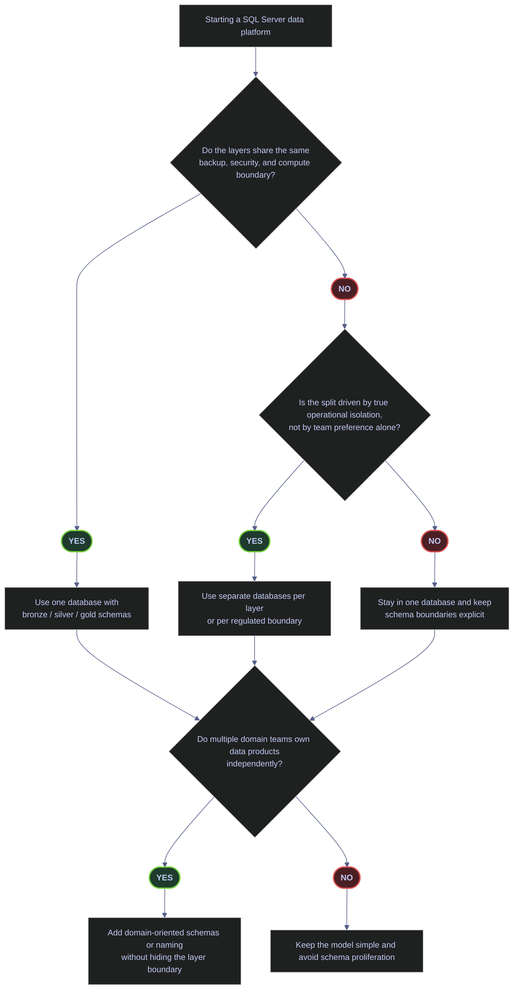

# SQL Server Schema Layering — Organizing Databases for Data Pipelines

Schema design is not cosmetic in SQL Server. It decides:

- how clearly readers can tell raw, transformed, and published data apart
- whether permissions can be granted once at the schema level or must be managed table by table
- whether operational boundaries stay obvious as the pipeline grows
- whether the database accumulates `dbo` sprawl that becomes impossible to secure cleanly

For most SQL Server pipeline systems, the best default is still simple: one database, one schema per layer, and schema-level permissions. The main reason to deviate is an operational requirement, not aesthetics.



## Live Baseline

The current `stoxx` database already shows why schema layering matters. It has a real `bronze / silver / gold` backbone, but it also has a large `dbo` surface carrying demos, support tables, and mixed-purpose objects.

### Current schema footprint in `stoxx`

[!info]-
This query summarizes the live schema layout.

- `schema_owner` shows who owns the schema.
- `table_count` shows how many tables live in that schema.
- `total_rows` gives rough workload scale per schema.
- `demo_table_count` highlights how much of a schema is documentation or lab residue rather than production data.
- `explicit_schema_permission_rows` counts schema-level permission rows in `sys.database_permissions`.

*Inspect the live schema distribution before choosing a layering strategy.*

```sql
SELECT
    s.name AS schema_name,
    USER_NAME(s.principal_id) AS schema_owner,
    COUNT(DISTINCT t.object_id) AS table_count,
    COALESCE(SUM(CASE WHEN p.index_id IN (0,1) THEN p.rows END), 0) AS total_rows,
    SUM(CASE WHEN t.name LIKE 'demo[_]%' THEN 1 ELSE 0 END) AS demo_table_count,
    SUM(CASE WHEN dp.class = 3 THEN 1 ELSE 0 END) AS explicit_schema_permission_rows
FROM sys.schemas AS s
LEFT JOIN sys.tables AS t
  ON s.schema_id = t.schema_id
LEFT JOIN sys.partitions AS p
  ON t.object_id = p.object_id
LEFT JOIN sys.database_permissions AS dp
  ON dp.class = 3
 AND dp.major_id = s.schema_id
WHERE s.name IN ('dbo','bronze','silver','gold')
GROUP BY s.name, s.principal_id
ORDER BY CASE s.name
    WHEN 'bronze' THEN 1
    WHEN 'silver' THEN 2
    WHEN 'gold' THEN 3
    WHEN 'dbo' THEN 4
    ELSE 5
END;
```

| schema_name | schema_owner | table_count | total_rows | demo_table_count | explicit_schema_permission_rows |
|---|---|---:|---:|---:|---:|
| `bronze` | `dbo` | 12 | 30307 | 0 | 0 |
| `silver` | `dbo` | 7 | 224102 | 0 | 0 |
| `gold` | `dbo` | 3 | 6162 | 0 | 0 |
| `dbo` | `dbo` | 19 | 1703099 | 14 | 0 |

_This is a good live example of a mostly-correct layered design with one clear weakness. `bronze`, `silver`, and `gold` exist and already carry the real medallion flow. But `dbo` is still the largest schema by row count and contains `14` demo tables. In a production system, that is a governance smell: `dbo` should not become the place where unrelated operational, demo, and fallback objects accumulate indefinitely._

| Column | Value | Watch | Meaning | Implication |
|---|---|---|---|---|
| `bronze / silver / gold` all present | &#9989; | Layer boundary exists explicitly. | Good foundation for security and operational clarity. |
| `dbo.table_count` high | &#10060; in a production warehouse | Mixed-purpose objects are accumulating outside the layer model. | Harder security model and weaker discoverability. |
| `demo_table_count > 0` in `dbo` | Depends | Demo and lab residue live in the default schema. | Acceptable for a dev sandbox, not ideal as a long-term production pattern. |
| `explicit_schema_permission_rows = 0` | Depends | No explicit schema-level grants currently exist. | The model is ready for schema-based security, but it is not using it yet. |

### Representative table layout by schema

[!info]-
This query shows how the live tables actually map onto the layers.

- `bronze` contains small raw landings and lookup tables.
- `silver` contains the large cleaned OHLCV tables.
- `gold` contains compact published analytics tables.

This is the strongest practical argument for schema-per-layer: the business meaning of the object is visible in the fully qualified name before you even open the definition.

*Inspect representative table placement across the live schemas.*

```sql
WITH row_counts AS (
    SELECT
        s.name AS schema_name,
        t.name AS table_name,
        SUM(p.rows) AS row_count
    FROM sys.tables AS t
    JOIN sys.schemas AS s
      ON t.schema_id = s.schema_id
    JOIN sys.partitions AS p
      ON t.object_id = p.object_id
     AND p.index_id IN (0,1)
    WHERE s.name IN ('bronze','silver','gold','dbo')
    GROUP BY s.name, t.name
)
SELECT TOP (20)
    schema_name,
    table_name,
    row_count
FROM row_counts
ORDER BY CASE schema_name
    WHEN 'bronze' THEN 1
    WHEN 'silver' THEN 2
    WHEN 'gold' THEN 3
    WHEN 'dbo' THEN 4
    ELSE 5
END,
row_count DESC,
table_name;
```

| schema_name | table_name | row_count |
|---|---|---:|
| `bronze` | `trading_calendar` | 29335 |
| `bronze` | `dim_country` | 212 |
| `bronze` | `index_dim` | 169 |
| `bronze` | `signals_daily` | 169 |
| `bronze` | `signals_quarterly` | 169 |
| `bronze` | `eurostoxx50_ohlcv` | 50 |
| `bronze` | `stoxxasia50_ohlcv` | 50 |
| `bronze` | `stoxxusa50_ohlcv` | 50 |
| `bronze` | `pulse` | 40 |
| `bronze` | `pulse_tickers` | 40 |
| `bronze` | `oil20_ohlcv` | 19 |
| `bronze` | `dim_index` | 4 |
| `silver` | `eurostoxx50_ohlcv` | 67155 |
| `silver` | `stoxxusa50_ohlcv` | 66000 |
| `silver` | `stoxxasia50_ohlcv` | 64875 |
| `silver` | `oil20_ohlcv` | 25080 |
| `silver` | `signals_daily` | 635 |
| `silver` | `signals_quarterly` | 188 |
| `silver` | `index_dim` | 169 |
| `gold` | `index_performance` | 5351 |

_The live row counts align with the intended layer semantics. `bronze` is small and source-shaped, `silver` carries the larger cleaned history, and `gold` is compact and presentation-oriented. That is exactly the pattern schema-per-layer is supposed to make obvious._

## Schema-per-Layer (Default Recommendation)

For a single SQL Server database serving one pipeline system, schema-per-layer should be the default until a real operational boundary forces something else.

### Create one schema per layer

> [!example]
> Use this when the platform is one database with clear medallion-style stages and shared recovery, compute, and security boundaries.

[!info]-
This DDL creates the three layer schemas idempotently.

- `CREATE SCHEMA` must be the first statement in its batch.
- The `EXEC('CREATE SCHEMA ...')` wrapper is used so the existence check stays idempotent.
- The schema name becomes the namespace boundary for both querying and security.

*Create the standard medallion schemas in one database.*

```sql
IF NOT EXISTS (SELECT 1 FROM sys.schemas WHERE name = 'bronze')
    EXEC('CREATE SCHEMA bronze');
GO

IF NOT EXISTS (SELECT 1 FROM sys.schemas WHERE name = 'silver')
    EXEC('CREATE SCHEMA silver');
GO

IF NOT EXISTS (SELECT 1 FROM sys.schemas WHERE name = 'gold')
    EXEC('CREATE SCHEMA gold');
GO
```

Why this is still the best default:

- query intent is obvious: `silver.signals_daily` tells the reader more than `dbo.signals_daily`
- schema-level grants are simple and durable
- layer-wide review and cleanup become possible without parsing table prefixes
- moving later from schema-per-layer to a more elaborate variant is easier than cleaning up years of `dbo` sprawl

## Separate Databases per Layer

Use separate databases only when the split is driven by a real operational boundary: different recovery model, different admin domain, different compliance boundary, or different restore lifecycle.

[!warning]
Do not split layers into separate databases just because the names look tidy. Cross-database querying, deployment, testing, and ownership become more complex immediately.

[!success]
Use separate databases when you genuinely need different backup-chain behavior, restore isolation, or tenant/security boundaries that a single database cannot express cleanly.

### Example: different recovery models per layer

> [!example]
> This pattern is appropriate only when the layers truly have different restore expectations.

[!info]-
These commands express the main operational reason for separate databases: different recovery policies.

- `SIMPLE` is appropriate for re-loadable layers where point-in-time recovery is not required.
- `FULL` is appropriate when the layer must be recoverable to any point in time and the log-backup chain is part of the operational contract.

*Set different recovery models when the layers truly have different restore obligations.*

```sql
ALTER DATABASE bronze_db SET RECOVERY SIMPLE;
ALTER DATABASE silver_db SET RECOVERY FULL;
ALTER DATABASE gold_db   SET RECOVERY SIMPLE;
```

When to choose this:

- `bronze` is re-fetchable and does not need point-in-time recovery
- `silver` is historized and operationally valuable enough to justify `FULL`
- `gold` is fully rebuildable and does not justify a separate log-backup chain

When not to choose it:

- all layers live on the same host and same team with the same restore playbook
- the split exists only to imitate a lakehouse folder pattern
- the team is not prepared to manage cross-database deployment and security explicitly

## Schema-per-Domain

Domain schemas are useful when teams genuinely own their data products end to end. They are not a substitute for layer boundaries; they are an ownership overlay.

### Example: domain-owned schemas

> [!example]
> Use this when different teams own their own data products and deployment lifecycle.

[!info]-
`AUTHORIZATION` sets the schema owner.

- The schema owner becomes the principal responsible for object ownership inside that schema.
- This is the cleanest SQL Server-native way to align schema boundaries with organizational boundaries.

*Create domain-owned schemas when ownership, not just transformation stage, is the main boundary.*

```sql
CREATE SCHEMA finance AUTHORIZATION finance_owner;
CREATE SCHEMA operations AUTHORIZATION ops_owner;
CREATE SCHEMA research AUTHORIZATION research_owner;
GO
```

Production rule:

- if you adopt domain schemas, keep the layer meaning visible in the object name or schema naming convention
- avoid hiding the layer entirely inside a domain-only namespace unless the team has a strong internal modeling discipline

Good patterns:

- `finance.bronze_trades`, `finance.silver_trades`, `finance.gold_positions`
- `finance_bronze`, `finance_silver`, `finance_gold` when ownership clarity matters more than compact naming

## Schema-per-Source for Staging

This is a staging-only pattern. It is useful when multiple upstream systems land with different refresh schedules, data quality quirks, or file formats.

### Example: source-scoped staging schemas

> [!example]
> Use source-scoped staging only for the source-facing edge of the pipeline, not for the whole warehouse model.

[!info]-
Each source gets its own isolated landing namespace.

- the schema boundary isolates source-specific column names and ingestion quirks
- the downstream contract is still to normalize into a common `bronze` surface

*Create dedicated staging schemas when many upstream sources land independently.*

```sql
CREATE SCHEMA stg_yfinance;
CREATE SCHEMA stg_bloomberg;
CREATE SCHEMA stg_manual;
GO
```

Recommended flow:

- `stg_*` for source-specific landings
- `bronze.*` for normalized raw persistence
- `silver.*` for cleaned and deduplicated business-ready tables
- `gold.*` for published analytics or serving tables

## Control, Audit, And Contract Schemas

Layer schemas explain data maturity, but they do not solve every architectural boundary. Production platforms also need a place for pipeline control state, quality events, and stable consumer contracts. Those objects should not be scattered through `dbo`, and they should not be mixed into `bronze`, `silver`, or `gold` when they serve a different operational purpose.

### Check whether dedicated control-plane schemas already exist

[!info]-
This query checks for five common supporting schemas that many production platforms eventually adopt.

- `meta` or `control` usually stores watermarks, run ledgers, dependency state, and schema contracts.
- `audit` or `history` usually stores quality events, reconciliation findings, or explicit audit surfaces.
- `contract` is useful when stable views or synonyms need to shield consumers from physical table churn.
- `SCHEMA_ID(...) IS NULL` returns `0` for a missing schema and `1` for an existing one, which makes the output easy to read as a readiness checklist.

*This query checks whether `stoxx` currently has dedicated control, audit, history, or contract schemas.*

```sql
SELECT CASE WHEN SCHEMA_ID('meta') IS NULL THEN 0 ELSE 1 END AS meta_schema_exists,
       CASE WHEN SCHEMA_ID('control') IS NULL THEN 0 ELSE 1 END AS control_schema_exists,
       CASE WHEN SCHEMA_ID('audit') IS NULL THEN 0 ELSE 1 END AS audit_schema_exists,
       CASE WHEN SCHEMA_ID('history') IS NULL THEN 0 ELSE 1 END AS history_schema_exists,
       CASE WHEN SCHEMA_ID('contract') IS NULL THEN 0 ELSE 1 END AS contract_schema_exists;
```

| meta_schema_exists | control_schema_exists | audit_schema_exists | history_schema_exists | contract_schema_exists |
|---:|---:|---:|---:|---:|
| 0 | 0 | 0 | 0 | 0 |

_`stoxx` currently has none of these supporting schemas, which keeps the model simple but also means there is no explicit home yet for control tables, quality events, or stable consumer-facing abstractions. If the platform grows beyond a single-admin sandbox, this absence becomes an architectural decision rather than a neutral default._

### Add a `meta` or `control` schema for pipeline state

The control plane of a data platform is not the same thing as the data layers. A `meta` or `control` schema is where the platform stores state about the pipeline itself rather than business data flowing through the pipeline.

Typical contents:

| Object family | Typical contents | Why it belongs outside `bronze / silver / gold` |
|---|---|---|
| Watermarks | Last successful processed date, LSN, or rowversion per pipeline step | It describes pipeline progress, not business data |
| Run ledger | Run IDs, start/end time, row counts, status, error summary | It is operational history for the ETL system |
| Schema contracts | Expected source columns, allowed type changes, approval state | It governs writes rather than serving analytics directly |
| Quality events | Failed checks, offending keys, reconciliation results | It is back-room operational evidence, not end-user gold data |

Production recommendation:

- start with one `meta` or `control` schema, not many micro-schemas
- keep pipeline state tables narrow, append-friendly, and clearly separated from analytical models
- do not let control tables accumulate in `dbo`, because they become impossible to distinguish from true business tables later

### Separate audit or history surfaces from the core medallion flow

An `audit` or `history` schema is useful when the platform must expose retained operational evidence or explicit history surfaces that are not the same as the medallion layers.

Use it for:

- quality and reconciliation events that need retention
- curated access to temporal history or CDC-facing helper objects
- legal or operational audit tables that should not sit beside the published gold model

Avoid it when:

- the only reason is aesthetic symmetry
- the history is already handled correctly inside a table's own design, such as a well-scoped temporal or SCD2 table

### Expose stable contract views when physical tables keep evolving

A `contract` schema is often the cleanest answer when consumer-facing names must stay stable while the underlying tables continue to evolve.

Good fits:

- views that preserve a public column contract while `silver` or `gold` tables are refactored
- synonyms or narrow views that hide source-system churn from downstream tools
- semantic serving surfaces that should not expose internal helper columns such as `_batch_id` or `_ingested_at`

This is not a replacement for `gold`. The pattern is:

- `gold` stores the published physical model
- `contract` exposes the stable consumer-facing abstraction when that extra decoupling is justified

## Naming and Metadata Rules

Schema design fails when the naming inside the schema is inconsistent.

Recommended defaults:

- keep table names business-oriented, not tool-oriented
- use schema names to express the layer instead of prefixes like `raw_` or `stg_` on every table
- keep metadata columns explicit and consistent: `_ingested_at`, `_source_file`, `_batch_id`, `_index`
- prefer predictable index names: `PK_`, `UX_`, `IX_`

[!warning]
Do not name schemas after tools such as `airflow`, `dbt`, or `spark`. Tool names change. Data meaning should not.

[!success]
Name schemas after the data boundary they represent: stage, layer, domain, or regulated boundary.

### Reserved words in table design

> [!example]
> Financial OHLCV models often use reserved words such as `open`, `close`, or `date`. SQL Server can handle them, but the quoting discipline must be consistent.

[!info]-
This DDL shows how to define a layer table that keeps familiar financial names while remaining syntactically valid.

- `[open]` and `[close]` are bracketed because they collide with reserved words
- the schema name carries the layer, so the table name itself can stay business-oriented

*Define a layer table that keeps familiar financial column names safely.*

```sql
CREATE TABLE bronze.ohlcv
(
    symbol      varchar(20) NOT NULL,
    [date]      date        NOT NULL,
    [open]      float       NULL,
    high        float       NULL,
    low         float       NULL,
    [close]     float       NULL,
    volume      bigint      NULL,
    _ingested_at datetime2  NOT NULL DEFAULT SYSUTCDATETIME()
);
```

## Cross-Schema Security

The live `stoxx` database is structurally ready for schema-level security, but it is not using it yet.

### Current schema security surface

[!info]-
This query inspects explicit schema-level permission rows.

- `class_desc = SCHEMA` indicates the permission is attached to a schema object, not a table or database.
- `permission_name` tells you which action was granted or denied.
- `state_desc` tells you whether it was `GRANT`, `DENY`, or a grant with grant option.

*Inspect explicit schema-level permissions in the current database.*

```sql
SELECT
    dp.class_desc,
    s.name AS schema_name,
    dp.permission_name,
    dp.state_desc,
    USER_NAME(dp.grantee_principal_id) AS grantee_name
FROM sys.database_permissions AS dp
JOIN sys.schemas AS s
  ON dp.major_id = s.schema_id
WHERE dp.class = 3
ORDER BY s.name, grantee_name, dp.permission_name;
```

This query currently returns no rows.

_There are no explicit schema-level grants or denies in `stoxx` right now. That does not mean the database is insecure, but it does mean the schema design is not yet being used as a first-class security boundary. In a production pipeline database, that is usually a missed opportunity._

### Recommended security pattern

> [!example]
> Use one database role per service type or reader group, and grant at the schema level.

[!info]-
This pattern makes permissions durable as tables are added.

- the role owns the permission model
- new tables inherit the schema boundary automatically
- `DENY` can enforce hard separation where needed

*Grant layer access through roles, not table-by-table grants to individual users.*

```sql
CREATE ROLE etl_writer;
CREATE ROLE dashboard_reader;

GRANT SELECT, INSERT, UPDATE, DELETE ON SCHEMA::bronze TO etl_writer;
GRANT SELECT, INSERT, UPDATE, DELETE ON SCHEMA::silver TO etl_writer;
GRANT SELECT ON SCHEMA::gold TO dashboard_reader;

DENY SELECT ON SCHEMA::bronze TO dashboard_reader;
DENY SELECT ON SCHEMA::silver TO dashboard_reader;
```

[!warning]
Do not rely on `dbo` as a catch-all security boundary. If business tables, support tables, and demos all live there, the permission story becomes vague immediately.

[!success]
Keep `dbo` nearly empty in production-facing warehouses: utility objects only, or ideally nothing user-facing at all.

## Decision Guide

| Scenario | Best pattern | Why |
|---|---|---|
| Single SQL Server database, one data platform team | Schema-per-layer | Simplest, clearest, best security-to-complexity ratio |
| Different recovery or restore requirements per layer | Separate databases per layer | Recovery policy is a real operational boundary |
| Independent domain teams own end-to-end data products | Domain schemas plus visible layer naming | Ownership matters, but layer semantics must stay visible |
| Many upstream sources with different quirks | Source-scoped staging plus unified medallion schemas | Isolate ingestion noise without polluting the serving model |
| Early-stage project with uncertainty | Start with schema-per-layer | Easiest to evolve without cleanup debt |

## Anti-Patterns

| Anti-pattern | Why it hurts |
|---|---|
| Everything in `dbo` | No meaningful security or semantic boundary |
| Schemas named after tools | Schema meaning changes when the tooling changes |
| Prefixes instead of schemas | Harder permissions model and weaker discoverability |
| Domain-only schemas with no visible layer semantics | Readers cannot tell raw from curated data quickly |
| Table-level grants everywhere | Permission maintenance becomes brittle and repetitive |

## Current Recommendation for `stoxx`

The live database already has the right backbone:

- keep `bronze`, `silver`, and `gold` as the primary production schemas
- stop letting `dbo` grow as a mixed-purpose default landing area
- move long-lived production-facing `dbo` objects into the right layer schema
- introduce one `meta` or `control` schema when the platform needs durable run state, watermarks, or schema-governance tables
- reserve `audit`, `history`, or `contract` schemas for clear non-layer purposes instead of letting those objects drift into `dbo`
- keep demos disposable and clearly separated from production-facing objects
- start using schema-level roles if this environment becomes more than a single-admin sandbox

## Related

- [[sql-server-loading-patterns]]
- [[sql-server-incremental-transforms]]
- [[sql-server-change-tracking]]
- [[sql-server-pipeline-anti-patterns]]
- [[pipeline-integration-and-devex]]

## References

- [CREATE SCHEMA (Transact-SQL)](https://learn.microsoft.com/en-us/sql/t-sql/statements/create-schema-transact-sql?view=sql-server-ver17)
- [GRANT Schema Permissions (Transact-SQL)](https://learn.microsoft.com/en-us/sql/t-sql/statements/grant-schema-permissions-transact-sql?view=sql-server-ver17)
- [ALTER SCHEMA (Transact-SQL)](https://learn.microsoft.com/en-us/sql/t-sql/statements/alter-schema-transact-sql?view=sql-server-ver17)
- ChromaDB supporting context:
  - `Fundamentals of Data Engineering.epub`
  - `The Data Warehouse Toolkit.epub`
  - `Building Medallion Architectures.pdf`
