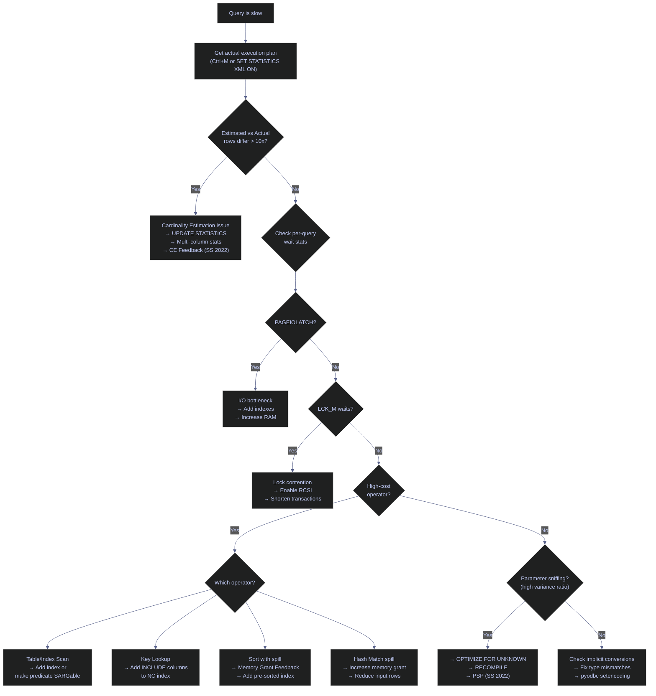

# Execution Plans

> [!quote]
> "The query optimizer is the most sophisticated piece of software in any database system."
>
> — **Michael Stonebraker**, ACM interview

SQL Server execution plans are the primary diagnostic tool for query performance. They show exactly how SQL Server chose to execute a query — which indexes it used, how it joined tables, how many rows it expected vs. actually processed, and what it waited on. Reading plans correctly is the skill that turns a 60-second query into a 200ms query.

Internally, every execution plan is a tree of physical operators serialized as XML (ShowplanXML format). SSMS renders this XML as a visual graph, but the underlying representation is always XML — which is why programmatic plan analysis queries parse XML nodes. Plans are stored in the **plan cache**, an in-memory store divided into two pools: **OBJCP** (Object Plans) for stored procedures, functions, and triggers, and **SQLCP** (SQL Plans) for ad-hoc, dynamic, and prepared queries. The optimizer compiles a plan once, then reuses it for subsequent executions with the same plan handle — avoiding the cost of re-optimization on every call.



---

## Estimated vs. Actual Plans

| Plan type | How to get it | What it shows |
|---|---|---|
| **Estimated** | SSMS: Ctrl+L, or `SET SHOWPLAN_XML ON` | What the optimizer *predicts* will happen — row counts, costs, operator choices. **No actual execution.** |
| **Actual** | SSMS: Ctrl+M then run, or `SET STATISTICS XML ON` | Everything above PLUS what *actually* happened — real row counts, real memory, spills, elapsed time. |
| **Live** | SSMS: Include Live Query Statistics | Real-time animation showing rows flowing through operators as the query runs. |

> [!tip] Always Use Actual Plans for Diagnosis
>
> Estimated plans can mislead when statistics are stale. The estimated cost percentages are computed from optimizer predictions — when those predictions are wrong, the cost distribution is wrong too. Always cross-reference with actual row counts.

---

## Reading the Visual Tree in SSMS

SQL Server execution plans are read **right-to-left, bottom-to-top**. The rightmost operators are the data sources (table/index scans and seeks). Data flows left through transformations (joins, sorts, aggregations) until it reaches the leftmost operator — the final `SELECT`, `INSERT`, or `UPDATE` result.

```text
  SSMS Graphical Plan — read RIGHT to LEFT:

  ┌─────────────────────────────────────────────────────────────────────────┐
  │                                                                         │
  │   SELECT          Hash Match         Clustered Index    Clustered Index │
  │   Cost: 0%        (Inner Join)       Seek (silver)      Scan (bronze)  │
  │      ◄────────────  Cost: 12%  ◄──────  Cost: 28%  ◄──    Cost: 60%   │
  │                         │                                               │
  │                         │              Nonclustered                     │
  │                         ◄──────────    Index Seek         Key Lookup    │
  │                                        Cost: 0%   ◄──── Cost: 0%      │
  │                                                                         │
  │   ◄── direction of data flow                                            │
  │                                                                         │
  │   Arrows:                                                               │
  │   ═══════  thick arrow = many rows flowing                              │
  │   ───────  thin arrow  = few rows flowing                               │
  │   The THICKNESS of the arrow tells you the volume of data               │
  └─────────────────────────────────────────────────────────────────────────┘
```

### Operators, arrows, and cost tooltips

1. **Start at the far right.** These are the data access operators — where SQL Server touches tables/indexes. Look at their type:
   - **Index Seek** (good) — B-tree navigation to specific rows, O(log n). Requires [SARGable predicates](https://alp78.github.io/elysium/04-SQL-Server/T-SQL/sargable-queries) in the WHERE clause.
   - **Index Scan** (check context) — reads all leaf pages of an index
   - **Table Scan** (usually bad) — full heap scan, reads every page
   - **Key Lookup** (expensive if frequent) — bookmark lookup from NC index to [clustered index](https://alp78.github.io/elysium/04-SQL-Server/Storage-and-Indexes/index-types-and-strategy). Fix by adding INCLUDE columns to the nonclustered index.

2. **Follow the arrows left.** Data flows through intermediate operators:
   - **Hash Match** — builds a hash table for joins or aggregations
   - **Merge Join** — merges two pre-sorted inputs (efficient if both are already sorted)
   - **Nested Loops** — for each row in outer input, seeks into inner input
   - **Sort** — sorts rows (watch for spill warnings)
   - **Filter** — applies WHERE conditions that couldn't be pushed to the seek

3. **End at the far left.** The result operator: `SELECT`, `INSERT`, `UPDATE`, or `DELETE`.

4. **Check arrow thickness.** A sudden thick-to-thin transition (or vice versa) reveals where filtering or explosion happens. A thick arrow into a Nested Loops operator with a thin inner input means many iterations — potential performance issue.

5. **Hover over each operator** for the tooltip. The critical properties are:
   - **Estimated/Actual Number of Rows** — are they close? (see Cardinality Estimation below)
   - **Estimated Operator Cost** — where is time being spent? (see Cost Analysis below)
   - **Number of Executions** — how many times was this operator invoked?
   - **Warnings** — yellow triangle icons indicate problems (spills, implicit conversions, missing indexes)

---

## Getting Plans from the Pipeline (Non-SSMS)

SSMS is the standard tool for interactive plan analysis, but data pipelines run unattended. You need programmatic methods to capture and store plans for post-execution review — from the volatile plan cache, from live sessions, or from Query Store for persistent history.

> [!info] Query Store
>
> Query Store is a built-in flight recorder for query performance data, introduced in SQL Server 2016. When enabled (`ALTER DATABASE db SET QUERY_STORE = ON`), it persists execution plans, runtime statistics, and wait stats to disk — surviving plan cache eviction and server restarts. Query Store is required for several SQL Server 2022 [Intelligent Query Processing](https://alp78.github.io/elysium/04-SQL-Server/Performance/execution-plans#intelligent-query-processing) features (CE Feedback, Memory Grant Feedback Persistence, DOP Feedback).

### Capturing plans programmatically

#### sys.dm_exec_query_plan — capture from plan cache

The plan cache holds compiled plans in memory. This query retrieves the plan for a specific query after it has executed. The plan cache is volatile — plans are evicted under memory pressure or after DDL changes.

```sql
SELECT
    qp.query_plan,
    qs.execution_count,
    qs.total_logical_reads / qs.execution_count AS avg_reads,
    qs.total_worker_time / qs.execution_count / 1000 AS avg_cpu_ms
FROM sys.dm_exec_query_stats qs
CROSS APPLY sys.dm_exec_query_plan(qs.plan_handle) qp
CROSS APPLY sys.dm_exec_sql_text(qs.sql_handle) st
WHERE st.text LIKE '%silver.signals_daily%'
ORDER BY qs.total_worker_time DESC;
```

> [!tip] Click the XML result in SSMS to open the graphical plan viewer.

#### SET STATISTICS XML — capture live XML plan inline

Wrapping a query with `SET STATISTICS XML ON/OFF` adds the full execution plan as an additional XML result set column. This is the standard method for capturing actual plans from pipeline scripts during development.

```sql
SET STATISTICS XML ON;
-- Run the pipeline query here
SET STATISTICS XML OFF;
```

The result set includes an XML column containing the full actual plan with runtime statistics.

#### sys.query_store_plan — retrieve persisted plans from Query Store

Query Store captures plans across restarts, making it the preferred source for historical plan analysis and regression detection. Unlike the plan cache, plans in Query Store are durable.

```sql
SELECT
    qsqt.query_sql_text,
    TRY_CAST(qsp.query_plan AS XML) AS plan_xml,
    qsrs.avg_duration / 1000 AS avg_ms,
    qsrs.avg_logical_io_reads
FROM sys.query_store_runtime_stats qsrs
JOIN sys.query_store_plan qsp ON qsrs.plan_id = qsp.plan_id
JOIN sys.query_store_query qsq ON qsp.query_id = qsq.query_id
JOIN sys.query_store_query_text qsqt ON qsq.query_text_id = qsqt.query_text_id
ORDER BY qsrs.avg_duration DESC;
```

### Lightweight query profiling

SQL Server 2019+ enables **lightweight profiling (v3) by default** — collecting per-operator row counts for every query execution with minimal overhead (~2%). This replaces the need for `SET STATISTICS XML ON` in many production scenarios, because you can retrieve the last actual execution plan for any session without adding instrumentation to the query itself.

#### sys.dm_exec_query_statistics_xml — retrieve in-flight actual plan

This DMV returns the actual execution plan (with runtime statistics) for a currently running query. Call it from a separate session, passing the target session's `session_id`. No prior setup is needed on SQL Server 2019+.

```sql
SELECT *
FROM sys.dm_exec_query_statistics_xml(<session_id>);
```

> [!tip] Finding the session_id
>
> Use `SELECT session_id, status, command, wait_type FROM sys.dm_exec_requests WHERE status = 'running'` to identify in-flight sessions.

#### LAST_QUERY_PLAN_STATS — persist last actual plan stats

When enabled, SQL Server retains the last actual execution plan statistics for completed queries, accessible via `sys.dm_exec_query_plan_stats`. This gives you actual plans for queries that have already finished, without requiring `SET STATISTICS XML ON` during execution.

```sql
ALTER DATABASE SCOPED CONFIGURATION SET LAST_QUERY_PLAN_STATS = ON;

SELECT
    qp.query_plan,
    qs.execution_count,
    qs.last_elapsed_time / 1000 AS last_ms
FROM sys.dm_exec_query_stats qs
CROSS APPLY sys.dm_exec_query_plan_stats(qs.plan_handle) qp
CROSS APPLY sys.dm_exec_sql_text(qs.sql_handle) st
WHERE st.text LIKE '%silver.signals_daily%';
```

> [!warning] Permissions Change in SQL Server 2022
>
> `sys.dm_exec_query_statistics_xml` requires `VIEW SERVER STATE` on SQL Server 2019 and earlier, but `VIEW SERVER PERFORMANCE STATE` on SQL Server 2022+.
>
> [!success] Grant the new permission on SQL Server 2022+ instances:
>
> `GRANT VIEW SERVER PERFORMANCE STATE TO [pipeline_user];`

---

## Cost Analysis — Finding the Most Expensive Operator

Every operator in the execution plan shows an **Estimated Operator Cost** as a percentage of the total query cost. This tells you where to focus optimization effort. The cost is a dimensionless number derived from the optimizer's internal model — it combines estimated I/O and CPU work but does not represent seconds, milliseconds, or any real-time unit.

```
  Example plan with cost percentages:

  SELECT (0%)  ◄──  Sort (5%)  ◄──  Hash Match Join (15%)  ◄──┬── Clustered Index Seek (8%)
                                                               │
                                                               └── Clustered Index Scan (72%)
                                                                          ▲
                                                                          │
                                                               THIS is your bottleneck
                                                               72% of total cost
```

### Interpreting and extracting cost data

#### Estimated Operator Cost — how to interpret cost percentages

| Cost range | What it means | Action |
|---|---|---|
| 0-5% | Negligible | Ignore — not worth optimizing |
| 5-20% | Normal | Check only if query is slow overall |
| 20-50% | Significant | Investigate — might benefit from an index or query rewrite |
| 50-100% | Dominant | This operator is the bottleneck. Fix this first. |

#### sys.dm_exec_query_stats + XML nodes — extract operator costs from plan

```sql
-- Extract operator costs from the XML plan programmatically
;WITH XMLNAMESPACES (DEFAULT 'http://schemas.microsoft.com/sqlserver/2004/07/showplan')
SELECT
    node.value('@PhysicalOp', 'varchar(50)') AS operator_name,
    node.value('@EstimatedTotalSubtreeCost', 'float') AS subtree_cost,
    node.value('@EstimateRows', 'float') AS estimated_rows,
    node.value('@EstimateIO', 'float') AS io_cost,
    node.value('@EstimateCPU', 'float') AS cpu_cost
FROM sys.dm_exec_query_stats qs
CROSS APPLY sys.dm_exec_query_plan(qs.plan_handle) qp
CROSS APPLY qp.query_plan.nodes('//RelOp') AS T(node)
WHERE qs.sql_handle = <your_sql_handle>
ORDER BY subtree_cost DESC;
```

#### EstimateIO vs EstimateCPU — cost breakdown per operator

Each operator's cost is split into I/O cost and CPU cost:
- **High IO cost** → the operator is reading many pages from disk/buffer pool. Solution: add [indexes](https://alp78.github.io/elysium/04-SQL-Server/Storage-and-Indexes/index-types-and-strategy) to reduce pages read, or add RAM for better buffer pool hit ratio.
- **High CPU cost** → the operator is doing heavy computation (sorting, hashing, string comparisons). Solution: reduce the number of rows reaching this operator, or simplify the expression.

> [!warning] Cost Percentages Are Based on Estimates
>
> Cost percentages are based on the optimizer's **estimates**, not actual execution. If statistics are stale, the cost distribution can be completely wrong. A scan showing "5%" might actually dominate execution time if the optimizer underestimated the row count. Always cross-reference costs with **actual row counts** and `SET STATISTICS TIME/IO` output.

> [!success] Always verify cost percentages against actual row counts and `SET STATISTICS TIME/IO`
>
> Run with `SET STATISTICS TIME ON; SET STATISTICS IO ON;` alongside the actual execution plan (Ctrl+M). Compare the reported elapsed time per statement against the plan's cost percentages — a mismatch signals stale statistics. Run `UPDATE STATISTICS table WITH FULLSCAN` to correct estimates.

#### SET STATISTICS TIME/IO — get actual timing per query

These session-level settings report actual I/O and CPU measurements per statement — not per operator, but they validate total query-level performance against the plan's cost distribution.

```sql
SET STATISTICS TIME ON;
SET STATISTICS IO ON;

SELECT ...

SET STATISTICS TIME OFF;
SET STATISTICS IO OFF;
```

```text
Table 'signals_daily'. Scan count 1, logical reads 342, physical reads 0
SQL Server Execution Times: CPU time = 15 ms, elapsed time = 23 ms.
```

`logical reads` is the number of 8 KB pages read from the buffer pool (memory). `physical reads` is pages fetched from disk — a value of 0 means all pages were cached. `Scan count` is the number of times the table or index was accessed. When elapsed time significantly exceeds CPU time, the query was waiting on something (I/O, locks, network) rather than computing.

---

## Cardinality Estimation — Detecting Bad Row Count Guesses

The **cardinality estimator** predicts how many rows each operator will process. When these predictions are wrong, the optimizer chooses bad strategies — wrong join types, insufficient memory grants, unnecessary sorts.

**The golden rule:** Compare **Estimated Number of Rows** vs. **Actual Number of Rows** for every operator in the actual execution plan. A ratio > 10x in either direction signals a problem.

### Detecting estimation errors

```
  Example: Cardinality estimation mismatch

  ┌────────────────────────────────┐     ┌────────────────────────────────┐
  │ GOOD ESTIMATE                  │     │ BAD ESTIMATE                   │
  │                                │     │                                │
  │ Estimated Rows: 1,200          │     │ Estimated Rows: 50             │
  │ Actual Rows:    1,350          │     │ Actual Rows:    48,000         │
  │ Ratio: 1.1x ✓                 │     │ Ratio: 960x ✗                  │
  │                                │     │                                │
  │ Optimizer chose Hash Join      │     │ Optimizer chose Nested Loops   │
  │ Memory grant: 2 MB (adequate)  │     │ (because it expected 50 rows)  │
  │ No spills                      │     │ Actual: 48,000 loop iterations │
  │                                │     │ Memory grant: tiny → SPILL     │
  └────────────────────────────────┘     └────────────────────────────────┘
```

#### SSMS Actual Execution Plan — spot bad cardinality estimates

1. Run the query with **Include Actual Execution Plan** (Ctrl+M)
2. Hover over each operator — the tooltip shows both Estimated and Actual rows
3. Look for **thick arrows** where you expect thin ones (or vice versa)
4. SSMS 18+ shows a **warning icon** (yellow triangle) when estimates are off by > 10x

#### sys.query_store_runtime_stats — find worst cardinality estimation errors

```sql
-- Find queries with the worst cardinality estimation errors
-- (requires Query Store enabled)
SELECT TOP 20
    qsqt.query_sql_text,
    qsp.query_plan,
    qsrs.avg_rowcount AS actual_avg_rows,
    qsrs.avg_logical_io_reads,
    qsrs.count_executions,
    qsrs.avg_duration / 1000 AS avg_ms
FROM sys.query_store_runtime_stats qsrs
JOIN sys.query_store_plan qsp ON qsrs.plan_id = qsp.plan_id
JOIN sys.query_store_query qsq ON qsp.query_id = qsq.query_id
JOIN sys.query_store_query_text qsqt ON qsq.query_text_id = qsqt.query_text_id
WHERE qsrs.avg_duration > 1000000  -- > 1 second
ORDER BY qsrs.avg_duration DESC;
-- Open each plan XML and compare EstimateRows vs ActualRows per operator
```

#### XML plan EstimateRows vs ActualRows — extract estimated vs actual per operator

```sql
-- Extract estimated vs actual from the XML plan directly
;WITH XMLNAMESPACES (DEFAULT 'http://schemas.microsoft.com/sqlserver/2004/07/showplan')
SELECT
    node.value('@PhysicalOp', 'varchar(50)') AS operator_name,
    node.value('@EstimateRows', 'float') AS estimated_rows,
    runtime.value('@ActualRows', 'int') AS actual_rows,
    CASE
        WHEN node.value('@EstimateRows', 'float') = 0 THEN 'N/A'
        WHEN runtime.value('@ActualRows', 'int') = 0 THEN 'N/A'
        ELSE CAST(
            runtime.value('@ActualRows', 'float') /
            NULLIF(node.value('@EstimateRows', 'float'), 0)
            AS VARCHAR(20))
    END AS actual_to_estimated_ratio
FROM sys.dm_exec_query_stats qs
CROSS APPLY sys.dm_exec_query_plan(qs.plan_handle) qp
CROSS APPLY qp.query_plan.nodes('//RelOp') AS T(node)
OUTER APPLY node.nodes('RunTimeInformation/RunTimeCountersPerThread') AS RT(runtime)
WHERE qs.sql_handle = <your_sql_handle>
ORDER BY runtime.value('@ActualRows', 'int') DESC;
```

### Causes and fixes

#### Common causes of bad cardinality estimates and fixes

| Symptom | Cause | Fix |
|---|---|---|
| Estimated = 1, Actual = 50,000 | Statistics not updated after bulk load | `UPDATE STATISTICS table WITH FULLSCAN` |
| Estimated = 100,000, Actual = 5 | Statistics were built when table was full, then data was deleted | `UPDATE STATISTICS` or `OPTION (RECOMPILE)` |
| Estimates wrong on joined columns | Multi-column correlation not captured by single-column statistics | Create multi-column statistics: `CREATE STATISTICS stat_idx_sym ON silver.signals_daily (_index, symbol)` |
| Estimates wrong with local variables | Optimizer can't sniff variable values (unlike parameters) | Use `OPTION (RECOMPILE)` or convert to parameterized query |
| Estimates wrong on filtered data | Statistics histogram has insufficient granularity | `UPDATE STATISTICS ... WITH FULLSCAN` or filtered statistics |
| Consistently bad on complex predicates | CE model limitation (e.g., `WHERE a = 1 OR b = 2`) | Break into UNION ALL, or use plan guides |

#### sys.databases compatibility_level — legacy vs new Cardinality Estimator

SQL Server has two CE models. The **legacy CE** (introduced in SQL Server 7.0) assumes full independence between predicates. The **new CE** (introduced in SQL Server 2014, compatibility level 120+) uses a partial correlation model and handles ascending keys and multi-statement TVFs better. SQL Server 2022 uses CE 160. If you're seeing bizarre estimates on upgraded databases, check which model is active:

```sql
SELECT name, compatibility_level FROM sys.databases WHERE name = 'analytics_db';
```

| Compatibility level | CE model |
|---|---|
| 70 | Legacy CE (pre-2014) |
| 120 | New CE (SQL Server 2014) |
| 150 | New CE (SQL Server 2019) |
| 160 | New CE (SQL Server 2022, recommended) |

#### FORCE_LEGACY_CARDINALITY_ESTIMATION — override CE model per query

If the new CE gives worse estimates for a specific query, you can force the legacy model without changing the database compatibility level. You can also toggle the CE model at the database level using `ALTER DATABASE SCOPED CONFIGURATION SET LEGACY_CARDINALITY_ESTIMATION = ON`.

```sql
SELECT * FROM silver.signals_daily
WHERE _index = 'market_index'
OPTION (USE HINT('FORCE_LEGACY_CARDINALITY_ESTIMATION'));
```

### CE Feedback (SQL Server 2022)

SQL Server 2022 introduces **Cardinality Estimation Feedback**, an Intelligent Query Processing feature that automatically detects and corrects significant CE errors at runtime. Instead of manually diagnosing estimation mismatches and applying hints, CE Feedback runs a three-phase cycle:

1. **Identify** — during execution, SQL Server detects operators where actual rows diverge significantly from estimated rows
2. **Verify** — on subsequent executions, the optimizer recompiles the query with alternate CE assumptions (e.g., switching from full independence to partial correlation for multi-predicate filters) and validates whether the alternate plan is faster
3. **Replace** — if the alternate plan is confirmed faster, the correction is persisted as a Query Store hint, automatically applied to future compilations

CE Feedback targets three specific CE model assumptions:
- **Correlation** — adjusts predicate selectivity between full independence, partial correlation, and full correlation
- **Join containment** — switches between simple containment and base containment assumptions
- **Row goal** — modifies the row goal optimization for TOP, EXISTS, and IN subqueries

> [!warning] CE Feedback Requirements
>
> CE Feedback requires compatibility level 160 and Query Store enabled in READ_WRITE mode. If a forced plan already exists in Query Store for a query, CE Feedback is skipped for that query.
>
> [!success] Enable CE Feedback and verify it is active:
>
> ```sql
> ALTER DATABASE SCOPED CONFIGURATION SET CE_FEEDBACK = ON;
> -- Monitor feedback activity:
> -- XEvents: query_feedback_analysis, query_feedback_validation
> -- DMVs: sys.query_store_plan_feedback, sys.query_store_query_hints
> ```

---

## Wait Stats Inside Execution Plans

SQL Server 2016+ embeds **query-level wait statistics** directly into the actual execution plan XML. Instead of correlating server-wide [wait stats](https://alp78.github.io/elysium/04-SQL-Server/Performance/wait-stats-analysis) with specific queries, you can see exactly what each query waited on.

### Reading per-query waits

#### SSMS WaitStats node — per-query wait stats in execution plans

1. Run query with **Include Actual Execution Plan** (Ctrl+M)
2. Right-click on the **root operator** (leftmost — `SELECT`, `INSERT`, etc.)
3. Click **Properties** (or press F4)
4. Expand **WaitStats** node in the Properties panel

```text
  SSMS Properties panel for the root operator:

  ┌────────────────────────────────────────────┐
  │ Properties                                  │
  ├────────────────────────────────────────────┤
  │ ▸ Actual Number of Rows: 50                │
  │ ▸ Estimated Operator Cost: 0.234           │
  │ ▸ Number of Executions: 1                  │
  │                                            │
  │ ▼ WaitStats                                │
  │   ├── WaitType: PAGEIOLATCH_SH             │
  │   │   ├── WaitCount: 23                    │
  │   │   └── WaitTimeMs: 142                  │
  │   ├── WaitType: CXPACKET                   │
  │   │   ├── WaitCount: 4                     │
  │   │   └── WaitTimeMs: 38                   │
  │   └── WaitType: ASYNC_NETWORK_IO           │
  │       ├── WaitCount: 1                     │
  │       └── WaitTimeMs: 5                    │
  │                                            │
  │   Interpretation:                          │
  │   • 142ms waiting for disk I/O (pages not  │
  │     in buffer pool)                        │
  │   • 38ms parallelism coordination          │
  │   • 5ms waiting for client to consume rows │
  └────────────────────────────────────────────┘
```

#### XML plan WaitStats/Wait nodes — extract per-query waits from plan cache

```sql
;WITH XMLNAMESPACES (DEFAULT 'http://schemas.microsoft.com/sqlserver/2004/07/showplan')
SELECT
    SUBSTRING(st.text, 1, 200) AS query_text,
    ws.value('@WaitType', 'varchar(100)') AS wait_type,
    ws.value('@WaitTimeMs', 'bigint') AS wait_time_ms,
    ws.value('@WaitCount', 'bigint') AS wait_count
FROM sys.dm_exec_query_stats qs
CROSS APPLY sys.dm_exec_query_plan(qs.plan_handle) qp
CROSS APPLY sys.dm_exec_sql_text(qs.sql_handle) st
CROSS APPLY qp.query_plan.nodes('//WaitStats/Wait') AS W(ws)
WHERE st.text LIKE '%silver.signals_daily%'
ORDER BY ws.value('@WaitTimeMs', 'bigint') DESC;
```

### Interpreting wait types

#### PAGEIOLATCH, WRITELOG, CXPACKET, LCK_M — interpreting per-query waits

| Wait type in plan | Meaning | Action |
|---|---|---|
| `PAGEIOLATCH_SH` / `PAGEIOLATCH_EX` | Query waited for pages to be read from disk into buffer pool | Not enough RAM (buffer pool too small) or missing indexes causing unnecessary scans |
| `WRITELOG` | Query waited for transaction log flush to disk | Slow log disk, or too many individual COMMITs (batch them) |
| `CXPACKET` / `CXCONSUMER` | Parallelism coordination waits | Usually harmless. If excessive: check for skewed thread distribution or lower MAXDOP |
| `ASYNC_NETWORK_IO` | SQL Server produced rows faster than the client consumed them | Client (dashboard/pipeline) is slow processing results, or network latency |
| `LCK_M_S` / `LCK_M_X` | Query was blocked by another session's lock | Contention — check for long-running transactions, consider [RCSI](https://alp78.github.io/elysium/04-SQL-Server/T-SQL/merge-and-upsert) |
| `MEMORY_GRANT_QUEUE` | Query waited in the memory grant queue before it could start | Too many concurrent queries requesting sort/hash memory — reduce parallelism or add RAM |
| `SOS_SCHEDULER_YIELD` | CPU was overloaded, query had to yield its time slice | CPU pressure — optimize the query or add vCPUs |

#### sys.dm_os_wait_stats — correlation with server-wide wait stats

Per-query waits tell you "this specific query waited on X." Server-wide waits (from `sys.dm_os_wait_stats`) tell you "the entire workload is bottlenecked on X." Use both:

1. Check server-wide [wait stats](https://alp78.github.io/elysium/04-SQL-Server/Performance/wait-stats-analysis) → identify the category (I/O? locks? CPU?)
2. Find the specific queries contributing → per-query wait stats in execution plans
3. Fix the worst offenders

---

## Critical Plan Operators for Batch Workloads

When reviewing execution plans for data pipeline queries (bronze→silver→gold MERGE operations, bulk INSERTs, aggregation jobs), certain operators have specific expectations. This table maps each operator to its expected context and the scenarios where its presence signals a problem.

| Operator | Expected in Pipeline | Red Flag |
|----------|---------------------|----------|
| **Clustered Index Insert** | Normal for bulk INSERT | — |
| **Clustered Index Scan** | Expected for full-table MERGE source | Red flag if appearing in WHERE-filtered queries |
| **Table Scan** | Never acceptable on silver/gold tables | Add clustered index |
| **Hash Match (Inner Join)** | Normal for large MERGE joins | Check memory grant — spills to TempDB are costly |
| **Sort** | Often needed for MERGE | Watch for sort spills (yellow warning in plan) |
| **Nested Loops** | Good for small lookups | Red flag if outer input is large (> 1000 rows) |
| **Key Lookup** | Covering index missing columns | Add INCLUDE columns to index |
| **Parallelism (Gather Streams)** | Normal for large operations | Check for skewed thread distribution |

---

## Implicit Conversions — The Silent Performance Killer

The most common silent performance killer in Python-to-SQL pipelines. Python's pyodbc sends parameters as `NVARCHAR` by default, but SQL columns may be `VARCHAR`. This forces a per-row conversion and prevents [index seeks](https://alp78.github.io/elysium/04-SQL-Server/T-SQL/sargable-queries).

### Detecting and fixing implicit conversions

#### sys.dm_exec_query_plan PlanAffectingConvert — detect implicit conversions

```sql
SET TRANSACTION ISOLATION LEVEL READ UNCOMMITTED;
;WITH XMLNAMESPACES (DEFAULT 'http://schemas.microsoft.com/sqlserver/2004/07/showplan')
SELECT TOP 20
    st.text AS query_text,
    qp.query_plan,
    qs.execution_count,
    qs.total_logical_reads / qs.execution_count AS avg_reads
FROM sys.dm_exec_query_stats qs
CROSS APPLY sys.dm_exec_query_plan(qs.plan_handle) qp
CROSS APPLY sys.dm_exec_sql_text(qs.sql_handle) st
WHERE qp.query_plan.exist('//Warnings/PlanAffectingConvert') = 1
ORDER BY qs.total_logical_reads DESC;
```

#### pyodbc setencoding — fix implicit NVARCHAR→VARCHAR conversion

```python
# In your pipeline connection setup
conn.setdecoding(pyodbc.SQL_CHAR, encoding='utf-8')
conn.setdecoding(pyodbc.SQL_WCHAR, encoding='utf-8')
conn.setencoding(encoding='utf-8')

# Or per-cursor: use fast_executemany with explicit types
cursor.fast_executemany = True
cursor.executemany("INSERT INTO ...", rows)
```

> [!info] Full SARGability Reference
>
> For the complete list of SARGable vs. non-SARGable patterns, the detection query, and the data pipeline quick-reference table, see [sargable-queries](https://alp78.github.io/elysium/04-SQL-Server/T-SQL/sargable-queries).

---

## Parameter Sniffing

Parameter sniffing is less common in pipelines (queries use literal values, not stored procedures), but it affects parameterized queries from pyodbc.

### Detecting parameter sniffing

#### sys.dm_exec_query_stats min/max worker_time — detect parameter sniffing

```sql
-- Check if auto-parameterization is causing issues
SELECT
    qs.execution_count,
    qs.total_worker_time / qs.execution_count / 1000 AS avg_cpu_ms,
    qs.min_worker_time / 1000 AS min_cpu_ms,
    qs.max_worker_time / 1000 AS max_cpu_ms,
    CAST((qs.max_worker_time - qs.min_worker_time) * 1.0 /
         NULLIF(qs.min_worker_time, 0) AS DECIMAL(10,1)) AS variance_ratio,
    SUBSTRING(st.text, 1, 200) AS query_text
FROM sys.dm_exec_query_stats qs
CROSS APPLY sys.dm_exec_sql_text(qs.sql_handle) st
WHERE qs.execution_count > 10
  AND qs.max_worker_time > qs.min_worker_time * 10
ORDER BY variance_ratio DESC;
```

### Traditional mitigations

#### OPTIMIZE FOR UNKNOWN, OPTION (RECOMPILE) — parameter sniffing mitigations

```sql
-- Option 1: OPTIMIZE FOR UNKNOWN for variable queries
SELECT * FROM silver.signals_daily
WHERE _index = @index AND signal_date >= @from
OPTION (OPTIMIZE FOR UNKNOWN);

-- Option 2: RECOMPILE for infrequent but variable queries
SELECT * FROM gold.scores_daily
WHERE [index] = @idx
OPTION (RECOMPILE);
```

> [!tip] When to Use RECOMPILE
>
> Use `OPTION (RECOMPILE)` sparingly — only on queries that run a few times per pipeline (not thousands of times in a loop). Recompilation has CPU overhead.

### Parameter Sensitive Plan Optimization (SQL Server 2022)

SQL Server 2022 introduces **Parameter Sensitive Plan (PSP) Optimization**, a built-in solution to parameter sniffing for queries over non-uniform data distributions. Instead of caching a single plan per parameterized query, PSP creates a **dispatcher plan** that selects among multiple **plan variants** at runtime based on the actual parameter value.

The dispatcher evaluates the parameter against boundary values derived from the statistics histogram, then routes execution to the cached variant optimized for that value range. For example, a query filtering on `_index` might have one variant with a Nested Loops plan for selective values (few rows) and another with a Hash Join plan for non-selective values (many rows).

#### Enabling and disabling PSP

PSP is enabled by default at compatibility level 160. It applies automatically to eligible parameterized queries — no query hints needed. Query Store is recommended (not required) for full observability.

```sql
ALTER DATABASE SCOPED CONFIGURATION SET PARAMETER_SENSITIVE_PLAN_OPTIMIZATION = ON;
```

#### DISABLE_PARAMETER_SENSITIVE_PLAN — disable PSP per query

If PSP causes plan cache bloating or unexpected regressions, disable it at the query level without affecting other queries:

```sql
SELECT * FROM silver.signals_daily
WHERE _index = @index
OPTION (USE HINT('DISABLE_PARAMETER_SENSITIVE_PLAN'));
```

> [!warning] PSP Interactions
>
> PSP is automatically disabled when trace flag 4136 is active or when `PARAMETER_SNIFFING = OFF` is set at the database level. If you have either of these legacy mitigations in place, PSP will not activate even at compatibility level 160.
>
> [!success] To use PSP, remove legacy parameter sniffing workarounds:
>
> `ALTER DATABASE SCOPED CONFIGURATION SET PARAMETER_SNIFFING = ON;`

---

## Batch Mode Execution

SQL Server 2022 supports **batch mode on rowstore** (no columnstore index required). This dramatically accelerates analytical queries (groupby, window functions).

### Checking and enabling batch mode

#### ActualExecutionMode Batch vs Row — check batch mode usage

This query identifies your most CPU-intensive gold-layer queries and retrieves their plans. In the XML plan output, look for `ActualExecutionMode="Batch"` vs `"Row"` on each operator — batch mode processes ~900 rows at a time in a columnar format, while row mode processes one row at a time.

```sql
SELECT
    qs.execution_count,
    qs.total_worker_time / 1000 AS total_cpu_ms,
    SUBSTRING(st.text, 1, 200) AS query_text,
    qp.query_plan
FROM sys.dm_exec_query_stats qs
CROSS APPLY sys.dm_exec_sql_text(qs.sql_handle) st
CROSS APPLY sys.dm_exec_query_plan(qs.plan_handle) qp
WHERE st.text LIKE '%gold.%'
ORDER BY qs.total_worker_time DESC;
```

#### ENABLE_BATCH_MODE_ON_ROWSTORE hint — force batch mode execution

```sql
-- Compatibility level must be 150+ (SQL 2019+)
ALTER DATABASE analytics_db SET COMPATIBILITY_LEVEL = 160;  -- SQL 2022

-- Hint to encourage batch mode
SELECT [index], score_date,
    AVG(momentum_score) OVER (PARTITION BY [index]) AS avg_momentum
FROM gold.scores_daily
WHERE score_date = @date
OPTION (USE HINT('ENABLE_BATCH_MODE_ON_ROWSTORE'));
```

---

## Intelligent Query Processing

Intelligent Query Processing (IQP) is a family of automatic optimization features introduced incrementally across SQL Server 2017, 2019, and 2022. These features allow the query processor to adapt its decisions at runtime — correcting bad cardinality estimates, adjusting memory grants, and selecting better join strategies without manual intervention. Batch Mode on Rowstore and Parameter Sensitive Plan Optimization (covered in dedicated sections above) are part of this family.

The features below are the remaining IQP capabilities that directly affect how execution plans are generated and adapted. Each requires a minimum compatibility level and some require Query Store enabled in READ_WRITE mode.

### IQP feature matrix

| Feature | Version | Compat level | QS required | What it does |
|---------|---------|-------------|-------------|-------------|
| Adaptive Joins | SS 2017+ | 140 | No | Selects Hash or Nested Loops at runtime based on actual input rows |
| Interleaved Execution (MSTVFs) | SS 2017+ | 140 | No | Uses actual multi-statement TVF cardinality instead of fixed guess of 100 |
| Memory Grant Feedback (batch mode) | SS 2017+ | 140 | No | Adjusts memory grant up/down based on spill/waste history |
| Memory Grant Feedback (row mode) | SS 2019+ | 150 | No | Extends batch-mode MGF to all rowstore queries |
| Scalar UDF Inlining | SS 2019+ | 150 | No | Inlines scalar UDFs as relational expressions — UDF logic visible in plan |
| Table Variable Deferred Compilation | SS 2019+ | 150 | No | Uses actual table variable cardinality at first compilation (not fixed estimate of 1) |
| MGF Percentile + Persistence | SS 2022+ | 160 | **Yes** | 90th-percentile algorithm over recent history; persisted across cache evictions |
| DOP Feedback | SS 2022+ | 160 | **Yes** | Auto-tunes degree of parallelism per query |
| CE Feedback | SS 2022+ | 160 | **Yes** | Corrects CE model assumptions; persisted via QS hints |
| PSP Optimization | SS 2022+ | 160 | Recommended | Multiple cached plan variants per parameterized statement |
| Optimized Plan Forcing | SS 2022+ | 160 | **Yes** | Stores compilation replay hints in QS to speed up forced plan recompilation |

### Adaptive Joins

Adaptive Joins dynamically choose between Hash Match and Nested Loops at runtime. The optimizer sets an **adaptive threshold** — a row count boundary — during compilation. During execution, if the actual row count from the build input exceeds the threshold, the join executes as a Hash Match; if below, it switches to Nested Loops. Rows already read by the Hash build phase are reused, so there is no duplicate I/O.

In the execution plan, an Adaptive Join appears as a single operator with three child branches: the Hash probe phase, the Nested Loops seek, and the adaptive threshold node. The `ActualJoinType` property in the plan XML shows which strategy was actually used at runtime.

### Memory Grant Feedback

When the optimizer compiles a plan, it estimates how much memory the query needs for sort and hash operations (the **memory grant**). If the estimate is too low, data spills to TempDB — visible as yellow warning icons on Sort and Hash Match operators. If too high, memory is wasted and concurrent queries may queue in the `RESOURCE_SEMAPHORE` wait.

Memory Grant Feedback automatically adjusts the grant based on execution history:

- **Under-grant detected** (spill occurred) → next execution gets a larger grant
- **Over-grant detected** (< 50% used) → next execution gets a smaller grant
- **Self-disabling** → if adjustments cause oscillation (alternating spill/waste), MGF stops adjusting and falls back to the optimizer's estimate

SQL Server 2022 adds **percentile mode** (uses the 90th percentile of recent grant history plus a buffer, instead of just the last execution) and **persistence** (feedback survives plan cache eviction and server restarts via Query Store).

#### Memory Grant Feedback — enable persistence and percentile mode

```sql
ALTER DATABASE SCOPED CONFIGURATION SET MEMORY_GRANT_FEEDBACK_PERCENTILE_GRANT = ON;
ALTER DATABASE SCOPED CONFIGURATION SET MEMORY_GRANT_FEEDBACK_PERSISTENCE = ON;
```

### DOP Feedback

DOP (Degree of Parallelism) Feedback automatically tunes the parallelism degree for individual queries based on runtime feedback. If a query's parallel execution wastes CPU due to skewed thread distribution or excessive `CXPACKET` waits, DOP Feedback reduces the DOP for subsequent executions. Feedback is persisted in Query Store.

```sql
ALTER DATABASE SCOPED CONFIGURATION SET DOP_FEEDBACK = ON;
```

> [!info] IQP and Execution Plan Visibility
>
> All IQP adaptations are visible in the actual execution plan. Adaptive Joins show `AdaptiveJoinType`, Memory Grant Feedback shows `IsMemoryGrantFeedbackAdjusted`, and DOP Feedback adjustments appear in the plan's `MemoryGrantInfo` and `RuntimeCountersPerThread` nodes. Always use actual plans (not estimated) to observe IQP behavior — estimated plans show only the pre-adaptation compile-time decisions.

---

## Missing Indexes for Pipeline Queries

SQL Server surfaces missing index recommendations directly in the execution plan (yellow warning icon) and stores them in DMVs. Typical clustered indexes needed for a bronze→silver→gold MERGE pipeline:

```sql
-- Silver signal tables: MERGE joins on (_index, symbol, signal_date)
CREATE UNIQUE CLUSTERED INDEX CIX_signals_daily
ON silver.signals_daily (_index, symbol, signal_date);

-- Silver OHLCV tables: MERGE on (symbol, date)
CREATE UNIQUE CLUSTERED INDEX CIX_ohlcv
ON silver.ohlcv_market_index (symbol, date);

-- Gold scores: dashboard reads by (index, score_date) with ORDER BY rank
CREATE UNIQUE CLUSTERED INDEX CIX_scores_daily
ON gold.scores_daily ([index], score_date, symbol);

-- Index performance: dashboard reads by (index, perf_date)
CREATE UNIQUE CLUSTERED INDEX CIX_index_performance
ON gold.index_performance ([index], perf_date);

-- Pulse tables: read by (_index) with ORDER BY activity_score
CREATE NONCLUSTERED INDEX IX_pulse_tickers_index
ON bronze.pulse_tickers (_index) INCLUDE (symbol, rank, activity_score, volume_surge);
```

> [!info] Missing Index DMVs
>
> For the systematic missing index detection query using `sys.dm_db_missing_index_details`, see [index-types-and-strategy > Missing Index DMV Queries](https://alp78.github.io/elysium/04-SQL-Server/Storage-and-Indexes/index-types-and-strategy#missing-index-dmv-queries).

---

## Quick Wins for Query Performance (Ordered by Impact)

These are the highest-impact, lowest-effort optimizations to apply after reading execution plans. Each addresses a common pattern seen in pipeline and dashboard workloads.

### Detection and implementation queries

| Optimization | Effort | Impact | When to Apply |
|-------------|--------|--------|---------------|
| Clustered indexes on all tables | Low | High | Immediately if any heaps exist |
| `OPTION (RECOMPILE)` on pipeline queries | Low | Medium | If you see parameter sniffing issues |
| Enable RCSI | Low | High | Immediately — eliminates reader/writer blocking |
| Covering indexes | Medium | Medium | When dashboard queries show Key Lookups |
| Page compression on gold tables | Medium | Medium | When buffer pool starts filling up |
| Statistics update after loads | Low | High | Add to pipeline post-load step |

#### sys.tables + sys.partitions index_id=0 — check for heap tables

```sql
-- Check for heap tables (no clustered index)
SELECT
    SCHEMA_NAME(t.schema_id) + '.' + t.name AS table_name,
    p.rows
FROM sys.tables t
JOIN sys.partitions p ON t.object_id = p.object_id AND p.index_id = 0
WHERE p.rows > 0
ORDER BY p.rows DESC;
```

#### ALTER DATABASE SET READ_COMMITTED_SNAPSHOT ON — enable RCSI

```sql
-- Check current setting
SELECT name, is_read_committed_snapshot_on
FROM sys.databases WHERE name = 'analytics_db';

-- Enable RCSI (requires exclusive access — no other connections)
ALTER DATABASE analytics_db SET READ_COMMITTED_SNAPSHOT ON;
```

After enabling, `SELECT` queries no longer take shared locks, so they never block `INSERT`/`UPDATE`/`DELETE` and vice versa.

#### sp_estimate_data_compression_savings — check compression savings

```sql
-- Check current compression and potential savings
EXEC sp_estimate_data_compression_savings
    @schema_name = 'gold',
    @object_name = 'index_performance',
    @index_id = NULL,
    @partition_number = NULL,
    @data_compression = 'PAGE';

-- Apply page compression
ALTER INDEX CIX_index_performance ON gold.index_performance
REBUILD WITH (DATA_COMPRESSION = PAGE);
```

Page compression typically saves 60-80% space on time-series financial data, meaning more data fits in the buffer pool without increasing RAM.

#### sp_updatestats, UPDATE STATISTICS WITH FULLSCAN — refresh after bulk loads

```sql
EXEC sp_updatestats;

-- Or target specific tables after bulk load
UPDATE STATISTICS gold.scores_daily WITH FULLSCAN, PERSIST_SAMPLE_PERCENT = ON;
UPDATE STATISTICS gold.index_performance WITH FULLSCAN, PERSIST_SAMPLE_PERCENT = ON;
```

---

## Related

- [sargable-queries](https://alp78.github.io/elysium/04-SQL-Server/T-SQL/sargable-queries) — predicate patterns that enable vs. prevent index seeks
- [wait-stats-analysis](https://alp78.github.io/elysium/04-SQL-Server/Performance/wait-stats-analysis) — server-wide wait stats to correlate with per-query plan waits
- [index-types-and-strategy](https://alp78.github.io/elysium/04-SQL-Server/Storage-and-Indexes/index-types-and-strategy) — index types, missing index DMVs, and covering index strategy
- [storage-internals](https://alp78.github.io/elysium/04-SQL-Server/Storage-and-Indexes/storage-internals) — buffer pool, B-tree mechanics that explain what plans show
- [performance-audit-playbook](https://alp78.github.io/elysium/04-SQL-Server/Performance/performance-audit-playbook) — structured audit using execution plans as the primary tool
