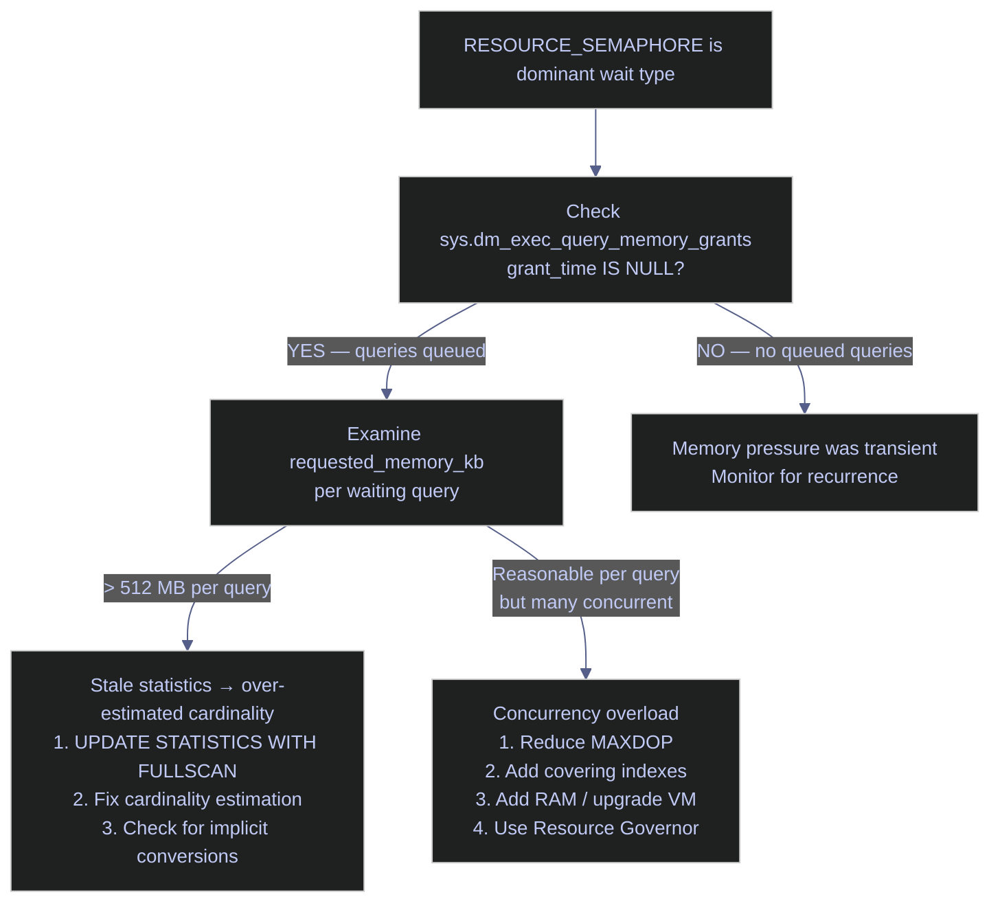

# Memory and the Buffer Pool

> [!quote]
> "Memory is the new disk, disk is the new tape."
>
> — **Jim Gray**, *Transaction Processing: Concepts and Techniques* (1992)

SQL Server's buffer pool (also called the buffer cache) is its primary data cache — a region of memory that holds 8 KB database pages (data and index pages) in RAM so they don't need to be read from disk on every query. Memory is the single biggest performance lever on most SQL Server instances: when data fits in the buffer pool, queries read from RAM at nanosecond latency; when it doesn't, they read from disk at millisecond latency — 100x to 1,000x slower.

The buffer manager coordinates three background processes that move pages between disk and the buffer pool:

- **Lazy writer** — a background thread that monitors the free list (a list of buffer frames available for reuse). When the free list runs low, the lazy writer scans the buffer pool for the least recently used clean pages, evicts them, and adds the frames back to the free list. If a page is dirty (modified but not yet persisted), the lazy writer writes it to disk first before freeing the frame. The `Lazy writes/sec` performance counter tracks this activity — high values indicate sustained memory pressure.
- **Checkpoint** — a periodic process that writes all dirty pages from the buffer pool to disk, creating a recovery point. After a checkpoint, those pages become clean (their on-disk copy matches their in-memory copy) but remain cached in the buffer pool. The target recovery interval (default: 60 seconds) controls how frequently automatic checkpoints occur.
- **Free list stalls** — when a thread needs a buffer frame and the free list is empty, it must wait for the lazy writer to free one. The `Free list stalls/sec` counter tracks this — any non-zero sustained value signals that the buffer pool is too small for the current workload.

## Key Terms

| Term | Definition |
|------|-----------|
| **Buffer pool** | Main SQL Server memory region holding data and index pages read from disk. Shared across all databases on the instance. |
| **Dirty page** | A page in the buffer pool that has been modified in memory but not yet written to disk. Dirty pages are persisted by checkpoint or lazy writer. |
| **Clean page** | A page whose in-memory copy matches the on-disk copy. Clean pages can be evicted without writing to disk. |
| **Page Life Expectancy (PLE)** | Average seconds a data page stays in the buffer pool before eviction. Higher is better — it means pages remain cached longer. |
| **Buffer Cache Hit Ratio** | Percentage of page reads served from RAM vs. disk. Target: > 99%. |
| **Memory clerk** | Internal SQL Server component tracking memory allocations by type (buffer pool, plan cache, lock manager, CLR, etc.) |
| **Memory grant** | RAM pre-allocated to a query for sort and hash operations before execution begins. If the grant is insufficient, the operation spills to TempDB. |
| **max server memory** | Hard cap on how much RAM SQL Server can allocate for the buffer pool and most memory clerks. Must always be set — never leave at default (see [server-configuration](https://alp78.github.io/elysium/04-SQL-Server/Administration/server-configuration)). |

## Memory Configuration

### Max Server Memory Sizing Rule

The `max server memory` setting controls the upper limit of SQL Server's buffer pool and internal caches. It does not cover all memory consumed by the SQL Server process — thread stacks, linked server providers, CLR assemblies, and backup buffers allocate memory outside this cap.

> [!tip] The Max Memory Rule
>
> For VMs up to 16 GB: `max server memory = Total VM RAM − 1 GB`. Leave at least 1 GB for the OS, kernel, and other processes. On a 16 GB GCP VM: set max server memory to 15,360 MB.

For VMs with > 32 GB RAM, reserve 10–15% for the OS and non-buffer-pool allocations:
- 32 GB VM → 28–29 GB for SQL Server
- 64 GB VM → 54–58 GB for SQL Server

### Set max server memory with sp_configure

The change takes effect immediately — no SQL Server restart is required. The `RECONFIGURE` command applies the new value to `value_in_use`.

```sql
EXEC sp_configure 'max server memory', 15360;
RECONFIGURE;
```

### Verify the current setting

```sql
SELECT name, value, value_in_use, description
FROM sys.configurations
WHERE name = 'max server memory (MB)';
```

> [!warning] Never Leave at Default
>
> The default max server memory is 2,147,483,647 MB (effectively unlimited). SQL Server will consume nearly all available RAM, starving the OS and potentially causing instability. On Linux or GCP VMs, the OOM killer may terminate the `sqlservr` process during memory spikes. Always set this before going to production.

> [!success] Set `max server memory` before going to production
>
> `EXEC sp_configure 'max server memory', <total_RAM_MB - 1024>; RECONFIGURE;` — run this immediately after installing SQL Server. On a 16 GB VM, use 15360 MB. Verify with `SELECT name, value_in_use FROM sys.configurations WHERE name = 'max server memory (MB)';`

## Checking Available System Memory

SQL Server's internal Resource Monitor continuously tracks both external memory (OS-level physical RAM availability) and internal memory (how much of the buffer pool target has been committed). The two DMVs below expose these states. For OS-level memory monitoring with `free`, `vmstat`, and other Linux tools, see [system-resources](https://alp78.github.io/elysium/01-Shell/Process-Management/system-resources).

### sys.dm_os_sys_memory — OS-level memory status

This DMV reports the OS-visible physical memory. The `system_memory_state_desc` column reflects the current memory pressure state as detected by SQL Server's Resource Monitor:
- `Available physical memory is high` — healthy, no pressure
- `Physical memory usage is low` — SQL Server will begin reducing its buffer pool to release RAM
- `Physical memory usage is steady` — stable state
- `Physical memory state is transitioning` — SQL Server is actively adjusting allocations in response to changing pressure

```sql
SELECT
    total_physical_memory_kb / 1024   AS total_ram_mb,
    available_physical_memory_kb / 1024 AS available_memory_mb,
    system_memory_state_desc
FROM sys.dm_os_sys_memory;
```

### sys.dm_os_sys_info — SQL Server committed memory vs target

The `committed_kb` column shows how much physical memory SQL Server has currently committed (allocated and in use). The `committed_target_kb` shows how much SQL Server wants to commit based on its max server memory setting and current workload. When `committed_kb` significantly exceeds `committed_target_kb`, SQL Server is under internal memory pressure and is actively trying to shrink — the lazy writer will be highly active. When the two values are approximately equal, memory is stable.

```sql
SELECT
    physical_memory_kb / 1024    AS physical_memory_mb,
    committed_kb / 1024          AS committed_mb,
    committed_target_kb / 1024   AS target_mb
FROM sys.dm_os_sys_info;
```

## Page Life Expectancy (PLE)

Page Life Expectancy is the most important single metric for buffer pool health. It measures the average number of seconds a data page remains in the buffer pool without being referenced before it is evicted. A high PLE means pages stay cached long enough to serve multiple queries from RAM; a low PLE means pages are being evicted before they can be reused, forcing repeated disk reads.

PLE is exposed via the `Buffer Manager` performance object in `sys.dm_os_performance_counters`. On NUMA systems, SQL Server reports a separate PLE per buffer node (one per NUMA node) plus an aggregate `Buffer Manager` value.

### Current PLE

```sql
SELECT cntr_value AS PLE_seconds
FROM sys.dm_os_performance_counters
WHERE counter_name = 'Page life expectancy'
  AND object_name LIKE '%Buffer Manager%';
```

### PLE interpretation thresholds

| PLE Value | Interpretation | Action |
|-----------|---------------|--------|
| > 1000 seconds | Healthy — pages live in memory a long time | None |
| 300–1000 seconds | Acceptable for busy OLTP servers | Monitor trend; investigate if declining |
| < 300 seconds | Memory pressure — pages evicted frequently, queries hitting disk | Increase `max server memory`, upgrade VM, or optimize queries causing large scans |
| Sudden drops | A large table scan, index rebuild, or `DBCC DROPCLEANBUFFERS` flushed the buffer pool | Identify the query with `sys.dm_exec_requests`; schedule off-peak |

> [!info] The 300-Second Rule Is Outdated
>
> The classic "300 second" PLE threshold was established when servers had 4 GB of RAM. On modern systems with 16+ GB, PLE should routinely be 1,000–5,000+ seconds. A more useful formula: PLE should be at least `(RAM_GB / 4) × 300` seconds. On a 16 GB server, that means a healthy baseline of at least 1,200 seconds. A consistently low PLE means the working set (the set of pages actively needed by queries) does not fit in RAM.

### Buffer Cache Hit Ratio

The buffer cache hit ratio measures the percentage of page reads that were satisfied from the buffer pool (RAM) without requiring a physical disk read. A ratio above 99% means virtually all reads are served from cache. Below 95% indicates significant memory pressure; below 90% is critical. Note: this counter is a cumulative average since server startup, so it can mask short bursts of cache misses — PLE is a better real-time indicator.

```sql
SELECT cntr_value AS hit_ratio
FROM sys.dm_os_performance_counters
WHERE counter_name = 'Buffer cache hit ratio'
  AND object_name LIKE '%Buffer Manager%';
```

### Buffer Pool Distribution by Database

The `sys.dm_os_buffer_descriptors` DMV reports every page currently cached in the buffer pool, including which database it belongs to. This query aggregates those pages to show how many MB each database is consuming. If a small database disproportionately occupies the buffer pool (e.g., due to a large scan or missing index), it can evict pages from the production database, causing cache misses on critical queries.

```sql
SELECT
    DB_NAME(database_id) AS db_name,
    COUNT(*) * 8 / 1024 AS buffer_pool_mb
FROM sys.dm_os_buffer_descriptors
GROUP BY database_id
ORDER BY buffer_pool_mb DESC;
```

## Memory Clerks — Where Memory Is Being Used

Memory clerks are SQL Server's internal accounting system for memory. Each clerk tracks allocations for a specific purpose — the buffer pool has its own clerk, the plan cache has one, memory grants have one, and so on. By querying `sys.dm_os_memory_clerks`, you can see exactly which components are consuming memory and whether the distribution is healthy.

### Top memory consumers by clerk type

```sql
SELECT TOP 10
    type AS clerk_type,
    pages_kb / 1024 AS memory_mb
FROM sys.dm_os_memory_clerks
WHERE pages_kb > 0
ORDER BY pages_kb DESC;
```

### Common clerks and their meaning

| Clerk | What It Is | Healthy State / Concern |
|-------|-----------|---------|
| `MEMORYCLERK_SQLBUFFERPOOL` | Buffer pool — cached data and index pages | Should be the largest by far (typically 80–90% of total) |
| `CACHESTORE_SQLCP` | Plan cache — compiled ad-hoc and prepared query plans | If > 20% of total, ad-hoc query strings are bloating the cache — enable "optimize for ad hoc workloads" |
| `CACHESTORE_OBJCP` | Plan cache — stored procedure, trigger, and function plans | Typically smaller than SQLCP; large values indicate many compiled procedures |
| `MEMORYCLERK_SQLQUERYEXEC` | Memory grants — workspace memory for sort and hash operations | If large relative to buffer pool, queries are doing big sorts — add covering indexes or fix cardinality estimates |
| `MEMORYCLERK_SQLCLR` | CLR objects | Should be small unless using CLR assemblies |
| `OBJECTSTORE_LOCK_MANAGER` | Lock memory — tracks row, page, and table locks | If large, many concurrent locks are held — check for [blocking](https://alp78.github.io/elysium/04-SQL-Server/Concurrency/deadlock-detection-and-prevention) or long-running transactions |
| `USERSTORE_TOKENPERM` | Security token store — caches permission tokens for logins and database users | If disproportionately large (> 500 MB), many distinct security contexts are being evaluated; this clerk competes directly with the buffer pool and can cause both elevated CPU and unexpected memory pressure |

## Pending Memory Grants

Before a query that requires sort, hash, or bitmap operations can begin executing, the query optimizer estimates how much workspace memory (also called a memory grant) is needed and requests it from the memory grant scheduler. If sufficient memory is available, the grant is allocated immediately and the query begins execution. If not, the query enters the `RESOURCE_SEMAPHORE` wait queue and sits idle until enough memory is freed by other completing queries.

The `sys.dm_exec_query_memory_grants` DMV shows all queries that currently hold or are waiting for a memory grant. Rows where `grant_time IS NULL` represent queries that are still waiting — these are the ones actively blocked by memory pressure.

### Queries waiting for memory grants

A healthy system returns zero rows from this query. Any rows returned mean queries are sitting idle, waiting for workspace memory before they can execute.

```sql
SELECT
    session_id,
    requested_memory_kb / 1024  AS requested_mb,
    granted_memory_kb / 1024    AS granted_mb,
    used_memory_kb / 1024       AS used_mb,
    queue_id,
    wait_time_ms / 1000         AS wait_sec
FROM sys.dm_exec_query_memory_grants
WHERE grant_time IS NULL;
```

When queries appear here, `RESOURCE_SEMAPHORE` appears in [wait statistics](https://alp78.github.io/elysium/04-SQL-Server/Performance/wait-stats-analysis). If a query receives its grant but the actual data exceeds the grant size, the sort or hash operation spills to TempDB, degrading performance — look for Sort Warnings and Hash Warnings in execution plans.

### RESOURCE_SEMAPHORE memory grant queue — causes and fixes

| Cause | Fix |
|-------|-----|
| `max server memory` too low | Increase it |
| MAXDOP too high — each parallel thread requests its own memory grant portion | Reduce MAXDOP (see [server-configuration](https://alp78.github.io/elysium/04-SQL-Server/Administration/server-configuration)) |
| Stale statistics causing over-estimated cardinality → oversized grants | Run `UPDATE STATISTICS ... WITH FULLSCAN` on affected tables |
| Missing indexes causing large sort/hash operations | Add covering indexes to eliminate the sort |
| Many concurrent queries all requesting memory simultaneously | Reduce query concurrency, add RAM, or use Resource Governor to cap per-query grants |

> [!info] Resource Governor Can Limit Memory Grants
>
> By default, a single query in the `default` workload group can request up to 25% of total available grant memory. Resource Governor allows you to create workload groups with lower `REQUEST_MAX_MEMORY_GRANT_PERCENT` values to prevent any single query from monopolizing grant memory. Example: `ALTER WORKLOAD GROUP [default] WITH (REQUEST_MAX_MEMORY_GRANT_PERCENT = 10); ALTER RESOURCE GOVERNOR RECONFIGURE;`

> [!info] SQL Server Maintains Two Memory Grant Queues
>
> SQL Server routes memory grant requests to two queues. The **regular queue** handles queries requesting large workspace allocations. The **small-query gateway** handles queries requesting less than 5 MB with an estimated cost below 3 units — these bypass the main queue and receive grants without waiting behind large sort or hash operations. Check the `queue_id` column in `sys.dm_exec_query_memory_grants`: `0` = regular queue, `1` = small-query gateway. If only queue 1 is blocked, small queries are being starved — a sign of very high concurrency, not just large grant requests.

> [!info] Memory Grant Feedback (SQL Server 2017+)
>
> Starting with SQL Server 2017 (batch mode) and SQL Server 2019 (row mode), the query execution engine can automatically adjust memory grants based on prior execution history. If a query consistently uses less memory than granted, the feedback mechanism reduces the grant on subsequent runs. If it spills, the grant is increased. SQL Server 2022 adds on-disk persistence via Query Store and percentile-based grants for more stable adjustments.

### Freeing Memory (Diagnostic/Testing Only)

> [!warning] Diagnostic Use Only
>
> Do Not Run in Production Without Cause.
> These commands are for testing and diagnosis. Running them in production flushes caches that queries depend on, causing temporary performance degradation.

> [!success] Use per-database or per-plan variants to minimize production impact
>
> Instead of `DBCC FREEPROCCACHE` (all plans), use `DBCC FLUSHPROCINDB(@db_id)` to flush only one database's plans. Instead of `DBCC DROPCLEANBUFFERS` (all cached pages), target a cold-cache benchmark in a dedicated test environment, not production.

#### Flush the entire plan cache

Forces every cached plan to be discarded. All queries must recompile on next execution, causing a temporary CPU spike.

```sql
DBCC FREEPROCCACHE;
```

#### Flush the plan cache for a single database

Less disruptive — only plans for the specified database are cleared.

```sql
DECLARE @db_id INT = DB_ID('analytics_db');
DBCC FLUSHPROCINDB(@db_id);
```

#### Flush the buffer pool (cold-cache test only)

`CHECKPOINT` writes all dirty pages to disk, then `DBCC DROPCLEANBUFFERS` evicts all clean pages from the buffer pool. This simulates a cold cache — useful for benchmarking to measure true I/O cost, but never appropriate in production.

```sql
CHECKPOINT;
DBCC DROPCLEANBUFFERS;
```

### Memory Pressure Diagnosis Flow

When `RESOURCE_SEMAPHORE` is your top [wait type](https://alp78.github.io/elysium/04-SQL-Server/Performance/wait-stats-analysis), use this decision tree to identify the root cause:



### Memory Configuration for GCP VMs

GCP VMs have fixed memory per machine type. Recommended sizing for SQL Server 2022:

| Workload | Minimum GCP VM | Recommended |
|----------|---------------|-------------|
| Development / Testing | e2-medium (4 GB) | e2-standard-2 (8 GB) |
| Small OLTP pipeline | e2-standard-4 (16 GB) | e2-highmem-2 (16 GB) |
| Medium data warehouse | e2-standard-8 (32 GB) | n2-highmem-4 (32 GB) |
| Large analytical workload | n2-highmem-8 (64 GB) | n2-highmem-16 (128 GB) |

> [!tip] Buffer Pool in Datadog
>
> Related pattern: buffer pool metrics in Datadog.
> The [datadog-sql-server-integration](https://alp78.github.io/elysium/13-Observability/Datadog/datadog-sql-server-integration) exposes buffer cache hit ratio and PLE as continuous time-series metrics, enabling alerting on memory pressure trends before they become incidents.

> [!warning] 2 GB VMs Are Insufficient
>
> SQL Server 2022 on a 2 GB e2-small VM is critically undersized. The SQL Server engine alone reserves ~700 MB–1 GB, leaving almost nothing for the buffer pool. Any table scan or bulk load will constantly thrash the disk. Minimum production recommendation: 16 GB.

> [!success] Use at least `e2-standard-4` (16 GB) for any production SQL Server workload
>
> On a 16 GB VM, SQL Server can maintain a healthy buffer pool for typical data pipeline tables (up to ~10 GB working set). Scale to `n2-highmem-4` (32 GB) once the working set — measured by `sys.dm_os_buffer_descriptors` — consistently exceeds 12 GB.

### Lock Pages in Memory (LPIM)

By default, SQL Server's buffer pool pages are allocated through the Windows Virtual Memory Manager, which means the OS can page them to the swap file under external memory pressure. When this happens, SQL Server's buffer pool is effectively swapped to disk — dramatically degrading performance. Error 17890 in the SQL Server error log (`A significant part of sql server process memory has been paged out`) indicates this is occurring.

Lock Pages in Memory (LPIM) is a Windows privilege that prevents the OS from paging SQL Server's buffer pool to disk. When enabled, buffer pool pages are locked in physical RAM using the AWE (Address Windowing Extensions) API. This is a best practice for all production SQL Server instances.

#### Check whether LPIM is enabled

The `sql_memory_model_desc` column reports the current memory model: `CONVENTIONAL` means LPIM is not active, `LOCK_PAGES` means it is active, and `LARGE_PAGES` means LPIM with large page allocations is active (trace flag 834, Enterprise only).

```sql
SELECT sql_memory_model_desc FROM sys.dm_os_sys_info;
```

> [!warning] LPIM Requires Setting max server memory
>
> When LPIM is enabled, SQL Server's locked pages cannot be reclaimed by the OS under any circumstances. If `max server memory` is left at the default (unlimited), SQL Server will lock nearly all physical RAM, potentially starving the OS, SQL Agent, SSIS, and other processes. Always set `max server memory` to an explicit value before enabling LPIM.

> [!success] Enable LPIM and set max server memory together
>
> On Windows: grant the "Lock pages in memory" privilege to the SQL Server service account via `gpedit.msc` → Local Policies → User Rights Assignment. Then restart the SQL Server service. Always verify with `SELECT sql_memory_model_desc FROM sys.dm_os_sys_info;` — the value should change from `CONVENTIONAL` to `LOCK_PAGES`.

## Buffer Pool Health Queries

SQL Server deliberately consumes as much memory as possible for the buffer pool — caching data pages in RAM to avoid disk reads. This is by design, not a memory leak. The queries below help you determine whether the buffer pool is healthy, whether the right databases are cached, and whether plan cache bloat is wasting memory.

### Page Life Expectancy per NUMA Node — PLE across all buffer nodes

On NUMA systems, SQL Server partitions the buffer pool across NUMA nodes. Each node has its own PLE counter under the `Buffer Node` performance object (e.g., `Buffer Node:000`, `Buffer Node:001`). The aggregate `Buffer Manager` PLE is the overall value. If one NUMA node has a significantly lower PLE than others, memory pressure is localized — typically caused by queries with thread affinity to that node.

```sql
SELECT
    object_name,
    counter_name,
    instance_name,
    cntr_value AS ple_seconds
FROM sys.dm_os_performance_counters
WHERE counter_name = 'Page life expectancy'
  AND object_name LIKE '%Buffer%'
ORDER BY object_name;
```

### Buffer Pool Usage by Database — cached pages, dirty pages, and clean pages

This query shows how much of the buffer pool each database is consuming, broken down into dirty pages (modified, pending write to disk) and clean pages (matching on-disk copy, can be evicted without I/O). The `WHERE database_id <> 32767` filter excludes the Resource Database (mssqlsystemresource), which is an internal read-only database. If a small database disproportionately occupies the buffer pool while your production database has almost nothing cached, a scan or missing index on the small database likely flushed the production cache.

```sql
SELECT
    DB_NAME(bd.database_id)          AS database_name,
    COUNT(*) * 8.0 / 1024           AS buffer_pool_mb,
    SUM(CAST(bd.is_modified AS INT))
        * 8.0 / 1024               AS dirty_pages_mb,
    COUNT(*)
        - SUM(CAST(bd.is_modified AS INT))
                                    AS clean_pages
FROM sys.dm_os_buffer_descriptors bd
WHERE bd.database_id <> 32767
GROUP BY bd.database_id
ORDER BY buffer_pool_mb DESC;
```

### Memory Clerks — top memory consumers with virtual memory breakdown

Memory clerks are SQL Server's internal memory allocators. `MEMORYCLERK_SQLBUFFERPOOL` is the data page cache. `CACHESTORE_SQLCP` and `CACHESTORE_OBJCP` are the plan cache. If plan cache grows disproportionately, ad-hoc queries without parameterization are bloating it.

```sql
SELECT TOP 20
    type,
    name,
    SUM(pages_kb) / 1024.0                    AS pages_mb,
    SUM(virtual_memory_reserved_kb) / 1024.0   AS vm_reserved_mb,
    SUM(virtual_memory_committed_kb) / 1024.0  AS vm_committed_mb
FROM sys.dm_os_memory_clerks
GROUP BY type, name
ORDER BY pages_mb DESC;
```

### Plan Cache Stats — cache size by object type and single-use plan waste

> [!info] Plan Cache Has an Object Count Limit
>
> SQL Server caps the plan cache at approximately **160,000 objects** (compiled plans plus execution contexts combined). When the limit is reached, SQL Server begins evicting plans on a least-recently-used basis, which can cause recompilation pressure on high-throughput systems with many distinct procedures. Trace flag 174 (`DBCC TRACEON(174, -1)`) raises the cap to approximately **640,000 objects** — relevant on OLTP servers with hundreds of stored procedures under sustained concurrent load.

> [!warning] Single-Use Plan Bloat
>
> A plan cache with thousands of single-use plans (use_count = 1) is a sign of non-parameterized queries. Each unique query string gets its own cached plan, wasting memory. Enable "optimize for ad hoc workloads" to cache only a stub on first execution.

> [!success] Enable "optimize for ad hoc workloads" to stop single-use plan accumulation
>
> `EXEC sp_configure 'optimize for ad hoc workloads', 1; RECONFIGURE;` — SQL Server caches a lightweight stub on the first execution and only promotes it to a full plan when the same query runs a second time, recovering the wasted plan cache memory.

#### Plan cache size by object type

Groups cached plans by type (`Adhoc`, `Prepared`, `Proc`, `Trigger`, etc.) showing count, total memory consumed, and average reuse. A healthy cache has high `avg_use_count` for `Proc` plans and low `cache_mb` for `Adhoc`.

```sql
SELECT
    objtype         AS plan_type,
    COUNT(*)        AS plan_count,
    SUM(size_in_bytes) / 1048576.0  AS cache_mb,
    SUM(usecounts)  AS total_use_count,
    AVG(usecounts)  AS avg_use_count
FROM sys.dm_exec_cached_plans
GROUP BY objtype
ORDER BY cache_mb DESC;
```

#### Single-use ad hoc plans wasting memory

Counts ad-hoc plans that were compiled, used exactly once, and never reused — each consumes memory for a plan that will likely never execute again. If `wasted_mb` is significant (e.g., > 500 MB), enable "optimize for ad hoc workloads."

```sql
SELECT
    COUNT(*)                        AS single_use_plans,
    SUM(size_in_bytes) / 1048576.0  AS wasted_mb
FROM sys.dm_exec_cached_plans
WHERE usecounts = 1
  AND objtype = 'Adhoc';
```

#### Top 20 most expensive cached plans by total logical reads

Identifies the plans that have consumed the most buffer pool pages across all executions. High `total_logical_reads` indicates queries that scan large amounts of data — candidates for index optimization or query rewrite.

```sql
SELECT TOP 20
    total_logical_reads / execution_count
                                    AS avg_logical_reads,
    total_logical_reads,
    execution_count,
    total_elapsed_time / execution_count / 1000.0
                                    AS avg_elapsed_ms,
    t.text                          AS sql_text,
    qp.query_plan
FROM sys.dm_exec_cached_plans cp
CROSS APPLY sys.dm_exec_sql_text(cp.plan_handle)  t
CROSS APPLY sys.dm_exec_query_plan(cp.plan_handle) qp
WHERE cp.objtype IN ('Proc', 'Adhoc', 'Prepared')
ORDER BY total_logical_reads DESC;
```

### Memory Management Commands — flush caches and configure max memory

> [!danger] DBCC FREEPROCCACHE Clears the Entire Plan Cache
>
> Clears the ENTIRE plan cache. Every query must be recompiled on next execution, causing a CPU spike. Never run in production without understanding the impact. Use `DBCC FREEPROCCACHE(plan_handle)` to clear a single plan instead.

> [!success] Clear only a specific bad plan with `DBCC FREEPROCCACHE(plan_handle)`
>
> Find the plan handle from `sys.dm_exec_cached_plans` and run `DBCC FREEPROCCACHE(<plan_handle>);` to evict just that plan. The rest of the cache remains intact, and only the one problematic query recompiles on its next execution.

#### Flush the entire plan cache

```sql
DBCC FREEPROCCACHE;
```

#### Flush a single plan by handle (production-safe)

```sql
DBCC FREEPROCCACHE(<plan_handle>);
```

#### Flush the plan cache for a specific database

```sql
DBCC FLUSHPROCINDB(<database_id>);
```

#### Flush only ad hoc and prepared plans, keep stored procedure plans

`WITH MARK_IN_USE_FOR_REMOVAL` lets currently executing queries finish before their plans are evicted — plans are not yanked mid-execution. Stored procedure, trigger, and view plans in `CACHESTORE_OBJCP` are untouched; only `CACHESTORE_SQLCP` (ad-hoc and prepared plans) is cleared. This is safer than `DBCC FREEPROCCACHE` when the goal is recovering memory from single-use plan bloat while preserving compiled procedure plans.

```sql
DBCC FREESYSTEMCACHE('SQL Plans') WITH MARK_IN_USE_FOR_REMOVAL;
```

#### Flush the plan cache for the current database (SQL Server 2016+)

Clears only plans belonging to the current database context without affecting other databases on the instance. Equivalent to `DBCC FLUSHPROCINDB` but usable by non-sysadmin principals with `ALTER` permission on the database.

```sql
ALTER DATABASE SCOPED CONFIGURATION CLEAR PROCEDURE_CACHE;
```

#### Drop clean buffer pool pages (dev/test only)

```sql
DBCC DROPCLEANBUFFERS;
```

#### Check current max server memory setting

```sql
SELECT name, value_in_use
FROM sys.configurations
WHERE name = 'max server memory (MB)';
```

#### Set max server memory

```sql
EXEC sp_configure 'max server memory (MB)', 28672;
RECONFIGURE;
```

## Related

- [wait-stats-analysis](https://alp78.github.io/elysium/04-SQL-Server/Performance/wait-stats-analysis) — `PAGEIOLATCH_SH` and `RESOURCE_SEMAPHORE` are the wait types indicating buffer pool problems
- [query-plan-analysis](https://alp78.github.io/elysium/04-SQL-Server/Performance/query-plan-analysis) — Cardinality estimation errors cause over-sized memory grants
- [server-configuration](https://alp78.github.io/elysium/04-SQL-Server/Administration/server-configuration) — `max server memory`, MAXDOP, and TempDB file configuration
- [index-maintenance](https://alp78.github.io/elysium/04-SQL-Server/Performance/index-maintenance) — Fragmented indexes cause excessive page reads that evict good pages from the buffer pool
- [essential-dba-queries](https://alp78.github.io/elysium/04-SQL-Server/Administration/essential-dba-queries) — Combined health dashboard queries

## References

- [Memory Management Architecture Guide (Microsoft Docs)](https://learn.microsoft.com/en-us/sql/relational-databases/memory-management-architecture-guide)
- [Server Memory Configuration Options (Microsoft Docs)](https://learn.microsoft.com/en-us/sql/database-engine/configure-windows/server-memory-server-configuration-options)
- [Enable the Lock Pages in Memory Option (Microsoft Docs)](https://learn.microsoft.com/en-us/sql/database-engine/configure-windows/enable-the-lock-pages-in-memory-option-windows)
- [sys.dm_os_memory_clerks (Microsoft Docs)](https://learn.microsoft.com/en-us/sql/relational-databases/system-dynamic-management-views/sys-dm-os-memory-clerks-transact-sql)
- [Troubleshoot Memory Grant Issues (Microsoft Docs)](https://learn.microsoft.com/en-us/troubleshoot/sql/database-engine/performance/troubleshoot-memory-grant-issues)
- [SQL Server Buffer Manager Object (Microsoft Docs)](https://learn.microsoft.com/en-us/sql/relational-databases/performance-monitor/sql-server-buffer-manager-object)
