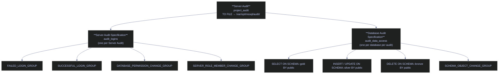

# Audit Logging

> [!quote]
> "The purpose of an audit trail is not to catch wrongdoers — it is to make wrongdoing visible."
>
> — **Gene Kim**, *The Phoenix Project* (2013)

SQL Server Audit tracks all security-relevant events (login attempts, permission changes, data access) to binary audit files (`.sqlaudit`). Required for regulatory compliance (IOSCO/ESMA for benchmark administrators, GDPR Article 30 data access logs) as outlined in the [compliance-and-auditability](https://alp78.github.io/elysium/13-Observability/Monitoring/compliance-and-auditability) framework. Events are written to disk and can be forwarded to GCP [Cloud Logging](https://alp78.github.io/elysium/06-GCP/Logging/cloud-logging) for centralized monitoring and alerting.

---

## SQL Server Audit Architecture

SQL Server Audit is a three-layer DDL system built into the SQL Server instance. The top-level **Server Audit** object (stored in `master`) defines *where* events are written — to a binary file, the Windows Security log, or the Windows Application log (the "target") — and *how* the system behaves if the audit target becomes unavailable. The choice of target matters: the Windows Application log can be read by any authenticated Windows user, whereas the Security log requires special configuration but is far more tamper-resistant. Using a dedicated file target (`.sqlaudit`) on a separate volume is the standard approach in high-throughput environments because you can distribute audit I/O independently from database data files. Multiple Server Audit objects can coexist on the same instance, each with its own target and failure policy.

Audit Specifications are child objects attached to the Server Audit that define *what* events are captured. A **Server Audit Specification** captures server-wide action groups (login events, role membership changes, permission grants); only **one** can exist per Server Audit. A **Database Audit Specification** captures database-level events (DML on specific schemas, DDL changes) for a specific database; only **one** per database per Server Audit is allowed.



```
┌──────────────────────────────────────────────────────────────────────┐
│                        SQL Server Audit System                       │
│                                                                      │
│  Server Audit (project_audit)                                          │
│  ├── Target: FILE (/var/opt/mssql/audit/)                           │
│  ├── Max Size: 100 MB per file                                       │
│  ├── Max Rollover Files: 10 (total ~1 GB)                            │
│  │                                                                   │
│  ├── Server Audit Specification (audit_logins)                       │
│  │   ├── FAILED_LOGIN_GROUP         (failed login attempts)          │
│  │   ├── SUCCESSFUL_LOGIN_GROUP     (successful logins)              │
│  │   ├── DATABASE_PERMISSION_CHANGE_GROUP (GRANT/DENY/REVOKE)       │
│  │   └── SERVER_ROLE_MEMBER_CHANGE_GROUP (role membership changes)   │
│  │                                                                   │
│  └── Database Audit Specification (audit_data_access)                │
│      ├── SELECT ON gold.* BY public    (all reads of gold schema)    │
│      ├── INSERT ON silver.* BY public  (all writes to silver)        │
│      └── DELETE ON bronze.* BY public  (all deletes from bronze)     │
│                                                                      │
└──────────────────┬───────────────────────────────────────────────────┘
                   │
                   ▼
        /var/opt/mssql/audit/
        ├── project_audit_*.sqlaudit  (binary audit files)
                   │
                   ▼
        ┌──────────────────────┐
        │  GCP Ops Agent       │
        │  (Cloud Logging)     │
        │                      │
        │  → Cloud Logging     │
        │  → BigQuery sink     │
        │  → Alert policies    │
        └──────────────────────┘
```

---

## Step 1: Create Server Audit

A Server Audit is an instance-level DDL object stored in `master` that defines the audit target and its operational parameters. It does not define *what* to audit — that is the responsibility of the Audit Specifications created in Steps 2 and 3. The audit is created in a disabled state by default and must be explicitly enabled with `ALTER SERVER AUDIT ... WITH (STATE = ON)`. The `.sqlaudit` binary file format is tamper-resistant: files cannot be opened as plain text and can only be read through `sys.fn_get_audit_file`.

Key parameters: `MAXSIZE` controls when the current file rotates (2 MB minimum, unlimited maximum); `MAX_ROLLOVER_FILES` sets how many files to keep before the oldest is deleted; `QUEUE_DELAY` (default minimum 1,000 ms) controls how long events can sit in the in-memory buffer before being flushed to disk — setting it to `0` forces synchronous writes but blocks threads until each write completes; `ON_FAILURE` controls instance behavior if the audit target is unavailable (`CONTINUE` keeps the instance running unaudited, `SHUTDOWN` halts the instance, `FAIL_OPERATION` rejects only audited operations while allowing non-audited ones).

> [!info] SQL Server 2022 — audit name with spaces
>
> In SQL Server 2019 and earlier, audit names cannot contain spaces. SQL Server 2022 removes this restriction. The `AUDIT_GUID` parameter is required when using database mirroring or Always On Availability Groups so that the primary and secondary replicas match the same audit object.

```sql
-- ============================================================
-- Create the audit target (where audit records are written)
-- ============================================================
USE master;
GO

-- Create server-level audit
CREATE SERVER AUDIT project_audit
TO FILE (
    FILEPATH = '/var/opt/mssql/audit/',
    MAXSIZE = 100 MB,
    MAX_ROLLOVER_FILES = 10,       -- Keep 10 files (1 GB total)
    RESERVE_DISK_SPACE = OFF       -- Don't pre-allocate
)
WITH (
    QUEUE_DELAY = 1000,            -- 1 second flush delay (balance between performance and freshness)
    ON_FAILURE = CONTINUE          -- Don't crash SQL Server if audit fails (use SHUTDOWN for strict compliance)
);
GO

-- Enable the audit
ALTER SERVER AUDIT project_audit WITH (STATE = ON);
GO

-- Verify audit is active
SELECT name, status_desc, audit_file_path, queue_delay, on_failure_desc
FROM sys.server_audits;
-- Expected output:
-- name          status_desc  audit_file_path               queue_delay  on_failure_desc
-- project_audit   STARTED      /var/opt/mssql/audit/         1000         CONTINUE
```

> [!tip] ON_FAILURE = SHUTDOWN
>
> ON_FAILURE = SHUTDOWN for Strict Compliance.
> If `ON_FAILURE = CONTINUE`, the database keeps running if audit logging fails (e.g., disk full). If `ON_FAILURE = SHUTDOWN`, SQL Server halts to ensure no unaudited operations occur. Use SHUTDOWN only when regulatory requirements mandate it — a disk-full condition would take your database offline.

---

## Step 2: Create Server Audit Specification (Login and Permission Events)

A Server Audit Specification is an instance-level child object attached to a Server Audit via `FOR SERVER AUDIT`. It defines which **server-level action groups** are captured. Action groups are predefined named sets of related events — `FAILED_LOGIN_GROUP`, for example, fires for every failed login attempt across all databases on the instance, regardless of application or client IP. Only **one** Server Audit Specification can exist per Server Audit object. Like the Server Audit itself, it is created disabled and must be activated with `WITH (STATE = ON)`.

Server-level specifications can only use action groups — they cannot target individual objects or schemas. Database-level DML auditing requires a Database Audit Specification (Step 3).

```sql
-- ============================================================
-- Track security events at the server level
-- ============================================================
CREATE SERVER AUDIT SPECIFICATION audit_logins
FOR SERVER AUDIT project_audit
ADD (FAILED_LOGIN_GROUP),                    -- Failed login attempts
ADD (SUCCESSFUL_LOGIN_GROUP),                -- Successful logins (useful for tracking who connects)
ADD (DATABASE_PERMISSION_CHANGE_GROUP),      -- GRANT, DENY, REVOKE statements
ADD (SERVER_ROLE_MEMBER_CHANGE_GROUP),       -- sp_addsrvrolemember, ALTER SERVER ROLE
ADD (LOGIN_CHANGE_PASSWORD_GROUP),           -- Password changes
ADD (SERVER_PRINCIPAL_CHANGE_GROUP),         -- CREATE/ALTER/DROP LOGIN
ADD (DATABASE_PRINCIPAL_CHANGE_GROUP)        -- CREATE/ALTER/DROP USER
WITH (STATE = ON);
GO

-- Verify
SELECT audit_specification_name, is_state_enabled
FROM sys.server_audit_specifications;
-- Expected:
-- audit_specification_name  is_state_enabled
-- audit_logins              1
```

---

## Step 3: Create Database Audit Specification (Data Access Events)

A Database Audit Specification is a per-database child object that defines which **database-level events** are captured for that specific database. Unlike server specifications (which only accept predefined action groups), database specifications also accept individual actions on specific schema objects — for example, `SELECT ON SCHEMA::gold BY public` audits every SELECT executed by any principal against any object in the `gold` schema. Only **one** Database Audit Specification per database can attach to a given Server Audit; to audit the same database against two different targets, create two Server Audit objects and attach one specification to each. The specification must be created within the context of the target database (`USE analytics_db`). Database Audit Specifications cannot be created in `tempdb`.

```sql
-- ============================================================
-- Track data access in the analytics database
-- ============================================================
USE analytics_db;
GO

CREATE DATABASE AUDIT SPECIFICATION audit_data_access
FOR SERVER AUDIT project_audit
ADD (SELECT ON SCHEMA::gold BY public),        -- Track all reads of gold schema
ADD (INSERT ON SCHEMA::silver BY public),       -- Track all writes to silver
ADD (UPDATE ON SCHEMA::silver BY public),       -- Track all updates to silver
ADD (DELETE ON SCHEMA::bronze BY public),       -- Track all deletes from bronze (should be rare)
ADD (EXECUTE ON SCHEMA::dbo BY public),         -- Track stored procedure execution
ADD (SCHEMA_OBJECT_CHANGE_GROUP)                -- Track DDL changes (CREATE/ALTER/DROP TABLE)
WITH (STATE = ON);
GO

-- Verify
SELECT audit_specification_name, is_state_enabled
FROM sys.database_audit_specifications;
-- Expected:
-- audit_specification_name  is_state_enabled
-- audit_data_access         1
```

---

## Step 4: Query Audit Logs

`sys.fn_get_audit_file` is a table-valued function that reads binary `.sqlaudit` files and returns one row per audited event. It accepts a wildcard path (e.g., `/var/opt/mssql/audit/*.sqlaudit`) to read across all rotated files simultaneously. All timestamps in the audit file are stored in UTC — always use `GETUTCDATE()`, not `GETDATE()`, for time comparisons. When a `statement` or `additional_information` field exceeds 4,000 characters, the record is split into multiple rows with the same `event_time`, `action_id`, and `session_id`; use `sequence_number` to reassemble them.

**Permission required:** `CONTROL SERVER` on SQL Server 2019 and earlier; the less-privileged `VIEW SERVER SECURITY AUDIT` is sufficient on SQL Server 2022+.

> [!info] action_id codes
>
> The `action_id` column is a two-to-four-character identifier for each event type:
>
> | action_id | Event |
> |---|---|
> | `LGIS` | Login Succeeded |
> | `LGIF` | Login Failed |
> | `LGO` | Logout |
> | `SL` | SELECT |
> | `IN` | INSERT |
> | `UP` | UPDATE |
> | `DL` | DELETE |
> | `EX` | EXECUTE |
> | `CR` | CREATE |
> | `AL` | ALTER |
> | `DR` | DROP |
> | `G` | GRANT |
> | `D` | DENY |
> | `R` | REVOKE |

### sys.fn_get_audit_file | recent audit events (last 1 hour)

Returns the 50 most recent events from all `.sqlaudit` files in the audit directory. The `CASE` expression decodes raw `action_id` codes into human-readable labels for ad-hoc investigation. `client_ip` and `application_name` columns were added in SQL Server 2017 — they will be NULL on earlier versions.

```sql
-- Read audit records from the audit files
SELECT TOP 50
    event_time,
    action_id,
    CASE action_id
        WHEN 'LGIS' THEN 'Login Succeeded'
        WHEN 'LGIF' THEN 'Login Failed'
        WHEN 'G '   THEN 'GRANT'
        WHEN 'D '   THEN 'DENY'
        WHEN 'R '   THEN 'REVOKE'
        WHEN 'SL'   THEN 'SELECT'
        WHEN 'IN'   THEN 'INSERT'
        WHEN 'UP'   THEN 'UPDATE'
        WHEN 'DL'   THEN 'DELETE'
        WHEN 'EX'   THEN 'EXECUTE'
        WHEN 'CR'   THEN 'CREATE'
        WHEN 'AL'   THEN 'ALTER'
        WHEN 'DR'   THEN 'DROP'
        ELSE action_id
    END AS action_desc,
    succeeded,
    server_principal_name,
    database_name,
    schema_name,
    object_name,
    statement,
    client_ip
FROM sys.fn_get_audit_file('/var/opt/mssql/audit/*.sqlaudit', DEFAULT, DEFAULT)
WHERE event_time > DATEADD(HOUR, -1, GETUTCDATE())
ORDER BY event_time DESC;
```

### sys.fn_get_audit_file | event summary by action (24 hours)

Groups events by `action_id` over the last 24 hours to identify unusual activity patterns. In a normal analytics workload, `SL` (SELECT) dominates with a high count; unexpected `DR` (DROP) or `AL` (ALTER) events outside a deployment window, or a spike in `LGIF` (Login Failed), warrant immediate investigation.

```sql
-- Summary: events per action in last 24 hours
SELECT
    action_id,
    COUNT(*) AS event_count,
    COUNT(DISTINCT server_principal_name) AS distinct_users,
    MIN(event_time) AS earliest,
    MAX(event_time) AS latest
FROM sys.fn_get_audit_file('/var/opt/mssql/audit/*.sqlaudit', DEFAULT, DEFAULT)
WHERE event_time > DATEADD(DAY, -1, GETUTCDATE())
GROUP BY action_id
ORDER BY event_count DESC;
-- Expected output (example):
-- action_id  event_count  distinct_users  earliest                    latest
-- SL         12450        3               2026-03-09 10:00:00.000     2026-03-10 09:59:00.000
-- LGIS       287          4               2026-03-09 10:00:00.000     2026-03-10 09:58:00.000
-- EX         156          2               2026-03-09 10:01:00.000     2026-03-10 09:55:00.000
-- IN         89           1               2026-03-09 17:00:00.000     2026-03-10 09:00:00.000
-- LGIF       3            1               2026-03-09 14:22:00.000     2026-03-09 14:22:05.000
```

---

## Step 5: Detect Brute-Force Login Attacks

Failed login events (`action_id = 'LGIF'`) are recorded by `FAILED_LOGIN_GROUP` in the Server Audit Specification. A single failed login typically means a forgotten password; more than 10 failures from the same IP within one hour is a reliable threshold for distinguishing automated scanning from human error. Credential stuffing attacks differ from pure brute force: instead of hammering one account repeatedly, they try many different username/password combinations sourced from prior data breaches. The distinguishing signal is the number of distinct usernames attempted from a single IP.

### Brute-force detection | 10+ failed logins from same IP in 1 hour

Groups `LGIF` events by `client_ip` over a one-hour rolling window. The `HAVING COUNT(*) > 10` threshold filters out incidental failures. `attack_duration_seconds` reveals the pace — 47 attempts spread over 46 seconds indicates an automated tool, not a human user typing the wrong password.

```sql
-- Alert on brute-force attempts: >10 failed logins from same IP in 1 hour
SELECT
    client_ip,
    COUNT(*) AS failed_attempts,
    MIN(event_time) AS first_attempt,
    MAX(event_time) AS last_attempt,
    DATEDIFF(SECOND, MIN(event_time), MAX(event_time)) AS attack_duration_seconds,
    COUNT(DISTINCT server_principal_name) AS distinct_logins_tried
FROM sys.fn_get_audit_file('/var/opt/mssql/audit/*.sqlaudit', DEFAULT, DEFAULT)
WHERE action_id = 'LGIF'  -- Login Failed
  AND event_time > DATEADD(HOUR, -1, GETUTCDATE())
GROUP BY client_ip
HAVING COUNT(*) > 10
ORDER BY failed_attempts DESC;
-- Expected output (during attack):
-- client_ip     failed_attempts  first_attempt               attack_duration_seconds  distinct_logins_tried
-- 10.0.2.55     47               2026-03-10 09:30:12.000     46                       5
```

### Credential stuffing detection | multiple usernames from same IP

Credential stuffing uses lists of username/password pairs harvested from prior breaches to replay against new targets. Unlike brute force (many attempts against one account), stuffing tries many different usernames. `HAVING COUNT(DISTINCT server_principal_name) > 3` flags IPs attempting more than three different login names — a strong indicator of automated credential replay rather than a legitimate user struggling with one password.

```sql
-- Detect credential stuffing: multiple different usernames from same IP
SELECT
    client_ip,
    STRING_AGG(DISTINCT server_principal_name, ', ') AS attempted_logins,
    COUNT(*) AS total_attempts
FROM sys.fn_get_audit_file('/var/opt/mssql/audit/*.sqlaudit', DEFAULT, DEFAULT)
WHERE action_id = 'LGIF'
  AND event_time > DATEADD(HOUR, -1, GETUTCDATE())
GROUP BY client_ip
HAVING COUNT(DISTINCT server_principal_name) > 3  -- Trying more than 3 different usernames = suspicious
ORDER BY total_attempts DESC;
```

---

## Step 6: GCP Cloud Logging Integration

Forward SQL Server error log and audit files to Cloud Logging for centralized monitoring, alerting, and long-term retention.

```yaml
# /etc/google-cloud-ops-agent/config.yaml
# Add these sections to the existing Ops Agent config

logging:
  receivers:
    sqlserver_errorlog:
      type: files
      include_paths:
        - /var/opt/mssql/log/errorlog
        - /var/opt/mssql/log/errorlog.*
      record_log_name: sqlserver_errorlog
      wildcard_refresh_interval: 60s
    sqlserver_audit:
      type: files
      include_paths:
        - /var/opt/mssql/audit/*.sqlaudit
      record_log_name: sqlserver_audit
      wildcard_refresh_interval: 30s
  service:
    pipelines:
      sql_pipeline:
        receivers:
          - sqlserver_errorlog
          - sqlserver_audit
```

```bash
# Restart Ops Agent to apply
sudo systemctl restart google-cloud-ops-agent

# Verify logs are flowing to Cloud Logging
gcloud logging read 'resource.type="gce_instance" AND logName:"sqlserver_errorlog"' \
  --limit=5 \
  --format="table(timestamp, jsonPayload.message)"
# Expected: recent SQL Server error log entries
```

---

## Step 7: Create Log-Based Alerts and BigQuery Sink

Route audit logs to BigQuery for long-term SQL-based analysis and create a Cloud Monitoring alert policy for failed login spikes. The BigQuery sink generates a new table per day in the target dataset. The sink's service account (auto-generated by GCP) must be granted `roles/bigquery.dataEditor` on the dataset before logs will flow — the sink creation itself does not grant this permission automatically.

```bash
# Sink audit logs to BigQuery for long-term analysis
gcloud logging sinks create sql-audit-sink \
  bigquery.googleapis.com/projects/data-platform-prod/datasets/security_logs \
  --log-filter='resource.type="gce_instance" AND logName:"sqlserver_audit"'

# Get the sink's service account (needed for BigQuery permissions)
gcloud logging sinks describe sql-audit-sink --format="value(writerIdentity)"
# Expected: serviceAccount:p123456789-123456@gcp-sa-logging.iam.gserviceaccount.com

# Grant the sink SA write access to the BigQuery dataset
bq add-iam-policy-binding \
  --member="serviceAccount:p123456789-123456@gcp-sa-logging.iam.gserviceaccount.com" \
  --role="roles/bigquery.dataEditor" \
  data-platform-prod:security_logs

# Create an alert policy for failed login spikes
gcloud monitoring policies create \
  --display-name="SQL Server Failed Logins Spike" \
  --condition-display-name="Failed logins > 10 in 5 min" \
  --condition-filter='resource.type="gce_instance" AND metric.type="logging.googleapis.com/user/sqlserver_failed_logins"' \
  --condition-threshold-value=10 \
  --condition-threshold-duration=300s \
  --notification-channels="projects/data-platform-prod/notificationChannels/CHANNEL_ID" \
  --combiner=OR
```

---

## Step 8: Quarterly Security Review

Run this review every quarter (set a recurring calendar reminder):

```sql
-- ============================================================
-- QUARTERLY SECURITY REVIEW SCRIPT
-- Run as sysadmin, document results
-- ============================================================

-- 1. Review all SQL logins and their status
PRINT '=== 1. SQL Server Logins ==='
SELECT
    name,
    type_desc,
    is_disabled,
    create_date,
    modify_date,
    LOGINPROPERTY(name, 'PasswordLastSetTime') AS password_last_set,
    LOGINPROPERTY(name, 'DaysUntilExpiration') AS days_until_expiry,
    LOGINPROPERTY(name, 'IsMustChange') AS must_change_password
FROM sys.server_principals
WHERE type IN ('S', 'U', 'G')
ORDER BY create_date;

-- 2. Check for orphaned users (users without matching logins)
PRINT '=== 2. Orphaned Users ==='
USE analytics_db;
SELECT dp.name AS user_name, dp.type_desc, dp.create_date
FROM sys.database_principals dp
LEFT JOIN sys.server_principals sp ON dp.sid = sp.sid
WHERE dp.type IN ('S', 'U')
  AND sp.sid IS NULL
  AND dp.name NOT IN ('dbo', 'guest', 'INFORMATION_SCHEMA', 'sys');
-- Expected: empty result set (no orphaned users)

-- 3. Review server role memberships
PRINT '=== 3. Server Role Memberships ==='
SELECT
    r.name AS role_name,
    m.name AS member_name,
    m.type_desc
FROM sys.server_role_members srm
JOIN sys.server_principals r ON srm.role_principal_id = r.principal_id
JOIN sys.server_principals m ON srm.member_principal_id = m.principal_id
ORDER BY r.name, m.name;
-- Expected: only necessary sysadmin members (ideally just sa, which should be disabled)

-- 4. Review database-level permissions
PRINT '=== 4. Database Permissions ==='
USE analytics_db;
SELECT
    dp.name AS principal_name,
    dp.type_desc,
    perm.permission_name,
    perm.state_desc,
    SCHEMA_NAME(o.schema_id) AS schema_name,
    o.name AS object_name,
    o.type_desc AS object_type
FROM sys.database_permissions perm
JOIN sys.database_principals dp ON perm.grantee_principal_id = dp.principal_id
LEFT JOIN sys.objects o ON perm.major_id = o.object_id
WHERE dp.name NOT IN ('dbo', 'guest', 'public', 'INFORMATION_SCHEMA', 'sys')
ORDER BY dp.name, schema_name, object_name;

-- 5. Verify TDE is still active and certificate is valid
PRINT '=== 5. TDE Status ==='
SELECT
    db.name,
    db.is_encrypted,
    c.name AS cert_name,
    c.expiry_date AS cert_expiry
FROM sys.databases db
LEFT JOIN sys.dm_database_encryption_keys dek ON db.database_id = dek.database_id
LEFT JOIN sys.certificates c ON dek.encryptor_thumbprint = c.thumbprint
WHERE db.name = 'analytics_db';
```

> [!tip] Set a Quarterly Calendar Reminder
>
> Security audits are only useful if they're done regularly. Create a recurring calendar event for "SQL Server Quarterly Security Review" with a link to this runbook and a template for documenting findings.

---

## Audit File Management

SQL Server audit files (`.sqlaudit`) are binary, append-only records written by the SQL Server process (running as `mssql` on Linux). Files rotate automatically when the current file reaches `MAXSIZE` (100 MB in this configuration). When `MAX_ROLLOVER_FILES` is reached (10 files ≈ 1 GB total), the oldest file is deleted automatically. SQL Server holds an exclusive write lock on the current active file — to delete or archive files manually, stop the audit first with `STATE = OFF`. Any events generated while the audit is stopped are not captured when `ON_FAILURE = CONTINUE`.

### sys.server_audits | check audit status and file path

Confirms the audit is running and shows the active file path. `status_desc` should read `STARTED`; a value of `STOPPED` means events are not being collected. Note: `sys.server_audits` and `sys.dm_server_audit_status` are related but distinct views — the DMV (`sys.dm_server_audit_status`) exposes the current buffer queue depth and I/O statistics, while `sys.server_audits` shows the configuration.

```sql
SELECT name, audit_file_path, status_desc
FROM sys.server_audits;
```

### ls -lh | list audit files on disk

Lists `.sqlaudit` files in the audit directory and their sizes. Files are owned by the `mssql` system account with `660` permissions — only the SQL Server service and members of the `mssql` group can read them directly from disk. The current active file (the one receiving new events) is held open by SQL Server and cannot be deleted while the audit is running.

```bash
ls -lh /var/opt/mssql/audit/
# Output:
# -rw-rw---- 1 mssql mssql 98M Mar 10 09:45 project_audit_20260310.sqlaudit
# -rw-rw---- 1 mssql mssql 100M Mar 09 00:00 project_audit_20260309.sqlaudit
```

### ALTER SERVER AUDIT | stop and restart audit for maintenance

Stopping the audit flushes all buffered events from the in-memory `QUEUE_DELAY` queue to the file before closing it. Use this before archiving or deleting old audit files. When the audit is restarted, SQL Server opens a new `.sqlaudit` file. Events generated between `STATE = OFF` and `STATE = ON` are not captured when `ON_FAILURE = CONTINUE`.

```sql
-- Stop temporarily (existing events are flushed to file first)
ALTER SERVER AUDIT project_audit WITH (STATE = OFF);

-- Restart
ALTER SERVER AUDIT project_audit WITH (STATE = ON);
```

---

## Related

- [tde-encryption](https://alp78.github.io/elysium/04-SQL-Server/Security/tde-encryption) — encryption at rest that complements audit logging for compliance
- [sql-server-authentication](https://alp78.github.io/elysium/04-SQL-Server/Security/sql-server-authentication) — login hardening, TLS, and firewall rules
- [server-configuration](https://alp78.github.io/elysium/04-SQL-Server/Administration/server-configuration) — instance settings including security configurations
- [performance-audit-playbook](https://alp78.github.io/elysium/04-SQL-Server/Performance/performance-audit-playbook) — Phase 11 security quick check using sysadmin membership and guest access queries
