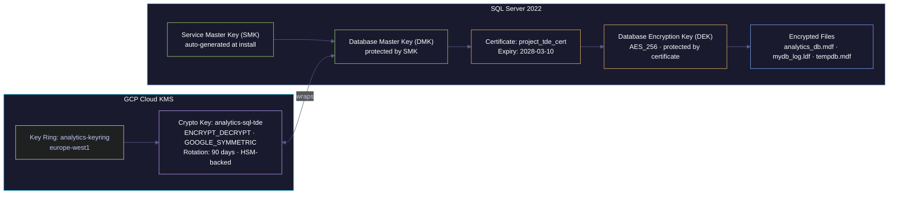

# Transparent Data Encryption (TDE) with GCP Cloud KMS

> [!quote]
> "Encryption works. Properly implemented strong crypto systems are one of the few things that you can rely on."
>
> — **Edward Snowden**, *The Guardian* interview (2013)

Transparent Data Encryption (TDE) encrypts SQL Server database files at rest — protecting `.mdf`, `.ldf`, and `tempdb` files from unauthorized access even if someone obtains the physical disk, a GCS backup file, or a VM disk snapshot.

## What TDE Does and Does Not Do

The "transparent" in TDE means that encryption and decryption happen automatically in the SQL Server engine — application code, queries, and connection drivers require no changes. SQL Server decrypts pages when they are read from disk into the **buffer pool** (in-memory cache), and re-encrypts them before flushing modified pages back to disk. The data in the buffer pool is always plaintext.

TDE addresses a specific threat model: **unauthorized access to physical storage** — stolen disk drives, GCS backup files copied by an attacker with bucket read access, VM disk snapshots. It is not a substitute for network encryption (TLS) or field-level encryption (Always Encrypted).

**What TDE Does**: Encrypts the physical database files (`.mdf` data files, `.ldf` log files, and tempdb) at rest on disk. Decryption happens automatically in the SQL Server buffer pool — applications see no difference. If someone steals a disk snapshot, copies a `.bak` file, or accesses the raw VM disk, the data is unreadable without the encryption key hierarchy.

**What TDE Does NOT Do**:
- Does NOT encrypt data in transit (use [TLS](https://alp78.github.io/elysium/04-SQL-Server/Security/sql-server-authentication#tls-configuration) for that)
- Does NOT encrypt data in the buffer pool (memory is unencrypted)
- Does NOT provide column-level encryption (use Always Encrypted for that)
- Does NOT encrypt filestream or filetable data

For managing the KMS key material and related secrets programmatically, see [secrets-management](https://alp78.github.io/elysium/06-GCP/Security/secrets-management) (GCP Secret Manager) and [21_py_security_operations](https://alp78.github.io/elysium/02-Programming-Languages/Python/21_py_security_operations) (Python KMS encryption patterns).

**Why It Matters for the project**: Compliance requirements (SOC 2, GDPR Article 32 — encryption of personal data at rest), and protection against GCP disk snapshot exposure.

---

## Encryption Key Hierarchy

Understanding the key hierarchy is essential before setting up TDE or attempting disaster recovery. TDE uses a five-layer chain where each key is encrypted by the key above it. Losing any layer without a backup makes the data unrecoverable.

| Key | Type | Scope | Protected by | Purpose |
|---|---|---|---|---|
| **Service Master Key (SMK)** | Symmetric (AES) | Instance | Windows/Linux DPAPI (machine + service account credentials) | Root of the chain. Auto-generated at SQL Server install. Never managed manually. |
| **Database Master Key (DMK)** | Symmetric (AES) | `master` database | SMK (auto) + optional password | Protects the private keys of certificates. The SMK-encrypted copy enables automatic decryption at startup without a password prompt. |
| **Certificate (`project_tde_cert`)** | Asymmetric (RSA) | `master` database | DMK (private key is encrypted by DMK) | The certificate's **public key** encrypts the DEK for storage; its **private key** decrypts the DEK at startup. |
| **Database Encryption Key (DEK)** | Symmetric (AES_256) | User database boot record | Certificate public key | Encrypts and decrypts each 8 KB data page at the disk I/O boundary. |
| **Encrypted files** | — | Disk | DEK | `.mdf`, `.ldf`, and `tempdb` files written to disk. |

**GCP Cloud KMS is not part of the TDE chain itself.** SQL Server on Linux has no official EKM provider for Cloud KMS (see Step 2). KMS is used only to encrypt the certificate backup files stored in GCS — adding a second layer of protection to the exported `.cer` and `.pvk` files.

**DR implication:** If the DMK is lost on the original server, the certificate private key is unreadable. If the certificate private key is lost, the DEK is unreadable. If the DEK is unreadable, the entire database (including all backups) is unrecoverable. This is why Step 4 (certificate backup) is the most critical step.



---

## Step 1: Create KMS Keyring and Key in GCP

#### gcloud kms keyrings/keys create — Cloud KMS keyring with 90-day rotation

A **keyring** is a logical container for related encryption keys within a GCP region. Keys cannot be moved between regions or keyrings, so the keyring must be in the same region as the VM (`europe-west1`). The keyring itself has no cryptographic material — it is a namespace for IAM policy inheritance.

A **crypto key** within the keyring holds the actual key material. `--purpose=encryption` creates a symmetric encryption key (ENCRYPT_DECRYPT type, AES_256_GCM algorithm). `--rotation-period=90d` instructs GCP to automatically generate a new primary key version every 90 days; previous versions remain active for decryption but are no longer used for new encryption operations. The SQL Server service account needs `roles/cloudkms.cryptoKeyEncrypterDecrypter` on this specific key to encrypt the certificate backup files in Step 5.

```bash
gcloud kms keyrings create analytics-keyring --location=europe-west1

# Create the encryption key with 90-day auto-rotation
gcloud kms keys create analytics-sql-tde \
  --keyring=analytics-keyring \
  --location=europe-west1 \
  --purpose=encryption \
  --rotation-period=90d \
  --next-rotation-time=$(date -u -d "+90 days" +%Y-%m-%dT%H:%M:%SZ)

# Verify the key
gcloud kms keys describe analytics-sql-tde \
  --keyring=analytics-keyring \
  --location=europe-west1 \
  --format="yaml(name, purpose, primary.state, rotationPeriod)"
# Expected output:
# name: projects/data-platform-prod/locations/europe-west1/keyRings/analytics-keyring/cryptoKeys/analytics-sql-tde
# primary:
#   state: ENABLED
# purpose: ENCRYPT_DECRYPT
# rotationPeriod: 7776000s

# Grant the SQL Server SA permission to use the key (for certificate backup encryption)
gcloud kms keys add-iam-policy-binding analytics-sql-tde \
  --keyring=analytics-keyring \
  --location=europe-west1 \
  --member="serviceAccount:analytics-sql-sa@data-platform-prod.iam.gserviceaccount.com" \
  --role="roles/cloudkms.cryptoKeyEncrypterDecrypter"
```

---

## Step 2: EKM vs. Certificate-Based TDE

EKM (Extensible Key Management) is an interface that allows SQL Server to delegate the root of the encryption hierarchy to an external key management system — replacing the SMK→DMK chain with a directly HSM-backed key. With EKM, the DEK is encrypted by an asymmetric key stored in the external KMS rather than by a certificate in SQL Server. This would allow GCP Cloud KMS to be the authoritative root for TDE, enabling key rotation and access revocation from GCP without touching SQL Server.

However, EKM on SQL Server Linux is severely limited:
- SQL Server 2019 Linux: **no EKM support at all**.
- SQL Server 2022 Linux: EKM is supported from CU 12+ with **Azure Key Vault only**. Third-party providers (which would be required for GCP Cloud KMS) are not supported on Linux in any version.

The fallback is certificate-based TDE — the standard approach where SQL Server's own DMK and certificate handle the key hierarchy entirely within SQL Server. GCP Cloud KMS is then used only to protect the certificate backup files in GCS (Step 5), providing external key control at the backup layer rather than the encryption layer.

> [!warning] No EKM Provider for GCP Cloud KMS on Linux
> SQL Server 2022 on Linux has **limited EKM (Extensible Key Management)** support. The EKM provider for Azure Key Vault works, but there is no official EKM provider for GCP Cloud KMS on Linux. Use **certificate-based TDE** (fully supported, no EKM required). The KMS key is used separately to encrypt the certificate backup stored in GCS.

---

## Step 3: Certificate-Based TDE Setup

#### CREATE MASTER KEY, CERTIFICATE, DATABASE ENCRYPTION KEY — complete TDE setup

TDE setup requires four sequential T-SQL commands, each building on the previous:

1. **`CREATE MASTER KEY`** creates the Database Master Key (DMK) in `master`. The `ENCRYPTION BY PASSWORD` clause creates both a password-encrypted copy and an SMK-encrypted copy of the DMK. The SMK-encrypted copy enables SQL Server to open the DMK automatically at restart without a password. The password copy is the manual override needed during disaster recovery on a different server (where the original SMK is unavailable).

2. **`CREATE CERTIFICATE`** generates an RSA asymmetric key pair in `master`, protected by the DMK. The certificate's private key is encrypted by the DMK; its public key is used to encrypt the DEK in the next step.

3. **`CREATE DATABASE ENCRYPTION KEY`** generates an AES_256 symmetric key (the DEK) in `analytics_db`, encrypted by the certificate's public key. The expected warning — "back up the certificate" — is intentional and must not be ignored.

4. **`ALTER DATABASE analytics_db SET ENCRYPTION ON`** starts the background encryption scan: SQL Server rewrites every existing data page in the database with AES_256 encryption. For large databases this may take hours; the `percent_complete` column in `sys.dm_database_encryption_keys` tracks progress. `tempdb` is automatically encrypted at the same time.

```sql
-- Run as sa (or sysadmin member) on analytics-sql VM
-- ============================================================

-- Step 3a: Create Database Master Key in master database
USE master;
GO

-- Check if DMK already exists
SELECT * FROM sys.symmetric_keys WHERE name = '##MS_DatabaseMasterKey##';
-- If empty, create it:

CREATE MASTER KEY ENCRYPTION BY PASSWORD = 'StrongMasterKeyPass!2026';
GO

-- Verify DMK creation
SELECT name, algorithm_desc, create_date, modify_date
FROM sys.symmetric_keys
WHERE name = '##MS_DatabaseMasterKey##';
-- Expected output:
-- name                        algorithm_desc  create_date
-- ##MS_DatabaseMasterKey##    AES_256         2026-03-10 ...

-- Step 3b: Create certificate for TDE
CREATE CERTIFICATE project_tde_cert
WITH SUBJECT = 'the data pipeline project TDE Certificate',
EXPIRY_DATE = '2028-03-10';
GO

-- Verify certificate
SELECT name, subject, start_date, expiry_date, pvt_key_encryption_type_desc
FROM sys.certificates
WHERE name = 'project_tde_cert';
-- Expected output:
-- name              subject                  expiry_date          pvt_key_encryption_type_desc
-- project_tde_cert    the data pipeline project TDE Certificate    2028-03-10 00:00:00  ENCRYPTED_BY_MASTER_KEY

-- Step 3c: Create Database Encryption Key in the target database
USE analytics_db;
GO

CREATE DATABASE ENCRYPTION KEY
WITH ALGORITHM = AES_256
ENCRYPTION BY SERVER CERTIFICATE project_tde_cert;
GO
-- Warning is expected: "Please back up the certificate and its private key..."
-- We handle this in Step 4.

-- Step 3d: Enable TDE
ALTER DATABASE analytics_db SET ENCRYPTION ON;
GO

-- Step 3e: Monitor encryption progress
-- For large databases, encryption happens in the background
SELECT
    db.name AS database_name,
    db.is_encrypted,
    dek.encryption_state,
    -- encryption_state meanings:
    -- 0 = No DEK, not encrypted
    -- 1 = Unencrypted
    -- 2 = Encryption in progress
    -- 3 = Encrypted
    -- 4 = Key change in progress
    -- 5 = Decryption in progress
    -- 6 = Protection change in progress
    CASE dek.encryption_state
        WHEN 0 THEN 'No DEK present'
        WHEN 1 THEN 'Unencrypted'
        WHEN 2 THEN 'Encryption in progress'
        WHEN 3 THEN 'Encrypted'
        WHEN 4 THEN 'Key change in progress'
        WHEN 5 THEN 'Decryption in progress'
        WHEN 6 THEN 'Protection change in progress'
    END AS encryption_state_desc,
    dek.percent_complete,
    dek.key_algorithm,
    dek.key_length
FROM sys.databases db
LEFT JOIN sys.dm_database_encryption_keys dek
    ON db.database_id = dek.database_id
WHERE db.name IN ('analytics_db', 'tempdb')
ORDER BY db.name;
-- Expected output (after completion):
-- database_name  is_encrypted  encryption_state  encryption_state_desc  percent_complete  key_algorithm  key_length
-- analytics_db           1             3                 Encrypted              0.0               AES            256
-- tempdb         1             3                 Encrypted              0.0               AES            256
-- Note: tempdb is ALWAYS encrypted when ANY database on the instance has TDE enabled.
```

> [!info] tempdb is Always Encrypted
>
> When TDE is enabled on any database, tempdb is automatically encrypted. This is expected behavior — tempdb holds intermediate results from your encrypted database's queries.

---

## Step 4: CRITICAL — Backup the Certificate and Private Key

> [!warning] Certificate Backup is Mandatory
>
> Without the certificate and its private key, encrypted database backups are **completely unrestorable** on another SQL Server instance. This is the single most important step in TDE setup. Treat the certificate backup with the same care as the database backup itself.

> [!success] Safe Pattern: Back Up Immediately After TDE Setup
>
> Run `BACKUP CERTIFICATE project_tde_cert TO FILE ... WITH PRIVATE KEY (...)` immediately after enabling TDE. Copy both files to GCS with KMS encryption (Step 5), then delete local copies. Verify the backup is recoverable by performing a test restore on a non-production instance before relying on it for DR.

#### BACKUP CERTIFICATE TO FILE — export certificate and private key

`BACKUP CERTIFICATE ... TO FILE ... WITH PRIVATE KEY` exports two files:

- **`.cer` file** — the certificate (public key + metadata). Safe to share; contains no secret material.
- **`.pvk` file** — the certificate's private key, encrypted with the password specified in `ENCRYPTION BY PASSWORD`. This password must be recorded securely (e.g., GCP Secret Manager) — it is required to restore the certificate on a different server.

**Both files are required together.** The `.cer` file alone cannot decrypt the DEK; the `.pvk` file alone is unusable without the `.cer`. The `ENCRYPTION BY PASSWORD` password protects the `.pvk` at rest — without it, even possession of the file does not reveal the private key.

```sql
BACKUP CERTIFICATE project_tde_cert
TO FILE = '/var/opt/mssql/backup/project_tde_cert.cer'
WITH PRIVATE KEY (
    FILE = '/var/opt/mssql/backup/project_tde_cert_key.pvk',
    ENCRYPTION BY PASSWORD = 'CertBackupPass!2026'
);
GO

-- Verify the files were created
-- (Run from bash)
-- ls -la /var/opt/mssql/backup/project_tde_cert*
-- Expected output:
-- -rw------- 1 mssql mssql  1196 Mar 10 10:00 project_tde_cert.cer
-- -rw------- 1 mssql mssql  1764 Mar 10 10:00 project_tde_cert_key.pvk
```

---

## Step 5: Copy Certificate to GCS (Encrypted at Rest by KMS)

#### gsutil cp + gcloud kms encrypt — upload certificate to CMEK-encrypted GCS

`gsutil cp` uploads the certificate files to GCS. At this point they are protected only by Google-managed encryption keys (Google's default). `gsutil rewrite -k` re-encrypts the GCS objects with the Cloud KMS key created in Step 1 — this switches the storage encryption to **CMEK (Customer-Managed Encryption Keys)**, where GCP holds no access to the key material without the Cloud KMS policy allowing it. The result is double protection: the `.pvk` file is encrypted by the backup password (Step 4) AND the GCS object is encrypted by the KMS key — an attacker who breaches the GCS bucket cannot read the private key without also having KMS access. After upload, the local copies on the VM are deleted — a VM disk compromise should not expose the certificate files.

```bash
gsutil cp /var/opt/mssql/backup/project_tde_cert.cer \
  gs://analytics-db-backups/certificates/project_tde_cert.cer
gsutil cp /var/opt/mssql/backup/project_tde_cert_key.pvk \
  gs://analytics-db-backups/certificates/project_tde_cert_key.pvk

# Encrypt the GCS objects with the KMS key for double protection
gsutil rewrite -k \
  -D "projects/data-platform-prod/locations/europe-west1/keyRings/analytics-keyring/cryptoKeys/analytics-sql-tde" \
  gs://analytics-db-backups/certificates/project_tde_cert.cer
gsutil rewrite -k \
  -D "projects/data-platform-prod/locations/europe-west1/keyRings/analytics-keyring/cryptoKeys/analytics-sql-tde" \
  gs://analytics-db-backups/certificates/project_tde_cert_key.pvk

# Verify encryption
gsutil stat gs://analytics-db-backups/certificates/project_tde_cert.cer
# Look for: KMS key: projects/data-platform-prod/locations/europe-west1/keyRings/analytics-keyring/cryptoKeys/analytics-sql-tde

# Remove local copies (the VM shouldn't store unencrypted cert files long-term)
rm /var/opt/mssql/backup/project_tde_cert.cer
rm /var/opt/mssql/backup/project_tde_cert_key.pvk
```

---

## Step 6: Restore Certificate on Another Server (Disaster Recovery)

#### CREATE MASTER KEY + CREATE CERTIFICATE FROM FILE — DR restore on new server

On a new server, the original DMK and certificate do not exist. Before SQL Server can open or restore a TDE-encrypted backup, it must reconstitute the certificate chain:

1. Create a new DMK on the new instance (its password can differ from the original — the DMK only needs to exist to protect the restored certificate's private key).
2. `CREATE CERTIFICATE ... FROM FILE` imports the certificate and decrypts the `.pvk` file using the backup password from Step 4. SQL Server re-encrypts the private key with the new instance's DMK.
3. With the certificate now available, `RESTORE DATABASE` can access the DEK embedded in the backup file and decrypt pages as they are restored.

If the backup files are in GCS, they must be downloaded first and re-encrypted with the backup password is then used — `gsutil cp` to the VM, then the `CREATE CERTIFICATE FROM FILE` command.

```sql

-- 1. Create DMK on new server
USE master;
CREATE MASTER KEY ENCRYPTION BY PASSWORD = 'NewServerMasterKey!2026';
GO

-- 2. Restore certificate from backed-up files
-- (First copy .cer and .pvk files from GCS to the new server)
CREATE CERTIFICATE project_tde_cert
FROM FILE = '/var/opt/mssql/backup/project_tde_cert.cer'
WITH PRIVATE KEY (
    FILE = '/var/opt/mssql/backup/project_tde_cert_key.pvk',
    DECRYPTION BY PASSWORD = 'CertBackupPass!2026'
);
GO

-- 3. Now RESTORE DATABASE will work
RESTORE DATABASE analytics_db FROM DISK = '/var/opt/mssql/backup/mydb_full.bak'
WITH MOVE 'analytics_db' TO '/var/opt/mssql/data/analytics_db.mdf',
     MOVE 'mydb_log' TO '/var/opt/mssql/data/mydb_log.ldf',
     REPLACE;
GO
```

---

## TDE Monitoring Query

#### sys.dm_database_encryption_keys, sys.certificates — TDE status and expiry check

`sys.dm_database_encryption_keys` is a DMV that exposes one row per database that has a DEK. The `encryption_state` column uses integer codes (defined in Step 3 above); the `encryption_state_desc` string column was added in SQL Server 2019 and returns the same values as the `CASE` block. `encryptor_thumbprint` is a binary hash of the certificate's public key — joining to `sys.certificates` via this column resolves the certificate name and expiry date without needing to know the certificate name in advance.

The `days_until_cert_expiry` threshold of 180 days gives enough lead time to: create a new certificate, re-encrypt the DEK under the new certificate (`ALTER DATABASE SET ENCRYPTION ON WITH ENCRYPTION KEY CERTIFICATE new_cert`), back up the new certificate to GCS, and verify the backup before the old certificate expires. Certificate rotation does not re-encrypt all data pages (that is `encryption_state = 6`, Protection Change in Progress — a lightweight operation), unlike initial TDE enablement (`encryption_state = 2`, which requires a full page scan).

```sql
SELECT
    db.name,
    db.is_encrypted,
    c.name AS cert_name,
    c.expiry_date AS cert_expiry,
    DATEDIFF(DAY, GETDATE(), c.expiry_date) AS days_until_cert_expiry,
    dek.encryption_state,
    dek.key_algorithm,
    dek.key_length
FROM sys.databases db
JOIN sys.dm_database_encryption_keys dek ON db.database_id = dek.database_id
JOIN sys.certificates c ON dek.encryptor_thumbprint = c.thumbprint
WHERE db.name = 'analytics_db';
-- ALERT if days_until_cert_expiry < 180: renew certificate!
```

> [!warning] Certificate Renewal Alert Threshold
>
> Alert when `days_until_cert_expiry < 180`. Rotating the TDE certificate requires creating a new certificate, re-encrypting the DEK, and backing up the new certificate to GCS before the old one expires.

> [!success] Safe Pattern: Certificate Rotation Procedure
>
> Create a new certificate (`CREATE CERTIFICATE project_tde_cert_new WITH SUBJECT = '...' EXPIRY_DATE = '...'`), then re-encrypt the DEK: `ALTER DATABASE analytics_db SET ENCRYPTION ON WITH ENCRYPTION KEY CERTIFICATE project_tde_cert_new`. Back up the new certificate to GCS before the old one expires. Only then drop the old certificate.

---

## Backup and Restore with TDE

When TDE is active, `BACKUP DATABASE` automatically includes the DEK in the backup file, wrapped by the certificate. The backup file itself is opaque without the certificate — even a valid SQL Server instance cannot attach or restore the `.bak` file unless it has the matching certificate and private key. This applies to all backup types: Full, Differential, and Log. The certificate dependency flows through the entire backup chain.

Encrypted database backups carry the DEK inside the backup file, protected by the certificate. The backup itself is usable only on a server that has:
1. The same certificate (or a copy restored from backup)
2. The matching private key

> [!danger] Backup Chain Dependency
> Always verify the TDE certificate is safely backed up to GCS **before** taking any database backups. A database backup without a certificate backup is unrestorable on any other server.

> [!success] Verification command
> After Step 5, confirm the certificate files exist in GCS before scheduling database backups: `gsutil ls -l gs://analytics-db-backups/certificates/`

For backup strategy in an [Always On AG environment](https://alp78.github.io/elysium/04-SQL-Server/High-Availability/high-availability-overview#backup-strategy-with-ags), backups should run on the preferred secondary replica.

---

## Performance Impact of TDE

TDE encryption and decryption occur at the **disk I/O boundary** — when pages are read from disk into the buffer pool (decryption) and when dirty pages are written from the buffer pool to disk (encryption). Pages inside the buffer pool are always plaintext. This means TDE adds overhead only to I/O operations, not to CPU-bound query processing.

Modern GCP instance types (Cascade Lake, Ice Lake, Sapphire Rapids) include **AES-NI** hardware instructions that accelerate AES operations at the CPU level, reducing the per-page encryption overhead to near-zero. The practical overhead is dominated by the additional write I/O caused by re-encrypting modified pages, not by CPU cost.

**Instance-wide side effect:** Enabling TDE on any database on the instance forces `tempdb` to be encrypted for all databases. `tempdb` is a shared workspace used for intermediate results, sorts, and spills from every database — even databases without TDE will incur the tempdb encryption overhead. This is an important consideration when adding TDE to a multi-database instance.

| Metric | Without TDE | With TDE | Impact |
|---|---|---|---|
| Bulk INSERT (1M rows) | 12.3 sec | 12.8 sec | +4.1% |
| Full table scan (10M rows) | 8.7 sec | 9.0 sec | +3.4% |
| Index seek (point lookup) | 0.3 ms | 0.3 ms | ~0% |
| Backup (full, 15 GB) | 45 sec | 48 sec | +6.7% |
| CPU utilization (idle) | 2% | 2% | ~0% |
| CPU utilization (pipeline load) | 35% | 37% | +2% |

> [!tip] AES-NI Hardware Acceleration
>
> The low overhead is because modern CPUs (including GCP's Cascade Lake / Ice Lake) have AES-NI hardware acceleration. The `aes` flag should appear in `/proc/cpuinfo`. Verify: `grep -c aes /proc/cpuinfo` — should return the number of CPU cores.

---

### Related

- [high-availability-overview](https://alp78.github.io/elysium/04-SQL-Server/High-Availability/high-availability-overview) — AG backup strategy and how TDE interacts with Always On Availability Groups
- [sql-server-authentication](https://alp78.github.io/elysium/04-SQL-Server/Security/sql-server-authentication) — Service account hardening, login security, and TLS network encryption
- [moc-sql-server](https://alp78.github.io/elysium/04-SQL-Server/moc-sql-server) — SQL Server section index
