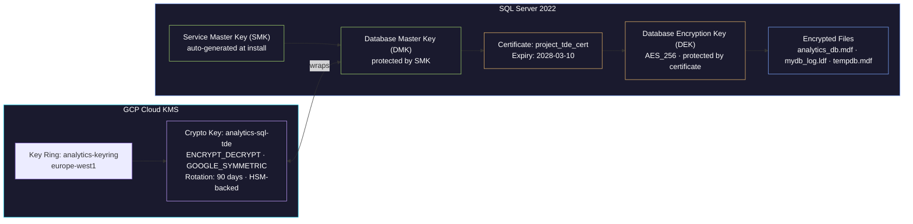

# Transparent Data Encryption (TDE) with GCP Cloud KMS

> [!quote]
> "Encryption works. Properly implemented strong crypto systems are one of the few things that you can rely on."
> — **Edward Snowden**

Transparent Data Encryption (TDE) encrypts SQL Server database files at rest — protecting `.mdf`, `.ldf`, and `tempdb` files from unauthorized access even if someone obtains the physical disk, a GCS backup file, or a VM disk snapshot.

### What TDE Does and Does Not Do

**What TDE Does**: Encrypts the physical database files (`.mdf` data files, `.ldf` log files, and tempdb) at rest on disk. Decryption happens automatically in the SQL Server buffer pool — applications see no difference. If someone steals a disk snapshot, copies a `.bak` file, or accesses the raw VM disk, the data is unreadable without the encryption key hierarchy.

**What TDE Does NOT Do**:
- Does NOT encrypt data in transit (use [TLS](https://alp78.github.io/elysium/04-SQL-Server/Security/sql-server-authentication#tls-configuration) for that)
- Does NOT encrypt data in the buffer pool (memory is unencrypted)
- Does NOT provide column-level encryption (use Always Encrypted for that)
- Does NOT encrypt filestream or filetable data

For managing the KMS key material and related secrets programmatically, see [secrets-management](https://alp78.github.io/elysium/06-GCP/Security/secrets-management) (GCP Secret Manager) and [21_py_security_operations](https://alp78.github.io/elysium/02-Programming-Languages/Python/21_py_security_operations) (Python KMS encryption patterns).

**Why It Matters for the project**: Compliance requirements (SOC 2, GDPR Article 32 — encryption of personal data at rest), and protection against GCP disk snapshot exposure.

---

### Encryption Key Hierarchy

Understanding the key hierarchy is essential before setting up TDE or attempting disaster recovery.



---

## Step 1: Create KMS Keyring and Key in GCP

#### gcloud kms keyrings/keys create — Cloud KMS keyring with 90-day rotation

```bash
# Create the keyring in the same region as the VM
gcloud kms keyrings create analytics-keyring --location=europe-west1

# Create the encryption key with 90-day auto-rotation
gcloud kms keys create analytics-sql-tde \
  --keyring=analytics-keyring \
  --location=europe-west1 \
  --purpose=encryption \
  --rotation-period=90d \
  --next-rotation-time=$(date -u -d "+90 days" +%Y-%m-%dT%H:%M:%SZ)

# Verify the key
gcloud kms keys describe analytics-sql-tde \
  --keyring=analytics-keyring \
  --location=europe-west1 \
  --format="yaml(name, purpose, primary.state, rotationPeriod)"
# Expected output:
# name: projects/data-platform-prod/locations/europe-west1/keyRings/analytics-keyring/cryptoKeys/analytics-sql-tde
# primary:
#   state: ENABLED
# purpose: ENCRYPT_DECRYPT
# rotationPeriod: 7776000s

# Grant the SQL Server SA permission to use the key (for certificate backup encryption)
gcloud kms keys add-iam-policy-binding analytics-sql-tde \
  --keyring=analytics-keyring \
  --location=europe-west1 \
  --member="serviceAccount:analytics-sql-sa@data-platform-prod.iam.gserviceaccount.com" \
  --role="roles/cloudkms.cryptoKeyEncrypterDecrypter"
```

---

### Step 2: EKM vs. Certificate-Based TDE

> [!important] No EKM Provider for GCP Cloud KMS on Linux
> SQL Server 2022 on Linux has **limited EKM (Extensible Key Management)** support. The EKM provider for Azure Key Vault works, but there is no official EKM provider for GCP Cloud KMS on Linux. Use **certificate-based TDE** (fully supported, no EKM required). The KMS key is used separately to encrypt the certificate backup stored in GCS.

---

## Step 3: Certificate-Based TDE Setup

#### CREATE MASTER KEY, CERTIFICATE, DATABASE ENCRYPTION KEY — complete TDE setup

```sql
-- ============================================================
-- TDE Setup for the project database
-- Run as sa (or sysadmin member) on analytics-sql VM
-- ============================================================

-- Step 3a: Create Database Master Key in master database
USE master;
GO

-- Check if DMK already exists
SELECT * FROM sys.symmetric_keys WHERE name = '##MS_DatabaseMasterKey##';
-- If empty, create it:

CREATE MASTER KEY ENCRYPTION BY PASSWORD = 'StrongMasterKeyPass!2026';
GO

-- Verify DMK creation
SELECT name, algorithm_desc, create_date, modify_date
FROM sys.symmetric_keys
WHERE name = '##MS_DatabaseMasterKey##';
-- Expected output:
-- name                        algorithm_desc  create_date
-- ##MS_DatabaseMasterKey##    AES_256         2026-03-10 ...

-- Step 3b: Create certificate for TDE
CREATE CERTIFICATE project_tde_cert
WITH SUBJECT = 'the data pipeline project TDE Certificate',
EXPIRY_DATE = '2028-03-10';
GO

-- Verify certificate
SELECT name, subject, start_date, expiry_date, pvt_key_encryption_type_desc
FROM sys.certificates
WHERE name = 'project_tde_cert';
-- Expected output:
-- name              subject                  expiry_date          pvt_key_encryption_type_desc
-- project_tde_cert    the data pipeline project TDE Certificate    2028-03-10 00:00:00  ENCRYPTED_BY_MASTER_KEY

-- Step 3c: Create Database Encryption Key in the target database
USE analytics_db;
GO

CREATE DATABASE ENCRYPTION KEY
WITH ALGORITHM = AES_256
ENCRYPTION BY SERVER CERTIFICATE project_tde_cert;
GO
-- Warning is expected: "Please back up the certificate and its private key..."
-- We handle this in Step 4.

-- Step 3d: Enable TDE
ALTER DATABASE analytics_db SET ENCRYPTION ON;
GO

-- Step 3e: Monitor encryption progress
-- For large databases, encryption happens in the background
SELECT
    db.name AS database_name,
    db.is_encrypted,
    dek.encryption_state,
    -- encryption_state meanings:
    -- 0 = No DEK, not encrypted
    -- 1 = Unencrypted
    -- 2 = Encryption in progress
    -- 3 = Encrypted
    -- 4 = Key change in progress
    -- 5 = Decryption in progress
    -- 6 = Protection change in progress
    CASE dek.encryption_state
        WHEN 0 THEN 'No DEK present'
        WHEN 1 THEN 'Unencrypted'
        WHEN 2 THEN 'Encryption in progress'
        WHEN 3 THEN 'Encrypted'
        WHEN 4 THEN 'Key change in progress'
        WHEN 5 THEN 'Decryption in progress'
        WHEN 6 THEN 'Protection change in progress'
    END AS encryption_state_desc,
    dek.percent_complete,
    dek.key_algorithm,
    dek.key_length
FROM sys.databases db
LEFT JOIN sys.dm_database_encryption_keys dek
    ON db.database_id = dek.database_id
WHERE db.name IN ('analytics_db', 'tempdb')
ORDER BY db.name;
-- Expected output (after completion):
-- database_name  is_encrypted  encryption_state  encryption_state_desc  percent_complete  key_algorithm  key_length
-- analytics_db           1             3                 Encrypted              0.0               AES            256
-- tempdb         1             3                 Encrypted              0.0               AES            256
-- Note: tempdb is ALWAYS encrypted when ANY database on the instance has TDE enabled.
```

> [!info] tempdb is Always Encrypted
>
> When TDE is enabled on any database, tempdb is automatically encrypted. This is expected behavior — tempdb holds intermediate results from your encrypted database's queries.

---

## Step 4: CRITICAL — Backup the Certificate and Private Key

> [!warning] Certificate Backup is Mandatory
>
> Without the certificate and its private key, encrypted database backups are **completely unrestorable** on another SQL Server instance. This is the single most important step in TDE setup. Treat the certificate backup with the same care as the database backup itself.

#### BACKUP CERTIFICATE TO FILE — export certificate and private key

```sql
-- Backup certificate and private key to files
BACKUP CERTIFICATE project_tde_cert
TO FILE = '/var/opt/mssql/backup/project_tde_cert.cer'
WITH PRIVATE KEY (
    FILE = '/var/opt/mssql/backup/project_tde_cert_key.pvk',
    ENCRYPTION BY PASSWORD = 'CertBackupPass!2026'
);
GO

-- Verify the files were created
-- (Run from bash)
-- ls -la /var/opt/mssql/backup/project_tde_cert*
-- Expected output:
-- -rw------- 1 mssql mssql  1196 Mar 10 10:00 project_tde_cert.cer
-- -rw------- 1 mssql mssql  1764 Mar 10 10:00 project_tde_cert_key.pvk
```

---

## Step 5: Copy Certificate to GCS (Encrypted at Rest by KMS)

#### gsutil cp + gcloud kms encrypt — upload certificate to CMEK-encrypted GCS

```bash
# Copy certificate and private key to GCS backup bucket
gsutil cp /var/opt/mssql/backup/project_tde_cert.cer \
  gs://analytics-db-backups/certificates/project_tde_cert.cer
gsutil cp /var/opt/mssql/backup/project_tde_cert_key.pvk \
  gs://analytics-db-backups/certificates/project_tde_cert_key.pvk

# Encrypt the GCS objects with the KMS key for double protection
gsutil rewrite -k \
  -D "projects/data-platform-prod/locations/europe-west1/keyRings/analytics-keyring/cryptoKeys/analytics-sql-tde" \
  gs://analytics-db-backups/certificates/project_tde_cert.cer
gsutil rewrite -k \
  -D "projects/data-platform-prod/locations/europe-west1/keyRings/analytics-keyring/cryptoKeys/analytics-sql-tde" \
  gs://analytics-db-backups/certificates/project_tde_cert_key.pvk

# Verify encryption
gsutil stat gs://analytics-db-backups/certificates/project_tde_cert.cer
# Look for: KMS key: projects/data-platform-prod/locations/europe-west1/keyRings/analytics-keyring/cryptoKeys/analytics-sql-tde

# Remove local copies (the VM shouldn't store unencrypted cert files long-term)
rm /var/opt/mssql/backup/project_tde_cert.cer
rm /var/opt/mssql/backup/project_tde_cert_key.pvk
```

---

## Step 6: Restore Certificate on Another Server (Disaster Recovery)

#### CREATE MASTER KEY + CREATE CERTIFICATE FROM FILE — DR restore on new server

```sql
-- On the NEW server (after restoring master database backup or fresh install):

-- 1. Create DMK on new server
USE master;
CREATE MASTER KEY ENCRYPTION BY PASSWORD = 'NewServerMasterKey!2026';
GO

-- 2. Restore certificate from backed-up files
-- (First copy .cer and .pvk files from GCS to the new server)
CREATE CERTIFICATE project_tde_cert
FROM FILE = '/var/opt/mssql/backup/project_tde_cert.cer'
WITH PRIVATE KEY (
    FILE = '/var/opt/mssql/backup/project_tde_cert_key.pvk',
    DECRYPTION BY PASSWORD = 'CertBackupPass!2026'
);
GO

-- 3. Now RESTORE DATABASE will work
RESTORE DATABASE analytics_db FROM DISK = '/var/opt/mssql/backup/mydb_full.bak'
WITH MOVE 'analytics_db' TO '/var/opt/mssql/data/analytics_db.mdf',
     MOVE 'mydb_log' TO '/var/opt/mssql/data/mydb_log.ldf',
     REPLACE;
GO
```

---

## TDE Monitoring Query

#### sys.dm_database_encryption_keys, sys.certificates — TDE status and expiry check

```sql
-- Check TDE status, certificate validity, and days until expiry
SELECT
    db.name,
    db.is_encrypted,
    c.name AS cert_name,
    c.expiry_date AS cert_expiry,
    DATEDIFF(DAY, GETDATE(), c.expiry_date) AS days_until_cert_expiry,
    dek.encryption_state,
    dek.key_algorithm,
    dek.key_length
FROM sys.databases db
JOIN sys.dm_database_encryption_keys dek ON db.database_id = dek.database_id
JOIN sys.certificates c ON dek.encryptor_thumbprint = c.thumbprint
WHERE db.name = 'analytics_db';
-- ALERT if days_until_cert_expiry < 180: renew certificate!
```

> [!warning] Certificate Renewal Alert Threshold
>
> Alert when `days_until_cert_expiry < 180`. Rotating the TDE certificate requires creating a new certificate, re-encrypting the DEK, and backing up the new certificate to GCS before the old one expires.

---

### Backup and Restore with TDE

Encrypted database backups carry the DEK inside the backup file, protected by the certificate. The backup itself is usable only on a server that has:
1. The same certificate (or a copy restored from backup)
2. The matching private key

> [!important] Backup Chain Dependency
> Always verify the TDE certificate is safely backed up to GCS **before** taking any database backups. A database backup without a certificate backup is unrestorable on any other server.

For backup strategy in an [Always On AG environment](https://alp78.github.io/elysium/04-SQL-Server/High-Availability/high-availability-overview#backup-strategy-with-ags), backups should run on the preferred secondary replica.

---

### Performance Impact of TDE

| Metric | Without TDE | With TDE | Impact |
|---|---|---|---|
| Bulk INSERT (1M rows) | 12.3 sec | 12.8 sec | +4.1% |
| Full table scan (10M rows) | 8.7 sec | 9.0 sec | +3.4% |
| Index seek (point lookup) | 0.3 ms | 0.3 ms | ~0% |
| Backup (full, 15 GB) | 45 sec | 48 sec | +6.7% |
| CPU utilization (idle) | 2% | 2% | ~0% |
| CPU utilization (pipeline load) | 35% | 37% | +2% |

> [!tip] AES-NI Hardware Acceleration
>
> The low overhead is because modern CPUs (including GCP's Cascade Lake / Ice Lake) have AES-NI hardware acceleration. The `aes` flag should appear in `/proc/cpuinfo`. Verify: `grep -c aes /proc/cpuinfo` — should return the number of CPU cores.

---

### Related

- [high-availability-overview](https://alp78.github.io/elysium/04-SQL-Server/High-Availability/high-availability-overview) — AG backup strategy and how TDE interacts with Always On Availability Groups
- [sql-server-authentication](https://alp78.github.io/elysium/04-SQL-Server/Security/sql-server-authentication) — Service account hardening, login security, and TLS network encryption
- [moc-sql-server](https://alp78.github.io/elysium/04-SQL-Server/moc-sql-server) — SQL Server section index
