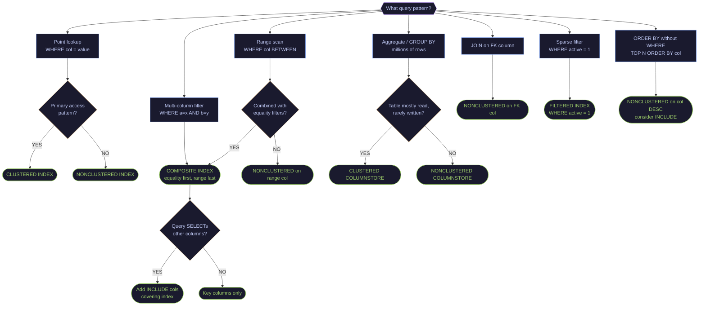

# Index Types and Strategy

> [!quote]
> "An index is a precomputed answer to a question the database expects you to ask. Choose your questions wisely, or pay the cost on every write."
>
> — **Markus Winand**, *SQL Performance Explained*

Indexes are the single most impactful lever for SQL Server query performance. The right index on the right columns turns a full table scan (thousands of page reads) into a B-tree seek (3-4 page reads). The wrong indexes, or too many indexes, slow down every INSERT, UPDATE, and DELETE. This note covers all index types, how to choose among them, and how to maintain them over time.

---

## Index Types — What They Are and When to Use Each

### B-Tree Rowstore Indexes (Default)

The standard index type. Data is organized in a balanced tree structure where leaf nodes contain the indexed columns (or full rows for clustered). Every query path in OLTP workloads relies on B-tree indexes.

| Index Type | What It Does | When to Use |
|---|---|---|
| **Clustered** | Physically sorts the entire table by the index key. The table IS the index — leaf nodes contain all columns. One per table. | Primary key, the column you most frequently range-scan or JOIN on. Example: `(symbol, date)` on `dbo.market_data`. |
| **Nonclustered** | Separate B-tree structure pointing back to the clustered index key (or heap RID). Multiple per table. | Filter columns in WHERE, JOIN keys, ORDER BY columns. |
| **Unique** | Clustered or nonclustered with a uniqueness constraint. Rejects duplicate values. | Primary keys, natural keys, any column that must be unique (e.g., `symbol + date`). |
| **Composite** | Single index on multiple columns. Column order matters — leftmost column is the most important. | Multi-column WHERE filters, covering queries. `(symbol, date)` vs `(date, symbol)` — use the one matching your most common filter first. |
| **Covering** | Nonclustered index that includes all columns a query needs via INCLUDE clause. Eliminates bookmark lookups. | Frequently-run queries where the nonclustered index is used but SQL Server still needs to look up extra columns from the clustered index. |
| **Filtered** | Nonclustered index with a WHERE clause — indexes only a subset of rows. | Sparse columns, status flags. Example: `WHERE active = 1` when 90% of rows are inactive. Smaller index, faster scans. |

### Columnstore Indexes

Data is stored column-by-column instead of row-by-row, compressed in segments of ~1M rows. Designed for analytics — aggregations over millions of rows scan only the needed columns.

| Index Type | What It Does | When to Use |
|---|---|---|
| **Clustered Columnstore (CCI)** | Replaces the entire table storage with columnar format. No B-tree. One per table. | Pure analytics/warehouse tables with bulk loads and aggregate queries. Not for single-row lookups. |
| **Nonclustered Columnstore (NCCI)** | Adds a columnar index alongside the existing rowstore table. Both coexist. | Hybrid OLTP+analytics — keep the rowstore for transactional writes, add NCCI for reporting queries. Example: add NCCI on `dbo.market_data` for dashboard aggregate queries while keeping rowstore for pipeline upserts. |

### When Columnstore Beats Rowstore

| Scenario | Winner | Why |
|---|---|---|
| `SELECT AVG(close) FROM ohlcv WHERE _index = 'market_index'` (millions of rows) | Columnstore | Reads only `close` and `_index` columns, 10x compression, batch mode execution |
| `SELECT * FROM ohlcv WHERE symbol = 'ASML' AND date = '2025-03-09'` (single row) | Rowstore | B-tree seeks to exact row in microseconds; columnstore must scan segments |
| `INSERT INTO ohlcv VALUES (...)` (single row) | Rowstore | Columnstore uses a deltastore for single inserts — slower, requires background tuple mover |
| Bulk load 100k+ rows | Columnstore | Direct segment compression, no B-tree maintenance |
| `GROUP BY sector ORDER BY avg_score DESC` | Columnstore | Batch mode aggregation, segment elimination |

---

## Exploring Existing Indexes

#### sys.indexes + sys.index_columns — list all indexes on a table

```sql
-- List ALL indexes on a specific table
SELECT
    i.name AS index_name,
    i.type_desc AS index_type,          -- CLUSTERED, NONCLUSTERED, CLUSTERED COLUMNSTORE, etc.
    i.is_unique,
    i.is_primary_key,
    i.filter_definition,                -- NULL if not filtered
    STRING_AGG(c.name, ', ') WITHIN GROUP (ORDER BY ic.key_ordinal) AS key_columns,
    STRING_AGG(CASE WHEN ic.is_included_column = 1 THEN c.name END, ', ') AS included_columns
FROM sys.indexes i
JOIN sys.index_columns ic ON i.object_id = ic.object_id AND i.index_id = ic.index_id
JOIN sys.columns c ON ic.object_id = c.object_id AND ic.column_id = c.column_id
WHERE i.object_id = OBJECT_ID('dbo.market_data')
GROUP BY i.name, i.type_desc, i.is_unique, i.is_primary_key, i.filter_definition
ORDER BY i.index_id;
-- key_columns = columns in the index key (order matters for composite)
-- included_columns = INCLUDE columns (leaf-only, not in the B-tree)
-- filter_definition = WHERE clause for filtered indexes
```

#### sys.indexes + sys.tables — list all indexes across the database

```sql
-- List ALL indexes across the entire database
SELECT
    OBJECT_SCHEMA_NAME(i.object_id) + '.' + OBJECT_NAME(i.object_id) AS table_name,
    i.name AS index_name,
    i.type_desc,
    i.is_unique,
    i.is_primary_key
FROM sys.indexes i
WHERE OBJECTPROPERTY(i.object_id, 'IsUserTable') = 1
ORDER BY table_name, i.index_id;
```

#### sys.dm_db_index_physical_stats — detailed index sizes and page counts

```sql
-- Detailed index info with sizes
SELECT
    OBJECT_SCHEMA_NAME(i.object_id) + '.' + OBJECT_NAME(i.object_id) AS table_name,
    i.name AS index_name,
    i.type_desc,
    ps.row_count,
    CAST(ps.used_page_count * 8.0 / 1024 AS DECIMAL(10,2)) AS size_mb,
    ps.in_row_data_page_count,
    ps.lob_used_page_count
FROM sys.indexes i
JOIN sys.dm_db_partition_stats ps ON i.object_id = ps.object_id AND i.index_id = ps.index_id
WHERE OBJECTPROPERTY(i.object_id, 'IsUserTable') = 1
ORDER BY size_mb DESC;
-- size_mb = how much disk space this index consumes
-- Largest indexes are candidates for review — are they actually used?
```

#### sys.indexes type = 0 — check if a table is a heap

```sql
-- Check if a table is a HEAP (no clustered index)
SELECT
    OBJECT_SCHEMA_NAME(object_id) + '.' + OBJECT_NAME(object_id) AS table_name
FROM sys.indexes
WHERE type = 0  -- 0 = HEAP
  AND OBJECTPROPERTY(object_id, 'IsUserTable') = 1;
-- Heaps have no physical ordering — every query is a full scan
-- Almost always add a clustered index (exception: staging tables with truncate-reload)
```

#### sys.index_columns is_descending_key — view columns with sort direction

```sql
-- View index columns with sort direction
SELECT
    i.name AS index_name,
    c.name AS column_name,
    ic.key_ordinal,
    CASE WHEN ic.is_descending_key = 1 THEN 'DESC' ELSE 'ASC' END AS sort_direction,
    ic.is_included_column
FROM sys.indexes i
JOIN sys.index_columns ic ON i.object_id = ic.object_id AND i.index_id = ic.index_id
JOIN sys.columns c ON ic.object_id = c.object_id AND ic.column_id = c.column_id
WHERE i.object_id = OBJECT_ID('dbo.market_data')
ORDER BY i.index_id, ic.key_ordinal;
```

---

## Index Usage Analysis — Are Your Indexes Being Used?

#### sys.dm_db_index_usage_stats — index reads vs writes since restart

```sql
-- Index usage statistics (reads vs. writes)
SELECT
    OBJECT_SCHEMA_NAME(i.object_id) + '.' + OBJECT_NAME(i.object_id) AS table_name,
    i.name AS index_name,
    i.type_desc,
    s.user_seeks,       -- index seek operations
    s.user_scans,       -- full index scans
    s.user_lookups,     -- bookmark lookups
    s.user_updates,     -- DML maintenance cost
    s.user_seeks + s.user_scans + s.user_lookups AS total_reads,
    s.last_user_seek,
    s.last_user_scan
FROM sys.indexes i
LEFT JOIN sys.dm_db_index_usage_stats s
    ON i.object_id = s.object_id AND i.index_id = s.index_id AND s.database_id = DB_ID()
WHERE OBJECTPROPERTY(i.object_id, 'IsUserTable') = 1
ORDER BY total_reads DESC;
```

> [!info] Interpreting Index Usage Stats
>
> - **High user_seeks, low user_scans** — healthy index (point lookups working)
> - **High user_scans** — possible missing covering columns or wrong index key
> - **High user_updates, zero reads** — dead index; drop it to save write overhead
> - **user_lookups > 0** — key lookup happening; consider adding INCLUDE columns

#### dm_db_index_usage_stats user_seeks = 0 — find unused indexes

```sql
-- UNUSED indexes (zero reads since last restart)
SELECT
    OBJECT_SCHEMA_NAME(i.object_id) + '.' + OBJECT_NAME(i.object_id) AS table_name,
    i.name AS index_name,
    i.type_desc,
    s.user_updates AS write_cost,
    CAST(ps.used_page_count * 8.0 / 1024 AS DECIMAL(10,2)) AS size_mb
FROM sys.indexes i
LEFT JOIN sys.dm_db_index_usage_stats s
    ON i.object_id = s.object_id AND i.index_id = s.index_id AND s.database_id = DB_ID()
JOIN sys.dm_db_partition_stats ps
    ON i.object_id = ps.object_id AND i.index_id = ps.index_id
WHERE OBJECTPROPERTY(i.object_id, 'IsUserTable') = 1
  AND i.type > 0  -- exclude heaps
  AND i.is_primary_key = 0
  AND i.is_unique_constraint = 0
  AND ISNULL(s.user_seeks, 0) = 0
  AND ISNULL(s.user_scans, 0) = 0
  AND ISNULL(s.user_lookups, 0) = 0
ORDER BY s.user_updates DESC;
```

> [!warning] Usage Stats Reset on Restart
>
> `dm_db_index_usage_stats` resets on service restart. Check uptime first: `SELECT sqlserver_start_time FROM sys.dm_os_sys_info`. Only drop unused indexes if uptime covers a full business cycle (at least 1 week).

#### sys.index_columns STRING_AGG — find duplicate indexes (same key columns)

```sql
-- DUPLICATE indexes (same key columns — waste of space and write I/O)
WITH IndexColumns AS (
    SELECT
        i.object_id,
        i.index_id,
        i.name,
        i.type_desc,
        STRING_AGG(c.name, ',') WITHIN GROUP (ORDER BY ic.key_ordinal) AS key_cols
    FROM sys.indexes i
    JOIN sys.index_columns ic ON i.object_id = ic.object_id AND i.index_id = ic.index_id AND ic.is_included_column = 0
    JOIN sys.columns c ON ic.object_id = c.object_id AND ic.column_id = c.column_id
    WHERE OBJECTPROPERTY(i.object_id, 'IsUserTable') = 1
    GROUP BY i.object_id, i.index_id, i.name, i.type_desc
)
SELECT
    OBJECT_SCHEMA_NAME(a.object_id) + '.' + OBJECT_NAME(a.object_id) AS table_name,
    a.name AS index_a, a.type_desc AS type_a,
    b.name AS index_b, b.type_desc AS type_b,
    a.key_cols
FROM IndexColumns a
JOIN IndexColumns b ON a.object_id = b.object_id AND a.key_cols = b.key_cols AND a.index_id < b.index_id;
-- Same key columns on the same table = one of them is redundant
-- Keep the one with INCLUDE columns or unique constraint; drop the other
```

---

## Missing Index Recommendations

#### sys.dm_db_missing_index_details — built-in missing index recommendations

```sql
-- SQL Server's built-in missing index suggestions
SELECT TOP 20
    CONVERT(DECIMAL(18,2), migs.avg_total_user_cost * migs.avg_user_impact *
        (migs.user_seeks + migs.user_scans)) AS improvement_score,
    migs.user_seeks,
    migs.user_scans,
    OBJECT_SCHEMA_NAME(mid.object_id) + '.' + OBJECT_NAME(mid.object_id) AS table_name,
    mid.equality_columns,     -- columns in WHERE col = value (highest selectivity)
    mid.inequality_columns,   -- columns in WHERE col > value, col BETWEEN, ORDER BY
    mid.included_columns,     -- columns in SELECT list (to avoid bookmark lookups)
    'CREATE NONCLUSTERED INDEX [IX_' + OBJECT_NAME(mid.object_id) + '_'
        + REPLACE(REPLACE(ISNULL(mid.equality_columns,''), ', ', '_'), '[', '')
        + '] ON ' + OBJECT_SCHEMA_NAME(mid.object_id) + '.' + OBJECT_NAME(mid.object_id)
        + ' (' + ISNULL(mid.equality_columns, '')
        + CASE WHEN mid.equality_columns IS NOT NULL AND mid.inequality_columns IS NOT NULL
               THEN ', ' ELSE '' END
        + ISNULL(mid.inequality_columns, '') + ')'
        + CASE WHEN mid.included_columns IS NOT NULL
               THEN ' INCLUDE (' + mid.included_columns + ')'
               ELSE '' END AS create_statement
FROM sys.dm_db_missing_index_groups mig
JOIN sys.dm_db_missing_index_group_stats migs ON mig.index_group_handle = migs.group_handle
JOIN sys.dm_db_missing_index_details mid ON mig.index_handle = mid.index_handle
WHERE mid.database_id = DB_ID()
ORDER BY improvement_score DESC;
```

> [!warning] Missing Index Suggestions Need Validation
>
> - Does this duplicate an existing index?
> - Is the table heavily written to? (more indexes = slower inserts)
> - Can you extend an existing index with INCLUDE instead of creating a new one?
> - These suggestions reset on service restart — only trust after sufficient uptime

#### XML plan MissingIndex — find cached plans with missing index warnings

```sql
-- Missing index suggestions from a specific query plan
SELECT TOP 10
    query_plan,
    total_elapsed_time / execution_count AS avg_elapsed_us,
    execution_count
FROM sys.dm_exec_query_stats qs
CROSS APPLY sys.dm_exec_query_plan(qs.plan_handle) qp
WHERE CAST(query_plan AS NVARCHAR(MAX)) LIKE '%MissingIndex%'
ORDER BY total_elapsed_time DESC;
-- Finds cached query plans that contain missing index warnings
```

---

## Creating Indexes — All Flavors

SQL Server supports several index types, each optimized for different query patterns. The right choice depends on the query workload — point lookups vs range scans vs analytics.

### Single-Column Nonclustered

> [!abstract] Single-Column Nonclustered Index
>
> A B-tree index on one column. Most common index type. Enables index seek for equality and range queries on that column.

```sql
-- Basic nonclustered index
CREATE NONCLUSTERED INDEX IX_market_data_symbol
ON dbo.market_data (symbol);

-- Unique nonclustered
CREATE UNIQUE NONCLUSTERED INDEX UX_instrument_tickers_symbol
ON dbo.instrument_tickers (symbol);
```

> [!info] Nonclustered Index Basics
>
> - Creates a B-tree on the specified column — enables index seek for `WHERE symbol = 'ASML'`
> - The `UNIQUE` variant enforces uniqueness and provides seek capability; rejects duplicate INSERT/UPDATE

### Composite (Multi-Column) Index

> [!abstract] Composite Index Definition
>
> A B-tree on multiple columns. Column ORDER matters: the index is useful only when queries filter on the leftmost columns.

```sql
-- Two-column composite index
CREATE NONCLUSTERED INDEX IX_market_data_symbol_date
ON dbo.market_data (symbol, date);

-- Three-column composite
CREATE NONCLUSTERED INDEX IX_daily_index_sector_date
ON dbo.daily_metrics (_index, sector, date DESC);
```

> [!tip] Composite Index Column Ordering
>
> Column order matters — the index is useful only when queries filter on the leftmost columns:
> - `WHERE symbol = 'ASML' AND date = '2025-03-09'` — **SEEK** (both columns used)
> - `WHERE symbol = 'ASML'` — **SEEK** (leftmost prefix)
> - `WHERE date = '2025-03-09'` — **SCAN** (first column skipped, index less useful)
>
> **Guideline:** equality columns first (most selective first), range/inequality column last.
> Example: `WHERE _index = 'market_index' AND sector = 'Technology' AND date >= '2025-01-01'` → index `(_index, sector, date)`

### Covering Indexes (with INCLUDE)

> [!abstract] Covering Index Definition
>
> Adds non-key columns to the leaf level of a nonclustered index. Eliminates key lookups by storing all columns the query needs directly in the index.

```sql
-- Nonclustered with INCLUDE columns
CREATE NONCLUSTERED INDEX IX_market_data_symbol_date_cover
ON dbo.market_data (symbol, date)
INCLUDE (close, volume, high, low);
-- Key columns (symbol, date) = used for seeking/filtering
-- INCLUDE columns (close, volume, high, low) = stored at leaf level only
```

> [!info] When and How to Use INCLUDE
>
> - Check the execution plan. If you see a **Key Lookup** or **RID Lookup**, the nonclustered index was used but SQL Server needed extra columns. Add those columns to INCLUDE.
> - Example: `SELECT symbol, date, close, volume FROM dbo.market_data WHERE symbol = 'ASML' AND date >= '2025-01-01'` — with the covering index above, no lookup needed.
> - **INCLUDE vs key column:** INCLUDE stores the column at the leaf level only (smaller B-tree, no effect on seek order). Only put columns in the key if they appear in WHERE or ORDER BY.

### Filtered Indexes

> [!abstract] Filtered Index Definition
>
> An index with a WHERE clause — indexes only rows matching the filter. Smaller, faster, and lower maintenance than a full index.

```sql
-- Index only active tickers
CREATE NONCLUSTERED INDEX IX_instrument_tickers_active
ON dbo.instrument_tickers (symbol, _index)
WHERE active = 1;
-- Only indexes rows where active = 1
-- Much smaller than a full index if most rows are inactive
-- Faster seeks, less storage, less maintenance overhead

-- Index only recent data
CREATE NONCLUSTERED INDEX IX_market_data_recent
ON dbo.market_data (symbol, date)
INCLUDE (close)
WHERE date >= '2024-01-01';

-- Parameterized query forcing filtered index usage
SELECT * FROM dbo.instrument_tickers WHERE symbol = @sym AND active = 1 OPTION (RECOMPILE);
```

> [!warning] Filtered Index Limitations
>
> - Filter must use simple comparisons (`=`, `>`, `<`, `IN`) — no functions, no `LIKE`
> - Query WHERE clause must be a superset of the filter, or SQL Server won't use the index
> - Parameterized queries require `OPTION(RECOMPILE)` because the optimizer doesn't know the parameter value at compile time (trade-off: compilation cost vs. better plan)

### Clustered Index (Primary Key)

> [!abstract] Clustered Index Definition
>
> Determines the physical row order of the table. There can be only one per table. Choose the key carefully — it affects ALL queries.

```sql
-- Create clustered index (defines physical row order)
CREATE CLUSTERED INDEX CX_market_data
ON dbo.market_data (symbol, date);
-- The table is now physically sorted by (symbol, date)
-- Only ONE clustered index per table
-- All nonclustered indexes point to the clustered key

-- Clustered on identity column (most common default)
CREATE TABLE dbo.audit_log (
    id BIGINT IDENTITY(1,1),
    event_type VARCHAR(50),
    event_data NVARCHAR(MAX),
    created_at DATETIME2 DEFAULT SYSUTCDATETIME(),
    CONSTRAINT PK_audit_log PRIMARY KEY CLUSTERED (id)
);
CREATE TABLE dbo.bad_example (
    id UNIQUEIDENTIFIER DEFAULT NEWSEQUENTIALID(),  -- sequential, not random
    CONSTRAINT PK_bad PRIMARY KEY CLUSTERED (id)
);
```

> [!info] Choosing the Clustered Index Key
>
> - **NARROW** — fewer bytes = smaller nonclustered indexes (they all store the clustered key)
> - **UNIQUE** — avoids the 4-byte uniquifier SQL Server adds to non-unique clustered keys
> - **STATIC** — columns that don't change; updates to the clustered key cause physical row moves
> - **EVER-INCREASING** — sequential values minimize page splits (INT IDENTITY, DATETIME2, SEQUENCE)

> [!danger] GUID as Clustered Key
>
> Random GUIDs (`NEWID()`) cause massive page splits and fragmentation. If you must use GUID, use `NEWSEQUENTIALID()` instead.

### Columnstore Index

> [!abstract] Columnstore Index Definition
>
> Stores data column-by-column instead of row-by-row. Compresses 10x and scans 10-100x faster for analytics. Not for point lookups.

```sql
-- Clustered Columnstore Index (CCI) — replaces table storage entirely
CREATE CLUSTERED COLUMNSTORE INDEX CCI_market_data_archive
ON dbo.market_data_archive;

-- CCI with ordering (SQL Server 2022+)
CREATE CLUSTERED COLUMNSTORE INDEX CCI_market_data_archive
ON dbo.market_data_archive
ORDER (symbol, date);

-- Nonclustered Columnstore Index (NCCI) — hybrid approach
CREATE NONCLUSTERED COLUMNSTORE INDEX NCCI_market_data_analytics
ON dbo.market_data (symbol, date, close, volume, high, low, _index);

-- Filtered NCCI — columnstore on a subset
CREATE NONCLUSTERED COLUMNSTORE INDEX NCCI_market_data_recent
ON dbo.market_data (symbol, date, close, volume)
WHERE date >= '2024-01-01';
```

> [!info] Columnstore Index Types and Usage
>
> - **CCI** — replaces table storage entirely with columnar segments (~1M rows each). 10x compression. Best for read-heavy analytics tables; avoid for single-row OLTP lookups.
> - **Ordered CCI** (SQL Server 2022+) — enables segment elimination based on sorted column min/max values, similar to Parquet row group pruning.
> - **NCCI** — adds columnstore alongside existing rowstore. Rowstore handles OLTP, NCCI handles analytics. The optimizer picks the right one per query.
> - **Filtered NCCI** — columnstore on a subset of rows. Smaller index, faster to build and maintain.
> - **Pipeline strategy:** keep rowstore clustered index for MERGE upserts, add NCCI for dashboard aggregate queries.

### Unique Constraints and Primary Keys

```sql
-- Primary Key (clustered by default)
ALTER TABLE dbo.instrument_tickers
ADD CONSTRAINT PK_instrument_tickers PRIMARY KEY CLUSTERED (symbol);

-- Primary Key (nonclustered — when you want a different clustered key)
ALTER TABLE dbo.daily_metrics
ADD CONSTRAINT PK_daily_metrics PRIMARY KEY NONCLUSTERED (symbol, date);
-- Useful when the clustered index should be on a different column (e.g., identity)

-- Unique constraint
ALTER TABLE dbo.instrument_tickers
ADD CONSTRAINT UQ_instrument_tickers_isin UNIQUE (isin);
-- Creates a unique nonclustered index behind the scenes
-- Allows one NULL (unlike some databases that allow multiple NULLs)
```

---

## Index Fragmentation — Detection and Maintenance

```sql
-- Check fragmentation for all indexes on a table
SELECT
    i.name AS index_name,
    i.type_desc,
    ips.avg_fragmentation_in_percent,
    ips.page_count,
    ips.avg_page_space_used_in_percent,
    ips.fragment_count
FROM sys.dm_db_index_physical_stats(DB_ID(), OBJECT_ID('dbo.market_data'), NULL, NULL, 'LIMITED') ips
JOIN sys.indexes i ON ips.object_id = i.object_id AND ips.index_id = i.index_id;
-- 'LIMITED' = fast scan (reads only parent pages, not leaf). Use 'DETAILED' for full accuracy.
```

> [!info] Fragmentation Thresholds
>
> - **< 5%** — do nothing
> - **5-30%** — REORGANIZE (online, lightweight)
> - **> 30%** — REBUILD (offline or online, heavier but thorough)
> - **page_count < 1000** — too small to matter, skip it
> - `avg_fragmentation_in_percent` = logical fragmentation (out-of-order pages)
> - `avg_page_space_used_in_percent` = how full each page is (low = wasted space)

#### sys.dm_db_index_physical_stats — check fragmentation across all indexes

```sql
-- Fragmentation across ALL indexes in the database
SELECT
    OBJECT_SCHEMA_NAME(ips.object_id) + '.' + OBJECT_NAME(ips.object_id) AS table_name,
    i.name AS index_name,
    ips.avg_fragmentation_in_percent,
    ips.page_count,
    ips.index_type_desc
FROM sys.dm_db_index_physical_stats(DB_ID(), NULL, NULL, NULL, 'LIMITED') ips
JOIN sys.indexes i ON ips.object_id = i.object_id AND ips.index_id = i.index_id
WHERE ips.page_count > 100    -- skip tiny indexes
  AND ips.avg_fragmentation_in_percent > 5  -- skip clean indexes
ORDER BY ips.avg_fragmentation_in_percent DESC;
```

### REORGANIZE (Online, Lightweight)

Use for 5-30% fragmentation. Safe to run during production hours.

```sql
-- Reorganize a specific index (online — no blocking)
ALTER INDEX IX_market_data_symbol_date ON dbo.market_data REORGANIZE;
-- Physically reorders leaf pages to match logical order
-- Online operation — table remains fully accessible during reorganize
-- Compacts pages to reclaim partially-used space
-- Best for: 5-30% fragmentation, production hours

-- Reorganize ALL indexes on a table
ALTER INDEX ALL ON dbo.market_data REORGANIZE;

-- Reorganize columnstore (forces delta rowgroups into compressed segments)
ALTER INDEX CCI_archive ON dbo.market_data_archive REORGANIZE
WITH (COMPRESS_ALL_ROW_GROUPS = ON);
-- COMPRESS_ALL_ROW_GROUPS = ON → forces open delta rowgroups to compress
-- Without this flag: only closes CLOSED delta rowgroups
-- Run after bulk loads to ensure all data is compressed
```

### REBUILD (Heavier, More Thorough)

Use for >30% fragmentation. Drops and recreates the index from scratch. Resets statistics.

```sql
-- Rebuild a specific index (offline by default)
ALTER INDEX IX_market_data_symbol_date ON dbo.market_data REBUILD;
-- Drops and recreates the entire index from scratch
-- Resets fragmentation to ~0%, updates statistics
-- OFFLINE: locks the table — no reads or writes during rebuild

-- Rebuild online (Enterprise/Developer edition only)
ALTER INDEX IX_market_data_symbol_date ON dbo.market_data REBUILD
WITH (ONLINE = ON);
-- Table remains accessible during rebuild
-- Takes longer than offline, uses more TempDB
-- Best for: production environments that can't afford downtime

-- Rebuild with options
ALTER INDEX IX_market_data_symbol_date ON dbo.market_data REBUILD
WITH (
    ONLINE = ON,
    FILLFACTOR = 90,              -- leave 10% free space on each page for future inserts
    SORT_IN_TEMPDB = ON,          -- use TempDB for sort work (reduces main DB I/O)
    DATA_COMPRESSION = PAGE,      -- compress at page level (saves ~60% space, slight CPU cost)
    MAXDOP = 2                    -- limit parallel threads to 2
);
-- FILLFACTOR: 100 = pack pages full (best for read-only), 80-90 = leave room for inserts
-- DATA_COMPRESSION: NONE | ROW (minimal) | PAGE (dictionary + prefix compression)

-- Rebuild ALL indexes on a table
ALTER INDEX ALL ON dbo.market_data REBUILD WITH (ONLINE = ON);

-- Rebuild columnstore
ALTER INDEX CCI_archive ON dbo.market_data_archive REBUILD;
-- Re-compresses all segments with optimal encoding
-- Also eliminates deleted rows (ghost records from DELETEs)
```

### Automated Maintenance Script

This script automates the rebuild/reorganize decision based on fragmentation thresholds. Run it weekly during low-usage windows.

```sql
-- Smart maintenance: reorganize or rebuild based on fragmentation level
DECLARE @TableName NVARCHAR(256), @IndexName NVARCHAR(256), @Frag FLOAT, @Pages BIGINT;
DECLARE @SQL NVARCHAR(MAX);

DECLARE idx_cursor CURSOR FOR
SELECT
    OBJECT_SCHEMA_NAME(ips.object_id) + '.' + OBJECT_NAME(ips.object_id),
    i.name,
    ips.avg_fragmentation_in_percent,
    ips.page_count
FROM sys.dm_db_index_physical_stats(DB_ID(), NULL, NULL, NULL, 'LIMITED') ips
JOIN sys.indexes i ON ips.object_id = i.object_id AND ips.index_id = i.index_id
WHERE ips.page_count > 100
  AND ips.avg_fragmentation_in_percent > 5
  AND i.name IS NOT NULL;

OPEN idx_cursor;
FETCH NEXT FROM idx_cursor INTO @TableName, @IndexName, @Frag, @Pages;

WHILE @@FETCH_STATUS = 0
BEGIN
    IF @Frag > 30
        SET @SQL = 'ALTER INDEX [' + @IndexName + '] ON ' + @TableName + ' REBUILD WITH (ONLINE = ON);';
    ELSE
        SET @SQL = 'ALTER INDEX [' + @IndexName + '] ON ' + @TableName + ' REORGANIZE;';

    PRINT @SQL;
    EXEC sp_executesql @SQL;
    FETCH NEXT FROM idx_cursor INTO @TableName, @IndexName, @Frag, @Pages;
END;

CLOSE idx_cursor;
DEALLOCATE idx_cursor;
```

> [!tip] Production Maintenance Recommendation
>
> Run weekly during low-usage windows (e.g., Sunday 02:00 UTC). For production environments, use [Ola Hallengren's maintenance solution](https://ola.hallengren.com/) instead — it is the industry standard.

---

## Statistics — The Optimizer's Data Map

Statistics tell the query optimizer how data is distributed in each column. Without accurate statistics, the optimizer makes bad guesses about row counts, leading to terrible execution plans.

#### sys.stats + dm_db_stats_properties — view all statistics on a table

```sql
-- View all statistics on a table
SELECT
    s.name AS stat_name,
    s.auto_created,
    s.user_created,
    s.no_recompute,
    sp.last_updated,
    sp.rows,
    sp.rows_sampled,
    sp.modification_counter    -- rows changed since last stats update
FROM sys.stats s
CROSS APPLY sys.dm_db_stats_properties(s.object_id, s.stats_id) sp
WHERE s.object_id = OBJECT_ID('dbo.market_data')
ORDER BY sp.last_updated;
-- modification_counter = how stale the stats are (high = needs update)
-- rows_sampled / rows = sample rate (< 100% means stats may be approximate)
```

#### dm_db_stats_properties modification_counter — find stale statistics

```sql
-- STALE statistics (changed significantly since last update)
SELECT
    OBJECT_SCHEMA_NAME(s.object_id) + '.' + OBJECT_NAME(s.object_id) AS table_name,
    s.name AS stat_name,
    sp.last_updated,
    sp.rows,
    sp.modification_counter,
    CAST(100.0 * sp.modification_counter / NULLIF(sp.rows, 0) AS DECIMAL(5,1)) AS pct_modified
FROM sys.stats s
CROSS APPLY sys.dm_db_stats_properties(s.object_id, s.stats_id) sp
WHERE OBJECTPROPERTY(s.object_id, 'IsUserTable') = 1
  AND sp.modification_counter > 0
ORDER BY sp.modification_counter DESC;
-- pct_modified > 20% → stats are likely stale
-- Auto-update triggers at ~20% modifications (or sqrt(1000 * rows) in SQL Server 2016+)
```

#### UPDATE STATISTICS WITH FULLSCAN — refresh statistics after bulk loads

```sql
-- Update statistics for a specific index
UPDATE STATISTICS dbo.market_data IX_market_data_symbol_date;

-- Update with full scan (most accurate — reads every row)
UPDATE STATISTICS dbo.market_data IX_market_data_symbol_date WITH FULLSCAN;
-- FULLSCAN = 100% sample — most accurate but slowest
-- Default sample = auto (SQL Server picks a sample rate based on table size)

-- Update ALL statistics on a table
UPDATE STATISTICS dbo.market_data WITH FULLSCAN;

-- Update ALL statistics in the database
EXEC sp_updatestats;
-- Updates only statistics that have been modified since last update
-- Uses default sample rate (not full scan)
```

#### DBCC SHOW_STATISTICS — view histogram data distribution

```sql
-- View the histogram (data distribution) for a statistic
DBCC SHOW_STATISTICS('dbo.market_data', 'IX_market_data_symbol_date');
-- Returns 3 result sets:
-- 1. Header: name, last updated, rows, rows sampled
-- 2. Density vector: average selectivity per column combination
-- 3. Histogram: up to 200 steps showing value distribution
--    RANGE_HI_KEY = upper bound of the step
--    EQ_ROWS = rows matching exactly this value
--    RANGE_ROWS = rows between previous step and this one
--    DISTINCT_RANGE_ROWS = distinct values in the range
--    AVG_RANGE_ROWS = average rows per distinct value in range
```

#### ALTER DATABASE SET AUTO_CREATE_STATISTICS ON — enable auto stats

```sql
-- Enable auto-create and auto-update (should always be ON)
ALTER DATABASE analytics_db SET AUTO_CREATE_STATISTICS ON;
ALTER DATABASE analytics_db SET AUTO_UPDATE_STATISTICS ON;
ALTER DATABASE analytics_db SET AUTO_UPDATE_STATISTICS_ASYNC ON;
-- AUTO_CREATE: creates statistics on columns used in WHERE when no stats exist
-- AUTO_UPDATE: refreshes stats when modification_counter exceeds threshold
-- ASYNC: stats update happens in background (query doesn't wait)
```

> [!tip] Update Stats After Bulk Loads
>
> Always Update Statistics After Bulk Loads.
> After any pipeline run that inserts or updates more than 10% of a table, statistics may be stale. The optimizer will make poor plan choices until statistics reflect the new data distribution. Run `UPDATE STATISTICS table WITH FULLSCAN` immediately after large loads.

---

### Index Strategy Decision Tree

Use this flowchart to decide which index type to create:



---

### Index Anti-Patterns and Common Mistakes

| Mistake | Why It's Bad | Fix |
|---|---|---|
| **Too many indexes** on a write-heavy table | Every INSERT/UPDATE/DELETE must maintain all indexes — slows writes by 2-10x | Drop unused indexes. Aim for 5-7 max on OLTP tables. |
| **Wrong column order** in composite index | `(date, symbol)` when queries filter by `symbol` first → index scan instead of seek | Put the most selective equality column first. |
| **Missing INCLUDE** columns | Nonclustered seek + key lookup to clustered = 2x I/O | Add frequently-selected columns to INCLUDE. |
| **GUID clustered key** (NEWID) | Random values → page splits → 99% fragmentation → excessive I/O | Use INT IDENTITY or NEWSEQUENTIALID(). |
| **Indexing every column** mentioned in missing index DMV | Missing index DMV suggests one index per query — creates explosion of overlapping indexes | Consolidate: one composite index can serve multiple queries. |
| **Never rebuilding** | Fragmentation grows → range scans read more pages → queries slow down over time | Weekly maintenance: REORGANIZE at 5-30%, REBUILD at >30%. |
| **Rebuilding tiny indexes** | Indexes under 1000 pages have negligible fragmentation impact — wasting maintenance time | Skip indexes with page_count < 1000. |
| **Over-indexing staging tables** | Staging tables are truncated and bulk-loaded — indexes slow down the load | Drop indexes before bulk load, recreate after. Or use heap (no clustered index). |
| **Not updating statistics** after large data loads | Stale statistics → optimizer estimates wrong row counts → picks bad join strategies | `UPDATE STATISTICS table WITH FULLSCAN` after bulk loads. |
| **Filtered index** without OPTION(RECOMPILE) | Parameterized queries may not use the filtered index because optimizer doesn't know the parameter value | Add `OPTION(RECOMPILE)` or use local variables. |

---

### Pipeline Index Strategy

Recommended index layout for the example data model:

```sql
CREATE NONCLUSTERED COLUMNSTORE INDEX NCCI_market_data_dashboard
ON dbo.market_data (symbol, date, [open], high, low, [close], volume, _index);

CREATE NONCLUSTERED INDEX IX_daily_index_date
ON dbo.daily_metrics (_index, date DESC)
INCLUDE (symbol, close, momentum_score, relative_value_score, sentiment_score);

CREATE NONCLUSTERED INDEX IX_quarterly_index
ON dbo.quarterly_metrics (_index)
INCLUDE (symbol, pe_ratio, pb_ratio, dividend_yield, quality_score, governance_score);

CREATE NONCLUSTERED INDEX IX_instrument_tickers_active_index
ON dbo.instrument_tickers (_index, symbol)
WHERE active = 1;

CREATE NONCLUSTERED COLUMNSTORE INDEX NCCI_gold_scores
ON dbo.gold_scores (symbol, date, composite_score, rank_overall, _index, sector);
```

> [!info] Index Design Rationale Per Table
>
> - **dbo.market_data** — millions of rows, daily bulk upserts. Clustered on `(symbol, date)` for pipeline MERGE and dashboard lookups. NCCI added for dashboard aggregate queries.
> - **dbo.daily_metrics** — derived signals, daily upserts. Clustered on `(symbol, date)`. Nonclustered on `(_index, date DESC)` with INCLUDE for dashboard leaderboard queries.
> - **dbo.quarterly_metrics** — quarterly fundamentals. Clustered on `(symbol, quarter_end)`. Nonclustered on `(_index)` with INCLUDE for dashboard reads.
> - **dbo.instrument_tickers** — small dimension table, rarely updated. Clustered PK on `(symbol)`. Filtered index on `(_index, symbol) WHERE active = 1`.
> - **dbo.gold_scores** — pre-computed, dashboard reads only. Clustered on `(symbol, date)`. NCCI for ranking queries.
> - **Maintenance:** UPDATE STATISTICS after each pipeline run (3x daily). REORGANIZE/REBUILD weekly (Sunday 02:00 UTC). Review unused and missing index DMVs monthly.

---

### Related

- [storage-internals](https://alp78.github.io/elysium/04-SQL-Server/Storage-and-Indexes/storage-internals) — B-tree page structure, page splits, and how indexes are stored
- [index-maintenance](https://alp78.github.io/elysium/04-SQL-Server/Performance/index-maintenance) — dedicated maintenance procedures and scheduling
- [sargable-queries](https://alp78.github.io/elysium/04-SQL-Server/T-SQL/sargable-queries) — writing predicates that enable index seeks instead of scans
- [execution-plans](https://alp78.github.io/elysium/04-SQL-Server/Performance/execution-plans) — reading execution plans to identify missing indexes and key lookups
- [performance-audit-playbook](https://alp78.github.io/elysium/04-SQL-Server/Performance/performance-audit-playbook) — structured audit incorporating index analysis
- [server-configuration](https://alp78.github.io/elysium/04-SQL-Server/Administration/server-configuration) — heap detection and statistics update after bulk loads
