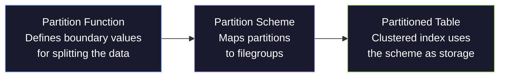
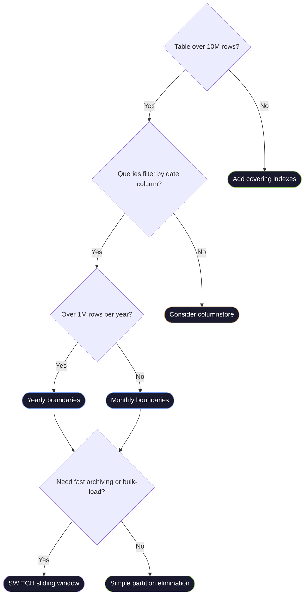

# Partitioning Strategies

> [!quote]
> "The key to performance is elegance, not battalions of special cases."
>
> — **Jon Bentley and Doug McIlroy**, *Programming Pearls* (1986)

SQL Server table partitioning divides a large table into smaller horizontal slices based on a partition key column — typically a date. Each partition is a logically independent unit: queries that filter on the partition key can skip entire partitions without scanning them (partition elimination). Partitions also enable fast `SWITCH` operations that move a full partition between tables in milliseconds — the basis for efficient archiving and sliding-window pipeline patterns. BigQuery uses the same partitioning concept for [cost optimization and query performance](https://alp78.github.io/elysium/06-GCP/BigQuery/querying-and-cost-optimization).

> [!info] When to Partition
>
> Only partition when a single table exceeds **10 million rows** and queries consistently filter by the partition key. Partitioning small tables adds metadata overhead with no performance benefit. The number one use case is large time-series tables (financial price data, pipeline audit logs) where most queries filter by `trade_date` or a similar date column.

### Clustered Index on Partitioned vs Non-Partitioned Tables

On a non-partitioned table, a clustered index physically orders ALL rows in the table by the index key. A seek on `(symbol, trade_date)` navigates one B-tree to find the exact page.

On a partitioned table, each partition has its own independent B-tree for the clustered index. A query filtering on the partition key first eliminates partitions (metadata check), then seeks within the surviving partition's B-tree. This is faster for partition-key queries (fewer pages to scan) but adds overhead for queries that don't filter on the partition key — SQL Server must seek across ALL partition B-trees (a "partition-spanning seek").

> [!warning] Non-Partition-Key Queries Are Slower
>
> A query like `WHERE symbol = 'ASML'` without a trade_date filter must scan every partition's B-tree independently. On a non-partitioned table, this would be a single index seek. On a 7-partition table, it becomes 7 separate seeks merged together. Only partition tables where the vast majority of queries filter on the partition key.

---

## How SQL Server Partitioning Works

SQL Server partitioning has three required components:



#### Partitioning layout — yearly boundaries for market_data time-series

| Partition | Range | Description |
|---|---|---|
| 1 | trade_date < 2021-01-01 | Pre-2021 historical |
| 2 | 2021-01-01 to 2021-12-31 | 2021 |
| 3 | 2022-01-01 to 2022-12-31 | 2022 |
| 4 | 2023-01-01 to 2023-12-31 | 2023 |
| 5 | 2024-01-01 to 2024-12-31 | 2024 |
| 6 | 2025-01-01 to 2025-12-31 | 2025 |
| 7 | trade_date >= 2026-01-01 | 2026 — current year |

---

### Step 1: Create the Partition Function

The partition function defines the boundary values and whether the boundary belongs to the left or right partition.

> [!example] Yearly partition function for trade_date
>
> With `RANGE RIGHT`, the boundary value goes in the right (higher) partition:
> Partition 1 gets `trade_date < '2021-01-01'`, Partition 2 gets `>= '2021-01-01' AND < '2022-01-01'`, etc.

```sql
-- Yearly partition function for trade_date (DATE type)
CREATE PARTITION FUNCTION pf_trade_date_yearly (DATE)
AS RANGE RIGHT FOR VALUES (
    '2021-01-01',
    '2022-01-01',
    '2023-01-01',
    '2024-01-01',
    '2025-01-01',
    '2026-01-01'
);

-- Verify the function was created
SELECT
    pf.name,
    pf.boundary_value_on_right,
    prv.value AS boundary_value,
    prv.boundary_id
FROM sys.partition_functions pf
JOIN sys.partition_range_values prv ON pf.function_id = prv.function_id
WHERE pf.name = 'pf_trade_date_yearly'
ORDER BY prv.boundary_id;
```

> [!info] RIGHT vs LEFT Boundaries
>
> RIGHT vs LEFT Partition Functions.
> - **RANGE RIGHT:** The boundary value is included in the RIGHT (higher) partition. `'2022-01-01'` goes into the "2022" partition.
> - **RANGE LEFT:** The boundary value is included in the LEFT (lower) partition. `'2021-12-31'` goes into the "2021" partition.
>
> For date-based partitions, RANGE RIGHT is the conventional choice because the boundary is the first day of the new period.

---

### Step 2: Create the Partition Scheme

The partition scheme maps each partition to a filegroup. For most workloads, all partitions map to `PRIMARY`.

> [!info] What Is a Filegroup?
>
> A filegroup is a named collection of data files that SQL Server uses as a storage target. The default `PRIMARY` filegroup stores everything. Creating additional filegroups (like `ARCHIVE`) lets you place older partitions on slower/cheaper storage while keeping current data on fast SSDs.

> [!tip] Archive Filegroup Pattern
>
> For cold historical partitions, create a dedicated `ARCHIVE` filegroup on slower storage. Map old partitions to ARCHIVE and the current partition to PRIMARY. This reduces SSD costs while keeping hot data fast.

```sql
-- Simple scheme: all partitions on the PRIMARY filegroup
CREATE PARTITION SCHEME ps_trade_date_yearly
AS PARTITION pf_trade_date_yearly
ALL TO ([PRIMARY]);
```

---

### Step 3: Create the Partitioned Table

The clustered index must use the partition scheme and include the partition key column.

```sql
-- Create a partitioned version of dbo.market_data
-- The clustered index key must include the partition key (trade_date)
CREATE TABLE dbo.market_data_partitioned (
    trade_date      DATE            NOT NULL,
    symbol          NVARCHAR(20)    NOT NULL,
    [open]          DECIMAL(18, 6)  NULL,
    high            DECIMAL(18, 6)  NULL,
    low             DECIMAL(18, 6)  NULL,
    [close]         DECIMAL(18, 6)  NULL,
    volume          BIGINT          NULL,
    [index]         NVARCHAR(100)   NOT NULL,
    loaded_at       DATETIME2       NOT NULL DEFAULT SYSUTCDATETIME(),

    CONSTRAINT CIX_market_data_partitioned
        PRIMARY KEY CLUSTERED (trade_date, symbol)
        ON ps_trade_date_yearly (trade_date)  -- partition scheme on the key column
)
WITH (DATA_COMPRESSION = PAGE);  -- can apply compression to all partitions at once
```

> [!warning] Partition Key in Clustered Index
>
> Partition Key Must Be in the Clustered Index Key.
> The partition key column (`trade_date`) must be part of the clustered index key. If you try to create a partitioned table on a column not in the clustered index, SQL Server will raise an error. For a table partitioned by `trade_date`, the clustered index key should be `(trade_date, symbol)` — trade_date first (for partition elimination) or second (for symbol-first lookups, but then partition elimination only works if trade_date is also in the WHERE clause).

---

### Partition Elimination — How Queries Skip Partitions

When a query includes a filter on the partition key, SQL Server's optimizer uses the partition function to determine which partitions could contain matching rows and skips the rest.

> [!question] How to Verify Partition Elimination
>
> In the execution plan, look for "Actual Partition Count" in the Clustered Index Seek properties. If it shows 1 or 2, partition elimination is working. If it shows the total partition count (e.g., 7), the query is scanning all partitions — likely a non-SARGable predicate on the partition key.

```sql
-- This query hits ONLY partition 6 (2025 data) — eliminates 6 out of 7 partitions
SELECT symbol, trade_date, [close]
FROM dbo.market_data_partitioned
WHERE trade_date BETWEEN '2025-01-01' AND '2025-12-31'
  AND symbol = 'ASML';

-- Query to see which partitions contain data
SELECT
    partition_number,
    rows,
    data_compression_desc AS compression,
    CAST(used_pages * 8.0 / 1024 AS DECIMAL(10,2)) AS size_mb
FROM sys.dm_db_partition_stats ps
JOIN sys.partitions p ON ps.partition_id = p.partition_id
WHERE p.object_id = OBJECT_ID('dbo.market_data_partitioned')
  AND p.index_id = 1  -- clustered index
ORDER BY partition_number;
```

> [!warning] Partition Elimination Needs SARGable Predicates
>
> Partition Elimination Requires a SARGable Predicate on the Partition Key.
> `WHERE trade_date >= '2025-01-01'` — eliminates older partitions. Good.
> `WHERE YEAR(trade_date) = 2025` — wraps the column in a function. SQL Server may NOT eliminate partitions. Use [sargable-queries](https://alp78.github.io/elysium/04-SQL-Server/T-SQL/sargable-queries) patterns: always filter directly on the column.

---

## SWITCH — Millisecond Partition Operations

`ALTER TABLE ... SWITCH` is the most powerful partitioning feature. It moves a partition between tables by updating metadata only — no data movement, no row-by-row processing. A billion-row partition switches in milliseconds.

#### Creating the archive table

The archive table must have an identical schema (columns, types, nullability, defaults) and an identical clustered index key to the partitioned table.

```sql
CREATE TABLE dbo.market_data_archive (
    trade_date      DATE            NOT NULL,
    symbol          NVARCHAR(20)    NOT NULL,
    [open]          DECIMAL(18, 6)  NULL,
    high            DECIMAL(18, 6)  NULL,
    low             DECIMAL(18, 6)  NULL,
    [close]         DECIMAL(18, 6)  NULL,
    volume          BIGINT          NULL,
    [index]         NVARCHAR(100)   NOT NULL,
    loaded_at       DATETIME2       NOT NULL DEFAULT SYSUTCDATETIME(),

    CONSTRAINT CIX_market_data_archive
        PRIMARY KEY CLUSTERED (trade_date, symbol)
        ON [PRIMARY]  -- or ARCHIVE filegroup
)
WITH (DATA_COMPRESSION = PAGE);
```

#### Switching a partition OUT to archive

Switch partition 1 (pre-2021 data) out of the main table into the archive. This takes milliseconds — no data movement, only a metadata update. After the switch, partition 1 in the main table is empty and all pre-2021 rows live in the archive table.

```sql
ALTER TABLE dbo.market_data_partitioned
SWITCH PARTITION 1
TO dbo.market_data_archive;
```

#### Creating the staging table

The staging table must use the same partition scheme and have an identical schema. Data is loaded here first without blocking the main table.

```sql
CREATE TABLE dbo.market_data_staging_2026 (
    trade_date      DATE            NOT NULL,
    symbol          NVARCHAR(20)    NOT NULL,
    [open]          DECIMAL(18, 6)  NULL,
    high            DECIMAL(18, 6)  NULL,
    low             DECIMAL(18, 6)  NULL,
    [close]         DECIMAL(18, 6)  NULL,
    volume          BIGINT          NULL,
    [index]         NVARCHAR(100)   NOT NULL,
    loaded_at       DATETIME2       NOT NULL DEFAULT SYSUTCDATETIME(),

    CONSTRAINT CIX_staging_2026
        PRIMARY KEY CLUSTERED (trade_date, symbol)
        ON ps_trade_date_yearly (trade_date)  -- must use same partition scheme
)
WITH (DATA_COMPRESSION = PAGE);
```

#### Loading data into staging

Loading into the staging table can take minutes but does not block the main partitioned table.

```sql
INSERT INTO dbo.market_data_staging_2026 (trade_date, symbol, ...)
SELECT ...
FROM external_source
WHERE trade_date >= '2026-01-01';
```

#### Switching staging IN as a partition

This takes milliseconds — atomically replaces the empty partition with the loaded data.

```sql
ALTER TABLE dbo.market_data_staging_2026
SWITCH TO dbo.market_data_partitioned PARTITION 7;
```

> [!warning] SWITCH Requirements
>
> Both source and target tables must:
> - Have identical column definitions (same names, types, nullability, defaults)
> - Have identical indexes (clustered index key columns and order)
> - Use the same partition scheme (or the target is partitioned and source is not — single partition switch)
> - The target partition must be empty before a SWITCH IN
> - Both tables must be in the same database

---

## Adding New Partitions — Sliding Window Pattern

In a daily/yearly pipeline, new partitions must be added before data for the new period arrives. Without a new boundary, all new-year data lands in the last open-ended partition.

#### Step 1: Designate the next filegroup

Before splitting, tell the partition scheme which filegroup the new partition should use.

```sql
ALTER PARTITION SCHEME ps_trade_date_yearly
NEXT USED [PRIMARY];
```

#### Step 2: Split the boundary

Add a new boundary value to the partition function. The 2026 partition is now bounded on the right (`>= '2026-01-01' AND < '2027-01-01'`), and a new empty partition 8 exists for 2027 data.

```sql
ALTER PARTITION FUNCTION pf_trade_date_yearly ()
SPLIT RANGE ('2027-01-01');
```

#### Step 3: Verify the new partition

Confirm the partition function now has 7 boundaries (8 partitions) and the new partition exists.

```sql
SELECT
    partition_number,
    rows,
    CAST(used_pages * 8.0 / 1024 AS DECIMAL(10,2)) AS size_mb
FROM sys.dm_db_partition_stats
WHERE object_id = OBJECT_ID('dbo.market_data_partitioned')
ORDER BY partition_number;
```

#### Sliding Window — ALTER PARTITION FUNCTION MERGE RANGE remove old partitions

A sliding window maintains a fixed number of active partitions by adding new ones at the front and removing old ones at the back. As 2027 data starts arriving, a new partition is added (SPLIT). Once 2020 data is archived, the old boundary is removed (MERGE). The window slides forward, keeping the partition count constant.

> [!danger] Always SWITCH Before MERGE
>
> MERGE RANGE removes a partition boundary but does NOT delete the data — it combines two partitions into one. If you merge without switching out the data first, both partitions' data ends up in one partition. Always SWITCH OUT the data to an archive table before merging the boundary.

```sql
-- Merge the empty partition boundary after switching out the data
ALTER PARTITION FUNCTION pf_trade_date_yearly ()
MERGE RANGE ('2021-01-01');
```

---

### Per-Partition Compression

Different partitions can have different compression levels — useful for mixed hot/cold data. See [table-compression](https://alp78.github.io/elysium/04-SQL-Server/Storage-and-Indexes/table-compression) for detailed compression ratio benchmarks and the decision framework for choosing between ROW and PAGE compression.

> [!info] Hot vs Cold Compression Strategy
>
> Historical partitions (read-only) benefit from PAGE compression — saves 60-80% storage with no write overhead since they're never updated. The current-year partition should remain uncompressed (or ROW compressed at most) because ongoing INSERT/UPDATE operations pay a CPU cost for compression on every write.

```sql
-- Compress partitions 1-6 (historical years 2020-2025)
ALTER INDEX CIX_market_data_partitioned ON dbo.market_data_partitioned
REBUILD PARTITION = 1 WITH (DATA_COMPRESSION = PAGE);

ALTER INDEX CIX_market_data_partitioned ON dbo.market_data_partitioned
REBUILD PARTITION = 2 WITH (DATA_COMPRESSION = PAGE);

-- ... repeat for partitions 3-6

-- Leave partition 7 (current year 2026) uncompressed for write performance
ALTER INDEX CIX_market_data_partitioned ON dbo.market_data_partitioned
REBUILD PARTITION = 7 WITH (DATA_COMPRESSION = NONE);
```

---

### Monitoring Partitioned Tables

```sql
-- Full partition inventory: rows, size, compression per partition
SELECT
    OBJECT_NAME(p.object_id) AS table_name,
    p.partition_number,
    p.rows,
    CAST(a.used_pages * 8.0 / 1024 AS DECIMAL(10,2)) AS size_mb,
    p.data_compression_desc AS compression,
    prv.value AS partition_boundary
FROM sys.partitions p
JOIN sys.allocation_units a ON p.partition_id = a.container_id
LEFT JOIN sys.partition_range_values prv
    ON p.partition_number = prv.boundary_id
    AND (SELECT function_id FROM sys.partition_schemes ps
         JOIN sys.indexes i ON ps.data_space_id = i.data_space_id
         WHERE i.object_id = p.object_id AND i.index_id = p.index_id) = prv.function_id
WHERE p.object_id = OBJECT_ID('dbo.market_data_partitioned')
  AND p.index_id = 1
ORDER BY p.partition_number;

-- Check all partition functions in the database
SELECT
    pf.name AS function_name,
    pf.fanout AS partition_count,
    pf.boundary_value_on_right,
    pf.create_date
FROM sys.partition_functions pf;

-- Check all partition schemes
SELECT
    ps.name AS scheme_name,
    pf.name AS function_name
FROM sys.partition_schemes ps
JOIN sys.partition_functions pf ON ps.function_id = pf.function_id;
```

---

> [!warning] Partitioning Small Tables Adds Overhead
>
> Partitioning a table with fewer than 1 million rows often HURTS
> performance. The partition elimination overhead (checking which
> partitions to scan) exceeds the cost of scanning the entire table.
> Partition when: the table exceeds 10M rows, queries consistently
> filter on the partition key, and maintenance operations (archiving,
> purging) need to operate on date ranges.

### Partitioning Decision Tree



---

### Common Pitfalls

| Pitfall | Symptom | Fix |
|---|---|---|
| Partition key not in clustered index | CREATE TABLE fails | Always include partition key in the clustered index key |
| Partition key wrapped in function in WHERE | No partition elimination (full scan) | Write SARGable predicates: `WHERE trade_date >= '2025-01-01'` |
| SWITCH fails with "does not match" | ALTER TABLE SWITCH error | Ensure both tables have identical column definitions and indexes |
| Too many partitions (> 1,000) | Metadata overhead slows all queries | Use yearly partitions for multi-year tables; don't partition by day |
| Forgetting to add NEXT USED before SPLIT | SPLIT RANGE fails | `ALTER PARTITION SCHEME ... NEXT USED [filegroup]` before every SPLIT |
| Compressing current-year partition | Slow pipeline writes | Use per-partition compression: compress historical, leave current uncompressed |

---

### Related

- [storage-internals](https://alp78.github.io/elysium/04-SQL-Server/Storage-and-Indexes/storage-internals) — how pages and filegroups interact with partitions at the storage level
- [index-types-and-strategy](https://alp78.github.io/elysium/04-SQL-Server/Storage-and-Indexes/index-types-and-strategy) — columnstore indexes as an alternative to partitioning for analytics workloads
- [table-compression](https://alp78.github.io/elysium/04-SQL-Server/Storage-and-Indexes/table-compression) — applying per-partition compression to cold historical data
- [index-maintenance](https://alp78.github.io/elysium/04-SQL-Server/Performance/index-maintenance) — maintaining fragmentation per partition with `REBUILD PARTITION = N`
- [performance-audit-playbook](https://alp78.github.io/elysium/04-SQL-Server/Performance/performance-audit-playbook) — identifying tables over 10M rows that are candidates for partitioning
- [blocking-and-locking](https://alp78.github.io/elysium/04-SQL-Server/Concurrency/blocking-and-locking) — SWITCH operations take a schema modification lock briefly; plan maintenance windows accordingly
- [bronze-layer-loading](https://alp78.github.io/elysium/04-SQL-Server/Medallion-Project/bronze-layer-loading) — SWITCH-based staging loads as an alternative to TRUNCATE + INSERT for large bronze tables
