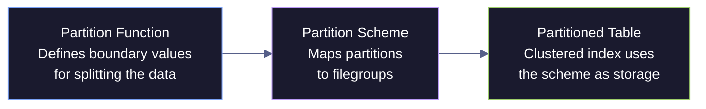
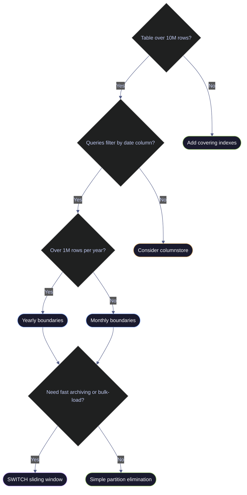

# Partitioning Strategies

> [!quote]
> "The key to performance is elegance, not battalions of special cases."
>
> — **Jon Bentley and Doug McIlroy**, *Programming Pearls* (1986)

SQL Server table partitioning divides a large table into smaller horizontal slices based on a partition key column — typically a date. Each partition is a logically independent unit: queries that filter on the partition key can skip entire partitions without scanning them (partition elimination). Partitions also enable fast `SWITCH` operations that move a full partition between tables in milliseconds — the basis for efficient archiving and sliding-window pipeline patterns. BigQuery uses the same partitioning concept for [cost optimization and query performance](https://alp78.github.io/elysium/06-GCP/BigQuery/querying-and-cost-optimization).

> [!info] When to Partition
>
> Only partition when a single table exceeds **10 million rows** and queries consistently filter by the partition key. Partitioning small tables adds metadata overhead with no performance benefit. The number one use case is large time-series tables (financial price data, pipeline audit logs) where most queries filter by `trade_date` or a similar date column.

> [!info] Partition Limits and Edition Availability
>
> SQL Server supports up to **15,000 partitions** per table (since SQL Server 2012; the limit was 1,000 in earlier versions). Partitioning was an Enterprise-only feature until **SQL Server 2016 SP1**, which made it available in all editions including Standard and Express.

> [!info] Partitioning Column Restrictions
>
> The partitioning column must be a data type valid as an index key. LOB types (`ntext`, `text`, `image`, `xml`, `varchar(max)`, `nvarchar(max)`, `varbinary(max)`), CLR user-defined types, and alias data types cannot be used. Computed columns are allowed only if explicitly marked as `PERSISTED`. The `timestamp` data type is also excluded.

## Clustered Index on Partitioned vs Non-Partitioned Tables

On a non-partitioned table, a clustered index physically orders ALL rows in the table by the index key. A seek on `(symbol, trade_date)` navigates one B-tree to find the exact page.

On a partitioned table, each partition has its own independent B-tree for the clustered index. A query filtering on the partition key first eliminates partitions (metadata check), then seeks within the surviving partition's B-tree. This is faster for partition-key queries (fewer pages to scan) but adds overhead for queries that don't filter on the partition key — SQL Server must seek across ALL partition B-trees (a "partition-spanning seek").

> [!warning] Non-Partition-Key Queries Are Slower
>
> A query like `WHERE symbol = 'ASML'` without a trade_date filter must scan every partition's B-tree independently. On a non-partitioned table, this would be a single index seek. On a 7-partition table, it becomes 7 separate seeks merged together. Only partition tables where the vast majority of queries filter on the partition key.

> [!success] Safe Pattern: Add a Nonclustered Index on Non-Partition-Key Columns
>
> For queries that filter on `symbol` without a `trade_date`, add a nonclustered index on `symbol` that includes frequently selected columns. This lets the optimizer perform a single B-tree seek across the entire table rather than scanning all partitions. Reserve partitioning for queries that consistently include the partition key.

---

## How SQL Server Partitioning Works

SQL Server partitioning splits a table's rows into discrete physical segments at the storage engine level. The engine routes each row to the correct partition at insert time and prunes partitions at query time — both operations driven by the partition function's boundary values. Three database objects must be created in sequence: a partition function that defines the boundary values, a partition scheme that maps each resulting partition to a filegroup, and a table or index that references the scheme as its storage target.



### Partitioning layout — yearly boundaries for market_data time-series

| Partition | Range | Description |
|---|---|---|
| 1 | trade_date < 2021-01-01 | Pre-2021 historical |
| 2 | 2021-01-01 to 2021-12-31 | 2021 |
| 3 | 2022-01-01 to 2022-12-31 | 2022 |
| 4 | 2023-01-01 to 2023-12-31 | 2023 |
| 5 | 2024-01-01 to 2024-12-31 | 2024 |
| 6 | 2025-01-01 to 2025-12-31 | 2025 |
| 7 | trade_date >= 2026-01-01 | 2026 — current year |

---

### Step 1: Create the Partition Function

A partition function is a database object that defines how rows map to partitions based on the values of a single column. It specifies the data type of the partition key, the boundary values that separate partitions, and whether each boundary belongs to the left or right partition (the range type). The number of partitions is always one more than the number of boundary values — six boundaries produce seven partitions.

> [!example] Yearly partition function for trade_date
>
> With `RANGE RIGHT`, the boundary value goes in the right (higher) partition:
> Partition 1 gets `trade_date < '2021-01-01'`, Partition 2 gets `>= '2021-01-01' AND < '2022-01-01'`, etc.

The following creates a yearly partition function on the `DATE` type with six boundary values, producing seven partitions.

```sql
CREATE PARTITION FUNCTION pf_trade_date_yearly (DATE)
AS RANGE RIGHT FOR VALUES (
    '2021-01-01',
    '2022-01-01',
    '2023-01-01',
    '2024-01-01',
    '2025-01-01',
    '2026-01-01'
);
```

Verify the function was created by querying the partition metadata catalog views. Each row returned represents one boundary value and its position in the function.

```sql
SELECT
    pf.name,
    pf.boundary_value_on_right,
    prv.value AS boundary_value,
    prv.boundary_id
FROM sys.partition_functions pf
JOIN sys.partition_range_values prv ON pf.function_id = prv.function_id
WHERE pf.name = 'pf_trade_date_yearly'
ORDER BY prv.boundary_id;
```

> [!info] RANGE RIGHT vs RANGE LEFT
>
> - **RANGE RIGHT:** The boundary value is the **lower bound** of the higher partition. `'2022-01-01'` goes into the "2022" partition. The leftmost partition holds all values below the first boundary.
> - **RANGE LEFT:** The boundary value is the **upper bound** of the lower partition. `'2021-12-31'` goes into the "2021" partition. The rightmost partition holds all values above the last boundary.
>
> For date-based partitions, **RANGE RIGHT** is the conventional choice because the boundary is the first day of the new period — this keeps all dates for a given year in one partition.

> [!tip] RANGE LEFT Advantage for Sliding Windows
>
> Microsoft recommends `RANGE LEFT` for sliding window patterns because the `MERGE RANGE` operation removes the partition that *contains* the boundary. With `RANGE LEFT`, the lowest boundary belongs to partition 1 (which is already empty after a SWITCH OUT), so the merge is metadata-only. With `RANGE RIGHT`, the lowest boundary belongs to partition 2, which may still contain data — forcing a physical data move during the merge. If you use `RANGE RIGHT` in a sliding window, always keep partition 1 permanently empty to avoid this data movement.

---

### Step 2: Create the Partition Scheme

A partition scheme is a database object that maps each partition produced by a partition function to a filegroup. The scheme determines where each partition's data is physically stored. If all partitions map to the same filegroup, the scheme still serves as the required bridge between the function and the table — SQL Server will not let you create a partitioned table directly on a partition function.

> [!info] What Is a Filegroup?
>
> A filegroup is a named collection of data files that SQL Server uses as a storage target. The default `PRIMARY` filegroup stores everything. Creating additional filegroups (like `ARCHIVE`) lets you place older partitions on slower/cheaper storage while keeping current data on fast SSDs. The two main reasons for multiple filegroups are tiered storage (hot vs cold data on different disks) and independent backup/restore — you can back up or restore a single filegroup without touching the others.

> [!tip] Archive Filegroup Pattern
>
> For cold historical partitions, create a dedicated `ARCHIVE` filegroup on slower storage. Map old partitions to ARCHIVE and the current partition to PRIMARY. This reduces SSD costs while keeping hot data fast.

The `ALL TO` syntax assigns every partition to the same filegroup. This is the simplest configuration and is appropriate when tiered storage and per-filegroup backup are not required.

```sql
CREATE PARTITION SCHEME ps_trade_date_yearly
AS PARTITION pf_trade_date_yearly
ALL TO ([PRIMARY]);
```

---

### Step 3: Create the Partitioned Table

The final step binds the table to the partition scheme by placing the clustered index `ON` the scheme. The partition key column (`trade_date`) must be part of the clustered index key — SQL Server raises an error if it is not. The `ON ps_trade_date_yearly (trade_date)` clause tells the storage engine to route each row to the partition determined by evaluating `trade_date` against the partition function. The `DATA_COMPRESSION = PAGE` option applies page compression uniformly to all partitions at creation time (per-partition compression can be set later).

```sql
CREATE TABLE dbo.market_data_partitioned (
    trade_date      DATE            NOT NULL,
    symbol          NVARCHAR(20)    NOT NULL,
    [open]          DECIMAL(18, 6)  NULL,
    high            DECIMAL(18, 6)  NULL,
    low             DECIMAL(18, 6)  NULL,
    [close]         DECIMAL(18, 6)  NULL,
    volume          BIGINT          NULL,
    [index]         NVARCHAR(100)   NOT NULL,
    loaded_at       DATETIME2       NOT NULL DEFAULT SYSUTCDATETIME(),

    CONSTRAINT CIX_market_data_partitioned
        PRIMARY KEY CLUSTERED (trade_date, symbol)
        ON ps_trade_date_yearly (trade_date)
)
WITH (DATA_COMPRESSION = PAGE);
```

> [!warning] Partition Key Must Be in the Clustered Index Key
>
> The partition key column (`trade_date`) must be part of the clustered index key. If you try to create a partitioned table on a column not in the clustered index, SQL Server raises an error. For a table partitioned by `trade_date`, the clustered index key should be `(trade_date, symbol)` — trade_date first (for partition elimination) or second (for symbol-first lookups, but then partition elimination only works if trade_date is also in the WHERE clause).

> [!success] Safe Pattern: Always Include the Partition Key in the Clustered Index
>
> Design the clustered index key to include the partition key as its first or second column. For the `market_data` model, use `PRIMARY KEY CLUSTERED (trade_date, symbol) ON ps_trade_date_yearly (trade_date)`. This guarantees both correct table creation and effective partition elimination for date-range queries.

---

### Partition Elimination — How Queries Skip Partitions

Partition elimination is the primary performance benefit of partitioning. When a query includes a filter on the partition key, the optimizer evaluates the filter predicates against the partition function's boundary values at compile time and excludes partitions that cannot contain matching rows. The excluded partitions are never read — not even their metadata pages. This turns a full-table scan into a scan of one or two partitions, reducing I/O proportionally to the number of eliminated partitions.

> [!question] How to Verify Partition Elimination
>
> In the execution plan, look for "Actual Partition Count" in the Clustered Index Seek/Scan operator properties. If it shows 1 or 2, partition elimination is working. If it shows the total partition count (e.g., 7), the query is scanning all partitions — typically caused by a non-SARGable predicate on the partition key or a type mismatch (e.g., `CAST(trade_date AS DATETIME2)`).

The following query filters on the partition key (`trade_date`) and a non-partition column (`symbol`). The optimizer first eliminates all partitions outside the 2025 date range (6 out of 7), then seeks within the surviving partition's B-tree for the matching `symbol` value.

```sql
SELECT symbol, trade_date, [close]
FROM dbo.market_data_partitioned
WHERE trade_date BETWEEN '2025-01-01' AND '2025-12-31'
  AND symbol = 'ASML';
```

Use `sys.dm_db_partition_stats` joined with `sys.partitions` to see row counts, compression state, and size for each partition. This is the primary diagnostic view for confirming data distribution across partitions.

```sql
SELECT
    partition_number,
    rows,
    data_compression_desc AS compression,
    CAST(used_pages * 8.0 / 1024 AS DECIMAL(10,2)) AS size_mb
FROM sys.dm_db_partition_stats ps
JOIN sys.partitions p ON ps.partition_id = p.partition_id
WHERE p.object_id = OBJECT_ID('dbo.market_data_partitioned')
  AND p.index_id = 1
ORDER BY partition_number;
```

> [!tip] Use `$PARTITION` to Debug Row Placement
>
> The `$PARTITION` function returns the partition number for a given value, without querying any table. Use it to verify that boundary values map to the expected partitions:
> ```sql
> SELECT $PARTITION.pf_trade_date_yearly('2025-06-15') AS partition_number;
> ```
> This returns `6` — confirming that June 2025 data lands in partition 6. Use `$PARTITION` in a `GROUP BY` to count rows per partition without joining system views.

> [!warning] Partition Elimination Requires SARGable Predicates
>
> `WHERE trade_date >= '2025-01-01'` — eliminates older partitions. Good.
> `WHERE YEAR(trade_date) = 2025` — wraps the column in a function. SQL Server cannot eliminate partitions because it cannot evaluate the function against boundary values at compile time. Use [sargable-queries](https://alp78.github.io/elysium/04-SQL-Server/T-SQL/sargable-queries) patterns: always filter directly on the column.

> [!success] Safe Pattern: Filter Directly on the Partition Column
>
> Replace `WHERE YEAR(trade_date) = 2025` with `WHERE trade_date >= '2025-01-01' AND trade_date < '2026-01-01'`. This is SARGable: the optimizer can evaluate the boundary values against the partition function and skip non-matching partitions without scanning them. Verify elimination is working by checking "Actual Partition Count" in the execution plan properties.

---

## SWITCH — Millisecond Partition Operations

`ALTER TABLE ... SWITCH` reassigns ownership of a partition's pages from one table to another by updating internal metadata pointers — no physical data movement occurs, no rows are copied, and no transaction log records are generated for individual rows. A partition containing a billion rows switches in milliseconds. This makes SWITCH the foundation for two critical pipeline operations: archiving old data out of the main table and loading new data in from a staging table, both without blocking concurrent queries. SWITCH acquires a brief Schema Modification (Sch-M) lock on both tables for the duration of the metadata update.

> [!info] Index Alignment Requirement
>
> All nonclustered indexes on the source and target tables must be **partition-aligned** — meaning they use the same partition scheme as the base table. Non-aligned indexes block the SWITCH operation. Additionally, the source and target must reside on the same filegroup for the switch to be metadata-only. If they are on different filegroups, SQL Server performs a physical data move instead.

### Creating the archive table

The archive table must have an identical schema (columns, types, nullability, defaults) and an identical clustered index key to the partitioned table. Place it on `PRIMARY` or a dedicated `ARCHIVE` filegroup for tiered storage.

```sql
CREATE TABLE dbo.market_data_archive (
    trade_date      DATE            NOT NULL,
    symbol          NVARCHAR(20)    NOT NULL,
    [open]          DECIMAL(18, 6)  NULL,
    high            DECIMAL(18, 6)  NULL,
    low             DECIMAL(18, 6)  NULL,
    [close]         DECIMAL(18, 6)  NULL,
    volume          BIGINT          NULL,
    [index]         NVARCHAR(100)   NOT NULL,
    loaded_at       DATETIME2       NOT NULL DEFAULT SYSUTCDATETIME(),

    CONSTRAINT CIX_market_data_archive
        PRIMARY KEY CLUSTERED (trade_date, symbol)
        ON [PRIMARY]
)
WITH (DATA_COMPRESSION = PAGE);
```

### Switching a partition OUT to archive

Switch partition 1 (pre-2021 data) out of the main table into the archive. This takes milliseconds — no data movement, only a metadata update. After the switch, partition 1 in the main table is empty and all pre-2021 rows live in the archive table.

```sql
ALTER TABLE dbo.market_data_partitioned
SWITCH PARTITION 1
TO dbo.market_data_archive;
```

### Creating the staging table

The staging table must use the same partition scheme as the main table and have an identical schema. Data is loaded here first — inserts into the staging table do not block the main partitioned table.

```sql
CREATE TABLE dbo.market_data_staging_2026 (
    trade_date      DATE            NOT NULL,
    symbol          NVARCHAR(20)    NOT NULL,
    [open]          DECIMAL(18, 6)  NULL,
    high            DECIMAL(18, 6)  NULL,
    low             DECIMAL(18, 6)  NULL,
    [close]         DECIMAL(18, 6)  NULL,
    volume          BIGINT          NULL,
    [index]         NVARCHAR(100)   NOT NULL,
    loaded_at       DATETIME2       NOT NULL DEFAULT SYSUTCDATETIME(),

    CONSTRAINT CIX_staging_2026
        PRIMARY KEY CLUSTERED (trade_date, symbol)
        ON ps_trade_date_yearly (trade_date)
)
WITH (DATA_COMPRESSION = PAGE);
```

### Loading data into staging

Loading into the staging table can take minutes but does not block the main partitioned table.

```sql
INSERT INTO dbo.market_data_staging_2026 (trade_date, symbol, ...)
SELECT ...
FROM external_source
WHERE trade_date >= '2026-01-01';
```

### Switching staging IN as a partition

This takes milliseconds — atomically replaces the empty partition with the loaded data.

```sql
ALTER TABLE dbo.market_data_staging_2026
SWITCH TO dbo.market_data_partitioned PARTITION 7;
```

> [!warning] SWITCH Requirements
>
> Both source and target tables must:
> - Have identical column definitions (same names, types, nullability, defaults)
> - Have identical indexes (clustered index key columns and order)
> - Use the same partition scheme (or the target is partitioned and source is not — single partition switch)
> - The target partition must be empty before a SWITCH IN
> - Both tables must be in the same database

> [!success] Safe Pattern: Script and Validate the Staging Table Schema
>
> Generate the staging table DDL by scripting the main table from SSMS (Script Table as → CREATE To) and adjusting the constraint names. Before each SWITCH, run `TRUNCATE TABLE dbo.staging` to guarantee the target partition is empty. Use `EXEC sp_help 'dbo.staging'` to confirm column definitions and index keys match the main table exactly before executing the SWITCH.

---

## Adding New Partitions — Sliding Window Pattern

A sliding window maintains a fixed number of active partitions by adding a new partition at the leading edge (SPLIT) and removing an expired partition at the trailing edge (MERGE) on a recurring schedule. In a yearly pipeline, a new boundary must be added before data for the new period arrives — without it, all new-year rows land in the last open-ended partition alongside the current year's data, defeating partition elimination.

> [!warning] Never Split or Merge Populated Partitions
>
> Splitting a partition that already contains data forces SQL Server to physically redistribute rows between the two new partitions, generating up to **4× the normal transaction log volume** and causing severe locking. Always split into an empty partition at the boundary edge.

> [!success] Safe Pattern: Keep Empty Partitions at Both Ends
>
> Microsoft's best practice is to always maintain an empty partition at each end of the range. The empty leading partition absorbs new SPLIT operations without data movement, and the empty trailing partition absorbs MERGE operations after a SWITCH OUT. This guarantees that both SPLIT and MERGE are metadata-only operations.

### Step 1: Designate the next filegroup

Before splitting, tell the partition scheme which filegroup the new partition should use.

```sql
ALTER PARTITION SCHEME ps_trade_date_yearly
NEXT USED [PRIMARY];
```

### Step 2: Split the boundary

Add a new boundary value to the partition function. The 2026 partition is now bounded on the right (`>= '2026-01-01' AND < '2027-01-01'`), and a new empty partition 8 exists for 2027 data.

```sql
ALTER PARTITION FUNCTION pf_trade_date_yearly ()
SPLIT RANGE ('2027-01-01');
```

### Step 3: Verify the new partition

Confirm the partition function now has 7 boundaries (8 partitions) and the new partition exists.

```sql
SELECT
    partition_number,
    rows,
    CAST(used_pages * 8.0 / 1024 AS DECIMAL(10,2)) AS size_mb
FROM sys.dm_db_partition_stats
WHERE object_id = OBJECT_ID('dbo.market_data_partitioned')
ORDER BY partition_number;
```

### Sliding Window — MERGE RANGE to Remove Old Partitions

Once old data has been switched out, the now-empty partition boundary should be removed with `MERGE RANGE` to keep the partition count constant. `MERGE RANGE` combines two adjacent partitions into one by removing the boundary between them. It does not delete data — if the partition still contains rows, those rows are physically moved to the merged partition (which is why you must always SWITCH OUT first).

> [!danger] Always SWITCH Before MERGE
>
> MERGE RANGE removes a partition boundary but does NOT delete the data — it combines two partitions into one. If you merge without switching out the data first, both partitions' data ends up in one partition. Always SWITCH OUT the data to an archive table before merging the boundary.

> [!success] Safe Pattern: SWITCH OUT Then MERGE in Two Steps
>
> First, switch the data out: `ALTER TABLE dbo.market_data_partitioned SWITCH PARTITION 1 TO dbo.market_data_archive`. Verify the source partition is empty by querying `sys.dm_db_partition_stats WHERE rows = 0`. Only then run `ALTER PARTITION FUNCTION pf_trade_date_yearly () MERGE RANGE ('2021-01-01')` to remove the now-empty boundary.

After confirming the partition is empty (via `sys.dm_db_partition_stats WHERE rows = 0`), merge the boundary to remove the now-empty partition.

```sql
ALTER PARTITION FUNCTION pf_trade_date_yearly ()
MERGE RANGE ('2021-01-01');
```

> [!danger] Columnstore Limitation with MERGE
>
> Two nonempty partitions that both contain a columnstore index cannot be merged. SQL Server raises an error. You must drop or disable the columnstore index before performing the merge, then rebuild it afterward.

> [!success] Safe Pattern: Drop Columnstore Before MERGE, Rebuild After
>
> If the partitions involved have columnstore indexes, run `DROP INDEX` on the columnstore before the `MERGE RANGE`, then recreate it after the merge completes. Since the partition being merged should be empty (after SWITCH OUT), this is typically a fast metadata operation.

---

## Per-Partition Compression

SQL Server allows each partition to have its own compression setting independently of the others. This is critical for mixed hot/cold workloads: historical partitions that are read-only benefit from aggressive PAGE compression (saving 60–80% storage), while the current-year partition that absorbs ongoing writes should use NONE or ROW compression to avoid the CPU overhead of compressing every INSERT and UPDATE. Compression is set per partition via `ALTER INDEX ... REBUILD PARTITION = N`. See [table-compression](https://alp78.github.io/elysium/04-SQL-Server/Storage-and-Indexes/table-compression) for detailed compression ratio benchmarks and the decision framework for choosing between ROW and PAGE compression.

Apply PAGE compression to historical partitions 1–6 (years 2020–2025). Each `REBUILD PARTITION` operates on a single partition without affecting the others.

```sql
ALTER INDEX CIX_market_data_partitioned ON dbo.market_data_partitioned
REBUILD PARTITION = 1 WITH (DATA_COMPRESSION = PAGE);

ALTER INDEX CIX_market_data_partitioned ON dbo.market_data_partitioned
REBUILD PARTITION = 2 WITH (DATA_COMPRESSION = PAGE);
```

Repeat the same statement for partitions 3–6. Leave partition 7 (current year 2026) uncompressed to avoid CPU overhead on ongoing writes.

```sql
ALTER INDEX CIX_market_data_partitioned ON dbo.market_data_partitioned
REBUILD PARTITION = 7 WITH (DATA_COMPRESSION = NONE);
```

---

## Monitoring Partitioned Tables

Monitoring a partitioned table means checking row distribution, storage size, compression state, and boundary values across all partitions. Uneven distribution (data skew) can indicate a poorly chosen partition key or stale boundaries. The primary catalog views are `sys.partitions` (row counts, compression), `sys.allocation_units` (page counts and size), `sys.partition_functions` (function metadata), `sys.partition_range_values` (boundary values), and `sys.partition_schemes` (scheme-to-function mapping).

Full partition inventory showing rows, size in MB, compression type, and boundary value for each partition of a specific table.

```sql
SELECT
    OBJECT_NAME(p.object_id) AS table_name,
    p.partition_number,
    p.rows,
    CAST(a.used_pages * 8.0 / 1024 AS DECIMAL(10,2)) AS size_mb,
    p.data_compression_desc AS compression,
    prv.value AS partition_boundary
FROM sys.partitions p
JOIN sys.allocation_units a ON p.partition_id = a.container_id
LEFT JOIN sys.partition_range_values prv
    ON p.partition_number = prv.boundary_id
    AND (SELECT function_id FROM sys.partition_schemes ps
         JOIN sys.indexes i ON ps.data_space_id = i.data_space_id
         WHERE i.object_id = p.object_id AND i.index_id = p.index_id) = prv.function_id
WHERE p.object_id = OBJECT_ID('dbo.market_data_partitioned')
  AND p.index_id = 1
ORDER BY p.partition_number;
```

List all partition functions in the database. The `fanout` column shows the total number of partitions (boundary count + 1).

```sql
SELECT
    pf.name AS function_name,
    pf.fanout AS partition_count,
    pf.boundary_value_on_right,
    pf.create_date
FROM sys.partition_functions pf;
```

List all partition schemes and the partition function each one references.

```sql
SELECT
    ps.name AS scheme_name,
    pf.name AS function_name
FROM sys.partition_schemes ps
JOIN sys.partition_functions pf ON ps.function_id = pf.function_id;
```

> [!info] Statistics on Partitioned Indexes
>
> When a partitioned index is created or rebuilt, SQL Server generates statistics using the **default sampling algorithm**, not a full scan. For large partitioned tables this can produce inaccurate cardinality estimates. Use `CREATE STATISTICS ... WITH FULLSCAN` or `UPDATE STATISTICS ... WITH FULLSCAN` after creating partitioned indexes to ensure the optimizer has precise row distribution data.

---

## Partitioning Decision Tree

Not every large table benefits from partitioning. The decision depends on table size, query patterns, and whether the workload requires fast archiving or bulk-load operations. Use the following decision tree to determine whether partitioning is appropriate and which granularity to use.

> [!warning] Partitioning Small Tables Adds Overhead
>
> Partitioning a table with fewer than 1 million rows often hurts performance. The partition elimination metadata check (evaluating boundary values for each partition) exceeds the cost of simply scanning the entire table. Additionally, queries that use `TOP`, `MAX`, or `MIN` on non-partition columns must evaluate all partitions, slowing down operations that would be fast on a non-partitioned table.

> [!success] Safe Pattern: Use Covering Indexes Instead of Partitioning for Small Tables
>
> For tables under 10M rows, add a covering nonclustered index on the date column with frequently selected columns in INCLUDE. This achieves the same query performance benefit as partition elimination without the metadata overhead or schema complexity of a partition function and scheme.



---

## Common Pitfalls

The following table lists the most frequent partitioning mistakes, how they manifest, and the corrective action.

| Pitfall | Symptom | Fix |
|---|---|---|
| Partition key not in clustered index | `CREATE TABLE` fails with error | Always include the partition key in the clustered index key |
| Partition key wrapped in function in WHERE | No partition elimination (full scan of all partitions) | Write SARGable predicates: `WHERE trade_date >= '2025-01-01'` instead of `WHERE YEAR(trade_date) = 2025` |
| Implicit type conversion on partition key | No partition elimination despite direct column filter | Ensure the literal type matches the column type exactly — e.g., `DATE` column filtered with `DATE` literal, not `DATETIME2` |
| SWITCH fails with schema mismatch | `ALTER TABLE SWITCH` error | Ensure both tables have identical column definitions, nullability, defaults, indexes, and compression |
| Non-aligned nonclustered indexes | SWITCH blocked by non-aligned index | All nonclustered indexes must use the same partition scheme as the base table |
| Too many partitions (> 1,000) | Metadata overhead slows all queries, DBCC commands take longer | Use yearly or monthly boundaries; avoid partitioning by day unless row volume demands it (max 15,000 partitions) |
| Forgetting NEXT USED before SPLIT | `SPLIT RANGE` fails | Run `ALTER PARTITION SCHEME ... NEXT USED [filegroup]` before every `SPLIT RANGE` |
| Splitting or merging populated partitions | 4× log generation, severe locking, long operation | Always SWITCH OUT data before MERGE; always SPLIT into empty edge partitions |
| Compressing the current-year partition | Slow pipeline writes due to CPU overhead | Use per-partition compression: PAGE for historical, NONE or ROW for the active write partition |
| NULL values in the partition key | Rows placed in the leftmost partition unexpectedly | With `RANGE RIGHT`, NULLs go to partition 1 unless NULL is a boundary value — filter or reject NULLs before insert |

---

## Related

- [storage-internals](https://alp78.github.io/elysium/04-SQL-Server/Storage-and-Indexes/storage-internals) — how pages and filegroups interact with partitions at the storage level
- [index-types-and-strategy](https://alp78.github.io/elysium/04-SQL-Server/Storage-and-Indexes/index-types-and-strategy) — columnstore indexes as an alternative to partitioning for analytics workloads
- [table-compression](https://alp78.github.io/elysium/04-SQL-Server/Storage-and-Indexes/table-compression) — applying per-partition compression to cold historical data
- [index-maintenance](https://alp78.github.io/elysium/04-SQL-Server/Performance/index-maintenance) — maintaining fragmentation per partition with `REBUILD PARTITION = N`
- [performance-audit-playbook](https://alp78.github.io/elysium/04-SQL-Server/Performance/performance-audit-playbook) — identifying tables over 10M rows that are candidates for partitioning
- [blocking-and-locking](https://alp78.github.io/elysium/04-SQL-Server/Concurrency/blocking-and-locking) — SWITCH operations take a schema modification lock briefly; plan maintenance windows accordingly
- [bronze-layer-loading](https://alp78.github.io/elysium/04-SQL-Server/Medallion-Project/bronze-layer-loading) — SWITCH-based staging loads as an alternative to TRUNCATE + INSERT for large bronze tables
