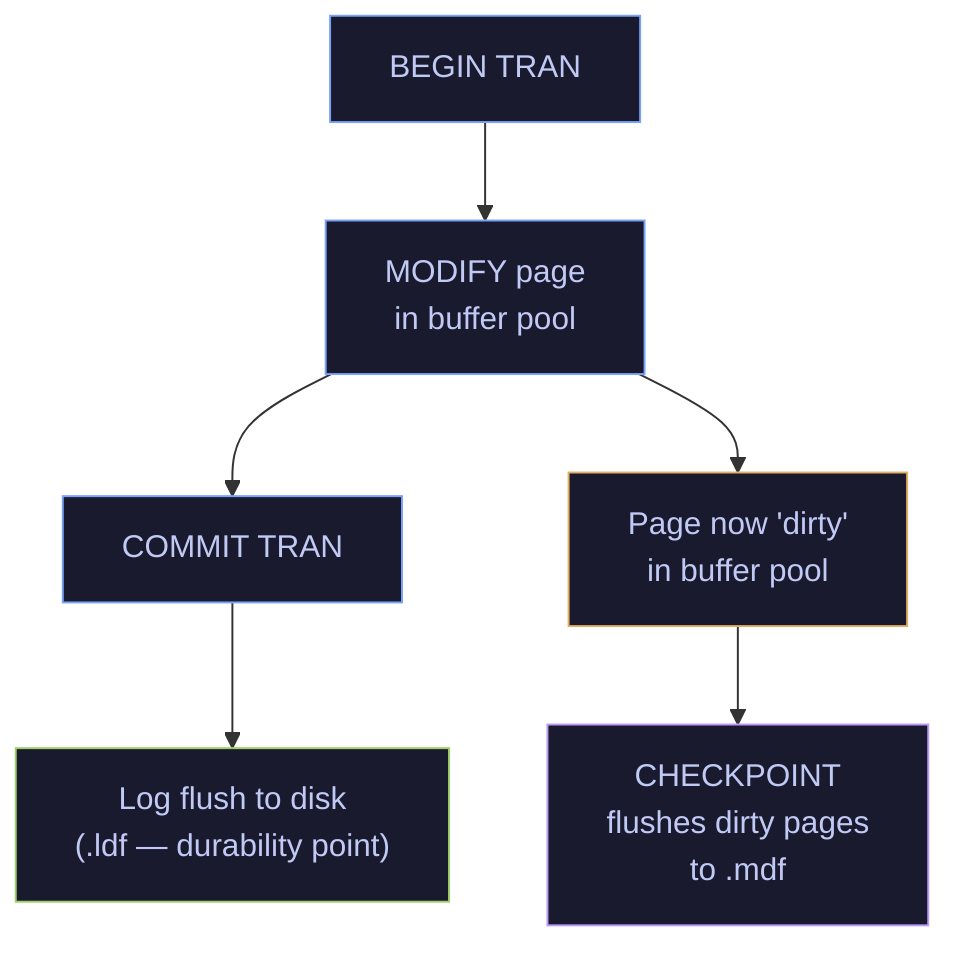
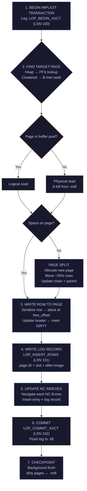
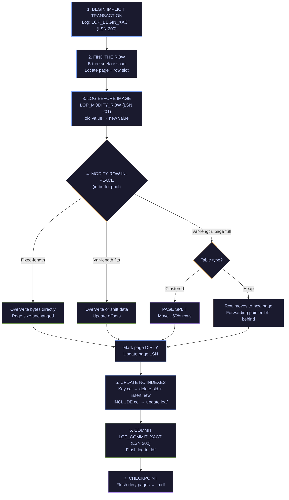
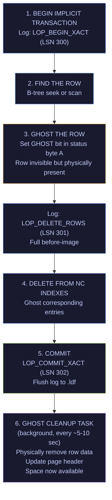
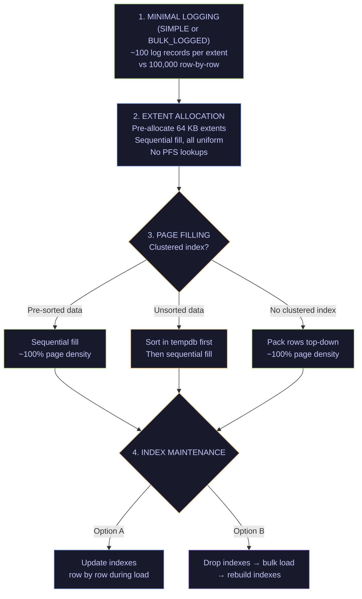
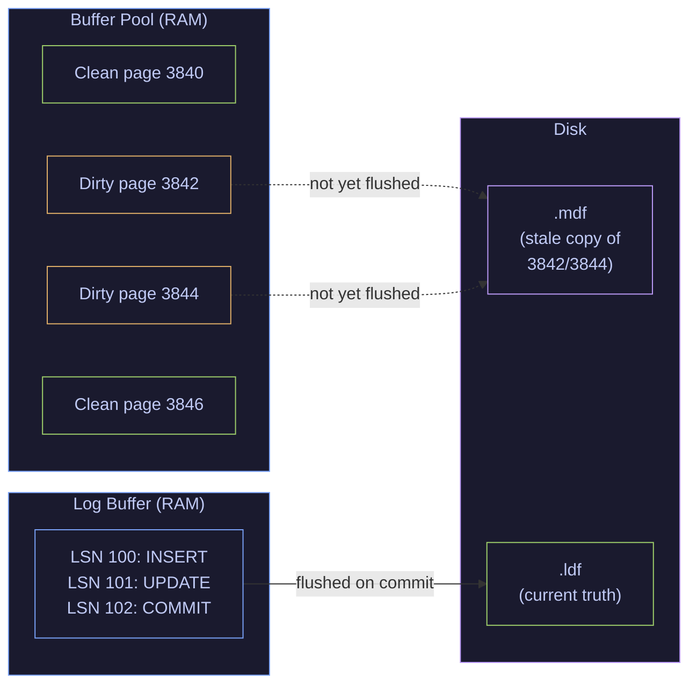
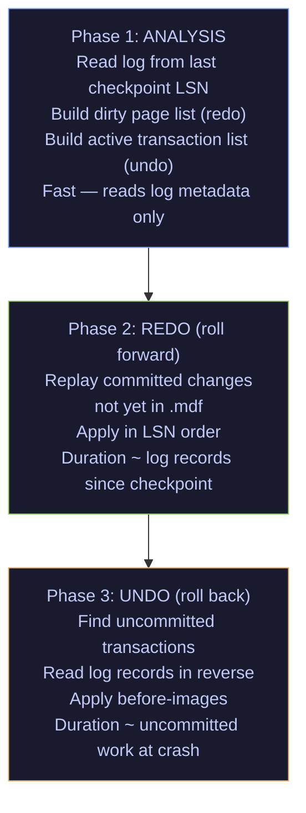

# Storage Internals

> [!quote]
> "A conventional disk-based DBMS spends the overwhelming majority of its cycles on overhead activity — buffer management, locking, latching, and log management — not on useful work."
>
> — **Michael Stonebraker**, *The End of an Architectural Era* (2007)

SQL Server reads and writes in fixed 8 KB pages — every I/O operation moves exactly one page. Understanding how pages, extents, files, the log, and the buffer pool interact is the foundation for diagnosing every performance problem: slow queries, high I/O, blocked sessions, and slow recovery all trace back to these internals.

---

### Glossary — Key Terms

| Term | Definition |
|---|---|
| **Page** | The fundamental unit of I/O in SQL Server. A fixed 8 KB (8,192 bytes) block. Every read or write operation happens at the page level — SQL Server never reads less than one page. |
| **Extent** | A group of 8 contiguous pages (64 KB). SQL Server allocates space in extents. **Uniform extents** belong to one object; **mixed extents** are shared by small tables. |
| **Data file (.mdf)** | The primary data file. Stores all data pages, index pages, and allocation maps. This is where your rows physically live. A database has exactly one `.mdf` plus optional secondary `.ndf` files. |
| **Log file (.ldf)** | The transaction log. A sequential, append-only record of every modification. Guarantees durability (the "D" in ACID). If the server crashes, SQL Server replays the log to recover to a consistent state. |
| **Buffer pool** | SQL Server's in-memory cache of data pages. Pages are read from `.mdf` into the buffer pool, modified there, and eventually flushed back to disk. Most query execution works against the buffer pool, not disk. |
| **Dirty page** | A page in the buffer pool that has been modified but not yet written back to the `.mdf`. |
| **Checkpoint** | A background process that flushes dirty pages from the buffer pool to the `.mdf`. Reduces recovery time by ensuring the data file doesn't fall too far behind the log. |
| **WAL (Write-Ahead Logging)** | The fundamental rule: every change must be written to the log file BEFORE it is written to the data file. This ensures crash recovery is always possible. |
| **LSN (Log Sequence Number)** | A monotonically increasing number that identifies each log record. Every page header stores the LSN of the last modification — this is how SQL Server knows which log records have already been applied during recovery. |
| **Heap** | A table without a clustered index. Rows are stored in no particular order. New rows go wherever there is space. |
| **Clustered index** | A B-tree structure that dictates the physical storage order of the table. The leaf level of a clustered index IS the data — each leaf page contains full rows, sorted by the index key. |
| **Row offset array (slot array)** | An array at the bottom of each page that stores the byte offset of each row. Enables direct jump to row N without scanning the page sequentially. |
| **Page split** | When a page is full and a new row must be inserted in the middle (to maintain sort order), SQL Server splits the page: allocates a new page, moves roughly half the rows there, and updates the page chain pointers. Expensive — causes fragmentation. |
| **IAM (Index Allocation Map)** | A special page that tracks which extents belong to a specific table or index. SQL Server consults IAM pages during table scans to find all pages for an object. |
| **GAM / SGAM** | **Global Allocation Map** and **Shared GAM** — bitmap pages that track whether each extent in a data file is free, allocated as uniform, or allocated as mixed. One bit per extent. |
| **PFS (Page Free Space)** | A page that tracks the approximate free space in each data page (empty, 1-50%, 51-80%, 81-95%, 96-100%). Used to find a page with room for a new row. |
| **Forwarding pointer** | In a heap, when an UPDATE makes a row too large for its current page, the row moves to a new page and leaves behind a pointer. Causes extra I/O on reads — too many forwarding pointers degrade performance. |
| **B-tree** | Balanced tree structure used for all rowstore indexes. Interior (non-leaf) nodes contain key values and pointers to child pages. Leaf nodes contain the actual data (clustered) or key + bookmark (nonclustered). |
| **Bookmark lookup (Key lookup)** | When a nonclustered index finds the matching rows but the query needs columns not in the index, SQL Server must look up the full row from the clustered index. Eliminated by covering indexes. |

---

## Database File Architecture

Every SQL Server database consists of at least two files:

```
Database "analytics_db"
├── analytics_db.mdf    (PRIMARY data file)
│   ├── Data pages         — table rows, heap or clustered index leaves
│   ├── Index pages        — B-tree nodes for nonclustered indexes
│   ├── IAM pages          — allocation tracking per object
│   ├── GAM / SGAM pages   — extent allocation bitmaps
│   ├── PFS pages          — per-page free space tracking
│   ├── Text/Image pages   — overflow for large values (varchar(max), varbinary(max))
│   └── Boot page (page 9) — database metadata, recovery LSN
│
└── mydb_log.ldf    (transaction log)
    └── Sequential log records (VLFs — Virtual Log Files)
        ├── Log record 1: BEGIN TRAN
        ├── Log record 2: INSERT row (before/after image)
        ├── Log record 3: COMMIT TRAN
        └── ... (append-only, circular reuse after backup)
```

#### ALTER DATABASE ADD FILE — secondary data file for I/O distribution

```sql
-- Add a secondary file for distributing I/O across disks
ALTER DATABASE analytics_db ADD FILE (
    NAME = 'analytics_data2',
    FILENAME = '/var/opt/mssql/data/analytics2.ndf',
    SIZE = 100MB,
    FILEGROWTH = 50MB
);
```

#### sys.database_files — check current data and log file layout

```sql
SELECT
    name            AS logical_name,
    physical_name,
    type_desc,                           -- ROWS or LOG
    size * 8 / 1024 AS size_mb,
    growth * 8 / 1024 AS growth_mb,
    max_size
FROM sys.database_files;
```

| logical_name | physical_name | type_desc | size_mb | growth_mb |
|---|---|---|---|---|
| analytics_db | /var/opt/mssql/data/analytics_db.mdf | ROWS | 40 | 8 |
| mydb_log | /var/opt/mssql/data/mydb_log.ldf | LOG | 8 | 8 |

---

## Page Anatomy

Every page, regardless of type, has the same 96-byte header:

```
┌─────────────────────────────────────────────────────────┐
│                  PAGE HEADER (96 bytes)                  │
│                                                         │
│  page_id        — file:page number (e.g., 1:3842)       │
│  type           — 1=data, 2=index, 3=text_mix,          │
│                   8=GAM, 9=SGAM, 10=IAM, 11=PFS         │
│  level          — 0=leaf, >0=interior node               │
│  object_id      — which table/index owns this page       │
│  prev_page_id   — previous page in the chain             │
│  next_page_id   — next page in the chain                 │
│  free_count     — bytes of free space on the page        │
│  free_offset    — offset where free space starts         │
│  lsn            — LSN of last modification               │
│  slot_count     — number of rows on the page             │
│  checksum       — page checksum for corruption detection │
├─────────────────────────────────────────────────────────┤
│                  ROW DATA (top → down)                   │
│                                                         │
│  Row 0: [status bits][fixed cols][null bitmap][var cols]  │
│  Row 1: [status bits][fixed cols][null bitmap][var cols]  │
│  Row 2: ...                                              │
│                                                         │
│                   (free space)                            │
│                                                         │
├─────────────────────────────────────────────────────────┤
│               ROW OFFSET ARRAY (bottom → up)             │
│                                                         │
│  Slot 0: offset 0x0060  ◄── points to Row 0             │
│  Slot 1: offset 0x00A8  ◄── points to Row 1             │
│  Slot 2: offset 0x00F0  ◄── points to Row 2             │
│  (each slot = 2 bytes)                                   │
└─────────────────────────────────────────────────────────┘
```

#### KB data page — row structure: header, fixed columns, null bitmap, variable columns

```
┌────────────────────────────────────────────────────────┐
│ Status byte A (1 byte) — row type, forwarding, null    │
│ Status byte B (1 byte) — reserved                      │
│ Fixed-length data offset (2 bytes)                     │
├────────────────────────────────────────────────────────┤
│ Fixed-length columns:                                  │
│   int (4 bytes) | datetime2 (8 bytes) | decimal (9 B)  │
├────────────────────────────────────────────────────────┤
│ Number of columns (2 bytes)                            │
│ NULL bitmap (1 bit per column, rounded to bytes)       │
├────────────────────────────────────────────────────────┤
│ Number of variable-length columns (2 bytes)            │
│ Variable-length offset array (2 bytes each)            │
│ Variable-length data:                                  │
│   varchar('ASML') | varchar('Technology') | ...        │
└────────────────────────────────────────────────────────┘
```

#### KB page practical capacity — rows per page by row size

- Usable space per page: 8,096 bytes (8,192 − 96 header)
- Maximum row size: 8,060 bytes (leaves room for slot array)
- A row with 100-byte fixed columns: ~80 rows per page
- A row with 4,000-byte columns: 2 rows per page

#### DBCC PAGE — inspect raw page contents

```sql
-- Turn on trace flag to see DBCC PAGE output in messages
DBCC TRACEON(3604);

-- Find page numbers for a table
SELECT
    allocated_page_page_id,
    page_type_desc,
    is_allocated
FROM sys.dm_db_database_page_allocations(
    DB_ID('analytics_db'), OBJECT_ID('gold.index_performance'), NULL, NULL, 'DETAILED'
)
WHERE page_type_desc = 'DATA_PAGE'
ORDER BY allocated_page_page_id;

-- Dump a specific page (file 1, page 3842, print option 3 = header + rows)
DBCC PAGE('analytics_db', 1, 3842, 3) WITH TABLERESULTS;
```

---

## The Transaction Log (.ldf) — How WAL Works

The log file is the safety net. Every modification follows this sequence:



> [!info] COMMIT Does Not Mean Disk
>
> When a COMMIT returns success, the data might NOT be in the `.mdf` yet. It is guaranteed to be in the `.ldf`. If the server crashes before the checkpoint, recovery replays the log (called **redo** or **roll forward**) to apply committed changes to the `.mdf`. Uncommitted changes found in the log are undone (**undo** or **roll back**).

#### Log record anatomy — LSN, transaction ID, operation, before/after images

- **LSN** — unique identifier for this record
- **Transaction ID** — which transaction this belongs to
- **Operation type** — INSERT, DELETE, UPDATE, PAGE_SPLIT, CHECKPOINT, etc.
- **Page ID** — which page was modified
- **Before image** — the original data (for undo)
- **After image** — the new data (for redo)

#### sys.fn_dblog — view recent transaction log records

```sql
-- View recent log records
SELECT TOP 50
    [Current LSN],
    Operation,
    Context,
    [Transaction ID],
    [Page ID],
    AllocUnitName,
    [Num Elements]
FROM fn_dblog(NULL, NULL)
ORDER BY [Current LSN] DESC;
```

| Current LSN | Operation | Context | Transaction ID | Page ID | AllocUnitName |
|---|---|---|---|---|---|
| 00000027:0000014f:0003 | LOP_INSERT_ROWS | LCX_HEAP | 0000:0000041a | 1:3842 | gold.index_performance |
| 00000027:0000014f:0002 | LOP_MODIFY_ROW | LCX_PFS | 0000:0000041a | 1:1 | PFS |
| 00000027:0000014e:0001 | LOP_BEGIN_XACT | LCX_NULL | 0000:0000041a | NULL | NULL |

#### DBCC LOGINFO — Virtual Log Files (VLF) count and status

The `.ldf` is internally divided into Virtual Log Files. Too many VLFs (hundreds or thousands) slow down recovery and backups.

```sql
-- Count VLFs
SELECT COUNT(*) AS vlf_count FROM sys.dm_db_log_info(DB_ID('analytics_db'));

-- Target: under 50 VLFs for most databases
-- Fix: shrink log, set a proper initial size and growth increment
```

#### Log flush triggers — COMMIT, checkpoint, lazy writer

| Event | What happens |
|---|---|
| `COMMIT` | Log buffer flushed synchronously. Transaction waits until fsync completes. This is the largest contributor to write latency. |
| Log buffer fills (~60 KB) | Flushed even without a COMMIT — long-running transactions generate continuous log writes. |
| `CHECKPOINT` | Checkpoint record written to log. Dirty pages flushed to .mdf. |
| `sp_flush_log` | Force flush without committing (for delayed durability scenarios). |

#### ALTER DATABASE SET DELAYED_DURABILITY — trade durability for write speed

```sql
-- Trades durability for performance: COMMIT returns before log fsync
-- Risk: up to ~60 KB of committed transactions can be lost on crash
ALTER DATABASE analytics_db SET DELAYED_DURABILITY = ALLOWED;

-- Use per-transaction:
BEGIN TRANSACTION;
INSERT INTO gold.scores (...) VALUES (...);
COMMIT WITH (DELAYED_DURABILITY = ON);  -- returns immediately, log flushed later
```

---

## CRUD Operations — The Full Internal Flow

### INSERT — Adding a New Row

```sql
INSERT INTO gold.index_performance (index_key, trade_date, close_value)
VALUES ('market_index', '2026-03-10', 4892.34);
```

#### INSERT internal flow — buffer pool, log write, dirty page, checkpoint



#### sys.dm_db_partition_stats — pages and rows per table

```sql
-- See how many pages a table uses
SELECT
    o.name AS table_name,
    p.rows,
    SUM(a.total_pages) AS total_pages,
    SUM(a.used_pages) AS used_pages,
    SUM(a.data_pages) AS data_pages,
    SUM(a.total_pages) * 8 / 1024 AS total_mb
FROM sys.objects o
JOIN sys.partitions p ON o.object_id = p.object_id
JOIN sys.allocation_units a ON p.partition_id = a.container_id
WHERE o.schema_id = SCHEMA_ID('gold') AND o.type = 'U'
GROUP BY o.name, p.rows
ORDER BY total_pages DESC;
```

---

### SELECT — Reading Data

```sql
SELECT close_value
FROM gold.index_performance
WHERE index_key = 'market_index'
  AND trade_date = '2026-03-10';
```

#### Clustered index seek — B-tree navigation for SELECT with clustered key

```
1. QUERY OPTIMIZATION
   └── Query optimizer creates execution plan
       └── Decides: Clustered Index Seek (cost estimate based on statistics)

2. B-TREE TRAVERSAL
   ├── Read ROOT page of clustered index (level 2)
   │   └── Find pointer to child page where 'market_index' falls
   ├── Read INTERMEDIATE page (level 1)
   │   └── Find pointer to leaf page for 'market_index' + '2026-03-10'
   └── Read LEAF page (level 0) ◄── this IS the data page
       └── Scan row offset array, find matching row, return close_value

   Total I/O: 3 pages (root → intermediate → leaf)
   This is the same regardless of table size (B-tree depth rarely exceeds 3-4)
```

```
B-tree with clustered index on (index_key, trade_date):

                    ┌─────────────────────────────┐
         Level 2    │        ROOT PAGE             │
         (root)     │  asia_pac... → Page 200      │
                    │  euro_project → Page 350        │
                    │  project_usa → Page 500         │
                    └──────────┬──────────────────┘
                               │ market_index
                    ┌──────────▼──────────────────┐
         Level 1    │     INTERMEDIATE PAGE 350    │
         (internal) │  ...2026-03-01 → Page 3840   │
                    │  ...2026-03-08 → Page 3842   │
                    │  ...2026-03-15 → Page 3844   │
                    └──────────┬──────────────────┘
                               │ 2026-03-10
                    ┌──────────▼──────────────────┐
         Level 0    │      LEAF PAGE 3842          │
         (leaf =    │  market_index, 2026-03-08   │
          data)     │  market_index, 2026-03-09   │
                    │  market_index, 2026-03-10 ◄── FOUND: 4892.34
                    │  market_index, 2026-03-11   │
                    └─────────────────────────────┘
```

#### Heap table scan — full scan when no clustered index exists

```
1. TABLE SCAN
   ├── Consult IAM page to find all extents belonging to the table
   ├── Read EVERY data page in the table sequentially
   ├── For each page, check each row against WHERE clause
   └── Return matching rows

   Total I/O: ALL pages in the table (could be thousands)
```

#### NC index seek + key lookup — bookmark lookup to clustered index

```
1. NONCLUSTERED INDEX SEEK
   ├── Navigate nonclustered B-tree → find matching leaf entry
   │   Leaf entry contains: index_key + trade_date + BOOKMARK (clustered key)
   │
   └── close_value is NOT in the nonclustered index
       └── KEY LOOKUP (bookmark lookup)
           ├── Use the bookmark to navigate the CLUSTERED index B-tree
           └── Read the full data row from the clustered leaf page

   Total I/O: ~3 pages (NC index seek) + ~3 pages (key lookup) = ~6 pages
```

#### CREATE INDEX INCLUDE — covering index eliminates key lookup

```sql
-- This nonclustered index includes close_value, so no lookup is needed
CREATE NONCLUSTERED INDEX IX_perf_cover
ON gold.index_performance (index_key, trade_date)
INCLUDE (close_value);
```

#### SET STATISTICS IO ON — monitor logical reads per query

```sql
SET STATISTICS IO ON;

SELECT close_value
FROM gold.index_performance
WHERE index_key = 'market_index'
  AND trade_date = '2026-03-10';

-- Output:
-- Table 'index_performance'. Scan count 1,
--   logical reads 3,          ◄── pages read from buffer pool
--   physical reads 0,         ◄── pages read from disk (0 = all cached)
--   read-ahead reads 0

SET STATISTICS IO OFF;
```

---

### UPDATE — Modifying an Existing Row

```sql
UPDATE gold.index_performance
SET close_value = 4905.12
WHERE index_key = 'market_index'
  AND trade_date = '2026-03-10';
```

#### UPDATE internal flow — find row, log before/after, modify in-place or split



#### Heap forwarding pointers — UPDATE moves rows to new pages

```
Before UPDATE (heap):
  Page 500, Slot 3: [ASML | 2026-03-10 | short_description]

After UPDATE that makes the row too large for page 500:
  Page 500, Slot 3: [FORWARDING POINTER → Page 612, Slot 0]
  Page 612, Slot 0: [ASML | 2026-03-10 | very_long_description_that_didnt_fit]

  Now every read of this row costs 2 page reads instead of 1.
```

#### sys.dm_db_index_physical_stats forwarded_record_count — detect forwarding

```sql
-- Detect forwarding pointers in heaps
SELECT
    OBJECT_NAME(object_id) AS table_name,
    forwarded_record_count,
    page_count
FROM sys.dm_db_index_physical_stats(
    DB_ID('analytics_db'), NULL, NULL, NULL, 'DETAILED'
)
WHERE index_id = 0  -- heap
  AND forwarded_record_count > 0;

-- Fix: rebuild the heap (reorganizes all rows, removes forwarding pointers)
ALTER TABLE gold.some_heap_table REBUILD;
```

---

### DELETE — Ghost Records and Deferred Cleanup

> [!abstract] Ghost Records and Deferred Cleanup
>
> When SQL Server deletes a row, it doesn't immediately remove it from the page. Instead, it marks the row as a "ghost record" -- invisible to queries but still physically present. A background thread (ghost cleanup) removes these records later, avoiding the overhead of page reorganization during the DELETE transaction.

```sql
DELETE FROM gold.index_performance
WHERE index_key = 'market_index'
  AND trade_date = '2026-03-10';
```

#### DELETE internal flow — ghost record marking and deferred cleanup



#### Ghost cleanup task — why deferred removal instead of immediate delete

- **Performance:** DELETE returns faster because it only flips a bit
- **Concurrency:** Other transactions that started before the DELETE (snapshot isolation) might still need to see the old row
- **Rollback efficiency:** If the transaction rolls back, just unset the ghost bit — no data reconstruction needed

#### sys.dm_db_index_physical_stats ghost_record_count — check for ghost records

```sql
-- Check for ghost records (indicates cleanup backlog)
SELECT
    OBJECT_NAME(object_id) AS table_name,
    index_type_desc,
    ghost_record_count,
    version_ghost_record_count,  -- snapshot isolation ghosts
    record_count
FROM sys.dm_db_index_physical_stats(
    DB_ID('analytics_db'), NULL, NULL, NULL, 'DETAILED'
)
WHERE ghost_record_count > 0;
```

---

### BULK INSERT — Mass Loading

> [!abstract] Bulk Insert and Minimal Logging
>
> Bulk insert bypasses the row-by-row insert path and writes directly to data pages in batches. Under certain conditions (empty table or heap, TABLOCK hint, recovery model), SQL Server uses minimal logging -- recording only page allocations instead of individual row inserts, which can be 10-100x faster.

```sql
-- How the Python pipeline loads data (via pymssql executemany or BULK INSERT)
BULK INSERT bronze.ohlcv_raw
FROM '/tmp/ohlcv_export.csv'
WITH (FIELDTERMINATOR = ',', ROWTERMINATOR = '\n', FIRSTROW = 2);
```

#### BULK INSERT internal flow — minimal logging, extent allocation, bulk lock



```sql
-- Check if your database can use minimal logging
SELECT name, recovery_model_desc FROM sys.databases WHERE name = 'analytics_db';

-- SIMPLE or BULK_LOGGED → minimal logging available
-- FULL → all bulk operations are fully logged (same I/O as row-by-row)
```

---

## Index Structures at the Page Level

### Clustered Index B-Tree — The Physical Table

> [!abstract] Clustered Index as Physical Storage
>
> In SQL Server, a clustered index IS the table. The leaf level of the B-tree contains the actual data rows, ordered by the clustered index key. There is no separate "heap" -- the clustered index IS the physical storage.

A clustered index defines the physical layout of the table. The leaf level IS the data.

```
                         ┌───────────────────┐
              Level 2    │     ROOT PAGE      │    1 page
                         │  (index entries)   │
                         └─────┬─────┬───────┘
                          ┌────┘     └────┐
                  ┌───────▼───┐     ┌─────▼───────┐
       Level 1   │ INTERNAL   │     │  INTERNAL    │    ~tens of pages
                 │  PAGE      │     │   PAGE       │
                 └──┬──┬──┬──┘     └──┬──┬──┬────┘
                  ┌─┘  │  └─┐       ┌─┘  │  └─┐
       Level 0   ▼    ▼    ▼       ▼    ▼    ▼       thousands of pages
              ┌─────┬─────┬─────┬─────┬─────┬─────┐
              │DATA │DATA │DATA │DATA │DATA │DATA │
              │PAGE │PAGE │PAGE │PAGE │PAGE │PAGE │
              │ 1   │ 2   │ 3   │ 4   │ 5   │ 6   │
              └──▲──┴──▲──┴──▲──┴──▲──┴──▲──┴──▲──┘
                 │     │     │     │     │     │
              Full rows, physically sorted by clustered key
              Linked by prev/next page pointers (doubly-linked list)
```

#### sys.dm_db_index_physical_stats index_depth — check B-tree depth

```sql
-- Check B-tree depth for each index
SELECT
    OBJECT_NAME(object_id) AS table_name,
    index_id,
    index_type_desc,
    index_depth,             -- number of levels (root=1, root+leaf=2, etc.)
    index_level,             -- current level being reported
    page_count,              -- pages at this level
    record_count,            -- entries at this level
    avg_record_size_in_bytes
FROM sys.dm_db_index_physical_stats(
    DB_ID('analytics_db'), NULL, NULL, NULL, 'DETAILED'
)
ORDER BY OBJECT_NAME(object_id), index_id, index_level DESC;
```

Typical depths:

| Rows | B-tree depth | Pages to read for single-row seek |
|---|---|---|
| 1 - 500 | 2 (root + leaf) | 2 |
| 500 - 300,000 | 3 | 3 |
| 300,000 - 150,000,000 | 4 | 4 |
| 150M+ | 5 | 5 |

**This is why B-tree seeks are O(log n) and fast regardless of table size.**

---

### Nonclustered Index — Separate B-Tree with Bookmarks

> [!abstract] Nonclustered Index Structure
>
> A nonclustered index is a separate B-tree whose leaf level contains the index key columns plus a "bookmark" (pointer) back to the data row. For a clustered table, the bookmark is the clustering key. For a heap, it's a Row ID (file:page:slot).

A nonclustered index is a separate B-tree. Its leaf entries contain the index key columns plus a **bookmark** back to the clustered index (or a RID for heaps).

```
Nonclustered index on (symbol):

          ┌──────────────────────────────┐
          │         ROOT PAGE            │
          │  A-L → Page 80               │
          │  M-Z → Page 81               │
          └──────────┬───────────────────┘
                     │
          ┌──────────▼───────────────────┐
          │      LEAF PAGE 80            │
          │                              │
          │  AAPL → bookmark (AAPL, 2026-03-10)  ──┐
          │  ASML → bookmark (ASML, 2026-03-10)  ──┤  These bookmarks are
          │  BMW  → bookmark (BMW,  2026-03-10)  ──┤  the clustered index key
          │  ...                                   │  used for key lookups
          └────────────────────────────────────────┘
                                                   │
          Clustered index (index_key, trade_date): │
                                                   │
          ┌────────────────────────────────────────┐
          │      DATA PAGE (clustered leaf)         │
          │  ASML, 2026-03-10, 742.30, ... ◄───────┘  key lookup lands here
          └────────────────────────────────────────┘
```

#### Tipping point — when optimizer switches from index seek to table scan

```
Strategy A: Nonclustered seek + key lookups
  - Cost per row: ~6-8 page reads (NC seek + clustered seek)
  - For 10 matching rows: ~60-80 page reads
  - For 10,000 matching rows: ~60,000-80,000 page reads ◄── expensive!

Strategy B: Clustered index scan (read entire table)
  - Cost: total_pages in table (e.g., 5,000 pages)
  - Sequential I/O (fast)

Crossover: when ~1-3% of the table matches the filter, the optimizer
switches from seek+lookup to scan. This is why adding an index doesn't
always make a query faster — if the query returns too many rows, the
optimizer ignores the index.
```

---

### Page Splits — The Cost of Random Inserts

> [!abstract] Page Splits and Fragmentation
>
> When a new row must be inserted into a page that is already full, SQL Server splits the page: allocates a new page, moves roughly half the rows to it, and updates the page chain pointers. This is expensive (extra I/O, fragmentation) and is the primary reason GUIDs as clustered keys cause poor performance.

When a new row must be inserted into a full page (to maintain clustered key order), SQL Server performs a page split:

```
BEFORE (page full, inserting 'D' in sorted order):

  Page 100 (full)
  ┌──────────────┐
  │ A  B  C  E  F│    ◄── 'D' should go between C and E, but no space
  └──────────────┘

AFTER (page split):

  Page 100              Page 150 (newly allocated)
  ┌──────────────┐     ┌──────────────┐
  │ A  B  C      │ ──► │ D  E  F      │
  └──────────────┘     └──────────────┘
        ~50% full            ~50% full

  Parent page updated: C→100, D→150
```

#### Page splits — why random inserts cause fragmentation and IO amplification

1. **Extra I/O** — allocating a new page, moving rows, updating parent nodes
2. **Fragmentation** — page 150 might be physically far from page 100 on disk, breaking sequential read patterns
3. **Wasted space** — both pages are ~50% full after the split
4. **Log amplification** — the split generates many log records

#### sys.dm_db_index_physical_stats avg_fragmentation — detect page split damage

```sql
SELECT
    OBJECT_NAME(object_id) AS table_name,
    index_type_desc,
    avg_fragmentation_in_percent,  -- >30% = consider rebuild
    avg_page_space_used_in_percent, -- low values = many splits
    page_count,
    fragment_count                  -- ideally close to 1 for sequential scans
FROM sys.dm_db_index_physical_stats(
    DB_ID('analytics_db'), NULL, NULL, NULL, 'DETAILED'
)
WHERE index_level = 0  -- leaf level
  AND page_count > 100
ORDER BY avg_fragmentation_in_percent DESC;
```

#### dm_os_performance_counters Page Splits/sec — track in real time

```sql
-- Track page splits in real time
SELECT
    cntr_value AS page_splits_per_sec
FROM sys.dm_os_performance_counters
WHERE counter_name = 'Page Splits/sec'
  AND object_name LIKE '%Access Methods%';
```

#### Page split prevention — sequential keys, fill factor, index design

```sql
-- 1. Use a sequential clustered key (identity, datetime) — no mid-page inserts
CREATE TABLE gold.scores (
    id INT IDENTITY(1,1),  -- always inserts at the end, no splits
    ...
    CONSTRAINT PK_scores PRIMARY KEY CLUSTERED (id)
);

-- 2. Set a fill factor — leave free space on pages for future inserts
ALTER INDEX PK_scores ON gold.scores REBUILD WITH (FILLFACTOR = 80);
-- Each page is only 80% filled, leaving 20% for future inserts
-- Trade-off: more pages to scan, but fewer splits

-- 3. Avoid GUID (uniqueidentifier) clustered keys — random order = constant splits
-- If you must use GUIDs, use NEWSEQUENTIALID() instead of NEWID()
```

---

## Checkpoint, Recovery, and Crash Scenarios

### Normal Operation — The Checkpoint Cycle

> [!abstract] The Checkpoint Cycle
>
> A checkpoint flushes all dirty pages (modified in memory but not yet on disk) from the buffer pool to the data files. This bounds crash recovery time -- after a crash, only changes since the last checkpoint need to be replayed from the transaction log.



Checkpoint writes dirty pages to `.mdf` and records the checkpoint LSN in the log. On recovery, SQL Server only needs to replay log records AFTER the last checkpoint LSN.

```sql
-- See last checkpoint time
SELECT
    database_id,
    last_checkpoint_lsn,
    recovery_model_desc
FROM sys.dm_db_log_stats(DB_ID('analytics_db'));

-- Force a manual checkpoint
CHECKPOINT;
```

### Crash Recovery — Three Phases

> [!abstract] Crash Recovery Process
>
> When SQL Server starts after an unexpected shutdown, it replays the transaction log in three phases: Analysis (determine what was dirty), Redo (replay committed transactions not yet on disk), Undo (roll back uncommitted transactions). This guarantees ACID properties are maintained even after a crash.

When SQL Server starts after an unexpected shutdown:



#### sys.dm_exec_requests percent_complete — monitor crash recovery progress

```sql
-- Monitor recovery progress after a crash
SELECT
    database_id,
    DB_NAME(database_id) AS database_name,
    percent_complete,
    estimated_completion_time / 60000 AS est_minutes_remaining
FROM sys.dm_exec_requests
WHERE command LIKE '%RECOVERY%';
```

#### Crash scenarios — clean shutdown, power failure, log corruption

| Scenario | Impact |
|---|---|
| VM hard-stops (GCE preemption or `gcloud compute instances stop --force`) | Recovery replays log from last checkpoint. Typically seconds to a few minutes. No data loss for committed transactions. |
| `systemctl stop mssql-server` (graceful) | SQL Server runs a final checkpoint, flushing all dirty pages. Recovery on restart is instant — nothing to redo. |
| `.ldf` disk fills up | All write operations fail immediately. The database is still readable. Fix: add space, shrink log, or switch to SIMPLE recovery model. |
| `.mdf` corruption (bad disk sector) | Recovery fails. Restore from backup. This is why BACKUP WITH CHECKSUM exists — it validates page checksums on backup, catching corruption early. |

---

## tempdb — The Shared Scratch Pad

tempdb is a system database that SQL Server recreates from scratch on every restart. It is the most I/O-intensive database on many servers because every session shares it.

#### TempDB consumers — sorts, hashes, temp tables, RCSI version store, spills

| Consumer | When | Example |
|---|---|---|
| **Explicit temp tables** (`#table`, `##table`) | User creates them | `SELECT * INTO #staging FROM bronze.ohlcv_raw WHERE ...` |
| **Table variables** (`@table`) | Spill to tempdb when memory-optimized threshold exceeded | `DECLARE @results TABLE (...)` |
| **Sorts that spill** | When sort memory (granted by the query optimizer) is insufficient | `ORDER BY` on large result sets, `GROUP BY`, `DISTINCT` |
| **Hash joins / hash aggregates that spill** | When the build input exceeds the memory grant | Joining two large tables without a suitable index |
| **Row versioning** | Snapshot isolation and READ_COMMITTED_SNAPSHOT store old row versions in tempdb's version store | Every UPDATE/DELETE under RCSI generates a version |
| **Online index rebuilds** | Old/new index versions coexist temporarily | `ALTER INDEX ... REBUILD WITH (ONLINE = ON)` |
| **DBCC CHECKDB** | Internal snapshots for online consistency checks | Periodic integrity validation |

#### TempDB interaction with CRUD — sort spills, RCSI versions, hash joins

> [!abstract] TempDB Role in CRUD Operations
>
> TempDB is a shared workspace used by SQL Server for sort spills (when a sort exceeds the memory grant), version store (row versions for RCSI snapshot isolation), temp tables, and internal worktables for hash joins and spools.

> [!warning] TempDB Version Store Growth
>
> Under Read Committed Snapshot Isolation (RCSI), every UPDATE generates a row version in tempdb. Long-running transactions prevent version cleanup, causing the version store to grow unboundedly. Monitor with `sys.dm_tran_version_store_space_usage`. A single forgotten open transaction can fill tempdb silently.

> [!success] Safe Pattern: Monitor and Kill Long-Running Open Transactions
>
> Query `sys.dm_tran_active_transactions` joined with `sys.dm_exec_sessions` to identify transactions open longer than 5 minutes. Set alerts on `sys.dm_tran_version_store_space_usage` when `version_store_reserved_page_count * 8 / 1024 > 1024` MB. For pipeline sessions, always wrap UPDATE/DELETE batches in explicit transactions and commit them immediately rather than leaving connections in an uncommitted state.

```
INSERT with ORDER BY into a table with a different clustered key:
┌────────────────────┐     ┌──────────────────────┐     ┌──────────────────┐
│ Source data         │────►│ SORT in tempdb        │────►│ Target table     │
│ (unordered)         │     │ (spills if > memory   │     │ (clustered order)│
│                     │     │  grant)                │     │                  │
└────────────────────┘     └──────────────────────┘     └──────────────────┘

UPDATE/DELETE under Snapshot Isolation (RCSI):
┌──────────────────────────────────────────────────────────────────┐
│ Session A: UPDATE row SET value = 100                            │
│   1. Old version (value = 50) copied to tempdb VERSION STORE     │
│   2. New version (value = 100) written to data page              │
│                                                                  │
│ Session B (concurrent read, RCSI):                               │
│   1. Reads the row → sees LSN is newer than its snapshot          │
│   2. Follows version chain pointer to tempdb version store        │
│   3. Returns old value (50) ◄── consistent read without blocking │
└──────────────────────────────────────────────────────────────────┘
```

> [!tip] One tempdb File Per CPU Core
>
> Best practice: create one tempdb data file per logical CPU core (up to 8), all equally sized. This reduces **PFS/GAM/SGAM page contention** — a bottleneck where multiple sessions compete for allocation pages. See [server-configuration](https://alp78.github.io/elysium/04-SQL-Server/Administration/server-configuration) for the configuration steps.

#### sys.dm_db_file_space_usage — monitor TempDB space by category

```sql
-- Current tempdb space usage by type
SELECT
    SUM(user_object_reserved_page_count) * 8 / 1024 AS user_objects_mb,    -- temp tables
    SUM(internal_object_reserved_page_count) * 8 / 1024 AS internal_mb,    -- sorts, hashes
    SUM(version_store_reserved_page_count) * 8 / 1024 AS version_store_mb, -- RCSI versions
    SUM(free_space_in_tempdb_kb) / 1024 AS free_mb
FROM sys.dm_db_file_space_usage;

-- Which sessions are consuming tempdb
SELECT
    session_id,
    user_objects_alloc_page_count * 8 / 1024 AS user_alloc_mb,
    internal_objects_alloc_page_count * 8 / 1024 AS internal_alloc_mb
FROM sys.dm_db_session_space_usage
WHERE user_objects_alloc_page_count + internal_objects_alloc_page_count > 0
ORDER BY (user_objects_alloc_page_count + internal_objects_alloc_page_count) DESC;

-- Detect sort/hash spills (these indicate memory grant issues)
SELECT
    qs.query_hash,
    qs.total_spills,
    qs.last_spills,
    qs.total_elapsed_time / 1000 AS total_ms,
    SUBSTRING(st.text, 1, 200) AS query_text
FROM sys.dm_exec_query_stats qs
CROSS APPLY sys.dm_exec_sql_text(qs.sql_handle) st
WHERE qs.total_spills > 0
ORDER BY qs.total_spills DESC;
```

---

## System Databases — The Four Pillars

```
┌─────────────────────────────────────────────────────────────────────┐
│                    SQL SERVER INSTANCE                               │
│                                                                     │
│  ┌───────────┐  ┌───────────┐  ┌───────────┐  ┌─────────────────┐  │
│  │  master   │  │  model    │  │  msdb     │  │    tempdb        │  │
│  │           │  │           │  │           │  │                  │  │
│  │ • Logins  │  │ • Template│  │ • Jobs    │  │ • Temp tables    │  │
│  │ • DB list │  │   for new │  │ • Alerts  │  │ • Sort spills    │  │
│  │ • Config  │  │   DBs     │  │ • Backup  │  │ • Version store  │  │
│  │ • Endpts  │  │ • Default │  │   history │  │ • Hash spills    │  │
│  │ • Linked  │  │   settings│  │ • SSIS    │  │ • Cursors        │  │
│  │   servers │  │   & objects│  │   packages│  │ • Online index   │  │
│  │           │  │           │  │ • Schedule│  │   rebuilds       │  │
│  └───────────┘  └───────────┘  └───────────┘  └─────────────────┘  │
│  Recovery:SIMPLE  Recovery:FULL  Recovery:SIMPLE  Recreated on start│
│  CRITICAL:backup  Rarely changes  Important:backup  Never backup    │
└─────────────────────────────────────────────────────────────────────┘
```

| Database | What happens if lost | Backup strategy |
|---|---|---|
| **master** | Cannot start SQL Server. All logins, linked servers, and database registrations gone. | Backup after any DDL or security change. |
| **model** | Cannot create new databases. Existing databases unaffected. | Backup if you customize defaults. |
| **msdb** | All SQL Agent jobs, backup history, SSIS packages lost. | Backup regularly — jobs are hard to recreate from memory. |
| **tempdb** | N/A — it's recreated every restart. | Never backup. |

#### sys.master_files — verify system database file locations

```sql
-- Verify system database locations
SELECT name, physical_name, state_desc
FROM sys.master_files
WHERE database_id IN (1, 2, 3, 4)
ORDER BY database_id, type;
```

---

## The Buffer Pool — SQL Server's Memory Manager

The buffer pool is where pages live between disk and CPU. Nearly all CRUD operations happen against the buffer pool, not disk.

```
                         SQL SERVER MEMORY
┌──────────────────────────────────────────────────────────┐
│                                                          │
│  ┌────────────────────────────────────────────────────┐  │
│  │              BUFFER POOL (~80% of memory)          │  │
│  │                                                    │  │
│  │  ┌────┐ ┌────┐ ┌────┐ ┌────┐ ┌────┐ ┌────┐       │  │
│  │  │Page│ │Page│ │Page│ │Page│ │Page│ │Page│  ...   │  │
│  │  │3840│ │3841│ │3842│ │3844│ │ 80 │ │ 81 │       │  │
│  │  │    │ │    │ │DRTY│ │DRTY│ │    │ │    │       │  │
│  │  └────┘ └────┘ └────┘ └────┘ └────┘ └────┘       │  │
│  │                                                    │  │
│  │  Managed by LRU-K algorithm (least recently used)  │  │
│  │  Cold pages evicted first when memory pressure     │  │
│  └────────────────────────────────────────────────────┘  │
│                                                          │
│  ┌──────────────────┐  ┌───────────────────────────┐     │
│  │ Query Memory      │  │ Plan Cache                │     │
│  │ Grants            │  │ (compiled execution plans)│     │
│  │ (sorts, hashes)   │  │                           │     │
│  └──────────────────┘  └───────────────────────────┘     │
│                                                          │
│  ┌──────────────────┐                                     │
│  │ Lock Manager     │                                     │
│  │ (lock structures)│                                     │
│  └──────────────────┘                                     │
└──────────────────────────────────────────────────────────┘
```

#### Buffer pool read/write flow — cache miss, dirty page, lazy writer

```
SELECT (read path):
1. Hash the page ID → check buffer pool hash table
2. Page found (LOGICAL READ) → return data from memory
3. Page not found (PHYSICAL READ) → read from .mdf into buffer pool → return

INSERT/UPDATE (write path):
1. Find page in buffer pool (or read it in)
2. Modify the page in memory
3. Mark as DIRTY
4. Page stays in buffer pool until checkpoint OR memory pressure evicts it
   (dirty pages are written to .mdf before eviction)
```

#### dm_os_performance_counters PLE, cache hit ratio — monitor buffer pool health

```sql
-- Buffer pool hit ratio (should be >99% for OLTP)
SELECT
    (a.cntr_value * 1.0 / b.cntr_value) * 100 AS buffer_cache_hit_ratio
FROM sys.dm_os_performance_counters a
CROSS JOIN sys.dm_os_performance_counters b
WHERE a.counter_name = 'Buffer cache hit ratio'
  AND b.counter_name = 'Buffer cache hit ratio base'
  AND a.object_name LIKE '%Buffer Manager%';

-- Page life expectancy (seconds a page stays in buffer pool — higher is better)
SELECT cntr_value AS page_life_expectancy_seconds
FROM sys.dm_os_performance_counters
WHERE counter_name = 'Page life expectancy'
  AND object_name LIKE '%Buffer Manager%';
-- Target: >300 seconds. Below 300 = severe memory pressure.

-- Top tables consuming buffer pool memory
SELECT
    OBJECT_NAME(p.object_id) AS table_name,
    COUNT(*) AS pages_in_memory,
    COUNT(*) * 8 / 1024 AS mb_in_memory,
    SUM(CASE WHEN is_modified = 1 THEN 1 ELSE 0 END) AS dirty_pages
FROM sys.dm_os_buffer_descriptors bd
JOIN sys.allocation_units au ON bd.allocation_unit_id = au.allocation_unit_id
JOIN sys.partitions p ON au.container_id = p.partition_id
WHERE bd.database_id = DB_ID('analytics_db')
GROUP BY p.object_id
ORDER BY pages_in_memory DESC;
```

---

## The Lock Manager

> [!abstract] The Lock Manager
>
> SQL Server uses a lock manager to coordinate concurrent access to data. Every read or write operation acquires locks at an appropriate granularity (row, page, or table). The lock manager prevents conflicting operations from executing simultaneously -- ensuring isolation between transactions.

Every CRUD operation acquires locks. The lock manager tracks all locks in memory and detects deadlocks.

#### Lock compatibility matrix — S, X, U, IS, IX interactions

```
                    LOCK COMPATIBILITY MATRIX

  Requested →    S (Shared)    U (Update)    X (Exclusive)
  Held ↓
  S (Shared)        ✓              ✓              ✗
  U (Update)        ✓              ✗              ✗
  X (Exclusive)     ✗              ✗              ✗

  S = SELECT (read)
  U = first phase of UPDATE (find the row)
  X = second phase of UPDATE, INSERT, DELETE (modify the row)
```

#### Lock granularity — RID, KEY, PAGE, OBJECT, DATABASE hierarchy

```
  ROW lock (RID or KEY)     — least blocking, most overhead per lock
       ▼
  PAGE lock                 — locks all rows on an 8 KB page
       ▼
  EXTENT lock               — locks 8 contiguous pages (64 KB)
       ▼
  TABLE lock                — locks entire table, maximum blocking
       ▼
  DATABASE lock             — used for schema changes, restores
```

> [!warning] Lock Escalation
>
> When a single transaction holds >5,000 row/page locks on one table, SQL Server escalates to a table lock to save memory. This can cause unexpected blocking of all other sessions. Watch for this during bulk updates.

> [!success] Safe Pattern: Batch Large Updates to Stay Below Escalation Threshold
>
> Split large UPDATE or DELETE statements into batches of 2,000–4,000 rows using a `WHILE` loop with `TOP (4000)`. Each batch commits before the lock count reaches the escalation threshold of 5,000. Alternatively, disable escalation on specific tables with `ALTER TABLE gold.index_performance SET (LOCK_ESCALATION = DISABLE)` — but only on tables where row-level locking is safe and memory allows it.

#### Lock operations per CRUD — SELECT(S), INSERT(X), UPDATE(U→X), DELETE(X)

| Operation | Lock sequence |
|---|---|
| `SELECT` (default READ COMMITTED) | Acquire S lock on each row/page as read → release immediately after reading. Under RCSI: no locks, uses version store. |
| `SELECT ... WITH (HOLDLOCK)` | Acquire S lock → hold until end of transaction (serializable behavior). |
| `INSERT` | Acquire IX on table → IX on page → X on new row. All held until COMMIT. |
| `UPDATE` | Acquire IX on table → IU on page → U on row (during seek) → convert U to X (during modify). All held until COMMIT. |
| `DELETE` | Same as UPDATE — U lock during seek, convert to X for the ghost operation. |

#### sys.dm_tran_locks — view current locks by session and resource

```sql
-- See current locks
SELECT
    resource_type,
    resource_description,
    request_mode,          -- S, U, X, IS, IX, SIX
    request_status,        -- GRANT, WAIT, CONVERT
    request_session_id,
    OBJECT_NAME(resource_associated_entity_id) AS table_name
FROM sys.dm_tran_locks
WHERE resource_database_id = DB_ID('analytics_db')
  AND resource_type IN ('KEY', 'PAGE', 'OBJECT')
ORDER BY request_session_id;

-- Prevent escalation on a specific table (use with caution)
ALTER TABLE gold.index_performance SET (LOCK_ESCALATION = DISABLE);
```

---

### Full Subsystem Interaction — Write Path (Pipeline INSERT)

> [!abstract] Full Write Path
>
> This diagram traces a single INSERT statement through every SQL Server subsystem -- from the query processor parsing the SQL, through the storage engine finding the target page, to the buffer pool writing the page, the transaction log recording the change, and the checkpoint eventually flushing it to disk.

```
Python pipeline: pymssql executemany() → 50 rows for market_index, 2026-03-10

┌─────────────────────────────────────────────────────────────────────────────────┐
│ 1. NETWORK LAYER                                                                │
│    Client (Python/pymssql) ──TDS packet──► SQL Server port 1433                 │
│    └── TDS (Tabular Data Stream) protocol parses the batch                      │
│    └── Session assigned a SPID, worker thread borrowed from thread pool          │
├─────────────────────────────────────────────────────────────────────────────────┤
│ 2. QUERY PROCESSOR                                                              │
│    ┌─────────────────────────────────────────────────────────────────────┐       │
│    │ Parser → Algebrizer → Optimizer → Execution plan                    │       │
│    │                                                                     │       │
│    │ Plan Cache check (in buffer pool memory):                           │       │
│    │   ├── Cache HIT → reuse compiled plan (no CPU spent on compilation) │       │
│    │   └── Cache MISS → compile new plan → store in Plan Cache           │       │
│    │       └── Uses STATISTICS (histograms) to estimate row counts       │       │
│    └─────────────────────────────────────────────────────────────────────┘       │
├─────────────────────────────────────────────────────────────────────────────────┤
│ 3. LOCK MANAGER — transaction startup                                           │
│    └── Acquire IX (Intent Exclusive) lock on TABLE object                       │
│        (signals "I intend to exclusively lock something inside this table")     │
├─────────────────────────────────────────────────────────────────────────────────┤
│ 4. LOG MANAGER — begin transaction                                              │
│    └── Write LOP_BEGIN_XACT record to log buffer (in RAM)                       │
├─────────────────────────────────────────────────────────────────────────────────┤
│ 5. STORAGE ENGINE — for each of the 50 rows:                                    │
│                                                                                 │
│    a. BUFFER POOL — find target page                                            │
│       ├── Hash page ID → check buffer pool hash table                           │
│       ├── Page found (LOGICAL READ): use in-memory copy                         │
│       └── Page not found (PHYSICAL READ):                                       │
│           ├── Check PFS page for a data page with free space                    │
│           ├── Read 8 KB page from .mdf via OS read() syscall                    │
│           └── If buffer pool full → evict LRU clean page                        │
│               └── If LRU page is dirty → write to .mdf first (LAZY WRITER)     │
│                                                                                 │
│    b. LOCK MANAGER — row-level locking                                          │
│       ├── Acquire IX lock on the PAGE                                           │
│       └── Acquire X (Exclusive) lock on the KEY (row position in B-tree)        │
│           └── If another session holds S/U/X on same key → WAIT (blocking)     │
│           └── After 5,000 row locks → LOCK ESCALATION attempt to TABLE X lock  │
│                                                                                 │
│    c. BUFFER POOL — modify page in memory                                       │
│       ├── Serialize row bytes into page at free_offset                          │
│       ├── Update row offset array (add new slot)                                │
│       ├── Update page header (free_count, slot_count, LSN)                      │
│       └── Mark page as DIRTY                                                    │
│                                                                                 │
│    d. LOG MANAGER — record the change                                           │
│       ├── Write LOP_INSERT_ROWS to log buffer                                   │
│       │   Contains: page ID, slot, full after-image of the row                  │
│       └── If log buffer fills (~60 KB) → flush to .ldf even mid-transaction    │
│                                                                                 │
│    e. B-TREE MAINTENANCE — if page is full and row must go in the middle:       │
│       └── PAGE SPLIT                                                            │
│           ├── Allocate new page from GAM/SGAM (in buffer pool)                  │
│           ├── Move ~50% of rows to new page                                     │
│           ├── Update prev/next page chain pointers                              │
│           ├── Update parent B-tree node with new key boundary                   │
│           └── Log ALL these operations (6-10 additional log records)            │
│                                                                                 │
│    f. NONCLUSTERED INDEX MAINTENANCE                                            │
│       ├── For each NC index: navigate its B-tree → insert new entry             │
│       └── Each index insert = separate lock + log record + possible page split  │
│                                                                                 │
│    g. VERSION STORE (if RCSI enabled)                                           │
│       └── INSERT does NOT generate a version (there's no "before" image)        │
│           Only UPDATE/DELETE generate version store entries in tempdb            │
├─────────────────────────────────────────────────────────────────────────────────┤
│ 6. COMMIT                                                                       │
│    a. LOG MANAGER                                                               │
│       ├── Write LOP_COMMIT_XACT to log buffer                                  │
│       ├── Flush log buffer to .ldf on disk (synchronous fsync)                  │
│       │   └── This is the DURABILITY POINT — transaction is now permanent       │
│       └── Log flush wait = largest latency component of the write path          │
│                                                                                 │
│    b. LOCK MANAGER                                                              │
│       └── Release ALL locks (IX table + IX pages + X keys)                      │
│           └── Waiting sessions (if any) are now unblocked                       │
│                                                                                 │
│    c. Return "50 rows affected" to pymssql over TDS                             │
├─────────────────────────────────────────────────────────────────────────────────┤
│ 7. AFTER COMMIT — background processes                                          │
│                                                                                 │
│    a. CHECKPOINT (every ~1 minute or when recovery interval is reached)         │
│       ├── Scans buffer pool for dirty pages                                     │
│       ├── Writes dirty pages to .mdf (asynchronous, batched)                    │
│       └── Advances the recovery LSN (redo starts from here on crash)            │
│                                                                                 │
│    b. LAZY WRITER (continuous, low-priority)                                    │
│       ├── Monitors free buffer pool pages                                       │
│       └── Under memory pressure: evicts cold pages using LRU-K                  │
│                                                                                 │
│    c. STATISTICS UPDATE (if AUTO_UPDATE_STATISTICS is ON)                        │
│       ├── If insert count exceeds ~20% of rows (+500), statistics are stale     │
│       └── Next query referencing the table triggers async stats rebuild          │
├─────────────────────────────────────────────────────────────────────────────────┤
│ 8. CRASH RECOVERY (if server fails between step 6 and 7a)                       │
│    └── No data loss. REDO replays committed log records → reconstructs pages    │
└─────────────────────────────────────────────────────────────────────────────────┘
```

---

### Related

- [index-types-and-strategy](https://alp78.github.io/elysium/04-SQL-Server/Storage-and-Indexes/index-types-and-strategy) — how clustered, nonclustered, covering, filtered, and columnstore indexes use these structures
- [index-maintenance](https://alp78.github.io/elysium/04-SQL-Server/Performance/index-maintenance) — fragmentation, REORGANIZE vs REBUILD, fill factor
- [memory-and-buffer-pool](https://alp78.github.io/elysium/04-SQL-Server/Performance/memory-and-buffer-pool) — Page Life Expectancy, max server memory, and buffer pool pressure
- [blocking-and-locking](https://alp78.github.io/elysium/04-SQL-Server/Concurrency/blocking-and-locking) — how the lock manager's compatibility matrix leads to blocking chains
- [merge-and-upsert](https://alp78.github.io/elysium/04-SQL-Server/T-SQL/merge-and-upsert) — CRUD internals applied to the MERGE statement and RCSI version store
- [server-configuration](https://alp78.github.io/elysium/04-SQL-Server/Administration/server-configuration) — max server memory, RCSI, and TempDB file configuration
