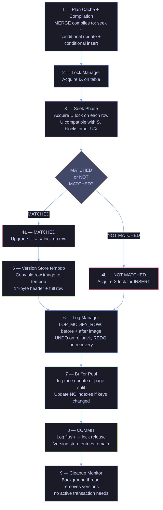

# MERGE and Upsert Patterns

> [!quote]
> "MERGE is the Swiss Army knife of SQL — powerful, but you can cut yourself if you don't understand every blade."
>
> — **Aaron Bertrand**, SQLPerformance.com

SQL Server offers several strategies for loading data where rows may already exist: truncate-reload, insert-or-update (upsert), MERGE, and SCD Type 2 close-and-insert. The correct choice depends on whether you need history, whether the source is append-only, and whether the operation must be atomic. The data pipeline uses all four patterns across its bronze, silver, and gold layers.

---

### The Four Load Patterns at a Glance

| Pattern | Used In | Source Behavior | History Preserved |
|---------|---------|-----------------|-------------------|
| **Truncate-reload** | Bronze (snapshot tables) | Full replacement each run | No — only current snapshot |
| **Read-then-INSERT/UPDATE** | Bronze OHLCV, Silver signals | Append-only with corrections | Yes — insert new, fix stale |
| **SCD Type 2 (close + insert)** | Silver dimension tables | Attribute changes need tracking | Yes — full version history |
| **Delete-and-insert** | Gold scores | Idempotent recompute | Partial — 7-day rolling window |

---

## Strategy 1: Truncate-Reload (Bronze Snapshot Tables)

Bronze tables hold only the current snapshot. Every pipeline run wipes the table for the given index and reloads fresh data from JSON. The DELETE and INSERT must be wrapped in a single explicit transaction so a crash between the two steps does not leave the table empty.

#### DELETE + INSERT in transaction — truncate-reload pattern

```sql
-- Strategy: truncate & reload per index
-- Used by: load_index_dim.py, load_signals_daily.py, load_signals_quarterly.py

DELETE FROM bronze.signals_daily WHERE _index = ?   -- parameterized to the current index
```

Python bulk insert using pyodbc `fast_executemany`:

```python
cursor.fast_executemany = True   # pyodbc batch mode — much faster than row-by-row
cursor.executemany(sql, rows)    # rows is a list of tuples matching the ? placeholders
conn.commit()                    # commit the transaction (or rollback on error)
```

The atomic pattern in Python (ensures all-or-nothing):

```python
conn = get_connection()
cursor = conn.cursor()
try:
    cursor.execute("DELETE FROM bronze.signals_daily WHERE _index = ?", index_name)
    cursor.executemany("INSERT INTO bronze.signals_daily (...) VALUES (...)", rows)
    conn.commit()  # Both operations commit together — atomic swap
except Exception:
    conn.rollback()  # On failure, neither DELETE nor INSERT takes effect
    raise
```

> [!warning] Missing Transaction Risks Data Loss
>
> Missing Transaction = Empty Table on Crash.
> If the process crashes between DELETE and INSERT without a transaction, the table is left empty. The explicit `conn.commit()` after both operations ensures all-or-nothing behavior. Never delete without having the INSERT in the same transaction.

> [!success] Safe Pattern
>
> Always wrap DELETE + INSERT pairs in a single explicit transaction. In Python: open the connection, execute DELETE, execute INSERT (or `executemany`), then call `conn.commit()` once — with `conn.rollback()` in the `except` block to undo both operations on failure.

---

## Strategy 2: Read-then-INSERT/UPDATE (OHLCV Merge)

OHLCV data is append-only (new dates added each day) with volume corrections (after-hours snapshots have volume=0, which gets corrected the following day). A full truncate-reload would destroy years of price history, so this strategy reads what already exists and only touches what changed. This is the same MERGE pattern used in [bronze OHLCV loading](https://alp78.github.io/elysium/04-SQL-Server/Medallion-Project/bronze-layer-loading#strategy-2-merge-ohlcv-only).

#### SELECT existing rows — build lookup map for merge comparison

This query loads the current state of the OHLCV table into memory so Python can classify each source row as new (INSERT), stale (UPDATE), or unchanged (SKIP). `CONVERT(VARCHAR(10), date, 120)` serializes the date column using SQL Server format style 120 (`YYYY-MM-DD`), which matches the string key format used in the Python dictionary. `ISNULL(volume, 0)` replaces NULL volumes with 0 so the staleness check — "was this a zero-volume after-hours snapshot?" — can use a simple numeric comparison rather than IS NULL.

```sql
-- Step 1: Read existing bronze data to build a lookup map
-- ingestion/loaders/load_ohlcv.py (lines 54-57)

SELECT symbol,                                   -- stock ticker
       CONVERT(VARCHAR(10), date, 120),           -- date as 'YYYY-MM-DD' string
       ISNULL(volume, 0)                          -- volume (0 if null, for stale check)
FROM bronze.index_europe_ohlcv                     -- table name is dynamic per index
```

Python builds a dictionary: `existing = {('ASML.AS', '2025-03-04'): 1842300, ...}`

#### INSERT WHERE NOT EXISTS — insert new rows only (OHLCV merge)

```sql
-- Step 2a: Insert rows that don't exist yet (new dates)
-- ingestion/loaders/load_ohlcv.py (lines 84-88)

INSERT INTO bronze.index_europe_ohlcv (
    symbol, date, [open], high, low, [close],
    adj_close, volume, dividends, stock_splits
) VALUES (?, ?, ?, ?, ?, ?, ?, ?, ?, ?)
```

#### UPDATE WHERE volume changed — update stale rows with new data

```sql
-- Step 2b: Update rows where volume was 0 but now has real data
-- ingestion/loaders/load_ohlcv.py (lines 91-95)

UPDATE bronze.index_europe_ohlcv
SET [open] = ?, high = ?, low = ?, [close] = ?,
    adj_close = ?, volume = ?, dividends = ?, stock_splits = ?
WHERE symbol = ? AND date = ?
```


---

## Strategy 3: SCD Type 2 — Close Old, Insert New (Silver Dimensions)

A **dimension table** stores the descriptive attributes of business entities — in this pipeline, company metadata such as sector, country, exchange, and name. Dimension tables are contrasted with **fact tables**, which store measurable events (OHLCV prices, financial signals, computed scores). When an entity's attributes change over time, three handling strategies exist:

| SCD Type | Action on change | History preserved | Typical use |
|---|---|---|---|
| **Type 1** | Overwrite the existing row | No — old value is lost | Corrections, typos |
| **Type 2** | Close old row, insert new row | Yes — full version history | Reclassifications, sector changes |
| **Type 3** | Add a "previous value" column | Partial — one prior value only | Soft transitions, single attribute |

This pipeline uses **Type 2** because index composition and sector classifications change with each periodic rebalancing. Downstream analytics must reconstruct the portfolio as it existed on any historical date — which requires a complete, unbroken version chain, not just the current value.

Slowly Changing Dimension (SCD) Type 2 preserves the full history of attribute changes by never updating existing rows. When an attribute changes, the old row is closed with a `valid_to` timestamp and a new row is inserted with the current values. This allows point-in-time queries: "what was ASML's sector on 2024-06-15?"

File: `ingestion/transforms/transform_index_dim.py`

#### SELECT bronze snapshot — SCD Type 2 step 1: read source data

```sql
-- Step 1: Read the full bronze snapshot
-- transform_index_dim.py (lines 40-43)

SELECT _index, symbol, long_name, short_name, sector, sector_key,
       industry, industry_key, country, city, website,
       long_business_summary, exchange, full_exchange_name,
       exchange_timezone_name, exchange_timezone_short,
       currency, financial_currency, quote_type, market,
       range_start, price_data_start
FROM bronze.index_dim
```

#### SELECT silver WHERE is_current = 1 — SCD Type 2 step 2: read active rows

```sql
-- Step 2: Read current silver rows (active records only)
-- transform_index_dim.py (lines 51-54)

SELECT _index, symbol, long_name, short_name, sector, sector_key,
       -- ... same columns ...
       range_start, price_data_start
FROM silver.index_dim
WHERE is_current = 1    -- only active records
```

Python compares each `(_index, symbol)` pair. If attributes changed:

#### UPDATE SET is_current = 0, end_date — SCD Type 2 step 3a: close old record

```sql
-- Step 3a: Close the old record (set end-date, mark as historical)
-- transform_index_dim.py (lines 131-134)

UPDATE silver.index_dim
SET valid_to = SYSUTCDATETIME(),   -- timestamp when this version ended
    is_current = 0                  -- no longer the active record
WHERE _index = ? AND symbol = ?
  AND is_current = 1
```

#### INSERT new version — SCD Type 2 step 3b: insert with is_current = 1

```sql
-- Step 3b: Insert the new version (automatically gets is_current = 1)
-- transform_index_dim.py (lines 124-126)

INSERT INTO silver.index_dim (
    _index, symbol, long_name, short_name, sector, ...
) VALUES (?, ?, ?, ?, ?, ...)
-- DEFAULT: valid_from = SYSUTCDATETIME(), is_current = 1
```

#### silver.index_dim — sample state after SCD Type 2 processing

| _index | symbol | sector | valid_from | valid_to | is_current |
|--------|--------|--------|------------|----------|------------|
| market_index | ASML.AS | Technology | 2024-01-15 | 2025-06-01 | 0 |
| market_index | ASML.AS | Semiconductors | 2025-06-01 | NULL | 1 |


> [!tip] SCD Type 2 Key Design
>
> The `is_current = 1` flag is the critical filter for all downstream queries. Every JOIN to `silver.index_dim` must include `AND d.is_current = 1` to avoid double-counting historical versions. The `valid_to IS NULL` condition is equivalent but the flag is faster with a filtered index.

---

## Strategy 4: Upsert — Daily Signals (Silver Fact Tables)

Bronze holds only today's snapshot (truncated each run). This transform preserves history in silver by upserting: insert new dates, update changed values, skip unchanged.

File: `ingestion/transforms/transform_signals_daily.py`

#### SELECT silver signals — upsert step 1: load existing for comparison

```sql
-- Step 1: Load all existing silver data for comparison
-- transform_signals_daily.py (lines 41-44)

SELECT _index,
       symbol,
       CONVERT(VARCHAR(10), signal_date, 120),  -- date as 'YYYY-MM-DD' string
       current_price, forward_pe, price_to_book, ev_to_ebitda,
       dividend_yield, market_cap, beta,
       fifty_two_week_change, sandp_52_week_change,
       fifty_day_average, two_hundred_day_average, dist_from_52_week_high,
       target_median_price, recommendation_mean, upside_potential
FROM silver.signals_daily
```

#### SELECT bronze snapshot — upsert step 2: read today's source data

```sql
-- Step 2: Read today's bronze snapshot
-- transform_signals_daily.py (lines 51-54)

SELECT _index,
       symbol,
       CAST(timestamp AS DATE) AS signal_date,   -- truncate timestamp to date
       current_price, forward_pe, price_to_book, ev_to_ebitda,
       dividend_yield, market_cap, beta,
       fifty_two_week_change, sandp_52_week_change,
       fifty_day_average, two_hundred_day_average, dist_from_52_week_high,
       target_median_price, recommendation_mean, upside_potential
FROM bronze.signals_daily
```

Python compares each `(_index, symbol, date)` key:

#### INSERT if new, UPDATE if changed, SKIP if identical — upsert logic

> [!info] Upsert Three-Way Branching Logic
>
> For each `(_index, symbol, date)` key in the bronze source, Python checks three conditions:
> - **INSERT** — key does not exist in silver yet (new date)
> - **UPDATE** — key exists but at least one value column differs (market moved)
> - **SKIP** — key exists and all values are identical (no change since last fetch)

```sql
-- Step 3a: INSERT if this date doesn't exist in silver yet
INSERT INTO silver.signals_daily (
    _index, symbol, signal_date, current_price, forward_pe, ...
) VALUES (?, ?, ?, ?, ?, ...)

-- Step 3b: UPDATE if the date exists but values changed (market moved)
UPDATE silver.signals_daily
SET current_price = ?, forward_pe = ?, price_to_book = ?, ...
WHERE _index = ? AND symbol = ? AND signal_date = ?

-- Step 3c: SKIP if values are identical (no market movement since last fetch)
```

#### Upsert run output — inserted, updated, skipped counts

```text
records_inserted=50  records_updated=45  records_unchanged=5
```


---

## T-SQL MERGE Statement (Atomic Upsert)

The T-SQL `MERGE` statement — introduced in SQL Server 2008 (database compatibility level 100 or higher) — combines INSERT, UPDATE, and optionally DELETE into a single atomic DML operation against a target table. It is the most concise way to express "insert if not exists, update if matched" and is safe against phantom insert race conditions because the match check and the write happen within the same atomic step.

`@@ROWCOUNT` after a MERGE returns the **total** of all rows inserted, updated, and deleted combined — not just one operation. To distinguish counts by operation, use the `OUTPUT $action` clause to capture `'INSERT'`, `'UPDATE'`, or `'DELETE'` per row.

MERGE is the core [idempotent pattern](https://alp78.github.io/elysium/14-Data-Architecture/Pipeline-Patterns/idempotent-pipeline-design) used across the pipeline, and [dbt incremental models](https://alp78.github.io/elysium/11-dbt/Modeling/dbt-materializations) generate MERGE statements internally when targeting SQL Server.

#### MERGE WHEN MATCHED / NOT MATCHED — atomic upsert pattern

```sql
MERGE INTO silver.signals_daily AS target
USING staging AS source
    ON target._index = source._index
    AND target.symbol = source.symbol
    AND target.signal_date = source.signal_date
WHEN MATCHED THEN UPDATE SET
    target.current_price = source.current_price,
    target.forward_pe    = source.forward_pe
    -- ... other columns ...
WHEN NOT MATCHED THEN INSERT (
    _index, symbol, signal_date, current_price, forward_pe
) VALUES (
    source._index, source.symbol, source.signal_date,
    source.current_price, source.forward_pe
);
```

> [!warning] MERGE Requires Semicolon Terminator
>
> MERGE is one of the few T-SQL statements that REQUIRES a trailing semicolon. Omitting it causes cryptic syntax errors that point to the line AFTER the MERGE. Always terminate with `;`.

> [!success] Safe Pattern
>
> End every `MERGE` statement with a semicolon on its own line. As a code-review habit, treat a MERGE block without a trailing `;` as a syntax error regardless of whether it parses — the error surfaces unpredictably depending on what follows.

#### MERGE WHEN NOT MATCHED THEN INSERT — prevent phantom duplicate inserts

```sql
MERGE INTO t AS target
USING (SELECT 'ASML' AS symbol) AS source
    ON target.symbol = source.symbol
WHEN NOT MATCHED THEN
    INSERT (symbol) VALUES (source.symbol);
```

> [!danger] MERGE with Non-Deterministic Source
>
> If two source rows match the same target row (duplicate business key
> in the source CTE), MERGE fails with error 8672: "The MERGE statement
> attempted to UPDATE or DELETE the same row more than once." This
> happens silently in staging: a double-fetched API response produces
> two rows with the same `(symbol, date)`. Always deduplicate the source
> CTE before the MERGE: `WITH src AS (SELECT DISTINCT ... FROM staging)`.

> [!success] Safe Pattern
>
> Always deduplicate the source before MERGE: `WITH src AS (SELECT *, ROW_NUMBER() OVER (PARTITION BY symbol, date ORDER BY load_id DESC) AS rn FROM staging) SELECT ... FROM src WHERE rn = 1`. This guarantees at most one source row per target key, preventing error 8672.

> [!danger] Concurrent MERGE Race Condition
>
> Two concurrent MERGE statements against the same target can produce duplicate inserts — a phantom read between the NOT MATCHED check and the INSERT. Fix: add `WITH (HOLDLOCK)` on the target table or wrap in SERIALIZABLE isolation. Without this, pipeline retry logic that runs MERGE concurrently will create duplicates.

> [!success] Safe Pattern
>
> Add `WITH (HOLDLOCK)` to the target table reference: `MERGE INTO silver.signals_daily WITH (HOLDLOCK) AS target`. This promotes the shared lock to a range lock during the NOT MATCHED check, preventing concurrent sessions from passing the check simultaneously and inserting duplicate rows.

> [!warning] OUTPUT with MERGE Limitations
>
> The OUTPUT clause with MERGE has restrictions: it cannot use `OUTPUT INTO` when the target table has triggers. The `$action` column returns 'INSERT', 'UPDATE', or 'DELETE' — use it to log which rows were affected by which operation.

> [!success] Safe Pattern
>
> If the target table has triggers and you need `OUTPUT INTO`, capture output into a `@table` variable first and then INSERT from it: `OUTPUT $action, inserted.id INTO @audit_table; INSERT INTO audit_log SELECT * FROM @audit_table;`. Alternatively, remove triggers and replace with explicit audit logic inside the MERGE batch.

> [!info] MERGE and RCSI Locking
>
> MERGE and RCSI — How Locking Works.
> Under the hood, MERGE acquires an **Update (U) lock** on each row during the seek phase. U locks are compatible with shared (S) locks but not with other U or X locks. This prevents conversion deadlocks where two sessions both hold S and both try to promote to X. When the row is modified, the U lock converts to an Exclusive (X) lock. With RCSI enabled, a copy of the old row version is written to TempDB before the update, allowing concurrent readers to see the pre-MERGE snapshot without blocking.

---

## Strategy 5: Delete-and-Insert (Gold Scores)

Gold scores are fully recomputed for a given date — there is no partial update. The pattern is delete the target date, then insert the recomputed rows. For the incremental index performance transform, a 7-day rolling window is refreshed to handle late-arriving signals.

#### DELETE + INSERT by date — gold scores refresh pattern

```sql
-- Step 4: Delete existing scores for this date, then insert new ones
-- transform_scores_daily.py (line 240)

DELETE FROM gold.scores_daily WHERE score_date = ?   -- e.g. '2025-03-05'

INSERT INTO gold.scores_daily (
    _index, symbol, score_date, sector,
    pe_zscore, pb_zscore, ev_ebitda_zscore, yield_zscore,
    relative_value_score, relative_value_rank,
    relative_strength, sma_50_ratio, sma_200_ratio, dist_from_52w_high,
    momentum_score, momentum_rank,
    implied_upside, recommendation_mean, price_falling_analysts_bullish,
    sentiment_score, sentiment_rank,
    composite_score, composite_rank,
    sma_30_close, sma_90_close,
    market_cap, index_weight,
    short_name, country, current_price,
    day_change_pct, five_day_change_pct, ytd_change_pct, currency
) VALUES (?, ?, ?, ?, ?, ?, ?, ?, ?, ?, ?, ?, ?, ?, ?, ?, ?, ?, ?, ?, ?, ?, ?, ?, ?, ?, ?, ?, ?, ?, ?, ?, ?, ?)
```

#### DELETE + INSERT rolling window — gold index performance refresh

```sql
-- Step 5: Delete last 7 days (refresh window) and insert new data
-- transform_index_performance.py (lines 262-265)

DELETE FROM gold.index_performance
WHERE _index = ?
  AND perf_date >= ?     -- max_existing - 7 days

INSERT INTO gold.index_performance (
    _index, perf_date, daily_return, cumulative_factor,
    rolling_30d_return, rolling_90d_return, ytd_return,
    rolling_30d_volatility, stocks_count,
    avg_pe, avg_pb, avg_dividend_yield, avg_market_cap
) VALUES (?, ?, ?, ?, ?, ?, ?, ?, ?, ?, ?, ?, ?)
```

---

## Transaction Management

### When Autocommit Is Sufficient

SQL Server runs in **autocommit mode** by default: each individual statement is wrapped in its own implicit transaction that commits immediately on success or rolls back on the failing statement on error. Explicit `BEGIN TRAN` is only needed when multiple statements must succeed or fail together as a unit.

For most pipeline operations — especially idempotent MERGEs — autocommit is the right default:

- Simpler code with shorter lock duration
- Re-runnable on failure (MERGE is idempotent if the source is stable)
- No risk of a forgotten ROLLBACK leaving an open transaction

**Rule:** Use explicit `BEGIN TRAN / COMMIT` when multiple statements must succeed or fail together. Use `@@ROWCOUNT` guards to validate before committing. Single-statement MERGEs are fine with autocommit.

### When You Need Explicit Transactions

| Scenario | Why autocommit isn't enough |
|---|---|
| DELETE old data + INSERT new data (table refresh) | If INSERT fails after DELETE, the table is empty |
| INSERT into parent + INSERT into child (FK relationship) | Child rows reference parent rows that must exist |
| UPDATE balance A + UPDATE balance B (transfer) | Partial completion leaves inconsistent totals |
| Any destructive operation you want to verify first | No opportunity to check `@@ROWCOUNT` before it's permanent |

### The Complete Pattern — Multi-Statement Transaction with Validation

```sql
BEGIN TRAN;

DECLARE @deleted INT, @inserted INT, @updated INT;

-- Step 1: Clean old data
DELETE FROM gold.scores_daily
WHERE score_date < DATEADD(YEAR, -3, GETUTCDATE());
SET @deleted = @@ROWCOUNT;

-- Step 2: Refresh current scores
MERGE gold.scores_daily AS tgt
USING silver.signals_daily AS src
ON tgt._index = src._index AND tgt.symbol = src.symbol AND tgt.score_date = src.signal_date
WHEN MATCHED THEN UPDATE SET tgt.momentum_score = src.momentum_score
WHEN NOT MATCHED THEN INSERT (_index, symbol, score_date, momentum_score)
    VALUES (src._index, src.symbol, src.signal_date, src.momentum_score);
SET @inserted = @@ROWCOUNT;

-- Step 3: Audit log
INSERT INTO gold.audit_log (action, affected_rows, ts)
VALUES ('scores_refresh', @inserted, GETUTCDATE());

-- Validate before committing
IF @deleted > 10000
BEGIN
    PRINT 'Safety: deleted ' + CAST(@deleted AS VARCHAR) + ' rows — too many, rolling back';
    ROLLBACK;
    RETURN;
END

IF @inserted = 0
BEGIN
    PRINT 'No rows merged — source may be empty, rolling back';
    ROLLBACK;
    RETURN;
END

IF @@ERROR <> 0
BEGIN
    PRINT 'An error occurred — rolling back';
    ROLLBACK;
    RETURN;
END

PRINT 'All checks passed — committing';
COMMIT;
```

### System Functions for Transaction Validation

**`@@ROWCOUNT`** — rows affected by the last statement.

```sql
DELETE FROM bronze.pulse_tickers WHERE _index = 'old_index';
IF @@ROWCOUNT = 0
    PRINT 'Nothing to delete — table was already clean';
```

> [!warning] Capture @@ROWCOUNT Immediately
>
> Must be read **immediately** after the statement. Even `SET @var = ...` resets it — use `SET @var = @@ROWCOUNT` as the first line after the statement.

> [!success] Safe Pattern
>
> Immediately after any DML statement, add `SET @affected = @@ROWCOUNT;` as the very next line — before any IF, PRINT, or SET. Use `@affected` downstream for validation guards. Never read `@@ROWCOUNT` more than one statement after the operation.

---

**`@@ERROR`** — error number from the last statement (0 = success).

```sql
UPDATE silver.signals_daily SET signal_date = NULL WHERE symbol = 'ASML';
IF @@ERROR <> 0
    PRINT 'Update failed (probably NOT NULL constraint)';
```

Same rule: must be captured immediately. Superseded by `TRY/CATCH` in SQL Server 2005 and later — prefer structured error handling for production batches. Still useful for quick one-off checks in ad-hoc scripts where a full CATCH block is overkill.

---

**`@@TRANCOUNT`** — current nesting level of transactions (0 = no open transaction).

```sql
BEGIN TRAN;               -- @@TRANCOUNT = 1
    BEGIN TRAN;            -- @@TRANCOUNT = 2 (nested)
    COMMIT;                -- @@TRANCOUNT = 1 (decrements)
COMMIT;                    -- @@TRANCOUNT = 0 (actually commits)

-- ROLLBACK always drops to 0, regardless of nesting depth
```

Useful in stored procedures to avoid double-commits:

```sql
CREATE PROCEDURE dbo.usp_refresh_scores
AS
BEGIN
    DECLARE @started_tran BIT = 0;
    IF @@TRANCOUNT = 0
    BEGIN
        BEGIN TRAN;
        SET @started_tran = 1;
    END

    -- ... do work ...

    IF @started_tran = 1
        COMMIT;
END
```

---

**`XACT_STATE()`** — transaction health (callable inside CATCH block).

| Return value | Meaning | What you can do |
|---|---|---|
| 1 | Transaction is active and committable | COMMIT or ROLLBACK |
| -1 | Transaction is doomed (uncommittable) | ROLLBACK only |
| 0 | No active transaction | Nothing to commit/rollback |

A transaction becomes **doomed** when a severe error occurs (e.g., deadlock victim, constraint violation with `XACT_ABORT ON`). You cannot COMMIT a doomed transaction — only ROLLBACK.

### TRY/CATCH with XACT_ABORT — The Safe Pattern

```sql
SET XACT_ABORT ON;
BEGIN TRY
    BEGIN TRAN;
    DELETE FROM gold.scores_daily WHERE score_date < '2020-01-01';
    UPDATE gold.index_performance SET recalculated = 1;
    COMMIT;
END TRY
BEGIN CATCH
    IF XACT_STATE() <> 0
        ROLLBACK;

    PRINT 'Error: ' + ERROR_MESSAGE();
    PRINT 'Line: ' + CAST(ERROR_LINE() AS VARCHAR);
    PRINT 'Severity: ' + CAST(ERROR_SEVERITY() AS VARCHAR);
    -- Re-raise or log
    THROW;
END CATCH
```

#### SET XACT_ABORT ON — automatic rollback on any error

| Setting | Behavior on error |
|---|---|
| `OFF` (default) | Only the failing statement is rolled back. The transaction stays open. Subsequent statements still execute. |
| `ON` | The entire transaction is immediately rolled back and execution jumps to CATCH (or aborts the batch). |

> [!danger] XACT_ABORT OFF Commits Partial Work
>
> Without `XACT_ABORT ON`, a failing statement does NOT abort the transaction. Subsequent statements still execute and COMMIT saves an inconsistent state. With `XACT_ABORT ON`, any error immediately rolls back the entire transaction and jumps to CATCH.

> [!success] Safe Pattern
>
> Add `SET XACT_ABORT ON;` as the first line before `BEGIN TRY` in every stored procedure and every T-SQL batch that uses explicit transactions. Pair it with a `TRY/CATCH` block that checks `XACT_STATE() <> 0` before issuing `ROLLBACK`.

```sql
-- Without XACT_ABORT ON (dangerous):
BEGIN TRAN;
INSERT INTO table1 ...;    -- succeeds
INSERT INTO table2 ...;    -- fails (constraint violation)
INSERT INTO table3 ...;    -- STILL EXECUTES with table2's insert missing
COMMIT;                     -- commits an inconsistent state

-- With XACT_ABORT ON (safe):
SET XACT_ABORT ON;
BEGIN TRAN;
INSERT INTO table1 ...;    -- succeeds
INSERT INTO table2 ...;    -- fails → entire transaction rolled back immediately
INSERT INTO table3 ...;    -- never reached
COMMIT;                     -- never reached
```

> [!tip] Always Use XACT_ABORT ON
>
> Always Use XACT_ABORT ON With Explicit Transactions.
> Without it, a mid-transaction error leaves you in a half-committed state that's hard to detect. `SET XACT_ABORT ON` before `BEGIN TRAN` is a near-universal best practice.

> [!info] THROW vs RAISERROR — Which to Use in CATCH Blocks
>
> `THROW` was introduced in SQL Server 2012. Unlike `RAISERROR`, `THROW` re-raises the original error number and severity without modification, and critically, it **honors `SET XACT_ABORT ON`** — meaning it will mark an active transaction as uncommittable if `XACT_ABORT` is enabled. `RAISERROR` does not honor `XACT_ABORT ON` and can leave the transaction in an ambiguous state where it appears active but subsequent COMMIT attempts fail.
>
> - Use `THROW;` (no arguments) to re-raise the caught error in SQL Server 2012+
> - Use `THROW error_number, message, state;` to raise a new error
> - Avoid `RAISERROR` in new code — it exists for backward compatibility only

### Error Functions Inside CATCH

Inside a CATCH block, SQL Server provides functions that return details about the error: `ERROR_NUMBER()`, `ERROR_MESSAGE()`, `ERROR_SEVERITY()`, `ERROR_STATE()`, `ERROR_LINE()`, and `ERROR_PROCEDURE()`. These functions are only available inside CATCH — calling them outside returns NULL.

```sql
BEGIN TRY
    MERGE gold.scores_daily AS tgt USING ...;
END TRY
BEGIN CATCH
    SELECT
        ERROR_NUMBER()   AS err_number,    -- e.g., 2627 (unique key violation)
        ERROR_SEVERITY() AS err_severity,  -- e.g., 14 (permissions/constraint)
        ERROR_STATE()    AS err_state,     -- sub-code for the specific error
        ERROR_LINE()     AS err_line,      -- line number in the batch
        ERROR_MESSAGE()  AS err_message;   -- human-readable description
END CATCH
```

### Savepoints — Partial Rollback Within a Transaction

A savepoint is a named checkpoint within a transaction. `SAVE TRANSACTION` creates one; `ROLLBACK TRANSACTION` to a savepoint undoes work back to that point without rolling back the entire transaction. Use savepoints when a multi-step pipeline should continue even if one optional step fails.

When you want to undo part of a transaction without losing everything:

```sql
BEGIN TRAN;

-- Step 1: always keep this
INSERT INTO gold.audit_log (action, ts) VALUES ('cleanup_start', GETUTCDATE());

-- Step 2: attempt cleanup, rollback only this step if too aggressive
SAVE TRAN before_cleanup;
DELETE FROM gold.scores_daily WHERE score_date < '2020-01-01';
IF @@ROWCOUNT > 5000
BEGIN
    ROLLBACK TRAN before_cleanup;  -- undoes only the DELETE
    PRINT 'Cleanup skipped — too many rows';
END

-- Step 3: independent operation
SAVE TRAN before_refresh;
MERGE gold.index_performance ...;
IF @@ERROR <> 0
BEGIN
    ROLLBACK TRAN before_refresh;  -- undoes only the MERGE
    PRINT 'Refresh failed — skipped';
END

COMMIT;  -- commits whatever survived the savepoint rollbacks
```

A bare `ROLLBACK` (without a savepoint name) kills the entire transaction. `ROLLBACK TRAN <name>` only rewinds to that savepoint.

### SCOPE_IDENTITY() — Retrieving the Last Inserted Key

An **IDENTITY column** is a SQL Server auto-increment column defined with `IDENTITY(seed, increment)` — for example, `id INT IDENTITY(1, 1)`. The engine assigns a sequentially increasing integer to every inserted row automatically, starting from `seed` and advancing by `increment`. Identity values are **never reused and never rolled back**: a failed INSERT still increments the internal counter, leaving a permanent gap in the sequence. This is by design to prevent race conditions when multiple sessions insert concurrently.

After an INSERT into a table with an IDENTITY column, three functions can retrieve the generated value: `@@IDENTITY` (dangerous — returns the last identity across all scopes including triggers), `SCOPE_IDENTITY()` (safe — returns only the current scope), and `IDENT_CURRENT('table')` (returns the last value for a specific table regardless of scope or session).

```sql
INSERT INTO gold.audit_log (action) VALUES ('refresh');
DECLARE @log_id BIGINT = SCOPE_IDENTITY();
-- use @log_id to link child records
```

| Function | Scope | Use case |
|---|---|---|
| `@@IDENTITY` | Last identity across any table, any scope | Dangerous — triggers can change it |
| `SCOPE_IDENTITY()` | Last identity in current scope only | Safe — use this one |
| `IDENT_CURRENT('table')` | Last identity for a specific table, any session | For diagnostics only |

---

### MERGE Internals — What Happens Under RCSI

**Read Committed Snapshot Isolation (RCSI)** is a database-level setting that changes how `READ COMMITTED` queries (the default isolation level) behave. When enabled, readers never acquire shared (S) locks — instead they read the last committed version of a row from a version store in TempDB. This eliminates reader/writer blocking without changing any application code.

```sql
-- Enable RCSI on a database (requires brief exclusive access — disconnect all users first)
ALTER DATABASE your_db SET READ_COMMITTED_SNAPSHOT ON WITH NO_WAIT;

-- Verify
SELECT is_read_committed_snapshot_on FROM sys.databases WHERE name = 'your_db';
```

RCSI differs from full **SNAPSHOT isolation** in granularity:

| Isolation level | Snapshot consistency | Lock behavior |
|---|---|---|
| `READ COMMITTED` (default, no RCSI) | Per-statement, with S locks | Writers block readers |
| `READ COMMITTED SNAPSHOT` (RCSI) | Per-statement, from version store | Readers never block writers |
| `SNAPSHOT` | Per-transaction (consistent across all statements) | Readers never block writers |

RCSI provides **statement-level** consistency: each SELECT sees the last committed state at the moment it starts. SNAPSHOT isolation provides **transaction-level** consistency: the entire transaction sees the database as it was when the transaction began. Enable SNAPSHOT isolation separately with `ALTER DATABASE … SET ALLOW_SNAPSHOT_ISOLATION ON` (does not require exclusive access).

> [!info] SQL Server 2019+ — Accelerated Database Recovery (ADR) Moves the Version Store
>
> In SQL Server 2019 and later, enabling **Accelerated Database Recovery (ADR)** moves the version store from TempDB into a per-database **Persistent Version Store (PVS)**. This eliminates the TempDB growth problem caused by long-running readers under RCSI. The tradeoff: if the PVS fills up, UPDATE and DELETE operations fail (INSERT still succeeds). ADR also dramatically speeds up rollback and recovery by maintaining a version history without replaying the full log.
>
> Enable ADR per database: `ALTER DATABASE your_db SET ACCELERATED_DATABASE_RECOVERY = ON`.

Under RCSI, MERGE reads a snapshot of the source data but still acquires update locks on the target — it is not a fully optimistic operation. The flowchart below traces the complete lock and version store sequence inside SQL Server:



> [!warning] Long-Running Reads Kill TempDB With RCSI
>
> A long-running SELECT (e.g., a slow dashboard query or an open transaction) holds a snapshot LSN. SQL Server cannot clean up version store entries older than that LSN. The version store grows without bound until TempDB fills and all writes fail. Monitor TempDB usage and kill long-running read sessions if TempDB space becomes critical.

> [!success] Safe Pattern
>
> Monitor TempDB version store size with `SELECT SUM(version_store_reserved_page_count) * 8 / 1024 AS version_store_mb FROM sys.dm_db_file_space_usage`. Set a `LOCK_TIMEOUT` on dashboard sessions and route long-running BI queries to a read replica or a BigQuery export to prevent version store runaway on the production instance.

> [!warning] MERGE Against Columnstore Index Targets Is Inefficient
>
> When the MERGE target table has a clustered or non-clustered **columnstore index**, MERGE performs poorly. Columnstore segments must be decompressed, the rows updated or inserted, and then recompressed — this serial per-row overhead eliminates the batch-compression advantage that makes columnstore fast. For columnstore targets, the preferred pattern is a staged batch DELETE + INSERT into a rowstore staging table, then a bulk columnstore load.

> [!success] Safe Pattern
>
> For columnstore-indexed gold tables, use the two-step pattern: `DELETE FROM gold.target WHERE date = ?` followed by a bulk `INSERT INTO gold.target SELECT ... FROM staging`. This preserves columnar batch compression during the INSERT phase and avoids row-by-row MERGE overhead against compressed segments.

> [!warning] MERGE Does Not Use Simple Parameterization
>
> SQL Server does not apply simple parameterization to MERGE statements — literal values in the `ON` clause or `WHEN` conditions compile a new execution plan on every execution. In a high-frequency pipeline this causes plan cache bloat. Fix: wrap literals in variables before the MERGE, or set `PARAMETERIZATION FORCED` on the database (with caution — this affects all queries).

> [!success] Safe Pattern
>
> Declare variables for any literal values used in MERGE conditions: `DECLARE @idx NVARCHAR(50) = 'market_index'; MERGE INTO t AS target USING source ON target._index = @idx AND ...`. This allows plan reuse across executions with different index names, preventing a new compiled plan per run.

---

### Pipeline Load Pattern Summary

Decision guide for choosing the right load pattern based on table type, data volume, and concurrency requirements.

| Loader | Table | Pattern | Transaction? |
|--------|-------|---------|-------------|
| `load_index_dim.py` | `bronze.index_dim` | DELETE + INSERT | Yes — single `conn.commit()` |
| `load_signals_daily.py` | `bronze.signals_daily` | DELETE + INSERT | Yes |
| `load_signals_quarterly.py` | `bronze.signals_quarterly` | DELETE + INSERT | Yes |
| `load_pulse.py` | `bronze.pulse` | DELETE + INSERT | Yes |
| `load_pulse_tickers.py` | `bronze.pulse_tickers` | DELETE + INSERT | Yes |
| `load_ohlcv.py` | `bronze.*_ohlcv` | Read existing keys → INSERT missing + UPDATE stale | Yes |
| `transform_index_dim.py` | `silver.index_dim` | SCD Type 2 close + insert | Per-symbol |
| `transform_signals_daily.py` | `silver.signals_daily` | INSERT new dates + UPDATE changed | Per-batch |
| `transform_scores_daily.py` | `gold.scores_daily` | DELETE date + INSERT recomputed | Per-date |
| `transform_index_performance.py` | `gold.index_performance` | DELETE 7-day window + INSERT | Per-window |

---

### Related

- [sargable-queries](https://alp78.github.io/elysium/04-SQL-Server/T-SQL/sargable-queries) — ensure WHERE clauses on MERGE join keys are SARGable for index seeks
- [blocking-and-locking](https://alp78.github.io/elysium/04-SQL-Server/Concurrency/blocking-and-locking) — U lock → X lock promotion and RCSI's effect on reader/writer conflicts
- [deadlock-detection-and-prevention](https://alp78.github.io/elysium/04-SQL-Server/Concurrency/deadlock-detection-and-prevention) — MERGE deadlock scenarios and prevention strategies
- [race-conditions](https://alp78.github.io/elysium/04-SQL-Server/Concurrency/race-conditions) — phantom insert prevention with MERGE and serialization strategies
- [storage-internals](https://alp78.github.io/elysium/04-SQL-Server/Storage-and-Indexes/storage-internals) — version store mechanics, page splits during MERGE updates
- [medallion-architecture](https://alp78.github.io/elysium/14-Data-Architecture/Pipeline-Patterns/medallion-architecture) — bronze/silver/gold schema design context
- [silver-transforms](https://alp78.github.io/elysium/04-SQL-Server/Medallion-Project/silver-transforms) — full silver transform implementations
- [gold-transforms](https://alp78.github.io/elysium/04-SQL-Server/Medallion-Project/gold-transforms) — gold scoring and analytics transforms
