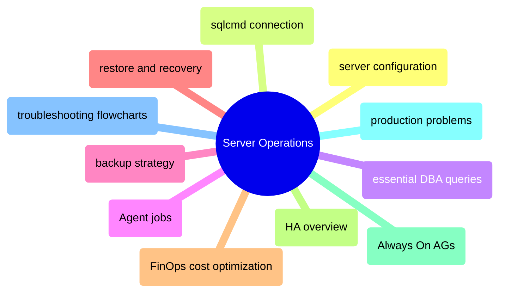
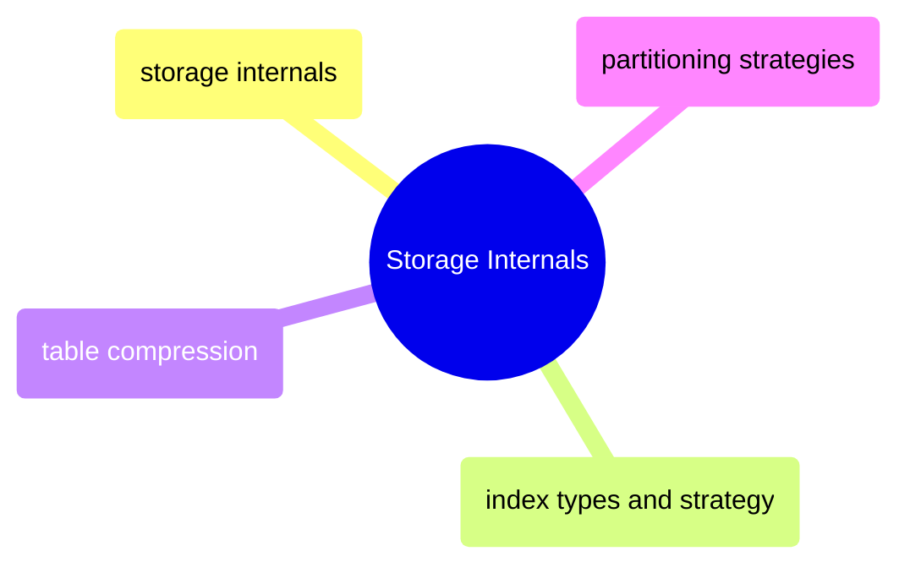
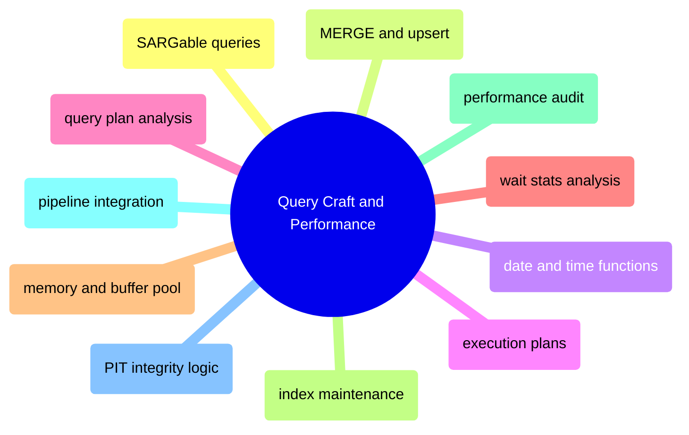
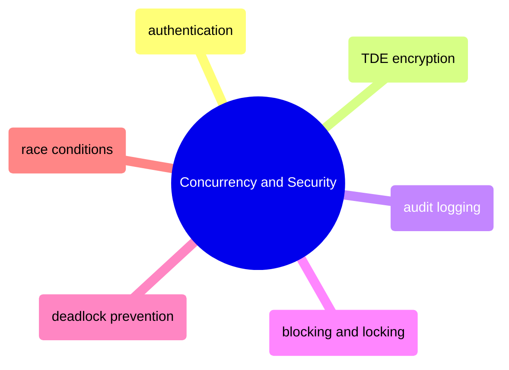
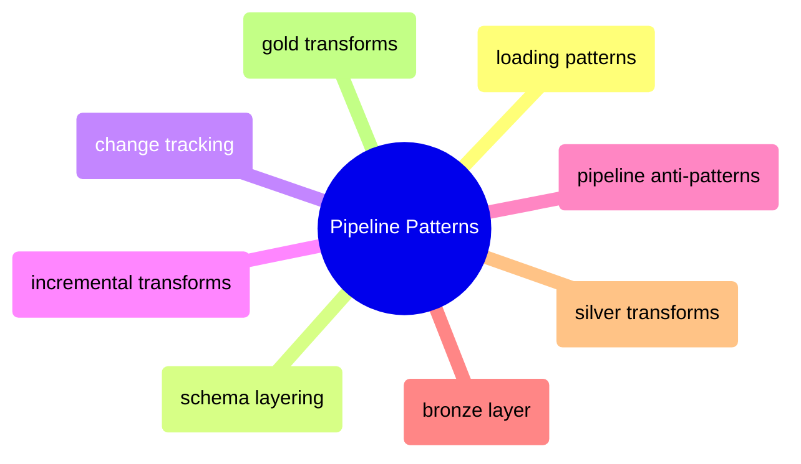

# MOC: SQL Server

SQL Server from instance administration through query optimization to
pipeline construction — covering operations, storage internals, T-SQL craft,
performance tuning, security, and the medallion pipeline implementation.
Expand any section to browse page contents.

> [!example]- Server Operations
>
> > [!abstract]- [[server-configuration]]
> >
> > - [[server-configuration#Tier 1: Non-Negotiable (Do Before Going to Production)|Non-negotiable production settings]]
> > - [[server-configuration#Set Max Server Memory|Max server memory]]
> > - [[server-configuration#Recovery Model|Recovery model selection]]
> > - [[server-configuration#Enable Read Committed Snapshot Isolation (RCSI)|RCSI enablement]]
> > - [[server-configuration#Linux OS Tuning (for SQL Server on Linux)|Linux OS tuning]]
> > - [[server-configuration#TempDB Configuration|TempDB configuration]]
>
> > [!abstract]- [sqlcmd-connection-and-usage](/04-SQL-Server/Administration/sqlcmd-connection-and-usage)
> >
> > - [Connection flags and syntax](/04-SQL-Server/Administration/sqlcmd-connection-and-usage#connecting--the-first-step-in-every-database-operation)
> > - [IAP tunnel connections](/04-SQL-Server/Administration/sqlcmd-connection-and-usage#connecting-through-iap-tunnel-gcp)
> > - [Scripted connection testing](/04-SQL-Server/Administration/sqlcmd-connection-and-usage#scripted-connection-testing)
> > - [Dedicated admin connection](/04-SQL-Server/Administration/sqlcmd-connection-and-usage#dedicated-admin-connection-dac)
> > - [Scripting variables](/04-SQL-Server/Administration/sqlcmd-connection-and-usage#scripting-variables)
>
> > [!abstract]- [[essential-dba-queries]]
> >
> > - [[essential-dba-queries#Server Information|Server information]]
> > - [[essential-dba-queries#Space and Size|Space and size analysis]]
> > - [[essential-dba-queries#Active Connections|Active connections]]
> > - [[essential-dba-queries#Currently Running Queries|Currently running queries]]
> > - [[essential-dba-queries#The Diagnostic Five (Run These First)|The diagnostic five]]
>
> > [!abstract]- [[sql-server-agent-jobs]]
> >
> > - [[sql-server-agent-jobs#SQL Server Agent on Linux — Enabling and Configuring|Enabling Agent on Linux]]
> > - [[sql-server-agent-jobs#Agent Architecture|Agent architecture]]
> > - [[sql-server-agent-jobs#Creating and Managing Jobs|Creating and managing jobs]]
> > - [[sql-server-agent-jobs#Job Triggering in the GCP + SQL Server Stack|Job triggering comparison]]
> > - [[sql-server-agent-jobs#Monitoring Agent Jobs from GCP|Monitoring from GCP]]
>
> > [!abstract]- [[backup-types-and-strategy]]
> >
> > - [[backup-types-and-strategy#Backup Types|Backup types comparison]]
> > - [[backup-types-and-strategy#T-SQL Backup Commands|T-SQL backup commands]]
> > - [[backup-types-and-strategy#The 3-2-1 Backup Rule|The 3-2-1 rule]]
> > - [[backup-types-and-strategy#Recovery Model Decision Matrix|Recovery model decision matrix]]
> > - [[backup-types-and-strategy#Production HA Backup Schedule|Production backup schedule]]
>
> > [!abstract]- [[restore-and-recovery]]
> >
> > - [[restore-and-recovery#Full Restore|Full restore]]
> > - [[restore-and-recovery#Point-in-Time Recovery (PITR)|Point-in-time recovery]]
> > - [[restore-and-recovery#Restore to a New Database (Side-by-Side)|Side-by-side restore]]
> > - [[restore-and-recovery#Monitoring Recovery Progress After a Crash|Monitoring recovery progress]]
>
> > [!abstract]- [[finops-cost-optimization]]
> >
> > - [[finops-cost-optimization#Persistent Disk Snapshot Schedules|Disk snapshot schedules]]
> > - [[finops-cost-optimization#Committed Use Discounts (CUDs) vs Spot Instances|CUDs vs spot instances]]
> > - [[finops-cost-optimization#Right-Sizing and Cost Monitoring|Right-sizing and cost monitoring]]
> > - [[finops-cost-optimization#SQL Server Storage Optimization|Storage optimization]]
>
> > [!abstract]- [[high-availability-overview]]
> >
> > - [[high-availability-overview#Why High Availability?|Why high availability]]
> > - [[high-availability-overview#HA Options for SQL Server 2022 on Linux|HA options comparison]]
> > - [[high-availability-overview#Setting Up Always On Availability Groups on Linux (GCP)|AG setup on Linux]]
> > - [[high-availability-overview#Monitoring the AG — Essential DMVs|AG monitoring DMVs]]
> > - [[high-availability-overview#Failover Operations|Failover operations]]
> > - [[high-availability-overview#GCP-Specific HA Considerations|GCP-specific considerations]]
>
> > [!abstract]- [[always-on-availability-groups]]
> >
> > - [[always-on-availability-groups#HA Options for SQL Server 2022 on Linux|HA options comparison]]
> > - [[always-on-availability-groups#Setting Up Always On AGs on Linux (GCP)|Step-by-step AG setup]]
> > - [[always-on-availability-groups#Monitoring the AG — Essential DMVs|Monitoring DMVs]]
> > - [[always-on-availability-groups#Failover Operations|Failover operations]]
> > - [[always-on-availability-groups#Troubleshooting|Troubleshooting five common issues]]
>
> > [!abstract]- [[sql-server-problems]]
> >
> > - [[sql-server-problems#Transaction Log Full|Transaction log full]]
> > - [[sql-server-problems#Data Disk Full|Data disk full]]
> > - [[sql-server-problems#Parameter Sniffing|Parameter sniffing]]
> > - [[sql-server-problems#Moderate — Operational Pain|Moderate operational pain]]
> > - [[sql-server-problems#SQL Server on Linux Gotchas|Linux-specific gotchas]]
>
> > [!abstract]- [[troubleshooting-flowcharts]]
> >
> > - [[troubleshooting-flowcharts#Flowchart 1: "Why Is It Slow?" — The Master Flowchart|Why is it slow]]
> > - [[troubleshooting-flowcharts#Flowchart 2: "Pipeline Failed" — Data Pipeline Troubleshooting|Pipeline failure diagnosis]]
> > - [[troubleshooting-flowcharts#Flowchart 3: "Should I Add an Index?" — Index Decision Tree|Index decision tree]]
> > - [[troubleshooting-flowcharts#Flowchart 4: "Disk Space Emergency" — Storage Recovery|Disk space emergency]]

> [!example]- Storage Internals
>
> > [!abstract]- [[storage-internals]]
> >
> > - [[storage-internals#Database File Architecture|Database file architecture]]
> > - [[storage-internals#Page Anatomy|Page anatomy]]
> > - [[storage-internals#The Transaction Log (.ldf) — How WAL Works|Transaction log and WAL]]
> > - [[storage-internals#CRUD Operations — The Full Internal Flow|CRUD operations at page level]]
> > - [[storage-internals#Index Structures at the Page Level|Index structures at page level]]
> > - [[storage-internals#The Buffer Pool — SQL Server's Memory Manager|Buffer pool memory manager]]
>
> > [!abstract]- [[index-types-and-strategy]]
> >
> > - [[index-types-and-strategy#Index Types — What They Are and When to Use Each|Index types overview]]
> > - [[index-types-and-strategy#Exploring Existing Indexes|Exploring existing indexes]]
> > - [[index-types-and-strategy#Index Usage Analysis — Are Your Indexes Being Used?|Index usage analysis]]
> > - [[index-types-and-strategy#Creating Indexes — All Flavors|Creating indexes]]
> > - [[index-types-and-strategy#Statistics — The Optimizer's Data Map|Statistics management]]
> > - [[index-types-and-strategy#Pipeline Index Strategy|Pipeline index strategy]]
>
> > [!abstract]- [[table-compression]]
> >
> > - [[table-compression#Compression Types|Row vs page compression]]
> > - [[table-compression#When to Apply Page Compression|When to apply page compression]]
> > - [[table-compression#Estimating Compression Savings Before Applying|Estimating savings]]
> > - [[table-compression#Applying Compression|Applying compression]]
> > - [[table-compression#Pipeline Compression Strategy|Pipeline compression strategy]]
>
> > [!abstract]- [[partitioning-strategies]]
> >
> > - [[partitioning-strategies#How SQL Server Partitioning Works|How partitioning works]]
> > - [[partitioning-strategies#SWITCH — Millisecond Partition Operations|Partition SWITCH operations]]
> > - [[partitioning-strategies#Adding New Partitions — Sliding Window Pattern|Sliding window pattern]]
> > - [[partitioning-strategies#Monitoring Partitioned Tables|Monitoring partitioned tables]]
> > - [[partitioning-strategies#Partitioning Decision Tree|Partitioning decision tree]]

> [!example]- Query Craft and Performance
>
> > [!abstract]- [[sargable-queries]]
> >
> > - [[sargable-queries#SARGable vs Non-SARGable — Functions on Columns|Functions on columns]]
> > - [[sargable-queries#Detecting Non-SARGable Predicates in Execution Plans|Detecting in execution plans]]
> > - [[sargable-queries#Implicit Conversions — The Silent Killer|Implicit conversions]]
> > - [[sargable-queries#SARGability Quick Reference for the Pipeline|Pipeline quick reference]]
>
> > [!abstract]- [[merge-and-upsert]]
> >
> > - [[merge-and-upsert#The Four Load Patterns at a Glance|Four load patterns]]
> > - [[merge-and-upsert#Strategy 3: SCD Type 2 — Close Old, Insert New (Silver Dimensions)|SCD Type 2 pattern]]
> > - [[merge-and-upsert#T-SQL MERGE Statement (Atomic Upsert)|T-SQL MERGE statement]]
> > - [[merge-and-upsert#Transaction Management|Transaction management]]
> > - [[merge-and-upsert#Transaction Management|Transaction management]]
>
> > [!abstract]- [[date-and-time-functions]]
> >
> > - [[date-and-time-functions#ISO 8601 — The Only Date Format You Should Use|ISO 8601 formats]]
> > - [[date-and-time-functions#Parsing and Formatting|Parsing and formatting]]
> > - [[date-and-time-functions#Timezone Conversion with AT TIME ZONE|Timezone conversion]]
> > - [[date-and-time-functions#Practical Pipeline Date Patterns|Pipeline date patterns]]
> > - [[date-and-time-functions#DST Pitfalls That Break Pipelines|DST pitfalls]]
>
> > [!abstract]- [[execution-plans]]
> >
> > - [[execution-plans#Reading the Visual Tree in SSMS|Reading the visual tree]]
> > - [[execution-plans#Getting Plans from the Pipeline (Non-SSMS)|Getting plans from the pipeline]]
> > - [[execution-plans#Cost Analysis — Finding the Most Expensive Operator|Cost analysis]]
> > - [[execution-plans#Cardinality Estimation — Detecting Bad Row Count Guesses|Cardinality estimation]]
> > - [[execution-plans#Parameter Sniffing|Parameter sniffing]]
> > - [[execution-plans#Batch Mode Execution|Batch mode execution]]
>
> > [!abstract]- [[query-plan-analysis]]
> >
> > - [[query-plan-analysis#How to Read an Execution Plan|Reading an execution plan]]
> > - [[query-plan-analysis#Capturing Plans from the Pipeline (Without SSMS)|Capturing plans programmatically]]
> > - [[query-plan-analysis#Cardinality Estimation — Detecting Bad Row Count Guesses|Cardinality estimation]]
> > - [[query-plan-analysis#Parameter Sniffing|Parameter sniffing]]
> > - [[query-plan-analysis#Query Store Setup and Regression Detection|Query Store regression detection]]
>
> > [!abstract]- [[wait-stats-analysis]]
> >
> > - [[wait-stats-analysis#System Health Dashboard — First Check|System health dashboard]]
> > - [[wait-stats-analysis#Top Waits Query — The Primary Diagnostic|Top waits query]]
> > - [[wait-stats-analysis#Top Resource-Consuming Queries|Top resource consumers]]
> > - [[wait-stats-analysis#TempDB Contention Detection|TempDB contention]]
> > - [[wait-stats-analysis#Query Store — Regression Detection|Query Store regression detection]]
>
> > [!abstract]- [[memory-and-buffer-pool]]
> >
> > - [[memory-and-buffer-pool#Memory Sizing Rule|Memory sizing rule]]
> > - [[memory-and-buffer-pool#Page Life Expectancy (PLE)|Page life expectancy]]
> > - [[memory-and-buffer-pool#Memory Clerks — Where Memory Is Being Used|Memory clerks]]
> > - [[memory-and-buffer-pool#Pending Memory Grants|Pending memory grants]]
> > - [[memory-and-buffer-pool#Memory Pressure Diagnosis Flow|Memory pressure diagnosis]]
>
> > [!abstract]- [[index-maintenance]]
> >
> > - [[index-maintenance#Fragmentation Detection|Fragmentation detection]]
> > - [[index-maintenance#REORGANIZE — Online, Lightweight|REORGANIZE]]
> > - [[index-maintenance#REBUILD — Heavier, More Thorough|REBUILD]]
> > - [[index-maintenance#Automated Maintenance Script|Automated maintenance script]]
> > - [[index-maintenance#Pipeline Maintenance Schedule|Pipeline maintenance schedule]]
> > - [[index-maintenance#Index Discovery|Index discovery queries]]
>
> > [!abstract]- [[performance-audit-playbook]]
> >
> > - [[performance-audit-playbook#Phase 1: Instance Overview|Instance overview]]
> > - [[performance-audit-playbook#Phase 2: Memory Pressure|Memory pressure]]
> > - [[performance-audit-playbook#Phase 3: Wait Statistics|Wait statistics]]
> > - [[performance-audit-playbook#Phase 5: Expensive Queries|Expensive queries]]
> > - [[performance-audit-playbook#Phase 6: Index Health|Index health]]
> > - [[performance-audit-playbook#DBCC and Trace Flag Reference|DBCC and trace flags]]
>
> > [!abstract]- [[pipeline-integration-and-devex]]
> >
> > - [[pipeline-integration-and-devex#Query Tagging for Airflow Correlation|Query tagging for Airflow]]
> > - [[pipeline-integration-and-devex#Connection Pool Management|Connection pool management]]
> > - [[pipeline-integration-and-devex#Datadog SQL Server Agent — Full Configuration|Datadog agent configuration]]
>
> > [!abstract]- [[pit-integrity-logic]]
> >
> > - [[pit-integrity-logic#Effective-Dated Constituent Lists|Effective-dated constituent lists]]
> > - [[pit-integrity-logic#Bi-Temporal Model|Bi-temporal model]]
> > - [[pit-integrity-logic#Weight Normalization|Weight normalization]]
> > - [[pit-integrity-logic#Performance Tuning for Large-Scale Joins|Large-scale join tuning]]
> > - [[pit-integrity-logic#Reconciliation Queries|Reconciliation queries]]

> [!example]- Concurrency and Security
>
> > [!abstract]- [[sql-server-authentication]]
> >
> > - [[sql-server-authentication#Part 1: GCP Service Account Hardening|GCP service account hardening]]
> > - [[sql-server-authentication#Part 2: SQL Server Login Hardening|SQL Server login hardening]]
> > - [[sql-server-authentication#Part 3: TLS Encryption for Connections|TLS encryption for connections]]
> > - [[sql-server-authentication#Part 4: GCP Firewall Rules|GCP firewall rules]]
> > - [[sql-server-authentication#Part 5: SQL Server Audit|SQL Server audit setup]]
> > - [[sql-server-authentication#Quarterly Security Review|Quarterly security review]]
>
> > [!abstract]- [[tde-encryption]]
> >
> > - [[tde-encryption#Step 1: Create KMS Keyring and Key in GCP|Create KMS keyring and key]]
> > - [[tde-encryption#Step 3: Certificate-Based TDE Setup|Certificate-based TDE setup]]
> > - [[tde-encryption#Step 4: CRITICAL — Backup the Certificate and Private Key|Certificate backup]]
> > - [[tde-encryption#Step 6: Restore Certificate on Another Server (Disaster Recovery)|Disaster recovery restore]]
> > - [[tde-encryption#TDE Monitoring Query|TDE monitoring]]
>
> > [!abstract]- [[audit-logging]]
> >
> > - [[audit-logging#SQL Server Audit Architecture|Audit architecture]]
> > - [[audit-logging#Step 4: Query Audit Logs|Querying audit logs]]
> > - [[audit-logging#Step 5: Detect Brute-Force Login Attacks|Brute-force detection]]
> > - [[audit-logging#Audit File Management|Audit file management]]
>
> > [!abstract]- [[blocking-and-locking]]
> >
> > - [[blocking-and-locking#Lock Types|Lock types]]
> > - [[blocking-and-locking#Lock Granularity|Lock granularity]]
> > - [[blocking-and-locking#Isolation Levels|Isolation levels]]
> > - [[blocking-and-locking#Read Committed Snapshot Isolation (RCSI)|RCSI]]
> > - [[blocking-and-locking#Detecting Blocking Chains|Detecting blocking chains]]
> > - [[blocking-and-locking#Lock Monitoring Queries|Lock monitoring queries]]
>
> > [!abstract]- [[deadlock-detection-and-prevention]]
> >
> > - [[deadlock-detection-and-prevention#Detecting Deadlocks|Detecting deadlocks]]
> > - [[deadlock-detection-and-prevention#Extended Events Session for Persistent Capture|Extended Events capture]]
> > - [[deadlock-detection-and-prevention#Preventing Deadlocks|Prevention strategies]]
> > - [[deadlock-detection-and-prevention#Application-Level Retry Logic|Application-level retry logic]]
> > - [[deadlock-detection-and-prevention#Reproducing a Deadlock for Testing|Reproducing for testing]]
>
> > [!abstract]- [[race-conditions]]
> >
> > - [[race-conditions#Common Race Condition Patterns in Data Pipelines|Common pipeline race patterns]]
> > - [[race-conditions#How to Detect Race Conditions|Detection techniques]]
> > - [[race-conditions#Prevention Strategies|Prevention strategies]]
> > - [[race-conditions#Pipeline Race Condition Audit|Pipeline audit checklist]]

> [!example]- Pipeline Patterns
>
> > [!abstract]- [[sql-server-loading-patterns]]
> >
> > - [[sql-server-loading-patterns#Loading Methods Comparison|Loading methods comparison]]
> > - [[sql-server-loading-patterns#Truncate-and-Reload|Truncate and reload]]
> > - [[sql-server-loading-patterns#Watermarks — The Foundation of Incremental Loading|Watermark fundamentals]]
> > - [[sql-server-loading-patterns#Upsert (INSERT + UPDATE)|Upsert approaches]]
> > - [[sql-server-loading-patterns#pyodbc fast_executemany Deep Dive|pyodbc fast_executemany]]
> > - [[sql-server-loading-patterns#bcp Deep Dive|bcp bulk loading]]
>
> > [!abstract]- [[sql-server-schema-layering]]
> >
> > - [[sql-server-schema-layering#Schema-per-Layer (Standard Approach)|Schema per layer]]
> > - [[sql-server-schema-layering#Separate Databases per Layer|Separate databases per layer]]
> > - [[sql-server-schema-layering#Naming Conventions|Naming conventions]]
> > - [[sql-server-schema-layering#Cross-Schema Security|Cross-schema security]]
> > - [[sql-server-schema-layering#Which Schema Strategy — Scenario-Based Decision|Schema strategy decision]]
>
> > [!abstract]- [[sql-server-change-tracking]]
> >
> > - [[sql-server-change-tracking#Decision Matrix|Change tracking decision matrix]]
> > - [[sql-server-change-tracking#Manual SCD Type 2|Manual SCD Type 2]]
> > - [[sql-server-change-tracking#SQL Server Temporal Tables (SYSTEM_VERSIONING)|Temporal tables]]
> > - [[sql-server-change-tracking#Change Data Capture (CDC)|Change Data Capture]]
> > - [[sql-server-change-tracking#Change Tracking (CT)|Change Tracking]]
>
> > [!abstract]- [[sql-server-incremental-transforms]]
> >
> > - [[sql-server-incremental-transforms#Watermark-Based Incremental Loading|Watermark-based loading]]
> > - [[sql-server-incremental-transforms#Partition-Based Incremental Processing|Partition-based processing]]
> > - [[sql-server-incremental-transforms#Window Function Transforms at Scale|Window function transforms]]
> > - [[sql-server-incremental-transforms#Gap Detection and Forward-Fill|Gap detection and forward-fill]]
> > - [[sql-server-incremental-transforms#Pre-Computed Aggregation Tables|Pre-computed aggregation]]
> > - [[sql-server-incremental-transforms#Indexed Views vs Aggregation Tables|Indexed views vs aggregation tables]]
>
> > [!abstract]- [[sql-server-pipeline-anti-patterns]]
> >
> > - [[sql-server-pipeline-anti-patterns#Loading Anti-Patterns|Loading anti-patterns]]
> > - [[sql-server-pipeline-anti-patterns#Schema Anti-Patterns|Schema anti-patterns]]
> > - [[sql-server-pipeline-anti-patterns#Query Anti-Patterns|Query anti-patterns]]
> > - [[sql-server-pipeline-anti-patterns#Change Tracking Anti-Patterns|Change tracking anti-patterns]]
> > - [[sql-server-pipeline-anti-patterns#Concurrency Anti-Patterns|Concurrency anti-patterns]]
> > - [[sql-server-pipeline-anti-patterns#Performance Anti-Patterns|Performance anti-patterns]]
>
> > [!abstract]- [[bronze-layer-loading]]
> >
> > - [[bronze-layer-loading#Database Setup & Connection|Database setup and connection]]
> > - [[bronze-layer-loading#Bronze Table DDL|Bronze table DDL]]
> > - [[bronze-layer-loading#Dynamic OHLCV Tables|Dynamic OHLCV tables]]
> > - [[bronze-layer-loading#Loading Patterns (JSON → Bronze)|Loading patterns]]
> > - [[bronze-layer-loading#Index Design (Bronze Layer)|Bronze index design]]
>
> > [!abstract]- [[silver-transforms]]
> >
> > - [[silver-transforms#Silver DDL|Silver table DDL]]
> > - [[silver-transforms#SCD Type 2 Transform — Index Dimensions|SCD Type 2 transform]]
> > - [[silver-transforms#Upsert — Daily Signals|Daily signal upsert]]
> > - [[silver-transforms#OHLCV Gap-Fill Transform|OHLCV gap-fill transform]]
> > - [[silver-transforms#Key SQL Techniques Used in Silver Transforms|Key SQL techniques]]
>
> > [!abstract]- [[gold-transforms]]
> >
> > - [[gold-transforms#Gold Table DDL|Gold table DDL]]
> > - [[gold-transforms#Gold Analytics Logic|Analytics logic and z-scores]]
> > - [[gold-transforms#Daily Scores Transform|Daily scores transform]]
> > - [[gold-transforms#Index Performance Transform|Index performance transform]]
> > - [[gold-transforms#Dashboard Consumption Queries|Dashboard consumption queries]]
> > - [[gold-transforms#Gold Freshness Checks|Freshness checks]]

## Cross-References

- [DB Queries](/05-DB-Queries/moc-db-queries) — SQL Server query notebooks with executable examples
- [GCP](/06-GCP/moc-gcp) — SQL Server VMs on Compute Engine
- [Terraform](/07-Terraform/moc-terraform) — Provisioning SQL Server infrastructure
- [Data Architecture](/14-Data-Architecture/moc-data-architecture) — Medallion architecture theory
- [25_py_functional_pipeline](/02-Programming-Languages/Python/25_py_functional_pipeline) — Python pipeline using SQL Server as the persistence layer
