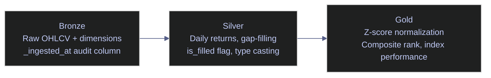

# BigQuery Fundamentals

> [!quote]
> "Big data is like teenage sex: everyone talks about it, nobody really knows how to do it, everyone thinks everyone else is doing it, so everyone claims they are doing it."
>
> — **Dan Ariely**, Facebook post (2013)

> [!abstract]- Summary
>
> BigQuery Fundamentals is the BigQuery counterpart to the SQL Server query basics note: it uses the same Euro Stoxx 50 medallion dataset to teach GoogleSQL query patterns, but frames every example through BigQuery's columnar scan model, bytes-scanned billing, and serverless execution behavior.
>
> **Schema and dataset foundations**
> - covers dataset inventory through the Python client and `INFORMATION_SCHEMA`, medallion-layer layout, and the OHLCV tables that anchor the examples
>
> **Core query shaping**
> - covers `SELECT`, filtering, sorting, BigQuery versus SQL Server syntax differences, bytes-scanned implications, and `GROUP BY` / date-type handling for summary queries
>
> **Relational and analytical patterns**
> - covers joins across `silver` and `gold`, shuffle-aware join design, window functions such as `LAG`, `LEAD`, `RANK`, and `NTILE`, plus CTE and subquery composition
>
> **Quality and medallion transforms**
> - covers `UNION ALL` quality gates, daily-return calculations, z-score normalization, and bronze-to-silver-to-gold query anatomy in GoogleSQL
>
> **Operations and safety**
> - Warnings: ADC-only connection behavior, `SELECT *`, `LIMIT` without cost savings, missing partition filters, `EXTRACT()` on partition columns, division-by-zero handling, join shuffles, and mixed `DATE` / `TIMESTAMP` comparisons
> - Recommendations table: 7 defaults covering dry runs, partition design, clustering, explicit column selection, safe division, post-load quality gates, and materialized views for repeated expensive aggregates
> - Troubleshooting: 5 failure modes covering unexpectedly expensive queries, `SAFE_DIVIDE()` nulls, cross-engine result differences, stale freshness checks, and moving-average mismatches

> [!note]- Glossary
>
> **GoogleSQL**
> - BigQuery's SQL dialect, including standard relational syntax plus BigQuery-specific functions and clauses such as `QUALIFY`, `SAFE_DIVIDE()`, and nested-data types.
> - It matters because every executable query in the note is written in GoogleSQL, and several syntax choices differ directly from SQL Server's T-SQL.
>
> > [!warning] T-SQL does not copy over
> >
> > `TOP`, bracketed identifiers, `GETDATE()`, and `IDENTITY` are not valid BigQuery syntax. Even when the relational idea is the same, the tokens often need to change.
>
> ---
>
> **Bytes scanned**
> - The amount of column data BigQuery reads to answer a query, which directly determines on-demand query cost.
> - It matters because the note's filtering, projection, partitioning, and join patterns are all evaluated partly in terms of how much data they force BigQuery to scan.
>
> > [!warning] `LIMIT` is not cost control
> >
> > `LIMIT` trims output rows after the scan work is already done. Cost changes only when the query reads fewer columns, fewer partitions, or fewer clustered blocks.
>
> ---
>
> **Partition pruning**
> - BigQuery's ability to skip whole partitions when a predicate proves they cannot contain qualifying rows.
> - It matters because partitioned medallion tables become affordable only when queries consistently filter on the partition column in a pruning-friendly form.
>
> > [!warning] Functions hide partitions
> >
> > Wrapping the partition column in `EXTRACT()` or another transformation can stop pruning just as effectively as a non-SARGable predicate hurts SQL Server. Filter on the raw partition key or a direct range instead.
>
> ---
>
> **Clustering**
> - BigQuery's within-partition data organization by up to four columns so scans can skip blocks whose clustered value ranges do not match the predicate.
> - It matters because clustering on keys such as `symbol` reduces the amount of data read after partition pruning has already narrowed the table.
>
> > [!info] Useful, but not an index
> >
> > Clustering improves scan efficiency by storage layout; it does not create a seekable B-tree. The engine still scans columnar blocks, just fewer of them.
>
> ---
>
> **Dataset**
> - BigQuery's namespace for tables, views, and routines, with its own region placement and access controls.
> - It matters because the note's medallion layers are implemented as separate datasets rather than as SQL Server-style schemas inside one database.
>
> > [!warning] Project, not database
> >
> > BigQuery organizes objects as project → dataset → table or routine. Looking for a separate database layer the way SQL Server provides one will only cause confusion.
>
> ---
>
> **Application Default Credentials**
> - Google's standard credential resolution chain, which chooses local user credentials, environment-provided identities, or metadata-server identities without embedding passwords in SQL connection strings.
> - It matters because notebook connections in this note rely on ADC instead of explicit usernames and passwords.
>
> > [!warning] Local and runtime identities differ
> >
> > `gcloud auth application-default login` is a development convenience. In deployed services, the intended source is usually the metadata server or a workload identity, not a checked-in credential path.
>
> ---
>
> **`SAFE_DIVIDE()`**
> - A BigQuery arithmetic helper that returns `NULL` instead of raising an error when the denominator is zero.
> - It matters because financial ratios and return calculations in the note need defensive arithmetic over imperfect market data.
>
> > [!info] Portability needs a rewrite
> >
> > `SAFE_DIVIDE()` is convenient but BigQuery-specific. Cross-engine SQL usually falls back to `x / NULLIF(y, 0)` to preserve the same behavior.
>
> ---
>
> **`QUALIFY`**
> - A BigQuery clause that filters on window-function outputs after those functions are computed, without forcing an extra subquery wrapper.
> - It matters because the note uses window-heavy ranking and deduplication patterns where `QUALIFY` keeps GoogleSQL concise.
>
> > [!warning] Great locally, bad for portability
> >
> > `QUALIFY` is efficient and expressive in BigQuery, but it fails on SQL Server and many other engines. Shared SQL artifacts often need the subquery-plus-`WHERE` alternative instead.
>
> ---
>
> **Medallion architecture**
> - A layered pipeline design that separates raw ingestion, cleaned and typed transformation, and business-ready aggregated outputs into progressively more curated zones.
> - It matters because the note repeatedly joins and promotes data across `bronze`, `silver`, and `gold` datasets, and those layers carry different trust and cost characteristics.
>
> > [!info] Layering helps cost control too
> >
> > The medallion split is not only about data quality. In BigQuery it also helps isolate expensive wide raw scans from smaller curated tables used repeatedly downstream.
>
> ---
>
> **OHLCV**
> - The standard financial bar shape of Open, High, Low, Close, and Volume for one symbol on one trading day.
> - It matters because the note's joins, aggregations, and window functions all assume this row grain when computing returns and rankings.
>
> > [!warning] Grain drives correctness
> >
> > If a query accidentally duplicates OHLCV rows through a bad join, every later aggregate or window result becomes suspect. Financial row grain is small enough that join mistakes propagate quickly.
>
> ---
>
> **Shuffle**
> - The distributed exchange step where BigQuery moves data across execution workers so rows with the same join or aggregation key land together.
> - It matters because large joins and grouped operations in the note can become expensive or slow when they trigger broad shuffles across big tables.
>
> > [!warning] Shuffles are hidden cost centers
> >
> > A query can look simple in SQL and still become expensive because the engine has to repartition huge intermediate results. Partitioning, clustering, and pre-aggregation help reduce that burden.
>
> ---
>
> **`UNION ALL` quality gate**
> - A validation pattern that stacks multiple checks into one result set so a pipeline can report all failing conditions from a single query.
> - It matters because the note uses this shape to validate medallion-layer loads before promoting results downstream.
>
> > [!info] Easy to automate
> >
> > One `UNION ALL` result with one row per failed check is easier to inspect and easier to wire into a stop-the-pipeline rule than scattered one-off validation statements.

*Load the jupysql extension and configure display settings for notebook SQL execution.*

```python
%load_ext sql
%config SqlMagic.displaycon = False
%config SqlMagic.displaylimit = 0
```

*Connect to BigQuery project bq-wh-nb using Application Default Credentials (no password).*

```python
%sql bigquery://bq-wh-nb
```

Connecting to &#x27;bigquery://bq-wh-nb&#x27;

> [!info] BigQuery Uses ADC — No Password
>
> The `bigquery://` connection uses Application Default Credentials — no password in the connection string. Locally: `gcloud auth application-default login`. On VMs/Cloud Run: the metadata server provides credentials automatically. See [gcloud-authentication > The ADC Credential Search Order](https://alp78.github.io/elysium/06-GCP/Core/gcloud-authentication#the-adc-credential-search-order).

## Schema Exploration

BigQuery exposes metadata through two interfaces: the Python client library (`bigquery.Client.list_tables`) for programmatic inventory and the ANSI-standard `INFORMATION_SCHEMA` views for SQL-based introspection. Both are free to query (metadata access is not billed per bytes scanned). Use these as the first step when working with an unfamiliar dataset — understand which tables exist, which medallion layer they belong to, and what data types each column uses.

### Schema Exploration | List All Tables

First thing in any database — see what's there. The Python client library lists all tables across the three medallion-layer datasets (bronze, silver, gold), which BigQuery organizes as separate schemas (called "datasets"). The result shows table names, row counts, and storage sizes.

#### List tables with row counts and storage sizes via the Python client

At the start of any BigQuery exploration session, or after a new dataset is created or tables are added/removed. It is typically triggered by first contact with an unfamiliar project or dataset, or verifying that a pipeline load created the expected tables. Python client library call (`bigquery.Client`). Read-only — metadata access is free and not billed per bytes scanned. Requires `bigquery.tables.list` and `bigquery.tables.get` permissions (included in `roles/bigquery.dataViewer`). Build a complete inventory of all tables across the medallion layers — names, row counts, and storage sizes — to understand the data landscape before writing queries.

| Field | Source | Type | Meaning |
|---|---|---|---|
| `dataset` | Loop variable | STRING | BigQuery dataset name corresponding to a medallion layer (`stoxx_bronze`, `stoxx_silver`, `stoxx_gold`) |
| `table` | `Table.table_id` | STRING | Table name within the dataset |
| `rows` | `Table.num_rows` | INT64 | Total row count as reported by BigQuery storage metadata (updated asynchronously — may lag by minutes after a load) |
| `size_mb` | `Table.num_bytes / 1024 / 1024` | FLOAT64 (MB) | Logical storage size in megabytes. Tables under 10 MB show as `0.00` due to rounding |

*List all tables across the three medallion datasets with row counts and storage sizes.*

```python
from google.cloud import bigquery
bq = bigquery.Client(project='bq-wh-nb')

rows = []
for ds in ['stoxx_bronze', 'stoxx_silver', 'stoxx_gold']:
    for table in bq.list_tables(ds):
        t = bq.get_table(table)
        rows.append({'dataset': ds, 'table': t.table_id,
                     'rows': t.num_rows, 'size_mb': round(t.num_bytes / 1024 / 1024, 2)})

import pandas as pd
pd.DataFrame(rows).sort_values(['dataset', 'table']).reset_index(drop=True)
```

<div>
<table>
<thead>
<tr>
<th></th>
<th>dataset</th>
<th>table</th>
<th>rows</th>
<th>size_mb</th>
</tr>
</thead>
<tbody>
<tr>
<th>0</th>
<td>stoxx_bronze</td>
<td>dim_country</td>
<td>212</td>
<td>0.00</td>
</tr>
<tr>
<th>1</th>
<td>stoxx_bronze</td>
<td>dim_index</td>
<td>4</td>
<td>0.00</td>
</tr>
<tr>
<th>2</th>
<td>stoxx_bronze</td>
<td>eurostoxx50_ohlcv</td>
<td>50</td>
<td>0.00</td>
</tr>
<tr>
<th>3</th>
<td>stoxx_bronze</td>
<td>index_dim</td>
<td>169</td>
<td>0.27</td>
</tr>
<tr>
<th>4</th>
<td>stoxx_bronze</td>
<td>oil20_ohlcv</td>
<td>19</td>
<td>0.00</td>
</tr>
</table>
</div>

### Schema Exploration | Inspect Column Types

Check data types before writing queries — `float` vs `int` vs `varchar` changes how you aggregate and join.

#### Inspect column names, types, and nullability with INFORMATION_SCHEMA

Before writing any query against a table, or when debugging unexpected type coercion or NULL behavior. It is typically triggered by first interaction with a table, or encountering a type mismatch error in a JOIN or aggregation. SQL query against `INFORMATION_SCHEMA.COLUMNS`. Read-only, free (metadata queries are not billed). Requires `bigquery.tables.get` permission. Confirm column names, data types, and nullability so that downstream queries use correct types and handle NULLs explicitly.

| Field | Source | Type | Meaning |
|---|---|---|---|
| `column_name` | `INFORMATION_SCHEMA.COLUMNS.column_name` | STRING | Name of the column in the table |
| `data_type` | `INFORMATION_SCHEMA.COLUMNS.data_type` | STRING | BigQuery data type — `INT64`, `FLOAT64`, `STRING`, `DATE`, `TIMESTAMP`, `BOOL`, etc. |
| `is_nullable` | `INFORMATION_SCHEMA.COLUMNS.is_nullable` | STRING | `YES` if the column accepts NULL values, `NO` if it has a NOT NULL constraint |

*Inspect column names, data types, and nullability for the silver OHLCV table via INFORMATION_SCHEMA.*

```sql
SELECT
    column_name,
    data_type,
    is_nullable
FROM `bq-wh-nb.stoxx_silver`.INFORMATION_SCHEMA.COLUMNS
WHERE table_name = 'eurostoxx50_ohlcv'
ORDER BY ordinal_position
```

12 rows affected.

<table>
<thead>
<tr>
<th>column_name</th>
<th>data_type</th>
<th>is_nullable</th>
</tr>
</thead>
<tbody>
<tr>
<td>id</td>
<td>INT64</td>
<td>YES</td>
</tr>
<tr>
<td>symbol</td>
<td>STRING</td>
<td>YES</td>
</tr>
<tr>
<td>date</td>
<td>DATE</td>
<td>YES</td>
</tr>
<tr>
<td>open</td>
<td>FLOAT64</td>
<td>YES</td>
</tr>
<tr>
<td>high</td>
<td>FLOAT64</td>
<td>YES</td>
</tr>
</table>

## SELECT, Filtering & Sorting

`SELECT` is the workhorse of GoogleSQL — pick columns, filter rows with `WHERE`, sort with `ORDER BY`, and truncate output with `LIMIT`. Column selection matters more in BigQuery than in SQL Server because billing is driven by bytes scanned: every column named in the `SELECT` list reads its full column data, while `LIMIT` does not reduce cost. The subsections below cover basic filtering and multi-condition predicates, plus the cost-aware syntax differences between GoogleSQL and T-SQL.

> [!tip]- BigQuery vs SQL Server — Key Differences
>
> | Behavior | BigQuery | SQL Server |
> |---|---|---|
> | Cost model | Per bytes scanned | Fixed (VM cost) |
> | `LIMIT` effect on cost | No cost reduction | N/A (no per-query cost) |
> | `SELECT *` risk | Scans all columns = expensive | No cost impact |
> | Division by zero | Returns `ERROR` (use `SAFE_DIVIDE`) | Returns `NULL` or `ERROR` |
> | QUALIFY clause | ✅ Supported | ❌ Not available |
> | Recursive CTEs | ✅ (500 iteration default) | ✅ (100 iteration default) |
> | Transactions | ✅ (scripting `BEGIN...END`) | ✅ (`BEGIN TRAN...COMMIT`) |

### SELECT, Filtering & Sorting | Basic SELECT with WHERE

The fundamental query: pick columns, filter rows, sort results. `LIMIT N` limits output (BigQuery). PostgreSQL uses `LIMIT N`.

> [!danger] LIMIT does NOT reduce bytes scanned
>
> `SELECT * FROM table LIMIT 10` still scans the ENTIRE table — BigQuery reads all matching data, then truncates the result. You pay for the full scan regardless of LIMIT. To reduce cost, select only the columns you need and filter on partitioned/clustered columns. See [querying-and-cost-optimization](https://alp78.github.io/elysium/06-GCP/BigQuery/querying-and-cost-optimization).

> [!success] Safe Pattern
>
> Name specific columns instead of `SELECT *`, and always filter on the partition column when querying large tables: `WHERE date >= '2026-01-01'`. Use `bq query --dry_run` to preview bytes before running an unfamiliar query.

> [!tip] Backtick escaping for table references
>
> BigQuery requires backticks around `project.dataset.table` when the project ID contains hyphens: `` `my-project.dataset.table` ``. Without backticks, the parser interprets the hyphen as minus. Column names that are reserved words (`close`, `open`) also need backticks, whereas SQL Server uses `[brackets]`.

#### Retrieve the 10 most recent ASML trading days

During initial data exploration or to verify that the latest pipeline load landed correctly. It is typically triggered by need to confirm the most recent data available for a specific symbol, or spot-checking data freshness. GoogleSQL SELECT against `stoxx_silver.eurostoxx50_ohlcv`. Read-only. Bytes scanned = only the columns named in the SELECT list. `LIMIT` does not reduce scan cost — all matching rows are scanned, then output is truncated. Retrieve the most recent OHLCV rows for a single stock to verify data completeness and recency.

| Field | Source | Type | Meaning |
|---|---|---|---|
| `symbol` | `eurostoxx50_ohlcv.symbol` | STRING | Yahoo Finance ticker symbol with exchange suffix (e.g., `ASML.AS` = Euronext Amsterdam) |
| `date` | `eurostoxx50_ohlcv.date` | DATE | Trading date (exchange local calendar — no weekends or holidays unless gap-filled) |
| `open` | `eurostoxx50_ohlcv.open` | FLOAT64 | Opening price for the trading session (first trade price) |
| `high` | `eurostoxx50_ohlcv.high` | FLOAT64 | Highest price reached during the trading session |
| `low` | `eurostoxx50_ohlcv.low` | FLOAT64 | Lowest price reached during the trading session |
| `close` | `eurostoxx50_ohlcv.close` | FLOAT64 | Closing price (last trade price — used for most analytics and return calculations) |
| `volume` | `eurostoxx50_ohlcv.volume` | INT64 | Total number of shares traded during the session |

*Retrieve the 10 most recent ASML trading days with full OHLCV columns.*

```sql
SELECT
    symbol,
    date,
    `open`,
    high,
    low,
    `close`,
    volume
FROM `bq-wh-nb.stoxx_silver.eurostoxx50_ohlcv`
WHERE symbol = 'ASML.AS'
ORDER BY date DESC
LIMIT 10
```

10 rows affected.

<table>
<thead>
<tr>
<th>symbol</th>
<th>date</th>
<th>open</th>
<th>high</th>
<th>low</th>
<th>close</th>
<th>volume</th>
</tr>
</thead>
<tbody>
<tr>
<td>ASML.AS</td>
<td>2026-03-12</td>
<td>1194.8</td>
<td>1202.2</td>
<td>1187.8</td>
<td>1190.8</td>
<td>128223</td>
</tr>
<tr>
<td>ASML.AS</td>
<td>2026-03-11</td>
<td>1188.4</td>
<td>1210.8</td>
<td>1174.0</td>
<td>1198.8</td>
<td>562904</td>
</tr>
<tr>
<td>ASML.AS</td>
<td>2026-03-10</td>
<td>1188.4</td>
<td>1208.4</td>
<td>1172.2</td>
<td>1200.0</td>
<td>800815</td>
</tr>
<tr>
<td>ASML.AS</td>
<td>2026-03-09</td>
<td>1072.0</td>
<td>1147.6</td>
<td>1060.2</td>
<td>1147.6</td>
<td>689086</td>
</tr>
<tr>
<td>ASML.AS</td>
<td>2026-03-06</td>
<td>1186.0</td>
<td>1192.6</td>
<td>1112.8</td>
<td>1147.0</td>
<td>857271</td>
</tr>
</table>

### SELECT, Filtering & Sorting | Multi-Condition WHERE

Combine conditions with `AND` / `OR`. Use `ABS()` for absolute values. This finds high-volume days with large price swings — potential breakout or crash days.

#### Find high-volume days with large intraday price swings

During ad-hoc market analysis or when investigating anomalous trading activity. It is typically triggered by need to identify potential breakout or crash days for risk analysis, backtesting filters, or event-driven trading signals. GoogleSQL SELECT with multi-condition WHERE against `stoxx_silver.eurostoxx50_ohlcv`. Read-only. Scans `symbol`, `date`, `close`, `open`, `volume` columns. The computed `daily_move_pct` is derived inline — not stored. Surface high-volume trading days where the intraday price swing exceeded 3% — candidate events for breakout/crash classification.

| Field | Source / Computation | Type | Meaning |
|---|---|---|---|
| `symbol` | `eurostoxx50_ohlcv.symbol` | STRING | Ticker symbol with exchange suffix |
| `date` | `eurostoxx50_ohlcv.date` | DATE | Trading date |
| `close` | `eurostoxx50_ohlcv.close` | FLOAT64 | Closing price |
| `volume` | `eurostoxx50_ohlcv.volume` | INT64 | Shares traded — filter threshold is 5,000,000 |
| `daily_move_pct` | `(close - open) / open * 100` | FLOAT64 (%) | Intraday price change as a percentage. Positive = close above open (bullish). Negative = close below open (bearish). Filter threshold is absolute value > 3% |

*Find high-volume days with price swings exceeding 3% — potential breakout or crash events.*

```sql
SELECT
    symbol,
    date,
    `close`,
    volume,
    ROUND((`close` - `open`) / `open` * 100, 2) AS daily_move_pct
FROM `bq-wh-nb.stoxx_silver.eurostoxx50_ohlcv`
WHERE volume > 5000000
  AND ABS((`close` - `open`) / `open`) > 0.03
  AND date >= '2025-01-01'
ORDER BY ABS((`close` - `open`) / `open`) DESC
LIMIT 15
```

15 rows affected.

<table>
<thead>
<tr>
<th>symbol</th>
<th>date</th>
<th>close</th>
<th>volume</th>
<th>daily_move_pct</th>
</tr>
</thead>
<tbody>
<tr>
<td>IFX.DE</td>
<td>2025-04-10</td>
<td>25.78</td>
<td>11549391</td>
<td>-13.78</td>
</tr>
<tr>
<td>ENR.DE</td>
<td>2025-04-07</td>
<td>48.56</td>
<td>8552960</td>
<td>13.59</td>
</tr>
<tr>
<td>SAN.MC</td>
<td>2025-04-07</td>
<td>5.243</td>
<td>120129181</td>
<td>12.87</td>
</tr>
<tr>
<td>SAN.MC</td>
<td>2025-04-10</td>
<td>5.662</td>
<td>63808362</td>
<td>-11.14</td>
</tr>
<tr>
<td>DSY.PA</td>
<td>2026-02-16</td>
<td>15.96</td>
<td>7671987</td>
<td>-10.81</td>
</tr>
</table>

## Aggregation (GROUP BY)

`GROUP BY` collapses rows sharing a common key into a single row per group, evaluated after `WHERE` filtering. BigQuery runs aggregations in parallel across slots — each slot processes a shard of the input and emits partial aggregates that are merged in a final step. Because BigQuery bills per bytes scanned, every `GROUP BY` query should reference only the columns actually needed for the grouping key and aggregate inputs — `SELECT *` in an aggregation is both unnecessary and expensive.

> [!danger] BigQuery Bills Per Bytes Scanned
>
> BigQuery charges per bytes scanned — `SELECT *` on a 1TB table costs ~$5.
> Unlike SQL Server (fixed cost), BigQuery bills per query based on columns accessed.
> Always `SELECT` only the columns you need. A `GROUP BY` that reads all columns before
> aggregating is expensive. Use `SELECT col1, col2, AGG(col3)` not `SELECT *, AGG(col3)`.

> [!success] Safe Pattern
>
> Always name only the columns your aggregation needs. In GROUP BY queries, list the grouping key and aggregate inputs explicitly — never `SELECT *`. Run `bq query --dry_run --use_legacy_sql=false 'SELECT ...'` to confirm bytes billed before executing expensive queries.

### Aggregation GROUP BY | Aggregate by Stock

`GROUP BY` collapses rows into groups. Aggregate functions (`AVG`, `COUNT`, `SUM`, `MIN`, `MAX`) summarize each group. This ranks stocks by average trading volume — a liquidity measure.

#### Rank stocks by average daily trading volume

During liquidity analysis or when building a universe filter for a trading strategy. It is typically triggered by need to identify the most actively traded stocks for portfolio construction, or to verify that volume data is populated across the full history. GoogleSQL GROUP BY against `stoxx_silver.eurostoxx50_ohlcv`. Read-only. Scans `symbol`, `volume`, `close`, `date` columns. Aggregates across the entire table (no date filter — full history scan). Rank stocks by average daily trading volume to assess liquidity — a core input for index weighting and portfolio construction decisions.

| Field | Source / Computation | Type | Meaning |
|---|---|---|---|
| `symbol` | `eurostoxx50_ohlcv.symbol` | STRING | Grouping key — one row per stock |
| `trading_days` | `COUNT(*)` | INT64 | Number of trading days with data for this symbol |
| `avg_volume` | `AVG(CAST(volume AS FLOAT64))` | FLOAT64 | Mean daily trading volume across the full history. Cast to FLOAT64 to avoid integer truncation |
| `avg_close` | `AVG(close)` | FLOAT64 | Mean closing price — provides scale context for interpreting volume (high-priced stocks often have lower volume) |
| `first_date` | `MIN(date)` | DATE | Earliest trading date in the dataset for this symbol |
| `last_date` | `MAX(date)` | DATE | Most recent trading date — if this differs across symbols, it may indicate a delisting or data gap |

*Rank Euro Stoxx 50 stocks by average daily trading volume across the full history.*

```sql
SELECT
    symbol,
    COUNT(*) AS trading_days,
    ROUND(AVG(CAST(volume AS FLOAT64)), 0) AS avg_volume,
    ROUND(AVG(`close`), 2) AS avg_close,
    MIN(date) AS first_date,
    MAX(date) AS last_date
FROM `bq-wh-nb.stoxx_silver.eurostoxx50_ohlcv`
GROUP BY symbol
ORDER BY avg_volume DESC
LIMIT 10
```

10 rows affected.

<table>
<thead>
<tr>
<th>symbol</th>
<th>trading_days</th>
<th>avg_volume</th>
<th>avg_close</th>
<th>first_date</th>
<th>last_date</th>
</tr>
</thead>
<tbody>
<tr>
<td>ISP.MI</td>
<td>1321</td>
<td>87588601.0</td>
<td>3.15</td>
<td>2021-01-04</td>
<td>2026-03-12</td>
</tr>
<tr>
<td>SAN.MC</td>
<td>1329</td>
<td>41770987.0</td>
<td>4.43</td>
<td>2021-01-04</td>
<td>2026-03-12</td>
</tr>
<tr>
<td>ENEL.MI</td>
<td>1321</td>
<td>24678699.0</td>
<td>6.82</td>
<td>2021-01-04</td>
<td>2026-03-12</td>
</tr>
<tr>
<td>BBVA.MC</td>
<td>1329</td>
<td>16654457.0</td>
<td>8.65</td>
<td>2021-01-04</td>
<td>2026-03-12</td>
</tr>
<tr>
<td>UCG.MI</td>
<td>1321</td>
<td>13903710.0</td>
<td>28.46</td>
<td>2021-01-04</td>
<td>2026-03-12</td>
</tr>
</table>

### Aggregation GROUP BY | Aggregate by Time Period

Group by `EXTRACT(YEAR FROM date), EXTRACT(MONTH FROM date)` to build time-series summaries. Shows monthly high/low/average price and total volume — the basis for monthly performance reports.

> [!warning] BigQuery has three date/time types
>
> | Type | Timezone | Use When |
> |---|---|---|
> | `DATE` | None | Trade dates, report dates |
> | `DATETIME` | None (civil time) | Local event times |
> | `TIMESTAMP` | UTC (absolute) | Pipeline timestamps, audit logs |
>
> `CURRENT_TIMESTAMP()` returns UTC. `CURRENT_DATE()` returns date in UTC. For a specific timezone: `DATE(CURRENT_TIMESTAMP(), 'Europe/Prague')`. Mixing types in JOIN/WHERE causes implicit coercion.

> [!success] Safe Pattern
>
> Use `DATE` for trade/report dates, `TIMESTAMP` for pipeline audit columns. When comparing across types, cast explicitly: `CAST(my_datetime AS TIMESTAMP)`. Never rely on implicit coercion in JOIN keys — it masks type mismatches that surface only on certain data.

> [!tip] BigQuery NULL handling differences
>
> BigQuery uses `IFNULL(expr, default)` where SQL Server uses `ISNULL(expr, default)`. `COALESCE()` works identically in both. BigQuery also has `SAFE_DIVIDE(a, b)` which returns `NULL` instead of error on division by zero — SQL Server has no equivalent.

#### Build a monthly time-series summary per stock

When building monthly performance reports or feeding a time-series visualization. It is typically triggered by need to see monthly aggregated price behavior (high/low/average) and total volume for trend analysis or reporting. GoogleSQL GROUP BY with `EXTRACT(YEAR/MONTH)` against `stoxx_silver.eurostoxx50_ohlcv`. Read-only. Scans `symbol`, `date`, `close`, `volume` columns. The `EXTRACT` functions on the WHERE-filtered column do not prevent partition pruning when combined with a direct date range filter (as shown here with `date >= '2025-01-01'`). Produce a monthly time-series summary per stock showing price range, average price, and total volume — the basis for monthly performance dashboards.

| Field | Source / Computation | Type | Meaning |
|---|---|---|---|
| `yr` | `EXTRACT(YEAR FROM date)` | INT64 | Calendar year |
| `mo` | `EXTRACT(MONTH FROM date)` | INT64 | Calendar month (1–12) |
| `days` | `COUNT(*)` | INT64 | Trading days in the month for this symbol (typically 20–23 for European exchanges) |
| `month_low` | `MIN(close)` | FLOAT64 | Lowest closing price in the month |
| `month_high` | `MAX(close)` | FLOAT64 | Highest closing price in the month |
| `avg_close` | `AVG(close)` | FLOAT64 | Mean closing price for the month |
| `total_volume` | `SUM(volume)` | INT64 | Total shares traded in the month |

*Build a monthly time-series summary for ASML: high, low, average close, and total volume per month.*

```sql
SELECT
    EXTRACT(YEAR FROM date) AS yr,
    EXTRACT(MONTH FROM date) AS mo,
    COUNT(*) AS days,
    ROUND(MIN(`close`), 2) AS month_low,
    ROUND(MAX(`close`), 2) AS month_high,
    ROUND(AVG(`close`), 2) AS avg_close,
    SUM(volume) AS total_volume
FROM `bq-wh-nb.stoxx_silver.eurostoxx50_ohlcv`
WHERE symbol = 'ASML.AS' AND date >= '2025-01-01'
GROUP BY EXTRACT(YEAR FROM date), EXTRACT(MONTH FROM date)
ORDER BY yr, mo
LIMIT 15
```

15 rows affected.

<table>
<thead>
<tr>
<th>yr</th>
<th>mo</th>
<th>days</th>
<th>month_low</th>
<th>month_high</th>
<th>avg_close</th>
<th>total_volume</th>
</tr>
</thead>
<tbody>
<tr>
<td>2025</td>
<td>1</td>
<td>22</td>
<td>646.6</td>
<td>748.1</td>
<td>714.71</td>
<td>19121187</td>
</tr>
<tr>
<td>2025</td>
<td>2</td>
<td>20</td>
<td>678.6</td>
<td>737.9</td>
<td>713.04</td>
<td>15276962</td>
</tr>
<tr>
<td>2025</td>
<td>3</td>
<td>21</td>
<td>606.0</td>
<td>690.3</td>
<td>656.58</td>
<td>17508550</td>
</tr>
<tr>
<td>2025</td>
<td>4</td>
<td>20</td>
<td>550.0</td>
<td>619.7</td>
<td>581.0</td>
<td>22544929</td>
</tr>
<tr>
<td>2025</td>
<td>5</td>
<td>21</td>
<td>601.5</td>
<td>686.6</td>
<td>650.18</td>
<td>13112045</td>
</tr>
</table>

## JOINs Across Medallion Layers

`JOIN` combines rows from two or more tables on a matching key. In the medallion architecture, joins connect fact tables (OHLCV prices in silver) with dimension tables (company metadata) and pre-computed analytics (gold scores). BigQuery distributes both sides of a join across worker slots and performs a shuffle based on the join key — small dimension tables are automatically broadcast, but joins between two large tables trigger a full data shuffle. Clustering the join key on both sides reduces shuffle cost significantly.

> [!info] Cross-engine comparison
>
> BigQuery supports all standard JOIN types (INNER, LEFT, RIGHT, FULL, CROSS). SQL Server adds `CROSS APPLY` and `OUTER APPLY` for correlated lateral joins. Firestore has no server-side joins — denormalize your data model or perform client-side joins.

> [!warning] BigQuery JOINs Cause Data Shuffles
>
> BigQuery JOINs can produce massive data shuffles across slots.
> Unlike SQL Server (indexed seeks), BigQuery distributes both sides of a JOIN across
> worker nodes. Joining two large tables forces a full data shuffle. For repeated joins,
> denormalize into a single wide table or use clustering on the join key to reduce shuffle
> cost.

> [!success] Safe Pattern
>
> Cluster large tables on the most common JOIN key (e.g., `symbol`, `_index`). For small dimension tables (< a few hundred MB), BigQuery will automatically broadcast them, avoiding a full shuffle. For repeated cross-table joins, consider materializing the joined result as a gold-layer table instead of re-joining on every query.

### JOIN Across Medallion Layers | OHLCV + Dimension (Silver)

`JOIN` combines rows from two tables on a matching key. Here we join price data (silver OHLCV) with company metadata (silver dimension) to get the latest price + sector + country for each stock.

The subquery with `ROW_NUMBER()` picks only the most recent price per symbol.

#### Join latest price per stock with company dimension metadata

When building a current-state snapshot of the portfolio — latest price enriched with sector, country, and company name. It is typically triggered by dashboard refresh, ad-hoc portfolio review, or verifying that dimension metadata aligns with the latest price data. GoogleSQL JOIN between `stoxx_silver.eurostoxx50_ohlcv` and `stoxx_silver.index_dim`. Read-only. The subquery uses `ROW_NUMBER() OVER (PARTITION BY symbol ORDER BY date DESC)` to deduplicate to the latest date per symbol before joining. BigQuery will broadcast the small dimension table automatically. Produce a single enriched row per stock showing the most recent price alongside company metadata (sector, country, name).

> [!info]- Clause-by-clause breakdown
>
> - **Inner subquery**: assigns `rn = 1` to the most recent row per `symbol` using `ROW_NUMBER` partitioned by symbol and ordered by date descending. All OHLCV rows are scanned once.
> - **JOIN ON**: matches on `symbol` and filters to `rn = 1` (latest date only). The dimension table is filtered to `_index = 'euro_stoxx_50'` and `is_current = TRUE` to get current index members only.
> - **ORDER BY / LIMIT**: sorts by closing price descending and returns the top 15 — most expensive stocks first.

| Field | Source | Type | Meaning |
|---|---|---|---|
| `symbol` | `index_dim.symbol` | STRING | Ticker symbol from the dimension table |
| `short_name` | `index_dim.short_name` | STRING | Company short name (e.g., `ASML HOLDING`) |
| `sector` | `index_dim.sector` | STRING | GICS sector classification |
| `country` | `index_dim.country` | STRING | Country of primary listing |
| `last_close` | `eurostoxx50_ohlcv.close` (aliased) | FLOAT64 | Most recent closing price |
| `last_date` | `eurostoxx50_ohlcv.date` (aliased) | DATE | Date of the most recent price record |
| `volume` | `eurostoxx50_ohlcv.volume` | INT64 | Volume on the most recent trading day |

*Join the latest price per stock (via ROW_NUMBER deduplication) with dimension metadata.*

```sql
SELECT
    d.symbol,
    d.short_name,
    d.sector,
    d.country,
    p.`close` AS last_close,
    p.date AS last_date,
    p.volume
FROM `bq-wh-nb.stoxx_silver.index_dim` d
JOIN (
    SELECT symbol, `close`, date, volume,
           ROW_NUMBER() OVER (PARTITION BY symbol ORDER BY date DESC) AS rn
    FROM `bq-wh-nb.stoxx_silver.eurostoxx50_ohlcv`
) p ON d.symbol = p.symbol AND p.rn = 1
WHERE d._index = 'euro_stoxx_50' AND d.is_current = TRUE
ORDER BY p.`close` DESC
LIMIT 15
```

15 rows affected.

<table>
<thead>
<tr>
<th>symbol</th>
<th>short_name</th>
<th>sector</th>
<th>country</th>
<th>last_close</th>
<th>last_date</th>
<th>volume</th>
</tr>
</thead>
<tbody>
<tr>
<td>RMS.PA</td>
<td>HERMES INTL</td>
<td>Consumer Cyclical</td>
<td>France</td>
<td>1906.0</td>
<td>2026-03-12</td>
<td>18681</td>
</tr>
<tr>
<td>RHM.DE</td>
<td>RHEINMETALL AG</td>
<td>Industrials</td>
<td>Germany</td>
<td>1551.5</td>
<td>2026-03-12</td>
<td>158741</td>
</tr>
<tr>
<td>ASML.AS</td>
<td>ASML HOLDING</td>
<td>Technology</td>
<td>Netherlands</td>
<td>1190.8</td>
<td>2026-03-12</td>
<td>128223</td>
</tr>
<tr>
<td>ADYEN.AS</td>
<td>ADYEN</td>
<td>Technology</td>
<td>Netherlands</td>
<td>925.7</td>
<td>2026-03-12</td>
<td>27887</td>
</tr>
<tr>
<td>ARGX.BR</td>
<td>ARGENX SE</td>
<td>Healthcare</td>
<td>Netherlands</td>
<td>626.6</td>
<td>2026-03-12</td>
<td>14083</td>
</tr>
</table>

### JOIN Across Medallion Layers | Gold Scores + Dimension (Cross-Layer)

The gold layer has pre-computed composite scores. We join with the dimension table to add human-readable names and sector labels — this is what a dashboard query looks like.

#### Join gold composite scores with dimension labels for a ranked dashboard

When producing a ranked stock dashboard that combines pre-computed gold scores with human-readable dimension labels. It is typically triggered by daily dashboard refresh, portfolio review, or verifying that the scoring pipeline produced sensible results. GoogleSQL JOIN between `stoxx_gold.scores_daily` and `stoxx_silver.index_dim`. Read-only. The subquery on `score_date` fetches the latest scoring run. BigQuery broadcasts the dimension table automatically. Produce the final ranked stock dashboard joining composite scores (value, momentum, sentiment) with company metadata and index weight.

> [!info]- Clause-by-clause breakdown
>
> - **FROM `scores_daily` s**: the gold-layer table holding pre-computed composite scores per stock per date.
> - **JOIN `index_dim` d**: enriches each score row with `short_name`, `sector`. Join key is `symbol` + `_index`, filtered to `is_current = TRUE`.
> - **WHERE `score_date` subquery**: restricts to the latest scoring date only — avoids scanning historical score rows.
> - **ORDER BY `composite_rank`**: lowest rank = best score = top of the dashboard.

| Field | Source / Computation | Type | Meaning |
|---|---|---|---|
| `rank` | `scores_daily.composite_rank` | INT64 | Overall rank within the index (1 = best composite score) |
| `symbol` | `scores_daily.symbol` | STRING | Ticker symbol |
| `short_name` | `index_dim.short_name` | STRING | Company short name |
| `sector` | `index_dim.sector` | STRING | GICS sector classification |
| `score` | `ROUND(composite_score, 4)` | FLOAT64 | Weighted composite of value, momentum, and sentiment scores |
| `value` | `ROUND(relative_value_score, 3)` | FLOAT64 | Relative value component (higher = cheaper vs peers) |
| `momentum` | `ROUND(momentum_score, 3)` | FLOAT64 | Price momentum component (higher = stronger recent trend) |
| `sentiment` | `ROUND(sentiment_score, 3)` | FLOAT64 | Market sentiment component (higher = more positive analyst signals) |
| `current_price` | `scores_daily.current_price` | FLOAT64 | Price at time of scoring |
| `weight_pct` | `index_weight * 100` | FLOAT64 (%) | Stock's weight in the index as a percentage |

*Join gold-layer composite scores with dimension metadata to produce a ranked stock dashboard.*

```sql
SELECT
    s.composite_rank AS `rank`,
    s.symbol,
    d.short_name,
    d.sector,
    ROUND(s.composite_score, 4) AS score,
    ROUND(s.relative_value_score, 3) AS value,
    ROUND(s.momentum_score, 3) AS momentum,
    ROUND(s.sentiment_score, 3) AS sentiment,
    s.current_price,
    ROUND(s.index_weight * 100, 2) AS weight_pct
FROM `bq-wh-nb.stoxx_gold.scores_daily` s
JOIN `bq-wh-nb.stoxx_silver.index_dim` d ON s.symbol = d.symbol AND d._index = s._index AND d.is_current = TRUE
WHERE s._index = 'euro_stoxx_50'
  AND s.score_date = (SELECT MAX(score_date) FROM `bq-wh-nb.stoxx_gold.scores_daily` WHERE _index = 'euro_stoxx_50')
ORDER BY s.composite_rank
LIMIT 15
```

15 rows affected.

<table>
<thead>
<tr>
<th>rank</th>
<th>symbol</th>
<th>short_name</th>
<th>sector</th>
<th>score</th>
<th>value</th>
<th>momentum</th>
<th>sentiment</th>
<th>current_price</th>
<th>weight_pct</th>
</tr>
</thead>
<tbody>
<tr>
<td>1</td>
<td>BNP.PA</td>
<td>BNP PARIBAS ACT.A</td>
<td>Financial Services</td>
<td>0.6796</td>
<td>1.497</td>
<td>0.46</td>
<td>0.081</td>
<td>87.44</td>
<td>1.94</td>
</tr>
<tr>
<td>2</td>
<td>VOW.DE</td>
<td>VOLKSWAGEN AG</td>
<td>Consumer Cyclical</td>
<td>0.5756</td>
<td>1.028</td>
<td>-0.382</td>
<td>1.081</td>
<td>92.85</td>
<td>0.93</td>
</tr>
<tr>
<td>3</td>
<td>DTE.DE</td>
<td>DEUTSCHE TELEKOM AG</td>
<td>Communication Services</td>
<td>0.487</td>
<td>0.226</td>
<td>0.706</td>
<td>0.529</td>
<td>32.55</td>
<td>3.13</td>
</tr>
<tr>
<td>4</td>
<td>TTE.PA</td>
<td>TOTALENERGIES</td>
<td>Energy</td>
<td>0.3913</td>
<td>0.585</td>
<td>1.307</td>
<td>-0.719</td>
<td>69.8</td>
<td>2.95</td>
</tr>
<tr>
<td>5</td>
<td>ABI.BR</td>
<td>AB INBEV</td>
<td>Consumer Defensive</td>
<td>0.3852</td>
<td>0.251</td>
<td>0.537</td>
<td>0.368</td>
<td>62.76</td>
<td>2.43</td>
</tr>
</table>

## Window Functions

Window functions compute a value for each row based on a "window" of related rows — without collapsing the result set like `GROUP BY`. The `OVER()` clause defines the window: `PARTITION BY` groups rows (like GROUP BY but without collapsing), `ORDER BY` sorts within each partition, and the frame clause (`ROWS BETWEEN`) controls which rows the function sees. BigQuery distributes window function computation across slots — each slot handles a subset of partitions in parallel.

> [!info] Cross-engine comparison
>
> Window functions are available in BigQuery (GoogleSQL) and SQL Server (T-SQL) with near-identical syntax. Key difference: BigQuery supports `QUALIFY` for filtering on window results without a subquery (not ANSI SQL, not available in SQL Server). Firestore has no window functions — ranking and running totals must be computed client-side.

### Window Functions | Moving Averages (SMA)

A **moving average** smooths price data over N days. Used for trend detection:

- **SMA 30** (short-term): responsive to recent price action
- **SMA 90** (long-term): filters out noise
- Price above SMA = bullish momentum. Below = bearish.

`AVG() OVER (ROWS BETWEEN N PRECEDING AND CURRENT ROW)` — the window slides forward one row at a time.

#### Compute 30-day and 90-day SMAs with a sliding window

When generating trend signals or building technical analysis overlays for time-series data. It is typically triggered by need to compute short-term (SMA 30) and long-term (SMA 90) moving averages for trend detection. Price above SMA = bullish momentum; price crossing below = bearish signal. GoogleSQL window function `AVG() OVER (ROWS BETWEEN N PRECEDING AND CURRENT ROW)` against `stoxx_silver.eurostoxx50_ohlcv`. Read-only. The `ROWS` frame ensures exactly 30 or 90 physical rows are averaged (not `RANGE`, which would group ties). Compute 30-day and 90-day simple moving averages (SMA) to identify trend direction and potential crossover signals.

| Field | Source / Computation | Type | Meaning |
|---|---|---|---|
| `symbol` | `eurostoxx50_ohlcv.symbol` | STRING | Ticker symbol |
| `date` | `eurostoxx50_ohlcv.date` | DATE | Trading date |
| `close` | `ROUND(close, 2)` | FLOAT64 | Closing price |
| `sma_30` | `AVG(close) OVER (ROWS BETWEEN 29 PRECEDING AND CURRENT ROW)` | FLOAT64 | 30-day simple moving average — responsive to recent price action |
| `sma_90` | `AVG(close) OVER (ROWS BETWEEN 89 PRECEDING AND CURRENT ROW)` | FLOAT64 | 90-day simple moving average — filters out noise, shows longer-term trend |

*Compute 30-day and 90-day simple moving averages for ASML's closing price.*

```sql
SELECT
    symbol,
    date,
    ROUND(`close`, 2) AS `close`,
    ROUND(AVG(`close`) OVER (
        PARTITION BY symbol ORDER BY date
        ROWS BETWEEN 29 PRECEDING AND CURRENT ROW
    ), 2) AS sma_30,
    ROUND(AVG(`close`) OVER (
        PARTITION BY symbol ORDER BY date
        ROWS BETWEEN 89 PRECEDING AND CURRENT ROW
    ), 2) AS sma_90
FROM `bq-wh-nb.stoxx_silver.eurostoxx50_ohlcv`
WHERE symbol = 'ASML.AS'
ORDER BY date DESC
LIMIT 15
```

15 rows affected.

<table>
<thead>
<tr>
<th>symbol</th>
<th>date</th>
<th>close</th>
<th>sma_30</th>
<th>sma_90</th>
</tr>
</thead>
<tbody>
<tr>
<td>ASML.AS</td>
<td>2026-03-12</td>
<td>1190.8</td>
<td>1204.41</td>
<td>1052.59</td>
</tr>
<tr>
<td>ASML.AS</td>
<td>2026-03-11</td>
<td>1198.8</td>
<td>1204.45</td>
<td>1049.65</td>
</tr>
<tr>
<td>ASML.AS</td>
<td>2026-03-10</td>
<td>1200.0</td>
<td>1204.31</td>
<td>1046.53</td>
</tr>
<tr>
<td>ASML.AS</td>
<td>2026-03-09</td>
<td>1147.6</td>
<td>1204.89</td>
<td>1043.62</td>
</tr>
<tr>
<td>ASML.AS</td>
<td>2026-03-06</td>
<td>1147.0</td>
<td>1205.91</td>
<td>1041.08</td>
</tr>
</table>

### Window Functions | LAG / LEAD Compare Rows

**LAG(col, N)** returns the value from N rows **before** the current row.
**LEAD(col, N)** returns the value from N rows **after**.

Use cases:

- **Daily returns**: `(close - LAG(close)) / LAG(close)`
- **Gap detection**: `DATE_DIFF(date, LAG(date), DAY)` — a `days_gap` value >1 indicates a weekend (normal: 3 for Fri→Mon) or holiday (>3 is unusual and worth investigating)
- **Trend direction**: compare today vs yesterday

#### Calculate daily return percentage and detect calendar gaps

When computing daily return time series or auditing the trading calendar for unexpected gaps. It is typically triggered by building a return series for risk/performance analytics, or investigating why a rolling calculation produced unexpected results (often caused by hidden gaps). GoogleSQL window functions `LAG()` and `DATE_DIFF()` against `stoxx_silver.eurostoxx50_ohlcv`. Read-only. LAG is partitioned by symbol and ordered by date — each row sees only its own symbol's history. Compute daily return as percentage change from the previous close, and detect calendar gaps (days_gap > 3 indicates a holiday or data issue beyond a normal weekend).

| Field | Source / Computation | Type | Meaning |
|---|---|---|---|
| `symbol` | `eurostoxx50_ohlcv.symbol` | STRING | Ticker symbol |
| `date` | `eurostoxx50_ohlcv.date` | DATE | Trading date |
| `close` | `ROUND(close, 2)` | FLOAT64 | Closing price |
| `prev_close` | `LAG(close) OVER (PARTITION BY symbol ORDER BY date)` | FLOAT64 | Previous trading day's closing price (NULL for the first row per symbol) |
| `daily_return_pct` | `(close - prev_close) / prev_close * 100` | FLOAT64 (%) | Daily return as a percentage. Positive = price increased. First row per symbol is NULL |
| `days_gap` | `DATE_DIFF(date, LAG(date), DAY)` | INT64 | Calendar days since previous trading date. Normal values: 1 (consecutive weekday), 3 (Friday→Monday). Values > 3 indicate holidays or data gaps |

*Calculate daily return percentage and detect calendar gaps using LAG on close price and date.*

```sql
SELECT
    symbol,
    date,
    ROUND(`close`, 2) AS `close`,
    ROUND(LAG(`close`) OVER (PARTITION BY symbol ORDER BY date), 2) AS prev_close,
    ROUND(
        (`close` - LAG(`close`) OVER (PARTITION BY symbol ORDER BY date))
        / LAG(`close`) OVER (PARTITION BY symbol ORDER BY date) * 100,
    2) AS daily_return_pct,
    DATE_DIFF(date
    , LAG(date) OVER (PARTITION BY symbol ORDER BY date), DAY) AS days_gap
FROM `bq-wh-nb.stoxx_silver.eurostoxx50_ohlcv`
WHERE symbol = 'ASML.AS'
ORDER BY date DESC
LIMIT 15
```

15 rows affected.

<table>
<thead>
<tr>
<th>symbol</th>
<th>date</th>
<th>close</th>
<th>prev_close</th>
<th>daily_return_pct</th>
<th>days_gap</th>
</tr>
</thead>
<tbody>
<tr>
<td>ASML.AS</td>
<td>2026-03-12</td>
<td>1190.8</td>
<td>1198.8</td>
<td>-0.67</td>
<td>1</td>
</tr>
<tr>
<td>ASML.AS</td>
<td>2026-03-11</td>
<td>1198.8</td>
<td>1200.0</td>
<td>-0.1</td>
<td>1</td>
</tr>
<tr>
<td>ASML.AS</td>
<td>2026-03-10</td>
<td>1200.0</td>
<td>1147.6</td>
<td>4.57</td>
<td>1</td>
</tr>
<tr>
<td>ASML.AS</td>
<td>2026-03-09</td>
<td>1147.6</td>
<td>1147.0</td>
<td>0.05</td>
<td>3</td>
</tr>
<tr>
<td>ASML.AS</td>
<td>2026-03-06</td>
<td>1147.0</td>
<td>1186.0</td>
<td>-3.29</td>
<td>1</td>
</tr>
</table>

### Window Functions | RANK / DENSE_RANK / NTILE Ranking

- **RANK()**: assigns rank with gaps (1, 2, 2, 4)
- **DENSE_RANK()**: no gaps (1, 2, 2, 3)
- **ROW_NUMBER()**: unique, no ties (1, 2, 3, 4)
- **NTILE(N)**: divide rows into N equal buckets (quartiles, deciles)

This is the core of the gold scoring engine — rank stocks by composite score.

> [!info] Two-CTE Self-Join Pattern
>
> CTE `bounds` computes the year's first and last trading dates in one scan. CTE `ytd` self-joins to get the opening and closing prices for each symbol. The final SELECT ranks by YTD return.

#### Rank stocks by YTD return and assign quartile buckets

When building a YTD performance ranking or segmenting stocks into quantile buckets for portfolio construction. It is typically triggered by end-of-day scoring run, periodic performance review, or constructing a quantile-based trading signal. GoogleSQL CTEs with self-join and window functions against `stoxx_silver.eurostoxx50_ohlcv`. Read-only. The `bounds` CTE scans the table once to find the first and last trading dates of the current year. The `ytd` CTE self-joins to pair each symbol's opening and closing prices. Compute year-to-date return per stock, rank them best to worst, and assign quartile buckets (1 = top performers, 4 = laggards).

> [!info]- Clause-by-clause breakdown
>
> - **CTE `bounds`**: finds the first trading date of the current year (`MIN(CASE WHEN EXTRACT(YEAR) = current_year THEN date END)`) and the overall last trading date (`MAX(date)`). One scan.
> - **CTE `ytd`**: self-joins `eurostoxx50_ohlcv` twice — once for the first-of-year price (`f.date = b.first_date`) and once for the latest price (`l.date = b.last_date`). Computes YTD return as `(latest - first) / NULLIF(first, 0)`.
> - **Final SELECT**: applies `RANK()` for best-to-worst and worst-to-best rankings, and `NTILE(4)` for quartile buckets. All three window functions use `ORDER BY ytd_return DESC`.

| Field | Source / Computation | Type | Meaning |
|---|---|---|---|
| `symbol` | `ytd.symbol` | STRING | Ticker symbol |
| `ytd_return` | `(latest_close - first_close) / NULLIF(first_close, 0)` | FLOAT64 | Year-to-date return as a decimal (0.2073 = +20.73%) |
| `rank_best` | `RANK() OVER (ORDER BY ytd_return DESC)` | INT64 | Rank from best to worst (1 = highest YTD return) |
| `rank_worst` | `RANK() OVER (ORDER BY ytd_return ASC)` | INT64 | Rank from worst to best (1 = lowest YTD return) |
| `quartile` | `NTILE(4) OVER (ORDER BY ytd_return DESC)` | INT64 | Quartile bucket: 1 = top 25%, 2 = 25–50%, 3 = 50–75%, 4 = bottom 25% |

*Compute YTD return per stock, then rank and assign quartile buckets using RANK and NTILE.*

```sql
WITH bounds AS (
    SELECT
        MIN(CASE WHEN EXTRACT(YEAR FROM date)
            = EXTRACT(YEAR FROM CURRENT_DATE()) THEN date END) AS first_date,
        MAX(date) AS last_date
    FROM `bq-wh-nb.stoxx_silver.eurostoxx50_ohlcv`
),
ytd AS (
    SELECT f.symbol,
        ROUND((l.`close` - f.`close`) / NULLIF(f.`close`, 0), 4) AS ytd_return
    FROM `bq-wh-nb.stoxx_silver.eurostoxx50_ohlcv` f
    JOIN `bq-wh-nb.stoxx_silver.eurostoxx50_ohlcv` l ON f.symbol = l.symbol
    JOIN bounds b ON f.date = b.first_date AND l.date = b.last_date
)
SELECT symbol, ytd_return,
    RANK() OVER (ORDER BY ytd_return DESC) AS rank_best,
    RANK() OVER (ORDER BY ytd_return ASC) AS rank_worst,
    NTILE(4) OVER (ORDER BY ytd_return DESC) AS quartile
FROM ytd
ORDER BY rank_best LIMIT 10
```

10 rows affected.

<table>
<thead>
<tr>
<th>symbol</th>
<th>ytd_return</th>
<th>rank_best</th>
<th>rank_worst</th>
<th>quartile</th>
</tr>
</thead>
<tbody>
<tr>
<td>ENI.MI</td>
<td>0.3042</td>
<td>1</td>
<td>50</td>
<td>1</td>
</tr>
<tr>
<td>ENR.DE</td>
<td>0.2508</td>
<td>2</td>
<td>49</td>
<td>1</td>
</tr>
<tr>
<td>TTE.PA</td>
<td>0.2437</td>
<td>3</td>
<td>48</td>
<td>1</td>
</tr>
<tr>
<td>ASML.AS</td>
<td>0.2073</td>
<td>4</td>
<td>47</td>
<td>1</td>
</tr>
<tr>
<td>AD.AS</td>
<td>0.1772</td>
<td>5</td>
<td>46</td>
<td>1</td>
</tr>
</table>

## CTEs & Subqueries

A CTE (`WITH name AS (SELECT ...)`) creates a named temporary result set scoped to the enclosing query. CTEs improve readability by breaking complex queries into named steps. BigQuery also supports recursive CTEs (covered in the [advanced patterns](https://alp78.github.io/elysium/05-DB-Queries/BigQuery/bq-advanced) file).

> [!info] Cross-engine comparison
>
> BigQuery supports recursive CTEs (500 iteration default). SQL Server also supports recursive CTEs (100 iteration default). Firestore has no query-level CTE or subquery capability.

### CTEs & Subqueries | Sector Heatmap

A **CTE** (`WITH name AS (SELECT ...)`) is a named temporary result set. Chaining CTEs makes complex queries readable — each step has a name.

This builds a sector heatmap: average score, best/worst rank per sector.

#### Build a sector heatmap with chained CTEs

When building a sector-level dashboard or comparing sector performance for allocation decisions. It is typically triggered by daily scoring run complete — need to roll up stock-level scores to sector-level aggregates for portfolio managers. GoogleSQL chained CTEs joining `stoxx_gold.scores_daily` with `stoxx_silver.index_dim`. Read-only. Two CTEs: `latest_scores` enriches individual stock scores with sector labels; `sector_stats` aggregates by sector. Produce a sector heatmap showing average composite score, average value/momentum scores, and best/worst rank per sector — a single-query sector overview.

> [!info]- Clause-by-clause breakdown
>
> - **CTE `latest_scores`**: joins the latest gold scores (filtered by `score_date = MAX(score_date)`) with dimension metadata to attach `sector` and `short_name` to each stock.
> - **CTE `sector_stats`**: groups by `sector` and computes `COUNT(*)` (stocks per sector), `AVG(composite_score)`, `AVG(relative_value_score)`, `AVG(momentum_score)`, `MIN(composite_rank)` (best stock in sector), `MAX(composite_rank)` (worst).
> - **Final SELECT**: returns all sector stats ordered by `avg_score` descending — best-performing sectors first.

| Field | Source / Computation | Type | Meaning |
|---|---|---|---|
| `sector` | `index_dim.sector` | STRING | GICS sector classification |
| `stocks` | `COUNT(*)` | INT64 | Number of stocks in the sector within the index |
| `avg_score` | `AVG(composite_score)` | FLOAT64 | Mean composite score across all stocks in the sector |
| `avg_value` | `AVG(relative_value_score)` | FLOAT64 | Mean relative value score — higher indicates sector is undervalued vs peers |
| `avg_momentum` | `AVG(momentum_score)` | FLOAT64 | Mean momentum score — higher indicates sector has stronger recent price trend |
| `best_rank` | `MIN(composite_rank)` | INT64 | Best-ranked stock in the sector (lowest number = best) |
| `worst_rank` | `MAX(composite_rank)` | INT64 | Worst-ranked stock in the sector |

*Chain two CTEs to compute per-sector average scores and rank ranges from the latest gold scoring run.*

```sql
WITH latest_scores AS (
    SELECT s.symbol, s.composite_score, s.relative_value_score,
           s.momentum_score, s.sentiment_score, s.composite_rank,
           s.current_price, s.index_weight, d.sector, d.short_name
    FROM `bq-wh-nb.stoxx_gold.scores_daily` s
    JOIN `bq-wh-nb.stoxx_silver.index_dim` d ON s.symbol = d.symbol AND d._index = s._index AND d.is_current = TRUE
    WHERE s._index = 'euro_stoxx_50'
      AND s.score_date = (SELECT MAX(score_date) FROM `bq-wh-nb.stoxx_gold.scores_daily` WHERE _index = 'euro_stoxx_50')
),
sector_stats AS (
    SELECT
        sector,
        COUNT(*) AS stocks,
        ROUND(AVG(composite_score), 4) AS avg_score,
        ROUND(AVG(relative_value_score), 4) AS avg_value,
        ROUND(AVG(momentum_score), 4) AS avg_momentum,
        MIN(composite_rank) AS best_rank,
        MAX(composite_rank) AS worst_rank
    FROM latest_scores
    GROUP BY sector
)
SELECT * FROM sector_stats
ORDER BY avg_score DESC
```

10 rows affected.

<table>
<thead>
<tr>
<th>sector</th>
<th>stocks</th>
<th>avg_score</th>
<th>avg_value</th>
<th>avg_momentum</th>
<th>best_rank</th>
<th>worst_rank</th>
</tr>
</thead>
<tbody>
<tr>
<td>Communication Services</td>
<td>1</td>
<td>0.487</td>
<td>0.226</td>
<td>0.7064</td>
<td>3</td>
<td>3</td>
</tr>
<tr>
<td>Energy</td>
<td>2</td>
<td>0.3286</td>
<td>0.5744</td>
<td>1.6426</td>
<td>4</td>
<td>11</td>
</tr>
<tr>
<td>Healthcare</td>
<td>4</td>
<td>0.0812</td>
<td>-0.07</td>
<td>-0.3722</td>
<td>10</td>
<td>32</td>
</tr>
<tr>
<td>Technology</td>
<td>5</td>
<td>0.0522</td>
<td>0.0128</td>
<td>-0.6536</td>
<td>6</td>
<td>47</td>
</tr>
<tr>
<td>Industrials</td>
<td>10</td>
<td>0.0504</td>
<td>0.0</td>
<td>-0.0204</td>
<td>8</td>
<td>43</td>
</tr>
</table>

### CTEs & Subqueries | Chained CTEs Cross-Index Comparison

Multiple CTEs chained together. Compares YTD performance, volatility, and valuation across all 4 indices — the kind of query an index provider runs daily.

#### Compare key metrics across all four indices

When comparing index-level performance metrics across the full stoxx universe for cross-index analysis. It is typically triggered by daily performance reporting, portfolio allocation review, or verifying that the index performance pipeline is producing consistent results across all indices. GoogleSQL CTE with `ROW_NUMBER` against `stoxx_gold.index_performance` joined with `stoxx_bronze.dim_index`. Read-only. Fetches the latest performance row per index. Produce a cross-index comparison showing YTD return, 30-day return and volatility, stock count, average P/E, and dividend yield — the kind of summary an index provider reviews daily.

> [!info]- Clause-by-clause breakdown
>
> - **CTE `latest_perf`**: assigns `rn = 1` to the most recent `perf_date` per `_index` using `ROW_NUMBER`. Scans the full `index_performance` table once.
> - **JOIN `dim_index`**: enriches with `display_name` (human-readable index label).
> - **WHERE `rn = 1`**: restricts to the latest performance row per index.
> - **Computed fields**: `ytd_return * 100` and `rolling_30d_*` values are converted from decimals to percentages for readability.

| Field | Source / Computation | Type | Meaning |
|---|---|---|---|
| `_index` | `index_performance._index` | STRING | Internal index key (e.g., `euro_stoxx_50`, `oil_20`) |
| `display_name` | `dim_index.display_name` | STRING | Human-readable index name |
| `perf_date` | `index_performance.perf_date` | DATE | Date of the latest performance calculation |
| `ytd_pct` | `ytd_return * 100` | FLOAT64 (%) | Year-to-date return as a percentage |
| `ret_30d_pct` | `rolling_30d_return * 100` | FLOAT64 (%) | Rolling 30-day return as a percentage |
| `vol_30d_pct` | `rolling_30d_volatility * 100` | FLOAT64 (%) | Rolling 30-day volatility (annualized standard deviation of daily returns) as a percentage |
| `stocks_count` | `index_performance.stocks_count` | INT64 | Number of constituent stocks in the index |
| `avg_pe` | `index_performance.avg_pe` | FLOAT64 | Average forward price-to-earnings ratio across constituents |
| `div_yield_pct` | `avg_dividend_yield * 100` | FLOAT64 (%) | Average dividend yield across constituents as a percentage |

*Compare YTD return, 30-day volatility, P/E, and dividend yield across all four indices.*

```sql
WITH latest_perf AS (
    SELECT *,
           ROW_NUMBER() OVER (PARTITION BY _index ORDER BY perf_date DESC) AS rn
    FROM `bq-wh-nb.stoxx_gold.index_performance`
)
SELECT
    p._index,
    d.display_name,
    p.perf_date,
    ROUND(p.ytd_return * 100, 2) AS ytd_pct,
    ROUND(p.rolling_30d_return * 100, 2) AS ret_30d_pct,
    ROUND(p.rolling_30d_volatility * 100, 2) AS vol_30d_pct,
    p.stocks_count,
    ROUND(p.avg_pe, 1) AS avg_pe,
    ROUND(p.avg_dividend_yield * 100, 2) AS div_yield_pct
FROM latest_perf p
JOIN `bq-wh-nb.stoxx_bronze.dim_index` d ON p._index = d.index_key
WHERE p.rn = 1
ORDER BY ytd_pct DESC
```

4 rows affected.

<table>
<thead>
<tr>
<th>_index</th>
<th>display_name</th>
<th>perf_date</th>
<th>ytd_pct</th>
<th>ret_30d_pct</th>
<th>vol_30d_pct</th>
<th>stocks_count</th>
<th>avg_pe</th>
<th>div_yield_pct</th>
</tr>
</thead>
<tbody>
<tr>
<td>oil_20</td>
<td>Oil & Gas 20</td>
<td>2026-03-11</td>
<td>27.7</td>
<td>15.33</td>
<td>21.93</td>
<td>19</td>
<td>16.1</td>
<td>3.28</td>
</tr>
<tr>
<td>stoxx_asia_50</td>
<td>STOXX Asia/Pacific 50</td>
<td>2026-03-12</td>
<td>5.45</td>
<td>2.68</td>
<td>23.3</td>
<td>50</td>
<td>15.8</td>
<td>1.96</td>
</tr>
<tr>
<td>stoxx_usa_50</td>
<td>STOXX USA 50</td>
<td>2026-03-11</td>
<td>3.71</td>
<td>0.6</td>
<td>13.32</td>
<td>50</td>
<td>20.8</td>
<td>1.42</td>
</tr>
<tr>
<td>euro_stoxx_50</td>
<td>Euro Stoxx 50</td>
<td>2026-03-12</td>
<td>-2.39</td>
<td>-2.08</td>
<td>18.06</td>
<td>50</td>
<td>14.0</td>
<td>2.9</td>
</tr>
</table>

## Data Quality Checks

Quality gates validate data integrity at each medallion layer boundary. Run these checks after every load — if any check returns a non-zero count, investigate before promoting data to the next layer. The `UNION ALL` pattern below stacks multiple independent checks into a single result set, making it easy to scan for issues in one query.

### Data Quality Checks | UNION ALL Quality Gate

Every pipeline needs quality gates. `UNION ALL` stacks multiple checks into one result. Run this after every load — if any check returns non-zero, investigate before promoting to gold.

> [!tip] UNION ALL Quality Gate Pattern
>
> Stack multiple checks into one result set. Each check returns a named row with an issue count. Any non-zero value needs investigation before promoting to gold.

The first cell checks structural integrity (null prices, negative values, high < low). The second checks operational health (gap-filled row count, data freshness).

#### Run structural quality checks (NULLs, negatives, impossible values)

After every pipeline load, before promoting data from silver to gold. It is typically triggered by completion of a silver-layer load — this is a gate that must pass before any downstream transforms execute. GoogleSQL UNION ALL of three independent COUNT queries against `stoxx_silver.eurostoxx50_ohlcv`. Read-only. Each check scans only the relevant columns. Any non-zero `issues` count requires investigation. Validate structural integrity of the silver OHLCV data — catch null prices, negative prices, and physically impossible values (high < low) before they contaminate gold-layer analytics.

| Field | Source / Computation | Type | Meaning |
|---|---|---|---|
| `check_name` | String literal | STRING | Name of the quality check: `null_prices`, `negative_prices`, `high_lt_low` |
| `issues` | `COUNT(*)` with specific WHERE filter | INT64 | Number of rows failing the check. 0 = pass. Any non-zero value requires investigation before gold promotion |

*Run structural quality checks: null prices, negative prices, and impossible high < low.*

```sql
SELECT 'null_prices' AS check_name, COUNT(*) AS issues
FROM `bq-wh-nb.stoxx_silver.eurostoxx50_ohlcv`
WHERE `close` IS NULL OR `open` IS NULL
UNION ALL
SELECT 'negative_prices', COUNT(*)
FROM `bq-wh-nb.stoxx_silver.eurostoxx50_ohlcv`
WHERE `close` < 0 OR `open` < 0
UNION ALL
SELECT 'high_lt_low', COUNT(*)
FROM `bq-wh-nb.stoxx_silver.eurostoxx50_ohlcv`
WHERE high < low
```

#### Run operational freshness and gap-fill checks

After every pipeline load, alongside the structural checks above. It is typically triggered by completion of a silver-layer load — monitors pipeline health and data currency. GoogleSQL UNION ALL of two queries against `stoxx_silver.eurostoxx50_ohlcv`. Read-only. The `gap_filled_rows` check counts rows where `is_filled = TRUE` (synthetic rows created during gap-filling). The `days_since_update` check computes freshness. Monitor operational health — how many synthetic gap-filled rows exist, and how many days since the last data update. A high `days_since_update` value (> 1 on a business day) indicates the pipeline may have stalled.

| Field | Source / Computation | Type | Meaning |
|---|---|---|---|
| `check_name` | String literal | STRING | Name of the check: `gap_filled_rows`, `days_since_update` |
| `issues` | `COUNT(*)` or `DATE_DIFF(CURRENT_DATE(), MAX(date), DAY)` | INT64 | For `gap_filled_rows`: total synthetic rows (non-zero is informational, not necessarily a failure). For `days_since_update`: calendar days since last data — values > 1 on a weekday warrant investigation |

*Run operational checks: count of gap-filled synthetic rows and days since last data update.*

```sql
SELECT 'gap_filled_rows' AS check_name, COUNT(*) AS issues
FROM `bq-wh-nb.stoxx_silver.eurostoxx50_ohlcv`
WHERE is_filled = TRUE
UNION ALL
SELECT 'days_since_update',
       DATE_DIFF(CURRENT_DATE(), MAX(date), DAY)
FROM `bq-wh-nb.stoxx_silver.eurostoxx50_ohlcv`
```

5 rows affected.

<table>
<thead>
<tr>
<th>check_name</th>
<th>issues</th>
</tr>
</thead>
<tbody>
<tr>
<td>null_prices</td>
<td>0</td>
</tr>
<tr>
<td>negative_prices</td>
<td>0</td>
</tr>
<tr>
<td>high_lt_low</td>
<td>0</td>
</tr>
<tr>
<td>gap_filled_rows</td>
<td>6</td>
</tr>
<tr>
<td>days_since_update</td>
<td>10</td>
</tr>
</table>

| Check | Value | Watch | Meaning | Action |
|---|---|---|---|---|
| `null_prices` | 0 | Any non-zero | Rows where `close` or `open` is NULL — missing price data | Investigate source feed. Do not promote to gold until resolved |
| `negative_prices` | 0 | Any non-zero | Rows where `close` or `open` < 0 — physically impossible for equity prices | Likely data corruption or sign error in the feed. Quarantine affected rows |
| `high_lt_low` | 0 | Any non-zero | Rows where `high < low` — violates the OHLC constraint | Source feed error. Flag for manual review or exclude from analytics |
| `gap_filled_rows` | 1–20 | > 50 | Synthetic rows inserted during gap-filling (weekends, holidays). Small counts are expected | High counts may indicate excessive gap-filling. Verify holiday calendar alignment |
| `days_since_update` | 0–1 | > 1 (weekday) | Calendar days since the most recent trading date in the table | Values > 1 on a weekday indicate the pipeline may have stalled. Check ingestion logs and `_ingested_at` timestamps in bronze |

## Bronze → Silver → Gold Transforms

The medallion architecture organizes data into three progressive layers: **bronze** (raw ingestion, minimal transformation), **silver** (cleaned, enriched, business-typed), and **gold** (aggregated, scored, dashboard-ready). Each transform query reads from the layer below and writes to the layer above.



> [!tip] Related pattern
>
> The transforms below query data that was first ingested through the [data-loading-and-export](https://alp78.github.io/elysium/06-GCP/BigQuery/data-loading-and-export) pipeline. Understanding how data arrives in bronze helps explain the schemas these queries target.

### Bronze → Silver → Gold Transforms | Daily Returns

The silver transform adds computed columns to raw data. Here, `LAG()` computes daily returns from the price time series. The `is_filled` flag marks gap-filled rows (weekends/holidays).

#### Compute daily return with LAG and NULLIF safe division

During the silver-layer transform phase — after raw OHLCV data is loaded and validated, before gold-layer scoring. It is typically triggered by successful completion of the silver quality gate checks. This transform adds the `daily_return` computed column to the silver dataset. GoogleSQL window function `LAG()` with `NULLIF` safe division against `stoxx_silver.eurostoxx50_ohlcv`. Read-only query (in production this would be an `INSERT INTO ... SELECT` or a scheduled query writing to a target table). Uses `NULLIF(LAG(close), 0)` to prevent division-by-zero errors. Compute daily return as a decimal change from the previous day's close — the foundational input for rolling volatility, momentum scores, and risk analytics.

| Field | Source / Computation | Type | Meaning |
|---|---|---|---|
| `symbol` | `eurostoxx50_ohlcv.symbol` | STRING | Ticker symbol |
| `date` | `eurostoxx50_ohlcv.date` | DATE | Trading date |
| `close` | `ROUND(close, 2)` | FLOAT64 | Closing price |
| `daily_return` | `(close - LAG(close)) / NULLIF(LAG(close), 0)` | FLOAT64 | Daily return as a decimal (0.0457 = +4.57%). NULL for the first row per symbol. `NULLIF` prevents division by zero if a prior close is zero (delisted stock edge case) |
| `is_filled` | `eurostoxx50_ohlcv.is_filled` | BOOL | `True` = synthetic gap-filled row (weekend/holiday). `False` = real trading data. Gap-filled rows carry forward the previous close, so their daily_return is 0 or near-zero |

*Compute daily return as a percentage change from the previous day's close using LAG with NULLIF safe-division.*

```sql
SELECT
    symbol,
    date,
    ROUND(`close`, 2) AS `close`,
    ROUND(
        (`close` - LAG(`close`) OVER (PARTITION BY symbol ORDER BY date))
        / NULLIF(LAG(`close`) OVER (PARTITION BY symbol ORDER BY date), 0),
    4) AS daily_return,
    is_filled
FROM `bq-wh-nb.stoxx_silver.eurostoxx50_ohlcv`
WHERE symbol = 'ASML.AS'
ORDER BY date DESC
LIMIT 10
```

10 rows affected.

<table>
<thead>
<tr>
<th>symbol</th>
<th>date</th>
<th>close</th>
<th>daily_return</th>
<th>is_filled</th>
</tr>
</thead>
<tbody>
<tr>
<td>ASML.AS</td>
<td>2026-03-12</td>
<td>1190.8</td>
<td>-0.0067</td>
<td>False</td>
</tr>
<tr>
<td>ASML.AS</td>
<td>2026-03-11</td>
<td>1198.8</td>
<td>-0.001</td>
<td>False</td>
</tr>
<tr>
<td>ASML.AS</td>
<td>2026-03-10</td>
<td>1200.0</td>
<td>0.0457</td>
<td>False</td>
</tr>
<tr>
<td>ASML.AS</td>
<td>2026-03-09</td>
<td>1147.6</td>
<td>0.0005</td>
<td>False</td>
</tr>
<tr>
<td>ASML.AS</td>
<td>2026-03-06</td>
<td>1147.0</td>
<td>-0.0329</td>
<td>False</td>
</tr>
</table>

### Bronze → Silver → Gold Transforms | Z-Score Normalization

The gold transform normalizes scores across the index using z-scores: `(value - mean) / stddev`. Stocks are then ranked by composite score. This is the core of any index scoring engine.

#### Normalize composite scores to z-scores across the index

During the gold-layer scoring pipeline — after composite scores are computed, before final ranking and dashboard publication. It is typically triggered by completion of the scoring calculation. Z-score normalization makes scores comparable across scoring runs with different means/standard deviations. GoogleSQL CTE with window functions `AVG() OVER ()` and `STDDEV() OVER ()` against `stoxx_gold.scores_daily`. Read-only. The `OVER ()` clause with no partition computes the mean and standard deviation across the entire index. Normalize composite scores to z-scores (standard deviations from the mean) and rank stocks — enables cross-period comparison since z-scores are scale-invariant.

> [!info]- Clause-by-clause breakdown
>
> - **CTE `base`**: selects `composite_score` for the latest `score_date` and computes `mean_score` and `std_score` across the entire result set using `AVG() OVER ()` and `STDDEV() OVER ()` (no PARTITION BY — the window spans all rows).
> - **Final SELECT**: computes `z_score = (composite_score - mean_score) / NULLIF(std_score, 0)` — the `NULLIF` guards against division by zero if all scores are identical (stddev = 0). `DENSE_RANK()` assigns rank with no gaps.

| Field | Source / Computation | Type | Meaning |
|---|---|---|---|
| `symbol` | `scores_daily.symbol` | STRING | Ticker symbol |
| `raw_score` | `ROUND(composite_score, 4)` | FLOAT64 | Original composite score from the scoring pipeline |
| `z_score` | `(composite_score - mean) / NULLIF(stddev, 0)` | FLOAT64 | Z-score: number of standard deviations above (+) or below (-) the index mean. Values > 2.0 are strong outliers; values near 0 are average |
| `rank` | `DENSE_RANK() OVER (ORDER BY composite_score DESC)` | INT64 | Rank by composite score. Uses `DENSE_RANK` (no gaps) — if two stocks tie at rank 2, the next stock is rank 3 |

*Normalize composite scores to z-scores across the index and rank stocks by composite score.*

```sql
WITH base AS (
    SELECT symbol, composite_score,
           AVG(composite_score) OVER () AS mean_score,
           STDDEV(composite_score) OVER () AS std_score
    FROM `bq-wh-nb.stoxx_gold.scores_daily`
    WHERE _index = 'euro_stoxx_50'
      AND score_date = (SELECT MAX(score_date) FROM `bq-wh-nb.stoxx_gold.scores_daily` WHERE _index = 'euro_stoxx_50')
)
SELECT
    symbol,
    ROUND(composite_score, 4) AS raw_score,
    ROUND((composite_score - mean_score) / NULLIF(std_score, 0), 2) AS z_score,
    DENSE_RANK() OVER (ORDER BY composite_score DESC) AS `rank`
FROM base
ORDER BY `rank`
LIMIT 10
```

10 rows affected.

<table>
<thead>
<tr>
<th>symbol</th>
<th>raw_score</th>
<th>z_score</th>
<th>rank</th>
</tr>
</thead>
<tbody>
<tr>
<td>BNP.PA</td>
<td>0.6796</td>
<td>2.08</td>
<td>1</td>
</tr>
<tr>
<td>VOW.DE</td>
<td>0.5756</td>
<td>1.76</td>
<td>2</td>
</tr>
<tr>
<td>DTE.DE</td>
<td>0.487</td>
<td>1.48</td>
<td>3</td>
</tr>
<tr>
<td>TTE.PA</td>
<td>0.3913</td>
<td>1.18</td>
<td>4</td>
</tr>
<tr>
<td>ABI.BR</td>
<td>0.3852</td>
<td>1.16</td>
<td>5</td>
</tr>
</table>


## Warnings

The table below lists the BigQuery-specific query anti-patterns that silently increase cost, degrade performance, or produce wrong results. Each entry corresponds to a pattern covered earlier in this note.

| Topic | Warning |
|---|---|
| **`SELECT *`** | Scans all columns — BigQuery is columnar, so more columns = more bytes scanned = higher cost. Always list specific columns. |
| **`LIMIT` does not reduce cost** | BigQuery scans the full dataset matching the WHERE clause regardless of LIMIT. LIMIT only truncates the output. |
| **Missing partition filter** | On a partitioned table, queries without a partition filter scan every partition at full cost. Enable `require_partition_filter` to prevent this. |
| **`EXTRACT()` on partition column** | `WHERE EXTRACT(YEAR FROM date) = 2025` prevents partition pruning. Rewrite as a range predicate. |
| **Division by zero** | BigQuery raises an error on division by zero (unlike SQL Server which returns NULL for float). Use `SAFE_DIVIDE(a, b)` or `a / NULLIF(b, 0)`. |
| **JOIN shuffles** | JOINing two large tables forces a full data shuffle across slots. Cluster large tables on the join key or materialize the join result. |
| **Date type mixing** | Comparing `DATE` and `TIMESTAMP` causes implicit coercion that can mask bugs. Always cast explicitly. |

## Recommendations

Standing guidance for writing cost-efficient BigQuery queries in this medallion pipeline. Apply these as defaults unless a specific query has a documented reason to deviate.

| Area | Recommendation |
|---|---|
| **Cost control** | Always dry-run before expensive queries: `bq query --dry_run "SELECT ..."`. Use `job_config.dry_run = True` in Python. |
| **Partition design** | Partition by the most common WHERE filter column (usually date). Add `require_partition_filter = TRUE` to prevent full-table scans. |
| **Clustering** | Cluster on the most common JOIN/WHERE column after the partition column (e.g., `symbol` after `date`). Maximum 4 clustering columns. |
| **Column selection** | Name only the columns your query needs. Never use `SELECT *` in production queries. |
| **Safe division** | Use `SAFE_DIVIDE(a, b)` for cleaner syntax, or `a / NULLIF(b, 0)` for cross-engine portability. |
| **Quality gates** | Run UNION ALL quality checks after every load. Automate the check and halt promotion to gold if any check returns non-zero. |
| **Materialized views** | For expensive aggregations hit repeatedly (dashboard queries), create a materialized view instead of re-scanning base tables. |

## Troubleshooting

Symptoms you will encounter when a BigQuery query misbehaves or unexpectedly scans too many bytes, mapped to the most likely cause and the fix that resolves it in practice.

| Symptom | Likely cause | Fix |
|---|---|---|
| Query costs more than expected | Missing partition filter, or `SELECT *` scanning all columns | Add a WHERE filter on the partition column. Select only needed columns. Dry-run to verify bytes. |
| `SAFE_DIVIDE` returns NULL unexpectedly | Denominator is zero or NULL | Check input data for zero/NULL values. Use `IFNULL(SAFE_DIVIDE(a, b), 0)` if zero is the desired default. |
| Query returns different results than SQL Server | `FLOAT64` precision differences, or `EXCEPT DISTINCT` vs `EXCEPT` naming | Check rounding. BigQuery uses `EXCEPT DISTINCT` explicitly; SQL Server's `EXCEPT` is implicitly distinct. |
| `days_since_update` shows high value in quality check | Pipeline stalled or BigQuery table not refreshed | Check pipeline logs. Verify `_ingested_at` timestamps in bronze. Re-run ingestion if source data is available. |
| Moving average differs from SQL Server | Different frame clause semantics — BigQuery and SQL Server handle `RANGE` vs `ROWS` identically, but check for NULLs or FLOAT precision | Ensure both use `ROWS BETWEEN N PRECEDING AND CURRENT ROW`. Compare with `ROUND()` to rule out precision differences. |

## Cross-references

Related notes that extend or depend on the patterns covered here.

- [01-sql-fundamentals](https://alp78.github.io/elysium/05-DB-Queries/SQL-Server/sql-fundamentals) — SQL Server equivalent of every query pattern in this note
- [querying-and-cost-optimization](https://alp78.github.io/elysium/06-GCP/BigQuery/querying-and-cost-optimization) — slot management, reservation strategies, cost control
- [data-loading-and-export](https://alp78.github.io/elysium/06-GCP/BigQuery/data-loading-and-export) — ingestion pipeline feeding the medallion architecture
- [gcloud-authentication](https://alp78.github.io/elysium/06-GCP/Core/gcloud-authentication) — ADC credential search order and authentication patterns
- [gcp-billing-and-pricing](https://alp78.github.io/elysium/06-GCP/Cost-Management/gcp-billing-and-pricing) — BigQuery pricing model ($6.25/TB scanned)
- [01-firestore-python](https://alp78.github.io/elysium/05-DB-Queries/Firestore/firestore-python) — Firestore NoSQL approach to the same data
