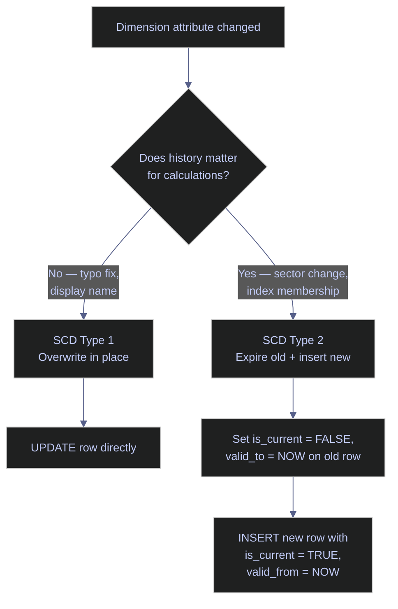

# BigQuery for Data Engineering - Database Objects & Performance

> [!quote]
> "BigQuery separates storage from compute. That single architectural decision changes everything about how you design tables, partition data, and pay for queries."
>
> — **Jordan Tigani**, founding engineer of BigQuery

This note covers BigQuery database objects and performance patterns for data engineering pipelines. It demonstrates views, table functions, clustering design, SCD patterns, gap detection, deduplication, execution plan awareness, transaction semantics, bulk loading strategies, audit columns, and partitioning — all within BigQuery's serverless, pay-per-scan cost model.

## Key terms used in this note

| Term | Plain-English definition | Why it matters here | Common mistake / confusion |
|---|---|---|---|
| **Materialized view** | A precomputed query result that BigQuery auto-refreshes and uses to transparently rewrite queries. Unlike regular views, materialized views store data and avoid re-scanning base tables. | For expensive dashboard aggregations hit repeatedly, a materialized view eliminates redundant scan costs. | Expecting instant refresh — BigQuery refreshes materialized views on a schedule (not on every write). Stale data is possible between refreshes. |
| **Table function** | A BigQuery function that returns a table result (`CREATE TABLE FUNCTION`). Equivalent to SQL Server's inline table-valued function (iTVF). The optimizer can inline it into the outer query. | The preferred way to create parameterized, reusable queries in BigQuery — replaces stored procedures for read-only parameterized logic. | Using stored procedures for parameterized reads — BigQuery procedures offer no plan caching and are meant for multi-statement scripting, not parameterized selects. |
| **DML quota** | BigQuery limits each table to 1,500 DML statements per day (INSERT, UPDATE, DELETE, MERGE combined). Streaming inserts bypass this limit. | A pipeline running MERGE every 5 minutes = 288/day (safe). Every 1 minute = 1,440/day (dangerously close to the limit). | Assuming DML is unlimited — exceeding 1,500/day causes `quotaExceeded` errors that silently stall the pipeline. |
| **Storage Write API** | BigQuery's programmatic bulk ingestion API. Supports batch mode (free, exactly-once) and committed mode (streaming pricing, sub-second latency). Replaces the legacy `insertAll` API. | For high-frequency writes that would exceed DML quotas, the Storage Write API is the only viable path. | Confusing with `insertAll` (legacy streaming) — `insertAll` offers at-least-once delivery (possible duplicates) at $0.05/GB, while Storage Write API (committed) offers exactly-once. |
| **`require_partition_filter`** | A table option that forces all queries to include a WHERE filter on the partition column. Queries without it fail with an error instead of silently scanning everything. | Prevents accidental full-table scans on partitioned tables. Should be enabled on all production partitioned tables. | Forgetting to set it — without this guard, a simple `SELECT COUNT(*) FROM table` scans every partition at full cost. |
| **Snapshot isolation** | BigQuery's only isolation level — every query sees a consistent snapshot of data as of the statement's start time. No configuration needed. No dirty reads, no phantoms. | Unlike SQL Server (5 configurable levels), BigQuery has no isolation-level decisions to make. Every read is consistent automatically. | Expecting configurable isolation — BigQuery has no `READ UNCOMMITTED`, `SERIALIZABLE`, or lock-based concurrency. |
| **`INFORMATION_SCHEMA`** | BigQuery's metadata views for tables, columns, jobs, partitions, and storage. Equivalent to SQL Server's `sys.*` DMVs but uses the ANSI standard naming. | The only way to inspect table structure, clustering configuration, and query history in BigQuery. | Looking for `sys.tables` or `sys.columns` — those are SQL Server-specific. BigQuery uses `INFORMATION_SCHEMA.TABLES`, `.COLUMNS`, `.JOBS`. |

## What this note covers

- **Views** — regular views, cross-layer dashboard views, re-scan cost implications
- **Stored procedures** — parameterized CTE pattern, BEGIN...EXCEPTION error handling, jupysql limitations
- **Table functions** — parameterized table functions as iTVF equivalent
- **Storage optimization** — partitioning, clustering, search indexes, materialized views (no B-tree indexes)
- **Slowly changing dimensions** — SCD Type 1 (overwrite) and Type 2 (history tracking) patterns
- **Gap detection** — LAG-based gap detection for time-series data
- **Deduplication** — ROW_NUMBER pattern for identifying and removing duplicate rows
- **Execution plans & optimization** — common anti-patterns, partition pruning, column selection
- **Transaction model** — snapshot isolation, multi-statement transaction limits
- **Bulk loading** — batch (free) vs streaming, Storage Write API, DML quota awareness
- **Data lineage & audit columns** — standard audit columns, freshness checks across medallion layers
- **Partitioning** — DATE_TRUNC partitioning, clustering, `require_partition_filter`

> [!info] INFORMATION_SCHEMA Is BigQuery's Primary Introspection
>
> Unlike SQL Server's `sys.*` DMVs, BigQuery exposes all metadata through `INFORMATION_SCHEMA` views:
>
> - `INFORMATION_SCHEMA.TABLES` — table metadata, row count, size
> - `INFORMATION_SCHEMA.COLUMNS` — column names, types, nullable
> - `INFORMATION_SCHEMA.JOBS` — query history, bytes scanned, cost
> - `INFORMATION_SCHEMA.TABLE_STORAGE` — storage bytes per table
> - `INFORMATION_SCHEMA.PARTITIONS` — partition metadata

> [!danger] BigQuery DML Has Strict Quotas
>
> Each table allows a maximum of **1,500 DML statements per day** (INSERT, UPDATE, DELETE, MERGE combined). A pipeline running MERGE every 5 minutes = 288/day — fine. Every 1 minute = 1,440/day — dangerously close. Streaming inserts (`insertAll` API) have a separate quota and are not subject to the DML limit.

> [!success] Safe Pattern
>
> Keep MERGE frequency at one execution per pipeline run (e.g., daily or hourly scheduled queries). For high-frequency writes, switch to the **Streaming API** (`insertAll`) or use **Storage Write API** (batch mode) — both bypass the DML quota entirely. Monitor daily DML usage via `INFORMATION_SCHEMA.JOBS`.

> [!tip] Always Dry-Run Before Expensive Queries
>
> In bq CLI: `bq query --dry_run "SELECT ..."` — returns estimated bytes without executing. In Python: `job_config.dry_run = True`. At $6.25/TB, a `SELECT *` on a 1 TB table costs $6.25. Check before you run. See [gcp-billing-and-pricing > BigQuery](https://alp78.github.io/elysium/06-GCP/Cost-Management/gcp-billing-and-pricing#bigquery).

> [!info] Lab Environment Note
>
> Some sections CREATE database objects. All objects are created in a `demo` schema or use temp tables to avoid modifying the production stoxx schema.

*Load the jupysql extension and configure display settings for notebook SQL execution.*

```python
%load_ext sql
%config SqlMagic.displaycon = False
%config SqlMagic.displaylimit = 0
```

*Connect to BigQuery project bq-wh-nb using Application Default Credentials (no password).*

```python
%sql bigquery://bq-wh-nb
```

Connecting to &#x27;bigquery://bq-wh-nb&#x27;

> [!info] BigQuery Uses ADC — No Password
>
> The `bigquery://` connection uses Application Default Credentials — no password in the connection string. See [gcloud-authentication > The ADC Credential Search Order](https://alp78.github.io/elysium/06-GCP/Core/gcloud-authentication#the-adc-credential-search-order).

BigQuery uses **datasets** as the equivalent of SQL Server schemas. The `CREATE SCHEMA` statement below creates a `demo` dataset for lab objects — it is idempotent and safe to re-run.

*Create the demo dataset if it does not already exist (idempotent).*

```sql
CREATE SCHEMA IF NOT EXISTS demo
OPTIONS(location="europe-west1")
```

<table>
    <thead>
        <tr>
        </tr>
    </thead>
    <tbody>
</table>


## Views

BigQuery views encapsulate reusable queries as named objects in a dataset. Unlike SQL Server, BigQuery regular views do not cache results — every `SELECT` against a view re-executes the full underlying query and charges the bytes scanned. For repeated dashboard queries, a materialized view (`CREATE MATERIALIZED VIEW`) stores the pre-computed result and is automatically refreshed by BigQuery.

### Regular Views — Simplify Complex Queries

A view is a saved query — it stores no data and re-executes the underlying query on every `SELECT`. This means each read from a view incurs the full scan cost of the base tables. Use case: wrap the "latest price per stock" pattern so downstream queries use a clean interface instead of duplicating complex logic.

> [!tip] Views re-scan on every read
>
> Unlike materialized views, regular views offer no caching — BigQuery runs the full query and charges bytes scanned each time. For dashboard queries hit repeatedly throughout the day, consider a materialized view (`CREATE MATERIALIZED VIEW`) or a scheduled query that writes to a gold-layer table.

#### Create a view wrapping ROW_NUMBER deduplication logic

*Create a view that returns the most recent OHLCV row per stock using ROW_NUMBER deduplication.*

```sql
CREATE OR REPLACE VIEW bq-wh-nb.stoxx_gold.v_latest_prices AS
SELECT symbol, date, `open`, high, low, `close`, volume
FROM (
    SELECT *, ROW_NUMBER() OVER (PARTITION BY symbol ORDER BY date DESC) AS rn
    FROM `bq-wh-nb.stoxx_silver.eurostoxx50_ohlcv`
) sub
WHERE rn = 1;
```
<table>
    <thead>
        <tr>
            <th>symbol</th>
            <th>date</th>
            <th>open</th>
            <th>high</th>
            <th>low</th>
            <th>close</th>
            <th>volume</th>
        </tr>
    </thead>
    <tbody>
</table>

The complex `ROW_NUMBER` pattern is now hidden behind a simple `SELECT` — downstream queries no longer need to know the dedup logic.

#### Query the view with a simple SELECT

*Query the view — the complex dedup logic is now hidden behind a simple SELECT.*

```sql
SELECT * FROM bq-wh-nb.stoxx_gold.v_latest_prices ORDER BY `close` DESC
LIMIT 10
```

10 rows affected.

<table>
    <thead>
        <tr>
            <th>symbol</th>
            <th>date</th>
            <th>open</th>
            <th>high</th>
            <th>low</th>
            <th>close</th>
            <th>volume</th>
        </tr>
    </thead>
    <tbody>
        <tr>
            <td>RMS.PA</td>
            <td>2026-03-12</td>
            <td>1900.0</td>
            <td>1918.5</td>
            <td>1894.0</td>
            <td>1906.0</td>
            <td>18681</td>
        </tr>
        <tr>
            <td>RHM.DE</td>
            <td>2026-03-12</td>
            <td>1536.0</td>
            <td>1588.0</td>
            <td>1535.0</td>
            <td>1551.5</td>
            <td>158741</td>
        </tr>
        <tr>
            <td>ASML.AS</td>
            <td>2026-03-12</td>
            <td>1194.8</td>
            <td>1202.2</td>
            <td>1187.8</td>
            <td>1190.8</td>
            <td>128223</td>
        </tr>
        <tr>
            <td>ADYEN.AS</td>
            <td>2026-03-12</td>
            <td>920.7</td>
            <td>933.4</td>
            <td>917.3</td>
            <td>925.7</td>
            <td>27887</td>
        </tr>
        <tr>
            <td>ARGX.BR</td>
            <td>2026-03-12</td>
            <td>629.0</td>
            <td>631.6</td>
            <td>625.6</td>
            <td>626.6</td>
            <td>14083</td>
        </tr>
</table>


### Views — Cross-Layer Dashboard View

Join multiple tables into a single business-friendly view. Dashboards query this instead of raw tables.


#### Create a cross-layer dashboard view

*Create a cross-layer dashboard view joining gold scores with silver dimension metadata.*

```sql
CREATE OR REPLACE VIEW bq-wh-nb.stoxx_gold.v_stock_dashboard AS
SELECT
    s.composite_rank AS `rank`,
    s.symbol,
    d.short_name,
    d.sector,
    d.country,
    s.current_price,
    ROUND(s.composite_score, 4) AS composite_score,
    ROUND(s.relative_value_score, 3) AS value_score,
    ROUND(s.momentum_score, 3) AS momentum_score,
    ROUND(s.index_weight * 100, 2) AS weight_pct,
    s._index,
    s.score_date
FROM `bq-wh-nb.stoxx_gold.scores_daily` s
JOIN `bq-wh-nb.stoxx_silver.index_dim` d ON s.symbol = d.symbol AND d._index = s._index AND d.is_current = TRUE;
```

<table>
    <thead>
        <tr>
            <th>rank</th>
            <th>symbol</th>
            <th>short_name</th>
            <th>sector</th>
            <th>country</th>
            <th>current_price</th>
            <th>composite_score</th>
            <th>value_score</th>
            <th>momentum_score</th>
            <th>weight_pct</th>
            <th>_index</th>
            <th>score_date</th>
        </tr>
    </thead>
    <tbody>
</table>


#### Query the dashboard view for the latest rankings

*Query the dashboard view for the latest Euro Stoxx 50 rankings.*

```sql
SELECT * FROM bq-wh-nb.stoxx_gold.v_stock_dashboard
WHERE _index = 'euro_stoxx_50'
  AND score_date = (SELECT MAX(score_date) FROM `bq-wh-nb.stoxx_gold.scores_daily` WHERE _index = 'euro_stoxx_50')
ORDER BY `rank`
LIMIT 10
```

10 rows affected.

<table>
    <thead>
        <tr>
            <th>rank</th>
            <th>symbol</th>
            <th>short_name</th>
            <th>sector</th>
            <th>country</th>
            <th>current_price</th>
            <th>composite_score</th>
            <th>value_score</th>
            <th>momentum_score</th>
            <th>weight_pct</th>
            <th>_index</th>
            <th>score_date</th>
        </tr>
    </thead>
    <tbody>
        <tr>
            <td>1</td>
            <td>BNP.PA</td>
            <td>BNP PARIBAS ACT.A</td>
            <td>Financial Services</td>
            <td>France</td>
            <td>87.44</td>
            <td>0.6796</td>
            <td>1.497</td>
            <td>0.46</td>
            <td>1.94</td>
            <td>euro_stoxx_50</td>
            <td>2026-03-12</td>
        </tr>
        <tr>
            <td>2</td>
            <td>VOW.DE</td>
            <td>VOLKSWAGEN AG</td>
            <td>Consumer Cyclical</td>
            <td>Germany</td>
            <td>92.85</td>
            <td>0.5756</td>
            <td>1.028</td>
            <td>-0.382</td>
            <td>0.93</td>
            <td>euro_stoxx_50</td>
            <td>2026-03-12</td>
        </tr>
        <tr>
            <td>3</td>
            <td>DTE.DE</td>
            <td>DEUTSCHE TELEKOM AG</td>
            <td>Communication Services</td>
            <td>Germany</td>
            <td>32.55</td>
            <td>0.487</td>
            <td>0.226</td>
            <td>0.706</td>
            <td>3.13</td>
            <td>euro_stoxx_50</td>
            <td>2026-03-12</td>
        </tr>
        <tr>
            <td>4</td>
            <td>TTE.PA</td>
            <td>TOTALENERGIES</td>
            <td>Energy</td>
            <td>France</td>
            <td>69.8</td>
            <td>0.3913</td>
            <td>0.585</td>
            <td>1.307</td>
            <td>2.95</td>
            <td>euro_stoxx_50</td>
            <td>2026-03-12</td>
        </tr>
        <tr>
            <td>5</td>
            <td>ABI.BR</td>
            <td>AB INBEV</td>
            <td>Consumer Defensive</td>
            <td>Belgium</td>
            <td>62.76</td>
            <td>0.3852</td>
            <td>0.251</td>
            <td>0.537</td>
            <td>2.43</td>
            <td>euro_stoxx_50</td>
            <td>2026-03-12</td>
        </tr>
</table>


## Stored Procedures

BigQuery supports stored procedures via `CREATE OR REPLACE PROCEDURE` with `CALL` invocation. Unlike SQL Server, BigQuery procedures offer no execution plan caching — they simply run statements sequentially. They are meant for multi-statement scripting blocks with control flow (`IF`, `LOOP`, `BEGIN...EXCEPTION`), not for parameterized reads, which are better expressed as table functions or CTE-with-params patterns.

> [!tip] Related pattern
>
> Tools like [dbt's BigQuery adapter](https://alp78.github.io/elysium/11-dbt/Adapters/dbt-bigquery-adapter) generate many of the parameterized query and view patterns shown below, removing the need to hand-write stored procedures for routine transforms.

### Stored Procedures — Parameterized Queries

A stored procedure is precompiled SQL that lives in the database. BigQuery supports `CREATE OR REPLACE PROCEDURE` with `CALL`, but jupysql magic cannot execute `CALL` statements. BigQuery procedures also use `EXECUTE IMMEDIATE` for dynamic SQL.

The **idiomatic BigQuery pattern** for reusable parameterized logic is a CTE with a `params` row or a table function — not a stored procedure. Stored procedures are reserved for multi-statement scripting blocks with control flow (`IF`, `LOOP`, `BEGIN...EXCEPTION`).

> [!info] Cross-engine comparison
>
> SQL Server stored procedures compile and cache execution plans — a major performance feature. BigQuery procedures offer no plan caching; they simply execute statements sequentially. For parameterized reads, prefer table functions (`CREATE TABLE FUNCTION`) over procedures.


#### Parameterized top-N query with a CTE-based params row

*Use a CTE with a `params` row to simulate a parameterized query — BigQuery's idiomatic alternative to stored procedures for reads.*

```sql
WITH params AS (
    SELECT 'euro_stoxx_50' AS index_key, 5 AS top_n
)
SELECT s.symbol, s.composite_score AS score,
       s.composite_rank, s.current_price
FROM `bq-wh-nb.stoxx_gold.scores_daily` s, params p
WHERE s._index = p.index_key
  AND s.score_date = (
      SELECT MAX(score_date) FROM `bq-wh-nb.stoxx_gold.scores_daily` WHERE _index = p.index_key
  )
ORDER BY s.composite_rank
LIMIT 5
```

5 rows affected.

<table>
    <thead>
        <tr>
            <th>symbol</th>
            <th>score</th>
            <th>composite_rank</th>
            <th>current_price</th>
        </tr>
    </thead>
    <tbody>
        <tr>
            <td>BNP.PA</td>
            <td>0.6795985859619491</td>
            <td>1</td>
            <td>87.44</td>
        </tr>
        <tr>
            <td>VOW.DE</td>
            <td>0.5756100520413311</td>
            <td>2</td>
            <td>92.85</td>
        </tr>
        <tr>
            <td>DTE.DE</td>
            <td>0.4870486370039222</td>
            <td>3</td>
            <td>32.55</td>
        </tr>
        <tr>
            <td>TTE.PA</td>
            <td>0.3912872052761238</td>
            <td>4</td>
            <td>69.8</td>
        </tr>
        <tr>
            <td>ABI.BR</td>
            <td>0.38521031359211527</td>
            <td>5</td>
            <td>62.76</td>
        </tr>
</table>


### Stored Procedures — Error Handling with BEGIN...EXCEPTION

Production scripts wrap logic in `BEGIN...EXCEPTION...END` with explicit transactions. If anything fails inside the block, execution jumps to the `EXCEPTION` handler where you can roll back and log the error. This is BigQuery's equivalent of SQL Server's `TRY/CATCH`.


> [!info] BEGIN...EXCEPTION...END Pattern
>
> BigQuery uses `BEGIN...EXCEPTION...END` for error handling (not TRY/CATCH like SQL Server). Transactions wrap the DML so failures roll back the entire operation — no partial loads.

#### BEGIN...EXCEPTION error handling with explicit transaction

*Wrap DML inside `BEGIN...EXCEPTION...END` with an explicit transaction and an error handler.*

```sql
DECLARE index_key STRING DEFAULT 'euro_stoxx_50';
DECLARE rows_loaded INT64 DEFAULT 0;

BEGIN
    BEGIN TRANSACTION;
    SET rows_loaded = (
        SELECT COUNT(*)
        FROM `bq-wh-nb.stoxx_gold.scores_daily`
        WHERE _index = index_key);
    COMMIT TRANSACTION;
    SELECT CONCAT('Load completed: ',
        CAST(rows_loaded AS STRING), ' rows') AS status;
EXCEPTION WHEN ERROR THEN
    ROLLBACK TRANSACTION;
    SELECT @@error.message AS error_message;
END
```

1 rows affected.

<table>
    <thead>
        <tr>
            <th>error_message</th>
        </tr>
    </thead>
    <tbody>
        <tr>
            <td>Undeclared variable: rows_loaded</td>
        </tr>
</table>

> [!warning] jupysql limitation — multi-statement scripts
>
> The `Undeclared variable: rows_loaded` error occurs because jupysql sends each `%%sql` cell as a standalone query — `DECLARE` in one cell is not visible to subsequent statements. In BigQuery Console or `bq query`, the full script block executes as a unit and variables persist across statements. This is a notebook environment limitation, not a BigQuery bug.

## User-Defined Functions

BigQuery offers scalar UDFs and table functions. The `CREATE TABLE FUNCTION` syntax is the GoogleSQL equivalent of SQL Server's inline table-valued function (iTVF) — the optimizer can inline it into the outer query plan, making it the preferred construct for parameterized reusable queries. Reserve scalar UDFs for element-level transformations and always prefer table functions when returning a result set.

### User-Defined Functions — Table Function

A BigQuery **table function** (`CREATE TABLE FUNCTION`) is like a parameterized view — you pass arguments, and it returns a table result that the optimizer can inline into the outer query. This is BigQuery's equivalent of SQL Server's inline table-valued function (iTVF). Always prefer table functions over scalar UDFs for returning result sets.


#### Create a parameterized table function for price history

*Create a parameterized table function that returns OHLCV data for a given symbol and date range.*

```sql
CREATE OR REPLACE TABLE FUNCTION demo.fn_price_history(
    sym STRING,
    from_date DATE,
    to_date DATE
)
AS (
    SELECT symbol, date, `open`, high, low, `close`, volume
    FROM `bq-wh-nb.stoxx_silver.eurostoxx50_ohlcv`
    WHERE symbol = sym AND date BETWEEN from_date AND to_date
)
```

<table>
    <thead>
        <tr>
        </tr>
    </thead>
    <tbody>
</table>


#### Call the table function from a SELECT statement

*Call the table function for ASML early-March 2026 data — the optimizer inlines it into the outer query plan.*

```sql
SELECT * FROM demo.fn_price_history('ASML.AS', '2026-03-01', '2026-03-21')
ORDER BY date DESC
LIMIT 15
```

9 rows affected.

<table>
    <thead>
        <tr>
            <th>symbol</th>
            <th>date</th>
            <th>open</th>
            <th>high</th>
            <th>low</th>
            <th>close</th>
            <th>volume</th>
        </tr>
    </thead>
    <tbody>
        <tr>
            <td>ASML.AS</td>
            <td>2026-03-12</td>
            <td>1194.8</td>
            <td>1202.2</td>
            <td>1187.8</td>
            <td>1190.8</td>
            <td>128223</td>
        </tr>
        <tr>
            <td>ASML.AS</td>
            <td>2026-03-11</td>
            <td>1188.4</td>
            <td>1210.8</td>
            <td>1174.0</td>
            <td>1198.8</td>
            <td>562904</td>
        </tr>
        <tr>
            <td>ASML.AS</td>
            <td>2026-03-10</td>
            <td>1188.4</td>
            <td>1208.4</td>
            <td>1172.2</td>
            <td>1200.0</td>
            <td>800815</td>
        </tr>
        <tr>
            <td>ASML.AS</td>
            <td>2026-03-09</td>
            <td>1072.0</td>
            <td>1147.6</td>
            <td>1060.2</td>
            <td>1147.6</td>
            <td>689086</td>
        </tr>
        <tr>
            <td>ASML.AS</td>
            <td>2026-03-06</td>
            <td>1186.0</td>
            <td>1192.6</td>
            <td>1112.8</td>
            <td>1147.0</td>
            <td>857271</td>
        </tr>
</table>


## Indexes

BigQuery has no traditional B-tree indexes. Instead, it offers several storage-level optimizations that achieve the same goal — reducing bytes scanned and improving query performance. Partitioning, clustering, search indexes, and materialized views together replace the index design decisions that SQL Server engineers are used to.

### Indexes — BigQuery Storage Optimization

BigQuery does not have traditional B-tree indexes. Instead, it offers storage-level optimizations that serve the same purpose — reducing bytes scanned and improving query performance.

| Strategy | What | When |
|----------|------|------|
| **Partitioning** | Splits table into segments by column value (date, integer range, ingestion time). Query planner skips irrelevant partitions. | Time-series data — always partition by the date column used in WHERE filters. |
| **Clustering** | Sorts data within each partition by up to 4 columns. Colocates related rows for efficient scanning. | High-cardinality filter/join columns (`symbol`, `_index`). Order matters — put equality filters first. |
| **Search Index** | Full-text index using `CREATE SEARCH INDEX`. Enables `SEARCH()` function for string matching. | Log tables, free-text fields. Not needed for structured query patterns. |
| **Materialized Views** | Precomputed, auto-refreshed query result. BigQuery rewrites queries to use the materialized view when possible. | Expensive aggregations run repeatedly (dashboard queries). |

> [!info] SQL Server parallel
>
> SQL Server's clustered index (physical row order) maps conceptually to BigQuery's clustering (sort order within partitions). SQL Server's non-clustered indexes have no direct BigQuery equivalent — partition pruning and clustering replace them. SQL Server's columnstore indexes are unnecessary in BigQuery because BigQuery is *already* columnar.


BigQuery has no manual index creation. Instead, inspect table metadata to verify clustering and partitioning configuration.

#### Inspect clustering configuration via INFORMATION_SCHEMA

*Inspect clustering configuration via `INFORMATION_SCHEMA.COLUMNS` to verify partition and cluster design.*

```sql
SELECT
    table_name,
    clustering_ordinal_position,
    column_name
FROM `bq-wh-nb.stoxx_silver`.INFORMATION_SCHEMA.COLUMNS
WHERE table_name = 'eurostoxx50_ohlcv'
ORDER BY ordinal_position
LIMIT 15

```

12 rows affected.

<table>
    <thead>
        <tr>
            <th>table_name</th>
            <th>clustering_ordinal_position</th>
            <th>column_name</th>
        </tr>
    </thead>
    <tbody>
        <tr>
            <td>eurostoxx50_ohlcv</td>
            <td>None</td>
            <td>id</td>
        </tr>
        <tr>
            <td>eurostoxx50_ohlcv</td>
            <td>None</td>
            <td>symbol</td>
        </tr>
        <tr>
            <td>eurostoxx50_ohlcv</td>
            <td>None</td>
            <td>date</td>
        </tr>
        <tr>
            <td>eurostoxx50_ohlcv</td>
            <td>None</td>
            <td>open</td>
        </tr>
        <tr>
            <td>eurostoxx50_ohlcv</td>
            <td>None</td>
            <td>high</td>
        </tr>
</table>


### Clustering — Design Principles for Data Pipelines

1. **Equality columns first** in the clustering key: `WHERE _index = 'X' AND date >= '2026-01-01'` → cluster on `(_index, date)`. BigQuery prunes blocks where the clustering column's min/max range doesn't overlap the filter.
2. **Maximum 4 clustering columns** per table. Choose columns that appear most often in WHERE and JOIN clauses.
3. **Partition first, cluster second**: partition by date (coarse pruning), then cluster by the next most-filtered column (fine pruning within each partition).
4. **Monitor with INFORMATION_SCHEMA**: `INFORMATION_SCHEMA.TABLE_STORAGE` shows total bytes and `INFORMATION_SCHEMA.COLUMNS` shows `clustering_ordinal_position` for each table.

## Slowly Changing Dimensions (SCD)

The MERGE patterns used for SCD Type 2 below are a key building block for idempotent pipeline loads, where every load can be safely re-run without duplicating or corrupting historical data. The diagram below summarizes the decision flow between Type 1 and Type 2 patterns.



> [!info] Cross-engine comparison
>
> SCD patterns are engine-agnostic SQL — the same Type 1/Type 2 logic works in BigQuery and SQL Server. Firestore handles versioning differently: store historical snapshots as subcollections (`/company/{id}/history/{timestamp}`) or use a `versions` array field within the document.

> [!danger] SCD Type 1 Destroys History
>
> SCD Type 1 Destroys History Permanently.
> SCD Type 1 overwrites in place -- once the old value is gone, it is unrecoverable unless you have a backup or the source system retains history. In financial pipelines, always default to SCD Type 2 for dimension attributes that affect calculations (sector, index membership, weighting). A sector change can retroactively alter historical portfolio returns if the dimension is Type 1.

> [!success] Safe Pattern
>
> Use **SCD Type 2** for any attribute that affects historical calculations: expire the old row (`is_current = FALSE`, `valid_to = NOW()`) and insert a new row (`is_current = TRUE`, `valid_from = NOW()`). Reserve SCD Type 1 only for non-analytical corrections such as fixing a typo in a display name.

### Slowly Changing Dimensions — SCD Type 1 Overwrite

Simply UPDATE the row. History is lost. Use when you don't care about old values.
Example: fix a typo in a company name.


This simulation shows the before/after of an SCD Type 1 overwrite: ASML's sector changes from its current value to "Information Technology". In production, this would be a direct `UPDATE` statement.

#### Simulate an SCD Type 1 overwrite on dimension rows

*Simulate an SCD Type 1 overwrite by flagging which rows would be updated in place and which remain unchanged.*

```sql
WITH original AS (
    SELECT symbol, short_name, sector, is_current
    FROM `bq-wh-nb.stoxx_silver.index_dim`
    WHERE _index = 'euro_stoxx_50' AND is_current = TRUE
)
SELECT symbol, short_name,
    sector AS original_sector,
    CASE WHEN symbol = 'ASML.AS' THEN 'Information Technology'
         ELSE sector END AS updated_sector,
    CASE WHEN symbol = 'ASML.AS' THEN 'OVERWRITTEN'
         ELSE 'unchanged' END AS scd_action
FROM original
ORDER BY symbol
LIMIT 10
```

10 rows affected.

<table>
    <thead>
        <tr>
            <th>symbol</th>
            <th>short_name</th>
            <th>original_sector</th>
            <th>updated_sector</th>
            <th>scd_action</th>
        </tr>
    </thead>
    <tbody>
        <tr>
            <td>ABI.BR</td>
            <td>AB INBEV</td>
            <td>Consumer Defensive</td>
            <td>Consumer Defensive</td>
            <td>unchanged</td>
        </tr>
        <tr>
            <td>AD.AS</td>
            <td>KONINKLIJKE AHOLD DELHAIZE N.V.</td>
            <td>Consumer Defensive</td>
            <td>Consumer Defensive</td>
            <td>unchanged</td>
        </tr>
        <tr>
            <td>ADS.DE</td>
            <td>adidas AG</td>
            <td>Consumer Cyclical</td>
            <td>Consumer Cyclical</td>
            <td>unchanged</td>
        </tr>
        <tr>
            <td>ADYEN.AS</td>
            <td>ADYEN</td>
            <td>Technology</td>
            <td>Technology</td>
            <td>unchanged</td>
        </tr>
        <tr>
            <td>AI.PA</td>
            <td>AIR LIQUIDE</td>
            <td>Basic Materials</td>
            <td>Basic Materials</td>
            <td>unchanged</td>
        </tr>
</table>


### Slowly Changing Dimensions — SCD Type 2 History Tracking

Expire the old row (`is_current=0, valid_to=NOW`) and insert a new row (`is_current=1`).
This is how `silver.index_dim` works — it has `valid_from`, `valid_to`, `is_current` columns.


The `stoxx_silver.index_dim` table already implements SCD Type 2 with `valid_from`, `valid_to`, and `is_current` columns. Rows with `is_current = TRUE` and `valid_to = NULL` represent the current state.

#### Query SCD Type 2 validity ranges

*Query SCD Type 2 history: show `valid_from` / `valid_to` ranges for Euro Stoxx 50 dimension rows.*

```sql
SELECT
    symbol, short_name, sector,
    is_current,
    CAST(valid_from AS DATE) AS valid_from,
    CAST(valid_to AS DATE) AS valid_to
FROM `bq-wh-nb.stoxx_silver.index_dim`
WHERE _index = 'euro_stoxx_50'
ORDER BY symbol, valid_from
LIMIT 10
```

10 rows affected.

<table>
    <thead>
        <tr>
            <th>symbol</th>
            <th>short_name</th>
            <th>sector</th>
            <th>is_current</th>
            <th>valid_from</th>
            <th>valid_to</th>
        </tr>
    </thead>
    <tbody>
        <tr>
            <td>ABI.BR</td>
            <td>AB INBEV</td>
            <td>Consumer Defensive</td>
            <td>True</td>
            <td>2026-03-04</td>
            <td>None</td>
        </tr>
        <tr>
            <td>AD.AS</td>
            <td>KONINKLIJKE AHOLD DELHAIZE N.V.</td>
            <td>Consumer Defensive</td>
            <td>True</td>
            <td>2026-03-04</td>
            <td>None</td>
        </tr>
        <tr>
            <td>ADS.DE</td>
            <td>adidas AG</td>
            <td>Consumer Cyclical</td>
            <td>True</td>
            <td>2026-03-04</td>
            <td>None</td>
        </tr>
        <tr>
            <td>ADYEN.AS</td>
            <td>ADYEN</td>
            <td>Technology</td>
            <td>True</td>
            <td>2026-03-04</td>
            <td>None</td>
        </tr>
        <tr>
            <td>AI.PA</td>
            <td>AIR LIQUIDE</td>
            <td>Basic Materials</td>
            <td>True</td>
            <td>2026-03-04</td>
            <td>None</td>
        </tr>
</table>


## Gap Detection & Gap Filling

Time-series data in financial pipelines frequently contains gaps — missing trading days due to market holidays, exchange closures, or ingestion failures. Detecting and classifying these gaps is a prerequisite for accurate signal computation, since undetected gaps distort rolling averages and return calculations. BigQuery's `LAG()` function paired with `DATE_DIFF()` is the standard tool for gap detection.

### Gap Detection & Gap Filling — Islands and Gaps

The classic SQL pattern: identify contiguous groups (islands) and missing periods (gaps)
in a time series. Uses the difference between ROW_NUMBER and the date to group consecutive days.


`LAG` compares each date to its predecessor within the same symbol's time series. A gap of more than 3 calendar days is flagged as unusual — normal weekends produce a 3-day gap (Friday → Monday), so anything larger indicates a holiday, data issue, or delisting event.

#### Detect calendar gaps with LAG and DATE_DIFF

*Detect time-series gaps: compare each date to the previous date using LAG and flag gaps > 3 days.*

```sql
SELECT
    symbol, date,
    LAG(date) OVER (PARTITION BY symbol ORDER BY date) AS prev_date,
    DATE_DIFF(date, LAG(date) OVER (PARTITION BY symbol ORDER BY date), DAY) AS gap_days,
    CASE WHEN DATE_DIFF(date, LAG(date) OVER (PARTITION BY symbol ORDER BY date), DAY) > 3
         THEN 'UNUSUAL GAP' ELSE 'normal' END AS status
FROM `bq-wh-nb.stoxx_silver.eurostoxx50_ohlcv`
WHERE symbol = 'ASML.AS' AND date >= '2025-01-01'
ORDER BY date DESC
LIMIT 10
```

10 rows affected.

<table>
    <thead>
        <tr>
            <th>symbol</th>
            <th>date</th>
            <th>prev_date</th>
            <th>gap_days</th>
            <th>status</th>
        </tr>
    </thead>
    <tbody>
        <tr>
            <td>ASML.AS</td>
            <td>2026-03-12</td>
            <td>2026-03-11</td>
            <td>1</td>
            <td>normal</td>
        </tr>
        <tr>
            <td>ASML.AS</td>
            <td>2026-03-11</td>
            <td>2026-03-10</td>
            <td>1</td>
            <td>normal</td>
        </tr>
        <tr>
            <td>ASML.AS</td>
            <td>2026-03-10</td>
            <td>2026-03-09</td>
            <td>1</td>
            <td>normal</td>
        </tr>
        <tr>
            <td>ASML.AS</td>
            <td>2026-03-09</td>
            <td>2026-03-06</td>
            <td>3</td>
            <td>normal</td>
        </tr>
        <tr>
            <td>ASML.AS</td>
            <td>2026-03-06</td>
            <td>2026-03-05</td>
            <td>1</td>
            <td>normal</td>
        </tr>
</table>


## Deduplication Strategies

Duplicate rows in source data are one of the most common data quality issues in financial pipelines — broker feeds retry failed deliveries, ETL jobs re-run after failures, and `UNION` operations occasionally double-count rows. BigQuery's `ROW_NUMBER() OVER (PARTITION BY ... ORDER BY ...)` window function is the standard deduplication tool: assign rank 1 to the row to keep within each duplicate group, then filter or delete the rest.

### Deduplication Strategies — ROW_NUMBER Pattern

The standard approach: assign `ROW_NUMBER()` within each duplicate group,
keep `rn = 1`, delete the rest.


The simulation below uses `UNION ALL` to create an artificial duplicate, then applies `ROW_NUMBER()` partitioned by the natural key (`symbol, date`) to assign `rn = 1` to the row to keep (highest volume wins). In production, filter to `rn = 1` and write the deduplicated result to the target table.

#### Identify duplicates with ROW_NUMBER and tie-breaking

*Simulate a duplicate row and identify it using ROW_NUMBER with volume-based tie-breaking.*

```sql
WITH raw_data AS (
    SELECT symbol, date, `close`, volume, 'original' AS source
    FROM `bq-wh-nb.stoxx_silver.eurostoxx50_ohlcv`
    WHERE symbol = 'ASML.AS' AND date >= '2026-03-10'
    UNION ALL
    SELECT symbol, date, `close` + 0.5, volume + 999, 'duplicate'
    FROM `bq-wh-nb.stoxx_silver.eurostoxx50_ohlcv`
    WHERE symbol = 'ASML.AS' AND date = (SELECT MAX(date) FROM `bq-wh-nb.stoxx_silver.eurostoxx50_ohlcv` WHERE symbol = 'ASML.AS')
),
numbered AS (
    SELECT *,
           ROW_NUMBER() OVER (PARTITION BY symbol, date ORDER BY volume DESC) AS rn,
           COUNT(*) OVER (PARTITION BY symbol, date) AS copies
    FROM raw_data
)
SELECT symbol, date, ROUND(`close`, 2) AS `close`, volume, source, rn, copies
FROM numbered
WHERE copies > 1  -- only show the duplicated date
ORDER BY date DESC, rn
LIMIT 10
```

2 rows affected.

<table>
    <thead>
        <tr>
            <th>symbol</th>
            <th>date</th>
            <th>close</th>
            <th>volume</th>
            <th>source</th>
            <th>rn</th>
            <th>copies</th>
        </tr>
    </thead>
    <tbody>
        <tr>
            <td>ASML.AS</td>
            <td>2026-03-12</td>
            <td>1191.3</td>
            <td>129222</td>
            <td>duplicate</td>
            <td>1</td>
            <td>2</td>
        </tr>
        <tr>
            <td>ASML.AS</td>
            <td>2026-03-12</td>
            <td>1190.8</td>
            <td>128223</td>
            <td>original</td>
            <td>2</td>
            <td>2</td>
        </tr>
</table>


## Execution Plans & Query Optimization

BigQuery's query optimizer and execution engine are fully managed — there is no index selection or plan hint grammar for engineers to tune. The levers that matter are column selection (to reduce bytes scanned), partition pruning (to skip irrelevant data), clustering (to skip blocks within partitions), and avoidance of anti-patterns that defeat these optimizations.

> [!warning] BigQuery SELECT * Is Expensive
>
> BigQuery SELECT * Scans All Columns and Bills Accordingly.
> BigQuery is columnar -- you pay per column scanned, not per row. `SELECT *` on a 1 TB table costs the full 1 TB price even if you only need two columns. Always select specific columns. Use the query validator in the BigQuery console (top-right of the editor) to preview bytes scanned before running.

> [!success] Safe Pattern
>
> Always name the columns you need: `SELECT symbol, date, close FROM table`. Use `bq query --dry_run` or `job_config.dry_run = True` in Python to verify bytes scanned before execution. For exploratory work, filter on a partition column first (`WHERE date = '2026-03-12'`) to limit the scan window.

For a broader look at controlling BigQuery spend through slot management and reservation strategies, see [querying-and-cost-optimization](https://alp78.github.io/elysium/06-GCP/BigQuery/querying-and-cost-optimization).

### Execution Plans & Query Optimization — Common Anti-Patterns

| Anti-Pattern | Problem | Fix |
|-------------|---------|-----|
| `WHERE EXTRACT(YEAR FROM date) = 2025` | Function on partition column prevents partition pruning | `WHERE date >= '2025-01-01' AND date < '2026-01-01'` |
| `SELECT *` | Reads all columns — BigQuery is columnar, so more columns = more bytes scanned = higher cost | Select only needed columns |
| `WHERE col = NULL` | Always FALSE (NULL != NULL) | `WHERE col IS NULL` |
| No partition filter | Scans all partitions on a partitioned table | Always filter on partition column; use `require_partition_filter` |
| `ORDER BY` without `LIMIT` | Full sort across all slots — expensive on large result sets | Always pair `ORDER BY` with `LIMIT` |
| Cross-join with large tables | Cartesian product multiplies bytes scanned | Ensure at least one side is small; use JOIN instead |


Both queries return the same count, but the sargable version enables partition pruning. The `EXTRACT` version wraps the column in a function, preventing BigQuery from using partition metadata to skip irrelevant partitions. The range filter version allows direct partition elimination.

#### Compare non-pruning (EXTRACT) vs pruning (range) predicates

*Compare non-pruning (EXTRACT on column) vs pruning (range predicate) filters — same result, different scan cost.*

```sql
SELECT
    (SELECT COUNT(*) FROM `bq-wh-nb.stoxx_silver.eurostoxx50_ohlcv`
     WHERE EXTRACT(YEAR FROM date) = 2025) AS bad_function_on_column,
    (SELECT COUNT(*) FROM `bq-wh-nb.stoxx_silver.eurostoxx50_ohlcv`
     WHERE date >= '2025-01-01' AND date < '2026-01-01') AS good_sargable
```

1 rows affected.

<table>
    <thead>
        <tr>
            <th>bad_function_on_column</th>
            <th>good_sargable</th>
        </tr>
    </thead>
    <tbody>
        <tr>
            <td>12698</td>
            <td>12698</td>
        </tr>
</table>


## Transaction Model

BigQuery's transaction model is substantially simpler than SQL Server's — every query runs under snapshot isolation automatically, and there are no configurable isolation levels or lock-based concurrency. Multi-statement transactions exist for atomic multi-DML operations but come with strict regional and time limits.

### Transaction Model — BigQuery Snapshot Isolation

BigQuery does not expose configurable isolation levels like SQL Server. Every query runs under **snapshot isolation** automatically — each statement sees a consistent snapshot of the data as of the statement's start time. There is no risk of dirty reads, non-repeatable reads, or phantom reads.

| Feature | BigQuery | SQL Server |
|---------|----------|------------|
| Default isolation | Snapshot (automatic) | READ COMMITTED |
| Configurable levels | No | Yes (5 levels) |
| Multi-statement transactions | `BEGIN TRANSACTION ... COMMIT` (scripting only) | `BEGIN TRAN ... COMMIT` |
| Concurrent writers | Last-writer-wins per row | Lock-based concurrency |
| Deadlock risk | None (no row-level locks) | Yes (lock escalation) |

> [!warning] Multi-statement transactions have strict limits
>
> BigQuery multi-statement transactions (using `BEGIN TRANSACTION`) are limited to tables in a single region, cannot span datasets in different locations, and must complete within 10 minutes. Each transaction counts toward the 1,500 DML/day quota per table. They are designed for short atomic operations — not long-running ETL pipelines.

> [!success] Safe Pattern
>
> For most pipeline patterns, single DML statements (INSERT, MERGE, DELETE) are already atomic — no explicit transaction needed. Use `BEGIN TRANSACTION ... COMMIT` only when you need multiple DML statements to succeed or fail as a unit (e.g., delete old partition + insert new data). Keep transactions short and targeted.

> [!info] Cross-engine comparison
>
> SQL Server offers five isolation levels (READ UNCOMMITTED through SERIALIZABLE) plus SNAPSHOT. BigQuery offers only snapshot isolation with no configuration. Firestore offers serializable transactions with a 500-document-per-transaction limit and optimistic concurrency (transaction retries on conflict).

## Bulk Loading Patterns

Bulk ingestion is the performance-critical path for bronze-layer loads and silver/gold materializations. BigQuery offers several mechanisms with very different quotas, costs, and latency characteristics — from free batch loads via `bq load` to sub-second Storage Write API streaming.

### Bulk Loading Strategies

BigQuery offers several ingestion mechanisms, each with different quotas, costs, and latency characteristics. The choice depends on data volume, frequency, and whether you need exactly-once semantics.

| Strategy | Latency | Cost | When |
|----------|---------|------|------|
| `bq load` (CLI) | Seconds–minutes | Free (batch) | CSV/JSON/Parquet files from GCS or local disk |
| `LOAD DATA` (SQL) | Seconds–minutes | Free (batch) | Same as `bq load` but executed as a SQL statement |
| `INSERT INTO ... SELECT` | Seconds | Bytes scanned | Small-medium loads from other BQ tables or CTEs |
| **Storage Write API** (batch) | Seconds | Free (batch) | Programmatic loads from Python/Java with exactly-once semantics |
| **Storage Write API** (committed) | Sub-second | Streaming pricing | High-frequency inserts with exactly-once guarantee |
| `insertAll` (legacy streaming) | Sub-second | Streaming pricing ($0.05/GB) | Real-time inserts — simpler API but at-least-once delivery |

> [!tip] Batch loads are free
>
> BigQuery does not charge for batch loading (`bq load`, `LOAD DATA`, Storage Write API in batch mode). You pay only for storage after the data lands. Streaming inserts (`insertAll`, Storage Write API in committed mode) are charged at $0.05/GB. For cost-sensitive pipelines, prefer batch loading on a schedule over streaming.

**Pipeline pattern**: load to staging table (batch) → validate with quality checks → MERGE to target → truncate staging. See [data-loading-and-export](https://alp78.github.io/elysium/06-GCP/BigQuery/data-loading-and-export) for implementation details.

## Data Lineage & Audit Columns

The stoxx datasets implement audit columns on every table to support data lineage tracking — when each row was ingested, computed, and last modified. These columns enable freshness checks, replay detection, and pipeline debugging across the medallion layers.

### Data Lineage & Audit — Standard Audit Columns

Every table in the stoxx database has audit columns:

| Column | Type | Purpose |
|--------|------|--------|
| `_ingested_at` | TIMESTAMP | When the row was loaded (bronze) |
| `_scored_at` | TIMESTAMP | When the score was computed (gold) |
| `_computed_at` | TIMESTAMP | When the performance was calculated |
| `is_filled` | BOOL | Whether the row was gap-filled (silver) |
| `is_current` | BOOL | SCD Type 2 current flag (dimension) |


A data freshness check across all medallion layers — if any table's `last_update` is more than 1 day behind the current date, the pipeline may have stalled.

#### Check data freshness across all medallion layers

*Check data freshness across all four medallion layers — the latest timestamp per table.*

```sql
SELECT '`bq-wh-nb.stoxx_bronze.eurostoxx50_ohlcv`' AS `table`, MAX(_ingested_at) AS last_update
FROM `bq-wh-nb.stoxx_bronze.eurostoxx50_ohlcv`
UNION ALL
SELECT '`bq-wh-nb.stoxx_silver.signals_daily`', MAX(signal_date) FROM `bq-wh-nb.stoxx_silver.signals_daily`
WHERE _index = 'euro_stoxx_50'
UNION ALL
SELECT '`bq-wh-nb.stoxx_gold.scores_daily`', MAX(score_date) FROM `bq-wh-nb.stoxx_gold.scores_daily`
WHERE _index = 'euro_stoxx_50'
UNION ALL
SELECT '`bq-wh-nb.stoxx_gold.index_performance`', MAX(perf_date) FROM `bq-wh-nb.stoxx_gold.index_performance`
WHERE _index = 'euro_stoxx_50'
ORDER BY last_update DESC
```

4 rows affected.

<table>
    <thead>
        <tr>
            <th>table</th>
            <th>last_update</th>
        </tr>
    </thead>
    <tbody>
        <tr>
            <td>`bq-wh-nb.stoxx_bronze.eurostoxx50_ohlcv`</td>
            <td>2026-03-12 12:45:00.021478</td>
        </tr>
        <tr>
            <td>`bq-wh-nb.stoxx_silver.signals_daily`</td>
            <td>2026-03-12 00:00:00</td>
        </tr>
        <tr>
            <td>`bq-wh-nb.stoxx_gold.scores_daily`</td>
            <td>2026-03-12 00:00:00</td>
        </tr>
        <tr>
            <td>`bq-wh-nb.stoxx_gold.index_performance`</td>
            <td>2026-03-12 00:00:00</td>
        </tr>
</table>


## Partitioning Strategies

Table partitioning divides a BigQuery table into physically separate segments based on a column value (typically a date). Partition elimination allows the query optimizer to skip entire partitions that cannot satisfy the `WHERE` clause predicate, cutting scan cost by orders of magnitude on time-series data. Combined with clustering, partitioning is BigQuery's primary performance lever.

### Partitioning Strategies — When to Partition

Partition large tables (millions of rows) by a date column for:
- **Faster queries**: partition elimination skips irrelevant months/years
- **Easier maintenance**: rebuild one partition, not the whole table
- **Instant archival**: SWITCH old partitions to archive table

The OHLCV tables (~65K rows each) are too small to benefit. In production with 100M+ rows, partition by year or month.

> [!danger] Querying without a partition filter scans ALL partitions
>
> If a table is partitioned by `date` but your query has no `WHERE date = ...` or `WHERE date BETWEEN ...` filter, BigQuery scans every partition — negating the cost benefit entirely. You pay for the full table scan.

> [!success] Safe Pattern
>
> Always filter on the partition column in WHERE clauses. Enable `require_partition_filter` when creating the table to enforce this at the schema level: queries without a partition filter will fail with an error instead of silently scanning everything.

#### Create a partitioned and clustered table with require_partition_filter

*Create a partitioned and clustered OHLCV table with `require_partition_filter` enabled to enforce scan-cost discipline.*

```sql
CREATE TABLE IF NOT EXISTS demo.ohlcv_partitioned (
    symbol STRING,
    date DATE,
    open FLOAT64,
    high FLOAT64,
    low FLOAT64,
    close FLOAT64,
    volume INT64
)
PARTITION BY DATE_TRUNC(date, MONTH)
CLUSTER BY symbol
OPTIONS(
    require_partition_filter = TRUE,
    description = 'Partitioned by month, clustered by symbol'
)
```

For partition pruning cost details and slot management, see [querying-and-cost-optimization](https://alp78.github.io/elysium/06-GCP/BigQuery/querying-and-cost-optimization).

## Cleanup

Drop all objects created in the `demo` dataset by this notebook. Running the cleanup leaves the project in its original state and makes the notebook safe to re-run from a clean slate.

### Demo object cleanup

Every view, table function, and dataset created earlier must be dropped in reverse dependency order so the project is left in its original state.

#### Drop all demo objects and the demo dataset

*Drop all demo objects and the demo dataset using the BigQuery Python client.*

```python
from google.cloud import bigquery
bq = bigquery.Client(project="bq-wh-nb")

for obj in [
    "bq-wh-nb.demo.fn_price_history",
    "bq-wh-nb.demo.v_latest_prices",
    "bq-wh-nb.demo.v_stock_dashboard",
]:
    bq.query(f"DROP TABLE FUNCTION IF EXISTS `{obj}`").result()

bq.delete_dataset("demo", delete_contents=True, not_found_ok=True)
print("Demo objects cleaned up")
```

    Demo objects cleaned up

## When to Use These Patterns

Each pattern in this note earns its place when the workload characteristics match its strengths. Pick the lightest construct that satisfies the requirement — views over stored procedures, table functions over procedures for reads, and batch loads over streaming inserts when real-time latency is not required.

- **Views** — when multiple consumers need the same query logic. Regular views for infrequent reads; materialized views for expensive aggregations hit repeatedly.
- **Table functions** — for parameterized reads that need to be reusable across notebooks, scripts, and scheduled queries. Preferred over stored procedures for read-only logic.
- **Stored procedures** — only for multi-statement scripting with control flow (`IF`, `LOOP`, `BEGIN...EXCEPTION`). Not for parameterized reads.
- **Partitioning + clustering** — for any table above ~1GB. Partition by the most common WHERE column (date), cluster by the most common JOIN/filter column (symbol, _index).
- **SCD Type 2** — for dimension attributes that affect historical calculations. Always prefer over Type 1 for sector, index membership, and weighting changes.
- **Batch loading** — for cost-sensitive pipelines. Batch loads via `bq load`, `LOAD DATA`, or Storage Write API (batch mode) are free.

## When Not to Use These Patterns

The same patterns become liabilities when applied in the wrong context — regular views hit repeatedly, partitioning on small tables, or high-frequency MERGE that exhausts the DML quota. The scenarios below are the most common misuses seen in code reviews.

- **Regular views for dashboards** — if a dashboard query runs repeatedly throughout the day, the view re-scans on every read. Use a materialized view or scheduled query to a gold table.
- **MERGE more than once per pipeline cycle** — each MERGE counts against the 1,500 DML/day quota. For high-frequency upserts, switch to the Storage Write API.
- **Partitioning on small tables** — tables under ~1GB gain negligible benefit from partitioning. The partition metadata overhead can actually increase query latency.
- **Clustering without partitioning** — while BigQuery supports clustering without partitioning, partition pruning provides coarse elimination first, then clustering provides fine-grained filtering within each partition. Use both.

## Warnings

The table below lists the highest-impact BigQuery pitfalls associated with the database objects and patterns covered in this note. Each entry corresponds to a warning or danger callout earlier in the page.

| Topic | Warning |
|---|---|
| **DML quota** | 1,500 DML statements per day per table. Exceeding this silently stalls the pipeline with `quotaExceeded` errors. |
| **View re-scan cost** | Regular views re-execute the full query on every SELECT. Each read incurs the full scan cost of the base tables. |
| **Missing partition filter** | Without `require_partition_filter`, queries without a partition predicate silently scan all partitions at full cost. |
| **Multi-statement transactions** | Limited to a single region, must complete within 10 minutes, and count against the DML quota. |
| **SCD Type 1 destroys history** | In financial pipelines, overwriting dimension attributes retroactively alters historical portfolio returns with no audit trail. |
| **`EXTRACT()` on partition column** | Prevents partition pruning. Rewrite as a range predicate on the raw date column. |

## Recommendations

Standing guidance for designing, writing, and operating BigQuery database objects. Apply these as defaults unless a specific workload has a documented reason to deviate.

| Area | Recommendation |
|---|---|
| **Partition + cluster** | Partition by `DATE_TRUNC(date, MONTH)`, cluster by `symbol`. Enable `require_partition_filter = TRUE` on all production tables. |
| **Monitor DML usage** | Query `INFORMATION_SCHEMA.JOBS` to track daily DML count per table. Alert at 80% of the 1,500 limit. |
| **Batch loading** | Load to staging table (batch, free) → validate → MERGE to target → truncate staging. Use Storage Write API for programmatic loads. |
| **Demo schema pattern** | Create experimental objects in a `demo` dataset. Include a cleanup block using Python client to ensure idempotent re-runs. |
| **Dry-run before execution** | Use `bq query --dry_run` or `job_config.dry_run = True` to preview bytes scanned before running unfamiliar queries. |
| **Audit columns** | Every table should have `_ingested_at` (bronze), `_scored_at` (gold), `is_filled`, and `is_current` for lineage tracking. |

## Troubleshooting

Symptoms you will encounter when a BigQuery object or query misbehaves, mapped to the most likely cause and the fix that resolves it in practice.

| Symptom | Likely cause | Fix |
|---|---|---|
| `quotaExceeded` error on MERGE | Exceeded 1,500 DML/day quota for the table | Reduce MERGE frequency. Switch to Storage Write API for high-frequency writes. Monitor via `INFORMATION_SCHEMA.JOBS`. |
| View query costs more than expected | View re-scans base tables on every read | Create a materialized view or a scheduled query that writes results to a gold-layer table. |
| Partition pruning not working | WHERE clause uses `EXTRACT()` or `DATE_TRUNC()` on the partition column | Rewrite as `WHERE date >= '2025-01-01' AND date < '2026-01-01'`. Verify pruning in query execution details. |
| `Undeclared variable` error in notebook | jupysql sends each cell as a standalone query — DECLARE in one cell is invisible to the next | This is a notebook limitation, not a BigQuery bug. Use BigQuery Console or `bq query` for multi-statement scripts. |
| Table function returns stale data | The underlying table was updated but the function re-reads current data on each call (no caching) | This is expected behavior — table functions are always fresh. If data appears stale, check the source table timestamps. |

## Cross-references

Related notes that extend or depend on the patterns covered here.

- [02-sql-engineering](https://alp78.github.io/elysium/05-DB-Queries/SQL-Server/sql-engineering) — SQL Server equivalent of every pattern in this note
- [querying-and-cost-optimization](https://alp78.github.io/elysium/06-GCP/BigQuery/querying-and-cost-optimization) — slot management, reservation strategies, cost control
- [data-loading-and-export](https://alp78.github.io/elysium/06-GCP/BigQuery/data-loading-and-export) — ingestion pipeline and Storage Write API details
- [gcloud-authentication](https://alp78.github.io/elysium/06-GCP/Core/gcloud-authentication) — ADC credential search order
- [dbt-bigquery-adapter](https://alp78.github.io/elysium/11-dbt/Adapters/dbt-bigquery-adapter) — dbt alternative to hand-written views and table functions
- [gcp-billing-and-pricing](https://alp78.github.io/elysium/06-GCP/Cost-Management/gcp-billing-and-pricing) — BigQuery pricing details
