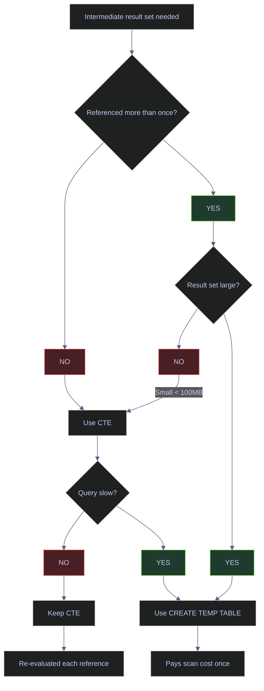

# BigQuery Advanced

> [!quote]
> "The mindset of SQL is 'what do I want?' not 'how do I get it?' — that is the leap from procedural to declarative thinking."
>
> — **Joe Celko**, *SQL for Smarties* (1995)

> [!abstract]- Summary
>
> BigQuery Advanced is the BigQuery-specific advanced query notebook for the Euro Stoxx pipeline: it keeps the same analytical problems as the SQL Server advanced note, but rewrites them around GoogleSQL-only tools such as `QUALIFY`, `GENERATE_DATE_ARRAY`, explicit `EXCEPT DISTINCT`, slot-parallel execution, and BigQuery's scan-cost constraints.
>
> **Advanced window semantics**
> - covers deduplication with `QUALIFY`, ranking functions, `PERCENT_RANK`, `CUME_DIST`, `FIRST_VALUE`, `LAST_VALUE`, running totals, and the `ROWS` versus `RANGE` frame rules that still control correctness
>
> **Date-series generation and lateral replacements**
> - covers recursive CTEs, `GENERATE_DATE_ARRAY` as the preferred date-spine tool, and `ROW_NUMBER()`-based patterns that replace SQL Server `APPLY` usage in BigQuery
>
> **Reshaping, merging, and exclusion**
> - covers `PIVOT` / `UNPIVOT`, `MERGE` upserts under DML quotas, `EXISTS` / `NOT EXISTS`, and multi-level aggregation with `GROUPING SETS`, `ROLLUP`, and `CUBE`
>
> **Data shaping utilities**
> - covers string aggregation and parsing, null-aware comparisons with `IS NOT DISTINCT FROM`, safe arithmetic with `SAFE_DIVIDE()`, set operations, trading-calendar patterns, and the temp-table versus CTE materialization choice
>
> **Operations and safety**
> - Warnings: ADC-based auth context, `LAST_VALUE` default frames, `RANGE` vs `ROWS`, recursive CTE limits, `EXCEPT DISTINCT` syntax, `UNION` deduplication cost, `CROSS JOIN` scan explosion, repeated CTE scan cost, and `WHERE col = NULL`
> - Recommendations table: 7 defaults covering `QUALIFY`-based deduplication, `GENERATE_DATE_ARRAY`, null-safe anti-joins, `GROUPING()` usage, `SAFE_DIVIDE()` and `IS NOT DISTINCT FROM`, portable pivoting, and temp-table materialization
> - Troubleshooting: 6 failure modes covering `EXCEPT DISTINCT` syntax errors, recursion-depth failures, incorrect `LAST_VALUE`, subtotal null confusion, window-result mismatches, and oversized `CROSS JOIN` scans

> [!note]- Glossary
>
> **`QUALIFY`**
> - A BigQuery clause that filters rows after window functions have been computed, without forcing a wrapping subquery.
> - It matters because the note uses `QUALIFY` to keep ranking and deduplication patterns shorter and clearer than their cross-engine equivalents.
>
> > [!warning] Excellent but non-portable
> >
> > `QUALIFY` reads well in BigQuery and Snowflake-style SQL, but it fails on SQL Server. Reusable multi-engine code often needs the older subquery pattern instead.
>
> ---
>
> **`GENERATE_DATE_ARRAY()`**
> - A BigQuery function that produces a contiguous array of dates between two bounds, typically expanded into rows with `UNNEST()`.
> - It matters because the note treats it as the preferred BigQuery-native way to build date spines and trading calendars.
>
> > [!info] Better than recursion for dates
> >
> > Recursive CTEs can build date series, but `GENERATE_DATE_ARRAY()` is simpler, avoids low recursion ceilings, and better matches BigQuery's set-oriented style.
>
> ---
>
> **`EXCEPT DISTINCT`**
> - BigQuery's explicit set-difference operator for returning rows from one result set that do not appear in another.
> - It matters because the note compares BigQuery set operations with SQL Server, where the same idea appears under slightly different syntax.
>
> > [!warning] `DISTINCT` is mandatory
> >
> > BigQuery does not accept bare `EXCEPT` the way SQL Server does. Forgetting the `DISTINCT` keyword produces a syntax error, not a lenient interpretation.
>
> ---
>
> **`IS NOT DISTINCT FROM`**
> - A null-aware equality operator that treats two nulls as equal instead of yielding unknown.
> - It matters because the note uses it for joins and filters where null equality is part of the business logic rather than an accident.
>
> > [!info] Cleaner than manual null logic
> >
> > The cross-engine fallback is usually `a = b OR (a IS NULL AND b IS NULL)`. BigQuery gives that logic a direct operator, which is easier to read and harder to miswrite.
>
> ---
>
> **Slot**
> - A unit of BigQuery execution capacity that combines compute and memory resources for distributed query work.
> - It matters because advanced windowing, joins, and grouping operations in the note are executed in parallel across slots rather than on a single database server.
>
> > [!warning] More slots do not remove all bottlenecks
> >
> > Global sorts, large shuffles, and combinatorial grouping patterns still create expensive steps even in a massively parallel engine. Distribution helps, but it does not make every plan cheap.
>
> ---
>
> **`LAST_VALUE()`**
> - A window value function that returns the last value visible inside the current frame, not necessarily the last row in the whole partition.
> - It matters because the note highlights the same frame trap seen in SQL Server, where `LAST_VALUE()` appears wrong only because the frame is too narrow.
>
> > [!warning] Forward frame required
> >
> > If the frame stops at the current row, `LAST_VALUE()` can only see the current row. To reach the partition tail, the frame has to extend forward explicitly.
>
> ---
>
> **Window frame / `ROWS` vs `RANGE`**
> - The frame clause determines which ordered rows a window function may consider, with `ROWS` operating on physical row positions and `RANGE` grouping peers by sort value.
> - It matters because running totals and moving averages in the note change semantics when duplicate sort keys are present.
>
> > [!warning] Implicit frames are risky
> >
> > Relying on the default frame can silently change results when there are ties in the order column. Explicit frame clauses make the intended analytical meaning visible.
>
> ---
>
> **`GROUPING SETS`**
> - An extension to `GROUP BY` that asks BigQuery to produce several explicit grouping levels in one pass.
> - It matters because the note uses it to avoid repeated scans when detailed rows, subtotals, and totals all need to be computed together.
>
> > [!warning] Subtotals look like data nulls
> >
> > Grouped subtotal rows often carry `NULL` in columns that were not part of that grouping level. `GROUPING()` is the tool that tells subtotal markers apart from genuine missing data.
>
> ---
>
> **`SAFE_DIVIDE()`**
> - A BigQuery arithmetic helper that returns `NULL` on zero denominators instead of failing the query.
> - It matters because advanced scoring and return logic in the note needs to stay resilient even when denominator quality is imperfect.
>
> > [!info] Arithmetic safety is a design choice
> >
> > Returning `NULL` instead of raising an error makes pipelines more robust, but it also means downstream logic must decide how null ratios should be interpreted or filled.
>
> ---
>
> **Temporary table**
> - A short-lived table created for the current BigQuery script or session so intermediate results can be materialized and reused.
> - It matters because the note compares temp tables with CTEs to decide when repeated references should pay scan cost once instead of many times.
>
> > [!warning] Reuse justifies materialization
> >
> > A temp table is extra work if the intermediate result is used once, but it becomes a cost saver when the same expensive subquery would otherwise be rescanned multiple times.
>
> ---
>
> **Trading calendar**
> - A date reference structure that marks valid market days so queries can reason about business dates instead of plain calendar dates.
> - It matters because the note's date-series and business-day arithmetic patterns depend on an explicit view of market-open days.
>
> > [!warning] Civil dates are not market dates
> >
> > Weekends and exchange holidays break naive `DATE_ADD()` assumptions. If the logic is about trading behavior, the calendar needs trading semantics, not just consecutive dates.

*Load the jupysql extension and configure display settings for notebook SQL execution.*

```python
%load_ext sql
%config SqlMagic.displaycon = False
%config SqlMagic.displaylimit = 0
```

*Connect to BigQuery project bq-wh-nb using Application Default Credentials.*

```python
%sql bigquery://bq-wh-nb
```

Connecting to &#x27;bigquery://bq-wh-nb&#x27;

> [!info] BigQuery Uses ADC — No Password
>
> The `bigquery://` connection uses Application Default Credentials — no password in the connection string. Locally: `gcloud auth application-default login`. On VMs/Cloud Run: the metadata server provides credentials automatically. See [gcloud-authentication > The ADC Credential Search Order](https://alp78.github.io/elysium/06-GCP/Core/gcloud-authentication#the-adc-credential-search-order).

## Advanced Window Functions

The window functions in this section appear throughout production pipelines. The [gold-transforms](https://alp78.github.io/elysium/04-SQL-Server/04-Applied-SQL-Server-for-Data-Pipelines/gold-transforms) layer in SQL Server relies on the same `ROW_NUMBER`, `LAG`, and running-total patterns adapted for T-SQL syntax. BigQuery distributes window function computation across slots — each slot handles a subset of partitions in parallel, making window functions efficient even on large tables.

> [!info] Cross-engine comparison
>
> Window functions are available in BigQuery (GoogleSQL) and SQL Server (T-SQL) with near-identical syntax. Firestore has no window functions — ranking and running totals must be computed client-side or in a separate analytics layer.

### Window Functions | ROW_NUMBER for Deduplication

Assign a unique sequential number within each partition. The classic pattern for picking one row per key (e.g., latest price per stock, or deduplicating loads).

> [!tip] QUALIFY — BigQuery-exclusive window filter
>
> BigQuery supports `QUALIFY` to filter on window function results without a subquery:
> `SELECT symbol, date, close FROM table QUALIFY ROW_NUMBER() OVER (PARTITION BY symbol ORDER BY date DESC) = 1`
> This eliminates the subquery-plus-filter pattern. `QUALIFY` is not ANSI SQL and does not exist in SQL Server.

#### Pick the latest price per stock with ROW_NUMBER

**When to run:** When you need the most recent row per stock — the standard deduplication pattern for point-in-time snapshots.
**Trigger:** Building a current-state view, dashboard refresh, or deduplicating a table after a load that may have introduced duplicates.
**Context:** GoogleSQL subquery with `ROW_NUMBER() OVER (PARTITION BY symbol ORDER BY date DESC)` against `stoxx_silver.eurostoxx50_ohlcv`. Read-only. Scans the table once, assigns ranks, then the outer query filters to `rn = 1`.
**Purpose:** Retrieve exactly one row per stock — the most recent trading day — using ROW_NUMBER deduplication.

| Field | Source / Computation | Type | Meaning |
|---|---|---|---|
| `symbol` | `eurostoxx50_ohlcv.symbol` | STRING | Ticker symbol |
| `date` | `eurostoxx50_ohlcv.date` | DATE | Most recent trading date for this symbol |
| `close` | `eurostoxx50_ohlcv.close` | FLOAT64 | Closing price on the most recent day |
| `volume` | `eurostoxx50_ohlcv.volume` | INT64 | Shares traded on the most recent day |

*Pick the latest price per stock using ROW_NUMBER partitioned by symbol, ordered by date descending.*

```sql
SELECT symbol, date, `close`, volume
FROM (
    SELECT symbol, date, `close`, volume,
           ROW_NUMBER() OVER (PARTITION BY symbol ORDER BY date DESC) AS rn
    FROM `bq-wh-nb.stoxx_silver.eurostoxx50_ohlcv`
) sub
WHERE rn = 1
ORDER BY `close` DESC
LIMIT 10
```

10 rows affected.

<table>
<thead>
<tr>
<th>symbol</th>
<th>date</th>
<th>close</th>
<th>volume</th>
</tr>
</thead>
<tbody>
<tr>
<td>RMS.PA</td>
<td>2026-03-12</td>
<td>1906.0</td>
<td>18681</td>
</tr>
<tr>
<td>RHM.DE</td>
<td>2026-03-12</td>
<td>1551.5</td>
<td>158741</td>
</tr>
<tr>
<td>ASML.AS</td>
<td>2026-03-12</td>
<td>1190.8</td>
<td>128223</td>
</tr>
<tr>
<td>ADYEN.AS</td>
<td>2026-03-12</td>
<td>925.7</td>
<td>27887</td>
</tr>
<tr>
<td>ARGX.BR</td>
<td>2026-03-12</td>
<td>626.6</td>
<td>14083</td>
</tr>
</table>

### Window Functions | PERCENT_RANK and CUME_DIST

- `PERCENT_RANK()`: relative rank as a percentage (0 to 1). Where does this stock sit vs peers?
- `CUME_DIST()`: cumulative distribution — fraction of rows with value ≤ current row.

Use case: "ASML is in the 90th percentile of composite scores."

#### Compute percentile rank and cumulative distribution

**When to run:** When building relative performance metrics — "where does this stock sit vs its peers?"
**Trigger:** Scoring pipeline output review, quantile-based signal construction, or performance attribution reporting.
**Context:** GoogleSQL window functions `PERCENT_RANK()` and `CUME_DIST()` against `stoxx_gold.scores_daily`. Read-only. Both functions compute relative position within the ordered set. `PERCENT_RANK` returns 0 to 1 (0 = best rank). `CUME_DIST` returns the fraction of rows with value ≤ current.
**Purpose:** Compute percentile ranking and cumulative distribution for each stock's composite score — enables statements like "ASML is in the 90th percentile."

| Field | Source / Computation | Type | Meaning |
|---|---|---|---|
| `symbol` | `scores_daily.symbol` | STRING | Ticker symbol |
| `score` | `ROUND(composite_score, 4)` | FLOAT64 | Composite score |
| `composite_rank` | `scores_daily.composite_rank` | INT64 | Absolute rank (1 = best) |
| `pct_rank` | `PERCENT_RANK() OVER (ORDER BY composite_score DESC)` | FLOAT64 | Relative rank as decimal (0.0 = best, 1.0 = worst). Formula: `(rank - 1) / (total - 1)` |
| `cume_dist` | `CUME_DIST() OVER (ORDER BY composite_score DESC)` | FLOAT64 | Cumulative distribution — fraction of stocks with score ≤ this stock. Formula: `count(rows ≤ current) / total` |

*Compute percentile rank and cumulative distribution for composite scores across the Euro Stoxx 50.*

```sql
SELECT
    symbol,
    ROUND(composite_score, 4) AS score,
    composite_rank,
    ROUND(PERCENT_RANK() OVER (ORDER BY composite_score DESC), 3) AS pct_rank,
    ROUND(CUME_DIST() OVER (ORDER BY composite_score DESC), 3) AS cume_dist
FROM `bq-wh-nb.stoxx_gold.scores_daily`
WHERE _index = 'euro_stoxx_50'
  AND score_date = (SELECT MAX(score_date) FROM `bq-wh-nb.stoxx_gold.scores_daily` WHERE _index = 'euro_stoxx_50')
ORDER BY composite_rank
LIMIT 15
```

15 rows affected.

<table>
<thead>
<tr>
<th>symbol</th>
<th>score</th>
<th>composite_rank</th>
<th>pct_rank</th>
<th>cume_dist</th>
</tr>
</thead>
<tbody>
<tr>
<td>BNP.PA</td>
<td>0.6796</td>
<td>1</td>
<td>0.0</td>
<td>0.02</td>
</tr>
<tr>
<td>VOW.DE</td>
<td>0.5756</td>
<td>2</td>
<td>0.02</td>
<td>0.04</td>
</tr>
<tr>
<td>DTE.DE</td>
<td>0.487</td>
<td>3</td>
<td>0.041</td>
<td>0.06</td>
</tr>
<tr>
<td>TTE.PA</td>
<td>0.3913</td>
<td>4</td>
<td>0.061</td>
<td>0.08</td>
</tr>
<tr>
<td>ABI.BR</td>
<td>0.3852</td>
<td>5</td>
<td>0.082</td>
<td>0.1</td>
</tr>
</table>

### Window Functions | FIRST_VALUE and LAST_VALUE

- `FIRST_VALUE(col)`: first value in the window frame
- `LAST_VALUE(col)`: last value — **requires explicit frame** or it only sees up to current row

Use case: compare every day's close to the first close of the year (YTD return). `FIRST_VALUE` grabs the January 2nd close; every subsequent row computes its return relative to that anchor.

#### Anchor YTD return to the first close with FIRST_VALUE

**When to run:** When computing a running YTD return series where every day's return is measured against the year's opening price.
**Trigger:** Building a YTD performance chart, or comparing how far each stock has moved since the start of the year on any given day.
**Context:** GoogleSQL window function `FIRST_VALUE(close) OVER (PARTITION BY symbol ORDER BY date ROWS BETWEEN UNBOUNDED PRECEDING AND CURRENT ROW)` against `stoxx_silver.eurostoxx50_ohlcv`. Read-only. The explicit `ROWS` frame ensures `FIRST_VALUE` always returns the partition's first row.
**Purpose:** Compute daily YTD return by anchoring to the first trading day's close of the current year — produces a running return series for performance charting.

| Field | Source / Computation | Type | Meaning |
|---|---|---|---|
| `symbol` | `eurostoxx50_ohlcv.symbol` | STRING | Ticker symbol |
| `date` | `eurostoxx50_ohlcv.date` | DATE | Trading date |
| `close` | `ROUND(close, 2)` | FLOAT64 | Closing price on this date |
| `first_close_ytd` | `FIRST_VALUE(close) OVER (... ROWS BETWEEN UNBOUNDED PRECEDING AND CURRENT ROW)` | FLOAT64 | Closing price on the first trading day of the year — the anchor for YTD calculations |
| `ytd_return_pct` | `(close - first_close) / first_close * 100` | FLOAT64 (%) | Cumulative YTD return as a percentage relative to the year's first close |

*Compute YTD return for each day by anchoring to the first close of the year via FIRST_VALUE.*

```sql
SELECT
    symbol, date,
    ROUND(`close`, 2) AS `close`,
    ROUND(FIRST_VALUE(`close`) OVER (
        PARTITION BY symbol ORDER BY date
        ROWS BETWEEN UNBOUNDED PRECEDING AND CURRENT ROW
    ), 2) AS first_close_ytd,
    ROUND((`close` - FIRST_VALUE(`close`) OVER (
        PARTITION BY symbol ORDER BY date
        ROWS BETWEEN UNBOUNDED PRECEDING AND CURRENT ROW
    )) / FIRST_VALUE(`close`) OVER (
        PARTITION BY symbol ORDER BY date
        ROWS BETWEEN UNBOUNDED PRECEDING AND CURRENT ROW
    ) * 100, 2) AS ytd_return_pct
FROM `bq-wh-nb.stoxx_silver.eurostoxx50_ohlcv`
WHERE symbol = 'ASML.AS' AND EXTRACT(YEAR FROM date) = EXTRACT(YEAR FROM CURRENT_DATE())
ORDER BY date DESC
LIMIT 15
```

15 rows affected.

<table>
<thead>
<tr>
<th>symbol</th>
<th>date</th>
<th>close</th>
<th>first_close_ytd</th>
<th>ytd_return_pct</th>
</tr>
</thead>
<tbody>
<tr>
<td>ASML.AS</td>
<td>2026-03-12</td>
<td>1190.8</td>
<td>986.3</td>
<td>20.73</td>
</tr>
<tr>
<td>ASML.AS</td>
<td>2026-03-11</td>
<td>1198.8</td>
<td>986.3</td>
<td>21.55</td>
</tr>
<tr>
<td>ASML.AS</td>
<td>2026-03-10</td>
<td>1200.0</td>
<td>986.3</td>
<td>21.67</td>
</tr>
<tr>
<td>ASML.AS</td>
<td>2026-03-09</td>
<td>1147.6</td>
<td>986.3</td>
<td>16.35</td>
</tr>
<tr>
<td>ASML.AS</td>
<td>2026-03-06</td>
<td>1147.0</td>
<td>986.3</td>
<td>16.29</td>
</tr>
</table>

### Window Functions | Running Totals and Cumulative Sums

`SUM() OVER (ORDER BY date ROWS UNBOUNDED PRECEDING)` — cumulative sum from the first row to current.
Use case: cumulative volume, cumulative return, running P&L.

#### Compute cumulative volume with SUM OVER and ROWS UNBOUNDED PRECEDING

**When to run:** When building running total series for volume, P&L, or any additive metric.
**Trigger:** Need to visualize cumulative activity over time, or to detect inflection points where cumulative volume accelerates.
**Context:** GoogleSQL window function `SUM(volume) OVER (PARTITION BY symbol ORDER BY date ROWS UNBOUNDED PRECEDING)` against `stoxx_silver.eurostoxx50_ohlcv`. Read-only. `ROWS UNBOUNDED PRECEDING` means from the first row in the partition to the current row.
**Purpose:** Compute cumulative trading volume from the start of 2025 — useful for tracking total market activity and detecting volume regime changes.

| Field | Source / Computation | Type | Meaning |
|---|---|---|---|
| `symbol` | `eurostoxx50_ohlcv.symbol` | STRING | Ticker symbol |
| `date` | `eurostoxx50_ohlcv.date` | DATE | Trading date |
| `volume` | `eurostoxx50_ohlcv.volume` | INT64 | Daily trading volume |
| `cumulative_volume` | `SUM(volume) OVER (... ROWS UNBOUNDED PRECEDING)` | INT64 | Running total of volume from the first row in the partition to the current row |

*Compute cumulative trading volume from the start of 2025 using SUM with ROWS UNBOUNDED PRECEDING.*

```sql
SELECT
    symbol, date, volume,
    SUM(volume) OVER (
        PARTITION BY symbol ORDER BY date
        ROWS UNBOUNDED PRECEDING
    ) AS cumulative_volume
FROM `bq-wh-nb.stoxx_silver.eurostoxx50_ohlcv`
WHERE symbol = 'ASML.AS' AND EXTRACT(YEAR FROM date) = 2025
ORDER BY date DESC
LIMIT 15
```

15 rows affected.

<table>
<thead>
<tr>
<th>symbol</th>
<th>date</th>
<th>volume</th>
<th>cumulative_volume</th>
</tr>
</thead>
<tbody>
<tr>
<td>ASML.AS</td>
<td>2025-12-31</td>
<td>156048</td>
<td>182666418</td>
</tr>
<tr>
<td>ASML.AS</td>
<td>2025-12-30</td>
<td>402093</td>
<td>182510370</td>
</tr>
<tr>
<td>ASML.AS</td>
<td>2025-12-29</td>
<td>380628</td>
<td>182108277</td>
</tr>
<tr>
<td>ASML.AS</td>
<td>2025-12-24</td>
<td>59585</td>
<td>181727649</td>
</tr>
<tr>
<td>ASML.AS</td>
<td>2025-12-23</td>
<td>258272</td>
<td>181668064</td>
</tr>
</table>

### Window Functions | Frame Deep Dive (ROWS BETWEEN, RANGE)

The frame clause controls which rows the function sees:

| Frame | Meaning |
|-------|--------|
| `ROWS BETWEEN 29 PRECEDING AND CURRENT ROW` | Exactly 30 rows (SMA-30) |
| `ROWS UNBOUNDED PRECEDING` | All rows from start to current (running total) |
| `ROWS BETWEEN UNBOUNDED PRECEDING AND UNBOUNDED FOLLOWING` | Entire partition |
| `RANGE BETWEEN ...` | Based on **values** not row count (treats ties together) |

**Default** (no frame): `RANGE BETWEEN UNBOUNDED PRECEDING AND CURRENT ROW` — beware, this groups ties!

The query below demonstrates three frame variants side by side: `sma_5_rows` uses exactly 5 physical rows (`ROWS BETWEEN 4 PRECEDING AND CURRENT ROW`), `avg_all` uses the entire partition (no frame = all rows), and `vol_30d` computes rolling 30-day standard deviation. Always use `ROWS` (not `RANGE`) for moving averages to get a precise row count.

#### Compare three window frame variants side by side

**When to run:** When studying frame clause behavior or when building technical indicators that require different window sizes.
**Trigger:** Need to understand how `ROWS BETWEEN`, no-frame, and `STDDEV` windows produce different results on the same data.
**Context:** GoogleSQL three window functions with different frame clauses against `stoxx_silver.eurostoxx50_ohlcv`. Read-only. Always use `ROWS` (not `RANGE`) for moving averages to get a precise row count.
**Purpose:** Demonstrate three frame variants side by side — 5-row SMA, full-partition average, and 30-day rolling volatility — to illustrate how the frame clause controls what each window function sees.

| Field | Source / Computation | Type | Meaning |
|---|---|---|---|
| `symbol` | `eurostoxx50_ohlcv.symbol` | STRING | Ticker symbol |
| `date` | `eurostoxx50_ohlcv.date` | DATE | Trading date |
| `close` | `eurostoxx50_ohlcv.close` | FLOAT64 | Closing price |
| `sma_5_rows` | `AVG(close) OVER (... ROWS BETWEEN 4 PRECEDING AND CURRENT ROW)` | FLOAT64 | 5-day simple moving average — exactly 5 physical rows |
| `avg_all` | `AVG(close) OVER (PARTITION BY symbol)` | FLOAT64 | Mean closing price across the entire partition (all dates) — no frame clause means the entire partition |
| `vol_30d` | `STDDEV(close) OVER (... ROWS BETWEEN 29 PRECEDING AND CURRENT ROW)` | FLOAT64 | 30-day rolling standard deviation of closing price — a measure of recent volatility |

*Compare three frame variants: 5-row SMA, full-partition average, and 30-day rolling volatility.*

```sql
SELECT
    symbol, date, `close`,
    ROUND(AVG(`close`) OVER (
        PARTITION BY symbol ORDER BY date ROWS BETWEEN 4 PRECEDING AND CURRENT ROW
    ), 2) AS sma_5_rows,
    ROUND(AVG(`close`) OVER (
        PARTITION BY symbol
    ), 2) AS avg_all,
    ROUND(STDDEV(`close`) OVER (
        PARTITION BY symbol ORDER BY date ROWS BETWEEN 29 PRECEDING AND CURRENT ROW
    ), 2) AS vol_30d
FROM `bq-wh-nb.stoxx_silver.eurostoxx50_ohlcv`
WHERE symbol = 'ASML.AS'
ORDER BY date DESC
LIMIT 10
```

10 rows affected.

<table>
<thead>
<tr>
<th>symbol</th>
<th>date</th>
<th>close</th>
<th>sma_5_rows</th>
<th>avg_all</th>
<th>vol_30d</th>
</tr>
</thead>
<tbody>
<tr>
<td>ASML.AS</td>
<td>2026-03-12</td>
<td>1190.8</td>
<td>1176.84</td>
<td>671.35</td>
<td>35.97</td>
</tr>
<tr>
<td>ASML.AS</td>
<td>2026-03-11</td>
<td>1198.8</td>
<td>1175.88</td>
<td>671.35</td>
<td>35.95</td>
</tr>
<tr>
<td>ASML.AS</td>
<td>2026-03-10</td>
<td>1200.0</td>
<td>1176.08</td>
<td>671.35</td>
<td>35.98</td>
</tr>
<tr>
<td>ASML.AS</td>
<td>2026-03-09</td>
<td>1147.6</td>
<td>1168.44</td>
<td>671.35</td>
<td>36.06</td>
</tr>
<tr>
<td>ASML.AS</td>
<td>2026-03-06</td>
<td>1147.0</td>
<td>1181.0</td>
<td>671.35</td>
<td>34.79</td>
</tr>
</table>

## Recursive CTEs

Recursive CTEs let a query reference itself during execution, producing result sets through iteration. BigQuery's recursive CTE support is close to ANSI SQL but differs from SQL Server in two details: the default iteration limit is 500 (vs SQL Server's 100) and the `WITH RECURSIVE` keyword is required at the start of the CTE chain. For date series specifically, BigQuery's `GENERATE_DATE_ARRAY()` is almost always the better choice — it is single-pass, has no iteration cap, and reads more idiomatically than recursion.

### Recursive CTEs | Date Series Generation

A **recursive CTE** has an anchor (starting row) and a recursive member that references itself.
Classic use: generate a continuous date sequence to detect missing trading days. The **anchor member** produces the starting row (March 1st). The **recursive member** adds one day per iteration until the termination condition (`dt < '2026-03-31'`) is met. The generated calendar is then LEFT JOINed to OHLCV data to flag missing dates.

> [!warning] BigQuery caps recursion at 500 iterations by default
>
> Recursive CTEs in BigQuery terminate after 500 iterations unless overridden with `OPTIONS(max_recursion_depth=N)`. For date series spanning more than ~16 months, use `GENERATE_DATE_ARRAY()` instead — it produces the same result without recursion overhead.

> [!success] Safe Pattern
>
> For date series generation, prefer `UNNEST(GENERATE_DATE_ARRAY('2026-03-01', '2026-03-31'))` — no recursion limit, single-pass, and more idiomatic BigQuery. Reserve recursive CTEs for hierarchical data (org charts, bill of materials) where `GENERATE_DATE_ARRAY` doesn't apply.

> [!info] Cross-engine comparison
>
> SQL Server supports recursive CTEs with a 100-iteration default (`OPTION (MAXRECURSION N)` to override). BigQuery defaults to 500. Firestore has no query-level recursion — hierarchical data requires client-side traversal or denormalized paths.

#### Generate a date series with a recursive CTE and detect missing trading days

**When to run:** When auditing a time series for missing dates, or when building a complete calendar spine to LEFT JOIN against fact data.
**Trigger:** Investigating gaps in the OHLCV data, or preparing a date-complete dataset for visualization tools that require every date in the range.
**Context:** GoogleSQL recursive CTE (`WITH RECURSIVE`) generating dates from March 1–31, then LEFT JOINed to `stoxx_silver.eurostoxx50_ohlcv`. Read-only. The recursion iterates once per day (31 iterations for one month — well within the 500-iteration default limit).
**Purpose:** Generate a continuous date series and detect missing trading days — dates where the LEFT JOIN returns NULL indicate the stock had no data for that date (weekend, holiday, or data gap).

| Field | Source / Computation | Type | Meaning |
|---|---|---|---|
| `calendar_date` | Recursive CTE `dates.dt` | DATE | Every calendar date in the range (March 1–31) |
| `symbol` | `eurostoxx50_ohlcv.symbol` | STRING / NULL | Ticker symbol if data exists for this date. `None` (NULL) = no trading data |
| `close` | `eurostoxx50_ohlcv.close` | FLOAT64 / NULL | Closing price if data exists. `None` = missing |
| `status` | `CASE WHEN symbol IS NULL THEN 'MISSING' ELSE 'OK' END` | STRING | `MISSING` = no OHLCV row for this date (weekend, holiday, or data gap). `OK` = data present |

*Generate a continuous date series with a recursive CTE, then LEFT JOIN to OHLCV to find missing trading days.*

```sql
WITH RECURSIVE dates AS (
    SELECT CAST('2026-03-01' AS DATE) AS dt
    UNION ALL
    SELECT DATE_ADD(dt, INTERVAL 1 DAY) FROM dates WHERE dt < '2026-03-31'
)
SELECT
    d.dt AS calendar_date,
    o.symbol,
    o.`close`,
    CASE WHEN o.symbol IS NULL THEN 'MISSING' ELSE 'OK' END AS status
FROM dates d
LEFT JOIN `bq-wh-nb.stoxx_silver.eurostoxx50_ohlcv` o ON d.dt = o.date AND o.symbol = 'ASML.AS'
ORDER BY d.dt
LIMIT 15
```

15 rows affected.

<table>
<thead>
<tr>
<th>calendar_date</th>
<th>symbol</th>
<th>close</th>
<th>status</th>
</tr>
</thead>
<tbody>
<tr>
<td>2026-03-01</td>
<td>None</td>
<td>None</td>
<td>MISSING</td>
</tr>
<tr>
<td>2026-03-02</td>
<td>ASML.AS</td>
<td>1210.4</td>
<td>OK</td>
</tr>
<tr>
<td>2026-03-03</td>
<td>ASML.AS</td>
<td>1161.8</td>
<td>OK</td>
</tr>
<tr>
<td>2026-03-04</td>
<td>ASML.AS</td>
<td>1199.8</td>
<td>OK</td>
</tr>
<tr>
<td>2026-03-05</td>
<td>ASML.AS</td>
<td>1186.0</td>
<td>OK</td>
</tr>
</table>

## CROSS JOIN & Lateral Patterns

BigQuery supports `CROSS JOIN` for Cartesian products but does not support SQL Server's `CROSS APPLY` / `OUTER APPLY` lateral join operators. The idiomatic BigQuery equivalent is a `ROW_NUMBER()` window function inside a subquery, filtered to `rn = 1` (or `rn <= N` for top-N). This section shows the CROSS JOIN grid pattern for gap detection, the top-N-per-group replacement, and the optional lateral join variant that preserves outer rows with no matches.

### CROSS JOIN | Build a Complete Grid

`CROSS JOIN` produces the cartesian product — every row from A paired with every row from B. Use case: generate all (symbol, date) combinations to find missing data. The silver layer is gap-filled (missing dates forward-filled), so this query checks the bronze layer to identify true data gaps.

> [!danger] CROSS JOIN multiplies bytes scanned
>
> A CROSS JOIN between a 50-row symbol table and a 20-row calendar is harmless (1,000 combinations). But CROSS JOIN between two large tables (e.g., 10K x 10K = 100M rows) produces massive intermediate results at full-scan cost for both sides. Always ensure at least one side is small.

> [!success] Safe Pattern
>
> Keep one side of the CROSS JOIN to a dimension table or CTE with known small cardinality. For large-scale gap detection, use `GENERATE_DATE_ARRAY` + `UNNEST` instead of a calendar table CROSS JOIN.

#### Build a complete symbol x date grid with CROSS JOIN

**When to run:** When performing comprehensive gap detection across all symbols simultaneously — not just one stock.
**Trigger:** Post-load validation to verify that every symbol has data for every expected trading date, or investigating systematic data gaps.
**Context:** GoogleSQL CROSS JOIN between a `DISTINCT symbol` set (50 rows) and a trading calendar CTE (limited date range). Read-only. The CROSS JOIN is safe because both sides are small (50 × ~15 dates = 750 combinations). The LEFT JOIN to OHLCV detects missing data.
**Purpose:** Build a complete (symbol, date) grid and flag missing data — ensures that every stock has a row for every expected trading date.

| Field | Source / Computation | Type | Meaning |
|---|---|---|---|
| `symbol` | CTE `symbols` | STRING | Ticker symbol from the distinct symbol set |
| `date` | CTE `cal` | DATE | Trading date from the trading calendar |
| `status` | `CASE WHEN close IS NULL THEN 'MISSING' ELSE 'OK' END` | STRING | `MISSING` = no OHLCV row for this (symbol, date) combination. `OK` = data present |

*CROSS JOIN symbols with trading calendar dates, then LEFT JOIN to detect missing bronze price data.*

```sql
WITH symbols AS (
    SELECT DISTINCT symbol FROM `bq-wh-nb.stoxx_bronze.eurostoxx50_ohlcv`
),
cal AS (
    SELECT DISTINCT date
    FROM `bq-wh-nb.stoxx_bronze.trading_calendar`
    WHERE exchange_code = 'AMS' AND is_trading_day = TRUE
      AND date >= '2026-03-01' AND date <= '2026-03-21'
)
SELECT
    s.symbol, c.date,
    CASE WHEN o.`close` IS NULL THEN 'MISSING' ELSE 'OK' END AS status
FROM symbols s
CROSS JOIN cal c
LEFT JOIN `bq-wh-nb.stoxx_silver.eurostoxx50_ohlcv` o ON s.symbol = o.symbol AND c.date = o.date
ORDER BY s.symbol, c.date
LIMIT 15
```

15 rows affected.

<table>
<thead>
<tr>
<th>symbol</th>
<th>date</th>
<th>status</th>
</tr>
</thead>
<tbody>
<tr>
<td>ABI.BR</td>
<td>2026-03-02</td>
<td>OK</td>
</tr>
<tr>
<td>ABI.BR</td>
<td>2026-03-03</td>
<td>OK</td>
</tr>
<tr>
<td>ABI.BR</td>
<td>2026-03-04</td>
<td>OK</td>
</tr>
<tr>
<td>ABI.BR</td>
<td>2026-03-05</td>
<td>OK</td>
</tr>
<tr>
<td>ABI.BR</td>
<td>2026-03-06</td>
<td>OK</td>
</tr>
</table>

### Top-N Per Group | ROW_NUMBER Pattern

In SQL Server, `CROSS APPLY` runs a correlated subquery for each outer row — a lateral join returning multiple rows. BigQuery has no `CROSS APPLY`; the idiomatic equivalent is `ROW_NUMBER() OVER (PARTITION BY ... ORDER BY ...)` in a subquery, then filtering to `rn <= N`. The result is identical: top N rows per group.

> [!info] SQL Server equivalent
>
> SQL Server uses `CROSS APPLY (SELECT TOP 3 ... WHERE o.symbol = d.symbol ORDER BY volume DESC)` for the same pattern. BigQuery's window-function approach scans the table once and partitions in parallel across slots — typically more efficient than row-by-row correlated subqueries.

#### Top-N per group with ROW_NUMBER (CROSS APPLY equivalent)

**When to run:** When you need the top N rows per group — the standard replacement for SQL Server's `CROSS APPLY (SELECT TOP N ...)` in BigQuery.
**Trigger:** Building a per-stock analysis that needs the N most significant events (highest volume, biggest moves, etc.) per stock.
**Context:** GoogleSQL subquery with `ROW_NUMBER() OVER (PARTITION BY d.symbol ORDER BY o.volume DESC)` joining `stoxx_silver.index_dim` and `stoxx_silver.eurostoxx50_ohlcv`. Read-only. The table is scanned once; the window function partitions across slots in parallel.
**Purpose:** Find the top 3 highest-volume trading days per stock — BigQuery's idiomatic replacement for SQL Server's CROSS APPLY pattern.

| Field | Source / Computation | Type | Meaning |
|---|---|---|---|
| `symbol` | `index_dim.symbol` | STRING | Ticker symbol |
| `short_name` | `index_dim.short_name` | STRING | Company name |
| `date` | `eurostoxx50_ohlcv.date` | DATE | Trading date of the high-volume event |
| `volume` | `eurostoxx50_ohlcv.volume` | INT64 | Trading volume on that day |
| `close` | `eurostoxx50_ohlcv.close` | FLOAT64 | Closing price on that day |

*Find the top 3 highest-volume trading days per stock using ROW_NUMBER — BigQuery's CROSS APPLY equivalent.*

```sql
SELECT symbol, short_name, date, volume, `close`
FROM (
    SELECT d.symbol, d.short_name, o.date, o.volume, o.`close`,
           ROW_NUMBER() OVER (PARTITION BY d.symbol ORDER BY o.volume DESC) AS rn
    FROM `bq-wh-nb.stoxx_silver.index_dim` d
    JOIN `bq-wh-nb.stoxx_silver.eurostoxx50_ohlcv` o ON d.symbol = o.symbol
    WHERE d._index = 'euro_stoxx_50' AND d.is_current = TRUE
) sub
WHERE rn <= 3
ORDER BY symbol, volume DESC
LIMIT 15
```

15 rows affected.

<table>
<thead>
<tr>
<th>symbol</th>
<th>short_name</th>
<th>date</th>
<th>volume</th>
<th>close</th>
</tr>
</thead>
<tbody>
<tr>
<td>ABI.BR</td>
<td>AB INBEV</td>
<td>2022-02-28</td>
<td>12441786</td>
<td>55.14</td>
</tr>
<tr>
<td>ABI.BR</td>
<td>AB INBEV</td>
<td>2024-06-21</td>
<td>9762601</td>
<td>55.06</td>
</tr>
<tr>
<td>ABI.BR</td>
<td>AB INBEV</td>
<td>2025-05-30</td>
<td>9526994</td>
<td>62.04</td>
</tr>
<tr>
<td>AD.AS</td>
<td>KONINKLIJKE AHOLD DELHAIZE N.V.</td>
<td>2021-05-27</td>
<td>11080485</td>
<td>24.0</td>
</tr>
<tr>
<td>AD.AS</td>
<td>KONINKLIJKE AHOLD DELHAIZE N.V.</td>
<td>2021-03-19</td>
<td>10565045</td>
<td>23.5</td>
</tr>
</table>

### Optional Lateral Join | LEFT JOIN + ROW_NUMBER

SQL Server's `OUTER APPLY` keeps the outer row even when the correlated subquery returns nothing — equivalent to a `LEFT JOIN LATERAL`. BigQuery has no `OUTER APPLY`; the idiomatic pattern is `LEFT JOIN` on a subquery that uses `ROW_NUMBER()` to pick the best match per key, then filter to `rn = 1`. Outer rows with no match retain NULLs for the joined columns.

#### Optional lateral join with LEFT JOIN + ROW_NUMBER (OUTER APPLY equivalent)

**When to run:** When you need to join the best/latest match per key but must preserve outer rows that have no match — the replacement for SQL Server's `OUTER APPLY`.
**Trigger:** Building a report that shows all index members even if some lack scores (e.g., newly added stocks before the first scoring run).
**Context:** GoogleSQL LEFT JOIN on a subquery with `ROW_NUMBER() OVER (PARTITION BY symbol, _index ORDER BY score_date DESC)` filtered to `rn = 1`. Read-only. Outer rows with no match retain NULLs for the joined columns.
**Purpose:** Join the latest gold score per stock while preserving all dimension rows — stocks without scores appear with NULL score columns instead of being dropped.

| Field | Source / Computation | Type | Meaning |
|---|---|---|---|
| `symbol` | `index_dim.symbol` | STRING | Ticker symbol |
| `short_name` | `index_dim.short_name` | STRING | Company name |
| `sector` | `index_dim.sector` | STRING | GICS sector |
| `composite_score` | `scores_daily.composite_score` | FLOAT64 / NULL | Latest composite score. NULL if the stock has no scores yet |
| `composite_rank` | `scores_daily.composite_rank` | INT64 / NULL | Latest rank. NULL if no scores |
| `score_date` | `scores_daily.score_date` | DATE / NULL | Date of the latest score. NULL if no scores |

*Join the latest score per stock using LEFT JOIN + ROW_NUMBER, preserving stocks without scores.*

```sql
SELECT d.symbol, d.short_name, d.sector,
       s.composite_score, s.composite_rank, s.score_date
FROM (
    SELECT * FROM `bq-wh-nb.stoxx_silver.index_dim`
    WHERE _index = 'euro_stoxx_50' AND is_current = TRUE
) d
LEFT JOIN (
    SELECT *, ROW_NUMBER() OVER (PARTITION BY symbol, _index ORDER BY score_date DESC) AS rn
    FROM `bq-wh-nb.stoxx_gold.scores_daily`
) s ON d.symbol = s.symbol AND d._index = s._index AND s.rn = 1
ORDER BY s.composite_rank
LIMIT 15
```

15 rows affected.

<table>
<thead>
<tr>
<th>symbol</th>
<th>short_name</th>
<th>sector</th>
<th>composite_score</th>
<th>composite_rank</th>
<th>score_date</th>
</tr>
</thead>
<tbody>
<tr>
<td>BNP.PA</td>
<td>BNP PARIBAS ACT.A</td>
<td>Financial Services</td>
<td>0.6795985859619491</td>
<td>1</td>
<td>2026-03-12</td>
</tr>
<tr>
<td>VOW.DE</td>
<td>VOLKSWAGEN AG</td>
<td>Consumer Cyclical</td>
<td>0.5756100520413311</td>
<td>2</td>
<td>2026-03-12</td>
</tr>
<tr>
<td>DTE.DE</td>
<td>DEUTSCHE TELEKOM AG</td>
<td>Communication Services</td>
<td>0.4870486370039222</td>
<td>3</td>
<td>2026-03-12</td>
</tr>
<tr>
<td>TTE.PA</td>
<td>TOTALENERGIES</td>
<td>Energy</td>
<td>0.3912872052761238</td>
<td>4</td>
<td>2026-03-12</td>
</tr>
<tr>
<td>ABI.BR</td>
<td>AB INBEV</td>
<td>Consumer Defensive</td>
<td>0.38521031359211527</td>
<td>5</td>
<td>2026-03-12</td>
</tr>
</table>

## PIVOT / UNPIVOT

BigQuery has native `PIVOT` and `UNPIVOT` operators that transform rows into columns and back. The native syntax is concise but requires a static, compile-time column list — dynamic pivots must fall back to procedural SQL or client-side reshaping. The portable alternative is conditional aggregation with `CASE` expressions inside aggregates, which works across BigQuery, SQL Server, and PostgreSQL without relying on engine-specific operators.

### PIVOT / UNPIVOT | Rows to Columns

Turn row values into column headers. Classic use: monthly close prices as columns.

> [!info] Cross-engine comparison
>
> BigQuery has native `PIVOT` / `UNPIVOT` syntax. SQL Server also supports `PIVOT` / `UNPIVOT` with slightly different syntax (requires aggregate function in the PIVOT clause). Firestore has no query-level pivoting — reshape data client-side.

#### Pivot monthly average close prices with native PIVOT

**When to run:** When downstream consumers (dashboards, reports) need wide-format data with months as columns.
**Trigger:** Building a monthly performance matrix or feeding a visualization tool that expects one column per month.
**Context:** GoogleSQL native `PIVOT` operator against `stoxx_silver.eurostoxx50_ohlcv`. Read-only. Requires a static, compile-time column list (`IN (1 AS Jan, 2 AS Feb, ...)`). Dynamic column lists require procedural SQL or client-side reshaping.
**Purpose:** Transform monthly average close prices from rows into columns using BigQuery's native PIVOT syntax.

*Use BigQuery's native PIVOT syntax to turn monthly average close prices into columns.*

```sql
SELECT * FROM (
    SELECT symbol, EXTRACT(MONTH FROM date) AS mo, `close`
    FROM `bq-wh-nb.stoxx_silver.eurostoxx50_ohlcv`
    WHERE symbol = 'ASML.AS' AND EXTRACT(YEAR FROM date) = 2025
)
PIVOT (AVG(`close`) FOR mo IN (1 AS Jan, 2 AS Feb, 3 AS Mar, 4 AS Apr, 5 AS May))
```

1 rows affected.

<table>
<thead>
<tr>
<th>symbol</th>
<th>Jan</th>
<th>Feb</th>
<th>Mar</th>
<th>Apr</th>
<th>May</th>
</tr>
</thead>
<tbody>
<tr>
<td>ASML.AS</td>
<td>714.7136363636364</td>
<td>713.04</td>
<td>656.5809523809523</td>
<td>581.0</td>
<td>650.1809523809522</td>
</tr>
</table>

### PIVOT | Manual Pivot with CASE (Portable)

`PIVOT` is BigQuery specific. The portable equivalent uses `CASE` inside aggregates.
Works in any SQL engine (BigQuery, PostgreSQL, etc.).

The portable equivalent uses `CASE` inside aggregate functions — this works in any SQL engine (BigQuery, SQL Server, PostgreSQL) without relying on `PIVOT` syntax.

#### Portable CASE-based pivot without PIVOT syntax

**When to run:** When you need a pivot that works across BigQuery, SQL Server, and PostgreSQL without engine-specific syntax.
**Trigger:** Building a cross-engine dbt model or a query that must run on multiple databases.
**Context:** GoogleSQL conditional aggregation using `CASE WHEN EXTRACT(MONTH FROM date) = N THEN close END` inside `AVG()`. Read-only. This pattern is ANSI SQL and works in any engine.
**Purpose:** Demonstrate the portable alternative to native PIVOT — conditional aggregation with CASE expressions inside aggregate functions.

*Portable CASE-based pivot: compute monthly averages without BigQuery PIVOT syntax.*

```sql
SELECT
    symbol,
    ROUND(AVG(CASE WHEN EXTRACT(MONTH FROM date) = 1 THEN `close` END), 2) AS Jan,
    ROUND(AVG(CASE WHEN EXTRACT(MONTH FROM date) = 2 THEN `close` END), 2) AS Feb,
    ROUND(AVG(CASE WHEN EXTRACT(MONTH FROM date) = 3 THEN `close` END), 2) AS Mar,
    ROUND(AVG(CASE WHEN EXTRACT(MONTH FROM date) = 6 THEN `close` END), 2) AS Jun,
    ROUND(AVG(CASE WHEN EXTRACT(MONTH FROM date) = 9 THEN `close` END), 2) AS Sep,
    ROUND(AVG(CASE WHEN EXTRACT(MONTH FROM date) = 12 THEN `close` END), 2) AS Dec
FROM `bq-wh-nb.stoxx_silver.eurostoxx50_ohlcv`
WHERE symbol = 'ASML.AS' AND EXTRACT(YEAR FROM date) = 2025
GROUP BY symbol
```

1 rows affected.

<table>
<thead>
<tr>
<th>symbol</th>
<th>Jan</th>
<th>Feb</th>
<th>Mar</th>
<th>Jun</th>
<th>Sep</th>
<th>Dec</th>
</tr>
</thead>
<tbody>
<tr>
<td>ASML.AS</td>
<td>714.71</td>
<td>713.04</td>
<td>656.58</td>
<td>670.05</td>
<td>732.09</td>
<td>924.72</td>
</tr>
</table>

### UNPIVOT | Columns to Rows

The reverse — turn multiple score columns into rows for easier comparison/charting.

#### Unpivot score columns into rows for per-component analysis

**When to run:** When charting or analyzing individual score components — wide-format columns need to become rows for faceted visualizations.
**Trigger:** Building a score component breakdown chart, or feeding a visualization tool that expects long-format data.
**Context:** GoogleSQL native `UNPIVOT` operator against `stoxx_gold.scores_daily`. Read-only. Converts three score columns into (score_type, score_value) rows.
**Purpose:** Transform score component columns (value, momentum, sentiment) into rows for per-component comparison and charting.

| Field | Source / Computation | Type | Meaning |
|---|---|---|---|
| `symbol` | `scores_daily.symbol` | STRING | Ticker symbol |
| `score_type` | UNPIVOT label | STRING | Name of the score component: `relative_value_score`, `momentum_score`, or `sentiment_score` |
| `score_value` | `ROUND(unpivoted_value, 4)` | FLOAT64 | Value of the score component for this stock |

*Unpivot three score columns (value, momentum, sentiment) into rows for per-component analysis.*

```sql
SELECT symbol, score_type, ROUND(score_value, 4) AS score_value
FROM (
    SELECT symbol, relative_value_score, momentum_score, sentiment_score
    FROM `bq-wh-nb.stoxx_gold.scores_daily`
    WHERE _index = 'euro_stoxx_50'
      AND score_date = (SELECT MAX(score_date) FROM `bq-wh-nb.stoxx_gold.scores_daily` WHERE _index = 'euro_stoxx_50')
)
UNPIVOT (score_value FOR score_type IN (relative_value_score, momentum_score, sentiment_score))
ORDER BY symbol, score_type
LIMIT 15
```

15 rows affected.

<table>
<thead>
<tr>
<th>symbol</th>
<th>score_type</th>
<th>score_value</th>
</tr>
</thead>
<tbody>
<tr>
<td>ABI.BR</td>
<td>momentum_score</td>
<td>0.5375</td>
</tr>
<tr>
<td>ABI.BR</td>
<td>relative_value_score</td>
<td>0.2506</td>
</tr>
<tr>
<td>ABI.BR</td>
<td>sentiment_score</td>
<td>0.3676</td>
</tr>
<tr>
<td>AD.AS</td>
<td>momentum_score</td>
<td>1.1629</td>
</tr>
<tr>
<td>AD.AS</td>
<td>relative_value_score</td>
<td>0.6959</td>
</tr>
</table>

## MERGE (Upsert)

`MERGE` performs INSERT, UPDATE, and DELETE in a single atomic operation against a target table, driven by a source dataset. It is the core tool for incremental pipeline loads — upsert new data, update changed rows, optionally delete rows absent from the source. BigQuery's MERGE is stable and widely used, but every execution counts against the 1,500 DML/day quota per table — high-frequency upserts must use the Storage Write API instead.

> [!tip] Related pattern
>
> For cross-language equivalents of MERGE and window functions, see [gold-transforms](https://alp78.github.io/elysium/04-SQL-Server/04-Applied-SQL-Server-for-Data-Pipelines/gold-transforms) for SQL Server and [05_py_aggregation_reshaping](https://alp78.github.io/elysium/03-Dataframes/Dataframes-Python/05_py_aggregation_reshaping) / [05_cs_aggregation_reshaping](https://alp78.github.io/elysium/03-Dataframes/Dataframes-CSharp/05_cs_aggregation_reshaping) for DataFrame equivalents.

### MERGE (Upsert) | Syntax and Patterns

The `MERGE` statement does INSERT, UPDATE, and DELETE in one atomic operation.
This is the core of incremental pipeline loads — "upsert" new data, update changed rows.

**Syntax**: `MERGE target USING source ON join_key WHEN MATCHED THEN UPDATE WHEN NOT MATCHED THEN INSERT`

BigQuery MERGE works on permanent tables only — it cannot target temp tables or CTEs in jupysql magic. The syntax matches SQL Server:

#### MERGE upsert syntax — reference pattern

**When to run:** During incremental pipeline loads — the standard pattern for upserting new/changed data into a target table.
**Trigger:** Staging table loaded with fresh data — need to merge it into the production target table.
**Context:** GoogleSQL DML (`MERGE ... USING ... ON ... WHEN MATCHED ... WHEN NOT MATCHED`). State-changing — modifies the target table. Each execution counts as one DML operation against the 1,500/day quota. Works on permanent tables only — cannot target temp tables or CTEs in jupysql.
**Purpose:** Reference syntax for the MERGE upsert pattern — INSERT new rows and UPDATE existing rows in a single atomic operation.

*Reference MERGE syntax for upserting a source table into a target — illustrates the WHEN MATCHED / WHEN NOT MATCHED pattern.*

```sql
MERGE `project.dataset.target` AS t
USING `project.dataset.staging` AS s
ON t.symbol = s.symbol AND t.date = s.date
WHEN MATCHED THEN UPDATE SET t.close = s.close, t.volume = s.volume
WHEN NOT MATCHED THEN INSERT (symbol, date, close, volume)
    VALUES (s.symbol, s.date, s.close, s.volume);
```

> [!warning] MERGE counts against the 1,500 DML/day quota
>
> Each MERGE execution consumes one DML operation from BigQuery's 1,500-per-table daily limit. A pipeline running MERGE every 5 minutes = 288/day (safe). Every 1 minute = 1,440/day (dangerously close). For high-frequency upserts, use the Storage Write API instead.

> [!success] Safe Pattern
>
> Run MERGE once per pipeline cycle (daily or hourly scheduled queries). For real-time ingestion, use the **Storage Write API** in committed mode — it supports exactly-once semantics without consuming DML quota.

> [!info] Cross-engine comparison
>
> BigQuery MERGE has a 1,500 DML/day quota per table. SQL Server MERGE has no such limit but requires careful locking strategy under concurrency. Firestore has no MERGE — use batched writes (500 document limit per batch) with `set(..., merge=True)` for upsert semantics.

The demo below shows staging-like data that would be the source for a MERGE operation.

#### Show MERGE staging source data

**When to run:** When preparing or inspecting the staging data that will feed a MERGE operation.
**Trigger:** Verifying that the staging table or CTE contains the expected rows before executing the MERGE.
**Context:** GoogleSQL SELECT with `UNION ALL` literals to simulate staging data. Read-only. In production, this would be a `SELECT` from an actual staging table loaded via batch or streaming.
**Purpose:** Show what the staging source data looks like before it feeds the MERGE — two rows of demo OHLCV data.

*Show staging-like source data that would feed a MERGE operation.*

```sql
SELECT 'DEMO.XX' AS symbol, DATE '2026-03-20' AS date, 100.0 AS `close`, 1000000 AS volume
UNION ALL
SELECT 'DEMO.XX', DATE '2026-03-21', 102.5, 1200000
```

2 rows affected.

<table>
<thead>
<tr>
<th>symbol</th>
<th>date</th>
<th>close</th>
<th>volume</th>
</tr>
</thead>
<tbody>
<tr>
<td>DEMO.XX</td>
<td>2026-03-20</td>
<td>100.0</td>
<td>1000000</td>
</tr>
<tr>
<td>DEMO.XX</td>
<td>2026-03-21</td>
<td>102.5</td>
<td>1200000</td>
</tr>
</table>

## EXISTS vs IN vs JOIN

`EXISTS` checks whether a correlated subquery returns at least one row and short-circuits at the first match — it never reads more rows than necessary. `NOT EXISTS` is the safe anti-join pattern: unlike `NOT IN`, it is immune to the NULL-in-subquery trap that silently returns zero rows. BigQuery and SQL Server both support these operators with identical semantics, making them the portable choice for semi- and anti-joins in cross-engine code.

### EXISTS vs IN vs JOIN | Semi-Join with EXISTS

`WHERE EXISTS (SELECT 1 FROM ... WHERE ...)` — returns TRUE if the subquery finds **any** row.
Stops at the first match (efficient). Use for "does a related row exist?" questions.

#### Find index members with at least one matching score (semi-join)

**When to run:** When filtering a parent table to only those rows that have related data in a child table — without duplicating rows from the child.
**Trigger:** Need to identify which index members have been scored (i.e., have at least one row in `scores_daily`), excluding any newly added members that haven't been scored yet.
**Context:** GoogleSQL `WHERE EXISTS (SELECT 1 FROM ... WHERE ...)` semi-join pattern. Read-only. `EXISTS` short-circuits at the first match — efficient even on large child tables.
**Purpose:** Find Euro Stoxx 50 dimension members that have at least one corresponding gold-layer score — a semi-join that returns parent rows without duplicating them.

| Field | Source | Type | Meaning |
|---|---|---|---|
| `symbol` | `index_dim.symbol` | STRING | Ticker symbol |
| `short_name` | `index_dim.short_name` | STRING | Company name |
| `sector` | `index_dim.sector` | STRING | GICS sector |

*Semi-join: find Euro Stoxx 50 members that have at least one gold-layer score.*

```sql
SELECT d.symbol, d.short_name, d.sector
FROM `bq-wh-nb.stoxx_silver.index_dim` d
WHERE d._index = 'euro_stoxx_50' AND d.is_current = TRUE
  AND EXISTS (
      SELECT 1 FROM `bq-wh-nb.stoxx_gold.scores_daily` g
      WHERE g.symbol = d.symbol AND g._index = d._index
  )
ORDER BY d.symbol
LIMIT 15
```

15 rows affected.

<table>
<thead>
<tr>
<th>symbol</th>
<th>short_name</th>
<th>sector</th>
</tr>
</thead>
<tbody>
<tr>
<td>ABI.BR</td>
<td>AB INBEV</td>
<td>Consumer Defensive</td>
</tr>
<tr>
<td>AD.AS</td>
<td>KONINKLIJKE AHOLD DELHAIZE N.V.</td>
<td>Consumer Defensive</td>
</tr>
<tr>
<td>ADS.DE</td>
<td>adidas AG</td>
<td>Consumer Cyclical</td>
</tr>
<tr>
<td>ADYEN.AS</td>
<td>ADYEN</td>
<td>Technology</td>
</tr>
<tr>
<td>AI.PA</td>
<td>AIR LIQUIDE</td>
<td>Basic Materials</td>
</tr>
</table>

### EXISTS vs IN vs JOIN | Anti-Join with NOT EXISTS

Find rows in A that have **no match** in B. More efficient than `LEFT JOIN WHERE b.key IS NULL` in most cases.

#### Find Euro Stoxx 50 members not in Oil & Gas 20 (anti-join)

**When to run:** When identifying rows in one set that are absent from another — the standard anti-join pattern.
**Trigger:** Cross-index analysis, universe filtering, or identifying stocks exclusive to one index.
**Context:** GoogleSQL `WHERE NOT EXISTS (SELECT 1 FROM ... WHERE ...)` anti-join. Read-only. `NOT EXISTS` is NULL-safe (unlike `NOT IN`, which silently returns zero rows if the subquery contains a NULL). Always prefer `NOT EXISTS` over `NOT IN` for anti-joins.
**Purpose:** Find Euro Stoxx 50 members that are not also in the Oil & Gas 20 index — the set difference between two index universes.

| Field | Source | Type | Meaning |
|---|---|---|---|
| `symbol` | `index_dim.symbol` | STRING | Ticker symbol (present in Euro Stoxx 50 but not in Oil & Gas 20) |
| `short_name` | `index_dim.short_name` | STRING | Company name |
| `sector` | `index_dim.sector` | STRING | GICS sector |

*Anti-join: find Euro Stoxx 50 members that are not also in the Oil & Gas 20 index.*

```sql
SELECT d.symbol, d.short_name, d.sector
FROM `bq-wh-nb.stoxx_silver.index_dim` d
WHERE d._index = 'euro_stoxx_50' AND d.is_current = TRUE
  AND NOT EXISTS (
      SELECT 1 FROM `bq-wh-nb.stoxx_silver.index_dim` o
      WHERE o.symbol = d.symbol AND o._index = 'oil_20' AND o.is_current = TRUE
  )
ORDER BY d.symbol
LIMIT 15
```

15 rows affected.

<table>
<thead>
<tr>
<th>symbol</th>
<th>short_name</th>
<th>sector</th>
</tr>
</thead>
<tbody>
<tr>
<td>ABI.BR</td>
<td>AB INBEV</td>
<td>Consumer Defensive</td>
</tr>
<tr>
<td>AD.AS</td>
<td>KONINKLIJKE AHOLD DELHAIZE N.V.</td>
<td>Consumer Defensive</td>
</tr>
<tr>
<td>ADS.DE</td>
<td>adidas AG</td>
<td>Consumer Cyclical</td>
</tr>
<tr>
<td>ADYEN.AS</td>
<td>ADYEN</td>
<td>Technology</td>
</tr>
<tr>
<td>AI.PA</td>
<td>AIR LIQUIDE</td>
<td>Basic Materials</td>
</tr>
</table>

## Grouping Sets, ROLLUP, CUBE

`GROUPING SETS`, `ROLLUP`, and `CUBE` extend `GROUP BY` to generate multiple aggregation levels in a single pass. `GROUPING SETS` specifies exact combinations; `ROLLUP(a, b)` generates hierarchical subtotals from most to least granular; `CUBE(a, b)` generates every possible combination. All three are more efficient than `UNION ALL` of separate aggregations because BigQuery reads the source table once and computes all grouping levels in a single slot-distributed pass.

### Grouping Sets, ROLLUP, CUBE | GROUPING SETS

Run multiple GROUP BY queries in one pass. Instead of UNION ALL of separate aggregations, use `GROUPING SETS` — BigQuery reads the source table once and computes all grouping combinations in a single slot-distributed pass, avoiding the repeated scans that UNION ALL would require.

#### Aggregate by sector, by country, and overall with GROUPING SETS

**When to run:** When you need multiple aggregation levels from a single table scan instead of running separate `UNION ALL` queries.
**Trigger:** Building a multi-level summary report (e.g., by sector, by country, and overall total) for a dashboard or presentation.
**Context:** GoogleSQL `GROUP BY GROUPING SETS ((sector), (country), ())` joining `stoxx_gold.scores_daily` with `stoxx_silver.index_dim`. Read-only. BigQuery reads the source table once and computes all grouping combinations in parallel. `GROUPING(col)` returns 1 for subtotal rows (where the column is aggregated away) and 0 for detail rows.
**Purpose:** Produce per-sector, per-country, and grand-total aggregations in a single query pass — more efficient than three separate GROUP BY queries unioned together.

> [!info]- Clause-by-clause breakdown
>
> - **GROUPING SETS ((d.sector), (d.country), ())**: three grouping combinations — group by sector alone, group by country alone, and grand total (empty set = no grouping).
> - **COALESCE(d.sector, '(all sectors)')**: replaces NULL in the sector column (which appears on country-only and grand-total rows) with a readable label.
> - **ORDER BY GROUPING(d.sector), GROUPING(d.country)**: sorts sector-level rows first, then country-level, then grand total. `GROUPING()` returns 0 for detail-level, 1 for aggregated-away.

| Field | Source / Computation | Type | Meaning |
|---|---|---|---|
| `sector` | `COALESCE(d.sector, '(all sectors)')` | STRING | Sector name, or `(all sectors)` for country-level and grand-total rows |
| `country` | `COALESCE(d.country, '(all countries)')` | STRING | Country name, or `(all countries)` for sector-level and grand-total rows |
| `stocks` | `COUNT(*)` | INT64 | Number of stocks in the group |
| `avg_score` | `AVG(composite_score)` | FLOAT64 | Mean composite score for the group |

*Aggregate by sector, by country, and overall total — all in one pass using GROUPING SETS.*

```sql
SELECT
    COALESCE(d.sector, '(all sectors)') AS sector,
    COALESCE(d.country, '(all countries)') AS country,
    COUNT(*) AS stocks,
    ROUND(AVG(s.composite_score), 4) AS avg_score
FROM `bq-wh-nb.stoxx_gold.scores_daily` s
JOIN `bq-wh-nb.stoxx_silver.index_dim` d ON s.symbol = d.symbol AND d._index = s._index AND d.is_current = TRUE
WHERE s._index = 'euro_stoxx_50'
  AND s.score_date = (SELECT MAX(score_date) FROM `bq-wh-nb.stoxx_gold.scores_daily` WHERE _index = 'euro_stoxx_50')
GROUP BY GROUPING SETS (
    (d.sector),
    (d.country),
    ()
)
ORDER BY GROUPING(d.sector), GROUPING(d.country), avg_score DESC
LIMIT 15
```

15 rows affected.

<table>
<thead>
<tr>
<th>sector</th>
<th>country</th>
<th>stocks</th>
<th>avg_score</th>
</tr>
</thead>
<tbody>
<tr>
<td>Communication Services</td>
<td>(all countries)</td>
<td>1</td>
<td>0.487</td>
</tr>
<tr>
<td>Energy</td>
<td>(all countries)</td>
<td>2</td>
<td>0.3286</td>
</tr>
<tr>
<td>Healthcare</td>
<td>(all countries)</td>
<td>4</td>
<td>0.0812</td>
</tr>
<tr>
<td>Technology</td>
<td>(all countries)</td>
<td>5</td>
<td>0.0522</td>
</tr>
<tr>
<td>Industrials</td>
<td>(all countries)</td>
<td>10</td>
<td>0.0504</td>
</tr>
</table>

### Grouping Sets, ROLLUP, CUBE | ROLLUP Hierarchical Subtotals

`ROLLUP(a, b)` = GROUP BY (a, b) + GROUP BY (a) + GROUP BY (). Subtotals roll up from right to left.

#### Hierarchical subtotals per sector with ROLLUP

**When to run:** When building a hierarchical summary with subtotals that roll up from most to least granular.
**Trigger:** Creating a sector volume report with a grand-total row, or any report that needs hierarchical subtotals.
**Context:** GoogleSQL `GROUP BY ROLLUP(d.sector)` with a three-table join. Read-only. `ROLLUP(sector)` generates two grouping levels: per-sector and grand total. `GROUPING(d.sector)` returns 1 for the grand-total row.
**Purpose:** Produce per-sector volume totals with a grand-total row — the standard hierarchical subtotal pattern using ROLLUP.

| Field | Source / Computation | Type | Meaning |
|---|---|---|---|
| `sector` | `COALESCE(d.sector, '*** TOTAL ***')` | STRING | Sector name, or `*** TOTAL ***` for the grand-total row |
| `stocks` | `COUNT(DISTINCT s.symbol)` | INT64 | Distinct stocks in the sector |
| `total_volume` | `SUM(o.volume)` | INT64 | Total shares traded across all stocks and dates in the group |
| `avg_daily_volume` | `AVG(CAST(o.volume AS FLOAT64))` | FLOAT64 | Mean daily volume per stock-date combination in the group |

*ROLLUP by sector: per-sector volume totals plus a grand total row marked '*** TOTAL ***'.*

```sql
SELECT
    COALESCE(d.sector, '*** TOTAL ***') AS sector,
    COUNT(DISTINCT s.symbol) AS stocks,
    SUM(o.volume) AS total_volume,
    ROUND(AVG(CAST(o.volume AS FLOAT64)), 0) AS avg_daily_volume
FROM `bq-wh-nb.stoxx_silver.eurostoxx50_ohlcv` o
JOIN `bq-wh-nb.stoxx_silver.index_dim` d ON o.symbol = d.symbol AND d._index = 'euro_stoxx_50' AND d.is_current = TRUE
JOIN `bq-wh-nb.stoxx_gold.scores_daily` s ON o.symbol = s.symbol AND s._index = 'euro_stoxx_50'
WHERE o.date >= '2026-03-01'
  AND s.score_date = (SELECT MAX(score_date) FROM `bq-wh-nb.stoxx_gold.scores_daily` WHERE _index = 'euro_stoxx_50')
GROUP BY ROLLUP(d.sector)
ORDER BY GROUPING(d.sector), total_volume DESC
LIMIT 15
```

11 rows affected.

<table>
<thead>
<tr>
<th>sector</th>
<th>stocks</th>
<th>total_volume</th>
<th>avg_daily_volume</th>
</tr>
</thead>
<tbody>
<tr>
<td>Financial Services</td>
<td>11</td>
<td>1494164521</td>
<td>15092571.0</td>
</tr>
<tr>
<td>Utilities</td>
<td>2</td>
<td>377718499</td>
<td>20984361.0</td>
</tr>
<tr>
<td>Energy</td>
<td>2</td>
<td>207171058</td>
<td>11509503.0</td>
</tr>
<tr>
<td>Industrials</td>
<td>10</td>
<td>125186950</td>
<td>1390966.0</td>
</tr>
<tr>
<td>Consumer Cyclical</td>
<td>9</td>
<td>112568697</td>
<td>1389737.0</td>
</tr>
</table>

## String Aggregation & Functions

String manipulation in BigQuery covers two common needs: aggregating row values into a single concatenated string (`STRING_AGG`), and parsing structured strings into components (`SPLIT`, `STRPOS`, `SUBSTR`, `REGEXP_EXTRACT`). Both are useful in pipeline queries that need to format output for display or decompose composite keys into their parts.

### String Aggregation | STRING_AGG

Concatenate values from multiple rows into a single comma-separated string.
Use case: list all tickers in a sector as one field.

#### Concatenate ticker symbols per sector with STRING_AGG

**When to run:** When building a compact sector summary that lists all tickers in a single field — useful for reports, emails, or dashboard tooltips.
**Trigger:** Need to display all stocks in a sector as a comma-separated list rather than as separate rows.
**Context:** GoogleSQL `STRING_AGG(symbol, ', ' ORDER BY symbol)` with GROUP BY against `stoxx_silver.index_dim`. Read-only. The `ORDER BY` inside `STRING_AGG` ensures consistent ordering across runs.
**Purpose:** Concatenate all ticker symbols per sector into a single comma-separated string — a compact representation for summary views.

| Field | Source / Computation | Type | Meaning |
|---|---|---|---|
| `sector` | `index_dim.sector` | STRING | GICS sector classification |
| `stocks` | `COUNT(*)` | INT64 | Number of stocks in the sector |
| `symbols` | `STRING_AGG(symbol, ', ' ORDER BY symbol)` | STRING | All ticker symbols in the sector, comma-separated, alphabetically ordered |

*Concatenate all ticker symbols per sector into a comma-separated string using STRING_AGG.*

```sql
SELECT
    sector,
    COUNT(*) AS stocks,
    STRING_AGG(symbol, ', ' ORDER BY symbol) AS symbols
FROM `bq-wh-nb.stoxx_silver.index_dim`
WHERE _index = 'euro_stoxx_50' AND is_current = TRUE
GROUP BY sector
ORDER BY stocks DESC
LIMIT 10
```

10 rows affected.

<table>
<thead>
<tr>
<th>sector</th>
<th>stocks</th>
<th>symbols</th>
</tr>
</thead>
<tbody>
<tr>
<td>Financial Services</td>
<td>11</td>
<td>ALV.DE, BBVA.MC, BNP.PA, CS.PA, DB1.DE, INGA.AS, ISP.MI, MUV2.DE, NDA-FI.HE, SAN.MC, UCG.MI</td>
</tr>
<tr>
<td>Industrials</td>
<td>10</td>
<td>AIR.PA, DG.PA, DHL.DE, ENR.DE, RHM.DE, SAF.PA, SGO.PA, SIE.DE, SU.PA, WKL.AS</td>
</tr>
<tr>
<td>Consumer Cyclical</td>
<td>9</td>
<td>ADS.DE, BMW.DE, ITX.MC, MBG.DE, MC.PA, PRX.AS, RACE.MI, RMS.PA, VOW.DE</td>
</tr>
<tr>
<td>Technology</td>
<td>5</td>
<td>ADYEN.AS, ASML.AS, DSY.PA, IFX.DE, SAP.DE</td>
</tr>
<tr>
<td>Consumer Defensive</td>
<td>4</td>
<td>ABI.BR, AD.AS, BN.PA, OR.PA</td>
</tr>
</table>

### String Functions | Parsing with SPLIT, REGEXP_EXTRACT, SUBSTR

Extract exchange suffix from ticker symbols (e.g., 'AS' from 'ASML.AS').

#### Parse tickers into ticker code and exchange suffix

**When to run:** When decomposing composite identifiers into their components for grouping, filtering, or joining against exchange-level data.
**Trigger:** Need to extract the exchange suffix from ticker symbols (e.g., `AS` from `ASML.AS`) for exchange-level analysis or when building lookup mappings.
**Context:** GoogleSQL string functions `STRPOS`, `LEFT`, `SUBSTR`, `CONCAT`, `UPPER`, `LOWER` against `stoxx_silver.index_dim`. Read-only.
**Purpose:** Decompose ticker symbols into their component parts — ticker code and exchange suffix — and demonstrate proper-case formatting for display.

| Field | Source / Computation | Type | Meaning |
|---|---|---|---|
| `symbol` | `index_dim.symbol` | STRING | Full ticker symbol with exchange suffix (e.g., `ASML.AS`) |
| `ticker_only` | `LEFT(symbol, STRPOS(symbol, '.') - 1)` | STRING | Ticker code without exchange suffix (e.g., `ASML`) |
| `exchange` | `SUBSTR(symbol, STRPOS(symbol, '.') + 1)` | STRING | Exchange suffix: `AS` = Amsterdam, `DE` = Frankfurt, `PA` = Paris, `MI` = Milan, `MC` = Madrid, `BR` = Brussels, `HE` = Helsinki |
| `name_proper` | `CONCAT(UPPER(LEFT(short_name, 1)), LOWER(SUBSTR(short_name, 2)))` | STRING | Company name in proper case (first letter uppercase, rest lowercase) |

*Parse ticker symbols into ticker and exchange suffix using STRPOS, LEFT, and SUBSTR.*

```sql
SELECT
    symbol,
    LEFT(symbol, STRPOS(symbol, '.') - 1) AS ticker_only,
    SUBSTR(symbol, STRPOS(symbol, '.') + 1, LENGTH(symbol)) AS exchange,
    CONCAT(UPPER(LEFT(short_name, 1)), LOWER(SUBSTR(short_name, 2))) AS name_proper
FROM `bq-wh-nb.stoxx_silver.index_dim`
WHERE _index = 'euro_stoxx_50' AND is_current = TRUE
ORDER BY symbol
LIMIT 10
```

10 rows affected.

<table>
<thead>
<tr>
<th>symbol</th>
<th>ticker_only</th>
<th>exchange</th>
<th>name_proper</th>
</tr>
</thead>
<tbody>
<tr>
<td>ABI.BR</td>
<td>ABI</td>
<td>BR</td>
<td>Ab inbev</td>
</tr>
<tr>
<td>AD.AS</td>
<td>AD</td>
<td>AS</td>
<td>Koninklijke ahold delhaize n.v.</td>
</tr>
<tr>
<td>ADS.DE</td>
<td>ADS</td>
<td>DE</td>
<td>Adidas ag</td>
</tr>
<tr>
<td>ADYEN.AS</td>
<td>ADYEN</td>
<td>AS</td>
<td>Adyen</td>
</tr>
<tr>
<td>AI.PA</td>
<td>AI</td>
<td>PA</td>
<td>Air liquide</td>
</tr>
</table>

## NULL Handling Patterns

SQL's three-valued logic (TRUE, FALSE, UNKNOWN) makes NULL handling one of the most common sources of silent bugs. BigQuery follows ANSI SQL rules — `NULL = NULL` returns NULL, aggregates skip NULLs, and arithmetic with NULL yields NULL. The tools for handling NULLs safely are `COALESCE`, `IFNULL`, `NULLIF`, and BigQuery's `SAFE_DIVIDE` and `IS NOT DISTINCT FROM` operators.

### NULL Handling | Rules and COALESCE, IFNULL, NULLIF

| Expression | Result | Why |
|-----------|--------|-----|
| `NULL = NULL` | NULL (not TRUE!) | NULL is unknown, not a value |
| `NULL + 5` | NULL | Any arithmetic with NULL = NULL |
| `AVG(col)` | Ignores NULLs | Aggregates skip NULLs |
| `COUNT(*)` vs `COUNT(col)` | Different! | `COUNT(*)` counts rows, `COUNT(col)` skips NULLs |
| `COALESCE(a, b, c)` | First non-NULL | ANSI standard, N arguments |
| `IFNULL(a, b)` | a if not null, else b | BigQuery SQL only, 2 args, type of first arg |
| `NULLIF(a, b)` | NULL if a = b | Prevents divide-by-zero: `x / NULLIF(y, 0)` |
| `SAFE_DIVIDE(a, b)` | a/b or NULL if b=0 | BigQuery-only — cleaner than `NULLIF` for division |

> [!danger] WHERE col = NULL is always FALSE
>
> `NULL = NULL` evaluates to `NULL` (not TRUE) in all SQL engines. A `WHERE col = NULL` filter silently returns zero rows. This is one of the most common SQL bugs.

> [!success] Safe Pattern
>
> Always use `WHERE col IS NULL` or `WHERE col IS NOT NULL`. For equality checks that should treat NULL as a matchable value, use `IFNULL(col, sentinel) = IFNULL(other, sentinel)` or BigQuery's `IS NOT DISTINCT FROM` operator.

The query demonstrates three patterns: `COALESCE` provides a default display value when PE is null, `NULLIF` prevents division-by-zero errors (returns NULL instead of error), and `COUNT(*)` vs `COUNT(column)` shows the difference between counting all rows and counting non-null values.

#### Demonstrate COALESCE, NULLIF, and COUNT NULL behavior

**When to run:** When working with data that may contain NULLs — understanding NULL handling is essential for correct financial calculations.
**Trigger:** Need to display NULL-safe defaults, perform division where the denominator may be zero, or understand the difference between `COUNT(*)` and `COUNT(column)`.
**Context:** GoogleSQL `COALESCE`, `NULLIF`, and `COUNT` window functions against `stoxx_silver.signals_daily`. Read-only. Demonstrates three NULL handling patterns in a single query.
**Purpose:** Demonstrate three essential NULL handling patterns: `COALESCE` for display defaults, `NULLIF` for safe division, and `COUNT(*)` vs `COUNT(column)` for distinguishing total rows from non-null rows.

| Field | Source / Computation | Type | Meaning |
|---|---|---|---|
| `symbol` | `signals_daily.symbol` | STRING | Ticker symbol |
| `forward_pe` | `signals_daily.forward_pe` | FLOAT64 / NULL | Forward price-to-earnings ratio. NULL if no analyst estimate is available |
| `pe_display` | `COALESCE(CAST(ROUND(forward_pe, 1) AS STRING), 'N/A')` | STRING | Display-safe PE value — shows `N/A` instead of blank for NULL PE values |
| `earnings_per_share` | `current_price / NULLIF(forward_pe, 0)` | FLOAT64 / NULL | Implied earnings per share. `NULLIF` returns NULL if PE is 0, preventing division-by-zero error |
| `total_rows` | `COUNT(*) OVER ()` | INT64 | Total number of rows in the result — counts all rows including those with NULL PE |
| `rows_with_pe` | `COUNT(forward_pe) OVER ()` | INT64 | Number of rows where `forward_pe` is not NULL — `COUNT(column)` skips NULLs |

*Demonstrate COALESCE for display defaults, NULLIF for safe division, and COUNT(*) vs COUNT(col) differences.*

```sql
SELECT
    symbol,
    forward_pe,
    COALESCE(CAST(ROUND(forward_pe, 1) AS STRING), 'N/A') AS pe_display,
    ROUND(current_price / NULLIF(forward_pe, 0), 2) AS earnings_per_share,
    COUNT(*) OVER () AS total_rows,
    COUNT(forward_pe) OVER () AS rows_with_pe
FROM `bq-wh-nb.stoxx_silver.signals_daily`
WHERE _index = 'euro_stoxx_50'
ORDER BY forward_pe
LIMIT 10
```

10 rows affected.

<table>
<thead>
<tr>
<th>symbol</th>
<th>forward_pe</th>
<th>pe_display</th>
<th>earnings_per_share</th>
<th>total_rows</th>
<th>rows_with_pe</th>
</tr>
</thead>
<tbody>
<tr>
<td>VOW.DE</td>
<td>2.6177435</td>
<td>2.6</td>
<td>35.47</td>
<td>149</td>
<td>149</td>
</tr>
<tr>
<td>VOW.DE</td>
<td>3.4232497</td>
<td>3.4</td>
<td>27.93</td>
<td>149</td>
<td>149</td>
</tr>
<tr>
<td>VOW.DE</td>
<td>3.5628338</td>
<td>3.6</td>
<td>25.63</td>
<td>149</td>
<td>149</td>
</tr>
<tr>
<td>BNP.PA</td>
<td>6.7327175</td>
<td>6.7</td>
<td>12.83</td>
<td>149</td>
<td>149</td>
</tr>
<tr>
<td>BNP.PA</td>
<td>6.8096137</td>
<td>6.8</td>
<td>12.84</td>
<td>149</td>
<td>149</td>
</tr>
</table>

## Set Operations

Set operations combine the result sets of multiple queries. `UNION ALL` stacks rows without deduplication (fast), `UNION` stacks and deduplicates (slower, requires a sort), `INTERSECT` returns rows present in both queries, and `EXCEPT DISTINCT` returns rows in the first query but not the second. BigQuery requires the explicit `DISTINCT` keyword for `EXCEPT`, unlike SQL Server which uses bare `EXCEPT` with implicit deduplication.

### Set Operations | UNION / INTERSECT / EXCEPT

- `UNION ALL`: stack result sets (keep duplicates) — fast
- `UNION`: stack + deduplicate — slower (sorts)
- `INTERSECT`: rows in both queries
- `EXCEPT`: rows in first query but not second

> [!warning] UNION without ALL forces a full deduplication sort
>
> `UNION` (without `ALL`) sorts and deduplicates the combined result set. On large tables this is expensive — BigQuery must shuffle all rows across slots for the dedup. Use `UNION ALL` whenever duplicates are acceptable or guaranteed absent.

> [!success] Safe Pattern
>
> Default to `UNION ALL` unless you specifically need deduplication. If you do need dedup, consider whether a downstream `GROUP BY` or `DISTINCT` already handles it.

> [!info] Cross-engine comparison
>
> BigQuery uses `EXCEPT DISTINCT` (explicit keyword). SQL Server uses `EXCEPT` (implicit DISTINCT behavior — same semantics, different naming). Both engines support `INTERSECT` with identical behavior.

#### Find index difference with EXCEPT DISTINCT

**When to run:** When computing the set difference between two result sets — which rows are in A but not in B.
**Trigger:** Cross-index comparison, universe filtering, or identifying stocks exclusive to one index.
**Context:** GoogleSQL `EXCEPT DISTINCT` between two SELECT statements. Read-only. BigQuery requires the explicit `DISTINCT` keyword (unlike SQL Server where `EXCEPT` is implicitly distinct). Both SELECTs must have the same number of columns and compatible types.
**Purpose:** Find Euro Stoxx 50 symbols that do not appear in the Asia 50 index — the set difference between two index universes.

*EXCEPT DISTINCT: find Euro Stoxx 50 symbols that are not in the Asia 50 index.*

```sql
SELECT symbol FROM `bq-wh-nb.stoxx_silver.index_dim`
WHERE _index = 'euro_stoxx_50' AND is_current = TRUE
EXCEPT DISTINCT
SELECT symbol FROM `bq-wh-nb.stoxx_silver.index_dim`
WHERE _index = 'stoxx_asia_50' AND is_current = TRUE
ORDER BY symbol
LIMIT 15
```

15 rows affected.

<table>
<thead>
<tr>
<th>symbol</th>
</tr>
</thead>
<tbody>
<tr>
<td>ABI.BR</td>
</tr>
<tr>
<td>AD.AS</td>
</tr>
<tr>
<td>ADS.DE</td>
</tr>
<tr>
<td>ADYEN.AS</td>
</tr>
<tr>
<td>AI.PA</td>
</tr>
</table>

## Date & Calendar Table Patterns

Financial pipelines rely on exchange-aware date arithmetic — "two business days after trade date" is not the same as "two calendar days after trade date," because weekends and holidays interrupt trading. BigQuery's built-in date functions (`DATE_ADD`, `DATE_DIFF`, `GENERATE_DATE_ARRAY`) cover calendar arithmetic, but exchange holidays require a dedicated calendar table. The `trading_calendar` dimension table in the stoxx warehouse holds every calendar date with exchange-specific trading flags.

### Date & Calendar | Business Day Arithmetic

The `trading_calendar` table is a precomputed dimension table storing every calendar date with exchange-specific flags (`is_trading_day`, `exchange_code`). It is generated once and updated when exchange holiday schedules change. Use it instead of `GENERATE_DATE_ARRAY` whenever you need exchange-aware business day arithmetic — `GENERATE_DATE_ARRAY` produces calendar dates but has no knowledge of holidays.

For BigQuery infrastructure details on how this table is loaded and maintained, see [data-loading-and-export](https://alp78.github.io/elysium/06-GCP/BigQuery/data-loading-and-export).

#### Count trading days vs calendar days per exchange

**When to run:** When verifying the trading calendar for a specific quarter, or when computing the ratio of trading days to calendar days per exchange.
**Trigger:** Calendar setup validation, pre-computation of annualization factors, or investigating why a gap-detection query flagged unexpected dates.
**Context:** GoogleSQL GROUP BY against `stoxx_bronze.trading_calendar`. Read-only. The `trading_calendar` table is a precomputed dimension holding every calendar date with exchange-specific `is_trading_day` flags.
**Purpose:** Count trading days vs calendar days per exchange in Q1 2026 — verifies calendar completeness and shows the trading-day density (typically ~70% for European exchanges).

| Field | Source / Computation | Type | Meaning |
|---|---|---|---|
| `exchange_code` | `trading_calendar.exchange_code` | STRING | Exchange identifier: `AMS` = Amsterdam, `PAR` = Paris, `GER` = Frankfurt, `MIL` = Milan, `MCE` = Madrid, `BRU` = Brussels, `HEL` = Helsinki, etc. |
| `trading_days` | `SUM(CAST(is_trading_day AS INT))` | INT64 | Number of days the exchange was open in the quarter |
| `calendar_days` | `COUNT(*)` | INT64 | Total calendar days in the quarter (including weekends and holidays) |
| `pct_trading` | `trading_days * 100.0 / calendar_days` | FLOAT64 (%) | Percentage of calendar days that were trading days. Typical range: 65–72% for European exchanges |

*Count trading days vs calendar days per exchange in Q1 2026 using the trading_calendar table.*

```sql
SELECT
    exchange_code,
    SUM(CAST(is_trading_day AS INT)) AS trading_days,
    COUNT(*) AS calendar_days,
    ROUND(SUM(CAST(is_trading_day AS INT)) * 100.0 / COUNT(*), 1) AS pct_trading
FROM `bq-wh-nb.stoxx_bronze.trading_calendar`
WHERE year = 2026 AND quarter = 1
GROUP BY exchange_code
ORDER BY trading_days DESC
LIMIT 10
```

10 rows affected.

<table>
<thead>
<tr>
<th>exchange_code</th>
<th>trading_days</th>
<th>calendar_days</th>
<th>pct_trading</th>
</tr>
</thead>
<tbody>
<tr>
<td>BRU</td>
<td>63</td>
<td>90</td>
<td>70.0</td>
</tr>
<tr>
<td>PAR</td>
<td>63</td>
<td>90</td>
<td>70.0</td>
</tr>
<tr>
<td>GER</td>
<td>63</td>
<td>90</td>
<td>70.0</td>
</tr>
<tr>
<td>MIL</td>
<td>63</td>
<td>90</td>
<td>70.0</td>
</tr>
<tr>
<td>MCE</td>
<td>63</td>
<td>90</td>
<td>70.0</td>
</tr>
</table>

## Temp Tables vs CTEs

CTEs and temporary tables are the two mechanisms BigQuery offers for naming and reusing intermediate result sets. CTEs are inline syntactic sugar — they are not materialized and re-execute on every reference in the same query, which means a CTE referenced three times pays three times the scan cost. Temporary tables (`CREATE TEMP TABLE`) are materialized once per session, making them the right choice for large intermediate sets referenced more than once. The decision diagram below summarizes when to reach for each.



### Temp Tables vs CTEs | Decision Guide

BigQuery offers two main approaches for intermediate result sets: CTEs (inline, re-evaluated on each reference) and session-scoped temporary tables (`CREATE TEMP TABLE`). Unlike SQL Server, BigQuery has no table variables (`@var`).

| Feature | CTE | Temp Table (`CREATE TEMP TABLE`) |
|---------|-----|----------------------------------|
| Materialized? | No (re-evaluated each reference) | Yes (stored for session duration) |
| Indexes? | No | Clustering only (no B-tree indexes) |
| Scope | Single query | Session (until session ends or table is dropped) |
| Best for | Readability, single-reference use | Reuse across multiple queries, large intermediate sets |
| Performance | Re-runs each reference — costly if referenced 3+ times | One-time compute, subsequent reads are free |
| Cost | Bytes scanned on each evaluation | Storage cost during session + initial scan cost |

> [!tip] Rule of thumb
>
> Start with a CTE. If the query is slow and the CTE is referenced multiple times, materialize into a temp table. BigQuery charges per bytes scanned, so a CTE referenced three times triples the scan cost — a temp table pays the scan once.

> [!example] Advanced Pattern Justification
>
> > [!success] BigQuery-Native Leverage
> >
> > - Each advanced pattern below earns its place when the workload characteristics match its strengths. Prefer the simpler constructs from `01-bq-fundamentals` or `02-bq-engineering` when the problem does not actually require advanced syntax.
> > - **QUALIFY** — for deduplication and top-N-per-group queries in BigQuery-only code. Simpler than the subquery + WHERE pattern.
> > - **GENERATE_DATE_ARRAY** — always prefer over recursive CTEs for date-series generation in BigQuery. No iteration limit, single-pass.
> > - **ROW_NUMBER top-N** — BigQuery's replacement for SQL Server's CROSS APPLY. One table scan, distributed across slots.
> > - **PIVOT** — when downstream consumers need wide-format data with known column names. Use CASE-based aggregation for portability.
> > - **GROUPING SETS** — when you need multiple aggregation levels from a single scan instead of UNION ALL.
> > - **NOT EXISTS** — always prefer over NOT IN for anti-joins. NULL-safe and produces efficient plans.
> > - **Temp tables** — when a CTE is referenced multiple times. Pays scan cost once instead of N times.
>
> > [!failure] Portability or Quota Trap
> >
> > - These patterns are either BigQuery-specific, have quota implications, or scale badly outside their intended use case. The scenarios below are the most common misuses seen in code reviews.
> > - **QUALIFY in cross-engine code** — it fails on SQL Server. Use the subquery + WHERE pattern for dbt models targeting multiple engines.
> > - **Recursive CTEs for date series** — use GENERATE_DATE_ARRAY + UNNEST. Recursive CTEs are limited to 500 iterations and are slower.
> > - **CUBE with many columns** — generates all 2^N grouping combinations. For 4 columns = 16 levels. Use GROUPING SETS to specify only what you need.
> > - **MERGE more than once per pipeline cycle** — counts against the 1,500 DML/day quota per table.

## Warnings

The table below lists the highest-impact traps that silently produce wrong results or degraded performance in BigQuery. Each entry corresponds to a warning or danger callout earlier in this note.

| Topic | Warning |
|---|---|
| **`LAST_VALUE` default frame** | Without explicit `ROWS BETWEEN CURRENT ROW AND UNBOUNDED FOLLOWING`, `LAST_VALUE` returns the current row's value. Same trap as SQL Server. |
| **`RANGE` vs `ROWS`** | `RANGE` groups tied ORDER BY values. Always use `ROWS` for moving averages. |
| **Recursive CTE limit** | BigQuery defaults to 500 iterations. Override with `OPTIONS(max_recursion_depth=N)`. |
| **`EXCEPT` requires `DISTINCT`** | BigQuery syntax is `EXCEPT DISTINCT`, not bare `EXCEPT`. |
| **UNION without ALL** | Forces deduplication sort. Expensive on large result sets. Use `UNION ALL` unless dedup is needed. |
| **CROSS JOIN cost** | Multiplies bytes scanned. Ensure at least one side is a small dimension table. |
| **CTE re-evaluation cost** | A CTE referenced 3 times costs 3x the scan. Materialize into a temp table. |

## Recommendations

Standing guidance for applying the advanced patterns covered above. Apply these as defaults unless a specific query has a documented reason to deviate.

| Area | Recommendation |
|---|---|
| **Deduplication** | Use `QUALIFY ROW_NUMBER() OVER (...) = 1` in BigQuery. Use the subquery pattern for cross-engine SQL. |
| **Date series** | Use `UNNEST(GENERATE_DATE_ARRAY(...))` instead of recursive CTEs. |
| **Anti-joins** | Always use `NOT EXISTS` over `NOT IN`. NULL-safe and produces efficient plans in both engines. |
| **Multi-level aggregation** | Use `GROUPING SETS` with `GROUPING()` to distinguish subtotals from data NULLs. |
| **NULL arithmetic** | Use `SAFE_DIVIDE(a, b)` for division. Use `COALESCE` for display defaults. Use `IS NOT DISTINCT FROM` for NULL-aware equality. |
| **Pivoting** | Use CASE-based conditional aggregation for portability. Reserve native PIVOT for BigQuery-only code. |
| **Temp table materialization** | If a CTE is referenced more than once, materialize it into `CREATE TEMP TABLE` to pay scan cost once. |

## Troubleshooting

Symptoms you will encounter when one of these advanced patterns misbehaves, mapped to the most likely cause and the fix that resolves it in practice.

| Symptom | Likely cause | Fix |
|---|---|---|
| `EXCEPT` syntax error | Missing `DISTINCT` keyword | Use `EXCEPT DISTINCT` in BigQuery. |
| Recursive CTE exceeds iteration limit | More than 500 iterations needed | Add `OPTIONS(max_recursion_depth=N)` or switch to `GENERATE_DATE_ARRAY`. |
| `LAST_VALUE` returns same value as current row | Missing explicit frame clause | Add `ROWS BETWEEN CURRENT ROW AND UNBOUNDED FOLLOWING`. |
| GROUPING SETS output has unexpected NULLs | Subtotal rows have NULL for non-grouped columns | Use `GROUPING(col)` to detect subtotal rows (returns 1). |
| Moving average differs from SQL Server | Check frame clause and FLOAT64 precision | Ensure both use `ROWS BETWEEN N PRECEDING AND CURRENT ROW`. Compare with `ROUND()`. |
| CROSS JOIN produces massive bytes scanned | Both sides are large tables | Ensure at least one side is small. Use GENERATE_DATE_ARRAY for date dimensions. |

## Cross-references

Related notes that extend or depend on the patterns covered here.

- [03-sql-advanced](https://alp78.github.io/elysium/05-DB-Queries/SQL-Server/sql-advanced) — SQL Server equivalent of every pattern in this note
- [05_py_aggregation_reshaping](https://alp78.github.io/elysium/03-Dataframes/Dataframes-Python/05_py_aggregation_reshaping) — DataFrame equivalents of PIVOT, window functions, aggregation
- [05_cs_aggregation_reshaping](https://alp78.github.io/elysium/03-Dataframes/Dataframes-CSharp/05_cs_aggregation_reshaping) — C# LINQ equivalents
- [gold-transforms](https://alp78.github.io/elysium/04-SQL-Server/04-Applied-SQL-Server-for-Data-Pipelines/gold-transforms) — production z-score, ranking, and MERGE patterns
- [querying-and-cost-optimization](https://alp78.github.io/elysium/06-GCP/BigQuery/querying-and-cost-optimization) — slot management and cost control
