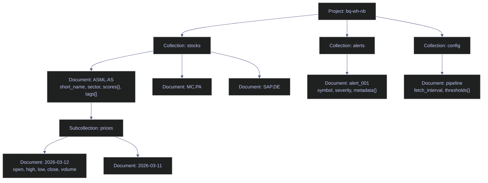

# Firestore for Data Engineering — Python

> [!quote]
> "The world is not made up of rows and columns. Sometimes a document is exactly what the data wants to be."
>
> — **Michael Stonebraker**, ACM interview

This note is an executable reference for Firestore operations using the `google-cloud-firestore` Python SDK. It covers the full CRUD lifecycle — reads, queries, writes, batches, transactions, real-time listeners, aggregations, collection group queries, pagination, and operational monitoring — all demonstrated against a live Euro Stoxx 50 dataset organized as Firestore documents and subcollections.

## Key terms used in this note

| Term | Plain-English definition | Why it matters here | Common mistake / confusion |
|---|---|---|---|
| **Firestore** | Google Cloud's serverless NoSQL document database. Data is organized as collections (folders) containing documents (JSON-like objects), with optional subcollections nested under documents. | Firestore is the third query engine in this chapter — complementing SQL Server (relational/transactional) and BigQuery (analytical). It excels at low-latency document lookups and real-time sync. | Assuming Firestore is a relational database — it has no JOINs, no server-side aggregation beyond COUNT/SUM/AVG, no window functions, and no transactions across more than 500 documents. |
| **Document** | A single record in Firestore, identified by a unique ID within its collection. Contains key-value fields that can be strings, numbers, booleans, timestamps, maps (nested objects), arrays, or references. | Each stock in the `stocks` collection is a document (e.g., `stocks/ASML.AS`) with fields like `short_name`, `sector`, `scores` (nested map), and `tags` (array). | Treating documents like SQL rows — documents have no fixed schema. Two documents in the same collection can have completely different fields. |
| **Collection** | A group of documents at the same path level. Collections cannot contain other collections directly — only documents, which in turn can contain subcollections. | Top-level collections: `stocks`, `alerts`, `config`, `pipeline_runs`, `sectors`, `watchlists`. The `stocks/*/prices` path is a subcollection. | Expecting collections to enforce schema — Firestore collections are schema-less. Any document structure is valid. |
| **Subcollection** | A collection nested under a specific document. `stocks/ASML.AS/prices` is a subcollection containing 30-day OHLCV price documents. | Subcollections model one-to-many relationships (stock → prices) without denormalization. Each price day is a separate document. | Assuming subcollection queries search across all parent documents — by default, a query on `stocks/ASML.AS/prices` only searches ASML's prices. Use **collection group queries** to search across all `prices` subcollections. |
| **Composite index** | A Firestore index on two or more fields. Required for any query that filters or orders on multiple fields simultaneously. Firestore auto-creates single-field indexes but not composite ones. | Many queries in this note use `ensure_index()` to create composite indexes on first run. Without the index, the query fails with a `FAILED_PRECONDITION` error. | Forgetting the index — Firestore returns a clear error with a link to create the missing index. But in automated pipelines, this error can silently stall processing. |
| **`FieldFilter`** | The Python SDK class for building query filters. `FieldFilter("sector", "==", "Technology")` creates an equality filter. Multiple filters can be chained with `.where()`. | All queries in this note use `FieldFilter` for explicit, type-safe filter construction. | Using the deprecated keyword argument syntax `.where("field", "==", "value")` — still works but generates deprecation warnings and will be removed in a future SDK version. |
| **Transaction** | An atomic read-then-write operation. All reads happen first (snapshot isolation), then all writes execute atomically. Limited to 500 document operations per transaction. | Used for safe score updates and counter increments where read-then-write must be atomic to prevent race conditions. | Performing reads after writes inside a transaction — Firestore requires all reads to precede all writes. Violating this order raises a runtime error. |
| **Batch write** | A group of up to 500 write operations (set, update, delete) that execute atomically — either all succeed or all fail. No read operations allowed inside a batch. | Used for bulk updates: acknowledging all alerts, inserting multiple price documents, or updating multiple stocks in one atomic operation. | Confusing batches with transactions — batches are write-only (no reads). Transactions support reads followed by writes. |
| **Real-time listener** | A `on_snapshot` callback that Firestore invokes whenever documents matching a query change. The callback receives the full document snapshot, not just the delta. | Used for live dashboards and alerting — when a stock's score changes, the listener fires immediately. | Not unsubscribing — listeners hold an open gRPC stream. Forgetting to call `unsubscribe()` leaks connections and accumulates read costs. |
| **Collection group query** | A query that searches across all subcollections with the same name, regardless of their parent document. `db.collection_group("prices")` searches prices under every stock. | Enables cross-stock price analysis without knowing the parent document IDs in advance. | Not creating the required collection group index — collection group queries need a special index type (scope: "COLLECTION_GROUP" instead of "COLLECTION"). |

## What this note covers

- **Setup & connection** — SDK initialization, ADC authentication, composite index utility
- **Read operations** — single document get, full collection list, filtered queries
- **Filtering & ordering** — equality, range, compound filters, ORDER BY, LIMIT
- **Nested fields & arrays** — querying into nested maps, `array_contains`, `array_contains_any`
- **Subcollections** — reading and querying nested price data under stock documents
- **Write operations** — set (create/overwrite), update (partial), delete, server timestamps
- **Batch operations & transactions** — atomic multi-document writes, read-then-write transactions
- **Real-time listeners** — `on_snapshot` for live monitoring, unsubscribe patterns
- **Aggregation queries** — server-side COUNT, SUM, AVG without downloading documents
- **Collection group queries** — cross-stock price queries, volume spike detection
- **Pagination & cursors** — `start_after`, `limit`, cursor-based page traversal
- **Maintenance & monitoring** — collection health checks, stale document detection, failed run analysis, config management

Comprehensive reference for querying, writing, and managing Firestore collections
using the `google-cloud-firestore` Python SDK.

| Collection | Description | Key Features |
|---|---|---|
| `stocks` | 50 Euro Stoxx constituents | Nested maps, arrays, booleans |
| `stocks/*/prices` | 30-day OHLCV per symbol | Subcollections |
| `sectors` | Aggregated sector scores | Arrays of symbols |
| `alerts` | Pipeline alerts | Mixed severities, timestamps |
| `pipeline_runs` | Audit log | Array of maps (steps) |
| `watchlists` | User watchlists | Ownership, public/private |
| `config` | App configuration | Singleton documents |



1. Setup & Connection
2. Read Operations (get, list, query)
3. Filtering & Ordering
4. Nested Fields & Arrays
5. Subcollections
6. Write Operations (set, update, delete)
7. Batch Operations & Transactions
8. Real-Time Listeners
9. Aggregation Queries
10. Collection Group Queries
11. Pagination & Cursors
12. Maintenance & Monitoring

## Setup & Connection

Covers authentication, client initialization, and the `ensure_index()` utility used throughout this page for compound query indexes.

### Python | Firestore SDK | client setup

Establishes the Firestore client using a service account key file and verifies connectivity by listing top-level collections.

#### Initialize client and list top-level collections

This cell:

1. Sets `GOOGLE_APPLICATION_CREDENTIALS` env var to the service account key
2. Creates a Firestore client connected to project `bq-wh-nb`
3. Lists all top-level collections to verify the connection works

**Python SDK**: `google-cloud-firestore` — same auth pattern as BigQuery.

> [!warning] Key File for Local Dev Only
>
> Setting `GOOGLE_APPLICATION_CREDENTIALS` to a local key file works for development but is a security liability. On production VMs and Cloud Run, remove this env var — the metadata server provides credentials automatically. See [gcp-identity-and-connection-patterns > Metadata Server (GCE VMs, Cloud Run) — the production standard](https://alp78.github.io/elysium/06-GCP/Security/gcp-identity-and-connection-patterns#metadata-server-gce-vms-cloud-run--the-production-standard).

> [!success] Safe Pattern
>
> Use `os.environ.setdefault(...)` so the env var is only set if not already present — this lets Cloud Run's metadata server take precedence in production. Store the key path in a `.env` file excluded from version control, and never commit `gcp-*-key.json` to git.

*Initialize the Firestore client with ADC and list all top-level collections to verify connectivity.*

```python
import os
os.environ.setdefault("GOOGLE_APPLICATION_CREDENTIALS", r"C:\Users\aperi\DEV\LANG\gcp-bq-key.json")

from google.cloud import firestore
from google.cloud.firestore_v1.base_query import FieldFilter
from datetime import datetime, timezone, timedelta

db = firestore.Client(project="bq-wh-nb")

collections = [c.id for c in db.collections()]
print(f"Connected to Firestore. Collections: {collections}")
```

    Connected to Firestore. Collections: ['alerts', 'config', 'pipeline_runs', 'sectors', 'stocks', 'watchlists']
    

### Index Utility — `ensure_index()`

Firestore requires **explicit indexes** for:
- **Compound queries**: filtering on two fields (e.g., `country == "Germany"` AND `price < 200`)
- **Collection group queries**: querying across all subcollections with the same name

Single-field queries on a single collection work out of the box (auto-indexed).

This utility function handles both cases:
1. **Composite indexes** (multi-field): created via the Firestore Admin API
2. **Field exemptions** (single-field collection group): created via the REST API

The function is **idempotent** — safe to call multiple times. It checks if the index
already exists and waits for it to finish building before returning.

Called automatically before queries that need an index (no manual setup required).

#### Initialize Firestore Admin API client

The Admin API client creates composite indexes. `_project_db` is the path prefix for all index operations throughout `ensure_index()`.

> [!info] Admin Client Setup
>
> The Admin API client creates composite indexes. The database path is the prefix for all index operations.

*Instantiate the Firestore Admin API client and define the project database path prefix.*

```python
from google.cloud import firestore_admin_v1
import time as _time

_admin = firestore_admin_v1.FirestoreAdminClient()
_project_db = "projects/bq-wh-nb/databases/(default)"
```

#### ensure_index() — route to composite or field exemption index

The function inspects `scope` and field count to decide which creation path to take. Single-field collection group queries need a REST field exemption; everything else uses the Admin API composite path.

> [!info] ensure_index() — Composite Index Creation
>
> Routes to the correct index creation method based on field count and scope. Multi-field indexes use the Admin API. Single-field collection group indexes use the REST API field exemption endpoint. The function is idempotent — safe to call multiple times.

*Define `ensure_index()` and route to the composite index or field exemption path based on scope and field count.*

```python
def ensure_index(collection: str, fields: list[dict],
                 scope: str = "COLLECTION") -> None:
    """Create a Firestore index and wait until READY."""
    field_names = " + ".join(f["field_path"] for f in fields)

    # Single-field collection group → field exemption (not composite)
    if scope == "COLLECTION_GROUP" and len(fields) == 1:
        _ensure_field_exemption(collection, fields[0])
        return

    # Multi-field → Admin API composite index
    parent = f"{_project_db}/collectionGroups/{collection}"
    try:
        op = _admin.create_index(
            parent=parent,
            index=firestore_admin_v1.Index(
                query_scope=scope, fields=fields),
        )
```

#### Poll the long-running create_index() operation until ready

`create_index()` is asynchronous. This continuation polls the returned operation object, sleeping 5 seconds between checks, and falls through to the `already exists` handler if the index was previously created.

> [!warning] Index Build Is Asynchronous
>
> `create_index()` returns a long-running operation. The index is not usable until the operation completes. Queries that need the index will fail with `FAILED_PRECONDITION` until it's ready. The polling loop below waits for completion.

> [!success] Safe Pattern
>
> Always call `ensure_index()` before the first query that requires a composite index. The helper polls until `state != CREATING`, so the subsequent query is guaranteed to find the index available. In production CI, pre-create all required indexes via `gcloud firestore indexes composite create` and include them in the deployment pipeline — never rely on runtime index creation in production flows.

*Poll the `create_index()` long-running operation until the index is ready, with fallthrough handling for `already exists` errors.*

```python
        # Poll until the operation completes
        print(f"  Building index: {collection}/{field_names}...",
              end="", flush=True)
        while not op.done():
            print(".", end="", flush=True)
            _time.sleep(5)
        print(" ready!")

    except Exception as e:
        if "already exists" in str(e):
            all_idx = list(_admin.list_indexes(parent=parent))
            building = [i for i in all_idx
                        if i.state == firestore_admin_v1.Index.State.CREATING]
            if building:
                print(f"  Index {collection}/{field_names} building...",
                      end="", flush=True)
                while building:
                    _time.sleep(5)
                    print(".", end="", flush=True)
                    all_idx = list(_admin.list_indexes(parent=parent))
                    building = [i for i in all_idx
                        if i.state == firestore_admin_v1.Index.State.CREATING]
                print(" ready!")
            else:
                print(f"  Index ready: {collection}/{field_names}")
        else:
            print(f"  Index error: {e}")
```

#### _ensure_field_exemption() — authenticate and prepare REST headers

This fragment authenticates via service account credentials and builds the bearer-token headers used for all subsequent REST calls against the Firestore field config endpoint.

> [!info] _ensure_field_exemption() — Collection Group Indexes
>
> Firestore auto-indexes single fields for `COLLECTION` scope only. For `COLLECTION_GROUP` queries (querying across all subcollections with the same name), you must create a "field exemption" via the REST API. This is separate from composite indexes.

*Authenticate with service account credentials and build bearer-token headers for REST calls to the Firestore field config endpoint.*

```python
def _ensure_field_exemption(collection: str, field: dict) -> None:
    """Single-field collection group exemption via REST API."""
    import requests, os
    from google.auth.transport.requests import Request
    from google.oauth2 import service_account

    field_path = field["field_path"]

    creds = service_account.Credentials.from_service_account_file(
        os.environ["GOOGLE_APPLICATION_CREDENTIALS"],
        scopes=["https://www.googleapis.com/auth/datastore"],
    )
    creds.refresh(Request())
    headers = {"Authorization": f"Bearer {creds.token}"}
```

#### Check if collection group exemption already exists

GETs the current field config and returns early if a `COLLECTION_GROUP`-scoped index is already present. If it's still building, polls until it reaches a non-`CREATING` state.

> [!tip] Idempotent Check-Before-Create
>
> The function checks whether the exemption already exists before creating it. If it exists but is still building (`state == "CREATING"`), it polls until ready. This makes the function safe to call on every notebook run.

*GET the current field config and return early if a COLLECTION_GROUP exemption already exists, polling if one is still building.*

```python
    url = (f"https://firestore.googleapis.com/v1/{_project_db}"
           f"/collectionGroups/{collection}/fields/{field_path}")
    resp = requests.get(url, headers=headers)
    if resp.ok:
        existing = resp.json().get("indexConfig", {}).get("indexes", [])
        has_cg = any(
            idx.get("queryScope") == "COLLECTION_GROUP"
            for idx in existing)
        if has_cg:
            building = [idx for idx in existing
                if idx.get("queryScope") == "COLLECTION_GROUP"
                and idx.get("state") == "CREATING"]
            if building:
                print(f"  Field exemption building: "
                      f"{collection}/{field_path}...",
                      end="", flush=True)
                while building:
                    _time.sleep(5)
                    print(".", end="", flush=True)
                    check = requests.get(url, headers=headers).json()
                    existing = check.get("indexConfig", {}).get(
                        "indexes", [])
                    building = [idx for idx in existing
                        if idx.get("queryScope") == "COLLECTION_GROUP"
                        and idx.get("state") == "CREATING"]
                print(" ready!")
            else:
                print(f"  Field exemption ready: "
                      f"{collection}/{field_path} (collection group)")
            return
```

#### PATCH field config to add COLLECTION_GROUP exemption and poll until ready

Merges existing `COLLECTION`-scoped index entries with two new `COLLECTION_GROUP` entries (ascending + descending), then PATCHes the field config. Polls every 5 seconds until all `COLLECTION_GROUP` indexes leave the `CREATING` state or a 5-minute timeout is reached.

> [!warning] Preserve Existing COLLECTION Indexes
>
> The PATCH request replaces the entire index config for the field. You must include the existing `COLLECTION`-scoped indexes in the body, or they will be deleted. The code below fetches current indexes, strips the `state` field (API rejects it), and appends the new `COLLECTION_GROUP` entries.

> [!success] Safe Pattern
>
> Always GET the current field config before issuing a PATCH: extract all `queryScope == "COLLECTION"` entries, strip the `state` key (the API rejects it on write), then append the new `COLLECTION_GROUP` entries. The `_ensure_field_exemption()` helper in this page implements this pattern correctly.

*PATCH the field config to add ascending and descending COLLECTION_GROUP exemptions, then poll until ready.*

```python
    current_indexes = []
    if resp.ok:
        current_indexes = [
            idx for idx in resp.json().get(
                "indexConfig", {}).get("indexes", [])
            if idx.get("queryScope") == "COLLECTION"]
        for idx in current_indexes:
            idx.pop("state", None)

    body = {"indexConfig": {"indexes": current_indexes + [
        {"queryScope": "COLLECTION_GROUP",
         "fields": [{"fieldPath": field_path, "order": "ASCENDING"}]},
        {"queryScope": "COLLECTION_GROUP",
         "fields": [{"fieldPath": field_path, "order": "DESCENDING"}]},
    ]}}

    print(f"  Creating field exemption: "
          f"{collection}/{field_path} (collection group)...",
          end="", flush=True)
    resp = requests.patch(url, headers=headers, json=body)
    if not resp.ok:
        print(f" error: {resp.text[:200]}")
        return

    for _ in range(60):
        _time.sleep(5)
        print(".", end="", flush=True)
        check = requests.get(url, headers=headers).json()
        indexes = check.get("indexConfig", {}).get("indexes", [])
        cg = [i for i in indexes
              if i.get("queryScope") == "COLLECTION_GROUP"]
        if cg and all(i.get("state") != "CREATING" for i in cg):
            print(" ready!")
            return
    print(" timeout (check Firebase Console)")

print("ensure_index() utility loaded.")
```

    ensure_index() utility loaded.
    

### Verify Connection — List Collections

A quick health check that confirms the client is connected and that the expected collections are present with data.

#### Count documents in every top-level collection

This cell:

1. Iterates all top-level collections using `db.collections()`
2. Runs a server-side `count()` aggregation on each
3. Prints a summary table

Run this after setup to confirm the connection works and data is populated.

*Iterate every top-level collection and print its server-side `count().get()` result.*

```python
print("=== Firestore Collections ===")
for coll in db.collections():
    result = coll.count().get()  # type: ignore
    count = result[0][0].value
    print(f"  {coll.id:20s} {count:>5} documents")
```

    === Firestore Collections ===
      alerts                  20 documents
      config                   2 documents
      pipeline_runs           15 documents
      sectors                 10 documents
      stocks                  50 documents
      watchlists               3 documents
    

## Read Operations

Covers fetching a single document by ID, streaming all documents in a collection, and retrieving multiple documents in one round-trip.

### Get a Single Document

Retrieves a specific document by its collection path and document ID using `.document(id).get()`.

#### Fetch a document by ID and read flat, nested, and array fields

This cell:

1. Fetches document `stocks/ASML.AS` by its ID
2. Checks `doc.exists` (returns `False` if the document ID doesn't exist)
3. Extracts **flat fields**: `short_name` (string), `current_price` (float), `is_active` (bool)
4. Extracts a **nested map**: `scores` — a dict with `composite`, `momentum`, `value`, `sentiment`, `rank`
5. Extracts an **array field**: `tags` — a list of strings like `["technology", "netherlands", "euro_stoxx_50"]`

`doc.to_dict()` returns the entire document as a Python dict. Use `.get(key, default)` for safe access.

*Fetch `stocks/ASML.AS`, check existence, and print flat, nested, and array fields.*

```python
doc = db.collection("stocks").document("ASML.AS").get()  # type: ignore

if doc.exists: # type: ignore
    d = doc.to_dict() or {} # type: ignore
    print(f"Document ID: {doc.id}") # type: ignore
    print(f"  Short name:  {d.get('short_name')}")
    print(f"  Sector:      {d.get('sector')}")
    print(f"  Price:       {d.get('current_price')}")
    print(f"  Scores:      {d.get('scores')}")
    print(f"  Tags:        {d.get('tags')}")
    print(f"  Active:      {d.get('is_active')}")
else:
    print("Document not found")
```

    Document ID: ASML.AS
      Short name:  ASML HOLDING
      Sector:      Technology
      Price:       1191.2
      Scores:      {'composite': 0.17610432350282, 'momentum': 1.4701340833921561, 'rank': 19, 'value': -1.4879779971341816, 'sentiment': 0.5461568842504854}
      Tags:        ['technology', 'netherlands', 'euro_stoxx_50']
      Active:      True
    

### List All Documents in a Collection

Streams every document in a collection as a lazy iterator. Always combine with `.limit(N)` in production to avoid downloading unbounded data.

#### Stream all documents and print a formatted table

This cell:

1. Calls `.stream()` on the `stocks` collection — returns a lazy iterator over all 50 documents
2. For each document, extracts `short_name`, `scores.rank`, and `current_price`
3. Prints a formatted table and counts total documents

> [!warning] stream() Downloads Everything
>
> `.stream()` downloads every document in the collection. Fine for 50 stocks, dangerous for millions. For large collections, use pagination or server-side aggregation.

> [!success] Safe Pattern
>
> Always chain `.limit(N)` before `.stream()` for list operations in production. For counts, use `.count().get()` — it is charged as 1 read regardless of collection size and transfers no document data. For large exports, paginate with `.start_after(last_doc)` rather than streaming the entire collection.

*Stream every document in the `stocks` collection and print a formatted summary table.*

```python
print("=== Stocks (top 10) ===")
docs = db.collection("stocks").limit(10).stream()

count = 0
for doc in docs:
    d = doc.to_dict() or {}
    scores = d.get("scores", {})
    print(f"  {doc.id:12s}  {d.get('short_name', ''):20s}  "
          f"rank={scores.get('rank', 'N/A'):>3}  price={d.get('current_price', 0):>8.2f}")
    count += 1

print(f"\nTotal: {count} documents")
```

    === Stocks (top 10) ===
      ABI.BR        AB INBEV              rank=  5  price=   62.76
      AD.AS         KONINKLIJKE AHOLD DELHAIZE N.V.  rank= 14  price=   41.04
      ADS.DE        adidas AG             rank= 31  price=  140.10
      ADYEN.AS      ADYEN                 rank= 23  price=  923.10
      AI.PA         AIR LIQUIDE           rank= 24  price=  168.02
      AIR.PA        AIRBUS SE             rank= 27  price=  176.02
      ALV.DE        Allianz SE            rank= 44  price=  348.80
      ARGX.BR       ARGENX SE             rank= 32  price=  626.60
      ASML.AS       ASML HOLDING          rank= 19  price= 1191.20
      BAS.DE        BASF SE               rank= 36  price=   47.74
    
    Total: 10 documents
    

### Get Multiple Documents by ID

`db.get_all(refs)` fetches a list of document references in a single network round-trip, regardless of how many references are in the list.

#### Fetch multiple documents in a single round-trip with get_all()

This cell:

1. Creates a list of 3 document references (ASML, MC, SAP)
2. Calls `db.get_all(refs)` — fetches all 3 in **one network round-trip**
3. Prints each document's name and price

**Why not loop?** Three separate `.get()` calls = 3 round-trips. `get_all()` = 1 round-trip.
For 50 documents, that's 50x faster.

*Fetch multiple stock documents in a single round-trip using `get_all()` with a list of document references.*

```python
refs = [
    db.collection("stocks").document("ASML.AS"),
    db.collection("stocks").document("MC.PA"),
    db.collection("stocks").document("SAP.DE"),
]

docs = db.get_all(refs)
for doc in docs:
    d = doc.to_dict() or {}
    print(f"  {doc.id}: {d.get('short_name')} — {d.get('current_price')}")
```

      ASML.AS: ASML HOLDING — 1191.2
      MC.PA: LVMH — 494.4
      SAP.DE: SAP SE — 153.82
    

## Filtering & Ordering

Firestore supports equality, range, `IN`, `NOT-IN`, `array_contains`, and `array_contains_any` operators. Each query returns at most **1 MB** of data or **1,000 documents**, whichever limit is reached first. For larger result sets, use pagination with cursors.

> [!info] Cross-Engine — No JOINs in Firestore
>
> Firestore has no JOIN support. For relational-style queries across collections, denormalize the data model or perform client-side joins. BigQuery and SQL Server support all standard JOIN types; SQL Server adds `CROSS APPLY` / `OUTER APPLY`.

### Equality Filter

Filters documents using `==`, `!=`, `<`, `>`, `<=`, `>=`. Single-field equality filters use the auto-created index — no manual setup needed.

#### Filter documents by an exact field value

> [!warning] Reads Billed per Document Returned
>
> A query returning 10,000 documents costs 10,000 read operations regardless of field projections. There is no "column-level" cost savings like BigQuery. Use `where()` filters aggressively and always apply `limit()` for list operations.

> [!success] Safe Pattern
>
> Filter as tightly as possible with `where()` before streaming results, and always add `limit()`. For counts and totals, use `.count().get()` or `.sum(field).get()` — these aggregation queries cost one read regardless of how many documents they touch.

This cell:

1. Queries `stocks` where `country == "Germany"`
2. `.stream()` returns only matching documents (filtering happens server-side)
3. Prints each German stock's symbol and sector

Operators: `==`, `!=`, `<`, `>`, `<=`, `>=`
Firestore creates a single-field index automatically for equality filters.

*Query `stocks` where `country == 'Germany'` and stream the matching documents.*

```python
print("=== German Stocks ===")
docs = db.collection("stocks").where(filter=FieldFilter("country", "==", "Germany")).stream()
for doc in docs:
    d = doc.to_dict() or {}
    print(f"  {doc.id}: {d.get('short_name')} — {d.get('sector')}")
```

    === German Stocks ===
      ADS.DE: adidas AG — Consumer Cyclical
      ALV.DE: Allianz SE — Financial Services
      BAS.DE: BASF SE — Basic Materials
      BAYN.DE: Bayer AG — Healthcare
      BMW.DE: BAYERISCHE MOTOREN WERKE AG — Consumer Cyclical
      DB1.DE: DEUTSCHE BOERSE AG — Financial Services
      DHL.DE: DEUTSCHE POST AG — Industrials
      DTE.DE: DEUTSCHE TELEKOM AG — Communication Services
      ENR.DE: Siemens Energy AG — Industrials
      IFX.DE: INFINEON TECHNOLOGIES AG — Technology
      MBG.DE: Mercedes-Benz Group AG — Consumer Cyclical
      MUV2.DE: MUENCHENER RUECKVERS.-GES. AG N — Financial Services
      RHM.DE: RHEINMETALL AG — Industrials
      SAP.DE: SAP SE — Technology
      SIE.DE: SIEMENS AG — Industrials
      VOW.DE: VOLKSWAGEN AG — Consumer Cyclical
    

### Range Filter with Ordering

Combines a range filter and `order_by` on the same field — covered by the auto-created single-field index. Filtering and sorting on different fields requires a composite index.

#### Filter by range and sort results descending

This cell:

1. Filters `stocks` where `current_price > 500`
2. Orders results by `current_price` descending (highest first)
3. Prints symbol and price for each match

**Index requirement**: combining a range filter (`>`) with `order_by` on the same field
works with the auto-created single-field index. Range on one field + order on a different field
requires a composite index.

*Query `stocks` where `current_price > 500`, ordered by price descending.*

```python
print("=== High-Price Stocks (>500) ===")
docs = (db.collection("stocks")
    .where(filter=FieldFilter("current_price", ">", 500))
    .order_by("current_price", direction=firestore.Query.DESCENDING)
    .stream())

for doc in docs:
    d = doc.to_dict() or {}
    print(f"  {doc.id}: {d.get('current_price'):.2f}")
```

    === High-Price Stocks (>500) ===
      RMS.PA: 1906.00
      RHM.DE: 1552.00
      ASML.AS: 1191.20
      ADYEN.AS: 923.10
      ARGX.BR: 626.60
      MUV2.DE: 526.20
    

### Compound Filters (AND)

Chaining multiple `.where()` calls applies AND logic. Each unique multi-field combination requires a composite index.

#### Combine multiple where() filters for AND queries

This cell:

1. Filters `stocks` where `country == "France"` AND `current_price < 200`
2. Returns only French stocks under 200 EUR

> [!warning] No OR in Chained Filters
>
> Firestore evaluates all `.where()` clauses as AND only (no OR support in chained filters). Each unique field combination may require a composite index — Firestore returns an error URL to auto-create it on first run.

> [!success] Safe Pattern
>
> For OR-style queries, run two separate queries and merge the results client-side (deduplicating by document ID). For the common case of OR across a finite set of values, use `.where(filter=FieldFilter("field", "in", [val1, val2, ...]))` which supports up to 30 values.

*Chain multiple `where()` filters — country equals France AND price below 200 — and stream the intersection.*

```python
ensure_index("stocks", [
    {"field_path": "country", "order": "ASCENDING"},
    {"field_path": "current_price", "order": "ASCENDING"},
])

print("=== French Stocks Under 200 ===")
docs = (db.collection("stocks")
    .where(filter=FieldFilter("country", "==", "France"))
    .where(filter=FieldFilter("current_price", "<", 200))
    .stream())

for doc in docs:
    d = doc.to_dict() or {}
    print(f"  {doc.id}: {d.get('short_name')} — {d.get('current_price'):.2f}")
```

      Index ready: stocks/country + current_price
    === French Stocks Under 200 ===
      DSY.PA: DASSAULT SYSTEMES — 18.37
      CS.PA: AXA — 37.96
      BN.PA: DANONE — 69.24
      TTE.PA: TOTALENERGIES — 69.80
      SGO.PA: SAINT GOBAIN — 73.22
      SAN.PA: SANOFI — 76.26
      BNP.PA: BNP PARIBAS ACT.A — 87.44
      DG.PA: VINCI — 129.90
      AI.PA: AIR LIQUIDE — 168.02
    

### IN and NOT-IN Filters

`in` matches documents where a field equals any value in a list (up to 30 values). `not-in` excludes matching documents.

#### Match documents where a field equals one of several values

This cell:

1. Filters `stocks` where `sector` is in `["Technology", "Health Care"]`
2. Orders by `current_price` descending
3. Returns stocks from either sector

> [!info] IN Operator Limit: 30 Values
>
> `in` supports up to 30 values. For more, split into multiple queries and merge client-side. Adding `order_by` on a different field with an IN filter requires a composite index — sort client-side instead for small result sets.

*Use `IN` to match stocks whose sector is either Technology or Healthcare.*

```python
print("=== Tech & Healthcare ===")
docs = (db.collection("stocks")
    .where(filter=FieldFilter("sector", "in", ["Technology", "Health Care"]))
    .stream())

results = sorted(docs, key=lambda d: (d.to_dict() or {}).get("current_price", 0), reverse=True)
for doc in results:
    d = doc.to_dict() or {}
    print(f"  {doc.id}: {d.get('sector'):15s} — {d.get('current_price'):.2f}")
```

    === Tech & Healthcare ===
      ASML.AS: Technology      — 1191.20
      ADYEN.AS: Technology      — 923.10
      SAP.DE: Technology      — 153.82
      IFX.DE: Technology      — 40.73
      DSY.PA: Technology      — 18.37
    

### Array Contains

`array_contains` returns documents where a single value exists anywhere in an array field.

#### Filter documents where an array field contains a specific value

This cell:

1. Filters `stocks` where the `tags` array contains `"germany"`
2. Returns all stocks tagged with "germany"

Each stock's `tags` array looks like `["technology", "germany", "euro_stoxx_50"]`.
`array_contains` checks if the value exists anywhere in the array.

*Use `array_contains` to filter stocks whose `tags` array contains the value `'germany'`.*

```python
print("=== Stocks tagged 'germany' ===")
docs = db.collection("stocks").where(filter=FieldFilter("tags", "array_contains", "germany")).stream()
for doc in docs:
    d = doc.to_dict() or {}
    print(f"  {doc.id}: tags={d.get('tags')}")
```

    === Stocks tagged 'germany' ===
      ADS.DE: tags=['consumer_cyclical', 'germany', 'euro_stoxx_50']
      ALV.DE: tags=['financial_services', 'germany', 'euro_stoxx_50']
      BAS.DE: tags=['basic_materials', 'germany', 'euro_stoxx_50']
      BAYN.DE: tags=['healthcare', 'germany', 'euro_stoxx_50']
      BMW.DE: tags=['consumer_cyclical', 'germany', 'euro_stoxx_50']
      DB1.DE: tags=['financial_services', 'germany', 'euro_stoxx_50']
      DHL.DE: tags=['industrials', 'germany', 'euro_stoxx_50']
      DTE.DE: tags=['communication_services', 'germany', 'euro_stoxx_50']
      ENR.DE: tags=['industrials', 'germany', 'euro_stoxx_50']
      IFX.DE: tags=['technology', 'germany', 'euro_stoxx_50']
      MBG.DE: tags=['consumer_cyclical', 'germany', 'euro_stoxx_50']
      MUV2.DE: tags=['financial_services', 'germany', 'euro_stoxx_50']
      RHM.DE: tags=['industrials', 'germany', 'euro_stoxx_50']
      SAP.DE: tags=['technology', 'germany', 'euro_stoxx_50']
      SIE.DE: tags=['industrials', 'germany', 'euro_stoxx_50']
      VOW.DE: tags=['consumer_cyclical', 'germany', 'euro_stoxx_50']
    

### Array Contains Any

`array_contains_any` returns documents where an array field contains at least one value from a provided list — the OR counterpart to `array_contains`.

#### Filter documents where an array field contains any of several values

This cell:

1. Filters `stocks` where `tags` contains **any** of `["france", "netherlands"]`
2. Returns French OR Dutch stocks

`array_contains_any` is the OR version of `array_contains`.
Max 30 values in the list.

*Use `array_contains_any` to filter stocks whose `tags` array contains any of several country tags.*

```python
print("=== French or Dutch stocks ===")
docs = (db.collection("stocks")
    .where(filter=FieldFilter("tags", "array_contains_any", ["france", "netherlands"]))
    .stream())

for doc in docs:
    d = doc.to_dict() or {}
    print(f"  {doc.id}: {d.get('country')}")
```

    === French or Dutch stocks ===
      AD.AS: Netherlands
      ADYEN.AS: Netherlands
      AI.PA: France
      AIR.PA: Netherlands
      ARGX.BR: Netherlands
      ASML.AS: Netherlands
      BN.PA: France
      BNP.PA: France
      CS.PA: France
      DG.PA: France
      DSY.PA: France
      EL.PA: France
      INGA.AS: Netherlands
      MC.PA: France
      OR.PA: France
      PRX.AS: Netherlands
      RMS.PA: France
      SAF.PA: France
      SAN.PA: France
      SGO.PA: France
      SU.PA: France
      TTE.PA: France
      WKL.AS: Netherlands
    

### Ordering and Limiting

`order_by()` accepts dot notation for nested map fields. `.limit(N)` caps results server-side.

#### Sort by a nested field and take the top N results

This cell:

1. Orders `stocks` by `scores.composite` descending (nested field, dot notation)
2. Takes only the top 5 (`.limit(5)`)
3. Prints rank, symbol, and composite score

**Nested field sorting**: `order_by("scores.composite")` sorts by a field inside the `scores` map.
Firestore supports dot notation for nested maps up to 20 levels deep.

*Order stocks by a nested map field using dot notation and take the top 5 by composite score.*

```python
print("=== Top 5 by Composite Score ===")
docs = (db.collection("stocks")
    .order_by("scores.composite", direction=firestore.Query.DESCENDING)
    .limit(5)
    .stream())

for doc in docs:
    d = doc.to_dict() or {}
    scores = d.get("scores", {})
    print(f"  #{scores.get('rank', '?'):>2} {doc.id:12s} score={scores.get('composite', 0):.4f}")
```

    === Top 5 by Composite Score ===
      # 1 BNP.PA       score=0.6796
      # 2 VOW.DE       score=0.5756
      # 3 DTE.DE       score=0.4870
      # 4 TTE.PA       score=0.3913
      # 5 ABI.BR       score=0.3852
    

## Nested Fields & Arrays

Covers dot-notation queries into nested maps and reading embedded map fields from documents.

### Query on Nested Map Fields

Dot notation (`"scores.momentum"`) works in `where()`, `order_by()`, and field paths up to 20 levels deep.

#### Filter and sort using dot notation on nested map fields

This cell:

1. Filters `stocks` where `scores.momentum > 0.05` (dot notation into nested map)
2. Orders by `scores.momentum` descending
3. Prints momentum and composite scores for high-momentum stocks

Dot notation works in both `where()` and `order_by()` for nested maps.

*Filter and sort with `where()` + `order_by()` on a nested map field via dot notation.*

```python
print("=== Stocks with momentum > 0.05 ===")
docs = (db.collection("stocks")
    .where(filter=FieldFilter("scores.momentum", ">", 0.05))
    .order_by("scores.momentum", direction=firestore.Query.DESCENDING)
    .stream())

for doc in docs:
    d = doc.to_dict() or {}
    s = d.get("scores", {})
    print(f"  {doc.id:12s} momentum={s.get('momentum', 0):.4f}  composite={s.get('composite', 0):.4f}")
```

    === Stocks with momentum > 0.05 ===
      ENR.DE       momentum=2.0402  composite=0.2557
      ENI.MI       momentum=1.9778  composite=0.2659
      ASML.AS      momentum=1.4701  composite=0.1761
      TTE.PA       momentum=1.3074  composite=0.3913
      AD.AS        momentum=1.1629  composite=0.2367
      IBE.MC       momentum=0.7534  composite=-0.2428
      DTE.DE       momentum=0.7064  composite=0.4870
      BAYN.DE      momentum=0.6422  composite=0.2724
      ENEL.MI      momentum=0.6336  composite=0.0393
      SU.PA        momentum=0.5633  composite=0.2605
      ABI.BR       momentum=0.5375  composite=0.3852
      SAF.PA       momentum=0.4905  composite=-0.1193
      DG.PA        momentum=0.4894  composite=0.2928
      BNP.PA       momentum=0.4603  composite=0.6796
      SAN.MC       momentum=0.4502  composite=0.3106
      NDA-FI.HE    momentum=0.4424  composite=-0.0834
      ITX.MC       momentum=0.3027  composite=-0.0399
      IFX.DE       momentum=0.3019  composite=0.3487
      BAS.DE       momentum=0.3012  composite=-0.0842
      DB1.DE       momentum=0.2879  composite=-0.7797
      DHL.DE       momentum=0.2640  composite=-0.1121
      AI.PA        momentum=0.2252  composite=0.0631
      INGA.AS      momentum=0.2158  composite=0.0980
      BBVA.MC      momentum=0.1535  composite=-0.0777
    

### Read Nested Maps from Documents

Firestore nested maps are returned as Python dicts by `to_dict()`. Use `.get(key, default)` for safe nested access.

#### Access nested map fields from streamed documents

This cell:

1. Reads first 5 documents from `alerts` collection
2. For each alert, extracts the `metadata` nested map (contains `source` and `run_id`)
3. Prints alert type alongside metadata fields

Nested maps are Python dicts — access with `d.get("metadata", {}).get("source")`.

*Stream alert documents and access nested map fields from the returned dict.*

```python
print("=== Alert Metadata ===")
docs = db.collection("alerts").limit(5).stream()
for doc in docs:
    d = doc.to_dict() or {}
    meta = d.get("metadata", {})
    print(f"  {doc.id}: type={d.get('type'):15s} source={meta.get('source'):15s} run={meta.get('run_id')}")
```

    === Alert Metadata ===
      alert_001: type=PRICE_DROP      source=scheduler       run=run_028
      alert_002: type=PRICE_DROP      source=manual          run=run_019
      alert_003: type=PRICE_DROP      source=manual          run=run_050
      alert_004: type=PRICE_DROP      source=cloud_function  run=run_042
      alert_005: type=MOMENTUM_FLIP   source=manual          run=run_024
    

## Subcollections

Subcollections are independent collections nested inside a document. Each stock has a `prices` subcollection with daily OHLCV records. Covers reading, querying within a single subcollection, and cross-subcollection queries via collection groups.

### Read a Subcollection

Navigate to a subcollection by chaining `.document(id).collection(name)` off the parent collection reference.

#### Stream price history from a stock's prices subcollection

This cell:

1. Navigates to subcollection `stocks/ASML.AS/prices`
2. Orders by `date` descending and takes top 5
3. Prints OHLCV data (open, high, low, close, volume) for each day

Subcollections are independent collections nested inside a document.
Each stock has its own `prices` subcollection with 30 daily price documents.

*Navigate to the `prices` subcollection of ASML.AS and stream the most recent 5 trading days.*

```python
print("=== ASML.AS Price History (last 5 days) ===")
prices = (db.collection("stocks").document("ASML.AS")
    .collection("prices")
    .order_by("date", direction=firestore.Query.DESCENDING)
    .limit(5)
    .stream())

for doc in prices:
    d = doc.to_dict() or {}
    print(f"  {d.get('date')}  O={d.get('open'):>8.2f}  H={d.get('high'):>8.2f}  "
          f"L={d.get('low'):>8.2f}  C={d.get('close'):>8.2f}  V={d.get('volume'):>12,}")
```

    === ASML.AS Price History (last 5 days) ===
      2026-03-12  O= 1194.80  H= 1202.20  L= 1187.80  C= 1190.80  V=     128,223
      2026-03-11  O= 1188.40  H= 1210.80  L= 1174.00  C= 1198.80  V=     562,904
      2026-03-10  O= 1188.40  H= 1208.40  L= 1172.20  C= 1200.00  V=     800,815
      2026-03-09  O= 1072.00  H= 1147.60  L= 1060.20  C= 1147.60  V=     689,086
      2026-03-06  O= 1186.00  H= 1192.60  L= 1112.80  C= 1147.00  V=     857,271
    

### Query Within a Subcollection

`where()` and `order_by()` work identically on subcollection references. The query is scoped to that document's subcollection only.

#### Apply where() and order_by() within a single stock's subcollection

This cell:

1. Queries `stocks/ASML.AS/prices` where `close > 700`
2. Orders by `close` descending
3. Prints dates where ASML closed above 700

This only searches ASML's prices — not other stocks.
For cross-stock queries, use **Collection Group Queries** (Section 10).

*Apply `where()` and `order_by()` inside a single stock's `prices` subcollection.*

```python
print("=== ASML Days Above 700 ===")
prices = (db.collection("stocks").document("ASML.AS")
    .collection("prices")
    .where(filter=FieldFilter("close", ">", 700))
    .order_by("close", direction=firestore.Query.DESCENDING)
    .stream())

for doc in prices:
    d = doc.to_dict() or {}
    print(f"  {d.get('date')}: close={d.get('close'):.2f}")
```

    === ASML Days Above 700 ===
      2026-02-25: close=1288.40
      2026-02-24: close=1263.40
      2026-02-20: close=1255.60
      2026-02-23: close=1249.20
      2026-02-27: close=1233.40
      2026-02-26: close=1232.40
      2026-03-02: close=1210.40
      2026-03-10: close=1200.00
      2026-03-04: close=1199.80
      2026-03-11: close=1198.80
      2026-03-12: close=1190.80
      2026-03-05: close=1186.00
      2026-03-03: close=1161.80
      2026-03-09: close=1147.60
      2026-03-06: close=1147.00
    

## Write Operations

Covers full document creation with `set()`, partial updates with `update()` and atomic field transforms, and hard deletes. All write operations are immediately visible to readers.

### Set — Create or Overwrite

`set(data)` replaces the entire document. `set(data, merge=True)` upserts — creates if missing, updates only the provided fields if it exists.

#### Create a document and merge-update specific fields

> [!danger] Document Size Limit — 1 MiB
>
> A single Firestore document cannot exceed 1,048,576 bytes including all field names, values, and nested data. If you store arrays that grow over time (e.g., pipeline run history), they WILL eventually hit this limit. Move growing arrays to a subcollection instead.

> [!success] Safe Pattern
>
> Never store unbounded arrays (price history, run steps, log entries) in a document field. Use a subcollection — each entry becomes its own document with no practical size ceiling. Reserve document-level arrays for fixed-size lists (e.g., a watchlist of up to 50 symbols) where growth is bounded.

> [!warning] Document Write Hotspot — 1 write/sec
>
> A single document can sustain ~1 write per second. Higher rates cause contention and increased latency. If multiple pipeline runs update the same status document simultaneously, writes queue and slow down. Use sharded counters or separate documents for high-write scenarios.

> [!success] Safe Pattern
>
> For shared counters (e.g., total pipeline runs), implement a sharded counter: maintain N shard documents and write to a randomly chosen shard. Read by summing all shards. For per-symbol pipelines, write to separate documents per symbol rather than aggregating into one shared status document.

This cell:

1. **`set(data)`**: creates `watchlists/test_watchlist` with name, owner, symbols array, timestamp
2. **`set(data, merge=True)`**: adds SAP.DE to symbols and updates stock_count — other fields untouched
3. Verifies by reading the document back

> [!danger] SET Without Merge Overwrites Everything
>
> `set(data)` **replaces the entire document** — all fields not in `data` are deleted. Use `set(data, merge=True)` to upsert: creates if missing, updates only specified fields if exists.

> [!success] Safe Pattern
>
> Use `set(data, merge=True)` for upserts, and `update(fields)` when you only want to touch specific fields on a document you know exists. Reserve bare `set(data)` for cases where you intentionally want to replace the entire document (e.g., a full refresh of a config singleton).

*Create a watchlist document with `set()` and merge-update specific fields with `merge=True`.*

```python
db.collection("watchlists").document("test_watchlist").set({
    "name": "Test Watchlist",
    "owner": "notebook_demo",
    "symbols": ["ASML.AS", "MC.PA"],
    "is_public": False,
    "created_at": datetime.now(tz=timezone.utc),
    "stock_count": 2,
})
print("Created test_watchlist")

db.collection("watchlists").document("test_watchlist").set({
    "symbols": ["ASML.AS", "MC.PA", "SAP.DE"],
    "stock_count": 3,
}, merge=True)
print("Merged: added SAP.DE")

doc = db.collection("watchlists").document("test_watchlist").get()  # type: ignore
print(f"Result: {doc.to_dict()}") # type: ignore
```

    Created test_watchlist
    Merged: added SAP.DE
    Result: {'is_public': False, 'created_at': DatetimeWithNanoseconds(2026, 3, 22, 17, 42, 43, 845306, tzinfo=datetime.timezone.utc), 'stock_count': 3, 'symbols': ['ASML.AS', 'MC.PA', 'SAP.DE'], 'owner': 'notebook_demo', 'name': 'Test Watchlist'}
    

### Update — Partial Modifications

`update()` touches only the specified fields, leaving the rest unchanged. Firestore provides atomic field-level transforms that avoid read-modify-write races.

#### Apply atomic field transforms with ArrayUnion, ArrayRemove, and Increment

This cell:

1. **`ArrayUnion(["TTE.PA"])`**: adds TTE.PA to the `symbols` array (no duplicates)
2. **`ArrayRemove(["MC.PA"])`**: removes MC.PA from the array
3. **`Increment(1)`**: atomically increments `stock_count` by 1 (no read needed)
4. **`SERVER_TIMESTAMP`**: sets `last_modified` to Firestore server time (not client clock)
5. Reads back the document to show the result

These are **atomic field-level operations** — no race conditions even with concurrent writers.

*Apply atomic field transforms — `ArrayUnion`, `ArrayRemove`, and `Increment` — in a single `update()` call.*

```python
from google.cloud.firestore_v1 import ArrayUnion, ArrayRemove, Increment

ref = db.collection("watchlists").document("test_watchlist")

ref.update({"symbols": ArrayUnion(["TTE.PA"])})
ref.update({"symbols": ArrayRemove(["MC.PA"])})
ref.update({"stock_count": Increment(1)})
ref.update({"last_modified": firestore.SERVER_TIMESTAMP})

doc = ref.get()
d = doc.to_dict() or {} # type: ignore
print(f"Updated: symbols={d.get('symbols')}, count={d.get('stock_count')}, modified={d.get('last_modified')}")
```

    Updated: symbols=['ASML.AS', 'SAP.DE', 'TTE.PA'], count=4, modified=2026-03-22 17:42:46.122000+00:00
    

### Delete a Document

`.delete()` removes the document but not its subcollections. Orphaned subcollection documents remain accessible if you know their path.

#### Delete a document and verify it no longer exists

This cell:

1. Deletes `watchlists/test_watchlist`
2. Verifies deletion by checking `doc.exists`

> [!danger] Deletion Does NOT Cascade
>
> Deleting a document does NOT delete its subcollections. Subcollection documents become orphans — accessible only if you know their path. You must delete subcollection documents individually.

> [!success] Safe Pattern
>
> Before deleting a parent document, enumerate and delete all subcollection documents first. In production, use a Cloud Function triggered on document deletion to cascade the cleanup, or use the Firebase Admin SDK's `delete_collection()` helper which recursively deletes all subcollection documents in batches of 500.

*Delete the watchlist document and verify it no longer exists.*

```python
db.collection("watchlists").document("test_watchlist").delete()
print("Deleted test_watchlist")

doc = db.collection("watchlists").document("test_watchlist").get()  # type: ignore
print(f"Exists: {doc.exists}") # type: ignore
```

    Deleted test_watchlist
    Exists: False
    

## Batch Operations & Transactions

Batches group up to 500 writes into a single atomic commit. Transactions add a read-before-write step with optimistic concurrency — Firestore retries automatically on conflict.

> [!info] Cross-Engine — Transaction Models
>
> Firestore transactions use optimistic concurrency (retry on conflict) and are limited to 500 operations per batch/transaction. SQL Server provides full ACID with pessimistic locking and no operation-count limit. BigQuery has limited multi-statement transactions scoped to a single query job.

### Batch — Atomic Multi-Write

A batch groups up to 500 write operations into a single commit — all succeed or all fail. A single network round-trip replaces N separate writes.

#### Commit multiple writes atomically in a single batch

This cell:

1. Creates a batch with `db.batch()`
2. Adds 3 `set()` operations for alert documents
3. Calls `batch.commit()` — all 3 writes happen atomically (all succeed or all fail)
4. Cleans up by deleting the 3 test documents

> [!info] Batch Limit Is 500 Operations
>
> Maximum 500 operations per batch. For more, split into multiple batches. Batches are faster than individual writes because they use a single network round-trip.

*Group multiple writes into a single atomic `batch.commit()` operation.*

```python
batch = db.batch()

for i in range(3):
    ref = db.collection("alerts").document(f"batch_alert_{i}")
    batch.set(ref, {
        "symbol": "DEMO.XX",
        "type": "BATCH_TEST",
        "severity": "LOW",
        "message": f"Batch alert #{i}",
        "acknowledged": False,
        "created_at": datetime.now(tz=timezone.utc),
        "tags": ["test", "batch"],
        "metadata": {"source": "notebook"},
    })

batch.commit()
print("Batch committed: 3 alerts created")

for i in range(3):
    db.collection("alerts").document(f"batch_alert_{i}").delete()
print("Cleaned up batch alerts")
```

    Batch committed: 3 alerts created
    Cleaned up batch alerts
    

### Transaction — Conditional Read-Modify-Write

Transactions wrap a read and a conditional write in an atomic unit. Firestore retries on conflict — guaranteeing exactly-once semantics for conditional updates.

#### Use a transactional function to prevent duplicate acknowledgments

This cell:

1. **Read** document `alerts/alert_001` from Firestore
2. **Check** if `acknowledged` is already `true`
3. **If false**: set `acknowledged = true` and `acknowledged_by = "notebook_demo"`
4. **If true**: skip the write (prevent double-acknowledgment)
5. **Reset** back to `false` so the demo can be re-run

> [!tip] Transactions Prevent Lost Updates
>
> Without a transaction, two clients could both read `acknowledged = false` simultaneously and both write `true` — duplicating the work. The transaction guarantees only one client wins; the other retries automatically.

*Use a `@firestore.transactional` function to read, check a condition, and conditionally write inside a retrying transaction.*

```python
@firestore.transactional
def acknowledge_alert(transaction, alert_ref):
    """Acknowledge an alert only if it hasn't been acknowledged yet."""
    snapshot = alert_ref.get(transaction=transaction)
    d = snapshot.to_dict() or {}

    if d.get("acknowledged"):
        return f"{snapshot.id} already acknowledged"

    transaction.update(alert_ref, {
        "acknowledged": True,
        "acknowledged_at": datetime.now(tz=timezone.utc),
        "acknowledged_by": "notebook_demo",
    })
    return f"{snapshot.id} acknowledged successfully"

alert_ref = db.collection("alerts").document("alert_001")
transaction = db.transaction()
result = acknowledge_alert(transaction, alert_ref)
print(result)

alert_ref.update({"acknowledged": False})
```

    alert_001 acknowledged successfully
    

    update_time {
      seconds: 1774201375
      nanos: 570562000
    }

## Real-Time Listeners

Firestore maintains a persistent WebSocket connection and pushes document changes to registered listeners within milliseconds of a write — no polling required. Listeners can be attached to individual documents or queries.

### on_snapshot Push Notifications

`on_snapshot` registers a callback that fires whenever documents in a query result set change. The first call delivers all matching documents as `ADDED` events; subsequent calls deliver only the delta.

#### Register a listener and trigger it with a document update

This cell:

1. Registers an `on_snapshot` listener on German stocks (`country == "Germany"`)
2. **Modifies** SAP.DE's price to 999.99 to trigger the listener
3. Waits 2 seconds for the push notification to arrive
4. Prints all changes detected by the listener (type: ADDED, MODIFIED, REMOVED)
5. **Restores** SAP.DE's original price and stops the listener

**How it works**: Firestore maintains a persistent connection and pushes changes instantly.
No polling. The callback fires within milliseconds of a write anywhere in the world.
This is Firestore's killer feature vs BigQuery/SQL Server.

*Register an `on_snapshot` listener on German stocks, trigger it with a document update, and unsubscribe cleanly.*

```python
import threading

changes_log = []

def on_stock_change(doc_snapshots, changes, read_time):
    for change in changes:
        d = change.document.to_dict() or {}
        changes_log.append({
            "type": change.type.name,
            "symbol": change.document.id,
            "price": d.get("current_price"),
            "time": str(read_time),
        })

query = db.collection("stocks").where(filter=FieldFilter("country", "==", "Germany"))
listener = query.on_snapshot(on_stock_change)

import time
db.collection("stocks").document("SAP.DE").update({"current_price": 999.99})
time.sleep(2)

print("=== Changes Detected ===")
for c in changes_log:
    print(f"  [{c['type']}] {c['symbol']}: price={c['price']}")

db.collection("stocks").document("SAP.DE").update({"current_price": 153.82})
listener.unsubscribe()
print("\nListener stopped")
```

    === Changes Detected ===
      [ADDED] ADS.DE: price=140.1
      [ADDED] ALV.DE: price=348.8
      [ADDED] BAS.DE: price=47.74
      [ADDED] BAYN.DE: price=39.475
      [ADDED] BMW.DE: price=80.58
      [ADDED] DB1.DE: price=237.8
      [ADDED] DHL.DE: price=45.98
      [ADDED] DTE.DE: price=32.55
      [ADDED] ENR.DE: price=153.55
      [ADDED] IFX.DE: price=40.735
      [ADDED] MBG.DE: price=54.7
      [ADDED] MUV2.DE: price=526.2
      [ADDED] RHM.DE: price=1552.0
      [ADDED] SAP.DE: price=999.99
      [ADDED] SIE.DE: price=224.1
      [ADDED] VOW.DE: price=92.85
    
    Listener stopped
    

## Aggregation Queries

Firestore added server-side `COUNT`, `SUM`, and `AVG` aggregation queries in 2023. These run entirely on the server and return a single value — no documents are downloaded to the client.

> [!info] Cross-Engine — Aggregation Limitations
>
> Firestore aggregation is limited to COUNT, SUM, and AVG over a single field with no GROUP BY, HAVING, or window functions. For complex aggregation (pivots, percentiles, multi-dimensional rollups), export data to BigQuery. SQL Server and BigQuery support the full SQL aggregation spectrum.

### COUNT — Server-Side

`count()` runs entirely on the server. No documents are downloaded to the client, and the result is always a single `AggregationResult`.

#### Run a server-side count() per country

This cell:

1. For each country (Germany, France, Netherlands, Italy, Spain), runs a `count()` aggregation
2. The count happens **on the Firestore server** — no documents are downloaded
3. Prints stock count per country

**Cost**: aggregation queries are charged as 1 document read per 1000 documents counted.
Much cheaper than streaming all documents and counting in Python.

*Run a server-side `count()` per country by chaining `where()` filters in a loop.*

```python
for country in ["Germany", "France", "Netherlands", "Italy", "Spain"]:
    query = db.collection("stocks").where(filter=FieldFilter("country", "==", country))
    result = query.count().get()  # type: ignore
    count_val = result[0][0].value
    print(f"  {country:15s}: {count_val} stocks")
```

      Germany        : 16 stocks
      France         : 15 stocks
      Netherlands    : 8 stocks
      Italy          : 5 stocks
      Spain          : 4 stocks
    

### SUM and AVG — Server-Side

`sum(field)` and `avg(field)` added server-side numeric aggregations in 2023. All three aggregation types can be chained on the same query object.

#### Compute sum(), avg(), and count() in a single pass

This cell:

1. **`sum("index_weight")`**: computes total index weight across all 50 stocks (should be ~1.0)
2. **`avg("current_price")`**: computes average stock price
3. **`count()`**: counts total documents

All three run server-side. The client receives a single number, not 50 documents.

*Compute `sum()`, `avg()`, and `count()` in a single aggregation request.*

```python
query = db.collection("stocks")

sum_result = query.sum("index_weight").get()  
total_weight = sum_result[0][0].value # type: ignore
print(f"Total index weight: {total_weight:.4f}")

avg_result = query.avg("current_price").get()  
avg_price = avg_result[0][0].value # type: ignore
print(f"Average stock price: {avg_price:.2f}")

count_result = query.count().get()  
total = count_result[0][0].value # type: ignore
print(f"Total stocks: {total}")
```

    Total index weight: 1.0000
    Average stock price: 234.17
    Total stocks: 50
    

## Collection Group Queries

Collection group queries search across all subcollections with the same name in a single request. Without them, querying prices across 50 stocks would require 50 separate queries.

> [!info] Cross-Engine — Querying Across Partitions
>
> Collection group queries are Firestore's equivalent of querying across partitions. BigQuery achieves this with partition pruning on partitioned tables. SQL Server uses partitioned views or `UNION ALL` across multiple tables.

### Query Across ALL Subcollections

`db.collection_group(name)` targets every subcollection with the given name across the entire database — regardless of which parent document they belong to.

#### Order all prices subcollections by close price across every stock

This cell:

1. Calls `db.collection_group("prices")` — queries ALL `prices` subcollections at once
2. Orders by `close` descending, takes top 10
3. Extracts the parent symbol from the document path (`stocks/{symbol}/prices/{date}`)
4. Prints the 10 highest closing prices across all 50 stocks

**Without collection groups**, you'd need 50 separate queries (one per stock).
Collection groups search across all subcollections with the same name in one query.

*Use `collection_group('prices')` with `order_by('close')` to query every prices subcollection at once.*

```python
ensure_index("prices", [
    {"field_path": "close", "order": "DESCENDING"},
], scope="COLLECTION_GROUP")

import time as _t
print("=== Highest Closes Across All Stocks ===")
for attempt in range(12):  # retry up to 2 minutes while index builds
    try:
        docs = (db.collection_group("prices")
            .order_by("close", direction=firestore.Query.DESCENDING)
            .limit(10)
            .stream())
        for doc in docs:
            d = doc.to_dict() or {}
            path_parts = doc.reference.path.split("/")
            symbol = path_parts[1]  # stocks/{symbol}/prices/{date}
            print(f"  {symbol:12s} {d.get('date')}  close={d.get('close'):>10.2f}")
        break  # success
    except Exception as e:
        if "not ready" in str(e).lower() or "FAILED_PRECONDITION" in str(type(e).__name__):
            print(f"  Index still building... retry {attempt+1}/12", flush=True)
            _t.sleep(10)
        else:
            raise

```

      Field exemption ready: prices/close (collection group)
    === Highest Closes Across All Stocks ===
      RMS.PA       2026-02-20  close=   2112.00
      RMS.PA       2026-02-23  close=   2106.00
      RMS.PA       2026-02-24  close=   2080.00
      RMS.PA       2026-02-25  close=   2062.00
      RMS.PA       2026-02-26  close=   2060.00
      RMS.PA       2026-02-27  close=   2049.00
      RMS.PA       2026-03-02  close=   1967.00
      RMS.PA       2026-03-10  close=   1948.00
      RMS.PA       2026-03-04  close=   1930.00
      RMS.PA       2026-03-11  close=   1920.50
    

### Collection Group — Filter by Date

Adds a `where()` filter to a collection group query, reducing the result set to documents that match across all subcollections. Requires a field exemption index on the filtered field.

#### Filter all prices subcollections to a single trading date

This cell:

1. Creates a **field exemption** for `date` on the `prices` subcollection (enables collection group queries on this field)
2. **Dynamically finds** the latest available trading date from ASML's price history (avoids hardcoded dates that may not exist)
3. Queries **all** `prices` subcollections across all 50 stocks for that date
4. Orders by `close` descending — shows all stocks' closing prices on that day
5. Retries if the index is still building (up to 2 minutes)

This is the Firestore equivalent of:
`SELECT symbol, close, volume FROM all_prices WHERE date = @latest ORDER BY close DESC`

*Filter every `prices` subcollection to a single trading date using a collection group query.*

```python
ensure_index("prices", [
    {"field_path": "date", "order": "ASCENDING"},
], scope="COLLECTION_GROUP")

latest = list(db.collection("stocks").document("ASML.AS")
    .collection("prices")
    .order_by("date", direction=firestore.Query.DESCENDING)
    .limit(1).stream())
target_date = (latest[0].to_dict() or {}).get("date", "2026-03-12") if latest else "2026-03-12"  # type: ignore

print(f"=== All Prices on {target_date} ===")
import time as _t
for attempt in range(12):
    try:
        docs = (db.collection_group("prices")
            .where(filter=FieldFilter("date", "==", target_date))
            .order_by("close", direction=firestore.Query.DESCENDING)
            .limit(10)
            .stream())
        count = 0
        for doc in docs:
            d = doc.to_dict() or {}
            symbol = doc.reference.path.split("/")[1]
            print(f"  {symbol:12s} close={d.get('close'):>10.2f}  volume={d.get('volume'):>12,}")
            count += 1
        if count == 0:
            print("  No data for this date")
        break
    except Exception as e:
        if "not ready" in str(e).lower() or "FAILED_PRECONDITION" in type(e).__name__:
            print(f"  Index building... retry {attempt+1}/12", flush=True)
            _t.sleep(10)
        else:
            raise
```

      Field exemption ready: prices/date (collection group)
    === All Prices on 2026-03-12 ===
      RMS.PA       close=   1906.00  volume=      18,681
      RHM.DE       close=   1551.50  volume=     158,741
      ASML.AS      close=   1190.80  volume=     128,223
      ADYEN.AS     close=    925.70  volume=      27,887
      ARGX.BR      close=    626.60  volume=      14,083
      MUV2.DE      close=    526.20  volume=      86,783
      MC.PA        close=    494.35  volume=     171,997
      OR.PA        close=    360.80  volume=      82,621
      ALV.DE       close=    348.70  volume=     182,426
      SAF.PA       close=    315.40  volume=     160,065
    

## Pagination & Cursors

Firestore has no `OFFSET` clause. Pagination uses document snapshots as cursors — passing the last document of each page to `.start_after()` for the next query.

### Cursor-Based Pagination

Pass the last document snapshot from each page to `.start_after()` on the next query. This is O(1) at any depth — unlike SQL `OFFSET` which scans all skipped rows.

#### Paginate results using the last document as a start_after cursor

This cell:

1. Sets `page_size = 10`
2. Queries first 10 stocks ordered by `symbol`
3. Uses the **last document** from each page as a cursor: `.start_after(last_doc)`
4. Repeats until no more documents
5. Prints page number and document count per page

**Why cursors?** Firestore has no `OFFSET` (skip N). Cursor-based pagination is O(1)
regardless of how deep you are — page 1000 is as fast as page 1.

*Paginate query results by passing the last document snapshot from each page to `start_after()`.*

```python
print("=== Paginated Stock List ===")
page_size = 5
query = db.collection("stocks").order_by("symbol").limit(page_size)

page = 1
last_doc = None

while page <= 2:  # limit to 2 pages for demo
    if last_doc:
        query = (db.collection("stocks")
            .order_by("symbol")
            .start_after(last_doc)
            .limit(page_size))

    docs = list(query.stream())
    if not docs:
        break

    print(f"\n--- Page {page} ({len(docs)} docs) ---")
    for doc in docs:
        d = doc.to_dict() or {}
        print(f"  {doc.id:12s} {d.get('short_name', ''):20s}")

    last_doc = docs[-1]
    page += 1

print(f"\nTotal pages: {page - 1}")
```

    === Paginated Stock List ===
    
    --- Page 1 (5 docs) ---
      ABI.BR       AB INBEV            
      AD.AS        KONINKLIJKE AHOLD DELHAIZE N.V.
      ADS.DE       adidas AG           
      ADYEN.AS     ADYEN               
      AI.PA        AIR LIQUIDE         
    
    --- Page 2 (5 docs) ---
      AIR.PA       AIRBUS SE           
      ALV.DE       Allianz SE          
      ARGX.BR      ARGENX SE           
      ASML.AS      ASML HOLDING        
      BAS.DE       BASF SE             
    
    Total pages: 2
    

## Maintenance & Monitoring

Covers health checks, subcollection discovery, stale document detection, failed pipeline run analysis, and reading singleton config documents.

### List Collections and Document Counts

A quick health check that enumerates all top-level collections and their document counts without downloading any document data.

#### Run a server-side count() on every top-level collection

This cell:

1. Iterates all top-level collections using `db.collections()`
2. Runs a `count()` aggregation on each to get document count
3. Prints a summary table: collection name + count

Use this as a health check: detect empty collections or unexpected document counts.

*Enumerate every top-level collection and run a server-side `count()` on each.*

```python
print("=== Collections ===")
for coll in db.collections():
    result = coll.count().get()  # type: ignore
    count = result[0][0].value
    print(f"  {coll.id:20s} {count:>5} documents")
```

    === Collections ===
      alerts                  20 documents
      config                   2 documents
      pipeline_runs           15 documents
      sectors                 10 documents
      stocks                  50 documents
      watchlists               3 documents
    

### List Subcollections

`doc_ref.collections()` enumerates all subcollection names under a specific document. Useful for schema discovery in schema-less Firestore data.

#### Discover and count subcollections under a specific document

This cell:

1. Gets document reference `stocks/ASML.AS`
2. Calls `doc_ref.collections()` to list all subcollections under it
3. Counts documents in each subcollection

Firestore is schema-less — this is how you discover the structure.
Different documents can have different subcollections.

*Discover and count subcollections under a specific parent document.*

```python
print("=== Subcollections of stocks/ASML.AS ===")
doc_ref = db.collection("stocks").document("ASML.AS")
for sub in doc_ref.collections():
    count = sub.count().get()  # type: ignore
    print(f"  {sub.id}: {count} documents")
```

    === Subcollections of stocks/ASML.AS ===
      prices: [[<Aggregation alias=field_1, value=15, readtime=2026-03-22 18:08:28.389777+00:00>]] documents
    

### Find Stale Documents

A range query on a timestamp field identifies documents that have not been updated within an expected interval — the basis for data freshness alerts.

#### Query documents older than a time threshold

This cell:

1. Computes a cutoff time (48 hours ago)
2. Queries `pipeline_runs` where `started_at < cutoff`
3. Prints stale runs with their status and timestamp

Use this pattern for **data freshness monitoring**: alert when the pipeline
hasn't produced new data within the expected interval.

*Find pipeline run documents whose `started_at` is older than a 48-hour threshold.*

```python
print("=== Stale Pipeline Runs (>48h) ===")
cutoff = datetime.now(tz=timezone.utc) - timedelta(hours=48)
docs = (db.collection("pipeline_runs")
    .where(filter=FieldFilter("started_at", "<", cutoff))
    .order_by("started_at")
    .stream())

for doc in docs:
    d = doc.to_dict() or {}
    print(f"  {doc.id}: status={d.get('status'):8s} started={d.get('started_at')}")
```

    === Stale Pipeline Runs (>48h) ===
      run_015: status=SUCCESS  started=2026-03-20 09:02:47.234720+00:00
      run_014: status=SUCCESS  started=2026-03-20 13:02:47.233713+00:00
      run_013: status=SUCCESS  started=2026-03-20 17:02:47.233713+00:00
    

### Find Failed Pipeline Runs

Equality filter on `status` narrows to failed runs. The `steps` field is an array of maps — inspect it client-side to identify which step broke.

#### Find failed runs and identify which step failed

This cell:

1. Queries `pipeline_runs` where `status == "FAILED"`
2. For each failed run, inspects the `steps` array (array of maps)
3. Filters steps where `status == "FAILED"` to identify the broken step
4. Prints the run ID and which step(s) failed

The `steps` field is an array of maps: `[{"name": "fetch_ohlcv", "status": "FAILED", "duration_ms": 1200}, ...]`

*Find failed pipeline runs and identify which step failed.*

```python
print("=== Failed Runs ===")
docs = (db.collection("pipeline_runs")
    .where(filter=FieldFilter("status", "==", "FAILED"))
    .stream())

for doc in docs:
    d = doc.to_dict() or {}
    failed_steps = [s["name"] for s in d.get("steps", []) if s.get("status") == "FAILED"]
    print(f"  {doc.id}: failed at {failed_steps}, rows={d.get('rows_loaded')}")
```

    === Failed Runs ===
      run_004: failed at [], rows=277
      run_005: failed at ['transform_silver'], rows=420
      run_006: failed at ['fetch_ohlcv'], rows=285
    

### Unacknowledged Critical Alerts

A compound filter on two fields (`severity` + `acknowledged`) requires a composite index. The `ensure_index()` utility builds it automatically on first run.

#### Query high-severity unacknowledged alerts requiring action

This cell:

1. Queries `alerts` where `severity == "HIGH"` AND `acknowledged == False`
2. Returns alerts that need immediate attention
3. Prints the symbol and alert message

In production, this query feeds a dashboard widget or triggers a PagerDuty/Slack notification.

*Query high-severity unacknowledged alerts that require action.*

```python
ensure_index("alerts", [
    {"field_path": "severity", "order": "ASCENDING"},
    {"field_path": "acknowledged", "order": "ASCENDING"},
])

print("=== Unacknowledged HIGH Alerts ===")
docs = (db.collection("alerts")
    .where(filter=FieldFilter("severity", "==", "HIGH"))
    .where(filter=FieldFilter("acknowledged", "==", False))
    .stream())

for doc in docs:
    d = doc.to_dict() or {}
    print(f"  {doc.id}: {d.get('symbol')} — {d.get('message')}")
```

      Building index: alerts/severity + acknowledged................................................... ready!
    === Unacknowledged HIGH Alerts ===
      alert_001: BAS.DE — BAS.DE triggered price drop alert
      alert_008: UCG.MI — UCG.MI triggered weight change alert
      alert_009: ENI.MI — ENI.MI triggered volume spike alert
      alert_010: DG.PA — DG.PA triggered momentum flip alert
      alert_011: SAP.DE — SAP.DE triggered price drop alert
      alert_020: DHL.DE — DHL.DE triggered rank change alert
    

### Read Application Config

Config documents are singletons — one document per config type. Updating a config value is instantly visible to all clients holding an `on_snapshot` listener.

#### Read pipeline and display singleton config documents

This cell:

1. Reads `config/pipeline` — contains `fetch_interval_seconds`, `max_retries`, `enabled_indices`, `alert_thresholds`
2. Reads `config/display` — contains `default_index`, `rows_per_page`, `theme`, `currency`
3. Prints all key-value pairs for both configs

Config documents are **singletons** — one document per config type. Change a value here and all clients see it instantly (via real-time listeners).

*Read the pipeline and display singleton config documents from the `config` collection.*

```python
print("=== Pipeline Config ===")
config = db.collection("config").document("pipeline").get().to_dict() or {} # type: ignore
for k, v in config.items():
    print(f"  {k}: {v}")

print("\n=== Display Config ===")
config = db.collection("config").document("display").get().to_dict() or {} # type: ignore
for k, v in config.items():
    print(f"  {k}: {v}")
```

    === Pipeline Config ===
      max_retries: 3
      enabled_indices: ['euro_stoxx_50', 'stoxx_usa_50', 'stoxx_asia_50']
      last_modified_at: 2026-03-22 17:02:47.409688+00:00
      alert_thresholds: {'volume_spike_ratio': 2.0, 'price_drop_pct': -3.0, 'rank_change_min': 3}
      last_modified_by: admin
      fetch_interval_seconds: 60
    
    === Display Config ===
      default_index: euro_stoxx_50
      theme: dark
      decimal_places: 4
      currency: EUR
      rows_per_page: 25

## When to Use Firestore

Firestore is the right tool when the workload needs low-latency single-document lookups, real-time sync to mobile or web clients, schema-flexible data, or operational metadata like pipeline run logs. Its document model and native push listeners excel where a relational database or a columnar warehouse would be overkill.

- **Low-latency document lookups** — Firestore returns single documents in <10ms. For user-facing dashboards that need to render a single stock's data instantly, Firestore outperforms SQL queries.
- **Real-time sync** — `on_snapshot` listeners push changes to clients within seconds. Ideal for live alerting dashboards, watchlist updates, and config propagation.
- **Schema-flexible data** — when document structures vary between records (e.g., some stocks have ESG scores, others don't), Firestore's schema-less nature avoids nullable columns.
- **Mobile / web clients** — Firestore has native SDKs for iOS, Android, and JavaScript with built-in offline persistence and automatic sync.
- **Operational metadata** — pipeline run logs, alert queues, and singleton config documents are a natural fit for Firestore's document model.

## When Not to Use Firestore

Firestore is the wrong tool when the workload needs analytical aggregation, cross-collection joins, or cost-efficient full scans. These shapes belong on BigQuery or SQL Server, with Firestore restricted to the operational metadata layer.

- **Analytical aggregation** — Firestore has no window functions, no GROUP BY, no JOINs. Server-side aggregation is limited to COUNT, SUM, AVG. Use BigQuery for analytics.
- **Cross-collection queries** — Firestore has no JOINs. If you need to combine data from `stocks` and `sectors`, you must either denormalize the data or perform client-side joins.
- **Large result sets** — Firestore charges per document read. Scanning 65,000 OHLCV rows costs 65,000 reads. BigQuery scans the same data for pennies.
- **Complex filtering** — Firestore requires a composite index for every unique combination of filters and ordering. Queries with 3+ filter fields become index-management overhead.
- **Transactions over 500 documents** — Firestore limits transactions to 500 operations. For batch processing thousands of rows, use BigQuery or SQL Server.

## Warnings

The table below lists the highest-impact Firestore pitfalls associated with the patterns covered in this note. Each entry corresponds to a warning or danger callout earlier in the page.

| Topic | Warning |
|---|---|
| **Composite indexes** | Every compound query (filter + order, multi-field filter) requires a pre-created composite index. Without it, the query fails with `FAILED_PRECONDITION`. |
| **Read costs** | Firestore charges per document read ($0.06 per 100K reads). A full-collection scan of 50 stocks + 50 × 15 prices = 800 reads. At scale, this adds up fast. |
| **500-document transaction limit** | Transactions and batches are limited to 500 operations. Exceeding this raises a runtime error with no partial commit. |
| **No server-side JOINs** | Combining data from two collections requires client-side code. Over-reliance on client-side joins defeats Firestore's latency advantages. |
| **`on_snapshot` listener leaks** | Listeners hold an open gRPC stream. Forgetting to `unsubscribe()` leaks connections and accumulates read charges indefinitely. |
| **`array_contains` limitations** | Only one `array_contains` or `array_contains_any` filter per query. Multiple array filters require restructuring the data model. |
| **Ordering requires indexes** | `order_by("field")` on a field used in a range filter (`<`, `>`, `>=`, `<=`) requires a composite index. |
| **Subcollection isolation** | A query on `stocks/ASML.AS/prices` only searches ASML's prices. To search all stocks' prices, use `db.collection_group("prices")` — but this requires a collection group index. |

## Recommendations

Standing guidance for designing Firestore data models and query patterns. Apply these as defaults unless a specific workload has a documented reason to deviate.

| Area | Recommendation |
|---|---|
| **Data model** | Denormalize aggressively. Store sector name inside each stock document rather than referencing a separate sectors collection. Firestore has no JOINs — denormalization is the intended pattern. |
| **Index management** | Use the `ensure_index()` utility pattern shown in this note to auto-create indexes on first query. In CI/CD, deploy indexes via `firestore.indexes.json` and `gcloud firestore indexes create`. |
| **Batch writes** | Group related writes into batches (up to 500). Batches are atomic and faster than individual writes due to reduced round trips. |
| **Transactions** | Use transactions only for read-then-write patterns where atomicity is required (e.g., incrementing a counter, conditional updates). For write-only operations, use batches. |
| **Pagination** | Always use cursor-based pagination (`start_after`) instead of offset-based. Firestore charges for skipped documents in offset-based pagination. |
| **Cost control** | For analytical queries that scan many documents, export Firestore data to BigQuery via the built-in export pipeline, then query in BigQuery. |
| **Listener lifecycle** | Always store the unsubscribe handle and call it when the listener is no longer needed. Use `time.sleep()` + `unsubscribe()` pattern in scripts. |
| **Collection group indexes** | Create collection group indexes for any subcollection you need to query across parents. Deploy via `firestore.indexes.json`. |

## Troubleshooting

Symptoms you will encounter when a Firestore query or write misbehaves, mapped to the most likely cause and the fix that resolves it in practice.

| Symptom | Likely cause | Fix |
|---|---|---|
| `FAILED_PRECONDITION` error on query | Missing composite index for the filter/order combination | Click the error link to auto-create the index in the Firebase console, or use `ensure_index()`. |
| Query returns empty results | Field name is case-sensitive (`Sector` vs `sector`), or the document was written with a different field structure | Check exact field names with `doc.to_dict()`. Firestore is case-sensitive. |
| Transaction fails with `ABORTED` | Concurrent modification — another client wrote to the same document during the transaction | Retry the transaction. Firestore auto-retries up to a configurable limit. |
| `on_snapshot` callback fires immediately with existing data | Expected behavior — the first callback delivers the current state of all matching documents | Use a flag to distinguish the initial snapshot from subsequent changes. |
| Batch write fails with `INVALID_ARGUMENT` | Exceeded 500 operations in one batch | Split into multiple batches of ≤500 operations each. |
| `array_contains_any` only returns partial results | Firestore limits `array_contains_any` to 30 values per query | Split into multiple queries with ≤30 values each, then merge results client-side. |
| High read costs on collection scans | Scanning large collections charges per document | Export to BigQuery for analytical queries. Use Firestore only for targeted lookups and real-time sync. |

## Cross-references

Related notes that extend or depend on the patterns covered here.

- [01-sql-fundamentals](https://alp78.github.io/elysium/05-DB-Queries/SQL-Server/sql-fundamentals) — SQL Server relational approach to the same data
- [01-bq-fundamentals](https://alp78.github.io/elysium/05-DB-Queries/BigQuery/bq-fundamentals) — BigQuery analytical approach to the same data
- [gcp-identity-and-connection-patterns](https://alp78.github.io/elysium/06-GCP/Security/gcp-identity-and-connection-patterns) — ADC, metadata server, service account authentication
- [gcloud-authentication](https://alp78.github.io/elysium/06-GCP/Core/gcloud-authentication) — ADC credential search order
- [data-loading-and-export](https://alp78.github.io/elysium/06-GCP/BigQuery/data-loading-and-export) — exporting Firestore data to BigQuery for analytics
