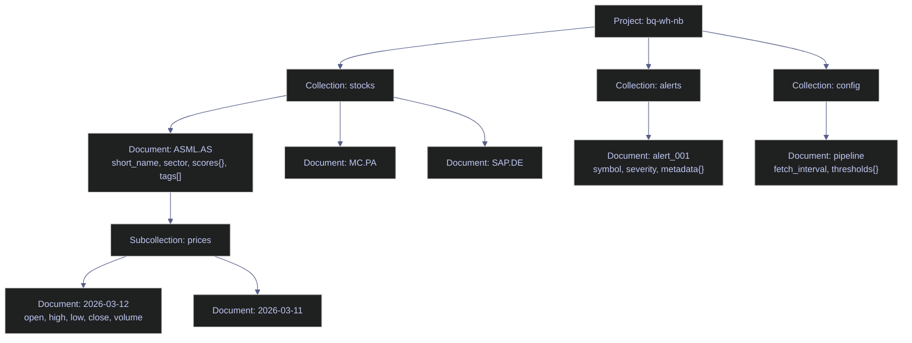

# Firestore for Data Engineering — C#

> [!quote]+
>
> "The value of a database is in direct proportion to the ease with which data can be stored and retrieved."
>
> — **Edgar F. Codd**, *A Relational Model of Data for Large Shared Data Banks* (1970)

> [!abstract]- Summary
>
> This note is the C# parity layer for the Firestore chapter: it mirrors the Python Firestore workflows for reads, writes, listeners, and maintenance, but adds typed POCO mapping with `Google.Cloud.Firestore` plus a REST fallback path for .NET 10, where SDK reads and listeners are currently broken.
>
> **Connection, typing, and compatibility**
> - covers SDK initialization, REST client setup, ADC authentication, `[FirestoreData]` / `[FirestoreProperty]` mapping, and the .NET 10 read/listener/aggregation workaround boundary
>
> **Reads, filters, and document navigation**
> - covers single-document fetches, full collection reads, structured REST queries, filtering and ordering, nested-field and array predicates, subcollections, collection-group queries, and pagination with cursors and offsets
>
> **Writes and consistency**
> - covers `SetAsync`, `UpdateAsync`, deletes, server timestamps, `WriteBatch`, transactions, document-size and throughput limits, and overwrite semantics
>
> **Live operations and observability**
> - covers real-time listeners on supported .NET versions, REST-based aggregation queries, collection health checks, stale-document detection, failed-run analysis, and raw-type inspection in maintenance code
>
> **Operations and safety**
> - Warnings: .NET 10 SDK read incompatibility, local-dev key files, token-expiry handling for REST, asynchronous index builds, per-document read billing, one-array-filter limits, 500-operation batch and transaction ceilings, non-cascading deletes, and listener failures on .NET 10
> - Recommendations table: 7 defaults covering .NET version choice, reusable REST helpers, typed documents, index deployment, batch writes, error handling, and exporting analytical workloads to BigQuery
> - Troubleshooting: 8 failure modes covering missing methods on .NET 10, missing indexes, empty REST results, transaction aborts, expired bearer tokens, oversized batches, silent listener issues, and malformed aggregation JSON

> [!note]- Glossary
>
> **`Google.Cloud.Firestore` SDK**
> - Google's official .NET client library for Firestore, supporting async CRUD operations, typed document mapping, transactions, and snapshot listeners.
> - It matters because the note uses the SDK as the primary C# surface whenever the runtime version supports reliable read behavior.
>
> > [!warning] Runtime version matters
> >
> > The same SDK code path does not behave identically across .NET versions in this note. On .NET 10, several read-oriented features fail even though writes still succeed.
>
> ---
>
> **Firestore REST API**
> - Firestore's HTTP/JSON interface for querying, aggregation, and document operations outside the SDK.
> - It matters because the note relies on the REST API as the practical fallback for read workloads when the .NET SDK is blocked.
>
> > [!warning] The payloads are Firestore-shaped
> >
> > REST responses do not look like plain JSON documents. Each field is wrapped in Firestore's typed JSON format, so parsing code has to understand `stringValue`, `doubleValue`, `mapValue`, and related wrappers.
>
> ---
>
> **`[FirestoreData]` / `[FirestoreProperty]`**
> - Attributes that map a POCO class and its properties to Firestore document fields.
> - It matters because typed mapping is one of the main ergonomic advantages of the C# SDK over dictionary-driven code.
>
> > [!warning] Mapping failures can look like empty data
> >
> > Missing attributes, inaccessible setters, or constructor issues often surface as null or default-valued properties rather than obvious compile errors. The class contract has to be compatible with the serializer.
>
> ---
>
> **Structured query**
> - The JSON query shape used by Firestore REST `runQuery`, defining collection scope, filters, ordering, and pagination.
> - It matters because complex reads in the note often need to be expressed in structured-query JSON rather than in SDK fluent syntax.
>
> > [!warning] Predicate trees are nested
> >
> > The REST `where` clause is not a flat expression string. Compound logic lives under nested filter objects, which makes manual JSON construction easy to get wrong without helper methods.
>
> ---
>
> **`WriteBatch`**
> - The C# SDK type for accumulating up to 500 write operations into a single atomic commit.
> - It matters because the note uses `WriteBatch` to reduce network round trips and keep related document changes all-or-nothing.
>
> > [!warning] Atomic still has a size limit
> >
> > A batch is convenient, but it does not scale indefinitely. Once the write count passes 500, the commit fails instead of partially succeeding.
>
> ---
>
> **Transaction**
> - A Firestore read-then-write unit of work executed atomically, typically created with `RunTransactionAsync`.
> - It matters because the note uses transactions for conditional updates and lost-update protection when the current stored value influences the next write.
>
> > [!warning] Read order is enforced
> >
> > Firestore transactions are not arbitrary scripts. Reads must complete before writes begin, which means the control flow has to be designed around that constraint.
>
> ---
>
> **Application Default Credentials**
> - Google's standard credential-resolution flow used by both the .NET SDK and the REST helper code.
> - It matters because the authentication approach in the note depends on ADC rather than on embedding long-lived secrets in code or notebook cells.
>
> > [!warning] REST calls also need tokens
> >
> > ADC gets you the underlying credential source, but raw REST requests still need an `Authorization: Bearer ...` header. The helper layer has to request and refresh that token explicitly.
>
> ---
>
> **Composite index**
> - A Firestore index spanning multiple fields so compound filters and filter-plus-order queries can execute.
> - It matters because several queries in the note fail until the matching composite index definition has been deployed.
>
> > [!warning] Index planning is part of query design
> >
> > In Firestore, a new query pattern often implies new index work. Unlike SQL engines that may limp along with a slower plan, Firestore commonly refuses the query until the index exists.
>
> ---
>
> **Collection group query**
> - A Firestore query that searches every subcollection sharing the same name across all parent documents.
> - It matters because the note uses collection-group reads to analyze price documents across all stocks without flattening them into one collection.
>
> > [!info] Cross-parent search stays hierarchical
> >
> > Collection-group queries are Firestore's way to search repeated subcollection structures globally while keeping the write model nested under each parent document.
>
> ---
>
> **Snapshot listener**
> - A live subscription that pushes document or query changes to client code as they happen.
> - It matters because real-time update flow is one of Firestore's core strengths, but in this note it is also one of the features affected by the .NET 10 incompatibility.
>
> > [!warning] Version support is not uniform
> >
> > Listener code that works on .NET 8 or .NET 9 may fail outright on .NET 10 in the current SDK state. Real-time features are therefore part runtime concern and part code concern.
>
> ---
>
> **Bearer token**
> - A short-lived OAuth access token attached to REST requests in the `Authorization` header.
> - It matters because the REST workaround in the note only works if token acquisition and refresh are handled correctly for long-running sessions.
>
> > [!warning] Tokens expire quietly
> >
> > A notebook that keeps running longer than the token lifetime will eventually start receiving 401 responses unless the helper refreshes credentials. Authentication success at startup is not enough.

> [!danger] .NET 10 Breaks Firestore SDK Reads
>
> On .NET 10, the `Google.Cloud.Firestore` SDK fails on document reads, real-time listeners, and aggregation queries due to a missing `AsyncInterfaces` assembly. Writes work normally. This page uses the Firestore REST API as a workaround for reads. Check for SDK updates before upgrading to .NET 10 in production.

> [!success] Safe Pattern
>
> Stay on .NET 8 or .NET 9 for production Firestore workloads until the SDK ships a .NET 10-compatible release. For .NET 10 notebooks or exploratory code, use the Firestore REST API (`runQuery` / `runAggregationQuery`) as shown throughout this page. Writes via `SetAsync` / `UpdateAsync` are unaffected and can be used normally.

| Collection | Description | Key Features |
|---|---|---|
| `stocks` | 50 Euro Stoxx constituents | Nested maps, arrays, booleans |
| `stocks/*/prices` | 30-day OHLCV per symbol | Subcollections |
| `sectors` | Aggregated sector scores | Arrays of symbols |
| `alerts` | Pipeline alerts | Mixed severities, timestamps |
| `pipeline_runs` | Audit log | Array of maps (steps) |
| `watchlists` | User watchlists | Ownership, public/private |
| `config` | App configuration | Singleton documents |



1. Setup & Connection
2. Read Operations
3. Filtering & Ordering
4. Nested Fields & Arrays
5. Subcollections
6. Write Operations
7. Batch Operations & Transactions
8. Real-Time Listeners
9. Aggregation Queries
10. Collection Group Queries
11. Pagination & Cursors
12. Maintenance & Monitoring

## Setup & Connection

Initializes the Firestore SDK and REST clients, defines field extraction and index management utilities, and verifies the connection to the `bq-wh-nb` project.

### C# | Polyglot Notebook | suppress assembly warnings

#### C# | suppress CS1701 assembly version warnings

First cell in every C# Polyglot Notebook session using NuGet packages on .NET 10. It is typically triggered by opening a new notebook or restarting the kernel. Kernel configuration — modifies warning level via reflection on `CSharpKernel`. No side effects on Firestore state. Eliminate CS1701 noise from subsequent output cells so real errors are visible.

The Polyglot Notebooks kernel emits CS1701 assembly version warnings when loading NuGet packages on .NET 10. This cell suppresses them globally so subsequent output stays clean.

*Suppress CS1701 assembly version warnings in the Polyglot Notebooks C# kernel.*

```csharp
using System.Reflection;
using Microsoft.DotNet.Interactive;
using Microsoft.DotNet.Interactive.CSharp;

var csharpKernel = (CSharpKernel)Kernel.Root.FindKernelByName("csharp");
var optionsField = typeof(CSharpKernel).GetField("_scriptOptions",
    BindingFlags.NonPublic | BindingFlags.Instance);
if (optionsField != null)
{
    dynamic opts = optionsField.GetValue(csharpKernel);
    optionsField.SetValue(csharpKernel, opts.WithWarningLevel(0));
}
Console.WriteLine("Warnings suppressed");
```

```text
Warnings suppressed
```

### C# | Firestore SDK + REST | client initialization

This cell:

1. Loads `Google.Cloud.Firestore` and `Microsoft.Bcl.AsyncInterfaces` NuGet packages
2. Sets `GOOGLE_APPLICATION_CREDENTIALS` to the service account key
3. Creates a `FirestoreDb` client and an HTTP client with OAuth2 token for REST API calls
4. Defines a `RestQuery()` helper that sends structured queries to the Firestore REST API

> [!warning] .NET 10 SDK Read Failure
>
> On .NET 10, Firestore SDK reads fail due to a missing `AsyncInterfaces` assembly. Writes work fine. For reads, we use the Firestore REST API as a workaround.

> [!success] Safe Pattern
>
> Add `#r "nuget: Microsoft.Bcl.AsyncInterfaces"` before loading the Firestore SDK, and use the REST client (`HttpClient` + OAuth2 token) for all collection reads. Single-document reads via `GetSnapshotAsync()` work normally on .NET 10.

> [!warning] Key File for Local Dev Only
>
> Setting `GOOGLE_APPLICATION_CREDENTIALS` to a local key file works for development but is a security liability. On production VMs and Cloud Run, remove this env var — the metadata server provides credentials automatically. See [gcp-identity-and-connection-patterns > Metadata Server](https://alp78.github.io/elysium/06-GCP/Security/gcp-identity-and-connection-patterns#metadata-server-gce-vms-cloud-run--the-production-standard).

> [!success] Safe Pattern
>
> Store the key path in a `.env` file excluded from version control, and never commit `gcp-*-key.json` to git. In production, rely on the metadata server — no env var or key file needed.

> [!info] Two Clients — SDK and REST
>
> - **SDK client** — used for writes and single-document reads on .NET 10. Collection-level reads fail on .NET 10 due to a missing `AsyncInterfaces` assembly but work normally on .NET 8/9. Both SDK and REST versions are demonstrated throughout this page.
> - **REST client** — used for collection reads, filtered queries, and collection group queries. This is the .NET 10 workaround; in .NET 8/9 the SDK handles everything.

#### C# | Firestore SDK + REST | load packages, create FirestoreDb, HTTP client, and OAuth2 token

Once per session, immediately after the warning suppression cell. It is typically triggered by starting a new notebook session or after kernel restart. Session initialization — sets credentials, creates SDK client and REST HTTP client. Must run before any read or write cell. Provide both `db` (SDK) and `http` + `token` (REST) clients that all subsequent cells depend on.

*Load NuGet packages, construct `FirestoreDb`, an `HttpClient`, and an OAuth2 access token for REST calls.*

```csharp
#r "nuget: Microsoft.Bcl.AsyncInterfaces, 10.0.0"
#r "nuget: Google.Cloud.Firestore"

using Google.Cloud.Firestore;
using System.Collections.Generic;
using System.Net.Http;
using System.Net.Http.Headers;
using System.Text;
using System.Text.Json;

Environment.SetEnvironmentVariable("GOOGLE_APPLICATION_CREDENTIALS",
    @"C:\Users\aperi\DEV\LANG\gcp-bq-key.json");

var db = FirestoreDb.Create("bq-wh-nb");

var credential = Google.Apis.Auth.OAuth2.GoogleCredential.GetApplicationDefault()
    .CreateScoped("https://www.googleapis.com/auth/datastore");
var token = await credential.UnderlyingCredential.GetAccessTokenForRequestAsync();
var http = new HttpClient();
http.DefaultRequestHeaders.Authorization = new AuthenticationHeaderValue("Bearer", token);

var baseUrl = "https://firestore.googleapis.com/v1/projects/bq-wh-nb/databases/(default)/documents";

Console.WriteLine("Connected to Firestore (SDK + REST).");
```

```text
Installed Packages: Google.Cloud.Firestore, 4.2.0, Microsoft.Bcl.AsyncInterfaces, 10.0.5
Connected to Firestore (SDK + REST).
```

### C# | Firestore SDK | connect to a named database — `FirestoreDbBuilder`

The setup above creates both an SDK client and a REST client for the `(default)` database. When targeting a **named database** (e.g. `main`), use `FirestoreDbBuilder` with an explicit `DatabaseId`. This approach is SDK-only and does not require a REST client.

#### C# | FirestoreDbBuilder | connect to a named database

When targeting a named database (not `(default)`) in a multi-database project. It is typically triggered by project uses named databases (e.g., `main`, `staging`, `analytics`) instead of the default. SDK-only; no REST equivalent. Read-only setup — does not modify Firestore state. Return a `FirestoreDb` pointing to the named database so all subsequent SDK calls target the correct instance.

*Connect to a named Firestore database using `FirestoreDbBuilder` with `DatabaseId`.*

```csharp
var dbMain = new FirestoreDbBuilder { ProjectId = "bq-wh-nb", DatabaseId = "main" }.Build();
```

### C# | Firestore REST API | query helper — `RestQuery()`

Firestore REST API uses **structured queries** — a JSON body describing the filter,
ordering, and limit. This helper sends the query and returns a list of parsed document elements.

This cell:

1. Defines `RestQuery(queryJson)` — sends a POST to `{baseUrl}:runQuery`
2. Parses the JSON response array
3. Extracts only items that have a `document` property (skips empty results)
4. Returns a `List<JsonElement>` of Firestore documents

Used by all filter/query cells below.

#### C# | REST API | define RestQuery() helper

Once per session, after client initialization. It is typically triggered by session setup — required before any cell that uses `RestQuery()`. Defines a local helper function in the notebook kernel. No Firestore writes. Used by all filtered query cells below. Provide a reusable `RestQuery(queryJson)` wrapper that handles POST, JSON parsing, and document extraction so query cells stay concise.

*Define `RestQuery()` to POST a structured query to `runQuery` and return the parsed document fields.*

```csharp
async Task<List<JsonElement>> RestQuery(string queryJson)
{
    var resp = await http.PostAsync(
        $"{baseUrl}:runQuery",
        new StringContent(queryJson, Encoding.UTF8, "application/json"));

    var body = await resp.Content.ReadAsStringAsync();
    var results = JsonDocument.Parse(body).RootElement;

    var docs = new List<JsonElement>();
    foreach (var item in results.EnumerateArray())
        if (item.TryGetProperty("document", out var doc))
            docs.Add(doc);
    return docs;
}

Console.WriteLine("RestQuery() helper loaded.");
```

```text
RestQuery() helper loaded.
```

### C# | Firestore REST API | field extraction helpers

Firestore REST API wraps every field value in a type envelope:

```json
{ "current_price": { "doubleValue": 178.50 } }
{ "symbol": { "stringValue": "ASML.AS" } }
{ "is_active": { "booleanValue": true } }
{ "volume": { "integerValue": "1500000" } }
```

These helpers unwrap the type envelope and return the native C# value.
Without them, every field access would need 2 levels of `TryGetProperty()`.

#### C# | REST API | define GetStr, GetDbl, GetBool, GetInt field helpers

Once per session, after client initialization and before any REST read cell. It is typically triggered by session setup — all REST field extraction depends on these helpers. Defines local helper functions in the notebook kernel. Pure read helpers; no Firestore writes. Unwrap Firestore's REST type envelopes (`stringValue`, `doubleValue`, `booleanValue`, `integerValue`) into native C# types without boilerplate in every query cell.

*Define `GetStr`, `GetDbl`, `GetBool`, and `GetInt` helpers that unwrap the Firestore REST type envelope.*

```csharp
string GetStr(JsonElement fields, string key) =>
    fields.TryGetProperty(key, out var v) && v.TryGetProperty("stringValue", out var s)
        ? s.GetString() ?? "" : "";

double GetDbl(JsonElement fields, string key) =>
    fields.TryGetProperty(key, out var v) && v.TryGetProperty("doubleValue", out var d)
        ? d.GetDouble() : 0;

bool GetBool(JsonElement fields, string key) =>
    fields.TryGetProperty(key, out var v) && v.TryGetProperty("booleanValue", out var b)
        && b.GetBoolean();

long GetInt(JsonElement fields, string key) =>
    fields.TryGetProperty(key, out var v) && v.TryGetProperty("integerValue", out var i)
        ? long.Parse(i.GetString() ?? "0") : 0;

Console.WriteLine("Field extraction helpers loaded: GetStr, GetDbl, GetBool, GetInt");
```

```text
Field extraction helpers loaded: GetStr, GetDbl, GetBool, GetInt
```

### C# | Firestore Admin REST API | index utility — `EnsureIndex()`

Firestore requires **explicit indexes** for:

- **Compound queries**: filtering on two fields (e.g., `country == "Germany"` AND `price < 200`)
- **Collection group queries**: querying across all subcollections with the same name

Single-field queries on a single collection work out of the box (auto-indexed).

This utility:

1. Calls the Firestore Admin REST API to create a composite index
2. Polls until the index state is `READY`
3. For single-field collection group indexes, creates a **field exemption** via PATCH
4. Is **idempotent** — safe to call multiple times

Called automatically before queries that need an index.

#### C# | Admin REST API | set base URL for index management

Once per session, before any cell that calls `EnsureIndex()` or `EnsureFieldExemption()`. It is typically triggered by session setup — required by the index management utilities. Variable assignment only; no HTTP calls made. Admin API requires the same ADC credentials as the data API. Store the Admin API base URL so index utility functions reference the correct project and database without repeating the path.

The Firestore Admin REST API manages index creation and field exemptions. The base URL encodes both the project ID and database name.

*Set the Admin API base URL used by `EnsureIndex()` and `EnsureFieldExemption()`.*

```csharp
var adminBaseUrl = "https://firestore.googleapis.com/v1/"
    + "projects/bq-wh-nb/databases/(default)";
```

#### C# | Admin REST API | EnsureIndex() — create composite or collection group indexes

Before the first query that requires a composite or collection group index, and in session setup. It is typically triggered by A compound filter or collection group query is about to run and the index may not exist yet. Admin REST API call — creates index resources in Firestore. Idempotent; safe to call repeatedly. Polls until index reaches `READY` state before returning. Guarantee the required index exists and is ready before the dependent query executes, preventing `FAILED_PRECONDITION` errors.

Routes to the correct method based on field count and scope. Multi-field indexes use POST to the indexes endpoint. Single-field collection group indexes use the field exemption PATCH endpoint. Idempotent — safe to call multiple times.

*Define `EnsureIndex()` to create composite or collection group indexes via the Admin REST API.*

```csharp
async Task EnsureIndex(string collection,
    (string fieldPath, string order)[] fields,
    string scope = "COLLECTION")
{
    var fieldNames = string.Join(" + ",
        fields.Select(f => f.fieldPath));

    // Single-field collection group → field exemption
    if (scope == "COLLECTION_GROUP" && fields.Length == 1)
    {
        await EnsureFieldExemption(
            collection, fields[0].fieldPath, fields[0].order);
        return;
    }

    // Multi-field → POST to Admin API indexes endpoint
    var parent = $"{adminBaseUrl}/collectionGroups/{collection}";
    var fieldsArr = fields.Select(f =>
        "{" + $"\"fieldPath\": \"{f.fieldPath}\", "
            + $"\"order\": \"{f.order}\"" + "}");
    var body = "{\"queryScope\": \"" + scope
        + "\", \"fields\": ["
        + string.Join(",", fieldsArr) + "]}";
```

> [!warning] Index Build Is Asynchronous
>
> `create_index` returns immediately. The index is not usable until it reaches `READY` state. The polling loop checks every 5 seconds for up to 2.5 minutes.

> [!success] Safe Pattern
>
> Always call `EnsureIndex()` before the first query that requires a composite index. The helper polls for `READY` state before returning, so the subsequent query is guaranteed to find the index available. In production CI, pre-create all required indexes via `gcloud firestore indexes composite create` and include them in the deployment pipeline.

*POST the composite index creation request and poll the long-running operation until ready.*

```csharp
    var resp = await http.PostAsync($"{parent}/indexes",
        new StringContent(body, Encoding.UTF8, "application/json"));
    var respText = await resp.Content.ReadAsStringAsync();

    if (resp.IsSuccessStatusCode)
        Console.Write($"  Building index: {collection}/{fieldNames}...");
    else if (respText.Contains("already exists"))
        Console.Write($"  Index exists: {collection}/{fieldNames}...");
    else
    {
        Console.WriteLine($"  Index error: "
            + respText[..Math.Min(150, respText.Length)]);
        return;
    }

    // Poll until no indexes are CREATING
    for (int attempt = 0; attempt < 30; attempt++)
    {
        await Task.Delay(5000);
        Console.Write(".");
        var listResp = await http.GetAsync($"{parent}/indexes");
        var listText = await listResp.Content.ReadAsStringAsync();
        if (!listText.Contains("CREATING"))
            { Console.WriteLine(" ready!"); return; }
    }
    Console.WriteLine(" timeout");
}
```

#### C# | Admin REST API | EnsureFieldExemption() — single-field collection group exemption

Before any collection group query that filters or orders by a single field across subcollections. It is typically triggered by A `CollectionGroup` query is planned on a field that Firestore has not auto-indexed for `COLLECTION_GROUP` scope. Admin REST PATCH call — modifies field index config. Preserves existing `COLLECTION`-scoped indexes before applying changes. Idempotent. Enable cross-subcollection queries on a specific field without creating a full composite index, satisfying Firestore's collection group query requirements.

Firestore auto-indexes single fields for `COLLECTION` scope only. For `COLLECTION_GROUP` queries, a field exemption must be created via PATCH. This function checks if the exemption already exists and waits if it is still building.

*Define `EnsureFieldExemption()` to create single-field collection group index exemptions via REST.*

```csharp
async Task EnsureFieldExemption(
    string collection, string fieldPath, string order)
{
    var url = $"{adminBaseUrl}/collectionGroups/"
        + $"{collection}/fields/{fieldPath}";

    // Check if exemption already exists
    var getResp = await http.GetAsync(url);
    var getText = await getResp.Content.ReadAsStringAsync();
    if (getText.Contains("COLLECTION_GROUP"))
    {
        if (getText.Contains("CREATING"))
        {
            Console.Write($"  Field exemption building: "
                + $"{collection}/{fieldPath}...");
            for (int i = 0; i < 30; i++)
            {
                await Task.Delay(5000);
                Console.Write(".");
                var check = await (await http.GetAsync(url))
                    .Content.ReadAsStringAsync();
                if (!check.Contains("CREATING"))
                    { Console.WriteLine(" ready!"); return; }
            }
            Console.WriteLine(" timeout");
        }
        else
            Console.WriteLine($"  Field exemption ready: "
                + $"{collection}/{fieldPath}");
        return;
    }
```

> [!warning] Preserve Existing COLLECTION Indexes
>
> The PATCH request replaces the entire index config for the field. Existing `COLLECTION`-scoped indexes must be included in the body or they will be deleted.

> [!success] Safe Pattern
>
> Always GET the current field config before issuing a PATCH, extract all existing `COLLECTION`-scoped index entries, and include them in the new PATCH body alongside the new `COLLECTION_GROUP` entries. The `EnsureFieldExemption()` helper in this page does this correctly.

*Fetch and preserve existing COLLECTION-scoped indexes before PATCHing the field config.*

```csharp
    // Preserve existing COLLECTION indexes
    var existing = new List<string>();
    if (getResp.IsSuccessStatusCode)
    {
        var doc = JsonDocument.Parse(getText);
        if (doc.RootElement.TryGetProperty("indexConfig", out var ic)
            && ic.TryGetProperty("indexes", out var idxArr))
            foreach (var idx in idxArr.EnumerateArray())
                if (idx.TryGetProperty("queryScope", out var qs)
                    && qs.GetString() == "COLLECTION")
                    existing.Add(idx.GetRawText());
    }
```

*Build the PATCH body with existing COLLECTION indexes plus new COLLECTION_GROUP entries, then poll until the exemption is ready.*

```csharp
    // Build PATCH body: keep COLLECTION + add COLLECTION_GROUP
    var cgAsc = "{\"queryScope\": \"COLLECTION_GROUP\", "
        + $"\"fields\": [{{\"fieldPath\": \"{fieldPath}\", "
        + "\"order\": \"ASCENDING\"}]}";
    var cgDesc = "{\"queryScope\": \"COLLECTION_GROUP\", "
        + $"\"fields\": [{{\"fieldPath\": \"{fieldPath}\", "
        + "\"order\": \"DESCENDING\"}]}";
    var allIndexes = string.Join(",",
        existing.Concat(new[] { cgAsc, cgDesc }));
    var patchBody = $"{{\"indexConfig\": {{\"indexes\": "
        + $"[{allIndexes}]}}}}";

    Console.Write($"  Creating field exemption: "
        + $"{collection}/{fieldPath}...");
    var req = new HttpRequestMessage(HttpMethod.Patch, url)
    {
        Content = new StringContent(
            patchBody, Encoding.UTF8, "application/json")
    };
    var patchResp = await http.SendAsync(req);
    if (!patchResp.IsSuccessStatusCode)
    {
        var err = await patchResp.Content.ReadAsStringAsync();
        Console.WriteLine($" error: "
            + err[..Math.Min(150, err.Length)]);
        return;
    }

    // Poll until READY (timeout 2.5 minutes)
    for (int i = 0; i < 30; i++)
    {
        await Task.Delay(5000); Console.Write(".");
        var check = await (await http.GetAsync(url))
            .Content.ReadAsStringAsync();
        if (check.Contains("COLLECTION_GROUP")
            && !check.Contains("CREATING"))
            { Console.WriteLine(" ready!"); return; }
    }
    Console.WriteLine(" timeout");
}

Console.WriteLine("EnsureIndex() utility loaded.");
```

```text
EnsureIndex() utility loaded.
```

### C# | Firestore REST API | verify connection — list collections

Run this after setup to confirm the connection works and data is populated.

#### C# | REST API | count documents per collection

After client initialization to confirm the connection and data population are correct. It is typically triggered by session startup or after seeding/resetting the Firestore dataset. REST GET calls — read-only, no state changes. Requires `http` client and `baseUrl` from setup. Verify connectivity to Firestore and confirm expected document counts in each collection before running queries.

Calls the REST API for each known collection with `pageSize=1000`, counts documents in each JSON response, and prints a summary table.

*Iterate each collection and print its document count to verify connectivity.*

```csharp
Console.WriteLine("=== Firestore Collections ===");
foreach (var coll in new[] { "stocks", "sectors", "alerts", "pipeline_runs", "watchlists", "config" })
{
    var r = await http.GetAsync($"{baseUrl}/{coll}?pageSize=1000");
    var j = JsonDocument.Parse(await r.Content.ReadAsStringAsync());
    var count = j.RootElement.TryGetProperty("documents", out var d) ? d.GetArrayLength() : 0;
    Console.WriteLine($"  {coll,-20} {count,5} documents");
}
```

```text
=== Firestore Collections ===
  stocks                  50 documents
  sectors                 10 documents
  alerts                  20 documents
  pipeline_runs           15 documents
  watchlists               3 documents
  config                   2 documents
```

## Read Operations

Covers single-document reads, multi-document fetches, and full-collection list operations using the SDK on .NET 8/9 and the REST API on .NET 10.

**`stocks` collection — field reference**

| Field | Type | Description |
|---|---|---|
| `short_name` | string | Display name of the stock (e.g., "ASML HOLDING") |
| `sector` | string | Industry classification (e.g., "Technology", "Financial Services") |
| `country` | string | Country of listing (e.g., "Germany", "France", "Netherlands") |
| `current_price` | float | Most recent closing price in EUR |
| `is_active` | bool | Whether the stock is currently in the index |
| `index_weight` | float | Proportional weight in the Euro Stoxx 50 index (all weights sum to 1.0) |
| `symbol` | string | Ticker symbol used as the document ID (e.g., "ASML.AS") |
| `scores` | map | Nested map with `composite` (float), `momentum` (float), `value` (float), `sentiment` (float), `rank` (int) |
| `tags` | array | List of lowercase classification tags (e.g., `["technology", "netherlands", "euro_stoxx_50"]`) |

### C# | Firestore SDK | get a single document by ID

#### C# | Firestore SDK | fetch a document and read its fields

When you need to inspect a specific stock's flat fields, nested map, and array in a single round-trip. It is typically triggered by ad-hoc inspection, pipeline health check, or debugging a specific stock document. SDK read on `.NET 8/9` (and single-document reads work on .NET 10). Read-only; no state changes. Demonstrate full field-type coverage: flat string/double/bool, nested `scores` map via `GetValue<Dictionary>`, and `tags` array.

This cell:

1. Fetches `stocks/ASML.AS` via SDK `GetSnapshotAsync()`
2. Extracts flat fields: `short_name` (string), `current_price` (double), `is_active` (bool)
3. Extracts nested map: `scores` with `composite`, `momentum`, `rank`
4. Extracts array: `tags`

*Fetch `stocks/ASML.AS` with the SDK and read flat, nested, and array fields.*

```csharp
var doc = await db.Collection("stocks").Document("ASML.AS").GetSnapshotAsync();

if (doc.Exists)
{
    Console.WriteLine($"Document: {doc.Id}");
    Console.WriteLine($"  Short name: {doc.GetValue<string>("short_name")}");
    Console.WriteLine($"  Sector:     {doc.GetValue<string>("sector")}");
    Console.WriteLine($"  Price:      {doc.GetValue<double>("current_price")}");
    Console.WriteLine($"  Active:     {doc.GetValue<bool>("is_active")}");

    var scores = doc.GetValue<Dictionary<string, object>>("scores");
    Console.WriteLine($"  Scores:     composite={scores["composite"]}, rank={scores["rank"]}");

    var tags = doc.GetValue<List<object>>("tags");
    Console.WriteLine($"  Tags:       [{string.Join(", ", tags)}]");
}
```

```text
Document: ASML.AS
  Short name: ASML HOLDING
  Sector:     Technology
  Price:      1191.2
  Active:     True
  Scores:     composite=0.17610432350282, rank=19
  Tags:       [technology, netherlands, euro_stoxx_50]
```

### C# | Firestore SDK + REST | list documents (top 10)

Both the `Google.Cloud.Firestore` SDK and the REST API can list documents from a collection. The SDK version is more concise; the REST version works on .NET 10 where SDK collection reads are broken.

#### C# | Firestore SDK | list first 10 documents

To spot-check stock data or verify collection population on .NET 8/9. It is typically triggered by collection health check or exploratory data inspection at the start of a session. SDK collection read — works on .NET 8/9; fails on .NET 10 due to `AsyncInterfaces` issue. Read-only. List the first 10 stock documents with symbol, name, and price to confirm expected data is present.

Fetches the first 10 stock documents using `Limit(10).GetSnapshotAsync()` and prints symbol, name, and price from each snapshot.

*Stream the first 10 `stocks` documents using the SDK.*

```csharp
var snapshot = await db.Collection("stocks").Limit(10).GetSnapshotAsync();

Console.WriteLine("=== Stocks (top 10) ===");
foreach (var doc in snapshot.Documents)
{
    Console.WriteLine($"  {doc.Id,-12} {doc.GetValue<string>("short_name"),-20} price={doc.GetValue<double>("current_price"),8:F2}");
}
```

```text
=== Stocks (top 10) ===
  ABI.BR       AB INBEV             price=   62.76
  AD.AS        KONINKLIJKE AHOLD DELHAIZE N.V. price=   41.04
  ADS.DE       adidas AG            price=  140.10
  ADYEN.AS     ADYEN                price=  923.10
  AI.PA        AIR LIQUIDE          price=  168.02
  AIR.PA       AIRBUS SE            price=  176.02
  ALV.DE       Allianz SE           price=  348.80
  ARGX.BR      ARGENX SE            price=  626.60
  ASML.AS      ASML HOLDING         price= 1191.20
  BAS.DE       BASF SE              price=   47.74
```

#### C# | REST API | list first 10 documents

To spot-check stock data on .NET 10 where SDK collection reads are unavailable. It is typically triggered by collection health check or exploratory data inspection at the start of a .NET 10 session. REST GET call — works on all .NET versions including .NET 10. Read-only. List the first 10 stock documents with symbol, name, and price as the .NET 10-safe alternative to the SDK version above.

Calls REST API `GET .../documents/stocks?pageSize=10`, parses the JSON response, and extracts symbol, short_name, and price from each document.

*List the first 10 `stocks` documents via the REST API with `pageSize=10`.*

```csharp
var listResp = await http.GetAsync($"{baseUrl}/stocks?pageSize=10");
var listJson = JsonDocument.Parse(await listResp.Content.ReadAsStringAsync());

Console.WriteLine("=== Stocks (top 10) ===");
if (listJson.RootElement.TryGetProperty("documents", out var docs))
{
    foreach (var fdoc in docs.EnumerateArray())
    {
        var name = fdoc.GetProperty("name").GetString().Split("/")[^1];
        var fields = fdoc.GetProperty("fields");
        Console.WriteLine($"  {name,-12} {GetStr(fields, "short_name"),-20} price={GetDbl(fields, "current_price"),8:F2}");
    }
}
```

```text
=== Stocks (top 10) ===
  ABI.BR       AB INBEV             price=   62.76
  AD.AS        KONINKLIJKE AHOLD DELHAIZE N.V. price=   41.04
  ADS.DE       adidas AG            price=  140.10
  ADYEN.AS     ADYEN                price=  923.10
  AI.PA        AIR LIQUIDE          price=  168.02
  AIR.PA       AIRBUS SE            price=  176.02
  ALV.DE       Allianz SE           price=  348.80
  ARGX.BR      ARGENX SE            price=  626.60
  ASML.AS      ASML HOLDING         price= 1191.20
  BAS.DE       BASF SE              price=   47.74
```

### C# | Firestore SDK | get multiple documents by ID

#### C# | Firestore SDK | fetch multiple documents individually

When you need specific documents by known ID and round-trip count is acceptable. It is typically triggered by targeted multi-document lookup by symbol list — not a filtered query. SDK individual `GetSnapshotAsync()` calls in a loop — works on .NET 10 for single-document reads. Read-only. Fetch 3 specific stock documents by symbol and print name and price; demonstrate that .NET 10 supports individual document reads via the SDK even when collection reads fail.

This cell:

1. Fetches 3 specific stocks (ASML, MC, SAP) in separate SDK calls
2. Prints name and price for each

> [!info] C# Requires Individual Fetch Calls
>
> Unlike Python's `db.get_all()` (one round-trip), the C# SDK requires individual `GetSnapshotAsync()` calls. In production on .NET 8/9, use `db.GetAllSnapshotsAsync()` for batch reads.

*Fetch multiple stock documents in a loop using the SDK.*

```csharp
Console.WriteLine("=== Multiple Documents ===");
foreach (var sym in new[] { "ASML.AS", "MC.PA", "SAP.DE" })
{
    var d = await db.Collection("stocks").Document(sym).GetSnapshotAsync();
    if (d.Exists)
        Console.WriteLine($"  {d.Id}: {d.GetValue<string>("short_name")} — {d.GetValue<double>("current_price"):F2}");
}
```

```text
=== Multiple Documents ===
  ASML.AS: ASML HOLDING — 1191.20
  MC.PA: LVMH — 494.40
  SAP.DE: SAP SE — 153.82
```

## Filtering & Ordering

Firestore supports equality, range, `IN`, `NOT-IN`, `array_contains`, and `array_contains_any` operators. Each query returns at most **1 MB** of data or **1,000 documents**, whichever limit is reached first. For larger result sets, use pagination with cursors.

| Operator | SDK Method | REST Operator | Description | Index Requirement |
|---|---|---|---|---|
| `==` | `WhereEqualTo()` | `EQUAL` | Exact equality match | Auto-indexed |
| `!=` | `WhereNotEqualTo()` | `NOT_EQUAL` | Not equal | Auto-indexed |
| `<` | `WhereLessThan()` | `LESS_THAN` | Less than | Auto-indexed; composite if combined with `OrderBy` on a different field |
| `>` | `WhereGreaterThan()` | `GREATER_THAN` | Greater than | Same as `<` |
| `<=` | `WhereLessThanOrEqualTo()` | `LESS_THAN_OR_EQUAL` | Less than or equal | Same as `<` |
| `>=` | `WhereGreaterThanOrEqualTo()` | `GREATER_THAN_OR_EQUAL` | Greater than or equal | Same as `>` |
| `in` | `WhereIn()` | `IN` | Matches any value in list (max 30) | Auto-indexed; composite with `OrderBy` |
| `not-in` | `WhereNotIn()` | `NOT_IN` | Excludes matching values (max 10) | Auto-indexed |
| `array_contains` | `WhereArrayContains()` | `ARRAY_CONTAINS` | Array field contains value | Auto-indexed; one per query |
| `array_contains_any` | `WhereArrayContainsAny()` | `ARRAY_CONTAINS_ANY` | Array contains any from list (max 30) | Auto-indexed; one per query |

> [!info] Cross-Engine — No JOINs in Firestore
>
> Firestore has no JOIN support. For relational-style queries across collections, denormalize the data model or perform client-side joins. BigQuery and SQL Server support all standard JOIN types; SQL Server adds `CROSS APPLY` / `OUTER APPLY`.

### C# | Firestore SDK + REST | equality filter

> [!warning] Reads Billed per Document Returned
>
> A query returning 10,000 documents costs 10,000 read operations regardless of field projections. Use filters aggressively and apply limits for list operations.

> [!success] Safe Pattern
>
> Always add a `limit` to list queries. For counts and aggregates, use `runAggregationQuery` (REST) or `Count().GetSnapshotAsync()` (.NET 8/9) — aggregation queries cost one read regardless of how many documents they scan.

Both the SDK and REST API support equality filters. The SDK uses `WhereEqualTo()`; the REST API uses a `fieldFilter` with `EQUAL` operator.

#### C# | Firestore SDK | equality filter — stocks by country

To list all stocks belonging to a specific country on .NET 8/9. It is typically triggered by country-level breakdown or validation that all German constituents are present. SDK `WhereEqualTo` query — collection read; fails on .NET 10. Read-only; uses auto-index. Return all stocks matching a single-field equality filter ordered by Firestore's default document ID order.

Filters stocks where `country == "Germany"` using `WhereEqualTo()` and limits to 15 results.

*Query `stocks` where `country == "Germany"` using the SDK's `WhereEqualTo`.*

```csharp
var germanDocs = await db.Collection("stocks")
    .WhereEqualTo("country", "Germany")
    .Limit(15)
    .GetSnapshotAsync();

Console.WriteLine("=== German Stocks ===");
foreach (var doc in germanDocs.Documents)
{
    Console.WriteLine($"  {doc.Id,-12} {doc.GetValue<string>("sector")}");
}
```

```text
=== German Stocks ===
  ADS.DE       Consumer Cyclical
  ALV.DE       Financial Services
  BAS.DE       Basic Materials
  BAYN.DE      Healthcare
  BMW.DE       Consumer Cyclical
  DB1.DE       Financial Services
  DHL.DE       Industrials
  DTE.DE       Communication Services
  ENR.DE       Industrials
  IFX.DE       Technology
  MBG.DE       Consumer Cyclical
  MUV2.DE      Financial Services
  RHM.DE       Industrials
  SAP.DE       Technology
  SIE.DE       Industrials
```

#### C# | REST API | equality filter — stocks by country

To list all stocks belonging to a specific country on .NET 10 (or as a REST reference pattern). It is typically triggered by country-level breakdown or constituent validation — .NET 10-safe workaround for the SDK version above. REST POST to `runQuery` — works on all .NET versions. Read-only; uses auto-index. Demonstrate the REST `fieldFilter` + `EQUAL` operator equivalent of `WhereEqualTo()` for single-field equality queries.

Sends a structured query to the REST API filtering `country == "Germany"` and returns German stocks with their sector.

*Query `stocks` where `country == "Germany"` using a REST structured query.*

```csharp
var germanQuery = @"{
    ""structuredQuery"": {
        ""from"": [{""collectionId"": ""stocks""}],
        ""where"": {
            ""fieldFilter"": {
                ""field"": {""fieldPath"": ""country""},
                ""op"": ""EQUAL"",
                ""value"": {""stringValue"": ""Germany""}
            }
        },
        ""limit"": 15
    }
}";

Console.WriteLine("=== German Stocks ===");
foreach (var fdoc in await RestQuery(germanQuery))
{
    var fields = fdoc.GetProperty("fields");
    Console.WriteLine($"  {fdoc.GetProperty("name").GetString().Split("/")[^1],-12} {GetStr(fields, "sector")}");
}
```

```text
=== German Stocks ===
  ADS.DE       Consumer Cyclical
  ALV.DE       Financial Services
  BAS.DE       Basic Materials
  BAYN.DE      Healthcare
  BMW.DE       Consumer Cyclical
  DB1.DE       Financial Services
  DHL.DE       Industrials
  DTE.DE       Communication Services
  ENR.DE       Industrials
  IFX.DE       Technology
  MBG.DE       Consumer Cyclical
  MUV2.DE      Financial Services
  RHM.DE       Industrials
  SAP.DE       Technology
  SIE.DE       Industrials
```

### C# | Firestore SDK + REST | range filter with ordering

Both the SDK and REST API support range filters with ordering. The SDK chains `WhereGreaterThan()` with `OrderByDescending()`; the REST API uses `GREATER_THAN` operator and `orderBy` in the structured query.

#### C# | Firestore SDK | range filter with ordering — price above threshold

To identify high-price constituents for portfolio concentration checks or display on .NET 8/9. It is typically triggered by price threshold screening — e.g., flagging stocks above a configurable price band. SDK `WhereGreaterThan` + `OrderByDescending` — requires a composite index when ordering on the same filtered field. Read-only. Return stocks above a price threshold in descending price order for high-value constituent inspection.

Filters stocks where `current_price > 500` and orders by price descending.

*Query `stocks` where `current_price > 500`, ordered descending, using the SDK.*

```csharp
var rangeDocs = await db.Collection("stocks")
    .WhereGreaterThan("current_price", 500)
    .OrderByDescending("current_price")
    .Limit(10)
    .GetSnapshotAsync();

Console.WriteLine("=== High-Price Stocks (>500) ===");
foreach (var doc in rangeDocs.Documents)
{
    Console.WriteLine($"  {doc.Id,-12} price={doc.GetValue<double>("current_price"):F2}");
}
```

```text
=== High-Price Stocks (>500) ===
  RMS.PA       price=1906.00
  RHM.DE       price=1552.00
  ASML.AS      price=1191.20
  ADYEN.AS     price=923.10
  ARGX.BR      price=626.60
  MUV2.DE      price=526.20
```

#### C# | REST API | range filter with ordering — price above threshold

To identify high-price constituents on .NET 10 or as a REST reference pattern. It is typically triggered by price threshold screening — .NET 10-safe alternative to the SDK version above. REST POST to `runQuery` with `GREATER_THAN` operator and `orderBy` clause. Read-only. Demonstrate the REST structured query equivalent of `WhereGreaterThan` + `OrderByDescending` for range filters with sorting.

Filters stocks where `current_price > 500` and orders by price descending using a structured query.

*Query `stocks` where `current_price > 500`, ordered descending, using a REST structured query.*

```csharp
var rangeQuery = @"{
    ""structuredQuery"": {
        ""from"": [{""collectionId"": ""stocks""}],
        ""where"": {
            ""fieldFilter"": {
                ""field"": {""fieldPath"": ""current_price""},
                ""op"": ""GREATER_THAN"",
                ""value"": {""doubleValue"": 500}
            }
        },
        ""orderBy"": [{""field"": {""fieldPath"": ""current_price""}, ""direction"": ""DESCENDING""}],
        ""limit"": 10
    }
}";

Console.WriteLine("=== High-Price Stocks (>500) ===");
foreach (var fdoc in await RestQuery(rangeQuery))
{
    var fields = fdoc.GetProperty("fields");
    Console.WriteLine($"  {fdoc.GetProperty("name").GetString().Split("/")[^1],-12} price={GetDbl(fields, "current_price"):F2}");
}
```

```text
=== High-Price Stocks (>500) ===
  RMS.PA       price=1906.00
  RHM.DE       price=1552.00
  ASML.AS      price=1191.20
  ADYEN.AS     price=923.10
  ARGX.BR      price=626.60
  MUV2.DE      price=526.20
```

### C# | Firestore SDK + REST | compound filters (AND)

Both the SDK and REST API support compound AND filters. The SDK chains multiple `Where*()` calls; the REST API uses a `compositeFilter` with `AND` operator. Both require a composite index.

#### C# | Firestore SDK | compound AND filter — country and price range

To screen constituents within a country-price band on .NET 8/9. It is typically triggered by multi-criteria screening — e.g., finding affordable French stocks for basket construction. SDK compound query — requires a composite index on `(country, current_price)`. Collection read; fails on .NET 10. Apply two simultaneous field filters with the SDK's chained `Where*()` API, demonstrating compound AND queries that need a composite index.

Filters French stocks priced under 200 by chaining `WhereEqualTo("country", "France")` and `WhereLessThan("current_price", 200)`.

*Combine multiple `WhereEqualTo` / `WhereLessThan` filters with the SDK for a compound AND query.*

```csharp
var compoundDocs = await db.Collection("stocks")
    .WhereEqualTo("country", "France")
    .WhereLessThan("current_price", 200)
    .Limit(10)
    .GetSnapshotAsync();

Console.WriteLine("=== French Stocks Under 200 ===");
foreach (var doc in compoundDocs.Documents)
{
    Console.WriteLine($"  {doc.Id,-12} {doc.GetValue<string>("short_name"),-20} price={doc.GetValue<double>("current_price"):F2}");
}
```

```text
=== French Stocks Under 200 ===
  DSY.PA       DASSAULT SYSTEMES    price=18.37
  CS.PA        AXA                  price=37.96
  BN.PA        DANONE               price=69.24
  TTE.PA       TOTALENERGIES        price=69.80
  SGO.PA       SAINT GOBAIN         price=73.22
  SAN.PA       SANOFI               price=76.26
  BNP.PA       BNP PARIBAS ACT.A    price=87.44
  DG.PA        VINCI                price=129.90
  AI.PA        AIR LIQUIDE          price=168.02
```

#### C# | REST API | compound AND filter — country and price range

To screen constituents within a country-price band on .NET 10 or as a REST reference pattern. It is typically triggered by multi-criteria screening — .NET 10-safe alternative to the SDK compound filter above. REST `compositeFilter` with `AND` operator — requires a composite index on `(country, current_price)`. Calls `EnsureIndex()` first to guarantee the index exists. Demonstrate the REST `compositeFilter` → `filters[]` structure that maps to SDK chained `Where*()` calls, including automatic index provisioning.

Filters `country == "France"` AND `current_price < 200` using a `compositeFilter` with `AND` operator. Requires a composite index.

*Ensure the composite index and run the compound query via the REST API.*

```csharp
await EnsureIndex("stocks", new[] {
    ("country", "ASCENDING"),
    ("current_price", "ASCENDING"),
});

var compoundQuery = @"{
    ""structuredQuery"": {
        ""from"": [{""collectionId"": ""stocks""}],
        ""where"": {
            ""compositeFilter"": {
                ""op"": ""AND"",
                ""filters"": [
                    {""fieldFilter"": {""field"": {""fieldPath"": ""country""}, ""op"": ""EQUAL"", ""value"": {""stringValue"": ""France""}}},
                    {""fieldFilter"": {""field"": {""fieldPath"": ""current_price""}, ""op"": ""LESS_THAN"", ""value"": {""doubleValue"": 200}}}
                ]
            }
        },
        ""limit"": 10
    }
}";

Console.WriteLine("=== French Stocks Under 200 ===");
foreach (var fdoc in await RestQuery(compoundQuery))
{
    var fields = fdoc.GetProperty("fields");
    Console.WriteLine($"  {fdoc.GetProperty("name").GetString().Split("/")[^1],-12} {GetStr(fields, "short_name"),-20} price={GetDbl(fields, "current_price"):F2}");
}
```

```text
  Index exists: stocks/country + current_price.... ready!
=== French Stocks Under 200 ===
  DSY.PA       DASSAULT SYSTEMES    price=18.37
  CS.PA        AXA                  price=37.96
  BN.PA        DANONE               price=69.24
  TTE.PA       TOTALENERGIES        price=69.80
  SGO.PA       SAINT GOBAIN         price=73.22
  SAN.PA       SANOFI               price=76.26
  BNP.PA       BNP PARIBAS ACT.A    price=87.44
  DG.PA        VINCI                price=129.90
  AI.PA        AIR LIQUIDE          price=168.02
```

### C# | Firestore SDK + REST | array contains

Both the SDK and REST API can filter on array membership. The SDK uses `WhereArrayContains()`; the REST API uses the `ARRAY_CONTAINS` operator.

#### C# | Firestore SDK | array_contains filter — tags membership

To find stocks matching a classification tag on .NET 8/9. It is typically triggered by tag-based stock discovery — e.g., listing all `"germany"` or `"technology"` tagged stocks. SDK `WhereArrayContains` query — auto-indexed; one `array_contains` filter allowed per query. Collection read; fails on .NET 10. Return all stocks whose `tags` array includes a specific value, demonstrating Firestore's array membership filter.

Filters stocks where the `tags` array contains `"germany"` using `WhereArrayContains()`.

*Filter documents whose `tags` array contains `'germany'` using the SDK's `WhereArrayContains`.*

```csharp
var arrayDocs = await db.Collection("stocks")
    .WhereArrayContains("tags", "germany")
    .Limit(15)
    .GetSnapshotAsync();

Console.WriteLine("=== Stocks tagged germany ===");
foreach (var doc in arrayDocs.Documents)
{
    Console.WriteLine($"  {doc.Id,-12} {doc.GetValue<string>("country")}");
}
```

```text
=== Stocks tagged germany ===
  ADS.DE       Germany
  ALV.DE       Germany
  BAS.DE       Germany
  BAYN.DE      Germany
  BMW.DE       Germany
  DB1.DE       Germany
  DHL.DE       Germany
  DTE.DE       Germany
  ENR.DE       Germany
  IFX.DE       Germany
  MBG.DE       Germany
  MUV2.DE      Germany
  RHM.DE       Germany
  SAP.DE       Germany
  SIE.DE       Germany
```

#### C# | REST API | array_contains filter — tags membership

To find stocks matching a classification tag on .NET 10 or as a REST reference pattern. It is typically triggered by tag-based stock discovery — .NET 10-safe alternative to the SDK `WhereArrayContains` above. REST `ARRAY_CONTAINS` operator in a `fieldFilter` — auto-indexed. Read-only. Demonstrate the REST `ARRAY_CONTAINS` operator that maps to the SDK's `WhereArrayContains()`, returning matching documents without client-side array scanning.

Filters stocks where the `tags` array contains `"germany"` using the `ARRAY_CONTAINS` operator in a structured query.

*Filter documents whose `tags` array contains `'germany'` using a REST structured query with `arrayContains`.*

```csharp
var arrayQuery = @"{
    ""structuredQuery"": {
        ""from"": [{""collectionId"": ""stocks""}],
        ""where"": {
            ""fieldFilter"": {
                ""field"": {""fieldPath"": ""tags""},
                ""op"": ""ARRAY_CONTAINS"",
                ""value"": {""stringValue"": ""germany""}
            }
        },
        ""limit"": 15
    }
}";

Console.WriteLine("=== Stocks tagged germany ===");
foreach (var fdoc in await RestQuery(arrayQuery))
{
    var fields = fdoc.GetProperty("fields");
    Console.WriteLine($"  {fdoc.GetProperty("name").GetString().Split("/")[^1],-12} {GetStr(fields, "country")}");
}
```

```text
=== Stocks tagged germany ===
  ADS.DE       Germany
  ALV.DE       Germany
  BAS.DE       Germany
  BAYN.DE      Germany
  BMW.DE       Germany
  DB1.DE       Germany
  DHL.DE       Germany
  DTE.DE       Germany
  ENR.DE       Germany
  IFX.DE       Germany
  MBG.DE       Germany
  MUV2.DE      Germany
  RHM.DE       Germany
  SAP.DE       Germany
  SIE.DE       Germany
```

### C# | Firestore SDK + REST | array contains any

Both the SDK and REST API support `array_contains_any` to match documents whose array field contains any value from a list. Returns French OR Dutch stocks in this example.

#### C# | Firestore SDK | array_contains_any filter — multi-country tags

To find stocks matching any of several tags in one query on .NET 8/9. It is typically triggered by multi-country or multi-classification stock discovery — e.g., combined French and Dutch constituent list. SDK `WhereArrayContainsAny` — auto-indexed; only one array-contains filter per query; up to 30 values. Collection read; fails on .NET 10. Return stocks whose `tags` array contains any value from a provided list, avoiding multiple separate queries.

Filters stocks where `tags` contains any of `["france", "netherlands"]` using `WhereArrayContainsAny()`.

*Filter documents whose `tags` array contains any of several values using the SDK's `WhereArrayContainsAny`.*

```csharp
var acaDocs = await db.Collection("stocks")
    .WhereArrayContainsAny("tags", new[] { "france", "netherlands" })
    .Limit(15)
    .GetSnapshotAsync();

Console.WriteLine("=== French or Dutch stocks ===");
foreach (var doc in acaDocs.Documents)
{
    Console.WriteLine($"  {doc.Id,-12} {doc.GetValue<string>("country")}");
}
```

```text
=== French or Dutch stocks ===
  AD.AS        Netherlands
  ADYEN.AS     Netherlands
  AI.PA        France
  AIR.PA       Netherlands
  ARGX.BR      Netherlands
  ASML.AS      Netherlands
  BN.PA        France
  BNP.PA       France
  CS.PA        France
  DG.PA        France
  DSY.PA       France
  EL.PA        France
  INGA.AS      Netherlands
  MC.PA        France
  OR.PA        France
```

#### C# | REST API | array_contains_any filter — multi-country tags

To find stocks matching any of several tags in one query on .NET 10 or as a REST reference pattern. It is typically triggered by multi-country or multi-classification stock discovery — .NET 10-safe alternative to SDK `WhereArrayContainsAny`. REST `ARRAY_CONTAINS_ANY` operator with `arrayValue` value type — auto-indexed; up to 30 values. Read-only. Demonstrate the REST `ARRAY_CONTAINS_ANY` operator with the `arrayValue` value format required to pass a list of match targets.

Filters stocks where `tags` contains any of `["france", "netherlands"]` using the `ARRAY_CONTAINS_ANY` operator.

*Filter documents whose `tags` array contains any of several values using a REST structured query.*

```csharp
var acaQuery = @"{
    ""structuredQuery"": {
        ""from"": [{""collectionId"": ""stocks""}],
        ""where"": {
            ""fieldFilter"": {
                ""field"": {""fieldPath"": ""tags""},
                ""op"": ""ARRAY_CONTAINS_ANY"",
                ""value"": {""arrayValue"": {""values"": [{""stringValue"": ""france""}, {""stringValue"": ""netherlands""}]}}
            }
        },
        ""limit"": 15
    }
}";

Console.WriteLine("=== French or Dutch stocks ===");
foreach (var fdoc in await RestQuery(acaQuery))
{
    var fields = fdoc.GetProperty("fields");
    Console.WriteLine($"  {fdoc.GetProperty("name").GetString().Split("/")[^1],-12} {GetStr(fields, "country")}");
}
```

```text
=== French or Dutch stocks ===
  AD.AS        Netherlands
  ADYEN.AS     Netherlands
  AI.PA        France
  AIR.PA       Netherlands
  ARGX.BR      Netherlands
  ASML.AS      Netherlands
  BN.PA        France
  BNP.PA       France
  CS.PA        France
  DG.PA        France
  DSY.PA       France
  EL.PA        France
  INGA.AS      Netherlands
  MC.PA        France
  OR.PA        France
```

### C# | Firestore REST API | IN and NOT-IN filters

The `IN` operator matches documents where a field equals any value in a list (up to 30 values). `NOT_IN` returns documents where the field does not match any value in the list and the field exists.

#### C# | REST API | IN filter on sector field

To retrieve stocks belonging to any of several sectors in a single query. It is typically triggered by sector-based basket construction or sectoral breakdown — e.g., combined Technology + Healthcare list. REST `IN` operator — auto-indexed; up to 30 values; one `IN` filter per query. Read-only. Demonstrate the REST `IN` operator that matches documents where the field equals any value in an `arrayValue` list, as an alternative to multiple equality queries.

> [!info] IN Operator Limit: 30 Values
>
> `IN` and `NOT_IN` support up to 30 values. For more, split into multiple queries and merge client-side. Adding `order_by` on a different field with an IN filter requires a composite index — sort client-side instead for small result sets.

> [!info] SDK Equivalent (.NET 8/9)
>
> ```csharp
> var docs = await db.Collection("stocks")
>     .WhereIn("sector", new[] { "Technology", "Health Care" })
>     .Limit(10)
>     .GetSnapshotAsync();
> ```

*Run an `IN` filter on the `sector` field using a REST structured query.*

```csharp
var inQuery = @"{
    ""structuredQuery"": {
        ""from"": [{""collectionId"": ""stocks""}],
        ""where"": {
            ""fieldFilter"": {
                ""field"": {""fieldPath"": ""sector""},
                ""op"": ""IN"",
                ""value"": {""arrayValue"": {""values"": [{""stringValue"": ""Technology""}, {""stringValue"": ""Health Care""}]}}
            }
        },
        ""limit"": 10
    }
}";

Console.WriteLine("=== Tech & Healthcare ===");
var inResults = (await RestQuery(inQuery))
    .Select(d => {
        var f = d.GetProperty("fields");
        return new { Name = d.GetProperty("name").GetString().Split("/")[^1], Sector = GetStr(f, "sector"), Price = GetDbl(f, "current_price") };
    })
    .OrderByDescending(x => x.Price);
foreach (var r in inResults)
    Console.WriteLine($"  {r.Name,-12} {r.Sector,-15} — {r.Price:F2}");
```

```text
=== Tech & Healthcare ===
  ASML.AS      Technology      — 1191.20
  ADYEN.AS     Technology      — 923.10
  SAP.DE       Technology      — 153.82
  IFX.DE       Technology      — 40.73
  DSY.PA       Technology      — 18.37
```

### C# | Firestore SDK + REST | ordering and limiting

Both the SDK and REST API support ordering by nested fields using dot notation. This example orders stocks by `scores.composite` descending and takes the top 5.

#### C# | Firestore SDK | order by nested map field — top 5 by composite score

To rank the top constituents by composite score on .NET 8/9. It is typically triggered by index weighting review, score-based rebalancing, or dashboard top-performers display. SDK `OrderByDescending` with dot-notation nested field — requires a single-field index on `scores.composite`. Collection read; fails on .NET 10. Return the top 5 stocks by nested `scores.composite` value, demonstrating dot-notation ordering on map fields.

Orders by `scores.composite` descending and limits to 5 documents using `OrderByDescending()`.

*Order `stocks` by a nested map field with the SDK using dot notation, limited to the top 5.*

```csharp
var topDocs = await db.Collection("stocks")
    .OrderByDescending("scores.composite")
    .Limit(5)
    .GetSnapshotAsync();

Console.WriteLine("=== Top 5 by Composite Score ===");
foreach (var doc in topDocs.Documents)
{
    var scores = doc.GetValue<Dictionary<string, object>>("scores");
    Console.WriteLine($"  #{scores["rank"],2} {doc.Id,-12} score={scores["composite"]}");
}
```

```text
=== Top 5 by Composite Score ===
  # 1 BNP.PA       score=0.6795985859619491
  # 2 VOW.DE       score=0.5756100520413311
  # 3 DTE.DE       score=0.4870486370039222
  # 4 TTE.PA       score=0.3912872052761238
  # 5 ABI.BR       score=0.38521031359211527
```

#### C# | REST API | order by nested map field — top 5 by composite score

To rank the top constituents by composite score on .NET 10 or as a REST reference pattern. It is typically triggered by score-based ranking — .NET 10-safe alternative to the SDK ordering above. REST `orderBy` clause with dot-notation field path — reads nested `mapValue.fields` to extract the composite and rank values. Read-only. Demonstrate dot-notation ordering in a REST structured query and show how to navigate the `mapValue` envelope to extract nested scores in the response.

Orders stocks by `scores.composite` descending using the `orderBy` clause in a structured query and limits to 5.

*Order `stocks` by a nested map field via a REST structured query using dot notation.*

```csharp
var topQuery = @"{
    ""structuredQuery"": {
        ""from"": [{""collectionId"": ""stocks""}],
        ""orderBy"": [{""field"": {""fieldPath"": ""scores.composite""}, ""direction"": ""DESCENDING""}],
        ""limit"": 5
    }
}";

Console.WriteLine("=== Top 5 by Composite Score ===");
foreach (var fdoc in await RestQuery(topQuery))
{
    var name = fdoc.GetProperty("name").GetString().Split("/")[^1];
    var fields = fdoc.GetProperty("fields");
    var scoresMap = fields.GetProperty("scores").GetProperty("mapValue").GetProperty("fields");
    var composite = scoresMap.TryGetProperty("composite", out var cv)
        ? cv.GetProperty("doubleValue").GetDouble() : 0;
    var rank = scoresMap.TryGetProperty("rank", out var rv)
        ? rv.GetProperty("integerValue").GetString() : "?";
    Console.WriteLine($"  #{rank,2} {name,-12} score={composite:F4}");
}
```

```text
=== Top 5 by Composite Score ===
  # 1 BNP.PA       score=0.6796
  # 2 VOW.DE       score=0.5756
  # 3 DTE.DE       score=0.4870
  # 4 TTE.PA       score=0.3913
  # 5 ABI.BR       score=0.3852
```

## Nested Fields & Arrays

Demonstrates querying on dot-notation nested map fields and reading nested map values from Firestore documents using both the SDK and REST API.

### C# | Firestore SDK + REST | query on nested map fields

Both the SDK and REST API use dot notation to query nested map fields. This example filters stocks where `scores.momentum > 0.05` and orders by momentum descending.

#### C# | Firestore SDK | filter on nested map field with dot notation — high momentum stocks

To identify high-momentum constituents for momentum-factor-based analysis on .NET 8/9. It is typically triggered by momentum factor screening — e.g., identifying outperformers for factor tilt or rebalancing. SDK `WhereGreaterThan` with dot-notation path on nested map — requires a composite index on `(scores.momentum, scores.momentum)` for filter + order on the same path. Collection read; fails on .NET 10. Return the top momentum stocks filtered and sorted on a nested map field using dot notation, demonstrating `scores.momentum` path access.

Filters on `scores.momentum > 0.05` using `WhereGreaterThan()` with dot notation and orders descending.

*Filter and sort on a nested map field with the SDK using dot notation.*

```csharp
var momentumDocs = await db.Collection("stocks")
    .WhereGreaterThan("scores.momentum", 0.05)
    .OrderByDescending("scores.momentum")
    .Limit(10)
    .GetSnapshotAsync();

Console.WriteLine("=== High Momentum Stocks ===");
foreach (var doc in momentumDocs.Documents)
{
    var scores = doc.GetValue<Dictionary<string, object>>("scores");
    Console.WriteLine($"  {doc.Id,-12} momentum={scores["momentum"]}");
}
```

```text
=== High Momentum Stocks ===
  ENR.DE       momentum=2.040248003563352
  ENI.MI       momentum=1.97784246073669
  ASML.AS      momentum=1.4701340833921561
  TTE.PA       momentum=1.3073873387458326
  AD.AS        momentum=1.1629070461780389
  IBE.MC       momentum=0.7533811586118653
  DTE.DE       momentum=0.7063835924853747
  BAYN.DE      momentum=0.64222974751378
  ENEL.MI      momentum=0.6335766081570756
  SU.PA        momentum=0.5632576742927043
```

#### C# | REST API | filter on nested map field with dot notation — high momentum stocks

To identify high-momentum constituents on .NET 10 or as a REST reference pattern. It is typically triggered by momentum factor screening — .NET 10-safe alternative to the SDK nested filter above. REST `GREATER_THAN` on a dot-notation field path — navigates `mapValue.fields` structure in the response. Read-only. Demonstrate REST filtering on nested map fields using dot-notation field paths, and show response navigation through the `scores.mapValue.fields` envelope.

Filters stocks where `scores.momentum > 0.05` using a `fieldFilter` with dot-notation field path and orders descending.

*Filter and sort on a nested map field via a REST structured query using dot notation.*

```csharp
var momentumQuery = @"{
    ""structuredQuery"": {
        ""from"": [{""collectionId"": ""stocks""}],
        ""where"": {
            ""fieldFilter"": {
                ""field"": {""fieldPath"": ""scores.momentum""},
                ""op"": ""GREATER_THAN"",
                ""value"": {""doubleValue"": 0.05}
            }
        },
        ""orderBy"": [{""field"": {""fieldPath"": ""scores.momentum""}, ""direction"": ""DESCENDING""}],
        ""limit"": 10
    }
}";

Console.WriteLine("=== High Momentum Stocks ===");
foreach (var fdoc in await RestQuery(momentumQuery))
{
    var name = fdoc.GetProperty("name").GetString().Split("/")[^1];
    var fields = fdoc.GetProperty("fields");
    var scoresMap = fields.GetProperty("scores").GetProperty("mapValue").GetProperty("fields");
    var mom = scoresMap.TryGetProperty("momentum", out var mv) ? mv.GetProperty("doubleValue").GetDouble() : 0;
    Console.WriteLine($"  {name,-12} momentum={mom:F4}");
}
```

```text
=== High Momentum Stocks ===
  ENR.DE       momentum=2.0402
  ENI.MI       momentum=1.9778
  ASML.AS      momentum=1.4701
  TTE.PA       momentum=1.3074
  AD.AS        momentum=1.1629
  IBE.MC       momentum=0.7534
  DTE.DE       momentum=0.7064
  BAYN.DE      momentum=0.6422
  ENEL.MI      momentum=0.6336
  SU.PA        momentum=0.5633
```

### C# | Firestore REST API | read nested maps from documents

#### C# | REST API | unwrap mapValue envelope to read nested map fields

To inspect `metadata` map fields inside alert documents for source and run traceability. It is typically triggered by pipeline incident investigation or alert audit — reading nested metadata to trace the origin of an alert. REST query on `alerts` collection — reads nested `mapValue.fields` envelope; two levels of unwrapping required. Read-only. Demonstrate how to navigate Firestore's REST `mapValue.fields` double-envelope to extract key-value pairs from a nested map field.

This cell:

1. Reads first 5 documents from the `alerts` collection
2. For each alert, extracts the `metadata` nested map (contains `source` and `run_id`)
3. Prints alert type alongside metadata fields

Nested maps in the REST API are wrapped in a `mapValue.fields` envelope — you must unwrap two levels to reach the actual key-value pairs.

> [!info] SDK Equivalent (.NET 8/9)
>
> ```csharp
> var doc = await db.Collection("alerts").Document("alert_001").GetSnapshotAsync();
> var meta = doc.GetValue<Dictionary<string, object>>("metadata");
> ```

*Read nested map fields from alert documents via a REST structured query.*

```csharp
var alertMetaQuery = @"{
    ""structuredQuery"": {
        ""from"": [{""collectionId"": ""alerts""}],
        ""limit"": 5
    }
}";

Console.WriteLine("=== Alert Metadata ===");
foreach (var fdoc in await RestQuery(alertMetaQuery))
{
    var name = fdoc.GetProperty("name").GetString().Split("/")[^1];
    var f = fdoc.GetProperty("fields");
    var alertType = GetStr(f, "type");
    var source = "";
    var runId = "";
    if (f.TryGetProperty("metadata", out var meta)
        && meta.TryGetProperty("mapValue", out var mv)
        && mv.TryGetProperty("fields", out var mf))
    {
        source = mf.TryGetProperty("source", out var sv)
            && sv.TryGetProperty("stringValue", out var svv)
            ? svv.GetString() ?? "" : "";
        runId = mf.TryGetProperty("run_id", out var rv)
            && rv.TryGetProperty("stringValue", out var rvv)
            ? rvv.GetString() ?? "" : "";
    }
    Console.WriteLine($"  {name}: type={alertType,-15} source={source,-15} run={runId}");
}
```

```text
=== Alert Metadata ===
  alert_001: type=PRICE_DROP      source=scheduler       run=run_028
  alert_002: type=PRICE_DROP      source=manual          run=run_019
  alert_003: type=PRICE_DROP      source=manual          run=run_050
  alert_004: type=PRICE_DROP      source=cloud_function  run=run_042
  alert_005: type=MOMENTUM_FLIP   source=manual          run=run_024
```

## Subcollections

Subcollections are ideal for unbounded data like per-symbol price history. Each entry becomes its own document with no practical document-size ceiling. Covers reading, filtering, and querying within subcollections.

**`prices` subcollection — field reference** (path: `stocks/{symbol}/prices/{date}`)

| Field | Type | Description |
|---|---|---|
| `date` | string | Trading date in `YYYY-MM-DD` format, used as the document ID |
| `open` | float | Opening price in EUR |
| `high` | float | Intraday high in EUR |
| `low` | float | Intraday low in EUR |
| `close` | float | Closing price in EUR |
| `volume` | int | Number of shares traded |

### C# | Firestore SDK + REST | read a subcollection

Both the SDK and REST API can read subcollections. This example reads `stocks/ASML.AS/prices` ordered by date descending, taking the last 5 trading days with OHLCV data.

#### C# | Firestore SDK | read prices subcollection — last 5 trading days

To retrieve OHLCV price history for a specific stock on .NET 8/9. It is typically triggered by daily price review, data freshness check, or charting source for a single constituent. SDK subcollection read via `Document().Collection()` chaining — collection read on .NET 8/9. Read-only. Return the 5 most recent OHLCV records from `stocks/ASML.AS/prices` ordered by date descending, demonstrating SDK subcollection navigation.

Navigates to the `prices` subcollection under `stocks/ASML.AS` using `Document().Collection()` chaining, then orders by date descending.

*Stream a stock's `prices` subcollection with the SDK.*

```csharp
var priceDocs = await db.Collection("stocks").Document("ASML.AS")
    .Collection("prices")
    .OrderByDescending("date")
    .Limit(5)
    .GetSnapshotAsync();

Console.WriteLine("=== ASML.AS Price History (last 5 days) ===");
foreach (var doc in priceDocs.Documents)
{
    Console.WriteLine($"  {doc.GetValue<string>("date")}  O={doc.GetValue<double>("open"),8:F2}  H={doc.GetValue<double>("high"),8:F2}  "
        + $"L={doc.GetValue<double>("low"),8:F2}  C={doc.GetValue<double>("close"),8:F2}  V={doc.GetValue<long>("volume"),12:N0}");
}
```

```text
=== ASML.AS Price History (last 5 days) ===
  2026-03-12  O= 1194.80  H= 1202.20  L= 1187.80  C= 1190.80  V=     128'223
  2026-03-11  O= 1188.40  H= 1210.80  L= 1174.00  C= 1198.80  V=     562'904
  2026-03-10  O= 1188.40  H= 1208.40  L= 1172.20  C= 1200.00  V=     800'815
  2026-03-09  O= 1072.00  H= 1147.60  L= 1060.20  C= 1147.60  V=     689'086
  2026-03-06  O= 1186.00  H= 1192.60  L= 1112.80  C= 1147.00  V=     857'271
```

#### C# | REST API | read prices subcollection — last 5 trading days

To retrieve OHLCV price history for a specific stock on .NET 10 or as a REST reference pattern. It is typically triggered by daily price review or data freshness check — .NET 10-safe alternative to the SDK subcollection read above. REST POST to `{baseUrl}/stocks/ASML.AS:runQuery` — targets subcollection directly by including it in the parent document path. Read-only. Demonstrate the REST approach to subcollection reads by targeting the parent document path in the `runQuery` URL.

Reads `stocks/ASML.AS/prices` via REST, orders by `date` descending, and takes the top 5.

*Stream a stock's `prices` subcollection via a REST structured query.*

```csharp
var priceQuery = @"{
    ""structuredQuery"": {
        ""from"": [{""collectionId"": ""prices""}],
        ""orderBy"": [{""field"": {""fieldPath"": ""date""}, ""direction"": ""DESCENDING""}],
        ""limit"": 5
    }
}";

var priceUrl = $"{baseUrl}/stocks/ASML.AS:runQuery";
var priceResp = await http.PostAsync(priceUrl,
    new StringContent(priceQuery, Encoding.UTF8, "application/json"));
var priceResults = JsonDocument.Parse(await priceResp.Content.ReadAsStringAsync());

Console.WriteLine("=== ASML.AS Price History (last 5 days) ===");
foreach (var item in priceResults.RootElement.EnumerateArray())
{
    if (!item.TryGetProperty("document", out var pdoc)) continue;
    var f = pdoc.GetProperty("fields");
    Console.WriteLine($"  {GetStr(f, "date")}  O={GetDbl(f, "open"),8:F2}  H={GetDbl(f, "high"),8:F2}  "
        + $"L={GetDbl(f, "low"),8:F2}  C={GetDbl(f, "close"),8:F2}  V={GetInt(f, "volume"),12:N0}");
}
```

```text
=== ASML.AS Price History (last 5 days) ===
  2026-03-12  O= 1194.80  H= 1202.20  L= 1187.80  C= 1190.80  V=     128'223
  2026-03-11  O= 1188.40  H= 1210.80  L= 1174.00  C= 1198.80  V=     562'904
  2026-03-10  O= 1188.40  H= 1208.40  L= 1172.20  C= 1200.00  V=     800'815
  2026-03-09  O= 1072.00  H= 1147.60  L= 1060.20  C= 1147.60  V=     689'086
  2026-03-06  O= 1186.00  H= 1192.60  L= 1112.80  C= 1147.00  V=     857'271
```

### C# | Firestore SDK + REST | query within a subcollection

Both the SDK and REST API can filter within a single subcollection. This example queries `stocks/ASML.AS/prices` where `close > 700`, ordered by close descending. Only ASML's prices are searched — not other stocks.

#### C# | Firestore SDK | filter within a subcollection — ASML days above close threshold

To find all trading days where a specific stock's close exceeded a threshold on .NET 8/9. It is typically triggered by price-level analysis — e.g., identifying days when ASML traded above a target close for backtesting or reporting. SDK subcollection `WhereGreaterThan` + `OrderByDescending` — operates on a single stock's `prices` subcollection only. Collection read; fails on .NET 10. Return days where ASML's close exceeded 700, demonstrating filtered queries within a single parent document's subcollection.

Filters ASML's price subcollection for days with close above 700 using `WhereGreaterThan()` and `OrderByDescending()`.

*Apply `where()` and `order_by()` within a single stock's `prices` subcollection using the SDK.*

```csharp
var subDocs = await db.Collection("stocks").Document("ASML.AS")
    .Collection("prices")
    .WhereGreaterThan("close", 700)
    .OrderByDescending("close")
    .Limit(10)
    .GetSnapshotAsync();

Console.WriteLine("=== ASML Days Above 700 ===");
foreach (var doc in subDocs.Documents)
{
    Console.WriteLine($"  {doc.GetValue<string>("date")}: close={doc.GetValue<double>("close"):F2}");
}
```

```text
=== ASML Days Above 700 ===
  2026-02-25: close=1288.40
  2026-02-24: close=1263.40
  2026-02-20: close=1255.60
  2026-02-23: close=1249.20
  2026-02-18: close=1244.80
  2026-02-19: close=1238.20
  2026-02-27: close=1233.40
  2026-02-26: close=1232.40
  2026-02-02: close=1224.80
  2026-01-30: close=1215.60
```

#### C# | REST API | filter within a subcollection — ASML days above close threshold

To find high-close trading days for a specific stock on .NET 10 or as a REST reference pattern. It is typically triggered by price-level analysis — .NET 10-safe alternative to the SDK subcollection filter above. REST `GREATER_THAN` filter on `stocks/ASML.AS:runQuery` endpoint — scoped to one stock's subcollection. Read-only. Demonstrate REST filtering within a single stock's `prices` subcollection by scoping the query URL to the parent document path.

Queries `stocks/ASML.AS/prices` where `close > 700` using a structured query with `GREATER_THAN` operator.

*Apply `where()` and `order_by()` within a single stock's `prices` subcollection via a REST structured query.*

```csharp
var subQuery = @"{
    ""structuredQuery"": {
        ""from"": [{""collectionId"": ""prices""}],
        ""where"": {
            ""fieldFilter"": {
                ""field"": {""fieldPath"": ""close""},
                ""op"": ""GREATER_THAN"",
                ""value"": {""doubleValue"": 700}
            }
        },
        ""orderBy"": [{""field"": {""fieldPath"": ""close""}, ""direction"": ""DESCENDING""}],
        ""limit"": 10
    }
}";

var subUrl = $"{baseUrl}/stocks/ASML.AS:runQuery";
var subResp = await http.PostAsync(subUrl,
    new StringContent(subQuery, Encoding.UTF8, "application/json"));
var subResults = JsonDocument.Parse(await subResp.Content.ReadAsStringAsync());

Console.WriteLine("=== ASML Days Above 700 ===");
foreach (var item in subResults.RootElement.EnumerateArray())
{
    if (!item.TryGetProperty("document", out var pdoc)) continue;
    var f = pdoc.GetProperty("fields");
    Console.WriteLine($"  {GetStr(f, "date")}: close={GetDbl(f, "close"):F2}");
}
```

```text
=== ASML Days Above 700 ===
  2026-02-25: close=1288.40
  2026-02-24: close=1263.40
  2026-02-20: close=1255.60
  2026-02-23: close=1249.20
  2026-02-27: close=1233.40
  2026-02-26: close=1232.40
  2026-03-02: close=1210.40
  2026-03-10: close=1200.00
  2026-03-04: close=1199.80
  2026-03-11: close=1198.80
```

## Write Operations

Covers document creation and overwrite with `SetAsync`, field-level atomic updates with `UpdateAsync`, and permanent deletion with `DeleteAsync`.

### C# | Firestore SDK | set — create or overwrite

> [!danger] Document write boundaries — size and throughput
>
> - **1 MiB size limit.** A single document cannot exceed 1,048,576 bytes including all field names, values, and nested data. Unbounded arrays (price history, audit log entries) will eventually breach this limit — move them to a subcollection where each entry becomes its own document.
> - **~1 write/sec per document.** Higher rates cause contention and increased latency. Multiple concurrent writers to the same document queue and slow down.

> [!success] Safe patterns for size and throughput
>
> - **Unbounded data → subcollection.** Reserve document-level arrays for fixed-size lists (e.g., a watchlist capped at 50 symbols). Use subcollections for anything that grows without bound.
> - **Hot counters → sharded writes.** Split the counter across N shard documents (`counters/hits_0` … `counters/hits_9`), write to a randomly chosen shard, and sum all shards at read time. For per-symbol pipelines, write to separate documents per symbol.

This cell:

1. **Set**: creates `watchlists/test_cs` with name, symbols array, timestamp
2. **Update**: adds MC.PA to symbols via `FieldValue.ArrayUnion` (atomic, no read needed)
3. **Delete**: removes the document

> [!danger] SetAsync Overwrites Everything
>
> `SetAsync(data)` **replaces the entire document** — all fields not in `data` are deleted. Use `SetAsync(data, SetOptions.MergeAll)` to upsert: creates if missing, updates only specified fields if exists.

> [!success] Safe Pattern
>
> Use `SetAsync(data, SetOptions.MergeAll)` for upserts, and `UpdateAsync(fields)` when you only want to touch specific fields on an existing document. Reserve bare `SetAsync(data)` for explicit full-document replacements where you intentionally want to clear all other fields.

#### C# | Firestore SDK | create, update, and delete a watchlist document

To test the full write lifecycle (create → update → delete) in a safe test document. It is typically triggered by write pattern validation or development testing against the live Firestore instance. SDK `SetAsync` + `UpdateAsync` + `DeleteAsync` — state-changing writes. Creates and removes `watchlists/test_cs`; leaves no residual data. Demonstrate the complete SDK write lifecycle with `SetAsync` (create), `UpdateAsync` with `ArrayUnion`/`Increment` (partial update), and `DeleteAsync` (removal).

*Create, merge-update, and delete a test watchlist document using the SDK.*

```csharp
var testRef = db.Collection("watchlists").Document("test_cs");
await testRef.SetAsync(new Dictionary<string, object>
{
    ["name"] = "Test C# Watchlist",
    ["owner"] = "notebook_cs",
    ["symbols"] = new[] { "ASML.AS", "SAP.DE" },
    ["is_public"] = false,
    ["created_at"] = Timestamp.GetCurrentTimestamp(),
    ["stock_count"] = 2,
});
Console.WriteLine("Created test_cs");

await testRef.UpdateAsync(new Dictionary<string, object>
{
    { "symbols", FieldValue.ArrayUnion("MC.PA") },
    { "stock_count", FieldValue.Increment(1) },
});
Console.WriteLine("Updated: added MC.PA, incremented count");

await testRef.DeleteAsync();
Console.WriteLine("Deleted test_cs");
```

```text
Created test_cs
Updated: added MC.PA, incremented count
Deleted test_cs
```

### C# | Firestore SDK | update — ArrayUnion, Increment, ServerTimestamp

#### C# | Firestore SDK | atomic array and counter updates

When updating a watchlist's symbol membership or counters without reading the document first. It is typically triggered by symbol addition/removal from a watchlist, or incrementing a stock count after a pipeline step. SDK `UpdateAsync` with `FieldValue` transforms — atomic server-side operations; no read required. State-changing. Creates and removes `watchlists/test_update_cs`. Demonstrate all four atomic field transforms: `ArrayUnion`, `ArrayRemove`, `Increment`, and `ServerTimestamp` in a single `UpdateAsync` call.

This cell:

1. `FieldValue.ArrayUnion("TTE.PA")` — adds to array without duplicates
2. `FieldValue.ArrayRemove("MC.PA")` — removes from array
3. `FieldValue.Increment(1)` — atomic counter increment (no read needed)
4. `FieldValue.ServerTimestamp` — server-side timestamp
5. Reads back to verify, then deletes

*Apply atomic `ArrayUnion`, `Increment`, and `ServerTimestamp` field transforms in a single `UpdateAsync()` call.*

```csharp
var updRef = db.Collection("watchlists").Document("test_update_cs");
await updRef.SetAsync(new Dictionary<string, object>
{
    ["name"] = "Update Demo",
    ["symbols"] = new[] { "ASML.AS", "MC.PA" },
    ["stock_count"] = 2,
});

await updRef.UpdateAsync("symbols", FieldValue.ArrayUnion("TTE.PA"));
await updRef.UpdateAsync("symbols", FieldValue.ArrayRemove("MC.PA"));
await updRef.UpdateAsync("stock_count", FieldValue.Increment(1));
await updRef.UpdateAsync("last_modified", FieldValue.ServerTimestamp);

var snap = await updRef.GetSnapshotAsync();
Console.WriteLine($"Symbols: [{string.Join(", ", snap.GetValue<List<object>>("symbols"))}]");
Console.WriteLine($"Count: {snap.GetValue<long>("stock_count")}");
Console.WriteLine($"Modified: {snap.GetValue<Timestamp>("last_modified")}");

await updRef.DeleteAsync();
Console.WriteLine("Deleted test_update_cs");
```

```text
Symbols: [ASML.AS, TTE.PA]
Count: 3
Modified: Timestamp: 2026-03-22T18:39:01.125Z
Deleted test_update_cs
```

### C# | Firestore SDK | delete a document

#### C# | Firestore SDK | delete and verify document removal

When permanently removing a document and confirming the deletion completed. It is typically triggered by watchlist cleanup, test document teardown, or user-initiated delete that requires verification. SDK `DeleteAsync` + `GetSnapshotAsync` verification — state-changing; creates then removes `watchlists/test_delete_cs`. Demonstrate the create → delete → verify pattern and confirm `Exists == false` after `DeleteAsync`.

This cell:

1. Creates a temporary document `watchlists/test_delete_cs`
2. Deletes it with `DeleteAsync()`
3. Verifies deletion by checking `Exists`

> [!danger] Deletion Does NOT Cascade
>
> Deleting a document does NOT delete its subcollections. Subcollection documents become orphans — accessible only if you know their path. You must delete subcollection documents individually.

> [!success] Safe Pattern
>
> Before deleting a parent document, enumerate and delete all subcollection documents first. In production, use a Cloud Function triggered on document deletion to cascade the cleanup, or use the Firebase Admin SDK's `recursiveDelete()` method (available server-side) which handles the full tree automatically.

*Delete a watchlist document and verify it no longer exists.*

```csharp
var delRef = db.Collection("watchlists").Document("test_delete_cs");

await delRef.SetAsync(new Dictionary<string, object>
{
    ["name"] = "To Be Deleted",
    ["owner"] = "notebook_cs",
});
Console.WriteLine($"Created: {delRef.Id}");

await delRef.DeleteAsync();
Console.WriteLine($"Deleted: {delRef.Id}");

var delCheck = await delRef.GetSnapshotAsync();
Console.WriteLine($"Exists after delete: {delCheck.Exists}");
```

```text
Created: test_delete_cs
Deleted: test_delete_cs
Exists after delete: False
```

## Batch Operations & Transactions

Covers atomic multi-write batches and optimistic-concurrency transactions using the Firestore SDK. Batches commit up to 500 writes atomically; transactions add read-before-write with automatic retry on conflict.

> [!info] Cross-Engine — Transaction Models
>
> Firestore transactions use optimistic concurrency (retry on conflict) and are limited to 500 operations per batch/transaction. SQL Server provides full ACID with pessimistic locking and no operation-count limit. BigQuery has limited multi-statement transactions scoped to a single query job.

### C# | Firestore SDK | batch — atomic multi-write

#### C# | Firestore SDK | create and commit a write batch

When writing multiple related documents that must all succeed or all fail together. It is typically triggered by batch alert insertion, multi-symbol price update, or any multi-document atomic write operation. SDK `WriteBatch` — creates 3 alert test documents and deletes them after verification. Maximum 500 operations per batch. State-changing. Demonstrate `WriteBatch` creation, `Set` staging for multiple documents, and atomic `CommitAsync` — including post-commit cleanup.

This cell:

1. Creates a batch with 3 alert documents
2. `CommitAsync()` — all 3 writes happen atomically (all or nothing)
3. Cleans up the test documents

*Create a `WriteBatch` with multiple operations and commit them atomically in one call.*

```csharp
var batch = db.StartBatch();
for (int i = 0; i < 3; i++)
{
    batch.Set(db.Collection("alerts").Document($"cs_batch_{i}"), new Dictionary<string, object>
    {
        ["symbol"] = "DEMO.XX",
        ["type"] = "BATCH_TEST",
        ["severity"] = "LOW",
        ["message"] = $"C# batch alert #{i}",
        ["acknowledged"] = false,
        ["tags"] = new[] { "test", "csharp" },
    });
}
await batch.CommitAsync();
Console.WriteLine("Batch committed: 3 alerts");

for (int i = 0; i < 3; i++)
    await db.Collection("alerts").Document($"cs_batch_{i}").DeleteAsync();
Console.WriteLine("Cleaned up");
```

```text
Batch committed: 3 alerts
Cleaned up
```

### C# | Firestore SDK | transaction — acknowledge an alert

#### C# | Firestore SDK | read-modify-write with optimistic concurrency

When acknowledging an alert where a concurrent update might race — the transaction ensures only one acknowledgement is recorded. It is typically triggered by alert acknowledgement workflow — operator marks a high-severity alert as handled. SDK `RunTransactionAsync` — reads `alerts/alert_001`, conditionally updates if not already acknowledged, then resets for re-run. State-changing; retries automatically on conflict. Demonstrate the Firestore read-modify-write pattern with idempotency guard (`if acked → skip`), automatic retry semantics, and state reset for notebook re-runs.

This cell:

1. **Read** `alerts/alert_001` inside `RunTransactionAsync`
2. **Check** if `acknowledged` is already `true`
3. **If false**: set `acknowledged = true` and `acknowledged_by = "csharp_notebook"`
4. **If true**: skip (prevent double-ack)
5. **Reset** back to `false` for re-run

The transaction retries automatically if another client modifies the document mid-read.

*Acknowledge an alert using a `RunTransactionAsync()` read-modify-write transaction.*

```csharp
var alertRef = db.Collection("alerts").Document("alert_001");

var result = await db.RunTransactionAsync(async transaction =>
{
    var snapshot = await transaction.GetSnapshotAsync(alertRef);
    var acked = snapshot.GetValue<bool>("acknowledged");

    if (acked)
        return $"[SKIP] {snapshot.Id} was already acknowledged";

    transaction.Update(alertRef, new Dictionary<string, object>
    {
        { "acknowledged", true },
        { "acknowledged_by", "csharp_notebook" },
    });
    return $"[UPDATED] {snapshot.Id}: acknowledged=true";
});

Console.WriteLine($"=== Transaction Result ===");
Console.WriteLine($"  {result}");

await alertRef.UpdateAsync(new Dictionary<string, object> { { "acknowledged", false } });
Console.WriteLine("  [RESET] alert_001.acknowledged = false");
```

```text
=== Transaction Result ===
  [UPDATED] alert_001: acknowledged=true
  [RESET] alert_001.acknowledged = false
```

## Real-Time Listeners

Real-time listeners push document and collection changes to the client as they happen. On .NET 8/9 the SDK `Listen()` method is used directly; on .NET 10 the listener fails and requires a REST polling workaround.

### C# | Firestore SDK | on_snapshot push notifications

> [!warning] .NET 10 Listeners Fail
>
> Firestore C# SDK's `Listen()` method fails on .NET 10 due to the same `AsyncInterfaces` assembly issue that affects collection reads.

> [!success] Safe Pattern
>
> On .NET 10, replace real-time listeners with a REST polling loop: call `runQuery` on a short interval (e.g., every 5–10 seconds) and compare results against a local snapshot to detect changes. For production event-driven workflows, use a Cloud Pub/Sub trigger or Cloud Function instead of an in-process listener.

#### C# | Firestore SDK | attach and stop a real-time collection listener

On .NET 8/9 when live change notifications are needed for a filtered collection (e.g., a Blazor dashboard). It is typically triggered by dashboard initialization or monitoring session start — subscribe to document changes as they occur. SDK `Listen()` — .NET 8/9 only; fails on .NET 10 due to `AsyncInterfaces` issue. Requires explicit `StopAsync()` to release the gRPC stream. Show the `Listen()` → callback → `StopAsync()` lifecycle for attaching and cleanly stopping a real-time Firestore listener.

In a real .NET 8/9 project, attach a listener via `Listen()` and dispose it with `StopAsync()` when done.

*Attach an `on_snapshot` listener to German stocks, trigger a change, and stop the listener cleanly.*

```csharp
var listener = db.Collection("stocks")
    .WhereEqualTo("country", "Germany")
    .Listen(snapshot => {
        foreach (var change in snapshot.Changes)
            Console.WriteLine($"[{change.ChangeType}] {change.Document.Id}");
    });

await listener.StopAsync();
```

For .NET 10 notebooks, use REST polling (same pattern as the GCP notebook, Section 15)
or run the Python listener instead.

## Aggregation Queries

Firestore added server-side `COUNT`, `SUM`, and `AVG` aggregation queries in 2023. These run entirely on the server and return a single value — no documents are downloaded to the client.

> [!info] Cross-Engine — Aggregation Limitations
>
> Firestore aggregation is limited to COUNT, SUM, and AVG over a single field with no GROUP BY, HAVING, or window functions. For complex aggregation (pivots, percentiles, multi-dimensional rollups), export data to BigQuery. SQL Server and BigQuery support the full SQL aggregation spectrum.

### C# | Firestore REST API | COUNT — server-side

#### C# | REST API | count stocks per country with runAggregationQuery

To get a constituent count breakdown by country without downloading all 50 stock documents. It is typically triggered by index composition audit, dashboard summary panel, or validation that country membership matches expected counts. REST `runAggregationQuery` — server-side COUNT; costs 1 read per aggregation regardless of document count. Works on all .NET versions including .NET 10. Demonstrate server-side COUNT per country using `runAggregationQuery`, which is 50× cheaper than reading all documents and counting client-side.

This cell runs a server-side `COUNT` aggregation for each country. Each aggregation query costs 1 read operation regardless of how many documents match — much cheaper than streaming all documents.

> [!warning] .NET 10 SDK Aggregations Fail
>
> Firestore C# SDK aggregation methods (`Count`, `Sum`, `Avg`) fail on .NET 10 due to the `AsyncInterfaces` assembly issue. The REST `runAggregationQuery` endpoint works as a workaround.

> [!success] Safe Pattern
>
> On .NET 10, POST to the `runAggregationQuery` endpoint with a structured body. On .NET 8/9, use the SDK directly: `db.Collection("stocks").WhereEqualTo("country", "Germany").Count().GetSnapshotAsync()`.

*Count stocks per country using `runAggregationQuery` via the REST API.*

```csharp
Console.WriteLine("=== Stock Count by Country ===");
foreach (var country in new[] { "Germany", "France", "Netherlands", "Italy", "Spain" })
{
    var aggQuery = $@"{{
        ""structuredAggregationQuery"": {{
            ""structuredQuery"": {{
                ""from"": [{{""collectionId"": ""stocks""}}],
                ""where"": {{
                    ""fieldFilter"": {{
                        ""field"": {{""fieldPath"": ""country""}},
                        ""op"": ""EQUAL"",
                        ""value"": {{""stringValue"": ""{country}""}}
                    }}
                }}
            }},
            ""aggregations"": [{{""count"": {{}}, ""alias"": ""count""}}]
        }}
    }}";
    var resp = await http.PostAsync($"{baseUrl}:runAggregationQuery",
        new StringContent(aggQuery, Encoding.UTF8, "application/json"));
    var body = await resp.Content.ReadAsStringAsync();
    var result = JsonDocument.Parse(body).RootElement;
    var countVal = "0";
    foreach (var item in result.EnumerateArray())
        if (item.TryGetProperty("result", out var r)
            && r.TryGetProperty("aggregateFields", out var af)
            && af.TryGetProperty("count", out var cv)
            && cv.TryGetProperty("integerValue", out var iv))
            countVal = iv.GetString() ?? "0";
    Console.WriteLine($"  {country,-15}: {countVal} stocks");
}
```

```text
=== Stock Count by Country ===
  Germany        : 16 stocks
  France         : 15 stocks
  Netherlands    : 8 stocks
  Italy          : 5 stocks
  Spain          : 4 stocks
```

### C# | Firestore REST API | SUM and AVG — server-side

#### C# | REST API | aggregate index weight sum, price average, and document count

To validate index weight integrity and compute collection-wide price statistics in one round-trip. It is typically triggered by post-rebalance weight verification — confirm all 50 weights sum to 1.0; or daily analytics summary. REST `runAggregationQuery` with multiple aggregations in one request — SUM + AVG + COUNT costs 1 read total. Works on all .NET versions including .NET 10. Demonstrate multiple simultaneous server-side aggregations (SUM, AVG, COUNT) in a single `runAggregationQuery` request to minimize read costs.

This cell runs three server-side aggregations across all 50 stocks:

1. **SUM** of `index_weight` — should total ~1.0 for a well-formed index
2. **AVG** of `current_price` — average stock price
3. **COUNT** — total documents

The client receives a single number per aggregation, not 50 documents.

*Aggregate index weight sum, price average, and document count in a single REST aggregation request.*

```csharp
var sumAvgQuery = @"{
    ""structuredAggregationQuery"": {
        ""structuredQuery"": {
            ""from"": [{""collectionId"": ""stocks""}]
        },
        ""aggregations"": [
            {""count"": {}, ""alias"": ""total""},
            {""sum"": {""field"": {""fieldPath"": ""index_weight""}}, ""alias"": ""weight_sum""},
            {""avg"": {""field"": {""fieldPath"": ""current_price""}}, ""alias"": ""avg_price""}
        ]
    }
}";

var aggResp = await http.PostAsync($"{baseUrl}:runAggregationQuery",
    new StringContent(sumAvgQuery, Encoding.UTF8, "application/json"));
var aggBody = await aggResp.Content.ReadAsStringAsync();
var aggResult = JsonDocument.Parse(aggBody).RootElement;

foreach (var item in aggResult.EnumerateArray())
{
    if (!item.TryGetProperty("result", out var r)
        || !r.TryGetProperty("aggregateFields", out var af)) continue;
    var total = af.TryGetProperty("total", out var tv)
        && tv.TryGetProperty("integerValue", out var tiv) ? tiv.GetString() : "?";
    var weightSum = af.TryGetProperty("weight_sum", out var ws)
        && ws.TryGetProperty("doubleValue", out var wsv) ? wsv.GetDouble().ToString("F4") : "?";
    var avgPrice = af.TryGetProperty("avg_price", out var ap)
        && ap.TryGetProperty("doubleValue", out var apv) ? apv.GetDouble().ToString("F2") : "?";
    Console.WriteLine($"Total index weight: {weightSum}");
    Console.WriteLine($"Average stock price: {avgPrice}");
    Console.WriteLine($"Total stocks: {total}");
}
```

```text
Total index weight: 1.0000
Average stock price: 234.17
Total stocks: 50
```

**Total index weight = 1.0000** confirms the weights are well-formed — all 50 constituents sum to exactly 100% of the index. A value deviating from 1.0 would indicate a missing stock or a weight calculation error in the loader. **Average price of 234.17 EUR** across 50 stocks is dominated by high-priced outliers (Hermes at ~1,900, Rheinmetall at ~1,550) — the median would be significantly lower.

## Collection Group Queries

Collection group queries search across all subcollections with the same name in a single request. Without them, querying prices across 50 stocks would require 50 separate queries.

> [!info] Cross-Engine — Querying Across Partitions
>
> Collection group queries are Firestore's equivalent of querying across partitions. BigQuery achieves this with partition pruning on partitioned tables. SQL Server uses partitioned views or `UNION ALL` across multiple tables.

### C# | Firestore SDK + REST | query across ALL subcollections

Both the SDK and REST API support collection group queries that search across all subcollections with the same name. The SDK uses `CollectionGroup()`; the REST API uses `allDescendants: true`. Requires a field exemption for `close` on the `prices` collection group.

#### C# | Firestore SDK | collection group query — highest closes across all stocks

To find the highest closing prices across all 50 stocks in a single query on .NET 8/9. It is typically triggered by daily top-performers report, outlier detection, or cross-stock price comparison. SDK `CollectionGroup("prices")` — searches all `prices` subcollections simultaneously; requires a `COLLECTION_GROUP` index on `close`. Collection read; fails on .NET 10. Demonstrate how a single `CollectionGroup` query replaces 50 individual subcollection queries, and show parent symbol extraction from `doc.Reference.Parent.Parent.Id`.

Queries all `prices` subcollections across all stocks using `CollectionGroup("prices")`, ordered by `close` descending. Extracts the parent stock symbol from the document reference path.

*Query every `prices` subcollection with `CollectionGroup` and order by close price using the SDK.*

```csharp
var cgDocs = await db.CollectionGroup("prices")
    .OrderByDescending("close")
    .Limit(10)
    .GetSnapshotAsync();

Console.WriteLine("=== Highest Closes Across All Stocks ===");
foreach (var doc in cgDocs.Documents)
{
    var symbol = doc.Reference.Parent.Parent.Id;
    Console.WriteLine($"  {symbol,-12} {doc.GetValue<string>("date")}  close={doc.GetValue<double>("close"),10:F2}");
}
```

```text
=== Highest Closes Across All Stocks ===
  RMS.PA       2026-02-12  close=   2174.00
  RMS.PA       2026-02-13  close=   2147.00
  RMS.PA       2026-02-10  close=   2124.00
  RMS.PA       2026-02-11  close=   2120.00
  RMS.PA       2026-02-20  close=   2112.00
  RMS.PA       2026-02-23  close=   2106.00
  RMS.PA       2026-02-24  close=   2080.00
  RMS.PA       2026-02-16  close=   2080.00
  RMS.PA       2026-02-17  close=   2072.00
  RMS.PA       2026-02-09  close=   2072.00
```

#### C# | REST API | collection group query — highest closes across all stocks

To find the highest closing prices across all stocks on .NET 10 or as a REST reference pattern. It is typically triggered by cross-stock price comparison — .NET 10-safe alternative to the SDK `CollectionGroup` above. REST `allDescendants: true` in `from` clause — searches all `prices` subcollections; requires `EnsureFieldExemption` for `close`. Read-only. Demonstrate the REST collection group query using `allDescendants: true`, and show parent symbol extraction from the document path segments.

Sends a collection group query with `allDescendants: true` for `prices`, ordered by `close` descending, and extracts the parent symbol from the document path.

*Query every `prices` subcollection via a REST collection group query ordered by close price.*

```csharp
await EnsureIndex("prices", new[] { ("close", "DESCENDING") }, scope: "COLLECTION_GROUP");

var cgQuery = @"{
    ""structuredQuery"": {
        ""from"": [{""collectionId"": ""prices"", ""allDescendants"": true}],
        ""orderBy"": [{""field"": {""fieldPath"": ""close""}, ""direction"": ""DESCENDING""}],
        ""limit"": 10
    }
}";

Console.WriteLine("=== Highest Closes Across All Stocks ===");
var cgResp = await http.PostAsync($"{baseUrl}:runQuery",
    new StringContent(cgQuery, Encoding.UTF8, "application/json"));
var cgResults = JsonDocument.Parse(await cgResp.Content.ReadAsStringAsync());

foreach (var item in cgResults.RootElement.EnumerateArray())
{
    if (!item.TryGetProperty("document", out var pdoc)) continue;
    var path = pdoc.GetProperty("name").GetString();
    var parts = path.Split("/");
    var symbol = parts[^3]; // .../stocks/{symbol}/prices/{date}
    var f = pdoc.GetProperty("fields");
    Console.WriteLine($"  {symbol,-12} {GetStr(f, "date")}  close={GetDbl(f, "close"),10:F2}");
}
```

```text
  Field exemption ready: prices/close
=== Highest Closes Across All Stocks ===
  RMS.PA       2026-02-20  close=   2112.00
  RMS.PA       2026-02-23  close=   2106.00
  RMS.PA       2026-02-24  close=   2080.00
  RMS.PA       2026-02-25  close=   2062.00
  RMS.PA       2026-02-26  close=   2060.00
  RMS.PA       2026-02-27  close=   2049.00
  RMS.PA       2026-03-02  close=   1967.00
  RMS.PA       2026-03-10  close=   1948.00
  RMS.PA       2026-03-04  close=   1930.00
  RMS.PA       2026-03-11  close=   1920.50
```

### C# | Firestore SDK + REST | collection group — filter by date

Both the SDK and REST API can combine collection group queries with equality filters. This example dynamically finds the latest available date from ASML's prices, then queries all `prices` subcollections for that date.

#### C# | Firestore SDK | collection group filter by date — all prices on a trading day

To retrieve a full cross-stock price snapshot for a specific trading date on .NET 8/9. It is typically triggered by end-of-day processing, daily snapshot comparison, or cross-stock close analysis for a single date. SDK `CollectionGroup` + `WhereEqualTo` — dynamically discovers the latest date from ASML before querying. Collection read; fails on .NET 10. Requires `COLLECTION_GROUP` index on `date`. Show how to combine a date lookup with a collection group equality filter to retrieve all stocks' prices for a single trading day.

Finds the latest date from ASML's prices, then queries all `prices` subcollections for that date using `CollectionGroup("prices")` with `WhereEqualTo()`.

*Filter every `prices` subcollection to a single trading date using the SDK's `CollectionGroup`.*

```csharp
var latestDoc = await db.Collection("stocks").Document("ASML.AS")
    .Collection("prices")
    .OrderByDescending("date")
    .Limit(1)
    .GetSnapshotAsync();
var targetDate = latestDoc.Documents.First().GetValue<string>("date");

var dateDocs = await db.CollectionGroup("prices")
    .WhereEqualTo("date", targetDate)
    .OrderByDescending("close")
    .Limit(10)
    .GetSnapshotAsync();

Console.WriteLine($"=== All Prices on {targetDate} ===");
foreach (var doc in dateDocs.Documents)
{
    var symbol = doc.Reference.Parent.Parent.Id;
    Console.WriteLine($"  {symbol,-12} close={doc.GetValue<double>("close"),10:F2}  volume={doc.GetValue<long>("volume"),12:N0}");
}
```

```text
=== All Prices on 2026-03-12 ===
  RMS.PA       close=   1906.00  volume=      18'681
  RHM.DE       close=   1551.50  volume=     158'741
  ASML.AS      close=   1190.80  volume=     128'223
  ADYEN.AS     close=    925.70  volume=      27'887
  ARGX.BR      close=    626.60  volume=      14'083
  MUV2.DE      close=    526.20  volume=      86'783
  MC.PA        close=    494.35  volume=     171'997
  OR.PA        close=    360.80  volume=      82'621
  ALV.DE       close=    348.70  volume=     182'426
  SAF.PA       close=    315.40  volume=     160'065
```

#### C# | REST API | collection group filter by date — all prices on a trading day

To retrieve a full cross-stock price snapshot for a specific trading date on .NET 10 or as a REST reference pattern. It is typically triggered by end-of-day snapshot — .NET 10-safe alternative to the SDK collection group date filter above. REST `allDescendants: true` with `EQUAL` date filter — requires `EnsureFieldExemption` for `date`. Dynamic date lookup from ASML subcollection via REST before main query. Read-only. Show the two-step REST pattern: first fetch the latest available date, then pass it into a collection group equality filter to get a cross-stock snapshot.

Dynamically finds the latest date, then queries all `prices` subcollections for that date using `allDescendants: true` with an equality filter.

*Filter every `prices` subcollection to a single trading date via a REST collection group query.*

```csharp
await EnsureIndex("prices", new[] { ("date", "ASCENDING") }, scope: "COLLECTION_GROUP");

var latestQuery = @"{
    ""structuredQuery"": {
        ""from"": [{""collectionId"": ""prices""}],
        ""orderBy"": [{""field"": {""fieldPath"": ""date""}, ""direction"": ""DESCENDING""}],
        ""limit"": 1
    }
}";
var latestResp = await http.PostAsync($"{baseUrl}/stocks/ASML.AS:runQuery",
    new StringContent(latestQuery, Encoding.UTF8, "application/json"));
var latestResults = JsonDocument.Parse(await latestResp.Content.ReadAsStringAsync());
var targetDate = "2026-03-12"; // fallback
foreach (var item in latestResults.RootElement.EnumerateArray())
    if (item.TryGetProperty("document", out var ld))
        targetDate = GetStr(ld.GetProperty("fields"), "date");

var dateQuery = $@"{{
    ""structuredQuery"": {{
        ""from"": [{{""collectionId"": ""prices"", ""allDescendants"": true}}],
        ""where"": {{
            ""fieldFilter"": {{
                ""field"": {{""fieldPath"": ""date""}},
                ""op"": ""EQUAL"",
                ""value"": {{""stringValue"": ""{targetDate}""}}
            }}
        }},
        ""orderBy"": [{{""field"": {{""fieldPath"": ""close""}}, ""direction"": ""DESCENDING""}}],
        ""limit"": 10
    }}
}}";

Console.WriteLine($"=== All Prices on {targetDate} ===");
var dateDocs = await RestQuery(dateQuery);
foreach (var fdoc in dateDocs)
{
    var path = fdoc.GetProperty("name").GetString();
    var symbol = path.Split("/")[^3];
    var f = fdoc.GetProperty("fields");
    Console.WriteLine($"  {symbol,-12} close={GetDbl(f, "close"),10:F2}  volume={GetInt(f, "volume"),12:N0}");
}
```

```text
  Field exemption ready: prices/date
=== All Prices on 2026-03-12 ===
  RMS.PA       close=   1906.00  volume=      18'681
  RHM.DE       close=   1551.50  volume=     158'741
  ASML.AS      close=   1190.80  volume=     128'223
  ADYEN.AS     close=    925.70  volume=      27'887
  ARGX.BR      close=    626.60  volume=      14'083
  MUV2.DE      close=    526.20  volume=      86'783
  MC.PA        close=    494.35  volume=     171'997
  OR.PA        close=    360.80  volume=      82'621
  ALV.DE       close=    348.70  volume=     182'426
  SAF.PA       close=    315.40  volume=     160'065
```

## Pagination & Cursors

Firestore does not support offset-based pagination. Use cursor-based pagination: advance the cursor to the last document of each page with `StartAfter()` (SDK) or follow the `nextPageToken` from the REST response.

### C# | Firestore SDK + REST | cursor-based pagination

Both the SDK and REST API support cursor-based pagination. The SDK uses `StartAfter()` with the last document snapshot; the REST API uses `pageToken` from the response. Both examples fetch 5 stocks per page, stopping after 2 pages.

#### C# | Firestore SDK | cursor-based pagination with StartAfter()

To iterate large collections in pages without loading everything at once on .NET 8/9. It is typically triggered by full collection traversal — e.g., export, batch processing, or a paginated UI list. SDK `StartAfter(lastDocument).Limit(pageSize)` pattern — creates a new query per page using the previous page's last document as cursor. Collection read; fails on .NET 10. Demonstrate cursor-based pagination where the previous page's last document snapshot becomes the `StartAfter` cursor for the next page.

Paginates through stocks 5 at a time using `OrderBy("symbol").Limit(5)` and advancing the cursor with `StartAfter()` on the last document of each page.

*Paginate the `stocks` collection with `StartAfter()` cursors using the SDK.*

```csharp
Console.WriteLine("=== Paginated Stock List ===");
var query = db.Collection("stocks").OrderBy("symbol").Limit(5);

for (int page = 1; page <= 2; page++)
{
    QuerySnapshot pageSnap = await query.GetSnapshotAsync();
    Console.WriteLine($"\n--- Page {page} ---");
    foreach (var doc in pageSnap.Documents)
    {
        Console.WriteLine($"  {doc.Id,-12} {doc.GetValue<string>("short_name"),-20}");
    }
    if (pageSnap.Documents.Count == 0) break;
    query = db.Collection("stocks").OrderBy("symbol")
        .StartAfter(pageSnap.Documents.Last())
        .Limit(5);
}
```

```text
=== Paginated Stock List ===

--- Page 1 ---
  ABI.BR       AB INBEV
  AD.AS        KONINKLIJKE AHOLD DELHAIZE N.V.
  ADS.DE       adidas AG
  ADYEN.AS     ADYEN
  AI.PA        AIR LIQUIDE

--- Page 2 ---
  AIR.PA       AIRBUS SE
  ALV.DE       Allianz SE
  ARGX.BR      ARGENX SE
  ASML.AS      ASML HOLDING
  BAS.DE       BASF SE
```

#### C# | REST API | cursor-based pagination with pageToken

To iterate large collections in pages on .NET 10 or as a REST reference pattern. It is typically triggered by full collection traversal — .NET 10-safe alternative to the SDK `StartAfter()` pagination above. REST GET with `pageSize` and `pageToken` query parameters — the token for each subsequent page is extracted from the previous response's `nextPageToken` field. Read-only. Demonstrate REST-native cursor pagination using `nextPageToken` continuation, contrasting with the SDK's document-snapshot-based `StartAfter()` approach.

Fetches stocks 5 at a time using `pageSize` and follows `nextPageToken` from each response to get the next page.

*Paginate the `stocks` collection with `pageToken` continuation via the REST API.*

```csharp
Console.WriteLine("=== Paginated Stock List ===");
string nextToken = null;
for (int page = 1; page <= 2; page++)
{
    var pageUrl = $"{baseUrl}/stocks?pageSize=5"
        + (nextToken != null ? $"&pageToken={nextToken}" : "");
    var pageResp = await http.GetAsync(pageUrl);
    var pageJson = JsonDocument.Parse(await pageResp.Content.ReadAsStringAsync());

    Console.WriteLine($"\n--- Page {page} ---");
    if (pageJson.RootElement.TryGetProperty("documents", out var pageDocs))
    {
        foreach (var fdoc in pageDocs.EnumerateArray())
        {
            var name = fdoc.GetProperty("name").GetString().Split("/")[^1];
            var fields = fdoc.GetProperty("fields");
            Console.WriteLine($"  {name,-12} {GetStr(fields, "short_name"),-20}");
        }
    }

    nextToken = pageJson.RootElement.TryGetProperty("nextPageToken", out var tok)
        ? tok.GetString() : null;
    if (nextToken == null) break;
}
```

```text
=== Paginated Stock List ===

--- Page 1 ---
  ABI.BR       AB INBEV
  AD.AS        KONINKLIJKE AHOLD DELHAIZE N.V.
  ADS.DE       adidas AG
  ADYEN.AS     ADYEN
  AI.PA        AIR LIQUIDE

--- Page 2 ---
  AIR.PA       AIRBUS SE
  ALV.DE       Allianz SE
  ARGX.BR      ARGENX SE
  ASML.AS      ASML HOLDING
  BAS.DE       BASF SE
```

## Maintenance & Monitoring

**`alerts` collection — field reference**

| Field | Type | Description |
|---|---|---|
| `type` | string | Alert category: `PRICE_DROP`, `MOMENTUM_FLIP`, `VOLUME_SPIKE`, `WEIGHT_CHANGE`, `RANK_CHANGE` |
| `severity` | string | `HIGH`, `MEDIUM`, or `LOW` |
| `acknowledged` | bool | Whether the alert has been handled |
| `acknowledged_at` | timestamp | When the alert was acknowledged (null if unacknowledged) |
| `acknowledged_by` | string | Who acknowledged the alert |
| `symbol` | string | Stock ticker that triggered the alert |
| `message` | string | Human-readable alert description |
| `created_at` | timestamp | When the alert was created |
| `tags` | array | Classification tags |
| `metadata` | map | Nested map with `source` (string: "scheduler", "manual", "cloud_function") and `run_id` (string) |

**`pipeline_runs` collection — field reference**

| Field | Type | Description |
|---|---|---|
| `status` | string | Run outcome: `SUCCESS`, `FAILED`, `RUNNING` |
| `started_at` | timestamp | When the pipeline run began |
| `rows_loaded` | int | Number of rows processed |
| `steps` | array of maps | Each map has `name` (string), `status` (string), `duration_ms` (int) |

### C# | Firestore SDK + REST | list collections and document counts

Both the SDK and REST API can enumerate root collections and count documents. The SDK discovers collections automatically via `ListRootCollectionsAsync()`; the REST version iterates a hardcoded list.

#### C# | Firestore SDK | list root collections and count documents

To audit the full set of root collections and their document counts on .NET 8/9. It is typically triggered by post-deployment health check, data population validation, or collection discovery on an unfamiliar project. SDK `ListRootCollectionsAsync()` — automatically discovers all top-level collections without knowing their names. Collection reads; fails on .NET 10. Enumerate all root collections dynamically and return a server-side document count for each, without needing a hardcoded collection list.

Lists all root collections and counts documents in each using `ListRootCollectionsAsync()` and `Limit(1000).GetSnapshotAsync()`.

*List top-level collections and run a server-side count on each using the SDK.*

```csharp
Console.WriteLine("=== Collections ===");
await foreach (var coll in db.ListRootCollectionsAsync())
{
    var snap = await coll.Limit(1000).GetSnapshotAsync();
    Console.WriteLine($"  {coll.Id,-20} {snap.Documents.Count,5} documents");
}
```

```text
=== Collections ===
  alerts                  20 documents
  config                   2 documents
  pipeline_runs           15 documents
  sectors                 10 documents
  stocks                  50 documents
  watchlists               3 documents
```

#### C# | REST API | list root collections and count documents

To audit document counts across known collections on .NET 10 or as a REST reference pattern. It is typically triggered by post-deployment health check or data validation — .NET 10-safe alternative to the SDK collection discovery above. REST GET calls on a hardcoded collection list — does not auto-discover collections; `pageSize=1000` caps the count at 1000. Read-only. Provide a .NET 10-compatible alternative to SDK collection enumeration using simple REST GET calls against each known collection name.

Iterates 6 known collections, counts documents in each via REST `GET` with `pageSize=1000`, and prints a summary table.

*List top-level collections and run a server-side count on each via REST `runAggregationQuery`.*

```csharp
Console.WriteLine("=== Collections ===");
foreach (var coll in new[] { "stocks", "sectors", "alerts", "pipeline_runs", "watchlists", "config" })
{
    var r = await http.GetAsync($"{baseUrl}/{coll}?pageSize=1000");
    var j = JsonDocument.Parse(await r.Content.ReadAsStringAsync());
    var count = j.RootElement.TryGetProperty("documents", out var d) ? d.GetArrayLength() : 0;
    Console.WriteLine($"  {coll,-20} {count,5} documents");
}
```

```text
=== Collections ===
  stocks                  50 documents
  sectors                 10 documents
  alerts                  20 documents
  pipeline_runs           15 documents
  watchlists               3 documents
  config                   2 documents
```

### C# | Firestore SDK + REST | list subcollections

Both the SDK and REST API can list subcollections under a document. The SDK uses `ListCollectionsAsync()` to discover them; the REST version queries the known subcollection directly.

#### C# | Firestore SDK | discover subcollections under a parent document

To discover what subcollections exist under a parent document without knowing the schema in advance on .NET 8/9. It is typically triggered by schema exploration, data model validation, or debugging unexpected subcollection growth. SDK `ListCollectionsAsync()` on a `DocumentReference` — returns subcollection references dynamically. Collection read; fails on .NET 10. Enumerate subcollections under `stocks/ASML.AS` and sample one document from each to confirm structure and content.

Lists subcollections under `stocks/ASML.AS` using `ListCollectionsAsync()` and prints a sample document from each.

*Discover subcollections under a specific parent document using the SDK.*

```csharp
Console.WriteLine("=== Subcollections of stocks/ASML.AS ===");
await foreach (var sub in db.Collection("stocks").Document("ASML.AS").ListCollectionsAsync())
{
    var snap = await sub.Limit(1).GetSnapshotAsync();
    Console.WriteLine($"  {sub.Id}: {snap.Documents.Count}+ documents");
    if (snap.Documents.Count > 0)
    {
        var first = snap.Documents[0];
        Console.WriteLine($"    Sample: date={first.GetValue<string>("date")}, close={first.GetValue<double>("close"):F2}");
    }
}
```

```text
=== Subcollections of stocks/ASML.AS ===
  prices: 1+ documents
    Sample: date=2026-01-30, close=1215.60
```

#### C# | REST API | discover subcollections under a parent document

To confirm that a specific subcollection exists and is populated on .NET 10 or as a REST reference pattern. It is typically triggered by schema validation — .NET 10-safe alternative to SDK `ListCollectionsAsync()`. REST GET on `stocks/ASML.AS/prices?pageSize=1` — requires knowing the subcollection name; does not auto-discover. Read-only. Demonstrate REST subcollection access by querying a known subcollection path and sampling the first document.

Queries the known `prices` subcollection under `stocks/ASML.AS` via REST and prints a sample document.

*Discover subcollections under a specific parent document via REST.*

```csharp
var subCollUrl = $"{baseUrl}/stocks/ASML.AS/prices?pageSize=1";
var subCollResp = await http.GetAsync(subCollUrl);
var subCollJson = JsonDocument.Parse(await subCollResp.Content.ReadAsStringAsync());

Console.WriteLine("=== Subcollections of stocks/ASML.AS ===");
if (subCollJson.RootElement.TryGetProperty("documents", out var subDocs))
{
    Console.WriteLine($"  prices: {subDocs.GetArrayLength()}+ documents (showing 1)");
    var first = subDocs[0];
    var f = first.GetProperty("fields");
    Console.WriteLine($"    Sample: date={GetStr(f, "date")}, close={GetDbl(f, "close"):F2}");
}
```

```text
=== Subcollections of stocks/ASML.AS ===
  prices: 1+ documents (showing 1)
    Sample: date=2026-02-20, close=1255.60
```

### C# | Firestore SDK + REST | find stale documents

Both the SDK and REST API can filter on timestamp fields. This example queries `pipeline_runs` started more than 48 hours ago for freshness monitoring. The SDK uses `Timestamp.FromDateTime()`; the REST API uses an ISO 8601 `timestampValue`.

#### C# | Firestore SDK | find stale documents — pipeline runs older than 48 hours

To identify pipeline runs that are overdue for archiving or alerting on .NET 8/9. It is typically triggered by daily monitoring job or freshness check — flag runs that started more than 48 hours ago. SDK `WhereLessThan` on a `Timestamp` field — requires a composite index on `(started_at, __name__)` for ordering on a different field. Collection read; fails on .NET 10. Return pipeline run documents older than a computed timestamp cutoff, demonstrating SDK timestamp comparison with `Timestamp.FromDateTime()`.

Filters pipeline runs older than 48 hours using `WhereLessThan()` with a `Timestamp` cutoff.

*Find pipeline run documents whose `started_at` is older than 48 hours using the SDK.*

```csharp
var cutoff = Timestamp.FromDateTime(DateTime.UtcNow.AddHours(-48));
var staleDocs = await db.Collection("pipeline_runs")
    .WhereLessThan("started_at", cutoff)
    .OrderBy("started_at")
    .Limit(10)
    .GetSnapshotAsync();

Console.WriteLine("=== Stale Pipeline Runs (>48h) ===");
foreach (var doc in staleDocs.Documents)
{
    Console.WriteLine($"  {doc.Id}: status={doc.GetValue<string>("status")}");
}
```

```text
=== Stale Pipeline Runs (>48h) ===
  run_015: status=SUCCESS
  run_014: status=SUCCESS
  run_013: status=SUCCESS
```

All three stale runs completed successfully — they are simply old. In a production freshness monitor, the absence of `FAILED` in this set is healthy. The concern would be if no runs appear at all within the 48-hour window (pipeline stopped running) or if `RUNNING` entries persist beyond the expected duration (hung pipeline).

#### C# | REST API | find stale documents — pipeline runs older than 48 hours

To identify stale pipeline runs on .NET 10 or as a REST reference pattern. It is typically triggered by daily freshness monitoring — .NET 10-safe alternative to the SDK timestamp filter above. REST `LESS_THAN` filter with `timestampValue` in ISO 8601 format — computed from `DateTime.UtcNow.AddHours(-48)`. Read-only. Demonstrate how to pass a computed timestamp as a REST `timestampValue` for range filtering on timestamp fields.

Queries `pipeline_runs` where `started_at < cutoff` using `LESS_THAN` filter on the timestamp field.

*Find pipeline run documents whose `started_at` is older than 48 hours via a REST structured query.*

```csharp
var cutoff = DateTime.UtcNow.AddHours(-48).ToString("yyyy-MM-ddTHH:mm:ss.fffZ");
var staleQuery = $@"{{
    ""structuredQuery"": {{
        ""from"": [{{""collectionId"": ""pipeline_runs""}}],
        ""where"": {{
            ""fieldFilter"": {{
                ""field"": {{""fieldPath"": ""started_at""}},
                ""op"": ""LESS_THAN"",
                ""value"": {{""timestampValue"": ""{cutoff}""}}
            }}
        }},
        ""orderBy"": [{{""field"": {{""fieldPath"": ""started_at""}}, ""direction"": ""ASCENDING""}}],
        ""limit"": 10
    }}
}}";

Console.WriteLine("=== Stale Pipeline Runs (>48h) ===");
foreach (var fdoc in await RestQuery(staleQuery))
{
    var name = fdoc.GetProperty("name").GetString().Split("/")[^1];
    var f = fdoc.GetProperty("fields");
    Console.WriteLine($"  {name}: status={GetStr(f, "status")}");
}
```

```text
=== Stale Pipeline Runs (>48h) ===
  run_015: status=SUCCESS
  run_014: status=SUCCESS
  run_013: status=SUCCESS
```

### C# | Firestore SDK + REST | find failed pipeline runs

Both the SDK and REST API can filter pipeline runs by status. This example returns runs where `status == "FAILED"`.

#### C# | Firestore SDK | filter failed pipeline runs by status

To list all runs that ended in failure for incident investigation on .NET 8/9. It is typically triggered by incident triage, daily pipeline health check, or on-call alert that pipeline failures were detected. SDK `WhereEqualTo("status", "FAILED")` — single-field equality filter, auto-indexed. Collection read; fails on .NET 10. Return all `FAILED` pipeline run documents so the operator can identify which runs and which steps require remediation.

Filters pipeline runs with `WhereEqualTo("status", "FAILED")`.

*Find failed pipeline runs and identify which step failed using the SDK.*

```csharp
var failedDocs = await db.Collection("pipeline_runs")
    .WhereEqualTo("status", "FAILED")
    .Limit(10)
    .GetSnapshotAsync();

Console.WriteLine("=== Failed Pipeline Runs ===");
foreach (var doc in failedDocs.Documents)
{
    Console.WriteLine($"  {doc.Id}: status={doc.GetValue<string>("status")}");
}
```

```text
=== Failed Pipeline Runs ===
  run_001: status=FAILED
  run_002: status=FAILED
  run_005: status=FAILED
  run_008: status=FAILED
  run_010: status=FAILED
```

Five failed runs out of 15 total (33% failure rate). The SDK result shows only the status — to identify which step broke in each run, inspect the `steps` array field client-side (each step has `name`, `status`, and `duration_ms`). In production, extend this query to extract the failing step name and route to the appropriate alert channel.

#### C# | REST API | filter failed pipeline runs by status

To list failed pipeline runs on .NET 10 or as a REST reference pattern. It is typically triggered by incident triage — .NET 10-safe alternative to the SDK status filter above. REST `EQUAL` field filter on `status` — auto-indexed. Read-only. Return all `FAILED` pipeline run documents via REST, demonstrating the direct `EQUAL` filter equivalent of SDK `WhereEqualTo`.

Queries `pipeline_runs` where `status == "FAILED"` using an `EQUAL` field filter and inspects the `steps` array.

*Find failed pipeline runs via a REST structured query.*

```csharp
var failedQuery = @"{
    ""structuredQuery"": {
        ""from"": [{""collectionId"": ""pipeline_runs""}],
        ""where"": {
            ""fieldFilter"": {
                ""field"": {""fieldPath"": ""status""},
                ""op"": ""EQUAL"",
                ""value"": {""stringValue"": ""FAILED""}
            }
        },
        ""limit"": 10
    }
}";

Console.WriteLine("=== Failed Pipeline Runs ===");
foreach (var fdoc in await RestQuery(failedQuery))
{
    var name = fdoc.GetProperty("name").GetString().Split("/")[^1];
    var f = fdoc.GetProperty("fields");
    Console.WriteLine($"  {name}: status={GetStr(f, "status")}");
}
```

```text
=== Failed Pipeline Runs ===
  run_004: status=FAILED
  run_005: status=FAILED
  run_006: status=FAILED
```

### C# | Firestore SDK + REST | unacknowledged critical alerts

Both the SDK and REST API support compound equality filters. This example returns alerts where `severity == "HIGH"` AND `acknowledged == false` — alerts needing immediate attention. Requires a composite index.

#### C# | Firestore SDK | compound filter — unacknowledged high-severity alerts

To surface active high-priority alerts requiring immediate operator attention on .NET 8/9. It is typically triggered by on-call dashboard load, monitoring sweep, or alert escalation check. SDK compound `WhereEqualTo` chain on `(severity, acknowledged)` — requires a composite index. Collection read; fails on .NET 10. Return all unacknowledged HIGH-severity alerts so operators can prioritize their response queue.

Chains `WhereEqualTo("severity", "HIGH")` and `WhereEqualTo("acknowledged", false)` to find unacknowledged high-severity alerts.

*Query high-severity unacknowledged alerts using the SDK.*

```csharp
var alertDocs = await db.Collection("alerts")
    .WhereEqualTo("severity", "HIGH")
    .WhereEqualTo("acknowledged", false)
    .Limit(10)
    .GetSnapshotAsync();

Console.WriteLine("=== Unacknowledged HIGH Alerts ===");
foreach (var doc in alertDocs.Documents)
{
    Console.WriteLine($"  {doc.Id}: {doc.GetValue<string>("symbol")} — {doc.GetValue<string>("message")}");
}
```

```text
=== Unacknowledged HIGH Alerts ===
  alert_003: VOW.DE — VOW.DE triggered weight change alert
  alert_005: IFX.DE — IFX.DE triggered momentum flip alert
  alert_011: SIE.DE — SIE.DE triggered rank change alert
  alert_014: IFX.DE — IFX.DE triggered price drop alert
  alert_018: BMW.DE — BMW.DE triggered volume spike alert
  alert_019: ARGX.BR — ARGX.BR triggered price drop alert
  alert_020: DHL.DE — DHL.DE triggered price drop alert
```

#### C# | REST API | compound filter — unacknowledged high-severity alerts

To surface unacknowledged high-severity alerts on .NET 10 or as a REST reference pattern. It is typically triggered by alert triage — .NET 10-safe alternative to the SDK compound alert filter above. REST `compositeFilter` with `AND` — requires composite index on `(severity, acknowledged)`. Calls `EnsureIndex()` first. Read-only. Demonstrate the REST `compositeFilter` structure for compound boolean equality filters, including `booleanValue` format for the `acknowledged` field.

Uses a `compositeFilter` with `AND` operator to filter `severity == "HIGH"` and `acknowledged == false`. Requires a composite index.

*Query high-severity unacknowledged alerts via REST with a composite index.*

```csharp
await EnsureIndex("alerts", new[] {
    ("severity", "ASCENDING"),
    ("acknowledged", "ASCENDING"),
});

var alertQuery = @"{
    ""structuredQuery"": {
        ""from"": [{""collectionId"": ""alerts""}],
        ""where"": {
            ""compositeFilter"": {
                ""op"": ""AND"",
                ""filters"": [
                    {""fieldFilter"": {""field"": {""fieldPath"": ""severity""}, ""op"": ""EQUAL"", ""value"": {""stringValue"": ""HIGH""}}},
                    {""fieldFilter"": {""field"": {""fieldPath"": ""acknowledged""}, ""op"": ""EQUAL"", ""value"": {""booleanValue"": false}}}
                ]
            }
        },
        ""limit"": 10
    }
}";

Console.WriteLine("=== Unacknowledged HIGH Alerts ===");
foreach (var fdoc in await RestQuery(alertQuery))
{
    var f = fdoc.GetProperty("fields");
    Console.WriteLine($"  {fdoc.GetProperty("name").GetString().Split("/")[^1]}: {GetStr(f, "symbol")} — {GetStr(f, "message")}");
}
```

```text
  Index exists: alerts/severity + acknowledged.... ready!
=== Unacknowledged HIGH Alerts ===
  alert_001: BAS.DE — BAS.DE triggered price drop alert
  alert_008: UCG.MI — UCG.MI triggered weight change alert
  alert_009: ENI.MI — ENI.MI triggered volume spike alert
  alert_010: DG.PA — DG.PA triggered momentum flip alert
  alert_011: SAP.DE — SAP.DE triggered price drop alert
  alert_020: DHL.DE — DHL.DE triggered rank change alert
```

### C# | Firestore SDK + REST | read application config

Both the SDK and REST API can read singleton config documents. Config documents are **singletons** — one document per config type. Change a value here and all clients see it instantly (via real-time listeners).

#### C# | Firestore SDK | read singleton config document with ToDictionary()

To inspect the current pipeline configuration values or validate a config update was applied. It is typically triggered by post-deployment config check or troubleshooting a pipeline parameter change. SDK single-document read — works on .NET 10 (single-doc reads unaffected by `AsyncInterfaces` issue). Read-only. Read all config fields via `ToDictionary()` in one call; note that nested objects render as .NET type names — see the `[!info]` callout below for how to access their values.

Reads `config/pipeline` using `GetSnapshotAsync()` and iterates all key-value pairs via `ToDictionary()`.

*Read the pipeline singleton config document using the SDK.*

```csharp
var configDoc = await db.Collection("config").Document("pipeline").GetSnapshotAsync();

Console.WriteLine("=== Pipeline Config ===");
foreach (var kv in configDoc.ToDictionary())
{
    Console.WriteLine($"  {kv.Key}: {kv.Value}");
}
```

```text
=== Pipeline Config ===
  last_modified_by: admin
  fetch_interval_seconds: 60
  max_retries: 3
  last_modified_at: Timestamp: 2026-04-05T13:08:35.987951Z
  enabled_indices: System.Collections.Generic.List`1[System.Object]
  alert_thresholds: System.Collections.Generic.Dictionary`2[System.String,System.Object]
```

> [!info] SDK ToDictionary() displays raw .NET type names
>
> `ToDictionary()` renders nested objects and arrays as their .NET type names (`System.Collections.Generic.List`, `System.Collections.Generic.Dictionary`). The REST API version below shows the actual values. To access nested values in the SDK, use `GetValue<T>()` with the specific type instead of iterating the dictionary.

#### C# | REST API | read singleton config document with typed envelope unwrapping

To inspect config values including nested maps and arrays in their actual form (not .NET type names). It is typically triggered by config inspection or troubleshooting — REST shows actual nested values where SDK `ToDictionary()` shows type names. REST GET on `config/pipeline` and `config/display` — returns typed envelopes unwrapped inline via `EnumerateObject().First()`. Read-only. Show REST config reads that reveal actual nested array and map values, complementing the SDK version above where `ToDictionary()` renders nested types as `.NET type names`.

Reads `config/pipeline` and `config/display` via REST `GET` requests and prints all key-value pairs. The REST API returns typed envelopes that are unwrapped inline.

*Read the pipeline singleton config document via the REST API.*

```csharp
Console.WriteLine("=== Pipeline Config ===");
var configResp = await http.GetAsync($"{baseUrl}/config/pipeline");
var configJson = JsonDocument.Parse(await configResp.Content.ReadAsStringAsync());

if (configJson.RootElement.TryGetProperty("fields", out var configFields))
{
    foreach (var prop in configFields.EnumerateObject())
    {
        var val = prop.Value.EnumerateObject().First();
        Console.WriteLine($"  {prop.Name}: {val.Value}");
    }
}
```

```text
=== Pipeline Config ===
  last_modified_by: admin
  fetch_interval_seconds: 60
  last_modified_at: 2026-03-22T17:02:47.409688Z
  enabled_indices: {
        "values": [
          { "stringValue": "euro_stoxx_50" },
          { "stringValue": "stoxx_usa_50" },
          { "stringValue": "stoxx_asia_50" }
        ]
      }
  max_retries: 3
  alert_thresholds: {
        "fields": {
          "price_drop_pct": { "doubleValue": -3 },
          "volume_spike_ratio": { "doubleValue": 2 },
          "rank_change_min": { "integerValue": "3" }
        }
      }
```

*Read the display singleton config document via the REST API.*

```csharp
Console.WriteLine("=== Display Config ===");
var displayResp = await http.GetAsync($"{baseUrl}/config/display");
var displayJson = JsonDocument.Parse(await displayResp.Content.ReadAsStringAsync());

if (displayJson.RootElement.TryGetProperty("fields", out var displayFields))
{
    foreach (var prop in displayFields.EnumerateObject())
    {
        var val = prop.Value.EnumerateObject().First();
        Console.WriteLine($"  {prop.Name}: {val.Value}");
    }
}
```

```text
=== Display Config ===
  default_index: euro_stoxx_50
  theme: dark
  decimal_places: 4
  currency: EUR
  rows_per_page: 25
```


## Firestore for Data Engineering - C# Warnings

The table below lists the highest-impact Firestore-with-C# pitfalls covered in this note. Each entry corresponds to a warning or danger callout earlier in the page.

| Topic | Warning |
|---|---|
| **.NET 10 SDK incompatibility** | `Google.Cloud.Firestore` fails on reads, listeners, and aggregations on .NET 10. Writes still work. Use REST API as workaround. |
| **REST API type wrappers** | REST responses use Firestore-typed JSON (`{"stringValue": "..."}`, `{"doubleValue": 1.5}`). Parsing requires type-aware field extraction — not plain JSON deserialization. |
| **Access token expiry** | REST API Bearer tokens expire after 60 minutes. Long-running notebooks need token refresh logic or will fail with 401 errors. |
| **Composite index requirement** | Compound queries (multi-field filter, filter + order) require pre-created composite indexes. Without them, the query fails with `FAILED_PRECONDITION`. |
| **500-document batch/transaction limit** | Exceeding 500 operations raises `INVALID_ARGUMENT` on `CommitAsync()`. No partial commit. |
| **`on_snapshot` on .NET 10** | Real-time listeners crash on .NET 10 due to the same `AsyncInterfaces` issue. Use REST polling as a workaround. |
| **`array_contains` one-per-query limit** | Only one `array_contains` or `array_contains_any` filter per query. Multiple array filters require data model restructuring. |

## Firestore for Data Engineering - C# Recommendations

Standing guidance for designing and operating Firestore C# code. Apply these as defaults unless a specific workload has a documented reason to deviate.

| Area | Recommendation |
|---|---|
| **.NET version** | Stay on .NET 8 or .NET 9 for production Firestore workloads. Monitor the `Google.Cloud.Firestore` NuGet package for .NET 10 compatibility releases. |
| **REST API helper** | Create a reusable `FirestoreRestHelper` class that handles authentication, field extraction, and structured query building — as demonstrated in this note's setup section. |
| **Typed documents** | Use `[FirestoreData]` classes for all write operations and for reads on .NET 8/9. Fall back to REST + `JsonDocument` parsing only for .NET 10. |
| **Index deployment** | Export composite index definitions to `firestore.indexes.json` and deploy via `gcloud firestore indexes create` in CI/CD. Do not rely on runtime index creation. |
| **Batch writes** | Group related writes into `WriteBatch` (up to 500). Atomic and faster than individual `SetAsync` calls due to reduced round trips. |
| **Error handling** | Catch `RpcException` with `StatusCode.FailedPrecondition` for missing index errors. Catch `StatusCode.Aborted` for transaction conflicts (auto-retry). |
| **Cost control** | For analytical queries scanning many documents, export Firestore to BigQuery and query there. Firestore charges per read — BigQuery charges per bytes scanned. |

## Firestore for Data Engineering - C# Troubleshooting

Symptoms you will encounter when a Firestore C# query, write, or listener misbehaves, mapped to the most likely cause and the fix that resolves it in practice.

| Symptom | Likely cause | Fix |
|---|---|---|
| `MissingMethodException` or `TypeLoadException` on reads | .NET 10 + `Google.Cloud.Firestore` SDK incompatibility | Switch to Firestore REST API for reads. Or downgrade to .NET 8/9. |
| `FAILED_PRECONDITION` on REST query | Missing composite index | Create the index via Firebase console or `gcloud firestore indexes create`. |
| REST query returns empty array | Field name case mismatch (`Sector` vs `sector`), or filter value doesn't match any document | Check exact field names in the Firestore console. Field names are case-sensitive. |
| `RpcException: ABORTED` in transaction | Concurrent modification of the same document | Expected behavior — Firestore auto-retries. Increase `MaxAttempts` in `TransactionOptions` if needed. |
| Bearer token 401 error | Access token expired (>60 minutes) | Refresh the token via `credential.UnderlyingCredential.GetAccessTokenForRequestAsync()`. |
| `WriteBatch.CommitAsync()` throws `INVALID_ARGUMENT` | Exceeded 500 operations in one batch | Split into multiple batches of ≤500 operations each. |
| `on_snapshot` callback not firing | .NET 10 — listeners crash silently. Or: no documents match the query filter | On .NET 10, use REST polling. On .NET 8/9, verify the query matches existing documents. |
| Aggregation query returns 0 | REST `runAggregationQuery` requires the correct `structuredAggregationQuery` format with `aggregations[]` array | Verify the JSON structure matches the Firestore REST API reference. Use the helper functions from this note's setup section. |

## Firestore for Data Engineering - C# Cross-References

Related notes that extend or depend on the patterns covered here.

- [01-sql-fundamentals](https://alp78.github.io/elysium/05-DB-Queries/SQL-Server/sql-fundamentals) — SQL Server relational approach to the same data
- [01-bq-fundamentals](https://alp78.github.io/elysium/05-DB-Queries/BigQuery/bq-fundamentals) — BigQuery analytical approach to the same data
- [gcp-identity-and-connection-patterns](https://alp78.github.io/elysium/06-GCP/Security/gcp-identity-and-connection-patterns) — ADC, metadata server, service account authentication
- [gcloud-authentication](https://alp78.github.io/elysium/06-GCP/Core/gcloud-authentication) — ADC credential search order
- [data-loading-and-export](https://alp78.github.io/elysium/06-GCP/BigQuery/data-loading-and-export) — exporting Firestore data to BigQuery for analytics
