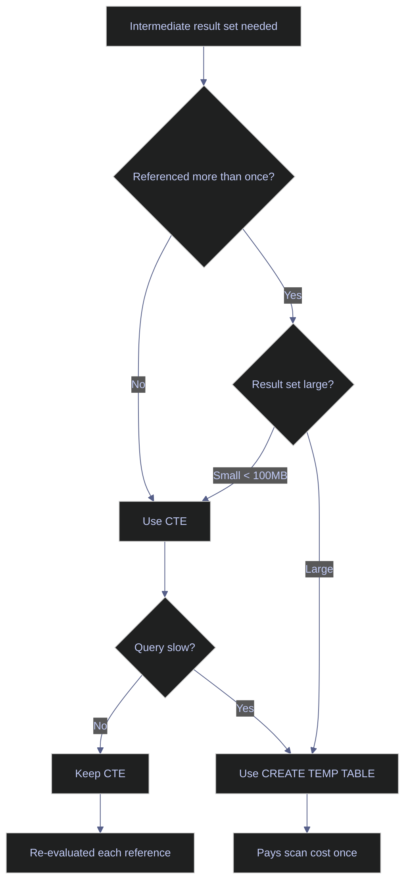

# BigQuery for Data Engineering - Advanced Patterns

> [!quote]
> "The mindset of SQL is 'what do I want?' not 'how do I get it?' — that is the leap from procedural to declarative thinking."
>
> — **Joe Celko**, *SQL for Smarties* (1995)

```python
%load_ext sql
%config SqlMagic.displaycon = False
%config SqlMagic.displaylimit = 0
```

```python
%sql bigquery://bq-wh-nb
```

Connecting to &#x27;bigquery://bq-wh-nb&#x27;

> [!info] BigQuery Uses ADC — No Password
>
> The `bigquery://` connection uses Application Default Credentials — no password in the connection string. Locally: `gcloud auth application-default login`. On VMs/Cloud Run: the metadata server provides credentials automatically. See [gcloud-authentication > The ADC Credential Search Order](https://alp78.github.io/elysium/06-GCP/Core/gcloud-authentication#the-adc-credential-search-order).

## Advanced Window Functions

The window functions in this section appear throughout production pipelines. The [gold-transforms](https://alp78.github.io/elysium/04-SQL-Server/Medallion-Project/gold-transforms) layer in SQL Server relies on the same `ROW_NUMBER`, `LAG`, and running-total patterns adapted for T-SQL syntax. BigQuery distributes window function computation across slots — each slot handles a subset of partitions in parallel, making window functions efficient even on large tables.

> [!info] Cross-engine comparison
>
> Window functions are available in BigQuery (GoogleSQL) and SQL Server (T-SQL) with near-identical syntax. Firestore has no window functions — ranking and running totals must be computed client-side or in a separate analytics layer.

### Window Functions — ROW_NUMBER for Deduplication

Assign a unique sequential number within each partition. The classic pattern for picking one row per key (e.g., latest price per stock, or deduplicating loads).

> [!tip] QUALIFY — BigQuery-exclusive window filter
>
> BigQuery supports `QUALIFY` to filter on window function results without a subquery:
> `SELECT symbol, date, close FROM table QUALIFY ROW_NUMBER() OVER (PARTITION BY symbol ORDER BY date DESC) = 1`
> This eliminates the subquery-plus-filter pattern. `QUALIFY` is not ANSI SQL and does not exist in SQL Server.

```sql
SELECT symbol, date, `close`, volume
FROM (
    SELECT symbol, date, `close`, volume,
           ROW_NUMBER() OVER (PARTITION BY symbol ORDER BY date DESC) AS rn
    FROM `bq-wh-nb.stoxx_silver.eurostoxx50_ohlcv`
) sub
WHERE rn = 1
ORDER BY `close` DESC
LIMIT 10
```

10 rows affected.

<table>
    <thead>
        <tr>
            <th>symbol</th>
            <th>date</th>
            <th>close</th>
            <th>volume</th>
        </tr>
    </thead>
    <tbody>
        <tr>
            <td>RMS.PA</td>
            <td>2026-03-12</td>
            <td>1906.0</td>
            <td>18681</td>
        </tr>
        <tr>
            <td>RHM.DE</td>
            <td>2026-03-12</td>
            <td>1551.5</td>
            <td>158741</td>
        </tr>
        <tr>
            <td>ASML.AS</td>
            <td>2026-03-12</td>
            <td>1190.8</td>
            <td>128223</td>
        </tr>
        <tr>
            <td>ADYEN.AS</td>
            <td>2026-03-12</td>
            <td>925.7</td>
            <td>27887</td>
        </tr>
        <tr>
            <td>ARGX.BR</td>
            <td>2026-03-12</td>
            <td>626.6</td>
            <td>14083</td>
        </tr>
</table>


### Window Functions — PERCENT_RANK and CUME_DIST

- `PERCENT_RANK()`: relative rank as a percentage (0 to 1). Where does this stock sit vs peers?
- `CUME_DIST()`: cumulative distribution — fraction of rows with value ≤ current row.

Use case: "ASML is in the 90th percentile of composite scores."


```sql
SELECT
    symbol,
    ROUND(composite_score, 4) AS score,
    composite_rank,
    ROUND(PERCENT_RANK() OVER (ORDER BY composite_score DESC), 3) AS pct_rank,
    ROUND(CUME_DIST() OVER (ORDER BY composite_score DESC), 3) AS cume_dist
FROM `bq-wh-nb.stoxx_gold.scores_daily`
WHERE _index = 'euro_stoxx_50'
  AND score_date = (SELECT MAX(score_date) FROM `bq-wh-nb.stoxx_gold.scores_daily` WHERE _index = 'euro_stoxx_50')
ORDER BY composite_rank
LIMIT 15
```

15 rows affected.

<table>
    <thead>
        <tr>
            <th>symbol</th>
            <th>score</th>
            <th>composite_rank</th>
            <th>pct_rank</th>
            <th>cume_dist</th>
        </tr>
    </thead>
    <tbody>
        <tr>
            <td>BNP.PA</td>
            <td>0.6796</td>
            <td>1</td>
            <td>0.0</td>
            <td>0.02</td>
        </tr>
        <tr>
            <td>VOW.DE</td>
            <td>0.5756</td>
            <td>2</td>
            <td>0.02</td>
            <td>0.04</td>
        </tr>
        <tr>
            <td>DTE.DE</td>
            <td>0.487</td>
            <td>3</td>
            <td>0.041</td>
            <td>0.06</td>
        </tr>
        <tr>
            <td>TTE.PA</td>
            <td>0.3913</td>
            <td>4</td>
            <td>0.061</td>
            <td>0.08</td>
        </tr>
        <tr>
            <td>ABI.BR</td>
            <td>0.3852</td>
            <td>5</td>
            <td>0.082</td>
            <td>0.1</td>
        </tr>
</table>


### Window Functions — FIRST_VALUE and LAST_VALUE

- `FIRST_VALUE(col)`: first value in the window frame
- `LAST_VALUE(col)`: last value — **requires explicit frame** or it only sees up to current row

Use case: compare every day's close to the first close of the year (YTD return). `FIRST_VALUE` grabs the January 2nd close; every subsequent row computes its return relative to that anchor.


```sql
SELECT
    symbol, date,
    ROUND(`close`, 2) AS `close`,
    ROUND(FIRST_VALUE(`close`) OVER (
        PARTITION BY symbol ORDER BY date
        ROWS BETWEEN UNBOUNDED PRECEDING AND CURRENT ROW
    ), 2) AS first_close_ytd,
    ROUND((`close` - FIRST_VALUE(`close`) OVER (
        PARTITION BY symbol ORDER BY date
        ROWS BETWEEN UNBOUNDED PRECEDING AND CURRENT ROW
    )) / FIRST_VALUE(`close`) OVER (
        PARTITION BY symbol ORDER BY date
        ROWS BETWEEN UNBOUNDED PRECEDING AND CURRENT ROW
    ) * 100, 2) AS ytd_return_pct
FROM `bq-wh-nb.stoxx_silver.eurostoxx50_ohlcv`
WHERE symbol = 'ASML.AS' AND EXTRACT(YEAR FROM date) = EXTRACT(YEAR FROM CURRENT_DATE())
ORDER BY date DESC
LIMIT 15
```

15 rows affected.

<table>
    <thead>
        <tr>
            <th>symbol</th>
            <th>date</th>
            <th>close</th>
            <th>first_close_ytd</th>
            <th>ytd_return_pct</th>
        </tr>
    </thead>
    <tbody>
        <tr>
            <td>ASML.AS</td>
            <td>2026-03-12</td>
            <td>1190.8</td>
            <td>986.3</td>
            <td>20.73</td>
        </tr>
        <tr>
            <td>ASML.AS</td>
            <td>2026-03-11</td>
            <td>1198.8</td>
            <td>986.3</td>
            <td>21.55</td>
        </tr>
        <tr>
            <td>ASML.AS</td>
            <td>2026-03-10</td>
            <td>1200.0</td>
            <td>986.3</td>
            <td>21.67</td>
        </tr>
        <tr>
            <td>ASML.AS</td>
            <td>2026-03-09</td>
            <td>1147.6</td>
            <td>986.3</td>
            <td>16.35</td>
        </tr>
        <tr>
            <td>ASML.AS</td>
            <td>2026-03-06</td>
            <td>1147.0</td>
            <td>986.3</td>
            <td>16.29</td>
        </tr>
</table>


### Window Functions — Running Totals and Cumulative Sums

`SUM() OVER (ORDER BY date ROWS UNBOUNDED PRECEDING)` — cumulative sum from the first row to current.
Use case: cumulative volume, cumulative return, running P&L.


```sql
SELECT
    symbol, date, volume,
    SUM(volume) OVER (
        PARTITION BY symbol ORDER BY date
        ROWS UNBOUNDED PRECEDING
    ) AS cumulative_volume
FROM `bq-wh-nb.stoxx_silver.eurostoxx50_ohlcv`
WHERE symbol = 'ASML.AS' AND EXTRACT(YEAR FROM date) = 2025
ORDER BY date DESC
LIMIT 15
```

15 rows affected.

<table>
    <thead>
        <tr>
            <th>symbol</th>
            <th>date</th>
            <th>volume</th>
            <th>cumulative_volume</th>
        </tr>
    </thead>
    <tbody>
        <tr>
            <td>ASML.AS</td>
            <td>2025-12-31</td>
            <td>156048</td>
            <td>182666418</td>
        </tr>
        <tr>
            <td>ASML.AS</td>
            <td>2025-12-30</td>
            <td>402093</td>
            <td>182510370</td>
        </tr>
        <tr>
            <td>ASML.AS</td>
            <td>2025-12-29</td>
            <td>380628</td>
            <td>182108277</td>
        </tr>
        <tr>
            <td>ASML.AS</td>
            <td>2025-12-24</td>
            <td>59585</td>
            <td>181727649</td>
        </tr>
        <tr>
            <td>ASML.AS</td>
            <td>2025-12-23</td>
            <td>258272</td>
            <td>181668064</td>
        </tr>
</table>


### Window Functions — Frame Deep Dive (ROWS BETWEEN, RANGE)

The frame clause controls which rows the function sees:

| Frame | Meaning |
|-------|--------|
| `ROWS BETWEEN 29 PRECEDING AND CURRENT ROW` | Exactly 30 rows (SMA-30) |
| `ROWS UNBOUNDED PRECEDING` | All rows from start to current (running total) |
| `ROWS BETWEEN UNBOUNDED PRECEDING AND UNBOUNDED FOLLOWING` | Entire partition |
| `RANGE BETWEEN ...` | Based on **values** not row count (treats ties together) |

**Default** (no frame): `RANGE BETWEEN UNBOUNDED PRECEDING AND CURRENT ROW` — beware, this groups ties!

The query below demonstrates three frame variants side by side: `sma_5_rows` uses exactly 5 physical rows (`ROWS BETWEEN 4 PRECEDING AND CURRENT ROW`), `avg_all` uses the entire partition (no frame = all rows), and `vol_30d` computes rolling 30-day standard deviation. Always use `ROWS` (not `RANGE`) for moving averages to get a precise row count.


```sql
SELECT
    symbol, date, `close`,
    ROUND(AVG(`close`) OVER (
        PARTITION BY symbol ORDER BY date ROWS BETWEEN 4 PRECEDING AND CURRENT ROW
    ), 2) AS sma_5_rows,
    ROUND(AVG(`close`) OVER (
        PARTITION BY symbol
    ), 2) AS avg_all,
    ROUND(STDDEV(`close`) OVER (
        PARTITION BY symbol ORDER BY date ROWS BETWEEN 29 PRECEDING AND CURRENT ROW
    ), 2) AS vol_30d
FROM `bq-wh-nb.stoxx_silver.eurostoxx50_ohlcv`
WHERE symbol = 'ASML.AS'
ORDER BY date DESC
LIMIT 10
```

10 rows affected.

<table>
    <thead>
        <tr>
            <th>symbol</th>
            <th>date</th>
            <th>close</th>
            <th>sma_5_rows</th>
            <th>avg_all</th>
            <th>vol_30d</th>
        </tr>
    </thead>
    <tbody>
        <tr>
            <td>ASML.AS</td>
            <td>2026-03-12</td>
            <td>1190.8</td>
            <td>1176.84</td>
            <td>671.35</td>
            <td>35.97</td>
        </tr>
        <tr>
            <td>ASML.AS</td>
            <td>2026-03-11</td>
            <td>1198.8</td>
            <td>1175.88</td>
            <td>671.35</td>
            <td>35.95</td>
        </tr>
        <tr>
            <td>ASML.AS</td>
            <td>2026-03-10</td>
            <td>1200.0</td>
            <td>1176.08</td>
            <td>671.35</td>
            <td>35.98</td>
        </tr>
        <tr>
            <td>ASML.AS</td>
            <td>2026-03-09</td>
            <td>1147.6</td>
            <td>1168.44</td>
            <td>671.35</td>
            <td>36.06</td>
        </tr>
        <tr>
            <td>ASML.AS</td>
            <td>2026-03-06</td>
            <td>1147.0</td>
            <td>1181.0</td>
            <td>671.35</td>
            <td>34.79</td>
        </tr>
</table>


## Recursive CTEs

### Recursive CTEs — Date Series Generation

A **recursive CTE** has an anchor (starting row) and a recursive member that references itself.
Classic use: generate a continuous date sequence to detect missing trading days. The **anchor member** produces the starting row (March 1st). The **recursive member** adds one day per iteration until the termination condition (`dt < '2026-03-31'`) is met. The generated calendar is then LEFT JOINed to OHLCV data to flag missing dates.

> [!warning] BigQuery caps recursion at 500 iterations by default
>
> Recursive CTEs in BigQuery terminate after 500 iterations unless overridden with `OPTIONS(max_recursion_depth=N)`. For date series spanning more than ~16 months, use `GENERATE_DATE_ARRAY()` instead — it produces the same result without recursion overhead.

> [!success] Safe Pattern
>
> For date series generation, prefer `UNNEST(GENERATE_DATE_ARRAY('2026-03-01', '2026-03-31'))` — no recursion limit, single-pass, and more idiomatic BigQuery. Reserve recursive CTEs for hierarchical data (org charts, bill of materials) where `GENERATE_DATE_ARRAY` doesn't apply.

> [!info] Cross-engine comparison
>
> SQL Server supports recursive CTEs with a 100-iteration default (`OPTION (MAXRECURSION N)` to override). BigQuery defaults to 500. Firestore has no query-level recursion — hierarchical data requires client-side traversal or denormalized paths.

```sql
WITH RECURSIVE dates AS (
    SELECT CAST('2026-03-01' AS DATE) AS dt
    UNION ALL
    SELECT DATE_ADD(dt, INTERVAL 1 DAY) FROM dates WHERE dt < '2026-03-31'
)
SELECT
    d.dt AS calendar_date,
    o.symbol,
    o.`close`,
    CASE WHEN o.symbol IS NULL THEN 'MISSING' ELSE 'OK' END AS status
FROM dates d
LEFT JOIN `bq-wh-nb.stoxx_silver.eurostoxx50_ohlcv` o ON d.dt = o.date AND o.symbol = 'ASML.AS'
ORDER BY d.dt
LIMIT 15
```

15 rows affected.

<table>
    <thead>
        <tr>
            <th>calendar_date</th>
            <th>symbol</th>
            <th>close</th>
            <th>status</th>
        </tr>
    </thead>
    <tbody>
        <tr>
            <td>2026-03-01</td>
            <td>None</td>
            <td>None</td>
            <td>MISSING</td>
        </tr>
        <tr>
            <td>2026-03-02</td>
            <td>ASML.AS</td>
            <td>1210.4</td>
            <td>OK</td>
        </tr>
        <tr>
            <td>2026-03-03</td>
            <td>ASML.AS</td>
            <td>1161.8</td>
            <td>OK</td>
        </tr>
        <tr>
            <td>2026-03-04</td>
            <td>ASML.AS</td>
            <td>1199.8</td>
            <td>OK</td>
        </tr>
        <tr>
            <td>2026-03-05</td>
            <td>ASML.AS</td>
            <td>1186.0</td>
            <td>OK</td>
        </tr>
</table>


## CROSS JOIN & Lateral Patterns

### CROSS JOIN — Build a Complete Grid

`CROSS JOIN` produces the cartesian product — every row from A paired with every row from B. Use case: generate all (symbol, date) combinations to find missing data. The silver layer is gap-filled (missing dates forward-filled), so this query checks the bronze layer to identify true data gaps.

> [!danger] CROSS JOIN multiplies bytes scanned
>
> A CROSS JOIN between a 50-row symbol table and a 20-row calendar is harmless (1,000 combinations). But CROSS JOIN between two large tables (e.g., 10K x 10K = 100M rows) produces massive intermediate results at full-scan cost for both sides. Always ensure at least one side is small.

> [!success] Safe Pattern
>
> Keep one side of the CROSS JOIN to a dimension table or CTE with known small cardinality. For large-scale gap detection, use `GENERATE_DATE_ARRAY` + `UNNEST` instead of a calendar table CROSS JOIN.

```sql
WITH symbols AS (
    SELECT DISTINCT symbol FROM `bq-wh-nb.stoxx_bronze.eurostoxx50_ohlcv`
),
cal AS (
    SELECT DISTINCT date
    FROM `bq-wh-nb.stoxx_bronze.trading_calendar`
    WHERE exchange_code = 'AMS' AND is_trading_day = TRUE
      AND date >= '2026-03-01' AND date <= '2026-03-21'
)
SELECT
    s.symbol, c.date,
    CASE WHEN o.`close` IS NULL THEN 'MISSING' ELSE 'OK' END AS status
FROM symbols s
CROSS JOIN cal c
LEFT JOIN `bq-wh-nb.stoxx_silver.eurostoxx50_ohlcv` o ON s.symbol = o.symbol AND c.date = o.date
ORDER BY s.symbol, c.date
LIMIT 15
```

15 rows affected.

<table>
    <thead>
        <tr>
            <th>symbol</th>
            <th>date</th>
            <th>status</th>
        </tr>
    </thead>
    <tbody>
        <tr>
            <td>ABI.BR</td>
            <td>2026-03-02</td>
            <td>OK</td>
        </tr>
        <tr>
            <td>ABI.BR</td>
            <td>2026-03-03</td>
            <td>OK</td>
        </tr>
        <tr>
            <td>ABI.BR</td>
            <td>2026-03-04</td>
            <td>OK</td>
        </tr>
        <tr>
            <td>ABI.BR</td>
            <td>2026-03-05</td>
            <td>OK</td>
        </tr>
        <tr>
            <td>ABI.BR</td>
            <td>2026-03-06</td>
            <td>OK</td>
        </tr>
</table>


### Top-N Per Group — ROW_NUMBER Pattern

In SQL Server, `CROSS APPLY` runs a correlated subquery for each outer row — a lateral join returning multiple rows. BigQuery has no `CROSS APPLY`; the idiomatic equivalent is `ROW_NUMBER() OVER (PARTITION BY ... ORDER BY ...)` in a subquery, then filtering to `rn <= N`. The result is identical: top N rows per group.

> [!info] SQL Server equivalent
>
> SQL Server uses `CROSS APPLY (SELECT TOP 3 ... WHERE o.symbol = d.symbol ORDER BY volume DESC)` for the same pattern. BigQuery's window-function approach scans the table once and partitions in parallel across slots — typically more efficient than row-by-row correlated subqueries.


```sql
SELECT symbol, short_name, date, volume, `close`
FROM (
    SELECT d.symbol, d.short_name, o.date, o.volume, o.`close`,
           ROW_NUMBER() OVER (PARTITION BY d.symbol ORDER BY o.volume DESC) AS rn
    FROM `bq-wh-nb.stoxx_silver.index_dim` d
    JOIN `bq-wh-nb.stoxx_silver.eurostoxx50_ohlcv` o ON d.symbol = o.symbol
    WHERE d._index = 'euro_stoxx_50' AND d.is_current = TRUE
) sub
WHERE rn <= 3
ORDER BY symbol, volume DESC
LIMIT 15

```

15 rows affected.

<table>
    <thead>
        <tr>
            <th>symbol</th>
            <th>short_name</th>
            <th>date</th>
            <th>volume</th>
            <th>close</th>
        </tr>
    </thead>
    <tbody>
        <tr>
            <td>ABI.BR</td>
            <td>AB INBEV</td>
            <td>2022-02-28</td>
            <td>12441786</td>
            <td>55.14</td>
        </tr>
        <tr>
            <td>ABI.BR</td>
            <td>AB INBEV</td>
            <td>2024-06-21</td>
            <td>9762601</td>
            <td>55.06</td>
        </tr>
        <tr>
            <td>ABI.BR</td>
            <td>AB INBEV</td>
            <td>2025-05-30</td>
            <td>9526994</td>
            <td>62.04</td>
        </tr>
        <tr>
            <td>AD.AS</td>
            <td>KONINKLIJKE AHOLD DELHAIZE N.V.</td>
            <td>2021-05-27</td>
            <td>11080485</td>
            <td>24.0</td>
        </tr>
        <tr>
            <td>AD.AS</td>
            <td>KONINKLIJKE AHOLD DELHAIZE N.V.</td>
            <td>2021-03-19</td>
            <td>10565045</td>
            <td>23.5</td>
        </tr>
</table>


### Optional Lateral Join — LEFT JOIN + ROW_NUMBER

SQL Server's `OUTER APPLY` keeps the outer row even when the correlated subquery returns nothing — equivalent to a `LEFT JOIN LATERAL`. BigQuery has no `OUTER APPLY`; the idiomatic pattern is `LEFT JOIN` on a subquery that uses `ROW_NUMBER()` to pick the best match per key, then filter to `rn = 1`. Outer rows with no match retain NULLs for the joined columns.


```sql
SELECT d.symbol, d.short_name, d.sector,
       s.composite_score, s.composite_rank, s.score_date
FROM (
    SELECT * FROM `bq-wh-nb.stoxx_silver.index_dim`
    WHERE _index = 'euro_stoxx_50' AND is_current = TRUE
) d
LEFT JOIN (
    SELECT *, ROW_NUMBER() OVER (PARTITION BY symbol, _index ORDER BY score_date DESC) AS rn
    FROM `bq-wh-nb.stoxx_gold.scores_daily`
) s ON d.symbol = s.symbol AND d._index = s._index AND s.rn = 1
ORDER BY s.composite_rank
LIMIT 15

```

15 rows affected.

<table>
    <thead>
        <tr>
            <th>symbol</th>
            <th>short_name</th>
            <th>sector</th>
            <th>composite_score</th>
            <th>composite_rank</th>
            <th>score_date</th>
        </tr>
    </thead>
    <tbody>
        <tr>
            <td>BNP.PA</td>
            <td>BNP PARIBAS ACT.A</td>
            <td>Financial Services</td>
            <td>0.6795985859619491</td>
            <td>1</td>
            <td>2026-03-12</td>
        </tr>
        <tr>
            <td>VOW.DE</td>
            <td>VOLKSWAGEN AG</td>
            <td>Consumer Cyclical</td>
            <td>0.5756100520413311</td>
            <td>2</td>
            <td>2026-03-12</td>
        </tr>
        <tr>
            <td>DTE.DE</td>
            <td>DEUTSCHE TELEKOM AG</td>
            <td>Communication Services</td>
            <td>0.4870486370039222</td>
            <td>3</td>
            <td>2026-03-12</td>
        </tr>
        <tr>
            <td>TTE.PA</td>
            <td>TOTALENERGIES</td>
            <td>Energy</td>
            <td>0.3912872052761238</td>
            <td>4</td>
            <td>2026-03-12</td>
        </tr>
        <tr>
            <td>ABI.BR</td>
            <td>AB INBEV</td>
            <td>Consumer Defensive</td>
            <td>0.38521031359211527</td>
            <td>5</td>
            <td>2026-03-12</td>
        </tr>
</table>


## PIVOT / UNPIVOT

### PIVOT / UNPIVOT — Rows to Columns

Turn row values into column headers. Classic use: monthly close prices as columns.

> [!info] Cross-engine comparison
>
> BigQuery has native `PIVOT` / `UNPIVOT` syntax. SQL Server also supports `PIVOT` / `UNPIVOT` with slightly different syntax (requires aggregate function in the PIVOT clause). Firestore has no query-level pivoting — reshape data client-side.


```sql
SELECT * FROM (
    SELECT symbol, EXTRACT(MONTH FROM date) AS mo, `close`
    FROM `bq-wh-nb.stoxx_silver.eurostoxx50_ohlcv`
    WHERE symbol = 'ASML.AS' AND EXTRACT(YEAR FROM date) = 2025
)
PIVOT (AVG(`close`) FOR mo IN (1 AS Jan, 2 AS Feb, 3 AS Mar, 4 AS Apr, 5 AS May))

```

1 rows affected.

<table>
    <thead>
        <tr>
            <th>symbol</th>
            <th>Jan</th>
            <th>Feb</th>
            <th>Mar</th>
            <th>Apr</th>
            <th>May</th>
        </tr>
    </thead>
    <tbody>
        <tr>
            <td>ASML.AS</td>
            <td>714.7136363636364</td>
            <td>713.04</td>
            <td>656.5809523809523</td>
            <td>581.0</td>
            <td>650.1809523809522</td>
        </tr>
</table>


### PIVOT — Manual Pivot with CASE (Portable)

`PIVOT` is BigQuery specific. The portable equivalent uses `CASE` inside aggregates.
Works in any SQL engine (BigQuery, PostgreSQL, etc.).


The portable equivalent uses `CASE` inside aggregate functions — this works in any SQL engine (BigQuery, SQL Server, PostgreSQL) without relying on `PIVOT` syntax.

```sql
SELECT
    symbol,
    ROUND(AVG(CASE WHEN EXTRACT(MONTH FROM date) = 1 THEN `close` END), 2) AS Jan,
    ROUND(AVG(CASE WHEN EXTRACT(MONTH FROM date) = 2 THEN `close` END), 2) AS Feb,
    ROUND(AVG(CASE WHEN EXTRACT(MONTH FROM date) = 3 THEN `close` END), 2) AS Mar,
    ROUND(AVG(CASE WHEN EXTRACT(MONTH FROM date) = 6 THEN `close` END), 2) AS Jun,
    ROUND(AVG(CASE WHEN EXTRACT(MONTH FROM date) = 9 THEN `close` END), 2) AS Sep,
    ROUND(AVG(CASE WHEN EXTRACT(MONTH FROM date) = 12 THEN `close` END), 2) AS Dec
FROM `bq-wh-nb.stoxx_silver.eurostoxx50_ohlcv`
WHERE symbol = 'ASML.AS' AND EXTRACT(YEAR FROM date) = 2025
GROUP BY symbol
```

1 rows affected.

<table>
    <thead>
        <tr>
            <th>symbol</th>
            <th>Jan</th>
            <th>Feb</th>
            <th>Mar</th>
            <th>Jun</th>
            <th>Sep</th>
            <th>Dec</th>
        </tr>
    </thead>
    <tbody>
        <tr>
            <td>ASML.AS</td>
            <td>714.71</td>
            <td>713.04</td>
            <td>656.58</td>
            <td>670.05</td>
            <td>732.09</td>
            <td>924.72</td>
        </tr>
</table>


### UNPIVOT — Columns to Rows

The reverse — turn multiple score columns into rows for easier comparison/charting.


```sql
SELECT symbol, score_type, ROUND(score_value, 4) AS score_value
FROM (
    SELECT symbol, relative_value_score, momentum_score, sentiment_score
    FROM `bq-wh-nb.stoxx_gold.scores_daily`
    WHERE _index = 'euro_stoxx_50'
      AND score_date = (SELECT MAX(score_date) FROM `bq-wh-nb.stoxx_gold.scores_daily` WHERE _index = 'euro_stoxx_50')
)
UNPIVOT (score_value FOR score_type IN (relative_value_score, momentum_score, sentiment_score))
ORDER BY symbol, score_type
LIMIT 15

```

15 rows affected.

<table>
    <thead>
        <tr>
            <th>symbol</th>
            <th>score_type</th>
            <th>score_value</th>
        </tr>
    </thead>
    <tbody>
        <tr>
            <td>ABI.BR</td>
            <td>momentum_score</td>
            <td>0.5375</td>
        </tr>
        <tr>
            <td>ABI.BR</td>
            <td>relative_value_score</td>
            <td>0.2506</td>
        </tr>
        <tr>
            <td>ABI.BR</td>
            <td>sentiment_score</td>
            <td>0.3676</td>
        </tr>
        <tr>
            <td>AD.AS</td>
            <td>momentum_score</td>
            <td>1.1629</td>
        </tr>
        <tr>
            <td>AD.AS</td>
            <td>relative_value_score</td>
            <td>0.6959</td>
        </tr>
</table>


## MERGE (Upsert)

> [!tip] Related pattern
>
> For cross-language equivalents of MERGE and window functions, see [gold-transforms](https://alp78.github.io/elysium/04-SQL-Server/Medallion-Project/gold-transforms) for SQL Server and [05_py_aggregation_reshaping](https://alp78.github.io/elysium/03-Dataframes/Dataframes-Python/05_py_aggregation_reshaping) / [05_cs_aggregation_reshaping](https://alp78.github.io/elysium/03-Dataframes/Dataframes-CSharp/05_cs_aggregation_reshaping) for DataFrame equivalents.

### MERGE (Upsert) — Syntax and Patterns

The `MERGE` statement does INSERT, UPDATE, and DELETE in one atomic operation.
This is the core of incremental pipeline loads — "upsert" new data, update changed rows.

**Syntax**: `MERGE target USING source ON join_key WHEN MATCHED THEN UPDATE WHEN NOT MATCHED THEN INSERT`

BigQuery MERGE works on permanent tables only — it cannot target temp tables or CTEs in jupysql magic. The syntax matches SQL Server:

```sql
MERGE `project.dataset.target` AS t
USING `project.dataset.staging` AS s
ON t.symbol = s.symbol AND t.date = s.date
WHEN MATCHED THEN UPDATE SET t.close = s.close, t.volume = s.volume
WHEN NOT MATCHED THEN INSERT (symbol, date, close, volume)
    VALUES (s.symbol, s.date, s.close, s.volume);
```

> [!warning] MERGE counts against the 1,500 DML/day quota
>
> Each MERGE execution consumes one DML operation from BigQuery's 1,500-per-table daily limit. A pipeline running MERGE every 5 minutes = 288/day (safe). Every 1 minute = 1,440/day (dangerously close). For high-frequency upserts, use the Storage Write API instead.

> [!success] Safe Pattern
>
> Run MERGE once per pipeline cycle (daily or hourly scheduled queries). For real-time ingestion, use the **Storage Write API** in committed mode — it supports exactly-once semantics without consuming DML quota.

> [!info] Cross-engine comparison
>
> BigQuery MERGE has a 1,500 DML/day quota per table. SQL Server MERGE has no such limit but requires careful locking strategy under concurrency. Firestore has no MERGE — use batched writes (500 document limit per batch) with `set(..., merge=True)` for upsert semantics.

The demo below shows staging-like data that would be the source for a MERGE operation.

```sql
SELECT 'DEMO.XX' AS symbol, DATE '2026-03-20' AS date, 100.0 AS `close`, 1000000 AS volume
UNION ALL
SELECT 'DEMO.XX', DATE '2026-03-21', 102.5, 1200000

```

2 rows affected.

<table>
    <thead>
        <tr>
            <th>symbol</th>
            <th>date</th>
            <th>close</th>
            <th>volume</th>
        </tr>
    </thead>
    <tbody>
        <tr>
            <td>DEMO.XX</td>
            <td>2026-03-20</td>
            <td>100.0</td>
            <td>1000000</td>
        </tr>
        <tr>
            <td>DEMO.XX</td>
            <td>2026-03-21</td>
            <td>102.5</td>
            <td>1200000</td>
        </tr>
</table>


## EXISTS vs IN vs JOIN

### EXISTS vs IN vs JOIN — Semi-Join with EXISTS

`WHERE EXISTS (SELECT 1 FROM ... WHERE ...)` — returns TRUE if the subquery finds **any** row.
Stops at the first match (efficient). Use for "does a related row exist?" questions.


```sql
SELECT d.symbol, d.short_name, d.sector
FROM `bq-wh-nb.stoxx_silver.index_dim` d
WHERE d._index = 'euro_stoxx_50' AND d.is_current = TRUE
  AND EXISTS (
      SELECT 1 FROM `bq-wh-nb.stoxx_gold.scores_daily` g
      WHERE g.symbol = d.symbol AND g._index = d._index
  )
ORDER BY d.symbol
LIMIT 15
```

15 rows affected.

<table>
    <thead>
        <tr>
            <th>symbol</th>
            <th>short_name</th>
            <th>sector</th>
        </tr>
    </thead>
    <tbody>
        <tr>
            <td>ABI.BR</td>
            <td>AB INBEV</td>
            <td>Consumer Defensive</td>
        </tr>
        <tr>
            <td>AD.AS</td>
            <td>KONINKLIJKE AHOLD DELHAIZE N.V.</td>
            <td>Consumer Defensive</td>
        </tr>
        <tr>
            <td>ADS.DE</td>
            <td>adidas AG</td>
            <td>Consumer Cyclical</td>
        </tr>
        <tr>
            <td>ADYEN.AS</td>
            <td>ADYEN</td>
            <td>Technology</td>
        </tr>
        <tr>
            <td>AI.PA</td>
            <td>AIR LIQUIDE</td>
            <td>Basic Materials</td>
        </tr>
</table>


### EXISTS vs IN vs JOIN — Anti-Join with NOT EXISTS

Find rows in A that have **no match** in B. More efficient than `LEFT JOIN WHERE b.key IS NULL` in most cases.


```sql
SELECT d.symbol, d.short_name, d.sector
FROM `bq-wh-nb.stoxx_silver.index_dim` d
WHERE d._index = 'euro_stoxx_50' AND d.is_current = TRUE
  AND NOT EXISTS (
      SELECT 1 FROM `bq-wh-nb.stoxx_silver.index_dim` o
      WHERE o.symbol = d.symbol AND o._index = 'oil_20' AND o.is_current = TRUE
  )
ORDER BY d.symbol
LIMIT 15
```

15 rows affected.

<table>
    <thead>
        <tr>
            <th>symbol</th>
            <th>short_name</th>
            <th>sector</th>
        </tr>
    </thead>
    <tbody>
        <tr>
            <td>ABI.BR</td>
            <td>AB INBEV</td>
            <td>Consumer Defensive</td>
        </tr>
        <tr>
            <td>AD.AS</td>
            <td>KONINKLIJKE AHOLD DELHAIZE N.V.</td>
            <td>Consumer Defensive</td>
        </tr>
        <tr>
            <td>ADS.DE</td>
            <td>adidas AG</td>
            <td>Consumer Cyclical</td>
        </tr>
        <tr>
            <td>ADYEN.AS</td>
            <td>ADYEN</td>
            <td>Technology</td>
        </tr>
        <tr>
            <td>AI.PA</td>
            <td>AIR LIQUIDE</td>
            <td>Basic Materials</td>
        </tr>
</table>


## Grouping Sets, ROLLUP, CUBE

### Grouping Sets, ROLLUP, CUBE — GROUPING SETS

Run multiple GROUP BY queries in one pass. Instead of UNION ALL of separate aggregations, use `GROUPING SETS` — BigQuery reads the source table once and computes all grouping combinations in a single slot-distributed pass, avoiding the repeated scans that UNION ALL would require.


```sql
SELECT
    COALESCE(d.sector, '(all sectors)') AS sector,
    COALESCE(d.country, '(all countries)') AS country,
    COUNT(*) AS stocks,
    ROUND(AVG(s.composite_score), 4) AS avg_score
FROM `bq-wh-nb.stoxx_gold.scores_daily` s
JOIN `bq-wh-nb.stoxx_silver.index_dim` d ON s.symbol = d.symbol AND d._index = s._index AND d.is_current = TRUE
WHERE s._index = 'euro_stoxx_50'
  AND s.score_date = (SELECT MAX(score_date) FROM `bq-wh-nb.stoxx_gold.scores_daily` WHERE _index = 'euro_stoxx_50')
GROUP BY GROUPING SETS (
    (d.sector),
    (d.country),
    ()
)
ORDER BY GROUPING(d.sector), GROUPING(d.country), avg_score DESC
LIMIT 15
```

15 rows affected.

<table>
    <thead>
        <tr>
            <th>sector</th>
            <th>country</th>
            <th>stocks</th>
            <th>avg_score</th>
        </tr>
    </thead>
    <tbody>
        <tr>
            <td>Communication Services</td>
            <td>(all countries)</td>
            <td>1</td>
            <td>0.487</td>
        </tr>
        <tr>
            <td>Energy</td>
            <td>(all countries)</td>
            <td>2</td>
            <td>0.3286</td>
        </tr>
        <tr>
            <td>Healthcare</td>
            <td>(all countries)</td>
            <td>4</td>
            <td>0.0812</td>
        </tr>
        <tr>
            <td>Technology</td>
            <td>(all countries)</td>
            <td>5</td>
            <td>0.0522</td>
        </tr>
        <tr>
            <td>Industrials</td>
            <td>(all countries)</td>
            <td>10</td>
            <td>0.0504</td>
        </tr>
</table>


### Grouping Sets, ROLLUP, CUBE — ROLLUP Hierarchical Subtotals

`ROLLUP(a, b)` = GROUP BY (a, b) + GROUP BY (a) + GROUP BY (). Subtotals roll up from right to left.


```sql
SELECT
    COALESCE(d.sector, '*** TOTAL ***') AS sector,
    COUNT(DISTINCT s.symbol) AS stocks,
    SUM(o.volume) AS total_volume,
    ROUND(AVG(CAST(o.volume AS FLOAT64)), 0) AS avg_daily_volume
FROM `bq-wh-nb.stoxx_silver.eurostoxx50_ohlcv` o
JOIN `bq-wh-nb.stoxx_silver.index_dim` d ON o.symbol = d.symbol AND d._index = 'euro_stoxx_50' AND d.is_current = TRUE
JOIN `bq-wh-nb.stoxx_gold.scores_daily` s ON o.symbol = s.symbol AND s._index = 'euro_stoxx_50'
WHERE o.date >= '2026-03-01'
  AND s.score_date = (SELECT MAX(score_date) FROM `bq-wh-nb.stoxx_gold.scores_daily` WHERE _index = 'euro_stoxx_50')
GROUP BY ROLLUP(d.sector)
ORDER BY GROUPING(d.sector), total_volume DESC
LIMIT 15
```

11 rows affected.

<table>
    <thead>
        <tr>
            <th>sector</th>
            <th>stocks</th>
            <th>total_volume</th>
            <th>avg_daily_volume</th>
        </tr>
    </thead>
    <tbody>
        <tr>
            <td>Financial Services</td>
            <td>11</td>
            <td>1494164521</td>
            <td>15092571.0</td>
        </tr>
        <tr>
            <td>Utilities</td>
            <td>2</td>
            <td>377718499</td>
            <td>20984361.0</td>
        </tr>
        <tr>
            <td>Energy</td>
            <td>2</td>
            <td>207171058</td>
            <td>11509503.0</td>
        </tr>
        <tr>
            <td>Industrials</td>
            <td>10</td>
            <td>125186950</td>
            <td>1390966.0</td>
        </tr>
        <tr>
            <td>Consumer Cyclical</td>
            <td>9</td>
            <td>112568697</td>
            <td>1389737.0</td>
        </tr>
</table>


## String Aggregation & Functions

### String Aggregation — STRING_AGG

Concatenate values from multiple rows into a single comma-separated string.
Use case: list all tickers in a sector as one field.


```sql
SELECT
    sector,
    COUNT(*) AS stocks,
    STRING_AGG(symbol, ', ' ORDER BY symbol) AS symbols
FROM `bq-wh-nb.stoxx_silver.index_dim`
WHERE _index = 'euro_stoxx_50' AND is_current = TRUE
GROUP BY sector
ORDER BY stocks DESC
LIMIT 10
```

10 rows affected.

<table>
    <thead>
        <tr>
            <th>sector</th>
            <th>stocks</th>
            <th>symbols</th>
        </tr>
    </thead>
    <tbody>
        <tr>
            <td>Financial Services</td>
            <td>11</td>
            <td>ALV.DE, BBVA.MC, BNP.PA, CS.PA, DB1.DE, INGA.AS, ISP.MI, MUV2.DE, NDA-FI.HE, SAN.MC, UCG.MI</td>
        </tr>
        <tr>
            <td>Industrials</td>
            <td>10</td>
            <td>AIR.PA, DG.PA, DHL.DE, ENR.DE, RHM.DE, SAF.PA, SGO.PA, SIE.DE, SU.PA, WKL.AS</td>
        </tr>
        <tr>
            <td>Consumer Cyclical</td>
            <td>9</td>
            <td>ADS.DE, BMW.DE, ITX.MC, MBG.DE, MC.PA, PRX.AS, RACE.MI, RMS.PA, VOW.DE</td>
        </tr>
        <tr>
            <td>Technology</td>
            <td>5</td>
            <td>ADYEN.AS, ASML.AS, DSY.PA, IFX.DE, SAP.DE</td>
        </tr>
        <tr>
            <td>Consumer Defensive</td>
            <td>4</td>
            <td>ABI.BR, AD.AS, BN.PA, OR.PA</td>
        </tr>
</table>


### String Functions — Parsing with SPLIT, REGEXP_EXTRACT, SUBSTR

Extract exchange suffix from ticker symbols (e.g., 'AS' from 'ASML.AS').


```sql
SELECT
    symbol,
    LEFT(symbol, STRPOS(symbol, '.') - 1) AS ticker_only,
    SUBSTR(symbol, STRPOS(symbol, '.') + 1, LENGTH(symbol)) AS exchange,
    CONCAT(UPPER(LEFT(short_name, 1)), LOWER(SUBSTR(short_name, 2))) AS name_proper
FROM `bq-wh-nb.stoxx_silver.index_dim`
WHERE _index = 'euro_stoxx_50' AND is_current = TRUE
ORDER BY symbol
LIMIT 10
```

10 rows affected.

<table>
    <thead>
        <tr>
            <th>symbol</th>
            <th>ticker_only</th>
            <th>exchange</th>
            <th>name_proper</th>
        </tr>
    </thead>
    <tbody>
        <tr>
            <td>ABI.BR</td>
            <td>ABI</td>
            <td>BR</td>
            <td>Ab inbev</td>
        </tr>
        <tr>
            <td>AD.AS</td>
            <td>AD</td>
            <td>AS</td>
            <td>Koninklijke ahold delhaize n.v.</td>
        </tr>
        <tr>
            <td>ADS.DE</td>
            <td>ADS</td>
            <td>DE</td>
            <td>Adidas ag</td>
        </tr>
        <tr>
            <td>ADYEN.AS</td>
            <td>ADYEN</td>
            <td>AS</td>
            <td>Adyen</td>
        </tr>
        <tr>
            <td>AI.PA</td>
            <td>AI</td>
            <td>PA</td>
            <td>Air liquide</td>
        </tr>
</table>


## NULL Handling Patterns

### NULL Handling — Rules and COALESCE, IFNULL, NULLIF

| Expression | Result | Why |
|-----------|--------|-----|
| `NULL = NULL` | NULL (not TRUE!) | NULL is unknown, not a value |
| `NULL + 5` | NULL | Any arithmetic with NULL = NULL |
| `AVG(col)` | Ignores NULLs | Aggregates skip NULLs |
| `COUNT(*)` vs `COUNT(col)` | Different! | `COUNT(*)` counts rows, `COUNT(col)` skips NULLs |
| `COALESCE(a, b, c)` | First non-NULL | ANSI standard, N arguments |
| `IFNULL(a, b)` | a if not null, else b | BigQuery SQL only, 2 args, type of first arg |
| `NULLIF(a, b)` | NULL if a = b | Prevents divide-by-zero: `x / NULLIF(y, 0)` |
| `SAFE_DIVIDE(a, b)` | a/b or NULL if b=0 | BigQuery-only — cleaner than `NULLIF` for division |

> [!danger] WHERE col = NULL is always FALSE
>
> `NULL = NULL` evaluates to `NULL` (not TRUE) in all SQL engines. A `WHERE col = NULL` filter silently returns zero rows. This is one of the most common SQL bugs.

> [!success] Safe Pattern
>
> Always use `WHERE col IS NULL` or `WHERE col IS NOT NULL`. For equality checks that should treat NULL as a matchable value, use `IFNULL(col, sentinel) = IFNULL(other, sentinel)` or BigQuery's `IS NOT DISTINCT FROM` operator.


The query demonstrates three patterns: `COALESCE` provides a default display value when PE is null, `NULLIF` prevents division-by-zero errors (returns NULL instead of error), and `COUNT(*)` vs `COUNT(column)` shows the difference between counting all rows and counting non-null values.

```sql
SELECT
    symbol,
    forward_pe,
    COALESCE(CAST(ROUND(forward_pe, 1) AS STRING), 'N/A') AS pe_display,
    ROUND(current_price / NULLIF(forward_pe, 0), 2) AS earnings_per_share,
    COUNT(*) OVER () AS total_rows,
    COUNT(forward_pe) OVER () AS rows_with_pe
FROM `bq-wh-nb.stoxx_silver.signals_daily`
WHERE _index = 'euro_stoxx_50'
ORDER BY forward_pe
LIMIT 10
```

10 rows affected.

<table>
    <thead>
        <tr>
            <th>symbol</th>
            <th>forward_pe</th>
            <th>pe_display</th>
            <th>earnings_per_share</th>
            <th>total_rows</th>
            <th>rows_with_pe</th>
        </tr>
    </thead>
    <tbody>
        <tr>
            <td>VOW.DE</td>
            <td>2.6177435</td>
            <td>2.6</td>
            <td>35.47</td>
            <td>149</td>
            <td>149</td>
        </tr>
        <tr>
            <td>VOW.DE</td>
            <td>3.4232497</td>
            <td>3.4</td>
            <td>27.93</td>
            <td>149</td>
            <td>149</td>
        </tr>
        <tr>
            <td>VOW.DE</td>
            <td>3.5628338</td>
            <td>3.6</td>
            <td>25.63</td>
            <td>149</td>
            <td>149</td>
        </tr>
        <tr>
            <td>BNP.PA</td>
            <td>6.7327175</td>
            <td>6.7</td>
            <td>12.83</td>
            <td>149</td>
            <td>149</td>
        </tr>
        <tr>
            <td>BNP.PA</td>
            <td>6.8096137</td>
            <td>6.8</td>
            <td>12.84</td>
            <td>149</td>
            <td>149</td>
        </tr>
</table>


## Set Operations

### Set Operations — UNION / INTERSECT / EXCEPT

- `UNION ALL`: stack result sets (keep duplicates) — fast
- `UNION`: stack + deduplicate — slower (sorts)
- `INTERSECT`: rows in both queries
- `EXCEPT`: rows in first query but not second

> [!warning] UNION without ALL forces a full deduplication sort
>
> `UNION` (without `ALL`) sorts and deduplicates the combined result set. On large tables this is expensive — BigQuery must shuffle all rows across slots for the dedup. Use `UNION ALL` whenever duplicates are acceptable or guaranteed absent.

> [!success] Safe Pattern
>
> Default to `UNION ALL` unless you specifically need deduplication. If you do need dedup, consider whether a downstream `GROUP BY` or `DISTINCT` already handles it.

> [!info] Cross-engine comparison
>
> BigQuery uses `EXCEPT DISTINCT` (explicit keyword). SQL Server uses `EXCEPT` (implicit DISTINCT behavior — same semantics, different naming). Both engines support `INTERSECT` with identical behavior.


```sql
SELECT symbol FROM `bq-wh-nb.stoxx_silver.index_dim`
WHERE _index = 'euro_stoxx_50' AND is_current = TRUE
EXCEPT DISTINCT
SELECT symbol FROM `bq-wh-nb.stoxx_silver.index_dim`
WHERE _index = 'stoxx_asia_50' AND is_current = TRUE
ORDER BY symbol
LIMIT 15
```

15 rows affected.

<table>
    <thead>
        <tr>
            <th>symbol</th>
        </tr>
    </thead>
    <tbody>
        <tr>
            <td>ABI.BR</td>
        </tr>
        <tr>
            <td>AD.AS</td>
        </tr>
        <tr>
            <td>ADS.DE</td>
        </tr>
        <tr>
            <td>ADYEN.AS</td>
        </tr>
        <tr>
            <td>AI.PA</td>
        </tr>
</table>


## Date & Calendar Table Patterns

### Date & Calendar — Business Day Arithmetic

The `trading_calendar` table is a precomputed dimension table storing every calendar date with exchange-specific flags (`is_trading_day`, `exchange_code`). It is generated once and updated when exchange holiday schedules change. Use it instead of `GENERATE_DATE_ARRAY` whenever you need exchange-aware business day arithmetic — `GENERATE_DATE_ARRAY` produces calendar dates but has no knowledge of holidays.

For BigQuery infrastructure details on how this table is loaded and maintained, see [data-loading-and-export](https://alp78.github.io/elysium/06-GCP/BigQuery/data-loading-and-export).


```sql
SELECT
    exchange_code,
    SUM(CAST(is_trading_day AS INT)) AS trading_days,
    COUNT(*) AS calendar_days,
    ROUND(SUM(CAST(is_trading_day AS INT)) * 100.0 / COUNT(*), 1) AS pct_trading
FROM `bq-wh-nb.stoxx_bronze.trading_calendar`
WHERE year = 2026 AND quarter = 1
GROUP BY exchange_code
ORDER BY trading_days DESC
LIMIT 10
```

10 rows affected.

<table>
    <thead>
        <tr>
            <th>exchange_code</th>
            <th>trading_days</th>
            <th>calendar_days</th>
            <th>pct_trading</th>
        </tr>
    </thead>
    <tbody>
        <tr>
            <td>BRU</td>
            <td>63</td>
            <td>90</td>
            <td>70.0</td>
        </tr>
        <tr>
            <td>PAR</td>
            <td>63</td>
            <td>90</td>
            <td>70.0</td>
        </tr>
        <tr>
            <td>GER</td>
            <td>63</td>
            <td>90</td>
            <td>70.0</td>
        </tr>
        <tr>
            <td>MIL</td>
            <td>63</td>
            <td>90</td>
            <td>70.0</td>
        </tr>
        <tr>
            <td>MCE</td>
            <td>63</td>
            <td>90</td>
            <td>70.0</td>
        </tr>
</table>


## Temp Tables vs CTEs



### Temp Tables vs CTEs — Decision Guide

BigQuery offers two main approaches for intermediate result sets: CTEs (inline, re-evaluated on each reference) and session-scoped temporary tables (`CREATE TEMP TABLE`). Unlike SQL Server, BigQuery has no table variables (`@var`).

| Feature | CTE | Temp Table (`CREATE TEMP TABLE`) |
|---------|-----|----------------------------------|
| Materialized? | No (re-evaluated each reference) | Yes (stored for session duration) |
| Indexes? | No | Clustering only (no B-tree indexes) |
| Scope | Single query | Session (until session ends or table is dropped) |
| Best for | Readability, single-reference use | Reuse across multiple queries, large intermediate sets |
| Performance | Re-runs each reference — costly if referenced 3+ times | One-time compute, subsequent reads are free |
| Cost | Bytes scanned on each evaluation | Storage cost during session + initial scan cost |

> [!tip] Rule of thumb
>
> Start with a CTE. If the query is slow and the CTE is referenced multiple times, materialize into a temp table. BigQuery charges per bytes scanned, so a CTE referenced three times triples the scan cost — a temp table pays the scan once.
