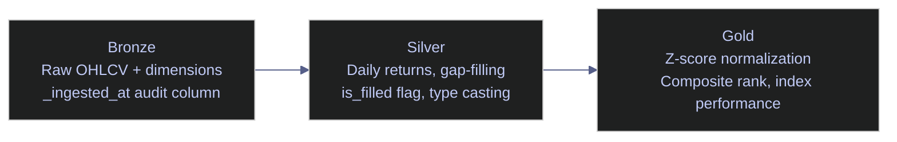

# BigQuery for Data Engineering - Fundamentals

> [!quote]
> "Big data is like teenage sex: everyone talks about it, nobody really knows how to do it, everyone thinks everyone else is doing it, so everyone claims they are doing it."
>
> — **Dan Ariely**, Facebook post (2013)

```python
%load_ext sql
%config SqlMagic.displaycon = False
%config SqlMagic.displaylimit = 0
```

```python
%sql bigquery://bq-wh-nb
```

Connecting to &#x27;bigquery://bq-wh-nb&#x27;

> [!info] BigQuery Uses ADC — No Password
>
> The `bigquery://` connection uses Application Default Credentials — no password in the connection string. Locally: `gcloud auth application-default login`. On VMs/Cloud Run: the metadata server provides credentials automatically. See [gcloud-authentication > The ADC Credential Search Order](https://alp78.github.io/elysium/06-GCP/Core/gcloud-authentication#the-adc-credential-search-order).

## Schema Exploration

### Schema Exploration — List All Tables

First thing in any database — see what's there. The Python client library lists all tables across the three medallion-layer datasets (bronze, silver, gold), which BigQuery organizes as separate schemas (called "datasets"). The result shows table names, row counts, and storage sizes.


```python
from google.cloud import bigquery
bq = bigquery.Client(project='bq-wh-nb')

rows = []
for ds in ['stoxx_bronze', 'stoxx_silver', 'stoxx_gold']:
    for table in bq.list_tables(ds):
        t = bq.get_table(table)
        rows.append({'dataset': ds, 'table': t.table_id,
                     'rows': t.num_rows, 'size_mb': round(t.num_bytes / 1024 / 1024, 2)})

import pandas as pd
pd.DataFrame(rows).sort_values(['dataset', 'table']).reset_index(drop=True)
```

<div>
<table>
  <thead>
    <tr>
      <th></th>
      <th>dataset</th>
      <th>table</th>
      <th>rows</th>
      <th>size_mb</th>
    </tr>
  </thead>
  <tbody>
    <tr>
      <th>0</th>
      <td>stoxx_bronze</td>
      <td>dim_country</td>
      <td>212</td>
      <td>0.00</td>
    </tr>
    <tr>
      <th>1</th>
      <td>stoxx_bronze</td>
      <td>dim_index</td>
      <td>4</td>
      <td>0.00</td>
    </tr>
    <tr>
      <th>2</th>
      <td>stoxx_bronze</td>
      <td>eurostoxx50_ohlcv</td>
      <td>50</td>
      <td>0.00</td>
    </tr>
    <tr>
      <th>3</th>
      <td>stoxx_bronze</td>
      <td>index_dim</td>
      <td>169</td>
      <td>0.27</td>
    </tr>
    <tr>
      <th>4</th>
      <td>stoxx_bronze</td>
      <td>oil20_ohlcv</td>
      <td>19</td>
      <td>0.00</td>
    </tr>
</table>
</div>


### Schema Exploration — Inspect Column Types

Check data types before writing queries — `float` vs `int` vs `varchar` changes how you aggregate and join.


```sql
SELECT
    column_name,
    data_type,
    is_nullable
FROM `bq-wh-nb.stoxx_silver`.INFORMATION_SCHEMA.COLUMNS
WHERE table_name = 'eurostoxx50_ohlcv'
ORDER BY ordinal_position

```

12 rows affected.

<table>
    <thead>
        <tr>
            <th>column_name</th>
            <th>data_type</th>
            <th>is_nullable</th>
        </tr>
    </thead>
    <tbody>
        <tr>
            <td>id</td>
            <td>INT64</td>
            <td>YES</td>
        </tr>
        <tr>
            <td>symbol</td>
            <td>STRING</td>
            <td>YES</td>
        </tr>
        <tr>
            <td>date</td>
            <td>DATE</td>
            <td>YES</td>
        </tr>
        <tr>
            <td>open</td>
            <td>FLOAT64</td>
            <td>YES</td>
        </tr>
        <tr>
            <td>high</td>
            <td>FLOAT64</td>
            <td>YES</td>
        </tr>
</table>


## SELECT, Filtering & Sorting

> [!tip]- BigQuery vs SQL Server — Key Differences
>
> | Behavior | BigQuery | SQL Server |
> |---|---|---|
> | Cost model | Per bytes scanned | Fixed (VM cost) |
> | `LIMIT` effect on cost | No cost reduction | N/A (no per-query cost) |
> | `SELECT *` risk | Scans all columns = expensive | No cost impact |
> | Division by zero | Returns `ERROR` (use `SAFE_DIVIDE`) | Returns `NULL` or `ERROR` |
> | QUALIFY clause | ✅ Supported | ❌ Not available |
> | Recursive CTEs | ✅ (500 iteration default) | ✅ (100 iteration default) |
> | Transactions | ✅ (scripting `BEGIN...END`) | ✅ (`BEGIN TRAN...COMMIT`) |

### SELECT, Filtering & Sorting — Basic SELECT with WHERE

The fundamental query: pick columns, filter rows, sort results. `LIMIT N` limits output (BigQuery). PostgreSQL uses `LIMIT N`.

> [!danger] LIMIT does NOT reduce bytes scanned
>
> `SELECT * FROM table LIMIT 10` still scans the ENTIRE table — BigQuery reads all matching data, then truncates the result. You pay for the full scan regardless of LIMIT. To reduce cost, select only the columns you need and filter on partitioned/clustered columns. See [querying-and-cost-optimization](https://alp78.github.io/elysium/06-GCP/BigQuery/querying-and-cost-optimization).

> [!success] Safe Pattern
>
> Name specific columns instead of `SELECT *`, and always filter on the partition column when querying large tables: `WHERE date >= '2026-01-01'`. Use `bq query --dry_run` to preview bytes before running an unfamiliar query.

> [!tip] Backtick escaping for table references
>
> BigQuery requires backticks around `project.dataset.table` when the project ID contains hyphens: `` `my-project.dataset.table` ``. Without backticks, the parser interprets the hyphen as minus. Column names that are reserved words (`close`, `open`) also need backticks, whereas SQL Server uses `[brackets]`.

```sql
SELECT
    symbol,
    date,
    `open`,
    high,
    low,
    `close`,
    volume
FROM `bq-wh-nb.stoxx_silver.eurostoxx50_ohlcv`
WHERE symbol = 'ASML.AS'
ORDER BY date DESC
LIMIT 10
```

10 rows affected.

<table>
    <thead>
        <tr>
            <th>symbol</th>
            <th>date</th>
            <th>open</th>
            <th>high</th>
            <th>low</th>
            <th>close</th>
            <th>volume</th>
        </tr>
    </thead>
    <tbody>
        <tr>
            <td>ASML.AS</td>
            <td>2026-03-12</td>
            <td>1194.8</td>
            <td>1202.2</td>
            <td>1187.8</td>
            <td>1190.8</td>
            <td>128223</td>
        </tr>
        <tr>
            <td>ASML.AS</td>
            <td>2026-03-11</td>
            <td>1188.4</td>
            <td>1210.8</td>
            <td>1174.0</td>
            <td>1198.8</td>
            <td>562904</td>
        </tr>
        <tr>
            <td>ASML.AS</td>
            <td>2026-03-10</td>
            <td>1188.4</td>
            <td>1208.4</td>
            <td>1172.2</td>
            <td>1200.0</td>
            <td>800815</td>
        </tr>
        <tr>
            <td>ASML.AS</td>
            <td>2026-03-09</td>
            <td>1072.0</td>
            <td>1147.6</td>
            <td>1060.2</td>
            <td>1147.6</td>
            <td>689086</td>
        </tr>
        <tr>
            <td>ASML.AS</td>
            <td>2026-03-06</td>
            <td>1186.0</td>
            <td>1192.6</td>
            <td>1112.8</td>
            <td>1147.0</td>
            <td>857271</td>
        </tr>
</table>


### SELECT, Filtering & Sorting — Multi-Condition WHERE

Combine conditions with `AND` / `OR`. Use `ABS()` for absolute values. This finds high-volume days with large price swings — potential breakout or crash days.


```sql
SELECT
    symbol,
    date,
    `close`,
    volume,
    ROUND((`close` - `open`) / `open` * 100, 2) AS daily_move_pct
FROM `bq-wh-nb.stoxx_silver.eurostoxx50_ohlcv`
WHERE volume > 5000000
  AND ABS((`close` - `open`) / `open`) > 0.03
  AND date >= '2025-01-01'
ORDER BY ABS((`close` - `open`) / `open`) DESC
LIMIT 15
```

15 rows affected.

<table>
    <thead>
        <tr>
            <th>symbol</th>
            <th>date</th>
            <th>close</th>
            <th>volume</th>
            <th>daily_move_pct</th>
        </tr>
    </thead>
    <tbody>
        <tr>
            <td>IFX.DE</td>
            <td>2025-04-10</td>
            <td>25.78</td>
            <td>11549391</td>
            <td>-13.78</td>
        </tr>
        <tr>
            <td>ENR.DE</td>
            <td>2025-04-07</td>
            <td>48.56</td>
            <td>8552960</td>
            <td>13.59</td>
        </tr>
        <tr>
            <td>SAN.MC</td>
            <td>2025-04-07</td>
            <td>5.243</td>
            <td>120129181</td>
            <td>12.87</td>
        </tr>
        <tr>
            <td>SAN.MC</td>
            <td>2025-04-10</td>
            <td>5.662</td>
            <td>63808362</td>
            <td>-11.14</td>
        </tr>
        <tr>
            <td>DSY.PA</td>
            <td>2026-02-16</td>
            <td>15.96</td>
            <td>7671987</td>
            <td>-10.81</td>
        </tr>
</table>


## Aggregation (GROUP BY)

> [!danger] BigQuery Bills Per Bytes Scanned
>
> BigQuery charges per bytes scanned — `SELECT *` on a 1TB table costs ~$5.
> Unlike SQL Server (fixed cost), BigQuery bills per query based on columns accessed.
> Always `SELECT` only the columns you need. A `GROUP BY` that reads all columns before
> aggregating is expensive. Use `SELECT col1, col2, AGG(col3)` not `SELECT *, AGG(col3)`.

> [!success] Safe Pattern
>
> Always name only the columns your aggregation needs. In GROUP BY queries, list the grouping key and aggregate inputs explicitly — never `SELECT *`. Run `bq query --dry_run --use_legacy_sql=false 'SELECT ...'` to confirm bytes billed before executing expensive queries.

### Aggregation GROUP BY — Aggregate by Stock

`GROUP BY` collapses rows into groups. Aggregate functions (`AVG`, `COUNT`, `SUM`, `MIN`, `MAX`) summarize each group. This ranks stocks by average trading volume — a liquidity measure.


```sql
SELECT
    symbol,
    COUNT(*) AS trading_days,
    ROUND(AVG(CAST(volume AS FLOAT64)), 0) AS avg_volume,
    ROUND(AVG(`close`), 2) AS avg_close,
    MIN(date) AS first_date,
    MAX(date) AS last_date
FROM `bq-wh-nb.stoxx_silver.eurostoxx50_ohlcv`
GROUP BY symbol
ORDER BY avg_volume DESC
LIMIT 10
```

10 rows affected.

<table>
    <thead>
        <tr>
            <th>symbol</th>
            <th>trading_days</th>
            <th>avg_volume</th>
            <th>avg_close</th>
            <th>first_date</th>
            <th>last_date</th>
        </tr>
    </thead>
    <tbody>
        <tr>
            <td>ISP.MI</td>
            <td>1321</td>
            <td>87588601.0</td>
            <td>3.15</td>
            <td>2021-01-04</td>
            <td>2026-03-12</td>
        </tr>
        <tr>
            <td>SAN.MC</td>
            <td>1329</td>
            <td>41770987.0</td>
            <td>4.43</td>
            <td>2021-01-04</td>
            <td>2026-03-12</td>
        </tr>
        <tr>
            <td>ENEL.MI</td>
            <td>1321</td>
            <td>24678699.0</td>
            <td>6.82</td>
            <td>2021-01-04</td>
            <td>2026-03-12</td>
        </tr>
        <tr>
            <td>BBVA.MC</td>
            <td>1329</td>
            <td>16654457.0</td>
            <td>8.65</td>
            <td>2021-01-04</td>
            <td>2026-03-12</td>
        </tr>
        <tr>
            <td>UCG.MI</td>
            <td>1321</td>
            <td>13903710.0</td>
            <td>28.46</td>
            <td>2021-01-04</td>
            <td>2026-03-12</td>
        </tr>
</table>


### Aggregation GROUP BY — Aggregate by Time Period

Group by `EXTRACT(YEAR FROM date), EXTRACT(MONTH FROM date)` to build time-series summaries. Shows monthly high/low/average price and total volume — the basis for monthly performance reports.

> [!warning] BigQuery has three date/time types
>
> | Type | Timezone | Use When |
> |---|---|---|
> | `DATE` | None | Trade dates, report dates |
> | `DATETIME` | None (civil time) | Local event times |
> | `TIMESTAMP` | UTC (absolute) | Pipeline timestamps, audit logs |
>
> `CURRENT_TIMESTAMP()` returns UTC. `CURRENT_DATE()` returns date in UTC. For a specific timezone: `DATE(CURRENT_TIMESTAMP(), 'Europe/Prague')`. Mixing types in JOIN/WHERE causes implicit coercion.

> [!success] Safe Pattern
>
> Use `DATE` for trade/report dates, `TIMESTAMP` for pipeline audit columns. When comparing across types, cast explicitly: `CAST(my_datetime AS TIMESTAMP)`. Never rely on implicit coercion in JOIN keys — it masks type mismatches that surface only on certain data.

> [!tip] BigQuery NULL handling differences
>
> BigQuery uses `IFNULL(expr, default)` where SQL Server uses `ISNULL(expr, default)`. `COALESCE()` works identically in both. BigQuery also has `SAFE_DIVIDE(a, b)` which returns `NULL` instead of error on division by zero — SQL Server has no equivalent.

```sql
SELECT
    EXTRACT(YEAR FROM date) AS yr,
    EXTRACT(MONTH FROM date) AS mo,
    COUNT(*) AS days,
    ROUND(MIN(`close`), 2) AS month_low,
    ROUND(MAX(`close`), 2) AS month_high,
    ROUND(AVG(`close`), 2) AS avg_close,
    SUM(volume) AS total_volume
FROM `bq-wh-nb.stoxx_silver.eurostoxx50_ohlcv`
WHERE symbol = 'ASML.AS' AND date >= '2025-01-01'
GROUP BY EXTRACT(YEAR FROM date), EXTRACT(MONTH FROM date)
ORDER BY yr, mo
LIMIT 15
```

15 rows affected.

<table>
    <thead>
        <tr>
            <th>yr</th>
            <th>mo</th>
            <th>days</th>
            <th>month_low</th>
            <th>month_high</th>
            <th>avg_close</th>
            <th>total_volume</th>
        </tr>
    </thead>
    <tbody>
        <tr>
            <td>2025</td>
            <td>1</td>
            <td>22</td>
            <td>646.6</td>
            <td>748.1</td>
            <td>714.71</td>
            <td>19121187</td>
        </tr>
        <tr>
            <td>2025</td>
            <td>2</td>
            <td>20</td>
            <td>678.6</td>
            <td>737.9</td>
            <td>713.04</td>
            <td>15276962</td>
        </tr>
        <tr>
            <td>2025</td>
            <td>3</td>
            <td>21</td>
            <td>606.0</td>
            <td>690.3</td>
            <td>656.58</td>
            <td>17508550</td>
        </tr>
        <tr>
            <td>2025</td>
            <td>4</td>
            <td>20</td>
            <td>550.0</td>
            <td>619.7</td>
            <td>581.0</td>
            <td>22544929</td>
        </tr>
        <tr>
            <td>2025</td>
            <td>5</td>
            <td>21</td>
            <td>601.5</td>
            <td>686.6</td>
            <td>650.18</td>
            <td>13112045</td>
        </tr>
</table>


## JOINs Across Medallion Layers

> [!info] Cross-engine comparison
>
> BigQuery supports all standard JOIN types (INNER, LEFT, RIGHT, FULL, CROSS). SQL Server adds `CROSS APPLY` and `OUTER APPLY` for correlated lateral joins. Firestore has no server-side joins — denormalize your data model or perform client-side joins.

> [!warning] BigQuery JOINs Cause Data Shuffles
>
> BigQuery JOINs can produce massive data shuffles across slots.
> Unlike SQL Server (indexed seeks), BigQuery distributes both sides of a JOIN across
> worker nodes. Joining two large tables forces a full data shuffle. For repeated joins,
> denormalize into a single wide table or use clustering on the join key to reduce shuffle
> cost.

> [!success] Safe Pattern
>
> Cluster large tables on the most common JOIN key (e.g., `symbol`, `_index`). For small dimension tables (< a few hundred MB), BigQuery will automatically broadcast them, avoiding a full shuffle. For repeated cross-table joins, consider materializing the joined result as a gold-layer table instead of re-joining on every query.

### JOIN Across Medallion Layers — OHLCV + Dimension (Silver)

`JOIN` combines rows from two tables on a matching key. Here we join price data (silver OHLCV) with company metadata (silver dimension) to get the latest price + sector + country for each stock.

The subquery with `ROW_NUMBER()` picks only the most recent price per symbol.


```sql
SELECT
    d.symbol,
    d.short_name,
    d.sector,
    d.country,
    p.`close` AS last_close,
    p.date AS last_date,
    p.volume
FROM `bq-wh-nb.stoxx_silver.index_dim` d
JOIN (
    SELECT symbol, `close`, date, volume,
           ROW_NUMBER() OVER (PARTITION BY symbol ORDER BY date DESC) AS rn
    FROM `bq-wh-nb.stoxx_silver.eurostoxx50_ohlcv`
) p ON d.symbol = p.symbol AND p.rn = 1
WHERE d._index = 'euro_stoxx_50' AND d.is_current = TRUE
ORDER BY p.`close` DESC
LIMIT 15
```

15 rows affected.

<table>
    <thead>
        <tr>
            <th>symbol</th>
            <th>short_name</th>
            <th>sector</th>
            <th>country</th>
            <th>last_close</th>
            <th>last_date</th>
            <th>volume</th>
        </tr>
    </thead>
    <tbody>
        <tr>
            <td>RMS.PA</td>
            <td>HERMES INTL</td>
            <td>Consumer Cyclical</td>
            <td>France</td>
            <td>1906.0</td>
            <td>2026-03-12</td>
            <td>18681</td>
        </tr>
        <tr>
            <td>RHM.DE</td>
            <td>RHEINMETALL AG</td>
            <td>Industrials</td>
            <td>Germany</td>
            <td>1551.5</td>
            <td>2026-03-12</td>
            <td>158741</td>
        </tr>
        <tr>
            <td>ASML.AS</td>
            <td>ASML HOLDING</td>
            <td>Technology</td>
            <td>Netherlands</td>
            <td>1190.8</td>
            <td>2026-03-12</td>
            <td>128223</td>
        </tr>
        <tr>
            <td>ADYEN.AS</td>
            <td>ADYEN</td>
            <td>Technology</td>
            <td>Netherlands</td>
            <td>925.7</td>
            <td>2026-03-12</td>
            <td>27887</td>
        </tr>
        <tr>
            <td>ARGX.BR</td>
            <td>ARGENX SE</td>
            <td>Healthcare</td>
            <td>Netherlands</td>
            <td>626.6</td>
            <td>2026-03-12</td>
            <td>14083</td>
        </tr>
</table>


### JOIN Across Medallion Layers — Gold Scores + Dimension (Cross-Layer)

The gold layer has pre-computed composite scores. We join with the dimension table to add human-readable names and sector labels — this is what a dashboard query looks like.


```sql
SELECT
    s.composite_rank AS `rank`,
    s.symbol,
    d.short_name,
    d.sector,
    ROUND(s.composite_score, 4) AS score,
    ROUND(s.relative_value_score, 3) AS value,
    ROUND(s.momentum_score, 3) AS momentum,
    ROUND(s.sentiment_score, 3) AS sentiment,
    s.current_price,
    ROUND(s.index_weight * 100, 2) AS weight_pct
FROM `bq-wh-nb.stoxx_gold.scores_daily` s
JOIN `bq-wh-nb.stoxx_silver.index_dim` d ON s.symbol = d.symbol AND d._index = s._index AND d.is_current = TRUE
WHERE s._index = 'euro_stoxx_50'
  AND s.score_date = (SELECT MAX(score_date) FROM `bq-wh-nb.stoxx_gold.scores_daily` WHERE _index = 'euro_stoxx_50')
ORDER BY s.composite_rank
LIMIT 15
```

15 rows affected.

<table>
    <thead>
        <tr>
            <th>rank</th>
            <th>symbol</th>
            <th>short_name</th>
            <th>sector</th>
            <th>score</th>
            <th>value</th>
            <th>momentum</th>
            <th>sentiment</th>
            <th>current_price</th>
            <th>weight_pct</th>
        </tr>
    </thead>
    <tbody>
        <tr>
            <td>1</td>
            <td>BNP.PA</td>
            <td>BNP PARIBAS ACT.A</td>
            <td>Financial Services</td>
            <td>0.6796</td>
            <td>1.497</td>
            <td>0.46</td>
            <td>0.081</td>
            <td>87.44</td>
            <td>1.94</td>
        </tr>
        <tr>
            <td>2</td>
            <td>VOW.DE</td>
            <td>VOLKSWAGEN AG</td>
            <td>Consumer Cyclical</td>
            <td>0.5756</td>
            <td>1.028</td>
            <td>-0.382</td>
            <td>1.081</td>
            <td>92.85</td>
            <td>0.93</td>
        </tr>
        <tr>
            <td>3</td>
            <td>DTE.DE</td>
            <td>DEUTSCHE TELEKOM AG</td>
            <td>Communication Services</td>
            <td>0.487</td>
            <td>0.226</td>
            <td>0.706</td>
            <td>0.529</td>
            <td>32.55</td>
            <td>3.13</td>
        </tr>
        <tr>
            <td>4</td>
            <td>TTE.PA</td>
            <td>TOTALENERGIES</td>
            <td>Energy</td>
            <td>0.3913</td>
            <td>0.585</td>
            <td>1.307</td>
            <td>-0.719</td>
            <td>69.8</td>
            <td>2.95</td>
        </tr>
        <tr>
            <td>5</td>
            <td>ABI.BR</td>
            <td>AB INBEV</td>
            <td>Consumer Defensive</td>
            <td>0.3852</td>
            <td>0.251</td>
            <td>0.537</td>
            <td>0.368</td>
            <td>62.76</td>
            <td>2.43</td>
        </tr>
</table>


## Window Functions

Window functions compute a value for each row based on a "window" of related rows — without collapsing the result set like `GROUP BY`. The `OVER()` clause defines the window: `PARTITION BY` groups rows (like GROUP BY but without collapsing), `ORDER BY` sorts within each partition, and the frame clause (`ROWS BETWEEN`) controls which rows the function sees. BigQuery distributes window function computation across slots — each slot handles a subset of partitions in parallel.

> [!info] Cross-engine comparison
>
> Window functions are available in BigQuery (GoogleSQL) and SQL Server (T-SQL) with near-identical syntax. Key difference: BigQuery supports `QUALIFY` for filtering on window results without a subquery (not ANSI SQL, not available in SQL Server). Firestore has no window functions — ranking and running totals must be computed client-side.

### Window Functions — Moving Averages (SMA)

A **moving average** smooths price data over N days. Used for trend detection:
- **SMA 30** (short-term): responsive to recent price action
- **SMA 90** (long-term): filters out noise
- Price above SMA = bullish momentum. Below = bearish.

`AVG() OVER (ROWS BETWEEN N PRECEDING AND CURRENT ROW)` — the window slides forward one row at a time.


```sql
SELECT
    symbol,
    date,
    ROUND(`close`, 2) AS `close`,
    ROUND(AVG(`close`) OVER (
        PARTITION BY symbol ORDER BY date
        ROWS BETWEEN 29 PRECEDING AND CURRENT ROW
    ), 2) AS sma_30,
    ROUND(AVG(`close`) OVER (
        PARTITION BY symbol ORDER BY date
        ROWS BETWEEN 89 PRECEDING AND CURRENT ROW
    ), 2) AS sma_90
FROM `bq-wh-nb.stoxx_silver.eurostoxx50_ohlcv`
WHERE symbol = 'ASML.AS'
ORDER BY date DESC
LIMIT 15
```

15 rows affected.

<table>
    <thead>
        <tr>
            <th>symbol</th>
            <th>date</th>
            <th>close</th>
            <th>sma_30</th>
            <th>sma_90</th>
        </tr>
    </thead>
    <tbody>
        <tr>
            <td>ASML.AS</td>
            <td>2026-03-12</td>
            <td>1190.8</td>
            <td>1204.41</td>
            <td>1052.59</td>
        </tr>
        <tr>
            <td>ASML.AS</td>
            <td>2026-03-11</td>
            <td>1198.8</td>
            <td>1204.45</td>
            <td>1049.65</td>
        </tr>
        <tr>
            <td>ASML.AS</td>
            <td>2026-03-10</td>
            <td>1200.0</td>
            <td>1204.31</td>
            <td>1046.53</td>
        </tr>
        <tr>
            <td>ASML.AS</td>
            <td>2026-03-09</td>
            <td>1147.6</td>
            <td>1204.89</td>
            <td>1043.62</td>
        </tr>
        <tr>
            <td>ASML.AS</td>
            <td>2026-03-06</td>
            <td>1147.0</td>
            <td>1205.91</td>
            <td>1041.08</td>
        </tr>
</table>


### Window Functions — LAG / LEAD Compare Rows

**LAG(col, N)** returns the value from N rows **before** the current row.
**LEAD(col, N)** returns the value from N rows **after**.

Use cases:
- **Daily returns**: `(close - LAG(close)) / LAG(close)`
- **Gap detection**: `DATE_DIFF(date, LAG(date), DAY)` — a `days_gap` value >1 indicates a weekend (normal: 3 for Fri→Mon) or holiday (>3 is unusual and worth investigating)
- **Trend direction**: compare today vs yesterday


```sql
SELECT
    symbol,
    date,
    ROUND(`close`, 2) AS `close`,
    ROUND(LAG(`close`) OVER (PARTITION BY symbol ORDER BY date), 2) AS prev_close,
    ROUND(
        (`close` - LAG(`close`) OVER (PARTITION BY symbol ORDER BY date))
        / LAG(`close`) OVER (PARTITION BY symbol ORDER BY date) * 100,
    2) AS daily_return_pct,
    DATE_DIFF(date
    , LAG(date) OVER (PARTITION BY symbol ORDER BY date), DAY) AS days_gap
FROM `bq-wh-nb.stoxx_silver.eurostoxx50_ohlcv`
WHERE symbol = 'ASML.AS'
ORDER BY date DESC
LIMIT 15
```

15 rows affected.

<table>
    <thead>
        <tr>
            <th>symbol</th>
            <th>date</th>
            <th>close</th>
            <th>prev_close</th>
            <th>daily_return_pct</th>
            <th>days_gap</th>
        </tr>
    </thead>
    <tbody>
        <tr>
            <td>ASML.AS</td>
            <td>2026-03-12</td>
            <td>1190.8</td>
            <td>1198.8</td>
            <td>-0.67</td>
            <td>1</td>
        </tr>
        <tr>
            <td>ASML.AS</td>
            <td>2026-03-11</td>
            <td>1198.8</td>
            <td>1200.0</td>
            <td>-0.1</td>
            <td>1</td>
        </tr>
        <tr>
            <td>ASML.AS</td>
            <td>2026-03-10</td>
            <td>1200.0</td>
            <td>1147.6</td>
            <td>4.57</td>
            <td>1</td>
        </tr>
        <tr>
            <td>ASML.AS</td>
            <td>2026-03-09</td>
            <td>1147.6</td>
            <td>1147.0</td>
            <td>0.05</td>
            <td>3</td>
        </tr>
        <tr>
            <td>ASML.AS</td>
            <td>2026-03-06</td>
            <td>1147.0</td>
            <td>1186.0</td>
            <td>-3.29</td>
            <td>1</td>
        </tr>
</table>


### Window Functions — RANK / DENSE_RANK / NTILE Ranking

- **RANK()**: assigns rank with gaps (1, 2, 2, 4)
- **DENSE_RANK()**: no gaps (1, 2, 2, 3)
- **ROW_NUMBER()**: unique, no ties (1, 2, 3, 4)
- **NTILE(N)**: divide rows into N equal buckets (quartiles, deciles)

This is the core of the gold scoring engine — rank stocks by composite score.


> [!info] Two-CTE Self-Join Pattern
>
> CTE `bounds` computes the year's first and last trading dates in one scan. CTE `ytd` self-joins to get the opening and closing prices for each symbol. The final SELECT ranks by YTD return.

```sql
WITH bounds AS (
    SELECT
        MIN(CASE WHEN EXTRACT(YEAR FROM date)
            = EXTRACT(YEAR FROM CURRENT_DATE()) THEN date END) AS first_date,
        MAX(date) AS last_date
    FROM `bq-wh-nb.stoxx_silver.eurostoxx50_ohlcv`
),
ytd AS (
    SELECT f.symbol,
        ROUND((l.`close` - f.`close`) / NULLIF(f.`close`, 0), 4) AS ytd_return
    FROM `bq-wh-nb.stoxx_silver.eurostoxx50_ohlcv` f
    JOIN `bq-wh-nb.stoxx_silver.eurostoxx50_ohlcv` l ON f.symbol = l.symbol
    JOIN bounds b ON f.date = b.first_date AND l.date = b.last_date
)
SELECT symbol, ytd_return,
    RANK() OVER (ORDER BY ytd_return DESC) AS rank_best,
    RANK() OVER (ORDER BY ytd_return ASC) AS rank_worst,
    NTILE(4) OVER (ORDER BY ytd_return DESC) AS quartile
FROM ytd
ORDER BY rank_best LIMIT 10
```

10 rows affected.

<table>
    <thead>
        <tr>
            <th>symbol</th>
            <th>ytd_return</th>
            <th>rank_best</th>
            <th>rank_worst</th>
            <th>quartile</th>
        </tr>
    </thead>
    <tbody>
        <tr>
            <td>ENI.MI</td>
            <td>0.3042</td>
            <td>1</td>
            <td>50</td>
            <td>1</td>
        </tr>
        <tr>
            <td>ENR.DE</td>
            <td>0.2508</td>
            <td>2</td>
            <td>49</td>
            <td>1</td>
        </tr>
        <tr>
            <td>TTE.PA</td>
            <td>0.2437</td>
            <td>3</td>
            <td>48</td>
            <td>1</td>
        </tr>
        <tr>
            <td>ASML.AS</td>
            <td>0.2073</td>
            <td>4</td>
            <td>47</td>
            <td>1</td>
        </tr>
        <tr>
            <td>AD.AS</td>
            <td>0.1772</td>
            <td>5</td>
            <td>46</td>
            <td>1</td>
        </tr>
</table>


## CTEs & Subqueries

A CTE (`WITH name AS (SELECT ...)`) creates a named temporary result set scoped to the enclosing query. CTEs improve readability by breaking complex queries into named steps. BigQuery also supports recursive CTEs (covered in the [advanced patterns](https://alp78.github.io/elysium/05-DB-Queries/BigQuery/bq-advanced) file).

> [!info] Cross-engine comparison
>
> BigQuery supports recursive CTEs (500 iteration default). SQL Server also supports recursive CTEs (100 iteration default). Firestore has no query-level CTE or subquery capability.

### CTEs & Subqueries — Sector Heatmap

A **CTE** (`WITH name AS (SELECT ...)`) is a named temporary result set. Chaining CTEs makes complex queries readable — each step has a name.

This builds a sector heatmap: average score, best/worst rank per sector.


```sql
WITH latest_scores AS (
    SELECT s.symbol, s.composite_score, s.relative_value_score,
           s.momentum_score, s.sentiment_score, s.composite_rank,
           s.current_price, s.index_weight, d.sector, d.short_name
    FROM `bq-wh-nb.stoxx_gold.scores_daily` s
    JOIN `bq-wh-nb.stoxx_silver.index_dim` d ON s.symbol = d.symbol AND d._index = s._index AND d.is_current = TRUE
    WHERE s._index = 'euro_stoxx_50'
      AND s.score_date = (SELECT MAX(score_date) FROM `bq-wh-nb.stoxx_gold.scores_daily` WHERE _index = 'euro_stoxx_50')
),
sector_stats AS (
    SELECT 
        sector,
        COUNT(*) AS stocks,
        ROUND(AVG(composite_score), 4) AS avg_score,
        ROUND(AVG(relative_value_score), 4) AS avg_value,
        ROUND(AVG(momentum_score), 4) AS avg_momentum,
        MIN(composite_rank) AS best_rank,
        MAX(composite_rank) AS worst_rank
    FROM latest_scores
    GROUP BY sector
)
SELECT * FROM sector_stats
ORDER BY avg_score DESC
```

10 rows affected.

<table>
    <thead>
        <tr>
            <th>sector</th>
            <th>stocks</th>
            <th>avg_score</th>
            <th>avg_value</th>
            <th>avg_momentum</th>
            <th>best_rank</th>
            <th>worst_rank</th>
        </tr>
    </thead>
    <tbody>
        <tr>
            <td>Communication Services</td>
            <td>1</td>
            <td>0.487</td>
            <td>0.226</td>
            <td>0.7064</td>
            <td>3</td>
            <td>3</td>
        </tr>
        <tr>
            <td>Energy</td>
            <td>2</td>
            <td>0.3286</td>
            <td>0.5744</td>
            <td>1.6426</td>
            <td>4</td>
            <td>11</td>
        </tr>
        <tr>
            <td>Healthcare</td>
            <td>4</td>
            <td>0.0812</td>
            <td>-0.07</td>
            <td>-0.3722</td>
            <td>10</td>
            <td>32</td>
        </tr>
        <tr>
            <td>Technology</td>
            <td>5</td>
            <td>0.0522</td>
            <td>0.0128</td>
            <td>-0.6536</td>
            <td>6</td>
            <td>47</td>
        </tr>
        <tr>
            <td>Industrials</td>
            <td>10</td>
            <td>0.0504</td>
            <td>0.0</td>
            <td>-0.0204</td>
            <td>8</td>
            <td>43</td>
        </tr>
</table>


### CTEs & Subqueries — Chained CTEs Cross-Index Comparison

Multiple CTEs chained together. Compares YTD performance, volatility, and valuation across all 4 indices — the kind of query an index provider runs daily.


```sql
WITH latest_perf AS (
    SELECT *,
           ROW_NUMBER() OVER (PARTITION BY _index ORDER BY perf_date DESC) AS rn
    FROM `bq-wh-nb.stoxx_gold.index_performance`
)
SELECT 
    p._index,
    d.display_name,
    p.perf_date,
    ROUND(p.ytd_return * 100, 2) AS ytd_pct,
    ROUND(p.rolling_30d_return * 100, 2) AS ret_30d_pct,
    ROUND(p.rolling_30d_volatility * 100, 2) AS vol_30d_pct,
    p.stocks_count,
    ROUND(p.avg_pe, 1) AS avg_pe,
    ROUND(p.avg_dividend_yield * 100, 2) AS div_yield_pct
FROM latest_perf p
JOIN `bq-wh-nb.stoxx_bronze.dim_index` d ON p._index = d.index_key
WHERE p.rn = 1
ORDER BY ytd_pct DESC
```

4 rows affected.

<table>
    <thead>
        <tr>
            <th>_index</th>
            <th>display_name</th>
            <th>perf_date</th>
            <th>ytd_pct</th>
            <th>ret_30d_pct</th>
            <th>vol_30d_pct</th>
            <th>stocks_count</th>
            <th>avg_pe</th>
            <th>div_yield_pct</th>
        </tr>
    </thead>
    <tbody>
        <tr>
            <td>oil_20</td>
            <td>Oil & Gas 20</td>
            <td>2026-03-11</td>
            <td>27.7</td>
            <td>15.33</td>
            <td>21.93</td>
            <td>19</td>
            <td>16.1</td>
            <td>3.28</td>
        </tr>
        <tr>
            <td>stoxx_asia_50</td>
            <td>STOXX Asia/Pacific 50</td>
            <td>2026-03-12</td>
            <td>5.45</td>
            <td>2.68</td>
            <td>23.3</td>
            <td>50</td>
            <td>15.8</td>
            <td>1.96</td>
        </tr>
        <tr>
            <td>stoxx_usa_50</td>
            <td>STOXX USA 50</td>
            <td>2026-03-11</td>
            <td>3.71</td>
            <td>0.6</td>
            <td>13.32</td>
            <td>50</td>
            <td>20.8</td>
            <td>1.42</td>
        </tr>
        <tr>
            <td>euro_stoxx_50</td>
            <td>Euro Stoxx 50</td>
            <td>2026-03-12</td>
            <td>-2.39</td>
            <td>-2.08</td>
            <td>18.06</td>
            <td>50</td>
            <td>14.0</td>
            <td>2.9</td>
        </tr>
</table>


## Data Quality Checks

Quality gates validate data integrity at each medallion layer boundary. Run these checks after every load — if any check returns a non-zero count, investigate before promoting data to the next layer. The `UNION ALL` pattern below stacks multiple independent checks into a single result set, making it easy to scan for issues in one query.

### Data Quality Checks — UNION ALL Quality Gate

Every pipeline needs quality gates. `UNION ALL` stacks multiple checks into one result. Run this after every load — if any check returns non-zero, investigate before promoting to gold.


> [!tip] UNION ALL Quality Gate Pattern
>
> Stack multiple checks into one result set. Each check returns a named row with an issue count. Any non-zero value needs investigation before promoting to gold.

The first cell checks structural integrity (null prices, negative values, high < low). The second checks operational health (gap-filled row count, data freshness).

```sql
SELECT 'null_prices' AS check_name, COUNT(*) AS issues
FROM `bq-wh-nb.stoxx_silver.eurostoxx50_ohlcv`
WHERE `close` IS NULL OR `open` IS NULL
UNION ALL
SELECT 'negative_prices', COUNT(*)
FROM `bq-wh-nb.stoxx_silver.eurostoxx50_ohlcv`
WHERE `close` < 0 OR `open` < 0
UNION ALL
SELECT 'high_lt_low', COUNT(*)
FROM `bq-wh-nb.stoxx_silver.eurostoxx50_ohlcv`
WHERE high < low
```

```sql
SELECT 'gap_filled_rows' AS check_name, COUNT(*) AS issues
FROM `bq-wh-nb.stoxx_silver.eurostoxx50_ohlcv`
WHERE is_filled = TRUE
UNION ALL
SELECT 'days_since_update',
       DATE_DIFF(CURRENT_DATE(), MAX(date), DAY)
FROM `bq-wh-nb.stoxx_silver.eurostoxx50_ohlcv`
```

5 rows affected.

<table>
    <thead>
        <tr>
            <th>check_name</th>
            <th>issues</th>
        </tr>
    </thead>
    <tbody>
        <tr>
            <td>null_prices</td>
            <td>0</td>
        </tr>
        <tr>
            <td>negative_prices</td>
            <td>0</td>
        </tr>
        <tr>
            <td>high_lt_low</td>
            <td>0</td>
        </tr>
        <tr>
            <td>gap_filled_rows</td>
            <td>6</td>
        </tr>
        <tr>
            <td>days_since_update</td>
            <td>10</td>
        </tr>
</table>


## Bronze → Silver → Gold Transforms

The medallion architecture organizes data into three progressive layers: **bronze** (raw ingestion, minimal transformation), **silver** (cleaned, enriched, business-typed), and **gold** (aggregated, scored, dashboard-ready). Each transform query reads from the layer below and writes to the layer above.



> [!tip] Related pattern
>
> The transforms below query data that was first ingested through the [data-loading-and-export](https://alp78.github.io/elysium/06-GCP/BigQuery/data-loading-and-export) pipeline. Understanding how data arrives in bronze helps explain the schemas these queries target.

### Bronze → Silver → Gold Transforms — Daily Returns

The silver transform adds computed columns to raw data. Here, `LAG()` computes daily returns from the price time series. The `is_filled` flag marks gap-filled rows (weekends/holidays).


```sql
SELECT
    symbol,
    date,
    ROUND(`close`, 2) AS `close`,
    ROUND(
        (`close` - LAG(`close`) OVER (PARTITION BY symbol ORDER BY date))
        / NULLIF(LAG(`close`) OVER (PARTITION BY symbol ORDER BY date), 0),
    4) AS daily_return,
    is_filled
FROM `bq-wh-nb.stoxx_silver.eurostoxx50_ohlcv`
WHERE symbol = 'ASML.AS'
ORDER BY date DESC
LIMIT 10
```

10 rows affected.

<table>
    <thead>
        <tr>
            <th>symbol</th>
            <th>date</th>
            <th>close</th>
            <th>daily_return</th>
            <th>is_filled</th>
        </tr>
    </thead>
    <tbody>
        <tr>
            <td>ASML.AS</td>
            <td>2026-03-12</td>
            <td>1190.8</td>
            <td>-0.0067</td>
            <td>False</td>
        </tr>
        <tr>
            <td>ASML.AS</td>
            <td>2026-03-11</td>
            <td>1198.8</td>
            <td>-0.001</td>
            <td>False</td>
        </tr>
        <tr>
            <td>ASML.AS</td>
            <td>2026-03-10</td>
            <td>1200.0</td>
            <td>0.0457</td>
            <td>False</td>
        </tr>
        <tr>
            <td>ASML.AS</td>
            <td>2026-03-09</td>
            <td>1147.6</td>
            <td>0.0005</td>
            <td>False</td>
        </tr>
        <tr>
            <td>ASML.AS</td>
            <td>2026-03-06</td>
            <td>1147.0</td>
            <td>-0.0329</td>
            <td>False</td>
        </tr>
</table>


### Bronze → Silver → Gold Transforms — Z-Score Normalization

The gold transform normalizes scores across the index using z-scores: `(value - mean) / stddev`. Stocks are then ranked by composite score. This is the core of any index scoring engine.


```sql
WITH base AS (
    SELECT symbol, composite_score,
           AVG(composite_score) OVER () AS mean_score,
           STDDEV(composite_score) OVER () AS std_score
    FROM `bq-wh-nb.stoxx_gold.scores_daily`
    WHERE _index = 'euro_stoxx_50'
      AND score_date = (SELECT MAX(score_date) FROM `bq-wh-nb.stoxx_gold.scores_daily` WHERE _index = 'euro_stoxx_50')
)
SELECT
    symbol,
    ROUND(composite_score, 4) AS raw_score,
    ROUND((composite_score - mean_score) / NULLIF(std_score, 0), 2) AS z_score,
    DENSE_RANK() OVER (ORDER BY composite_score DESC) AS `rank`
FROM base
ORDER BY `rank`
LIMIT 10
```

10 rows affected.

<table>
    <thead>
        <tr>
            <th>symbol</th>
            <th>raw_score</th>
            <th>z_score</th>
            <th>rank</th>
        </tr>
    </thead>
    <tbody>
        <tr>
            <td>BNP.PA</td>
            <td>0.6796</td>
            <td>2.08</td>
            <td>1</td>
        </tr>
        <tr>
            <td>VOW.DE</td>
            <td>0.5756</td>
            <td>1.76</td>
            <td>2</td>
        </tr>
        <tr>
            <td>DTE.DE</td>
            <td>0.487</td>
            <td>1.48</td>
            <td>3</td>
        </tr>
        <tr>
            <td>TTE.PA</td>
            <td>0.3913</td>
            <td>1.18</td>
            <td>4</td>
        </tr>
        <tr>
            <td>ABI.BR</td>
            <td>0.3852</td>
            <td>1.16</td>
            <td>5</td>
        </tr>
</table>


