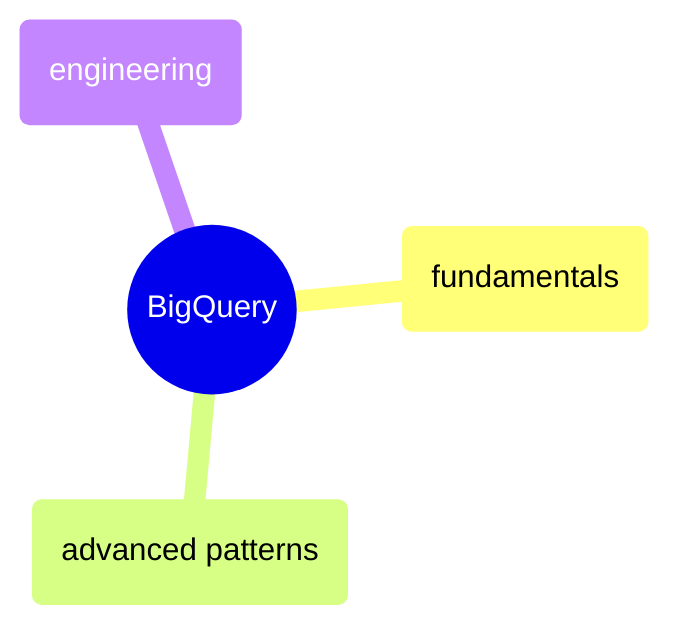

# BigQuery

GoogleSQL query reference across fundamentals, advanced patterns, and engineering — from schema exploration through partitioning strategies.

> [!abstract]- BigQuery Fundamentals
>
> - [[01-bq-fundamentals#Schema Exploration|Schema exploration]]
> - [[01-bq-fundamentals#Aggregation (GROUP BY)|Aggregation and GROUP BY]]
> - [[01-bq-fundamentals#JOINs Across Medallion Layers|JOINs across medallion layers]]
> - [[01-bq-fundamentals#Window Functions|Window functions]]
> - [[01-bq-fundamentals#CTEs & Subqueries|CTEs and subqueries]]
> - [[01-bq-fundamentals#Data Quality Checks|Data quality checks]]

> [!abstract]- BigQuery Advanced
>
> - [[03-bq-advanced#Advanced Window Functions|Advanced window functions]]
> - [[03-bq-advanced#Recursive CTEs|Recursive CTEs]]
> - [[03-bq-advanced#PIVOT|Pivot and unpivot]]
> - [[03-bq-advanced#MERGE (Upsert)|MERGE upsert]]
> - [[03-bq-advanced#Grouping Sets, ROLLUP, CUBE|Grouping sets and rollup]]
> - [[03-bq-advanced#NULL Handling Patterns|NULL handling patterns]]

> [!abstract]- BigQuery Engineering
>
> - [[02-bq-engineering#Views|Views]]
> - [[02-bq-engineering#Stored Procedures|Stored procedures]]
> - [[02-bq-engineering#Indexes|Indexes]]
> - [[02-bq-engineering#Slowly Changing Dimensions (SCD)|Slowly changing dimensions]]
> - [[02-bq-engineering#Execution Plans & Query Optimization|Execution plans and optimization]]
> - [[02-bq-engineering#Partitioning Strategies|Partitioning strategies]]
