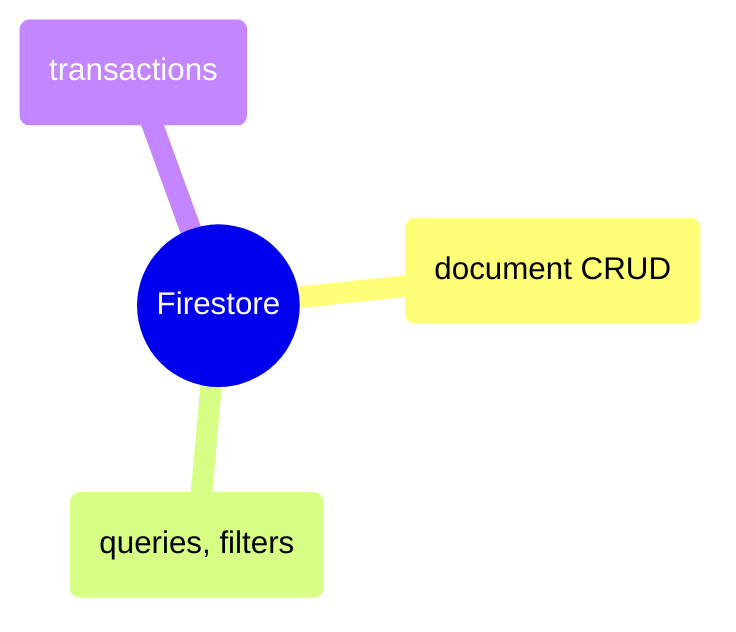

# Firestore

NoSQL document database queries in Python and C# — CRUD, filtering, subcollections, batch operations, and collection group queries.

> [!abstract]- Firestore Queries
>
> - Read operations — [[firestore-python#Read Operations|py]] · [[firestore-csharp#Read Operations|cs]]
> - Filtering and ordering — [[firestore-python#Filtering & Ordering|py]] · [[firestore-csharp#Filtering & Ordering|cs]]
> - Subcollections — [[firestore-python#Subcollections|py]] · [[firestore-csharp#Subcollections|cs]]
> - Write operations — [[firestore-python#Write Operations|py]] · [[firestore-csharp#Write Operations|cs]]
> - Batch operations and transactions — [[firestore-python#Batch Operations & Transactions|py]] · [[firestore-csharp#Batch Operations & Transactions|cs]]
> - Collection group queries — [[firestore-python#Collection Group Queries|py]] · [[firestore-csharp#Collection Group Queries|cs]]
