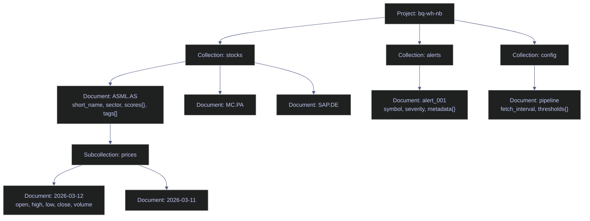

# Firestore for Data Engineering — C#

> [!quote]
> "The value of a database is in direct proportion to the ease with which data can be stored and retrieved."
>
> — **Edgar F. Codd**, *A Relational Model of Data for Large Shared Data Banks* (1970)

> [!danger] .NET 10 Breaks Firestore SDK Reads
>
> On .NET 10, the `Google.Cloud.Firestore` SDK fails on document reads, real-time listeners, and aggregation queries due to a missing `AsyncInterfaces` assembly. Writes work normally. This page uses the Firestore REST API as a workaround for reads. Check for SDK updates before upgrading to .NET 10 in production.

> [!success] Safe Pattern
>
> Stay on .NET 8 or .NET 9 for production Firestore workloads until the SDK ships a .NET 10-compatible release. For .NET 10 notebooks or exploratory code, use the Firestore REST API (`runQuery` / `runAggregationQuery`) as shown throughout this page. Writes via `SetAsync` / `UpdateAsync` are unaffected and can be used normally.

Comprehensive reference for querying, writing, and managing Firestore collections
using the `Google.Cloud.Firestore` C# SDK and REST API.

| Collection | Description | Key Features |
|---|---|---|
| `stocks` | 50 Euro Stoxx constituents | Nested maps, arrays, booleans |
| `stocks/*/prices` | 30-day OHLCV per symbol | Subcollections |
| `sectors` | Aggregated sector scores | Arrays of symbols |
| `alerts` | Pipeline alerts | Mixed severities, timestamps |
| `pipeline_runs` | Audit log | Array of maps (steps) |
| `watchlists` | User watchlists | Ownership, public/private |
| `config` | App configuration | Singleton documents |



1. Setup & Connection
2. Read Operations
3. Filtering & Ordering
4. Nested Fields & Arrays
5. Subcollections
6. Write Operations
7. Batch Operations & Transactions
8. Real-Time Listeners
9. Aggregation Queries
10. Collection Group Queries
11. Pagination & Cursors
12. Maintenance & Monitoring

## Setup & Connection

Initializes the Firestore SDK and REST clients, defines field extraction and index management utilities, and verifies the connection to the `bq-wh-nb` project.

### C# | Polyglot Notebook | suppress assembly warnings

#### C# | suppress CS1701 assembly version warnings

The Polyglot Notebooks kernel emits CS1701 assembly version warnings when loading NuGet packages on .NET 10. This cell suppresses them globally so subsequent output stays clean.

```csharp
using System.Reflection;
using Microsoft.DotNet.Interactive;
using Microsoft.DotNet.Interactive.CSharp;

var csharpKernel = (CSharpKernel)Kernel.Root.FindKernelByName("csharp");
var optionsField = typeof(CSharpKernel).GetField("_scriptOptions",
    BindingFlags.NonPublic | BindingFlags.Instance);
if (optionsField != null)
{
    dynamic opts = optionsField.GetValue(csharpKernel);
    optionsField.SetValue(csharpKernel, opts.WithWarningLevel(0));
}
Console.WriteLine("Warnings suppressed");
```

```text
Warnings suppressed
```


### SDK and REST Client Initialization

This cell:

1. Loads `Google.Cloud.Firestore` and `Microsoft.Bcl.AsyncInterfaces` NuGet packages
2. Sets `GOOGLE_APPLICATION_CREDENTIALS` to the service account key
3. Creates a `FirestoreDb` client and an HTTP client with OAuth2 token for REST API calls
4. Defines a `RestQuery()` helper that sends structured queries to the Firestore REST API

> [!warning] .NET 10 SDK Read Failure
>
> On .NET 10, Firestore SDK reads fail due to a missing `AsyncInterfaces` assembly. Writes work fine. For reads, we use the Firestore REST API as a workaround.

> [!success] Safe Pattern
>
> Add `#r "nuget: Microsoft.Bcl.AsyncInterfaces"` before loading the Firestore SDK, and use the REST client (`HttpClient` + OAuth2 token) for all collection reads. Single-document reads via `GetSnapshotAsync()` work normally on .NET 10.

> [!warning] Key File for Local Dev Only
>
> Setting `GOOGLE_APPLICATION_CREDENTIALS` to a local key file works for development but is a security liability. On production VMs and Cloud Run, remove this env var — the metadata server provides credentials automatically. See [gcp-identity-and-connection-patterns > Metadata Server](https://alp78.github.io/elysium/06-GCP/Security/gcp-identity-and-connection-patterns#metadata-server-gce-vms-cloud-run--the-production-standard).

> [!success] Safe Pattern
>
> Store the key path in a `.env` file excluded from version control, and never commit `gcp-*-key.json` to git. In production, rely on the metadata server — no env var or key file needed.

> [!info] Two Clients — SDK and REST
>
> - **SDK client** — used for writes and single-document reads on .NET 10. Collection-level reads fail on .NET 10 due to a missing `AsyncInterfaces` assembly but work normally on .NET 8/9. Both SDK and REST versions are demonstrated throughout this page.
> - **REST client** — used for collection reads, filtered queries, and collection group queries. This is the .NET 10 workaround; in .NET 8/9 the SDK handles everything.

#### C# | Firestore SDK + REST | load packages, create FirestoreDb, HTTP client, and OAuth2 token

```csharp
#r "nuget: Microsoft.Bcl.AsyncInterfaces, 10.0.0"
#r "nuget: Google.Cloud.Firestore"

using Google.Cloud.Firestore;
using System.Collections.Generic;
using System.Net.Http;
using System.Net.Http.Headers;
using System.Text;
using System.Text.Json;

Environment.SetEnvironmentVariable("GOOGLE_APPLICATION_CREDENTIALS",
    @"C:\Users\aperi\DEV\LANG\gcp-bq-key.json");

var db = FirestoreDb.Create("bq-wh-nb");

var credential = Google.Apis.Auth.OAuth2.GoogleCredential.GetApplicationDefault()
    .CreateScoped("https://www.googleapis.com/auth/datastore");
var token = await credential.UnderlyingCredential.GetAccessTokenForRequestAsync();
var http = new HttpClient();
http.DefaultRequestHeaders.Authorization = new AuthenticationHeaderValue("Bearer", token);

var baseUrl = "https://firestore.googleapis.com/v1/projects/bq-wh-nb/databases/(default)/documents";

Console.WriteLine("Connected to Firestore (SDK + REST).");
```

```text
Installed Packages: Google.Cloud.Firestore, 4.2.0, Microsoft.Bcl.AsyncInterfaces, 10.0.5
Connected to Firestore (SDK + REST).
```


### SDK-Only Connection — `FirestoreDbBuilder`

The setup above creates both an SDK client and a REST client for the `(default)` database. When targeting a **named database** (e.g. `main`), use `FirestoreDbBuilder` with an explicit `DatabaseId`. This approach is SDK-only and does not require a REST client.

#### C# | FirestoreDbBuilder | connect to a named database

```csharp
var dbMain = new FirestoreDbBuilder { ProjectId = "bq-wh-nb", DatabaseId = "main" }.Build();
```

### REST Query Helper — `RestQuery()`

Firestore REST API uses **structured queries** — a JSON body describing the filter,
ordering, and limit. This helper sends the query and returns a list of parsed document elements.

This cell:

1. Defines `RestQuery(queryJson)` — sends a POST to `{baseUrl}:runQuery`
2. Parses the JSON response array
3. Extracts only items that have a `document` property (skips empty results)
4. Returns a `List<JsonElement>` of Firestore documents

Used by all filter/query cells below.

#### C# | REST API | define RestQuery() helper

```csharp
async Task<List<JsonElement>> RestQuery(string queryJson)
{
    var resp = await http.PostAsync(
        $"{baseUrl}:runQuery",
        new StringContent(queryJson, Encoding.UTF8, "application/json"));

    var body = await resp.Content.ReadAsStringAsync();
    var results = JsonDocument.Parse(body).RootElement;

    var docs = new List<JsonElement>();
    foreach (var item in results.EnumerateArray())
        if (item.TryGetProperty("document", out var doc))
            docs.Add(doc);
    return docs;
}

Console.WriteLine("RestQuery() helper loaded.");
```

```text
RestQuery() helper loaded.
```


### Field Extraction Helpers

Firestore REST API wraps every field value in a type envelope:

```json
{ "current_price": { "doubleValue": 178.50 } }
{ "symbol": { "stringValue": "ASML.AS" } }
{ "is_active": { "booleanValue": true } }
{ "volume": { "integerValue": "1500000" } }
```

These helpers unwrap the type envelope and return the native C# value.
Without them, every field access would need 2 levels of `TryGetProperty()`.

#### C# | REST API | define GetStr, GetDbl, GetBool, GetInt field helpers

```csharp
string GetStr(JsonElement fields, string key) =>
    fields.TryGetProperty(key, out var v) && v.TryGetProperty("stringValue", out var s)
        ? s.GetString() ?? "" : "";

double GetDbl(JsonElement fields, string key) =>
    fields.TryGetProperty(key, out var v) && v.TryGetProperty("doubleValue", out var d)
        ? d.GetDouble() : 0;

bool GetBool(JsonElement fields, string key) =>
    fields.TryGetProperty(key, out var v) && v.TryGetProperty("booleanValue", out var b)
        && b.GetBoolean();

long GetInt(JsonElement fields, string key) =>
    fields.TryGetProperty(key, out var v) && v.TryGetProperty("integerValue", out var i)
        ? long.Parse(i.GetString() ?? "0") : 0;

Console.WriteLine("Field extraction helpers loaded: GetStr, GetDbl, GetBool, GetInt");
```

```text
Field extraction helpers loaded: GetStr, GetDbl, GetBool, GetInt
```


### Index Utility — `EnsureIndex()`

Firestore requires **explicit indexes** for:
- **Compound queries**: filtering on two fields (e.g., `country == "Germany"` AND `price < 200`)
- **Collection group queries**: querying across all subcollections with the same name

Single-field queries on a single collection work out of the box (auto-indexed).

This utility:
1. Calls the Firestore Admin REST API to create a composite index
2. Polls until the index state is `READY`
3. For single-field collection group indexes, creates a **field exemption** via PATCH
4. Is **idempotent** — safe to call multiple times

Called automatically before queries that need an index.

#### C# | Admin REST API | set base URL for index management

The Firestore Admin REST API manages index creation and field exemptions. The base URL encodes both the project ID and database name.

```csharp
var adminBaseUrl = "https://firestore.googleapis.com/v1/"
    + "projects/bq-wh-nb/databases/(default)";
```

#### C# | Admin REST API | EnsureIndex() — create composite or collection group indexes

Routes to the correct method based on field count and scope. Multi-field indexes use POST to the indexes endpoint. Single-field collection group indexes use the field exemption PATCH endpoint. Idempotent — safe to call multiple times.

```csharp
async Task EnsureIndex(string collection,
    (string fieldPath, string order)[] fields,
    string scope = "COLLECTION")
{
    var fieldNames = string.Join(" + ",
        fields.Select(f => f.fieldPath));

    // Single-field collection group → field exemption
    if (scope == "COLLECTION_GROUP" && fields.Length == 1)
    {
        await EnsureFieldExemption(
            collection, fields[0].fieldPath, fields[0].order);
        return;
    }

    // Multi-field → POST to Admin API indexes endpoint
    var parent = $"{adminBaseUrl}/collectionGroups/{collection}";
    var fieldsArr = fields.Select(f =>
        "{" + $"\"fieldPath\": \"{f.fieldPath}\", "
            + $"\"order\": \"{f.order}\"" + "}");
    var body = "{\"queryScope\": \"" + scope
        + "\", \"fields\": ["
        + string.Join(",", fieldsArr) + "]}";
```

> [!warning] Index Build Is Asynchronous
>
> `create_index` returns immediately. The index is not usable until it reaches `READY` state. The polling loop checks every 5 seconds for up to 2.5 minutes.

> [!success] Safe Pattern
>
> Always call `EnsureIndex()` before the first query that requires a composite index. The helper polls for `READY` state before returning, so the subsequent query is guaranteed to find the index available. In production CI, pre-create all required indexes via `gcloud firestore indexes composite create` and include them in the deployment pipeline.

```csharp
    var resp = await http.PostAsync($"{parent}/indexes",
        new StringContent(body, Encoding.UTF8, "application/json"));
    var respText = await resp.Content.ReadAsStringAsync();

    if (resp.IsSuccessStatusCode)
        Console.Write($"  Building index: {collection}/{fieldNames}...");
    else if (respText.Contains("already exists"))
        Console.Write($"  Index exists: {collection}/{fieldNames}...");
    else
    {
        Console.WriteLine($"  Index error: "
            + respText[..Math.Min(150, respText.Length)]);
        return;
    }

    // Poll until no indexes are CREATING
    for (int attempt = 0; attempt < 30; attempt++)
    {
        await Task.Delay(5000);
        Console.Write(".");
        var listResp = await http.GetAsync($"{parent}/indexes");
        var listText = await listResp.Content.ReadAsStringAsync();
        if (!listText.Contains("CREATING"))
            { Console.WriteLine(" ready!"); return; }
    }
    Console.WriteLine(" timeout");
}
```

#### C# | Admin REST API | EnsureFieldExemption() — single-field collection group exemption

Firestore auto-indexes single fields for `COLLECTION` scope only. For `COLLECTION_GROUP` queries, a field exemption must be created via PATCH. This function checks if the exemption already exists and waits if it is still building.

```csharp
async Task EnsureFieldExemption(
    string collection, string fieldPath, string order)
{
    var url = $"{adminBaseUrl}/collectionGroups/"
        + $"{collection}/fields/{fieldPath}";

    // Check if exemption already exists
    var getResp = await http.GetAsync(url);
    var getText = await getResp.Content.ReadAsStringAsync();
    if (getText.Contains("COLLECTION_GROUP"))
    {
        if (getText.Contains("CREATING"))
        {
            Console.Write($"  Field exemption building: "
                + $"{collection}/{fieldPath}...");
            for (int i = 0; i < 30; i++)
            {
                await Task.Delay(5000);
                Console.Write(".");
                var check = await (await http.GetAsync(url))
                    .Content.ReadAsStringAsync();
                if (!check.Contains("CREATING"))
                    { Console.WriteLine(" ready!"); return; }
            }
            Console.WriteLine(" timeout");
        }
        else
            Console.WriteLine($"  Field exemption ready: "
                + $"{collection}/{fieldPath}");
        return;
    }
```

> [!warning] Preserve Existing COLLECTION Indexes
>
> The PATCH request replaces the entire index config for the field. Existing `COLLECTION`-scoped indexes must be included in the body or they will be deleted.

> [!success] Safe Pattern
>
> Always GET the current field config before issuing a PATCH, extract all existing `COLLECTION`-scoped index entries, and include them in the new PATCH body alongside the new `COLLECTION_GROUP` entries. The `EnsureFieldExemption()` helper in this page does this correctly.

```csharp
    // Preserve existing COLLECTION indexes
    var existing = new List<string>();
    if (getResp.IsSuccessStatusCode)
    {
        var doc = JsonDocument.Parse(getText);
        if (doc.RootElement.TryGetProperty("indexConfig", out var ic)
            && ic.TryGetProperty("indexes", out var idxArr))
            foreach (var idx in idxArr.EnumerateArray())
                if (idx.TryGetProperty("queryScope", out var qs)
                    && qs.GetString() == "COLLECTION")
                    existing.Add(idx.GetRawText());
    }
```

```csharp
    // Build PATCH body: keep COLLECTION + add COLLECTION_GROUP
    var cgAsc = "{\"queryScope\": \"COLLECTION_GROUP\", "
        + $"\"fields\": [{{\"fieldPath\": \"{fieldPath}\", "
        + "\"order\": \"ASCENDING\"}]}";
    var cgDesc = "{\"queryScope\": \"COLLECTION_GROUP\", "
        + $"\"fields\": [{{\"fieldPath\": \"{fieldPath}\", "
        + "\"order\": \"DESCENDING\"}]}";
    var allIndexes = string.Join(",",
        existing.Concat(new[] { cgAsc, cgDesc }));
    var patchBody = $"{{\"indexConfig\": {{\"indexes\": "
        + $"[{allIndexes}]}}}}";

    Console.Write($"  Creating field exemption: "
        + $"{collection}/{fieldPath}...");
    var req = new HttpRequestMessage(HttpMethod.Patch, url)
    {
        Content = new StringContent(
            patchBody, Encoding.UTF8, "application/json")
    };
    var patchResp = await http.SendAsync(req);
    if (!patchResp.IsSuccessStatusCode)
    {
        var err = await patchResp.Content.ReadAsStringAsync();
        Console.WriteLine($" error: "
            + err[..Math.Min(150, err.Length)]);
        return;
    }

    // Poll until READY (timeout 2.5 minutes)
    for (int i = 0; i < 30; i++)
    {
        await Task.Delay(5000); Console.Write(".");
        var check = await (await http.GetAsync(url))
            .Content.ReadAsStringAsync();
        if (check.Contains("COLLECTION_GROUP")
            && !check.Contains("CREATING"))
            { Console.WriteLine(" ready!"); return; }
    }
    Console.WriteLine(" timeout");
}

Console.WriteLine("EnsureIndex() utility loaded.");
```

```text
EnsureIndex() utility loaded.
```


### Verify Connection — List Collections

Run this after setup to confirm the connection works and data is populated.

#### C# | REST API | count documents per collection

Calls the REST API for each known collection with `pageSize=1000`, counts documents in each JSON response, and prints a summary table.

```csharp
Console.WriteLine("=== Firestore Collections ===");
foreach (var coll in new[] { "stocks", "sectors", "alerts", "pipeline_runs", "watchlists", "config" })
{
    var r = await http.GetAsync($"{baseUrl}/{coll}?pageSize=1000");
    var j = JsonDocument.Parse(await r.Content.ReadAsStringAsync());
    var count = j.RootElement.TryGetProperty("documents", out var d) ? d.GetArrayLength() : 0;
    Console.WriteLine($"  {coll,-20} {count,5} documents");
}
```

```text
=== Firestore Collections ===
  stocks                  50 documents
  sectors                 10 documents
  alerts                  20 documents
  pipeline_runs           15 documents
  watchlists               3 documents
  config                   2 documents
```


## Read Operations

Covers single-document reads, multi-document fetches, and full-collection list operations using the SDK on .NET 8/9 and the REST API on .NET 10.

### Get a Single Document by ID

#### C# | Firestore SDK | fetch a document and read its fields

This cell:

1. Fetches `stocks/ASML.AS` via SDK `GetSnapshotAsync()`
2. Extracts flat fields: `short_name` (string), `current_price` (double), `is_active` (bool)
3. Extracts nested map: `scores` with `composite`, `momentum`, `rank`
4. Extracts array: `tags`

```csharp
var doc = await db.Collection("stocks").Document("ASML.AS").GetSnapshotAsync();

if (doc.Exists)
{
    Console.WriteLine($"Document: {doc.Id}");
    Console.WriteLine($"  Short name: {doc.GetValue<string>("short_name")}");
    Console.WriteLine($"  Sector:     {doc.GetValue<string>("sector")}");
    Console.WriteLine($"  Price:      {doc.GetValue<double>("current_price")}");
    Console.WriteLine($"  Active:     {doc.GetValue<bool>("is_active")}");

    var scores = doc.GetValue<Dictionary<string, object>>("scores");
    Console.WriteLine($"  Scores:     composite={scores["composite"]}, rank={scores["rank"]}");

    var tags = doc.GetValue<List<object>>("tags");
    Console.WriteLine($"  Tags:       [{string.Join(", ", tags)}]");
}
```

```text
Document: ASML.AS
  Short name: ASML HOLDING
  Sector:     Technology
  Price:      1191.2
  Active:     True
  Scores:     composite=0.17610432350282, rank=19
  Tags:       [technology, netherlands, euro_stoxx_50]
```


### List Documents (Top 10)

Both the `Google.Cloud.Firestore` SDK and the REST API can list documents from a collection. The SDK version is more concise; the REST version works on .NET 10 where SDK collection reads are broken.

#### Google.Cloud.Firestore SDK

Fetches the first 10 stock documents using `Limit(10).GetSnapshotAsync()` and prints symbol, name, and price from each snapshot.

```csharp
var snapshot = await db.Collection("stocks").Limit(10).GetSnapshotAsync();

Console.WriteLine("=== Stocks (top 10) ===");
foreach (var doc in snapshot.Documents)
{
    Console.WriteLine($"  {doc.Id,-12} {doc.GetValue<string>("short_name"),-20} price={doc.GetValue<double>("current_price"),8:F2}");
}
```

```text
=== Stocks (top 10) ===
  ABI.BR       AB INBEV             price=   62.76
  AD.AS        KONINKLIJKE AHOLD DELHAIZE N.V. price=   41.04
  ADS.DE       adidas AG            price=  140.10
  ADYEN.AS     ADYEN                price=  923.10
  AI.PA        AIR LIQUIDE          price=  168.02
  AIR.PA       AIRBUS SE            price=  176.02
  ALV.DE       Allianz SE           price=  348.80
  ARGX.BR      ARGENX SE            price=  626.60
  ASML.AS      ASML HOLDING         price= 1191.20
  BAS.DE       BASF SE              price=   47.74
```

#### Firestore REST API

Calls REST API `GET .../documents/stocks?pageSize=10`, parses the JSON response, and extracts symbol, short_name, and price from each document.

```csharp
var listResp = await http.GetAsync($"{baseUrl}/stocks?pageSize=10");
var listJson = JsonDocument.Parse(await listResp.Content.ReadAsStringAsync());

Console.WriteLine("=== Stocks (top 10) ===");
if (listJson.RootElement.TryGetProperty("documents", out var docs))
{
    foreach (var fdoc in docs.EnumerateArray())
    {
        var name = fdoc.GetProperty("name").GetString().Split("/")[^1];
        var fields = fdoc.GetProperty("fields");
        Console.WriteLine($"  {name,-12} {GetStr(fields, "short_name"),-20} price={GetDbl(fields, "current_price"),8:F2}");
    }
}
```

```text
=== Stocks (top 10) ===
  ABI.BR       AB INBEV             price=   62.76
  AD.AS        KONINKLIJKE AHOLD DELHAIZE N.V. price=   41.04
  ADS.DE       adidas AG            price=  140.10
  ADYEN.AS     ADYEN                price=  923.10
  AI.PA        AIR LIQUIDE          price=  168.02
  AIR.PA       AIRBUS SE            price=  176.02
  ALV.DE       Allianz SE           price=  348.80
  ARGX.BR      ARGENX SE            price=  626.60
  ASML.AS      ASML HOLDING         price= 1191.20
  BAS.DE       BASF SE              price=   47.74
```

### Get Multiple Documents by ID

#### C# | Firestore SDK | fetch multiple documents individually

This cell:

1. Fetches 3 specific stocks (ASML, MC, SAP) in separate SDK calls
2. Prints name and price for each

> [!info] C# Requires Individual Fetch Calls
>
> Unlike Python's `db.get_all()` (one round-trip), the C# SDK requires individual `GetSnapshotAsync()` calls. In production on .NET 8/9, use `db.GetAllSnapshotsAsync()` for batch reads.

```csharp
Console.WriteLine("=== Multiple Documents ===");
foreach (var sym in new[] { "ASML.AS", "MC.PA", "SAP.DE" })
{
    var d = await db.Collection("stocks").Document(sym).GetSnapshotAsync();
    if (d.Exists)
        Console.WriteLine($"  {d.Id}: {d.GetValue<string>("short_name")} — {d.GetValue<double>("current_price"):F2}");
}
```

```text
=== Multiple Documents ===
  ASML.AS: ASML HOLDING — 1191.20
  MC.PA: LVMH — 494.40
  SAP.DE: SAP SE — 153.82
```


## Filtering & Ordering

Firestore supports equality, range, `IN`, `NOT-IN`, `array_contains`, and `array_contains_any` operators. Each query returns at most **1 MB** of data or **1,000 documents**, whichever limit is reached first. For larger result sets, use pagination with cursors.

> [!info] Cross-Engine — No JOINs in Firestore
>
> Firestore has no JOIN support. For relational-style queries across collections, denormalize the data model or perform client-side joins. BigQuery and SQL Server support all standard JOIN types; SQL Server adds `CROSS APPLY` / `OUTER APPLY`.

### Equality Filter

> [!warning] Reads Billed per Document Returned
>
> A query returning 10,000 documents costs 10,000 read operations regardless of field projections. Use filters aggressively and apply limits for list operations.

> [!success] Safe Pattern
>
> Always add a `limit` to list queries. For counts and aggregates, use `runAggregationQuery` (REST) or `Count().GetSnapshotAsync()` (.NET 8/9) — aggregation queries cost one read regardless of how many documents they scan.

Both the SDK and REST API support equality filters. The SDK uses `WhereEqualTo()`; the REST API uses a `fieldFilter` with `EQUAL` operator.

#### Google.Cloud.Firestore SDK

Filters stocks where `country == "Germany"` using `WhereEqualTo()` and limits to 15 results.

```csharp
var germanDocs = await db.Collection("stocks")
    .WhereEqualTo("country", "Germany")
    .Limit(15)
    .GetSnapshotAsync();

Console.WriteLine("=== German Stocks ===");
foreach (var doc in germanDocs.Documents)
{
    Console.WriteLine($"  {doc.Id,-12} {doc.GetValue<string>("sector")}");
}
```

```text
=== German Stocks ===
  ADS.DE       Consumer Cyclical
  ALV.DE       Financial Services
  BAS.DE       Basic Materials
  BAYN.DE      Healthcare
  BMW.DE       Consumer Cyclical
  DB1.DE       Financial Services
  DHL.DE       Industrials
  DTE.DE       Communication Services
  ENR.DE       Industrials
  IFX.DE       Technology
  MBG.DE       Consumer Cyclical
  MUV2.DE      Financial Services
  RHM.DE       Industrials
  SAP.DE       Technology
  SIE.DE       Industrials
```

#### Firestore REST API

Sends a structured query to the REST API filtering `country == "Germany"` and returns German stocks with their sector.

```csharp
var germanQuery = @"{
    ""structuredQuery"": {
        ""from"": [{""collectionId"": ""stocks""}],
        ""where"": {
            ""fieldFilter"": {
                ""field"": {""fieldPath"": ""country""},
                ""op"": ""EQUAL"",
                ""value"": {""stringValue"": ""Germany""}
            }
        },
        ""limit"": 15
    }
}";

Console.WriteLine("=== German Stocks ===");
foreach (var fdoc in await RestQuery(germanQuery))
{
    var fields = fdoc.GetProperty("fields");
    Console.WriteLine($"  {fdoc.GetProperty("name").GetString().Split("/")[^1],-12} {GetStr(fields, "sector")}");
}
```

```text
=== German Stocks ===
  ADS.DE       Consumer Cyclical
  ALV.DE       Financial Services
  BAS.DE       Basic Materials
  BAYN.DE      Healthcare
  BMW.DE       Consumer Cyclical
  DB1.DE       Financial Services
  DHL.DE       Industrials
  DTE.DE       Communication Services
  ENR.DE       Industrials
  IFX.DE       Technology
  MBG.DE       Consumer Cyclical
  MUV2.DE      Financial Services
  RHM.DE       Industrials
  SAP.DE       Technology
  SIE.DE       Industrials
```

### Range Filter with Ordering

Both the SDK and REST API support range filters with ordering. The SDK chains `WhereGreaterThan()` with `OrderByDescending()`; the REST API uses `GREATER_THAN` operator and `orderBy` in the structured query.

#### Google.Cloud.Firestore SDK

Filters stocks where `current_price > 500` and orders by price descending.

```csharp
var rangeDocs = await db.Collection("stocks")
    .WhereGreaterThan("current_price", 500)
    .OrderByDescending("current_price")
    .Limit(10)
    .GetSnapshotAsync();

Console.WriteLine("=== High-Price Stocks (>500) ===");
foreach (var doc in rangeDocs.Documents)
{
    Console.WriteLine($"  {doc.Id,-12} price={doc.GetValue<double>("current_price"):F2}");
}
```

```text
=== High-Price Stocks (>500) ===
  RMS.PA       price=1906.00
  RHM.DE       price=1552.00
  ASML.AS      price=1191.20
  ADYEN.AS     price=923.10
  ARGX.BR      price=626.60
  MUV2.DE      price=526.20
```

#### Firestore REST API

Filters stocks where `current_price > 500` and orders by price descending using a structured query.

```csharp
var rangeQuery = @"{
    ""structuredQuery"": {
        ""from"": [{""collectionId"": ""stocks""}],
        ""where"": {
            ""fieldFilter"": {
                ""field"": {""fieldPath"": ""current_price""},
                ""op"": ""GREATER_THAN"",
                ""value"": {""doubleValue"": 500}
            }
        },
        ""orderBy"": [{""field"": {""fieldPath"": ""current_price""}, ""direction"": ""DESCENDING""}],
        ""limit"": 10
    }
}";

Console.WriteLine("=== High-Price Stocks (>500) ===");
foreach (var fdoc in await RestQuery(rangeQuery))
{
    var fields = fdoc.GetProperty("fields");
    Console.WriteLine($"  {fdoc.GetProperty("name").GetString().Split("/")[^1],-12} price={GetDbl(fields, "current_price"):F2}");
}
```

```text
=== High-Price Stocks (>500) ===
  RMS.PA       price=1906.00
  RHM.DE       price=1552.00
  ASML.AS      price=1191.20
  ADYEN.AS     price=923.10
  ARGX.BR      price=626.60
  MUV2.DE      price=526.20
```

### Compound Filters (AND)

Both the SDK and REST API support compound AND filters. The SDK chains multiple `Where*()` calls; the REST API uses a `compositeFilter` with `AND` operator. Both require a composite index.

#### Google.Cloud.Firestore SDK

Filters French stocks priced under 200 by chaining `WhereEqualTo("country", "France")` and `WhereLessThan("current_price", 200)`.

```csharp
var compoundDocs = await db.Collection("stocks")
    .WhereEqualTo("country", "France")
    .WhereLessThan("current_price", 200)
    .Limit(10)
    .GetSnapshotAsync();

Console.WriteLine("=== French Stocks Under 200 ===");
foreach (var doc in compoundDocs.Documents)
{
    Console.WriteLine($"  {doc.Id,-12} {doc.GetValue<string>("short_name"),-20} price={doc.GetValue<double>("current_price"):F2}");
}
```

```text
=== French Stocks Under 200 ===
  DSY.PA       DASSAULT SYSTEMES    price=18.37
  CS.PA        AXA                  price=37.96
  BN.PA        DANONE               price=69.24
  TTE.PA       TOTALENERGIES        price=69.80
  SGO.PA       SAINT GOBAIN         price=73.22
  SAN.PA       SANOFI               price=76.26
  BNP.PA       BNP PARIBAS ACT.A    price=87.44
  DG.PA        VINCI                price=129.90
  AI.PA        AIR LIQUIDE          price=168.02
```

#### Firestore REST API

Filters `country == "France"` AND `current_price < 200` using a `compositeFilter` with `AND` operator. Requires a composite index.

```csharp
await EnsureIndex("stocks", new[] {
    ("country", "ASCENDING"),
    ("current_price", "ASCENDING"),
});

var compoundQuery = @"{
    ""structuredQuery"": {
        ""from"": [{""collectionId"": ""stocks""}],
        ""where"": {
            ""compositeFilter"": {
                ""op"": ""AND"",
                ""filters"": [
                    {""fieldFilter"": {""field"": {""fieldPath"": ""country""}, ""op"": ""EQUAL"", ""value"": {""stringValue"": ""France""}}},
                    {""fieldFilter"": {""field"": {""fieldPath"": ""current_price""}, ""op"": ""LESS_THAN"", ""value"": {""doubleValue"": 200}}}
                ]
            }
        },
        ""limit"": 10
    }
}";

Console.WriteLine("=== French Stocks Under 200 ===");
foreach (var fdoc in await RestQuery(compoundQuery))
{
    var fields = fdoc.GetProperty("fields");
    Console.WriteLine($"  {fdoc.GetProperty("name").GetString().Split("/")[^1],-12} {GetStr(fields, "short_name"),-20} price={GetDbl(fields, "current_price"):F2}");
}
```

```text
  Index exists: stocks/country + current_price.... ready!
=== French Stocks Under 200 ===
  DSY.PA       DASSAULT SYSTEMES    price=18.37
  CS.PA        AXA                  price=37.96
  BN.PA        DANONE               price=69.24
  TTE.PA       TOTALENERGIES        price=69.80
  SGO.PA       SAINT GOBAIN         price=73.22
  SAN.PA       SANOFI               price=76.26
  BNP.PA       BNP PARIBAS ACT.A    price=87.44
  DG.PA        VINCI                price=129.90
  AI.PA        AIR LIQUIDE          price=168.02
```


### Array Contains

Both the SDK and REST API can filter on array membership. The SDK uses `WhereArrayContains()`; the REST API uses the `ARRAY_CONTAINS` operator.

#### Google.Cloud.Firestore SDK

Filters stocks where the `tags` array contains `"germany"` using `WhereArrayContains()`.

```csharp
var arrayDocs = await db.Collection("stocks")
    .WhereArrayContains("tags", "germany")
    .Limit(15)
    .GetSnapshotAsync();

Console.WriteLine("=== Stocks tagged germany ===");
foreach (var doc in arrayDocs.Documents)
{
    Console.WriteLine($"  {doc.Id,-12} {doc.GetValue<string>("country")}");
}
```

```text
=== Stocks tagged germany ===
  ADS.DE       Germany
  ALV.DE       Germany
  BAS.DE       Germany
  BAYN.DE      Germany
  BMW.DE       Germany
  DB1.DE       Germany
  DHL.DE       Germany
  DTE.DE       Germany
  ENR.DE       Germany
  IFX.DE       Germany
  MBG.DE       Germany
  MUV2.DE      Germany
  RHM.DE       Germany
  SAP.DE       Germany
  SIE.DE       Germany
```

#### Firestore REST API

Filters stocks where the `tags` array contains `"germany"` using the `ARRAY_CONTAINS` operator in a structured query.

```csharp
var arrayQuery = @"{
    ""structuredQuery"": {
        ""from"": [{""collectionId"": ""stocks""}],
        ""where"": {
            ""fieldFilter"": {
                ""field"": {""fieldPath"": ""tags""},
                ""op"": ""ARRAY_CONTAINS"",
                ""value"": {""stringValue"": ""germany""}
            }
        },
        ""limit"": 15
    }
}";

Console.WriteLine("=== Stocks tagged germany ===");
foreach (var fdoc in await RestQuery(arrayQuery))
{
    var fields = fdoc.GetProperty("fields");
    Console.WriteLine($"  {fdoc.GetProperty("name").GetString().Split("/")[^1],-12} {GetStr(fields, "country")}");
}
```

```text
=== Stocks tagged germany ===
  ADS.DE       Germany
  ALV.DE       Germany
  BAS.DE       Germany
  BAYN.DE      Germany
  BMW.DE       Germany
  DB1.DE       Germany
  DHL.DE       Germany
  DTE.DE       Germany
  ENR.DE       Germany
  IFX.DE       Germany
  MBG.DE       Germany
  MUV2.DE      Germany
  RHM.DE       Germany
  SAP.DE       Germany
  SIE.DE       Germany
```

### Array Contains Any

Both the SDK and REST API support `array_contains_any` to match documents whose array field contains any value from a list. Returns French OR Dutch stocks in this example.

#### Google.Cloud.Firestore SDK

Filters stocks where `tags` contains any of `["france", "netherlands"]` using `WhereArrayContainsAny()`.

```csharp
var acaDocs = await db.Collection("stocks")
    .WhereArrayContainsAny("tags", new[] { "france", "netherlands" })
    .Limit(15)
    .GetSnapshotAsync();

Console.WriteLine("=== French or Dutch stocks ===");
foreach (var doc in acaDocs.Documents)
{
    Console.WriteLine($"  {doc.Id,-12} {doc.GetValue<string>("country")}");
}
```

```text
=== French or Dutch stocks ===
  AD.AS        Netherlands
  ADYEN.AS     Netherlands
  AI.PA        France
  AIR.PA       Netherlands
  ARGX.BR      Netherlands
  ASML.AS      Netherlands
  BN.PA        France
  BNP.PA       France
  CS.PA        France
  DG.PA        France
  DSY.PA       France
  EL.PA        France
  INGA.AS      Netherlands
  MC.PA        France
  OR.PA        France
```

#### Firestore REST API

Filters stocks where `tags` contains any of `["france", "netherlands"]` using the `ARRAY_CONTAINS_ANY` operator.

```csharp
var acaQuery = @"{
    ""structuredQuery"": {
        ""from"": [{""collectionId"": ""stocks""}],
        ""where"": {
            ""fieldFilter"": {
                ""field"": {""fieldPath"": ""tags""},
                ""op"": ""ARRAY_CONTAINS_ANY"",
                ""value"": {""arrayValue"": {""values"": [{""stringValue"": ""france""}, {""stringValue"": ""netherlands""}]}}
            }
        },
        ""limit"": 15
    }
}";

Console.WriteLine("=== French or Dutch stocks ===");
foreach (var fdoc in await RestQuery(acaQuery))
{
    var fields = fdoc.GetProperty("fields");
    Console.WriteLine($"  {fdoc.GetProperty("name").GetString().Split("/")[^1],-12} {GetStr(fields, "country")}");
}
```

```text
=== French or Dutch stocks ===
  AD.AS        Netherlands
  ADYEN.AS     Netherlands
  AI.PA        France
  AIR.PA       Netherlands
  ARGX.BR      Netherlands
  ASML.AS      Netherlands
  BN.PA        France
  BNP.PA       France
  CS.PA        France
  DG.PA        France
  DSY.PA       France
  EL.PA        France
  INGA.AS      Netherlands
  MC.PA        France
  OR.PA        France
```

### IN and NOT-IN Filters

The `IN` operator matches documents where a field equals any value in a list (up to 30 values). `NOT_IN` returns documents where the field does not match any value in the list and the field exists.

#### C# | REST API | IN filter on sector field

> [!info] IN Operator Limit: 30 Values
>
> `IN` and `NOT_IN` support up to 30 values. For more, split into multiple queries and merge client-side. Adding `order_by` on a different field with an IN filter requires a composite index — sort client-side instead for small result sets.

> [!info] SDK Equivalent (.NET 8/9)
>
> ```csharp
> var docs = await db.Collection("stocks")
>     .WhereIn("sector", new[] { "Technology", "Health Care" })
>     .Limit(10)
>     .GetSnapshotAsync();
> ```

```csharp
var inQuery = @"{
    ""structuredQuery"": {
        ""from"": [{""collectionId"": ""stocks""}],
        ""where"": {
            ""fieldFilter"": {
                ""field"": {""fieldPath"": ""sector""},
                ""op"": ""IN"",
                ""value"": {""arrayValue"": {""values"": [{""stringValue"": ""Technology""}, {""stringValue"": ""Health Care""}]}}
            }
        },
        ""limit"": 10
    }
}";

Console.WriteLine("=== Tech & Healthcare ===");
var inResults = (await RestQuery(inQuery))
    .Select(d => {
        var f = d.GetProperty("fields");
        return new { Name = d.GetProperty("name").GetString().Split("/")[^1], Sector = GetStr(f, "sector"), Price = GetDbl(f, "current_price") };
    })
    .OrderByDescending(x => x.Price);
foreach (var r in inResults)
    Console.WriteLine($"  {r.Name,-12} {r.Sector,-15} — {r.Price:F2}");
```

```text
=== Tech & Healthcare ===
  ASML.AS      Technology      — 1191.20
  ADYEN.AS     Technology      — 923.10
  SAP.DE       Technology      — 153.82
  IFX.DE       Technology      — 40.73
  DSY.PA       Technology      — 18.37
```


### Ordering and Limiting

Both the SDK and REST API support ordering by nested fields using dot notation. This example orders stocks by `scores.composite` descending and takes the top 5.

#### Google.Cloud.Firestore SDK

Orders by `scores.composite` descending and limits to 5 documents using `OrderByDescending()`.

```csharp
var topDocs = await db.Collection("stocks")
    .OrderByDescending("scores.composite")
    .Limit(5)
    .GetSnapshotAsync();

Console.WriteLine("=== Top 5 by Composite Score ===");
foreach (var doc in topDocs.Documents)
{
    var scores = doc.GetValue<Dictionary<string, object>>("scores");
    Console.WriteLine($"  #{scores["rank"],2} {doc.Id,-12} score={scores["composite"]}");
}
```

```text
=== Top 5 by Composite Score ===
  # 1 BNP.PA       score=0.6795985859619491
  # 2 VOW.DE       score=0.5756100520413311
  # 3 DTE.DE       score=0.4870486370039222
  # 4 TTE.PA       score=0.3912872052761238
  # 5 ABI.BR       score=0.38521031359211527
```

#### Firestore REST API

Orders stocks by `scores.composite` descending using the `orderBy` clause in a structured query and limits to 5.

```csharp
var topQuery = @"{
    ""structuredQuery"": {
        ""from"": [{""collectionId"": ""stocks""}],
        ""orderBy"": [{""field"": {""fieldPath"": ""scores.composite""}, ""direction"": ""DESCENDING""}],
        ""limit"": 5
    }
}";

Console.WriteLine("=== Top 5 by Composite Score ===");
foreach (var fdoc in await RestQuery(topQuery))
{
    var name = fdoc.GetProperty("name").GetString().Split("/")[^1];
    var fields = fdoc.GetProperty("fields");
    var scoresMap = fields.GetProperty("scores").GetProperty("mapValue").GetProperty("fields");
    var composite = scoresMap.TryGetProperty("composite", out var cv)
        ? cv.GetProperty("doubleValue").GetDouble() : 0;
    var rank = scoresMap.TryGetProperty("rank", out var rv)
        ? rv.GetProperty("integerValue").GetString() : "?";
    Console.WriteLine($"  #{rank,2} {name,-12} score={composite:F4}");
}
```

```text
=== Top 5 by Composite Score ===
  # 1 BNP.PA       score=0.6796
  # 2 VOW.DE       score=0.5756
  # 3 DTE.DE       score=0.4870
  # 4 TTE.PA       score=0.3913
  # 5 ABI.BR       score=0.3852
```


## Nested Fields & Arrays

Demonstrates querying on dot-notation nested map fields and reading nested map values from Firestore documents using both the SDK and REST API.

### Query on Nested Map Fields

Both the SDK and REST API use dot notation to query nested map fields. This example filters stocks where `scores.momentum > 0.05` and orders by momentum descending.

#### Google.Cloud.Firestore SDK

Filters on `scores.momentum > 0.05` using `WhereGreaterThan()` with dot notation and orders descending.

```csharp
var momentumDocs = await db.Collection("stocks")
    .WhereGreaterThan("scores.momentum", 0.05)
    .OrderByDescending("scores.momentum")
    .Limit(10)
    .GetSnapshotAsync();

Console.WriteLine("=== High Momentum Stocks ===");
foreach (var doc in momentumDocs.Documents)
{
    var scores = doc.GetValue<Dictionary<string, object>>("scores");
    Console.WriteLine($"  {doc.Id,-12} momentum={scores["momentum"]}");
}
```

```text
=== High Momentum Stocks ===
  ENR.DE       momentum=2.040248003563352
  ENI.MI       momentum=1.97784246073669
  ASML.AS      momentum=1.4701340833921561
  TTE.PA       momentum=1.3073873387458326
  AD.AS        momentum=1.1629070461780389
  IBE.MC       momentum=0.7533811586118653
  DTE.DE       momentum=0.7063835924853747
  BAYN.DE      momentum=0.64222974751378
  ENEL.MI      momentum=0.6335766081570756
  SU.PA        momentum=0.5632576742927043
```

#### Firestore REST API

Filters stocks where `scores.momentum > 0.05` using a `fieldFilter` with dot-notation field path and orders descending.

```csharp
var momentumQuery = @"{
    ""structuredQuery"": {
        ""from"": [{""collectionId"": ""stocks""}],
        ""where"": {
            ""fieldFilter"": {
                ""field"": {""fieldPath"": ""scores.momentum""},
                ""op"": ""GREATER_THAN"",
                ""value"": {""doubleValue"": 0.05}
            }
        },
        ""orderBy"": [{""field"": {""fieldPath"": ""scores.momentum""}, ""direction"": ""DESCENDING""}],
        ""limit"": 10
    }
}";

Console.WriteLine("=== High Momentum Stocks ===");
foreach (var fdoc in await RestQuery(momentumQuery))
{
    var name = fdoc.GetProperty("name").GetString().Split("/")[^1];
    var fields = fdoc.GetProperty("fields");
    var scoresMap = fields.GetProperty("scores").GetProperty("mapValue").GetProperty("fields");
    var mom = scoresMap.TryGetProperty("momentum", out var mv) ? mv.GetProperty("doubleValue").GetDouble() : 0;
    Console.WriteLine($"  {name,-12} momentum={mom:F4}");
}
```

```text
=== High Momentum Stocks ===
  ENR.DE       momentum=2.0402
  ENI.MI       momentum=1.9778
  ASML.AS      momentum=1.4701
  TTE.PA       momentum=1.3074
  AD.AS        momentum=1.1629
  IBE.MC       momentum=0.7534
  DTE.DE       momentum=0.7064
  BAYN.DE      momentum=0.6422
  ENEL.MI      momentum=0.6336
  SU.PA        momentum=0.5633
```


### Read Nested Maps from Documents

#### C# | REST API | unwrap mapValue envelope to read nested map fields

This cell:

1. Reads first 5 documents from the `alerts` collection
2. For each alert, extracts the `metadata` nested map (contains `source` and `run_id`)
3. Prints alert type alongside metadata fields

Nested maps in the REST API are wrapped in a `mapValue.fields` envelope — you must unwrap two levels to reach the actual key-value pairs.

> [!info] SDK Equivalent (.NET 8/9)
>
> ```csharp
> var doc = await db.Collection("alerts").Document("alert_001").GetSnapshotAsync();
> var meta = doc.GetValue<Dictionary<string, object>>("metadata");
> ```

```csharp
var alertMetaQuery = @"{
    ""structuredQuery"": {
        ""from"": [{""collectionId"": ""alerts""}],
        ""limit"": 5
    }
}";

Console.WriteLine("=== Alert Metadata ===");
foreach (var fdoc in await RestQuery(alertMetaQuery))
{
    var name = fdoc.GetProperty("name").GetString().Split("/")[^1];
    var f = fdoc.GetProperty("fields");
    var alertType = GetStr(f, "type");
    var source = "";
    var runId = "";
    if (f.TryGetProperty("metadata", out var meta)
        && meta.TryGetProperty("mapValue", out var mv)
        && mv.TryGetProperty("fields", out var mf))
    {
        source = mf.TryGetProperty("source", out var sv)
            && sv.TryGetProperty("stringValue", out var svv)
            ? svv.GetString() ?? "" : "";
        runId = mf.TryGetProperty("run_id", out var rv)
            && rv.TryGetProperty("stringValue", out var rvv)
            ? rvv.GetString() ?? "" : "";
    }
    Console.WriteLine($"  {name}: type={alertType,-15} source={source,-15} run={runId}");
}
```

```text
=== Alert Metadata ===
  alert_001: type=PRICE_DROP      source=scheduler       run=run_028
  alert_002: type=PRICE_DROP      source=manual          run=run_019
  alert_003: type=PRICE_DROP      source=manual          run=run_050
  alert_004: type=PRICE_DROP      source=cloud_function  run=run_042
  alert_005: type=MOMENTUM_FLIP   source=manual          run=run_024
```


## Subcollections

Subcollections are ideal for unbounded data like per-symbol price history. Each entry becomes its own document with no practical document-size ceiling. Covers reading, filtering, and querying within subcollections.

### Read a Subcollection

Both the SDK and REST API can read subcollections. This example reads `stocks/ASML.AS/prices` ordered by date descending, taking the last 5 trading days with OHLCV data.

#### Google.Cloud.Firestore SDK

Navigates to the `prices` subcollection under `stocks/ASML.AS` using `Document().Collection()` chaining, then orders by date descending.

```csharp
var priceDocs = await db.Collection("stocks").Document("ASML.AS")
    .Collection("prices")
    .OrderByDescending("date")
    .Limit(5)
    .GetSnapshotAsync();

Console.WriteLine("=== ASML.AS Price History (last 5 days) ===");
foreach (var doc in priceDocs.Documents)
{
    Console.WriteLine($"  {doc.GetValue<string>("date")}  O={doc.GetValue<double>("open"),8:F2}  H={doc.GetValue<double>("high"),8:F2}  "
        + $"L={doc.GetValue<double>("low"),8:F2}  C={doc.GetValue<double>("close"),8:F2}  V={doc.GetValue<long>("volume"),12:N0}");
}
```

```text
=== ASML.AS Price History (last 5 days) ===
  2026-03-12  O= 1194.80  H= 1202.20  L= 1187.80  C= 1190.80  V=     128'223
  2026-03-11  O= 1188.40  H= 1210.80  L= 1174.00  C= 1198.80  V=     562'904
  2026-03-10  O= 1188.40  H= 1208.40  L= 1172.20  C= 1200.00  V=     800'815
  2026-03-09  O= 1072.00  H= 1147.60  L= 1060.20  C= 1147.60  V=     689'086
  2026-03-06  O= 1186.00  H= 1192.60  L= 1112.80  C= 1147.00  V=     857'271
```

#### Firestore REST API

Reads `stocks/ASML.AS/prices` via REST, orders by `date` descending, and takes the top 5.

```csharp
var priceQuery = @"{
    ""structuredQuery"": {
        ""from"": [{""collectionId"": ""prices""}],
        ""orderBy"": [{""field"": {""fieldPath"": ""date""}, ""direction"": ""DESCENDING""}],
        ""limit"": 5
    }
}";

var priceUrl = $"{baseUrl}/stocks/ASML.AS:runQuery";
var priceResp = await http.PostAsync(priceUrl,
    new StringContent(priceQuery, Encoding.UTF8, "application/json"));
var priceResults = JsonDocument.Parse(await priceResp.Content.ReadAsStringAsync());

Console.WriteLine("=== ASML.AS Price History (last 5 days) ===");
foreach (var item in priceResults.RootElement.EnumerateArray())
{
    if (!item.TryGetProperty("document", out var pdoc)) continue;
    var f = pdoc.GetProperty("fields");
    Console.WriteLine($"  {GetStr(f, "date")}  O={GetDbl(f, "open"),8:F2}  H={GetDbl(f, "high"),8:F2}  "
        + $"L={GetDbl(f, "low"),8:F2}  C={GetDbl(f, "close"),8:F2}  V={GetInt(f, "volume"),12:N0}");
}
```

```text
=== ASML.AS Price History (last 5 days) ===
  2026-03-12  O= 1194.80  H= 1202.20  L= 1187.80  C= 1190.80  V=     128'223
  2026-03-11  O= 1188.40  H= 1210.80  L= 1174.00  C= 1198.80  V=     562'904
  2026-03-10  O= 1188.40  H= 1208.40  L= 1172.20  C= 1200.00  V=     800'815
  2026-03-09  O= 1072.00  H= 1147.60  L= 1060.20  C= 1147.60  V=     689'086
  2026-03-06  O= 1186.00  H= 1192.60  L= 1112.80  C= 1147.00  V=     857'271
```

### Query Within a Subcollection

Both the SDK and REST API can filter within a single subcollection. This example queries `stocks/ASML.AS/prices` where `close > 700`, ordered by close descending. Only ASML's prices are searched — not other stocks.

#### Google.Cloud.Firestore SDK

Filters ASML's price subcollection for days with close above 700 using `WhereGreaterThan()` and `OrderByDescending()`.

```csharp
var subDocs = await db.Collection("stocks").Document("ASML.AS")
    .Collection("prices")
    .WhereGreaterThan("close", 700)
    .OrderByDescending("close")
    .Limit(10)
    .GetSnapshotAsync();

Console.WriteLine("=== ASML Days Above 700 ===");
foreach (var doc in subDocs.Documents)
{
    Console.WriteLine($"  {doc.GetValue<string>("date")}: close={doc.GetValue<double>("close"):F2}");
}
```

```text
=== ASML Days Above 700 ===
  2026-02-25: close=1288.40
  2026-02-24: close=1263.40
  2026-02-20: close=1255.60
  2026-02-23: close=1249.20
  2026-02-18: close=1244.80
  2026-02-19: close=1238.20
  2026-02-27: close=1233.40
  2026-02-26: close=1232.40
  2026-02-02: close=1224.80
  2026-01-30: close=1215.60
```

#### Firestore REST API

Queries `stocks/ASML.AS/prices` where `close > 700` using a structured query with `GREATER_THAN` operator.

```csharp
var subQuery = @"{
    ""structuredQuery"": {
        ""from"": [{""collectionId"": ""prices""}],
        ""where"": {
            ""fieldFilter"": {
                ""field"": {""fieldPath"": ""close""},
                ""op"": ""GREATER_THAN"",
                ""value"": {""doubleValue"": 700}
            }
        },
        ""orderBy"": [{""field"": {""fieldPath"": ""close""}, ""direction"": ""DESCENDING""}],
        ""limit"": 10
    }
}";

var subUrl = $"{baseUrl}/stocks/ASML.AS:runQuery";
var subResp = await http.PostAsync(subUrl,
    new StringContent(subQuery, Encoding.UTF8, "application/json"));
var subResults = JsonDocument.Parse(await subResp.Content.ReadAsStringAsync());

Console.WriteLine("=== ASML Days Above 700 ===");
foreach (var item in subResults.RootElement.EnumerateArray())
{
    if (!item.TryGetProperty("document", out var pdoc)) continue;
    var f = pdoc.GetProperty("fields");
    Console.WriteLine($"  {GetStr(f, "date")}: close={GetDbl(f, "close"):F2}");
}
```

```text
=== ASML Days Above 700 ===
  2026-02-25: close=1288.40
  2026-02-24: close=1263.40
  2026-02-20: close=1255.60
  2026-02-23: close=1249.20
  2026-02-27: close=1233.40
  2026-02-26: close=1232.40
  2026-03-02: close=1210.40
  2026-03-10: close=1200.00
  2026-03-04: close=1199.80
  2026-03-11: close=1198.80
```


## Write Operations

Covers document creation and overwrite with `SetAsync`, field-level atomic updates with `UpdateAsync`, and permanent deletion with `DeleteAsync`.

### Set — Create or Overwrite

> [!danger] Document Size Limit — 1 MiB
>
> A single Firestore document cannot exceed 1,048,576 bytes. If you store arrays that grow over time, they WILL eventually hit this limit. Move growing arrays to a subcollection.

> [!success] Safe Pattern
>
> Never store unbounded arrays (e.g., price history, audit log entries) directly in a document. Use a subcollection instead — each entry becomes its own document with no practical size ceiling. For fixed-size arrays (e.g., a watchlist of up to 50 symbols), a document field is safe.

> [!warning] Document Write Hotspot — 1 write/sec
>
> A single document can sustain ~1 write per second. Higher rates cause contention. Use sharded counters or separate documents for high-write scenarios.

> [!success] Safe Pattern
>
> For counters updated by multiple writers, use a sharded counter pattern: split the counter across N shard documents (e.g., `counters/hits_0` … `counters/hits_9`), write to a random shard, and sum all shards at read time. For per-symbol pipelines, write to separate documents per symbol rather than aggregating into one shared document.

This cell:

1. **Set**: creates `watchlists/test_cs` with name, symbols array, timestamp
2. **Update**: adds MC.PA to symbols via `FieldValue.ArrayUnion` (atomic, no read needed)
3. **Delete**: removes the document

> [!danger] SetAsync Overwrites Everything
>
> `SetAsync(data)` **replaces the entire document** — all fields not in `data` are deleted. Use `SetAsync(data, SetOptions.MergeAll)` to upsert: creates if missing, updates only specified fields if exists.

> [!success] Safe Pattern
>
> Use `SetAsync(data, SetOptions.MergeAll)` for upserts, and `UpdateAsync(fields)` when you only want to touch specific fields on an existing document. Reserve bare `SetAsync(data)` for explicit full-document replacements where you intentionally want to clear all other fields.

#### C# | Firestore SDK | create, update, and delete a watchlist document

```csharp
var testRef = db.Collection("watchlists").Document("test_cs");
await testRef.SetAsync(new Dictionary<string, object>
{
    ["name"] = "Test C# Watchlist",
    ["owner"] = "notebook_cs",
    ["symbols"] = new[] { "ASML.AS", "SAP.DE" },
    ["is_public"] = false,
    ["created_at"] = Timestamp.GetCurrentTimestamp(),
    ["stock_count"] = 2,
});
Console.WriteLine("Created test_cs");

await testRef.UpdateAsync(new Dictionary<string, object>
{
    { "symbols", FieldValue.ArrayUnion("MC.PA") },
    { "stock_count", FieldValue.Increment(1) },
});
Console.WriteLine("Updated: added MC.PA, incremented count");

await testRef.DeleteAsync();
Console.WriteLine("Deleted test_cs");
```

```text
Created test_cs
Updated: added MC.PA, incremented count
Deleted test_cs
```


### Update — ArrayUnion, Increment, ServerTimestamp

#### C# | Firestore SDK | atomic array and counter updates

This cell:

1. `FieldValue.ArrayUnion("TTE.PA")` — adds to array without duplicates
2. `FieldValue.ArrayRemove("MC.PA")` — removes from array
3. `FieldValue.Increment(1)` — atomic counter increment (no read needed)
4. `FieldValue.ServerTimestamp` — server-side timestamp
5. Reads back to verify, then deletes

```csharp
var updRef = db.Collection("watchlists").Document("test_update_cs");
await updRef.SetAsync(new Dictionary<string, object>
{
    ["name"] = "Update Demo",
    ["symbols"] = new[] { "ASML.AS", "MC.PA" },
    ["stock_count"] = 2,
});

await updRef.UpdateAsync("symbols", FieldValue.ArrayUnion("TTE.PA"));
await updRef.UpdateAsync("symbols", FieldValue.ArrayRemove("MC.PA"));
await updRef.UpdateAsync("stock_count", FieldValue.Increment(1));
await updRef.UpdateAsync("last_modified", FieldValue.ServerTimestamp);

var snap = await updRef.GetSnapshotAsync();
Console.WriteLine($"Symbols: [{string.Join(", ", snap.GetValue<List<object>>("symbols"))}]");
Console.WriteLine($"Count: {snap.GetValue<long>("stock_count")}");
Console.WriteLine($"Modified: {snap.GetValue<Timestamp>("last_modified")}");

await updRef.DeleteAsync();
Console.WriteLine("Deleted test_update_cs");
```

```text
Symbols: [ASML.AS, TTE.PA]
Count: 3
Modified: Timestamp: 2026-03-22T18:39:01.125Z
Deleted test_update_cs
```


### Delete a Document

#### C# | Firestore SDK | delete and verify document removal

This cell:

1. Creates a temporary document `watchlists/test_delete_cs`
2. Deletes it with `DeleteAsync()`
3. Verifies deletion by checking `Exists`

> [!danger] Deletion Does NOT Cascade
>
> Deleting a document does NOT delete its subcollections. Subcollection documents become orphans — accessible only if you know their path. You must delete subcollection documents individually.

> [!success] Safe Pattern
>
> Before deleting a parent document, enumerate and delete all subcollection documents first. In production, use a Cloud Function triggered on document deletion to cascade the cleanup, or use the Firebase Admin SDK's `recursiveDelete()` method (available server-side) which handles the full tree automatically.

```csharp
var delRef = db.Collection("watchlists").Document("test_delete_cs");

await delRef.SetAsync(new Dictionary<string, object>
{
    ["name"] = "To Be Deleted",
    ["owner"] = "notebook_cs",
});
Console.WriteLine($"Created: {delRef.Id}");

await delRef.DeleteAsync();
Console.WriteLine($"Deleted: {delRef.Id}");

var delCheck = await delRef.GetSnapshotAsync();
Console.WriteLine($"Exists after delete: {delCheck.Exists}");
```

```text
Created: test_delete_cs
Deleted: test_delete_cs
Exists after delete: False
```


## Batch Operations & Transactions

Covers atomic multi-write batches and optimistic-concurrency transactions using the Firestore SDK. Batches commit up to 500 writes atomically; transactions add read-before-write with automatic retry on conflict.

> [!info] Cross-Engine — Transaction Models
>
> Firestore transactions use optimistic concurrency (retry on conflict) and are limited to 500 operations per batch/transaction. SQL Server provides full ACID with pessimistic locking and no operation-count limit. BigQuery has limited multi-statement transactions scoped to a single query job.

### Batch — Atomic Multi-Write

#### C# | Firestore SDK | create and commit a write batch

This cell:

1. Creates a batch with 3 alert documents
2. `CommitAsync()` — all 3 writes happen atomically (all or nothing)
3. Cleans up the test documents

```csharp
var batch = db.StartBatch();
for (int i = 0; i < 3; i++)
{
    batch.Set(db.Collection("alerts").Document($"cs_batch_{i}"), new Dictionary<string, object>
    {
        ["symbol"] = "DEMO.XX",
        ["type"] = "BATCH_TEST",
        ["severity"] = "LOW",
        ["message"] = $"C# batch alert #{i}",
        ["acknowledged"] = false,
        ["tags"] = new[] { "test", "csharp" },
    });
}
await batch.CommitAsync();
Console.WriteLine("Batch committed: 3 alerts");

for (int i = 0; i < 3; i++)
    await db.Collection("alerts").Document($"cs_batch_{i}").DeleteAsync();
Console.WriteLine("Cleaned up");
```

```text
Batch committed: 3 alerts
Cleaned up
```


### Transaction — Acknowledge an Alert

#### C# | Firestore SDK | read-modify-write with optimistic concurrency

This cell:

1. **Read** `alerts/alert_001` inside `RunTransactionAsync`
2. **Check** if `acknowledged` is already `true`
3. **If false**: set `acknowledged = true` and `acknowledged_by = "csharp_notebook"`
4. **If true**: skip (prevent double-ack)
5. **Reset** back to `false` for re-run

The transaction retries automatically if another client modifies the document mid-read.

```csharp
var alertRef = db.Collection("alerts").Document("alert_001");

var result = await db.RunTransactionAsync(async transaction =>
{
    var snapshot = await transaction.GetSnapshotAsync(alertRef);
    var acked = snapshot.GetValue<bool>("acknowledged");

    if (acked)
        return $"[SKIP] {snapshot.Id} was already acknowledged";

    transaction.Update(alertRef, new Dictionary<string, object>
    {
        { "acknowledged", true },
        { "acknowledged_by", "csharp_notebook" },
    });
    return $"[UPDATED] {snapshot.Id}: acknowledged=true";
});

Console.WriteLine($"=== Transaction Result ===");
Console.WriteLine($"  {result}");

await alertRef.UpdateAsync(new Dictionary<string, object> { { "acknowledged", false } });
Console.WriteLine("  [RESET] alert_001.acknowledged = false");
```

```text
=== Transaction Result ===
  [UPDATED] alert_001: acknowledged=true
  [RESET] alert_001.acknowledged = false
```


## Real-Time Listeners

Real-time listeners push document and collection changes to the client as they happen. On .NET 8/9 the SDK `Listen()` method is used directly; on .NET 10 the listener fails and requires a REST polling workaround.

### on_snapshot Push Notifications

> [!warning] .NET 10 Listeners Fail
>
> Firestore C# SDK's `Listen()` method fails on .NET 10 due to the same `AsyncInterfaces` assembly issue that affects collection reads.

> [!success] Safe Pattern
>
> On .NET 10, replace real-time listeners with a REST polling loop: call `runQuery` on a short interval (e.g., every 5–10 seconds) and compare results against a local snapshot to detect changes. For production event-driven workflows, use a Cloud Pub/Sub trigger or Cloud Function instead of an in-process listener.

#### C# | Firestore SDK | attach and stop a real-time collection listener

In a real .NET 8/9 project, attach a listener via `Listen()` and dispose it with `StopAsync()` when done.

```csharp
var listener = db.Collection("stocks")
    .WhereEqualTo("country", "Germany")
    .Listen(snapshot => {
        foreach (var change in snapshot.Changes)
            Console.WriteLine($"[{change.ChangeType}] {change.Document.Id}");
    });

await listener.StopAsync();
```

For .NET 10 notebooks, use REST polling (same pattern as the GCP notebook, Section 15)
or run the Python listener instead.

## Aggregation Queries

Firestore added server-side `COUNT`, `SUM`, and `AVG` aggregation queries in 2023. These run entirely on the server and return a single value — no documents are downloaded to the client.

> [!info] Cross-Engine — Aggregation Limitations
>
> Firestore aggregation is limited to COUNT, SUM, and AVG over a single field with no GROUP BY, HAVING, or window functions. For complex aggregation (pivots, percentiles, multi-dimensional rollups), export data to BigQuery. SQL Server and BigQuery support the full SQL aggregation spectrum.

### COUNT — Server-Side

#### C# | REST API | count stocks per country with runAggregationQuery

This cell runs a server-side `COUNT` aggregation for each country. Each aggregation query costs 1 read operation regardless of how many documents match — much cheaper than streaming all documents.

> [!warning] .NET 10 SDK Aggregations Fail
>
> Firestore C# SDK aggregation methods (`Count`, `Sum`, `Avg`) fail on .NET 10 due to the `AsyncInterfaces` assembly issue. The REST `runAggregationQuery` endpoint works as a workaround.

> [!success] Safe Pattern
>
> On .NET 10, POST to the `runAggregationQuery` endpoint with a structured body. On .NET 8/9, use the SDK directly: `db.Collection("stocks").WhereEqualTo("country", "Germany").Count().GetSnapshotAsync()`.

```csharp
Console.WriteLine("=== Stock Count by Country ===");
foreach (var country in new[] { "Germany", "France", "Netherlands", "Italy", "Spain" })
{
    var aggQuery = $@"{{
        ""structuredAggregationQuery"": {{
            ""structuredQuery"": {{
                ""from"": [{{""collectionId"": ""stocks""}}],
                ""where"": {{
                    ""fieldFilter"": {{
                        ""field"": {{""fieldPath"": ""country""}},
                        ""op"": ""EQUAL"",
                        ""value"": {{""stringValue"": ""{country}""}}
                    }}
                }}
            }},
            ""aggregations"": [{{""count"": {{}}, ""alias"": ""count""}}]
        }}
    }}";
    var resp = await http.PostAsync($"{baseUrl}:runAggregationQuery",
        new StringContent(aggQuery, Encoding.UTF8, "application/json"));
    var body = await resp.Content.ReadAsStringAsync();
    var result = JsonDocument.Parse(body).RootElement;
    var countVal = "0";
    foreach (var item in result.EnumerateArray())
        if (item.TryGetProperty("result", out var r)
            && r.TryGetProperty("aggregateFields", out var af)
            && af.TryGetProperty("count", out var cv)
            && cv.TryGetProperty("integerValue", out var iv))
            countVal = iv.GetString() ?? "0";
    Console.WriteLine($"  {country,-15}: {countVal} stocks");
}
```

```text
=== Stock Count by Country ===
  Germany        : 16 stocks
  France         : 15 stocks
  Netherlands    : 8 stocks
  Italy          : 5 stocks
  Spain          : 4 stocks
```


### SUM and AVG — Server-Side

#### C# | REST API | aggregate index weight sum, price average, and document count

This cell runs three server-side aggregations across all 50 stocks:

1. **SUM** of `index_weight` — should total ~1.0 for a well-formed index
2. **AVG** of `current_price` — average stock price
3. **COUNT** — total documents

The client receives a single number per aggregation, not 50 documents.

```csharp
var sumAvgQuery = @"{
    ""structuredAggregationQuery"": {
        ""structuredQuery"": {
            ""from"": [{""collectionId"": ""stocks""}]
        },
        ""aggregations"": [
            {""count"": {}, ""alias"": ""total""},
            {""sum"": {""field"": {""fieldPath"": ""index_weight""}}, ""alias"": ""weight_sum""},
            {""avg"": {""field"": {""fieldPath"": ""current_price""}}, ""alias"": ""avg_price""}
        ]
    }
}";

var aggResp = await http.PostAsync($"{baseUrl}:runAggregationQuery",
    new StringContent(sumAvgQuery, Encoding.UTF8, "application/json"));
var aggBody = await aggResp.Content.ReadAsStringAsync();
var aggResult = JsonDocument.Parse(aggBody).RootElement;

foreach (var item in aggResult.EnumerateArray())
{
    if (!item.TryGetProperty("result", out var r)
        || !r.TryGetProperty("aggregateFields", out var af)) continue;
    var total = af.TryGetProperty("total", out var tv)
        && tv.TryGetProperty("integerValue", out var tiv) ? tiv.GetString() : "?";
    var weightSum = af.TryGetProperty("weight_sum", out var ws)
        && ws.TryGetProperty("doubleValue", out var wsv) ? wsv.GetDouble().ToString("F4") : "?";
    var avgPrice = af.TryGetProperty("avg_price", out var ap)
        && ap.TryGetProperty("doubleValue", out var apv) ? apv.GetDouble().ToString("F2") : "?";
    Console.WriteLine($"Total index weight: {weightSum}");
    Console.WriteLine($"Average stock price: {avgPrice}");
    Console.WriteLine($"Total stocks: {total}");
}
```

```text
Total index weight: 1.0000
Average stock price: 234.17
Total stocks: 50
```


## Collection Group Queries

Collection group queries search across all subcollections with the same name in a single request. Without them, querying prices across 50 stocks would require 50 separate queries.

> [!info] Cross-Engine — Querying Across Partitions
>
> Collection group queries are Firestore's equivalent of querying across partitions. BigQuery achieves this with partition pruning on partitioned tables. SQL Server uses partitioned views or `UNION ALL` across multiple tables.

### Query Across ALL Subcollections

Both the SDK and REST API support collection group queries that search across all subcollections with the same name. The SDK uses `CollectionGroup()`; the REST API uses `allDescendants: true`. Requires a field exemption for `close` on the `prices` collection group.

#### Google.Cloud.Firestore SDK

Queries all `prices` subcollections across all stocks using `CollectionGroup("prices")`, ordered by `close` descending. Extracts the parent stock symbol from the document reference path.

```csharp
var cgDocs = await db.CollectionGroup("prices")
    .OrderByDescending("close")
    .Limit(10)
    .GetSnapshotAsync();

Console.WriteLine("=== Highest Closes Across All Stocks ===");
foreach (var doc in cgDocs.Documents)
{
    var symbol = doc.Reference.Parent.Parent.Id;
    Console.WriteLine($"  {symbol,-12} {doc.GetValue<string>("date")}  close={doc.GetValue<double>("close"),10:F2}");
}
```

```text
=== Highest Closes Across All Stocks ===
  RMS.PA       2026-02-12  close=   2174.00
  RMS.PA       2026-02-13  close=   2147.00
  RMS.PA       2026-02-10  close=   2124.00
  RMS.PA       2026-02-11  close=   2120.00
  RMS.PA       2026-02-20  close=   2112.00
  RMS.PA       2026-02-23  close=   2106.00
  RMS.PA       2026-02-24  close=   2080.00
  RMS.PA       2026-02-16  close=   2080.00
  RMS.PA       2026-02-17  close=   2072.00
  RMS.PA       2026-02-09  close=   2072.00
```

#### Firestore REST API

Sends a collection group query with `allDescendants: true` for `prices`, ordered by `close` descending, and extracts the parent symbol from the document path.

```csharp
await EnsureIndex("prices", new[] { ("close", "DESCENDING") }, scope: "COLLECTION_GROUP");

var cgQuery = @"{
    ""structuredQuery"": {
        ""from"": [{""collectionId"": ""prices"", ""allDescendants"": true}],
        ""orderBy"": [{""field"": {""fieldPath"": ""close""}, ""direction"": ""DESCENDING""}],
        ""limit"": 10
    }
}";

Console.WriteLine("=== Highest Closes Across All Stocks ===");
var cgResp = await http.PostAsync($"{baseUrl}:runQuery",
    new StringContent(cgQuery, Encoding.UTF8, "application/json"));
var cgResults = JsonDocument.Parse(await cgResp.Content.ReadAsStringAsync());

foreach (var item in cgResults.RootElement.EnumerateArray())
{
    if (!item.TryGetProperty("document", out var pdoc)) continue;
    var path = pdoc.GetProperty("name").GetString();
    var parts = path.Split("/");
    var symbol = parts[^3]; // .../stocks/{symbol}/prices/{date}
    var f = pdoc.GetProperty("fields");
    Console.WriteLine($"  {symbol,-12} {GetStr(f, "date")}  close={GetDbl(f, "close"),10:F2}");
}
```

```text
  Field exemption ready: prices/close
=== Highest Closes Across All Stocks ===
  RMS.PA       2026-02-20  close=   2112.00
  RMS.PA       2026-02-23  close=   2106.00
  RMS.PA       2026-02-24  close=   2080.00
  RMS.PA       2026-02-25  close=   2062.00
  RMS.PA       2026-02-26  close=   2060.00
  RMS.PA       2026-02-27  close=   2049.00
  RMS.PA       2026-03-02  close=   1967.00
  RMS.PA       2026-03-10  close=   1948.00
  RMS.PA       2026-03-04  close=   1930.00
  RMS.PA       2026-03-11  close=   1920.50
```


### Collection Group — Filter by Date

Both the SDK and REST API can combine collection group queries with equality filters. This example dynamically finds the latest available date from ASML's prices, then queries all `prices` subcollections for that date.

#### Google.Cloud.Firestore SDK

Finds the latest date from ASML's prices, then queries all `prices` subcollections for that date using `CollectionGroup("prices")` with `WhereEqualTo()`.

```csharp
var latestDoc = await db.Collection("stocks").Document("ASML.AS")
    .Collection("prices")
    .OrderByDescending("date")
    .Limit(1)
    .GetSnapshotAsync();
var targetDate = latestDoc.Documents.First().GetValue<string>("date");

var dateDocs = await db.CollectionGroup("prices")
    .WhereEqualTo("date", targetDate)
    .OrderByDescending("close")
    .Limit(10)
    .GetSnapshotAsync();

Console.WriteLine($"=== All Prices on {targetDate} ===");
foreach (var doc in dateDocs.Documents)
{
    var symbol = doc.Reference.Parent.Parent.Id;
    Console.WriteLine($"  {symbol,-12} close={doc.GetValue<double>("close"),10:F2}  volume={doc.GetValue<long>("volume"),12:N0}");
}
```

```text
=== All Prices on 2026-03-12 ===
  RMS.PA       close=   1906.00  volume=      18'681
  RHM.DE       close=   1551.50  volume=     158'741
  ASML.AS      close=   1190.80  volume=     128'223
  ADYEN.AS     close=    925.70  volume=      27'887
  ARGX.BR      close=    626.60  volume=      14'083
  MUV2.DE      close=    526.20  volume=      86'783
  MC.PA        close=    494.35  volume=     171'997
  OR.PA        close=    360.80  volume=      82'621
  ALV.DE       close=    348.70  volume=     182'426
  SAF.PA       close=    315.40  volume=     160'065
```

#### Firestore REST API

Dynamically finds the latest date, then queries all `prices` subcollections for that date using `allDescendants: true` with an equality filter.

```csharp
await EnsureIndex("prices", new[] { ("date", "ASCENDING") }, scope: "COLLECTION_GROUP");

var latestQuery = @"{
    ""structuredQuery"": {
        ""from"": [{""collectionId"": ""prices""}],
        ""orderBy"": [{""field"": {""fieldPath"": ""date""}, ""direction"": ""DESCENDING""}],
        ""limit"": 1
    }
}";
var latestResp = await http.PostAsync($"{baseUrl}/stocks/ASML.AS:runQuery",
    new StringContent(latestQuery, Encoding.UTF8, "application/json"));
var latestResults = JsonDocument.Parse(await latestResp.Content.ReadAsStringAsync());
var targetDate = "2026-03-12"; // fallback
foreach (var item in latestResults.RootElement.EnumerateArray())
    if (item.TryGetProperty("document", out var ld))
        targetDate = GetStr(ld.GetProperty("fields"), "date");

var dateQuery = $@"{{
    ""structuredQuery"": {{
        ""from"": [{{""collectionId"": ""prices"", ""allDescendants"": true}}],
        ""where"": {{
            ""fieldFilter"": {{
                ""field"": {{""fieldPath"": ""date""}},
                ""op"": ""EQUAL"",
                ""value"": {{""stringValue"": ""{targetDate}""}}
            }}
        }},
        ""orderBy"": [{{""field"": {{""fieldPath"": ""close""}}, ""direction"": ""DESCENDING""}}],
        ""limit"": 10
    }}
}}";

Console.WriteLine($"=== All Prices on {targetDate} ===");
var dateDocs = await RestQuery(dateQuery);
foreach (var fdoc in dateDocs)
{
    var path = fdoc.GetProperty("name").GetString();
    var symbol = path.Split("/")[^3];
    var f = fdoc.GetProperty("fields");
    Console.WriteLine($"  {symbol,-12} close={GetDbl(f, "close"),10:F2}  volume={GetInt(f, "volume"),12:N0}");
}
```

```text
  Field exemption ready: prices/date
=== All Prices on 2026-03-12 ===
  RMS.PA       close=   1906.00  volume=      18'681
  RHM.DE       close=   1551.50  volume=     158'741
  ASML.AS      close=   1190.80  volume=     128'223
  ADYEN.AS     close=    925.70  volume=      27'887
  ARGX.BR      close=    626.60  volume=      14'083
  MUV2.DE      close=    526.20  volume=      86'783
  MC.PA        close=    494.35  volume=     171'997
  OR.PA        close=    360.80  volume=      82'621
  ALV.DE       close=    348.70  volume=     182'426
  SAF.PA       close=    315.40  volume=     160'065
```


## Pagination & Cursors

Firestore does not support offset-based pagination. Use cursor-based pagination: advance the cursor to the last document of each page with `StartAfter()` (SDK) or follow the `nextPageToken` from the REST response.

### Cursor-Based Pagination

Both the SDK and REST API support cursor-based pagination. The SDK uses `StartAfter()` with the last document snapshot; the REST API uses `pageToken` from the response. Both examples fetch 5 stocks per page, stopping after 2 pages.

#### Google.Cloud.Firestore SDK

Paginates through stocks 5 at a time using `OrderBy("symbol").Limit(5)` and advancing the cursor with `StartAfter()` on the last document of each page.

```csharp
Console.WriteLine("=== Paginated Stock List ===");
var query = db.Collection("stocks").OrderBy("symbol").Limit(5);

for (int page = 1; page <= 2; page++)
{
    QuerySnapshot pageSnap = await query.GetSnapshotAsync();
    Console.WriteLine($"\n--- Page {page} ---");
    foreach (var doc in pageSnap.Documents)
    {
        Console.WriteLine($"  {doc.Id,-12} {doc.GetValue<string>("short_name"),-20}");
    }
    if (pageSnap.Documents.Count == 0) break;
    query = db.Collection("stocks").OrderBy("symbol")
        .StartAfter(pageSnap.Documents.Last())
        .Limit(5);
}
```

```text
=== Paginated Stock List ===

--- Page 1 ---
  ABI.BR       AB INBEV
  AD.AS        KONINKLIJKE AHOLD DELHAIZE N.V.
  ADS.DE       adidas AG
  ADYEN.AS     ADYEN
  AI.PA        AIR LIQUIDE

--- Page 2 ---
  AIR.PA       AIRBUS SE
  ALV.DE       Allianz SE
  ARGX.BR      ARGENX SE
  ASML.AS      ASML HOLDING
  BAS.DE       BASF SE
```

#### Firestore REST API

Fetches stocks 5 at a time using `pageSize` and follows `nextPageToken` from each response to get the next page.

```csharp
Console.WriteLine("=== Paginated Stock List ===");
string nextToken = null;
for (int page = 1; page <= 2; page++)
{
    var pageUrl = $"{baseUrl}/stocks?pageSize=5"
        + (nextToken != null ? $"&pageToken={nextToken}" : "");
    var pageResp = await http.GetAsync(pageUrl);
    var pageJson = JsonDocument.Parse(await pageResp.Content.ReadAsStringAsync());

    Console.WriteLine($"\n--- Page {page} ---");
    if (pageJson.RootElement.TryGetProperty("documents", out var pageDocs))
    {
        foreach (var fdoc in pageDocs.EnumerateArray())
        {
            var name = fdoc.GetProperty("name").GetString().Split("/")[^1];
            var fields = fdoc.GetProperty("fields");
            Console.WriteLine($"  {name,-12} {GetStr(fields, "short_name"),-20}");
        }
    }

    nextToken = pageJson.RootElement.TryGetProperty("nextPageToken", out var tok)
        ? tok.GetString() : null;
    if (nextToken == null) break;
}
```

```text
=== Paginated Stock List ===

--- Page 1 ---
  ABI.BR       AB INBEV
  AD.AS        KONINKLIJKE AHOLD DELHAIZE N.V.
  ADS.DE       adidas AG
  ADYEN.AS     ADYEN
  AI.PA        AIR LIQUIDE

--- Page 2 ---
  AIR.PA       AIRBUS SE
  ALV.DE       Allianz SE
  ARGX.BR      ARGENX SE
  ASML.AS      ASML HOLDING
  BAS.DE       BASF SE
```


## Maintenance & Monitoring

### List Collections and Document Counts

Both the SDK and REST API can enumerate root collections and count documents. The SDK discovers collections automatically via `ListRootCollectionsAsync()`; the REST version iterates a hardcoded list.

#### Google.Cloud.Firestore SDK

Lists all root collections and counts documents in each using `ListRootCollectionsAsync()` and `Limit(1000).GetSnapshotAsync()`.

```csharp
Console.WriteLine("=== Collections ===");
await foreach (var coll in db.ListRootCollectionsAsync())
{
    var snap = await coll.Limit(1000).GetSnapshotAsync();
    Console.WriteLine($"  {coll.Id,-20} {snap.Documents.Count,5} documents");
}
```

```text
=== Collections ===
  alerts                  20 documents
  config                   2 documents
  pipeline_runs           15 documents
  sectors                 10 documents
  stocks                  50 documents
  watchlists               3 documents
```

#### Firestore REST API

Iterates 6 known collections, counts documents in each via REST `GET` with `pageSize=1000`, and prints a summary table.

```csharp
Console.WriteLine("=== Collections ===");
foreach (var coll in new[] { "stocks", "sectors", "alerts", "pipeline_runs", "watchlists", "config" })
{
    var r = await http.GetAsync($"{baseUrl}/{coll}?pageSize=1000");
    var j = JsonDocument.Parse(await r.Content.ReadAsStringAsync());
    var count = j.RootElement.TryGetProperty("documents", out var d) ? d.GetArrayLength() : 0;
    Console.WriteLine($"  {coll,-20} {count,5} documents");
}
```

```text
=== Collections ===
  stocks                  50 documents
  sectors                 10 documents
  alerts                  20 documents
  pipeline_runs           15 documents
  watchlists               3 documents
  config                   2 documents
```


### List Subcollections

Both the SDK and REST API can list subcollections under a document. The SDK uses `ListCollectionsAsync()` to discover them; the REST version queries the known subcollection directly.

#### Google.Cloud.Firestore SDK

Lists subcollections under `stocks/ASML.AS` using `ListCollectionsAsync()` and prints a sample document from each.

```csharp
Console.WriteLine("=== Subcollections of stocks/ASML.AS ===");
await foreach (var sub in db.Collection("stocks").Document("ASML.AS").ListCollectionsAsync())
{
    var snap = await sub.Limit(1).GetSnapshotAsync();
    Console.WriteLine($"  {sub.Id}: {snap.Documents.Count}+ documents");
    if (snap.Documents.Count > 0)
    {
        var first = snap.Documents[0];
        Console.WriteLine($"    Sample: date={first.GetValue<string>("date")}, close={first.GetValue<double>("close"):F2}");
    }
}
```

```text
=== Subcollections of stocks/ASML.AS ===
  prices: 1+ documents
    Sample: date=2026-01-30, close=1215.60
```

#### Firestore REST API

Queries the known `prices` subcollection under `stocks/ASML.AS` via REST and prints a sample document.

```csharp
var subCollUrl = $"{baseUrl}/stocks/ASML.AS/prices?pageSize=1";
var subCollResp = await http.GetAsync(subCollUrl);
var subCollJson = JsonDocument.Parse(await subCollResp.Content.ReadAsStringAsync());

Console.WriteLine("=== Subcollections of stocks/ASML.AS ===");
if (subCollJson.RootElement.TryGetProperty("documents", out var subDocs))
{
    Console.WriteLine($"  prices: {subDocs.GetArrayLength()}+ documents (showing 1)");
    var first = subDocs[0];
    var f = first.GetProperty("fields");
    Console.WriteLine($"    Sample: date={GetStr(f, "date")}, close={GetDbl(f, "close"):F2}");
}
```

```text
=== Subcollections of stocks/ASML.AS ===
  prices: 1+ documents (showing 1)
    Sample: date=2026-02-20, close=1255.60
```


### Find Stale Documents

Both the SDK and REST API can filter on timestamp fields. This example queries `pipeline_runs` started more than 48 hours ago for freshness monitoring. The SDK uses `Timestamp.FromDateTime()`; the REST API uses an ISO 8601 `timestampValue`.

#### Google.Cloud.Firestore SDK

Filters pipeline runs older than 48 hours using `WhereLessThan()` with a `Timestamp` cutoff.

```csharp
var cutoff = Timestamp.FromDateTime(DateTime.UtcNow.AddHours(-48));
var staleDocs = await db.Collection("pipeline_runs")
    .WhereLessThan("started_at", cutoff)
    .OrderBy("started_at")
    .Limit(10)
    .GetSnapshotAsync();

Console.WriteLine("=== Stale Pipeline Runs (>48h) ===");
foreach (var doc in staleDocs.Documents)
{
    Console.WriteLine($"  {doc.Id}: status={doc.GetValue<string>("status")}");
}
```

```text
=== Stale Pipeline Runs (>48h) ===
  run_015: status=SUCCESS
  run_014: status=SUCCESS
  run_013: status=SUCCESS
```

#### Firestore REST API

Queries `pipeline_runs` where `started_at < cutoff` using `LESS_THAN` filter on the timestamp field.

```csharp
var cutoff = DateTime.UtcNow.AddHours(-48).ToString("yyyy-MM-ddTHH:mm:ss.fffZ");
var staleQuery = $@"{{
    ""structuredQuery"": {{
        ""from"": [{{""collectionId"": ""pipeline_runs""}}],
        ""where"": {{
            ""fieldFilter"": {{
                ""field"": {{""fieldPath"": ""started_at""}},
                ""op"": ""LESS_THAN"",
                ""value"": {{""timestampValue"": ""{cutoff}""}}
            }}
        }},
        ""orderBy"": [{{""field"": {{""fieldPath"": ""started_at""}}, ""direction"": ""ASCENDING""}}],
        ""limit"": 10
    }}
}}";

Console.WriteLine("=== Stale Pipeline Runs (>48h) ===");
foreach (var fdoc in await RestQuery(staleQuery))
{
    var name = fdoc.GetProperty("name").GetString().Split("/")[^1];
    var f = fdoc.GetProperty("fields");
    Console.WriteLine($"  {name}: status={GetStr(f, "status")}");
}
```

```text
=== Stale Pipeline Runs (>48h) ===
  run_015: status=SUCCESS
  run_014: status=SUCCESS
  run_013: status=SUCCESS
```

### Find Failed Pipeline Runs

Both the SDK and REST API can filter pipeline runs by status. This example returns runs where `status == "FAILED"`.

#### Google.Cloud.Firestore SDK

Filters pipeline runs with `WhereEqualTo("status", "FAILED")`.

```csharp
var failedDocs = await db.Collection("pipeline_runs")
    .WhereEqualTo("status", "FAILED")
    .Limit(10)
    .GetSnapshotAsync();

Console.WriteLine("=== Failed Pipeline Runs ===");
foreach (var doc in failedDocs.Documents)
{
    Console.WriteLine($"  {doc.Id}: status={doc.GetValue<string>("status")}");
}
```

```text
=== Failed Pipeline Runs ===
  run_001: status=FAILED
  run_002: status=FAILED
  run_005: status=FAILED
  run_008: status=FAILED
  run_010: status=FAILED
```

#### Firestore REST API

Queries `pipeline_runs` where `status == "FAILED"` using an `EQUAL` field filter and inspects the `steps` array.

```csharp
var failedQuery = @"{
    ""structuredQuery"": {
        ""from"": [{""collectionId"": ""pipeline_runs""}],
        ""where"": {
            ""fieldFilter"": {
                ""field"": {""fieldPath"": ""status""},
                ""op"": ""EQUAL"",
                ""value"": {""stringValue"": ""FAILED""}
            }
        },
        ""limit"": 10
    }
}";

Console.WriteLine("=== Failed Pipeline Runs ===");
foreach (var fdoc in await RestQuery(failedQuery))
{
    var name = fdoc.GetProperty("name").GetString().Split("/")[^1];
    var f = fdoc.GetProperty("fields");
    Console.WriteLine($"  {name}: status={GetStr(f, "status")}");
}
```

```text
=== Failed Pipeline Runs ===
  run_004: status=FAILED
  run_005: status=FAILED
  run_006: status=FAILED
```


### Unacknowledged Critical Alerts

Both the SDK and REST API support compound equality filters. This example returns alerts where `severity == "HIGH"` AND `acknowledged == false` — alerts needing immediate attention. Requires a composite index.

#### Google.Cloud.Firestore SDK

Chains `WhereEqualTo("severity", "HIGH")` and `WhereEqualTo("acknowledged", false)` to find unacknowledged high-severity alerts.

```csharp
var alertDocs = await db.Collection("alerts")
    .WhereEqualTo("severity", "HIGH")
    .WhereEqualTo("acknowledged", false)
    .Limit(10)
    .GetSnapshotAsync();

Console.WriteLine("=== Unacknowledged HIGH Alerts ===");
foreach (var doc in alertDocs.Documents)
{
    Console.WriteLine($"  {doc.Id}: {doc.GetValue<string>("symbol")} — {doc.GetValue<string>("message")}");
}
```

```text
=== Unacknowledged HIGH Alerts ===
  alert_003: VOW.DE — VOW.DE triggered weight change alert
  alert_005: IFX.DE — IFX.DE triggered momentum flip alert
  alert_011: SIE.DE — SIE.DE triggered rank change alert
  alert_014: IFX.DE — IFX.DE triggered price drop alert
  alert_018: BMW.DE — BMW.DE triggered volume spike alert
  alert_019: ARGX.BR — ARGX.BR triggered price drop alert
  alert_020: DHL.DE — DHL.DE triggered price drop alert
```

#### Firestore REST API

Uses a `compositeFilter` with `AND` operator to filter `severity == "HIGH"` and `acknowledged == false`. Requires a composite index.

```csharp
await EnsureIndex("alerts", new[] {
    ("severity", "ASCENDING"),
    ("acknowledged", "ASCENDING"),
});

var alertQuery = @"{
    ""structuredQuery"": {
        ""from"": [{""collectionId"": ""alerts""}],
        ""where"": {
            ""compositeFilter"": {
                ""op"": ""AND"",
                ""filters"": [
                    {""fieldFilter"": {""field"": {""fieldPath"": ""severity""}, ""op"": ""EQUAL"", ""value"": {""stringValue"": ""HIGH""}}},
                    {""fieldFilter"": {""field"": {""fieldPath"": ""acknowledged""}, ""op"": ""EQUAL"", ""value"": {""booleanValue"": false}}}
                ]
            }
        },
        ""limit"": 10
    }
}";

Console.WriteLine("=== Unacknowledged HIGH Alerts ===");
foreach (var fdoc in await RestQuery(alertQuery))
{
    var f = fdoc.GetProperty("fields");
    Console.WriteLine($"  {fdoc.GetProperty("name").GetString().Split("/")[^1]}: {GetStr(f, "symbol")} — {GetStr(f, "message")}");
}
```

```text
  Index exists: alerts/severity + acknowledged.... ready!
=== Unacknowledged HIGH Alerts ===
  alert_001: BAS.DE — BAS.DE triggered price drop alert
  alert_008: UCG.MI — UCG.MI triggered weight change alert
  alert_009: ENI.MI — ENI.MI triggered volume spike alert
  alert_010: DG.PA — DG.PA triggered momentum flip alert
  alert_011: SAP.DE — SAP.DE triggered price drop alert
  alert_020: DHL.DE — DHL.DE triggered rank change alert
```


### Read Application Config

Both the SDK and REST API can read singleton config documents. Config documents are **singletons** — one document per config type. Change a value here and all clients see it instantly (via real-time listeners).

#### Google.Cloud.Firestore SDK

Reads `config/pipeline` using `GetSnapshotAsync()` and iterates all key-value pairs via `ToDictionary()`.

```csharp
var configDoc = await db.Collection("config").Document("pipeline").GetSnapshotAsync();

Console.WriteLine("=== Pipeline Config ===");
foreach (var kv in configDoc.ToDictionary())
{
    Console.WriteLine($"  {kv.Key}: {kv.Value}");
}
```

```text
=== Pipeline Config ===
  last_modified_by: admin
  fetch_interval_seconds: 60
  max_retries: 3
  last_modified_at: Timestamp: 2026-04-05T13:08:35.987951Z
  enabled_indices: System.Collections.Generic.List`1[System.Object]
  alert_thresholds: System.Collections.Generic.Dictionary`2[System.String,System.Object]
```


#### Firestore REST API

Reads `config/pipeline` and `config/display` via REST `GET` requests and prints all key-value pairs. The REST API returns typed envelopes that are unwrapped inline.

```csharp
Console.WriteLine("=== Pipeline Config ===");
var configResp = await http.GetAsync($"{baseUrl}/config/pipeline");
var configJson = JsonDocument.Parse(await configResp.Content.ReadAsStringAsync());

if (configJson.RootElement.TryGetProperty("fields", out var configFields))
{
    foreach (var prop in configFields.EnumerateObject())
    {
        var val = prop.Value.EnumerateObject().First();
        Console.WriteLine($"  {prop.Name}: {val.Value}");
    }
}
```

```text
=== Pipeline Config ===
  last_modified_by: admin
  fetch_interval_seconds: 60
  last_modified_at: 2026-03-22T17:02:47.409688Z
  enabled_indices: {
        "values": [
          { "stringValue": "euro_stoxx_50" },
          { "stringValue": "stoxx_usa_50" },
          { "stringValue": "stoxx_asia_50" }
        ]
      }
  max_retries: 3
  alert_thresholds: {
        "fields": {
          "price_drop_pct": { "doubleValue": -3 },
          "volume_spike_ratio": { "doubleValue": 2 },
          "rank_change_min": { "integerValue": "3" }
        }
      }
```


```csharp
Console.WriteLine("=== Display Config ===");
var displayResp = await http.GetAsync($"{baseUrl}/config/display");
var displayJson = JsonDocument.Parse(await displayResp.Content.ReadAsStringAsync());

if (displayJson.RootElement.TryGetProperty("fields", out var displayFields))
{
    foreach (var prop in displayFields.EnumerateObject())
    {
        var val = prop.Value.EnumerateObject().First();
        Console.WriteLine($"  {prop.Name}: {val.Value}");
    }
}
```

```text
=== Display Config ===
  default_index: euro_stoxx_50
  theme: dark
  decimal_places: 4
  currency: EUR
  rows_per_page: 25
```

