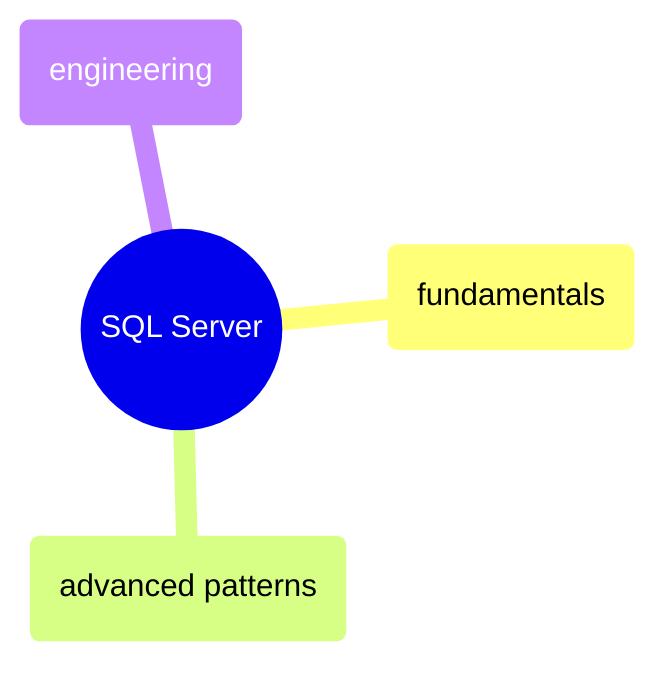
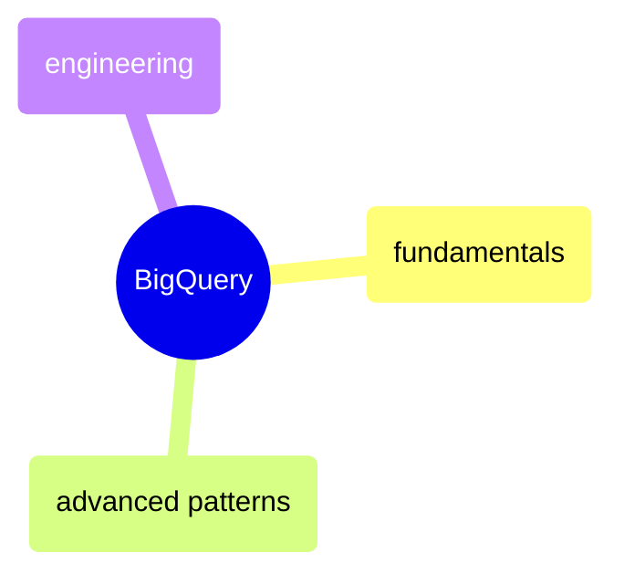
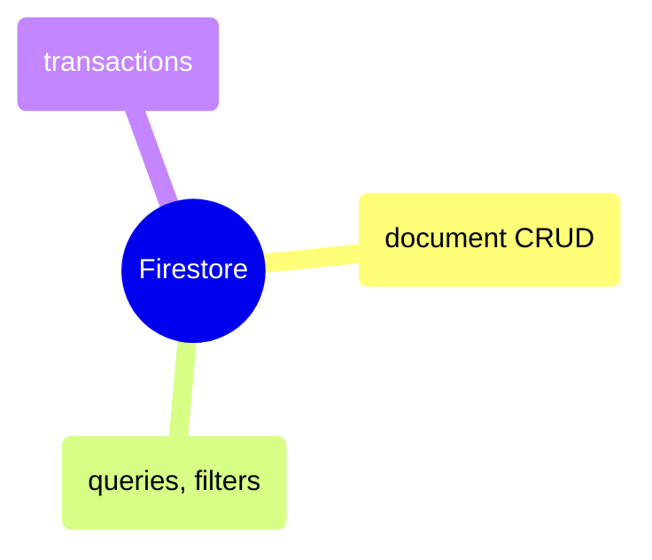

# MOC: Database Queries

Executable query reference across three databases — SQL Server (T-SQL),
BigQuery (GoogleSQL), and Firestore (NoSQL). Each notebook preserves cell
outputs so you see both the query and its result.

> [!example]- SQL Server
>
> > [!abstract]- [[sql-fundamentals]]
> >
> > - [[sql-fundamentals#Schema Exploration|Schema exploration]]
> > - [[sql-fundamentals#Aggregation (GROUP BY)|Aggregation and GROUP BY]]
> > - [[sql-fundamentals#JOINs Across Medallion Layers|JOINs across medallion layers]]
> > - [[sql-fundamentals#Window Functions|Window functions]]
> > - [[sql-fundamentals#CTEs & Subqueries|CTEs and subqueries]]
> > - [[sql-fundamentals#Data Quality Checks|Data quality checks]]
>
> > [!abstract]- [[sql-advanced]]
> >
> > - [[sql-advanced#Advanced Window Functions|Advanced window functions]]
> > - [[sql-advanced#Recursive CTEs|Recursive CTEs]]
> > - [[sql-advanced#PIVOT|Pivot and unpivot]]
> > - [[sql-advanced#MERGE (Upsert)|MERGE upsert]]
> > - [[sql-advanced#Grouping Sets, ROLLUP, CUBE|Grouping sets and rollup]]
> > - [[sql-advanced#NULL Handling Patterns|NULL handling patterns]]
>
> > [!abstract]- [[sql-engineering]]
> >
> > - [[sql-engineering#Views|Views]]
> > - [[sql-engineering#Stored Procedures|Stored procedures]]
> > - [[sql-engineering#Indexes|Indexes]]
> > - [[sql-engineering#Slowly Changing Dimensions (SCD)|Slowly changing dimensions]]
> > - [[sql-engineering#Execution Plans & Query Optimization|Execution plans and optimization]]
> > - [[sql-engineering#Partitioning Strategies|Partitioning strategies]]

> [!example]- BigQuery
>
> > [!abstract]- [[bq-fundamentals]]
> >
> > - [[bq-fundamentals#Schema Exploration|Schema exploration]]
> > - [[bq-fundamentals#Aggregation (GROUP BY)|Aggregation and GROUP BY]]
> > - [[bq-fundamentals#JOINs Across Medallion Layers|JOINs across medallion layers]]
> > - [[bq-fundamentals#Window Functions|Window functions]]
> > - [[bq-fundamentals#CTEs & Subqueries|CTEs and subqueries]]
> > - [[bq-fundamentals#Data Quality Checks|Data quality checks]]
>
> > [!abstract]- [[bq-advanced]]
> >
> > - [[bq-advanced#Advanced Window Functions|Advanced window functions]]
> > - [[bq-advanced#Recursive CTEs|Recursive CTEs]]
> > - [[bq-advanced#PIVOT|Pivot and unpivot]]
> > - [[bq-advanced#MERGE (Upsert)|MERGE upsert]]
> > - [[bq-advanced#Grouping Sets, ROLLUP, CUBE|Grouping sets and rollup]]
> > - [[bq-advanced#NULL Handling Patterns|NULL handling patterns]]
>
> > [!abstract]- [[bq-engineering]]
> >
> > - [[bq-engineering#Views|Views]]
> > - [[bq-engineering#Stored Procedures|Stored procedures]]
> > - [[bq-engineering#Indexes|Indexes]]
> > - [[bq-engineering#Slowly Changing Dimensions (SCD)|Slowly changing dimensions]]
> > - [[bq-engineering#Execution Plans & Query Optimization|Execution plans and optimization]]
> > - [[bq-engineering#Partitioning Strategies|Partitioning strategies]]

> [!example]- Firestore
>
> > [!abstract]- Firestore Queries
> >
> > - Read operations — [[firestore-python#Read Operations|py]] · [[firestore-csharp#Read Operations|cs]]
> > - Filtering and ordering — [[firestore-python#Filtering & Ordering|py]] · [[firestore-csharp#Filtering & Ordering|cs]]
> > - Subcollections — [[firestore-python#Subcollections|py]] · [[firestore-csharp#Subcollections|cs]]
> > - Write operations — [[firestore-python#Write Operations|py]] · [[firestore-csharp#Write Operations|cs]]
> > - Batch operations and transactions — [[firestore-python#Batch Operations & Transactions|py]] · [[firestore-csharp#Batch Operations & Transactions|cs]]
> > - Collection group queries — [[firestore-python#Collection Group Queries|py]] · [[firestore-csharp#Collection Group Queries|cs]]

## Cross-References

- [SQL Server](/04-SQL-Server/moc-sql-server) — Administration, performance, and pipeline patterns beyond queries
- [GCP](/06-GCP/moc-gcp) — BigQuery service configuration and data loading
- [Programming Languages](/02-Programming-Languages/moc-programming-languages) — Python and C# database access notebooks
