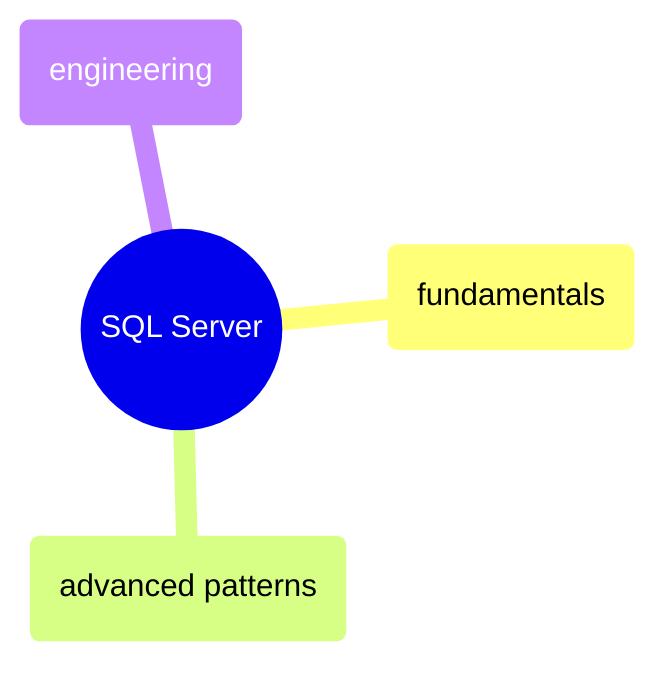
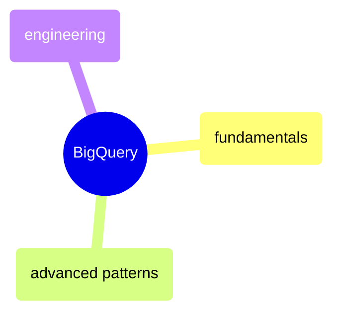
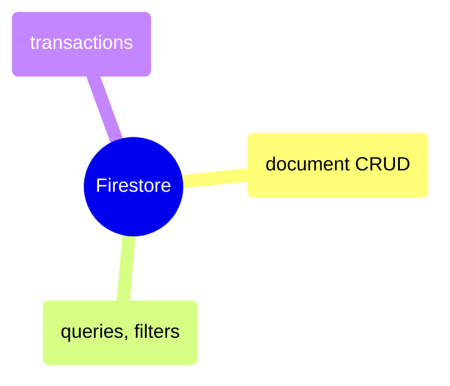

# MOC: Database Queries

Executable query reference across three databases — SQL Server (T-SQL),
BigQuery (GoogleSQL), and Firestore (NoSQL). Each notebook preserves cell
outputs so you see both the query and its result.

> [!example]- SQL Server
>
> [[domain-sql-server]]
>
> T-SQL query reference across fundamentals, advanced patterns, and engineering — from schema exploration through partitioning strategies.

> [!example]- BigQuery
>
> [[domain-bigquery]]
>
> GoogleSQL query reference across fundamentals, advanced patterns, and engineering — from schema exploration through partitioning strategies.

> [!example]- Firestore
>
> [[domain-firestore]]
>
> NoSQL document database queries in Python and C# — CRUD, filtering, subcollections, batch operations, and collection group queries.

## Cross-References

- [SQL Server](https://alp78.github.io/elysium/04-SQL-Server/moc-sql-server) — Administration, performance, and pipeline patterns beyond queries
- [GCP](https://alp78.github.io/elysium/06-GCP/moc-gcp) — BigQuery service configuration and data loading
- [Programming Languages](https://alp78.github.io/elysium/02-Programming-Languages/moc-programming-languages) — Python and C# database access notebooks
