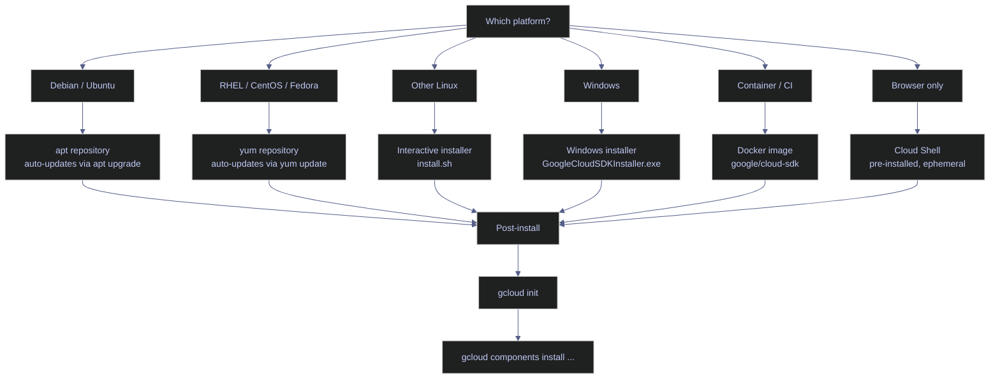

# gcloud CLI Setup

> [!quote]
> "The Cloud SDK is the single pane of glass between you and every GCP service. If it is misconfigured, nothing downstream works."
>
> — **Steren Giannini**, Google Cloud Developer Relations

The Google Cloud CLI (`gcloud`) is the primary command-line interface for interacting with Google Cloud Platform. It ships inside the **Google Cloud SDK** — a downloadable package that also includes `bq` (BigQuery CLI), `gsutil` (legacy Cloud Storage CLI), and a component manager for adding optional tools like `kubectl`, `cloud-sql-proxy`, and emulators. Every GCP workflow — from provisioning VMs to deploying Cloud Run jobs to querying BigQuery — begins with a working SDK installation and an initialized configuration.

## Key Definitions

| Term | Definition |
|---|---|
| **Google Cloud SDK** | The installable package containing `gcloud`, `bq`, `gsutil`, and the component manager. Versioned as a single release (e.g., 563.0.0). |
| **gcloud CLI** | The primary CLI tool within the SDK. Manages resources, configurations, IAM, and service APIs across all GCP products. |
| **bq CLI** | BigQuery-specific CLI bundled with the SDK. Used for dataset/table management, queries, and data loading. |
| **gsutil** | Legacy Cloud Storage CLI. Still bundled but superseded by `gcloud storage` for new workloads. |
| **gcloud storage** | Modern replacement for `gsutil`, integrated directly into the `gcloud` command tree. Supports parallelism and resumable transfers natively. |
| **Cloud Shell** | Browser-based shell environment with the SDK pre-installed. Ephemeral compute with a persistent 5 GB `$HOME` directory. |
| **Component** | An optional add-on managed by `gcloud components` (e.g., `kubectl`, `cloud-sql-proxy`, `beta`, `alpha`). |
| **Component manager** | The `gcloud components` subsystem that installs, updates, and removes SDK add-ons. Disabled when SDK is installed via a package manager (apt/yum). |
| **Release track** | SDK command maturity level: **GA** (stable, production-safe), **beta** (feature-complete but may change), **alpha** (experimental, no SLA). |
| **gcloud init** | Interactive initialization wizard that sets account, project, and default compute region/zone in a single flow. |
| **Configuration** | A named set of `gcloud` properties (account, project, region, zone). Multiple configurations can coexist; switch with `gcloud config configurations activate`. |
| **Credential store** | Local encrypted storage where `gcloud auth login` persists OAuth2 refresh tokens. Located under the user config directory (`~/.config/gcloud` on Linux, `%APPDATA%\gcloud` on Windows). |
| **Shell completion** | Tab-completion for `gcloud` commands, flags, and resource names. Available for Bash, Zsh, and PowerShell. |
| **Interactive installer** | The `install.sh` script included in the SDK tarball for Linux/macOS. Offers to add `gcloud` to `$PATH` and enable shell completion. |
| **apt/yum repository** | Package-manager-based installation for Debian/Ubuntu (apt) and RHEL/CentOS (yum). Provides automatic updates via system package management. |

## Installation

The SDK can be installed through platform-native package managers, standalone installers, Docker images, or accessed directly through Cloud Shell. The choice depends on the operating system, whether automated updates are needed, and whether the installation is for interactive use or CI/CD pipelines.



### Linux | apt repository (Debian/Ubuntu)

The apt repository method is the recommended installation path for Debian-based systems. It integrates with the system package manager, meaning `apt-get upgrade` automatically picks up new SDK versions. The `gcloud components` subcommand is **disabled** when installed via apt — component management is handled through dedicated apt packages (e.g., `google-cloud-cli-gke-gcloud-auth-plugin`).

#### Import the Google Cloud public key and add the repository

**When to run:** On a fresh Debian/Ubuntu machine or VM that does not yet have the SDK installed.
**Trigger:** First-time environment setup, new VM provisioning, or container image build.
**Context:** Runs as a shell command with `sudo` privileges. State-changing — modifies the system's apt keyring and sources list.
**Purpose:** Register the Google Cloud apt repository so that `apt-get install google-cloud-cli` resolves correctly.

*Import the GPG key, add the Cloud SDK apt source, and install the CLI.*

```bash
# Import the Google Cloud GPG key
curl https://packages.cloud.google.com/apt/doc/apt-key.gpg | sudo gpg --dearmor -o /usr/share/keyrings/cloud.google.gpg

# Add the Cloud SDK distribution URI as a package source
echo "deb [signed-by=/usr/share/keyrings/cloud.google.gpg] https://packages.cloud.google.com/apt cloud-sdk main" | sudo tee /etc/apt/sources.list.d/google-cloud-sdk.list

# Update and install
sudo apt-get update && sudo apt-get install google-cloud-cli
```

#### Install additional components via apt

**When to run:** After the base `google-cloud-cli` package is installed and you need optional tools.
**Trigger:** A workflow requires a tool not included in the base package (e.g., GKE authentication, kubectl, Pub/Sub emulator).
**Context:** Runs with `sudo`. The `gcloud components install` command is disabled for apt-based installations — apt packages are the only supported mechanism.
**Purpose:** Add optional SDK components through the system package manager.

*Install optional SDK components as apt packages.*

```bash
sudo apt-get install google-cloud-cli-gke-gcloud-auth-plugin
```

> [!warning] Component manager is disabled with apt installs
>
> Running `gcloud components install` on an apt-based installation returns `ERROR: You cannot perform this action because the Google Cloud CLI component manager is disabled for this installation`. Use `apt-get install google-cloud-cli-<component>` instead.

> [!success] Check available apt component packages
>
> List all available SDK packages with:
> ```bash
> apt-cache search google-cloud-cli
> ```

| Flag / Package | Syntax | Description |
|---|---|---|
| `google-cloud-cli` | `apt-get install google-cloud-cli` | Base CLI package (gcloud, bq, gsutil) |
| `google-cloud-cli-gke-gcloud-auth-plugin` | `apt-get install google-cloud-cli-gke-gcloud-auth-plugin` | GKE authentication plugin for kubectl |
| `google-cloud-cli-pubsub-emulator` | `apt-get install google-cloud-cli-pubsub-emulator` | Local Pub/Sub emulator |
| `google-cloud-cli-cloud-run-proxy` | `apt-get install google-cloud-cli-cloud-run-proxy` | Cloud Run local proxy |
| `google-cloud-cli-firestore-emulator` | `apt-get install google-cloud-cli-firestore-emulator` | Local Firestore emulator |
| `google-cloud-cli-bigtable-emulator` | `apt-get install google-cloud-cli-bigtable-emulator` | Local Bigtable emulator |
| `google-cloud-cli-spanner-emulator` | `apt-get install google-cloud-cli-spanner-emulator` | Local Spanner emulator |
| `google-cloud-cli-terraform-validator` | `apt-get install google-cloud-cli-terraform-validator` | Terraform plan validation |
| `kubectl` | `apt-get install kubectl` | Kubernetes CLI |

### Windows | standalone installer

The Windows installer is a standard `.exe` that places the SDK under `%LOCALAPPDATA%\Google\Cloud SDK\google-cloud-sdk` by default. It adds `gcloud` to `PATH`, configures shell completion for PowerShell, and launches `gcloud init` on first run. The component manager (`gcloud components`) is fully functional with this installation method.

#### Download and run the installer

**When to run:** On a Windows workstation or server that does not yet have the SDK installed.
**Trigger:** First-time developer setup or provisioning a Windows-based build agent.
**Context:** Runs as a standard Windows installer. Requires no admin privileges — installs to the current user's `%LOCALAPPDATA%`. State-changing — adds binaries to PATH and creates a config directory under `%APPDATA%\gcloud`.
**Purpose:** Install the full Google Cloud SDK on Windows with component manager support.

> [!info]- Installation steps
>
> - Download `GoogleCloudSDKInstaller.exe` from https://cloud.google.com/sdk/docs/install#windows
> - Run the installer — it does **not** require administrator privileges
> - The installer prompts to run `gcloud init` upon completion
> - Default install path: `%LOCALAPPDATA%\Google\Cloud SDK\google-cloud-sdk`

*Download and run the Windows SDK installer.*

```powershell
# Download the installer (alternatively, download manually from the browser)
Invoke-WebRequest -Uri "https://dl.google.com/dl/cloudsdk/channels/rapid/GoogleCloudSDKInstaller.exe" -OutFile "$env:TEMP\GoogleCloudSDKInstaller.exe"

# Run the installer
& "$env:TEMP\GoogleCloudSDKInstaller.exe"
```

| Flag | Syntax | Description |
|---|---|---|
| `/S` | `GoogleCloudSDKInstaller.exe /S` | Silent install — no GUI prompts |
| `/D=<path>` | `GoogleCloudSDKInstaller.exe /D=C:\gcloud` | Custom installation directory |
| `/allusers` | `GoogleCloudSDKInstaller.exe /allusers` | Install for all users (requires admin) |
| `/noreporting` | `GoogleCloudSDKInstaller.exe /noreporting` | Disable anonymous usage reporting |
| `/nostartmenu` | `GoogleCloudSDKInstaller.exe /nostartmenu` | Skip Start Menu shortcut creation |
| `/nopath` | `GoogleCloudSDKInstaller.exe /nopath` | Do not add gcloud to PATH |

### Docker | google/cloud-sdk image

The official `google/cloud-sdk` Docker image provides a pre-installed SDK in a container. It is the preferred method for CI/CD pipelines, ephemeral build agents, and reproducible environments. The image is available in multiple variants: full (all components), slim (gcloud only), and Alpine-based.

#### Run gcloud in a container

**When to run:** In CI/CD pipelines, ephemeral build environments, or when the host machine should not have the SDK installed directly.
**Trigger:** Pipeline step requiring GCP access, local testing without SDK installation, or reproducible environment requirements.
**Context:** Requires Docker. The container runs as an isolated process. Mount volumes for credential files and working directories.
**Purpose:** Execute gcloud commands in a self-contained, version-pinned environment.

*Run the SDK container with a mounted credentials directory.*

```bash
docker run --rm -it \
  -v ~/.config/gcloud:/root/.config/gcloud \
  google/cloud-sdk:563.0.0 \
  gcloud projects list
```

*Use the slim variant (no bq/gsutil, smaller image) for CI pipelines.*

```bash
docker run --rm \
  -v ~/.config/gcloud:/root/.config/gcloud \
  google/cloud-sdk:563.0.0-slim \
  gcloud compute instances list --project=bq-wh-nb
```

| Image Tag | Contents | Size | Use Case |
|---|---|---|---|
| `google/cloud-sdk:latest` | gcloud + bq + gsutil + all components | ~2.5 GB | Full development |
| `google/cloud-sdk:<version>` | Version-pinned full image | ~2.5 GB | Reproducible builds |
| `google/cloud-sdk:<version>-slim` | gcloud only (no bq, gsutil, extras) | ~600 MB | CI/CD pipelines |
| `google/cloud-sdk:<version>-alpine` | Alpine-based, gcloud only | ~400 MB | Minimal footprint containers |
| `google/cloud-sdk:<version>-emulators` | Full image + all emulators | ~3 GB | Local development with emulators |

### Cloud Shell

Cloud Shell is a browser-based shell environment accessible from the Google Cloud Console. The SDK is pre-installed and always up to date. It includes a 5 GB persistent home directory that survives session restarts, but the underlying VM is ephemeral — anything installed outside `$HOME` is lost when the session terminates.

> [!info] Cloud Shell specifications
>
> - **Compute:** Small Debian-based VM (e2-small equivalent), free tier, no billing required
> - **SDK version:** Always the latest stable release — no manual updates needed
> - **Persistent storage:** 5 GB `$HOME` directory, retained for 120 days of inactivity
> - **Ephemeral disk:** Everything outside `$HOME` (system packages, Docker images, temp files) is wiped on session termination
> - **Pre-authenticated:** Cloud Shell inherits the console user's credentials — no `gcloud auth login` required
> - **Session timeout:** 20 minutes of inactivity, 12-hour maximum session lifetime
> - **Web preview:** Built-in port forwarding for ports 8080–8085 via the Cloud Shell toolbar

> [!warning] Cloud Shell is not a persistent development environment
>
> System packages installed with `apt-get`, pip packages installed outside `$HOME/.local`, and Docker images are all wiped when the VM recycles. Long-running processes (ETL jobs, database servers) will be killed at session timeout.

> [!success] Persist tools across sessions
>
> Install user-space tools to `$HOME/.local/bin` and add it to `$PATH` in `$HOME/.bashrc`. Python packages should use `pip install --user` to land in `$HOME/.local/lib`. For Docker workflows, use Artifact Registry rather than relying on locally cached images.

## Initialization

After installation, the SDK must be initialized to associate it with a Google Cloud account, project, and default compute region/zone. This can be done interactively with `gcloud init` or manually by setting each property individually.

### PowerShell / Linux | gcloud init

`gcloud init` is an interactive wizard that walks through account selection, project selection, and default compute region/zone configuration in a single flow. It is the recommended way to initialize a fresh SDK installation for interactive use.

#### Run the initialization wizard

**When to run:** Immediately after installing the SDK, or when switching to a new account/project for the first time.
**Trigger:** Fresh SDK installation, new workstation setup, or creating a new named configuration.
**Context:** Interactive command — prompts for user input at each step. Requires browser access for OAuth2 login (unless `--console-only` is used). State-changing — writes to the active configuration file.
**Purpose:** Set up the foundational gcloud properties (account, project, region/zone) so all subsequent commands use the correct defaults.

> [!info]- What gcloud init configures
>
> The wizard performs four operations in sequence:
>
> - **Account login:** Opens a browser for OAuth2 authentication (or prints a URL with `--console-only`). Stores a refresh token in the credential store.
> - **Project selection:** Lists accessible projects and prompts for a choice. Sets `core/project`.
> - **Default compute region:** Prompts for a default Compute Engine region. Sets `compute/region`.
> - **Default compute zone:** Prompts for a default Compute Engine zone. Sets `compute/zone`.

*Run the interactive initialization wizard.*

```bash
gcloud init
```

```text
Welcome! This command will take you through the configuration of gcloud.

Pick configuration to use:
 [1] Re-initialize this configuration [default] with new settings
 [2] Create a new configuration
Please enter your numeric choice:  1

Your current configuration has been set to: [default]

You can skip diagnostics next time by using the following flag:
  gcloud init --skip-diagnostics

Network diagnostic passed (1/1 checks passed).

Choose the account you would like to use to perform operations for this
configuration:
 [1] alexper.recovery@gmail.com
 [2] Log in with a new account
Please enter your numeric choice:  1

You are logged in as: [alexper.recovery@gmail.com].

Pick cloud project to use:
 [1] bq-wh-nb
 [2] Enter a project ID
 [3] Create a new project
Please enter numeric choice or text value (must exactly match list item):  1

Your current project has been set to: [bq-wh-nb].

Do you want to configure a default Compute Engine region and zone? (Y/n)?  Y

Which Google Compute Engine zone would you like to use as project default?
 [1] us-east1-b
 [2] us-east1-c
 ...
 [50] europe-west1-b
Please enter numeric choice or text value (must exactly match list item):  50

Your project default Compute Engine zone has been set to [europe-west1-b].

Your Google Cloud SDK is configured and ready to use!

* Commands that require authentication will use alexper.recovery@gmail.com by default
* Commands will reference project `bq-wh-nb` by default
* Compute Engine commands will use region `europe-west1` by default
* Compute Engine commands will use zone `europe-west1-b` by default
```

> [!danger] Never run gcloud init in CI/CD pipelines
>
> `gcloud init` requires interactive input — it will hang indefinitely in automated environments. It also opens a browser for OAuth login, which is impossible in headless containers.

> [!success] CI/CD authentication pattern
>
> Use service account key or workload identity federation instead:
> ```bash
> # Authenticate with a service account key file
> gcloud auth activate-service-account --key-file=/path/to/key.json
>
> # Set project and region non-interactively
> gcloud config set project bq-wh-nb
> gcloud config set compute/region europe-west1
> gcloud config set compute/zone europe-west1-b
> ```
> For GitHub Actions, prefer Workload Identity Federation — no key file needed:
> ```yaml
> - uses: google-github-actions/auth@v2
>   with:
>     workload_identity_provider: 'projects/123/locations/global/workloadIdentityPools/gh-pool/providers/gh-provider'
>     service_account: 'ci-runner@bq-wh-nb.iam.gserviceaccount.com'
> ```

| Flag | Syntax | Description |
|---|---|---|
| `--console-only` | `gcloud init --console-only` | Print the auth URL instead of opening a browser — use for SSH sessions or headless machines |
| `--skip-diagnostics` | `gcloud init --skip-diagnostics` | Skip the network connectivity check at startup |
| `--no-browser` | `gcloud init --no-browser` | Alias for `--console-only` (deprecated but still functional) |
| `--no-launch-browser` | `gcloud init --no-launch-browser` | Prevent automatic browser launch; print URL to stdout |

### PowerShell / Linux | gcloud init vs manual configuration

`gcloud init` bundles four operations into a single interactive wizard. Each of those operations can also be run individually with `gcloud auth login` and `gcloud config set`. The manual approach is required for non-interactive environments and provides finer control over which properties are set.

| Step | `gcloud init` | Manual equivalent |
|---|---|---|
| Authenticate | Prompts for account selection, opens browser | `gcloud auth login` |
| Set project | Lists projects, prompts for choice | `gcloud config set project bq-wh-nb` |
| Set compute region | Lists regions, prompts for choice | `gcloud config set compute/region europe-west1` |
| Set compute zone | Lists zones, prompts for choice | `gcloud config set compute/zone europe-west1-b` |
| Set ADC | Not included | `gcloud auth application-default login` |
| Create named config | Option offered during init | `gcloud config configurations create <name>` |

> [!tip] When to use each approach
>
> - **`gcloud init`** — Fresh installs, new developer onboarding, switching to a completely new account/project. Fast, guided, and covers the common case.
> - **Manual `config set`** — CI/CD pipelines, scripted provisioning, or when you only need to change one property without re-running the full wizard. Also required when setting properties that `gcloud init` does not cover (e.g., `run/region`, `functions/region`).

## Component Management

The component manager (`gcloud components`) installs, updates, and removes optional SDK tools. Each component has a unique ID, an installation status, and a size. The manager tracks versions and dependencies automatically — installing `alpha` also pulls in `beta`, for example.

> [!warning] Component manager is disabled for package-manager installs
>
> If the SDK was installed via `apt-get` or `yum`, the `gcloud components` subcommand is disabled. Use the system package manager to manage components instead (e.g., `apt-get install google-cloud-cli-kubectl`).

> [!success] Check which installation method is active
>
> Run `gcloud info` and check the `Installation Root` path. Package-manager installs land in `/usr/lib/google-cloud-sdk` or `/usr/share/google-cloud-sdk`. Standalone installs land in a user-writable directory (e.g., `~/google-cloud-sdk` or `%LOCALAPPDATA%\Google\Cloud SDK\google-cloud-sdk`).

### PowerShell / Linux | gcloud components list

Lists all installed and available SDK components with their status, name, ID, and size.

#### List all components

**When to run:** To audit which SDK tools are installed, check for available updates, or identify the component ID before installing a new tool.
**Trigger:** Pre-installation check, post-update verification, or troubleshooting a missing command.
**Context:** Read-only. No authentication required. Queries the local SDK manifest and compares against the remote component list.
**Purpose:** Display the current installation state of all SDK components.

*List all SDK components with their installation status.*

```bash
gcloud components list
```

```text
Your current Google Cloud CLI version is: 563.0.0
The latest available version is: 564.0.0

+--------------------------------------------------------------------------------------------------------------------+
|                                                     Components                                                     |
+------------------+------------------------------------------------------+------------------------------+-----------+
|      Status      |                         Name                         |              ID              |    Size   |
+------------------+------------------------------------------------------+------------------------------+-----------+
| Update Available | Google Cloud CLI Core Libraries                      | core                         |  24.6 MiB |
| Update Available | gcloud Alpha Commands                                | alpha                        |   < 1 MiB |
| Update Available | gcloud Beta Commands                                 | beta                         |   < 1 MiB |
| Not Installed    | App Engine Go Extensions                             | app-engine-go                |   5.5 MiB |
| Not Installed    | Artifact Registry Go Module Package Helper           | package-go-module            |   < 1 MiB |
| Not Installed    | Cloud Bigtable Command Line Tool                     | cbt                          |  20.8 MiB |
| Not Installed    | Cloud Bigtable Emulator                              | bigtable                     |   8.7 MiB |
| Not Installed    | Cloud Datastore Emulator                             | cloud-datastore-emulator     |  36.2 MiB |
| Not Installed    | Cloud Firestore Emulator                             | cloud-firestore-emulator     |  63.4 MiB |
| Not Installed    | Cloud Pub/Sub Emulator                               | pubsub-emulator              |  50.5 MiB |
| Not Installed    | Cloud Run Proxy                                      | cloud-run-proxy              |  11.6 MiB |
| Not Installed    | Google Container Registry's Docker credential helper | docker-credential-gcr        |   1.8 MiB |
| Not Installed    | Managed Flink Client                                 | managed-flink-client         | 383.4 MiB |
| Not Installed    | Minikube                                             | minikube                     |  48.0 MiB |
| Not Installed    | Skaffold                                             | skaffold                     |  31.8 MiB |
| Not Installed    | Spanner Cli                                          | spanner-cli                  |  13.6 MiB |
| Not Installed    | Spanner migration tool                               | spanner-migration-tool       |  47.3 MiB |
| Not Installed    | Terraform Tools                                      | terraform-tools              |  66.6 MiB |
| Not Installed    | anthos-auth                                          | anthos-auth                  |  27.3 MiB |
| Not Installed    | config-connector                                     | config-connector             | 143.8 MiB |
| Not Installed    | enterprise-certificate-proxy                         | enterprise-certificate-proxy |  13.8 MiB |
| Not Installed    | gcloud Preview Commands                              | preview                      |   < 1 MiB |
| Not Installed    | gcloud app Java Extensions                           | app-engine-java              | 153.0 MiB |
| Not Installed    | gcloud app Python Extensions                         | app-engine-python            |   3.8 MiB |
| Not Installed    | gcloud app Python Extensions (Extra Libraries)       | app-engine-python-extras     |   < 1 MiB |
| Not Installed    | gke-gcloud-auth-plugin                               | gke-gcloud-auth-plugin       |   3.9 MiB |
| Not Installed    | kubectl                                              | kubectl                      |   < 1 MiB |
| Not Installed    | kubectl-oidc                                         | kubectl-oidc                 |  27.3 MiB |
| Not Installed    | pkg                                                  | pkg                          |           |
| Installed        | BigQuery Command Line Tool                           | bq                           |   1.8 MiB |
| Installed        | Cloud SQL Proxy v2                                   | cloud-sql-proxy              |  14.9 MiB |
| Installed        | Cloud Storage Command Line Tool                      | gsutil                       |  12.4 MiB |
| Installed        | Google Cloud CRC32C Hash Tool                        | gcloud-crc32c                |   1.5 MiB |
| Installed        | Log Streaming                                        | log-streaming                |  18.0 MiB |
+------------------+------------------------------------------------------+------------------------------+-----------+
```

The output has four columns:

| Column | Meaning |
|---|---|
| **Status** | `Installed` — present and up to date. `Update Available` — installed but a newer version exists. `Not Installed` — available for download. |
| **Name** | Human-readable component name. |
| **ID** | The identifier used in `gcloud components install <ID>` and `gcloud components remove <ID>`. |
| **Size** | Download size. `< 1 MiB` indicates a thin wrapper that pulls in shared libraries already present in the SDK. |

### PowerShell / Linux | gcloud components install

Installs one or more components by their ID. The component manager resolves dependencies automatically — installing `alpha` also installs `beta` if not already present.

#### Install the GKE authentication plugin

**When to run:** Before running any `kubectl` command against a GKE cluster, or before `gcloud container clusters get-credentials`.
**Trigger:** Error message `gke-gcloud-auth-plugin is not installed` or first-time GKE setup.
**Context:** Requires write access to the SDK installation directory. Not available on apt/yum installations. State-changing — downloads and extracts the component binary.
**Purpose:** Add the GKE authentication plugin so that `kubectl` can authenticate to GKE clusters via gcloud credentials.

*Install the GKE authentication plugin.*

```bash
gcloud components install gke-gcloud-auth-plugin
```

```text
Your current Google Cloud CLI version is: 563.0.0

Installing components from version: 563.0.0

+------------------------------------------------------------+
|          These components will be installed.                |
+------------------------+---------+------------+------------+
|          Name          | Version |    Size    |   Status   |
+------------------------+---------+------------+------------+
| gke-gcloud-auth-plugin |  0.6.2  |   3.9 MiB  | New Install|
+------------------------+---------+------------+------------+

Do you want to continue (Y/n)?  Y

Creating update staging area...
Installing: gke-gcloud-auth-plugin ... done.

Performing post processing steps...done.

Update done!
```

| Flag | Syntax | Description |
|---|---|---|
| `COMPONENT_ID [COMPONENT_ID ...]` | `gcloud components install kubectl alpha` | Install one or more components by ID |
| `--quiet` / `-q` | `gcloud components install kubectl -q` | Skip confirmation prompt — required for scripts and CI |

### PowerShell / Linux | gcloud components update

Updates the SDK and all installed components to the latest available version. If specific component IDs are provided, only those components are updated.

#### Update the entire SDK

**When to run:** Periodically (monthly or before starting a new project) to stay current with API changes and bug fixes, or when encountering errors that may be caused by SDK version drift.
**Trigger:** `gcloud components list` shows `Update Available`, or a gcloud command fails with an unexpected API error that may be version-related.
**Context:** Requires write access to the SDK installation directory. State-changing — replaces binaries in the installation root. Not available on apt/yum installations.
**Purpose:** Bring the SDK and all installed components to the latest stable release.

*Update all installed SDK components to the latest version.*

```bash
gcloud components update
```

> [!danger] Outdated SDK versions cause silent API incompatibilities
>
> GCP APIs evolve independently of the SDK. An outdated SDK may send deprecated request formats, miss new required fields, or fail to parse updated response schemas. These failures often surface as cryptic errors (e.g., `HttpError 400: Invalid value`) rather than explicit version warnings.

> [!success] Pin and verify the SDK version
>
> Check the current version against the latest release before debugging API errors:
> ```bash
> gcloud version
> gcloud components update --version=564.0.0  # pin to a specific version if needed
> ```
> In CI/CD, use the Docker image with a pinned tag (e.g., `google/cloud-sdk:564.0.0-slim`) rather than `latest`.

| Flag | Syntax | Description |
|---|---|---|
| `--version=VERSION` | `gcloud components update --version=564.0.0` | Update to a specific SDK version instead of latest |
| `--quiet` / `-q` | `gcloud components update -q` | Skip confirmation prompt |
| `COMPONENT_ID [...]` | `gcloud components update core bq` | Update only specific components |

### PowerShell / Linux | gcloud components remove

Removes installed components by their ID. Dependencies are checked — removing a component that other components depend on triggers a warning.

#### Remove a component

**When to run:** When cleaning up unused components to reduce disk footprint, or when a component conflicts with another tool.
**Trigger:** Disk space constraints, component conflict, or decommissioning a workflow that required a specific tool.
**Context:** Requires write access to the SDK installation directory. State-changing — deletes component binaries. Not available on apt/yum installations.
**Purpose:** Uninstall a previously installed SDK component.

*Remove the GKE auth plugin.*

```bash
gcloud components remove gke-gcloud-auth-plugin
```

| Flag | Syntax | Description |
|---|---|---|
| `COMPONENT_ID [COMPONENT_ID ...]` | `gcloud components remove kubectl alpha` | Remove one or more components by ID |
| `--quiet` / `-q` | `gcloud components remove kubectl -q` | Skip confirmation prompt |

## Version and Diagnostics

### PowerShell / Linux | gcloud version

Displays the SDK version and the version of every installed component. The SDK follows a `MAJOR.MINOR.PATCH` scheme where the major version increments with each weekly release. Component versions may differ from the SDK version — `bq` and `gsutil` have their own version tracks.

#### Display SDK and component versions

**When to run:** When filing bug reports, verifying a CI pipeline SDK version, or checking whether an update is needed.
**Trigger:** Pre-debugging, post-update verification, or audit.
**Context:** Read-only. No authentication required.
**Purpose:** Confirm the exact SDK and component versions installed on this machine.

*Show the current SDK and component versions.*

```bash
gcloud version
```

```text
Google Cloud SDK 563.0.0
alpha 2026.03.27
beta 2026.03.27
bq 2.1.31
cloud-sql-proxy 2.21.2
core 2026.03.27
gcloud-crc32c 1.0.0
gsutil 5.36
log-streaming 0.3.2
```

The first line shows the overall SDK release version (563.0.0). Each subsequent line shows an installed component and its version. `core`, `alpha`, and `beta` track the SDK release date (2026.03.27). Other components follow independent versioning: `bq 2.1.31` is the BigQuery CLI version, `gsutil 5.36` is the Cloud Storage CLI version.

### PowerShell / Linux | gcloud info

Displays comprehensive diagnostic information about the SDK installation: platform, Python runtime, installation paths, active configuration, current account and project, and system PATH. This is the first command to run when troubleshooting SDK issues.

#### Display full diagnostic output

**When to run:** When troubleshooting gcloud errors, verifying the installation is correct, or preparing a bug report.
**Trigger:** Unexpected gcloud behavior, permission errors, Python version conflicts, or PATH issues.
**Context:** Read-only. No authentication required for local info (account/project info shown is from the active config, not a live API call).
**Purpose:** Show the complete SDK installation state in a single output for diagnostics.

*Display full SDK diagnostic information.*

```bash
gcloud info
```

```text
Google Cloud SDK [563.0.0]

Platform: [Windows, x86_64] uname_result(system='Windows', node='Elysium', release='11', version='10.0.26200', machine='AMD64')
Locale: ('English_United States', '1252')
Python Version: [3.12.0 (tags/v3.12.0:0fb18b0, Oct  2 2023, 13:03:39) [MSC v.1935 64 bit (AMD64)]]
Python Location: [C:\Users\aperi\My Drive\VAULT\.vault\Scripts\python.exe]
OpenSSL: [OpenSSL 3.0.11 19 Sep 2023]
Requests Version: [2.32.3]
urllib3 Version: [2.6.3]
Default CA certs file: [C:\Users\aperi\AppData\Local\Google\Cloud SDK\google-cloud-sdk\lib\third_party\certifi\cacert.pem]
Site Packages: [Enabled]

Installation Root: [C:\Users\aperi\AppData\Local\Google\Cloud SDK\google-cloud-sdk]
Installed Components:
  alpha: [2026.03.27]
  beta: [2026.03.27]
  bq: [2.1.31]
  cloud-sql-proxy: [2.21.2]
  core: [2026.03.27]
  gcloud-crc32c: [1.0.0]
  gsutil: [5.36]
  log-streaming: [0.3.2]

User Config Directory: [C:\Users\aperi\AppData\Roaming\gcloud]
Active Configuration Name: [default]
Active Configuration Path: [C:\Users\aperi\AppData\Roaming\gcloud\configurations\config_default]

Account: [alexper.recovery@gmail.com]
Project: [bq-wh-nb]

git: [git version 2.53.0.windows.1]
ssh: [OpenSSH_10.2p1, OpenSSL 3.5.5 27 Jan 2026]
```

The output is organized into sections:

| Section | Key fields | What to check |
|---|---|---|
| **Platform** | OS, architecture, locale | Confirms the SDK is running on the expected platform |
| **Python** | Version, location, OpenSSL version | The SDK requires Python 3.8+. If `Python Location` points to an unexpected interpreter, the SDK may use wrong dependencies |
| **Installation Root** | Filesystem path to the SDK | Package-manager installs show `/usr/lib/google-cloud-sdk`; standalone installs show a user-writable path |
| **Installed Components** | Component versions | Cross-reference with `gcloud components list` to check for updates |
| **User Config Directory** | Path to config files | Where configurations, credentials, and logs are stored |
| **Active Configuration** | Name and file path | Confirms which named configuration is active |
| **Account / Project** | Active account and project | Verify these match the expected values before running commands |

> [!tip] Quick anonymized output for bug reports
>
> Use `gcloud info --anonymize` to strip account names and project IDs from the output before pasting into GitHub issues or support tickets.

## Shell Completion

Shell completion enables tab-completion for `gcloud` commands, subcommands, flags, and resource names (project IDs, instance names, bucket names). It significantly speeds up interactive use and reduces typos.

### Bash | completion setup

Bash completion is provided by a script bundled with the SDK. The script must be sourced in the shell startup file.

#### Enable gcloud Bash completion

**When to run:** Once, after installing the SDK, to enable tab-completion in all future Bash sessions.
**Trigger:** `gcloud <TAB>` does not produce suggestions in a new terminal.
**Context:** Modifies `~/.bashrc`. Non-destructive — adds a source line. Requires the SDK completion script to exist at the path.
**Purpose:** Enable persistent tab-completion for gcloud, bq, and gsutil in Bash.

*Add the gcloud completion source line to `.bashrc`.*

```bash
# The SDK installer typically adds this automatically — verify it exists:
echo 'source /usr/lib/google-cloud-sdk/completion.bash.inc' >> ~/.bashrc

# For standalone (non-apt) installs, the path is:
echo 'source ~/google-cloud-sdk/completion.bash.inc' >> ~/.bashrc

# Reload the shell
source ~/.bashrc
```

> [!info] Path depends on installation method
>
> - **apt install:** `/usr/lib/google-cloud-sdk/completion.bash.inc`
> - **Standalone installer:** `~/google-cloud-sdk/completion.bash.inc` (or wherever the SDK was extracted)
> - **Custom path:** Check `gcloud info` → `Installation Root` and append `completion.bash.inc`

### PowerShell | completion setup

PowerShell completion uses `Register-ArgumentCompleter` with a script block that invokes the SDK's built-in completer.

#### Enable gcloud PowerShell completion

**When to run:** Once, after installing the SDK, to enable tab-completion in all future PowerShell sessions.
**Trigger:** `gcloud <TAB>` does not produce suggestions in a new PowerShell window.
**Context:** Modifies `$PROFILE`. Non-destructive — adds a Register-ArgumentCompleter call.
**Purpose:** Enable persistent tab-completion for gcloud in PowerShell.

*Add the gcloud argument completer to the PowerShell profile.*

```powershell
# Add to $PROFILE (create if it doesn't exist)
if (!(Test-Path -Path $PROFILE)) { New-Item -ItemType File -Path $PROFILE -Force }

Add-Content -Path $PROFILE -Value @'

# Google Cloud SDK tab completion
$gcloudComp = Join-Path $env:LOCALAPPDATA "Google\Cloud SDK\google-cloud-sdk\completion.ps1"
if (Test-Path $gcloudComp) { . $gcloudComp }
'@

# Reload
. $PROFILE
```

> [!info] Windows SDK default completion path
>
> The Windows installer places the completion script at:
> `%LOCALAPPDATA%\Google\Cloud SDK\google-cloud-sdk\completion.ps1`
>
> If the SDK was installed to a custom path, adjust accordingly.

### Zsh | completion setup

Zsh completion requires sourcing the SDK completion script and ensuring the completion system is initialized.

#### Enable gcloud Zsh completion

**When to run:** Once, after installing the SDK, to enable tab-completion in all future Zsh sessions.
**Trigger:** `gcloud <TAB>` does not produce suggestions in Zsh.
**Context:** Modifies `~/.zshrc`. Non-destructive.
**Purpose:** Enable persistent tab-completion for gcloud in Zsh.

*Add the gcloud completion source lines to `.zshrc`.*

```bash
# Ensure compinit is loaded (usually already present in .zshrc)
autoload -Uz compinit && compinit

# Source the gcloud completion script
# For apt installs:
echo 'source /usr/lib/google-cloud-sdk/completion.zsh.inc' >> ~/.zshrc

# For standalone installs:
echo 'source ~/google-cloud-sdk/completion.zsh.inc' >> ~/.zshrc

# Reload
source ~/.zshrc
```

> [!danger] Package manager and standalone installs must not coexist
>
> Installing the SDK via both `apt-get` and the interactive installer on the same machine creates two independent copies with separate component registries and configuration directories. Commands may resolve to the wrong binary depending on `PATH` order, causing silent misconfiguration: `gcloud info` shows one installation while `which gcloud` points to another.

> [!success] Detect and resolve dual installations
>
> Check for multiple installations:
> ```bash
> which -a gcloud
> # If this returns more than one path, you have conflicting installs
>
> # Remove the standalone install if apt is the primary:
> rm -rf ~/google-cloud-sdk
>
> # Or remove the apt install if standalone is the primary:
> sudo apt-get remove google-cloud-cli
> ```
> Keep exactly one installation method per machine.

---

## Related

- [GCP Projects and APIs](https://alp78.github.io/elysium/06-GCP/01-Core/01-gcp-projects-and-apis)
- [gcloud Authentication](https://alp78.github.io/elysium/06-GCP/01-Core/02-gcloud-authentication)
- [gcloud Configurations](https://alp78.github.io/elysium/06-GCP/01-Core/03-gcloud-configurations)
- [gcloud Output Formatting](https://alp78.github.io/elysium/06-GCP/01-Core/04-gcloud-output-formatting)

## References

- [Install the Google Cloud CLI](https://cloud.google.com/sdk/docs/install)
- [gcloud components reference](https://cloud.google.com/sdk/gcloud/reference/components)
- [gcloud init reference](https://cloud.google.com/sdk/gcloud/reference/init)
- [gcloud info reference](https://cloud.google.com/sdk/gcloud/reference/info)
- [Cloud Shell overview](https://cloud.google.com/shell/docs/how-cloud-shell-works)
