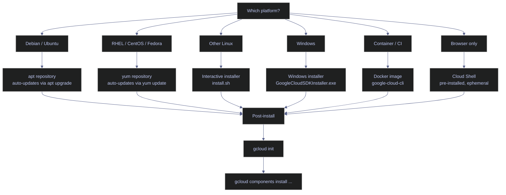

# gcloud CLI Setup

> [!quote] Setup boundary
>
> "The Cloud SDK is the single pane of glass between you and every GCP service. If it is misconfigured, nothing downstream works."
>
> — **Steren Giannini**, Google Cloud Developer Relations

> [!abstract]- Summary
>
> Covers Google Cloud CLI installation and operational setup across package-manager, standalone, container, and Cloud Shell environments so every later `gcloud` workflow starts from a verifiable SDK installation and initialized configuration.
>
> **Installation**
> - Install the SDK through Debian or Ubuntu apt repositories, the Windows standalone installer, version-pinned `gcr.io/google.com/cloudsdktool/google-cloud-cli` images, or browser-based Cloud Shell
> - Distinguish bundled tools and install models, including `gcloud`, `bq`, `gsutil`, `gcloud storage`, optional components, and the difference between package-managed and component-managed SDKs
> - Enable platform-specific shell completion for Bash, PowerShell, and Zsh after the SDK is on `PATH`
>
> **Initialization**
> - Use `gcloud init` to set account, project, default compute region, and default compute zone in one interactive flow
> - Compare interactive initialization with manual `gcloud config set` patterns and non-interactive CI/CD authentication using service accounts or Workload Identity Federation
>
> **Components and diagnostics**
> - Manage optional add-ons with `gcloud components list`, `install`, `update`, and `remove`, including release tracks such as `alpha` and `beta`
> - Verify installation state with `gcloud version` and `gcloud info`, including installation root, Python runtime, active configuration, account, project, and installed component versions
>
> **Operations and safety**
> - Warnings: apt/yum installs disable `gcloud components`, Cloud Shell is ephemeral outside `$HOME`, outdated SDK versions can drift from current APIs, and dual installations silently resolve to the wrong binary
>
> [!note]- Glossary
>
> **Google Cloud SDK**
> - The installable distribution that packages `gcloud`, `bq`, `gsutil`, shared libraries, and optional managed components as one versioned release.
> - The note treats the SDK as the real installation boundary because every CLI behavior described later depends on how that package was installed and maintained.
>
> > [!warning] SDK and CLI differ
> >
> > `gcloud` is the main executable, but the SDK is the full product you install. Confusing the two hides why `bq`, `gsutil`, completion scripts, and the component manager appear together.
>
> ---
>
> **`gcloud`**
> - The primary Google Cloud command-line interface for managing projects, resources, IAM, configurations, and service-specific commands.
> - It is the command surface every later GCP core note builds on, which is why this setup note exists before resource, auth, and configuration topics.
>
> > [!info] One CLI surface
> >
> > `gcloud` is not tied to one product. It fronts dozens of Google Cloud APIs, so installation errors propagate across the whole platform.
>
> ---
>
> **`bq`**
> - The BigQuery-specific CLI bundled with the SDK for running queries and managing datasets, tables, and jobs.
> - Its presence matters here because some installation methods provide more than just `gcloud`; they provision a wider Google Cloud command set.
>
> > [!info] Bundled toolset matters
> >
> > A slim container image or partial install can omit tools that a workstation install includes by default. Do not assume `bq` is present just because `gcloud` is.
>
> ---
>
> **`gsutil`**
> - The legacy Cloud Storage CLI that remains bundled with the SDK for object and bucket operations.
> - The note includes it because many environments still have scripts and habits built around `gsutil`, even though newer workflows may prefer `gcloud storage`.
>
> > [!warning] Legacy is not absent
> >
> > `gsutil` is still widely available and still works, but newer guidance increasingly assumes `gcloud storage`. Teams often carry both tools during migration periods.
>
> ---
>
> **`gcloud storage`**
> - The newer Cloud Storage command group integrated directly into the `gcloud` CLI.
> - It matters as the modern storage workflow inside the same CLI surface, reducing the need to switch to a separate legacy tool for object operations.
>
> > [!info] Integrated replacement path
> >
> > `gcloud storage` follows the same config, auth, and formatting conventions as the rest of `gcloud`, which simplifies operator workflow.
>
> ---
>
> **Cloud Shell**
> - A browser-based shell environment provided by Google Cloud with the SDK preinstalled and a persistent 5 GB home directory.
> - The note positions Cloud Shell as the zero-install option for quick access, diagnostics, and ad hoc administration.
>
> > [!warning] Only `$HOME` persists
> >
> > Tools, images, and files outside `$HOME` disappear when the backing VM recycles. Treat Cloud Shell as semi-persistent, not as a durable development workstation.
>
> ---
>
> **Component**
> - An optional SDK add-on such as `kubectl`, `cloud-sql-proxy`, `beta`, or an emulator, installable through the component manager in supported installs.
> - Components explain how the base SDK expands to cover GKE, emulators, and other workflows without baking every binary into the core install.
>
> > [!info] Base install is smaller
> >
> > Many workflows require optional components that are absent from the base SDK. Always confirm whether the needed tool is bundled, packaged separately, or installable as a component.
>
> ---
>
> **Component manager**
> - The `gcloud components` subsystem that lists, installs, updates, and removes SDK add-ons.
> - The note highlights it because its availability depends entirely on the installation method, which changes how operators extend the SDK.
>
> > [!warning] Package installs disable it
> >
> > Apt and yum installations intentionally turn off the component manager. In those environments, extensions must come from OS packages rather than `gcloud components install`.
>
> ---
>
> **Release track**
> - The maturity channel for a command group or component, typically GA, `beta`, or `alpha`.
> - Release tracks matter because they signal API stability, support expectations, and whether a command surface is suitable for production automation.
>
> > [!warning] `alpha` is volatile
> >
> > `alpha` commands can change or disappear without the guarantees expected from GA features. Avoid building critical automation on experimental tracks unless you accept that volatility.
>
> ---
>
> **`gcloud init`**
> - The interactive initialization wizard that configures account, project, and default compute region and zone for the active SDK configuration.
> - It is the operational handoff between installation and productive use, turning a working binary into a working cloud context.
>
> > [!danger] Interactive only
> >
> > `gcloud init` blocks on prompts and browser-based login. It is inappropriate for headless automation and will stall pipelines that need non-interactive authentication.
>
> ---
>
> **Configuration**
> - A named collection of `gcloud` properties such as account, project, region, and zone.
> - Configurations matter because they let one workstation safely switch between multiple projects and identities without rewriting every command.
>
> > [!info] Defaults live here
> >
> > Many `gcloud` commands omit explicit flags and rely on the active configuration. A wrong active configuration silently points later commands at the wrong account or project.
>
> ---
>
> **Credential store**
> - The local directory where `gcloud` persists OAuth tokens, config files, logs, and related client state.
> - It matters in this note because installation and auth are only fully understood when you know where credentials and active configurations actually live on disk.
>
> > [!warning] Local state is sensitive
> >
> > A copied or compromised config directory can expose reusable tokens and project context. Treat the credential store as sensitive local state, not as ordinary cache data.
>
> ---
>
> **Package-manager installation**
> - An SDK installation performed through system package repositories such as apt or yum rather than through Google's standalone installer.
> - The note treats this as a distinct operational model because updates, component installation, and filesystem paths all follow OS package rules.
>
> > [!warning] OS package rules apply
> >
> > Once the SDK is installed through apt or yum, you must use those package managers for lifecycle operations. Mixing package-managed and component-managed assumptions causes confusing errors.
>
> ---
>
> **Standalone installer**
> - A Google-provided installer path that lays down the SDK outside the OS package manager and keeps the component manager enabled.
> - It matters because Windows and tarball-based installs use this model, which behaves differently from apt or yum installs.
>
> > [!warning] Do not mix methods
> >
> > A standalone install plus an apt or yum install on the same host creates competing binaries, component registries, and PATH resolution. Pick one method per machine.
>
> ---
>
> **`gcloud components`**
> - The command group used to inspect, install, update, and remove optional SDK components.
> - It anchors the component-management section and is often the first place operators go when a workflow needs tools such as GKE auth plugins or emulators.
>
> > [!info] IDs drive installs
> >
> > Component operations use stable IDs such as `gke-gcloud-auth-plugin`, not only the human-readable names shown in list output. Read the ID column carefully before scripting installs.
>
> ---
>
> **`gcloud version`**
> - A diagnostic command that prints the installed SDK version and the version of each installed component.
> - It matters because SDK age and component versions are often the fastest explanation for CLI incompatibilities or inconsistent behavior between machines.
>
> > [!warning] API drift is real
> >
> > A working auth setup does not prove the SDK is current enough for today's API expectations. Version drift can surface as confusing request or parsing errors long after installation.
>
> ---
>
> **`gcloud info`**
> - A broader diagnostic command that reports installation paths, Python runtime, active configuration, account, project, and other environment details.
> - The note uses it as the first-stop inspection command when the CLI exists but behaves unexpectedly.
>
> > [!info] Best first diagnostic
> >
> > `gcloud info` collapses installation, runtime, and active-context details into one output. It is usually more informative than testing one symptom at a time.
>
> ---
>
> **Shell completion**
> - Tab-completion support for commands, subcommands, flags, and sometimes resource names in Bash, PowerShell, and Zsh.
> - It matters because interactive productivity and command discoverability improve substantially once completion is wired into the shell startup path.
>
> > [!warning] Paths vary by install
> >
> > Completion scripts live under different directories for apt, standalone, and Windows installs. Sourcing the wrong path produces silent non-working completion even when the SDK itself is installed correctly.


## Installation

The SDK can be installed through platform-native package managers, standalone installers, Docker images, or accessed directly through Cloud Shell. The choice depends on the operating system, whether automated updates are needed, and whether the installation is for interactive use or CI/CD pipelines.



### Linux | apt repository (Debian/Ubuntu)

The apt repository method is the recommended installation path for Debian-based systems. It integrates with the system package manager, meaning `apt-get upgrade` automatically picks up new SDK versions. The `gcloud components` subcommand is **disabled** when installed via apt — component management is handled through dedicated apt packages (e.g., `google-cloud-cli-gke-gcloud-auth-plugin`).

#### Import the Google Cloud public key and add the repository

On a fresh Debian/Ubuntu machine or VM that does not yet have the SDK installed. It is typically triggered by first-time environment setup, new VM provisioning, or container image build. Runs as a shell command with `sudo` privileges. State-changing — modifies the system's apt keyring and sources list. Register the Google Cloud apt repository so that `apt-get install google-cloud-cli` resolves correctly.

*Import the GPG key, add the Cloud SDK apt source, and install the CLI.*

```bash
# Import the Google Cloud GPG key
curl https://packages.cloud.google.com/apt/doc/apt-key.gpg | sudo gpg --dearmor -o /usr/share/keyrings/cloud.google.gpg

# Add the Cloud SDK distribution URI as a package source
echo "deb [signed-by=/usr/share/keyrings/cloud.google.gpg] https://packages.cloud.google.com/apt cloud-sdk main" | sudo tee /etc/apt/sources.list.d/google-cloud-sdk.list

# Update and install
sudo apt-get update && sudo apt-get install google-cloud-cli
```

```text
Not run live in this Windows vault session: this example targets a Debian or Ubuntu host and mutates the system apt keyring, sources list, and installed package set.
```

#### Install additional components via apt

After the base `google-cloud-cli` package is installed and you need optional tools. It is typically triggered by A workflow requires a tool not included in the base package (e.g., GKE authentication, kubectl, Pub/Sub emulator). Runs with `sudo`. The `gcloud components install` command is disabled for apt-based installations — apt packages are the only supported mechanism. Add optional SDK components through the system package manager.

*Install optional SDK components as apt packages.*

```bash
sudo apt-get install google-cloud-cli-gke-gcloud-auth-plugin
```

```text
Not run live in this Windows vault session: this example requires an apt-managed Google Cloud CLI installation on Debian or Ubuntu and changes the host package set.
```

> [!warning] Component manager is disabled with apt installs
>
> Running `gcloud components install` on an apt-based installation returns `ERROR: You cannot perform this action because the Google Cloud CLI component manager is disabled for this installation`. Use `apt-get install google-cloud-cli-<component>` instead.

> [!success] Check available apt component packages
>
> List all available SDK packages with:
> ```bash
> apt-cache search google-cloud-cli
> ```

| Flag / Package | Syntax | Description |
|---|---|---|
| `google-cloud-cli` | `apt-get install google-cloud-cli` | Base CLI package (gcloud, bq, gsutil) |
| `google-cloud-cli-gke-gcloud-auth-plugin` | `apt-get install google-cloud-cli-gke-gcloud-auth-plugin` | GKE authentication plugin for kubectl |
| `google-cloud-cli-pubsub-emulator` | `apt-get install google-cloud-cli-pubsub-emulator` | Local Pub/Sub emulator |
| `google-cloud-cli-cloud-run-proxy` | `apt-get install google-cloud-cli-cloud-run-proxy` | Cloud Run local proxy |
| `google-cloud-cli-firestore-emulator` | `apt-get install google-cloud-cli-firestore-emulator` | Local Firestore emulator |
| `google-cloud-cli-bigtable-emulator` | `apt-get install google-cloud-cli-bigtable-emulator` | Local Bigtable emulator |
| `google-cloud-cli-spanner-emulator` | `apt-get install google-cloud-cli-spanner-emulator` | Local Spanner emulator |
| `google-cloud-cli-terraform-validator` | `apt-get install google-cloud-cli-terraform-validator` | Terraform plan validation |
| `kubectl` | `apt-get install kubectl` | Kubernetes CLI |

### Windows | standalone installer

The Windows installer is a standard `.exe` that places the SDK under `%LOCALAPPDATA%\Google\Cloud SDK\google-cloud-sdk` by default. It adds `gcloud` to `PATH`, configures shell completion for PowerShell, and launches `gcloud init` on first run. The component manager (`gcloud components`) is fully functional with this installation method.

#### Download and run the installer

On a Windows workstation or server that does not yet have the SDK installed. It is typically triggered by first-time developer setup or provisioning a Windows-based build agent. Runs as a standard Windows installer. Requires no admin privileges — installs to the current user's `%LOCALAPPDATA%`. State-changing — adds binaries to PATH and creates a config directory under `%APPDATA%\gcloud`. Install the full Google Cloud SDK on Windows with component manager support.

> [!info]- Installation steps
>
> - Download `GoogleCloudSDKInstaller.exe` from https://cloud.google.com/sdk/docs/install#windows
> - Run the installer — it does **not** require administrator privileges
> - The installer prompts to run `gcloud init` upon completion
> - Default install path: `%LOCALAPPDATA%\Google\Cloud SDK\google-cloud-sdk`

*Download and run the Windows SDK installer.*

```powershell
# Download the installer (alternatively, download manually from the browser)
Invoke-WebRequest -Uri "https://dl.google.com/dl/cloudsdk/channels/rapid/GoogleCloudSDKInstaller.exe" -OutFile "$env:TEMP\GoogleCloudSDKInstaller.exe"

# Run the installer
& "$env:TEMP\GoogleCloudSDKInstaller.exe"
```

```text
Not run live in this refactor pass: rerunning the installer would mutate the active Windows workstation PATH, bundled Python runtime, and local SDK/component registry.
```

| Flag | Syntax | Description |
|---|---|---|
| `/S` | `GoogleCloudSDKInstaller.exe /S` | Silent install — no GUI prompts |
| `/D=<path>` | `GoogleCloudSDKInstaller.exe /D=C:\gcloud` | Custom installation directory |
| `/allusers` | `GoogleCloudSDKInstaller.exe /allusers` | Install for all users (requires admin) |
| `/noreporting` | `GoogleCloudSDKInstaller.exe /noreporting` | Disable anonymous usage reporting |
| `/nostartmenu` | `GoogleCloudSDKInstaller.exe /nostartmenu` | Skip Start Menu shortcut creation |
| `/nopath` | `GoogleCloudSDKInstaller.exe /nopath` | Do not add gcloud to PATH |

### Docker | google-cloud-cli image

The current Google-managed container path is `gcr.io/google.com/cloudsdktool/google-cloud-cli`. It is the preferred packaging model for CI/CD pipelines, ephemeral build agents, and reproducible environments because the tag can be pinned independently of the workstation SDK version. Google now recommends the `:stable` family instead of the older `google/cloud-sdk` naming that many older examples still show.

#### Run gcloud in a container

In CI/CD pipelines, ephemeral build environments, or when the host machine should not have the SDK installed directly. It is typically triggered by pipeline step requiring GCP access, local testing without SDK installation, or reproducible environment requirements. Requires Docker. The container runs as an isolated process. Mount volumes for credential files and working directories. Execute gcloud commands in a self-contained, version-pinned environment.

> [!tip] Pin the image tag
>
> Use an explicit versioned `:stable` tag in automation rather than `latest`. That keeps the CLI, bundled Python, and default component set reproducible across pipeline runs and makes rollback straightforward if a release changes behavior.

*Run the pinned stable image and verify the CLI version inside the container.*

```bash
docker run --rm \
  gcr.io/google.com/cloudsdktool/google-cloud-cli:565.0.0-stable \
  gcloud version
```

```text
Google Cloud SDK 565.0.0
alpha 2026.04.10
beta 2026.04.10
bq 2.1.31
bundled-python3-unix 3.13.11
core 2026.04.10
gcloud-crc32c 1.0.0
gsutil 5.36
preview 2026.04.10
```

If the container needs authenticated commands, mount the local config directory explicitly and keep the mount path platform-correct for the host shell. On Windows PowerShell, that usually means mounting `%APPDATA%\\gcloud` rather than a Linux-style `~/.config/gcloud` path.

| Image Tag | Contents | Size | Use Case |
|---|---|---|---|
| `gcr.io/google.com/cloudsdktool/google-cloud-cli:stable` | Supported default image with the standard CLI toolset | Varies by release | General-purpose local and CI usage |
| `gcr.io/google.com/cloudsdktool/google-cloud-cli:<version>-stable` | Version-pinned stable image | Varies by release | Reproducible builds and rollback-safe automation |
| `gcr.io/google.com/cloudsdktool/google-cloud-cli:emulators` | CLI plus emulator-focused extras | Larger than `stable` | Local emulator workflows |

### Cloud Shell

Cloud Shell is a browser-based shell environment accessible from the Google Cloud Console. The SDK is pre-installed and always up to date. It includes a 5 GB persistent home directory that survives session restarts, but the underlying VM is ephemeral — anything installed outside `$HOME` is lost when the session terminates.

> [!info] Cloud Shell specifications
>
> - **Compute:** Small Debian-based VM (e2-small equivalent), free tier, no billing required
> - **SDK version:** Always the latest stable release — no manual updates needed
> - **Persistent storage:** 5 GB `$HOME` directory, retained for 120 days of inactivity
> - **Ephemeral disk:** Everything outside `$HOME` (system packages, Docker images, temp files) is wiped on session termination
> - **Pre-authenticated:** Cloud Shell inherits the console user's credentials — no `gcloud auth login` required
> - **Session timeout:** 20 minutes of inactivity, 12-hour maximum session lifetime
> - **Web preview:** Built-in port forwarding for ports 8080–8085 via the Cloud Shell toolbar

> [!warning] Cloud Shell is not a persistent development environment
>
> System packages installed with `apt-get`, pip packages installed outside `$HOME/.local`, and Docker images are all wiped when the VM recycles. Long-running processes (ETL jobs, database servers) will be killed at session timeout.

> [!success] Persist tools across sessions
>
> Install user-space tools to `$HOME/.local/bin` and add it to `$PATH` in `$HOME/.bashrc`. Python packages should use `pip install --user` to land in `$HOME/.local/lib`. For Docker workflows, use Artifact Registry rather than relying on locally cached images.

## Initialization

After installation, the SDK must be initialized to associate it with a Google Cloud account, project, and default compute region/zone. This can be done interactively with `gcloud init` or manually by setting each property individually.

### PowerShell / Linux | gcloud init

`gcloud init` is an interactive wizard that walks through account selection, project selection, and default compute region/zone configuration in a single flow. It is the recommended way to initialize a fresh SDK installation for interactive use.

#### Run the initialization wizard

Immediately after installing the SDK, or when switching to a new account/project for the first time. It is typically triggered by fresh SDK installation, new workstation setup, or creating a new named configuration. Interactive command — prompts for user input at each step. Requires browser access for OAuth2 login (unless `--console-only` is used). State-changing — writes to the active configuration file. Set up the foundational gcloud properties (account, project, region/zone) so all subsequent commands use the correct defaults.

> [!info]- What gcloud init configures
>
> The wizard performs four operations in sequence:
>
> - **Account login:** Opens a browser for OAuth2 authentication (or prints a URL with `--console-only`). Stores a refresh token in the credential store.
> - **Project selection:** Lists accessible projects and prompts for a choice. Sets `core/project`.
> - **Default compute region:** Prompts for a default Compute Engine region. Sets `compute/region`.
> - **Default compute zone:** Prompts for a default Compute Engine zone. Sets `compute/zone`.

*Run the interactive initialization wizard.*

```bash
gcloud init
```

```text
Not re-run live in this refactor pass: `gcloud init` is interactive, opens a browser-based authorization flow when needed, and rewrites the active local configuration on this workstation.
```

> [!danger] Never run gcloud init in CI/CD pipelines
>
> `gcloud init` requires interactive input — it will hang indefinitely in automated environments. It also opens a browser for OAuth login, which is impossible in headless containers.

> [!success] CI/CD authentication pattern
>
> Use service account key or workload identity federation instead:
> ```bash
> # Authenticate with a service account key file
> gcloud auth activate-service-account --key-file=/path/to/key.json
>
> # Set project and region non-interactively
> gcloud config set project bq-wh-nb
> gcloud config set compute/region europe-west1
> gcloud config set compute/zone europe-west1-b
> ```
> For GitHub Actions, prefer Workload Identity Federation — no key file needed:
> ```yaml
> - uses: google-github-actions/auth@v2
>   with:
>     workload_identity_provider: 'projects/123/locations/global/workloadIdentityPools/gh-pool/providers/gh-provider'
>     service_account: 'ci-runner@bq-wh-nb.iam.gserviceaccount.com'
> ```

| Flag | Syntax | Description |
|---|---|---|
| `--console-only` | `gcloud init --console-only` | Print the auth URL instead of opening a browser — use for SSH sessions or headless machines |
| `--skip-diagnostics` | `gcloud init --skip-diagnostics` | Skip the network connectivity check at startup |
| `--no-browser` | `gcloud init --no-browser` | Alias for `--console-only` (deprecated but still functional) |
| `--no-launch-browser` | `gcloud init --no-launch-browser` | Prevent automatic browser launch; print URL to stdout |

### PowerShell / Linux | gcloud init vs manual configuration

`gcloud init` bundles four operations into a single interactive wizard. Each of those operations can also be run individually with `gcloud auth login` and `gcloud config set`. The manual approach is required for non-interactive environments and provides finer control over which properties are set.

| Step | `gcloud init` | Manual equivalent |
|---|---|---|
| Authenticate | Prompts for account selection, opens browser | `gcloud auth login` |
| Set project | Lists projects, prompts for choice | `gcloud config set project bq-wh-nb` |
| Set compute region | Lists regions, prompts for choice | `gcloud config set compute/region europe-west1` |
| Set compute zone | Lists zones, prompts for choice | `gcloud config set compute/zone europe-west1-b` |
| Set ADC | Not included | `gcloud auth application-default login` |
| Create named config | Option offered during init | `gcloud config configurations create <name>` |

> [!tip] When to use each approach
>
> - **`gcloud init`** — Fresh installs, new developer onboarding, switching to a completely new account/project. Fast, guided, and covers the common case.
> - **Manual `config set`** — CI/CD pipelines, scripted provisioning, or when you only need to change one property without re-running the full wizard. Also required when setting properties that `gcloud init` does not cover (e.g., `run/region`, `functions/region`).

## Component Management

The component manager (`gcloud components`) installs, updates, and removes optional SDK tools. Each component has a unique ID, an installation status, and a size. The manager tracks versions and dependencies automatically — installing `alpha` also pulls in `beta`, for example.

> [!warning] Component manager is disabled for package-manager installs
>
> If the SDK was installed via `apt-get` or `yum`, the `gcloud components` subcommand is disabled. Use the system package manager to manage components instead (e.g., `apt-get install google-cloud-cli-kubectl`).

> [!success] Check which installation method is active
>
> Run `gcloud info` and check the `Installation Root` path. Package-manager installs land in `/usr/lib/google-cloud-sdk` or `/usr/share/google-cloud-sdk`. Standalone installs land in a user-writable directory (e.g., `~/google-cloud-sdk` or `%LOCALAPPDATA%\Google\Cloud SDK\google-cloud-sdk`).

### PowerShell / Linux | gcloud components list

Lists all installed and available SDK components with their status, name, ID, and size.

#### List all components

To audit which SDK tools are installed, check for available updates, or identify the component ID before installing a new tool. It is typically triggered by pre-installation check, post-update verification, or troubleshooting a missing command. Read-only. No authentication required. Queries the local SDK manifest and compares against the remote component list. Display the current installation state of all SDK components.

*List all SDK components with their installation status.*

```bash
gcloud components list
```

```text
+--------------------------------------------------------------------------------------------------------------------+
|                                                     Components                                                     |
+------------------+------------------------------------------------------+------------------------------+-----------+
|      Status      |                         Name                         |              ID              |    Size   |
+------------------+------------------------------------------------------+------------------------------+-----------+
| Update Available | Google Cloud CLI Core Libraries                      | core                         |  24.6 MiB |
| Update Available | gcloud Alpha Commands                                | alpha                        |   < 1 MiB |
| Update Available | gcloud Beta Commands                                 | beta                         |   < 1 MiB |
| Not Installed    | App Engine Go Extensions                             | app-engine-go                |   5.5 MiB |
| Not Installed    | Artifact Registry Go Module Package Helper           | package-go-module            |   < 1 MiB |
| Not Installed    | Cloud Bigtable Command Line Tool                     | cbt                          |  20.8 MiB |
| Not Installed    | Cloud Bigtable Emulator                              | bigtable                     |   8.7 MiB |
| Not Installed    | Cloud Datastore Emulator                             | cloud-datastore-emulator     |  36.2 MiB |
| Not Installed    | Cloud Firestore Emulator                             | cloud-firestore-emulator     |  63.4 MiB |
| Not Installed    | Cloud Pub/Sub Emulator                               | pubsub-emulator              |  50.5 MiB |
| Not Installed    | Cloud Run Proxy                                      | cloud-run-proxy              |  11.6 MiB |
| Not Installed    | Google Container Registry's Docker credential helper | docker-credential-gcr        |   1.8 MiB |
| Not Installed    | Managed Flink Client                                 | managed-flink-client         | 383.4 MiB |
| Not Installed    | Minikube                                             | minikube                     |  48.0 MiB |
| Not Installed    | Skaffold                                             | skaffold                     |  31.8 MiB |
| Not Installed    | Spanner Cli                                          | spanner-cli                  |  13.6 MiB |
| Not Installed    | Spanner migration tool                               | spanner-migration-tool       |  47.3 MiB |
| Not Installed    | Terraform Tools                                      | terraform-tools              |  66.6 MiB |
| Not Installed    | anthos-auth                                          | anthos-auth                  |  27.3 MiB |
| Not Installed    | config-connector                                     | config-connector             | 143.8 MiB |
| Not Installed    | enterprise-certificate-proxy                         | enterprise-certificate-proxy |  13.8 MiB |
| Not Installed    | gcloud Preview Commands                              | preview                      |   < 1 MiB |
| Not Installed    | gcloud app Java Extensions                           | app-engine-java              | 153.0 MiB |
| Not Installed    | gcloud app Python Extensions                         | app-engine-python            |   3.8 MiB |
| Not Installed    | gcloud app Python Extensions (Extra Libraries)       | app-engine-python-extras     |   < 1 MiB |
| Not Installed    | gke-gcloud-auth-plugin                               | gke-gcloud-auth-plugin       |   3.9 MiB |
| Not Installed    | kubectl                                              | kubectl                      |   < 1 MiB |
| Not Installed    | kubectl-oidc                                         | kubectl-oidc                 |  27.3 MiB |
| Not Installed    | pkg                                                  | pkg                          |           |
| Installed        | BigQuery Command Line Tool                           | bq                           |   1.8 MiB |
| Installed        | Cloud SQL Proxy v2                                   | cloud-sql-proxy              |  14.9 MiB |
| Installed        | Cloud Storage Command Line Tool                      | gsutil                       |  12.4 MiB |
| Installed        | Google Cloud CRC32C Hash Tool                        | gcloud-crc32c                |   1.5 MiB |
| Installed        | Log Streaming                                        | log-streaming                |  18.0 MiB |
+------------------+------------------------------------------------------+------------------------------+-----------+

Your current Google Cloud CLI version is: 563.0.0
The latest available version is: 565.0.0

To install or remove components at your current Google Cloud CLI version [563.0.0], run:
  $ gcloud components install COMPONENT_ID
  $ gcloud components remove COMPONENT_ID

To update your Google Cloud CLI installation to the latest version [565.0.0], run:
  $ gcloud components update
```

The output has four columns:

| Column | Meaning |
|---|---|
| **Status** | `Installed` — present and up to date. `Update Available` — installed but a newer version exists. `Not Installed` — available for download. |
| **Name** | Human-readable component name. |
| **ID** | The identifier used in `gcloud components install <ID>` and `gcloud components remove <ID>`. |
| **Size** | Download size. `< 1 MiB` indicates a thin wrapper that pulls in shared libraries already present in the SDK. |

### PowerShell / Linux | gcloud components install

Installs one or more components by their ID. The component manager resolves dependencies automatically — installing `alpha` also installs `beta` if not already present.

#### Install the GKE authentication plugin

Before running any `kubectl` command against a GKE cluster, or before `gcloud container clusters get-credentials`. It is typically triggered by error message `gke-gcloud-auth-plugin is not installed` or first-time GKE setup. Requires write access to the SDK installation directory. Not available on apt/yum installations. State-changing — downloads and extracts the component binary. Add the GKE authentication plugin so that `kubectl` can authenticate to GKE clusters via gcloud credentials.

*Install the GKE authentication plugin.*

```bash
gcloud components install gke-gcloud-auth-plugin
```

```text
Not run live in this refactor pass: the current workstation intentionally keeps `gke-gcloud-auth-plugin` uninstalled, and this command would mutate the local SDK installation.
```

| Flag | Syntax | Description |
|---|---|---|
| `COMPONENT_ID [COMPONENT_ID ...]` | `gcloud components install kubectl alpha` | Install one or more components by ID |
| `--quiet` / `-q` | `gcloud components install kubectl -q` | Skip confirmation prompt — required for scripts and CI |

### PowerShell / Linux | gcloud components update

Updates the SDK and all installed components to the latest available version. If specific component IDs are provided, only those components are updated.

#### Update the entire SDK

Periodically (monthly or before starting a new project) to stay current with API changes and bug fixes, or when encountering errors that may be caused by SDK version drift. It is typically triggered by `gcloud components list` shows `Update Available`, or a gcloud command fails with an unexpected API error that may be version-related. Requires write access to the SDK installation directory. State-changing — replaces binaries in the installation root. Not available on apt/yum installations. Bring the SDK and all installed components to the latest stable release.

*Update all installed SDK components to the latest version.*

```bash
gcloud components update
```

```text
Not run live in this refactor pass: updating from `563.0.0` to `565.0.0` would change the local CLI baseline used by other notes and live examples in this vault.
```

> [!danger] Outdated SDK versions cause silent API incompatibilities
>
> GCP APIs evolve independently of the SDK. An outdated SDK may send deprecated request formats, miss new required fields, or fail to parse updated response schemas. These failures often surface as cryptic errors (e.g., `HttpError 400: Invalid value`) rather than explicit version warnings.

> [!success] Pin and verify the SDK version
>
> Check the current version against the latest release before debugging API errors:
> ```bash
> gcloud version
> gcloud components update --version=565.0.0  # pin to a specific version if needed
> ```
> In CI/CD, use the Docker image with a pinned tag (for example, `gcr.io/google.com/cloudsdktool/google-cloud-cli:565.0.0-stable`) rather than `latest`.

| Flag | Syntax | Description |
|---|---|---|
| `--version=VERSION` | `gcloud components update --version=565.0.0` | Update to a specific SDK version instead of latest |
| `--quiet` / `-q` | `gcloud components update -q` | Skip confirmation prompt |
| `COMPONENT_ID [...]` | `gcloud components update core bq` | Update only specific components |

### PowerShell / Linux | gcloud components remove

Removes installed components by their ID. Dependencies are checked — removing a component that other components depend on triggers a warning.

#### Remove a component

When cleaning up unused components to reduce disk footprint, or when a component conflicts with another tool. It is typically triggered by disk space constraints, component conflict, or decommissioning a workflow that required a specific tool. Requires write access to the SDK installation directory. State-changing — deletes component binaries. Not available on apt/yum installations. Uninstall a previously installed SDK component.

*Remove the GKE auth plugin.*

```bash
gcloud components remove gke-gcloud-auth-plugin
```

```text
Not run live in this refactor pass: the current workstation does not have `gke-gcloud-auth-plugin` installed, so the removal path remains documented syntax only.
```

| Flag | Syntax | Description |
|---|---|---|
| `COMPONENT_ID [COMPONENT_ID ...]` | `gcloud components remove kubectl alpha` | Remove one or more components by ID |
| `--quiet` / `-q` | `gcloud components remove kubectl -q` | Skip confirmation prompt |

## Version and Diagnostics

### PowerShell / Linux | gcloud version

Displays the SDK version and the version of every installed component. The SDK follows a `MAJOR.MINOR.PATCH` scheme where the major version increments with each weekly release. Component versions may differ from the SDK version — `bq` and `gsutil` have their own version tracks.

#### Display SDK and component versions

When filing bug reports, verifying a CI pipeline SDK version, or checking whether an update is needed. It is typically triggered by pre-debugging, post-update verification, or audit. Read-only. No authentication required. Confirm the exact SDK and component versions installed on this machine.

*Show the current SDK and component versions.*

```bash
gcloud version
```

```text
Google Cloud SDK 563.0.0
alpha 2026.03.27
beta 2026.03.27
bq 2.1.31
cloud-sql-proxy 2.21.2
core 2026.03.27
gcloud-crc32c 1.0.0
gsutil 5.36
log-streaming 0.3.2
Updates are available for some Google Cloud CLI components.  To install them,
please run:
  $ gcloud components update
```

The first line shows the overall SDK release version (`563.0.0`). Each subsequent line shows an installed component and its version. `core`, `alpha`, and `beta` track the SDK release date (`2026.03.27`). Other components follow independent versioning: `bq 2.1.31` is the BigQuery CLI version, `gsutil 5.36` is the Cloud Storage CLI version. The trailing advisory matters operationally: this workstation is behind the latest available release (`565.0.0`), so API troubleshooting should rule out version drift early.

### PowerShell / Linux | gcloud info

Displays comprehensive diagnostic information about the SDK installation: platform, Python runtime, installation paths, active configuration, current account and project, and system PATH. This is the first command to run when troubleshooting SDK issues.

#### Display full diagnostic output

When troubleshooting gcloud errors, verifying the installation is correct, or preparing a bug report. It is typically triggered by unexpected gcloud behavior, permission errors, Python version conflicts, or PATH issues. Read-only. No authentication required for local info (account/project info shown is from the active config, not a live API call). Show the complete SDK installation state in a single output for diagnostics.

*Display full SDK diagnostic information.*

```bash
gcloud info
```

```text
Google Cloud SDK [563.0.0]

Platform: [Windows, x86_64] uname_result(system='Windows', node='Elysium', release='11', version='10.0.26200', machine='AMD64')
Locale: ('English_United States', '1252')
Python Version: [3.13.12 (tags/v3.13.12:1cbe481, Feb  3 2026, 18:22:25) [MSC v.1944 64 bit (AMD64)]]
Python Location: [C:\Users\aperi\AppData\Local\Google\Cloud SDK\google-cloud-sdk\platform\bundledpython\python.exe]
OpenSSL: [OpenSSL 3.0.18 30 Sep 2025]
Requests Version: [2.32.3]
urllib3 Version: [2.6.3]
Default CA certs file: [C:\Users\aperi\AppData\Local\Google\Cloud SDK\google-cloud-sdk\lib\third_party\certifi\cacert.pem]
Site Packages: [Disabled]

Installation Root: [C:\Users\aperi\AppData\Local\Google\Cloud SDK\google-cloud-sdk]
Installed Components:
  alpha: [2026.03.27]
  beta: [2026.03.27]
  bq: [2.1.31]
  cloud-sql-proxy: [2.21.2]
  core: [2026.03.27]
  gcloud-crc32c: [1.0.0]
  gsutil: [5.36]
  log-streaming: [0.3.2]

User Config Directory: [C:\Users\aperi\AppData\Roaming\gcloud]
Active Configuration Name: [default]
Active Configuration Path: [C:\Users\aperi\AppData\Roaming\gcloud\configurations\config_default]

Account: [alexper.recovery@gmail.com]
Project: [bq-wh-nb]
Universe Domain: [googleapis.com]

git: [git version 2.53.0.windows.1]
ssh: [OpenSSH_for_Windows_9.5p2, LibreSSL 3.8.2]
```

The output is organized into sections:

| Section | Key fields | What to check |
|---|---|---|
| **Platform** | OS, architecture, locale | Confirms the SDK is running on the expected platform |
| **Python** | Version, location, OpenSSL version | The current Google Cloud CLI supports Python 3.10 to 3.14. On Windows, the installer bundles Python by default, so a bundled path here is normal |
| **Installation Root** | Filesystem path to the SDK | Package-manager installs show `/usr/lib/google-cloud-sdk`; standalone installs show a user-writable path |
| **Installed Components** | Component versions | Cross-reference with `gcloud components list` to check for updates |
| **User Config Directory** | Path to config files | Where configurations, credentials, and logs are stored |
| **Active Configuration** | Name and file path | Confirms which named configuration is active |
| **Account / Project** | Active account and project | Verify these match the expected values before running commands |

> [!tip] Quick anonymized output for bug reports
>
> Use `gcloud info --anonymize` to strip account names and project IDs from the output before pasting into GitHub issues or support tickets.

## Shell Completion

Shell completion enables tab-completion for `gcloud` commands, subcommands, flags, and resource names (project IDs, instance names, bucket names). It significantly speeds up interactive use and reduces typos.

### Bash | completion setup

Bash completion is provided by a script bundled with the SDK. The script must be sourced in the shell startup file.

#### Enable gcloud Bash completion

Once, after installing the SDK, to enable tab-completion in all future Bash sessions. It is typically triggered by `gcloud <TAB>` does not produce suggestions in a new terminal. Modifies `~/.bashrc`. Non-destructive — adds a source line. Requires the SDK completion script to exist at the path. Enable persistent tab-completion for gcloud, bq, and gsutil in Bash.

*Add the gcloud completion source line to `.bashrc`.*

```bash
# The SDK installer typically adds this automatically — verify it exists:
echo 'source /usr/lib/google-cloud-sdk/completion.bash.inc' >> ~/.bashrc

# For standalone (non-apt) installs, the path is:
echo 'source ~/google-cloud-sdk/completion.bash.inc' >> ~/.bashrc

# Reload the shell
source ~/.bashrc
```

```text
Not run live in this Windows vault session: this example targets a Bash profile on a Linux host and changes future shell startup behavior.
```

> [!info] Path depends on installation method
>
> - **apt install:** `/usr/lib/google-cloud-sdk/completion.bash.inc`
> - **Standalone installer:** `~/google-cloud-sdk/completion.bash.inc` (or wherever the SDK was extracted)
> - **Custom path:** Check `gcloud info` → `Installation Root` and append `completion.bash.inc`

### PowerShell | completion setup

PowerShell completion uses `Register-ArgumentCompleter` with a script block that invokes the SDK's built-in completer.

#### Enable gcloud PowerShell completion

Once, after installing the SDK, to enable tab-completion in all future PowerShell sessions. It is typically triggered by `gcloud <TAB>` does not produce suggestions in a new PowerShell window. Modifies `$PROFILE`. Non-destructive — adds a Register-ArgumentCompleter call. Enable persistent tab-completion for gcloud in PowerShell.

*Add the gcloud argument completer to the PowerShell profile.*

```powershell
# Add to $PROFILE (create if it doesn't exist)
if (!(Test-Path -Path $PROFILE)) { New-Item -ItemType File -Path $PROFILE -Force }

Add-Content -Path $PROFILE -Value @'

# Google Cloud SDK tab completion
$gcloudComp = Join-Path $env:LOCALAPPDATA "Google\Cloud SDK\google-cloud-sdk\completion.ps1"
if (Test-Path $gcloudComp) { . $gcloudComp }
'@

# Reload
. $PROFILE
```

```text
Not run live in this refactor pass: this example appends to the PowerShell profile and changes completion behavior for future shells on the active workstation.
```

> [!info] Windows SDK default completion path
>
> The Windows installer places the completion script at:
> `%LOCALAPPDATA%\Google\Cloud SDK\google-cloud-sdk\completion.ps1`
>
> If the SDK was installed to a custom path, adjust accordingly.

### Zsh | completion setup

Zsh completion requires sourcing the SDK completion script and ensuring the completion system is initialized.

#### Enable gcloud Zsh completion

Once, after installing the SDK, to enable tab-completion in all future Zsh sessions. It is typically triggered by `gcloud <TAB>` does not produce suggestions in Zsh. Modifies `~/.zshrc`. Non-destructive. Enable persistent tab-completion for gcloud in Zsh.

*Add the gcloud completion source lines to `.zshrc`.*

```bash
# Ensure compinit is loaded (usually already present in .zshrc)
autoload -Uz compinit && compinit

# Source the gcloud completion script
# For apt installs:
echo 'source /usr/lib/google-cloud-sdk/completion.zsh.inc' >> ~/.zshrc

# For standalone installs:
echo 'source ~/google-cloud-sdk/completion.zsh.inc' >> ~/.zshrc

# Reload
source ~/.zshrc
```

```text
Not run live in this Windows vault session: this example targets a Zsh profile on a Linux or macOS host and changes future shell startup behavior.
```

> [!danger] Package manager and standalone installs must not coexist
>
> Installing the SDK via both `apt-get` and the interactive installer on the same machine creates two independent copies with separate component registries and configuration directories. Commands may resolve to the wrong binary depending on `PATH` order, causing silent misconfiguration: `gcloud info` shows one installation while `which gcloud` points to another.

> [!success] Detect and resolve dual installations
>
> Check for multiple installations:
> ```bash
> which -a gcloud
> # If this returns more than one path, you have conflicting installs
>
> # Remove the standalone install if apt is the primary:
> rm -rf ~/google-cloud-sdk
>
> # Or remove the apt install if standalone is the primary:
> sudo apt-get remove google-cloud-cli
> ```
> Keep exactly one installation method per machine.

---

## Related

- [GCP Resource Hierarchy](https://alp78.github.io/elysium/06-GCP/01-Core/01-gcp-resource-hierarchy)
- [GCP APIs and Services](https://alp78.github.io/elysium/06-GCP/01-Core/02-gcp-apis-and-services)
- [gcloud Authentication](https://alp78.github.io/elysium/06-GCP/01-Core/03-gcloud-authentication)
- [gcloud Configurations](https://alp78.github.io/elysium/06-GCP/01-Core/04-gcloud-configurations)
- [gcloud Output Formatting](https://alp78.github.io/elysium/06-GCP/01-Core/05-gcloud-output-formatting)

## References

- [Install the Google Cloud CLI](https://cloud.google.com/sdk/docs/install)
- [gcloud components reference](https://cloud.google.com/sdk/gcloud/reference/components)
- [gcloud init reference](https://cloud.google.com/sdk/gcloud/reference/init)
- [gcloud info reference](https://cloud.google.com/sdk/gcloud/reference/info)
- [Cloud Shell overview](https://cloud.google.com/shell/docs/how-cloud-shell-works)
