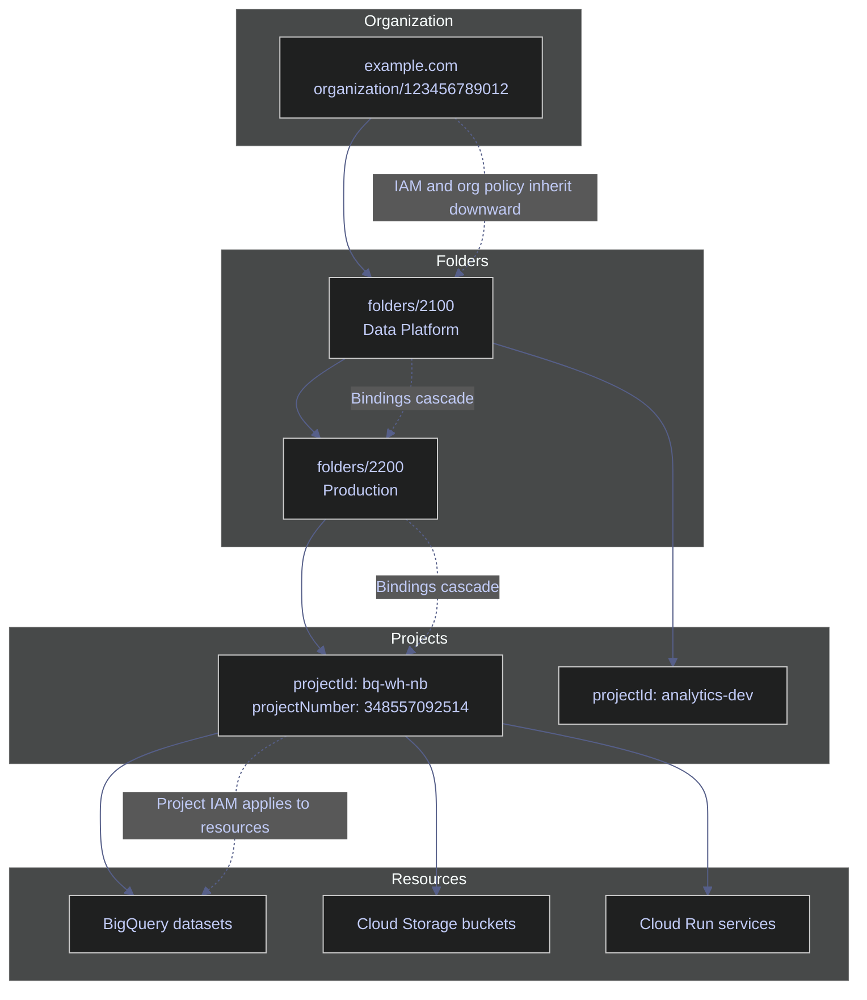

# GCP Resource Hierarchy

> [!abstract]- Summary
>
> Explains the Google Cloud organization-folder-project-resource model and the live `bq-wh-nb` project context so engineers can inspect ancestry, billing, IAM inheritance, labels, and liens without misreading parentless project output.
>
> **Bootstrap access**
> - Enable `cloudresourcemanager.googleapis.com` and grant `roles/browser`, `roles/serviceusage.serviceUsageAdmin`, `roles/resourcemanager.projectMover`, and `roles/resourcemanager.lienModifier` to `bq-wh-sa@bq-wh-nb.iam.gserviceaccount.com`
> - Verify the bootstrap IAM bindings, activate the service account, and set `bq-wh-nb` as the active project before running the live hierarchy commands
>
> **Resource hierarchy model**
> - Define the four-level structure `organization -> folder -> project -> resource` and explain why IAM, org policy, and billing effects widen as you move higher in the tree
> - Distinguish project ID, project number, project name, billing boundary, parent resource, and lifecycle state so project metadata is read correctly
>
> **Organization and folders**
> - Use `gcloud organizations list`, `gcloud organizations describe`, and `gcloud resource-manager folders list` as the command patterns for ancestor discovery
> - Interpret the live `bq-wh-nb` result correctly: no visible organization or folder parent exists, so ancestor sections are documented from command shape plus real empty output
>
> **Projects and governance metadata**
> - Inspect live project metadata with `gcloud projects describe`, create and lifecycle commands, label mutation through `gcloud alpha projects update`, and project liens through `gcloud alpha resource-manager liens`
> - Separate labels from access control, treat liens as deletion-protection controls, and read blank `parent` output as meaningful hierarchy evidence rather than as a formatting defect
>
> **Navigation and Terraform**
> - Find the current parent reference, audit direct project IAM bindings, and use folder-scoped project listing patterns for organization-backed estates
> - Map the CLI hierarchy concepts to Terraform resources such as `google_project`, `google_folder`, and `google_organization_iam_member`
>
> **Operations and safety**
> - Warnings: JSON service-account keys are sensitive, folder-level grants widen blast radius, project deletion affects the full administrative boundary, labels are not access controls, and the current environment has no visible organization or folder parent while the live reference project is now `DELETE_REQUESTED`

> [!warning] Live project state drift
>
> On April 15, 2026, `gcloud projects describe bq-wh-nb` returned `lifecycleState: DELETE_REQUESTED`. The read-only hierarchy, metadata, and IAM checks in this note were refreshed against that state. The label, lien, delete, and undelete examples remain documented command patterns and were not re-executed during this pass because they would change cloud state.

> [!note]- Glossary
>
> **organization**
> - The top-level Google Cloud resource representing a company or institution when the estate is backed by Google Workspace or Cloud Identity.
> - It matters because every folder, project, IAM grant, and org policy can inherit from this scope when an organization exists.
>
> > [!warning] Not every project has one
> >
> > Standalone projects can exist without a visible organization ancestor. The live `bq-wh-nb` environment in this note demonstrates that case directly.
>
> ---
>
> **organization ID**
> - The immutable numeric identifier assigned to an organization resource.
> - It matters because organization-level commands and Terraform references target the numeric ID, not only the human-readable display name.
>
> > [!info] Numeric identity is stable
> >
> > Display names and surrounding admin context can change, but the organization ID remains the durable reference used by APIs and IAM resources.
>
> ---
>
> **folder**
> - An optional grouping layer between organization and project used to segment teams, environments, or governance domains.
> - It matters because a folder is often the practical scope for shared IAM bindings and org policies that should reach several projects but not the whole company.
>
> > [!warning] Folder scope widens fast
> >
> > A role granted on a folder applies to every descendant project unless more specific policy controls intervene. Treat folder grants as multi-project changes, not local fixes.
>
> ---
>
> **folder ID**
> - The numeric identifier assigned to a folder resource.
> - It matters because folder list, describe, and move operations use the folder ID rather than a display name.
>
> > [!info] Display names are not enough
> >
> > Multiple folders can share similar names across a large estate. The numeric folder ID is the safer automation and audit reference.
>
> ---
>
> **project**
> - The core administrative boundary in Google Cloud where most day-to-day resources, API enablement, and billing attachment actually occur.
> - It matters because nearly every operational command an engineer runs eventually lands at project scope even when higher-level governance exists.
>
> > [!warning] Project scope is still wide
> >
> > A project is not a small unit. Deleting or misconfiguring a project affects APIs, service accounts, workloads, billing, and logs together.
>
> ---
>
> **project ID**
> - The immutable string identifier for a project, such as `bq-wh-nb`, used by most `gcloud` commands and API calls.
> - It matters because this is the value operators pass in flags, scripts, Terraform, and client configuration.
>
> > [!warning] You do not rename it later
> >
> > Project display names can change, but project IDs cannot. Choose carefully because automation and external integrations tend to persist the ID indefinitely.
>
> ---
>
> **project number**
> - The immutable numeric identifier for a project.
> - It matters because some IAM bindings, service-agent identities, and APIs reference the project number instead of the project ID.
>
> > [!info] APIs may prefer numeric form
> >
> > When a service account email or backend API asks for a numeric project reference, the project number is usually the field it expects.
>
> ---
>
> **project name**
> - The human-readable display name attached to a project.
> - It matters because operators see it in consoles and list output, but it is not the authoritative identity used by most automation.
>
> > [!warning] Name is not identity
> >
> > Two projects can look similar by display name, and a renamed project keeps the same ID and number. Use the display name for readability, not as the primary key.
>
> ---
>
> **resource hierarchy**
> - The parent-child structure `organization -> folder -> project -> resource` through which Google Cloud evaluates ancestry and governance.
> - It matters because understanding that tree is the only reliable way to reason about why IAM, billing, and org policy behave the way they do.
>
> > [!info] Inheritance follows the tree
> >
> > Permissions and constraints are usually evaluated from ancestor to descendant. If you skip the hierarchy, you misread the effective control surface.
>
> ---
>
> **billing account**
> - The commercial account charged for Google Cloud usage.
> - It matters because projects consume resources, but the billing account is the upstream commercial relationship that actually receives the charges.
>
> > [!warning] Commercial and technical scopes differ
> >
> > The billing account pays the invoice, but APIs and resources are still managed at project scope. Do not confuse who is billed with where a resource is administered.
>
> ---
>
> **billing boundary**
> - The level at which usage is operationally metered and attached to an individual workload context.
> - It matters because in Google Cloud the project is the practical billing boundary for attribution, cost reporting, and API enablement decisions.
>
> > [!info] Project is the spend unit
> >
> > One billing account can fund many projects, but usage is still grouped and analyzed per project. Cost tagging and access reviews usually start there.
>
> ---
>
> **IAM inheritance**
> - The rule that IAM permissions granted on an ancestor can apply to descendant resources.
> - It matters because a permission granted at organization or folder scope can unexpectedly appear inside projects if the inheritance path is not understood.
>
> > [!warning] High-scope grants amplify risk
> >
> > An overly broad role at folder or organization scope can become a silent privilege expansion across many projects. Always evaluate the full descendant blast radius.
>
> ---
>
> **lifecycle state**
> - The current state of a project, such as `ACTIVE`, `DELETE_REQUESTED`, or `DELETE_IN_PROGRESS`.
> - It matters because administrative commands can behave very differently depending on whether the project is healthy, soft-deleted, or moving toward irreversible deletion.
>
> > [!warning] Delete states are operationally different
> >
> > A project in a delete-requested state is not equivalent to an active project with no workloads. Restoration windows, blocked operations, and recovery planning all change once lifecycle state shifts.
>
> ---
>
> **label**
> - A lightweight key/value metadata tag attached to a resource.
> - It matters because labels drive filtering, cost attribution, inventory, and automation targeting without changing access or runtime behavior.
>
> > [!warning] Labels are not access control
> >
> > A label can help you find or report on a project, but it does not grant or restrict permissions. Do not mistake governance metadata for a security boundary.
>
> ---
>
> **lien**
> - A deletion-protection record attached to a project that blocks specific destructive operations until the lien is removed.
> - It matters because liens provide a deliberate guardrail when project deletion would be too risky to leave unprotected.
>
> > [!warning] Protection is explicit
> >
> > A lien stops allowed operations such as project deletion even for otherwise authorized principals. If a delete command fails unexpectedly, check for a lien before assuming the platform is broken.
>
> ---
>
> **parent resource**
> - The direct ancestor of a resource in the hierarchy.
> - It matters because the parent tells you which folder or organization policies and IAM grants can flow down into the current project.
>
> > [!warning] Blank parent still means something
> >
> > Empty parent output is not just “no data.” In this note it is the live evidence that `bq-wh-nb` has no visible organization or folder ancestor.
>
> ---
>
> **Cloud Resource Manager**
> - The Google Cloud control-plane API family that manages organizations, folders, and projects.
> - It matters because hierarchy inspection and mutation commands depend on this API surface, not on service-specific product APIs such as BigQuery or Storage.
>
> > [!warning] Product roles are not enough
> >
> > A principal can be powerful inside BigQuery or Storage and still fail on hierarchy commands if Cloud Resource Manager access is missing. The bootstrap section exists for exactly that reason.
>
> ---
>
> **org policy**
> - A centrally managed governance constraint applied at organization, folder, or project scope.
> - It matters because org policy is how platform teams impose rules such as allowed locations, service restrictions, or structural constraints across descendants.
>
> > [!warning] Constraints inherit too
> >
> > Even if a project operator never set a local rule, an inherited org policy can still block the action. Always consider ancestor constraints when a command looks inexplicably disallowed.
>
> ---
>
> **effective policy**
> - The combined result of ancestor-level policy and local bindings that actually applies to a given resource.
> - It matters because the policy you experience at project scope is often not the same as the policy explicitly authored only on that project.
>
> > [!info] Local view can be incomplete
> >
> > Looking only at direct project IAM bindings or direct project constraints can miss inherited controls. Effective behavior is what matters operationally, not only local declarations.
>
> ---
>
> **domain**
> - The Google Workspace or Cloud Identity domain associated with an organization resource.
> - It matters because organization discovery and ownership context are often expressed in domain terms rather than only in numeric resource identifiers.
>
> > [!info] Domain helps identify org context
> >
> > In organization-backed estates, a domain such as `example.com` often explains who owns the top-level resource and why an organization exists at all.


## Bootstrap Access

Project-level hierarchy commands did not work initially with the service account because the project had BigQuery and Storage roles, but not Cloud Resource Manager access. The exact bootstrap sequence below is what unlocked the rest of this note.

### Linux / Bash | bootstrap hierarchy access

Use this subsection when a service account can access product APIs like BigQuery but fails on `gcloud projects describe`, `gcloud organizations list`, or `gcloud services list`.

#### Enable the Cloud Resource Manager API

Before the first project, folder, or organization metadata command against a new project. It is typically triggered by `gcloud projects describe` fails with `API [cloudresourcemanager.googleapis.com] not enabled`. Run this as a project owner or another identity that already has Service Usage Admin capability on the target project. This is state-changing. Turn on the control-plane API that serves project, folder, and organization metadata.

> [!warning] Owner bootstrap only
>
> A service account that is already locked out of Cloud Resource Manager cannot usually self-bootstrap this API. A human owner or a stronger automation identity must perform this first activation.

> [!success] Enable once, then hand off
>
> After `cloudresourcemanager.googleapis.com` is enabled and the service account has the right IAM roles, all read-only hierarchy inspection commands can move to the service account instead of a human user.

*Enable the Cloud Resource Manager API for `bq-wh-nb`.*

```bash
gcloud services enable cloudresourcemanager.googleapis.com --project=bq-wh-nb --quiet
```

```text
Operation "operations/acat.p2-348557092514-46a7640e-718d-42dd-b9bb-52fca77e815f" finished successfully.
```

The successful operation ID confirms that `cloudresourcemanager.googleapis.com` was activated on project `348557092514`. Without this API, even basic metadata commands such as `gcloud projects describe` can fail before IAM is evaluated.

#### Grant the minimum additional project roles to the service account

After the API is enabled and before validating the service account against hierarchy and service commands. It is typically triggered by the service account can authenticate, but project metadata, service listing, label mutation, or lien commands still fail. Run as a project owner on `bq-wh-nb`. These commands are state-changing because they modify the project's IAM policy. Add only the roles needed for this chapter's hierarchy, API enablement, label, and lien workflows.

> [!info]- Why these four roles
>
> - `roles/browser` adds the read permissions needed for `resourcemanager.projects.get`, `resourcemanager.projects.list`, `resourcemanager.folders.get`, `resourcemanager.folders.list`, and `resourcemanager.organizations.get`.
> - `roles/serviceusage.serviceUsageAdmin` adds `serviceusage.services.list`, `serviceusage.services.enable`, and `serviceusage.services.use`, which are required for API discovery and activation.
> - `roles/resourcemanager.projectMover` contains `resourcemanager.projects.update`, which the current SDK uses for project name and label mutations.
> - `roles/resourcemanager.lienModifier` contains `resourcemanager.projects.updateLiens`, which is required for project lien creation and deletion.

*Grant the bootstrap hierarchy and service roles to `bq-wh-sa@bq-wh-nb.iam.gserviceaccount.com`.*

```bash
gcloud projects add-iam-policy-binding bq-wh-nb \
  --member="serviceAccount:bq-wh-sa@bq-wh-nb.iam.gserviceaccount.com" \
  --role="roles/browser" \
  --quiet

gcloud projects add-iam-policy-binding bq-wh-nb \
  --member="serviceAccount:bq-wh-sa@bq-wh-nb.iam.gserviceaccount.com" \
  --role="roles/serviceusage.serviceUsageAdmin" \
  --quiet

gcloud projects add-iam-policy-binding bq-wh-nb \
  --member="serviceAccount:bq-wh-sa@bq-wh-nb.iam.gserviceaccount.com" \
  --role="roles/resourcemanager.projectMover" \
  --quiet

gcloud projects add-iam-policy-binding bq-wh-nb \
  --member="serviceAccount:bq-wh-sa@bq-wh-nb.iam.gserviceaccount.com" \
  --role="roles/resourcemanager.lienModifier" \
  --quiet
```

```text
Updated IAM policy for project [bq-wh-nb].
Updated IAM policy for project [bq-wh-nb].
Updated IAM policy for project [bq-wh-nb].
Updated IAM policy for project [bq-wh-nb].
```

The service account already had workload roles such as `roles/bigquery.admin` and `roles/storage.admin`. Those product-specific roles were not enough for hierarchy inspection because they do not grant Cloud Resource Manager or Service Usage permissions.

#### Verify the new role bindings

Immediately after applying IAM changes. It is typically triggered by you need to prove that the intended least-privilege bindings landed before switching to the service account. Read-only `gcloud` command. It queries the current IAM policy on the project. Confirm that the bootstrap roles are present and correctly attached to the service account.

*List the hierarchy bootstrap roles currently granted to the service account.*

```bash
gcloud projects get-iam-policy bq-wh-nb \
  --flatten="bindings[].members" \
  --filter="bindings.members:serviceAccount:bq-wh-sa@bq-wh-nb.iam.gserviceaccount.com AND (bindings.role:roles/browser OR bindings.role:roles/serviceusage.serviceUsageAdmin OR bindings.role:roles/resourcemanager.projectMover OR bindings.role:roles/resourcemanager.lienModifier)" \
  --format="table(bindings.role)"
```

```text
ROLE
roles/browser
roles/resourcemanager.lienModifier
roles/resourcemanager.projectMover
roles/serviceusage.serviceUsageAdmin
```

The filtered IAM policy confirms that the four bootstrap roles are present. This verification is more useful than dumping the full project policy because it isolates the exact bindings you intended to create.

#### Activate the service account and target the project

After the bootstrap IAM changes are complete and before validating project-level commands as the service account. It is typically triggered by you want the rest of the hierarchy workflow to run under the non-human principal rather than the owner account. Runs in the local shell and writes credentials plus default project settings into the active `gcloud` configuration. This is state-changing for the local CLI profile. Switch the command context from the owner account to the service account that will execute the live examples.

> [!warning] Key file handling
>
> JSON key files are long-lived secrets. Do not commit them to git, do not copy them into notebook output, and do not leave them on shared machines without filesystem protection.

> [!success] Prefer keyless identities in production
>
> For CI/CD and long-lived automation, prefer Workload Identity Federation or attached service identities. Use static JSON keys only when you explicitly cannot use a keyless pattern.

*Activate the service account from the local key file and set `bq-wh-nb` as the active project.*

```bash
gcloud auth activate-service-account --key-file=gcp-bq-key.json --quiet
gcloud config set project bq-wh-nb --quiet
```

```text
Activated service account credentials for: [bq-wh-sa@bq-wh-nb.iam.gserviceaccount.com]
Updated property [core/project].
```

At this point the service account becomes the active CLI identity and the rest of the commands in this note can run without falling back to the owner account.

## Resource Hierarchy Model

The full Google Cloud hierarchy has four conceptual levels: organization, folder, project, and resource. Projects are where billing, API enablement, and most day-to-day engineering work happen, but the higher levels still matter because IAM bindings and organization policy flow downward. A permission granted too high in the tree becomes visible to every descendant resource unless a more specific control blocks it.

*Visualize the ancestor tree and inheritance direction.*



At the project layer, three operational facts matter most:

1. A project is the billing boundary. One project can be attached to only one billing account at a time.
2. A project is the API activation unit. Enabling an API in one project does not enable it in another.
3. A project is the common IAM execution boundary for most day-to-day engineering commands.

> [!warning] Folder-level over-granting
>
> An IAM binding granted on a folder applies to every project and resource underneath that folder. If a shared engineering folder contains both development and production projects, a broad role at folder scope can become an unintended privilege escalation path.

> [!success] Grant high-scope roles only when the blast radius is intentional
>
> Use folder or organization scope only for controls that genuinely need to be shared across all descendants. Keep operational roles as low in the tree as practical, usually at project scope.

## Organization

Organizations only exist when the cloud estate is anchored to Google Workspace or Cloud Identity. A standalone project can exist without a visible organization parent, and that is exactly what the live `bq-wh-nb` environment demonstrates.

### Linux / Bash | gcloud organizations list

Use this command to discover which organization resources are visible to the active identity. In the current environment the result is empty, which is operationally meaningful because it explains why folder-level commands below cannot be executed against a real ancestor.

#### List organizations visible to the active principal

At the start of a hierarchy audit or before planning folder-level changes. It is typically triggered by you need to determine whether the environment is organization-backed or a standalone project. Read-only control-plane query. No project mutation occurs. Identify visible organization IDs and confirm whether a higher-level resource exists above the project.

*Return all organizations visible to the active service account.*

```bash
gcloud organizations list --format=json
```

```text
[]
```

The empty JSON array means the active principal sees no organization resources. In this environment that result aligns with the project metadata later in the note, where `bq-wh-nb` has no `parent` field. Without an organization ID, folder commands cannot target a live ancestor.

| Flag | Syntax | Description |
|---|---|---|
| `--format` | `gcloud organizations list --format=json` | Controls output shape such as `json`, `yaml`, `table(...)`, or `value(...)`. |
| `--filter` | `gcloud organizations list --filter="displayName:Finance"` | Filters the returned organizations by field value. |
| `--limit` | `gcloud organizations list --limit=5` | Caps the number of returned rows. |
| `--sort-by` | `gcloud organizations list --sort-by=displayName` | Sorts the result set client-side. |
| `--uri` | `gcloud organizations list --uri` | Prints only resource URIs instead of the default fields. |

### Linux / Bash | gcloud organizations describe

This command is only meaningful when an organization ID or domain exists. Because `gcloud organizations list` returned `[]`, there is no live organization target in the current project.

#### Describe a specific organization

After you have a valid organization ID or domain. It is typically triggered by you need metadata such as `displayName`, `directoryCustomerId`, or `owner.directoryCustomerId`. Read-only control-plane query. Requires visibility to the organization resource. Confirm which organization a project belongs to and inspect the metadata that identifies that top-level ancestor.

*Describe an organization by numeric ID or domain name.*

```bash
gcloud organizations describe ORGANIZATION_ID
```

```text
No live output in this environment: `gcloud organizations list` returned `[]`, so there is no visible organization ID to describe from `bq-wh-nb`.
```

When this command is valid, the output normally includes the organization resource name, display name, directory customer ID, and owner metadata. In `bq-wh-nb`, the correct operational conclusion is not "permission denied"; it is that no organization ancestor is currently visible at all.

| Flag | Syntax | Description |
|---|---|---|
| `ORGANIZATION_ID` | `gcloud organizations describe 123456789012` | Numeric organization ID or domain name such as `example.com`. |
| `--format` | `gcloud organizations describe 123456789012 --format=yaml` | Chooses output layout for scripting or review. |
| `--flatten` | `gcloud organizations describe 123456789012 --flatten=owner` | Flattens nested fields before formatting or filtering. |
| `--verbosity` | `gcloud organizations describe 123456789012 --verbosity=debug` | Adds more client-side logging for troubleshooting. |

## Folders

Folders are optional. They only exist beneath an organization and are useful when you need an intermediate administrative boundary between the company-wide organization and individual projects. Because `bq-wh-nb` has no visible organization ancestor, folder management in this environment is a command-shape reference rather than a live parent-child walkthrough.

### Linux / Bash | gcloud resource-manager folders list

Use folder listing when an organization or parent folder exists and you need to enumerate the next layer down.

#### List child folders under an organization or parent folder

After confirming that an organization or folder parent exists. It is typically triggered by you need to inventory the folder tree or find the correct target parent for a new project. Read-only query against Cloud Resource Manager. Exactly one of `--organization` or `--folder` must be supplied. Enumerate child folders and confirm the folder topology above your projects.

*List folders under an organization.*

```bash
gcloud resource-manager folders list --organization=ORG_ID --format="table(name,displayName,parent.name,state)"
```

```text
No live output in this environment: `bq-wh-nb` has no visible organization parent, so there is no `ORG_ID` available for a real folder listing.
```

| Flag | Syntax | Description |
|---|---|---|
| `--organization` | `gcloud resource-manager folders list --organization=123456789012` | Lists folders directly beneath an organization. |
| `--folder` | `gcloud resource-manager folders list --folder=2100` | Lists folders directly beneath another folder. |
| `--filter` | `gcloud resource-manager folders list --organization=123456789012 --filter="displayName:Prod"` | Filters returned folders. |
| `--limit` | `gcloud resource-manager folders list --organization=123456789012 --limit=10` | Limits the number of results. |
| `--page-size` | `gcloud resource-manager folders list --organization=123456789012 --page-size=50` | Adjusts API paging size. |
| `--sort-by` | `gcloud resource-manager folders list --organization=123456789012 --sort-by=displayName` | Sorts the returned folders. |
| `--uri` | `gcloud resource-manager folders list --organization=123456789012 --uri` | Prints resource URIs only. |

### Linux / Bash | gcloud resource-manager folders describe

Folder description is the next step after listing, when you need the metadata for one specific folder.

#### Describe a folder by ID

After obtaining a real folder ID. It is typically triggered by you need the display name, parent reference, or lifecycle state of a folder. Read-only query. Requires access to the folder resource. Inspect one folder in detail before moving projects or granting folder-level IAM.

*Describe a folder by numeric ID.*

```bash
gcloud resource-manager folders describe FOLDER_ID
```

```text
No live output in this environment: there is no visible folder ID to describe because the project has no organization or folder ancestor.
```

| Flag | Syntax | Description |
|---|---|---|
| `FOLDER_ID` | `gcloud resource-manager folders describe 3589215982` | Numeric ID of the folder to inspect. |
| `--format` | `gcloud resource-manager folders describe 3589215982 --format=yaml` | Controls output shape. |
| `--flatten` | `gcloud resource-manager folders describe 3589215982 --flatten=parent` | Flattens nested fields before formatting. |
| `--verbosity` | `gcloud resource-manager folders describe 3589215982 --verbosity=debug` | Adds troubleshooting output. |

### Linux / Bash | gcloud resource-manager folders create

Folder creation is an organization-governance operation, not an everyday application workflow. It should be rare, deliberate, and reviewed because every folder becomes a new inheritance point for IAM and policy.

#### Create a new folder beneath an organization or folder

During platform or environment design, not during routine application deployment. It is typically triggered by you need a new administrative boundary such as a business unit, environment group, or compliance partition. State-changing command. Requires a valid organization or parent folder and the authority to create folders there. Insert a new folder into the hierarchy so projects can inherit IAM and policy from a controlled intermediate parent.

*Create a folder beneath an organization.*

```bash
gcloud resource-manager folders create --display-name="Data Platform" --organization=ORG_ID
```

```text
No live output in this environment: folder creation is not applicable because `bq-wh-nb` has no visible organization parent to host a folder.
```

| Flag | Syntax | Description |
|---|---|---|
| `--display-name` | `gcloud resource-manager folders create --display-name="Data Platform" --organization=123456789012` | Human-readable folder name. |
| `--organization` | `gcloud resource-manager folders create --display-name="Data Platform" --organization=123456789012` | Uses an organization as the parent. |
| `--folder` | `gcloud resource-manager folders create --display-name="Production" --folder=2100` | Uses another folder as the parent. |
| `--async` | `gcloud resource-manager folders create --display-name="Data Platform" --organization=123456789012 --async` | Returns before the create operation completes. |
| `--tags` | `gcloud resource-manager folders create --display-name="Data Platform" --organization=123456789012 --tags=123/environment=production` | Binds tags during create. |

### Linux / Bash | gcloud resource-manager folders move

Folder moves are powerful because they reparent an entire subtree, not just one resource.

#### Reparent a folder under a different parent

Only during a planned hierarchy redesign. It is typically triggered by teams, environments, or business units are being regrouped beneath a different parent folder or organization. State-changing control-plane command. Exactly one of `--folder` or `--organization` must be supplied. Move a folder to a new parent while keeping all child resources underneath it.

> [!warning] Folder move changes inheritance
>
> Moving a folder changes the ancestor chain for every project and resource beneath that folder. That means IAM inheritance, policy inheritance, and any ancestor-based guardrails can all change in one operation.

> [!success] Audit before and after the move
>
> Before any folder move, export the current IAM and policy state. After the move, re-run the same audit commands and compare the effective bindings to confirm that production access did not widen unexpectedly.

*Move a folder to a new parent.*

```bash
gcloud resource-manager folders move FOLDER_ID --organization=ORG_ID
```

```text
No live output in this environment: there is no live folder to move because `bq-wh-nb` is not currently beneath a visible organization or folder tree.
```

| Flag | Syntax | Description |
|---|---|---|
| `FOLDER_ID` | `gcloud resource-manager folders move 123456789 --organization=123456789012` | The folder being reparented. |
| `--organization` | `gcloud resource-manager folders move 123456789 --organization=123456789012` | Moves the folder directly under the organization. |
| `--folder` | `gcloud resource-manager folders move 123456789 --folder=2345` | Moves the folder under another folder. |
| `--async` | `gcloud resource-manager folders move 123456789 --organization=123456789012 --async` | Returns before the move operation completes. |

## Projects

Projects are where most engineers live operationally. They are the point where billing attaches, APIs are enabled, service accounts run, and resources like BigQuery datasets, buckets, and Cloud Run services are created. The read-only inspection commands in this section were refreshed live against `bq-wh-nb`, which is currently in `DELETE_REQUESTED`.

### Linux / Bash | gcloud projects list

Project listing is the first sanity check before any destructive or environment-specific work. It tells you which projects the active principal can currently see.

#### List projects visible to the service account

Before choosing a project target or validating which projects a principal can access. It is typically triggered by you need to inventory visible projects or verify that the active identity is scoped correctly. Read-only Cloud Resource Manager query. Enumerate accessible projects with their IDs, numbers, and lifecycle states.

*List the projects currently visible to the active service account that are pending deletion.*

```bash
gcloud projects list --filter="lifecycleState:DELETE_REQUESTED" --format="table(projectId,name,projectNumber,lifecycleState)"
```

```text
PROJECT_ID        NAME          PROJECT_NUMBER  LIFECYCLE_STATE
bq-wh-nb          BQ Database   348557092514    DELETE_REQUESTED
index-lab-2       Index Lab     1052700078743   DELETE_REQUESTED
index-lab-491012  index-lab     624680779669    DELETE_REQUESTED
seclab-dev-2026   Security Lab  935469410151    DELETE_REQUESTED
seclab-dev-ap-26  Security Lab  922174528852    DELETE_REQUESTED
seclab-dev-ap26   Security Lab  972728025985    DELETE_REQUESTED
```

The service account can now see `bq-wh-nb` directly through Cloud Resource Manager, which was not true before the bootstrap steps. The important nuance is that a plain `gcloud projects list --filter="projectId=bq-wh-nb"` currently returns no rows for this project, while the lifecycle-state filter above does. That suggests pending-deletion projects are not surfaced in the ordinary list path unless you ask for the deletion state explicitly.

| Flag | Syntax | Description |
|---|---|---|
| `--filter` | `gcloud projects list --filter="lifecycleState:DELETE_REQUESTED"` | Restricts results by project metadata such as ID, name, labels, or lifecycle state. |
| `--format` | `gcloud projects list --format="table(projectId,name)"` | Controls output layout for humans or scripts. |
| `--limit` | `gcloud projects list --limit=20` | Caps the number of rows returned. |
| `--sort-by` | `gcloud projects list --sort-by=name` | Sorts project output by one or more fields. |
| `--page-size` | `gcloud projects list --page-size=50` | Controls API paging size. |

### Linux / Bash | gcloud projects describe

Project description is the canonical metadata check. It is how you confirm lifecycle state, labels, create time, and parent association before changing the project.

#### Describe the live project metadata

Before modifying labels, IAM, APIs, or billing on a project. It is typically triggered by you need to confirm exactly which project you are touching and what its current metadata looks like. Read-only Cloud Resource Manager query. Retrieve the authoritative metadata record for one project.

*Describe the live metadata for `bq-wh-nb`.*

```bash
gcloud projects describe bq-wh-nb --format="yaml(projectId,projectNumber,name,lifecycleState,parent,labels,createTime)"
```

```text
createTime: '2026-03-22T16:26:19.672Z'
lifecycleState: DELETE_REQUESTED
name: BQ Database
projectId: bq-wh-nb
projectNumber: '348557092514'
```

Three details matter here. First, `lifecycleState: DELETE_REQUESTED` means the project is already inside the 30-day recovery window and should be treated as pending deletion rather than as a healthy operating baseline. Google’s current Resource Manager guidance also notes that billing is disconnected at shutdown and that some services can delete data sooner than the full 30-day window. Second, the absence of both `parent` and `labels` confirms this project currently has no visible organization or folder ancestor and no labels applied. Third, the `createTime` value gives you a precise audit point for when the project entered the environment.

| Field | Meaning | Operational implication |
|---|---|---|
| `name` | Human-readable project display name. | Useful for audits and consoles, but not the durable automation key. |
| `projectId` | Immutable string identifier used by most APIs and CLIs. | Use this in `--project` flags, client configs, and Terraform. |
| `projectNumber` | Immutable numeric identifier. | Required by some IAM, service-agent, and resource-manager APIs. |
| `lifecycleState` | Current project state. | `DELETE_REQUESTED` means the recovery window is open; restore is possible, but the project should be treated as pending deletion. |
| `createTime` | RFC 3339 creation timestamp. | Useful for audit trails and environment age tracking. |
| `parent` | Folder or organization ancestor, if present. | Missing here means there is no visible ancestor resource. |
| `labels` | Arbitrary project metadata tags. | Missing here means no labels are currently applied. |

| Flag | Syntax | Description |
|---|---|---|
| `--format` | `gcloud projects describe bq-wh-nb --format=yaml` | Controls output serialization. |
| `--flatten` | `gcloud projects describe bq-wh-nb --flatten=labels` | Flattens nested fields before formatting. |
| `--verbosity` | `gcloud projects describe bq-wh-nb --verbosity=debug` | Adds client debug logging. |

### Linux / Bash | gcloud projects create

Project creation is a control-plane provisioning step, not a normal application action. It is safe only when you are prepared to consume a new globally unique project ID and, in most cases, attach billing afterward.

#### Create a new project

During environment bootstrap or platform expansion. It is typically triggered by you need a new isolated administrative and billing boundary. State-changing command. It creates a brand-new Google Cloud project and may optionally attach it to a folder or organization. Provision a project that can later receive APIs, billing, IAM, and workload resources.

*Create a new project with a specific name and optional labels.*

```bash
gcloud projects create PROJECT_ID --name="Project Name" --labels=env=dev
```

```text
No live output in this environment: a throwaway project was intentionally not created because project IDs are globally unique, billing attachment is a separate follow-up step, and the bootstrap goal for this note was inspection and governance rather than provisioning extra projects.
```

| Flag | Syntax | Description |
|---|---|---|
| `PROJECT_ID` | `gcloud projects create example-foo-bar-1` | Immutable project ID chosen at create time. |
| `--name` | `gcloud projects create example-foo-bar-1 --name="Happy project"` | Human-readable project name. |
| `--labels` | `gcloud projects create example-foo-bar-1 --labels=env=dev` | Adds labels during create. |
| `--folder` | `gcloud projects create example-2 --folder=12345` | Creates the project under a folder parent. |
| `--organization` | `gcloud projects create example-3 --organization=2048` | Creates the project under an organization parent. |
| `--set-as-default` | `gcloud projects create example-foo-bar-1 --set-as-default` | Sets the new project as the active `core/project`. |
| `--no-enable-cloud-apis` | `gcloud projects create example-foo-bar-1 --no-enable-cloud-apis` | Skips default `cloudapis.googleapis.com` enablement. |

### Linux / Bash | project lifecycle

Project deletion is intentionally slow because Google Cloud gives you a recovery window. That is a safety feature, not a reason to be casual about destructive commands.

#### Soft-delete a project

Only when you are certain the project is no longer required. It is typically triggered by environment retirement, cost cleanup, or a deliberate rebuild. State-changing destructive command. It starts a 30-day recovery window rather than immediate irreversible destruction. Move a project from `ACTIVE` into a recoverable deletion state. Only projects that are still `ACTIVE` can be shut down.

> [!danger] Project deletion is wide-scope
>
> Deleting a project does not remove one resource. It requests deletion of the entire administrative boundary: APIs, service accounts, datasets, buckets, logs, and dependent automation all become affected at once.

> [!success] Verify the target before delete
>
> Before any `gcloud projects delete`, run `gcloud config get-value project` and `gcloud projects describe PROJECT_ID` to confirm the exact project ID, project number, and lifecycle state you are about to affect.

*Request deletion of a project.*

```bash
gcloud projects delete PROJECT_ID
```

```text
Not run live in this refactor pass: the current reference project is already `DELETE_REQUESTED`, and Google Cloud only allows shutdown from the `ACTIVE` lifecycle state.
```

#### Restore a project during the recovery window

After an accidental delete request and before the recovery window closes. It is typically triggered by the project entered `DELETE_REQUESTED`, but the resources still need to be preserved. State-changing recovery command. Works only during the soft-delete retention window. Return a project to `ACTIVE` before irreversible deletion proceeds.

*Restore a project that is still inside the undelete window.*

```bash
gcloud projects undelete PROJECT_ID
```

```text
Not run live in this refactor pass: `bq-wh-nb` meets the `DELETE_REQUESTED` precondition, but restoring it would change the current cloud state and was intentionally left for an explicit recovery task.
```

| Flag | Syntax | Description |
|---|---|---|
| `PROJECT_ID` | `gcloud projects delete my-project` | The project being deleted or undeleted. |
| `--quiet` | `gcloud projects delete my-project --quiet` | Suppresses the interactive confirmation prompt. |

### Linux / Bash | project labels

Labels are the lightest-weight governance metadata you can add to a project. They are cheap, script-friendly, and ideal for filtering, but they are not access controls. On April 15, 2026, the installed Google Cloud SDK version `563.0.0` still exposes project label mutation on the `alpha` track in this environment: `gcloud projects update` only renames projects, while `gcloud alpha projects update` is still the path that exposes `--update-labels` and `--remove-labels`.

#### Add a label to the project

Before introducing cost allocation, environment filtering, or automation targeting that depends on project metadata. It is typically triggered by A project needs machine-readable metadata such as environment, team, or owner. State-changing project metadata update through Cloud Resource Manager. Attach a label key/value pair to the project.

*Add the label `codex-bootstrap=enabled` to `bq-wh-nb`.*

```bash
gcloud alpha projects update bq-wh-nb --update-labels=codex-bootstrap=enabled --quiet
```

```text
PROJECT_ID  NAME         PROJECT_NUMBER  ENVIRONMENT
bq-wh-nb    BQ Database  348557092514
```

The update command returns the standard project summary table rather than a label dump. The important effect is the successful metadata write, which is verified immediately below.

#### Verify the label mutation

Immediately after adding or removing labels. It is typically triggered by you need proof that the update reached Cloud Resource Manager. Read-only metadata query. Confirm the exact current label set on the project.

*Describe the project and return only the label block.*

```bash
gcloud projects describe bq-wh-nb --format="yaml(projectId,labels)"
```

```text
labels:
  codex-bootstrap: enabled
projectId: bq-wh-nb
```

#### Remove the temporary label

After validation or when the label no longer reflects reality. It is typically triggered by cleanup after a temporary test label or a metadata correction. State-changing metadata update. Remove one or more labels without touching the rest of the project.

*Remove the temporary bootstrap label from `bq-wh-nb`.*

```bash
gcloud alpha projects update bq-wh-nb --remove-labels=codex-bootstrap --quiet
```

```text
PROJECT_ID  NAME         PROJECT_NUMBER  ENVIRONMENT
bq-wh-nb    BQ Database  348557092514
```

The remove-labels command returns the same project summary shape. The important effect is that the temporary label is gone, which is verified immediately below.

#### Filter projects by label

During inventory, governance audits, or automation that targets only one class of projects. It is typically triggered by you need to select projects by metadata rather than by manually curated lists. Read-only list command with server-side filtering. Return only the projects whose labels match the filter expression.

*List projects labeled `env=dev`.*

```bash
gcloud projects list --filter="labels.env=dev" --format=json
```

```text
[]
```

The empty result is expected because `bq-wh-nb` currently has no permanent labels. In a real environment, this pattern is how you target all development or platform projects without hardcoding project IDs.

| Flag | Syntax | Description |
|---|---|---|
| `--update-labels` | `gcloud alpha projects update bq-wh-nb --update-labels=env=dev` | Adds or changes one or more labels. |
| `--remove-labels` | `gcloud alpha projects update bq-wh-nb --remove-labels=env` | Removes one or more label keys. |
| `--clear-labels` | `gcloud alpha projects update bq-wh-nb --clear-labels` | Removes all labels before any optional updates. |
| `--name` | `gcloud alpha projects update bq-wh-nb --name="BQ Database"` | Renames the project display name. |
| `--filter` | `gcloud projects list --filter="labels.env=dev"` | Restricts project listing by label criteria. |

### Linux / Bash | project liens

Liens are deletion-protection controls. They do not manage access, but they stop specific destructive operations until the lien is explicitly removed.

#### Create a temporary deletion-protection lien

Before handing a sensitive project to automation or before a risky administrative period. It is typically triggered by you need an extra guardrail against accidental project deletion. State-changing alpha command. Requires lien modification permission on the project. Add a project lien that blocks `resourcemanager.projects.delete`.

*Create a lien that blocks project deletion.*

```bash
gcloud alpha resource-manager liens create \
  --project=bq-wh-nb \
  --reason="Temporary Codex lien validation" \
  --restrictions="resourcemanager.projects.delete" \
  --origin="codex-validation" \
  --format="value(name)"
```

```text
liens/p348557092514-l11906663-8e8e-44b3-8175-f770f6bc32c3
```

The returned resource name is the authoritative lien handle. You need that ID later if you want to delete the lien.

#### List active liens on the project

After creating a lien or when investigating why a delete operation is blocked. It is typically triggered by A project cannot be deleted or you need to audit the current deletion-protection state. Read-only alpha command. Show every active lien attached to the current project.

*List all current liens on `bq-wh-nb`.*

```bash
gcloud alpha resource-manager liens list --project=bq-wh-nb --format="table(name,reason,origin,restrictions)"
```

```text
NAME                                                 REASON                           ORIGIN            RESTRICTIONS
p348557092514-l11906663-8e8e-44b3-8175-f770f6bc32c3  Temporary Codex lien validation  codex-validation  ['resourcemanager.projects.delete']
```

The `restrictions` value is the key field. Here it shows that the lien blocks project deletion specifically, not every possible project mutation.

#### Delete the temporary lien after validation

After the protection test is complete or when the project should become deletable again. It is typically triggered by cleanup after a temporary guardrail or a planned project retirement. State-changing alpha command. Remove the lien so the restricted operation can proceed in the future.

*Delete the test lien by lien ID.*

```bash
gcloud alpha resource-manager liens delete p348557092514-l11906663-8e8e-44b3-8175-f770f6bc32c3 --quiet
```

```text
Deleted [liens/p348557092514-l11906663-8e8e-44b3-8175-f770f6bc32c3].
```

#### Verify that no liens remain

Immediately after deleting a lien. It is typically triggered by you need to prove that the project is no longer protected by a lingering restriction. Read-only alpha list command. Confirm that the project has returned to a no-lien state.

*Return the remaining liens as JSON after cleanup.*

```bash
gcloud alpha resource-manager liens list --project=bq-wh-nb --format=json
```

```text
[]
```

| Flag | Syntax | Description |
|---|---|---|
| `--reason` | `gcloud alpha resource-manager liens create --reason="Temporary Codex lien validation" ...` | Human-readable explanation for the lien. |
| `--restrictions` | `gcloud alpha resource-manager liens create --restrictions="resourcemanager.projects.delete" ...` | IAM permission(s) curtailed by the lien. |
| `--origin` | `gcloud alpha resource-manager liens create --origin="codex-validation" ...` | Source string recorded on the lien. |
| `--project` | `gcloud alpha resource-manager liens list --project=bq-wh-nb` | Targets the current project explicitly. |
| `LIEN_ID` | `gcloud alpha resource-manager liens delete p348557092514-l...` | The specific lien resource ID to remove. |

## Cross-Hierarchy Navigation Patterns

Cross-hierarchy navigation is where the parent-child model becomes operational. These patterns answer three recurring questions: "What is the parent of this project?", "Which IAM bindings exist here?", and "How would I navigate upward if a folder existed?"

### Linux / Bash | find the parent of the current project

This pattern is the fastest way to learn whether a project is attached to a folder or organization.

#### Return the parent type and parent ID

At the start of any hierarchy investigation. It is typically triggered by you need to know whether folder or organization commands are applicable to the current project. Read-only metadata query. Return the immediate parent reference of the current project.

*Return the parent type and parent ID for `bq-wh-nb`.*

```bash
gcloud projects describe bq-wh-nb --format="value(parent.type,parent.id)"
```

```text

```

The blank output is meaningful: `bq-wh-nb` has no visible parent resource in this environment. That is why organization and folder sections in this note cannot be populated with live ancestor objects.

| Flag | Syntax | Description |
|---|---|---|
| `--format` | `gcloud projects describe bq-wh-nb --format="value(parent.type,parent.id)"` | Extracts only the parent fields instead of the full metadata record. |

### Linux / Bash | audit direct project IAM bindings

This pattern does not compute the full inherited effective policy, but it shows the bindings applied directly on the project itself.

#### List the direct roles granted to the service account on the project

During access reviews or after changing IAM policy. It is typically triggered by you need to prove which roles are bound directly on the project. Read-only IAM policy query. Show the direct project-level bindings attached to the service account.

*List the roles granted directly on `bq-wh-nb` to the service account used in this note.*

```bash
gcloud projects get-iam-policy bq-wh-nb \
  --flatten="bindings[].members" \
  --filter="bindings.members:serviceAccount:bq-wh-sa@bq-wh-nb.iam.gserviceaccount.com" \
  --format="table(bindings.role)"
```

```text
ROLE
roles/bigquery.admin
roles/browser
roles/datastore.owner
roles/datastore.user
roles/iam.serviceAccountAdmin
roles/iam.workloadIdentityPoolAdmin
roles/resourcemanager.lienModifier
roles/resourcemanager.projectMover
roles/run.developer
roles/serviceusage.serviceUsageAdmin
roles/storage.admin
roles/storage.objectUser
```

These are direct project bindings, not the full inherited effective policy. The current binding set is broader than the original bootstrap-only role set because the service account now also has direct IAM administration, Workload Identity Pool administration, and Cloud Run development roles on the project. In an organization-backed environment, you would run the equivalent IAM policy commands at organization and folder scope as well, then reason about inheritance from top to bottom.

| Flag | Syntax | Description |
|---|---|---|
| `--flatten` | `gcloud projects get-iam-policy bq-wh-nb --flatten="bindings[].members"` | Expands nested IAM arrays so each binding can be filtered row by row. |
| `--filter` | `gcloud projects get-iam-policy bq-wh-nb --filter="bindings.members:serviceAccount:..."` | Restricts the policy view to a specific member or role. |
| `--format` | `gcloud projects get-iam-policy bq-wh-nb --format="table(bindings.role)"` | Renders the final policy slice as a table. |

### Linux / Bash | list projects under a folder

This is the pattern you would use in an organization-backed environment to inventory all projects under one folder. It is included here because it is one of the most common hierarchy-audit tasks, even though the current environment does not expose a folder ancestor.

#### List projects beneath a folder

During environment inventories or folder-level access reviews. It is typically triggered by you know the folder ID and need the projects contained beneath it. Read-only list pattern. Requires a real folder ancestor and visibility to it. Enumerate projects scoped by one folder rather than by the full account view.

*List projects whose parent folder ID matches a specific folder.*

```bash
gcloud projects list --filter="parent.id=FOLDER_ID AND parent.type=folder" --format="table(projectId,name,lifecycleState)"
```

```text
No live output in this environment: `bq-wh-nb` has no visible folder ancestor, so there is no real `FOLDER_ID` available for a live folder-scoped project listing.
```

| Flag | Syntax | Description |
|---|---|---|
| `--filter` | `gcloud projects list --filter="parent.id=12345 AND parent.type=folder"` | Restricts projects to a folder parent. |
| `--format` | `gcloud projects list --format="table(projectId,name)"` | Controls output shape for human review or automation. |

## Terraform Equivalents

The CLI is useful for discovery and one-off administration, but infrastructure-as-code is the safer long-term pattern when you want the hierarchy and bindings to be reproducible.

> [!example] Terraform resource mapping
>
> *Map the hierarchy concepts to Terraform resources.*
>
> ```hcl
> resource "google_project" "warehouse" {
>   project_id = "bq-wh-nb"
>   name       = "BQ Database"
> }
>
> resource "google_folder" "data_platform" {
>   display_name = "Data Platform"
>   parent       = "organizations/123456789012"
> }
>
> resource "google_organization_iam_member" "viewer" {
>   org_id = "123456789012"
>   role   = "roles/browser"
>   member = "serviceAccount:bq-wh-sa@bq-wh-nb.iam.gserviceaccount.com"
> }
> ```

---

## Related

- [gcloud APIs and Services](https://alp78.github.io/elysium/06-GCP/01-Core/02-gcp-apis-and-services)
- [gcloud Authentication](https://alp78.github.io/elysium/06-GCP/01-Core/03-gcloud-authentication)
- [Service Accounts and IAM](https://alp78.github.io/elysium/06-GCP/Security/service-accounts-and-iam)
- [gcloud Configurations](https://alp78.github.io/elysium/06-GCP/01-Core/04-gcloud-configurations)

## References

- [Resource hierarchy overview](https://cloud.google.com/resource-manager/docs/cloud-platform-resource-hierarchy)
- [Creating and managing projects](https://cloud.google.com/resource-manager/docs/creating-managing-projects)
- [Creating and managing folders](https://cloud.google.com/resource-manager/docs/creating-managing-folders)
- [Project liens overview](https://cloud.google.com/resource-manager/docs/project-liens)
- [gcloud projects reference](https://cloud.google.com/sdk/gcloud/reference/projects)
- [gcloud organizations reference](https://cloud.google.com/sdk/gcloud/reference/organizations)
- [gcloud resource-manager folders reference](https://cloud.google.com/sdk/gcloud/reference/resource-manager/folders)
- [gcloud alpha resource-manager liens reference](https://cloud.google.com/sdk/gcloud/reference/alpha/resource-manager/liens)
