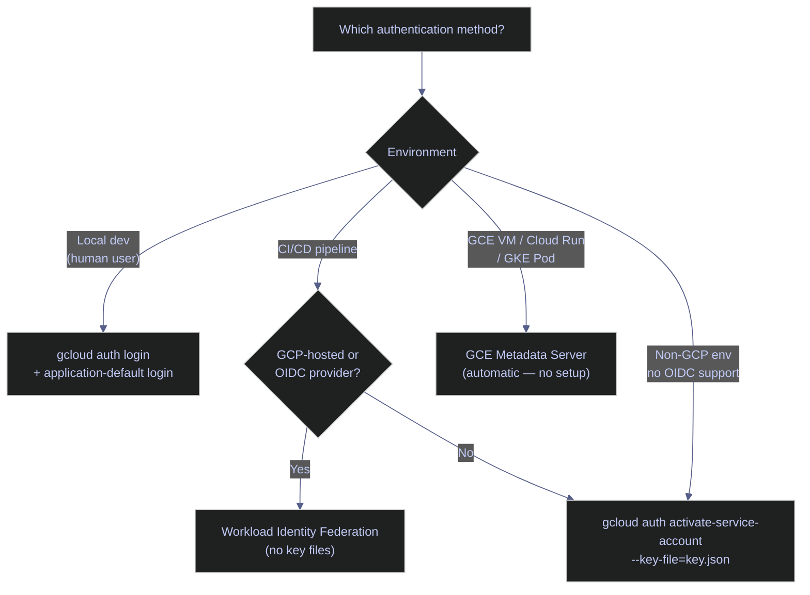
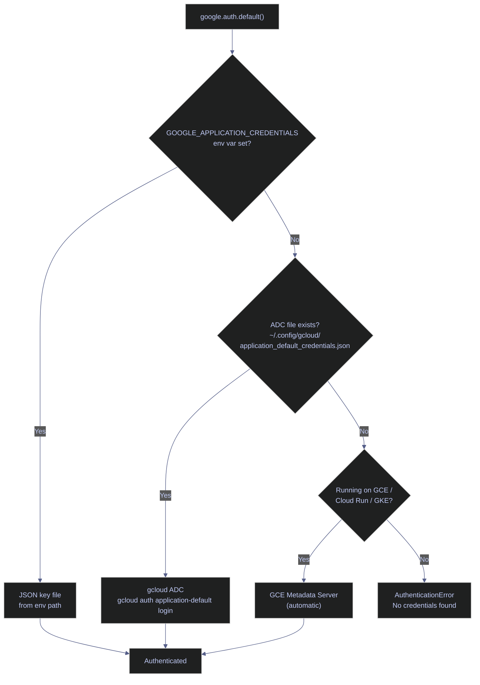

# GCP Authentication with gcloud CLI

> [!quote]
> "Passwords are like underwear: you don't let people see it, you should change it very often, and you shouldn't share it with strangers."
>
> — **Chris Pirillo**

GCP uses OAuth 2.0 tokens for authentication. Every gcloud command sends a token that identifies who you are and what you are authorized to do. Understanding the two types of credentials — user credentials and Application Default Credentials (ADC) — prevents the most common "permission denied" errors in pipeline development.

## Authentication Overview

There are three authentication flows: interactive login for humans, Application Default Credentials for code/SDKs, and service account activation for CI/CD and production environments. The gcloud CLI commands are identical on Linux and Windows.



## Authentication Commands

The `gcloud auth` subcommand manages all credential types. Choose the method that matches your environment: interactive for local work, application-default for SDK access, or service account for production and CI/CD.

### Interactive Authentication

For human users working locally. `auth login` populates credentials for the `gcloud` CLI; `application-default login` populates a separate file read by Python, Go, and Java client libraries. Both are needed for full local development access.

#### gcloud auth login — interactive authentication for human users

Opens a browser for Google account login. The OAuth token is stored in `~/.config/gcloud/` and refreshed automatically. Use for interactive work (debugging, ad-hoc queries, infrastructure changes).

```bash
gcloud auth login
```

```text
Your browser has been opened to visit:

    https://accounts.google.com/o/oauth2/auth?...

You are now logged in as [you@example.com].
Your current project is [my-project]. You can change this setting by running:
  $ gcloud config set project PROJECT_ID
```

#### gcloud auth application-default login — ADC for application code

Writes credentials to `~/.config/gcloud/application_default_credentials.json`. These are read by Python `google-cloud-*`, Go, and Java SDK clients — not by the `gcloud` CLI itself.

> [!warning] ADC is different from `gcloud auth login`
> - `gcloud auth login` = credentials for the **gcloud CLI** itself
> - `application-default login` = credentials for **client libraries** (Python `google-cloud-*`, Go, Java)
> - Your pipeline code calls BigQuery via the Python SDK, which reads ADC
> - If you only run `gcloud auth login`, your pipeline still gets "permission denied"

> [!success] Run both commands for local development
> For local development, always run both:
> ```bash
> gcloud auth login                        # for gcloud CLI commands
> gcloud auth application-default login   # for Python/SDK client libraries
> ```
> This ensures both the CLI and your application code use the correct identity.

```bash
gcloud auth application-default login
```

```text
Your browser has been opened to visit:

    https://accounts.google.com/o/oauth2/auth?...

Credentials saved to file: [/home/user/.config/gcloud/application_default_credentials.json]

These credentials will be used by any library that requests Application Default Credentials (ADC).
Quota project "my-project" was added to ADC which can be used by Google client libraries for billing and quota.
```

#### gcloud auth application-default set-quota-project — set billing project for ADC

Sets the quota project used by client libraries for billing. Required when your user identity belongs to a different project than the API resources you are accessing — otherwise API calls may fail with quota or billing errors.

```bash
gcloud auth application-default set-quota-project PROJECT_ID
```

```text
Updated property [core/project].
Credentials saved to file: [/home/user/.config/gcloud/application_default_credentials.json]
```

| Flag | Description |
|---|---|
| `PROJECT_ID` | Project to use for quota and billing when ADC credentials are used by client libraries |

### Interactive Authentication — Flag Reference

| Flag | Command | Description |
|---|---|---|
| `--no-launch-browser` | `auth login`, `application-default login` | Print auth URL instead of opening a browser — use in headless or SSH environments |
| `--scopes` | `auth login`, `application-default login` | Comma-separated OAuth scopes to request (default: `cloud-platform`) |
| `--account` | `auth login` | Google account to authenticate if multiple are available |
| `--client-id-file` | `application-default login` | Path to a custom OAuth client credentials JSON file |
| `--disable-quota-project` | `application-default login` | Omit the billing project from the ADC credentials file |

### Service Account Authentication

For CI/CD pipelines, automated scripts, and non-interactive environments. In production, prefer Workload Identity Federation over key files — key files never expire and remain valid until explicitly deleted in IAM.

#### gcloud auth activate-service-account — SA key for production and CI/CD

Authenticates as a service account using a JSON key file. Use for CI/CD pipelines, automated scripts, and non-interactive environments. In production, prefer Workload Identity (no key files) over key files.

```bash
gcloud auth activate-service-account --key-file=key.json
```

```text
Activated service account credentials for: [my-sa@my-project.iam.gserviceaccount.com]
```

For creating and managing the service accounts referenced here, see [service-accounts-and-iam](https://alp78.github.io/elysium/06-GCP/Security/service-accounts-and-iam). In GitHub Actions, [Workload Identity Federation](https://alp78.github.io/elysium/10-GitHub-Actions/github-actions-ci-cd) eliminates key files entirely for CI/CD authentication.

### Service Account Authentication — Flag Reference

| Flag | Description |
|---|---|
| `--key-file` | Path to the service account JSON key file (required) |
| `--project` | Set the default GCP project for this service account session |

### Credential Management

Commands for inspecting, debugging, and cleaning up credentials. Use `gcloud auth list` to verify the active identity before running infrastructure commands on a shared or multi-project machine.

#### gcloud auth list — view authenticated accounts

Lists all authenticated accounts and marks the active one with `*`. Run before any `gcloud` command on a shared or multi-project machine to confirm you are using the expected identity.

```bash
gcloud auth list
```

```text
                         Credentialed Accounts
ACTIVE  ACCOUNT
*       you@example.com
        other@example.com

To set the active account, run:
    $ gcloud config set account `ACCOUNT`
```

#### gcloud auth print-access-token — retrieve the current OAuth token

Prints the raw OAuth 2.0 access token for the active account. Use when debugging direct REST API calls with `curl` or validating that a credential is active.

```bash
gcloud auth print-access-token
```

```text
ya29.A0ARrdaM_...Zx9Q
```

Pass the token directly to REST API calls:

```bash
curl -H "Authorization: Bearer $(gcloud auth print-access-token)" \
  "https://bigquery.googleapis.com/bigquery/v2/projects/my-project/datasets"
```

#### gcloud auth revoke — remove stored credentials

Revokes and deletes stored credentials for an account. Run when leaving a shared machine, rotating credentials after a security incident, or cleaning up stale accounts.

```bash
gcloud auth revoke
```

```text
Revoked credentials:
 - you@example.com
```

### Credential Management — Flag Reference

| Flag | Command | Description |
|---|---|---|
| `--account` | `list`, `print-access-token`, `revoke` | Account to operate on (default: currently active account) |
| `--all` | `revoke` | Revoke all authenticated accounts, not just the active one |
| `--filter` | `list` | Filter expression (e.g., `--filter="account:@example.com"`) |
| `--format` | `list` | Output format: `json`, `yaml`, `table`, `value` |

## ADC Credential Search Order

When application code calls a GCP client library, the library calls `google.auth.default()` to resolve credentials. It searches the following locations in order and stops at the first match.

> [!info] The ADC Search Order
>
> When your Python code does `google.auth.default()` (covered in [17_py_gcp](https://alp78.github.io/elysium/02-Programming-Languages/Python/17_py_gcp)), it searches for credentials in this exact order:
> 1. `GOOGLE_APPLICATION_CREDENTIALS` environment variable (path to a JSON key file)
> 2. Application Default Credentials from `gcloud auth application-default login`
> 3. GCE metadata server (automatic on VMs and Cloud Run — no setup needed)
> 4. GKE Workload Identity (automatic in Kubernetes pods)
>
> **On GCE VMs and Cloud Run, you never need key files.** The metadata server provides credentials automatically. Key files are only for local development and non-GCP environments. Every key file is a security liability — they don't expire, can be leaked in git repos, and grant permanent access.

> [!tip] Best Practice
>
> Use `GOOGLE_APPLICATION_CREDENTIALS` locally for development, and rely on the metadata server in production. Never commit key files to source control.

> [!danger] SA Key Files Never Expire
>
> Service Account Key Files Are Permanent Credentials.
> Unlike OAuth tokens, SA key files never expire. A leaked key file in a git repo, a Docker image layer, or a log file grants permanent access until the key is explicitly revoked in the GCP console. Attackers actively scan public repos for GCP key patterns. If you suspect a key was leaked, immediately delete the key in IAM, then rotate all secrets the SA had access to. See [service-accounts-and-iam](https://alp78.github.io/elysium/06-GCP/Security/service-accounts-and-iam) for key rotation procedures.

> [!success] Prefer keyless authentication
> On GCE VMs, Cloud Run, and GKE, use the **metadata server** — no key files needed at all. For CI/CD, use **Workload Identity Federation** to authenticate GitHub Actions or other OIDC providers without any long-lived credentials. Key files should only exist as a last resort for non-GCP environments without Workload Identity support.



## Service Account Impersonation

Service account impersonation lets a human user or another service account act as a target service account without downloading its key file. The `--impersonate-service-account` flag works on any `gcloud` command and requires `roles/iam.serviceAccountTokenCreator` on the target SA.

```bash
gcloud storage ls gs://my-bucket \
  --impersonate-service-account=my-sa@my-project.iam.gserviceaccount.com
```

```text
gs://my-bucket/data/
gs://my-bucket/logs/
```

> [!tip] Use impersonation instead of downloading key files for local testing
> To test what a service account can access, impersonate it from your own authenticated session. This avoids creating a persistent key file and the associated security risk. The impersonation token is short-lived (1 hour) and tied to your identity's audit trail.

| Flag | Description |
|---|---|
| `--impersonate-service-account` | SA email to impersonate; valid on any `gcloud` command |

## Gotchas and Edge Cases

Common sources of authentication failures in local development and CI/CD pipelines.

> [!warning] ADC Token Caching Issues
>
> ADC Token Caching Can Cause Stale Permissions.
> `gcloud auth application-default login` caches the token in `~/.config/gcloud/application_default_credentials.json`. If your IAM roles change after login, the cached token still carries the old scopes until it refreshes (up to 1 hour). Force a refresh with `gcloud auth application-default login` again. This is a frequent source of "works on my machine but fails in CI" issues.

> [!success] Force a fresh ADC token after IAM changes
> After updating IAM roles, re-run `gcloud auth application-default login` to immediately pick up the new scopes. In CI/CD, avoid caching ADC tokens between jobs — authenticate fresh on each run to ensure permissions are current.

- `gcloud auth login` and `gcloud auth application-default login` are **different credentials** for different purposes. You often need both for local development.
- Service account key files (`key.json`) do not expire. If leaked, attackers have permanent access until the key is explicitly deleted. See [service-accounts-and-iam](https://alp78.github.io/elysium/06-GCP/Security/service-accounts-and-iam) for key rotation.
- On [Compute Engine VMs](https://alp78.github.io/elysium/06-GCP/Compute/vm-lifecycle) and [Cloud Run](https://alp78.github.io/elysium/06-GCP/Serverless/cloud-run-jobs-vs-services), the metadata server provides credentials automatically — no key files needed.

## Related

- [gcp-identity-and-connection-patterns](https://alp78.github.io/elysium/06-GCP/Security/gcp-identity-and-connection-patterns) — Complete identity model, OAuth2 flows, credential types, and connection patterns
- [gcloud-configurations](https://alp78.github.io/elysium/06-GCP/Core/gcloud-configurations) — Manage multiple project contexts
- [service-accounts-and-iam](https://alp78.github.io/elysium/06-GCP/Security/service-accounts-and-iam) — Create and manage service accounts, IAM bindings and roles
- [gcp-projects-and-apis](https://alp78.github.io/elysium/06-GCP/Core/gcp-projects-and-apis) — Set the active project for authentication context

## References

- [gcloud auth documentation](https://cloud.google.com/sdk/gcloud/reference/auth)
- [Application Default Credentials](https://cloud.google.com/docs/authentication/application-default-credentials)
