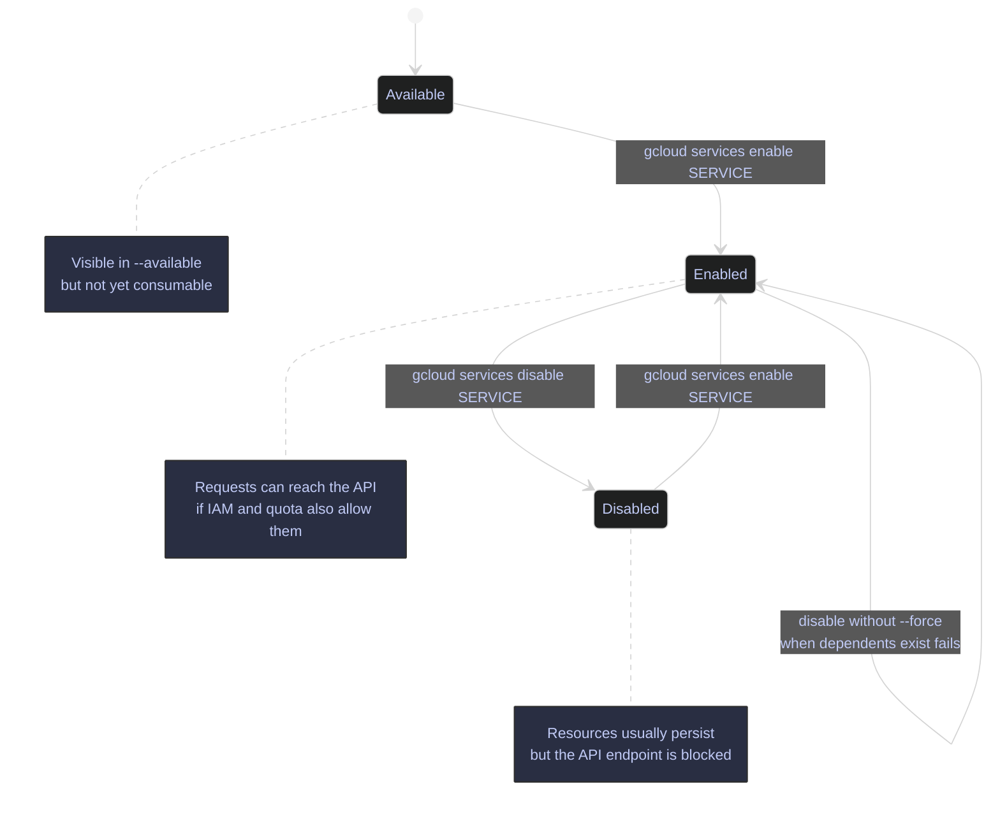

# GCP APIs and Services

> [!abstract]- Summary
>
> Explains how Google Cloud API activation works in a live project context so operators can list, enable, disable, and track service state correctly before debugging IAM, Terraform, or workload failures.
>
> **API fundamentals**
> - Separate API activation from IAM and quota: a principal can have the right roles and still fail if the service is disabled in the consumer project
> - Use live read-only output from `dagflow-poc` to show current service state and the current SDK limitation that `gcloud 563.0.0` does not expose `gcloud services describe`
>
> **Listing APIs**
> - Use `gcloud services list --enabled` to inspect the current active service surface and `gcloud services list --available` to inspect the larger catalog the project could enable
> - Filter noisy service catalogs carefully and switch from fuzzy discovery to exact canonical service endpoints before writing automation
>
> **Enabling and disabling**
> - Enable one or many service endpoints with `gcloud services enable`, including baseline data-engineering APIs such as BigQuery, Dataform, Dataplex, Logging, Monitoring, Cloud Scheduler, `iamcredentials.googleapis.com`, and `sts.googleapis.com`
> - Disable services with `gcloud services disable`, understand dependency failures, and treat `--force` as a reviewed blast-radius decision rather than a convenience flag
>
> **Operations and tracking**
> - Inspect asynchronous enable or disable jobs with `gcloud services operations describe` and block on convergence with `gcloud services operations wait`
> - Read the returned operation names and final service `state` as the authoritative control-plane evidence that activation or disablement actually completed
>
> **Common APIs and Terraform**
> - Map common data-engineering service endpoints to their operational use cases and declare the baseline in Terraform with `google_project_service`
> - Prefer repeatable IaC enablement to ad hoc manual toggles when a project needs stable bootstrap behavior
>
> **Operations and safety**
> - Warnings: `API not enabled` is not an IAM denial, disabling an API can be an outage even when resources still exist, and `--force` can cascade to dependent services

> [!warning] Demo project drift
>
> On April 15, 2026, `gcloud services list --enabled --project=bq-wh-nb` began returning `CONSUMER_INVALID` with the message `Project #348557092514 has been deleted`. The read-only listing, filtering, and REST metadata examples in this note were refreshed live against active project `dagflow-poc`. The state-changing enable, disable, and operation-tracking examples remain documented patterns from the original `bq-wh-nb` walkthrough and were not re-executed during this pass.

> [!note]- Glossary
>
> **API**
> - A Google Cloud control-plane interface exposed over HTTP, gRPC, SDKs, or the `gcloud` CLI.
> - It matters because service activation controls whether that interface can be used at all inside a project.
>
> > [!warning] API access is gated twice
> >
> > A caller still needs both service enablement and sufficient IAM or quota. Activation alone does not authorize use.
>
> ---
>
> **service**
> - The Google-managed endpoint behind a canonical API name such as `bigquery.googleapis.com`.
> - It matters because enable and disable operations target service endpoints, not generic product nicknames.
>
> > [!info] Endpoint names are the real handles
> >
> > Automation should use the canonical service endpoint string, not only the human-readable product title shown in tables.
>
> ---
>
> **Service Usage API**
> - The control-plane API family that lists, enables, disables, and tracks service activation state for a consumer project.
> - It matters because every `gcloud services ...` command in the note is ultimately exercising this API family.
>
> > [!warning] It is its own dependency
> >
> > If Service Usage access is broken, programmatic management of most other service states is also broken. Control-plane visibility depends on the control-plane API itself.
>
> ---
>
> **`serviceusage.googleapis.com`**
> - The canonical service endpoint for the Service Usage API.
> - It matters because the project must be able to reach this endpoint before you can manage most other API activation states programmatically.
>
> > [!info] Meta-service for activation
> >
> > This service does not represent one workload product. It is the manager for the activation surface of many other products.
>
> ---
>
> **enabled service**
> - A service whose activation state in the consumer project is `ENABLED`.
> - It matters because only enabled services can receive normal workload traffic, assuming IAM and quota also permit the request.
>
> > [!warning] Enabled does not mean usable
> >
> > A service can be enabled and still reject requests because of missing IAM, exhausted quota, or unsupported request shape.
>
> ---
>
> **available service**
> - A service the project is allowed to enable even if it is currently disabled.
> - It matters because `gcloud services list --available` returns this larger universe and is therefore a discovery tool rather than an inventory of current dependencies.
>
> > [!warning] Available is noisy
> >
> > The available catalog includes marketplace and partner endpoints, not only the few APIs your workload probably needs. Always narrow to exact canonical names before scripting enablement.
>
> ---
>
> **API activation**
> - The act of enabling one service for one specific project.
> - It matters because activation is project-scoped and must be repeated independently in development, staging, and production.
>
> > [!warning] Activation never inherits
> >
> > Turning on BigQuery in one project does nothing for another project, even if both live in the same organization or folder tree.
>
> ---
>
> **API dependency**
> - A relationship where one enabled service requires another service to remain enabled.
> - It matters because disablement can fail or cascade when a target API still supports active dependents.
>
> > [!warning] Disable order matters
> >
> > Service Usage protects you from some dangerous disablement patterns by refusing the request until dependencies are understood. Read those failures before reaching for `--force`.
>
> ---
>
> **quota**
> - A product-specific usage ceiling such as requests per minute, bytes per day, or concurrent jobs.
> - It matters because a service can be fully enabled and still reject requests when quota is exhausted.
>
> > [!warning] Enablement is not capacity
> >
> > Many operators stop after confirming that an API is enabled. Quota and rate limits remain separate failure planes that can still block the workload.
>
> ---
>
> **rate limit**
> - A time-based quota boundary enforced per project, user, service, or other scope.
> - It matters because short-burst traffic failures are often rate-limit issues rather than activation or authentication problems.
>
> > [!info] Time window matters
> >
> > A request that fails now may succeed minutes later without any config change if the rate window resets. That makes rate limits operationally different from static service disablement.
>
> ---
>
> **API key**
> - A simple caller identifier used by some API surfaces to identify the calling application.
> - It matters because API keys are a different auth model from the OAuth-based patterns most `gcloud` and SDK workflows rely on.
>
> > [!warning] API keys are not IAM principals
> >
> > An API key identifies an application but does not represent a user or service account in the same way an OAuth token does. Do not treat API keys as a drop-in replacement for principal-based auth.
>
> ---
>
> **OAuth token**
> - A bearer token representing an authenticated user or service account.
> - It matters because most `gcloud` and client-library calls in Google Cloud use OAuth tokens rather than API keys.
>
> > [!warning] Tokens do not override service state
> >
> > A valid OAuth token cannot call a disabled API successfully. Authentication and service activation are separate control points.
>
> ---
>
> **consumer project**
> - The project that enables, uses, and pays for a service, such as `bq-wh-nb`.
> - It matters because Service Usage state is evaluated from the consumer project's point of view, not from the backend that publishes the API.
>
> > [!info] Activation belongs here
> >
> > When an API is enabled, it is enabled on the consumer project. That is why project targeting with `--project` is central to every command in this note.
>
> ---
>
> **producer project**
> - The Google-owned or partner-owned backend that publishes the API being consumed.
> - It matters because Service Usage conceptually separates the caller's project from the backend provider project even though operators usually work only with the consumer side.
>
> > [!info] Backend ownership is separate
> >
> > You pay for and enable the service in your consumer project, but the API itself is still hosted by a producer environment you do not administrate directly.
>
> ---
>
> **service endpoint**
> - The canonical hostname that identifies a service, such as `cloudscheduler.googleapis.com`.
> - It matters because enable, disable, filter, Terraform, and dependency operations all key off the endpoint string.
>
> > [!warning] Use exact names in automation
> >
> > Fuzzy discovery is useful once, but scripts should pin the exact endpoint. Marketplace and partner services make broad string matching unsafe for production automation.
>
> ---
>
> **long-running operation**
> - An asynchronous Service Usage control-plane job that returns an operation resource name such as `operations/acat...`.
> - It matters because enable and disable requests often finish through these operation resources rather than immediately returning the final service record.
>
> > [!info] Operation handle is the evidence
> >
> > When you use `--async`, the returned operation name becomes the authoritative handle for `describe` and `wait`. Do not discard it if later automation depends on convergence.

## API Fundamentals

Service enablement is one of the easiest places to misunderstand Google Cloud because it sits between IAM and runtime access. A principal can have the right roles and still fail immediately if the API is disabled in the target project. The reverse is also true: a project can have the API enabled and still fail if the caller lacks IAM or the request exceeds quota.




### PowerShell / Linux | activation model

API activation is always project-scoped. Enabling `bigquery.googleapis.com` in development does not enable it in staging or production. That is why platform bootstrap usually includes an explicit `gcloud services enable ...` step or the Terraform `google_project_service` resource.

The live `dagflow-poc` project illustrates the usual pattern: core control-plane services such as `serviceusage.googleapis.com`, `servicemanagement.googleapis.com`, and `cloudapis.googleapis.com` are already active, and product services such as `compute.googleapis.com`, `storage.googleapis.com`, and `bigquery.googleapis.com` are also enabled. Most specialized services are not enabled until an operator or IaC workflow does so deliberately.

### PowerShell / Linux | "API not enabled" is not an IAM denial

An `API not enabled` error is a service-activation failure, not a role-binding failure. IAM answers "may this principal perform the operation?" Service Usage answers "is this product turned on for this project at all?" Those are separate control points.

> [!warning] Missing enablement is not a permission fix
>
> When the error explicitly says that a service is not enabled, adding more IAM roles does not solve the immediate problem. The consumer project still needs that API activated first.

> [!success] Check project, service state, then IAM
>
> First confirm the target project, then confirm whether the service is enabled, and only after that debug roles, bindings, and quotas. This order avoids wasting time on the wrong control plane.

## Listing APIs

Listing is the fastest way to answer three operational questions: what the project already consumes, what it could enable next, and whether a filter expression is too broad or too narrow.

### PowerShell / Linux | gcloud services list --enabled

`gcloud services list --enabled` returns only the services already active in the target project. This is the preflight check to run before product-specific commands such as `bq query`, `gcloud run deploy`, or `gcloud scheduler jobs create`.

#### List the enabled services in `dagflow-poc`

Before running any product-specific command that depends on a Google Cloud API. It is typically triggered by first project audit, preflight checks, or troubleshooting an "API not enabled" failure. Read-only `gcloud` list command. It queries Service Usage state for the target project and does not mutate anything. Return the exact service endpoints currently enabled in `dagflow-poc`.

| Output column | Source field | Type | Meaning |
|---|---|---|---|
| `config.name` | `config.name` | string | Canonical service endpoint used in enable/disable commands and REST resource names. |
| `config.title` | `config.title` | string | Human-readable product name exposed by Service Usage metadata. |

*List every enabled service in the project and render the canonical endpoint plus display title.*

```bash
gcloud services list --enabled --project=dagflow-poc --format='table(config.name,config.title)'
```

```text
NAME                                 TITLE
analyticshub.googleapis.com          Analytics Hub API
artifactregistry.googleapis.com      Artifact Registry API
bigquery.googleapis.com              BigQuery API
bigqueryconnection.googleapis.com    BigQuery Connection API
bigquerydatapolicy.googleapis.com    BigQuery Data Policy API
bigquerydatatransfer.googleapis.com  BigQuery Data Transfer API
bigquerymigration.googleapis.com     BigQuery Migration API
bigqueryreservation.googleapis.com   BigQuery Reservation API
bigquerystorage.googleapis.com       BigQuery Storage API
cloudapis.googleapis.com             Google Cloud APIs
cloudbuild.googleapis.com            Cloud Build API
cloudresourcemanager.googleapis.com  Cloud Resource Manager API
cloudscheduler.googleapis.com        Cloud Scheduler API
cloudtrace.googleapis.com            Cloud Trace API
compute.googleapis.com               Compute Engine API
containerregistry.googleapis.com     Container Registry API
dataform.googleapis.com              Dataform API
dataplex.googleapis.com              Cloud Dataplex API
datastore.googleapis.com             Cloud Datastore API
iam.googleapis.com                   Identity and Access Management (IAM) API
iamcredentials.googleapis.com        IAM Service Account Credentials API
logging.googleapis.com               Cloud Logging API
monitoring.googleapis.com            Cloud Monitoring API
oslogin.googleapis.com               Cloud OS Login API
pubsub.googleapis.com                Cloud Pub/Sub API
run.googleapis.com                   Cloud Run Admin API
secretmanager.googleapis.com         Secret Manager API
servicemanagement.googleapis.com     Service Management API
servicenetworking.googleapis.com     Service Networking API
serviceusage.googleapis.com          Service Usage API
sql-component.googleapis.com         Cloud SQL
sqladmin.googleapis.com              Cloud SQL Admin API
storage-api.googleapis.com           Google Cloud Storage JSON API
storage-component.googleapis.com     Cloud Storage
storage.googleapis.com               Cloud Storage API
sts.googleapis.com                   Security Token Service API
telemetry.googleapis.com             Telemetry API
```

The project currently has 37 enabled services. The list mixes product APIs such as BigQuery, Cloud Run, Pub/Sub, and Dataplex with control-plane dependencies such as Service Usage, Service Management, Cloud Resource Manager, and Google Cloud APIs. That mix is normal: real projects need both workload services and the control services that support them.

| Flag | Syntax | Description |
|---|---|---|
| `--enabled` | `gcloud services list --enabled` | Returns only services currently enabled in the project. This is the default mode. |
| `--available` | `gcloud services list --available` | Returns all services the project can enable, including those already enabled. |
| `--filter` | `gcloud services list --enabled --filter='config.title:BigQuery'` | Applies a filter expression after sort evaluation. |
| `--limit` | `gcloud services list --enabled --limit=20` | Caps the number of returned rows. |
| `--page-size` | `gcloud services list --enabled --page-size=100` | Controls paging size when the backend paginates responses. |
| `--sort-by` | `gcloud services list --enabled --sort-by=config.name` | Sorts rows client-side before filtering and limiting. |
| `--format` | `gcloud services list --enabled --format='value(config.name)'` | Changes output shape for scripting or table rendering. |
| `--project` | `gcloud services list --enabled --project=dagflow-poc` | Targets a specific project instead of the active config default. |

### PowerShell / Linux | gcloud services list --available

`gcloud services list --available` answers a different question: which services could this project enable if needed? The result set is far larger because it includes Google-managed product APIs, public data endpoints, and marketplace-style partner services.

#### Sample the services available to `dagflow-poc`

During service discovery, project bootstrap planning, or before writing an enablement batch. It is typically triggered by you know a workload category but not the exact service endpoint name yet. Read-only Service Usage query. The command can return a very large result set, so `--limit` is used here to keep the output reviewable. Show the difference between "available to enable" and "already enabled.".

| Output column | Source field | Type | Meaning |
|---|---|---|---|
| `config.name` | `config.name` | string | The service endpoint that can be passed to `gcloud services enable`. |
| `config.title` | `config.title` | string | The display title published for that service. |

*List a 15-row sample from the much larger available-services catalog.*

```bash
gcloud services list --available --project=dagflow-poc --limit=15 --format='table(config.name,config.title)'
```

```text
NAME                                                                                         TITLE
a10-thunder-adc-601b150-byol.endpoints.a10networks-public-396315.cloud.goog                  A10 Thunder ADC 601 - BYOL
a10-vthunder-adc-100mbps.endpoints.a10networks-public-396315.cloud.goog                      A10 Thunder ADC for Advanced Load Balancing - 100 Mbps
a10-vthunder-adc-10gbps.endpoints.a10networks-public-396315.cloud.goog                       A10 Thunder ADC for Advanced Load Balancing - 10 Gbps
a10-vthunder-adc-1gbps.endpoints.a10networks-public-396315.cloud.goog                        A10 Thunder ADC for Advanced Load Balancing - 1 Gbps
a10-vthunder-adc-200mbps.endpoints.a10networks-public-396315.cloud.goog                      A10 Thunder ADC for Advanced Load Balancing - 200 Mbps
a10-vthunder-adc-20mbps.endpoints.a10networks-public-396315.cloud.goog                       A10 Thunder ADC for Advanced Load Balancing - 20 Mbps
a10-vthunder-adc-500mbps.endpoints.a10networks-public-396315.cloud.goog                      A10 Thunder ADC for Advanced Load Balancing - 500 Mbps
a10-vthunder-adc-5gbps.endpoints.a10networks-public-396315.cloud.goog                        A10 Thunder ADC for Advanced Load Balancing - 5 Gbps
a10-vthunder-adc-byol.endpoints.a10networks-public-396315.cloud.goog         A10 Thunder ADC for Advanced Load Balancing - BYOL
a2a-agent-v1-49b2.endpoints.menlo-security-public.cloud.goog                 Menlo A2A Agent (Preview)
a8genaiplatform.endpoints.articul8-public.cloud.goog                         Articul8 GenAI Platform
aapanel.endpoints.anarion-technologies-public.cloud.goog                     aaPanel v7.0.16 on Ubuntu v20
aapl-miriinfotech-public.cloudpartnerservices.goog                           Miri Infotech lapp
ab-initio-cooperating-system.endpoints.ab-initio-419002.cloud.goog           Ab Initio? Co>Operating System?
ab-initio-data-platform.endpoints.ab-initio-419002.cloud.goog                Ab Initio? Data Platform
```

This output is intentionally noisy. It shows why `--available` is not the same thing as "Google first-party services you probably care about today." The catalog includes partner endpoints and marketplace products, so production bootstrap scripts should always pin exact canonical names instead of relying on fuzzy search.

| Flag | Syntax | Description |
|---|---|---|
| `--available` | `gcloud services list --available` | Returns the full catalog of services the project can enable. |
| `--enabled` | `gcloud services list --enabled` | Restricts the result to services already active in the project. |
| `--filter` | `gcloud services list --available --filter='config.name=bigquery.googleapis.com'` | Narrows the catalog to matching names or metadata. |
| `--limit` | `gcloud services list --available --limit=15` | Prevents the result from becoming unmanageably large. |
| `--page-size` | `gcloud services list --available --page-size=100` | Adjusts the backend page size for large catalogs. |
| `--sort-by` | `gcloud services list --available --sort-by=config.name` | Sorts rows before filter and limit are applied. |
| `--format` | `gcloud services list --available --format='table(config.name,config.title)'` | Chooses table, JSON, YAML, CSV, or value output. |
| `--project` | `gcloud services list --available --project=dagflow-poc` | Queries a specific project's visible catalog. |

### PowerShell / Linux | filtering and searching services

Filtering matters because the available-services catalog is broad enough to produce misleading matches. The safest pattern is to search loosely only once, then switch to exact canonical service names for scripts, Terraform, and runbooks.

#### Filter available services with a broad name expression

During initial discovery, before you know the exact service endpoint. It is typically triggered by you know the product family, such as BigQuery, but not the exact canonical service names yet. Read-only list command. The filter is intentionally broad and can match marketplace or public-data services in addition to the Google-managed API. Show why fuzzy search is useful for discovery but unsafe for automation.

| Output column | Source field | Type | Meaning |
|---|---|---|---|
| `name` | `name` | string | Fully qualified Service Usage resource path, not just the short API endpoint. |
| `config.title` | `config.title` | string | Display title published by the service. |

*Search the available-services catalog with the broad filter `name:bigquery`.*

```bash
gcloud services list --available --project=dagflow-poc --filter='name:bigquery' --format='table(name,config.title)'
```

The command returned hundreds of rows. The excerpt below shows the opening portion of the actual output.

```text
NAME                                                                                                                               TITLE
projects/462383815308/services/active-campaign.endpoints.bigquery-connectors-public.cloud.goog                                     ActiveCampaign Connector by Windsor.ai
projects/462383815308/services/activecampaign.endpoints.bigquery-connectors-public.cloud.goog                                      ActiveCampaign by Windsor.ai
projects/462383815308/services/adalyser.endpoints.bigquery-connectors-public.cloud.goog                                            Adalyser by Windsor.ai
projects/462383815308/services/adform-bigquery-connector.endpoints.bigquery-connectors-public.cloud.goog                           Adform BigQuery Connector
projects/462383815308/services/adform.endpoints.bigquery-connectors-public.cloud.goog                                              Adform by Windsor.ai
projects/462383815308/services/adjust-connector-by-windsor.ai.endpoints.bigquery-connectors-public.cloud.goog                      Adjust Connector by Windsor.ai
projects/462383815308/services/adjust.endpoints.bigquery-connectors-public.cloud.goog                                              Adjust by Windsor.ai
projects/462383815308/services/adobe-analytics-bigquery-connector.endpoints.bigquery-connectors-public.cloud.goog                  Adobe Analytics BigQuery Connector
projects/462383815308/services/adobe-analytics-v2.bigquery-connector.endpoints.bigquery-connectors-public.cloud.goog               Adobe Analytics (v2.0) BigQuery Connector
projects/462383815308/services/adobe-analytics.endpoints.bigquery-connectors-public.cloud.goog                                     Adobe Analytics by Windsor.ai
projects/462383815308/services/adroll-connector-by-windsor.ai.endpoints.bigquery-connectors-public.cloud.goog                      AdRoll Connector by Windsor.ai
projects/462383815308/services/adroll.endpoints.bigquery-connectors-public.cloud.goog                                              AdRoll by Windsor.ai
projects/462383815308/services/adtraction.endpoints.bigquery-connectors-public.cloud.goog                                          Adtraction by Windsor.ai
projects/462383815308/services/aha.endpoints.bigquery-connectors-public.cloud.goog                                                 Aha! by Windsor.ai
projects/462383815308/services/aircall-connector-by-windsor.ai.endpoints.bigquery-connectors-public.cloud.goog                     Aircall Connector by Windsor.ai
projects/462383815308/services/aircall.endpoints.bigquery-connectors-public.cloud.goog                                             Aircall by Windsor.ai
```

The command ended with this CLI warning:

```text
WARNING: --filter : operator evaluation is changing for consistency across Google APIs.  name:bigquery currently matches but will not match in the near future.  Run `gcloud topic filters` for details.
```

This is the exact reason broad discovery filters do not belong in production scripts. The expression matches marketplace connectors, public data services, and the real Google-managed BigQuery endpoints all at once.

#### Filter available services by exact canonical API name

After discovery, when you are ready to write a deterministic script or bootstrap step. It is typically triggered by you want to prove that one exact service endpoint exists in the available catalog. Read-only list command using an equality filter. This is safe for scripts because it does not rely on fuzzy matching. Return exactly one target API by canonical service endpoint.

| Output column | Source field | Type | Meaning |
|---|---|---|---|
| `config.name` | `config.name` | string | Canonical service endpoint suitable for `gcloud services enable`. |
| `config.title` | `config.title` | string | Human-readable title published by Service Usage. |

*Match only the canonical BigQuery API endpoint.*

```bash
gcloud services list --available --project=dagflow-poc --filter='config.name=bigquery.googleapis.com' --format='table(config.name,config.title)'
```

```text
NAME                     TITLE
bigquery.googleapis.com  BigQuery API
```

This is the scripting-safe pattern. Exact equality on `config.name` avoids marketplace noise and future filter-behavior changes.

#### Filter enabled services by product title

When you need a quick family-level inventory rather than one exact API. It is typically triggered by you want to see every enabled BigQuery-related API in the current project. Read-only list command against the enabled-services view. Return the currently enabled services whose titles belong to one product family.

| Output column | Source field | Type | Meaning |
|---|---|---|---|
| `config.name` | `config.name` | string | Canonical service endpoint. |
| `config.title` | `config.title` | string | Product-family display title used for human scanning. |

*List the enabled BigQuery family services in `dagflow-poc`.*

```bash
gcloud services list --enabled --project=dagflow-poc --filter='config.title:BigQuery' --format='table(config.name,config.title)'
```

```text
NAME                                 TITLE
bigquery.googleapis.com              BigQuery API
bigqueryconnection.googleapis.com    BigQuery Connection API
bigquerydatapolicy.googleapis.com    BigQuery Data Policy API
bigquerydatatransfer.googleapis.com  BigQuery Data Transfer API
bigquerymigration.googleapis.com     BigQuery Migration API
bigqueryreservation.googleapis.com   BigQuery Reservation API
bigquerystorage.googleapis.com       BigQuery Storage API
```

This filter is broad enough to be useful and still precise enough to stay inside the BigQuery family for the current enabled set.

#### Filter enabled services by a substring and observe the CLI warning

During quick interactive exploration of a small enabled-service set. It is typically triggered by you want a fast shortlist of storage-related services without remembering all exact names. Read-only list command. The filter works today, but the CLI warns that future operator behavior will tighten. Show a substring search that is acceptable for ad hoc exploration but weak for long-lived scripts.

| Output column | Source field | Type | Meaning |
|---|---|---|---|
| `config.name` | `config.name` | string | Canonical endpoint of each matched service. |
| `config.title` | `config.title` | string | Product title associated with the endpoint. |

*Search enabled services for endpoints containing `storage`.*

```bash
gcloud services list --enabled --project=dagflow-poc --filter='config.name:storage' --format='table(config.name,config.title)'
```

```text
NAME                              TITLE
bigquerystorage.googleapis.com    BigQuery Storage API
storage-api.googleapis.com        Google Cloud Storage JSON API
storage-component.googleapis.com  Cloud Storage
storage.googleapis.com            Cloud Storage API
WARNING: --filter : operator evaluation is changing for consistency across Google APIs.  config.name:storage currently matches but will not match in the near future.  Run `gcloud topic filters` for details.
```

The command works today, but the warning is the important part. For automation, replace this with exact-name filters.

#### Attempt the older wildcard title pattern

When validating an older runbook or copied command snippet. It is typically triggered by you inherited a filter expression that uses shell-style wildcards inside the `:` operator. Read-only command, but the expression is invalid in the current CLI parser. Show the current error shape so you know the fix belongs in the filter syntax, not in IAM or project state.

*Run the older wildcard pattern against the available-services catalog.*

```bash
gcloud services list --available --project=dagflow-poc --filter='config.title:*Storage*' --format='table(config.name,config.title)'
```

```text
ERROR: (gcloud.services.list) At most one * expected in : patterns [*Storage*].
```

On this SDK version, the older wildcard pattern is simply invalid. Use `config.title:Storage` for a broad title search or, better, use exact equality on `config.name`.

| Flag | Syntax | Description |
|---|---|---|
| `--filter` | `gcloud services list --filter='config.name=bigquery.googleapis.com'` | Applies a Boolean filter to the list result. |
| `--format` | `gcloud services list --format='table(config.name,config.title)'` | Controls table, JSON, YAML, CSV, or value output. |
| `--project` | `gcloud services list --project=dagflow-poc` | Targets a specific project explicitly. |
| `--available` | `gcloud services list --available` | Searches the full enable-able catalog instead of only enabled services. |
| `--enabled` | `gcloud services list --enabled` | Restricts the search to currently enabled services. |
| `--limit` | `gcloud services list --available --limit=15` | Keeps discovery output manageable when the catalog is large. |
| `--page-size` | `gcloud services list --available --page-size=200` | Changes the response page size returned by the backend. |
| `--sort-by` | `gcloud services list --sort-by=config.name` | Sorts rows before filtering and limiting. |

### PowerShell / Linux | service details and the missing `gcloud services describe`

The current prompt asks for `gcloud services describe`, but the installed SDK does not expose that subcommand. The correct operational response is to state that plainly and then use the Service Usage REST `services.get` method for the equivalent metadata.

#### Confirm that `gcloud services describe` is not present in SDK `563.0.0`

Before relying on copied examples that mention `gcloud services describe`. It is typically triggered by you need service metadata and expect a direct describe subcommand under `gcloud services`. Read-only command lookup. The failure happens entirely in the CLI parser before a service request is sent. Prove that the current SDK surface does not expose the subcommand the prompt asks for.

*Attempt to describe the BigQuery API directly from the `gcloud services` command group.*

```bash
gcloud services describe bigquery.googleapis.com --project=dagflow-poc
```

```text
ERROR: (gcloud.services) Invalid choice: 'describe'.
Maybe you meant:
  gcloud services disable
  gcloud services enable
  gcloud services list
  gcloud services api-keys describe
  gcloud services operations describe
  gcloud network-services endpoint-policies describe
  gcloud network-services gateways describe
  gcloud network-services grpc-routes describe
  gcloud network-services http-routes describe
  gcloud network-services meshes describe

To search the help text of gcloud commands, run:
  gcloud help -- SEARCH_TERMS
```

On April 15, 2026, with Google Cloud SDK `563.0.0`, there is still no direct `gcloud services describe`. That is a CLI-surface limitation, not a permission problem.

#### Query the Service Usage REST API for the same service metadata

After confirming the CLI surface does not provide a direct describe command. It is typically triggered by you still need service state, descriptive metadata, and quota descriptors for one API. Read-only REST call authenticated with the active access token. The shell wrapper below is PowerShell because that is the live execution environment for this note. Retrieve the Service Usage `services.get` payload for `bigquery.googleapis.com`.

| Output field | Source field | Type | Meaning |
|---|---|---|---|
| `name` | `name` | string | Fully qualified Service Usage resource name. |
| `state` | `state` | enum | Service enablement state for this consumer project. |
| `serviceName` | `config.name` | string | Canonical service endpoint. |
| `title` | `config.title` | string | Human-readable product title. |
| `documentationSummary` | `config.documentation.summary` | string | Summary text published by the service metadata. |
| `quotaLimitCount` | `config.quota.limits.Count` | integer | Number of quota limit descriptors exposed in the service config. |
| `sampleQuota[].name` | `config.quota.limits[*].name` | string | Individual quota limit descriptor name. |
| `sampleQuota[].metric` | `config.quota.limits[*].metric` | string | Metric namespace tracked by the quota descriptor. |
| `sampleQuota[].unit` | `config.quota.limits[*].unit` | string | Unit or cardinality scope of the quota descriptor. |

*Call the Service Usage `services.get` endpoint for `bigquery.googleapis.com` and reduce the payload to the fields that matter operationally.*

```powershell
$token = gcloud auth print-access-token
$headers = @{ Authorization = "Bearer $token" }
$url = 'https://serviceusage.googleapis.com/v1/projects/462383815308/services/bigquery.googleapis.com'
$svc = Invoke-RestMethod -Headers $headers -Uri $url

$summary = [ordered]@{
  name                 = $svc.name
  state                = $svc.state
  serviceName          = $svc.config.name
  title                = $svc.config.title
  documentationSummary = $svc.config.documentation.summary
  quotaLimitCount      = $svc.config.quota.limits.Count
  sampleQuota          = @(
    $svc.config.quota.limits |
      Select-Object -First 3 |
      ForEach-Object {
        [ordered]@{
          name    = $_.name
          metric  = $_.metric
          unit    = $_.unit
          default = $_.values.DEFAULT
        }
      }
  )
}

$summary | ConvertTo-Json -Depth 5
```

```text
{
  "name": "projects/462383815308/services/bigquery.googleapis.com",
  "state": "ENABLED",
  "serviceName": "bigquery.googleapis.com",
  "title": "BigQuery API",
  "documentationSummary": "A data platform for customers to create, manage, share and query data.",
  "quotaLimitCount": 33,
  "sampleQuota": [
    {
      "name": "QueryUsagePerDay",
      "metric": "bigquery.googleapis.com/quota/query/usage",
      "unit": "1/d/{project}",
      "default": "209715200"
    },
    {
      "name": "QueryUsagePerUserPerDay",
      "metric": "bigquery.googleapis.com/quota/query/usage",
      "unit": "1/d/{project}/{user}",
      "default": "9223372036854775807"
    },
    {
      "name": "StreamingInsertBytesPerSecond",
      "metric": "bigquery.googleapis.com/quota/streaming/insert_bytes",
      "unit": "1/min/{project}/{region}",
      "default": "18874368000"
    }
  ]
}
```

This gives the service state, title, documentation summary, and quota descriptor inventory the prompt asked for. One important limitation is visible too: the current `services.get` payload exposes a documentation summary, but not a human-facing documentation URL field for this service. Use the References section later in the note for the canonical docs links.

## Enabling APIs

Enablement is the project-bootstrap step that turns a service from "available" into "consumable." It is safe to rerun enable commands because Service Usage treats them idempotently, but you still need to be explicit about the target project.

> [!warning] Enablement does not cross environment boundaries
>
> Turning on an API in development does not turn it on in staging or production. Every project is a separate enablement boundary.

> [!success] Put API activation in bootstrap code
>
> Treat API activation as part of environment provisioning. A project bootstrap step or Terraform module prevents the classic "works in dev, API disabled in prod" failure mode.

### PowerShell / Linux | gcloud services enable

`gcloud services enable` accepts one or more canonical service endpoints and turns them on for the target consumer project. The command can run synchronously or return immediately with `--async`.

#### Enable one currently disabled API

Before first use of a specific product that is available but not yet enabled. It is typically triggered by A workload needs a service such as Cloud Scheduler, Dataflow, or Pub/Sub for the first time. State-changing Service Usage operation against the target project. This changes only API activation state, not IAM or resource configuration. Activate one specific API so product requests can start reaching the service backend.

*Enable `cloudscheduler.googleapis.com` for `bq-wh-nb`.*

```bash
gcloud services enable cloudscheduler.googleapis.com --project=bq-wh-nb --quiet
```

```text
Operation "operations/acf.p2-348557092514-29a83514-af4f-491b-bb15-43021d472b42" finished successfully.
```

The returned operation name is the control-plane record of the enablement. After this completes, Cloud Scheduler requests can reach the API if IAM also allows them.

#### Enable multiple APIs in one call

During project bootstrap, environment normalization, or when rolling out a feature that depends on several services at once. It is typically triggered by A workflow needs more than one API and you want one atomic-enough activation step instead of several separate commands. State-changing Service Usage operation. Multiple canonical service names are passed as positional arguments in one command. Enable several service endpoints with one call and one long-running operation.

*Enable two observability APIs in one command.*

```bash
gcloud services enable logging.googleapis.com monitoring.googleapis.com --project=bq-wh-nb --quiet
```

```text
Operation "operations/acat.p2-348557092514-d0e6c05b-bf37-4725-9cd9-0a7b877b6525" finished successfully.
```

Even when the target services are already enabled, Service Usage can still acknowledge the request as a successful idempotent operation. That is one reason repeated bootstrap runs are safe.

#### Bootstrap a data-engineering baseline on a new project

During initial platform bootstrap for a new data project. It is typically triggered by you want the common control-plane and analytics services available before workload code lands. State-changing batch enablement. The list below mixes analytics, metadata, storage, scheduler, and identity-support APIs that commonly appear together in data engineering projects. Turn on a practical baseline of services in one reproducible command.

*Enable a common data-engineering baseline in one shot.*

```bash
gcloud services enable bigquery.googleapis.com bigquerydatatransfer.googleapis.com dataform.googleapis.com dataplex.googleapis.com storage.googleapis.com logging.googleapis.com monitoring.googleapis.com cloudscheduler.googleapis.com iamcredentials.googleapis.com sts.googleapis.com --project=bq-wh-nb --quiet
```

```text
Operation "operations/acf.p2-348557092514-b8776540-6e61-4cd7-afe0-489230b0b254" finished successfully.
```

This pattern is much safer than enabling services one failure at a time while deploying the first workload. It front-loads the dependency surface and makes environment drift easier to reason about.

| Flag | Syntax | Description |
|---|---|---|
| `SERVICE [SERVICE ...]` | `gcloud services enable bigquery.googleapis.com storage.googleapis.com` | One or more canonical service endpoints to enable. |
| `--async` | `gcloud services enable bigquery.googleapis.com --async` | Return immediately instead of waiting for the long-running operation to finish. |
| `--project` | `gcloud services enable bigquery.googleapis.com --project=bq-wh-nb` | Targets a specific project explicitly. |
| `--quiet` | `gcloud services enable bigquery.googleapis.com --quiet` | Suppresses prompts and is appropriate for scripts or runbooks. |

## Disabling APIs

Disabling is the inverse control-plane operation. It does not usually delete the underlying resources, but it can instantly break the control plane for workloads that still depend on the service.

### PowerShell / Linux | gcloud services disable

`gcloud services disable` turns a service off for the project. If the service has dependents, the command can fail with `FAILED_PRECONDITION` unless `--force` is used.

#### Start an asynchronous disable operation

During controlled cleanup, rollback, or platform hardening after confirming that the service is no longer needed. It is typically triggered by you want to remove an API from the project's active surface area without blocking the shell while the control-plane operation finishes. State-changing command. `--async` returns immediately and gives you an operation name to track later. Start a disable job for one API and hand off completion tracking to the operations subcommands.

*Start an asynchronous disable of `cloudscheduler.googleapis.com`.*

```bash
gcloud services disable cloudscheduler.googleapis.com --project=bq-wh-nb --async
```

```text
Asynchronous operation is in progress... Use the following command to wait for its completion:
 gcloud beta services operations wait operations/acat.p17-348557092514-fc60d688-f973-416c-83cf-b41cd0f1aba3
```

The important payload here is the operation name `operations/acat.p17-348557092514-fc60d688-f973-416c-83cf-b41cd0f1aba3`. That identifier becomes the handle for `describe` and `wait`.

| Flag | Syntax | Description |
|---|---|---|
| `SERVICE [SERVICE ...]` | `gcloud services disable cloudscheduler.googleapis.com` | One or more canonical service endpoints to disable. |
| `--async` | `gcloud services disable cloudscheduler.googleapis.com --async` | Returns the operation handle immediately without waiting. |
| `--force` | `gcloud services disable bigquery.googleapis.com --force` | Allows dependent services to be disabled as part of the same operation. |
| `--project` | `gcloud services disable cloudscheduler.googleapis.com --project=bq-wh-nb` | Targets a specific project explicitly. |
| `--quiet` | `gcloud services disable cloudscheduler.googleapis.com --quiet` | Suppresses prompts for scripted runs. |

### PowerShell / Linux | dependency handling

Dependencies are the reason disablement deserves more care than enablement. A service may look isolated while other active APIs still depend on it.

#### Attempt to disable BigQuery without `--force`

Before using `--force`, to see whether the target service is still required by other enabled APIs. It is typically triggered by you suspect the service may have dependents and want the CLI to enumerate them before any destructive cascade happens. State-changing command attempt, but this example fails before the disable proceeds because Service Usage blocks the request. Show the exact dependency error emitted when an enabled service still has active dependents.

*Try to disable BigQuery without allowing cascaded dependent-service disablement.*

```bash
gcloud services disable bigquery.googleapis.com --project=bq-wh-nb --quiet
```

```text
Provide the --force flag if you wish to force disable services.
ERROR: (gcloud.services.disable) FAILED_PRECONDITION: The service bigquery.googleapis.com is depended on by the following active service(s): bigquerystorage.googleapis.com,cloudapis.googleapis.com; Please specify disable_dependent_services=true if you want to proceed with disabling all services.
Help Token: AVnrbfnes0WXA_uZkpDeLeQ2jyykAwD64mJm6THJHnNlUr0Jy1ivByLtco95OmAucx5Kt2seYcYEGNEiQciWumJuhm8ltvs009UaoxvVKY_buMno
- '@type': type.googleapis.com/google.rpc.PreconditionFailure
  violations:
  - subject: ?error_code=100001&service_name=bigquery.googleapis.com&services=bigquerystorage.googleapis.com&services=cloudapis.googleapis.com
    type: googleapis.com
- '@type': type.googleapis.com/google.rpc.ErrorInfo
  domain: serviceusage.googleapis.com
  metadata:
    service_name: bigquery.googleapis.com
    services: bigquerystorage.googleapis.com,cloudapis.googleapis.com
  reason: COMMON_SU_SERVICE_HAS_DEPENDENT_SERVICES
```

This is the exact protection you want before a production disable. Service Usage refused the request because `bigquerystorage.googleapis.com` and `cloudapis.googleapis.com` still depend on `bigquery.googleapis.com`.

### PowerShell / Linux | implications of disabling

Disabling an API usually does not delete the resources the API created. It removes the control-plane access path to those resources. Buckets remain buckets, datasets remain datasets, and jobs or service metadata remain in Google's backend, but requests against the disabled API stop working until the service is enabled again.

In this project there were no Cloud Scheduler jobs to demonstrate post-disable resource visibility, but the long-running operation in the next section returns `state: "DISABLED"` for the service itself. That is the key control-plane state change: the service endpoint is off for the consumer project.

> [!danger] Production disablement can be an outage
>
> Disabling an API in production can silently break running workloads, deployment pipelines, cron triggers, or support tooling that still assumes the endpoint exists.

> [!success] Audit dependencies before disable
>
> Check enabled services, check the workloads that use them, and prefer one explicit rollback plan before disabling anything in a shared project.

> [!danger] `--force` can cascade farther than expected
>
> A forced disable can remove the target API and every enabled service that depends on it. That can turn one cleanup step into a multi-service outage.

> [!success] Use `--force` only with an explicit blast-radius review
>
> Read the dependency error first, record the affected services, and use `--force` only when you are prepared to lose every listed dependent in the same change window.

## Operations

Service Usage uses long-running operations for enable and disable requests. That is why `--async` returns an operation handle instead of the final service record.

### PowerShell / Linux | gcloud services operations describe

`gcloud services operations describe` inspects one operation resource by name. For short API-toggle jobs, the operation may already be complete by the time you query it.

#### Describe the asynchronous Cloud Scheduler disable operation

After an `--async` enable or disable request returns an operation name. It is typically triggered by you need the operation result, the target service state, or proof that the control-plane action finished. Read-only operation lookup. It queries the Service Usage operation resource, not the service catalog directly. Inspect the operation resource returned by the asynchronous disable command.

*Describe the disable operation returned for `cloudscheduler.googleapis.com`.*

```bash
gcloud services operations describe operations/acat.p17-348557092514-fc60d688-f973-416c-83cf-b41cd0f1aba3 --project=bq-wh-nb
```

```text
Operation [operations/acat.p17-348557092514-fc60d688-f973-416c-83cf-b41cd0f1aba3] complete. Result: {
    "@type":"type.googleapis.com/google.api.serviceusage.v1.DisableServiceResponse",
    "service":{
        "config":{
            "authentication":{},
            "documentation":{
                "summary":"Creates and manages jobs run on a regular recurring schedule."
            },
            "monitoring":{},
            "name":"cloudscheduler.googleapis.com",
            "quota":{},
            "title":"Cloud Scheduler API",
            "usage":{
                "requirements":[
                    "serviceusage.googleapis.com/tos/cloud",
                    "serviceusage.googleapis.com/tos/cloud",
                    "serviceusage.googleapis.com/billing-enabled"
                ]
            }
        },
        "name":"projects/348557092514/services/cloudscheduler.googleapis.com",
        "parent":"projects/348557092514",
        "state":"DISABLED"
    }
}
```

In this run the operation finished so quickly that `describe` already returned the terminal result rather than an in-progress record. That is common for single-API toggles.

| Flag | Syntax | Description |
|---|---|---|
| `OPERATION` | `gcloud services operations describe operations/abc` | Operation resource name returned by Service Usage. |
| `--full` | `gcloud services operations describe operations/abc --full` | Deprecated flag retained by the CLI; avoid using it in new automation. |
| `--project` | `gcloud services operations describe operations/abc --project=bq-wh-nb` | Targets a specific project explicitly. |
| `--format` | `gcloud services operations describe operations/abc --format=json` | Chooses JSON, YAML, table, or value output where supported. |

### PowerShell / Linux | gcloud services operations wait

`gcloud services operations wait` blocks until the operation reaches a terminal state. It is the cleanest way to serialize dependent automation after an asynchronous Service Usage call.

#### Wait for the disable operation to finish

Immediately after an asynchronous enable or disable when the next step depends on completion. It is typically triggered by your script or runbook cannot proceed safely until the API state has converged. Read-only wait loop on the operation resource. It does not change service state by itself. Block until the Service Usage operation reaches a final result and return that result.

*Wait on the Cloud Scheduler disable operation until Service Usage marks it complete.*

```bash
gcloud services operations wait operations/acat.p17-348557092514-fc60d688-f973-416c-83cf-b41cd0f1aba3 --project=bq-wh-nb
```

```text
Operation [operations/acat.p17-348557092514-fc60d688-f973-416c-83cf-b41cd0f1aba3] complete. Result: {
    "@type":"type.googleapis.com/google.api.serviceusage.v1.DisableServiceResponse",
    "service":{
        "config":{
            "authentication":{},
            "documentation":{
                "summary":"Creates and manages jobs run on a regular recurring schedule."
            },
            "monitoring":{},
            "name":"cloudscheduler.googleapis.com",
            "quota":{},
            "title":"Cloud Scheduler API",
            "usage":{
                "requirements":[
                    "serviceusage.googleapis.com/tos/cloud",
                    "serviceusage.googleapis.com/tos/cloud",
                    "serviceusage.googleapis.com/billing-enabled"
                ]
            }
        },
        "name":"projects/348557092514/services/cloudscheduler.googleapis.com",
        "parent":"projects/348557092514",
        "state":"DISABLED"
    }
}
```

For this kind of control-plane change, `wait` is the safest handoff point. The returned `state: "DISABLED"` confirms that the service endpoint is now off for the project.

| Flag | Syntax | Description |
|---|---|---|
| `OPERATION` | `gcloud services operations wait operations/abc` | Operation resource name to wait on. |
| `--project` | `gcloud services operations wait operations/abc --project=bq-wh-nb` | Targets a specific project explicitly. |
| `--quiet` | `gcloud services operations wait operations/abc --quiet` | Suppresses prompts if any wrapper or environment would otherwise ask for confirmation. |

## Common Data Engineering APIs

The table below focuses on service endpoints that commonly appear in warehouse, pipeline, orchestration, and identity-support workflows. `Default-enabled` is guidance for the common empty-project bootstrap experience in Google Cloud today; organization policy, project age, and provisioning path can change the exact initial set.

| API name | Service | Default-enabled | Typical DE use case |
|---|---|---|---|
| `bigquery.googleapis.com` | BigQuery API | No | Query warehouse tables, create datasets, run load and extract jobs. |
| `bigquerydatatransfer.googleapis.com` | BigQuery Data Transfer API | No | Scheduled SaaS ingest and managed transfer jobs into BigQuery. |
| `bigqueryreservation.googleapis.com` | BigQuery Reservation API | No | Slot reservations, assignments, and workload isolation. |
| `bigquerystorage.googleapis.com` | BigQuery Storage API | No | High-throughput reads and writes from Spark, pandas, Beam, and connectors. |
| `dataform.googleapis.com` | Dataform API | No | SQL transformation orchestration and repository-backed workflow execution. |
| `dataplex.googleapis.com` | Cloud Dataplex API | No | Data governance, lake zones, catalog, and data-quality management. |
| `dataflow.googleapis.com` | Dataflow API | No | Apache Beam batch and streaming pipelines. |
| `composer.googleapis.com` | Cloud Composer API | No | Managed Airflow environments for orchestration. |
| `dataproc.googleapis.com` | Cloud Dataproc API | No | Managed Spark and Hadoop clusters for heavy distributed processing. |
| `pubsub.googleapis.com` | Pub/Sub API | No | Event ingestion, fan-out, decoupled triggers, and pipeline messaging. |
| `storage.googleapis.com` | Cloud Storage API | Yes | Landing zone files, staged exports, checkpoints, and archive tiers. |
| `compute.googleapis.com` | Compute Engine API | Yes | VMs for custom workers, bastions, schedulers, or legacy ETL runtimes. |
| `cloudscheduler.googleapis.com` | Cloud Scheduler API | No | Time-based pipeline triggers for HTTP, Pub/Sub, and Workflows. |
| `cloudfunctions.googleapis.com` | Cloud Functions API | No | Lightweight event-driven transforms and webhook handlers. |
| `logging.googleapis.com` | Cloud Logging API | No | Pipeline logs, audit logs, error diagnostics, and centralized search. |
| `monitoring.googleapis.com` | Cloud Monitoring API | No | Metrics, alerting, uptime checks, and SLO tracking. |
| `iam.googleapis.com` | IAM API | No | Custom roles, service-account administration, and policy tooling. |
| `iamcredentials.googleapis.com` | IAM Service Account Credentials API | No | Service-account token minting, signing, and impersonation workflows. |
| `sts.googleapis.com` | Security Token Service API | No | Workload Identity Federation and token exchange for external identity providers. |

## Terraform Equivalents

Terraform is the safer long-term pattern because it makes API activation part of the declared project baseline instead of a manual afterthought.

> [!example]- `google_project_service` with `for_each`
>
> `google_project_service` is the Terraform resource that mirrors `gcloud services enable`. `disable_on_destroy = false` is usually the right operational default because destroying one Terraform stack should not implicitly disable a shared API and break other workloads in the project.
>
> ```hcl
> resource "google_project_service" "data_engineering_apis" {
>   for_each = toset([
>     "bigquery.googleapis.com",
>     "bigquerydatatransfer.googleapis.com",
>     "dataform.googleapis.com",
>     "dataplex.googleapis.com",
>     "storage.googleapis.com",
>     "logging.googleapis.com",
>     "monitoring.googleapis.com",
>     "cloudscheduler.googleapis.com",
>     "iamcredentials.googleapis.com",
>     "sts.googleapis.com",
>   ])
>
>   project            = var.project_id
>   service            = each.key
>   disable_on_destroy = false
> }
> ```

## Related

- [gcp-resource-hierarchy](https://alp78.github.io/elysium/06-GCP/01-Core/01-gcp-resource-hierarchy) - Project boundary, parent resource inspection, labels, and liens
- [gcloud-authentication](https://alp78.github.io/elysium/06-GCP/01-Core/03-gcloud-authentication) - User credentials, service accounts, ADC, and impersonation
- [gcloud-configurations](https://alp78.github.io/elysium/06-GCP/01-Core/04-gcloud-configurations) - Named CLI contexts for account, project, region, and zone
- [service-accounts-and-iam](https://alp78.github.io/elysium/06-GCP/08-Security/01-service-accounts-and-iam) - Roles and bindings that determine whether enabled APIs can actually be used

## References

- [Service Usage: enable and disable services](https://cloud.google.com/service-usage/docs/enable-disable)
- [Service Usage REST: `services.get`](https://cloud.google.com/service-usage/docs/reference/rest/v1/services/get)
- [`gcloud services list` reference](https://cloud.google.com/sdk/gcloud/reference/services/list)
- [`gcloud services enable` reference](https://cloud.google.com/sdk/gcloud/reference/services/enable)
- [`gcloud services disable` reference](https://cloud.google.com/sdk/gcloud/reference/services/disable)
- [`gcloud services operations describe` reference](https://cloud.google.com/sdk/gcloud/reference/services/operations/describe)
- [`gcloud services operations wait` reference](https://cloud.google.com/sdk/gcloud/reference/services/operations/wait)
- [`google_project_service` Terraform resource](https://registry.terraform.io/providers/hashicorp/google/latest/docs/resources/project_service)
