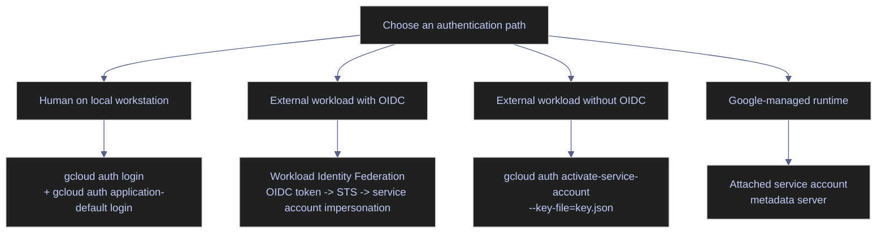
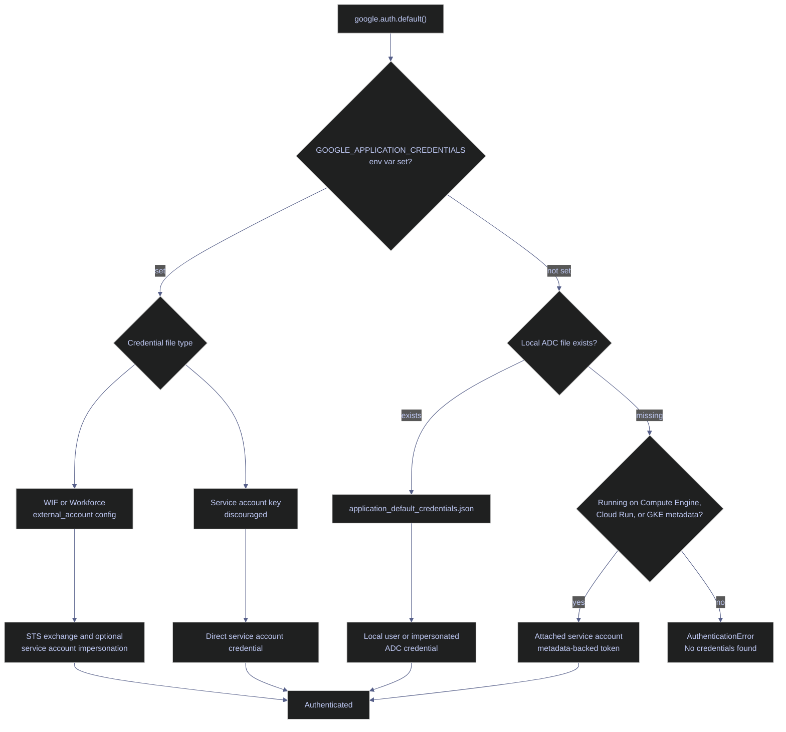
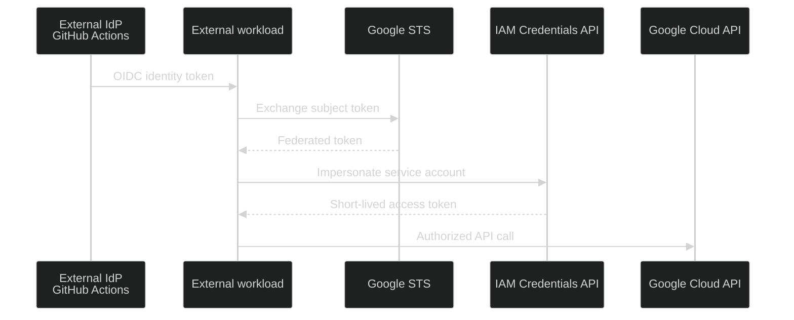

# GCP Authentication with gcloud CLI

> [!quote] Shared secret warning
>
> "Passwords are like underwear: you don't let people see it, you should change it very often, and you shouldn't share it with strangers."
>
> — **Chris Pirillo**
> [!abstract]- Summary
> GCP authentication in `gcloud` is built around short-lived OAuth 2.0 tokens, but the operational path differs by identity type and runtime. This note separates interactive user login, Application Default Credentials (ADC), service account authentication, service account impersonation, and Workload Identity Federation (WIF) so you can tell which credential source a CLI command or client library is actually using.
>
> It also traces the ADC search order, shows how `gcloud auth` commands populate different local stores, and explains why metadata-backed or federated credentials are safer than long-lived key files. The examples use the live project `bq-wh-nb`, including the `github-actions` workload identity pool, the `github` OIDC provider, and the target service account `github-actions-sa@bq-wh-nb.iam.gserviceaccount.com`, with runnable WIF commands executed on April 13, 2026 using Google Cloud SDK `563.0.0`.

> [!note]- Glossary
> **OAuth 2.0**
>
> The authorization framework Google Cloud uses to issue access tokens without exposing the user's or workload's primary secret to every API call.
>
> **access token**
>
> A short-lived bearer token that authorizes calls to Google Cloud APIs.
>
> **refresh token**
>
> A long-lived token that a local user credential can use to obtain new access tokens without another browser login.
>
> **identity token**
>
> A token that proves identity to a relying party. In WIF, the external workload usually starts with an OIDC identity token from its IdP.
>
> **user credentials**
>
> Credentials tied to a human Google account, usually created by `gcloud auth login` or `gcloud auth application-default login`.
>
> **service account credentials**
>
> Credentials tied to a non-human Google identity. These can come from a key file, metadata server, impersonation, or WIF.
>
> **Application Default Credentials (ADC)**
>
> The credential discovery strategy used by Google auth libraries and many SDK integrations.
>
> **credential store**
>
> The local file location where `gcloud` or ADC persists credential material, such as `%APPDATA%\gcloud\application_default_credentials.json` on Windows.
>
> **metadata server**
>
> The Google-managed endpoint that returns tokens for an attached service account on Compute Engine, Cloud Run, and GKE environments that expose metadata-backed credentials.
>
> **Workload Identity Federation (WIF)**
>
> A trust model that lets workloads outside Google Cloud exchange an external identity token for short-lived Google credentials without storing a service account key.
>
> **workload identity pool**
>
> The top-level IAM resource that groups external identities trusted by a project.
>
> **workload identity provider**
>
> The object inside a pool that defines one issuer, claim mappings, and admission conditions.
>
> **OIDC**
>
> OpenID Connect, an identity layer on top of OAuth 2.0 that standardizes identity tokens and claims such as `sub`, `aud`, and `iss`.
>
> **attribute mapping**
>
> The rules that copy claims from the external token into Google attributes such as `google.subject` or `attribute.repository`.
>
> **attribute condition**
>
> A CEL expression that rejects otherwise valid external tokens unless they match a required claim pattern.
>
> **credential configuration file**
>
> An `external_account` JSON file that tells ADC or `gcloud` where to find the external token and how to exchange it with Google STS.
>
> **impersonation**
>
> The step where a user or federated workload asks Google IAM Credentials to mint a short-lived token for a target service account.
>
> **short-lived credentials**
>
> Tokens that expire automatically, usually in minutes or hours, and therefore reduce the blast radius of leakage.
>
> **gcloud auth**
>
> The `gcloud` command group that logs in accounts, activates service accounts, prints tokens, and manages stored credentials.
>
> **bearer token**
>
> A token that grants access to whoever presents it, which is why access tokens must be protected in memory, logs, and network traces.

## Authentication Overview

There are four common authentication flows: interactive login for humans, Application Default Credentials for local code, Workload Identity Federation for external workloads that can present OIDC tokens, and attached service accounts for Google-managed runtimes. Service account key files remain a fallback for environments that cannot use OIDC or a metadata server.



## Authentication Commands

The `gcloud auth` subcommand manages all credential types. Choose the method that matches your environment: interactive for local work, application-default for SDK access, or service account for production and CI/CD.

### Interactive Authentication

For human users working locally. `auth login` populates credentials for the `gcloud` CLI; `application-default login` populates a separate file read by Python, Go, and Java client libraries. Both are needed for full local development access.

#### gcloud auth login - interactive authentication for human users

Opens a browser for Google account login. The OAuth token is stored in `~/.config/gcloud/` and refreshed automatically. Use for interactive work (debugging, ad-hoc queries, infrastructure changes).

```bash
gcloud auth login
```

```text
Your browser has been opened to visit:

    https://accounts.google.com/o/oauth2/auth?...

You are now logged in as [you@example.com].
Your current project is [my-project]. You can change this setting by running:
  $ gcloud config set project PROJECT_ID
```

#### gcloud auth application-default login - ADC for application code

Writes credentials to `~/.config/gcloud/application_default_credentials.json`. These are read by Python `google-cloud-*`, Go, and Java SDK clients, not by the `gcloud` CLI itself.

> [!warning] ADC is different from `gcloud auth login`
>
> - `gcloud auth login` creates credentials for the `gcloud` CLI itself.
> - `gcloud auth application-default login` creates credentials for client libraries such as Python `google-cloud-*`, Go, and Java SDKs.
> - If your pipeline code uses a client library, the CLI login alone does not satisfy ADC.

> [!success] Run both commands for local development
>
> For local development, run both commands when you need CLI access and SDK access in the same environment.
>
> ```bash
> gcloud auth login
> gcloud auth application-default login
> ```

```bash
gcloud auth application-default login
```

```text
Your browser has been opened to visit:

    https://accounts.google.com/o/oauth2/auth?...

Credentials saved to file: [/home/user/.config/gcloud/application_default_credentials.json]

These credentials will be used by any library that requests Application Default Credentials (ADC).
Quota project "my-project" was added to ADC which can be used by Google client libraries for billing and quota.
```

#### gcloud auth application-default set-quota-project - set billing project for ADC

Sets the quota project used by client libraries for billing. Required when your user identity belongs to a different project than the API resources you are accessing, otherwise API calls may fail with quota or billing errors.

```bash
gcloud auth application-default set-quota-project PROJECT_ID
```

```text
Updated property [core/project].
Credentials saved to file: [/home/user/.config/gcloud/application_default_credentials.json]
```

| Flag | Description |
|---|---|
| `PROJECT_ID` | Project to use for quota and billing when ADC credentials are used by client libraries |

### Interactive Authentication - Flag Reference

| Flag | Command | Description |
|---|---|---|
| `--no-launch-browser` | `auth login`, `application-default login` | Print the auth URL instead of opening a browser |
| `--scopes` | `auth login`, `application-default login` | Comma-separated OAuth scopes to request |
| `--account` | `auth login` | Google account to authenticate if multiple are available |
| `--client-id-file` | `application-default login` | Path to a custom OAuth client credentials JSON file |
| `--disable-quota-project` | `application-default login` | Omit the billing project from the ADC credentials file |

### Service Account Authentication

For CI/CD pipelines, automated scripts, and non-interactive environments. In production, prefer Workload Identity Federation or an attached service account over key files, because key files remain valid until explicitly deleted in IAM.

#### gcloud auth activate-service-account - SA key for production and CI/CD

Authenticates as a service account using a JSON key file. Use for CI/CD pipelines, automated scripts, and non-interactive environments only when you cannot use WIF or a metadata-backed identity.

```bash
gcloud auth activate-service-account --key-file=key.json
```

```text
Activated service account credentials for: [my-sa@my-project.iam.gserviceaccount.com]
```

For creating and managing the service accounts referenced here, see [service-accounts-and-iam](https://alp78.github.io/elysium/06-GCP/Security/service-accounts-and-iam). In GitHub Actions, [Workload Identity Federation](https://alp78.github.io/elysium/10-GitHub-Actions/github-actions-ci-cd) eliminates key files entirely for CI/CD authentication.

### Service Account Authentication - Flag Reference

| Flag | Description |
|---|---|
| `--key-file` | Path to the service account JSON key file (required) |
| `--project` | Set the default GCP project for this service account session |

### Credential Management

Commands for inspecting, debugging, and cleaning up credentials. Use `gcloud auth list` to verify the active identity before running infrastructure commands on a shared or multi-project machine.

#### gcloud auth list - view authenticated accounts

Lists all authenticated accounts and marks the active one with `*`. Run before any `gcloud` command on a shared or multi-project machine to confirm you are using the expected identity.

```bash
gcloud auth list
```

```text
                         Credentialed Accounts
ACTIVE  ACCOUNT
*       you@example.com
        other@example.com

To set the active account, run:
    $ gcloud config set account `ACCOUNT`
```

#### gcloud auth print-access-token - retrieve the current OAuth token

Prints the raw OAuth 2.0 access token for the active account. Use when debugging direct REST API calls with `curl` or validating that a credential is active.

```bash
gcloud auth print-access-token
```

```text
ya29.A0ARrdaM_...Zx9Q
```

Pass the token directly to REST API calls:

```bash
curl -H "Authorization: Bearer $(gcloud auth print-access-token)" \
  "https://bigquery.googleapis.com/bigquery/v2/projects/my-project/datasets"
```

#### gcloud auth revoke - remove stored credentials

Revokes and deletes stored credentials for an account. Run when leaving a shared machine, rotating credentials after a security incident, or cleaning up stale accounts.

```bash
gcloud auth revoke
```

```text
Revoked credentials:
 - you@example.com
```

### Credential Management - Flag Reference

| Flag | Command | Description |
|---|---|---|
| `--account` | `list`, `print-access-token`, `revoke` | Account to operate on (default: currently active account) |
| `--all` | `revoke` | Revoke all authenticated accounts, not just the active one |
| `--filter` | `list` | Filter expression (for example `--filter="account:@example.com"`) |
| `--format` | `list` | Output format such as `json`, `yaml`, `table`, or `value` |

## ADC Credential Search Order

When application code calls a GCP client library, the library calls `google.auth.default()` to resolve credentials. It searches the following locations in order and stops at the first match.

> [!info] The ADC search order
>
> When your code does `google.auth.default()` (covered in [17_py_gcp](https://alp78.github.io/elysium/02-Programming-Languages/Python/17_py_gcp)), ADC checks these locations in this exact order:
>
> 1. `GOOGLE_APPLICATION_CREDENTIALS`
> 2. The local ADC file created by `gcloud auth application-default login`
> 3. The attached service account returned by the metadata server
>
> The first location can point to three different JSON formats:
>
> - A Workload Identity Federation `external_account` configuration file
> - A Workforce Identity Federation `external_account` configuration file
> - A service account key file

> [!tip] Prefer federation or metadata-backed credentials
>
> Use `GOOGLE_APPLICATION_CREDENTIALS` for a WIF credential configuration file when code runs outside Google Cloud. On Google-managed runtimes, rely on the metadata server. Keep service account key files as a last resort only.

> [!danger] Service account key files never expire on their own
>
> A leaked service account key in a Git repository, container image, or log file remains valid until it is explicitly deleted in IAM.

> [!success] Prefer keyless authentication
>
> On Compute Engine, Cloud Run, and GKE, use the metadata server. For CI/CD and other external workloads, use WIF so the file on disk is an `external_account` configuration file instead of a private key.



## Service Account Impersonation

Service account impersonation lets a human user or another service account act as a target service account without downloading its key file. The `--impersonate-service-account` flag works on any `gcloud` command and requires `roles/iam.serviceAccountTokenCreator` on the target service account.

```bash
gcloud storage ls gs://my-bucket \
  --impersonate-service-account=my-sa@my-project.iam.gserviceaccount.com
```

```text
gs://my-bucket/data/
gs://my-bucket/logs/
```

> [!tip] Use impersonation instead of downloading key files for local testing
>
> To test what a service account can access, impersonate it from your own authenticated session. This avoids creating a persistent key file and the associated security risk. The impersonation token is short-lived and tied to your identity's audit trail.

| Flag | Description |
|---|---|
| `--impersonate-service-account` | Service account email to impersonate; valid on any `gcloud` command |

## Workload Identity Federation

Workload Identity Federation replaces long-lived key files for external workloads. A GitHub Actions job, an on-premises process, or a workload running in another cloud can obtain an external identity token from its IdP, exchange that token with Google Security Token Service (STS), and then impersonate a Google service account to get a short-lived access token.



### WIF Architecture

WIF has two separate control points. The provider decides whether an external token is trusted at all. The service account IAM binding decides whether that trusted external principal may impersonate a specific Google service account. You need both layers for a secure configuration.

#### Map the trust chain

The current `bq-wh-nb` implementation uses GitHub Actions as the external OIDC issuer. The provider maps GitHub claims into Google attributes, the provider condition narrows admission to the `alp78` repository owner, and the service account IAM policy narrows impersonation further to one repository.

| Component | Current value in `bq-wh-nb` | Purpose |
|---|---|---|
| Project number | `348557092514` | Appears in provider audiences, `principalSet` members, and audit references. |
| Workload identity pool | `github-actions` | Groups the external identities trusted by this project. |
| Provider | `github` | Validates GitHub's OIDC issuer and extracts claims. |
| Issuer URI | `https://token.actions.githubusercontent.com` | The upstream token issuer whose signatures and claims Google validates. |
| `google.subject` mapping | `assertion.sub` | Produces the unique external subject used in audit logs and subject-based principal URIs. |
| Custom mappings | `attribute.repository`, `attribute.actor`, `attribute.repository_owner` | Expose GitHub claims to IAM policies and provider conditions. |
| Provider condition | `assertion.repository_owner == 'alp78'` | Rejects tokens whose repository owner is outside the allowed trust boundary. |
| Target service account | `github-actions-sa@bq-wh-nb.iam.gserviceaccount.com` | Holds the Google roles that the external workload ultimately uses. |

> [!danger] Shared issuers need an admission guard
>
> GitHub's OIDC issuer is shared by every repository on GitHub. If a provider trusts the issuer but does not apply an attribute condition, any token that satisfies the provider audience can attempt federation.

> [!success] Restrict at the provider before IAM
>
> Keep an attribute condition on the provider, such as `assertion.repository_owner == 'alp78'` or an even narrower repository or branch expression. Then use IAM bindings on the service account to narrow impersonation further.

### Inspect the Existing WIF Pool

The pool is the top-level trust boundary. Listing and describing it answers three questions immediately: does the project already have a WIF pool, what is its lifecycle state, and what human-readable purpose did the operator record for it.

#### List workload identity pools

When auditing an existing project before creating another pool or troubleshooting a failed federation setup. It is typically triggered by first WIF inventory of a project, or confirmation after enabling `iam.googleapis.com`. Read-only IAM control-plane command. Requires permission to list workload identity pools in the project. Return every pool in `bq-wh-nb` with its canonical resource name, display name, state, and description.

| Output column | Source field | Type | Meaning |
|---|---|---|---|
| `NAME` | `name` | string | Full resource name of the pool, including the project number and location. |
| `DISPLAY_NAME` | `displayName` | string | Operator-friendly label shown in the console and CLI. |
| `STATE` | `state` | enum | Lifecycle state of the pool, such as `ACTIVE` or a deleted state returned with `--show-deleted`. |
| `DESCRIPTION` | `description` | string | Free-text explanation of what the pool is for. |

*List every workload identity pool in `bq-wh-nb` and render the canonical resource name plus lifecycle metadata.*

```bash
gcloud iam workload-identity-pools list \
  --project=bq-wh-nb \
  --location=global \
  --format="table(name,displayName,state,description)"
```

```text
NAME                                                                         DISPLAY_NAME    STATE   DESCRIPTION
projects/348557092514/locations/global/workloadIdentityPools/github-actions  GitHub Actions  ACTIVE  WIF pool for GitHub Actions OIDC
```

The live project currently has one pool, `github-actions`, and it is active. That tells you the trust boundary already exists and new providers or bindings should normally be attached to this pool instead of creating a duplicate without a reason.

#### Describe the `github-actions` pool

After discovering the pool ID and before you bind workloads or create additional providers. It is typically triggered by you need the exact canonical resource name, description, or lifecycle state of one known pool. Read-only IAM control-plane command scoped to one pool resource. Return the authoritative metadata for the `github-actions` pool.

| Output field | Type | Meaning |
|---|---|---|
| `name` | string | Canonical pool resource name used by IAM and API clients. |
| `displayName` | string | Human-readable pool label. |
| `state` | enum | Current lifecycle state of the pool. |
| `description` | string | Operator-supplied explanation of the pool's purpose. |

*Describe the existing `github-actions` pool and return its canonical metadata in YAML form.*

```bash
gcloud iam workload-identity-pools describe github-actions \
  --project=bq-wh-nb \
  --location=global \
  --format="yaml(name,displayName,state,description)"
```

```text
description: WIF pool for GitHub Actions OIDC
displayName: GitHub Actions
name: projects/348557092514/locations/global/workloadIdentityPools/github-actions
state: ACTIVE
```

The describe output confirms that the pool is active and owned by project number `348557092514`. That project number becomes part of both the provider audience and every `principalSet://iam.googleapis.com/...` member string later in the flow.

| Flag | Command | Syntax | Description |
|---|---|---|---|
| `WORKLOAD_IDENTITY_POOL` | `describe` | `gcloud iam workload-identity-pools describe github-actions` | Pool ID or fully qualified pool resource to inspect. |
| `--location` | `list`, `describe` | `--location=global` | Location of the pool collection or resource. WIF pools use `global`. |
| `--project` | `list`, `describe` | `--project=bq-wh-nb` | Project that owns the pool resource. |
| `--format` | `list`, `describe` | `--format="table(...)"` or `--format="yaml(...)"` | Controls how the CLI renders the returned fields. |
| `--show-deleted` | `list` | `--show-deleted` | Includes soft-deleted pools in the list output. |
| `--filter` | `list` | `--filter="state=ACTIVE"` | Filters listed pools using a `gcloud` filter expression. |
| `--limit` | `list` | `--limit=10` | Caps the number of returned rows. |
| `--page-size` | `list` | `--page-size=50` | Controls server-side page size for long lists. |
| `--sort-by` | `list` | `--sort-by=displayName` | Sorts list output by one or more fields before the final limit is applied. |

### Inspect the Existing WIF Provider

The provider is where Google validates the upstream issuer and translates external claims into Google IAM attributes. This is the object that decides whether a GitHub-issued token is even eligible to reach the service-account impersonation step.

#### List providers in the `github-actions` pool

After confirming the pool exists and before reusing or editing a provider. It is typically triggered by you need to see which issuers are already trusted inside the pool and whether they are active. Read-only IAM control-plane command against one pool. Return each provider in the `github-actions` pool with its issuer and admission condition.

| Output column | Source field | Type | Meaning |
|---|---|---|---|
| `NAME` | `name` | string | Full provider resource name, including pool and provider ID. |
| `DISPLAY_NAME` | `displayName` | string | Human-readable provider label. |
| `STATE` | `state` | enum | Lifecycle state of the provider. |
| `ISSUER_URI` | `oidc.issuerUri` | string | External OIDC issuer whose tokens the provider validates. |
| `ATTRIBUTE_CONDITION` | `attributeCondition` | string | CEL expression that rejects tokens outside the allowed trust boundary. |

*List the providers inside the `github-actions` pool and display the issuer plus the provider-side admission guard.*

```bash
gcloud iam workload-identity-pools providers list \
  --project=bq-wh-nb \
  --location=global \
  --workload-identity-pool=github-actions \
  --format="table(name,displayName,state,oidc.issuerUri,attributeCondition)"
```

```text
NAME                                                                                          DISPLAY_NAME  STATE   ISSUER_URI                                   ATTRIBUTE_CONDITION
projects/348557092514/locations/global/workloadIdentityPools/github-actions/providers/github  GitHub        ACTIVE  https://token.actions.githubusercontent.com  assertion.repository_owner == 'alp78'
```

The live pool currently trusts one provider, `github`. The provider is active, its issuer is the standard GitHub Actions OIDC endpoint, and the provider condition already narrows admission to repositories owned by `alp78`.

#### Describe the `github` provider

After finding the provider ID and before writing a `principalSet` binding or generating a credential configuration file. It is typically triggered by you need the exact claim mappings, issuer, and provider condition for one known provider. Read-only IAM control-plane command against one provider resource. Return the effective issuer, attribute mappings, and condition used by the `github` provider.

| Output field | Type | Meaning |
|---|---|---|
| `name` | string | Canonical provider resource name used in audiences and API calls. |
| `displayName` | string | Human-readable provider label. |
| `state` | enum | Current lifecycle state of the provider. |
| `oidc.issuerUri` | string | OIDC issuer URL Google validates against. |
| `attributeMapping` | map | Claim-to-attribute mappings that feed IAM principal URIs and logs. |
| `attributeCondition` | string | CEL expression that must evaluate to `true` for the token to be accepted. |

*Describe the existing `github` provider and surface the live issuer, mappings, and provider condition.*

```bash
gcloud iam workload-identity-pools providers describe github \
  --project=bq-wh-nb \
  --location=global \
  --workload-identity-pool=github-actions \
  --format="yaml(name,displayName,state,oidc.issuerUri,attributeMapping,attributeCondition)"
```

```text
attributeCondition: assertion.repository_owner == 'alp78'
attributeMapping:
  attribute.actor: assertion.actor
  attribute.repository: assertion.repository
  attribute.repository_owner: assertion.repository_owner
  google.subject: assertion.sub
displayName: GitHub
name: projects/348557092514/locations/global/workloadIdentityPools/github-actions/providers/github
oidc:
  issuerUri: https://token.actions.githubusercontent.com
state: ACTIVE
```

The provider maps GitHub's `sub` claim to `google.subject`, which is the identity Google records in audit logs and exposes through principal URIs. It also maps repository, actor, and repository-owner claims so IAM can grant repository-scoped access instead of trusting the whole pool.

| Flag | Command | Syntax | Description |
|---|---|---|---|
| `PROVIDER` | `describe` | `gcloud iam workload-identity-pools providers describe github` | Provider ID or fully qualified provider resource to inspect. |
| `--workload-identity-pool` | `list`, `describe` | `--workload-identity-pool=github-actions` | Pool that contains the provider resource. |
| `--location` | `list`, `describe` | `--location=global` | Location of the pool and provider resources. |
| `--project` | `list`, `describe` | `--project=bq-wh-nb` | Project that owns the pool and provider. |
| `--format` | `list`, `describe` | `--format="table(...)"` or `--format="yaml(...)"` | Controls the rendered output fields. |
| `--show-deleted` | `list` | `--show-deleted` | Includes soft-deleted providers in the list output. |
| `--filter` | `list` | `--filter="state=ACTIVE"` | Filters provider rows with a `gcloud` expression. |
| `--limit` | `list` | `--limit=10` | Caps the number of providers returned. |
| `--page-size` | `list` | `--page-size=50` | Sets the paging size for long provider lists. |
| `--sort-by` | `list` | `--sort-by=displayName` | Sorts provider rows before the final limit is applied. |

### Create a WIF Pool and Provider

Creating WIF is a two-step control-plane operation. First you create the pool that defines the trust boundary. Then you create a provider inside that pool that names one issuer and the exact claim-to-attribute mapping logic. In a project that already has a working provider, use environment-specific or disposable IDs so you do not overwrite an active configuration.

#### Create a new workload identity pool

When a project needs a new trust boundary for one external platform or environment. It is typically triggered by initial WIF bootstrap, new CI/CD platform onboarding, or separation of dev and prod trust domains. State-changing IAM control-plane command. Requires permission to create workload identity pools in the target project. Create the container resource that will own one or more external identity providers.

*Create a new workload identity pool that will later host one or more external OIDC providers.*

```bash
gcloud iam workload-identity-pools create gha-p4-demo01 \
  --project=bq-wh-nb \
  --location=global \
  --display-name="GitHub Actions Demo" \
  --description="Disposable WIF pool for authentication note live capture"
```

```text
Created workload identity pool [gha-p4-demo01].
```

The pool ID is the stable resource name you reference later in provider creation and `principalSet` URIs. `displayName` is purely human-readable. `description` is operational metadata and should explain which external platform or environment the pool exists for.

#### Create an OIDC provider inside the pool

After the pool exists and you know the issuer URI, claim mapping, and admission criteria for the external platform. It is typically triggered by WIF bootstrap for a new IdP or a new environment-specific trust boundary. State-changing IAM control-plane command. Requires permission to create providers inside the target pool. Define which OIDC issuer is trusted, which claims become Google attributes, and which tokens are rejected before service-account impersonation is considered.

| Mapping target | Live mapping | Why it matters |
|---|---|---|
| `google.subject` | `assertion.sub` | Produces the unique external subject used in audit logs and subject-based principal URIs. |
| `attribute.repository` | `assertion.repository` | Enables repository-scoped `principalSet` bindings such as `alp78/git-lab`. |
| `attribute.actor` | `assertion.actor` | Exposes the GitHub actor claim for optional future policy decisions. |
| `attribute.repository_owner` | `assertion.repository_owner` | Feeds the provider admission guard so only the intended GitHub owner is trusted. |

*Create an OIDC provider that trusts GitHub's issuer, maps the required claims, and restricts admission to the `alp78` repository owner.*

```bash
gcloud iam workload-identity-pools providers create-oidc github-demo \
  --project=bq-wh-nb \
  --location=global \
  --workload-identity-pool=gha-p4-demo01 \
  --display-name="GitHub OIDC Demo" \
  --description="Disposable GitHub OIDC provider for note capture" \
  --issuer-uri="https://token.actions.githubusercontent.com" \
  --attribute-mapping="google.subject=assertion.sub,attribute.repository=assertion.repository,attribute.actor=assertion.actor,attribute.repository_owner=assertion.repository_owner" \
  --attribute-condition="assertion.repository_owner == 'alp78'"
```

```text
Created workload identity pool provider [github-demo].
```

The provider creation command performs the critical security work. `--issuer-uri` identifies who may sign the external token. `--attribute-mapping` defines which claims survive into Google IAM. `--attribute-condition` is the early rejection gate that stops tokens from unrelated repositories before they ever reach service-account impersonation.

> [!danger] Deleting a pool is an outage event
>
> `gcloud iam workload-identity-pools delete` stops new token exchanges immediately. Google Cloud can still return deleted pools with `--show-deleted`, and `gcloud iam workload-identity-pools undelete` exists, but workloads fail until the pool is restored.

> [!success] Test in a disposable pool first
>
> Use a disposable pool for validation work and keep production pools stable. If you need to pause access temporarily, a disabled pool or narrower provider condition is safer than deleting a production trust boundary.

| Flag | Command | Syntax | Description |
|---|---|---|---|
| `WORKLOAD_IDENTITY_POOL` | `create` | `gcloud iam workload-identity-pools create gha-p4-demo01` | Pool ID to create. |
| `--location` | `create` | `--location=global` | Location of the new pool. WIF pools use `global`. |
| `--display-name` | `create` | `--display-name="GitHub Actions Demo"` | Human-readable pool label. |
| `--description` | `create` | `--description="..."` | Operational description of the pool's purpose. |
| `--disabled` | `create` | `--disabled` | Creates the pool in a disabled state so it cannot exchange tokens yet. |
| `--mode` | `create` | `--mode=federation-only` | Sets the pool mode when you need a non-default trust-domain behavior. |
| `--inline-trust-config-file` | `create` | `--inline-trust-config-file=trust.yaml` | Supplies additional trust bundles from a YAML file. |
| `--inline-certificate-issuance-config-file` | `create` | `--inline-certificate-issuance-config-file=issuance.yaml` | Supplies certificate issuance settings for certificate-based scenarios. |
| `--use-default-shared-ca` | `create` | `--use-default-shared-ca` | Uses Google-managed shared CAs for certificate issuance. |
| `--project` | `create` | `--project=bq-wh-nb` | Project that will own the pool resource. |
| Flag | Command | Syntax | Description |
|---|---|---|---|
| `PROVIDER` | `create-oidc` | `gcloud iam workload-identity-pools providers create-oidc github-demo` | Provider ID to create inside the pool. |
| `--workload-identity-pool` | `create-oidc` | `--workload-identity-pool=gha-p4-demo01` | Existing pool that will contain the provider. |
| `--location` | `create-oidc` | `--location=global` | Location of the parent pool and new provider. |
| `--issuer-uri` | `create-oidc` | `--issuer-uri="https://token.actions.githubusercontent.com"` | Trusted OIDC issuer URL. |
| `--attribute-mapping` | `create-oidc` | `--attribute-mapping="google.subject=assertion.sub,..."` | Maps claims from the external token into Google IAM attributes. |
| `--attribute-condition` | `create-oidc` | `--attribute-condition="assertion.repository_owner == 'alp78'"` | CEL expression that rejects tokens outside the allowed trust boundary. |
| `--allowed-audiences` | `create-oidc` | `--allowed-audiences=https://example` | Restricts which `aud` values are accepted from the external token. |
| `--display-name` | `create-oidc` | `--display-name="GitHub OIDC Demo"` | Human-readable provider label. |
| `--description` | `create-oidc` | `--description="..."` | Operational description of the provider. |
| `--disabled` | `create-oidc` | `--disabled` | Creates the provider but leaves token exchange disabled. |
| `--jwk-json-path` | `create-oidc` | `--jwk-json-path=keys.json` | Supplies a local JWKS file when the issuer keys are not discoverable automatically. |
| `--project` | `create-oidc` | `--project=bq-wh-nb` | Project that owns the pool and provider resources. |

### Service Account Binding for WIF

Provider trust and service-account authorization are separate. Even if the provider accepts the token, the workload still cannot do anything until the target service account grants `roles/iam.workloadIdentityUser` to a federated principal or principal set.

#### Grant repository-scoped impersonation to the service account

After the provider exists and you know which external identities should impersonate the target service account. It is typically triggered by WIF bootstrap for a repository, workload, or environment that now needs Google API access. State-changing IAM policy command against a service account resource. Requires permission to modify the service account IAM policy. Grant the `github-actions` pool identities for repository `alp78/git-lab` permission to impersonate `github-actions-sa`.

| Output field | Type | Meaning |
|---|---|---|
| `bindings.role` | string | IAM role granted on the service account resource. |
| `bindings.members` | array | Principals or principal sets that receive the role. |
| `etag` | string | Concurrency token for optimistic IAM policy updates. |
| `version` | integer | IAM policy schema version. |

> [!info] `principalSet` member anatomy
>
> The member string has four parts:
>
> - `projects/348557092514/locations/global/workloadIdentityPools/github-actions` identifies the pool host project and pool.
> - `attribute.repository` says the binding keys off the mapped repository claim.
> - `alp78/git-lab` is the repository value that must appear in the mapped attribute.
> - `roles/iam.workloadIdentityUser` authorizes service-account impersonation, not direct resource access. The service account's own project roles still determine what APIs it may call.

*Grant repository-scoped WIF identities permission to impersonate `github-actions-sa` and return the resulting IAM policy.*

```bash
gcloud iam service-accounts add-iam-policy-binding \
  github-actions-sa@bq-wh-nb.iam.gserviceaccount.com \
  --project=bq-wh-nb \
  --role="roles/iam.workloadIdentityUser" \
  --member="principalSet://iam.googleapis.com/projects/348557092514/locations/global/workloadIdentityPools/github-actions/attribute.repository/alp78/git-lab"
```

```text
bindings:
- members:
  - principalSet://iam.googleapis.com/projects/348557092514/locations/global/workloadIdentityPools/github-actions/attribute.repository/alp78/git-lab
  role: roles/iam.workloadIdentityUser
etag: BwZPVI5NoOc=
version: 1

Updated IAM policy for serviceAccount [github-actions-sa@bq-wh-nb.iam.gserviceaccount.com].
```

The binding is repository-scoped rather than pool-scoped. That is the safer pattern. The provider condition limits which GitHub owner may exchange tokens, and the service-account policy limits impersonation to one specific repository under that owner.

> [!warning] `principalSet` and `principal` are different scopes
>
> `principalSet://.../attribute.repository/alp78/git-lab` matches every federated identity whose mapped repository claim equals `alp78/git-lab`. `principal://.../subject/SUBJECT` matches one exact `google.subject` value only.

> [!success] Pick the narrowest practical scope
>
> Use `principalSet` when you want repository-level or claim-based grouping. Use `principal` when one exact subject should impersonate the service account and nothing else.

| Flag | Syntax | Description |
|---|---|---|
| `SERVICE_ACCOUNT` | `gcloud iam service-accounts add-iam-policy-binding github-actions-sa@bq-wh-nb.iam.gserviceaccount.com` | Service account resource whose IAM policy you are modifying. |
| `--member` | `--member="principalSet://iam.googleapis.com/..."` | Federated principal or principal set to grant access to. |
| `--role` | `--role="roles/iam.workloadIdentityUser"` | IAM role granted on the service account resource. |
| `--condition` | `--condition='expression=...,title=...'` | Optional IAM condition attached to the binding itself. |
| `--condition-from-file` | `--condition-from-file=condition.yaml` | Reads the IAM condition from a local JSON or YAML file. |
| `--project` | `--project=bq-wh-nb` | Project that owns the service account resource. |

### Credential Configuration File

External workloads do not store a service account private key when using WIF. Instead, they store an `external_account` configuration file that points to the external token source, the STS token endpoint, and the IAM Credentials impersonation endpoint.

#### Generate the `external_account` credential file

After the provider and service-account binding exist and you know how the external workload will expose its OIDC token. It is typically triggered by initial bootstrap of a CI runner, another cloud workload, or an on-premises process that needs keyless Google authentication. Local file-generation command. It does not create an IAM resource; it writes a JSON configuration file for ADC or `gcloud`. Generate the JSON file that tells auth libraries how to exchange an external OIDC token for Google credentials.

*Create a WIF credential configuration file that reads the subject token from a local file and impersonates `github-actions-sa`.*

```powershell
gcloud iam workload-identity-pools create-cred-config `
  projects/348557092514/locations/global/workloadIdentityPools/github-actions/providers/github `
  --service-account=github-actions-sa@bq-wh-nb.iam.gserviceaccount.com `
  --credential-source-file=.\github-oidc-token.txt `
  --output-file=.\wif-cred-config.json
```

```text
Created credential configuration file [.\wif-cred-config.json].
```

The first positional argument is the provider audience, not the project ID. The resulting file does not contain a private key. It contains metadata that tells the auth library where to read the external token and which Google endpoints to call next.

#### Inspect the generated JSON structure

Immediately after generating the file, or when auditing a credential file supplied to a deployment system. It is typically triggered by you need to verify that the file points to the intended provider, token source, and service account impersonation endpoint. Local file inspection. Read-only against the generated JSON file. Confirm that the file is an `external_account` configuration and not a service account key.

| JSON field | Type | Meaning |
|---|---|---|
| `type` | string | Credential file type. For WIF this is `external_account`, not `service_account`. |
| `audience` | string | Canonical provider audience used in the STS token exchange. |
| `subject_token_type` | string | Token type expected from the external IdP. |
| `token_url` | string | STS endpoint used to exchange the external token for a Google federated token. |
| `credential_source.file` | string | Local file path where the workload obtains the external OIDC token. |
| `service_account_impersonation_url` | string | IAM Credentials endpoint that mints the short-lived Google access token. |
| `universe_domain` | string | Google API domain suffix used by the generated configuration. |

*Read the generated JSON file and confirm that it contains token-exchange metadata rather than a private key.*

```json
{
  "universe_domain": "googleapis.com",
  "type": "external_account",
  "audience": "//iam.googleapis.com/projects/348557092514/locations/global/workloadIdentityPools/github-actions/providers/github",
  "subject_token_type": "urn:ietf:params:oauth:token-type:jwt",
  "token_url": "https://sts.googleapis.com/v1/token",
  "credential_source": {
    "file": ".\\github-oidc-token.txt"
  },
  "service_account_impersonation_url": "https://iamcredentials.googleapis.com/v1/projects/-/serviceAccounts/github-actions-sa@bq-wh-nb.iam.gserviceaccount.com:generateAccessToken"
}
```

> [!warning] Validate credential configuration files from outside your control
>
> A credential configuration file can point your workload at specific URLs and local file paths. If an attacker can swap that JSON, they can redirect authentication traffic or token reads.

> [!success] Generate or review the JSON yourself
>
> Generate the file with `gcloud iam workload-identity-pools create-cred-config` when possible, or review every field before distributing it to a runner, VM, or container image.

| Flag | Syntax | Description |
|---|---|---|
| `AUDIENCE` | `projects/348557092514/locations/global/workloadIdentityPools/github-actions/providers/github` | Fully qualified provider identifier used by STS as the audience. |
| `--output-file` | `--output-file=.\wif-cred-config.json` | Path where the generated JSON file is written. |
| `--credential-source-file` | `--credential-source-file=.\github-oidc-token.txt` | Local file that will contain the external subject token. |
| `--credential-source-url` | `--credential-source-url=https://example/token` | Remote endpoint that returns the external subject token instead of a local file. |
| `--executable-command` | `--executable-command=/abs/path/get-token` | Executable that returns the external subject token on demand. |
| `--aws` | `--aws` | Builds an AWS-based credential configuration. |
| `--azure` | `--azure` | Builds an Azure-based credential configuration. |
| `--credential-cert-path` | `--credential-cert-path=cert.pem` | Builds an X.509 certificate-based credential configuration. |
| `--service-account` | `--service-account=github-actions-sa@bq-wh-nb.iam.gserviceaccount.com` | Service account to impersonate after STS exchange. |
| `--service-account-token-lifetime-seconds` | `--service-account-token-lifetime-seconds=3600` | Requested lifetime of the impersonated access token. |
| `--credential-source-field-name` | `--credential-source-field-name=id_token` | JSON field name that contains the subject token when the source returns JSON. |
| `--credential-source-headers` | `--credential-source-headers=Key=Value` | Headers sent to a URL-based credential source. |
| `--credential-source-type` | `--credential-source-type=json` | Declares whether the source format is JSON or plain text. |
| `--sts-location` | `--sts-location=us-central1` | Uses a regional STS endpoint instead of the global `sts.googleapis.com` endpoint. |
| `--subject-token-type` | `--subject-token-type=urn:ietf:params:oauth:token-type:jwt` | Declares the subject token type expected from the external source. |
| `--app-id-uri` | `--app-id-uri=api://app-id` | Azure-only application ID URI. |
| `--enable-imdsv2` | `--enable-imdsv2` | Enforces AWS IMDSv2 in AWS-based configurations. |
| `--executable-output-file` | `--executable-output-file=C:\temp\cache.json` | Caches output from an executable token source. |
| `--executable-timeout-millis` | `--executable-timeout-millis=30000` | Maximum time allowed for the executable token source to finish. |
| `--credential-cert-private-key-path` | `--credential-cert-private-key-path=key.pem` | Private key path for certificate-based configurations. |
| `--credential-cert-configuration-output-file` | `--credential-cert-configuration-output-file=cert-config.json` | Path where the certificate helper configuration is written. |
| `--credential-cert-trust-chain-path` | `--credential-cert-trust-chain-path=chain.pem` | Trust chain file used when intermediate certificates exist. |

### ADC with WIF

WIF changes ADC behavior at the first search step. `GOOGLE_APPLICATION_CREDENTIALS` still wins, but the file can now be an `external_account` configuration instead of a service account key. The auth library reads the JSON, obtains the external token from the configured source, exchanges it with STS, and then impersonates the target service account.

#### Point `GOOGLE_APPLICATION_CREDENTIALS` at the WIF file in PowerShell

When code on Windows must use a WIF credential configuration file instead of local user ADC or a key file. It is typically triggered by CI runner setup, local reproduction of an external workload, or scripted testing of an `external_account` configuration. Session-local environment variable assignment in PowerShell. This is read by Google auth libraries in the current process and child processes. Make ADC choose the WIF credential configuration file at the first search-order step.

*Set the PowerShell environment variable so ADC resolves the WIF credential configuration file first.*

```powershell
$env:GOOGLE_APPLICATION_CREDENTIALS = "C:\path\to\wif-cred-config.json"
```

#### Point `GOOGLE_APPLICATION_CREDENTIALS` at the WIF file in Linux

When code on Linux or macOS must use a WIF credential configuration file instead of local user ADC or a key file. It is typically triggered by container bootstrap, shell session setup, or CI runner initialization outside Google Cloud. Session-local shell environment variable assignment. Read by Google auth libraries in the current process and child processes. Make ADC choose the WIF credential configuration file at the first search-order step.

*Set the shell environment variable so ADC resolves the WIF credential configuration file first.*

```bash
export GOOGLE_APPLICATION_CREDENTIALS="/path/to/wif-cred-config.json"
```

The file pointed to by `GOOGLE_APPLICATION_CREDENTIALS` is still the highest-priority ADC source, but its meaning changes. With WIF, the file is not a credential by itself. It is an instruction set that tells the auth library how to obtain the real short-lived credential at runtime.

> [!tip] Current tooling supports WIF natively
>
> Google documents WIF support in `gcloud` starting with Cloud SDK `363.0.0`. The live environment used for this note runs `563.0.0`, so both `gcloud` and current auth libraries can consume the generated `external_account` file format.

## Gotchas and Edge Cases

Common sources of authentication failures in local development and CI/CD pipelines.

> [!warning] ADC token caching can delay new permissions
>
> `gcloud auth application-default login` caches credential material in the local ADC file. If your IAM roles change after login, the old token or refresh cycle can leave you testing with stale permissions for up to an hour.

> [!success] Refresh ADC after IAM changes
>
> After updating IAM roles, re-run `gcloud auth application-default login` to pick up the new permissions immediately. In CI/CD, authenticate fresh on each run instead of reusing old ADC state.

- `gcloud auth login` and `gcloud auth application-default login` create different credentials for different consumers.
- Service account key files (`key.json`) do not expire on their own. If leaked, attackers keep access until the key is deleted.
- On [Compute Engine VMs](https://alp78.github.io/elysium/06-GCP/Compute/vm-lifecycle) and [Cloud Run](https://alp78.github.io/elysium/06-GCP/Serverless/cloud-run-jobs-vs-services), the metadata server provides credentials automatically.

## Related

- [gcloud-cli-setup](https://alp78.github.io/elysium/06-GCP/01-Core/00-gcloud-cli-setup) — Install the CLI, initialize a configuration, and verify the local SDK
- [gcp-resource-hierarchy](https://alp78.github.io/elysium/06-GCP/01-Core/01-gcp-resource-hierarchy) — Set the active project and understand the project boundary for authentication context
- [gcp-identity-and-connection-patterns](https://alp78.github.io/elysium/06-GCP/Security/gcp-identity-and-connection-patterns) — Complete identity model, OAuth2 flows, credential types, and connection patterns
- [gcloud-configurations](https://alp78.github.io/elysium/06-GCP/Core/gcloud-configurations) — Manage multiple project contexts
- [service-accounts-and-iam](https://alp78.github.io/elysium/06-GCP/Security/service-accounts-and-iam) — Create and manage service accounts, IAM bindings and roles

## References

- [gcloud auth documentation](https://cloud.google.com/sdk/gcloud/reference/auth)
- [Application Default Credentials](https://cloud.google.com/docs/authentication/application-default-credentials)
- [Workload Identity Federation with deployment pipelines](https://cloud.google.com/iam/docs/workload-identity-federation-with-deployment-pipelines)
- [Best practices for using Workload Identity Federation](https://cloud.google.com/iam/docs/best-practices-for-using-workload-identity-federation)
