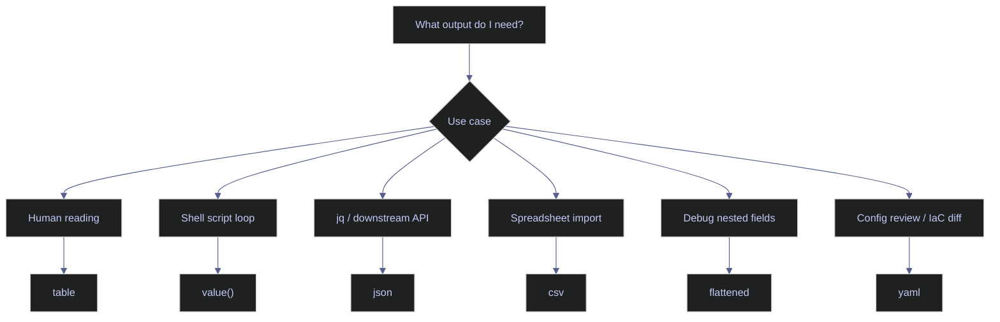

# gcloud Output Formatting and Filtering

> [!quote]
> "The difference between a gcloud command that works in a script and one that doesn't is the --format flag."
>
> — **Ahmet Alp Balkan**, Google Cloud developer tools engineer

The `--format` and `--filter` flags are the most underused features of the [gcloud CLI](https://alp78.github.io/elysium/06-GCP/Core/gcloud-authentication). They transform gcloud from a human-readable tool into a scriptable data extraction engine, enabling you to pipe exact field values into shell scripts, build inventory automation, and run server-side filtered queries instead of grepping local output.

## Why gcloud Output Formatting Matters

Without `--format`, gcloud outputs human-readable tables that are difficult to parse programmatically. Without `--filter`, you must download all results and filter locally. Together these flags let you:
- Extract single fields as newline-separated values for shell loops
- Push filtering to the API server (faster, fewer bytes transferred)
- Output CSV or JSON for downstream processing
- Test IAM permissions by impersonating a service account

Set a global default format to avoid specifying `--format` on every command:

```bash
gcloud config set core/format json
```



## Output Format Options

The `--format` flag controls how gcloud serializes API responses. It applies client-side after the API response is received — use `--filter` in combination to reduce the data returned from the server before formatting.

### Table and Human-Readable Formats

These formats are optimized for terminal display and interactive use. They add column headers and align values for readability but are not suitable for scripting.

#### Default table output

Without `--format`, gcloud renders a pre-defined table for each resource type. Column selection and ordering are controlled by gcloud's built-in schema — not configurable without `--format`.

```bash
gcloud compute instances list
```

```text
NAME                 ZONE             MACHINE_TYPE   STATUS
data-pipeline-sql    europe-west1-b   e2-standard-2  RUNNING
data-pipeline-air    europe-west1-b   e2-medium      RUNNING
```

#### Table with field transforms

`table(field,...)` renders a formatted table with custom column selection. Transform functions (`.basename()`, `.date()`, etc.) are applied inline per field. This is useful when the default table omits fields you need or includes fields you don't.

`machineType` and `zone` are returned as full resource URLs (e.g., `.../zones/europe-west1-b`). `.basename()` extracts just the final path segment.

```bash
gcloud compute instances list --format="table(name,zone.basename(),status,machineType.basename())"
```

```text
NAME                 ZONE             STATUS   MACHINE_TYPE
data-pipeline-sql    europe-west1-b   RUNNING  e2-standard-2
data-pipeline-air    europe-west1-b   RUNNING  e2-medium
```

| Flag | Syntax | Description |
|---|---|---|
| `table(fields)` | `--format="table(name,status)"` | Formatted table with column headers |
| `table(field:sort=N)` | `--format="table(name,status:sort=1)"` | Sort output by column N (1-indexed) |
| `table(field.transform())` | `--format="table(zone.basename())"` | Apply a transform function to a field |
| `table(field:label=TEXT)` | `--format="table(name:label=INSTANCE)"` | Override the column header label |

### Programmatic and Script-Friendly Formats

These formats are designed for consumption by scripts, pipelines, and downstream tools.

#### JSON output

`--format=json` returns the full API response as a JSON array. Every field from the GCP API is included. Pipe to `jq` for field extraction. For large resource lists this can be verbose — use `--format='json(field1,field2)'` to project only the fields you need.

```bash
gcloud compute instances list --format=json
```

```text
[
  {
    "name": "data-pipeline-sql",
    "status": "RUNNING",
    "zone": "https://www.googleapis.com/compute/v1/projects/fin-prod/zones/europe-west1-b",
    ...
  }
]
```

> [!warning] Full JSON output for large resource sets can be several megabytes.
>
> `gcloud compute instances list --format=json` on a project with hundreds of VMs returns every field for every resource — bandwidth and latency costs add up in scripts that run frequently.

> [!success] Use projected JSON
>
> `--format='json(name,status,zone)'` returns the same array structure but with only the three specified fields populated, significantly reducing payload size.

#### Value extraction

`value(field)` extracts a single field per resource as a plain newline-separated list with no headers. This is the correct format for feeding gcloud output into `for` loops or `xargs`. Multiple fields in `value(field1,field2)` are tab-separated on each line.

```bash
gcloud compute instances list --format="value(name)"
```

```text
data-pipeline-sql
data-pipeline-air
```

> [!tip] Shell loop pattern
>
> `value()` is the correct format for driving shell loops:
> ```bash
> for vm in $(gcloud compute instances list --format="value(name)"); do
>   echo "Processing: $vm"
> done
> ```
> Avoid parsing `table` output in scripts — column widths change with data length.

#### CSV output

`csv(fields)` produces comma-separated output with a header row. Useful for exporting resource inventories to spreadsheets or feeding into data pipelines that expect CSV.

```bash
gcloud compute instances list --format="csv(name,zone.basename(),status)"
```

```text
name,zone,status
data-pipeline-sql,europe-west1-b,RUNNING
data-pipeline-air,europe-west1-b,RUNNING
```

#### YAML output

`--format=yaml` serializes the API response in YAML. Useful when comparing resource configuration between environments or producing output for diff tools and IaC review.

```bash
gcloud compute instances describe data-pipeline-sql --zone=europe-west1-b --format=yaml
```

```text
name: data-pipeline-sql
status: RUNNING
zone: https://www.googleapis.com/compute/v1/projects/.../zones/europe-west1-b
machineType: https://www.googleapis.com/compute/v1/projects/.../machineTypes/e2-standard-2
```

| Format | Flag syntax | Best for |
|---|---|---|
| `json` | `--format=json` | jq processing, full API response |
| `json(fields)` | `--format='json(name,status)'` | Projected JSON, reduced payload |
| `value(field)` | `--format="value(name)"` | Shell loops, xargs |
| `csv(fields)` | `--format="csv(name,status)"` | Spreadsheets, CSV pipelines |
| `yaml` | `--format=yaml` | Config review, diff, IaC context |

### Exploratory and Diagnostic Formats

#### Flattened output

`flattened(field)` expands nested JSON structures into dot-notation key-value pairs. Use this to explore a resource's field paths when you don't know the exact projection key needed for a `value()` or `table()` format expression.

```bash
gcloud compute instances describe data-pipeline-sql --zone=europe-west1-b --format="flattened(networkInterfaces)"
```

```text
networkInterfaces[0].accessConfigs[0].kind:       compute#accessConfig
networkInterfaces[0].accessConfigs[0].name:       External NAT
networkInterfaces[0].accessConfigs[0].natIP:      34.76.xxx.xxx
networkInterfaces[0].accessConfigs[0].networkTier: PREMIUM
networkInterfaces[0].accessConfigs[0].type:       ONE_TO_ONE_NAT
networkInterfaces[0].name:                        nic0
networkInterfaces[0].network:                     .../networks/default
networkInterfaces[0].networkIP:                   10.132.0.5
networkInterfaces[0].subnetwork:                  .../subnetworks/default
```

The dot-notation keys produced by `flattened` are the exact projection paths you can use in subsequent `value()` or `table()` expressions — for example, `--format="value(networkInterfaces[0].accessConfigs[0].natIP)"` extracts just the external IP.

## Server-Side Filtering with `--filter`

The `--filter` flag sends a filter expression to the GCP API, which evaluates it server-side before returning results. This is faster and uses less bandwidth than downloading all resources and piping to `grep`. For large resource lists the difference is significant — thousands of VMs or GCS objects are filtered at the API level, not in your terminal.

### Filter syntax and operators

Filter expressions use a simple query language. Multiple conditions are combined with `AND`, `OR`, and `NOT`.

> [!info] Filter operators
> - `=` — exact match: `status=RUNNING`
> - `~` — regex match: `name~data-pipeline` (names containing "data-pipeline")
> - `:` — substring match: `labels.team:analytics`
> - `AND` / `OR` / `NOT` — logical operators
> - `<`, `>`, `<=`, `>=` — numeric and timestamp comparisons
>
> Full reference: `gcloud topic filters`

#### Basic filter

Filter VM instances by status and name pattern. Only matching instances are returned from the API.

```bash
gcloud compute instances list --filter="status=RUNNING AND name~data-pipeline"
```

```text
NAME                 ZONE             MACHINE_TYPE   STATUS
data-pipeline-sql    europe-west1-b   e2-standard-2  RUNNING
data-pipeline-air    europe-west1-b   e2-medium      RUNNING
```

### Combining --filter with --format

Both flags are independent — `--filter` controls which resources are returned, `--format` controls how they are serialized. They compose cleanly and are the core pattern for gcloud-based automation.

#### Filter and format for inventory scripts

`value(name,networkInterfaces[0].networkIP)` returns two tab-separated fields per line — instance name and its internal IP. No headers, no formatting overhead — ready for piping into downstream commands.

```bash
gcloud compute instances list \
  --filter="status=RUNNING" \
  --format="value(name,networkInterfaces[0].networkIP)"
```

```text
data-pipeline-sql	10.132.0.5
data-pipeline-air	10.132.0.8
```

| Flag | Syntax | Description |
|---|---|---|
| `--filter` | `--filter="status=RUNNING"` | Server-side filter expression |
| `AND` | `--filter="status=RUNNING AND name~pipe"` | Combine conditions (both must match) |
| `OR` | `--filter="status=RUNNING OR status=STAGING"` | Either condition matches |
| `NOT` | `--filter="NOT status=TERMINATED"` | Exclude matching resources |
| `~` | `--filter="name~data-pipeline"` | Regex name match |
| `:` | `--filter="labels.team:analytics"` | Substring or label key match |

### Service Account Impersonation

#### Impersonate a service account for permission testing

`--impersonate-service-account` allows a caller to act as a service account without downloading its key file. gcloud exchanges the caller's credentials for a short-lived access token scoped to the target service account. This is the recommended way to test "what can this service account see?" without creating a key.

**Prerequisites:**
- Caller must have `roles/iam.serviceAccountTokenCreator` on the target service account.
- The Cloud IAM API must be enabled in the project.

Impersonated API calls are logged under the service account's identity in Cloud Audit Logs, not the caller's — verify audit log coverage before relying on this for access forensics.

```bash
gcloud compute instances list \
  --impersonate-service-account=pipeline-sa@project.iam.gserviceaccount.com
```

```text
NAME                 ZONE             MACHINE_TYPE   STATUS
data-pipeline-sql    europe-west1-b   e2-standard-2  RUNNING
```

> [!danger] Over-granting `roles/iam.serviceAccountTokenCreator` is a privilege escalation risk.
>
> Any principal with this role on a service account can act as that account, including invoking any GCP API the account has access to.

> [!success] Scope impersonation grants narrowly
>
> Grant `roles/iam.serviceAccountTokenCreator` at the **service account resource level** (not the project level), and only to the specific principals who need to test that account. Audit grants regularly:
> ```bash
> gcloud iam service-accounts get-iam-policy pipeline-sa@project.iam.gserviceaccount.com
> ```

## Format Transformation Functions

Transform functions modify field values inline within `table()`, `value()`, or `csv()` projections. They are appended with dot notation: `field.transform()`. Use `gcloud topic projections` for the full list.

> [!info] Full Format Expression Language
>
> The `--format` specification is a complete expression language supporting:
> - **Projections:** `table(name, status)` — select specific fields
> - **Transformations:** `.basename()`, `.date()`, `.len()`, `.yesno()` — modify values
> - **Conditionals:** `table(name, status.color(green=RUNNING,red=TERMINATED))` — colorize output
> - **Sorting:** `table(name, status:sort=1)` — sort by column
> - **URI parsing:** `.scope()` extracts project/zone from resource URIs
>
> Full reference: `gcloud topic formats` and `gcloud topic projections`

| Function | What it does | Example |
|---|---|---|
| `.basename()` | Last path segment from a resource URL | `machineType.basename()` → `e2-medium` |
| `.date()` | Format a timestamp | `creationTimestamp.date()` → `2024-01-15` |
| `.len()` | Length of a list | `disks.len()` → `2` |
| `.yesno()` | Boolean to yes/no string | `deletionProtection.yesno()` → `yes` |
| `.scope(segment)` | Extract project or zone from a resource URI | `selfLink.scope(zones)` → `europe-west1-b` |
| `.color(green=X,red=Y)` | Colorize terminal output by value | `status.color(green=RUNNING,red=TERMINATED)` |

## Useful gcloud One-Liners

Compound commands for daily GCP operations. Each combines `--filter`, `--format`, and pipe operators to extract actionable data without manual parsing.

### Project and Configuration

#### Current project, account, and active config

Prints the active project and authenticated account as tab-separated values. Use at the top of scripts to confirm the execution context before making changes.

```bash
gcloud config list --format="value(core.project,core.account)"
```

```text
fin-prod-project	aperi@company.com
```

### Cloud Run and Logging

#### Failed Cloud Run jobs in the last 24 hours

Queries Cloud Logging for ERROR-severity entries scoped to Cloud Run Jobs, then pipes to `jq` to extract job name, timestamp, and message. See [Cloud Logging queries](https://alp78.github.io/elysium/13-Observability/GCP-Native/) for log filter syntax reference.

```bash
gcloud logging read \
  'resource.type="cloud_run_job" AND severity=ERROR' \
  --freshness=24h --limit=50 --format=json \
  | jq '.[] | {job: .resource.labels.job_name, time: .timestamp, msg: .textPayload}'
```

```text
{
  "job": "index-loader",
  "time": "2024-04-04T08:12:34Z",
  "msg": "Failed to connect to BigQuery: deadline exceeded"
}
```

### IAM and Security

#### All service accounts with metadata

Lists all service accounts in the current project with email, display name, and OAuth2 client ID. Useful for auditing service account sprawl.

```bash
gcloud iam service-accounts list \
  --format="table(email,displayName,oauth2ClientId)"
```

```text
EMAIL                                                   DISPLAY_NAME   OAUTH2_CLIENT_ID
pipeline-sa@fin-prod-project.iam.gserviceaccount.com   Pipeline SA    123456789012345
```

#### Roles assigned to a specific service account

Extracts all IAM role bindings that include a specific service account member. Combines `get-iam-policy` (which returns the full project policy) with `jq` to filter by member.

```bash
gcloud projects get-iam-policy fin-prod-project \
  --format=json \
  | jq '.bindings[] | select(.members[] | contains("pipeline-sa@fin-prod-project")) | .role'
```

```text
"roles/bigquery.dataEditor"
"roles/storage.objectCreator"
```

#### Firewall rules open to the internet

Lists firewall rules that allow ingress from `0.0.0.0/0`. These rules expose resources to the public internet and should be reviewed regularly.

```bash
gcloud compute firewall-rules list \
  --filter="direction=INGRESS AND sourceRanges:0.0.0.0/0" \
  --format="table(name,network,allowed[].ports,targetTags)"
```

```text
NAME          NETWORK   ALLOWED_PORTS   TARGET_TAGS
allow-http    default   80              http-server
allow-https   default   443             https-server
```

### BigQuery and Storage

#### BigQuery slot utilization for today

Queries `INFORMATION_SCHEMA.JOBS_BY_PROJECT` for the current day's jobs ordered by slot consumption. Identifies which jobs are consuming the most BigQuery capacity. See [BigQuery query patterns](https://alp78.github.io/elysium/05-DB-Queries/BigQuery/bq-fundamentals) for query optimization context.

```bash
bq query --use_legacy_sql=false --format=prettyjson '
  SELECT job_id, user_email, total_slot_ms, total_bytes_processed
  FROM `region-EU.INFORMATION_SCHEMA.JOBS_BY_PROJECT`
  WHERE DATE(creation_time) = CURRENT_DATE()
  ORDER BY total_slot_ms DESC LIMIT 20'
```

```text
[
  {
    "job_id": "bqjob_r1234_00000",
    "user_email": "analyst@company.com",
    "total_slot_ms": "4500000",
    "total_bytes_processed": "12345678901"
  }
]
```

#### Largest objects in a GCS bucket

Lists all objects in a GCS bucket sorted by size, largest first. `gcloud storage ls -l` is the GA replacement for `gsutil ls -l` (available since 2023). Note that the object listing is transferred client-side before sorting — use carefully on buckets with millions of objects.

```bash
gcloud storage ls -l 'gs://fin-datalake-bucket/**' \
  | sort -rn -k1 \
  | head -20
```

```text
2134567890  2024-04-01T12:00:00Z  gs://fin-datalake-bucket/exports/full-2024-04-01.parquet
 987654321  2024-03-31T08:30:00Z  gs://fin-datalake-bucket/exports/full-2024-03-31.parquet
```

### Cloud Run Authentication

#### Call a private Cloud Run service with identity token

Generates a short-lived OIDC identity token for the currently authenticated principal and uses it to call a private Cloud Run service. Private Cloud Run services reject requests without a valid Bearer token from an authorized identity.

```bash
TOKEN=$(gcloud auth print-identity-token)
curl -sS -H "Authorization: Bearer ${TOKEN}" \
  https://prices-api-xyz-ew.a.run.app/v1/prices/AAPL
```

```text
{"symbol":"AAPL","price":182.34,"currency":"USD","timestamp":"2024-04-04T09:00:00Z"}
```

## Related

- [gcloud-authentication](https://alp78.github.io/elysium/06-GCP/Core/gcloud-authentication) — How authentication tokens work with formatted output
- [gcloud-configurations](https://alp78.github.io/elysium/06-GCP/Core/gcloud-configurations) — Switching projects before running formatted queries
- [gcp-projects-and-apis](https://alp78.github.io/elysium/06-GCP/Core/gcp-projects-and-apis) — Listing projects and enabled APIs with formatted output
- [service-accounts-and-iam](https://alp78.github.io/elysium/06-GCP/Security/service-accounts-and-iam) — Impersonating service accounts to test permissions
- [gcloud-cheat-sheet](https://alp78.github.io/elysium/06-GCP/gcloud-cheat-sheet) — Quick reference for common gcloud commands
- [Cloud Logging queries](https://alp78.github.io/elysium/13-Observability/GCP-Native/) — Log filter syntax used in the logging one-liner above

## References

- `gcloud topic formats` — full format expression language reference
- `gcloud topic filters` — full filter expression language reference
- `gcloud topic projections` — projection and transform function reference
