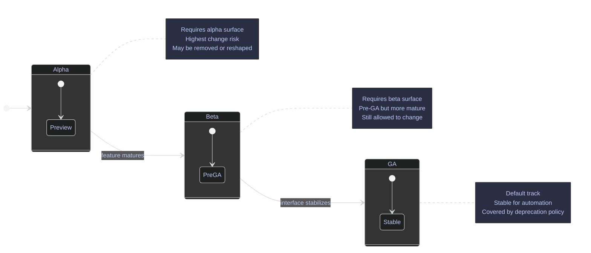

# gcloud Help and Discovery

> [!abstract]- Summary
> `gcloud` is a large command tree, and most operators only memorize a small subset of it. Effective CLI work depends on being able to discover commands quickly, read help pages efficiently, distinguish GA surfaces from beta and alpha tracks, and capture enough local environment detail to explain a failed invocation or support ticket.
>
> This note walks through help-tree navigation, topic references, release-track awareness, keyword discovery, and local diagnostic commands that expose the current SDK, account, project, and configuration context. All live outputs were captured on April 13, 2026 with Google Cloud SDK `563.0.0` while the active project was `bq-wh-nb`, so the examples reflect the current installed CLI state rather than abstract syntax alone.

> [!note]- Glossary
> **`gcloud help`**
>
> The main help command that prints a command help page or searches help text for matching terms.
>
> **`gcloud topic`**
>
> The supplementary-help command group for non-command concepts such as filters, formats, projections, and startup behavior.
>
> **release track**
>
> The maturity level of a `gcloud` command surface: GA, beta, or alpha.
>
> **GA**
>
> General availability. The stable release track intended for normal production use and covered by Google Cloud deprecation policy.
>
> **beta**
>
> Pre-GA command surface that is usable but still allowed to change before GA promotion.
>
> **alpha**
>
> Earliest preview command surface. Behavior, flags, and even command existence can change more aggressively than beta.
>
> **command group**
>
> A non-leaf node in the `gcloud` command tree, such as `compute`, `iam`, or `services`.
>
> **command**
>
> A leaf operation in the `gcloud` tree, such as `gcloud compute instances create`.
>
> **positional argument**
>
> A required or ordered argument that is supplied without a flag name, such as `INSTANCE_NAMES` in `gcloud compute instances create`.
>
> **flag**
>
> A named option passed as `--flag` or `--flag=value` that changes command behavior.
>
> **global flag**
>
> A flag available across many or all `gcloud` commands, such as `--project`, `--account`, `--format`, or `--verbosity`.
>
> **`gcloud info`**
>
> A local diagnostic command that prints installation, configuration, account, and environment details for the current SDK instance.
>
> **`gcloud cheat-sheet`**
>
> A curated quick-reference command that prints a compact roster of common `gcloud` commands by task area.
>
> **`gcloud feedback`**
>
> The support and feedback entry point that opens Google Cloud CLI support channels and can attach log context.
>
> **interactive mode**
>
> The beta `gcloud` shell experience that adds auto-completion, active help, command history, and context shortcuts.

## PowerShell / Linux

The core `gcloud` help, topic, release-track, and diagnostic commands are identical across PowerShell, Bash, and other shells. The only shell-specific behavior in this note appears in the help-search examples, where pager suppression had to be expressed with PowerShell environment-variable syntax to keep the search non-interactive in this terminal.

### gcloud | navigate the help tree

The `gcloud` help system is a tree. Top-level help shows major groups and standalone commands, group help shows the next level down, and a direct command help page explains one concrete operation in full. This tree-walking model is the fastest way to discover a command when you know the product area but not the exact verb.

#### Read the top-level help page

**When to run:** At the start of a session with an unfamiliar workstation, or any time you need to re-orient yourself inside the overall `gcloud` command tree.
**Trigger:** You know you need `gcloud`, but you do not yet know which command group contains the operation you want.
**Context:** Read-only local help command. It does not call project APIs or modify the active configuration.
**Purpose:** Show the top-level command grammar, global flags, major command groups, and built-in standalone commands.

*Print the opening section of the top-level `gcloud` help page.*

```bash
gcloud help
```

```text
NAME
    gcloud - manage Google Cloud resources and developer workflow

SYNOPSIS
    gcloud GROUP | COMMAND [--account=ACCOUNT]
        [--billing-project=BILLING_PROJECT] [--configuration=CONFIGURATION]
        [--flags-file=YAML_FILE] [--flatten=[KEY,...]] [--format=FORMAT]
        [--help] [--project=PROJECT_ID] [--quiet, -q]
        [--verbosity=VERBOSITY; default="warning"] [--version, -v] [-h]

DESCRIPTION
    The gcloud CLI manages authentication, local configuration, developer
    workflow, and interactions with the Google Cloud APIs.

    For a quick introduction to the gcloud CLI, a list of commonly used
    commands, and a look at how these commands are structured, run gcloud
    cheat-sheet or see the `gcloud` CLI cheat sheet.

GROUPS
    GROUP is one of the following:

     auth
        Manage oauth2 credentials for the Google Cloud CLI.

     compute
        Create and manipulate Compute Engine resources.

     config
        View and edit Google Cloud CLI properties.

     iam
        Manage IAM service accounts and keys.

     projects
        Create and manage project access policies.

     services
        List, enable and disable APIs and services.

     topic
        gcloud supplementary help.

COMMANDS
    COMMAND is one of the following:

     cheat-sheet
        Display gcloud cheat sheet.

     feedback
        Provide feedback to the Google Cloud CLI team.

     help
        Search gcloud help text.

     info
        Display information about the current gcloud environment.

     init
        Initialize or reinitialize gcloud.

     version
        Print version information for Google Cloud CLI components.
```

The two most important clues are the `GROUP | COMMAND` grammar in the synopsis and the separation between `GROUPS` and `COMMANDS`. If the thing you want is a product area, it will usually appear under `GROUPS`. If it is a root-level utility such as `info`, `help`, or `version`, it appears under `COMMANDS`.

#### Drill down from a product group to a resource subgroup

**When to run:** After you know the product area but still need to discover the resource families and verbs available under it.
**Trigger:** The top-level help confirms the right product group, but you still do not know the exact resource path.
**Context:** Read-only group help command.
**Purpose:** Show the next layer of the command tree so you can move from product area to a more specific resource collection.

*List the Compute Engine subgroups and direct commands.*

```bash
gcloud compute --help
```

```text
NAME
    gcloud compute - create and manipulate Compute Engine resources

SYNOPSIS
    gcloud compute GROUP | COMMAND [GCLOUD_WIDE_FLAG ...]

DESCRIPTION
    The gcloud compute command group lets you create, configure, and manipulate
    Compute Engine virtual machine (VM) instances.

GROUPS
    GROUP is one of the following:

     disks
        Read and manipulate Compute Engine disks.

     firewall-rules
        List, create, update, and delete Compute Engine firewall rules.

     images
        List, create, and delete Compute Engine images.

     instance-groups
        Read and manipulate Compute Engine instance groups.

     instances
        Read and manipulate Compute Engine virtual machine instances.

     networks
        List, create, and delete Compute Engine networks.

     snapshots
        List, describe, and delete Compute Engine snapshots.

     zones
        List Compute Engine zones.

COMMANDS
    COMMAND is one of the following:

     config-ssh
        Populate SSH config files with Host entries from each instance.

     scp
        Copy files to and from Google Compute Engine virtual machines via scp.

     ssh
        SSH into a virtual machine instance.
```

At this level the structure becomes operational. `instances` is a subgroup because it owns many verbs. `ssh` is already a concrete command because it is a leaf operation directly under `compute`.

#### Drill from a subgroup to the concrete verbs you can run

**When to run:** After the group page tells you which resource collection you need.
**Trigger:** You know the resource type, such as VM instances, but still need to discover the available verbs.
**Context:** Read-only subgroup help command.
**Purpose:** Show the resource-level verbs that can be executed directly, such as `list`, `describe`, `create`, and `delete`.

*List the verbs available under the Compute Engine instances subgroup.*

```bash
gcloud compute instances --help
```

```text
NAME
    gcloud compute instances - read and manipulate Compute Engine virtual
        machine instances

SYNOPSIS
    gcloud compute instances GROUP | COMMAND [GCLOUD_WIDE_FLAG ...]

DESCRIPTION
    Read and manipulate Compute Engine virtual machine instances.

GROUPS
    GROUP is one of the following:

     bulk
        Manipulate multiple Compute Engine virtual machines with single command
        executions.

     network-interfaces
        Read and manipulate Compute Engine instance network interfaces.

     ops-agents
        Manage Google Cloud Observability agents for Compute Engine VM
        instances.

COMMANDS
    COMMAND is one of the following:

     add-labels
        Add labels to Google Compute Engine virtual machine instances.

     create
        Create Compute Engine virtual machine instances.

     delete
        Delete Compute Engine virtual machine instances.

     describe
        Describe a virtual machine instance.

     get-serial-port-output
        Read output from a virtual machine instance's serial port.

     list
        List Compute Engine instances.
```

This is the point where tree navigation turns into command selection. If you are walking the tree manually, the next literal step is `gcloud compute instances create --help`. The direct help command below reaches the same destination in one hop.

#### Open a full command help page directly

**When to run:** When you already know the full command path and want the detailed manual page immediately.
**Trigger:** You need the synopsis, positional arguments, flags, examples, and notes for one leaf command.
**Context:** Read-only help command for a specific leaf command.
**Purpose:** Print the full manual page for the exact operation you are about to run.

*Open the full help page for the instance-creation command without manually traversing every tree level.*

```bash
gcloud help compute instances create
```

```text
NAME
    gcloud compute instances create - create Compute Engine virtual machine
        instances

SYNOPSIS
    gcloud compute instances create INSTANCE_NAMES [INSTANCE_NAMES ...]
        [--accelerator=[count=COUNT],[type=TYPE]] [--async]
        [--availability-domain=AVAILABILITY_DOMAIN]
        [--no-boot-disk-auto-delete]
        [--boot-disk-device-name=BOOT_DISK_DEVICE_NAME]
        [--boot-disk-interface=BOOT_DISK_INTERFACE]
        [--boot-disk-size=BOOT_DISK_SIZE] [--boot-disk-type=BOOT_DISK_TYPE]
        [--can-ip-forward] [--create-disk=[PROPERTY=VALUE,...]]
        [--csek-key-file=FILE] [--deletion-protection]
        [--description=DESCRIPTION]
        [--labels=[KEY=VALUE,...]] [--machine-type=MACHINE_TYPE]
        [--metadata=KEY=VALUE,[KEY=VALUE,...]]
        [--network=NETWORK] [--subnet=SUBNET] [--tags=TAG,[TAG,...]]
        [--zone=ZONE]
        [--address=ADDRESS | --no-address]
        [--image-project=IMAGE_PROJECT --image=IMAGE
          | --image-family=IMAGE_FAMILY | --source-snapshot=SOURCE_SNAPSHOT]
        [--scopes=[SCOPE,...] | --no-scopes]
        [--service-account=SERVICE_ACCOUNT | --no-service-account]
        [GCLOUD_WIDE_FLAG ...]

DESCRIPTION
    gcloud compute instances create facilitates the creation of Compute Engine
    virtual machines.

    When an instance is in RUNNING state and the system begins to boot, the
    instance creation is considered finished, and the command returns with a
    list of new virtual machines.

EXAMPLES
    To create an instance with the latest 'Red Hat Enterprise Linux 8' image
    available, run:

        $ gcloud compute instances create example-instance \
            --image-family=rhel-8 --image-project=rhel-cloud \
            --zone=us-central1-a

POSITIONAL ARGUMENTS
     INSTANCE_NAMES [INSTANCE_NAMES ...]
        Names of the instances to create.

FLAGS
     --async
        Return immediately, without waiting for the operation in progress to
        complete.

     --description=DESCRIPTION
        Specifies a textual description of the instances.

     --machine-type=MACHINE_TYPE
        Specifies the machine type to use for the instance.

GCLOUD WIDE FLAGS
    These flags are available to all commands: --access-token-file, --account,
    --billing-project, --configuration, --flags-file, --flatten, --format,
    --help, --impersonate-service-account, --log-http, --project, --quiet,
    --trace-token, --user-output-enabled, --verbosity.

NOTES
    These variants are also available:

        $ gcloud alpha compute instances create

        $ gcloud beta compute instances create
```

The direct help page is where execution details live. It defines the positional arguments, exposes the flag surface, and shows examples that often reveal the expected resource shape faster than the product documentation does.

#### Read the help output anatomy

**When to run:** After opening any non-trivial command help page.
**Trigger:** You need to parse the help page quickly instead of reading it top to bottom.
**Context:** This is an interpretation of the live help structure shown above.
**Purpose:** Turn the help page into a predictable checklist so you can find the relevant section immediately.

The major help sections have stable jobs:

| Section | What it tells you | Why it matters operationally |
|---|---|---|
| `NAME` | The exact command path and one-line purpose | Confirms you are reading the right manual page. |
| `SYNOPSIS` | The formal command grammar | Shows required positional arguments, optional flags, and mutually exclusive flag groups. |
| `DESCRIPTION` | The command's behavioral summary | Explains what the command actually does and when it returns. |
| `POSITIONAL ARGUMENTS` | Ordered non-flag inputs | Prevents malformed invocations when the command requires names or IDs in a fixed position. |
| `FLAGS` | Command-specific options | This is where most operational behavior is controlled. |
| `GCLOUD WIDE FLAGS` | Shared global flags such as `--project` and `--account` | Explains context overrides that work across many commands. |
| `EXAMPLES` | Example invocations | Often the fastest route to a correct first command. |
| `NOTES` | Track-specific variants, deprecation notes, or related surfaces | Useful when the same operation exists under alpha or beta. |

The search-oriented controls on `gcloud help` are separate from the structural page sections above:

| Operand or flag | Syntax | Description |
|---|---|---|
| command path | `gcloud help compute instances create` | Opens the help page for one specific command. |
| search separator | `gcloud help -- ssh` | Switches `gcloud help` into search mode instead of page-display mode. |
| `--filter` | `gcloud help --filter="relevance>0.8"` | Filters the returned help-search result rows. |
| `--limit` | `gcloud help --limit=20 -- project` | Increases or decreases the number of help-search results shown. |
| `--page-size` | `gcloud help --page-size=50 -- project` | Controls page size for result retrieval when paging is involved. |
| `--sort-by` | `gcloud help --sort-by=name -- project` | Sorts help-search results by a field other than the default relevance ordering. |

### gcloud | use the topic system for non-command references

The topic system covers concepts that do not belong to one leaf command: filters, formats, projections, startup behavior, escaping, and similar cross-cutting language rules. When you are asking "how does this syntax work?" rather than "what command should I run?", `gcloud topic` is usually the right reference surface.

#### See how the topic dispatcher behaves with no topic name

**When to run:** When you are testing what `gcloud topic` itself does in the installed SDK.
**Trigger:** You expect a list of topics and want to see the current no-argument behavior directly.
**Context:** Read-only local help dispatcher invocation.
**Purpose:** Show the actual SDK behavior when `gcloud topic` is run without a topic name.

*Run the bare topic dispatcher with no topic operand.*

```bash
gcloud topic
```

```text
ERROR: (gcloud.topic) Command name argument expected.

Available commands for gcloud topic:

      accessibility           Reference for `Accessibility` features.
      arg-files               Supplementary help for arg-files to be used with
                              *gcloud firebase test*.
      cli-trees               CLI trees supplementary help.
      client-certificate      Client certificate authorization supplementary
                              help.
      command-conventions     gcloud command conventions supplementary help.
      configurations          Supplementary help for named configurations.
      datetimes               Date/time input format supplementary help.
      endpoint-override       gcloud endpoint override supplementary help.
      escaping                List/dictionary-type argument escaping
                              supplementary help.
      filters                 Resource filters supplementary help.
      flags-file              --flags-file=YAML_FILE supplementary help.
      formats                 Resource formats supplementary help.
      gcloudignore            Reference for `.gcloudignore` files.
      offline-help            Setting up gcloud command offline help.
      projections             Resource projections supplementary help.
      resource-keys           Resource keys supplementary help.
      startup                 Supplementary help for gcloud startup options.
      uninstall               Supplementary help for uninstalling Google Cloud
                              CLI.
```

In SDK `563.0.0`, bare `gcloud topic` is a dispatcher, not a clean listing command. It returns an error because a topic name is missing, but the error still prints the currently available topics, which is enough to discover the topic namespace.

#### Read the filter language reference

**When to run:** Before writing a non-trivial `--filter` expression.
**Trigger:** You need authoritative syntax for Boolean operators, comparison operators, or server/client filtering behavior.
**Context:** Read-only local supplementary help command.
**Purpose:** Show the canonical filter-language reference used across `gcloud` list commands.

*Print the opening section of the filter reference.*

```bash
gcloud topic filters
```

```text
NAME
    gcloud topic filters - resource filters supplementary help

DESCRIPTION
    Most gcloud commands return a list of resources on success. By default they
    are pretty-printed on the standard output. The
    --format=NAME[ATTRIBUTES](PROJECTION) and --filter=EXPRESSION flags along
    with projections can be used to format and change the default output to a
    more meaningful result.

    Use the --format flag to change the default output format of a command. For
    details run $ gcloud topic formats.

    Use the --filter flag to select resources to be listed. Resource filters
    are described in detail below.

    Note: Depending on the specific server API, filtering may be done entirely
    by the client, entirely by the server, or by a combination of both.

  Filter Expressions
    A filter expression is a Boolean function that selects the resources to
    print from a list of resources. Expressions are composed of terms connected
    by logic operators.
```

This is the authoritative local reference for `--filter`. The most important operational warning is the client/server split: filtering can reduce server-side result volume for some APIs, but not for all of them.

#### Read the format language reference

**When to run:** Before building a custom `--format` expression.
**Trigger:** You remember that `table`, `json`, `value`, or `csv` exists, but not the exact projection grammar.
**Context:** Read-only local supplementary help command.
**Purpose:** Show the syntax model behind `--format` expressions.

*Print the opening section of the format reference.*

```bash
gcloud topic formats
```

```text
NAME
    gcloud topic formats - resource formats supplementary help

DESCRIPTION
    Most gcloud commands return a list of resources on success. By default they
    are pretty-printed on the standard output. The
    --format=NAME[ATTRIBUTES](PROJECTION) and --filter=EXPRESSION flags along
    with projections can be used to format and change the default output to a
    more meaningful result.

    Use the --format flag to change the default output format of a command.
    Resource formats are described in detail below.

  Formats
    A format expression is used to change the default output format of a
    command. Many output formats are available; some for pretty printing
    human-readable output and others for returning machine-readable output.

    A format expression has 3 parts:

     NAME
        name
```

The key sentence is that a format expression has named parts. Once you understand `NAME[ATTRIBUTES](PROJECTION)`, the entire output-formatting system becomes easier to reason about.

#### Read the projection and transform reference

**When to run:** When you know you need `--format`, but the missing piece is field-path selection or transform functions.
**Trigger:** The resource contains nested objects, repeated arrays, or verbose URIs that need trimming.
**Context:** Read-only local supplementary help command.
**Purpose:** Show how projections pick fields and how transforms rewrite values before printing them.

*Print the opening section of the projection reference.*

```bash
gcloud topic projections
```

```text
NAME
    gcloud topic projections - resource projections supplementary help

DESCRIPTION
    Most gcloud commands return a list of resources on success. By default they
    are pretty-printed on the standard output. The
    --format=NAME[ATTRIBUTES](PROJECTION) and --filter=EXPRESSION flags along
    with projections can be used to format and change the default output to a
    more meaningful result.

    Use projections to list a subset of resource keys in a resource. Resource
    projections are described in detail below.

  Projections
    A projection is a list of keys that selects resource data values.
    Projections are used in --format flag expressions. For example, the table
    format requires a projection that describes the table columns:

        table(name, network.ip.internal, network.ip.external, uri())

  Transforms
    A transform formats resource data values. Each projection key may have zero
    or more transform calls:
```

This is the command you want when you know the output language exists but cannot remember whether the right fix is a different field path, a transform function, or both.

#### Keep the other useful topics in reach

**When to run:** After you know that your question is cross-cutting rather than resource-specific.
**Trigger:** The problem is about startup behavior, escaping, file inclusion, or configuration semantics instead of one cloud resource.
**Context:** These are local supplementary help topics discoverable under `gcloud topic`.
**Purpose:** Map the remaining high-value topic pages to the operational questions they answer.

The most useful follow-on topics from the dispatcher output are:

| Topic | Command | What it helps with |
|---|---|---|
| configurations | `gcloud topic configurations` | Named configuration behavior, activation, and property scoping. |
| gcloudignore | `gcloud topic gcloudignore` | File exclusion semantics for deployments that honor `.gcloudignore`. |
| escaping | `gcloud topic escaping` | Escaping rules for list- and dictionary-style arguments. |
| resource-keys | `gcloud topic resource-keys` | The field-path language used for filters, projections, and flattening. |
| startup | `gcloud topic startup` | Startup properties, environment variables, and invocation behavior. |
| Operand or flag | Syntax | Description |
|---|---|---|
| topic operand | `gcloud topic filters` | Opens one specific supplementary help topic. |
| `--help` | `gcloud topic --help` | Lists available topic names cleanly without opening a specific topic page. |

### gcloud | understand GA, beta, and alpha release tracks

Release tracks are about command maturity, not about resource importance. The same product area can expose a stable GA surface for one operation and a preview beta or alpha surface for a newer one. Operators need to notice the track before they hard-code the command into automation.



#### Inspect the beta command tree

**When to run:** When you suspect a needed feature exists only outside GA.
**Trigger:** A GA command is missing a verb or flag that newer documentation or examples mention.
**Context:** Read-only help command for the beta release track.
**Purpose:** Show the beta root surface and confirm that the current SDK exposes a separate beta namespace.

*Print the opening section of the beta release-track help page.*

```bash
gcloud beta --help
```

```text
NAME
    gcloud beta - beta versions of gcloud commands

SYNOPSIS
    gcloud beta GROUP | COMMAND [--account=ACCOUNT]
        [--billing-project=BILLING_PROJECT] [--configuration=CONFIGURATION]
        [--flags-file=YAML_FILE] [--flatten=[KEY,...]] [--format=FORMAT]
        [--help] [--project=PROJECT_ID] [--quiet, -q]

DESCRIPTION
    (BETA) Beta versions of gcloud commands.
```

The beta root makes the track explicit in two places: the `NAME` line and the `(BETA)` marker in `DESCRIPTION`. That is the first stability signal to notice before copying a command into scripts.

#### Inspect the alpha command tree

**When to run:** When a feature appears to exist only in the earliest preview surface.
**Trigger:** GA and beta both lack the command shape you need, or documentation explicitly mentions an alpha command.
**Context:** Read-only help command for the alpha release track.
**Purpose:** Show the alpha root surface and confirm that the current SDK exposes an alpha namespace.

*Print the opening section of the alpha release-track help page.*

```bash
gcloud alpha --help
```

```text
NAME
    gcloud alpha - alpha versions of gcloud commands

SYNOPSIS
    gcloud alpha GROUP | COMMAND [--account=ACCOUNT]
        [--billing-project=BILLING_PROJECT] [--configuration=CONFIGURATION]
        [--flags-file=YAML_FILE] [--flatten=[KEY,...]] [--format=FORMAT]
        [--help] [--project=PROJECT_ID] [--quiet, -q]

DESCRIPTION
    (ALPHA) Alpha versions of gcloud commands.
```

Alpha is the strongest signal that the surface is preview-only. If a workflow depends on alpha, the default assumption should be that command shape and behavior may still move.

#### Recognize track markers inside command help

**When to run:** Before you operationalize a command whose stability you have not yet verified.
**Trigger:** You need to know whether the command page itself exposes GA/beta/alpha hints.
**Context:** Read-only command help page under the beta surface, plus the earlier GA page's `NOTES` block.
**Purpose:** Show how the installed SDK marks track information at the command-page level.

*Open the interactive-shell help page, which currently lives under the beta surface.*

```bash
gcloud beta interactive --help
```

```text
NAME
    gcloud beta interactive - start the gcloud interactive shell

SYNOPSIS
    gcloud beta interactive [--context=CONTEXT] [GCLOUD_WIDE_FLAG ...]

DESCRIPTION
    (BETA) gcloud beta interactive provides an enhanced bash(1) command line
    with features that include:

      o auto-completion and active help for all commands
      o state preservation across commands: cd, local/environment variables

  Display
    The gcloud beta interactive display window is divided into sections,
    described here from top to bottom.
```

The installed SDK marks track in two patterns. Track-only command pages, such as `gcloud beta interactive`, label themselves directly as `(BETA)` or `(ALPHA)`. GA pages often show track variants in `NOTES`, as the earlier `gcloud help compute instances create` page did when it listed matching alpha and beta variants.

> [!danger] Alpha and beta are poor defaults for production automation
>
> Preview commands can add, rename, or remove flags before GA promotion. That makes them a weak contract for unattended jobs, CI pipelines, and long-lived operator runbooks.

> [!success] Keep automation on GA unless the preview feature is the requirement
>
> Use GA for persistent scripts. Move to beta only when a required feature does not exist in GA, and treat alpha as lab-only unless you accept regular command-maintenance work.

The current installation already has preview components available. `gcloud info` reports both `alpha` and `beta` under `Installed Components`, which means this workstation can execute preview surfaces without additional installation work.

| Track | Invocation form | Stability expectation | Operational use |
|---|---|---|---|
| GA | `gcloud COMMAND` | Stable default surface | Production scripts, shared runbooks, repeated team workflows |
| beta | `gcloud beta COMMAND` | Pre-GA, still changeable | Feature evaluation, migration prep, controlled testing |
| alpha | `gcloud alpha COMMAND` | Earliest preview, highest churn | Experimentation, exploratory labs, short-lived proof of concept work |

### gcloud | inspect the local CLI environment before debugging

When a `gcloud` command fails, the first question is often not "what is the right flag?" but "what environment am I actually running in?" Version, installed components, active configuration, active account, and active project explain a large percentage of seemingly mysterious failures.

#### Print the full local environment summary

**When to run:** Before debugging an unexpected CLI behavior, and before filing a support ticket or internal incident note.
**Trigger:** A command behaves differently on two machines, or a teammate needs your exact SDK context.
**Context:** Read-only local diagnostic command.
**Purpose:** Capture installation, component, configuration, account, and runtime-environment details in one place.

*Print the current Cloud SDK environment summary.*

```bash
gcloud info
```

```text
Google Cloud SDK [563.0.0]

Platform: [Windows, x86_64] uname_result(system='Windows', node='Elysium', release='11', version='10.0.26200', machine='AMD64')
Python Version: [3.13.12 ...]
Python Location: [C:\Users\aperi\AppData\Local\Google\Cloud SDK\google-cloud-sdk\platform\bundledpython\python.exe]

Installation Root: [C:\Users\aperi\AppData\Local\Google\Cloud SDK\google-cloud-sdk]
Installed Components:
  alpha: [2026.03.27]
  beta: [2026.03.27]
  bq: [2.1.31]
  cloud-sql-proxy: [2.21.2]
  core: [2026.03.27]
  gsutil: [5.36]

Installation Properties: [C:\Users\aperi\AppData\Local\Google\Cloud SDK\google-cloud-sdk\properties]
User Config Directory: [C:\Users\aperi\AppData\Roaming\gcloud]
Active Configuration Name: [default]
Active Configuration Path: [C:\Users\aperi\AppData\Roaming\gcloud\configurations\config_default]

Account: [alexper.recovery@gmail.com]
Project: [bq-wh-nb]
Universe Domain: [googleapis.com]

Current Properties:
  [accessibility]
    screen_reader: [False] (property file)
  [core]
    account: [alexper.recovery@gmail.com] (property file)
    project: [bq-wh-nb] (property file)
  [run]
    region: [europe-west1] (property file)
```

This output is the fastest diagnostic snapshot in the note. It answers five operational questions at once:

| Area | Evidence in output | Why it matters |
|---|---|---|
| installation | `Google Cloud SDK [563.0.0]`, `Installation Root`, bundled Python path | Confirms exact SDK build and runtime path. |
| configuration | `User Config Directory`, `Active Configuration Name`, `Active Configuration Path` | Shows which on-disk config root and named profile are active. |
| account properties | `Account`, `Project`, and `Current Properties` | Confirms the effective authenticated principal and default project context. |
| accessibility | `[accessibility] screen_reader: [False]` | Shows whether accessibility-oriented rendering behavior is enabled. |
| network and proxy | no explicit proxy block appears in this output | Inference: the current SDK session is not exposing an explicit CLI proxy override here, which is consistent with direct network access. |

#### Print the exact component versions

**When to run:** When the problem might be version-specific, or when another operator asks which components are installed.
**Trigger:** You need a concise version block rather than the full environment dump from `gcloud info`.
**Context:** Read-only local diagnostic command.
**Purpose:** Print the SDK version and installed component versions in a compact support-friendly format.

*Print the Cloud SDK version and installed component versions.*

```bash
gcloud version
```

```text
Google Cloud SDK 563.0.0
alpha 2026.03.27
beta 2026.03.27
bq 2.1.31
cloud-sql-proxy 2.21.2
core 2026.03.27
gcloud-crc32c 1.0.0
gsutil 5.36
log-streaming 0.3.2
```

This is the version block you want in tickets, bug reports, and "works on my machine" comparisons. It is shorter than `gcloud info`, but it still proves whether preview components are installed.

#### Print the active property set

**When to run:** Before running any command that depends on implicit defaults such as project, account, region, or zone.
**Trigger:** You suspect that the wrong configuration is active or that a hidden property is steering command behavior.
**Context:** Read-only local configuration command.
**Purpose:** Show the current configuration properties that `gcloud` will inherit when flags are omitted.

*Print the currently active `gcloud` properties.*

```bash
gcloud config list
```

```text
[accessibility]
screen_reader = False
[core]
account = alexper.recovery@gmail.com
disable_usage_reporting = False
project = bq-wh-nb
[run]
region = europe-west1

Your active configuration is: [default]
```

This output confirms that the active named configuration is `default`, that the effective account is `alexper.recovery@gmail.com`, and that any unqualified command will target `bq-wh-nb` unless a flag overrides it.

#### Print the credentialed accounts and active principal

**When to run:** When you need to prove which identity is currently active.
**Trigger:** Authentication behavior looks wrong, or a command is failing with permission errors that might be tied to the wrong account.
**Context:** Read-only local credential inventory command.
**Purpose:** Show which accounts are credentialed locally and which one is currently active.

*List the locally credentialed accounts and mark the active one.*

```bash
gcloud auth list
```

```text
      Credentialed Accounts
ACTIVE  ACCOUNT
*       alexper.recovery@gmail.com

To set the active account, run:
    $ gcloud config set account `ACCOUNT`
```

This is the fastest identity check in the CLI. If the wrong account is active here, downstream permission failures are usually expected rather than surprising.

| Diagnostic command | What it proves | Best use |
|---|---|---|
| `gcloud info` | Full local installation and context snapshot | Support tickets, workstation drift, preview-component checks |
| `gcloud version` | Exact SDK and component versions | Fast version comparison between machines |
| `gcloud config list` | Effective local property set | Wrong-project or wrong-region debugging |
| `gcloud auth list` | Locally credentialed accounts and active principal | Identity and permission triage |

### gcloud | use interactive mode when static help is too slow

Interactive mode is a discovery shell, not a different API client. It wraps the same CLI with auto-completion, active help, persistent history, and context shortcuts so you can explore the tree faster than repeated manual `--help` invocations.

#### Inspect the interactive shell help page

**When to run:** When you are evaluating whether the interactive shell is worth enabling on a workstation.
**Trigger:** Tree navigation and repeated help lookups are slowing you down.
**Context:** Read-only help command for the beta interactive shell. Launching the real shell would take over the terminal, so `--help` is the correct live capture for a documentation note.
**Purpose:** Show the interactive shell's feature set, on-screen layout, and key bindings.

*Print the opening section of the interactive-shell help page.*

```bash
gcloud beta interactive --help
```

```text
NAME
    gcloud beta interactive - start the gcloud interactive shell

SYNOPSIS
    gcloud beta interactive [--context=CONTEXT] [GCLOUD_WIDE_FLAG ...]

DESCRIPTION
    (BETA) gcloud beta interactive provides an enhanced bash(1) command line
    with features that include:

      o auto-completion and active help for all commands
      o state preservation across commands: cd, local/environment variables

  Display
    The gcloud beta interactive display window is divided into sections,
    described here from top to bottom.

     Previous Output
        Command output scrolls above the command input section.

     Command Input
        Commands are typed, completed, and edited in this section.

     Active Help
        As you type, this section displays in-line help summaries for commands,
        flags, and arguments.

     Status Display
        Current gcloud project and account information, and function key
        descriptions and settings are displayed in this section.

         F2:help:STATE
            Toggles the active help section.

         F7:context
            Sets the context for command input.

         F8:web-help
            Opens a web browser tab/window to display the complete man page.

         F9:quit
            Exit.
```

The current help page is explicit about what interactive mode adds: inline help, command completion, context reuse, and stateful navigation. It also shows that the feature is still beta, which matters if you are deciding whether to standardize it across a team.

Interactive mode has two practical limitations. First, it is a beta surface rather than GA. Second, it is a terminal experience, so it is less useful in restricted shells, fully non-interactive automation, or environments where browser launch and full terminal control are undesirable.

| Feature or key | Meaning | Operational value |
|---|---|---|
| active help | Inline command, flag, and argument help as you type | Reduces context switching into separate help pages |
| tab completion | Dynamic completion for commands and many values | Speeds up discovery and reduces typos |
| `F7` context | Pre-populates a common command prefix | Useful when working in one product area for a while |
| `F8` web help | Opens the full command page in a browser | Faster deep-dive when inline help is too short |
| `F9` quit | Exits the interactive shell | Clean way to leave the session |

### gcloud | discover commands by keyword and quick references

Help-tree traversal is best when you know the product area. Keyword search and the cheat sheet are better when you only know a noun, a verb, or a concept such as SSH, service accounts, or projects. This is also the section where `gcloud feedback` becomes relevant: if discovery turns into a bug report, that command is the formal escalation path.

#### Search the help corpus by keyword

**When to run:** When you know the concept or protocol but not the product group or exact command path.
**Trigger:** You need all SSH-related commands, not just the first one that comes to mind.
**Context:** Read-only help-search command. In this PowerShell terminal, pager suppression was required to keep search output non-blocking.
**Purpose:** Search the local help corpus for commands whose documentation matches a search term.

> [!info] Pager suppression in this shell
>
> On this workstation, `gcloud help -- SEARCH_TERMS` waited on the pager until `CLOUDSDK_PAGER` and `PAGER` were cleared. The discovery pattern is still `gcloud help -- ssh`; only the environment-variable syntax is shell-specific.

*Search the local help corpus for SSH-related commands.*

```powershell
$env:CLOUDSDK_PAGER=''; $env:PAGER='cat'; gcloud help "--" ssh
```

```text
+----------------------------------+-------------------------------------------+
|             COMMAND              |                  SUMMARY                  |
+----------------------------------+-------------------------------------------+
| gcloud app instances SSH         | SSH into the VM of an App Engine Flexible |
|                                  | instance.                                 |
+----------------------------------+-------------------------------------------+
| gcloud bms SSH-keys              | Manage SSH keys for Bare Metal Solution.  |
+----------------------------------+-------------------------------------------+
| gcloud cloud-shell SSH           | Allows you to establish an interactive    |
|                                  | SSH session with Cloud Shell.             |
+----------------------------------+-------------------------------------------+
| gcloud compute config-SSH        | Populate SSH config files with Host       |
|                                  | entries from each instance.               |
+----------------------------------+-------------------------------------------+
| gcloud compute os-login SSH-keys | List, add, update, and remove OS Login    |
|                                  | SSH Keys.                                 |
+----------------------------------+-------------------------------------------+
Listed 5 of 73 items.
```

This search result is intentionally broad. It does not only search command names; it searches help text. That is why both access commands and SSH-key management commands appear together.

#### Search by resource type when the noun is all you know

**When to run:** When you know the resource family but not the owning product group.
**Trigger:** You want service-account commands, but do not remember whether they live under `auth`, `iam`, or a product-specific subgroup.
**Context:** Read-only help-search command with the same pager-suppression workaround as above.
**Purpose:** Discover commands related to a resource noun across the full CLI tree.

*Search the help corpus for service-account-related commands.*

```powershell
$env:CLOUDSDK_PAGER=''; $env:PAGER='cat'; gcloud help "--" service-account
```

```text
Listed 5 of 228 items.
+----------------------------------------------+-------------------------------+
|                   COMMAND                    |            SUMMARY            |
+----------------------------------------------+-------------------------------+
| gcloud access-approval SERVICE-ACCOUNT       | Manage Access Approval        |
|                                              | service account.              |
+----------------------------------------------+-------------------------------+
| gcloud auth activate-SERVICE-ACCOUNT         | Authorize access to Google    |
|                                              | Cloud with a service account. |
+----------------------------------------------+-------------------------------+
| gcloud builds get-default-SERVICE-ACCOUNT    | Get the default service       |
|                                              | account for a project.        |
+----------------------------------------------+-------------------------------+
| gcloud compute instances set-SERVICE-ACCOUNT | Set a service account and     |
|                                              | access scopes for a Compute   |
|                                              | Engine VM instance.           |
+----------------------------------------------+-------------------------------+
| gcloud iam SERVICE-ACCOUNTs                  | Create and manipulate service |
|                                              | accounts.                     |
+----------------------------------------------+-------------------------------+
```

This is the practical answer to "I do not know where service-account commands live." Search gives you cross-product matches and quickly reveals that the core account-management surface lives under `gcloud iam service-accounts`.

#### Use the built-in cheat sheet for quick recall

**When to run:** When you need fast recall of common commands instead of exhaustive manual pages.
**Trigger:** You remember the general workflow area, but not the exact everyday commands inside it.
**Context:** Read-only quick-reference command.
**Purpose:** Print a curated shortlist of common commands organized by operational task area.

*Print the opening section of the built-in `gcloud` cheat sheet.*

```bash
gcloud cheat-sheet
```

```text
NAME
    gcloud cheat-sheet - display gcloud cheat sheet

DESCRIPTION
    A roster of go-to gcloud commands for the gcloud tool, Google Cloud's
    primary command-line tool.

  Getting started
    Get going with the gcloud command-line tool

      o gcloud init: Initialize, authorize, and configure the gcloud tool.
      o gcloud version: Display version and installed components.
      o gcloud components install: Install specific components.
      o gcloud components update: Update your Google Cloud CLI to the latest
        version.
      o gcloud config set project: Set a default Google Cloud project to work
        on.
      o gcloud info: Display current gcloud tool environment details.

  Help
    Google Cloud CLI is happy to help

      o gcloud help: Search the gcloud tool reference documents for specific
        terms.
      o gcloud feedback: Provide feedback for the Google Cloud CLI team.
      o gcloud topic: Supplementary help material for non-command topics like
        accessibility, filtering, and formatting.

  Personalization
    Make the Google Cloud CLI your own; personalize your configuration with
    properties
```

The cheat sheet is intentionally curated rather than exhaustive. It is most useful when the operator knows the broad workflow area, such as setup, help, credentials, or projects, but does not want to search the full help corpus yet.

| Discovery pattern | Command | Strength | Limitation |
|---|---|---|---|
| tree navigation | `gcloud compute --help` | Best when you know the product area | Weak if you only know a generic noun |
| direct command help | `gcloud help compute instances create` | Fastest route to one manual page | Requires you to already know the full path |
| keyword search | `gcloud help "--" ssh` | Cross-cuts the whole CLI tree | Results can be broad and pager behavior may vary by shell |
| resource-noun search | `gcloud help "--" service-account` | Useful when you know the resource but not the product owner | Ranking may surface several related products |
| quick reference | `gcloud cheat-sheet` | Fast recall of common commands | Not exhaustive and not a substitute for full help |

## Related

- [gcloud-cli-setup](https://alp78.github.io/elysium/06-GCP/01-Core/00-gcloud-cli-setup) — Install the SDK, manage components, and verify the local CLI baseline
- [gcloud-authentication](https://alp78.github.io/elysium/06-GCP/01-Core/03-gcloud-authentication) — Understand which credentials `gcloud` is actually using when help output is not the problem
- [gcloud-configurations](https://alp78.github.io/elysium/06-GCP/01-Core/04-gcloud-configurations) — Inspect and switch the local configuration context that help examples will inherit
- [gcloud-output-formatting](https://alp78.github.io/elysium/06-GCP/01-Core/05-gcloud-output-formatting) — Use `--format`, `--filter`, and projections once discovery has identified the right command

## References

- [gcloud help reference](https://cloud.google.com/sdk/gcloud/reference/help)
- [gcloud topic reference](https://cloud.google.com/sdk/gcloud/reference/topic)
- [gcloud topic filters reference](https://cloud.google.com/sdk/gcloud/reference/topic/filters)
- [gcloud topic formats reference](https://cloud.google.com/sdk/gcloud/reference/topic/formats)
- [gcloud topic projections reference](https://cloud.google.com/sdk/gcloud/reference/topic/projections)
- [Google Cloud CLI components documentation](https://docs.cloud.google.com/sdk/docs/components)
- [Using gcloud interactive](https://docs.cloud.google.com/sdk/docs/interactive-gcloud)
- [Google Cloud CLI cheat sheet](https://docs.cloud.google.com/sdk/docs/cheatsheet)
