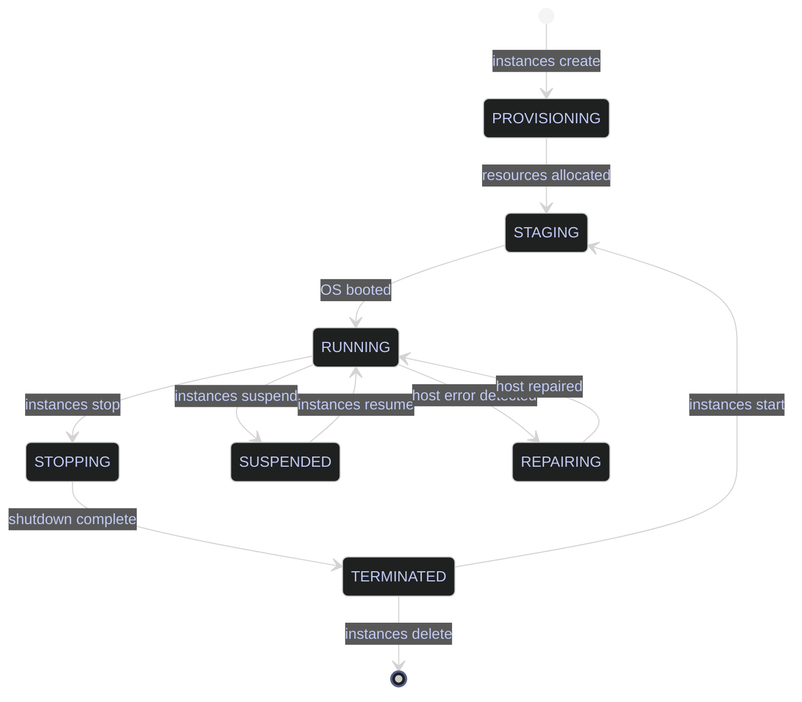

# VM Lifecycle

> [!quote]
> "I remember the days when I built my own gaming PCs. Eventually I sold out and bought an Xbox because I just wanted to play games, not build gaming rigs. Serverless is like that."
>
> — **Kelsey Hightower**, Twitter (2018)

> [!abstract]- Summary
>
> Documents the full Compute Engine VM lifecycle that was originally exercised against `stoxx-vm` in `bq-wh-nb`, from API enablement and IAM through creation, inspection, scheduling, right-sizing, Spot provisioning, and deletion.
>
> **Prerequisites**
> - Enable `compute.googleapis.com` and `monitoring.googleapis.com` before any lifecycle or metrics workflow
> - Grant `roles/logging.logWriter`, `roles/monitoring.metricWriter`, and `roles/monitoring.viewer` to the dedicated `bq-wh-sa` service account instead of relying on the default Compute Engine identity
> - Verify project IAM bindings and compare the one-time setup to Terraform `google_project_service` and `google_project_iam_member` resources
>
> **Instance creation**
> - Create `stoxx-vm` with explicit `--machine-type`, image family, boot disk, labels, tags, service account, `--scopes=cloud-platform`, `--metadata=enable-oslogin=true`, and `--no-address`
> - Attach startup scripts with `--metadata-from-file=startup-script=...` and treat them as root-level boot automation that reruns on every start
> - Compare the imperative `gcloud compute instances create` path with the `google_compute_instance` Terraform equivalent
>
> **Lifecycle operations**
> - Inspect instance details, state, disks, metadata, and attached identity, then use zonal `gcloud compute instances` commands to start, stop, suspend, resume, and delete VMs
> - Understand how VM status transitions, no-external-IP access, deletion protection, and disk auto-delete settings affect day-2 operations
>
> **Resizing and scheduling**
> - Resize machine types safely, including stop-before-resize workflows and family selection across `e2-*`, `n2-*`, `n2d-*`, `t2d-*`, `t2a-*`, `c2-*`, `c3-*`, `n4-*`, `m2-*`, and custom sizing
> - Create regional instance schedules with `gcloud compute resource-policies create instance-schedule`, attach them with `add-resource-policies`, and validate cron, timezone, and next-run status
> - Use the machine family reference to map dev/test, balanced production, CPU-bound, memory-heavy, and custom-fit workloads to the right sizing model
>
> **Spot VMs**
> - Provision discounted batch workers with `--provisioning-model=SPOT` and `--instance-termination-action`, and separate restartable jobs from stateful services that cannot tolerate preemption
>
> **Right-sizing**
> - Query CPU utilization through the Cloud Monitoring `timeSeries` API with OAuth bearer tokens and combine it with Ops Agent memory telemetry for sizing decisions
> - Apply utilization thresholds and cost comparisons to decide when to keep `e2-medium`, move to `n2-standard-4`, or resize again after representative workload cycles
>
> **Operations and safety**
> - Warnings: API enablement changes billable project state, startup scripts rerun on every boot, resize and delete actions are state-changing, schedules can restart stopped VMs on the next cron boundary, and Spot VMs can be preempted with 30 seconds of notice
> - Recommendations table: machine family guidance maps workload profiles to `e2`, `n2`, `n2d`, `t2d`, `t2a`, `c2`, `c3`, `n4`, `m2`, and custom sizing, and Terraform examples mirror the API, IAM, instance, and scheduling workflows

> [!warning] Live-run boundary
>
> The original Compute demo estate behind this note is no longer live. On `2026-04-15`, `gcloud projects describe bq-wh-nb` returned `lifecycleState: DELETE_REQUESTED`, and Compute Engine inventory commands against that project no longer return a usable VM estate.
>
> This refresh revalidated only read-only surfaces that still exist safely today, such as machine-type inventory in `dagflow-poc`. State-changing examples in this note, including create, start, stop, resize, schedule, Spot provisioning, and delete flows, are preserved as operator runbooks and were not rerun.

> [!note]- Glossary
>
> **Compute Engine**
> - Google Cloud's infrastructure-as-a-service platform for provisioning and managing virtual machines on Google-managed host hardware.
> - It is the control plane behind every VM lifecycle command in this note, including provisioning, scheduling, metrics, and deletion workflows.
>
> > [!info] Zonal and regional split
> >
> > VM instances are zonal resources, but several supporting objects such as subnets and schedule policies are regional. That is why this note alternates between `--zone` and `--region` depending on the resource being managed.
>
> ---
>
> **Instance**
> - A single Compute Engine virtual machine identified by project, zone, and instance name.
> - The note uses `stoxx-vm` as the concrete instance whose full lifecycle is created, inspected, resized, scheduled, and eventually deleted.
>
> > [!info] Instance name is local
> >
> > An instance name is only unique within its zone and project. Reusing a familiar name in another zone does not refer to the same VM.
>
> ---
>
> **Zone**
> - A specific deployment location inside a Google Cloud region where the VM's host hardware runs, such as `europe-west1-b`.
> - It matters because most instance lifecycle commands in this note are zonal and fail if the VM name is correct but the zone is wrong.
>
> > [!warning] Wrong zone, same name
> >
> > Many Compute Engine commands require `--zone` explicitly. Using the wrong zone makes a valid instance appear missing.
>
> ---
>
> **Region**
> - A geographic area that contains multiple zones and hosts regional services such as subnets and resource policies.
> - The note uses the region boundary for schedules, pricing context, and regional resources that support the zonal VM.
>
> > [!info] Policies attach across zones
> >
> > A regional policy such as an instance schedule can target zonal VMs as long as the VM's zone belongs to that region.
>
> ---
>
> **Machine type**
> - The predefined or custom CPU and memory shape assigned to a VM, such as `e2-medium` or `n2-standard-4`.
> - Machine type selection drives both performance and cost, so the note uses it for creation-time sizing, later resize operations, and right-sizing decisions.
>
> > [!warning] Resize changes billing
> >
> > Switching families or sizes changes the VM's hourly cost immediately. Sizing decisions should be based on utilization data rather than guesswork.
>
> ---
>
> **Boot disk**
> - The primary persistent disk that holds the operating system image for a VM and is usually created automatically during instance creation.
> - It matters because creation flags, disk-size warnings, auto-delete behavior, and final deletion workflows all depend on how the boot disk is configured.
>
> > [!warning] Image size is minimum
> >
> > The source image size is only the minimum disk size. Creating a larger boot disk often requires the guest OS to expand the filesystem on first boot.
>
> ---
>
> **Persistent disk**
> - Network-attached block storage that survives VM stops and can outlive VM deletion when auto-delete is disabled.
> - The note distinguishes persistent disk behavior from instance lifetime so readers understand what resize, schedule, and delete operations actually preserve.
>
> > [!info] VM and disk differ
> >
> > Stopping or deleting a VM does not always remove its data disks. Disk persistence is controlled separately from instance state.
>
> ---
>
> **Service account**
> - A non-human Google Cloud identity attached to a VM so software on the guest can call Google APIs.
> - The note uses the dedicated `bq-wh-sa` account as the real permission boundary for logging, monitoring, and data-platform access from `stoxx-vm`.
>
> > [!danger] Default identity is broad
> >
> > The default Compute Engine service account is often granted excessive project-wide roles. A compromised VM then inherits those permissions immediately.
>
> ---
>
> **Network tag**
> - A string label attached to a VM and evaluated by firewall rules to allow or deny traffic.
> - It matters because tags such as `sql-server` and `iap-ssh` are how the instance is targeted for traffic policy without relying on IP-specific rules.
>
> > [!warning] Not the same as labels
> >
> > Network tags affect firewall matching. Resource labels do not change network policy and cannot replace tags in firewall rules.
>
> ---
>
> **Label**
> - A key-value metadata pair used to organize, filter, and report on cloud resources.
> - The note uses labels such as `env=dev` and `app=stoxx-db` for billing views, filters, and workload grouping rather than network control.
>
> > [!info] Labels aid operations
> >
> > Good labels make inventory queries, cost attribution, and cleanup filters safer. They do not grant access or open traffic paths.
>
> ---
>
> **Metadata**
> - Key-value data attached to the VM instance and exposed to the guest environment through the metadata service.
> - In this note, metadata carries settings such as `enable-oslogin=true` and startup-script configuration that alter guest behavior at boot time.
>
> > [!warning] Metadata is operational input
> >
> > Metadata is not just descriptive text. Changes to metadata can change how the guest boots, authenticates, or initializes software.
>
> ---
>
> **Startup script**
> - A shell script provided through instance metadata and executed as root when the VM boots.
> - The note uses startup scripts to automate baseline package installation and initial host configuration without manual SSH intervention.
>
> > [!warning] Must be idempotent
> >
> > Startup scripts run on every boot, not only at first creation. Non-idempotent scripts can reinstall packages, duplicate state, or fail on later restarts.
>
> ---
>
> **OS Login**
> - A Compute Engine access model that uses IAM-managed identities for SSH authorization instead of project-wide SSH keys stored in metadata.
> - It matters here because the creation workflow enables `enable-oslogin=true` to tighten host access management for production-style VM administration.
>
> > [!info] IAM governs SSH entry
> >
> > With OS Login enabled, SSH access is tied to IAM permissions and user identities. This reduces the operational sprawl of unmanaged static SSH keys.
>
> ---
>
> **IAP**
> - Identity-Aware Proxy, which can tunnel administrative traffic such as SSH to internal-only VMs without assigning them external IP addresses.
> - The note relies on IAP so `stoxx-vm` can stay private while still remaining reachable for operator access.
>
> > [!warning] Private VM still needs path
> >
> > Removing the external IP improves security, but access still depends on the right IAP, firewall, and IAM configuration. A private VM is not automatically reachable.
>
> ---
>
> **Resource policy**
> - A Compute Engine object that defines reusable automated behavior such as instance schedules or snapshot schedules.
> - The note uses a regional resource policy to stop and start `stoxx-vm` on a business-hours timetable.
>
> > [!info] Policy and instance separate
> >
> > Creating a schedule policy does nothing until it is attached to an instance. Policy definition and policy binding are separate lifecycle steps.
>
> ---
>
> **Spot VM**
> - A discounted Compute Engine VM that uses surplus capacity and can be preempted by Google Cloud with short notice.
> - It matters because the note contrasts cheap, restartable batch workers with persistent stateful services that must not run on preemptible capacity.
>
> > [!danger] Preemption is abrupt
> >
> > Spot capacity can disappear with about 30 seconds of warning. Stateful services and write-heavy databases should not depend on that runtime model.
>
> ---
>
> **Ops Agent**
> - Google Cloud's guest agent for forwarding logs and publishing metrics from the VM into Cloud Logging and Cloud Monitoring.
> - The note depends on Ops Agent roles and telemetry because right-sizing and observability are incomplete without guest-level metrics.
>
> > [!warning] Memory data needs agent
> >
> > Compute Engine exposes basic host metrics automatically, but guest memory visibility typically depends on an installed and authorized Ops Agent.
>
> ---
>
> **Right-sizing**
> - The practice of adjusting VM size based on observed workload utilization instead of choosing CPU and memory allocations once and never revisiting them.
> - It matters because the note treats sizing as an operational loop driven by Monitoring API data, cost comparisons, and workload-specific thresholds.
>
> > [!info] Baseline before resizing
> >
> > A resize decision is only meaningful after a representative workload window. Idle or partial-cycle telemetry produces misleading recommendations.




## Prerequisites

Before creating VMs, the Compute Engine API must be enabled and the service account must have the correct IAM roles. These are one-time setup steps per project.

### GCP | API enablement and IAM provisioning

#### Enable the Compute Engine and Monitoring APIs

Before any `gcloud compute` or `gcloud monitoring` command in a project that has never used Compute Engine. It is typically triggered by first-time project setup, or `PERMISSION_DENIED: Compute Engine API has not been used in project` error. Runs as the authenticated user (must have `roles/serviceusage.serviceUsageAdmin` or `roles/owner` on the project). State-changing — enables billing for Compute Engine resources. Unlock the `compute.googleapis.com` and `monitoring.googleapis.com` APIs so VMs can be created and their metrics collected.

*Enable the Compute Engine API on the project.*

```bash
gcloud services enable compute.googleapis.com --project=bq-wh-nb
```

```text
Operation "operations/acf.p2-348557092514-dc31f48a-7797-42ce-983c-dac34d7ba40f" finished successfully.
```

*Enable the Cloud Monitoring API for metrics collection.*

```bash
gcloud services enable monitoring.googleapis.com --project=bq-wh-nb
```

#### Provision the service account with production IAM roles

After API enablement, before creating the first VM that will use this service account. It is typically triggered by setting up a production VM that needs to write logs, emit metrics, and read monitoring data for right-sizing. Runs as the authenticated user with `roles/resourcemanager.projectIamAdmin`. Each `add-iam-policy-binding` is state-changing and takes effect immediately. The service account `bq-wh-sa` is a dedicated pipeline identity — not the Compute Engine default service account, which has overly broad `roles/editor` permissions. Grant the minimum IAM roles required for a production SQL Server VM: structured logging via the Ops Agent, metrics emission for alerting and dashboards, and metrics read access for right-sizing analysis.

> [!warning] Never use the Compute Engine default service account in production
>
> The default service account (`PROJECT_NUMBER-compute@developer.gserviceaccount.com`) is granted `roles/editor` at project level — this gives the VM write access to nearly every resource in the project. A compromised VM with `roles/editor` can modify BigQuery datasets, delete Cloud Storage buckets, and escalate privileges.

> [!success] Use a dedicated service account with least-privilege roles
>
> Create or reuse a purpose-built service account (e.g., `bq-wh-sa`) and bind only the specific roles the VM needs. Each role below grants a narrow set of permissions — no broader project-level access.

The following three roles are required for a production VM running the Google Cloud Ops Agent (logging + monitoring):

| Role | Permissions granted | Why the VM needs it |
|---|---|---|
| `roles/logging.logWriter` | `logging.logEntries.create` | Ops Agent streams structured syslog, application logs, and SQL Server error logs to Cloud Logging |
| `roles/monitoring.metricWriter` | `monitoring.timeSeries.create` | Ops Agent emits CPU, memory, disk, and custom metrics to Cloud Monitoring |
| `roles/monitoring.viewer` | `monitoring.timeSeries.list`, `monitoring.metricDescriptors.list` | Allows querying metrics from the VM itself for right-sizing analysis and health checks |

*Grant the logging write role — required for the Ops Agent to stream logs.*

```bash
gcloud projects add-iam-policy-binding bq-wh-nb \
  --member="serviceAccount:bq-wh-sa@bq-wh-nb.iam.gserviceaccount.com" \
  --role="roles/logging.logWriter" \
  --condition=None
```

*Grant the monitoring write role — required for the Ops Agent to emit metrics.*

```bash
gcloud projects add-iam-policy-binding bq-wh-nb \
  --member="serviceAccount:bq-wh-sa@bq-wh-nb.iam.gserviceaccount.com" \
  --role="roles/monitoring.metricWriter" \
  --condition=None
```

*Grant the monitoring read role — required for right-sizing queries against the Monitoring API.*

```bash
gcloud projects add-iam-policy-binding bq-wh-nb \
  --member="serviceAccount:bq-wh-sa@bq-wh-nb.iam.gserviceaccount.com" \
  --role="roles/monitoring.viewer" \
  --condition=None
```

*Verify the final role set for the service account.*

```bash
gcloud projects get-iam-policy bq-wh-nb \
  --flatten="bindings[].members" \
  --filter="bindings.members:bq-wh-sa@bq-wh-nb.iam.gserviceaccount.com" \
  --format="table(bindings.role)"
```

```text
ROLE
roles/bigquery.admin
roles/datastore.owner
roles/datastore.user
roles/logging.logWriter
roles/monitoring.metricWriter
roles/monitoring.viewer
roles/storage.admin
roles/storage.objectUser
```

The pre-existing `roles/bigquery.admin` and `roles/storage.admin` roles support the stoxx data pipelines (BigQuery loads, GCS backup reads). The three new roles (`logWriter`, `metricWriter`, `monitoring.viewer`) complete the production VM requirements.

> [!example]- Terraform equivalent
>
> ```hcl
> # Enable required APIs
> resource "google_project_service" "compute" {
>   project = "bq-wh-nb"
>   service = "compute.googleapis.com"
> }
>
> resource "google_project_service" "monitoring" {
>   project = "bq-wh-nb"
>   service = "monitoring.googleapis.com"
> }
>
> # IAM bindings for the VM service account
> resource "google_project_iam_member" "sa_log_writer" {
>   project = "bq-wh-nb"
>   role    = "roles/logging.logWriter"
>   member  = "serviceAccount:bq-wh-sa@bq-wh-nb.iam.gserviceaccount.com"
> }
>
> resource "google_project_iam_member" "sa_metric_writer" {
>   project = "bq-wh-nb"
>   role    = "roles/monitoring.metricWriter"
>   member  = "serviceAccount:bq-wh-sa@bq-wh-nb.iam.gserviceaccount.com"
> }
>
> resource "google_project_iam_member" "sa_monitoring_viewer" {
>   project = "bq-wh-nb"
>   role    = "roles/monitoring.viewer"
>   member  = "serviceAccount:bq-wh-sa@bq-wh-nb.iam.gserviceaccount.com"
> }
> ```

| Flag | Syntax | Description |
|---|---|---|
| `--project` | `gcloud services enable ... --project=bq-wh-nb` | Target project for API enablement |
| `--member` | `--member="serviceAccount:EMAIL"` | The IAM principal receiving the role binding |
| `--role` | `--role="roles/logging.logWriter"` | The IAM role to grant |
| `--condition` | `--condition=None` | Unconditional binding (no conditions on when the role applies) |
| `--flatten` | `--flatten="bindings[].members"` | Flatten repeated `members` arrays for tabular output |
| `--filter` | `--filter="bindings.members:EMAIL"` | Filter IAM policy bindings to a specific principal |
| `--format` | `--format="table(bindings.role)"` | Extract and format specific fields from the policy response |

## Instance Creation

Compute Engine VMs are created with `gcloud compute instances create`. The command provisions the boot disk from the specified image, attaches the service account, configures networking, and starts the VM. Creation takes 30–60 seconds. Requires `roles/compute.instanceAdmin.v1` on the project or zone.

### GCP | gcloud compute instances | create VMs

#### Create the VM with explicit production configuration

When provisioning a new VM for a production or development workload. It is typically triggered by infrastructure setup for `stoxx-vm` — the SQL Server host for the `stoxx_db` database. Runs as the authenticated user. State-changing — creates a billable Compute Engine instance. The `--no-address` flag prevents assignment of an external IP — SSH access is via IAP tunnel only. Create `stoxx-vm` with the `e2-medium` machine type (initial sizing — will be resized to `n2-standard-4` after baseline metrics are collected), 50 GB balanced persistent disk, Ubuntu 22.04, and the `bq-wh-sa` service account.

> [!info]- Flag breakdown
>
> - `--machine-type=e2-medium` — 2 vCPU, 4 GB memory (cost-optimized initial sizing for baseline measurement)
> - `--image-family=ubuntu-2204-lts --image-project=ubuntu-os-cloud` — latest Ubuntu 22.04 LTS image from Google's public image catalog
> - `--boot-disk-size=50GB` — 50 GB boot disk (SQL Server data will use separate persistent disks)
> - `--boot-disk-type=pd-balanced` — SSD-backed balanced persistent disk (3,000 IOPS, 120 MB/s throughput at 50 GB)
> - `--tags=sql-server,iap-ssh` — network tags for firewall rules: `sql-server` allows port 1433 from internal sources, `iap-ssh` allows SSH via IAP tunnel
> - `--labels=env=dev,app=stoxx-db` — resource labels for billing filters and `--filter` queries
> - `--service-account` — attaches the `bq-wh-sa` identity (not the default compute SA)
> - `--scopes=cloud-platform` — grants the VM access to all GCP APIs, scoped by the service account's IAM roles (the SA roles are the actual permission boundary, not scopes)
> - `--metadata=enable-oslogin=true` — enables OS Login for SSH key management via IAM instead of project-level SSH keys
> - `--no-address` — no external IP address (production security posture — access via IAP only)

*Create `stoxx-vm` in `europe-west1-b` with production configuration.*

```bash
gcloud compute instances create stoxx-vm \
  --zone=europe-west1-b \
  --machine-type=e2-medium \
  --image-family=ubuntu-2204-lts \
  --image-project=ubuntu-os-cloud \
  --boot-disk-size=50GB \
  --boot-disk-type=pd-balanced \
  --tags=sql-server,iap-ssh \
  --labels=env=dev,app=stoxx-db \
  --service-account=bq-wh-sa@bq-wh-nb.iam.gserviceaccount.com \
  --scopes=cloud-platform \
  --metadata=enable-oslogin=true \
  --no-address
```

```text
Created [https://www.googleapis.com/compute/v1/projects/bq-wh-nb/zones/europe-west1-b/instances/stoxx-vm].
WARNING: Some requests generated warnings:
 - Disk size: '50 GB' is larger than image size: '10 GB'. You might need to resize the root repartition manually if the operating system does not support automatic resizing. See https://cloud.google.com/compute/docs/disks/add-persistent-disk#resize_pd for details.

NAME      ZONE            MACHINE_TYPE  PREEMPTIBLE  INTERNAL_IP  EXTERNAL_IP  STATUS
stoxx-vm  europe-west1-b  e2-medium                  10.132.0.2                RUNNING
```

The output confirms `stoxx-vm` is `RUNNING` in `europe-west1-b` with an internal IP of `10.132.0.2`, no external IP (as requested by `--no-address`), and the `e2-medium` machine type. The disk size warning is expected — Ubuntu 22.04 images are 10 GB, and the 50 GB disk will be auto-expanded by the OS on first boot.

#### Create a VM with a startup script

When the VM needs automated post-boot configuration — package installation, agent setup, or application initialization. It is typically triggered by provisioning a VM that must be ready to operate without manual SSH intervention after boot. Runs as the authenticated user. State-changing. The startup script executes as root on every boot (not just first boot) — idempotent scripts are essential. Demonstrate the `--metadata-from-file` flag for passing a startup script that installs baseline packages and logs completion.

The startup script (`startup.sh`) runs as root on every boot:

```bash
#!/bin/bash
set -euo pipefail
apt-get update -y
apt-get install -y curl wget gnupg lsb-release unattended-upgrades
echo "startup complete: $(date -u +%Y-%m-%dT%H:%M:%SZ)" >> /var/log/startup-status.log
```

*Create a VM with the startup script attached via metadata.*

```bash
gcloud compute instances create stoxx-vm-startup-demo \
  --zone=europe-west1-b \
  --machine-type=e2-micro \
  --image-family=ubuntu-2204-lts \
  --image-project=ubuntu-os-cloud \
  --boot-disk-size=10GB \
  --boot-disk-type=pd-balanced \
  --tags=iap-ssh \
  --labels=env=dev,app=stoxx-db \
  --service-account=bq-wh-sa@bq-wh-nb.iam.gserviceaccount.com \
  --scopes=cloud-platform \
  --metadata-from-file=startup-script=startup.sh \
  --no-address
```

```text
Created [https://www.googleapis.com/compute/v1/projects/bq-wh-nb/zones/europe-west1-b/instances/stoxx-vm-startup-demo].
NAME                   ZONE            MACHINE_TYPE  PREEMPTIBLE  INTERNAL_IP  EXTERNAL_IP  STATUS
stoxx-vm-startup-demo  europe-west1-b  e2-micro                   10.132.0.3                RUNNING
```

> [!tip] Startup script logs are available in Cloud Logging
>
> To check startup script execution: `gcloud compute instances get-serial-port-output stoxx-vm --zone=europe-west1-b | grep startup`. For production VMs, the Ops Agent forwards `/var/log/startup-status.log` to Cloud Logging automatically if configured in the agent's collection config.

> [!example]- Terraform equivalent
>
> ```hcl
> resource "google_compute_instance" "stoxx_vm" {
>   name         = "stoxx-vm"
>   machine_type = "e2-medium"
>   zone         = "europe-west1-b"
>
>   boot_disk {
>     initialize_params {
>       image = "ubuntu-os-cloud/ubuntu-2204-lts"
>       size  = 50
>       type  = "pd-balanced"
>     }
>   }
>
>   network_interface {
>     network = "default"
>     # No access_config block = no external IP
>   }
>
>   tags = ["sql-server", "iap-ssh"]
>
>   labels = {
>     env = "dev"
>     app = "stoxx-db"
>   }
>
>   service_account {
>     email  = "bq-wh-sa@bq-wh-nb.iam.gserviceaccount.com"
>     scopes = ["cloud-platform"]
>   }
>
>   metadata = {
>     enable-oslogin = "true"
>   }
>
>   # Startup script variant:
>   metadata_startup_script = file("startup.sh")
> }
> ```

| Flag | Syntax | Description |
|---|---|---|
| `--machine-type` | `--machine-type=e2-medium` | Predefined machine type (vCPU + memory combination) |
| `--image-family` | `--image-family=ubuntu-2204-lts` | Image family — resolves to the latest image in the family at creation time |
| `--image-project` | `--image-project=ubuntu-os-cloud` | Project hosting the public image catalog |
| `--boot-disk-size` | `--boot-disk-size=50GB` | Boot disk size (minimum is the image size, typically 10 GB) |
| `--boot-disk-type` | `--boot-disk-type=pd-balanced` | Disk type: `pd-standard` (HDD), `pd-balanced` (SSD), `pd-ssd` (high-IOPS SSD) |
| `--tags` | `--tags=sql-server,iap-ssh` | Network tags for firewall rule targeting |
| `--labels` | `--labels=env=dev,app=stoxx-db` | Key-value labels for resource organization and billing |
| `--service-account` | `--service-account=EMAIL` | Service account identity attached to the VM |
| `--scopes` | `--scopes=cloud-platform` | OAuth2 scopes for API access (IAM roles are the real boundary) |
| `--metadata` | `--metadata=enable-oslogin=true` | Instance metadata key-value pairs |
| `--metadata-from-file` | `--metadata-from-file=startup-script=startup.sh` | Load metadata value from a local file |
| `--no-address` | `--no-address` | Do not assign an external IP address |
| `--subnet` | `--subnet=SUBNET_NAME` | Specify a VPC subnet (defaults to the `default` subnet in the region) |
| `--can-ip-forward` | `--can-ip-forward` | Enable IP forwarding (required for NAT gateways and routers) |
| `--deletion-protection` | `--deletion-protection` | Prevent accidental deletion (must be disabled before `instances delete`) |
| `--shielded-secure-boot` | `--shielded-secure-boot` | Enable Secure Boot (verifies boot software signature — requires a compatible image) |

## Instance Inspection

Inspection commands are read-only — they query the Compute Engine API for the current state of VM resources. `instances list` returns a summary table; `instances describe` returns the full YAML resource representation; `--filter` and `--format` control what is returned and how.

### GCP | gcloud compute instances | list and describe

#### List all VM instances

To get a quick inventory of all VMs in the project with their status, zone, and machine type. It is typically triggered by routine audit, cost review, or verifying that a provisioning step completed. Read-only. Requires `compute.instances.list` permission (included in `roles/compute.viewer`). Display all VMs in `bq-wh-nb` with their key properties in a single table.

*List all VM instances in the current project.*

```bash
gcloud compute instances list
```

```text
NAME                   ZONE            MACHINE_TYPE  PREEMPTIBLE  INTERNAL_IP  EXTERNAL_IP  STATUS
stoxx-vm               europe-west1-b  e2-medium                  10.132.0.2                RUNNING
stoxx-vm-startup-demo  europe-west1-b  e2-micro                   10.132.0.3                RUNNING
```

The output shows two VMs — `stoxx-vm` (the production SQL Server host) and `stoxx-vm-startup-demo` (the startup-script demo). Both are `RUNNING` in `europe-west1-b` with no external IP (`EXTERNAL_IP` column is empty).

#### Describe a specific VM instance

When you need the full resource configuration — disk attachments, service account, network interfaces, labels, metadata, and scheduling options. It is typically triggered by auditing configuration, troubleshooting connectivity, extracting the attached service account, or verifying label and tag assignments. Read-only. Requires `compute.instances.get` permission. Returns YAML by default. Retrieve the complete resource definition for `stoxx-vm`.

*Describe `stoxx-vm` — key fields only (name, machineType, network, service account, disks, status, labels, metadata, tags, scheduling).*

```bash
gcloud compute instances describe stoxx-vm \
  --zone=europe-west1-b \
  --format="yaml(name,machineType,networkInterfaces,serviceAccounts,disks,status,labels,metadata,tags,scheduling)"
```

```text
disks:
- architecture: X86_64
  autoDelete: true
  boot: true
  deviceName: persistent-disk-0
  diskSizeGb: '50'
  interface: SCSI
  licenses:
  - https://www.googleapis.com/compute/v1/projects/ubuntu-os-cloud/global/licenses/ubuntu-2204-lts
  mode: READ_WRITE
  type: PERSISTENT
labels:
  app: stoxx-db
  env: dev
machineType: https://www.googleapis.com/compute/v1/projects/bq-wh-nb/zones/europe-west1-b/machineTypes/e2-medium
metadata:
  fingerprint: g4U9UJ7GphA=
  items:
  - key: enable-oslogin
    value: 'true'
name: stoxx-vm
networkInterfaces:
- name: nic0
  network: https://www.googleapis.com/compute/v1/projects/bq-wh-nb/global/networks/default
  networkIP: 10.132.0.2
  stackType: IPV4_ONLY
  subnetwork: https://www.googleapis.com/compute/v1/projects/bq-wh-nb/regions/europe-west1/subnetworks/default
scheduling:
  automaticRestart: true
  onHostMaintenance: MIGRATE
  preemptible: false
  provisioningModel: STANDARD
serviceAccounts:
- email: bq-wh-sa@bq-wh-nb.iam.gserviceaccount.com
  scopes:
  - https://www.googleapis.com/auth/cloud-platform
status: RUNNING
tags:
  items:
  - iap-ssh
  - sql-server
```

Key fields to verify: `serviceAccounts.email` is `bq-wh-sa` (not the default compute SA), `scheduling.provisioningModel` is `STANDARD` (not Spot), `autoDelete: true` on the boot disk (disk is deleted when the VM is deleted), and `networkInterfaces` shows only `networkIP` with no `accessConfigs` (confirming no external IP).

#### Filter and format VM listings

When scripting or when the project has many VMs and you need a filtered, formatted view. It is typically triggered by searching for VMs by status, label, or zone for operational scripts or reporting. Read-only. The `--filter` flag applies server-side filtering; `--format` reshapes the output. Demonstrate `--filter` and `--format` for extracting specific VM properties.

*List only running VMs with a formatted table showing name, zone, machine type, internal IP, and status.*

```bash
gcloud compute instances list \
  --filter="status=RUNNING" \
  --format="table(name,zone.basename(),machineType.basename(),networkInterfaces[0].networkIP,status)"
```

```text
NAME                   ZONE            MACHINE_TYPE  NETWORK_IP  STATUS
stoxx-vm               europe-west1-b  e2-medium     10.132.0.2  RUNNING
stoxx-vm-startup-demo  europe-west1-b  e2-micro      10.132.0.3  RUNNING
```

| Flag | Syntax | Description |
|---|---|---|
| `--zone` | `instances describe NAME --zone=ZONE` | Zone of the instance (required for `describe`) |
| `--zones` | `instances list --zones=europe-west1-b,europe-west1-c` | Filter `list` by one or more zones |
| `--filter` | `--filter="status=RUNNING"` | Server-side filter by field value — supports `AND`, `OR`, `labels.key=value` |
| `--format` | `--format="table(name,zone.basename(),status)"` | Output as table, JSON, YAML, CSV, or extracted fields |
| `--flatten` | `--flatten="networkInterfaces[].accessConfigs[]"` | Flatten repeated fields for `value()` extraction |
| `--sort-by` | `--sort-by=~creationTimestamp` | Sort results by field (`~` prefix for descending) |
| `--limit` | `--limit=10` | Limit number of results returned |

## Lifecycle Operations

Compute Engine exposes lifecycle operations as individual `gcloud compute instances` subcommands. `start` and `stop` are graceful operations — GCP sends an ACPI shutdown signal (equivalent to pressing the power button). `reset` is a hard reboot. `suspend` preserves VM memory to disk. Most operations complete within 60–120 seconds.

### GCP | gcloud compute instances | stop, start, reset, suspend, resume

#### Stop a VM instance

When a VM needs to be taken offline gracefully — for maintenance, resizing, or cost savings. It is typically triggered by scheduled maintenance window, machine type change (requires stopped state), or manual cost management. State-changing — transitions the VM from `RUNNING` → `STOPPING` → `TERMINATED`. Requires `compute.instances.stop`. Disk charges continue in `TERMINATED` state. Gracefully shut down `stoxx-vm` via ACPI signal.

*Stop `stoxx-vm` — sends an ACPI shutdown signal and waits for the VM to reach `TERMINATED` state.*

```bash
gcloud compute instances stop stoxx-vm --zone=europe-west1-b
```

```text
Stopping instance(s) stoxx-vm...done.
Updated [https://compute.googleapis.com/compute/v1/projects/bq-wh-nb/zones/europe-west1-b/instances/stoxx-vm].
```

> [!warning] Disk charges continue when stopped
>
> Stopping a VM eliminates vCPU and memory charges, but persistent disk storage charges continue at the same rate. A 50 GB `pd-balanced` disk costs ~$5/month whether the VM is running or stopped.

> [!success] Snapshot and delete for long-term suspension
>
> For VMs idle for more than a few days, create a snapshot with `gcloud compute disks snapshot`, then delete the VM and its disk. Recreate from the snapshot when needed. This eliminates both compute and disk charges for the suspension period.

#### Start a VM instance

To bring a stopped VM back online. It is typically triggered after a maintenance window, after a resize operation, or at the start of a scheduled work period. State-changing — transitions the VM from `TERMINATED` → `STAGING` → `RUNNING`. The VM gets a new internal IP (may differ from the previous one unless a static internal IP is reserved). Takes 60–90 seconds for the OS to boot. Start `stoxx-vm` and confirm the assigned internal IP.

*Start `stoxx-vm` and observe the assigned internal IP.*

```bash
gcloud compute instances start stoxx-vm --zone=europe-west1-b
```

```text
Starting instance(s) stoxx-vm...done.
Updated [https://compute.googleapis.com/compute/v1/projects/bq-wh-nb/zones/europe-west1-b/instances/stoxx-vm].
Instance internal IP is 10.132.0.2
```

#### Reset (hard reboot) a VM instance

When the VM is unresponsive to SSH and `stop` does not complete. It is typically triggered by VM hangs, kernel panic, or unresponsive OS — the "last resort" before deleting and recreating. State-changing — forces an immediate hardware reset without a clean shutdown. Does not send ACPI signal — equivalent to pulling the power cable and plugging it back in. File system corruption is possible if writes were in progress. Force-restart `stoxx-vm` when graceful shutdown is not possible.

*Hard-reset `stoxx-vm` — no clean shutdown, immediate reboot.*

```bash
gcloud compute instances reset stoxx-vm --zone=europe-west1-b
```

```text
Updated [https://www.googleapis.com/compute/v1/projects/bq-wh-nb/zones/europe-west1-b/instances/stoxx-vm].
```

> [!warning] Reset does not perform a clean shutdown
>
> `reset` is a hard reboot — in-flight writes to disk may be lost or corrupted. SQL Server databases should be shut down gracefully with `SHUTDOWN WITH NOWAIT` via SSH before resorting to `reset`.

> [!success] Always attempt graceful stop first
>
> Try `gcloud compute instances stop` first. If stop hangs for more than 5 minutes, check the serial console (`gcloud compute instances get-serial-port-output`) for kernel panics before resorting to `reset`.

#### Suspend a VM instance

When you want to pause a VM and preserve its in-memory state — faster resume than a full stop/start cycle. It is typically triggered by end-of-day pause for development VMs, or temporary pause during maintenance of dependent services. State-changing — transitions the VM from `RUNNING` → `SUSPENDING` → `SUSPENDED`. The VM's memory is written to disk. Suspended VMs incur disk charges for both the boot disk and the memory-state file. Not all machine types support suspend. Suspend `stoxx-vm` to preserve memory state for fast resume.

*Suspend `stoxx-vm` — memory is written to disk, VM enters `SUSPENDED` state.*

```bash
gcloud compute instances suspend stoxx-vm --zone=europe-west1-b
```

```text
Suspending instance(s) stoxx-vm...done.
Updated [https://compute.googleapis.com/compute/v1/projects/bq-wh-nb/zones/europe-west1-b/instances/stoxx-vm].
```

#### Resume a suspended VM instance

To bring a suspended VM back online with its previous memory state. It is typically triggered by start of work day, or dependent services are back online. State-changing — transitions `SUSPENDED` → `RUNNING`. Resume is faster than a cold boot because the OS does not need to reinitialize — the memory image is loaded from disk. Resume `stoxx-vm` from suspended state.

*Resume `stoxx-vm` — memory is restored from disk, VM enters `RUNNING` state.*

```bash
gcloud compute instances resume stoxx-vm --zone=europe-west1-b
```

```text
Resuming instance(s) stoxx-vm...done.
Updated [https://compute.googleapis.com/compute/v1/projects/bq-wh-nb/zones/europe-west1-b/instances/stoxx-vm].
```

| Flag | Syntax | Description |
|---|---|---|
| `--zone` | `--zone=europe-west1-b` | Zone of the instance (required for all lifecycle operations) |
| `--async` | `--async` | Return immediately without waiting for the operation to complete |
| `--discard-local-ssd` | `instances stop --discard-local-ssd=true` | Required when stopping a VM with local SSD — local SSD data is lost on stop |
| `--discard-local-ssd` | `instances suspend --discard-local-ssd=true` | Required when suspending a VM with local SSD |

## Resizing

The VM must be in `TERMINATED` state before changing machine type — you cannot resize a running VM. The resize workflow is: stop → set-machine-type → start. Machine type families are documented in the Machine Type Reference section below.

### GCP | gcloud compute instances | set-machine-type

#### Stop → resize → start workflow

When monitoring data shows the current machine type is over- or under-provisioned. It is typically triggered by right-sizing analysis indicates CPU peak is below 30% (downsize) or memory pressure is causing OOM kills (upsize). Requires the VM to be in `TERMINATED` state. State-changing — the new machine type takes effect on the next start. Downtime is required (typically 2–3 minutes total). Resize `stoxx-vm` from `e2-medium` (2 vCPU, 4 GB) to `n2-standard-4` (4 vCPU, 16 GB) — the target production size for SQL Server with the `stoxx_db` multi-filegroup layout.

*Step 1 — Stop the instance.*

```bash
gcloud compute instances stop stoxx-vm --zone=europe-west1-b
```

```text
Stopping instance(s) stoxx-vm...done.
Updated [https://compute.googleapis.com/compute/v1/projects/bq-wh-nb/zones/europe-west1-b/instances/stoxx-vm].
```

*Step 2 — Change the machine type to `n2-standard-4`.*

```bash
gcloud compute instances set-machine-type stoxx-vm \
  --zone=europe-west1-b \
  --machine-type=n2-standard-4
```

```text
Updated [https://www.googleapis.com/compute/v1/projects/bq-wh-nb/zones/europe-west1-b/instances/stoxx-vm].
```

*Step 3 — Start the instance with the new machine type.*

```bash
gcloud compute instances start stoxx-vm --zone=europe-west1-b
```

```text
Starting instance(s) stoxx-vm...done.
Updated [https://compute.googleapis.com/compute/v1/projects/bq-wh-nb/zones/europe-west1-b/instances/stoxx-vm].
Instance internal IP is 10.132.0.2
```

*Verify the resize took effect.*

```bash
gcloud compute instances describe stoxx-vm \
  --zone=europe-west1-b \
  --format="value(machineType.basename())"
```

```text
n2-standard-4
```

> [!warning] Resizing requires VM downtime
>
> The VM must be stopped before changing machine type. Plan resize operations during maintenance windows. For SQL Server VMs, ensure all connections are drained and the database is cleanly shut down before stopping.

> [!success] Verify with monitoring after resize
>
> After resizing, monitor CPU and memory utilization for at least one full workload cycle to confirm the new machine type is correctly sized. If peak CPU drops below 20%, the VM is still over-provisioned.

#### Custom machine types

When no predefined machine type matches the workload's exact CPU/memory requirements — avoids paying for unused resources. It is typically triggered by workload profiling shows a non-standard CPU-to-memory ratio (e.g., 6 vCPU with 24 GB — which is not available as a predefined type). Same stop → set → start workflow. Custom machine types cost approximately 5% more than equivalent predefined types per vCPU-hour, but avoid over-provisioning. Memory must be a multiple of 256 MB. Demonstrate custom machine type sizing.

*Set a custom machine type with 6 vCPUs and 24 GB memory (VM must be stopped).*

```bash
gcloud compute instances set-machine-type stoxx-vm \
  --zone=europe-west1-b \
  --custom-cpu=6 \
  --custom-memory=24GB
```

```text
Updated [https://www.googleapis.com/compute/v1/projects/bq-wh-nb/zones/europe-west1-b/instances/stoxx-vm].
```

*Verify the custom machine type.*

```bash
gcloud compute instances describe stoxx-vm \
  --zone=europe-west1-b \
  --format="value(machineType.basename())"
```

```text
custom-6-24576
```

The output `custom-6-24576` indicates 6 vCPUs and 24,576 MB (24 GB) of memory.

> [!example]- Terraform equivalent
>
> ```hcl
> # Predefined machine type
> resource "google_compute_instance" "stoxx_vm" {
>   name         = "stoxx-vm"
>   machine_type = "n2-standard-4"
>   zone         = "europe-west1-b"
>   # ... other attributes
> }
>
> # Custom machine type
> resource "google_compute_instance" "stoxx_vm_custom" {
>   name         = "stoxx-vm"
>   machine_type = "custom-6-24576"
>   zone         = "europe-west1-b"
>   # ... other attributes
> }
> ```

| Flag | Syntax | Description |
|---|---|---|
| `--machine-type` | `--machine-type=n2-standard-4` | Predefined machine type to apply |
| `--custom-cpu` | `--custom-cpu=6` | Number of vCPUs for a custom machine type |
| `--custom-memory` | `--custom-memory=24GB` | Memory for a custom machine type (must be a multiple of 256 MB) |
| `--custom-vm-type` | `--custom-vm-type=n2` | Machine type family for the custom configuration (defaults to `n1`) |
| `--zone` | `--zone=europe-west1-b` | Zone of the instance |

## Scheduled Start/Stop

Instance schedules are a Compute Engine resource policy (`compute.googleapis.com/resourcePolicies`) that attach to VMs and issue automatic start/stop commands on a cron schedule. The policy is regional — it must be created in the same region as the VM. If a VM only needs to run during business hours (14 hours/day × 5 days/week = 42% of total hours), scheduling start/stop saves approximately 58% of compute costs.

### GCP | gcloud compute resource-policies | instance schedules

#### Create an instance schedule resource policy

When a VM follows a predictable work schedule and does not need to run 24/7. It is typically triggered by cost review identifies VMs running during off-hours with near-zero utilization. State-changing — creates a regional resource policy. Requires `compute.resourcePolicies.create`. The policy operates independently of manual operations — if the VM is manually stopped, it will still be started at the next scheduled time. Create a business-hours schedule for `stoxx-vm` (Monday–Friday, 07:00–21:00 CET).

*Create the `stoxx-vm-schedule` resource policy with business-hours cron expressions.*

```bash
gcloud compute resource-policies create instance-schedule stoxx-vm-schedule \
  --region=europe-west1 \
  --vm-start-schedule="0 7 * * 1-5" \
  --vm-stop-schedule="0 21 * * 1-5" \
  --timezone="Europe/Paris" \
  --description="Business hours schedule for stoxx-vm (Mon-Fri 07:00-21:00 CET)"
```

```text
Created [https://www.googleapis.com/compute/v1/projects/bq-wh-nb/regions/europe-west1/resourcePolicies/stoxx-vm-schedule].
```

#### Attach the schedule to a VM

After creating the resource policy. It is typically triggered by immediately after `resource-policies create`, or when assigning an existing policy to a new VM. State-changing — binds the policy to the VM. The policy takes effect from the next matching cron time. Attach `stoxx-vm-schedule` to `stoxx-vm`.

*Attach the schedule policy to `stoxx-vm`.*

```bash
gcloud compute instances add-resource-policies stoxx-vm \
  --zone=europe-west1-b \
  --resource-policies=stoxx-vm-schedule
```

```text
Updated [https://www.googleapis.com/compute/v1/projects/bq-wh-nb/zones/europe-west1-b/instances/stoxx-vm].
```

#### List and describe the schedule policy

To verify the cron expressions, timezone, and next scheduled run time. It is typically triggered by routine audit, or investigating why a VM started or stopped unexpectedly. Read-only. Inspect the schedule policy configuration and upcoming execution time.

*List resource policies in the region.*

```bash
gcloud compute resource-policies list --filter="region:europe-west1"
```

```text
NAME               DESCRIPTION                                                     REGION                                                                        CREATION_TIMESTAMP
stoxx-vm-schedule  Business hours schedule for stoxx-vm (Mon-Fri 07:00-21:00 CET)  https://www.googleapis.com/compute/v1/projects/bq-wh-nb/regions/europe-west1  2026-04-12T11:22:43.609-07:00
```

*Describe the policy to see cron expressions and next run time.*

```bash
gcloud compute resource-policies describe stoxx-vm-schedule --region=europe-west1
```

```text
creationTimestamp: '2026-04-12T11:22:43.609-07:00'
description: Business hours schedule for stoxx-vm (Mon-Fri 07:00-21:00 CET)
id: '606651527908973596'
instanceSchedulePolicy:
  timeZone: Europe/Paris
  vmStartSchedule:
    schedule: 0 7 * * 1-5
  vmStopSchedule:
    schedule: 0 21 * * 1-5
kind: compute#resourcePolicy
name: stoxx-vm-schedule
region: https://www.googleapis.com/compute/v1/projects/bq-wh-nb/regions/europe-west1
resourceStatus:
  instanceSchedulePolicy:
    nextRunStartTime: '2026-04-13T05:00:00Z'
selfLink: https://www.googleapis.com/compute/v1/projects/bq-wh-nb/regions/europe-west1/resourcePolicies/stoxx-vm-schedule
status: READY
```

The `nextRunStartTime` of `2026-04-13T05:00:00Z` corresponds to Monday 07:00 Europe/Paris (UTC+2). The `status: READY` confirms the policy is active and bound.

> [!warning] Cost trap — forgotten always-on VMs
>
> A VM without a schedule running 24/7 on `n2-standard-4` costs ~$97/month. If the workload only runs during business hours (Mon–Fri 07:00–21:00), that's ~$56/month wasted on idle hours.

> [!success] Attach a schedule and save 58% on compute
>
> A business-hours schedule (14 hours/day × 5 days/week = 70 hours/week vs. 168 hours/week) reduces compute cost by 58%. The schedule operates independently — if the VM is manually stopped, it will still auto-start at the next cron time.

> [!example]- Terraform equivalent
>
> ```hcl
> resource "google_compute_resource_policy" "stoxx_vm_schedule" {
>   name   = "stoxx-vm-schedule"
>   region = "europe-west1"
>
>   description = "Business hours schedule for stoxx-vm (Mon-Fri 07:00-21:00 CET)"
>
>   instance_schedule_policy {
>     time_zone = "Europe/Paris"
>
>     vm_start_schedule {
>       schedule = "0 7 * * 1-5"
>     }
>
>     vm_stop_schedule {
>       schedule = "0 21 * * 1-5"
>     }
>   }
> }
>
> # Attach via the scheduling block in the instance resource
> resource "google_compute_instance" "stoxx_vm" {
>   name         = "stoxx-vm"
>   machine_type = "n2-standard-4"
>   zone         = "europe-west1-b"
>
>   resource_policies = [google_compute_resource_policy.stoxx_vm_schedule.id]
>
>   # ... other attributes
> }
> ```

| Flag | Syntax | Description |
|---|---|---|
| `--region` | `--region=europe-west1` | Region for the resource policy (must match the VM's region) |
| `--vm-start-schedule` | `--vm-start-schedule="0 7 * * 1-5"` | Cron expression for VM start time (5-field standard cron) |
| `--vm-stop-schedule` | `--vm-stop-schedule="0 21 * * 1-5"` | Cron expression for VM stop time |
| `--timezone` | `--timezone="Europe/Paris"` | IANA timezone string for cron interpretation |
| `--description` | `--description="..."` | Human-readable description of the policy |
| `--resource-policies` | `instances add-resource-policies --resource-policies=POLICY` | Name of the resource policy to attach to the VM |

## Spot VMs

Spot VMs are surplus Compute Engine capacity offered at up to 91% discount. They can be preempted (stopped or deleted) by GCP at any time with a 30-second notice — making them suitable for fault-tolerant batch jobs, ETL pipelines, and ML training, but not for stateful always-on services. Spot VMs replaced the legacy preemptible VM type — they have no hard 24-hour runtime limit, but preemption remains possible at any time.

### GCP | gcloud compute instances | Spot provisioning

#### Create a Spot VM

When provisioning a fault-tolerant batch worker that can tolerate preemption. It is typically triggered by batch ETL runs, BigQuery export workers, ML training jobs, or any workload that checkpoints and retries automatically. State-changing — creates a billable instance. The `PREEMPTIBLE` column shows `true` in `instances list` output. `--instance-termination-action=STOP` keeps the VM and disk for restart; `DELETE` destroys both on preemption. Create a Spot VM for batch workloads at up to 91% discount.

*Create `stoxx-batch-worker` as a Spot VM with stop-on-preemption behavior.*

```bash
gcloud compute instances create stoxx-batch-worker \
  --zone=europe-west1-b \
  --machine-type=n2-standard-4 \
  --image-family=ubuntu-2204-lts \
  --image-project=ubuntu-os-cloud \
  --boot-disk-size=20GB \
  --boot-disk-type=pd-standard \
  --provisioning-model=SPOT \
  --instance-termination-action=STOP \
  --labels=env=dev,app=stoxx-batch \
  --service-account=bq-wh-sa@bq-wh-nb.iam.gserviceaccount.com \
  --scopes=cloud-platform \
  --no-address
```

```text
Created [https://www.googleapis.com/compute/v1/projects/bq-wh-nb/zones/europe-west1-b/instances/stoxx-batch-worker].
NAME                ZONE            MACHINE_TYPE   PREEMPTIBLE  INTERNAL_IP  EXTERNAL_IP  STATUS
stoxx-batch-worker  europe-west1-b  n2-standard-4  true         10.132.0.4                RUNNING
```

The `PREEMPTIBLE: true` column confirms Spot provisioning. The Spot discount applies automatically — no separate pricing flag is needed.

> [!warning] Spot VMs are not suitable for stateful services
>
> SQL Server, Airflow schedulers, and any service that cannot tolerate abrupt shutdown should never run on Spot VMs. A preemption event during a write can cause data loss or corruption. Preemption gives only 30 seconds of warning.

> [!success] Use Spot VMs for batch ETL and ML training
>
> Batch ETL jobs, BigQuery export/import workers, and ML training runs are ideal Spot workloads — they are restartable, fault-tolerant, and savings reach up to 91% vs. standard pricing. Use `--instance-termination-action=STOP` to preserve the disk for restart.

| Flag | Syntax | Description |
|---|---|---|
| `--provisioning-model` | `--provisioning-model=SPOT` | Provisions as a Spot VM (preferred over the legacy `--preemptible` flag) |
| `--instance-termination-action` | `--instance-termination-action=STOP` | Action on preemption: `STOP` (preserves disk for restart) or `DELETE` (destroys VM and disk) |
| `--preemptible` | `--preemptible` | Legacy flag — creates a preemptible VM with a 24-hour hard runtime limit (use `--provisioning-model=SPOT` instead) |
| `--maintenance-policy` | `--maintenance-policy=TERMINATE` | Required for GPU/TPU VMs — host maintenance terminates rather than live-migrates |

## Right-Sizing

The most common waste in cloud data engineering is over-provisioned VMs. Right-sizing requires looking at actual utilization data, not guesses. CPU metrics are collected automatically by Compute Engine at 1-minute intervals; memory metrics require the Google Cloud Ops Agent installed on the VM. Requires `monitoring.googleapis.com` enabled and `roles/monitoring.viewer` on the service account or user.

### GCP | Cloud Monitoring API | CPU utilization metrics

#### Query CPU utilization via the Monitoring API

After the VM has been running a representative workload for at least 24 hours (ideally a full week). It is typically triggered by cost review, post-resize verification, or periodic right-sizing audit. Read-only API call. Requires `roles/monitoring.viewer`. The `instance_id` is the numeric VM ID (visible in `instances describe` output), not the VM name. Values are floats between `0.0` (0%) and `1.0` (100%) representing the fraction of allocated CPU consumed. Retrieve recent CPU utilization data points for `stoxx-vm` to determine if the current machine type is correctly sized.

> [!info]- API query breakdown
>
> - **Endpoint:** `GET /v3/projects/{project}/timeSeries`
> - **filter:** Selects the `instance/cpu/utilization` metric for a specific zone — use `resource.labels.instance_id` for a single VM
> - **interval.startTime / endTime:** Time window for the query (ISO 8601 format)
> - **pageSize:** Limits the number of data points returned per page
> - The response includes `points[].value.doubleValue` — each value represents the CPU utilization fraction at a 1-minute interval

*Query the last 30 minutes of CPU utilization for VMs in `europe-west1-b`.*

```bash
START_TIME=$(date -u -d '30 minutes ago' +%Y-%m-%dT%H:%M:%SZ)
END_TIME=$(date -u +%Y-%m-%dT%H:%M:%SZ)
FILTER='metric.type="compute.googleapis.com/instance/cpu/utilization" AND resource.labels.zone="europe-west1-b"'

curl -s -H "Authorization: Bearer $(gcloud auth print-access-token)" \
  "https://monitoring.googleapis.com/v3/projects/bq-wh-nb/timeSeries?filter=$(python3 -c "import urllib.parse; print(urllib.parse.quote('${FILTER}'))")&interval.startTime=${START_TIME}&interval.endTime=${END_TIME}&pageSize=5"
```

```text
{
    "timeSeries": [
        {
            "metric": {
                "labels": {
                    "instance_name": "stoxx-vm"
                },
                "type": "compute.googleapis.com/instance/cpu/utilization"
            },
            "resource": {
                "type": "gce_instance",
                "labels": {
                    "project_id": "bq-wh-nb",
                    "instance_id": "2262074147334414067",
                    "zone": "europe-west1-b"
                }
            },
            "metricKind": "GAUGE",
            "valueType": "DOUBLE",
            "points": [
                {
                    "interval": {
                        "startTime": "2026-04-12T18:21:00Z",
                        "endTime": "2026-04-12T18:21:00Z"
                    },
                    "value": {
                        "doubleValue": 0.01188993998042042
                    }
                },
                {
                    "interval": {
                        "startTime": "2026-04-12T18:20:00Z",
                        "endTime": "2026-04-12T18:20:00Z"
                    },
                    "value": {
                        "doubleValue": 0.0521418468199908
                    }
                },
                {
                    "interval": {
                        "startTime": "2026-04-12T18:19:00Z",
                        "endTime": "2026-04-12T18:19:00Z"
                    },
                    "value": {
                        "doubleValue": 0.0026320717915518563
                    }
                }
            ]
        }
    ],
    "unit": "10^2.%"
}
```

The CPU utilization values (`0.011`, `0.052`, `0.002`) show the VM is running at 1–5% CPU — expected for an idle VM with no active SQL Server workload. During a production ETL cycle, these values would spike to 40–70% on a correctly sized `n2-standard-4`.

> [!tip] Right-sizing rules of thumb
>
> - **Peak CPU < 30% sustained:** Over-provisioned — downsize to the next smaller machine type. Monitor for one full workload cycle after downsizing.
> - **Peak CPU > 80% sustained:** Under-provisioned — upsize before performance degrades. Check if the bottleneck is CPU or memory (use `free -h` on the VM).
> - **Memory < 60% used at peak:** Consider the next smaller memory tier. For SQL Server, check `max server memory` — the engine may be capped below what's available.
> - **Cost reference:** `e2-medium` (2 vCPU, 4 GB) costs ~$25/month. `n2-standard-4` (4 vCPU, 16 GB) costs ~$97/month. `n2-standard-8` (8 vCPU, 32 GB) costs ~$194/month. All prices are for `europe-west1` on-demand.

## Deleting a VM

Permanently removes a VM and, by default, also deletes the boot disk (if `autoDelete: true`, which is the default). Non-boot persistent disks are detached but not deleted unless `--delete-disks=all` is specified. This action is irreversible — ensure a disk snapshot exists before deleting if data must be preserved.

### GCP | gcloud compute instances | delete

#### Delete a VM instance

When the VM is no longer needed — decommissioned workload, replaced by a new instance, or cleanup after testing. It is typically triggered by end of lifecycle, post-migration cleanup, or resource policy deletion workflow. State-changing and irreversible. Requires `compute.instances.delete`. The command prompts for confirmation (use `--quiet` to skip in automation). Boot disk is deleted if `autoDelete: true`. Delete `stoxx-vm` and its boot disk.

*Delete `stoxx-vm` — the `--quiet` flag suppresses the confirmation prompt.*

```bash
gcloud compute instances delete stoxx-vm --zone=europe-west1-b --quiet
```

```text
Deleted [https://www.googleapis.com/compute/v1/projects/bq-wh-nb/zones/europe-west1-b/instances/stoxx-vm].
```

Without `--quiet`, the command shows the following confirmation prompt before proceeding:

```text
The following instances will be deleted. Attached disks configured to
be auto-deleted will be deleted unless they are attached to any other
instances or the `--keep-disks` flag is given and specifies them for
keeping. Deleting a disk is irreversible and any data on the disk
will be lost.
 - [stoxx-vm] in [europe-west1-b]

Do you want to continue (Y/n)?
```

> [!danger] Deletion is irreversible
>
> Once deleted, the VM and its auto-delete disks cannot be recovered. There is no "undo delete" in Compute Engine.

> [!success] Snapshot before deleting
>
> Always create a disk snapshot before deleting VMs with important data: `gcloud compute disks snapshot stoxx-vm --zone=europe-west1-b --snapshot-names=stoxx-vm-final`. The snapshot can be used to create a new disk and VM if needed.

| Flag | Syntax | Description |
|---|---|---|
| `--zone` | `--zone=europe-west1-b` | Zone of the instance |
| `--delete-disks` | `--delete-disks=all` | Delete all attached disks (boot + data) along with the VM |
| `--keep-disks` | `--keep-disks=all` | Keep all attached disks after deleting the VM (detaches but does not delete) |
| `--quiet` / `-q` | `--quiet` | Skip the confirmation prompt (for automation) |
| `--delete-disks=data` | `--delete-disks=data` | Delete only non-boot data disks |
| `--keep-disks=boot` | `--keep-disks=boot` | Keep only the boot disk |

## Machine Type Reference

Compute Engine offers predefined machine type families optimized for different workload profiles, plus fully custom sizing. Pricing varies by family, region, and whether Committed Use Discounts (CUDs) or Spot pricing apply.

> [!info] Current live catalog check
>
> The historical `stoxx-vm` estate is gone, but the regional machine-type catalog is still queryable. A live `gcloud compute machine-types list --project=dagflow-poc --zones=europe-west1-b --limit=15` run on `2026-04-15` returned:
>
> ```text
> NAME                   CPUS  MEMORY_GB  IS_SHARED_CPU
> a3-highgpu-1g          26    234.00     False
> a3-highgpu-2g          52    468.00     False
> a3-highgpu-4g          104   936.00     False
> a3-highgpu-8g          208   1872.00    False
> a3-megagpu-8g          208   1872.00    False
> a3-ultragpu-8g         224   2952.00    False
> a3-ultragpu-8g-nolssd  224   2952.00    False
> c2-standard-16         16    64.00      False
> c2-standard-30         30    120.00     False
> c2-standard-4          4     16.00      False
> c2-standard-60         60    240.00     False
> c2-standard-8          8     32.00      False
> c2d-highcpu-112        112   224.00     False
> c2d-highcpu-16         16    32.00      False
> c2d-highcpu-2          2     4.00       False
> ```
>
> Treat the family table below as the operator-facing selection guide, and use a fresh `machine-types list` in the target zone before pinning a new build to a specific SKU.

### Compute Engine machine type families

Selecting the right machine type family is the primary lever for balancing cost and performance. For data engineering workloads, `n2-*` is the default production choice; `e2-*` for dev/test; `c2-*` or `c3-*` for CPU-bound transforms.

| Family | Processor | Best for | Example |
|---|---|---|---|
| `e2-*` | Intel/AMD (variable) | Dev/test, burstable, cost-optimized | `e2-medium`, `e2-standard-2` |
| `n2-*` | Intel Cascade Lake | Balanced production workloads | `n2-standard-4`, `n2-standard-8` |
| `n2d-*` | AMD EPYC | Production, better price-per-core than `n2` | `n2d-standard-4`, `n2d-standard-8` |
| `t2d-*` | AMD EPYC Milan | Scale-out web, cost-sensitive stateless | `t2d-standard-4`, `t2d-standard-16` |
| `t2a-*` | Ampere Altra (ARM) | ARM-native workloads, web servers | `t2a-standard-4`, `t2a-standard-16` |
| `c2-*` | Intel Cascade Lake | CPU-intensive transforms, compute | `c2-standard-4`, `c2-standard-8` |
| `c3-*` | Intel Sapphire Rapids | Latest-gen compute, HPC, lower latency | `c3-standard-4`, `c3-standard-8` |
| `n4-*` | Intel Emerald Rapids | Latest-gen balanced, highest single-core perf | `n4-standard-4`, `n4-standard-8` |
| `m2-*` | Intel Cascade Lake | Large in-memory databases | `m2-ultramem-208` |
| Custom | Intel/AMD | Exact CPU/memory sizing (avoids over-provisioning) | `--custom-cpu=6 --custom-memory=20GB` |

## Related

- [vm-ssh-and-file-transfer](https://alp78.github.io/elysium/06-GCP/02-Compute/vm-ssh-and-file-transfer) — Accessing VMs after they are running
- [disks-and-snapshots](https://alp78.github.io/elysium/06-GCP/02-Compute/disks-and-snapshots) — Snapshotting before risky resize or upgrade operations
- [cloud-monitoring-metrics](https://alp78.github.io/elysium/06-GCP/Logging/cloud-monitoring-metrics) — Reading CPU and memory metrics for right-sizing decisions
- [gcloud-configurations](https://alp78.github.io/elysium/06-GCP/Core/gcloud-configurations) — Targeting the right project/zone before lifecycle operations
- [service-accounts-and-iam](https://alp78.github.io/elysium/06-GCP/Security/service-accounts-and-iam) — Service account attached to the VM controls what it can access
- [gcp-scheduling](https://alp78.github.io/elysium/12-Orchestration/Scheduling/gcp-scheduling) — Cloud Scheduler for triggering VM start/stop via HTTP or Pub/Sub
- [Terraform GCP Compute](https://alp78.github.io/elysium/07-Terraform/GCP/) — Provisioning Compute Engine VMs and resource policies via IaC
- [sql-server-on-compute-engine](https://alp78.github.io/elysium/06-GCP/02-Compute/04-sql-server-on-compute-engine) — Installing and configuring SQL Server on `stoxx-vm`

## References

- [Compute Engine machine families](https://cloud.google.com/compute/docs/machine-resource)
- [VM instance lifecycle](https://cloud.google.com/compute/docs/instances/instance-life-cycle)
- [Instance schedules](https://cloud.google.com/compute/docs/instances/schedule-instance-start-stop)
- [Spot VMs overview](https://cloud.google.com/compute/docs/instances/spot)
- [Right-sizing recommendations](https://cloud.google.com/compute/docs/instances/apply-sizing-recommendations-for-instances)
- [OS Login](https://cloud.google.com/compute/docs/instances/managing-instance-access)
- [IAP TCP forwarding](https://cloud.google.com/iap/docs/using-tcp-forwarding)
- [Cloud Monitoring API — timeSeries.list](https://cloud.google.com/monitoring/api/ref_v3/rest/v3/projects.timeSeries/list)
- [Service accounts best practices](https://cloud.google.com/iam/docs/best-practices-service-accounts)
