# VM SSH and File Transfer

> [!quote]
> "Amateurs hack systems, professionals hack people."
>
> — **Bruce Schneier**, *Secrets and Lies* (2000)
> [!abstract]- Summary
>
> Documents the private-VM access pattern that was originally validated against `stoxx-vm` in `bq-wh-nb`, using `gcloud compute ssh`, `gcloud compute scp`, `gcloud compute start-iap-tunnel`, and OS Login.
>
> **SSH access via IAP**
> - Use `gcloud compute ssh ... --tunnel-through-iap` for interactive shells, non-interactive `--command` runs, privileged diagnostics with `sudo`, and one-off `--project` overrides
> - Read OS Login-derived usernames, POSIX IDs, service state, kernel details, memory, disks, and filesystem output to confirm both identity and host health
>
> **File transfer via SCP**
> - Upload single files, download remote files, transfer multiple files, and copy directories recursively with `gcloud compute scp`
> - Use `/tmp/` as a staging area and follow with `sudo cp` and `sudo chown` when the real destination is owned by `root` or a service account
>
> **IAP tunnel architecture**
> - Trace how `gcloud` opens the tunnel to `tunnel.cloudproxy.app`, how IAM and firewall prerequisites gate access, and why the VM never needs a public IP for SSH or SCP
> - Forward local ports to private services with `gcloud compute start-iap-tunnel` or SSH `-L`, including local `1435` to remote SQL Server port `1433`
>
> **OS Login configuration**
> - Enable `enable-oslogin=TRUE` at project level, verify `commonInstanceMetadata.items`, inspect `gcloud compute os-login describe-profile`, and map Google identities to POSIX accounts
> - Compare IAM-bound OS Login with metadata-based SSH keys for identity binding, key lifecycle, 2FA support, auditability, and multi-project access
>
> **Operations and safety**
> - Warnings: IAP requires `roles/iap.tunnelResourceAccessor`, firewall access from `35.235.240.0/20`, correct OS Login roles, and separate ownership handling for remote file writes
> - Recommendations table: the OS Login comparison matrix contrasts identity binding, short-lived keys, 2FA, audit trail, multi-project behavior, and service-account limitations
> - Troubleshooting: 5 failure modes covering SSH timeouts, `Permission denied (publickey)`, slow SCP transfers, remote-path permission errors, and stale host keys after VM recreation

> [!warning] Live-run boundary
>
> The original VM behind these SSH and SCP examples is no longer available for rerun. On `2026-04-15`, the source project `bq-wh-nb` reported `lifecycleState: DELETE_REQUESTED`, so the `stoxx-vm` shell and file-transfer transcripts in this note remain historical operator examples.
>
> This refresh only reran read-only commands that still make sense without a live VM, especially `gcloud compute os-login describe-profile` and the current local `gcloud` help surfaces for `ssh`, `scp`, and `start-iap-tunnel`.

> [!note]- Glossary
>
> **IAP (Identity-Aware Proxy)**
> - A Google Cloud access layer that evaluates IAM identity and policy before permitting traffic to protected resources such as private Compute Engine VMs.
> - In this note, IAP is the security boundary that lets `stoxx-vm` stay off the public internet while still allowing authenticated SSH, SCP, and TCP forwarding.
>
> > [!info] Private does not mean unreachable
> >
> > IAP replaces public exposure with identity-gated access. The VM stays private, but it is still reachable through Google's proxy once IAM and firewall requirements are satisfied.
>
> ---
>
> **IAP tunnel**
> - An encrypted transport path from the local `gcloud` client through Google's proxy layer to the VM's private IP and target port.
> - It matters because every SSH, SCP, and forwarded-port example in this note depends on that tunnel rather than on direct ingress to the VM.
>
> > [!warning] Tunnel needs prerequisites
> >
> > The tunnel does not bypass misconfiguration. Missing IAM permissions, disabled APIs, or absent firewall rules will still prevent access.
>
> ---
>
> **`gcloud compute ssh`**
> - The Google Cloud CLI command that opens an SSH session or runs remote commands against a Compute Engine VM.
> - The note uses it for interactive administration, one-shot diagnostics, privileged `sudo` checks, and SSH-based port forwarding through IAP.
>
> > [!info] More than interactive shells
> >
> > `gcloud compute ssh` is also a remote-execution wrapper. `--command` turns it into a non-interactive automation tool rather than only a login experience.
>
> ---
>
> **OS Login**
> - A Compute Engine access model that maps IAM identities to POSIX users and manages short-lived SSH credentials for them.
> - It matters here because the VM access path is tied to the user's Google identity instead of to long-lived metadata keys distributed across instances.
>
> > [!warning] Roles still decide login
> >
> > Enabling OS Login alone does not grant shell access. The user also needs the appropriate IAM role such as `roles/compute.osLogin` or `roles/compute.osAdminLogin`.
>
> ---
>
> **Metadata-based SSH key**
> - A traditional SSH public key stored in project or instance metadata and matched to a username on the VM.
> - The note contrasts this legacy model with OS Login to show why persistent keys are less suitable for normal human access.
>
> > [!warning] Key lifecycle is manual
> >
> > Metadata keys remain valid until someone removes them. That makes cleanup, auditing, and user offboarding weaker than IAM-bound OS Login flows.
>
> ---
>
> **POSIX account**
> - The Linux user identity on the VM defined by a username, UID, GID, home directory, and group membership.
> - It matters because OS Login materializes the authenticated Google identity as a concrete Linux account that owns files and runs processes on the guest.
>
> > [!info] Username is derived
> >
> > OS Login derives the Linux username from the Google identity, typically replacing `@` and `.` with underscores. That mapping explains usernames such as `alexper_recovery_gmail_com`.
>
> ---
>
> **`gcloud compute scp`**
> - The Google Cloud CLI command that copies files between a local machine and a Compute Engine VM over SSH.
> - The note uses it for uploads, downloads, multi-file transfers, and recursive directory copies that all travel through the same IAP-backed access path.
>
> > [!warning] Remote path permissions apply
> >
> > `gcloud compute scp` authenticates as your VM user, not as `root`. A target directory can still reject the write even when the tunnel and authentication are correct.
>
> ---
>
> **SCP**
> - Secure Copy Protocol, a file-transfer protocol that operates over SSH.
> - It matters in this note because `gcloud compute scp` wraps SCP semantics while handling the GCP-specific identity and tunneling details for you.
>
> > [!info] Same trust path as SSH
> >
> > SCP is not a separate access plane here. It reuses the same SSH and IAP trust path as the shell sessions.
>
> ---
>
> **Serial console**
> - A text console exposed through the VM's virtual serial port, independent of normal network SSH access.
> - It matters as the fallback access method when guest networking, SSH configuration, or the operating system itself prevents standard SSH logins.
>
> > [!warning] Use as break-glass path
> >
> > Serial console access is mainly for recovery scenarios. It is most valuable when normal SSH is broken, not as the default administration workflow.
>
> ---
>
> **Port forwarding**
> - A tunneling pattern that binds a local TCP port and relays traffic to a port on the remote VM.
> - The note uses it to reach SQL Server on `stoxx-vm` from local tools without exposing the database port publicly.
>
> > [!info] Local client stays unchanged
> >
> > With port forwarding active, the local application still connects to `localhost`. The tunnel handles the translation to the VM's private service port.
>
> ---
>
> **`gcloud compute start-iap-tunnel`**
> - The Google Cloud CLI command that opens a raw TCP tunnel through IAP to a chosen VM port.
> - It matters because it supports non-SSH protocols such as SQL Server while preserving the same private-network and IAM-controlled access model.
>
> > [!warning] Tunnel stays foregrounded
> >
> > The command keeps running until you terminate it. Closing the process immediately tears down access for any local client using the forwarded port.
>
> ---
>
> **WebSocket tunnel**
> - The underlying transport IAP uses between the local client and Google's proxy endpoint for TCP forwarding.
> - It matters because it explains why private-port access can work over standard outbound connectivity from the local workstation without opening inbound SSH on the VM.
>
> > [!info] Proxy endpoint is fixed
> >
> > The client connects to Google's IAP endpoint, not directly to the VM. Google then forwards the traffic internally to the guest network interface.


## SSH Access via IAP

`gcloud compute ssh` is the standard method for connecting to Compute Engine VMs. All access routes through Google's Identity-Aware Proxy (IAP), which authenticates your `gcloud` credentials against IAM before establishing the tunnel — no firewall rules exposing SSH to the public internet are required.

### gcloud compute ssh | connect to a VM

Connects to a Compute Engine VM over an IAP tunnel using your `gcloud` identity. The IAP proxy terminates the public connection and forwards traffic internally to the VM's private IP on the target port (default: 22).

#### Interactive SSH session

When you need a shell on the VM for interactive debugging, package installation, or service inspection. It is typically triggered by first access after VM creation, troubleshooting a running workload, or manual maintenance. Runs from a local terminal with `gcloud` authenticated. The `--tunnel-through-iap` flag routes the connection through Google's internal network. Read-only from the perspective of the tunnel — the SSH session itself is read-write on the VM. Establish an interactive shell on `stoxx-vm` without requiring the VM to have a public IP address.

*Open an interactive SSH session on `stoxx-vm` through IAP.*

```bash
gcloud compute ssh stoxx-vm --zone=europe-west1-b --tunnel-through-iap
```

```text
Welcome to Ubuntu 22.04.5 LTS (GNU/Linux 6.8.0-1048-gcp x86_64)

 * Documentation:  https://help.ubuntu.com
 * Management:     https://landscape.canonical.com
 * Support:        https://ubuntu.com/pro

 System information as of Sun Apr 12 18:52:16 UTC 2026

  System load:  0.06              Processes:             119
  Usage of /:   4.6% of 48.27GB   Users logged in:       0
  Memory usage: 6%                IPv4 address for ens4: 10.132.0.8
  Swap usage:   0%

alexper_recovery_gmail_com@stoxx-vm:~$
```

The banner shows Ubuntu 22.04.5 LTS running on a GCP-optimized kernel (`6.8.0-1048-gcp`). The `ens4` interface has private IP `10.132.0.8` — no external IP exists. The OS Login username `alexper_recovery_gmail_com` is derived from the authenticated Google identity, confirming OS Login is active (not a metadata-based SSH key).

> [!tip] No Public IP Required
>
> Using `--tunnel-through-iap` means the VM can have no external IP address at all. This eliminates an entire attack surface — the VM is completely unreachable from the public internet, yet you can still SSH into it using your `gcloud` credentials. The `stoxx-vm` was created with `--no-address` specifically for this reason.

#### Remote command execution

When you need to inspect VM resources or run a health check without starting an interactive session. It is typically triggered by automated monitoring scripts, CI/CD pipelines, or quick diagnostic one-liners. The `--command` flag runs the string in a non-interactive shell and returns stdout to the caller. The session terminates after the command completes. Chain multiple commands with `&&` so each runs only if the previous succeeded. Retrieve system information, memory, disk layout, and block devices from `stoxx-vm` in a single invocation.

*Run a chained diagnostic command on `stoxx-vm` to inspect hostname, kernel, memory, disk usage, and block device layout.*

```bash
gcloud compute ssh stoxx-vm --zone=europe-west1-b --tunnel-through-iap \
  --command="hostname && uname -a && free -h && df -h && lsblk"
```

```text
stoxx-vm
Linux stoxx-vm 6.8.0-1048-gcp #51~22.04.1-Ubuntu SMP Wed Feb 11 02:58:49 UTC 2026 x86_64 x86_64 x86_64 GNU/Linux
               total        used        free      shared  buff/cache   available
Mem:           3.8Gi       272Mi       3.3Gi       0.0Ki       273Mi       3.3Gi
Swap:             0B          0B          0B
Filesystem      Size  Used Avail Use% Mounted on
/dev/root        49G  2.2G   47G   5% /
tmpfs           2.0G     0  2.0G   0% /dev/shm
tmpfs           783M  956K  782M   1% /run
tmpfs           5.0M     0  5.0M   0% /run/lock
efivarfs        256K   18K  234K   8% /sys/firmware/efi/efivars
/dev/sda15      105M  6.1M   99M   6% /boot/efi
tmpfs           392M  4.0K  392M   1% /run/user/1137701540
NAME    MAJ:MIN RM   SIZE RO TYPE MOUNTPOINTS
loop0     7:0    0  63.8M  1 loop /snap/core20/2717
loop1     7:1    0    74M  1 loop /snap/core22/2339
loop2     7:2    0 435.2M  1 loop /snap/google-cloud-cli/436
loop3     7:3    0  91.7M  1 loop /snap/lxd/38469
loop4     7:4    0  48.1M  1 loop /snap/snapd/25935
sda       8:0    0    50G  0 disk 
├─sda1    8:1    0  49.9G  0 part /
├─sda14   8:14   0     4M  0 part 
└─sda15   8:15   0   106M  0 part /boot/efi
```

The `e2-medium` machine type provides 3.8 GiB RAM with no swap configured. The 50 GB `pd-balanced` boot disk (`sda`) is partitioned into a 49.9 GB root partition (`sda1`) with 5% used (2.2 GB), a 4 MB BIOS boot partition (`sda14`), and a 106 MB EFI partition (`sda15`). The `tmpfs` at `/run/user/1137701540` is the per-user tmpfs for the OS Login UID. Five snap-based loop devices are mounted for core Ubuntu packages and the `google-cloud-cli`. When additional persistent disks are attached (see [disks-and-snapshots](https://alp78.github.io/elysium/06-GCP/Compute/disks-and-snapshots)), they appear as `sdb`, `sdc`, etc. in the `lsblk` output.

#### Remote command with sudo

When the diagnostic requires root privileges — inspecting running services, reading protected logs, or modifying system configuration. It is typically triggered by service health verification, post-deployment smoke test, or investigating a failed startup script. `sudo` inside `--command` runs the command as root on the VM. OS Login users with `roles/compute.osAdminLogin` have passwordless sudo; users with `roles/compute.osLogin` do not. List all running systemd services on `stoxx-vm` to verify the expected baseline after boot.

*List all active systemd services on `stoxx-vm` using sudo.*

```bash
gcloud compute ssh stoxx-vm --zone=europe-west1-b --tunnel-through-iap \
  --command="sudo systemctl list-units --type=service --state=running"
```

```text
  UNIT                          LOAD   ACTIVE SUB     DESCRIPTION
  chrony.service                loaded active running chrony, an NTP client/server
  cron.service                  loaded active running Regular background program processing daemon
  dbus.service                  loaded active running D-Bus System Message Bus
  getty@tty1.service            loaded active running Getty on tty1
  google-guest-agent.service    loaded active running Google Compute Engine Guest Agent
  google-osconfig-agent.service loaded active running Google OSConfig Agent
  multipathd.service            loaded active running Device-Mapper Multipath Device Controller
  networkd-dispatcher.service   loaded active running Dispatcher daemon for systemd-networkd
  polkit.service                loaded active running Authorization Manager
  rsyslog.service               loaded active running System Logging Service
  serial-getty@ttyS0.service    loaded active running Serial Getty on ttyS0
  snapd.service                 loaded active running Snap Daemon
  ssh.service                   loaded active running OpenBSD Secure Shell server
  systemd-journald.service      loaded active running Journal Service
  systemd-logind.service        loaded active running User Login Management
  systemd-networkd.service      loaded active running Network Configuration
  systemd-resolved.service      loaded active running Network Name Resolution
  systemd-udevd.service         loaded active running Rule-based Manager for Device Events and Files
  ubuntu-advantage.service      loaded active running Ubuntu Pro Background Auto Attach
  unattended-upgrades.service   loaded active running Unattended Upgrades Shutdown
  user@1137701540.service       loaded active running User Manager for UID 1137701540

21 loaded units listed.
```

21 services are running on the baseline Ubuntu 22.04 image. Key GCP-specific services: `google-guest-agent.service` (manages metadata, network interfaces, and accounts), `google-osconfig-agent.service` (applies OS policies and patch management), and `serial-getty@ttyS0.service` (enables serial console access as a fallback when SSH is unreachable). The `ssh.service` confirms the OpenSSH server is running and accepting connections on port 22. The `user@1137701540.service` is the per-user systemd manager for the OS Login UID.

#### SSH with project override

When your active `gcloud` configuration points to a different project and you need to SSH into a VM in `bq-wh-nb` without switching configurations. It is typically triggered by multi-project environments where VMs are spread across projects. The `--project` flag overrides the active project for this command only. All other flags behave identically. Reach `stoxx-vm` from a session configured for a different project.

*SSH into `stoxx-vm` with an explicit project override.*

```bash
gcloud compute ssh stoxx-vm --zone=europe-west1-b --tunnel-through-iap \
  --project=bq-wh-nb \
  --command="whoami && id"
```

```text
alexper_recovery_gmail_com
uid=1137701540(alexper_recovery_gmail_com) gid=1137701540(alexper_recovery_gmail_com) groups=1137701540(alexper_recovery_gmail_com)
```

The `--project=bq-wh-nb` flag targets the correct project regardless of the active `gcloud` configuration. The output confirms OS Login is mapping the Google identity to UID `1137701540` — the same UID visible in the systemd output above.

> [!info] OS Login vs Metadata-Based SSH Keys
>
> GCP offers two SSH key management models:
>
> - **OS Login** (recommended): binds VM access to IAM identities. SSH keys are short-lived and automatically managed by `gcloud`. Users are created as POSIX accounts derived from their Google identity (e.g., `alexper_recovery_gmail_com`). Supports 2FA via `enable-oslogin-2fa=true`. Enabled via `enable-oslogin=true` in project or instance metadata.
> - **Metadata-based keys**: traditional SSH public keys stored in project or instance metadata. Each key grants access to any VM in scope. Keys persist until manually removed and are not tied to IAM identity or lifecycle.
>
> OS Login is the production standard. Metadata-based keys remain useful for service accounts or environments where OS Login is not available.

| Flag | Syntax | Description |
|---|---|---|
| `--zone` | `--zone=europe-west1-b` | Zone where the VM is located. Required unless a default zone is set in `gcloud config`. |
| `--tunnel-through-iap` | `--tunnel-through-iap` | Route SSH through IAP — the VM does not need a public IP address. |
| `--command` | `--command="<cmd>"` | Run a command non-interactively and exit. Stdout is returned to the caller. |
| `--port` | `--port=22` | SSH port on the VM. Default: 22. |
| `--ssh-key-expiry` | `--ssh-key-expiry=1h` | Lifetime of the temporary SSH key when using OS Login. Default: 5 minutes. |
| `--project` | `--project=bq-wh-nb` | Override the active `gcloud` project for this command only. |
| `--ssh-flag` | `--ssh-flag="-v"` | Pass additional flags to the underlying SSH client (e.g., `-v` for verbose, `-L` for port forwarding). |
| `--internal-ip` | `--internal-ip` | Connect directly to the VM's internal IP (requires VPN or same-VPC connectivity). Mutually exclusive with `--tunnel-through-iap`. |

## File Transfer via SCP

`gcloud compute scp` wraps SCP over the IAP tunnel, allowing you to copy files between your local machine and a VM without the VM needing a public IP. The `hostname:path` convention mirrors standard `scp` syntax — the remote side is prefixed with the VM name. The transfer patterns here complement the general [data-transfer](https://alp78.github.io/elysium/01-Shell/File-Operations/data-transfer) commands.

> [!warning] Keep shell startup files quiet for SCP
>
> `scp` and other non-interactive SSH flows are brittle if `.bashrc`, `.profile`, or similar startup files print banners, prompts, or debug text. Extra output on startup can corrupt the protocol stream and turn a valid tunnel into a hanging or failed transfer.

### gcloud compute scp | copy files to and from a VM

Securely copies files between a local machine and a Compute Engine VM over the IAP tunnel using the same credential model as `gcloud compute ssh`. The `hostname:` prefix on a path designates the remote side — omitting it means local.

#### Upload a single file

When deploying a script, config, or data file to the VM for execution or processing. It is typically triggered by initial provisioning, deploying updated SQL schemas, or uploading configuration files. The source path is local, the destination is prefixed with the VM name. The destination directory must be writable by the OS Login user — use `/tmp/` when unsure. Copy `bronze_schema.sql` from the local `ESG/db/ddl/` directory to `/tmp/` on `stoxx-vm`.

*Upload `bronze_schema.sql` to `/tmp/` on `stoxx-vm`.*

```bash
gcloud compute scp ~/DEV/ESG/db/ddl/bronze_schema.sql stoxx-vm:/tmp/ \
  --zone=europe-west1-b --tunnel-through-iap
```

```text
bronze_schema.sql         | 12 kB |  12.8 kB/s | ETA: 00:00:00 | 100%
```

The progress bar shows the file name, bytes transferred, transfer rate, and completion percentage. The 12.8 kB file was uploaded over the IAP tunnel in under one second.

#### Download a file from VM

When retrieving logs, configuration snapshots, or data files from the VM. It is typically triggered by collecting diagnostics, backing up configuration before changes, or pulling processed output. The source is prefixed with the VM name (remote), the destination is a local path. The file must be readable by the OS Login user on the VM. Download the `/etc/os-release` file from `stoxx-vm` to verify the OS version locally.

*Download `/etc/os-release` from `stoxx-vm` to the local `/tmp/` directory.*

```bash
gcloud compute scp stoxx-vm:/etc/os-release /tmp/os-release-stoxx \
  --zone=europe-west1-b --tunnel-through-iap
```

```text
os-release-stoxx          | 0 kB |   0.4 kB/s | ETA: 00:00:00 | 100%
```

The small file (400 bytes) contains the Ubuntu release metadata:

```text
PRETTY_NAME="Ubuntu 22.04.5 LTS"
NAME="Ubuntu"
VERSION_ID="22.04"
VERSION="22.04.5 LTS (Jammy Jellyfish)"
VERSION_CODENAME=jammy
ID=ubuntu
ID_LIKE=debian
```

#### Upload multiple files

When deploying several related files (e.g., a set of SQL DDL scripts) to the VM in a single invocation. It is typically triggered by batch deployment of schema files, configuration updates, or multi-file patches. List all source files sequentially before the destination. The destination must be a directory on the VM, not a file path. Copy `bronze_schema.sql` and `silver_schema.sql` to `/tmp/` on `stoxx-vm` in one command.

*Upload two DDL scripts to `/tmp/` on `stoxx-vm` in a single invocation.*

```bash
gcloud compute scp ~/DEV/ESG/db/ddl/bronze_schema.sql ~/DEV/ESG/db/ddl/silver_schema.sql \
  stoxx-vm:/tmp/ --zone=europe-west1-b --tunnel-through-iap
```

```text
bronze_schema.sql         | 12 kB |  12.8 kB/s | ETA: 00:00:00 | 100%
silver_schema.sql         |  5 kB |   5.7 kB/s | ETA: 00:00:00 | 100%
```

Both files are transferred sequentially over the same IAP tunnel connection. Each file shows its own progress line.

#### Recursive directory copy

When deploying an entire directory tree (e.g., a DDL folder, a configuration directory) to the VM. It is typically triggered by initial provisioning, full schema deployment, or syncing a local project directory. The `--recurse` flag is required when the source is a directory — omitting it results in an error. The target directory must already exist on the VM. Copy the entire `db/ddl/` directory (4 SQL files) to `/tmp/ddl/` on `stoxx-vm`.

> [!warning] Target Directory Must Exist on the VM
>
> `gcloud compute scp --recurse` does not create the target directory automatically. If the target path does not exist, the transfer fails with `unable to open` errors. Create the directory first with `gcloud compute ssh --command="mkdir -p /tmp/ddl"`.

> [!success] Create the Target Directory Before Recursive Copy
>
> Always run `mkdir -p` on the VM before a recursive SCP:
> ```bash
> gcloud compute ssh stoxx-vm --zone=europe-west1-b --tunnel-through-iap \
>   --command="mkdir -p /tmp/ddl"
> ```

*Recursively copy the `ddl/` directory (4 SQL files) to `/tmp/ddl/` on `stoxx-vm`.*

```bash
gcloud compute scp --recurse ~/DEV/ESG/db/ddl/ stoxx-vm:/tmp/ddl/ \
  --zone=europe-west1-b --tunnel-through-iap
```

```text
bronze_schema.sql         | 12 kB |  12.8 kB/s | ETA: 00:00:00 | 100%
drop_index.sql            |  1 kB |   1.7 kB/s | ETA: 00:00:00 | 100%
gold_schema.sql           |  7 kB |   7.5 kB/s | ETA: 00:00:00 | 100%
silver_schema.sql         |  5 kB |   5.7 kB/s | ETA: 00:00:00 | 100%
```

All four files (`bronze_schema.sql`, `drop_index.sql`, `gold_schema.sql`, `silver_schema.sql`) are transferred. Verification on the VM:

```bash
gcloud compute ssh stoxx-vm --zone=europe-west1-b --tunnel-through-iap \
  --command="ls -la /tmp/ddl/"
```

```text
total 44
drwxrwxr-x  2 alexper_recovery_gmail_com alexper_recovery_gmail_com  4096 Apr 12 18:50 .
drwxrwxrwt 12 root                       root                        4096 Apr 12 18:50 ..
-rw-rw-r--  1 alexper_recovery_gmail_com alexper_recovery_gmail_com 13064 Apr 12 18:50 bronze_schema.sql
-rw-rw-r--  1 alexper_recovery_gmail_com alexper_recovery_gmail_com  1750 Apr 12 18:50 drop_index.sql
-rw-rw-r--  1 alexper_recovery_gmail_com alexper_recovery_gmail_com  7703 Apr 12 18:50 gold_schema.sql
-rw-rw-r--  1 alexper_recovery_gmail_com alexper_recovery_gmail_com  5838 Apr 12 18:50 silver_schema.sql
```

Files are owned by the OS Login user (`alexper_recovery_gmail_com`) with group-writable permissions. The parent `/tmp/` is world-writable (`drwxrwxrwt`) as expected.

#### Permission workaround — SCP to /tmp then sudo cp

When the target directory on the VM is owned by root or a service user and your OS Login user does not have write access. It is typically triggered by deploying files to `/opt/`, `/etc/`, or any directory not owned by your user. `gcloud compute scp` authenticates as your OS Login user. Directories owned by root (e.g., `/opt/stoxx/ddl/`) will reject writes. The workaround is a two-step process: SCP to `/tmp/` (world-writable), then SSH with `sudo cp` to move the file and `sudo chown` to set ownership. Deploy `bronze_schema.sql` to `/opt/stoxx/ddl/` on `stoxx-vm`, a root-owned directory.

> [!warning] SCP Fails When Target Directory Is Not Owned by Your User
>
> If the destination is owned by root or a service user, `gcloud compute scp` will fail with a `permission denied` error. Attempting to SCP directly to `/opt/stoxx/ddl/` will fail because the directory is owned by root.

> [!success] SCP to /tmp First, Then sudo cp to Target
>
> Always SCP files to `/tmp/` (world-writable) first, then SSH in and use `sudo cp` to move them to the restricted destination. Follow with `sudo chown` to set the correct ownership.

**Step 1** — SCP the file to `/tmp/` on the VM:

*Upload `bronze_schema.sql` to `/tmp/` as a staging area.*

```bash
gcloud compute scp ~/DEV/ESG/db/ddl/bronze_schema.sql stoxx-vm:/tmp/ \
  --zone=europe-west1-b --tunnel-through-iap
```

```text
bronze_schema.sql         | 12 kB |  12.8 kB/s | ETA: 00:00:00 | 100%
```

**Step 2** — SSH in and use `sudo` to create the target directory, copy the file, and set ownership:

*Create `/opt/stoxx/ddl/`, copy the file from `/tmp/`, and set root ownership.*

```bash
gcloud compute ssh stoxx-vm --zone=europe-west1-b --tunnel-through-iap \
  --command="sudo mkdir -p /opt/stoxx/ddl && sudo cp /tmp/bronze_schema.sql /opt/stoxx/ddl/ && sudo chown root:root /opt/stoxx/ddl/bronze_schema.sql && ls -la /opt/stoxx/ddl/"
```

```text
total 24
drwxr-xr-x 2 root root  4096 Apr 12 18:50 .
drwxr-xr-x 3 root root  4096 Apr 12 18:50 ..
-rw-r--r-- 1 root root 13064 Apr 12 18:50 bronze_schema.sql
```

The file is now owned by `root:root` in the restricted directory `/opt/stoxx/ddl/`. The `ls -la` confirms correct ownership and permissions (`-rw-r--r--`).

| Flag | Syntax | Description |
|---|---|---|
| `--zone` | `--zone=europe-west1-b` | Zone where the VM is located. Required unless a default zone is set. |
| `--tunnel-through-iap` | `--tunnel-through-iap` | Route SCP through IAP — the VM does not need a public IP address. |
| `--recurse` | `--recurse` | Copy a directory and its contents recursively. Required when the source is a directory. |
| `--port` | `--port=22` | SSH port on the VM. Default: 22. |
| `--project` | `--project=bq-wh-nb` | Override the active `gcloud` project for this command only. |
| `--compress` | `--compress` | Enable compression during transfer. Useful for large text files over slow connections. |

## IAP Tunnel Architecture

All `gcloud compute ssh` and `gcloud compute scp` traffic routes through Google's Identity-Aware Proxy. IAP terminates the inbound connection, validates your `gcloud` credentials against IAM, and forwards traffic to the VM over Google's internal network — the VM never receives a direct external connection.

### Architecture diagram

When `--tunnel-through-iap` is set, `gcloud` opens an IAP-encrypted WebSocket to `tunnel.cloudproxy.app`, which Google routes internally to the VM's private IP on the target port (default: 22).

```mermaid
%%{init: {'theme': 'dark', 'themeVariables': {
  'primaryColor': '#292e42',
  'primaryTextColor': '#c0caf5',
  'primaryBorderColor': '#565f89',
  'lineColor': '#565f89',
  'secondaryColor': '#1a1b26',
  'tertiaryColor': '#24283b',
  'noteTextColor': '#c0caf5',
  'noteBkgColor': '#292e42',
  'textColor': '#c0caf5',
  'fontSize': '14px'
}}}%%
flowchart LR
    A["Your Machine<br>gcloud compute ssh"] -->|"IAM auth<br>WebSocket"| B["Google IAP Proxy<br>tunnel.cloudproxy.app"]
    B -->|"Internal<br>GCP network"| C["stoxx-vm<br>10.132.0.8<br>port 22"]
    style A fill:#292e42,stroke:#565f89
    style B fill:#24283b,stroke:#7aa2f7
    style C fill:#292e42,stroke:#565f89
```



For the full tunnel mechanics including port forwarding and troubleshooting, see [iap-tunneling](https://alp78.github.io/elysium/01-Shell/Networking/iap-tunneling).

### Prerequisites

The following must be in place before `--tunnel-through-iap` will work:

| Prerequisite | Detail |
|---|---|
| **IAM role** | `roles/iap.tunnelResourceAccessor` on the project, folder, or individual VM resource. Project `Owner` and `Editor` roles implicitly include this permission. |
| **API** | `compute.googleapis.com` must be enabled on the project (see [gcp-apis-and-services](https://alp78.github.io/elysium/06-GCP/01-Core/02-gcp-apis-and-services)). |
| **Firewall rule** | An ingress rule allowing IAP's IP range `35.235.240.0/20` on TCP port 22 (for SSH) or the target port (for other services). The default VPC includes `default-allow-ssh` which allows TCP 22 from `0.0.0.0/0` — this is broader than needed but satisfies the IAP requirement. |
| **VM network tag** | If the firewall rule uses target tags, the VM must carry the matching tag. `stoxx-vm` uses the `iap-ssh` tag for this purpose. |

### Port forwarding for SQL Server

When you need to connect a local application (e.g., SSMS, Azure Data Studio, `sqlcmd`) to a service running on the VM that has no public IP. It is typically triggered by database management, query execution, or data loading against SQL Server on `stoxx-vm` (see [sql-server-on-compute-engine](https://alp78.github.io/elysium/06-GCP/Compute/sql-server-on-compute-engine)). `gcloud compute start-iap-tunnel` maps a local TCP port to a remote port on the VM through IAP. The tunnel remains open until the process is terminated (Ctrl+C). The local application connects to `localhost:<local-port>` and the tunnel forwards traffic to the VM's `<remote-port>`. Map local port `1435` to SQL Server port `1433` on `stoxx-vm`, enabling local tools to connect to the database.

*Start an IAP tunnel mapping local port 1435 to SQL Server port 1433 on `stoxx-vm`.*

```bash
gcloud compute start-iap-tunnel stoxx-vm 1433 \
  --local-host-port=localhost:1435 \
  --zone=europe-west1-b
```

```text
Testing if tunnel connection works.
Listening on port [1435].
```

The tunnel is now active. Connect your SQL client to `localhost:1435` — traffic is encrypted and routed through IAP to port 1433 on `stoxx-vm`. The tunnel process runs in the foreground; press Ctrl+C to close it.

An alternative using SSH port forwarding achieves the same result through `gcloud compute ssh`:

*Forward local port 1435 to SQL Server port 1433 using SSH `-L` flag.*

```bash
gcloud compute ssh stoxx-vm --zone=europe-west1-b --tunnel-through-iap \
  -- -L 1435:localhost:1433
```

This opens an interactive SSH session with the port forwarding active in the background. The `-L 1435:localhost:1433` flag tells SSH to listen on local port 1435 and forward traffic to `localhost:1433` on the remote side (the VM). The tunnel closes when the SSH session ends.

| Flag | Syntax | Description |
|---|---|---|
| `<instance>` | `stoxx-vm` | The VM to tunnel to. First positional argument. |
| `<port>` | `1433` | Remote port on the VM. Second positional argument. |
| `--local-host-port` | `--local-host-port=localhost:1435` | Local address and port to bind. Default: `localhost:0` (random port). |
| `--zone` | `--zone=europe-west1-b` | Zone where the VM is located. |
| `--project` | `--project=bq-wh-nb` | Override the active `gcloud` project. |

## OS Login Configuration

OS Login maps IAM identities to POSIX accounts on VMs. When enabled, `gcloud compute ssh` uses short-lived, IAM-managed SSH keys instead of persistent keys stored in instance metadata. OS Login also provides centralized access auditing through Cloud Audit Logs and supports two-factor authentication.

### Enable OS Login at project level

During initial project setup or when migrating from metadata-based SSH keys to OS Login. It is typically triggered by first-time project configuration, security hardening, or compliance requirement. `gcloud compute project-info add-metadata` sets metadata at the project level, which applies to all VMs in the project unless overridden by instance-level metadata. This is a state-changing command but does not require VM restarts — the change takes effect on the next SSH connection. Enable OS Login for all VMs in `bq-wh-nb` so that SSH access is bound to IAM identity.

*Enable OS Login at the project level for `bq-wh-nb`.*

```bash
gcloud compute project-info add-metadata --metadata enable-oslogin=TRUE --project=bq-wh-nb
```

```text
Updated [https://www.googleapis.com/compute/v1/projects/bq-wh-nb].
```

*Verify OS Login is set in project metadata.*

```bash
gcloud compute project-info describe --project=bq-wh-nb \
  --format="yaml(commonInstanceMetadata.items)"
```

```text
commonInstanceMetadata:
  items:
  - key: enable-oslogin
    value: 'TRUE'
```

OS Login is now enabled at the project level. All VMs in `bq-wh-nb` will use OS Login unless an individual VM overrides this with `enable-oslogin=false` in its instance metadata.

### Verify OS Login profile

After enabling OS Login to confirm your identity is correctly mapped to POSIX accounts across projects. It is typically triggered by first SSH after enabling OS Login, troubleshooting authentication failures, or auditing cross-project access. `gcloud compute os-login describe-profile` reads the OS Login profile for the authenticated identity. This is a read-only command. Inspect the POSIX account mapping and SSH public keys associated with the current `gcloud` identity.

*Describe the OS Login profile for the current authenticated user.*

```bash
gcloud compute os-login describe-profile
```

```text
name: '104392677521024249480'
posixAccounts:
- accountId: stoxx-index-intelligence
  gid: '1483416528'
  homeDirectory: /home/alexper_recovery_gmail_com
  name: users/104392677521024249480/projects/stoxx-index-intelligence
  operatingSystemType: LINUX
  primary: true
  uid: '1483416528'
  username: alexper_recovery_gmail_com
- accountId: seclab-dev-ap26
  gid: '303732474'
  homeDirectory: /home/alexper_recovery_gmail_com
  name: users/104392677521024249480/projects/seclab-dev-ap26
  operatingSystemType: LINUX
  primary: true
  uid: '303732474'
  username: alexper_recovery_gmail_com
- accountId: seclab-dev-ap-26
  gid: '1170941192'
  homeDirectory: /home/alexper_recovery_gmail_com
  name: users/104392677521024249480/projects/seclab-dev-ap-26
  operatingSystemType: LINUX
  primary: true
  uid: '1170941192'
  username: alexper_recovery_gmail_com
- accountId: bq-wh-nb
  gid: '1137701540'
  homeDirectory: /home/alexper_recovery_gmail_com
  name: users/104392677521024249480/projects/bq-wh-nb
  operatingSystemType: LINUX
  primary: true
  uid: '1137701540'
  username: alexper_recovery_gmail_com
sshPublicKeys:
  41e8d21fa528458b27a9352edf522fbdb51276a39ddffa36a36809c9fa84fcbd:
    fingerprint: 41e8d21fa528458b27a9352edf522fbdb51276a39ddffa36a36809c9fa84fcbd
    key: |
      ssh-ed25519 AAAAC3NzaC1lZDI1NTE5AAAAIGw6+6+miXPgipd67tQz1Fh+2ifTn7OWf4RON73ghnoT security-lab-notebook
    name: users/104392677521024249480/sshPublicKeys/41e8d21fa528458b27a9352edf522fbdb51276a39ddffa36a36809c9fa84fcbd
  8b8b4e64acd580ed6ee82a095a10c7e62adcc0ff276d50e95dad79e36d3b5f5d:
    fingerprint: 8b8b4e64acd580ed6ee82a095a10c7e62adcc0ff276d50e95dad79e36d3b5f5d
    key: ssh-rsa AAAAB3NzaC1yc2EAAAADAQABAAABAQCXghbq6SX6+AsNe1fu9fCL+PMlQv+w0uZoBZOXt+ba3L7Pz2sJj9WMz0zfCgvHS3ReOS3qsWAK6KVZkvh597A915SCdkxthre/ONT1XutCCd9B09hgxrRE2osZcpQ5o7u8Qi4VZeRWxl4eg3RSaIwNqaISMH71voKFqU9Tl3UaazIU+W2d00ZXyuHSC/1IZwcVIZC91Ph7v7ckF0j2QaaQloK26Nh/FBkpJHdzwky3rFzodgFfuhu+xIpAtlZGPs5dRW63eyEkcuHddgAKcJQl4l/GyVosIuTu2zCeo750y3SA5uRb7AiY/AY7pCZr07wF7/ZMQsDOBInbapyK7cjx ELYSIUM\Alex@Elysium
    name: users/104392677521024249480/sshPublicKeys/8b8b4e64acd580ed6ee82a095a10c7e62adcc0ff276d50e95dad79e36d3b5f5d
  a2925aec6ea32bf3d7fa4da71844ae5814c3281b38686a36d754c185fa76d004:
    fingerprint: a2925aec6ea32bf3d7fa4da71844ae5814c3281b38686a36d754c185fa76d004
    key: |
      ssh-ed25519 AAAAC3NzaC1lZDI1NTE5AAAAIEVzy9nMKjGvl5dhbYUj0X6gCEhTk4gQ89bC5htVOrxq security-lab-notebook
    name: users/104392677521024249480/sshPublicKeys/a2925aec6ea32bf3d7fa4da71844ae5814c3281b38686a36d754c185fa76d004
  e9c20edacd7add9841295e8d57a5d656083f5f489a8d492b2bcf187e42588087:
    fingerprint: e9c20edacd7add9841295e8d57a5d656083f5f489a8d492b2bcf187e42588087
    key: ssh-rsa AAAAB3NzaC1yc2EAAAADAQABAAABgQDTqMqdS0kC+wLhp4+f82ZmxRFxXsEABDQzGe61+fqu0zD6B8hIxjrxd3IVkzPqIpDlufPsDL7BwKCi9ZT7DgKjGQm4e+iuRU3hqjK0wI0l8U1iVuxmi6DPhiA64Y5Il/2GvOJuWGBN4PCpQDMOFGSZvMkqEmdegRUclbvihJwH0oxDWY3DGDMy+3Q4gBuVElXG57iLXvtr515XVC/Ts1j+FUWWsLO2cF/+UQi1S1SRzyP1s584rQNVBZFt3zPCFBOTJ4wlL659lU4yw60dbTfhaZ0jScJjM7AMAWU1eeLwiAqrMbMftbNDoGoKWbplPxebs3q8XdC2BXGjw9jRLf9pYoV+Q3NXOXZ+NBaBKL/7f52iUep8Y2ORaBdSlPjHpzCTpuzgB8sRNWZkQZAzNE2F8n83se+kdw3YlrHbr9Jgnz4STa/0o8L8xGalcF7eNafHrGVy4PGUSQNlUOOVgWs2Tmi13xPLdWoAvnJ8yUsvdhhIiLMPtvlzmCsPWYjh7hU= alex@Elysium
    name: users/104392677521024249480/sshPublicKeys/e9c20edacd7add9841295e8d57a5d656083f5f489a8d492b2bcf187e42588087
```

The live profile now shows four project-scoped POSIX accounts for the same Google identity, including the historical `bq-wh-nb` mapping. The `username` remains `alexper_recovery_gmail_com` across projects, while the UID and GID vary per project-scoped OS Login account. The `sshPublicKeys` section also confirms multiple active SSH public keys tied to the current identity rather than to one VM.

### SSH after OS Login

`gcloud compute ssh` works transparently with OS Login enabled — no syntax changes are required. The only visible difference is the POSIX username on the VM, which is derived from the Google identity rather than a locally-configured username.

*Verify identity after OS Login is enabled.*

```bash
gcloud compute ssh stoxx-vm --zone=europe-west1-b --tunnel-through-iap \
  --command="whoami && id"
```

```text
alexper_recovery_gmail_com
uid=1137701540(alexper_recovery_gmail_com) gid=1137701540(alexper_recovery_gmail_com) groups=1137701540(alexper_recovery_gmail_com)
```

The `whoami` output confirms the OS Login username. The `uid` and `gid` match the values from `os-login describe-profile`. With OS Login, the VM's `/etc/passwd` is dynamically managed by the `google-guest-agent` — you do not need to create or manage user accounts manually.

> [!info] When to Use Each SSH Key Model
>
> | Criteria | OS Login | Metadata-based keys |
> |---|---|---|
> | **Identity binding** | IAM identity → POSIX account | SSH key → username (no IAM link) |
> | **Key lifecycle** | Short-lived, auto-managed by `gcloud` | Persistent until manually removed |
> | **2FA support** | Yes (`enable-oslogin-2fa=true`) | No |
> | **Audit trail** | Cloud Audit Logs per SSH session | Metadata change logs only |
> | **Multi-project** | One profile per identity, per-project POSIX accounts | Separate key distribution per project |
> | **Service accounts** | Not supported — use metadata keys | Supported |
>
> Use OS Login for all human access. Use metadata-based keys only for service accounts or automation that cannot use OS Login.

## Troubleshooting

| Symptom | Common Cause | Diagnostic Steps |
|---|---|---|
| **SSH connection timeout** | VM is not running, IAP firewall rule missing, or `roles/iap.tunnelResourceAccessor` not granted. | 1. `gcloud compute instances describe stoxx-vm --format="value(status)"` — must be `RUNNING`. 2. `gcloud compute firewall-rules list --filter="sourceRanges:35.235.240.0/20"` — must allow TCP 22. 3. Check IAM bindings: `gcloud projects get-iam-policy bq-wh-nb --filter="bindings.role:roles/iap.tunnelResourceAccessor"`. |
| **Permission denied (publickey)** | OS Login misconfiguration, stale SSH keys, or missing `roles/compute.osLogin` IAM role. | 1. Verify OS Login is enabled: `gcloud compute instances describe stoxx-vm --format="value(metadata.items.filter(key:enable-oslogin))"`. 2. Check your OS Login profile: `gcloud compute os-login describe-profile`. 3. Re-authenticate: `gcloud auth login --update-adc`. |
| **SCP slow transfers** | Large files over the IAP tunnel without compression. | 1. Add `--compress` to enable SSH compression for text-heavy transfers. 2. For large binary files, consider `gsutil cp` to a Cloud Storage bucket and `gsutil cp` from the VM instead of SCP. 3. Check VM network throughput: `gcloud compute instances describe stoxx-vm --format="value(machineType)"` — `e2-medium` provides up to 2 Gbps. |
| **SCP permission denied** | Target directory on VM not writable by OS Login user. | Use the `/tmp/` → `sudo cp` → `sudo chown` workaround documented in the SCP section above. |
| **Host key verification failed** | VM was recreated with the same name but a different host key. | Remove the stale entry: `ssh-keygen -R compute.<instance-id>`. The next SSH connection will prompt to accept the new key. |

## Related

- [vm-lifecycle](https://alp78.github.io/elysium/06-GCP/Compute/vm-lifecycle) — starting, stopping, and resizing the VMs you SSH into
- [disks-and-snapshots](https://alp78.github.io/elysium/06-GCP/Compute/disks-and-snapshots) — using serial console as a fallback when SSH is unreachable
- [sql-server-on-compute-engine](https://alp78.github.io/elysium/06-GCP/Compute/sql-server-on-compute-engine) — SQL Server connectivity via IAP tunnel port forwarding
- [gcloud-authentication](https://alp78.github.io/elysium/06-GCP/Core/gcloud-authentication) — your `gcloud` credentials are used for IAP authentication
- [service-accounts-and-iam](https://alp78.github.io/elysium/06-GCP/Security/service-accounts-and-iam) — IAM roles required for IAP tunnel access

## References

- [IAP TCP forwarding documentation](https://cloud.google.com/iap/docs/using-tcp-forwarding)
- [gcloud compute ssh reference](https://cloud.google.com/sdk/gcloud/reference/compute/ssh)
- [gcloud compute scp reference](https://cloud.google.com/sdk/gcloud/reference/compute/scp)
- [gcloud compute start-iap-tunnel reference](https://cloud.google.com/sdk/gcloud/reference/compute/start-iap-tunnel)
- [OS Login documentation](https://cloud.google.com/compute/docs/instances/managing-instance-access)
- [gcloud compute os-login reference](https://cloud.google.com/sdk/gcloud/reference/compute/os-login)
