# VM SSH and File Transfer — Secure Remote Access

> [!quote]
> "Amateurs hack systems, professionals hack people."
>
> — **Bruce Schneier**, *Secrets and Lies* (2000)

`gcloud compute ssh` and `gcloud compute scp` provide secure, certificate-based access to Compute Engine VMs through Google's Identity-Aware Proxy (IAP) tunnel. The IAP tunnel routes traffic through Google's internal network, meaning VMs do not need a public IP address — a significant security improvement over traditional public SSH. This is the production-standard access method for GCE VMs.

## SSH Access via IAP

`gcloud compute ssh` is the standard method for connecting to Compute Engine VMs. All access routes through Google's Identity-Aware Proxy (IAP), which authenticates your gcloud credentials against IAM before establishing the tunnel — no firewall rules exposing SSH to the public internet are required.

### gcloud compute ssh

Connects to a Compute Engine VM over an IAP tunnel using your gcloud identity. The IAP proxy terminates the public connection and forwards traffic internally to the VM's private IP.

#### gcloud compute ssh — interactive session

Establishes an interactive SSH shell on the target VM. The `--tunnel-through-iap` flag routes the connection through Google's internal network, so the VM requires no public IP address.

```bash
gcloud compute ssh data-pipeline-sql --zone=europe-west1-b --tunnel-through-iap
```

```text
Warning: Permanently added 'compute.123456789' (ECDSA) to the list of known hosts.
Last login: Fri Apr  5 09:12:33 2024 from 35.235.240.1
user@data-pipeline-sql:~$
```

> [!tip] No Public IP Required
>
> Using `--tunnel-through-iap` means your VM can have no external IP address at all. This eliminates an entire attack surface — the VM is completely unreachable from the public internet, yet you can still SSH into it using your gcloud credentials.

#### gcloud compute ssh --command — run a remote command

Executes a shell command on the VM without opening an interactive session. The command string runs in a non-interactive shell and stdout is returned to the caller. Chain multiple commands with `&&` so that each runs only if the previous succeeded — useful for health checks and one-off maintenance tasks.

```bash
gcloud compute ssh data-pipeline-sql --zone=europe-west1-b --tunnel-through-iap \
  --command="free -h && df -h && sudo docker stats --no-stream"
```

```text
               total        used        free      shared  buff/cache   available
Mem:            15Gi       3.2Gi       8.1Gi        12Mi       4.1Gi        11Gi
Swap:          2.0Gi          0B       2.0Gi
Filesystem      Size  Used Avail Use% Mounted on
/dev/sda1        49G   12G   37G  25% /
CONTAINER ID   NAME      CPU %   MEM USAGE / LIMIT   MEM %
a1b2c3d4e5f6   airflow   0.12%   512MiB / 15.5GiB    3.22%
```

| Flag | Syntax | Description |
|---|---|---|
| `--zone` | `--zone=europe-west1-b` | Zone where the VM is located |
| `--tunnel-through-iap` | `--tunnel-through-iap` | Route SSH through IAP (no public IP needed) |
| `--command` | `--command="<cmd>"` | Run a command non-interactively and exit |
| `--port` | `--port=22` | SSH port on the VM (default: 22) |
| `--ssh-key-expiry` | `--ssh-key-expiry=1h` | Lifetime of the temporary SSH key (OS Login) |
| `--project` | `--project=my-project` | Override the active gcloud project |

## File Transfer via SCP

`gcloud compute scp` wraps `scp` over the IAP tunnel, allowing you to copy files between your local machine and a VM without the VM needing a public IP. The `hostname:path` convention mirrors standard `scp` syntax — the remote side is prefixed with the VM name. The transfer patterns here complement the general [data-transfer](https://alp78.github.io/elysium/01-Shell/File-Operations/data-transfer) commands. For VM provisioning via IaC, see [compute](https://alp78.github.io/elysium/07-Terraform/GCP-Resources/compute).

### gcloud compute scp

Securely copies files between a local machine and a Compute Engine VM over the IAP tunnel using the same credential model as `gcloud compute ssh`. The `hostname:` prefix on a path designates the remote side — omitting it means local.

#### gcloud compute scp — copy local file to VM

Copies a single file from the local machine to the VM. The destination path must be writable by your user — use `/tmp/` when unsure of directory ownership.

```bash
gcloud compute scp local_file.py data-pipeline-airflow:/tmp/ --zone=europe-west1-b --tunnel-through-iap
```

```text
local_file.py: 100%    4.2KB     4.2KB/s   00:01
```

#### gcloud compute scp — copy file from VM to local

Reverses the direction: copies a file from the VM to a local directory. The VM name prefix on the source path designates the remote side.

```bash
gcloud compute scp data-pipeline-airflow:/tmp/output.csv ./local/ --zone=europe-west1-b --tunnel-through-iap
```

```text
output.csv: 100%   18.7KB    18.7KB/s   00:01
```

#### gcloud compute scp — copy multiple files to VM

Copies multiple individual files in a single invocation. Files are listed sequentially before the destination, which must be a directory.

```bash
gcloud compute scp file1.py file2.py data-pipeline-airflow:/tmp/ --zone=europe-west1-b --tunnel-through-iap
```

```text
file1.py: 100%    2.1KB     2.1KB/s   00:01
file2.py: 100%    3.8KB     3.8KB/s   00:01
```

#### gcloud compute scp --recurse — recursive directory copy

Copies an entire directory tree to the VM. The `--recurse` flag is required when the source is a directory — omitting it results in an error.

```bash
gcloud compute scp --recurse ./dags/ data-pipeline-airflow:/tmp/dags/ --zone=europe-west1-b --tunnel-through-iap
```

```text
dags/pipeline_a.py: 100%    5.4KB     5.4KB/s   00:01
dags/pipeline_b.py: 100%    7.2KB     7.2KB/s   00:01
```

#### Permission error workaround

`gcloud compute scp` authenticates as your gcloud user, which may lack write access to restricted directories (e.g., `/opt/airflow/dags/` owned by UID 50000). Copy to `/tmp/` first, then use `gcloud compute ssh --command` to move the file with elevated privileges.

> [!warning] SCP Fails When Target Directory Is Not Owned by Your User
>
> If the destination is owned by a service user (e.g., Airflow's UID 50000) or root, `gcloud compute scp` will fail with a permission denied error. Attempting to SCP directly to `/opt/airflow/dags/` will fail.

> [!success] SCP to /tmp First, Then sudo cp to Target
>
> Always SCP files to `/tmp/` (world-writable) first, then SSH in and use `sudo cp` to move them to the restricted destination. Follow with `sudo chown` to set the correct ownership.
> ```bash
> # Step 1: SCP to /tmp/ (writable by everyone)
> gcloud compute scp local_file.py data-pipeline-airflow:/tmp/ --zone=europe-west1-b --tunnel-through-iap
> # Step 2: SSH in and sudo cp to the target
> gcloud compute ssh data-pipeline-airflow --zone=europe-west1-b --tunnel-through-iap \
>   --command="sudo cp /tmp/local_file.py /opt/airflow/dags/ && sudo chown 50000:0 /opt/airflow/dags/local_file.py"
> ```
> On Windows with `pscp`, remember: it doesn't expand `~` — always use absolute paths.

| Flag | Syntax | Description |
|---|---|---|
| `--zone` | `--zone=europe-west1-b` | Zone where the VM is located |
| `--tunnel-through-iap` | `--tunnel-through-iap` | Route SCP through IAP (no public IP needed) |
| `--recurse` | `--recurse` | Copy a directory and its contents recursively |
| `--port` | `--port=22` | SSH port on the VM (default: 22) |
| `--project` | `--project=my-project` | Override the active gcloud project |

## IAP Tunnel

All `gcloud compute ssh` and `gcloud compute scp` traffic routes through Google's Identity-Aware Proxy. IAP terminates the inbound connection, validates your gcloud credentials against IAM, and forwards traffic to the VM over Google's internal network — the VM never receives a direct external connection.

### Architecture

When `--tunnel-through-iap` is set, `gcloud` opens an IAP-encrypted WebSocket to `tunnel.cloudproxy.app`, which Google routes internally to the VM's private IP on the target port (default: 22).

```mermaid
%%{init: {'theme': 'dark', 'themeVariables': {
  'primaryColor': '#292e42',
  'primaryTextColor': '#c0caf5',
  'primaryBorderColor': '#565f89',
  'lineColor': '#565f89',
  'secondaryColor': '#1a1b26',
  'tertiaryColor': '#24283b',
  'noteTextColor': '#c0caf5',
  'noteBkgColor': '#292e42',
  'textColor': '#c0caf5',
  'fontSize': '14px'
}}}%%
flowchart LR
    A["Your Machine<br>gcloud compute ssh"] -->|"IAM auth<br>WebSocket"| B["Google IAP Proxy<br>tunnel.cloudproxy.app"]
    B -->|"Internal<br>GCP network"| C["VM<br>private IP only<br>port 22"]
    style A fill:#292e42,stroke:#565f89
    style B fill:#24283b,stroke:#7aa2f7
    style C fill:#292e42,stroke:#565f89
```



For the full tunnel mechanics including port forwarding and troubleshooting, see [iap-tunneling](https://alp78.github.io/elysium/01-Shell/Networking/iap-tunneling).

### Prerequisites

The following must be in place before `--tunnel-through-iap` will work:

- `roles/iap.tunnelResourceAccessor` IAM role on the project or VM resource
- `compute.googleapis.com` API enabled (see [gcp-projects-and-apis](https://alp78.github.io/elysium/06-GCP/Core/gcp-projects-and-apis))
- Firewall rule allowing IAP's IP range (`35.235.240.0/20`) on TCP port 22

> [!info] OS Login vs Metadata-Based SSH Keys
>
> GCP recommends enabling **OS Login** (`enable-oslogin = true` in project or instance metadata) instead of relying on project-wide SSH keys. OS Login binds VM access to IAM identities and supports 2FA (`enable-oslogin-2fa = true`). With OS Login enabled, `gcloud compute ssh` continues to work transparently — it uses a short-lived, IAM-managed key rather than a persistent key in instance metadata.

## Related

- [vm-lifecycle](https://alp78.github.io/elysium/06-GCP/Compute/vm-lifecycle) — Starting and stopping the VMs you SSH into
- [disks-and-snapshots](https://alp78.github.io/elysium/06-GCP/Compute/disks-and-snapshots) — Using serial console when SSH is unavailable
- [service-accounts-and-iam](https://alp78.github.io/elysium/06-GCP/Security/service-accounts-and-iam) — IAM roles required for IAP tunnel access
- [vpc-service-controls](https://alp78.github.io/elysium/06-GCP/Security/vpc-service-controls) — VPC-SC may restrict IAP access patterns
- [gcloud-authentication](https://alp78.github.io/elysium/06-GCP/Core/gcloud-authentication) — Your gcloud credentials are used for IAP authentication

## References

- [IAP TCP forwarding documentation](https://cloud.google.com/iap/docs/using-tcp-forwarding)
- [gcloud compute ssh reference](https://cloud.google.com/sdk/gcloud/reference/compute/ssh)
