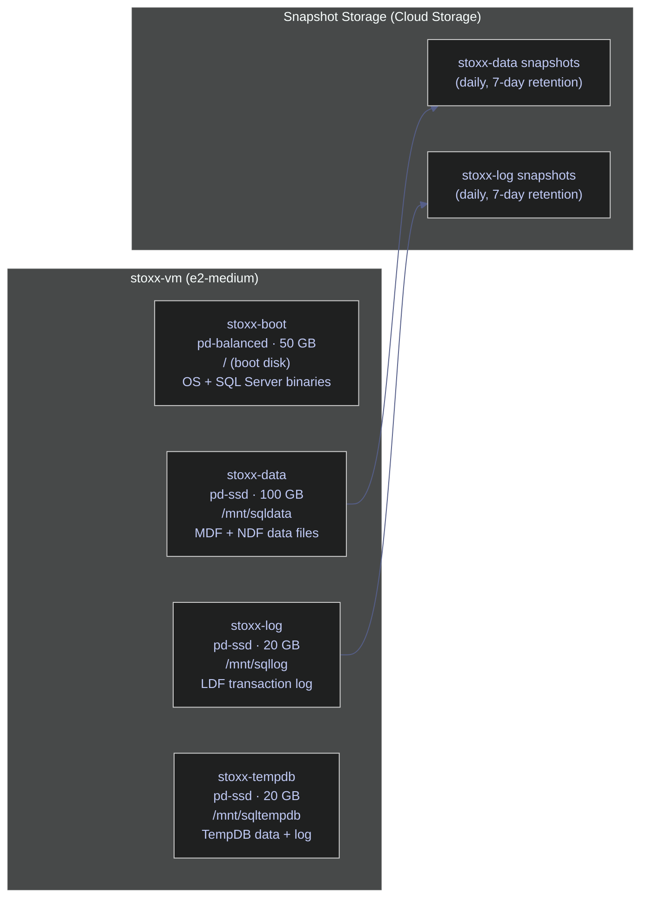
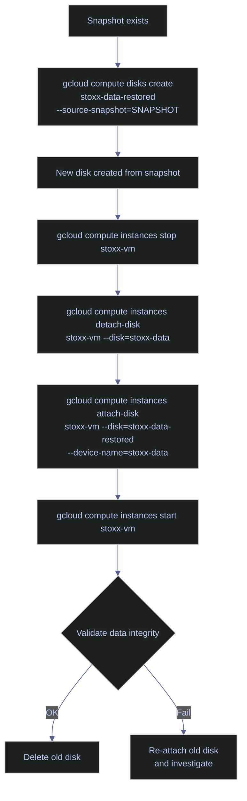

# Disks and Snapshots

> [!quote]+
> "Backups are not sexy, but neither is data loss."
>
> — **W. Curtis Preston**, *Backup & Recovery* (2007)
> [!abstract]- Summary
>
> Documents the multi-disk storage design that was originally validated for SQL Server on `stoxx-vm`, covering persistent-disk creation, guest formatting and mounting, point-in-time snapshots, restore workflows, automated schedules, and online resize.
>
> **Prerequisites**
> - Require `compute.googleapis.com`, `roles/compute.storageAdmin` for disks and snapshots, `roles/compute.instanceAdmin.v1` for attach and detach operations, and an existing `stoxx-vm` in `bq-wh-nb` / `europe-west1-b`
> - Use dedicated disks for SQL Server data, transaction log, and TempDB to isolate IOPS, size each volume independently, and avoid backing up ephemeral TempDB data
>
> **Disk creation**
> - Create `stoxx-data`, `stoxx-log`, and `stoxx-tempdb` with `gcloud compute disks create`, explicit sizes, disk types, and labels, then verify layout with `disks list` and `disks describe`
> - Compare imperative creation with Terraform `google_compute_disk` resources and understand zonal, regional, Persistent Disk, and Hyperdisk choices
>
> **Attachment and Linux mounting**
> - Attach disks to `stoxx-vm` with `instances attach-disk --device-name`, verify `autoDelete` behavior, and rely on stable `/dev/disk/by-id/google-DEVICE_NAME` identifiers instead of volatile `/dev/sdX` names
> - Identify raw devices with `lsblk`, format them with `mkfs.ext4`, create mount points, collect `blkid` UUIDs, and persist mounts in `/etc/fstab`
>
> **Snapshots and restore**
> - Create manual snapshots, understand first-full then incremental block capture, and restore by creating a new disk from `--source-snapshot` before detach and reattach cutover
> - Automate protection with `resource-policies create snapshot-schedule`, attach policies to disks, and verify retention and schedule status
>
> **Resize and cleanup**
> - Resize disks online with `gcloud compute disks resize`, then expand the guest filesystem with `resize2fs` or `xfs_growfs`
> - Detach and delete disks only after unmounting them, and use the disk family reference to choose between `pd-standard`, `pd-balanced`, `pd-ssd`, `pd-extreme`, regional disks, and Hyperdisk variants
>
> **Operations and safety**
> - Warnings: regional disks cost roughly 2× zonal disks, first snapshots are full, restored disks can change device mappings, resize requires a guest filesystem expansion step, and missing `nofail` can break boot
> - Recommendations table: the disk family reference compares Persistent Disk and Hyperdisk types for database, analytics, archive, and RPO = 0 designs
> - Troubleshooting: 10 failure modes covering wrong post-resize size, bad `fstab`, wrong mount path, already-attached disks, slow snapshots, in-use deletes, restore UUID mismatches, wrong `resize2fs` target, missing schedule execution, and mount-point ownership errors

> [!warning] Live-run boundary
>
> The original `stoxx-vm` disk estate in `bq-wh-nb` is no longer available for a full rerun. On `2026-04-15`, the source project was already `DELETE_REQUESTED`, and current read-only inventory against `dagflow-poc` returned `Listed 0 items.` for both `gcloud compute disks list` and `gcloud compute snapshots list`.
>
> This refresh therefore preserves the create, attach, format, snapshot, restore, resize, and delete sequences as historical operator runbooks while refreshing the disk-type catalog from a live `europe-west1-b` query.

> [!note]- Glossary
>
> **Persistent disk**
> - A network-attached block storage volume that exists independently of the VM and continues to exist until explicitly deleted.
> - It is the base storage model for every create, attach, snapshot, resize, restore, and delete workflow in this note.
>
> > [!info] VM and disk lifetimes differ
> >
> > A VM can stop, restart, or even be deleted without automatically destroying every attached disk. Disk retention is controlled separately from instance state.
>
> ---
>
> **Zonal disk**
> - A persistent disk that lives in one zone and can only be attached to VMs in that same zone.
> - It matters because all example disks in this note are created in `europe-west1-b` and must stay aligned with `stoxx-vm`.
>
> > [!warning] Zone mismatch blocks attach
> >
> > A correctly named disk still cannot attach if it was created in a different zone from the VM. Zone is part of the disk's identity and placement.
>
> ---
>
> **Regional disk**
> - A persistent disk replicated synchronously across two zones in the same region for zero-data-loss failover scenarios.
> - It matters as the higher-availability alternative when the workload needs stronger resilience than a single zonal disk can provide.
>
> > [!warning] Availability costs more
> >
> > Regional replication materially increases cost, usually to about twice the zonal equivalent. Use it for explicit RPO = 0 needs, not by default.
>
> ---
>
> **`pd-ssd`**
> - An SSD-backed Persistent Disk type optimized for low-latency random I/O and database workloads.
> - The note uses it for SQL Server data, log, and TempDB volumes because those files are sensitive to storage latency and IOPS ceilings.
>
> > [!info] Good default for databases
> >
> > `pd-ssd` is the practical baseline for OLTP-style storage when you need strong random I/O without stepping up to more specialized offerings.
>
> ---
>
> **`pd-balanced`**
> - A lower-cost SSD-backed Persistent Disk tier that provides moderate performance for general-purpose workloads.
> - It matters because the note treats it as suitable for the VM boot disk, where storage demand is lower than the database volumes.
>
> > [!info] Cheaper than `pd-ssd`
> >
> > `pd-balanced` reduces cost while keeping SSD behavior. It is often the right choice for operating-system disks and non-critical service volumes.
>
> ---
>
> **`pd-standard`**
> - An HDD-backed Persistent Disk tier intended for sequential reads, archival storage, and low-cost capacity.
> - It matters as the low-performance, low-cost option that is usually a poor fit for active database files but reasonable for colder backup data.
>
> > [!warning] Cheap can be slow
> >
> > `pd-standard` is capacity-oriented rather than latency-oriented. Database workloads that rely on random I/O will usually suffer on it.
>
> ---
>
> **`pd-extreme`**
> - A high-performance Persistent Disk tier that lets you provision IOPS explicitly for demanding database workloads.
> - It matters as the upper-end Persistent Disk option when standard SSD tiers cannot meet the required transaction latency or throughput targets.
>
> > [!warning] Provisioned IOPS affect price
> >
> > `pd-extreme` charges for both capacity and configured IOPS. It is easy to overspend if the workload does not truly need that performance profile.
>
> ---
>
> **Hyperdisk**
> - A newer Compute Engine block-storage family that decouples size, IOPS, and throughput into separately managed dimensions.
> - It matters because the note treats Hyperdisk as the modern alternative when storage performance must scale independently from capacity.
>
> > [!info] Availability is not universal
> >
> > Hyperdisk support varies by zone and product variant. Always verify regional and zonal availability before designing around it.
>
> ---
>
> **IOPS**
> - Input/Output Operations Per Second, a performance measure for how many read or write operations storage can sustain.
> - It matters because SQL Server data and TempDB workloads are strongly shaped by random I/O performance rather than by capacity alone.
>
> > [!info] Random and sequential differ
> >
> > A disk can have enough capacity and still perform poorly if its IOPS ceiling is too low for the workload's access pattern. Storage sizing is not only about GB.
>
> ---
>
> **Throughput**
> - The sustained data-transfer rate of storage, usually measured in MB/s.
> - It matters in this note for sequential scans, backup streams, restore flows, and analytics workloads that move large blocks of data.
>
> > [!info] High throughput is not high IOPS
> >
> > Throughput and IOPS solve different bottlenecks. Sequential-heavy ETL can be throughput-bound even when random transaction latency is acceptable.
>
> ---
>
> **Snapshot**
> - A point-in-time capture of a persistent disk stored in Google-managed snapshot storage and usable to create new disks later.
> - It matters because snapshots are the recovery boundary for restore, rollback, and scheduled protection workflows in the note.
>
> > [!warning] Restore is not in-place
> >
> > Restoring from a snapshot creates a new disk. You do not overwrite the existing disk directly, which is why cutover and validation steps matter.
>
> ---
>
> **Incremental snapshot**
> - A snapshot after the first one that stores only changed blocks relative to earlier snapshot state.
> - It matters because snapshot chains become faster and more space-efficient after the initial full capture.
>
> > [!info] First snapshot is different
> >
> > The first snapshot must capture the full disk state. Later snapshots are normally cheaper and quicker because they only persist block-level changes.
>
> ---
>
> **Resource policy**
> - A reusable Compute Engine policy object that can automate recurring actions such as snapshot schedules.
> - It matters because scheduled protection in the note is implemented by attaching a snapshot policy to the data and log disks.
>
> > [!warning] Policy must be attached
> >
> > Creating the policy alone does nothing. The disk must reference the policy before scheduled snapshots start appearing.
>
> ---
>
> **Device name**
> - The stable identifier assigned at disk-attachment time and exposed inside the guest under `/dev/disk/by-id/google-DEVICE_NAME`.
> - It matters because Linux kernel device names such as `/dev/sdb` can shift after reboot, detach, or restore, while the device-name mapping remains stable.
>
> > [!info] Better than attachment order
> >
> > Attachment order is not a durable storage contract. Device names give the guest a predictable reference path even when `/dev/sdX` changes.
>
> ---
>
> **UUID**
> - The filesystem-level unique identifier recorded on a formatted volume and retrievable with `blkid`.
> - It matters because the note uses UUID-based `/etc/fstab` entries to keep the right filesystem mounted at the right path across reboots and restores.
>
> > [!warning] Restores can change identity
> >
> > A restored or reformatted disk can present a different UUID from the original. Always verify the UUID before assuming old `fstab` entries still match.
>
> ---
>
> **Mount point**
> - The directory path where a mounted filesystem becomes visible to the operating system, such as `/mnt/sqldata`.
> - It matters because SQL Server layout depends on keeping data, log, and TempDB volumes mounted at consistent paths.
>
> > [!info] Applications target paths
> >
> > Software usually cares about the mount path, not the raw block device. Stable mount points are what make storage layouts operationally reusable.
>
> ---
>
> **Filesystem**
> - The on-disk data structure, such as `ext4` or `xfs`, that organizes a raw block device into readable and writable files and directories.
> - It matters because new disks are unusable until they are formatted, and resize operations are incomplete until the filesystem is expanded too.
>
> > [!warning] Raw disk is not ready
> >
> > Attaching a blank disk does not make it immediately usable. The guest still needs formatting, mounting, and persistence configuration before applications can write to it.
>
> ---
>
> **`fstab`**
> - The Linux configuration file at `/etc/fstab` that defines mounts to be applied during boot.
> - It matters because the note uses it to make SQL Server disk mounts survive reboot instead of requiring manual remount steps after every restart.
>
> > [!danger] Bad entries can block boot
> >
> > An incorrect `fstab` entry can prevent the VM from booting cleanly. Using UUIDs plus `nofail` reduces that risk when a disk is missing or delayed.
>
> ---
>
> **TempDB**
> - SQL Server's temporary-workload database used for spills, sorts, intermediate objects, and other ephemeral operations.
> - It matters because the note places TempDB on its own disk to isolate I/O and explicitly excludes it from durable snapshot planning.
>
> > [!info] Treat as rebuildable
> >
> > TempDB is recreated by SQL Server and should not be handled like durable business data. Isolating it improves both performance and backup discipline.


## Conceptual Model



> [!info] Why pd-ssd for Data, Log, and TempDB
>
> SQL Server data files (`MDF`/`NDF`) and TempDB require high random IOPS — index seeks, page reads, and spill operations generate small random I/O patterns that benefit from the 30 IOPS/GB ceiling of `pd-ssd`. Transaction log files (`LDF`) require high sequential write throughput for WAL flushes. The boot disk uses `pd-balanced` because OS reads are predominantly sequential and the 6 IOPS/GB ceiling is sufficient at lower cost.

## Disk Creation

This section creates three dedicated disks for the SQL Server production-pattern layout. The boot disk (`stoxx-vm`, 50 GB pd-balanced) was created with the VM in page 01.

### gcloud | Create data, log, and TempDB disks

#### Create the data disk

Before installing SQL Server on the VM. It is typically triggered by initial VM provisioning or adding a new SQL Server instance. `gcloud` CLI, requires `roles/compute.storageAdmin`. State-changing: creates a new billable resource. Provision a dedicated pd-ssd disk for SQL Server data files (MDF + NDF), isolated from OS and log I/O.

*Create a 50 GB pd-ssd disk labeled for SQL Server data files.*

```bash
gcloud compute disks create stoxx-data \
  --zone=europe-west1-b \
  --size=50GB \
  --type=pd-ssd \
  --labels=app=stoxx-db,purpose=sqldata
```

```text
Created [https://www.googleapis.com/compute/v1/projects/bq-wh-nb/zones/europe-west1-b/disks/stoxx-data].
NAME        ZONE            SIZE_GB  TYPE    STATUS
stoxx-data  europe-west1-b  50       pd-ssd  READY
```

#### Create the log disk

*Create a 20 GB pd-ssd disk for SQL Server transaction log files.*

```bash
gcloud compute disks create stoxx-log \
  --zone=europe-west1-b \
  --size=20GB \
  --type=pd-ssd \
  --labels=app=stoxx-db,purpose=sqllog
```

```text
Created [https://www.googleapis.com/compute/v1/projects/bq-wh-nb/zones/europe-west1-b/disks/stoxx-log].
NAME       ZONE            SIZE_GB  TYPE    STATUS
stoxx-log  europe-west1-b  20       pd-ssd  READY
```

#### Create the TempDB disk

*Create a 20 GB pd-ssd disk for SQL Server TempDB files.*

```bash
gcloud compute disks create stoxx-tempdb \
  --zone=europe-west1-b \
  --size=20GB \
  --type=pd-ssd \
  --labels=app=stoxx-db,purpose=sqltempdb
```

```text
Created [https://www.googleapis.com/compute/v1/projects/bq-wh-nb/zones/europe-west1-b/disks/stoxx-tempdb].
NAME          ZONE            SIZE_GB  TYPE    STATUS
stoxx-tempdb  europe-west1-b  20       pd-ssd  READY
```

#### List all stoxx disks

*List all persistent disks matching the `stoxx` prefix to verify the complete disk layout.*

```bash
gcloud compute disks list --filter="name~stoxx"
```

```text
NAME          LOCATION        LOCATION_SCOPE  SIZE_GB  TYPE         STATUS
stoxx-data    europe-west1-b  zone            50       pd-ssd       READY
stoxx-log     europe-west1-b  zone            20       pd-ssd       READY
stoxx-tempdb  europe-west1-b  zone            20       pd-ssd       READY
stoxx-vm      europe-west1-b  zone            50       pd-balanced  READY
```

#### Describe a disk

*Inspect the full metadata of the data disk including labels, physical block size, and creation timestamp.*

```bash
gcloud compute disks describe stoxx-data --zone=europe-west1-b
```

```text
creationTimestamp: '2026-04-12T12:03:20.802-07:00'
id: '4313860795788579479'
kind: compute#disk
labelFingerprint: g2UDar-6Wvk=
labels:
  app: stoxx-db
  purpose: sqldata
name: stoxx-data
physicalBlockSizeBytes: '4096'
sizeGb: '50'
status: READY
type: .../diskTypes/pd-ssd
zone: .../zones/europe-west1-b
```

| Flag | Syntax | Description |
|---|---|---|
| `--zone` | `--zone=europe-west1-b` | Zone where the disk is created. Must match the VM zone for attachment. |
| `--size` | `--size=50GB` | Disk size in GB. Can only be increased after creation, never decreased. |
| `--type` | `--type=pd-ssd` | Disk type: `pd-ssd`, `pd-balanced`, `pd-standard`, `pd-extreme`, `hyperdisk-balanced`, `hyperdisk-throughput`, `hyperdisk-extreme`. |
| `--image` | `--image=IMAGE_NAME` | Initialize disk from a public or custom image (used for boot disks). |
| `--image-family` | `--image-family=ubuntu-2204-lts` | Initialize from the latest image in a family. |
| `--source-snapshot` | `--source-snapshot=SNAPSHOT_NAME` | Initialize disk from an existing snapshot (restore flow). |
| `--replica-zones` | `--replica-zones=ZONE_A,ZONE_B` | Create a Regional Persistent Disk replicated synchronously across two zones. |
| `--labels` | `--labels=app=stoxx-db,purpose=sqldata` | Resource labels for cost attribution and filtering. |
| `--description` | `--description="..."` | Human-readable description for operational clarity. |
| `--physical-block-size` | `--physical-block-size=4096` | Physical block size in bytes. Options: `4096` (default) or `16384`. |

> [!example]- Terraform equivalent
>
> ```hcl
> resource "google_compute_disk" "stoxx_data" {
>   name   = "stoxx-data"
>   zone   = "europe-west1-b"
>   size   = 50
>   type   = "pd-ssd"
>   labels = {
>     app     = "stoxx-db"
>     purpose = "sqldata"
>   }
> }
>
> resource "google_compute_disk" "stoxx_log" {
>   name   = "stoxx-log"
>   zone   = "europe-west1-b"
>   size   = 20
>   type   = "pd-ssd"
>   labels = {
>     app     = "stoxx-db"
>     purpose = "sqllog"
>   }
> }
>
> resource "google_compute_disk" "stoxx_tempdb" {
>   name   = "stoxx-tempdb"
>   zone   = "europe-west1-b"
>   size   = 20
>   type   = "pd-ssd"
>   labels = {
>     app     = "stoxx-db"
>     purpose = "sqltempdb"
>   }
> }
> ```

## Attaching Disks to the VM

Disks can be attached to a running VM without downtime. Each disk is assigned a `--device-name` that creates a stable symlink at `/dev/disk/by-id/google-DEVICE_NAME` inside the guest OS, regardless of the `/dev/sdX` name the kernel assigns.

### gcloud | Attach data, log, and TempDB disks

#### Attach the data disk

*Attach the stoxx-data disk to stoxx-vm with a stable device name.*

```bash
gcloud compute instances attach-disk stoxx-vm \
  --disk=stoxx-data \
  --device-name=stoxx-data \
  --zone=europe-west1-b
```

```text
Updated [https://www.googleapis.com/compute/v1/projects/bq-wh-nb/zones/europe-west1-b/instances/stoxx-vm].
```

#### Attach the log disk

*Attach the stoxx-log disk.*

```bash
gcloud compute instances attach-disk stoxx-vm \
  --disk=stoxx-log \
  --device-name=stoxx-log \
  --zone=europe-west1-b
```

```text
Updated [https://www.googleapis.com/compute/v1/projects/bq-wh-nb/zones/europe-west1-b/instances/stoxx-vm].
```

#### Attach the TempDB disk

*Attach the stoxx-tempdb disk.*

```bash
gcloud compute instances attach-disk stoxx-vm \
  --disk=stoxx-tempdb \
  --device-name=stoxx-tempdb \
  --zone=europe-west1-b
```

```text
Updated [https://www.googleapis.com/compute/v1/projects/bq-wh-nb/zones/europe-west1-b/instances/stoxx-vm].
```

#### Verify disk attachments

*Confirm all four disks (boot + 3 data) are attached to the VM.*

```bash
gcloud compute instances describe stoxx-vm \
  --format="yaml(disks)"
```

```text
disks:
- autoDelete: true
  boot: true
  deviceName: persistent-disk-0
  diskSizeGb: '50'
  interface: SCSI
  mode: READ_WRITE
  source: .../disks/stoxx-vm
  type: PERSISTENT
- autoDelete: false
  boot: false
  deviceName: stoxx-data
  diskSizeGb: '50'
  interface: SCSI
  mode: READ_WRITE
  source: .../disks/stoxx-data
  type: PERSISTENT
- autoDelete: false
  boot: false
  deviceName: stoxx-log
  diskSizeGb: '20'
  interface: SCSI
  mode: READ_WRITE
  source: .../disks/stoxx-log
  type: PERSISTENT
- autoDelete: false
  boot: false
  deviceName: stoxx-tempdb
  diskSizeGb: '20'
  interface: SCSI
  mode: READ_WRITE
  source: .../disks/stoxx-tempdb
  type: PERSISTENT
```

The three data disks have `autoDelete: false` — they persist even if the VM is deleted. The boot disk has `autoDelete: true` — it is destroyed when the VM is deleted.

| Flag | Syntax | Description |
|---|---|---|
| `--disk` | `--disk=stoxx-data` | Name of the persistent disk to attach. |
| `--device-name` | `--device-name=stoxx-data` | Stable name exposed inside the guest at `/dev/disk/by-id/google-DEVICE_NAME`. |
| `--mode` | `--mode=rw` | Access mode: `rw` (read-write, default) or `ro` (read-only). |
| `--zone` | `--zone=europe-west1-b` | Zone of the VM instance. |
| `--boot` | `--boot` | Mark the disk as the boot disk (only one per VM). |

> [!example]- Terraform equivalent
>
> ```hcl
> resource "google_compute_attached_disk" "stoxx_data" {
>   disk     = google_compute_disk.stoxx_data.id
>   instance = google_compute_instance.stoxx_vm.id
>   device_name = "stoxx-data"
> }
>
> resource "google_compute_attached_disk" "stoxx_log" {
>   disk     = google_compute_disk.stoxx_log.id
>   instance = google_compute_instance.stoxx_vm.id
>   device_name = "stoxx-log"
> }
>
> resource "google_compute_attached_disk" "stoxx_tempdb" {
>   disk     = google_compute_disk.stoxx_tempdb.id
>   instance = google_compute_instance.stoxx_vm.id
>   device_name = "stoxx-tempdb"
> }
> ```

## Formatting and Mounting Disks

All commands in this section are executed inside the VM via `gcloud compute ssh stoxx-vm --command="..."`. New disks are raw block devices — they must be formatted with a filesystem, mounted, and registered in `/etc/fstab` for persistence across reboots.

### Linux | Identify, format, and mount attached disks

#### Identify attached devices

*List all block devices to identify the three new unformatted disks.*

```bash
gcloud compute ssh stoxx-vm --command="lsblk"
```

```text
NAME    MAJ:MIN RM   SIZE RO TYPE MOUNTPOINTS
loop0     7:0    0  63.8M  1 loop /snap/core20/2717
loop1     7:1    0    74M  1 loop /snap/core22/2339
loop2     7:2    0 435.2M  1 loop /snap/google-cloud-cli/436
loop3     7:3    0  91.7M  1 loop /snap/lxd/38469
loop4     7:4    0  48.1M  1 loop /snap/snapd/25935
sda       8:0    0    50G  0 disk
├─sda1    8:1    0  49.9G  0 part /
├─sda14   8:14   0     4M  0 part
└─sda15   8:15   0   106M  0 part /boot/efi
sdb       8:16   0    50G  0 disk
sdc       8:32   0    20G  0 disk
sdd       8:48   0    20G  0 disk
```

`sda` is the boot disk (50 GB, partitioned). `sdb` (50 GB), `sdc` (20 GB), and `sdd` (20 GB) are the three new unformatted disks. The kernel assigns `/dev/sdX` names in attachment order — these names can change across reboots, which is why we use UUIDs in fstab.

#### Format each disk as ext4

The `mkfs.ext4` flags optimize for GCE persistent disks: `-m 0` reserves zero blocks for root (not needed on data-only disks), `lazy_itable_init=0,lazy_journal_init=0` forces immediate initialization (avoids background I/O after mount), and `discard` enables TRIM for SSD-backed disks.

*Format the data disk (sdb, 50 GB).*

```bash
gcloud compute ssh stoxx-vm --command="\
  sudo mkfs.ext4 -m 0 -E lazy_itable_init=0,lazy_journal_init=0,discard /dev/sdb"
```

```text
mke2fs 1.46.5 (30-Dec-2021)
Discarding device blocks:        0/13107200                 done
Creating filesystem with 13107200 4k blocks and 3276800 inodes
Filesystem UUID: fcde3cab-2d5e-44f2-8685-65f7a6e3da21
Superblock backups stored on blocks:
	32768, 98304, 163840, 229376, 294912, 819200, 884736, 1605632, 2654208,
	4096000, 7962624, 11239424

Allocating group tables:   0/400       done
Writing inode tables:   0/400       done
Creating journal (65536 blocks): done
Writing superblocks and filesystem accounting information:   0/400       done
```

*Format the log disk (sdc, 20 GB).*

```bash
gcloud compute ssh stoxx-vm --command="\
  sudo mkfs.ext4 -m 0 -E lazy_itable_init=0,lazy_journal_init=0,discard /dev/sdc"
```

```text
mke2fs 1.46.5 (30-Dec-2021)
Discarding device blocks:       0/5242880               done
Creating filesystem with 5242880 4k blocks and 1310720 inodes
Filesystem UUID: 39255f84-bf29-497c-8dbc-5432fdd9cf84
Superblock backups stored on blocks:
	32768, 98304, 163840, 229376, 294912, 819200, 884736, 1605632, 2654208,
	4096000

Allocating group tables:   0/160       done
Writing inode tables:   0/160       done
Creating journal (32768 blocks): done
Writing superblocks and filesystem accounting information:   0/160       done
```

*Format the TempDB disk (sdd, 20 GB).*

```bash
gcloud compute ssh stoxx-vm --command="\
  sudo mkfs.ext4 -m 0 -E lazy_itable_init=0,lazy_journal_init=0,discard /dev/sdd"
```

```text
mke2fs 1.46.5 (30-Dec-2021)
Discarding device blocks:       0/5242880               done
Creating filesystem with 5242880 4k blocks and 1310720 inodes
Filesystem UUID: 3e8d9bae-88b3-421e-922c-a41adc3db6c5
Superblock backups stored on blocks:
	32768, 98304, 163840, 229376, 294912, 819200, 884736, 1605632, 2654208,
	4096000

Allocating group tables:   0/160       done
Writing inode tables:   0/160       done
Creating journal (32768 blocks): done
Writing superblocks and filesystem accounting information:   0/160       done
```

#### Create mount points and mount

*Create the three mount directories and mount each disk.*

```bash
gcloud compute ssh stoxx-vm --command="\
  sudo mkdir -p /mnt/sqldata /mnt/sqllog /mnt/sqltempdb && \
  sudo mount -o discard,defaults /dev/sdb /mnt/sqldata && \
  sudo mount -o discard,defaults /dev/sdc /mnt/sqllog && \
  sudo mount -o discard,defaults /dev/sdd /mnt/sqltempdb"
```

#### Get UUIDs with blkid

*Retrieve the filesystem UUIDs for fstab entries. UUIDs are stable identifiers that do not change across reboots, unlike `/dev/sdX` device names.*

```bash
gcloud compute ssh stoxx-vm --command="sudo blkid /dev/sdb /dev/sdc /dev/sdd"
```

```text
/dev/sdb: UUID="fcde3cab-2d5e-44f2-8685-65f7a6e3da21" BLOCK_SIZE="4096" TYPE="ext4"
/dev/sdc: UUID="39255f84-bf29-497c-8dbc-5432fdd9cf84" BLOCK_SIZE="4096" TYPE="ext4"
/dev/sdd: UUID="3e8d9bae-88b3-421e-922c-a41adc3db6c5" BLOCK_SIZE="4096" TYPE="ext4"
```

#### Add persistent mount entries to fstab

The `nofail` option prevents boot failure if a disk is detached — the system continues booting without the missing mount rather than dropping to an emergency shell.

*Append UUID-based fstab entries for all three disks.*

```bash
gcloud compute ssh stoxx-vm --command="\
  echo 'UUID=fcde3cab-2d5e-44f2-8685-65f7a6e3da21 /mnt/sqldata ext4 discard,defaults,nofail 0 2' \
    | sudo tee -a /etc/fstab && \
  echo 'UUID=39255f84-bf29-497c-8dbc-5432fdd9cf84 /mnt/sqllog ext4 discard,defaults,nofail 0 2' \
    | sudo tee -a /etc/fstab && \
  echo 'UUID=3e8d9bae-88b3-421e-922c-a41adc3db6c5 /mnt/sqltempdb ext4 discard,defaults,nofail 0 2' \
    | sudo tee -a /etc/fstab"
```

*Resulting fstab contents:*

```text
LABEL=cloudimg-rootfs   /        ext4  discard,errors=remount-ro  0 1
LABEL=UEFI              /boot/efi vfat umask=0077                 0 1
UUID=fcde3cab-2d5e-44f2-8685-65f7a6e3da21 /mnt/sqldata  ext4 discard,defaults,nofail 0 2
UUID=39255f84-bf29-497c-8dbc-5432fdd9cf84 /mnt/sqllog   ext4 discard,defaults,nofail 0 2
UUID=3e8d9bae-88b3-421e-922c-a41adc3db6c5 /mnt/sqltempdb ext4 discard,defaults,nofail 0 2
```

> [!warning] Never use /dev/sdX device names in fstab
>
> Linux kernel device names (`/dev/sdb`, `/dev/sdc`) are assigned based on attachment order and can change across reboots, especially after detaching and reattaching disks (as demonstrated in the restore procedure below, where `stoxx-data` moved from `/dev/sdb` to `/dev/sdd`). An fstab entry that references `/dev/sdb` may mount the wrong filesystem after a reboot.

> [!success] Always use UUID or /dev/disk/by-id/ in fstab
>
> UUIDs are baked into the filesystem superblock and never change. Alternatively, use the GCE device-name symlink at `/dev/disk/by-id/google-stoxx-data`. Both are stable across reboots and disk reordering.

> [!warning] Missing nofail option causes boot failure
>
> If a disk listed in fstab without `nofail` is detached or unavailable at boot time, the VM drops to an emergency shell and becomes unreachable via SSH. Recovery requires the serial console.

> [!success] Always include nofail for non-root mounts
>
> The `nofail` option tells systemd to continue booting if the mount fails. The VM remains accessible via SSH, and you can investigate and remount manually.

#### Set permissions for SQL Server

The `mssql` user and group will be created when SQL Server is installed (page 04). Pre-setting ownership now ensures SQL Server can write to the mount points immediately after installation.

*Set ownership to mssql (the SQL Server service account created during installation).*

```bash
gcloud compute ssh stoxx-vm --command="\
  sudo chmod 755 /mnt/sqldata /mnt/sqllog /mnt/sqltempdb"
```

> [!info] Deferred chown to mssql
>
> The `mssql` user does not exist until SQL Server is installed. After installing SQL Server (page 04), run: `sudo chown mssql:mssql /mnt/sqldata /mnt/sqllog /mnt/sqltempdb`.

#### Verify all mounts

*Confirm all three disks are mounted with expected sizes.*

```bash
gcloud compute ssh stoxx-vm --command="df -h /mnt/sqldata /mnt/sqllog /mnt/sqltempdb"
```

```text
Filesystem      Size  Used Avail Use% Mounted on
/dev/sdb         49G   24K   49G   1% /mnt/sqldata
/dev/sdc         20G   24K   20G   1% /mnt/sqllog
/dev/sdd         20G   24K   20G   1% /mnt/sqltempdb
```

*Verify the complete block device layout including mount points.*

```bash
gcloud compute ssh stoxx-vm --command="lsblk"
```

```text
NAME    MAJ:MIN RM   SIZE RO TYPE MOUNTPOINTS
sda       8:0    0    50G  0 disk
├─sda1    8:1    0  49.9G  0 part /
├─sda14   8:14   0     4M  0 part
└─sda15   8:15   0   106M  0 part /boot/efi
sdb       8:16   0    50G  0 disk /mnt/sqldata
sdc       8:32   0    20G  0 disk /mnt/sqllog
sdd       8:48   0    20G  0 disk /mnt/sqltempdb
```

## Snapshot Management

Snapshots capture the state of a persistent disk at a point in time. They are stored in Cloud Storage and are incremental — only changed blocks since the last snapshot are transferred and stored. The first snapshot of a disk is a full copy; subsequent snapshots capture only changes. Snapshots are cross-regional: a snapshot taken from `europe-west1` can restore a disk in `us-central1`. The rule is simple: **always snapshot before any risky operation** (OS upgrades, SQL Server updates, schema migrations, disk resizing).

> [!warning] Snapshot Cost Trap
>
> Snapshots accumulate silently. A daily schedule with a 30-day retention window on a 500 GB disk can generate ~$390/month at ~$0.026/GB/month (US multi-regional). Orphaned manual snapshots from one-off operations are a common hidden cost.

> [!success] Use Snapshot Schedules with Retention Windows
>
> Automate snapshot creation and deletion with resource policies (see [Snapshot Schedules](#snapshot-schedules) below). Set `--max-retention-days` to automatically purge snapshots older than your recovery window, capping storage costs.

### gcloud | Create, list, describe, and delete snapshots

#### Create a manual snapshot

Before any risky operation — OS upgrades, SQL Server updates, schema migrations, disk resizing. It is typically triggered by planned maintenance or pre-deployment step. `gcloud` CLI, requires `roles/compute.storageAdmin`. State-changing: creates a billable snapshot resource. Capture a point-in-time copy of the data disk that can be used to restore if the operation fails.

*Snapshot the data disk with a descriptive name encoding the date and reason.*

```bash
gcloud compute disks snapshot stoxx-data \
  --zone=europe-west1-b \
  --snapshot-names=stoxx-data-before-sqlsetup-20260412
```

```text
Creating snapshot(s) stoxx-data-before-sqlsetup-20260412...done.
```

> [!tip] Snapshot Naming Convention
>
> Include the disk name, reason, and date: `stoxx-data-before-sqlsetup-20260412`. This makes it immediately clear which snapshot to restore from when things go wrong at 3 AM.

#### List snapshots

*List all snapshots in the project.*

```bash
gcloud compute snapshots list
```

```text
NAME                                 DISK_SIZE_GB  SRC_DISK                         STATUS
stoxx-data-before-sqlsetup-20260412  50            europe-west1-b/disks/stoxx-data  READY
```

#### Describe a snapshot

*Inspect snapshot metadata including storage size, source disk, and storage location.*

```bash
gcloud compute snapshots describe stoxx-data-before-sqlsetup-20260412
```

```text
creationSizeBytes: '160256'
creationTimestamp: '2026-04-12T12:05:53.435-07:00'
diskSizeGb: '50'
downloadBytes: '180425'
name: stoxx-data-before-sqlsetup-20260412
sourceDisk: .../zones/europe-west1-b/disks/stoxx-data
status: READY
storageBytes: '160256'
storageBytesStatus: UP_TO_DATE
storageLocations:
- eu
```

The `storageBytes: 160256` (156 KB) confirms this is an incremental snapshot of an almost-empty disk. As data accumulates on the disk, subsequent snapshots will store only the changed blocks, keeping storage costs proportional to the actual change rate.

#### Delete a snapshot

*Delete a snapshot that is no longer needed. This is irreversible.*

```bash
gcloud compute snapshots delete stoxx-data-before-sqlsetup-20260412 --quiet
```

| Flag | Syntax | Description |
|---|---|---|
| `--zone` | `--zone=europe-west1-b` | Zone of the source disk (for `disks snapshot` command). |
| `--snapshot-names` | `--snapshot-names=NAME` | Comma-separated snapshot names to create. |
| `--storage-location` | `--storage-location=eu` | Multi-regional (`us`, `eu`, `asia`) or regional (`us-central1`) storage. Defaults to closest multi-region. |
| `--description` | `--description="..."` | Description attached to the snapshot resource. |
| `--async` | `--async` | Return immediately without waiting for the snapshot to complete. Useful in scripted pipelines. |

## Restoring from Snapshots

Restoration creates a new disk from the snapshot, then reattaches it to the VM. There is no in-place restore — the original disk is not modified. This means you can validate the restored disk before cutting over, keeping the original as a safety net until the restore is confirmed good.



### gcloud | Restore a disk from a snapshot

#### Create a new disk from the snapshot

After a failed operation (upgrade, migration, schema change) has corrupted or damaged data on the disk. It is typically triggered by data corruption confirmed, rollback decision made. `gcloud` CLI. State-changing: creates a new billable disk. The source snapshot is not modified. Create a clean replacement disk from the point-in-time snapshot to replace the damaged disk.

*Create a new pd-ssd disk initialized from the snapshot.*

```bash
gcloud compute disks create stoxx-data-restored \
  --zone=europe-west1-b \
  --source-snapshot=stoxx-data-before-sqlsetup-20260412 \
  --type=pd-ssd
```

```text
Created [https://www.googleapis.com/compute/v1/projects/bq-wh-nb/zones/europe-west1-b/disks/stoxx-data-restored].
NAME                 ZONE            SIZE_GB  TYPE    STATUS
stoxx-data-restored  europe-west1-b  50       pd-ssd  READY
```

#### Full restore procedure

> [!todo] Full Disk Restore Procedure
>
> 1. **Create a new disk from the snapshot** (command above).
> 2. **Stop the VM:** `gcloud compute instances stop stoxx-vm --zone=europe-west1-b`
> 3. **Detach the damaged disk:** `gcloud compute instances detach-disk stoxx-vm --disk=stoxx-data --zone=europe-west1-b`
> 4. **Attach the restored disk with the same device name:** `gcloud compute instances attach-disk stoxx-vm --disk=stoxx-data-restored --device-name=stoxx-data --zone=europe-west1-b`
> 5. **Start the VM:** `gcloud compute instances start stoxx-vm --zone=europe-west1-b`
> 6. **SSH in and verify:** `df -h /mnt/sqldata` — confirm the restored disk is mounted at the correct path (UUID-based fstab resolves automatically).
> 7. **Validate data integrity** before deleting the old disk.

*After executing the full procedure, verify the restored disk is mounted:*

```bash
gcloud compute ssh stoxx-vm --command="df -h /mnt/sqldata /mnt/sqllog /mnt/sqltempdb"
```

```text
Filesystem      Size  Used Avail Use% Mounted on
/dev/sdd         49G   24K   49G   1% /mnt/sqldata
/dev/sdb         20G   24K   20G   1% /mnt/sqllog
/dev/sdc         20G   24K   20G   1% /mnt/sqltempdb
```

Notice that `stoxx-data` moved from `/dev/sdb` to `/dev/sdd` after the detach/reattach cycle — the kernel assigned a different device name. The UUID-based fstab entry resolved to the correct mount point automatically. This is exactly why UUID-based mounts are critical.

| Flag | Syntax | Description |
|---|---|---|
| `--source-snapshot` | `--source-snapshot=SNAPSHOT_NAME` | Source snapshot to restore from. |
| `--zone` | `--zone=europe-west1-b` | Zone where the new disk is created. Must match the target VM zone. |
| `--type` | `--type=pd-ssd` | Disk type for the restored disk. Does not need to match the original. |
| `--size` | `--size=100GB` | Override disk size. Must be ≥ the source snapshot's original disk size. |

> [!example]- Terraform equivalent
>
> ```hcl
> resource "google_compute_disk" "stoxx_data_restored" {
>   name     = "stoxx-data-restored"
>   zone     = "europe-west1-b"
>   type     = "pd-ssd"
>   snapshot = google_compute_snapshot.stoxx_data_before_sqlsetup.id
> }
> ```

## Snapshot Schedules

Snapshot schedules use resource policies to automate snapshot creation and deletion. A single policy can be attached to multiple disks. The schedule runs according to UTC, and the `--max-retention-days` parameter automatically purges snapshots older than the specified window.

### gcloud | Create and attach snapshot schedule policies

#### Create the schedule policy

After the disk layout is finalized and validated. It is typically triggered by production readiness milestone — disks contain data worth protecting. `gcloud` CLI, requires `roles/compute.resourcePolicies.create`. State-changing: creates a policy resource. Automate daily snapshots with 7-day retention, eliminating the risk of forgotten manual snapshots and the cost of unbounded accumulation.

*Create a daily snapshot schedule with 7-day retention, running at 02:00 UTC.*

```bash
gcloud compute resource-policies create snapshot-schedule stoxx-daily-snapshot \
  --region=europe-west1 \
  --max-retention-days=7 \
  --on-source-disk-delete=keep-auto-snapshots \
  --daily-schedule \
  --start-time=02:00
```

```text
Created [https://www.googleapis.com/compute/v1/projects/bq-wh-nb/regions/europe-west1/resourcePolicies/stoxx-daily-snapshot].
```

#### Attach the policy to data and log disks

TempDB is not included in the schedule — its contents are ephemeral and rebuilt on every SQL Server restart.

*Attach the snapshot schedule to the data disk.*

```bash
gcloud compute disks add-resource-policies stoxx-data \
  --zone=europe-west1-b \
  --resource-policies=stoxx-daily-snapshot
```

```text
Updated [https://www.googleapis.com/compute/v1/projects/bq-wh-nb/zones/europe-west1-b/disks/stoxx-data].
```

*Attach the snapshot schedule to the log disk.*

```bash
gcloud compute disks add-resource-policies stoxx-log \
  --zone=europe-west1-b \
  --resource-policies=stoxx-daily-snapshot
```

```text
Updated [https://www.googleapis.com/compute/v1/projects/bq-wh-nb/zones/europe-west1-b/disks/stoxx-log].
```

#### List and describe policies

*List all resource policies.*

```bash
gcloud compute resource-policies list
```

```text
NAME                  DESCRIPTION  REGION         CREATION_TIMESTAMP
stoxx-daily-snapshot               europe-west1   2026-04-12T12:13:45.526-07:00
```

*Describe the schedule policy to verify retention and schedule settings.*

```bash
gcloud compute resource-policies describe stoxx-daily-snapshot \
  --region=europe-west1
```

```text
creationTimestamp: '2026-04-12T12:13:45.526-07:00'
name: stoxx-daily-snapshot
region: .../regions/europe-west1
snapshotSchedulePolicy:
  retentionPolicy:
    maxRetentionDays: 7
    onSourceDiskDelete: KEEP_AUTO_SNAPSHOTS
  schedule:
    dailySchedule:
      daysInCycle: 1
      duration: PT14400S
      startTime: 02:00
status: READY
```

The `duration: PT14400S` (4 hours) is the window during which the snapshot operation may begin — not how long it takes. `onSourceDiskDelete: KEEP_AUTO_SNAPSHOTS` means snapshots are retained even if the source disk is deleted.

| Flag | Syntax | Description |
|---|---|---|
| `--region` | `--region=europe-west1` | Region where the resource policy is created. Must match the disk's region. |
| `--max-retention-days` | `--max-retention-days=7` | Automatically delete snapshots older than this many days. |
| `--on-source-disk-delete` | `--on-source-disk-delete=keep-auto-snapshots` | Behavior when source disk is deleted: `keep-auto-snapshots` (retain) or `apply-retention-policy` (delete per schedule). |
| `--daily-schedule` | `--daily-schedule` | One snapshot per day. Alternatives: `--hourly-schedule=N`, `--weekly-schedule=DAY`. |
| `--start-time` | `--start-time=02:00` | UTC start time for the snapshot window (ISO 8601 format). |
| `--storage-location` | `--storage-location=eu` | Where to store the automated snapshots. Defaults to closest multi-region. |

> [!example]- Terraform equivalent
>
> ```hcl
> resource "google_compute_resource_policy" "stoxx_daily_snapshot" {
>   name   = "stoxx-daily-snapshot"
>   region = "europe-west1"
>
>   snapshot_schedule_policy {
>     schedule {
>       daily_schedule {
>         days_in_cycle = 1
>         start_time    = "02:00"
>       }
>     }
>     retention_policy {
>       max_retention_days    = 7
>       on_source_disk_delete = "KEEP_AUTO_SNAPSHOTS"
>     }
>   }
> }
>
> resource "google_compute_disk_resource_policy_attachment" "stoxx_data_snapshot" {
>   name = google_compute_resource_policy.stoxx_daily_snapshot.name
>   disk = google_compute_disk.stoxx_data.name
>   zone = "europe-west1-b"
> }
>
> resource "google_compute_disk_resource_policy_attachment" "stoxx_log_snapshot" {
>   name = google_compute_resource_policy.stoxx_daily_snapshot.name
>   disk = google_compute_disk.stoxx_log.name
>   zone = "europe-west1-b"
> }
> ```

## Disk Resize

Persistent disk resize is an online operation — the VM does not need to be stopped and the disk does not need to be detached. The GCE API allocates the additional capacity immediately, but the OS-level filesystem does not see the new space until it is explicitly expanded.

### gcloud | Resize a persistent disk and expand the filesystem

#### Online resize

When the disk is running low on space or projected growth will exceed current capacity. It is typically triggered by monitoring alert for disk usage exceeding 80%, or proactive capacity planning. `gcloud` CLI, requires `roles/compute.storageAdmin`. State-changing: increases disk size (irreversible — disks can never be shrunk). The VM remains running. Increase the data disk from 50 GB to 100 GB to accommodate growing SQL Server data files.

*Resize the data disk from 50 GB to 100 GB while the VM is running.*

```bash
gcloud compute disks resize stoxx-data \
  --zone=europe-west1-b \
  --size=100GB
```

```text
Updated [https://www.googleapis.com/compute/v1/projects/bq-wh-nb/zones/europe-west1-b/disks/stoxx-data].
```

> [!warning] Filesystem Must Be Expanded Manually
>
> After `gcloud compute disks resize`, the new disk capacity is allocated at the GCE layer but invisible to the OS. The filesystem still reports the old size. You must SSH in and run the appropriate expansion command. Skipping this step leaves your application seeing the old, smaller disk.

> [!success] Run Filesystem Expansion Immediately After Disk Resize
>
> After resizing, SSH into the VM and run `sudo resize2fs /dev/DEVICE` (ext4) or `sudo xfs_growfs /MOUNT` (xfs). Verify with `df -h` that the filesystem reflects the new capacity before resuming workloads.

#### Expand the filesystem

*Expand the ext4 filesystem to fill the resized disk. This is an online operation — no unmount required.*

```bash
gcloud compute ssh stoxx-vm --command="sudo resize2fs /dev/sdd"
```

```text
resize2fs 1.46.5 (30-Dec-2021)
Filesystem at /dev/sdd is mounted on /mnt/sqldata; on-line resizing required
old_desc_blocks = 7, new_desc_blocks = 13
The filesystem on /dev/sdd is now 26214400 (4k) blocks long.
```

*Verify the filesystem now shows the full 100 GB capacity.*

```bash
gcloud compute ssh stoxx-vm --command="df -h /mnt/sqldata"
```

```text
Filesystem      Size  Used Avail Use% Mounted on
/dev/sdd         99G   24K   99G   1% /mnt/sqldata
```

The filesystem expanded from 49 GB to 99 GB (1 GB reserved for filesystem overhead). The resize was performed online with no downtime.

| Flag | Syntax | Description |
|---|---|---|
| `--size` | `--size=100GB` | New disk size in GB. Must be larger than the current size — shrinking is not supported. |
| `--zone` | `--zone=europe-west1-b` | Zone of the disk. |
| `--async` | `--async` | Return immediately without waiting for the resize operation to complete. |

> [!example]- Terraform equivalent
>
> ```hcl
> # Simply increase the size attribute — Terraform handles the resize API call.
> # Filesystem expansion must still be done manually inside the VM.
> resource "google_compute_disk" "stoxx_data" {
>   name = "stoxx-data"
>   zone = "europe-west1-b"
>   size = 100  # was 50
>   type = "pd-ssd"
> }
> ```

## Detaching and Deleting Disks

Disks that are no longer needed should be detached from the VM first, then deleted to stop billing. Detaching requires the VM to be stopped (for boot disks) or can be done while running (for non-boot disks, but unmount first to avoid data corruption).

### gcloud | Detach and delete a persistent disk

#### Detach a disk

*Detach the stoxx-data disk from the VM. The disk continues to exist as an unattached resource.*

```bash
gcloud compute instances detach-disk stoxx-vm \
  --disk=stoxx-data \
  --zone=europe-west1-b
```

```text
Updated [https://www.googleapis.com/compute/v1/projects/bq-wh-nb/zones/europe-west1-b/instances/stoxx-vm].
```

> [!warning] Unmount Before Detaching
>
> Always unmount the filesystem (`sudo umount /mnt/sqldata`) before detaching the disk. Detaching a mounted disk can corrupt the filesystem.

> [!success] Safe Detach Sequence
>
> 1. SSH in: `sudo umount /mnt/sqldata`
> 2. Detach: `gcloud compute instances detach-disk stoxx-vm --disk=stoxx-data --zone=europe-west1-b`
> 3. Remove the fstab entry if the disk will not be reattached.

#### Delete a disk

*Delete a detached disk. This is irreversible — all data on the disk is permanently destroyed.*

```bash
gcloud compute disks delete stoxx-data --zone=europe-west1-b --quiet
```

| Flag | Syntax | Description |
|---|---|---|
| `--disk` | `--disk=stoxx-data` | Name of the disk to detach or delete. |
| `--zone` | `--zone=europe-west1-b` | Zone of the disk or VM. |
| `--quiet` | `--quiet` | Skip confirmation prompt (use in scripts). |

## Disk Types Reference

Compute Engine offers two disk families: **Persistent Disk** (block storage billed by provisioned capacity) and **Hyperdisk** (next-generation block storage with independently configurable IOPS and throughput, GA since 2024). Hyperdisk availability varies by zone — check the [GCE disk types docs](https://cloud.google.com/compute/docs/disks) before selecting a type.

> [!info] Current live disk-type inventory
>
> A live `gcloud compute disk-types list --project=dagflow-poc --zones=europe-west1-b --limit=15` run on `2026-04-15` returned:
>
> ```text
> NAME                  ZONE            DEFAULT_DISK_SIZE_GB  VALID_DISK_SIZES
> hyperdisk-balanced    europe-west1-b  100                   4GB-65536GB
> hyperdisk-extreme     europe-west1-b  1000                  64GB-65536GB
> hyperdisk-ml          europe-west1-b  100                   4GB-65536GB
> hyperdisk-throughput  europe-west1-b  2048                  2048GB-32768GB
> local-ssd             europe-west1-b  375                   375GB-375GB
> pd-balanced           europe-west1-b  100                   10GB-65536GB
> pd-extreme            europe-west1-b  1000                  500GB-65536GB
> pd-ssd                europe-west1-b  100                   10GB-65536GB
> pd-standard           europe-west1-b  500                   10GB-65536GB
> ```
>
> Use a fresh `disk-types list` check in the target zone before standardizing on a Hyperdisk or `pd-*` SKU, because availability and size floors are zone-specific.

> [!warning] Pricing Varies by Region
>
> Prices below are approximate US region rates. Regions such as `europe-west1` carry a 10–20% premium. Check the [GCE pricing page](https://cloud.google.com/compute/disks-image-pricing) for current rates in your region.

### Persistent Disk Types

| Type | Use case | Max IOPS (read/write per GB) | Approx. price (US) |
|---|---|---|---|
| `pd-standard` | Sequential reads, cold backups, archive | 0.75 / 1.5 | ~$0.04/GB/month |
| `pd-balanced` | General purpose, cost-efficient production workloads | 6 / 6 | ~$0.10/GB/month |
| `pd-ssd` | Databases, production OLTP, low latency | 30 / 30 | ~$0.17/GB/month |
| `pd-extreme` | Highest-performance databases, requires explicit IOPS provisioning | Up to 120,000 IOPS total | ~$0.125/GB/month + $0.003/provisioned IOPS |

### Hyperdisk Types

Hyperdisk decouples IOPS and throughput from disk size. You provision capacity, IOPS, and throughput independently — eliminating the need to over-provision disk size just to reach performance targets.

| Type | Use case | Max provisioned IOPS | Max provisioned throughput |
|---|---|---|---|
| `hyperdisk-balanced` | General purpose, replaces `pd-ssd` for most workloads | 160,000 | 2,400 MB/s |
| `hyperdisk-throughput` | Data analytics, sequential-heavy ETL pipelines | 1,200 | 2,400 MB/s |
| `hyperdisk-extreme` | Mission-critical OLTP, SAP HANA, Oracle | 350,000 | 5,000 MB/s |
| `hyperdisk-ml` | ML training, high read throughput, multi-reader support | 1,200 | 2,400 MB/s |

> [!info] Regional Persistent Disks
>
> Regional Persistent Disks synchronously replicate data across two zones in the same region, providing automatic failover: if the primary zone fails, the disk can be force-attached to a VM in the secondary zone with no data loss. Create with `--replica-zones=ZONE_A,ZONE_B` during disk creation. Cost is approximately 2× the zonal equivalent. Recommended for stateful workloads with RPO = 0 requirements.

## GCP Disks and Snapshots Troubleshooting

| Symptom | Likely cause | Resolution |
|---|---|---|
| `lsblk` shows disk but wrong size after resize | Filesystem not expanded | Run `sudo resize2fs /dev/DEVICE` (ext4) or `sudo xfs_growfs /MOUNT` (xfs) |
| VM fails to boot after adding fstab entry | Missing `nofail` option; disk unavailable at boot | Access via serial console, edit fstab to add `nofail`, reboot |
| Wrong filesystem mounted at wrong path after reboot | fstab uses `/dev/sdX` instead of UUID | Update fstab to use `UUID=...` from `blkid` output |
| `attach-disk` fails with "disk already attached" | Disk is still attached to another VM or the same VM | Check `gcloud compute disks describe` for `users` field |
| Snapshot creation hangs | Large disk with high write rate | Use `--async` flag; ensure no heavy write workload during first snapshot |
| `disks delete` fails with "in use" | Disk is still attached to a VM | Detach first with `detach-disk` |
| Restored disk mounts at wrong path | UUID changed (new filesystem on restored disk) | Check `blkid` on restored disk, update fstab UUID |
| `resize2fs` reports "nothing to do" | Running on wrong device (device names shifted) | Use `ls -la /dev/disk/by-id/google-*` to find correct device |
| Snapshot schedule not creating snapshots | Policy not attached to disk, or disk in wrong region | Verify with `gcloud compute disks describe` — check `resourcePolicies` field |
| Permission denied on mount point | Missing `chown` for application user | Run `sudo chown mssql:mssql /mnt/sql*` after SQL Server installation |

## Related

- [vm-lifecycle](https://alp78.github.io/elysium/06-GCP/02-Compute/01-vm-lifecycle) — Stop the VM before detaching/attaching disks during snapshot restore
- [vm-ssh-and-file-transfer](https://alp78.github.io/elysium/06-GCP/02-Compute/02-vm-ssh-and-file-transfer) — SSH access for in-VM disk operations (formatting, mounting, filesystem expansion)
- [terraform-compute](https://alp78.github.io/elysium/07-Terraform/02-GCP-Resources/02-terraform-compute) — IaC provisioning of persistent disks and snapshot schedules

## GCP Disks and Snapshots References

- [Adding or resizing persistent disks](https://cloud.google.com/compute/docs/disks/add-persistent-disk)
- [Formatting and mounting a persistent disk](https://cloud.google.com/compute/docs/disks/format-mount-disk-linux)
- [Creating persistent disk snapshots](https://cloud.google.com/compute/docs/disks/create-snapshots)
- [Restoring a disk from a snapshot](https://cloud.google.com/compute/docs/disks/restore-snapshot)
- [Resizing a persistent disk](https://cloud.google.com/compute/docs/disks/resize-persistent-disk)
- [Scheduled snapshots](https://cloud.google.com/compute/docs/disks/scheduled-snapshots)
- [Disk types and performance](https://cloud.google.com/compute/docs/disks/performance)
- [Hyperdisk overview](https://cloud.google.com/compute/docs/disks/hyperdisks)
