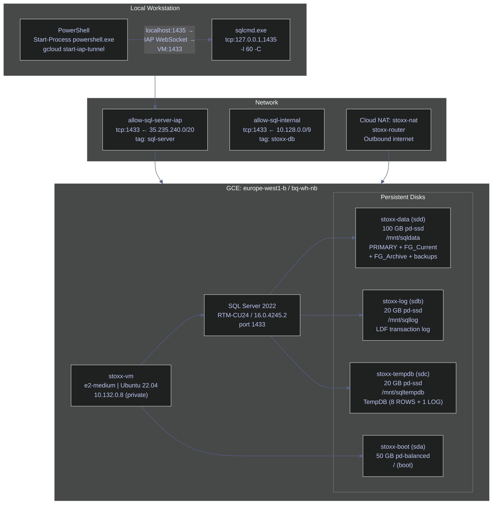

# SQL Server on Compute Engine — Production Deployment

> [!quote] The cloud is just a different datacenter
>
> "The same applies to cloud installations when SQL Server is running within VMs. After all, the cloud is just a different datacenter managed by an external provider."
>
> Source: Dmitri Korotkevitch | *SQL Server Advanced Troubleshooting and Performance Tuning*

This page documents the end-to-end deployment of SQL Server 2022 Developer Edition on the GCE VM `stoxx-vm` (project `bq-wh-nb`, zone `europe-west1-b`), replicating the `stoxx_db` reference database layout currently running in the local Docker container `stoxx-db`. The migration moves from Docker-managed volumes to dedicated persistent disks: a 100 GB SSD for data files, a 20 GB SSD for the transaction log, and a 20 GB SSD for TempDB. This separation delivers independent IOPS budgets per workload tier (hot user data, sequential log writes, and TempDB's sort/hash/spill activity), enables independent snapshot and backup cadences per disk, and allows scaling each disk independently without downtime on the others.

The VM already has three additional disks attached and mounted (completed in page 03):

| Mount point | Device | Disk name | Type | Size | Purpose |
|---|---|---|---|---|---|
| `/mnt/sqldata` | `sdd` | stoxx-data | pd-ssd | 100 GB | MDF + NDF data files, backups |
| `/mnt/sqllog` | `sdb` | stoxx-log | pd-ssd | 20 GB | LDF transaction log |
| `/mnt/sqltempdb` | `sdc` | stoxx-tempdb | pd-ssd | 20 GB | TempDB data and log files |

## Key Definitions

| Term | Definition |
|---|---|
| **Compute Engine** | GCP's IaaS service providing virtual machines. SQL Server runs inside a standard Linux VM, exactly as it would on bare metal. |
| **persistent disk** | GCP's network-attached block storage. Survives VM restarts and can be resized or snapshotted independently of the VM. |
| **filegroup** | A named container for one or more SQL Server data files. Tables and indexes are placed in a filegroup, not directly in a file. |
| **data file (MDF)** | The primary database data file. Every database has exactly one MDF, located in the PRIMARY filegroup. |
| **secondary data file (NDF)** | Additional data files in any filegroup. NDF files distribute I/O across files or disks within a filegroup. |
| **transaction log (LDF)** | The sequential write-ahead log that records every transaction. SQL Server's crash recovery and point-in-time restore depend entirely on an intact, unbroken log chain. |
| **TempDB** | SQL Server's shared workspace database for sorts, hash joins, row versioning (RCSI), temporary tables, and work tables. All user sessions share one TempDB instance. |
| **recovery model** | Controls whether the transaction log is truncated automatically (SIMPLE) or preserved for backup and point-in-time restore (FULL / BULK_LOGGED). |
| **collation** | Character set rules for sorting and comparison. `Latin1_General_100_CI_AS_SC_UTF8` provides case-insensitive, accent-sensitive, supplementary-character-aware UTF-8 storage. |
| **IOPS** | I/O operations per second. pd-ssd delivers up to 30 IOPS/GB for reads and writes, capped at the VM's disk I/O limit. Separating data, log, and TempDB onto distinct disks gives each workload its own IOPS budget. |
| **mssql-conf** | The SQL Server on Linux configuration tool. Writes settings to `/var/opt/mssql/mssql.conf`. Most settings require a service restart to take effect. |
| **sqlcmd** | The SQL Server command-line client. On Linux, installed as part of the `mssql-tools18` package. Requires `-C` (trust server certificate) for connections without a signed TLS certificate. |
| **IAP tunnel** | Identity-Aware Proxy TCP forwarding. Establishes an encrypted WebSocket connection from a local port to a GCE VM port without requiring a public IP or VPN. Required for reaching port 1433 on `--no-address` VMs. |
| **port forwarding** | SSH's `-L` flag or `gcloud compute start-iap-tunnel` forwards a local TCP port through the IAP tunnel to a remote port on the VM. |
| **startup script** | A bash script attached to VM instance metadata under the `startup-script` key. Executed by the guest agent on every VM boot before systemd services reach multi-user target. |

## Conceptual Model



## Installing SQL Server 2022 on Ubuntu

All commands execute on `stoxx-vm` via `gcloud compute ssh stoxx-vm --tunnel-through-iap`. The VM has no external IP (`--no-address`); outbound internet access is provided by Cloud NAT (`stoxx-nat` / `stoxx-router` in `europe-west1`), created before installation.

> [!warning] GPG key import fails over SSH --command with /dev/tty
>
> The standard one-liner `curl ... | gpg --dearmor | sudo tee ...` fails when run via `--command=` because `gpg` tries to open `/dev/tty` for passphrase prompts, which is not available in a non-interactive SSH session.
>
> **Fix:** two-step approach — save the ASC key to a temp file first, then convert with `--batch`.

> [!success] Two-step GPG import for non-interactive SSH
>
> ```bash
> curl -fsSL https://packages.microsoft.com/keys/microsoft.asc \
>   | sudo tee /tmp/microsoft.asc > /dev/null
> sudo gpg --batch --yes --dearmor \
>   -o /usr/share/keyrings/microsoft-prod.gpg /tmp/microsoft.asc
> ```

### Ubuntu | SQL Server 2022 | install

#### Import Microsoft GPG key

**When to run:** before adding any Microsoft package repository on Ubuntu 22.04.
**Trigger:** fresh VM with no Microsoft packages installed.
**Context:** executed via `gcloud compute ssh stoxx-vm --tunnel-through-iap --command="..."`. Requires internet access via Cloud NAT. Read-only side effect: writes `/usr/share/keyrings/microsoft-prod.gpg`.
**Purpose:** establish the cryptographic trust anchor for Microsoft's APT repository so that subsequent `apt-get install` commands can verify package signatures.

*Import the Microsoft GPG key in two steps to avoid the `/dev/tty` error in non-interactive SSH.*

```bash
gcloud compute ssh stoxx-vm --tunnel-through-iap \
  --zone=europe-west1-b --project=bq-wh-nb \
  --command="
    curl -fsSL https://packages.microsoft.com/keys/microsoft.asc \
      | sudo tee /tmp/microsoft.asc > /dev/null
    sudo gpg --batch --yes --dearmor \
      -o /usr/share/keyrings/microsoft-prod.gpg /tmp/microsoft.asc
    echo 'GPG key imported successfully'
  "
```

```text
GPG key imported successfully
```

#### Add SQL Server 2022 APT repository

**When to run:** immediately after GPG key import.
**Trigger:** first-time SQL Server installation on the VM.
**Context:** `gcloud compute ssh --command` on the VM. Writes to `/etc/apt/sources.list.d/mssql-server-2022.list`. The `signed-by=` field is required on Ubuntu 22.04 — without it, APT rejects the repo with `NO_PUBKEY EB3E94ADBE1229CF`.
**Purpose:** register the Microsoft SQL Server 2022 package repository so `apt-get` can discover the `mssql-server` package.

> [!warning] Missing signed-by causes NO_PUBKEY error on Ubuntu 22.04
>
> Ubuntu 22.04's APT requires `signed-by=/path/to/key.gpg` in the repo definition. Writing the list file as downloaded from Microsoft (without `signed-by=`) causes `apt-get update` to fail with `NO_PUBKEY EB3E94ADBE1229CF`.

> [!success] Override the repo file with signed-by field
>
> Write the repository entry manually using `echo ... | sudo tee` to include the `signed-by=` field pointing to the imported GPG key.

*Write the SQL Server 2022 APT repo file with the required `signed-by` field and refresh the package index.*

```bash
gcloud compute ssh stoxx-vm --tunnel-through-iap \
  --zone=europe-west1-b --project=bq-wh-nb \
  --command="
    echo 'deb [arch=amd64,arm64,armhf signed-by=/usr/share/keyrings/microsoft-prod.gpg] \
https://packages.microsoft.com/ubuntu/22.04/mssql-server-2022 jammy main' \
      | sudo tee /etc/apt/sources.list.d/mssql-server-2022.list
    sudo apt-get update -q
  " 2>&1 | grep -E 'deb \[|Get:|Hit:|Err:'
```

```text
deb [arch=amd64,arm64,armhf signed-by=/usr/share/keyrings/microsoft-prod.gpg] https://packages.microsoft.com/ubuntu/22.04/mssql-server-2022 jammy main
Get:5 https://packages.microsoft.com/ubuntu/22.04/mssql-server-2022 jammy InRelease [3624 B]
Get:6 https://packages.microsoft.com/ubuntu/22.04/mssql-server-2022 jammy/main amd64 Packages [10.8 kB]
```

#### Install SQL Server package

**When to run:** after the APT repository is registered and `apt-get update` has completed.
**Trigger:** initial installation; also used to upgrade an existing instance to a new cumulative update.
**Context:** `gcloud compute ssh --command` on the VM. Requires `sudo`. Downloads ~600 MB from packages.microsoft.com. The service is not started automatically — setup requires a subsequent `mssql-conf setup` call.
**Purpose:** install the `mssql-server` binary package on the VM.

*Install `mssql-server` and show the final lines of the package manager output.*

```bash
gcloud compute ssh stoxx-vm --tunnel-through-iap \
  --zone=europe-west1-b --project=bq-wh-nb \
  --command="sudo apt-get install -y mssql-server 2>&1 | tail -15"
```

```text
to complete the setup of Microsoft SQL Server
+--------------------------------------------------------------+

Processing triggers for man-db (2.10.2-1) ...
Processing triggers for libc-bin (2.35-0ubuntu3.13) ...

Running kernel seems to be up-to-date.

No services need to be restarted.
No containers need to be restarted.
No user sessions are running outdated binaries.
No VM guests are running outdated hypervisor (qemu) binaries on this host.
```

#### Run mssql-conf setup

**When to run:** once after package installation, before starting the service for the first time.
**Trigger:** first-time setup. Also required after `mssql-server` version upgrades that reset the EULA acceptance.
**Context:** `gcloud compute ssh --command` on the VM. Uses environment variables to pass edition and SA password non-interactively (the `-n` flag suppresses the interactive prompt). The SA password must satisfy SQL Server's complexity policy: ≥8 characters, with uppercase, lowercase, digit, and special character.
**Purpose:** set the SQL Server edition (Developer), accept the EULA, configure the SA login password, and start the service.

> [!warning] SA password complexity required
>
> SQL Server enforces Windows password policy by default on Linux. A password that is too simple (e.g., `Password1`) causes setup to fail silently or with a cryptic error.

> [!success] Use a strong password and verify with sqlcmd
>
> The password `Stoxx@VM2024!` satisfies the policy. After setup, verify connectivity with `sqlcmd -S localhost -U sa -P '<password>' -C -Q "SELECT @@VERSION"`.

*Run non-interactive setup using environment variables to select Developer edition and set the SA password.*

```bash
gcloud compute ssh stoxx-vm --tunnel-through-iap \
  --zone=europe-west1-b --project=bq-wh-nb \
  --command="sudo MSSQL_SA_PASSWORD='<password>' MSSQL_PID='Developer' \
    /opt/mssql/bin/mssql-conf -n setup accept-eula"
```

```text
ForceFlush is enabled for this instance.
Failed to open password policy registry path. Using default password policy values.
BulkAdmin AllowedPathsList cleared (path filtering disabled)
ForceFlush feature is enabled for log durability.
Created symlink /etc/systemd/system/multi-user.target.wants/mssql-server.service → /lib/systemd/system/mssql-server.service.
The license terms for this product can be found in
/usr/share/doc/mssql-server or downloaded from: https://aka.ms/useterms

The privacy statement can be viewed at:
https://go.microsoft.com/fwlink/?LinkId=853010&clcid=0x409

Configuring SQL Server...
Setup has completed successfully. SQL Server is now starting.
```

The "Failed to open password policy registry path" line is expected on Linux — SQL Server falls back to its built-in default policy (8-character minimum with complexity). "ForceFlush is enabled" confirms write-ahead logging durability is active.

#### Verify SQL Server is running

**When to run:** immediately after `mssql-conf setup` completes.
**Trigger:** post-installation smoke test; also after any restart.
**Context:** `gcloud compute ssh --command` on the VM. Read-only systemctl query. No permissions beyond SSH access required.
**Purpose:** confirm the service is active and record the initial resource footprint (PID and memory).

*Check systemd service status for `mssql-server`.*

```bash
gcloud compute ssh stoxx-vm --tunnel-through-iap \
  --zone=europe-west1-b --project=bq-wh-nb \
  --command="sudo systemctl status mssql-server --no-pager"
```

```text
● mssql-server.service - Microsoft SQL Server Database Engine
     Loaded: loaded (/lib/systemd/system/mssql-server.service; enabled; vendor preset: enabled)
     Active: active (running) since Sun 2026-04-12 19:34:44 UTC; 9s ago
       Docs: https://docs.microsoft.com/en-us/sql/linux
   Main PID: 3413 (sqlservr)
      Tasks: 150
     Memory: 612.6M
        CPU: 11.974s
     CGroup: /system.slice/mssql-server.service
             ├─3413 /opt/mssql/bin/sqlservr
             └─3443 /opt/mssql/bin/sqlservr
```

`Active: active (running)` confirms the service started. The two `sqlservr` PIDs (3413 and 3443) are normal — the outer process is the supervisor and the inner process is the SQL Server engine. Initial memory of 612.6 MB reflects the default `max server memory` setting; this will be tuned in the server configuration note.

#### Install mssql-tools18 and unixODBC

**When to run:** after `mssql-server` is running; before any local `sqlcmd` calls from the VM.
**Trigger:** first-time setup. Tools are not installed as part of the server package.
**Context:** requires a second Microsoft repository (`prod.list`) for the tools package. The `mssql-tools18` package provides `sqlcmd` and `bcp` at `/opt/mssql-tools18/bin/`.
**Purpose:** install `sqlcmd` so SQL commands can be executed directly on the VM via SSH.

*Register the Microsoft `prod` APT repository and install `mssql-tools18` and `unixodbc-dev`.*

```bash
gcloud compute ssh stoxx-vm --tunnel-through-iap \
  --zone=europe-west1-b --project=bq-wh-nb \
  --command="
    curl -fsSL https://packages.microsoft.com/config/ubuntu/22.04/prod.list \
      | sudo tee /tmp/mssql-prod.list
    echo \"deb [arch=amd64,arm64,armhf signed-by=/usr/share/keyrings/microsoft-prod.gpg] \
https://packages.microsoft.com/ubuntu/22.04/prod jammy main\" \
      | sudo tee /etc/apt/sources.list.d/mssql-prod.list
    sudo apt-get update -q && \
    sudo ACCEPT_EULA=Y apt-get install -y mssql-tools18 unixodbc-dev 2>&1 | tail -5
  "
```

```text
Get:5 https://packages.microsoft.com/ubuntu/22.04/prod jammy InRelease [3632 B]
Get:7 https://packages.microsoft.com/ubuntu/22.04/prod jammy/main arm64 Packages [144 kB]
Get:8 https://packages.microsoft.com/ubuntu/22.04/prod jammy/main amd64 Packages [324 kB]
No services need to be restarted.
No user sessions are running outdated binaries.
```

#### Add tools to PATH and verify connectivity

**When to run:** after `mssql-tools18` is installed.
**Trigger:** first-time setup. Also required in any new shell session on the VM until the `~/.bashrc` change takes effect.
**Context:** appends to `~/.bashrc`. The `-C` flag trusts the self-signed server certificate (required for all local connections without a CA-issued cert). `@@VERSION` returns the full SQL Server build string confirming the installed version.
**Purpose:** make `sqlcmd` available on PATH and confirm SQL Server accepts connections.

*Add `/opt/mssql-tools18/bin` to PATH and query `@@VERSION` to confirm the installed build.*

```bash
gcloud compute ssh stoxx-vm --tunnel-through-iap \
  --zone=europe-west1-b --project=bq-wh-nb \
  --command="
    echo 'export PATH=\"\$PATH:/opt/mssql-tools18/bin\"' >> ~/.bashrc
    /opt/mssql-tools18/bin/sqlcmd -S localhost -U sa -P '<password>' -C \
      -Q \"SELECT @@VERSION AS version\"
  "
```

```text
Microsoft SQL Server 2022 (RTM-CU24) (KB5080999) - 16.0.4245.2 (X64)
	Feb 25 2026 15:01:38
	Copyright (C) 2022 Microsoft Corporation
	Developer Edition (64-bit) on Linux (Ubuntu 22.04.5 LTS) <X64>

(1 rows affected)
```

SQL Server 2022 RTM-CU24 (KB5080999, build 16.0.4245.2, released 2026-02-25) is running on Ubuntu 22.04.5 LTS. Developer Edition includes all Enterprise features and is licensed for development and testing only — not for production workloads.

> [!info] The `-C` flag (trust server certificate)
>
> SQL Server on Linux generates a self-signed TLS certificate during setup. Without `-C`, `sqlcmd` rejects the connection with "SSL Provider: [error:0A000086:SSL routines::certificate verify failed]". The flag is appropriate for local connections where the certificate identity is not meaningful. For production remote connections, install a CA-signed certificate and remove `-C`.

| Flag | Syntax | Description |
|---|---|---|
| `-S` | `-S <host>` or `-S <host>,<port>` | Server address. Use `localhost` for local connections; use `tcp:127.0.0.1,<port>` when connecting through a forwarded port. |
| `-U` | `-U sa` | Login name. `sa` is the SQL Server Administrator account. |
| `-P` | `-P '<password>'` | Password for the login. |
| `-C` | `-C` | Trust the server's self-signed TLS certificate without CA validation. |
| `-Q` | `-Q "query"` | Execute a query and exit immediately. |
| `-q` | `-q "query"` | Execute a query but remain in interactive mode. |
| `-d` | `-d stoxx_db` | Connect to a specific database on login. |
| `-l` | `-l 60` | Login timeout in seconds. Default is 30 s; set to 60 s when connecting through an IAP tunnel. |
| `-s` | `-s'|'` | Column separator. Use `'|'` for pipe-separated output suitable for markdown table conversion. |
| `-i` | `-i script.sql` | Execute a SQL script file. |
| `-o` | `-o output.txt` | Write output to a file instead of stdout. |

> [!example]- Terraform equivalent — Cloud NAT (prerequisite for apt-get)
>
> ```hcl
> resource "google_compute_router" "stoxx_router" {
>   name    = "stoxx-router"
>   region  = "europe-west1"
>   network = "default"
>   project = "bq-wh-nb"
>   description = "Router for stoxx-vm outbound NAT"
> }
>
> resource "google_compute_router_nat" "stoxx_nat" {
>   name                               = "stoxx-nat"
>   router                             = google_compute_router.stoxx_router.name
>   region                             = "europe-west1"
>   project                            = "bq-wh-nb"
>   nat_ip_allocate_option             = "AUTO_ONLY"
>   source_subnetwork_ip_ranges_to_nat = "ALL_SUBNETWORKS_ALL_IP_RANGES"
> }
> ```

## Configuring SQL Server File Paths

After installation, SQL Server defaults to `/var/opt/mssql/data/` for all files. The three `mssql-conf set` commands redirect default locations to the dedicated persistent disks before any user databases are created. All three settings require a service restart to take effect.

### Ubuntu | mssql-conf | configure file locations

#### Set default data and log directories

**When to run:** immediately after installation, before creating any user databases.
**Trigger:** initial server setup; also if the data disk mount point changes.
**Context:** `gcloud compute ssh --command`. Each `mssql-conf set` writes a key-value pair to `/var/opt/mssql/mssql.conf`. Requires `sudo`. Changes take effect after `systemctl restart mssql-server`.
**Purpose:** redirect SQL Server's default data file location to `/mnt/sqldata`, log file location to `/mnt/sqllog`, and crash dump location to `/mnt/sqldata/dump`.

*Set `defaultdatadir`, `defaultlogdir`, and `defaultdumpdir` to the dedicated persistent disk mount points.*

```bash
gcloud compute ssh stoxx-vm --tunnel-through-iap \
  --zone=europe-west1-b --project=bq-wh-nb \
  --command="
    echo '=== Set default data dir ==='
    sudo /opt/mssql/bin/mssql-conf set filelocation.defaultdatadir /mnt/sqldata
    echo '=== Set default log dir ==='
    sudo /opt/mssql/bin/mssql-conf set filelocation.defaultlogdir /mnt/sqllog
    echo '=== Set default dump dir ==='
    sudo /opt/mssql/bin/mssql-conf set filelocation.defaultdumpdir /mnt/sqldata/dump
  "
```

```text
=== Set default data dir ===
SQL Server needs to be restarted in order to apply this setting. Please run
'systemctl restart mssql-server.service'.
Note that sp_reload_mssqlconf can be used to apply a limited subset of settings without restarting the service.
=== Set default log dir ===
SQL Server needs to be restarted in order to apply this setting. Please run
'systemctl restart mssql-server.service'.
Note that sp_reload_mssqlconf can be used to apply a limited subset of settings without restarting the service.
=== Set default dump dir ===
SQL Server needs to be restarted in order to apply this setting. Please run
'systemctl restart mssql-server.service'.
```

The repeated restart prompt is expected and correct — all three settings will be applied in a single restart in the next step.

#### Set ownership and restart SQL Server

**When to run:** after all `mssql-conf set` commands are complete, before any database creation.
**Trigger:** initial setup. Also after adding new disk mount points or changing the `mssql` user's UID.
**Context:** `gcloud compute ssh --command` with `sudo`. The `mssql` system user owns all SQL Server files. Without this ownership, SQL Server cannot write to the mount points and database creation fails with an OS error.
**Purpose:** transfer ownership of all three mount points to `mssql:mssql` and restart the service so the new file path configuration takes effect.

*Change ownership of all three disk mount points to the `mssql` system user and restart the service.*

```bash
gcloud compute ssh stoxx-vm --tunnel-through-iap \
  --zone=europe-west1-b --project=bq-wh-nb \
  --command="
    echo '=== Set ownership ==='
    sudo chown -R mssql:mssql /mnt/sqldata /mnt/sqllog /mnt/sqltempdb
    ls -la /mnt/ | grep -E 'sqldata|sqllog|sqltempdb'
    echo '=== Restart SQL Server ==='
    sudo systemctl restart mssql-server
    sleep 5
    sudo systemctl status mssql-server --no-pager | head -12
  "
```

```text
=== Set ownership ===
drwxr-xr-x  4 mssql mssql 4096 Apr 12 19:35 sqldata
drwxr-xr-x  3 mssql mssql 4096 Apr 12 19:04 sqllog
drwxr-xr-x  3 mssql mssql 4096 Apr 12 19:04 sqltempdb
=== Restart SQL Server ===
● mssql-server.service - Microsoft SQL Server Database Engine
     Loaded: loaded (/lib/systemd/system/mssql-server.service; enabled; vendor preset: enabled)
     Active: active (running) since Sun 2026-04-12 19:35:53 UTC; 5s ago
       Docs: https://docs.microsoft.com/en-us/sql/linux
   Main PID: 4568 (sqlservr)
      Tasks: 141
     Memory: 544.2M
        CPU: 6.279s
```

New PID 4568 confirms the restart completed. Memory of 544.2 MB is lower than immediately after first startup because SQL Server has not yet started user activity.

#### Verify mssql.conf settings

**When to run:** after restart, to confirm the configuration file contains the expected values before database creation.
**Trigger:** post-restart verification; also useful for debugging if databases are created in the wrong location.
**Context:** `gcloud compute ssh --command` with `sudo cat`. Read-only. The file is at `/var/opt/mssql/mssql.conf`.
**Purpose:** confirm that all three `filelocation` keys are written correctly in the configuration file.

*Read the current `/var/opt/mssql/mssql.conf` to confirm file path settings.*

```bash
gcloud compute ssh stoxx-vm --tunnel-through-iap \
  --zone=europe-west1-b --project=bq-wh-nb \
  --command="sudo cat /var/opt/mssql/mssql.conf"
```

```text
[sqlagent]
enabled = false

[EULA]
accepteula = Y

[filelocation]
defaultdatadir = /mnt/sqldata
defaultlogdir = /mnt/sqllog
defaultdumpdir = /mnt/sqldata/dump
```

All three `filelocation` keys point to the dedicated disk mount points. `sqlagent = false` is the default; SQL Server Agent can be enabled separately when scheduled jobs are needed.

| Flag | Syntax | Description |
|---|---|---|
| `set` | `mssql-conf set <section>.<key> <value>` | Write a key-value pair to `/var/opt/mssql/mssql.conf`. Most settings require restart. |
| `get` | `mssql-conf get <section>.<key>` | Read the current value of a setting. |
| `unset` | `mssql-conf unset <section>.<key>` | Remove a setting, reverting to the SQL Server default. |
| `list` | `mssql-conf list` | List all configured (non-default) settings. |
| `setup` | `mssql-conf setup` | Run the interactive first-time setup wizard (edition selection, EULA, SA password). |
| `-n` | `mssql-conf -n setup` | Non-interactive setup; reads edition and password from environment variables. |
| `traceflag` | `mssql-conf traceflag <N> on/off` | Enable or disable a SQL Server trace flag persistently. |

## Configuring TempDB

TempDB is SQL Server's shared temporary workspace used by all sessions for operations including sorts, hash joins, row version store (required by RCSI), temporary tables, and work tables from the query optimizer. On a single-disk system, TempDB competes with user data files for I/O, creating latency spikes during high-sort or high-version-store activity. Placing TempDB on its own disk (`/mnt/sqltempdb`) isolates this I/O entirely.

The default TempDB on Linux ships with 8 equally-sized data files (SQL Server 2019+ default) and 1 log file. Moving all files to `/mnt/sqltempdb` requires changing each file's `FILENAME` attribute via `ALTER DATABASE tempdb MODIFY FILE`, then restarting the service — TempDB files cannot be moved while SQL Server is running.

### Ubuntu | TempDB | configure files

#### Move TempDB files to dedicated disk

**When to run:** after `mssql-conf` file path configuration and before creating any user databases. TempDB must be on its dedicated disk before production-level RCSI workloads begin.
**Trigger:** initial server setup. Also required if the TempDB disk is replaced or remounted.
**Context:** `gcloud compute ssh --command` with `sqlcmd`. T-SQL DDL — modifies the system catalog but does not move files on disk until the next restart. Requires `sysadmin` rights. Changes take effect after `systemctl restart mssql-server`.
**Purpose:** redirect all 8 TempDB data files and the TempDB log file from the default `/var/opt/mssql/data/` path to `/mnt/sqltempdb/`.

> [!info]- T-SQL clause breakdown
>
> - `USE master` — required because `tempdb` cannot be the active database for DDL affecting its own files.
> - `ALTER DATABASE tempdb MODIFY FILE (NAME = 'tempdev', FILENAME = '/mnt/sqltempdb/tempdb.mdf')` — changes the path recorded in the system catalog for logical file `tempdev`. The physical file is not moved until the next SQL Server restart.
> - The 8 data file names follow the pattern `tempdev`, `tempdev2` … `tempdev8`; the log file is named `templog`.

*Move all 9 TempDB files (8 ROWS data files + 1 LOG file) to `/mnt/sqltempdb/`.*

```bash
gcloud compute ssh stoxx-vm --tunnel-through-iap \
  --zone=europe-west1-b --project=bq-wh-nb \
  --command="/opt/mssql-tools18/bin/sqlcmd -S localhost -U sa -P '<password>' -C -Q \"
USE master;
ALTER DATABASE tempdb MODIFY FILE (NAME = 'tempdev',  FILENAME = '/mnt/sqltempdb/tempdb.mdf');
ALTER DATABASE tempdb MODIFY FILE (NAME = 'tempdev2', FILENAME = '/mnt/sqltempdb/tempdb2.ndf');
ALTER DATABASE tempdb MODIFY FILE (NAME = 'tempdev3', FILENAME = '/mnt/sqltempdb/tempdb3.ndf');
ALTER DATABASE tempdb MODIFY FILE (NAME = 'tempdev4', FILENAME = '/mnt/sqltempdb/tempdb4.ndf');
ALTER DATABASE tempdb MODIFY FILE (NAME = 'tempdev5', FILENAME = '/mnt/sqltempdb/tempdb5.ndf');
ALTER DATABASE tempdb MODIFY FILE (NAME = 'tempdev6', FILENAME = '/mnt/sqltempdb/tempdb6.ndf');
ALTER DATABASE tempdb MODIFY FILE (NAME = 'tempdev7', FILENAME = '/mnt/sqltempdb/tempdb7.ndf');
ALTER DATABASE tempdb MODIFY FILE (NAME = 'tempdev8', FILENAME = '/mnt/sqltempdb/tempdb8.ndf');
ALTER DATABASE tempdb MODIFY FILE (NAME = 'templog',  FILENAME = '/mnt/sqltempdb/templog.ldf');
\""
```

```text
Changed database context to 'master'.
The file "tempdev" has been modified in the system catalog. The new path will be used the next time the database is started.
The file "tempdev2" has been modified in the system catalog. The new path will be used the next time the database is started.
The file "templog" has been modified in the system catalog. The new path will be used the next time the database is started.
```

The message "The new path will be used the next time the database is started" is expected for all 9 files. After restart, SQL Server creates the files at the new path and deletes the old ones from `/var/opt/mssql/data/`.

#### Restart and verify TempDB file placement

**When to run:** immediately after all 9 `MODIFY FILE` statements succeed.
**Trigger:** required for TempDB file moves to take effect.
**Context:** `gcloud compute ssh --command`. Restart is the only way to apply TempDB file moves. The `sys.master_files` catalog view reflects the actual physical path after restart.
**Purpose:** apply the file moves and confirm all 9 TempDB files are on `/mnt/sqltempdb/`.

*Restart SQL Server and verify TempDB file placement via `sys.master_files`.*

```bash
gcloud compute ssh stoxx-vm --tunnel-through-iap \
  --zone=europe-west1-b --project=bq-wh-nb \
  --command="
    sudo systemctl restart mssql-server && sleep 8
    /opt/mssql-tools18/bin/sqlcmd -S localhost -U sa -P '<password>' -C \
      -Q \"SELECT name, physical_name, size*8/1024 AS size_mb, \
                growth*8/1024 AS growth_mb, type_desc \
             FROM sys.master_files WHERE database_id = 2 ORDER BY file_id\" \
      -s'|'
  "
```

| name | physical_name | size_mb | growth_mb | type_desc |
|---|---|---|---|---|
| tempdev | /mnt/sqltempdb/tempdb.mdf | 136 | 64 | ROWS |
| templog | /mnt/sqltempdb/templog.ldf | 64 | 64 | LOG |
| tempdev2 | /mnt/sqltempdb/tempdb2.ndf | 136 | 64 | ROWS |
| tempdev3 | /mnt/sqltempdb/tempdb3.ndf | 136 | 64 | ROWS |
| tempdev4 | /mnt/sqltempdb/tempdb4.ndf | 136 | 64 | ROWS |
| tempdev5 | /mnt/sqltempdb/tempdb5.ndf | 136 | 64 | ROWS |
| tempdev6 | /mnt/sqltempdb/tempdb6.ndf | 136 | 64 | ROWS |
| tempdev7 | /mnt/sqltempdb/tempdb7.ndf | 136 | 64 | ROWS |
| tempdev8 | /mnt/sqltempdb/tempdb8.ndf | 136 | 64 | ROWS |

*(9 rows affected)*

All 9 files are on `/mnt/sqltempdb/`. The 8 ROWS files are 136 MB each (1,088 MB total for data) with 64 MB autogrowth; the LOG file starts at 64 MB with 64 MB autogrowth.

> [!info] Why TempDB gets its own disk
>
> TempDB is the most heavily written system database on an active SQL Server instance. It handles four distinct I/O streams simultaneously:
>
> - **Sort spills** — queries that exceed the memory grant write sort runs to TempDB.
> - **Hash join spills** — large joins that exceed the grant write hash buckets to TempDB.
> - **Row version store** — `READ_COMMITTED_SNAPSHOT` and `SNAPSHOT ISOLATION` write every modified row version to TempDB. On a write-heavy OLAP workload, this can exceed 1 GB/min.
> - **Temporary tables and table variables** — application code that creates and populates large `#temp` tables writes to TempDB.
>
> Mixing TempDB I/O with user data I/O on the same disk creates latency spikes that affect all queries. A dedicated pd-ssd provides isolated IOPS (up to 30 IOPS/GB on GCE) so TempDB pressure does not degrade user reads and writes.
>
> Using 8 equally-sized data files (the SQL Server 2019+ default) eliminates SGAM and PFS contention that occurs with a single TempDB file under concurrent workloads. All 8 files must be the same size so SQL Server's proportional-fill algorithm distributes writes evenly across them.

## Creating the stoxx_db Database

`stoxx_db` is the reference production-pattern database whose layout replicates the Docker container `stoxx-db`. The filegroup design separates hot/active data from cold/historical data, and places the transaction log on a dedicated disk:

- **PRIMARY** — one MDF file on `/mnt/sqldata/`. Holds the system catalog objects only.
- **FG_Current** (default filegroup) — two NDF files on `/mnt/sqldata/`. Holds active pricing data, current index compositions, and live signals. Two files distribute I/O across two ROWS allocations within the same disk.
- **FG_Archive** — one NDF file on `/mnt/sqldata/`. Holds historical data accessed infrequently (OHLCV history, archive-period signals). Separate filegroup enables future migration to cheaper cold storage by moving only the archive filegroup.
- **LOG** — one LDF file on `/mnt/sqllog/`. Sequential writes to the transaction log do not benefit from multiple files; a single LDF on a dedicated disk achieves optimal throughput.

### Ubuntu | stoxx_db | create and configure

#### Create stoxx_db with full filegroup layout

**When to run:** after TempDB is configured and all disk mount points are confirmed.
**Trigger:** initial database creation.
**Context:** `gcloud compute ssh --command` with `sqlcmd`. DDL executed as `sa`. `CREATE DATABASE` with explicit file specifications overrides the `defaultdatadir` and `defaultlogdir` settings from `mssql-conf` — the per-file `FILENAME` parameters take precedence.
**Purpose:** create the `stoxx_db` database with the exact file layout matching the Docker baseline: PRIMARY + FG_Current (2 files) + FG_Archive, log on a separate disk.

> [!info]- CREATE DATABASE clause breakdown
>
> - `ON PRIMARY (NAME=..., FILENAME=..., SIZE=128MB, MAXSIZE=1024MB, FILEGROWTH=64MB)` — creates the primary data file in the PRIMARY filegroup. `SIZE` sets the initial allocation (pre-allocated on disk). `MAXSIZE` caps growth to prevent runaway autogrowth from filling the disk. `FILEGROWTH=64MB` specifies a fixed increment rather than a percentage to keep growth events predictable.
> - `FILEGROUP FG_Current (NAME=..., ...)` — creates a named filegroup with two NDF files. SQL Server distributes new extent allocations across files within a filegroup using proportional fill, so both files must be the same size.
> - `FILEGROUP FG_Archive (...)` — a separate filegroup for cold/historical data. Keeping it separate allows independent filegroup-level backups and future migration to read-only storage.
> - `LOG ON (NAME=..., FILENAME=..., SIZE=256MB, ...)` — the transaction log. A single LDF per database is the standard pattern; the path points to the dedicated log disk.

*Create `stoxx_db` replicating the Docker container layout with 3 data filegroups and a dedicated log file.*

```bash
gcloud compute ssh stoxx-vm --tunnel-through-iap \
  --zone=europe-west1-b --project=bq-wh-nb \
  --command="/opt/mssql-tools18/bin/sqlcmd -S localhost -U sa -P '<password>' -C -Q \"
CREATE DATABASE stoxx_db
ON PRIMARY
  (NAME = stoxx_db_Primary,
   FILENAME = '/mnt/sqldata/stoxx_db_Primary.mdf',
   SIZE = 128MB, MAXSIZE = 1024MB, FILEGROWTH = 64MB),
FILEGROUP FG_Current
  (NAME = stoxx_db_Current_01,
   FILENAME = '/mnt/sqldata/stoxx_db_Current_01.ndf',
   SIZE = 256MB, MAXSIZE = 4096MB, FILEGROWTH = 128MB),
  (NAME = stoxx_db_Current_02,
   FILENAME = '/mnt/sqldata/stoxx_db_Current_02.ndf',
   SIZE = 256MB, MAXSIZE = 4096MB, FILEGROWTH = 128MB),
FILEGROUP FG_Archive
  (NAME = stoxx_db_Archive_01,
   FILENAME = '/mnt/sqldata/stoxx_db_Archive_01.ndf',
   SIZE = 128MB, MAXSIZE = 2048MB, FILEGROWTH = 64MB)
LOG ON
  (NAME = stoxx_db_Log,
   FILENAME = '/mnt/sqllog/stoxx_db_Log.ldf',
   SIZE = 256MB, MAXSIZE = 2048MB, FILEGROWTH = 128MB);
\""
```

No output from `CREATE DATABASE` indicates success — SQL Server emits no rows for DDL statements when they complete without error.

#### Configure filegroups

**When to run:** immediately after `CREATE DATABASE` succeeds.
**Trigger:** initial setup. These properties are not set by `CREATE DATABASE` and must be configured separately.
**Context:** `gcloud compute ssh --command` with `sqlcmd`. Three `ALTER DATABASE` statements. `AUTOGROW_ALL_FILES` syntax does not use the `SET` keyword — this is a common syntax error.
**Purpose:** make `FG_Current` the default filegroup so tables created without an explicit `ON <filegroup>` clause land on the active data disk; enable `AUTOGROW_ALL_FILES` on both user filegroups so all files in each filegroup grow simultaneously rather than sequentially.

> [!warning] AUTOGROW_ALL_FILES syntax error — no SET keyword
>
> `ALTER DATABASE stoxx_db MODIFY FILEGROUP FG_Current SET AUTOGROW_ALL_FILES` raises Msg 156, "Incorrect syntax near the keyword 'SET'".

> [!success] Correct syntax omits SET
>
> `ALTER DATABASE stoxx_db MODIFY FILEGROUP FG_Current AUTOGROW_ALL_FILES;`

*Set FG_Current as the default filegroup and enable AUTOGROW_ALL_FILES on both user filegroups.*

```bash
gcloud compute ssh stoxx-vm --tunnel-through-iap \
  --zone=europe-west1-b --project=bq-wh-nb \
  --command="/opt/mssql-tools18/bin/sqlcmd -S localhost -U sa -P '<password>' -C -Q \"
ALTER DATABASE stoxx_db MODIFY FILEGROUP FG_Current DEFAULT;
PRINT 'FG_Current is now default filegroup';
ALTER DATABASE stoxx_db MODIFY FILEGROUP FG_Current AUTOGROW_ALL_FILES;
PRINT 'AUTOGROW_ALL_FILES enabled on FG_Current';
ALTER DATABASE stoxx_db MODIFY FILEGROUP FG_Archive AUTOGROW_ALL_FILES;
PRINT 'AUTOGROW_ALL_FILES enabled on FG_Archive';
\""
```

```text
The filegroup property 'DEFAULT' has been set.
The filegroup property 'AUTOGROW_ALL_FILES' has been set.
The filegroup property 'AUTOGROW_ALL_FILES' has been set.
Filegroup configuration complete
```

`AUTOGROW_ALL_FILES` on `FG_Current` ensures that when the filegroup hits its autogrowth threshold, both `stoxx_db_Current_01.ndf` and `stoxx_db_Current_02.ndf` grow by 128 MB simultaneously — maintaining proportional fill balance. Without this setting, SQL Server grows only the fullest file, degrading I/O distribution over time.

#### Set database options

**When to run:** immediately after filegroup configuration.
**Trigger:** initial setup. These options are not inherited from a model database template — they must be set explicitly.
**Context:** `gcloud compute ssh --command` with `sqlcmd`. Each `ALTER DATABASE` statement is idempotent. `READ_COMMITTED_SNAPSHOT ON` briefly acquires a schema lock on `stoxx_db` and requires no other connections during the `ALTER`. `COLLATE` is a one-time setting at creation; changing it later requires rebuilding all string-column indexes.
**Purpose:** enable the production configuration: FULL recovery for point-in-time restore, RCSI for optimistic read concurrency, snapshot isolation for read consistency under write contention, UTF-8 collation, Query Store for workload analysis, and compatibility level 160 for SQL Server 2022 optimizer features.

*Set all six database-level options in a single sqlcmd call.*

```bash
gcloud compute ssh stoxx-vm --tunnel-through-iap \
  --zone=europe-west1-b --project=bq-wh-nb \
  --command="/opt/mssql-tools18/bin/sqlcmd -S localhost -U sa -P '<password>' -C -Q \"
ALTER DATABASE stoxx_db SET RECOVERY FULL;
PRINT 'RECOVERY FULL set';
ALTER DATABASE stoxx_db SET READ_COMMITTED_SNAPSHOT ON;
PRINT 'READ_COMMITTED_SNAPSHOT ON set';
ALTER DATABASE stoxx_db SET ALLOW_SNAPSHOT_ISOLATION ON;
PRINT 'ALLOW_SNAPSHOT_ISOLATION ON set';
ALTER DATABASE stoxx_db COLLATE Latin1_General_100_CI_AS_SC_UTF8;
PRINT 'Collation set';
ALTER DATABASE stoxx_db SET QUERY_STORE = ON;
PRINT 'QUERY_STORE ON set';
ALTER DATABASE stoxx_db SET COMPATIBILITY_LEVEL = 160;
PRINT 'Compatibility level 160 set';
\""
```

```text
RECOVERY FULL set
READ_COMMITTED_SNAPSHOT ON set
ALLOW_SNAPSHOT_ISOLATION ON set
Collation set
QUERY_STORE ON set
Compatibility level 160 set
```

#### Verify database file layout

**When to run:** after all database configuration steps complete.
**Trigger:** post-creation verification; run this query whenever a discrepancy between the documented and actual layout is suspected.
**Context:** `gcloud compute ssh --command` with `sqlcmd`. Read-only query against `stoxx_db.sys.database_files` and `stoxx_db.sys.filegroups`. Returns one row per file.
**Purpose:** confirm that all 5 files match the Docker baseline in path, filegroup assignment, initial size, autogrowth increment, maximum size, and file type.

*Query `sys.database_files` joined to `sys.filegroups` to produce a complete file layout report.*

```bash
gcloud compute ssh stoxx-vm --tunnel-through-iap \
  --zone=europe-west1-b --project=bq-wh-nb \
  --command="/opt/mssql-tools18/bin/sqlcmd -S localhost -U sa -P '<password>' -C -Q \"
SELECT
    f.name        AS logical_name,
    f.physical_name,
    fg.name       AS filegroup,
    f.size*8/1024 AS size_mb,
    f.growth*8/1024 AS growth_mb,
    f.max_size*8/1024 AS maxsize_mb,
    f.type_desc
FROM stoxx_db.sys.database_files f
LEFT JOIN stoxx_db.sys.filegroups fg ON f.data_space_id = fg.data_space_id
ORDER BY f.file_id;
\" -s'|'"
```

| logical_name | physical_name | filegroup | size_mb | growth_mb | maxsize_mb | type_desc |
|---|---|---|---|---|---|---|
| stoxx_db_Primary | /mnt/sqldata/stoxx_db_Primary.mdf | PRIMARY | 128 | 64 | 1024 | ROWS |
| stoxx_db_Log | /mnt/sqllog/stoxx_db_Log.ldf | NULL | 256 | 128 | 2048 | LOG |
| stoxx_db_Current_01 | /mnt/sqldata/stoxx_db_Current_01.ndf | FG_Current | 256 | 128 | 4096 | ROWS |
| stoxx_db_Current_02 | /mnt/sqldata/stoxx_db_Current_02.ndf | FG_Current | 256 | 128 | 4096 | ROWS |
| stoxx_db_Archive_01 | /mnt/sqldata/stoxx_db_Archive_01.ndf | FG_Archive | 128 | 64 | 2048 | ROWS |

*(5 rows affected)*

The layout matches the Docker baseline exactly. `filegroup = NULL` for the log file is correct — transaction log files do not belong to a filegroup in SQL Server's catalog; they use a separate data space.

> [!info] Filegroup design rationale
>
> **FG_Current (default):** Active pricing data, live index compositions, and current signals land here automatically — any `CREATE TABLE` without an explicit `ON <filegroup>` clause uses the default. Two NDF files allow SQL Server's proportional-fill algorithm to spread new extent allocations across both files, doubling the effective write parallelism within the disk.
>
> **FG_Archive:** Cold and historical data is explicitly placed in this filegroup via `CREATE TABLE ... ON FG_Archive`. Separating it from FG_Current means the archive filegroup can be marked `READ_ONLY` after a period closes, eliminating its log overhead and enabling filegroup-level backups of just the archive tier.
>
> **LOG on `/mnt/sqllog`:** Transaction log writes are sequential by design — SQL Server writes to the end of the LDF in strict LSN order. A dedicated disk eliminates latency from competing random reads from the data disk. The FULL recovery model preserves every log record for point-in-time restore and log shipping.

#### Verify database options

**When to run:** after setting all six database options.
**Trigger:** post-setup confirmation; also useful during audits to compare GCE and Docker instances.
**Context:** read-only query against `sys.databases`. Returns one row.
**Purpose:** confirm all six configured options match the Docker baseline settings.

*Query `sys.databases` for all configured option columns on `stoxx_db`.*

```bash
gcloud compute ssh stoxx-vm --tunnel-through-iap \
  --zone=europe-west1-b --project=bq-wh-nb \
  --command="/opt/mssql-tools18/bin/sqlcmd -S localhost -U sa -P '<password>' -C -Q \"
SELECT
    name,
    recovery_model_desc,
    collation_name,
    compatibility_level,
    is_read_committed_snapshot_on,
    snapshot_isolation_state_desc,
    is_query_store_on
FROM sys.databases
WHERE name = 'stoxx_db';
\" -s'|'"
```

| name | recovery_model_desc | collation_name | compatibility_level | is_read_committed_snapshot_on | snapshot_isolation_state_desc | is_query_store_on |
|---|---|---|---|---|---|---|
| stoxx_db | FULL | Latin1_General_100_CI_AS_SC_UTF8 | 160 | 1 | ON | 1 |

*(1 rows affected)*

All six settings match the Docker baseline: FULL recovery, UTF-8 collation, SQL Server 2022 compatibility (160), RCSI enabled (`is_read_committed_snapshot_on = 1`), snapshot isolation active (`ON`), and Query Store enabled (`is_query_store_on = 1`).

## Remote Connectivity via IAP Tunnel

`stoxx-vm` has no external IP address (`--no-address`). Remote `sqlcmd` connections from a local workstation reach port 1433 through GCP's Identity-Aware Proxy TCP forwarding layer. The IAP service acts as a broker: the local `gcloud` client opens a WebSocket connection to `tunnel.cloudproxy.app`, the IAP service verifies IAM credentials, and the connection is forwarded to the VM's port 1433 over the internal network. No public firewall rule exposing port 1433 is needed.

> [!warning] gcloud start-iap-tunnel WinError 10038 on Windows
>
> On Windows, running `gcloud compute start-iap-tunnel` in a bash shell (Git Bash / WSL2) fails with `WinError 10038: An operation was attempted on something that is not a socket`. This is a known issue with Python socket handling when gcloud's Python runtime bridges the Windows socket API through a POSIX-emulation layer.

> [!success] Launch the IAP tunnel via a PowerShell subprocess
>
> Invoke `gcloud` inside a native `powershell.exe` process launched via `Start-Process`. This sidesteps the socket bridging issue because gcloud runs in a Windows-native environment.
>
> ```powershell
> $proc = Start-Process -NoNewWindow -FilePath "powershell.exe" `
>   -ArgumentList @("-Command", "gcloud compute start-iap-tunnel stoxx-vm 1433 `
>     --local-host-port=localhost:1435 --zone=europe-west1-b --project=bq-wh-nb") `
>   -PassThru
> Write-Output "IAP tunnel PID: $($proc.Id)"
> Start-Sleep 15
> netstat -ano | findstr 1435
> ```

### Windows | IAP tunnel | connect to SQL Server

#### Start IAP tunnel on local port 1435

**When to run:** before any local `sqlcmd` session targeting `stoxx-vm`. The tunnel must be running in the background for the duration of the session.
**Trigger:** whenever a local SQL Client (sqlcmd, SSMS, Azure Data Studio) needs to connect to `stoxx-vm`.
**Context:** PowerShell on the local workstation. Requires `gcloud` CLI authenticated with an account that has `roles/iap.tunnelResourceAccessor` on the project. The `allow-sql-server-iap` firewall rule must exist (see Firewall Rules section).
**Purpose:** open a local TCP listener on `localhost:1435` that forwards to `stoxx-vm:1433` through the IAP service.

*Start the IAP tunnel via a PowerShell subprocess and confirm the local port is listening.*

```powershell
$proc = Start-Process -NoNewWindow -FilePath "powershell.exe" -ArgumentList @(
    "-Command",
    "gcloud compute start-iap-tunnel stoxx-vm 1433 --local-host-port=localhost:1435 --zone=europe-west1-b --project=bq-wh-nb"
) -PassThru
Write-Output "IAP tunnel PID: $($proc.Id)"
Start-Sleep 15
netstat -ano | findstr 1435
```

```text
IAP tunnel PID: 13640
WARNING:
To increase the performance of the tunnel, consider installing NumPy.
Testing if tunnel connection works.
  TCP    127.0.0.1:1435         0.0.0.0:0              LISTENING       18136
  TCP    [::1]:1435             [::]:0                 LISTENING       18136
```

`LISTENING` on both `127.0.0.1:1435` and `[::1]:1435` confirms the local port is open. The NumPy warning is informational — the tunnel functions without NumPy but throughput may be lower for bulk operations.

#### Connect from local machine

**When to run:** after the IAP tunnel is established on `localhost:1435`.
**Trigger:** any interactive SQL session, schema inspection, or ad-hoc query from the local workstation.
**Context:** `sqlcmd.exe` (ODBC 18 driver) on the local Windows workstation. The `-l 60` login timeout is required — the IAP WebSocket handshake takes longer than the default 30-second timeout. Use `tcp:` prefix to force TCP protocol and avoid named-pipe fallback.
**Purpose:** confirm end-to-end connectivity from the local workstation through IAP to `stoxx-vm`, verifying server identity.

*Connect via the IAP tunnel and query `@@SERVERNAME` and `@@VERSION` to confirm identity.*

```powershell
& "C:\Program Files\Microsoft SQL Server\Client SDK\ODBC\180\Tools\Binn\sqlcmd.exe" `
  -S "tcp:127.0.0.1,1435" -U sa -P "<password>" -C -l 60 `
  -Q "SELECT @@SERVERNAME AS server_name, @@VERSION AS version"
```

```text
stoxx-vm                 Microsoft SQL Server 2022 (RTM-CU24) (KB5080999) - 16.0.4245.2 (X64)
	Feb 25 2026 15:01:38
	Copyright (C) 2022 Microsoft Corporation
	Developer Edition (64-bit) on Linux (Ubuntu 22.04.5 LTS) <X64>

(1 rows affected)
```

`@@SERVERNAME = stoxx-vm` confirms the connection reached the correct VM. The version string matches the locally-verified install.

#### Verify stoxx_db remotely

**When to run:** after confirming basic connectivity.
**Trigger:** post-deployment verification; also after a full backup/restore cycle to confirm file placement.
**Context:** `sqlcmd.exe` with `-d stoxx_db` to set the initial database context. Same IAP tunnel process must still be running.
**Purpose:** confirm that `stoxx_db` and all its files are accessible through the remote connection.

*Connect to `stoxx_db` via the IAP tunnel and list all database files.*

```powershell
& "C:\Program Files\Microsoft SQL Server\Client SDK\ODBC\180\Tools\Binn\sqlcmd.exe" `
  -S "tcp:127.0.0.1,1435" -U sa -d stoxx_db -P "<password>" -C -l 60 `
  -Q "SELECT name, physical_name, size*8/1024 AS size_mb, type_desc FROM sys.database_files ORDER BY file_id"
```

| name | physical_name | size_mb | type_desc |
|---|---|---|---|
| stoxx_db_Primary | /mnt/sqldata/stoxx_db_Primary.mdf | 128 | ROWS |
| stoxx_db_Log | /mnt/sqllog/stoxx_db_Log.ldf | 256 | LOG |
| stoxx_db_Current_01 | /mnt/sqldata/stoxx_db_Current_01.ndf | 256 | ROWS |
| stoxx_db_Current_02 | /mnt/sqldata/stoxx_db_Current_02.ndf | 256 | ROWS |
| stoxx_db_Archive_01 | /mnt/sqldata/stoxx_db_Archive_01.ndf | 128 | ROWS |

*(5 rows affected)*

All five files are visible and report the expected sizes. `stoxx_db` is ready for schema deployment and data loading.

> [!warning] Never expose port 1433 via a public firewall rule
>
> SQL Server's port 1433 must never be reachable from `0.0.0.0/0` on any internet-facing interface. The `allow-sql-server-iap` firewall rule limits source ranges to `35.235.240.0/20` (GCP's IAP proxy range only), ensuring no direct internet path to the database.

> [!success] Use IAP tunnel for all remote SQL Server access
>
> All SQL Client connections from outside the VPC must go through `gcloud compute start-iap-tunnel`. For SSMS or Azure Data Studio, the same tunnel on `localhost:1435` works identically — set the server address to `127.0.0.1,1435` in the connection dialog.

## Firewall Rules

Two firewall rules govern TCP access to port 1433 on `stoxx-vm`. Neither rule exposes SQL Server to the public internet.

### GCP | firewall | SQL Server access rules

#### Create IAP TCP tunnel firewall rule

**When to run:** before the first IAP tunnel connection attempt. Without this rule, the tunnel handshake succeeds but the TCP connection to port 1433 is dropped at the VM's network interface.
**Trigger:** initial deployment; without this rule `gcloud start-iap-tunnel` reports "Testing if tunnel connection works" but the connection never reaches `sqlservr`.
**Context:** `gcloud compute firewall-rules create`. Requires `compute.firewalls.create` IAM permission. Source range `35.235.240.0/20` is GCP's fixed IAP proxy IP block — all IAP TCP forwarding originates from this range. Target tag `sql-server` is already applied to `stoxx-vm`.
**Purpose:** allow GCP's IAP proxy to forward TCP:1433 connections to VMs tagged `sql-server`.

*Create the firewall rule allowing IAP TCP tunnel access to port 1433.*

```bash
gcloud compute firewall-rules create allow-sql-server-iap \
  --project=bq-wh-nb \
  --allow=tcp:1433 \
  --source-ranges=35.235.240.0/20 \
  --target-tags=sql-server \
  --description="Allow IAP TCP tunnel to SQL Server port 1433" \
  --format="table(name,network,direction,priority,allowed,disabled)"
```

```text
Creating firewall...
..Created [https://www.googleapis.com/compute/v1/projects/bq-wh-nb/global/firewalls/allow-sql-server-iap].
done.
NAME                  NETWORK  DIRECTION  PRIORITY  ALLOW     DISABLED
allow-sql-server-iap  default  INGRESS    1000      tcp:1433  False
```

#### Create internal SQL Server firewall rule

**When to run:** when other GCE VMs in the same VPC (e.g., application servers, Airflow workers) need to connect to SQL Server directly over the internal network without IAP.
**Trigger:** deployment of any workload that connects to `stoxx-vm:1433` from inside the `default` VPC network.
**Context:** source range `10.128.0.0/9` covers all `default` subnet ranges in all GCP regions (europe-west1 subnet is `10.132.0.0/20`). Target tag `stoxx-db` must be applied to `stoxx-vm` to receive this rule.
**Purpose:** allow internal VPC traffic on TCP:1433 to reach VMs tagged `stoxx-db`.

*Create the internal-only SQL Server access rule for VPC-internal clients.*

```bash
gcloud compute firewall-rules create allow-sql-internal \
  --project=bq-wh-nb \
  --allow=tcp:1433 \
  --source-ranges=10.128.0.0/9 \
  --target-tags=stoxx-db \
  --description="Allow internal VPC access to SQL Server port 1433" \
  --format="table(name,network,direction,priority,allowed,disabled)"
```

```text
Creating firewall...
..Created [https://www.googleapis.com/compute/v1/projects/bq-wh-nb/global/firewalls/allow-sql-internal].
done.
NAME                NETWORK  DIRECTION  PRIORITY  ALLOW     DISABLED
allow-sql-internal  default  INGRESS    1000      tcp:1433  False
```

#### List SQL Server firewall rules

**When to run:** during deployment verification and during security audits.
**Trigger:** any change to the firewall configuration; routine verification of the attack surface.
**Context:** `gcloud compute firewall-rules list` with a filter. Read-only.
**Purpose:** confirm both rules are present and that no rule exists with `sourceRanges = 0.0.0.0/0` for port 1433.

*List all firewall rules matching `stoxx` or `sql` in the project.*

```bash
gcloud compute firewall-rules list \
  --project=bq-wh-nb \
  --filter="name~stoxx OR name~sql" \
  --format="table(name,direction,allowed,sourceRanges,targetTags,disabled)"
```

```text
NAME                  DIRECTION  ALLOWED                                     SOURCE_RANGES        TARGET_TAGS     DISABLED
allow-sql-internal    INGRESS    [{'IPProtocol': 'tcp', 'ports': ['1433']}]  ['10.128.0.0/9']     ['stoxx-db']    False
allow-sql-server-iap  INGRESS    [{'IPProtocol': 'tcp', 'ports': ['1433']}]  ['35.235.240.0/20']  ['sql-server']  False
```

Both rules are active. Source ranges are restricted to IAP proxy IPs and the internal VPC CIDR — no public access is exposed.

> [!danger] Never create a firewall rule allowing 0.0.0.0/0 on port 1433
>
> Exposing SQL Server's default port to the internet enables automated brute-force attacks against the `sa` login and SQL Server vulnerabilities. Internet-facing SQL Server instances are compromised within minutes on average.

> [!success] Use IAP for all remote access
>
> The `allow-sql-server-iap` rule restricts source to `35.235.240.0/20` (GCP IAP only). No credential can reach port 1433 directly from the internet — authentication happens at the GCP IAP layer (IAM) before the TCP connection is established.

*To delete a firewall rule during teardown:*

```bash
gcloud compute firewall-rules delete allow-sql-server-iap --project=bq-wh-nb --quiet
gcloud compute firewall-rules delete allow-sql-internal --project=bq-wh-nb --quiet
```

| Flag | Syntax | Description |
|---|---|---|
| `--allow` | `--allow=tcp:1433` | Protocol and port to permit. |
| `--source-ranges` | `--source-ranges=35.235.240.0/20` | CIDR blocks allowed as source. Use `35.235.240.0/20` for IAP. |
| `--target-tags` | `--target-tags=sql-server` | Apply rule only to VMs with this network tag. |
| `--direction` | `--direction=INGRESS` | Default is INGRESS. |
| `--priority` | `--priority=1000` | Lower number = higher priority. Default 1000. |
| `--disabled` | `--disabled` | Create the rule in disabled state. |
| `--quiet` | `--quiet` | Skip confirmation prompt on destructive commands. |

> [!example]- Terraform equivalent
>
> ```hcl
> resource "google_compute_firewall" "allow_sql_server_iap" {
>   name        = "allow-sql-server-iap"
>   network     = "default"
>   project     = "bq-wh-nb"
>   description = "Allow IAP TCP tunnel to SQL Server port 1433"
>   direction   = "INGRESS"
>   priority    = 1000
>
>   allow {
>     protocol = "tcp"
>     ports    = ["1433"]
>   }
>
>   source_ranges = ["35.235.240.0/20"]
>   target_tags   = ["sql-server"]
> }
>
> resource "google_compute_firewall" "allow_sql_internal" {
>   name        = "allow-sql-internal"
>   network     = "default"
>   project     = "bq-wh-nb"
>   description = "Allow internal VPC access to SQL Server port 1433"
>   direction   = "INGRESS"
>   priority    = 1000
>
>   allow {
>     protocol = "tcp"
>     ports    = ["1433"]
>   }
>
>   source_ranges = ["10.128.0.0/9"]
>   target_tags   = ["stoxx-db"]
> }
> ```

## Backup and Restore

SQL Server backups on GCE write to `/mnt/sqldata/backup/` (on the `stoxx-data` persistent disk). This co-locates backups with the data files for simplicity; in a production setup, backups would be streamed to Cloud Storage via `gcloud storage cp` or a third-party SQL Server backup tool. The backup is verified with `RESTORE HEADERONLY` and tested with a full restore to a different database name (`stoxx_db_restored`).

### Ubuntu | backup | full backup and restore

#### Create backup directory

**When to run:** once after `stoxx_db` is created.
**Trigger:** initial setup. The `mssql` user must own the backup directory for `BACKUP DATABASE` to write to it.
**Context:** `gcloud compute ssh --command` with `sudo`. No SQL Server interaction.
**Purpose:** create `/mnt/sqldata/backup/` and transfer ownership to `mssql:mssql`.

*Create the backup directory and set ownership to the `mssql` system user.*

```bash
gcloud compute ssh stoxx-vm --tunnel-through-iap \
  --zone=europe-west1-b --project=bq-wh-nb \
  --command="sudo mkdir -p /mnt/sqldata/backup && sudo chown mssql:mssql /mnt/sqldata/backup"
```

No output on success.

#### Full backup with compression

**When to run:** before any schema changes or data loading; on a recurring schedule via the startup script or SQL Agent.
**Trigger:** manual backup before a deployment; first backup after initial database setup.
**Context:** `gcloud compute ssh --command` with `sqlcmd`. `BACKUP DATABASE` is state-changing — it creates the `.bak` file on disk. `WITH COMPRESSION` reduces backup size by up to 70% for data-heavy databases. `STATS=10` emits a progress line every 10% completion.
**Purpose:** create a full backup of `stoxx_db` to `/mnt/sqldata/backup/stoxx_db_full.bak`.

> [!info]- BACKUP DATABASE clause breakdown
>
> - `TO DISK = '/mnt/sqldata/backup/stoxx_db_full.bak'` — output file path. The `mssql` user must have write access.
> - `WITH INIT` — overwrite an existing backup set in the file rather than appending. Prevents the file from growing indefinitely with successive backups.
> - `COMPRESSION` — enables backup compression. SQL Server 2022 uses zlib by default; compatible with all RESTORE operations. Reduces the 968 MB database to a 728 KB file here (near-empty database with only system pages).
> - `STATS=10` — print progress messages at 10% intervals during the backup. Useful for monitoring long-running backups of large databases.

*Take a full compressed backup of `stoxx_db` with progress output.*

```bash
gcloud compute ssh stoxx-vm --tunnel-through-iap \
  --zone=europe-west1-b --project=bq-wh-nb \
  --command="/opt/mssql-tools18/bin/sqlcmd -S localhost -U sa -P '<password>' -C -Q \"
BACKUP DATABASE stoxx_db
TO DISK = '/mnt/sqldata/backup/stoxx_db_full.bak'
WITH INIT, COMPRESSION, STATS=10;
\""
```

```text
19 percent processed.
38 percent processed.
42 percent processed.
54 percent processed.
60 percent processed.
72 percent processed.
81 percent processed.
90 percent processed.
100 percent processed.
Processed 576 pages for database 'stoxx_db', file 'stoxx_db_Primary' on file 1.
Processed 48 pages for database 'stoxx_db', file 'stoxx_db_Current_01' on file 1.
Processed 48 pages for database 'stoxx_db', file 'stoxx_db_Current_02' on file 1.
Processed 32 pages for database 'stoxx_db', file 'stoxx_db_Archive_01' on file 1.
Processed 2 pages for database 'stoxx_db', file 'stoxx_db_Log' on file 1.
BACKUP DATABASE successfully processed 706 pages in 0.334 seconds (16.502 MB/sec).
```

706 pages total (576 primary + 48+48 current + 32 archive + 2 log). The database contains only SQL Server system pages since no user data has been loaded — hence the small compressed size of 728 KB at 16.502 MB/sec.

#### Verify backup file and header

**When to run:** immediately after each backup to confirm the file was written and the backup set is readable.
**Trigger:** post-backup verification step in any backup procedure.
**Context:** `gcloud compute ssh --command`. `RESTORE HEADERONLY` is read-only — it reads the backup set metadata without restoring data. Returns one row per backup set in the file.
**Purpose:** confirm the backup file exists on disk and that SQL Server can read its header (BackupName, BackupType, Compressed).

*List the backup file and read its backup set header.*

```bash
gcloud compute ssh stoxx-vm --tunnel-through-iap \
  --zone=europe-west1-b --project=bq-wh-nb \
  --command="
    echo '--- Backup file ---'
    ls -lh /mnt/sqldata/backup/
    echo '--- RESTORE HEADERONLY ---'
    /opt/mssql-tools18/bin/sqlcmd -S localhost -U sa -P '<password>' -C \
      -Q \"RESTORE HEADERONLY FROM DISK = '/mnt/sqldata/backup/stoxx_db_full.bak'\" \
      -s'|' 2>&1 | awk -F'|' '{print \$1\"|\"\$2\"|\"\$3\"|\"\$4\"|\"\$5}'
  "
```

```text
--- Backup file ---
total 728K
-rw-rw---- 1 mssql mssql 728K Apr 12 19:52 stoxx_db_full.bak

--- RESTORE HEADERONLY ---
BackupName              | BackupDescription | BackupType | ExpirationDate | Compressed
------------------------|-------------------|------------|----------------|----------
stoxx_db Full Backup    | NULL              | 1          | NULL           | 1
```

`BackupType = 1` is a full database backup. `Compressed = 1` confirms compression was applied. `ExpirationDate = NULL` means no expiration — the file will not be automatically overwritten by a new backup to the same media family without `WITH INIT`.

#### Restore to stoxx_db_restored

**When to run:** to test backup recoverability; to create a parallel copy of the database for testing or debugging.
**Trigger:** post-backup recoverability test; disaster recovery drill.
**Context:** `gcloud compute ssh --command` with `sqlcmd`. `RESTORE DATABASE` is state-changing — it creates new database files at the `MOVE` target paths. `WITH REPLACE` overwrites the target database if it already exists.
**Purpose:** restore `stoxx_db` backup to a new database `stoxx_db_restored` with all 5 files moved to distinct names to avoid conflicts with the source database files.

> [!info]- RESTORE DATABASE clause breakdown
>
> - `FROM DISK = '...'` — the backup file to restore from.
> - `WITH MOVE 'logical_name' TO 'new_path'` — required when restoring to a different database name; otherwise SQL Server tries to write to the same file paths as the original, which are already in use. One `MOVE` clause per file.
> - `STATS=10` — progress output at 10% intervals.
> - `REPLACE` — drop and recreate the target database if it exists. Safe to use when restoring to a test database name that may have been restored previously.

*Restore the full backup to `stoxx_db_restored` with all 5 files moved to distinct paths.*

```bash
gcloud compute ssh stoxx-vm --tunnel-through-iap \
  --zone=europe-west1-b --project=bq-wh-nb \
  --command="/opt/mssql-tools18/bin/sqlcmd -S localhost -U sa -P '<password>' -C -Q \"
RESTORE DATABASE stoxx_db_restored
FROM DISK = '/mnt/sqldata/backup/stoxx_db_full.bak'
WITH
  MOVE 'stoxx_db_Primary'   TO '/mnt/sqldata/stoxx_db_restored_Primary.mdf',
  MOVE 'stoxx_db_Current_01' TO '/mnt/sqldata/stoxx_db_restored_Current_01.ndf',
  MOVE 'stoxx_db_Current_02' TO '/mnt/sqldata/stoxx_db_restored_Current_02.ndf',
  MOVE 'stoxx_db_Archive_01' TO '/mnt/sqldata/stoxx_db_restored_Archive_01.ndf',
  MOVE 'stoxx_db_Log'        TO '/mnt/sqllog/stoxx_db_restored_Log.ldf',
  STATS=10, REPLACE;
\""
```

```text
19 percent processed.
38 percent processed.
57 percent processed.
76 percent processed.
95 percent processed.
100 percent processed.
Processed 576 pages for database 'stoxx_db_restored', file 'stoxx_db_Primary' on file 1.
Processed 48 pages for database 'stoxx_db_restored', file 'stoxx_db_Current_01' on file 1.
Processed 48 pages for database 'stoxx_db_restored', file 'stoxx_db_Current_02' on file 1.
Processed 32 pages for database 'stoxx_db_restored', file 'stoxx_db_Archive_01' on file 1.
Processed 2 pages for database 'stoxx_db_restored', file 'stoxx_db_Log' on file 1.
RESTORE DATABASE successfully processed 706 pages in 1.346 seconds (4.094 MB/sec).
```

706 pages restored successfully. The same page count as the backup confirms restore fidelity. Throughput of 4.094 MB/sec (lower than backup's 16.502 MB/sec) reflects the overhead of creating and initializing new database files versus reading from an existing one.

## Startup Script

The startup script is a bash script attached to `stoxx-vm`'s instance metadata under the `startup-script` key. The guest agent (`google-guest-agent`) executes it on every VM boot, before systemd's multi-user target is reached. The script checks that all three disk mount points are present before attempting to start SQL Server, preventing a state where SQL Server starts with missing disk mounts and creates data files in the wrong location.

### GCP | startup script | attach to instance

#### Attach startup script via instance metadata

**When to run:** once after the VM is fully configured, as the final setup step.
**Trigger:** initial deployment; also update after any change to the startup logic.
**Context:** `gcloud compute instances add-metadata` from the local workstation. The script file is read from the local path and stored in the instance metadata. The guest agent retrieves and executes it on the next boot.
**Purpose:** ensure SQL Server starts automatically and safely on every VM boot, with mount point verification before service start.

The startup script checks each required mount with `mountpoint -q` before starting `mssql-server`, and logs all actions to syslog via `logger`. If any mount is missing, the script exits without starting SQL Server, preventing silent data corruption from missing disks.

*Attach the startup script to `stoxx-vm` instance metadata.*

```bash
gcloud compute instances add-metadata stoxx-vm \
  --project=bq-wh-nb \
  --zone=europe-west1-b \
  --metadata-from-file=startup-script="C:/Users/aperi/AppData/Local/Temp/startup-sql.sh"
```

```text
Updated [https://www.googleapis.com/compute/v1/projects/bq-wh-nb/zones/europe-west1-b/instances/stoxx-vm].
```

#### Verify startup script in instance metadata

**When to run:** immediately after attaching, to confirm the correct script content is stored.
**Trigger:** post-attach verification; also to confirm after any metadata update.
**Context:** `gcloud compute instances describe` with `--format="yaml(metadata.items)"`. Read-only.
**Purpose:** confirm the startup-script metadata key contains the expected bash script.

*Describe the instance metadata to verify the startup script is stored correctly.*

```bash
gcloud compute instances describe stoxx-vm \
  --project=bq-wh-nb \
  --zone=europe-west1-b \
  --format="yaml(metadata.items)"
```

```text
metadata:
  items:
  - key: enable-oslogin
    value: 'true'
  - key: startup-script
    value: |
      #!/bin/bash
      # SQL Server startup verification script for stoxx-vm
      # Checks required mounts, starts SQL Server if not running, logs to syslog.

      LOG_TAG="stoxx-sql-startup"
      REQUIRED_MOUNTS=("/mnt/sqldata" "/mnt/sqllog" "/mnt/sqltempdb")

      for mount in "${REQUIRED_MOUNTS[@]}"; do
          if ! mountpoint -q "$mount"; then
              logger -t "$LOG_TAG" "ERROR: Required mount $mount not found. SQL Server will not start."
              exit 1
          fi
          logger -t "$LOG_TAG" "Mount OK: $mount"
      done
```

The `startup-script` key is present and contains the correct script. On the next VM boot, the script will verify all three mounts and start `mssql-server` if it is not already active.

*The full startup script attached to the instance:*

```bash
#!/bin/bash
# SQL Server startup verification script for stoxx-vm
# Checks required mounts, starts SQL Server if not running, logs to syslog.

LOG_TAG="stoxx-sql-startup"
REQUIRED_MOUNTS=("/mnt/sqldata" "/mnt/sqllog" "/mnt/sqltempdb")

for mount in "${REQUIRED_MOUNTS[@]}"; do
    if ! mountpoint -q "$mount"; then
        logger -t "$LOG_TAG" "ERROR: Required mount $mount not found. SQL Server will not start."
        exit 1
    fi
    logger -t "$LOG_TAG" "Mount OK: $mount"
done

if ! systemctl is-active --quiet mssql-server; then
    logger -t "$LOG_TAG" "mssql-server not running. Starting..."
    systemctl start mssql-server
    sleep 5
    if systemctl is-active --quiet mssql-server; then
        logger -t "$LOG_TAG" "mssql-server started successfully."
    else
        logger -t "$LOG_TAG" "ERROR: Failed to start mssql-server. Check journalctl -u mssql-server."
        exit 1
    fi
else
    logger -t "$LOG_TAG" "mssql-server already running (PID $(systemctl show mssql-server --property=MainPID --value))."
fi
```

To view startup script execution logs on the VM: `journalctl -t stoxx-sql-startup` or `grep stoxx-sql-startup /var/log/syslog`.

| Flag | Syntax | Description |
|---|---|---|
| `add-metadata` | `instances add-metadata <vm> --metadata=key=value` | Set a metadata key inline. |
| `--metadata-from-file` | `--metadata-from-file=startup-script=path/to/script.sh` | Read the metadata value from a local file. |
| `--metadata` | `--metadata=startup-script-url=gs://bucket/script.sh` | Reference a script stored in Cloud Storage. |
| `remove-metadata` | `instances remove-metadata <vm> --keys=startup-script` | Remove the startup script. |

> [!example]- Terraform equivalent
>
> ```hcl
> resource "google_compute_instance" "stoxx_vm" {
>   # ... (existing VM config from page 01) ...
>   metadata = {
>     enable-oslogin = "true"
>     startup-script = file("${path.module}/startup-sql.sh")
>   }
> }
> ```

## Full Teardown

> [!todo] Ordered teardown sequence
>
> 1. Stop SQL Server on the VM to flush all dirty pages and close all database files.
> 2. Stop the VM to allow clean disk detachment.
> 3. Detach each data disk before deleting it — GCE requires disks to be detached from all VMs before deletion.
> 4. Delete the data disks.
> 5. Delete any disk snapshots created by snapshot policies.
> 6. Delete snapshot policies.
> 7. Delete firewall rules.
> 8. Delete the VM (`--delete-disks=boot` also removes the boot disk).

```bash
# 1. Stop SQL Server
gcloud compute ssh stoxx-vm --tunnel-through-iap \
  --zone=europe-west1-b --project=bq-wh-nb \
  --command="sudo systemctl stop mssql-server && echo 'SQL Server stopped'"

# 2. Stop the VM
gcloud compute instances stop stoxx-vm \
  --zone=europe-west1-b --project=bq-wh-nb

# 3. Detach data disks
gcloud compute instances detach-disk stoxx-vm \
  --disk=stoxx-data --zone=europe-west1-b --project=bq-wh-nb
gcloud compute instances detach-disk stoxx-vm \
  --disk=stoxx-log --zone=europe-west1-b --project=bq-wh-nb
gcloud compute instances detach-disk stoxx-vm \
  --disk=stoxx-tempdb --zone=europe-west1-b --project=bq-wh-nb

# 4. Delete data disks
gcloud compute disks delete stoxx-data stoxx-log stoxx-tempdb \
  --zone=europe-west1-b --project=bq-wh-nb --quiet

# 5-6. Delete snapshots and snapshot policies (if created in page 03)
# gcloud compute snapshots delete <snapshot-name> --project=bq-wh-nb --quiet
# gcloud compute resource-policies delete stoxx-snapshot-policy \
#   --region=europe-west1 --project=bq-wh-nb --quiet

# 7. Delete firewall rules
gcloud compute firewall-rules delete allow-sql-server-iap allow-sql-internal \
  --project=bq-wh-nb --quiet

# 8. Delete the VM (also deletes the boot disk)
gcloud compute instances delete stoxx-vm \
  --zone=europe-west1-b --project=bq-wh-nb \
  --delete-disks=boot --quiet
```

> [!example]- Terraform equivalent — teardown
>
> ```bash
> terraform destroy -auto-approve
> ```
>
> Terraform's destroy plan covers all `google_compute_instance`, `google_compute_disk`, `google_compute_firewall`, `google_compute_router`, and `google_compute_router_nat` resources defined in the configuration. Resources not managed by Terraform (e.g., manually created firewall rules) must be deleted separately with `gcloud`.

## Cost Estimate

Monthly cost breakdown for the `stoxx-vm` SQL Server deployment in `europe-west1`. Costs are based on GCP published pricing (on-demand, no committed use discount).

| Resource | Type | Size / Spec | Approx. Monthly Cost |
|---|---|---|---|
| stoxx-vm | e2-medium | 2 vCPU, 4 GB RAM | ~$26 |
| stoxx-boot | pd-balanced | 50 GB | ~$5.50 |
| stoxx-data | pd-ssd | 100 GB | ~$18.70 |
| stoxx-log | pd-ssd | 20 GB | ~$3.74 |
| stoxx-tempdb | pd-ssd | 20 GB | ~$3.74 |
| Cloud NAT | stoxx-nat | ~1 GB/month egress | ~$0.05 |
| Snapshots | multi-regional | ~150 GB estimated | ~$3.90 |
| **Total** | | | **~$62** |

> [!tip] Cost optimization: scheduled start/stop
>
> SQL Server VMs do not need to run outside business hours for development and testing workloads. A scheduled stop at 21:00 and start at 07:00 Mon–Fri (Europe/Paris) reduces VM compute hours from 730/month to ~260/month — a saving of ~64% on compute. Disk costs are unaffected (persistent disks are billed regardless of VM state). With scheduled stop/start (from page 01), total monthly cost drops to approximately **~$37**.
>
> For production workloads requiring 24/7 availability, a 1-year committed use discount on the VM reduces compute cost by ~37%.
>
> **Cloud SQL for SQL Server comparison:** A Cloud SQL SQL Server 2022 Standard instance with 2 vCPU / 7.5 GB RAM in europe-west1 costs approximately $285/month (on-demand), including managed HA, automated backups, and maintenance. The self-managed GCE approach at ~$62/month trades operational simplicity for cost savings and full configuration control.

## Related

- [01 — VM Lifecycle](https://alp78.github.io/elysium/Elysium/06-GCP/02-Compute/01-vm-lifecycle) — VM creation, machine type selection, scheduled start/stop
- [02 — VM SSH and File Transfer](https://alp78.github.io/elysium/Elysium/06-GCP/02-Compute/02-vm-ssh-and-file-transfer) — IAP SSH access, SCP, OS Login configuration
- [03 — Disks and Snapshots](https://alp78.github.io/elysium/Elysium/06-GCP/02-Compute/03-disks-and-snapshots) — disk creation, formatting, mounting, snapshot policies
- [04-SQL-Server / 01 — Database Creation and File Layout](https://alp78.github.io/elysium/Elysium/04-SQL-Server/02-Database-Design/01-database-creation-and-file-layout) — the Docker-based `stoxx_db` reference layout this page replicates
- [04-SQL-Server / 01 — Server Configuration](https://alp78.github.io/elysium/Elysium/04-SQL-Server/01-Server-Operations/01-server-configuration) — SQL Server configuration reference (sp_configure, mssql-conf options)

## References

- [SQL Server on Linux documentation](https://learn.microsoft.com/en-us/sql/linux/)
- [Install SQL Server 2022 on Ubuntu](https://learn.microsoft.com/en-us/sql/linux/quickstart-install-connect-ubuntu)
- [Configure SQL Server on Linux with mssql-conf](https://learn.microsoft.com/en-us/sql/linux/sql-server-linux-configure-mssql-conf)
- [Compute Engine persistent disk performance](https://cloud.google.com/compute/docs/disks/performance)
- [IAP TCP forwarding](https://cloud.google.com/iap/docs/using-tcp-forwarding)
- [SQL Server on GCE best practices](https://cloud.google.com/compute/docs/instances/sql-server/best-practices)
