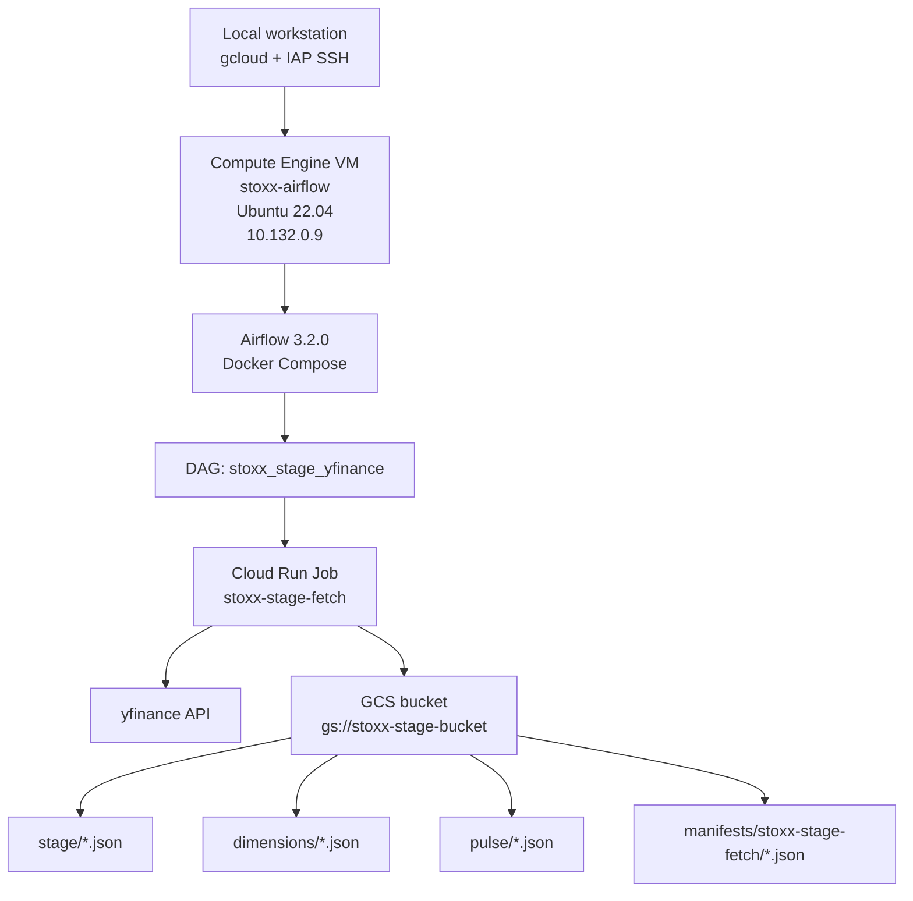

# Airflow on Compute Engine

> [!abstract]- Summary
>
> Preserves the full STOXX-only Airflow 3.2 demo deployment that was validated live on `2026-04-13`, including the Airflow control plane, Cloud Run fetch and transform jobs, GCS staging, SQL Server loading, BigQuery marts, and Firestore publication.
>
> **Scope and architecture**
> - The current validated scope excludes `oil_20` completely and keeps only `euro_stoxx_50`, `stoxx_asia_50`, and `stoxx_usa_50` across fetch, SQL, BigQuery, and Firestore layers
> - The design does not upload local JSON from the VM; `stoxx-stage-fetch` pulls directly from yfinance and writes bronze-stage JSON into `gs://stoxx-stage-bucket`
> - The final path is Airflow on `stoxx-airflow` → `stoxx-stage-fetch` → `gs://stoxx-stage-bucket` → `stoxx-bronze-load` → `stoxx-transforms` → `stoxx-serving` → BigQuery marts → Firestore database `main`
>
> **Infrastructure bring-up**
> - Create the private stage bucket, provision `stoxx-airflow` in `europe-west1-b` with `bq-wh-sa@bq-wh-nb.iam.gserviceaccount.com`, no public IP, IAP-only SSH, and Ubuntu 22.04
> - Install Docker Engine and the Compose plugin, then run Airflow on the VM as a Compose stack under `/home/alexper_recovery_gmail_com/app`
>
> **Airflow app and job packaging**
> - Build a custom `apache/airflow:3.2.0` image with `apache-airflow-providers-google`, deploy the manual-trigger DAG `stoxx_stage_yfinance`, and sync the VM app files from `.codex-temp/airflow-vm`
> - Create Artifact Registry `stoxx-demo`, build and push the `stoxx-stage-fetch` image with Cloud Build, and deploy the Cloud Run job with the required environment variables and service account
>
> **Cloud integration and persistence**
> - Configure `google_cloud_default` to use Application Default Credentials from the VM service account and grant `roles/run.developer` so Airflow can execute Cloud Run jobs
> - Persist the stack across reboots with `stoxx-airflow.service`, and use IAP port forwarding to reach the Airflow UI on `localhost:8080`
>
> **Validation and serving extension**
> - Validate the fetch path first with direct Cloud Run execution, then with Airflow task tests, GCS manifests, and object inventories that end with `errors: []`
> - Extend the DAG into the full STOXX-only chain with `stoxx-bronze-load`, `stoxx-transforms`, and `stoxx-serving`, then verify BigQuery mart counts, Firestore document counts, and the final DAG run `manual__2026-04-13T17:28:30Z_serving`
>
> **Operations and safety**
> - Warnings: the host-mounted `dags/` directory can flip to UID `50000`, missing `google_cloud_default` breaks the Google operator, the VM service account needs `run.jobs.run`, and unset Compose env vars create noisy or broken VM deployments
> - Recommendations table: the final DAG topology, serving-layer target objects, validated BigQuery mart counts, and Firestore counts define the live demo reference state
> - Troubleshooting: 7 bring-up issues covering Cloud Run network mode, container entrypoint arg handling, legacy oil cleanup SQL, BigQuery factsheet query shape, Firestore database selection, unset Compose env defaults, and queued DAG runs

> [!warning] Archived demo boundary
>
> The end-to-end Airflow demo described here was validated on `2026-04-13`, not rerun during this `2026-04-15` refresh. Current read-only checks against the replacement workspace returned `Listed 0 items.` for both `gcloud run jobs list --project=dagflow-poc --region=europe-west1` and `gcloud run services list --project=dagflow-poc --region=europe-west1`, so there is no comparable live Cloud Run estate available to replay the pipeline honestly.
>
> Treat the commands, outputs, and DAG chronology below as a historically verified demo record. This refresh focused on preserving the operator knowledge, clarifying boundaries, and keeping the note explicit about what is no longer live.

> [!note]- Glossary
>
> **Airflow VM**
> - A private Compute Engine VM that hosts the Airflow scheduler, worker, triggerer, API server, and supporting Redis and Postgres containers.
> - It matters because the note uses one VM-hosted orchestration plane to coordinate the full STOXX demo workflow without exposing the host publicly.
>
> > [!info] Control plane stays private
> >
> > The VM has no public IP. Operator access and UI access are both routed through IAP instead of direct internet exposure.
>
> ---
>
> **Docker Compose**
> - A Docker-native way to define and run multiple related containers as one application stack from a single YAML file.
> - It matters because Airflow, Postgres, and Redis are managed together on the VM as one restartable unit rather than as ad hoc containers.
>
> > [!warning] Host ownership can drift
> >
> > Bind-mounted directories keep host filesystem ownership semantics. After container startup, the `dags/` directory can become owned by the Airflow container user and block later file copies.
>
> ---
>
> **DAG**
> - A Directed Acyclic Graph in Airflow that defines task order, dependencies, and runtime behavior.
> - It matters because the note's `stoxx_stage_yfinance` DAG is the orchestration contract for the fetch, load, transform, and serving sequence.
>
> > [!info] Manual trigger is intentional
> >
> > The initial DAG is configured with `schedule=None`. That keeps the demo deterministic and operator-driven during bring-up.
>
> ---
>
> **Cloud Run Job**
> - A short-lived serverless container execution pattern in Google Cloud intended for finite tasks rather than long-lived request serving.
> - It matters because every data-movement and serving step in the final demo pipeline is packaged as a Cloud Run job that Airflow triggers.
>
> > [!warning] Jobs need IAM to run
> >
> > Defining the job is not enough. The calling identity still needs permission to execute it, which is why `run.jobs.run` surfaced during validation.
>
> ---
>
> **Artifact Registry**
> - Google's regional container and artifact registry for storing versioned Docker images and related packages.
> - It matters because the Airflow-controlled Cloud Run jobs pull their images from the `stoxx-demo` repository in Artifact Registry.
>
> > [!info] Region placement matters
> >
> > Keeping images in the same region as the runtime reduces unnecessary cross-region pulls and keeps deployment behavior more predictable.
>
> ---
>
> **Cloud Build**
> - A managed Google Cloud build service that can build container images and push them directly into Artifact Registry.
> - It matters because the note uses it to package the `stoxx-stage-fetch` image from local source without building on the VM.
>
> > [!info] Build and runtime are separate
> >
> > The VM orchestrates the workload, but the image build does not happen there. Separating build from execution keeps the Airflow host simpler.
>
> ---
>
> **ADC**
> - Application Default Credentials, Google's credential-discovery mechanism used by client libraries and many provider integrations.
> - It matters because the Airflow Google provider uses the VM's attached service account when no explicit key is configured in the connection.
>
> > [!warning] Missing connection still breaks flow
> >
> > ADC provides credentials, but Airflow still expects the `google_cloud_default` connection entry to exist. Provider defaults and metadata credentials solve different layers of the problem.
>
> ---
>
> **service account**
> - A non-human Google Cloud identity attached to a VM or job so software can call Google APIs without using a user's personal login.
> - It matters because both the Airflow VM and the Cloud Run jobs rely on `bq-wh-sa@bq-wh-nb.iam.gserviceaccount.com` for storage, job execution, and downstream platform access.
>
> > [!warning] Role gaps are operational failures
> >
> > A service account can exist and still be unusable for a step if a required IAM role is missing. The `roles/run.developer` fix in this note is one example.
>
> ---
>
> **IAP SSH**
> - Identity-Aware Proxy tunneling for SSH access into a private Compute Engine VM without assigning it a public IP.
> - It matters because every administrative action in the note, from Docker installation to DAG testing, depends on IAP-based access to `stoxx-airflow`.
>
> > [!info] Same path for UI access
> >
> > IAP is not only for shell access. The same model enables local port forwarding to reach the Airflow UI securely.
>
> ---
>
> **stage bucket**
> - The Google Cloud Storage bucket that receives raw fetched JSON before any SQL or warehouse load occurs.
> - It matters because `gs://stoxx-stage-bucket` is the first durable landing zone in the pipeline and the handoff point between fetch and load jobs.
>
> > [!warning] Stage is not source code storage
> >
> > The bucket holds runtime data outputs, not the local reference files that were used only to shape expectations during design.
>
> ---
>
> **bronze-stage JSON**
> - The raw STOXX payload objects written into GCS for dimensions, OHLCV, daily signals, quarterly signals, pulse tickers, and pulse snapshots.
> - It matters because these files are the canonical raw inputs that the later bronze SQL load consumes.
>
> > [!info] Scope is intentionally reduced
> >
> > The current bronze-stage set covers only the three retained STOXX universes. `oil_20` artifacts are intentionally absent from the validated path.
>
> ---
>
> **manifest**
> - A machine-readable summary file that records metadata about one fetch run, such as generation time, symbol count, and any errors.
> - It matters because `latest.json` is the fastest way to verify whether the fetch completed cleanly before checking downstream layers.
>
> > [!info] `errors: []` is the gate
> >
> > The note treats an empty error list as the first positive signal that the stage-fetch step is healthy. A successful job execution without a clean manifest is not enough.
>
> ---
>
> **BigQuery mart**
> - A curated analytical table built for downstream consumption rather than raw replication.
> - It matters because the serving layer's success is validated partly through the row counts of the final `stoxx_marts` tables.
>
> > [!info] Marts are above replicas
> >
> > The workflow first syncs replica tables and then builds marts on top. A mart is a presentation-layer product, not the first landing copy of data.
>
> ---
>
> **Firestore `main`**
> - The named Firestore database used by the serving layer to publish the final STOXX documents for application-facing reads.
> - It matters because the bring-up initially failed when code assumed the default Firestore database instead of the explicit `main` target.
>
> > [!warning] Database name is explicit
> >
> > Firestore database selection is not always implicit. If the environment uses a non-default database, the client must target it intentionally.
>
> ---
>
> **`CloudRunExecuteJobOperator`**
> - The Airflow Google provider operator that launches a Cloud Run job from a DAG task.
> - It matters because the note's Airflow DAG uses this operator as the bridge between the VM-hosted scheduler and the serverless execution layer.
>
> > [!info] Operator wraps the API call
> >
> > The operator does not replace Cloud Run; it automates the job execution request from inside Airflow while still relying on the underlying Google API permissions.


## Conceptual Model



## Provision the Stage Bucket

The first shared dependency is the raw stage bucket. Uniform bucket-level access and public access prevention keep the bucket private and predictable for the demo.

*Create the regional stage bucket in `europe-west1`.*

```bash
gcloud storage buckets create gs://stoxx-stage-bucket \
  --project=bq-wh-nb \
  --location=europe-west1 \
  --uniform-bucket-level-access \
  --public-access-prevention
```

*Validate the bucket configuration after creation.*

```bash
gcloud storage buckets describe gs://stoxx-stage-bucket
```

```text
creation_time: 2026-04-13T13:39:24+0000
location: EUROPE-WEST1
name: stoxx-stage-bucket
public_access_prevention: enforced
storage_url: gs://stoxx-stage-bucket/
uniform_bucket_level_access: true
```

## Create the Airflow VM

The VM runs privately behind IAP only. It reuses the existing project service account `bq-wh-sa@bq-wh-nb.iam.gserviceaccount.com` and relies on Cloud NAT for outbound package installs and Docker image pulls.

*Create the private Ubuntu VM for Airflow.*

```bash
gcloud compute instances create stoxx-airflow \
  --project=bq-wh-nb \
  --zone=europe-west1-b \
  --machine-type=e2-standard-2 \
  --image-family=ubuntu-2204-lts \
  --image-project=ubuntu-os-cloud \
  --boot-disk-size=30GB \
  --boot-disk-type=pd-balanced \
  --no-address \
  --service-account=bq-wh-sa@bq-wh-nb.iam.gserviceaccount.com \
  --scopes=https://www.googleapis.com/auth/cloud-platform \
  --metadata="enable-oslogin=TRUE" \
  --tags="airflow,iap-ssh" \
  --labels="app=stoxx-airflow,env=dev"
```

*Confirm the final VM shape.*

```bash
gcloud compute instances describe stoxx-airflow \
  --project=bq-wh-nb \
  --zone=europe-west1-b \
  --format="yaml(name,status,zone,machineType,networkInterfaces,serviceAccounts,tags,labels)"
```

```text
labels:
  app: stoxx-airflow
  env: dev
machineType: .../machineTypes/e2-standard-2
name: stoxx-airflow
networkInterfaces:
- networkIP: 10.132.0.9
serviceAccounts:
- email: bq-wh-sa@bq-wh-nb.iam.gserviceaccount.com
status: RUNNING
tags:
  items:
  - airflow
  - iap-ssh
zone: .../zones/europe-west1-b
```

*Open the first IAP SSH session and verify the guest OS.*

```bash
gcloud compute ssh stoxx-airflow \
  --project=bq-wh-nb \
  --zone=europe-west1-b \
  --tunnel-through-iap \
  --command="hostname && lsb_release -ds"
```

```text
stoxx-airflow
Ubuntu 22.04.5 LTS
```

## Install Docker Engine and Compose

Airflow runs entirely in containers on the VM. Docker Engine and the Compose plugin are installed directly on Ubuntu and the OS Login user is added to the `docker` group.

> [!warning] Single-VM Docker Compose is a lab pattern
>
> This layout is intentionally optimized for demo bring-up and operator visibility, not for production-grade Airflow availability. Docker Compose on one VM keeps the stack understandable, but it also keeps the scheduler, worker, metadata database, and broker in one failure domain.

*Install Docker Engine, Compose, and add the VM user to the `docker` group.*

```bash
gcloud compute ssh stoxx-airflow \
  --project=bq-wh-nb \
  --zone=europe-west1-b \
  --tunnel-through-iap \
  --command="
    sudo apt-get update &&
    sudo apt-get install -y ca-certificates curl gnupg lsb-release &&
    sudo install -m 0755 -d /etc/apt/keyrings &&
    curl -fsSL https://download.docker.com/linux/ubuntu/gpg |
      sudo gpg --dearmor -o /etc/apt/keyrings/docker.gpg &&
    sudo chmod a+r /etc/apt/keyrings/docker.gpg &&
    echo 'deb [arch='\"'\"'$(dpkg --print-architecture)'\"'\"' signed-by=/etc/apt/keyrings/docker.gpg] https://download.docker.com/linux/ubuntu '\"'\"'$(. /etc/os-release && echo $VERSION_CODENAME)'\"'\"' stable' |
      sudo tee /etc/apt/sources.list.d/docker.list > /dev/null &&
    sudo apt-get update &&
    sudo apt-get install -y docker-ce docker-ce-cli containerd.io docker-buildx-plugin docker-compose-plugin &&
    sudo systemctl enable --now docker &&
    sudo usermod -aG docker $USER
  "
```

*Verify Docker from a fresh SSH session.*

```bash
gcloud compute ssh stoxx-airflow \
  --project=bq-wh-nb \
  --zone=europe-west1-b \
  --tunnel-through-iap \
  --command="id && docker --version && docker compose version"
```

```text
uid=1137701540(alexper_recovery_gmail_com) ... groups=...,999(docker)
Docker version 29.4.0, build 9d7ad9f
Docker Compose version v5.1.2
```

## Build the Airflow App

The Airflow app lives on the VM under `/home/alexper_recovery_gmail_com/app` and is synced from the local working copy in `.codex-temp/airflow-vm`. The final app includes:

- a custom image built from `apache/airflow:3.2.0`
- `apache-airflow-providers-google` added with Airflow's official constraints
- a single DAG, `stoxx_stage_yfinance`, which calls `CloudRunExecuteJobOperator`
- environment variables `GCP_PROJECT_ID`, `GCP_REGION`, `STAGE_BUCKET`, and `STAGE_FETCH_JOB`

*The custom image installs the Google provider under the Airflow 3.2 constraints set.*

```dockerfile
FROM apache/airflow:3.2.0

COPY requirements.txt /tmp/requirements.txt

RUN AIRFLOW_VERSION=$(python -c "from airflow import __version__; print(__version__)") \
    && PYTHON_VERSION=$(python -c "import sys; print(f'{sys.version_info.major}.{sys.version_info.minor}')") \
    && CONSTRAINT_URL="https://raw.githubusercontent.com/apache/airflow/constraints-${AIRFLOW_VERSION}/constraints-${PYTHON_VERSION}.txt" \
    && pip install --no-cache-dir "apache-airflow==${AIRFLOW_VERSION}" -r /tmp/requirements.txt --constraint "${CONSTRAINT_URL}"
```

*The demo DAG is intentionally small and manual-trigger only.*

```python
with DAG(
    dag_id="stoxx_stage_yfinance",
    description="Fetch STOXX bronze-stage JSON from yfinance into GCS via Cloud Run",
    schedule=None,
    catchup=False,
    max_active_runs=1,
) as dag:
    CloudRunExecuteJobOperator(
        task_id="fetch_bronze_stage_into_gcs",
        project_id=PROJECT_ID,
        region=REGION,
        job_name=JOB_NAME,
        deferrable=False,
    )
```

> [!warning] First compose boot changes ownership of `app/dags`
>
> After the initial Airflow bring-up, the host-mounted `dags/` directory was owned by UID `50000` (the Airflow container user), which caused the next `gcloud compute scp` of the DAG file to fail with `permission denied`.
>
> **Fix:** `sudo chown -R alexper_recovery_gmail_com:alexper_recovery_gmail_com /home/alexper_recovery_gmail_com/app/dags` before copying the DAG file.

*Sync the Airflow app files to the VM and rebuild the stack.*

```bash
gcloud compute scp \
  "C:\Users\aperi\My Drive\VAULT\.codex-temp\airflow-vm\Dockerfile" \
  "C:\Users\aperi\My Drive\VAULT\.codex-temp\airflow-vm\requirements.txt" \
  "C:\Users\aperi\My Drive\VAULT\.codex-temp\airflow-vm\docker-compose.yaml" \
  stoxx-airflow:/home/alexper_recovery_gmail_com/app/ \
  --project=bq-wh-nb \
  --zone=europe-west1-b \
  --tunnel-through-iap
```

```bash
gcloud compute ssh stoxx-airflow \
  --project=bq-wh-nb \
  --zone=europe-west1-b \
  --tunnel-through-iap \
  --command="
    sudo chown -R alexper_recovery_gmail_com:alexper_recovery_gmail_com \
      /home/alexper_recovery_gmail_com/app/dags
  "
```

```bash
gcloud compute scp \
  "C:\Users\aperi\My Drive\VAULT\.codex-temp\airflow-vm\dags\stoxx_stage_yfinance.py" \
  stoxx-airflow:/home/alexper_recovery_gmail_com/app/dags/ \
  --project=bq-wh-nb \
  --zone=europe-west1-b \
  --tunnel-through-iap
```

```bash
gcloud compute ssh stoxx-airflow \
  --project=bq-wh-nb \
  --zone=europe-west1-b \
  --tunnel-through-iap \
  --command="
    cd /home/alexper_recovery_gmail_com/app &&
    docker compose down &&
    docker compose build &&
    docker compose up airflow-init &&
    docker compose up -d &&
    docker compose ps
  "
```

```text
app-airflow-apiserver-1       stoxx-airflow:3.2.0   Up ... (healthy)
app-airflow-dag-processor-1   stoxx-airflow:3.2.0   Up ... (healthy)
app-airflow-scheduler-1       stoxx-airflow:3.2.0   Up ... (healthy)
app-airflow-triggerer-1       stoxx-airflow:3.2.0   Up ... (healthy)
app-airflow-worker-1          stoxx-airflow:3.2.0   Up ... (healthy)
app-postgres-1                postgres:16           Up ... (healthy)
app-redis-1                   redis:7.2-bookworm    Up ... (healthy)
```

## Create Artifact Registry and Build the Fetch Image

The yfinance fetcher is packaged separately as a Cloud Run job image. The implementation lives in `.codex-temp/stoxx-stage-fetch` and writes the following object families into GCS:

- `dimensions/{prefix}_dim.json`
- `stage/{prefix}_ohlcv.json`
- `stage/{prefix}_signals_daily.json`
- `stage/{prefix}_signals_quarterly.json`
- `pulse/{prefix}_tickers.json`
- `pulse/{prefix}_pulse.json`
- `manifests/stoxx-stage-fetch/{timestamp}.json`
- `manifests/stoxx-stage-fetch/latest.json`

The fetcher intentionally deduplicates the symbol fetch workload across the three retained STOXX index definitions. On **2026-04-13**, the live manifest reports `symbol_count: 150`, which matches the three 50-name index universes after `oil_20` was removed from scope.

*Enable the required service APIs.*

```bash
gcloud services enable \
  run.googleapis.com \
  cloudbuild.googleapis.com \
  artifactregistry.googleapis.com \
  --project=bq-wh-nb
```

```text
Operation "...acf.p2-348557092514-..." finished successfully.
```

*Create a Docker repository for demo images.*

```bash
gcloud artifacts repositories create stoxx-demo \
  --repository-format=docker \
  --location=europe-west1 \
  --description="STOXX demo containers" \
  --project=bq-wh-nb
```

```text
Created repository [stoxx-demo].
```

*Build and push the Cloud Run image with Cloud Build.*

```bash
gcloud builds submit \
  "C:\Users\aperi\My Drive\VAULT\.codex-temp\stoxx-stage-fetch" \
  --project=bq-wh-nb \
  --tag europe-west1-docker.pkg.dev/bq-wh-nb/stoxx-demo/stoxx-stage-fetch:20260413-1
```

```text
Successfully tagged europe-west1-docker.pkg.dev/bq-wh-nb/stoxx-demo/stoxx-stage-fetch:20260413-1
...
STATUS: SUCCESS
```

## Deploy the Cloud Run Job

The job runs with the same project service account as the VM. A 30-minute timeout is excessive for the current payload size, but it leaves room for yfinance variability during the live demo.

*Deploy the Cloud Run job.*

```bash
gcloud run jobs deploy stoxx-stage-fetch \
  --project=bq-wh-nb \
  --region=europe-west1 \
  --image=europe-west1-docker.pkg.dev/bq-wh-nb/stoxx-demo/stoxx-stage-fetch:20260413-1 \
  --service-account=bq-wh-sa@bq-wh-nb.iam.gserviceaccount.com \
  --tasks=1 \
  --max-retries=0 \
  --task-timeout=1800 \
  --cpu=2 \
  --memory=2Gi \
  --set-env-vars "GCP_PROJECT_ID=bq-wh-nb" \
  --set-env-vars "STAGE_BUCKET=stoxx-stage-bucket" \
  --set-env-vars "OHLCV_LOOKBACK_DAYS=10" \
  --set-env-vars "JOB_NAME=stoxx-stage-fetch" \
  --set-env-vars "INFO_WORKERS=6" \
  --set-env-vars "HISTORY_WORKERS=4" \
  --set-env-vars "YF_RETRIES=5"
```

```text
Job [stoxx-stage-fetch] has successfully been deployed.
```

*Describe the final job configuration.*

```bash
gcloud run jobs describe stoxx-stage-fetch \
  --project=bq-wh-nb \
  --region=europe-west1
```

```text
+ Job stoxx-stage-fetch in region europe-west1
Executed 4 times
Last executed 2026-04-13T14:28:27.099685Z with execution stoxx-stage-fetch-s2b48
Container Image: europe-west1-docker.pkg.dev/bq-wh-nb/stoxx-demo/stoxx-stage-fetch:20260413-1
Memory: 2Gi
CPU: 2
Env vars:
  GCP_PROJECT_ID   bq-wh-nb
  HISTORY_WORKERS  4
  INFO_WORKERS     6
  JOB_NAME         stoxx-stage-fetch
  OHLCV_LOOKBACK_DAYS 10
  STAGE_BUCKET     stoxx-stage-bucket
  YF_RETRIES       5
Service account: bq-wh-sa@bq-wh-nb.iam.gserviceaccount.com
```

## Configure Airflow to Invoke Cloud Run

Two issues surfaced during the first Airflow task runs:

1. `google_cloud_default` did not exist in the Airflow metadata DB.
2. The VM service account lacked `run.jobs.run` on the Cloud Run job.

Both fixes are required on a fresh Airflow 3.2 deployment.

### Add the Google connection

*Create the default Google connection and rely on Application Default Credentials from the VM service account.*

```bash
gcloud compute ssh stoxx-airflow \
  --project=bq-wh-nb \
  --zone=europe-west1-b \
  --tunnel-through-iap \
  --command="
    cd /home/alexper_recovery_gmail_com/app &&
    docker compose exec -T airflow-worker \
      airflow connections add google_cloud_default \
      --conn-uri 'google-cloud-platform://'
  "
```

```text
Successfully added `conn_id`=google_cloud_default : google-cloud-platform://
```

*Verify the stored connection.*

```bash
gcloud compute ssh stoxx-airflow \
  --project=bq-wh-nb \
  --zone=europe-west1-b \
  --tunnel-through-iap \
  --command="
    cd /home/alexper_recovery_gmail_com/app &&
    docker compose exec -T airflow-worker airflow connections get google_cloud_default
  "
```

```text
id | conn_id              | conn_type             | ... | extra_dejson | get_uri
1  | google_cloud_default | google_cloud_platform | ... | {}           | google-cloud-platform://
```

### Grant Cloud Run execution permission

The first operator run failed with:

```text
google.api_core.exceptions.PermissionDenied:
403 Permission 'run.jobs.run' denied on resource
'projects/bq-wh-nb/locations/europe-west1/jobs/stoxx-stage-fetch'
```

The VM service account already had broad storage and BigQuery permissions, but not the Cloud Run job execution permissions required by `CloudRunExecuteJobOperator`.

*Grant `roles/run.developer` to the VM service account.*

```bash
gcloud projects add-iam-policy-binding bq-wh-nb \
  --member="serviceAccount:bq-wh-sa@bq-wh-nb.iam.gserviceaccount.com" \
  --role="roles/run.developer" \
  --condition=None
```

```text
Updated IAM policy for project [bq-wh-nb].
```

## Persist the Stack Across Reboots

Airflow must survive VM restarts. A `systemd` unit wraps `docker compose up -d` and restores the stack at boot.

*Install and enable the `systemd` unit.*

```bash
gcloud compute ssh stoxx-airflow \
  --project=bq-wh-nb \
  --zone=europe-west1-b \
  --tunnel-through-iap \
  --command="
    cat <<'EOF' | sudo tee /etc/systemd/system/stoxx-airflow.service >/dev/null
[Unit]
Description=STOXX Airflow Docker Compose Stack
Requires=docker.service
After=docker.service network-online.target
Wants=network-online.target

[Service]
Type=oneshot
RemainAfterExit=yes
User=alexper_recovery_gmail_com
Group=docker
WorkingDirectory=/home/alexper_recovery_gmail_com/app
Environment=HOME=/home/alexper_recovery_gmail_com
ExecStart=/usr/bin/docker compose up -d --remove-orphans
ExecStop=/usr/bin/docker compose down
TimeoutStartSec=0

[Install]
WantedBy=multi-user.target
EOF
    sudo systemctl daemon-reload
    sudo systemctl enable --now stoxx-airflow.service
    systemctl status stoxx-airflow.service --no-pager --full
  "
```

```text
Loaded: loaded (/etc/systemd/system/stoxx-airflow.service; enabled; vendor preset: enabled)
Active: active (exited) since Mon 2026-04-13 14:31:09 UTC
ExecStart=/usr/bin/docker compose up -d --remove-orphans (code=exited, status=0/SUCCESS)
```

## Validate the Final End-to-End Flow

Validation was done in two stages: first by running the Cloud Run job directly, then by running the Airflow task that triggers the same job.

### Direct Cloud Run test

*Execute the job once directly from `gcloud`.*

```bash
gcloud run jobs execute stoxx-stage-fetch \
  --project=bq-wh-nb \
  --region=europe-west1 \
  --wait
```

```text
Execution [stoxx-stage-fetch-rb465] has successfully completed.
```

### Airflow-triggered test

The first `airflow dags test` surfaced the missing connection and IAM issues above. After both fixes, the clean operator validation was a direct task test from the Airflow worker container.

*Run the Airflow task that triggers Cloud Run.*

```bash
gcloud compute ssh stoxx-airflow \
  --project=bq-wh-nb \
  --zone=europe-west1-b \
  --tunnel-through-iap \
  --command="
    cd /home/alexper_recovery_gmail_com/app &&
    docker compose exec -T airflow-worker \
      airflow tasks test stoxx_stage_yfinance fetch_bronze_stage_into_gcs 2026-04-13T15:00:00+00:00
  "
```

```text
Getting connection using `google.auth.default()` since no explicit credentials are provided.
...
Task instance state updated ... new_state=success
```

*Confirm that the operator-created Cloud Run execution exists and was run by the VM service account.*

```bash
gcloud run jobs executions list \
  --job=stoxx-stage-fetch \
  --project=bq-wh-nb \
  --region=europe-west1 \
  --limit=3
```

```text
JOB                EXECUTION                REGION        COMPLETE  CREATED                  RUN BY
stoxx-stage-fetch  stoxx-stage-fetch-s2b48  europe-west1  1 / 1     2026-04-13 14:28:27 UTC  bq-wh-sa@bq-wh-nb.iam.gserviceaccount.com
stoxx-stage-fetch  stoxx-stage-fetch-xtrwd  europe-west1  1 / 1     2026-04-13 14:26:01 UTC  bq-wh-sa@bq-wh-nb.iam.gserviceaccount.com
stoxx-stage-fetch  stoxx-stage-fetch-rb465  europe-west1  1 / 1     2026-04-13 14:06:27 UTC  alexper.recovery@gmail.com
```

### GCS landing validation

The final successful Airflow-triggered run updated the manifest at **2026-04-13T17:31:42Z** and produced a clean `errors: []` result.

*Read the latest manifest written by Cloud Run.*

```bash
gcloud storage cat gs://stoxx-stage-bucket/manifests/stoxx-stage-fetch/latest.json
```

```json
{
    "job_name": "stoxx-stage-fetch",
    "generated_at": "2026-04-13T17:31:42Z",
    "bucket": "stoxx-stage-bucket",
    "project_id": "bq-wh-nb",
    "gcs_prefix": "",
    "lookback_days": 10,
    "index_count": 3,
    "symbol_count": 150,
    "errors": []
}
```

*List the stage JSON objects and timestamps.*

```bash
gcloud storage ls -l gs://stoxx-stage-bucket/stage/*.json
```

```text
136332  2026-04-13T17:31:42Z  gs://stoxx-stage-bucket/stage/eurostoxx50_ohlcv.json
42635   2026-04-13T17:31:43Z  gs://stoxx-stage-bucket/stage/eurostoxx50_signals_daily.json
45500   2026-04-13T17:31:43Z  gs://stoxx-stage-bucket/stage/eurostoxx50_signals_quarterly.json
137842  2026-04-13T17:31:43Z  gs://stoxx-stage-bucket/stage/stoxxasia50_ohlcv.json
42904   2026-04-13T17:31:43Z  gs://stoxx-stage-bucket/stage/stoxxasia50_signals_daily.json
45447   2026-04-13T17:31:43Z  gs://stoxx-stage-bucket/stage/stoxxasia50_signals_quarterly.json
136833  2026-04-13T17:31:43Z  gs://stoxx-stage-bucket/stage/stoxxusa50_ohlcv.json
42736   2026-04-13T17:31:43Z  gs://stoxx-stage-bucket/stage/stoxxusa50_signals_daily.json
45476   2026-04-13T17:31:43Z  gs://stoxx-stage-bucket/stage/stoxxusa50_signals_quarterly.json
TOTAL: 9 objects, 675705 bytes (659.87kiB)
```

The live bucket now exposes the three retained STOXX indices only:

- 9 under `stage/`
- 3 under `dimensions/`
- 6 under `pulse/`
- manifest history under `manifests/stoxx-stage-fetch/`

No `oil20` objects remain anywhere under `gs://stoxx-stage-bucket`.

## Extend the DAG to SQL Server, BigQuery, and Firestore

After the initial fetch-only validation, the Airflow deployment was extended into the full STOXX-only production demo pipeline. The final runtime on **2026-04-13** uses three additional Cloud Run jobs:

- `stoxx-bronze-load` reads the stage bucket and loads the SQL Server `bronze` schema on `stoxx-vm`.
- `stoxx-transforms` executes the SQL medallion transforms into `silver` and `gold`.
- `stoxx-serving` syncs SQL gold into BigQuery replica tables, builds BigQuery marts, and publishes Firestore serving documents.

### Final DAG topology

The final Airflow DAG contains 11 tasks and runs end to end without manual intervention after trigger:

| Order | Task ID | Target |
|---|---|---|
| 1 | `fetch_bronze_stage_into_gcs` | Cloud Run job `stoxx-stage-fetch` |
| 2 | `load_bronze_into_sql` | Cloud Run job `stoxx-bronze-load` |
| 3 | `transform_ohlcv_to_silver` | Cloud Run job `stoxx-transforms --step=3` |
| 4 | `transform_signals_daily_to_silver` | Cloud Run job `stoxx-transforms --step=8` |
| 5 | `transform_signals_quarterly_to_silver` | Cloud Run job `stoxx-transforms --step=9` |
| 6 | `build_gold_scores` | Cloud Run job `stoxx-transforms --from=14 --to=15` |
| 7 | `build_gold_index_performance` | Cloud Run job `stoxx-transforms --step=16` |
| 8 | `sync_gold_to_bigquery` | Cloud Run job `stoxx-serving --mode=sync-replica` |
| 9 | `build_bigquery_marts` | Cloud Run job `stoxx-serving --mode=build-marts` |
| 10 | `publish_serving_to_firestore` | Cloud Run job `stoxx-serving --mode=publish-firestore` |
| 11 | `validate_serving_layer` | Cloud Run job `stoxx-serving --mode=validate` |

### Serving-layer target objects

The serving job publishes two downstream layers above SQL Server:

- BigQuery replica datasets: `stoxx_silver` and `stoxx_gold`
- BigQuery marts dataset: `stoxx_marts`
- Firestore database: `main`
- Firestore root collection: `stoxx_indices`

The final BigQuery mart tables are:

- `mart_constituent_screener_latest`
- `mart_sector_heatmap_latest`
- `mart_index_compare_history`
- `mart_index_factsheet_latest`

### Troubleshooting chronology

The serving-layer extension surfaced seven concrete issues during bring-up:

| Issue | Symptom | Fix |
|---|---|---|
| Cloud Run network mode | Serving job failed before container start when deployed with `--vpc-connector=default`. | Recreated `stoxx-serving` with `--network=default --subnet=default --vpc-egress=private-ranges-only`. |
| Container arg handling | Cloud Run treated `--mode=...` as the executable instead of a script argument. | Changed the image from `CMD ["python", "stoxx_serving.py"]` to `ENTRYPOINT ["python", "stoxx_serving.py"]`. |
| Legacy oil cleanup SQL | `sync-replica` failed with `Unrecognized name: _index` against `stoxx_bronze.dim_index`. | Changed the cleanup statement to use `index_key` on the legacy bronze table. |
| BigQuery factsheet mart | `build-marts` failed because correlated subqueries could not be decorrelated. | Rewrote `mart_index_factsheet_latest` to pre-aggregate arrays by `_index` in separate CTEs. |
| Firestore database selection | `publish-firestore` failed with `The database (default) does not exist`. | Added `FIRESTORE_DATABASE=main` and created the Firestore client with `database='main'`. |
| Airflow compose warning | `docker compose` warned that `SERVING_JOB` was unset on the VM. | Changed the compose env reference to `${SERVING_JOB:-stoxx-serving}`. |
| DAG remained queued | The first triggered DAG run stayed `queued` after redeploy. | Unpaused `stoxx_stage_yfinance` on the VM and reran the scheduler checks. |

The full command-output chronology for the serving-layer bring-up is indexed in:

`C:\Users\aperi\My Drive\VAULT\.codex-temp\bq-firestore-artifacts\20260413_184213\ARTIFACT_INDEX.md`

### Final validated run

Before the final Airflow run, the SQL demo window was reset with:

`C:\Users\aperi\My Drive\VAULT\.codex-temp\stoxx-transforms\reset_recent_stoxx_demo_window.ps1`

That reset deleted the last daily and quarterly windows from the STOXX-only bronze, silver, and gold tables so the DAG would repopulate meaningful data during the live run.

The final successful Airflow DAG run was:

- `run_id`: `manual__2026-04-13T17:28:30Z_serving`
- `start_date`: `2026-04-13 17:30:26 UTC`
- `end_date`: `2026-04-13 17:41:45 UTC`
- final DAG state: `success`

Every task in the final DAG run succeeded:

| Task ID | State | End time (UTC) |
|---|---|---|
| `fetch_bronze_stage_into_gcs` | `success` | `2026-04-13 17:31:54` |
| `load_bronze_into_sql` | `success` | `2026-04-13 17:32:52` |
| `transform_ohlcv_to_silver` | `success` | `2026-04-13 17:34:07` |
| `transform_signals_daily_to_silver` | `success` | `2026-04-13 17:33:59` |
| `transform_signals_quarterly_to_silver` | `success` | `2026-04-13 17:34:04` |
| `build_gold_scores` | `success` | `2026-04-13 17:35:19` |
| `build_gold_index_performance` | `success` | `2026-04-13 17:36:29` |
| `sync_gold_to_bigquery` | `success` | `2026-04-13 17:38:07` |
| `build_bigquery_marts` | `success` | `2026-04-13 17:39:31` |
| `publish_serving_to_firestore` | `success` | `2026-04-13 17:40:40` |
| `validate_serving_layer` | `success` | `2026-04-13 17:41:44` |

The final serving-layer validation after the successful run was:

| BigQuery table | Row count |
|---|---:|
| `mart_constituent_screener_latest` | 150 |
| `mart_sector_heatmap_latest` | 28 |
| `mart_index_compare_history` | 4044 |
| `mart_index_factsheet_latest` | 3 |

| Firestore root document | Constituents | Sectors | Performance docs |
|---|---:|---:|---:|
| `euro_stoxx_50` | 50 | 10 | 1350 |
| `stoxx_asia_50` | 50 | 9 | 1371 |
| `stoxx_usa_50` | 50 | 9 | 1323 |

## Final Runtime State

*Check the running Airflow containers and the systemd unit.*

```bash
gcloud compute ssh stoxx-airflow \
  --project=bq-wh-nb \
  --zone=europe-west1-b \
  --tunnel-through-iap \
  --command="
    cd /home/alexper_recovery_gmail_com/app &&
    docker compose ps &&
    systemctl status stoxx-airflow.service --no-pager --full | sed -n '1,12p'
  "
```

```text
app-airflow-apiserver-1       ... Up ... (healthy)
app-airflow-dag-processor-1   ... Up ... (healthy)
app-airflow-scheduler-1       ... Up ... (healthy)
app-airflow-triggerer-1       ... Up ... (healthy)
app-airflow-worker-1          ... Up ... (healthy)
app-postgres-1                ... Up ... (healthy)
app-redis-1                   ... Up ... (healthy)
...
stoxx-airflow.service - STOXX Airflow Docker Compose Stack
Loaded: loaded (...; enabled)
Active: active (exited)
```

## Access Pattern for the Demo

The VM has no public IP, so the Airflow UI is reached through IAP port forwarding.

*Open a local SSH tunnel to the Airflow API server / UI.*

```bash
gcloud compute ssh stoxx-airflow \
  --project=bq-wh-nb \
  --zone=europe-west1-b \
  --tunnel-through-iap \
  -- -L 8080:localhost:8080
```

Then open `http://localhost:8080`.

## Result

The Airflow VM and downstream jobs described here were operational in the original `2026-04-13` validation window, where the full STOXX-only DAG completed successfully under run `manual__2026-04-13T17:28:30Z_serving`. The historically validated path was:

Airflow → `stoxx-stage-fetch` → `stoxx-bronze-load` → `stoxx-transforms` → `stoxx-serving` → BigQuery marts → Firestore `main`.
