# Dataset and Table Management

> [!quote]+
> "Data that is loved tends to survive."
>
> — **Kurt Bollacker**, data scientist and engineer

> [!abstract]- Summary
>
> Documents BigQuery dataset and table lifecycle with the Cloud SDK `bq` CLI and `INFORMATION_SCHEMA`, so you can inventory resources, inspect schemas and storage metadata, choose immutable physical layout settings at creation time, preview data, estimate scan cost, and delete safely.
>
> **Inventory and inspection**
> - Prerequisites: enable `bigquery.googleapis.com`, use the Cloud SDK `bq` CLI, and grant `roles/bigquery.metadataViewer` for reads plus `roles/bigquery.dataEditor` + `roles/bigquery.jobUser` or `roles/bigquery.dataOwner` / `roles/bigquery.admin` for write operations
> - Use `bq ls` to enumerate datasets, tables, views, and materialized views, including `Time Partitioning` and `Clustered Fields` in dataset inventory output
> - Use `bq show --schema` and `bq show --format=prettyjson` to inspect column definitions and table or dataset fields such as `numRows`, `numBytes`, `numActiveLogicalBytes`, `numTimeTravelPhysicalBytes`, `location`, `expirationTime`, `timePartitioning`, `clustering`, and `maxTimeTravelHours`
> - Use `INFORMATION_SCHEMA.SCHEMATA`, `TABLES`, and `COLUMNS` for region-wide or dataset-wide metadata audits without scanning user data
>
> **Provisioning and lifecycle**
> - Create datasets with `bq mk --dataset`, setting immutable `--location` plus optional `--default_table_expiration`, `--default_partition_expiration`, `--max_time_travel_hours`, `--storage_billing_model`, descriptions, and labels
> - Create tables with inline schemas or JSON schema files, plus immutable `--time_partitioning_field`, `--time_partitioning_type`, and `--clustering_fields`, optional `--require_partition_filter`, and scratch-table TTLs with `--expiration`
> - Use `bq update` for additive schema changes and metadata edits, `bq cp` for backups and same-region copies, and `bq rm` for table or dataset teardown
>
> **Data preview and type reference**
> - Use `bq head` for free row previews that do not create query jobs, and `bq query --dry_run` to validate SQL and estimate bytes scanned before execution
> - The note maps schema `mode` values (`NULLABLE`, `REQUIRED`, `REPEATED`) and core types including `INT64` / `INTEGER`, `FLOAT64` / `FLOAT`, `NUMERIC`, `BIGNUMERIC`, `JSON`, `GEOGRAPHY`, and `STRUCT` / `RECORD`
>
> **Operations and safety**
> - When to use: BigQuery onboarding, schema validation, region and IAM audits, physical-layout planning, backup or recovery preparation, and cost estimation before running queries
> - Warnings: dataset `--location` is permanent, partitioning and clustering are immutable after table creation, deletions are bounded by `maxTimeTravelHours`, and point-in-time recovery fails if the same table ID has been recreated
> - Recommendations table: prefer explicit locations, partition time-series tables by `DATE` / `TIMESTAMP`, cluster on common filter columns, require partition filters on large partitioned tables, use TTLs for scratch objects, and dry-run expensive SQL before execution

> [!warning] Live-run boundary
>
> The original `bq-wh-nb` warehouse used throughout the note is no longer available. On `2026-04-15`, `bq ls --project_id=bq-wh-nb` returned `Project bq-wh-nb has been deleted.`, while `dagflow-poc` currently exposes no private dataset inventory.
>
> This refresh reran only read-only examples against `bigquery-public-data:samples` using `dagflow-poc` as the billing and job project. State-changing examples such as `bq mk`, `bq update`, `bq cp`, and `bq rm` remain historical operator patterns and were not rerun.
>
> [!note]- Glossary
>
> **BigQuery**
> - Google Cloud's serverless analytical database service for storing columnar datasets, tables, and views and running SQL or administrative operations without user-managed infrastructure.
> - Every command, metadata field, retention rule, and cost boundary in this note is specific to BigQuery behavior.
>
> > [!info] Metadata calls are free
> >
> > `bq ls`, `bq show`, `bq head`, and `INFORMATION_SCHEMA` metadata queries do not bill for user-data scans, but storage and executed query jobs still have cost implications.
>
> ---
>
> **`bq`**
> - The command-line client bundled with the Google Cloud SDK for BigQuery administration, metadata inspection, querying, loading, copying, and deletion.
> - The note uses `bq` as the operational surface for every example: `ls`, `show`, `mk`, `update`, `cp`, `rm`, `head`, and `query`.
>
> > [!warning] Project context is implicit
> >
> > Unqualified resource names resolve against the active `gcloud` project unless you pass `--project_id`. Running a write command in the wrong project is a common operator mistake.
>
> ---
>
> **GCP project**
> - A top-level Google Cloud administrative container that owns APIs, billing, IAM policy, and BigQuery datasets.
> - Dataset and table IDs are only unique within a project, so the note repeatedly distinguishes active-project behavior from explicit `--project_id` targeting.
>
> > [!info] APIs are project-scoped
> >
> > Enabling `bigquery.googleapis.com` happens at the project level. If the API is disabled, even correctly scoped `bq` commands fail before they reach dataset or table logic.
>
> ---
>
> **Medallion architecture**
> - A layered data-modeling pattern that separates raw ingestion, cleaned data, and serving-ready data into bronze, silver, and gold datasets.
> - The note's example datasets (`stoxx_bronze`, `stoxx_silver`, `stoxx_gold`) use this pattern to illustrate why dataset naming and table placement matter operationally.
>
> > [!info] Storage boundary, not security boundary
> >
> > Bronze, silver, and gold names communicate data maturity, but access control still depends on IAM and dataset ACLs rather than naming alone.
>
> ---
>
> **Dataset**
> - A BigQuery namespace that groups tables, views, routines, location settings, ACLs, default expirations, and time-travel configuration inside a project.
> - Dataset-level decisions in this note, especially region and default retention, shape every table created underneath it.
>
> > [!warning] Region is inherited
> >
> > Every table in a dataset inherits the dataset location. You cannot place one table in `europe-west1` and another in `US` inside the same dataset.
>
> ---
>
> **Table**
> - A physical BigQuery storage object with a schema, row data, metadata, and optional partitioning, clustering, expiration, or encryption settings.
> - Most lifecycle commands in the note create, inspect, copy, preview, or delete tables rather than query results alone.
>
> > [!info] Physical object semantics
> >
> > BigQuery tables carry storage statistics such as `numRows` and `numBytes`, which do not exist for logical-only objects in the same way.
>
> ---
>
> **View**
> - A saved SQL definition that returns query results without storing the result rows as a standalone physical table.
> - `bq ls` and `INFORMATION_SCHEMA.TABLES` show views alongside tables, so the note distinguishes object type before interpreting storage fields.
>
> > [!warning] Metadata differs from tables
> >
> > Views can be listed and described like tables, but row counts and storage-byte fields are not meaningful in the same way because the data lives in referenced source tables.
>
> ---
>
> **Materialized view**
> - A BigQuery view type that stores precomputed query results and refreshes them incrementally under BigQuery-managed rules.
> - The note includes materialized views in inventory output because they behave like a separate resource class when auditing dataset contents.
>
> > [!info] Logical and physical hybrid
> >
> > A materialized view is defined by SQL like a view but has storage characteristics more like a table, which is why its type matters during inspection.
>
> ---
>
> **Schema**
> - The declared column structure of a table: names, data types, nullability modes, descriptions, and nested fields for `STRUCT` columns.
> - Schema validation is central to the note because loads, queries, updates, and downstream models all depend on exact column definitions.
>
> > [!warning] Inline schemas are limited
> >
> > Simple `name:TYPE` inline schemas are convenient, but nested fields and repeated records usually require a JSON schema file for precise declaration.
>
> ---
>
> **Metadata**
> - Descriptive information about a BigQuery resource rather than its user rows, such as location, row count, size, creation time, partitioning, clustering, and expiration settings.
> - The note uses metadata inspection to answer operational questions about inventory, capacity, retention, and recovery boundaries without scanning table data.
>
> > [!info] Different surfaces expose it
> >
> > `bq show` returns one resource at a time, while `INFORMATION_SCHEMA` lets you filter and aggregate metadata across many resources with SQL.
>
> ---
>
> **Dataset location / `--location`**
> - The region or multi-region where a dataset and all of its tables physically reside, such as `europe-west1`, `EU`, or `US`.
> - Location drives compliance, cross-region query feasibility, and where every downstream job against the dataset must execute.
>
> > [!danger] Permanent after creation
> >
> > BigQuery does not support in-place dataset relocation. Moving data to a different region requires export, transfer, and reload into a new dataset.
>
> ---
>
> **IAM role**
> - A named Google Cloud permission bundle such as `roles/bigquery.metadataViewer`, `roles/bigquery.dataEditor`, `roles/bigquery.dataOwner`, or `roles/bigquery.jobUser`.
> - The note maps read, write, and job-submission commands to required roles so operators know whether a failure is about authorization rather than syntax.
>
> > [!warning] Read and execute are separate
> >
> > Being able to inspect table metadata does not automatically let you run query jobs or create tables. BigQuery often splits visibility rights from mutation and job rights.
>
> ---
>
> **Partitioning**
> - A table-layout feature that divides table storage into segments by a partition key or ingestion time so queries can prune irrelevant partitions.
> - The note treats partitioning as one of the main cost and performance levers because bytes scanned depend heavily on whether filters hit the partition boundary.
>
> > [!warning] Choice is front-loaded
> >
> > Partition keys and granularity are immutable after table creation in the CLI workflow shown here. A bad choice usually means recreating the table and migrating data.
>
> ---
>
> **Clustering**
> - A physical sort order inside a BigQuery table or partition based on up to four columns, used to reduce block reads for common filter patterns.
> - The note pairs clustering with partitioning to explain why date-pruned queries can still get cheaper when rows are grouped by columns such as `symbol`.
>
> > [!info] Order matters
> >
> > Clustering fields are prioritized left to right. Put the most selective or most common filter columns first to get the best pruning behavior.
>
> ---
>
> **Table expiration / TTL**
> - A retention timer that causes BigQuery to delete a table automatically after a configured number of seconds or at a stored expiration timestamp.
> - The note uses TTLs for scratch and demo objects so temporary data cleans itself up instead of relying on manual teardown.
>
> > [!warning] Deletion is automatic
> >
> > Expiration is convenient for temporary objects, but production tables should not receive short TTLs accidentally. Once the timer fires, recovery depends on time-travel retention.
>
> ---
>
> **Time travel**
> - BigQuery's retained historical storage window that lets you query or copy a table as it existed earlier, up to `maxTimeTravelHours` after modification or deletion.
> - Recovery guidance in the note depends on time travel for restoring dropped or overwritten tables and for understanding `numTimeTravelPhysicalBytes`.
>
> > [!warning] Same name can block recovery
> >
> > If another table is created with the deleted table's original ID before recovery, point-in-time restore attempts can fail even though the historical bytes still exist.
>
> ---
>
> **Snapshot table**
> - A point-in-time cloned table object that preserves a table state independently of the rolling time-travel window and usually stores only changed bytes incrementally.
> - The note recommends snapshots before destructive operations when seven days of time travel is too short or too risky.
>
> > [!info] Longer-lived safety net
> >
> > Snapshots are a deliberate backup object, not an automatic retention feature. They are useful when migration or deletion work might span longer than the normal recovery window.
>
> ---
>
> **Logical bytes**
> - BigQuery's uncompressed representation of table data used for metrics such as `numBytes`, `numActiveLogicalBytes`, and on-demand scan billing estimates.
> - The note interprets logical-byte fields to explain storage footprint and why dry-run scan estimates map directly to cost.
>
> > [!info] Billing usually follows logical size
> >
> > Unless you deliberately choose a physical-billing storage model, most sizing and query-cost reasoning in BigQuery starts from logical bytes rather than compressed file size.
>
> ---
>
> **Physical bytes**
> - The compressed storage bytes BigQuery actually keeps on disk, including active and time-travel data as fields such as `numActivePhysicalBytes` and `numTimeTravelPhysicalBytes`.
> - The note uses physical bytes to explain retained snapshots, time-travel overhead, and the alternative `PHYSICAL` storage billing model.
>
> > [!warning] Not the same metric
> >
> > A table can have similar logical and physical sizes when tiny, but on larger tables the two measures diverge. Cost and retention decisions depend on which metric the field represents.
>
> ---
>
> **`INFORMATION_SCHEMA`**
> - A family of SQL-accessible metadata views that expose dataset, table, column, partition, and job information inside a region or dataset scope.
> - The note uses these views when one-resource-at-a-time CLI output is too narrow and you need filterable, joinable metadata inventories.
>
> > [!warning] Scope must be qualified
> >
> > Some views require a region-qualified path such as `region-europe-west1.INFORMATION_SCHEMA.SCHEMATA`, while others are dataset-scoped. Using the wrong scope returns errors or incomplete results.
>
> ---
>
> **Row preview / `bq head`**
> - A BigQuery CLI operation that reads a sample of table rows directly for inspection without submitting a SQL query job.
> - The note uses row preview for post-load validation and quick data sanity checks when you need to inspect values rather than metadata.
>
> > [!info] Fast but limited
> >
> > `bq head` is ideal for spot checks, but it is not a substitute for SQL when you need filtering, joins, aggregations, or reproducible analytical logic.
>
> ---
>
> **Dry run / `--dry_run`**
> - A BigQuery query-validation mode that parses SQL and reports estimated bytes processed without actually executing the query.
> - The note treats dry runs as the main pre-execution cost control for large tables and evolving analytical queries.
>
> > [!warning] Estimate, not result
> >
> > A dry run validates syntax and scan scope, but it does not return rows or catch every runtime condition tied to data state, permissions on referenced objects, or downstream side effects.
>
> ---
>
> **Schema mode / `NULLABLE`, `REQUIRED`, `REPEATED`**
> - The column cardinality and nullability declaration attached to each BigQuery field: optional scalar, non-null scalar, or repeated array-like field.
> - The note explains these modes because schema evolution, JSON schemas, and load behavior all depend on whether a column can accept missing values or multiple values.
>
> > [!warning] Additive updates are constrained
> >
> > `bq update` can add new nullable columns, but it cannot retroactively turn an existing field into a different mode or insert a new required field into already populated data safely.
>
> ---
>
> **`NUMERIC` / `BIGNUMERIC`**
> - Exact-decimal BigQuery data types used when binary floating-point types such as `FLOAT64` are not precise enough for financial or high-precision calculations.
> - The note calls them out because table design choices made during schema creation affect downstream analytical correctness, not just storage layout.
>
> > [!info] Precision has tradeoffs
> >
> > `BIGNUMERIC` extends precision and scale beyond `NUMERIC`, but it also increases storage and processing cost. Use it only when the ordinary exact-decimal range is insufficient.

```mermaid
%%{init: {'theme': 'dark', 'themeVariables': {
  'primaryColor': '#292e42',
  'primaryTextColor': '#c0caf5',
  'primaryBorderColor': '#565f89',
  'lineColor': '#565f89',
  'secondaryColor': '#1a1b26',
  'tertiaryColor': '#24283b',
  'noteTextColor': '#c0caf5',
  'noteBkgColor': '#292e42',
  'textColor': '#c0caf5',
  'fontSize': '14px'
}}}%%
flowchart TD
    P[GCP Project] --> D1[Dataset A<br>region: EU]
    P --> D2[Dataset B<br>region: US]
    D1 --> T1[Table]
    D1 --> V1[View]
    D1 --> MV1[Materialized View]
    T1 --> C1[Columns<br>name · type · mode]
    style P fill:#292e42,stroke:#565f89
    style D1 fill:#1a1b26,stroke:#565f89
    style D2 fill:#1a1b26,stroke:#565f89
    style T1 fill:#24283b,stroke:#565f89
    style V1 fill:#24283b,stroke:#565f89
    style MV1 fill:#24283b,stroke:#565f89
    style C1 fill:#24283b,stroke:#565f89
```



## Listing Datasets and Tables

Listing operations require `roles/bigquery.metadataViewer` or `roles/bigquery.dataViewer` on the project or dataset. Results are scoped to the active project unless `--project_id` is specified.

> [!info] Current read-only validation target
>
> A live `bq --project_id=dagflow-poc ls bigquery-public-data:samples` run on `2026-04-15` returned:
>
> ```text
>       tableId       Type                                 Labels                                Time Partitioning   Clustered Fields
>  ----------------- ------- ------------------------------------------------------------------ ------------------- ------------------
>   github_nested     TABLE
>   github_timeline   TABLE
>   gsod              TABLE
>   natality          TABLE
>   shakespeare       TABLE
>   trigrams          TABLE
>   wikipedia         TABLE   dataplex-dp-published-scan:af83fd049-871e-486e-86bb-406eb82a794d
>                             dataplex-dp-published-project:daui-storage
>                             dataplex-dp-published-location:us-central1
> ```

### bq | ls | list datasets and tables

#### List all datasets in the project

After setting the active project with `gcloud config set project` or when confirming which datasets exist before creating tables or running queries. It is typically triggered by beginning of any BigQuery operational session, or verifying that a Terraform-provisioned dataset landed correctly. `bq ls` is a read-only CLI command. Requires `roles/bigquery.metadataViewer` on the project. No cost incurred — metadata operations are free. Enumerate all dataset IDs in the active project to confirm resource inventory before proceeding to table-level operations.

`bq ls` without arguments returns all dataset IDs in the active project. Use `bq show` to inspect metadata for a specific dataset.

*List all datasets in the active project.*

```bash
bq ls
```

```text
   datasetId
 --------------
  stoxx_bronze
  stoxx_gold
  stoxx_silver
```

The output shows three datasets in the `bq-wh-nb` project, following a medallion architecture (bronze → silver → gold). Each dataset ID is the namespace used when referencing tables: `stoxx_bronze.eurostoxx50_ohlcv`.

#### List tables in a dataset

After confirming datasets exist, or when investigating what tables are available for querying. It is typically triggered by onboarding to a new dataset, verifying a pipeline loaded the expected tables, or auditing table types (TABLE vs VIEW vs MATERIALIZED_VIEW). Read-only, free metadata operation. Requires `roles/bigquery.metadataViewer` on the dataset. Enumerate all tables, views, and materialized views in a dataset along with their type, partitioning, and clustering configuration.

Passing a dataset ID lists all resources in that dataset. The `Time Partitioning` column shows the partition granularity and field; `Clustered Fields` shows the clustering key columns in priority order.

| Column | Meaning |
|---|---|
| `tableId` | Table, view, or materialized view name within the dataset |
| `Type` | Resource type: `TABLE`, `VIEW`, or `MATERIALIZED_VIEW` |
| `Labels` | Key-value labels attached to the resource (empty if none) |
| `Time Partitioning` | Partition granularity and field (e.g., `DAY (field: date)`) — blank for non-partitioned tables |
| `Clustered Fields` | Comma-separated clustering columns in priority order — blank if unclustered |

*List all tables and views in the `stoxx_gold` dataset.*

```bash
bq ls stoxx_gold
```

```text
       tableId        Type    Labels   Time Partitioning   Clustered Fields
 ------------------- ------- -------- ------------------- ------------------
  index_performance   TABLE
  scores_daily        TABLE
  scores_quarterly    TABLE
  v_latest_prices     VIEW
  v_stock_dashboard   VIEW
```

The `stoxx_gold` dataset contains three base tables and two views. None of these tables are currently partitioned or clustered — the gold layer aggregates are small enough (5,351 rows in `index_performance`) that full table scans are negligible cost. Views (`v_latest_prices`, `v_stock_dashboard`) appear with `Type: VIEW` and have no physical storage metrics.

| Flag | Syntax | Description |
|---|---|---|
| `--project_id` | `bq ls --project_id=other-project` | List datasets in a project other than the active one |
| `--max_results` | `bq ls --max_results=50` | Limit the number of results returned (default: 50) |
| `--format` | `bq ls --format=json` | Output format: `json`, `prettyjson`, `csv`, `sparse`, `pretty` |
| `--filter` | `bq ls --filter labels.env:prod` | Filter datasets or tables by label key-value pairs |
| `-a` / `--all` | `bq ls -a` | Show all datasets including hidden ones (prefixed with `_`) |
| `-d` | `bq ls -d` | List datasets only (default behavior without a dataset argument) |

## Inspecting Schema and Metadata

`bq show` retrieves the column schema or full table metadata. The `--format=prettyjson` flag renders human-readable JSON. Full metadata includes `numRows`, `numBytes` (uncompressed logical bytes), `type` (`TABLE` | `VIEW` | `MATERIALIZED_VIEW`), `timePartitioning` (partition column and granularity), `clustering` (clustering columns in priority order), and `expirationTime` (present only on tables with a configured TTL).

> [!info] Current public metadata check
>
> Read-only validation against `bigquery-public-data:samples.shakespeare` confirmed that `bq show` still exposes the same fields this note teaches:
> - `bq --project_id=dagflow-poc show --schema --format=prettyjson bigquery-public-data:samples.shakespeare` returned four `REQUIRED` columns: `word`, `word_count`, `corpus`, and `corpus_date`
> - `bq --project_id=dagflow-poc show --format=prettyjson bigquery-public-data:samples` returned `location: "US"`, `maxTimeTravelHours: "168"`, and an `allUsers` `READER` binding on the public dataset ACL

### bq | show | schema and metadata

#### Retrieve column definitions only

When validating that a table's schema matches the expected column names, types, and modes — before running data loads, building views, or writing application queries against the table. It is typically triggered by pipeline onboarding, schema drift investigation, or verifying a `bq update` schema change was applied. Read-only, free metadata operation. Requires `roles/bigquery.metadataViewer`. The output is a JSON array — each entry contains `name`, `type`, `mode`, optionally `description`, and nested `fields` for `STRUCT` columns. Confirm the exact column definitions without the noise of full table metadata.

| Field | Type | Meaning |
|---|---|---|
| `name` | string | Column name |
| `type` | string | BigQuery data type (`STRING`, `INTEGER`, `FLOAT`, `DATE`, `DATETIME`, `TIMESTAMP`, `BOOLEAN`, `STRUCT`, etc.) |
| `mode` | string | Nullability: `NULLABLE` (default — accepts NULL), `REQUIRED` (NOT NULL), or `REPEATED` (array of that type) |
| `description` | string | Optional column description set at table creation or via `bq update` |
| `fields` | array | Nested field definitions — present only for `STRUCT` / `RECORD` columns |

*Return the schema of `stoxx_bronze.eurostoxx50_ohlcv` as a formatted JSON array.*

```bash
bq show --schema --format=prettyjson stoxx_bronze.eurostoxx50_ohlcv
```

```text
[
  {
    "mode": "NULLABLE",
    "name": "id",
    "type": "INTEGER"
  },
  {
    "mode": "NULLABLE",
    "name": "_ingested_at",
    "type": "DATETIME"
  },
  {
    "mode": "NULLABLE",
    "name": "symbol",
    "type": "STRING"
  },
  {
    "mode": "NULLABLE",
    "name": "date",
    "type": "DATE"
  },
  {
    "mode": "NULLABLE",
    "name": "open",
    "type": "FLOAT"
  },
  {
    "mode": "NULLABLE",
    "name": "high",
    "type": "FLOAT"
  },
  {
    "mode": "NULLABLE",
    "name": "low",
    "type": "FLOAT"
  },
  {
    "mode": "NULLABLE",
    "name": "close",
    "type": "FLOAT"
  },
  {
    "mode": "NULLABLE",
    "name": "adj_close",
    "type": "FLOAT"
  },
  {
    "mode": "NULLABLE",
    "name": "volume",
    "type": "INTEGER"
  },
  {
    "mode": "NULLABLE",
    "name": "dividends",
    "type": "FLOAT"
  },
  {
    "mode": "NULLABLE",
    "name": "stock_splits",
    "type": "FLOAT"
  }
]
```

The schema shows 12 columns, all `NULLABLE`. The `_ingested_at` DATETIME tracks when the pipeline loaded the row. OHLCV price columns use `FLOAT` (64-bit double precision) — sufficient for stock prices but not for index-level calculations requiring exact decimal arithmetic (use `NUMERIC` for those). The `id` column is the source database surrogate key carried through the pipeline for lineage.

#### Retrieve full table metadata

When investigating a table's physical layout (partitioning, clustering), storage footprint, or time travel retention — before making decisions about table migration, cost optimization, or deletion. It is typically triggered by storage audit, cost investigation, verifying that partitioning/clustering was applied at creation, or checking `numRows` / `numBytes` for capacity planning. Read-only, free metadata operation. Requires `roles/bigquery.metadataViewer`. Returns the full BigQuery table resource as JSON. Confirm the table's physical configuration, storage size, row count, and time travel overhead in a single call.

| Field | Type | Meaning |
|---|---|---|
| `id` | string | Fully qualified table ID: `project:dataset.table` |
| `type` | string | Resource type: `TABLE`, `VIEW`, `MATERIALIZED_VIEW`, or `EXTERNAL` |
| `numRows` | string | Total row count (returned as string, not integer) |
| `numBytes` | string | Uncompressed logical size in bytes — divide by 1,073,741,824 for GB |
| `numActiveLogicalBytes` | string | Logical bytes for active (non-time-travel) data |
| `numTimeTravelPhysicalBytes` | string | Physical bytes consumed by time travel snapshots |
| `location` | string | Dataset region (e.g., `europe-west1`) — inherited from the dataset |
| `timePartitioning` | object | Partition configuration: `.type` (DAY/MONTH/YEAR) and `.field` (partition column) — absent on non-partitioned tables |
| `clustering` | object | `.fields` array of clustering columns in priority order — absent on unclustered tables |
| `creationTime` | string | Unix epoch milliseconds when the table was created |
| `lastModifiedTime` | string | Unix epoch milliseconds of the last schema or data modification |
| `maxTimeTravelHours` | string | Time travel window in hours (dataset-level setting, default `168` = 7 days) |

*Return the full metadata for `stoxx_bronze.eurostoxx50_ohlcv`.*

```bash
bq show --format=prettyjson stoxx_bronze.eurostoxx50_ohlcv
```

```text
{
  "creationTime": "1774196958550",
  "etag": "dZhzM961jSAPioXYzUJjsg==",
  "id": "bq-wh-nb:stoxx_bronze.eurostoxx50_ohlcv",
  "kind": "bigquery#table",
  "lastModifiedTime": "1775846537960",
  "location": "europe-west1",
  "numActiveLogicalBytes": "4724",
  "numActivePhysicalBytes": "9739",
  "numBytes": "4724",
  "numCurrentPhysicalBytes": "4876",
  "numLongTermBytes": "0",
  "numLongTermLogicalBytes": "0",
  "numLongTermPhysicalBytes": "0",
  "numRows": "50",
  "numTimeTravelPhysicalBytes": "4863",
  "numTotalLogicalBytes": "4724",
  "numTotalPhysicalBytes": "9739",
  "schema": { ... },
  "tableReference": {
    "datasetId": "stoxx_bronze",
    "projectId": "bq-wh-nb",
    "tableId": "eurostoxx50_ohlcv"
  },
  "type": "TABLE"
}
```

This table contains 50 rows consuming 4,724 logical bytes (~4.6 KB). `numTimeTravelPhysicalBytes` of 4,863 shows that time travel snapshots exist (the table was modified since creation). `numLongTermBytes` is 0 because no data has been untouched for 90+ days — once data ages past 90 days, BigQuery automatically moves it to long-term storage at half the active storage price. The table is located in `europe-west1`, has no partitioning or clustering (absent from the output), and no expiration set.

#### Retrieve dataset metadata

When verifying a dataset's region, access controls, or time travel configuration — especially after Terraform provisioning or manual creation. It is typically triggered by data residency audit, IAM review, or confirming `maxTimeTravelHours` before relying on time travel for recovery. Read-only, free metadata operation. Requires `roles/bigquery.metadataViewer` on the dataset. Confirm dataset-level settings that are inherited by all tables within it.

*Return the full metadata for the `stoxx_bronze` dataset.*

```bash
bq show --format=prettyjson stoxx_bronze
```

```text
{
  "access": [
    {
      "role": "WRITER",
      "specialGroup": "projectWriters"
    },
    {
      "role": "OWNER",
      "specialGroup": "projectOwners"
    },
    {
      "role": "OWNER",
      "userByEmail": "bq-wh-sa@bq-wh-nb.iam.gserviceaccount.com"
    },
    {
      "role": "READER",
      "specialGroup": "projectReaders"
    }
  ],
  "creationTime": "1774196927921",
  "datasetReference": {
    "datasetId": "stoxx_bronze",
    "projectId": "bq-wh-nb"
  },
  "id": "bq-wh-nb:stoxx_bronze",
  "kind": "bigquery#dataset",
  "lastModifiedTime": "1774196927921",
  "location": "europe-west1",
  "maxTimeTravelHours": "168",
  "type": "DEFAULT"
}
```

The `access` array shows four ACL entries: the service account `bq-wh-sa` has `OWNER` access (used by the data pipeline), and the standard project-level groups (`projectOwners`, `projectWriters`, `projectReaders`) have their default roles. `maxTimeTravelHours: 168` (7 days) is the default — deleted or modified data can be recovered via `FOR SYSTEM_TIME AS OF` within this window. `location: europe-west1` is permanent and determines where all queries against this dataset must execute.

| Flag | Syntax | Description |
|---|---|---|
| `--schema` | `bq show --schema dataset.table` | Return column schema only (JSON array) — not applicable to datasets |
| `--format` | `bq show --format=prettyjson ...` | Output format: `json`, `prettyjson`, `csv`, `sparse`, `pretty` |
| `--project_id` | `bq show --project_id=other-project dataset.table` | Inspect a resource in a project other than the active one |
| `--view` | `bq show --view dataset.view_name` | Return the SQL query definition of a view |
| `--encryption_configuration` | `bq show --encryption_configuration dataset.table` | Display the CMEK encryption key used by the table |

## Creating Datasets

A dataset is the top-level namespace for BigQuery tables within a project. It defines data residency (location), default table expiration, and access controls. All tables in a dataset inherit its location — cross-region joins between datasets are not supported and will fail at query time. Moving data between regions requires exporting to Cloud Storage, transferring the object to the target region, and loading into a new dataset — there is no in-place region migration.

**Required IAM role:** `roles/bigquery.dataOwner` or `roles/bigquery.admin`.

### bq | mk --dataset | create a dataset

#### Create a dataset with explicit location

When setting up a new data layer (bronze, silver, gold) or isolating a workload into its own namespace with specific residency requirements. It is typically triggered by project initialization, new pipeline onboarding, or Terraform plan requiring a manually provisioned dataset. State-changing operation. Requires `roles/bigquery.dataOwner` or `roles/bigquery.admin`. The dataset is created immediately and is visible to all project members with appropriate IAM roles. Provision a dataset namespace with explicit region, description, and optional default table expiration.

*Create a dataset in `europe-west1` with a descriptive label.*

```bash
bq mk --dataset --location=europe-west1 --description="Temporary demo dataset for vault documentation" demo_staging
```

```text
Dataset 'bq-wh-nb:demo_staging' successfully created.
```

> [!warning] Dataset Location Is Permanent
>
> The `--location` flag sets data residency for all tables in the dataset. Once created, location cannot be changed — the only migration path is: export to Cloud Storage → transfer to the target region → load into a new dataset. For EU data residency compliance, always specify `--location=EU` (multi-region EU) or a specific European region like `europe-west1`.

> [!success] Always Specify Location at Dataset Creation
>
> Pass `--location=europe-west1` (or the appropriate region) explicitly when running `bq mk --dataset`. Enforce this in Terraform with a `location` variable so the correct region is set consistently across all environments and cannot be omitted. If `--location` is omitted, the dataset defaults to `US` multi-region.

| Flag | Syntax | Description |
|---|---|---|
| `--dataset` | `bq mk --dataset` | Required flag to indicate dataset creation (vs. table) |
| `--location` | `--location=europe-west1` | Data residency region. Multi-region: `US`, `EU`. Single-region: `europe-west1`, `us-central1`, etc. Cannot be changed after creation. Defaults to `US` if omitted. |
| `--description` | `--description="..."` | Human-readable description attached to the dataset |
| `--default_table_expiration` | `--default_table_expiration=86400` | Default TTL in seconds applied to all new tables in the dataset (86400 = 1 day). Can be overridden per-table. |
| `--default_partition_expiration` | `--default_partition_expiration=2592000` | Default TTL in seconds for individual partitions (2592000 = 30 days). Useful for time-series data with a retention policy. |
| `--max_time_travel_hours` | `--max_time_travel_hours=168` | Time travel window in hours (48–168). Default: 168 (7 days). Reducing saves storage cost but narrows the recovery window. |
| `--storage_billing_model` | `--storage_billing_model=PHYSICAL` | Billing model for storage: `LOGICAL` (default, uncompressed size) or `PHYSICAL` (compressed size — typically 40–60% cheaper for columnar data). |
| `--project_id` | `--project_id=other-project` | Create the dataset in a project other than the active one |
| `--label` | `--label=env:prod` | Attach a key-value label to the dataset for filtering and cost attribution |

## Creating Tables

Tables must be created within an existing dataset. The schema can be defined inline (for simple cases) or via a JSON schema file (for production tables with many columns or complex types). Partitioning and clustering keys are immutable after creation — `bq update` can add new nullable columns and change table expiration, but cannot alter these.

**Required IAM role:** `roles/bigquery.dataEditor` + `roles/bigquery.jobUser`.

```mermaid
%%{init: {'theme': 'dark', 'themeVariables': {
  'primaryColor': '#292e42',
  'primaryTextColor': '#c0caf5',
  'primaryBorderColor': '#565f89',
  'lineColor': '#565f89',
  'secondaryColor': '#1a1b26',
  'tertiaryColor': '#24283b',
  'noteTextColor': '#c0caf5',
  'noteBkgColor': '#292e42',
  'textColor': '#c0caf5',
  'fontSize': '14px'
}}}%%
flowchart TD
    A{Time-series data?} --> YES1([YES])
    A --> NO1([NO])
    YES1 --> B{Rows above 1M?}
    NO1 --> C[No partitioning<br>bq mk with inline schema]
    B --> YES2([YES])
    B --> NO2([NO])
    YES2 --> D[Partition by DATE or TIMESTAMP<br>--time_partitioning_field=date]
    NO2 --> C
    D --> E{Frequent filter columns?}
    E --> YES3([YES])
    E --> NO3([NO])
    YES3 --> F[Add clustering up to 4 cols<br>--clustering_fields=symbol,index]
    NO3 --> G[Partitioned only]
    style A fill:#292e42,stroke:#565f89
    style C fill:#1a1b26,stroke:#565f89
    style F fill:#1a1b26,stroke:#565f89
    style G fill:#1a1b26,stroke:#565f89
    style YES1 fill:#1f3b2d,stroke:#73d13d,color:#c0caf5
    style YES2 fill:#1f3b2d,stroke:#73d13d,color:#c0caf5
    style YES3 fill:#1f3b2d,stroke:#73d13d,color:#c0caf5
    style NO1 fill:#4a1f24,stroke:#db4b4b,color:#c0caf5
    style NO2 fill:#4a1f24,stroke:#db4b4b,color:#c0caf5
    style NO3 fill:#4a1f24,stroke:#db4b4b,color:#c0caf5
```



### bq | mk --table | create a table

#### Create a table with inline schema

When provisioning a new table for development, prototyping, or small reference data that does not require partitioning. It is typically triggered by pipeline development, manual table setup, or creating a staging area for ad-hoc loads. State-changing operation. Requires `roles/bigquery.dataEditor` + `roles/bigquery.jobUser`. The table is created in the specified dataset and inherits the dataset's location. Create a table with an explicit column schema using the compact inline `column:TYPE` syntax.

Inline schema uses `column_name:TYPE` pairs separated by commas. Use this for quick table creation in development; for production tables with many columns or `STRUCT`/`ARRAY` types, use a JSON schema file instead. Supported types in inline schema: `STRING`, `INTEGER`, `FLOAT`, `NUMERIC`, `BIGNUMERIC`, `BOOLEAN`, `DATE`, `DATETIME`, `TIMESTAMP`, `BYTES`, `JSON`, `GEOGRAPHY`.

*Create an OHLCV table with 7 columns using inline schema.*

```bash
bq mk --table demo_staging.ohlcv_demo symbol:STRING,date:DATE,open:FLOAT,high:FLOAT,low:FLOAT,close:FLOAT,volume:INTEGER
```

```text
Table 'bq-wh-nb:demo_staging.ohlcv_demo' successfully created.
```

#### Create a partitioned and clustered table

When creating a table that will hold time-series data exceeding ~1 million rows, where query patterns consistently filter on a date column and one or more categorical columns. It is typically triggered by production table provisioning for OHLCV prices, signals, pipeline runs, or any dataset with a natural time dimension. State-changing, immutable configuration. `--time_partitioning_field`, `--time_partitioning_type`, and `--clustering_fields` cannot be changed after creation — the only migration path is `CREATE TABLE ... AS SELECT` into a new table with the correct settings. Create a table with physical partitioning by date and within-partition clustering to minimize scanned bytes and query cost.

> [!info]- Clause-by-Clause Breakdown
>
> - `--time_partitioning_field=date` — the `DATE` or `TIMESTAMP` column to partition by. BigQuery creates one physical partition per granularity unit. Queries filtering on this column scan only the matching partitions.
> - `--time_partitioning_type=DAY` — partition granularity. `DAY` creates one partition per calendar day (most common for daily OHLCV data). `MONTH` and `YEAR` are appropriate for lower-frequency data or tables where daily partitions would create excessive partition metadata (BigQuery limit: 4,000 partitions per table).
> - `--clustering_fields=symbol` — within each partition, data is physically sorted by these columns (up to 4, comma-separated). A query filtering on `symbol` within a date range reads only the relevant data blocks, further reducing scan cost.
> - The positional argument at the end is either a path to a JSON schema file or an inline schema string. For `STRUCT`/`ARRAY` columns or schemas with more than ~10 columns, use a JSON file.

*Create a day-partitioned, symbol-clustered OHLCV table.*

```bash
bq mk --table \
  --time_partitioning_field=date \
  --time_partitioning_type=DAY \
  --clustering_fields=symbol \
  demo_staging.ohlcv_partitioned \
  symbol:STRING,date:DATE,open:FLOAT,high:FLOAT,low:FLOAT,close:FLOAT,volume:INTEGER
```

```text
Table 'bq-wh-nb:demo_staging.ohlcv_partitioned' successfully created.
```

> [!warning] Partitioning and Clustering Are Immutable After Creation
>
> `bq update` can add nullable columns and change table expiration, but cannot alter partitioning keys or clustering columns. To change these on an existing table, create a new table with the correct configuration and migrate with `CREATE TABLE new_table AS SELECT ... FROM old_table` or `bq cp`.

> [!success] Partition and Cluster by Default for Time-Series Data
>
> For any time-series data in BigQuery, partition by the date/timestamp column and cluster by the most common filter columns (e.g., `symbol`, `_index`). This combination reduces scanned bytes by 90%+ for typical analytical queries compared to unpartitioned tables. The `stoxx_bronze` OHLCV tables are small enough (50 rows) that partitioning is unnecessary, but production pipelines loading daily prices across thousands of symbols should always partition by date and cluster by symbol. See [querying-and-cost-optimization](https://alp78.github.io/elysium/06-GCP/BigQuery/querying-and-cost-optimization) for the full cost impact.

#### Create a table with expiration

When creating temporary staging, scratch, or intraday tables that should be automatically cleaned up after a fixed period. It is typically triggered by ETL staging loads, temporary materialization for debugging, or short-lived demo tables. State-changing. The `--expiration` flag sets a TTL in seconds from creation time. After expiration, BigQuery automatically deletes the table — no manual cleanup or scheduled job required. Provision a self-destructing table to avoid orphaned staging data and unnecessary storage costs.

*Create a scratch table that auto-deletes after 24 hours (86,400 seconds).*

```bash
bq mk --table --expiration=86400 demo_staging.scratch_load symbol:STRING,date:DATE,value:FLOAT
```

```text
Table 'bq-wh-nb:demo_staging.scratch_load' successfully created.
```

#### Schema evolution with bq update

When a pipeline or application requires new columns on an existing table, or when updating table metadata (description, labels, expiration). It is typically triggered by schema change request, adding a new metric column, attaching labels for cost attribution, or extending/shortening a table's TTL. State-changing but non-destructive for additive changes. `bq update` can add new `NULLABLE` columns (appended to the end of the schema) and modify table metadata. It cannot remove columns, change column types, or alter partitioning/clustering. Evolve a table's schema or metadata without recreating the table.

Adding a nullable column requires providing a JSON schema file containing the full schema with the new column appended. The `bq` CLI does not support adding a single column inline — the entire schema must be specified. Removing columns or changing types requires a full table migration — `CREATE TABLE new_table AS SELECT ... FROM old_table`. Relaxing a column from `REQUIRED` to `NULLABLE` is also supported.

> [!info]- Adding a Column via bq update
>
> 1. Export the current schema: `bq show --schema --format=json dataset.table > schema.json`
> 2. Edit `schema.json` to append the new column definition (must be `NULLABLE`)
> 3. Apply: `bq update dataset.table schema.json`
>
> The new column appears at the end of the schema with NULL values in all existing rows.

*Add a new `currency` column by providing the full schema with the new field appended.*

```bash
bq update demo_staging.ohlcv_demo schema_with_currency.json
```

```text
Table 'bq-wh-nb:demo_staging.ohlcv_demo' successfully updated.
```

*Attach a label for cost attribution.*

```bash
bq update --set_label env:staging demo_staging.ohlcv_demo
```

```text
Table 'bq-wh-nb:demo_staging.ohlcv_demo' successfully updated.
```

| Flag | Syntax | Description |
|---|---|---|
| `--table` | `bq mk --table` | Required flag to indicate table creation (vs. dataset) |
| `--time_partitioning_field` | `--time_partitioning_field=date` | Column to partition by (`DATE` or `TIMESTAMP`). Immutable after creation. |
| `--time_partitioning_type` | `--time_partitioning_type=DAY` | Partition granularity: `DAY`, `MONTH`, or `YEAR`. Immutable after creation. |
| `--clustering_fields` | `--clustering_fields=symbol,_index` | Up to 4 comma-separated columns for within-partition clustering. Immutable after creation. |
| `--expiration` | `--expiration=86400` | TTL in seconds from creation. Table is auto-deleted after this period. |
| `--require_partition_filter` | `--require_partition_filter=true` | Reject queries that do not filter on the partition column — prevents accidental full-table scans. |
| `--schema` | `--schema=schema.json` | Path to a JSON schema file (alternative to inline schema string) |
| `--description` | `--description="Daily OHLCV prices"` | Human-readable description attached to the table |
| `--label` | `--label=env:prod` | Attach a key-value label for filtering and cost attribution |
| `--encryption_configuration` | `--encryption_configuration=kmsKeyName=projects/.../...` | CMEK encryption key for the table (inherits dataset default if unset) |
| `--project_id` | `--project_id=other-project` | Create the table in a project other than the active one |

### bq | cp | copy a table

#### Copy a table to a backup

Before destructive operations (schema migration, table recreation, bulk deletes), or when creating point-in-time snapshots outside the time travel window. It is typically triggered by pre-migration safety net, creating a test copy for development, or duplicating a table for a different consumer. State-changing — creates a new table at the destination. The destination dataset must already exist and must be in the same region as the source. Requires `roles/bigquery.dataEditor` on the destination dataset. The copy job runs server-side and does not transfer data through the client. Create an independent copy of a table's data and schema for backup, testing, or migration purposes.

`bq cp` copies a table to a new destination within the same region. By default the command fails if the destination table already exists — use `-f` to overwrite or `-a` to append rows.

*Copy the demo OHLCV table to a backup.*

```bash
bq cp demo_staging.ohlcv_demo demo_staging.ohlcv_demo_backup
```

```text
Table 'bq-wh-nb:demo_staging.ohlcv_demo' successfully copied to 'bq-wh-nb:demo_staging.ohlcv_demo_backup'
```

> [!tip] Time Travel Recovery via bq cp
>
> `bq cp` can recover a deleted or modified table within the time travel window by copying from a point-in-time snapshot: `bq cp dataset.table@<unix_ms> dataset.table_recovered`. The `@<unix_ms>` decorator references the table state at that Unix epoch millisecond timestamp. This is the CLI equivalent of `FOR SYSTEM_TIME AS OF` in SQL. Caveat: recovery fails if a new table with the same ID has been created since deletion.

| Flag | Syntax | Description |
|---|---|---|
| `-f` | `bq cp -f src dst` | Overwrite the destination table if it already exists |
| `-a` | `bq cp -a src dst` | Append source rows to the destination table (schemas must be compatible) |
| `-n` | `bq cp -n src dst` | No-clobber: fail if the destination already exists (default behavior) |
| `--no_clobber` | `bq cp --no_clobber src dst` | Long form of `-n` |
| `--project_id` | `bq cp --project_id=other src dst` | Copy from a project other than the active one |
| `--destination_kms_key` | `bq cp --destination_kms_key=projects/... src dst` | Encrypt the destination table with a CMEK key |

## Deleting Tables and Datasets

Deletion operations bypass the confirmation prompts used by the BigQuery Console. Table deletion is permanent once the time travel window has expired. BigQuery retains snapshots of deleted tables for the `maxTimeTravelHours` setting (default 168 hours = 7 days), allowing recovery via `FOR SYSTEM_TIME AS OF` queries or `bq cp table@<unix_ms>` during that period. Recovery fails if a new table with the same ID has been created since deletion (e.g., by a streaming pipeline with `CREATE_IF_NOT_EXISTS` disposition).

**Required IAM role:** `roles/bigquery.dataOwner` or `roles/bigquery.admin`.

### bq | rm | delete tables and datasets

#### Delete a single table

When decommissioning a table that is no longer needed, cleaning up temporary staging data, or removing a table before recreating it with different partitioning/clustering. It is typically triggered by pipeline cleanup, post-migration verification (old table confirmed unused), or removing orphaned scratch tables. State-changing and destructive. The `-f` flag suppresses the interactive confirmation prompt. Without `-f`, the CLI prompts for `y/N` confirmation. The table remains recoverable within the time travel window. Permanently remove a table from the dataset.

*Delete the backup table created by the `bq cp` example.*

```bash
bq rm -f demo_staging.ohlcv_demo_backup
```

The `bq rm -f` command produces no output on success — the table is deleted silently. Verify deletion with `bq ls demo_staging` or `bq show demo_staging.ohlcv_demo_backup` (which will return `Not found`).

> [!danger] Table Deletion Is Irreversible After the Time Travel Window
>
> `bq rm -f` deletes the table immediately. BigQuery time travel allows recovery within the retention window (7 days by default):
>
> - **SQL recovery:** `SELECT * FROM dataset.table FOR SYSTEM_TIME AS OF TIMESTAMP_SUB(CURRENT_TIMESTAMP(), INTERVAL 1 HOUR)`
> - **CLI recovery:** `bq cp dataset.table@<unix_ms> dataset.table_recovered`
>
> After the window closes, the data is permanently gone. There is no recycle bin or soft-delete. Recovery also fails if a new table with the same ID was created since deletion.

> [!success] Snapshot Before Destructive Operations
>
> Before deleting a table that may be needed: create a snapshot with `CREATE SNAPSHOT TABLE dataset.table_snap_20260412 CLONE dataset.table;` (run via `bq query`). Snapshots persist independently of the time travel window and consume only incremental storage for changed bytes.

#### Delete a dataset recursively

When decommissioning an entire data layer, tearing down a demo environment, or cleaning up after a failed migration. It is typically triggered by environment teardown, project cleanup, or removing an entire dataset namespace that is confirmed unused. State-changing and destructive. The `-r` flag removes all tables within the dataset before deleting the dataset itself. Combined with `-f` to skip confirmation. This operation is not individually reversible — each table within is subject to its own time travel window. Remove a dataset and all its contents in a single operation.

> [!info]- Clause-by-Clause Breakdown
>
> - `-r` — recursive: delete all tables, views, and materialized views in the dataset before deleting the dataset itself. Without `-r`, BigQuery refuses to delete a non-empty dataset.
> - `-f` — force: skip the interactive `y/N` confirmation prompt. Required for non-interactive scripts and CI/CD pipelines.

*Delete the demo dataset and all its remaining tables.*

```bash
bq rm -r -f demo_staging
```

The `bq rm -r -f` command produces no output on success. Verify with `bq ls` — the dataset no longer appears in the list.

| Flag | Syntax | Description |
|---|---|---|
| `-f` | `bq rm -f dataset.table` | Force deletion without confirmation prompt |
| `-r` | `bq rm -r dataset` | Recursively delete all tables before deleting the dataset |
| `-d` | `bq rm -d dataset` | Delete an empty dataset (fails if dataset contains tables) |
| `--project_id` | `bq rm --project_id=other -f dataset.table` | Delete from a project other than the active one |

## Row Preview

`bq head` returns a sample of rows from a table without creating a query job. It does not appear in query history and incurs no query charges — it reads directly from the storage API. Use it for quick data validation after loading, or to confirm column content before writing queries.

### bq | head | preview table rows

#### Preview rows from a table

After a data load completes, or when investigating column content before writing a query. It is typically triggered by post-load validation, data exploration, or confirming that a `bq cp` operation preserved data correctly. Read-only, free operation (no query job created). Requires `roles/bigquery.dataViewer`. Returns rows in a tabular format. Default row count is 100; use `-n` to limit. Quickly inspect actual data values without incurring query costs.

*Preview the first 3 rows of `stoxx_bronze.eurostoxx50_ohlcv`.*

```bash
bq head -n 3 stoxx_bronze.eurostoxx50_ohlcv
```

```text
+-------+----------------------------+---------+------------+--------+--------+--------+--------+-----------+--------+-----------+--------------+
|  id   |        _ingested_at        | symbol  |    date    |  open  |  high  |  low   | close  | adj_close | volume | dividends | stock_splits |
+-------+----------------------------+---------+------------+--------+--------+--------+--------+-----------+--------+-----------+--------------+
| 67740 | 2026-04-07T23:28:23.142987 | ASML.AS | 2026-04-07 | 1123.4 | 1139.8 | 1100.2 | 1113.8 |    1113.8 | 747131 |       0.0 |          0.0 |
| 67756 | 2026-04-07T23:28:23.142987 | MC.PA   | 2026-04-07 |  475.0 | 481.95 | 464.65 | 466.85 |    466.85 | 446476 |       0.0 |          0.0 |
| 67772 | 2026-04-07T23:28:23.142987 | RMS.PA  | 2026-04-07 | 1682.0 | 1712.0 | 1643.0 | 1648.5 |    1648.5 |  75005 |       0.0 |          0.0 |
+-------+----------------------------+---------+------------+--------+--------+--------+--------+-----------+--------+-----------+--------------+
```

The output shows ASML, LVMH (MC.PA), and Hermès (RMS.PA) from the EURO STOXX 50 universe, all ingested on 2026-04-07. The `_ingested_at` DATETIME carries microsecond precision from the pipeline. `adj_close` equals `close` (no corporate actions on these dates). `dividends` and `stock_splits` are zero — non-zero values appear on ex-dividend dates and split-effective dates respectively.

| Flag | Syntax | Description |
|---|---|---|
| `-n` / `--max_rows` | `bq head -n 10 dataset.table` | Number of rows to return (default: 100) |
| `--start_row` | `bq head --start_row=50 dataset.table` | Skip to this row index before reading |
| `--selected_fields` | `bq head --selected_fields="symbol,date,close" dataset.table` | Comma-separated column subset to return |

## Programmatic Introspection with INFORMATION_SCHEMA

`INFORMATION_SCHEMA` views provide SQL-queryable metadata about datasets, tables, columns, partitions, and storage. Unlike `bq show` (which returns metadata for a single resource), `INFORMATION_SCHEMA` queries can join, filter, and aggregate across all resources in a dataset or region. These queries are free — they do not scan user data.

### bq query | INFORMATION_SCHEMA | dataset and table introspection

#### List all datasets with location and creation time

When auditing all datasets in a project for region compliance, or confirming that Terraform-provisioned datasets landed in the correct region. It is typically triggered by data residency audit, project onboarding, or post-Terraform verification. Read-only GoogleSQL query against `region-<region>.INFORMATION_SCHEMA.SCHEMATA`. Requires `roles/bigquery.metadataViewer`. Must specify the region qualifier. Free — no bytes scanned. Enumerate all datasets in a region with their creation timestamps in a single tabular view.

| Field | Type | Meaning |
|---|---|---|
| `schema_name` | STRING | Dataset ID |
| `location` | STRING | Region where the dataset resides (e.g., `europe-west1`) |
| `creation_time` | TIMESTAMP | When the dataset was created |

*List all datasets in `europe-west1`.*

```bash
bq query --nouse_legacy_sql \
  'SELECT schema_name, location, creation_time
   FROM `bq-wh-nb.region-europe-west1.INFORMATION_SCHEMA.SCHEMATA`'
```

```text
+--------------+--------------+---------------------+
| schema_name  |   location   |    creation_time    |
+--------------+--------------+---------------------+
| stoxx_silver | europe-west1 | 2026-03-22 16:28:49 |
| stoxx_gold   | europe-west1 | 2026-03-22 16:28:50 |
| stoxx_bronze | europe-west1 | 2026-03-22 16:28:47 |
+--------------+--------------+---------------------+
```

All three medallion-layer datasets were created within 3 seconds of each other, confirming they were provisioned by the same Terraform apply. All reside in `europe-west1` — consistent with the data residency requirement.

#### List tables with type and creation time

When auditing a dataset's contents programmatically, or building an inventory of tables and views for documentation or monitoring. It is typically triggered by dataset audit, identifying stale tables, or verifying that a pipeline created the expected resources. Read-only query against `dataset.INFORMATION_SCHEMA.TABLES`. Free — no bytes scanned. Enumerate all tables and views in a dataset with their types and creation timestamps.

| Field | Type | Meaning |
|---|---|---|
| `table_name` | STRING | Table or view name |
| `table_type` | STRING | `BASE TABLE`, `VIEW`, `MATERIALIZED VIEW`, `CLONE`, `SNAPSHOT`, or `EXTERNAL` |
| `creation_time` | TIMESTAMP | When the resource was created |

*List all tables and views in `stoxx_gold`.*

```bash
bq query --nouse_legacy_sql \
  'SELECT table_name, table_type, creation_time
   FROM `bq-wh-nb.stoxx_gold.INFORMATION_SCHEMA.TABLES`'
```

```text
+-------------------+------------+---------------------+
|    table_name     | table_type |    creation_time    |
+-------------------+------------+---------------------+
| index_performance | BASE TABLE | 2026-03-22 16:29:54 |
| scores_daily      | BASE TABLE | 2026-03-22 16:30:11 |
| scores_quarterly  | BASE TABLE | 2026-03-22 16:30:15 |
| v_latest_prices   | VIEW       | 2026-03-22 16:49:21 |
| v_stock_dashboard | VIEW       | 2026-03-22 16:49:45 |
+-------------------+------------+---------------------+
```

The gold layer contains three base tables and two views. The views were created ~19 minutes after the tables — consistent with a two-phase Terraform apply where tables are provisioned first and views second (views depend on tables).

#### Inspect column schema via INFORMATION_SCHEMA

When comparing schemas across tables, auditing column types programmatically, or checking for partitioning and clustering metadata at the column level. It is typically triggered by schema drift investigation, cross-table schema comparison, or verifying that a migration preserved column definitions. Read-only query against `dataset.INFORMATION_SCHEMA.COLUMNS`. Free — no bytes scanned. Returns canonical type names (`INT64`, `FLOAT64`) rather than the aliases (`INTEGER`, `FLOAT`) used by the `bq` CLI. Retrieve column-level metadata including data types, nullability, and partitioning/clustering status in a queryable format.

| Field | Type | Meaning |
|---|---|---|
| `table_name` | STRING | Table the column belongs to |
| `column_name` | STRING | Column name |
| `data_type` | STRING | Canonical BigQuery type (`INT64`, `FLOAT64`, `STRING`, `DATE`, etc.) |
| `is_nullable` | STRING | `YES` if the column accepts NULL, `NO` if REQUIRED |
| `ordinal_position` | INT64 | 1-based column position in the schema |
| `is_partitioning_column` | STRING | `YES` if this column is the partition key, `NO` otherwise |
| `clustering_ordinal_position` | INT64 | Position in the clustering key (1–4), or NULL if not a clustering column |

*List all columns for `stoxx_bronze.eurostoxx50_ohlcv` with type and nullability.*

```bash
bq query --nouse_legacy_sql \
  'SELECT table_name, column_name, data_type, is_nullable, ordinal_position
   FROM `bq-wh-nb.stoxx_bronze.INFORMATION_SCHEMA.COLUMNS`
   WHERE table_name = "eurostoxx50_ohlcv"
   ORDER BY ordinal_position'
```

```text
+-------------------+--------------+-----------+-------------+------------------+
|    table_name     | column_name  | data_type | is_nullable | ordinal_position |
+-------------------+--------------+-----------+-------------+------------------+
| eurostoxx50_ohlcv | id           | INT64     | YES         |                1 |
| eurostoxx50_ohlcv | _ingested_at | DATETIME  | YES         |                2 |
| eurostoxx50_ohlcv | symbol       | STRING    | YES         |                3 |
| eurostoxx50_ohlcv | date         | DATE      | YES         |                4 |
| eurostoxx50_ohlcv | open         | FLOAT64   | YES         |                5 |
| eurostoxx50_ohlcv | high         | FLOAT64   | YES         |                6 |
| eurostoxx50_ohlcv | low          | FLOAT64   | YES         |                7 |
| eurostoxx50_ohlcv | close        | FLOAT64   | YES         |                8 |
| eurostoxx50_ohlcv | adj_close    | FLOAT64   | YES         |                9 |
| eurostoxx50_ohlcv | volume       | INT64     | YES         |               10 |
| eurostoxx50_ohlcv | dividends    | FLOAT64   | YES         |               11 |
| eurostoxx50_ohlcv | stock_splits | FLOAT64   | YES         |               12 |
+-------------------+--------------+-----------+-------------+------------------+
```

Note that `INFORMATION_SCHEMA.COLUMNS` returns canonical type names (`INT64`, `FLOAT64`) while `bq show --schema` returns aliases (`INTEGER`, `FLOAT`). Both refer to the same underlying storage types. All 12 columns are `NULLABLE` (`is_nullable = YES`) — the bronze layer does not enforce NOT NULL constraints, deferring data quality checks to the silver/gold layers.

## Cost Estimation with Dry Runs

`bq query --dry_run` validates a query and reports how many bytes it would scan without actually executing it. This is essential for cost estimation before running expensive queries — BigQuery on-demand pricing is $6.25 per TB scanned (as of 2026).

### bq query | --dry_run | estimate query cost

#### Estimate bytes scanned before execution

Before executing any query against large tables, especially when developing new queries or modifying existing ones. It is typically triggered by writing a new query, changing filter conditions, or adding/removing columns from a SELECT. Read-only, free operation. The query is parsed and validated but not executed — no slot time consumed and no bytes billed. Requires `roles/bigquery.jobUser`. Determine the cost impact of a query before committing to execution.

*Estimate bytes scanned for a filtered query against the bronze OHLCV table.*

```bash
bq query --nouse_legacy_sql --dry_run \
  'SELECT symbol, date, close
   FROM `bq-wh-nb.stoxx_bronze.eurostoxx50_ohlcv`
   WHERE date >= "2026-04-01"'
```

```text
Query successfully validated. Assuming the tables are not modified, running this query will process 1164 bytes of data.
```

The query would scan 1,164 bytes (~1.1 KB) — trivial for this 50-row table. For production tables with millions of rows, this output is the primary tool for estimating cost: divide bytes by 1,099,511,627,776 (1 TB) and multiply by $6.25 for on-demand pricing. A partitioned table scanned with a partition filter will report significantly fewer bytes than the full table size.

## Column Types Reference

BigQuery uses canonical type names; shorter aliases are accepted in `bq` CLI inline schemas and `CREATE TABLE` DDL. The `mode` field controls nullability and array semantics.

| Mode | Schema JSON | SQL Equivalent | Meaning |
|---|---|---|---|
| `NULLABLE` | `"mode": "NULLABLE"` | Default (no constraint) | Column accepts NULL values. This is the default when mode is omitted. |
| `REQUIRED` | `"mode": "REQUIRED"` | `NOT NULL` | Column rejects NULL — inserts and updates with NULL values fail. Cannot be added to an existing table via `bq update` (only NULLABLE columns can be added). |
| `REPEATED` | `"mode": "REPEATED"` | `ARRAY<type>` | Column stores an ordered array of values of the declared type. Cannot be set via inline schema (`column:TYPE`) — requires a JSON schema file. |

Canonical type names and their accepted aliases are separate from schema mode and determine how BigQuery stores each value.

| Type (canonical) | Alias | Description |
|---|---|---|
| `STRING` | — | Variable-length UTF-8 text |
| `INT64` | `INTEGER` | 64-bit signed integer (−9,223,372,036,854,775,808 to 9,223,372,036,854,775,807) |
| `FLOAT64` | `FLOAT` | 64-bit IEEE 754 double-precision floating point |
| `NUMERIC` | — | Exact decimal: 38 digits of precision, 9 digits of scale |
| `BIGNUMERIC` | — | Exact decimal: 76 digits of precision, 38 digits of scale — use for high-precision financial values |
| `BOOL` | `BOOLEAN` | `true` or `false` |
| `DATE` | — | Calendar date, no time component (0001-01-01 to 9999-12-31) |
| `DATETIME` | — | Date and time, no timezone |
| `TIMESTAMP` | — | Absolute point in time with microsecond precision, stored as UTC |
| `TIME` | — | Time of day with no date component |
| `BYTES` | — | Variable-length binary data |
| `JSON` | — | Native JSON document — queryable via `JSON_VALUE()`, `JSON_QUERY()` |
| `GEOGRAPHY` | — | Geographic point, line, or polygon (WGS84 reference system) |
| `STRUCT` | `RECORD` | Nested record with named, typed subfields — defined in JSON schema as a `fields` array |
| `ARRAY` | — | Ordered list of values of the same type — represented as `mode: REPEATED` in schema JSON |
| `INTERVAL` | — | Duration expressed as years-months-days and hours:minutes:seconds |

> [!info] NUMERIC vs BIGNUMERIC for Financial Data
>
> Use `NUMERIC` for most financial values (prices, NAV, weights, index levels). Use `BIGNUMERIC` only when precision beyond 9 decimal places is required or when values exceed NUMERIC's range — it consumes more storage and has higher query processing cost.

## Related

- [querying-and-cost-optimization](https://alp78.github.io/elysium/06-GCP/BigQuery/querying-and-cost-optimization) — Cost impact of partitioning and clustering on query scans
- [data-loading-and-export](https://alp78.github.io/elysium/06-GCP/BigQuery/data-loading-and-export) — Loading data into tables and exporting to GCS
- [job-management](https://alp78.github.io/elysium/06-GCP/BigQuery/job-management) — Monitoring and canceling BQ jobs
- [gcp-apis-and-services](https://alp78.github.io/elysium/06-GCP/01-Core/02-gcp-apis-and-services) — `bigquery.googleapis.com` must be enabled before any `bq` command works
- [service-accounts-and-iam](https://alp78.github.io/elysium/06-GCP/Security/service-accounts-and-iam) — `roles/bigquery.dataEditor` + `roles/bigquery.jobUser` required
- [BigQuery query patterns](https://alp78.github.io/elysium/05-DB-Queries/BigQuery/bq-fundamentals) — SQL query patterns, window functions, and cost optimization against BQ tables
- [BigQuery Terraform provisioning](https://alp78.github.io/elysium/07-Terraform/Block-Library/data-services) — IaC definitions for datasets, tables, and IAM bindings via `google_bigquery_dataset` and `google_bigquery_table`

## GCP Dataset and Table Management References

- [bq CLI reference](https://cloud.google.com/bigquery/docs/reference/bq-cli-reference) — Complete flag reference for all `bq` subcommands
- [BigQuery data types](https://cloud.google.com/bigquery/docs/reference/standard-sql/data-types) — Canonical type names, aliases, and storage semantics
- [Creating and using tables](https://cloud.google.com/bigquery/docs/tables) — Table creation, schema definition, and management
- [Managing table schemas](https://cloud.google.com/bigquery/docs/managing-table-schemas) — Schema evolution, adding/relaxing columns
- [Partitioned tables](https://cloud.google.com/bigquery/docs/partitioned-tables) — Partitioning strategies and partition limits (4,000 per table)
- [Clustered tables](https://cloud.google.com/bigquery/docs/clustered-tables) — Clustering behavior, column limits, and automatic re-clustering
- [BigQuery time travel](https://cloud.google.com/bigquery/docs/time-travel) — Recovery window, `FOR SYSTEM_TIME AS OF`, and `@<unix_ms>` decorator
- [BigQuery pricing](https://cloud.google.com/bigquery/pricing) — On-demand ($6.25/TB), flat-rate, and storage pricing
- [INFORMATION_SCHEMA introduction](https://cloud.google.com/bigquery/docs/information-schema-intro) — Available views and region/dataset scoping syntax
- [Authorized views](https://cloud.google.com/bigquery/docs/authorized-views) — Granting view-level access to source datasets
- [Column-level security](https://cloud.google.com/bigquery/docs/column-level-security-intro) — Policy tags and Fine-Grained Reader role
- [Customer-managed encryption keys](https://cloud.google.com/bigquery/docs/customer-managed-encryption) — CMEK setup, key rotation, and recovery implications
- *Google BigQuery: The Definitive Guide* — Dataset location enforcement, time travel recovery limits, `bq cp @<unix_ms>` patterns `[ChromaDB]`
- *Learning Google BigQuery* — `bq mk`, `bq load`, and CLI setup workflows `[ChromaDB]`
- *Data Engineering Design Patterns* — `CLUSTER BY` DDL with partition combination, filter column ordering `[ChromaDB]`
