# BigQuery Dataset and Table Management

> [!quote]
> "Data that is loved tends to survive."
>
> — **Kurt Bollacker**, data scientist and engineer

BigQuery is Google's serverless data warehouse. It can scan petabytes in seconds and requires zero infrastructure management. Pricing is per-TB scanned on-demand — see [BigQuery pricing](https://cloud.google.com/bigquery/pricing) for current rates. The `bq` CLI (installed with the Cloud SDK) is the command-line interface for all BigQuery operations: listing resources, inspecting schemas, creating structures, and deleting objects. The most consequential configuration decisions — dataset location, partitioning strategy, and clustering columns — must be made at creation time and cannot be changed later.

**Prerequisites:** `bigquery.googleapis.com` must be enabled on the project (`gcloud services enable bigquery.googleapis.com`). The `bq` CLI is bundled with the [Google Cloud SDK](https://cloud.google.com/sdk). Callers need `roles/bigquery.metadataViewer` for read operations and `roles/bigquery.dataEditor` + `roles/bigquery.jobUser` for write operations.



```mermaid
%%{init: {'theme': 'dark', 'themeVariables': {
  'primaryColor': '#292e42',
  'primaryTextColor': '#c0caf5',
  'primaryBorderColor': '#565f89',
  'lineColor': '#565f89',
  'secondaryColor': '#1a1b26',
  'tertiaryColor': '#24283b',
  'noteTextColor': '#c0caf5',
  'noteBkgColor': '#292e42',
  'textColor': '#c0caf5',
  'fontSize': '14px'
}}}%%
flowchart TD
    P[GCP Project] --> D1[Dataset A<br>region: EU]
    P --> D2[Dataset B<br>region: US]
    D1 --> T1[Table]
    D1 --> V1[View]
    D1 --> MV1[Materialized View]
    T1 --> C1[Columns<br>name · type · mode]
    style P fill:#292e42,stroke:#565f89
    style D1 fill:#1a1b26,stroke:#565f89
    style D2 fill:#1a1b26,stroke:#565f89
    style T1 fill:#24283b,stroke:#565f89
    style V1 fill:#24283b,stroke:#565f89
    style MV1 fill:#24283b,stroke:#565f89
    style C1 fill:#24283b,stroke:#565f89
```

## Listing Datasets and Tables

Listing operations require `roles/bigquery.metadataViewer` or `roles/bigquery.dataViewer` on the project or dataset. Results are scoped to the active project unless `--project_id` is specified.

### bq ls — list datasets and tables

#### bq ls — list all datasets in the project

`bq ls` without arguments returns all dataset IDs in the active project. Use `bq show` to inspect metadata for a specific dataset.

```bash
bq ls
```

```text
  datasetId
  -----------
  my_dataset
  raw_data
  staging
```

#### bq ls — list tables in a dataset

Passing a dataset ID lists all tables, views, and materialized views in that dataset, along with their type, row count, and uncompressed size.

```bash
bq ls my_dataset
```

```text
   tableId         Type               Labels   Time Partitioning   Clustered Fields
 ------------ -------------------- -------- ------------------- ------------------
  ohlcv        TABLE                           DAY                 symbol,_index
  prices_view  VIEW
  mv_summary   MATERIALIZED_VIEW
```

| Flag | Syntax | Description |
|---|---|---|
| `--project_id` | `bq ls --project_id=other-project` | List datasets in a project other than the active one |
| `--max_results` | `bq ls --max_results=50` | Limit the number of results returned |
| `--format` | `bq ls --format=json` | Output format: `json`, `prettyjson`, `csv`, `sparse`, `pretty` |

## Inspecting Schema and Metadata

`bq show` retrieves the column schema or full table metadata. The `--format=prettyjson` flag renders human-readable JSON. Full metadata includes `numRows`, `numBytes` (uncompressed, in bytes), `type` (`TABLE` | `VIEW` | `MATERIALIZED_VIEW`), `timePartitioning` (partition column and granularity), `clustering` (clustering columns in priority order), and `expirationTime`.

### bq show — schema and metadata

#### bq show --schema — column definitions only

The `--schema` flag returns only the column definitions as a JSON array. Each entry contains `name`, `type`, `mode` (`NULLABLE` | `REQUIRED` | `REPEATED`), optionally `description`, and nested `fields` for `STRUCT` columns.

```bash
bq show --schema --format=prettyjson my_dataset.my_table
```

```text
[
  {
    "name": "symbol",
    "type": "STRING",
    "mode": "REQUIRED"
  },
  {
    "name": "date",
    "type": "DATE",
    "mode": "REQUIRED"
  },
  {
    "name": "close",
    "type": "FLOAT",
    "mode": "NULLABLE"
  }
]
```

#### bq show — full table metadata

Without `--schema`, the full resource metadata is returned. For operational monitoring: divide `numBytes` by 1,073,741,824 for GB; `timePartitioning.field` and `clustering.fields` confirm the table's physical layout; `expirationTime` is present only on tables with a configured TTL.

```bash
bq show --format=prettyjson my_dataset.my_table
```

```text
{
  "kind": "bigquery#table",
  "id": "my-project:my_dataset.my_table",
  "type": "TABLE",
  "numRows": "18420531",
  "numBytes": "2147483648",
  "timePartitioning": {
    "type": "DAY",
    "field": "date"
  },
  "clustering": {
    "fields": ["symbol", "_index"]
  },
  "creationTime": "1710000000000",
  "lastModifiedTime": "1712000000000"
}
```

| Flag | Syntax | Description |
|---|---|---|
| `--schema` | `bq show --schema my_dataset.table` | Return column schema only (JSON array) |
| `--format` | `bq show --format=prettyjson ...` | Output format: `json`, `prettyjson`, `csv`, `sparse`, `pretty` |
| `--project_id` | `bq show --project_id=other-project my_dataset.table` | Inspect a table in a project other than the active one |

## Creating Datasets

A dataset is the top-level namespace for BigQuery tables within a project. It defines data residency (location), default table expiration, and access controls. All tables in a dataset inherit its location — cross-region joins between datasets are not supported and will fail at query time.

**Required IAM role:** `roles/bigquery.dataOwner` or `roles/bigquery.admin`.

### bq mk --dataset — create a dataset

```bash
bq mk --dataset --location=EU --description="data pipeline data" project_data
```

```text
Dataset 'my-project:project_data' successfully created.
```

> [!warning] Dataset Location Is Permanent
>
> The `--location` flag sets data residency for all tables in the dataset. Once created, location cannot be changed. For EU data residency compliance, always specify `--location=EU` (multi-region EU) or a specific European region like `europe-west1`.

> [!success] Always Specify Location at Dataset Creation
>
> Pass `--location=EU` (or the appropriate region) explicitly when running `bq mk --dataset`. Enforce this in Terraform with a `location` variable so the correct region is set consistently across all environments and cannot be omitted.

| Flag | Syntax | Description |
|---|---|---|
| `--dataset` | `bq mk --dataset` | Required flag to indicate dataset creation (vs. table) |
| `--location` | `--location=EU` | Data residency region. Multi-region: `US`, `EU`. Single-region: `europe-west1`, `us-central1`, etc. Cannot be changed after creation. |
| `--description` | `--description="..."` | Human-readable description attached to the dataset |
| `--default_table_expiration` | `--default_table_expiration=86400` | Default TTL in seconds applied to all new tables in the dataset (86400 = 1 day) |
| `--project_id` | `--project_id=other-project` | Create the dataset in a project other than the active one |

## Creating Tables

Tables must be created within an existing dataset. The schema can be defined inline (for simple cases) or via a JSON schema file (for production tables with many columns or complex types). Partitioning and clustering keys are immutable after creation — `bq update` can add new nullable columns and change table expiration, but cannot alter these.

**Required IAM role:** `roles/bigquery.dataEditor` + `roles/bigquery.jobUser`.

```mermaid
%%{init: {'theme': 'dark', 'themeVariables': {
  'primaryColor': '#292e42',
  'primaryTextColor': '#c0caf5',
  'primaryBorderColor': '#565f89',
  'lineColor': '#565f89',
  'secondaryColor': '#1a1b26',
  'tertiaryColor': '#24283b',
  'noteTextColor': '#c0caf5',
  'noteBkgColor': '#292e42',
  'textColor': '#c0caf5',
  'fontSize': '14px'
}}}%%
flowchart TD
    A{Time-series data?} -- Yes --> B{Rows above 1M?}
    A -- No --> C[No partitioning\nbq mk with inline schema]
    B -- Yes --> D[Partition by DATE or TIMESTAMP\n--time_partitioning_field=date]
    B -- No --> C
    D --> E{Frequent filter columns?}
    E -- Yes --> F[Add clustering up to 4 cols\n--clustering_fields=symbol,index]
    E -- No --> G[Partitioned only]
    style A fill:#292e42,stroke:#565f89
    style C fill:#1a1b26,stroke:#565f89
    style F fill:#1a1b26,stroke:#565f89
    style G fill:#1a1b26,stroke:#565f89
```



### bq mk --table — create a table

#### bq mk --table — basic inline schema

Inline schema uses `column_name:TYPE` pairs. Use this for quick table creation in development; for production tables with many columns or `STRUCT`/`ARRAY` types, use a JSON schema file instead. Supported types in inline schema: `STRING`, `INTEGER`, `FLOAT`, `NUMERIC`, `BIGNUMERIC`, `BOOLEAN`, `DATE`, `DATETIME`, `TIMESTAMP`, `BYTES`, `JSON`, `GEOGRAPHY`.

```bash
bq mk --table project_data.ohlcv symbol:STRING,date:DATE,open:FLOAT,high:FLOAT,low:FLOAT,close:FLOAT,volume:INTEGER
```

```text
Table 'my-project:project_data.ohlcv' successfully created.
```

#### bq mk --table — partitioned and clustered table

`--time_partitioning_field` sets the partition column (`DATE` or `TIMESTAMP`) and `--time_partitioning_type` controls granularity (`DAY` | `MONTH` | `YEAR`). `--clustering_fields` accepts up to 4 comma-separated columns for within-partition sorting. A query filtering on `date` scans only matching partitions; clustering on `symbol` further narrows reads to the relevant data blocks within each partition.

The positional argument at the end is either a path to a JSON schema file or an inline schema string. For `STRUCT`/`ARRAY` columns or schemas with more than ~10 columns, use a JSON file.

```bash
bq mk --table \
  --time_partitioning_field=date \
  --time_partitioning_type=DAY \
  --clustering_fields=symbol,_index \
  project_data.ohlcv \
  schema.json
```

```text
Table 'my-project:project_data.ohlcv' successfully created.
```

> [!tip] Partition and Cluster by Default
>
> For any time-series data in BigQuery, partition by the date/timestamp column and cluster by the most common filter columns (e.g., `symbol`, `index`). This combination reduces scanned bytes by 90%+ for typical analytical queries compared to unpartitioned tables. See [querying-and-cost-optimization](https://alp78.github.io/elysium/06-GCP/BigQuery/querying-and-cost-optimization) for the full cost impact.

> [!warning] Partitioning and Clustering Cannot Be Changed After Creation
>
> `bq update` can add nullable columns and change table expiration, but cannot alter partitioning keys or clustering columns. To change these on an existing table, create a new table with the correct configuration and migrate with `CREATE TABLE AS SELECT` or `bq cp`.

> [!success] Use `bq update` for Schema Evolution
>
> To add a new nullable column to an existing table: `bq update my_dataset.my_table new_column:STRING`. Removing columns or changing types requires a full table migration — `CREATE TABLE new_table AS SELECT ... FROM old_table`.

#### bq mk --table — table with expiration

`--time_to_expiration` sets the table's TTL in seconds from creation time. After expiration, BigQuery automatically deletes the table. Use this for temporary staging tables and intraday scratch tables to avoid manual cleanup and unnecessary storage costs.

```bash
bq mk --table --time_to_expiration=86400 project_data.staging_load symbol:STRING,date:DATE,value:FLOAT
```

```text
Table 'my-project:project_data.staging_load' successfully created.
```

| Flag | Syntax | Description |
|---|---|---|
| `--table` | `bq mk --table` | Required flag to indicate table creation (vs. dataset) |
| `--time_partitioning_field` | `--time_partitioning_field=date` | Column to partition by (`DATE` or `TIMESTAMP`). Immutable after creation. |
| `--time_partitioning_type` | `--time_partitioning_type=DAY` | Partition granularity: `DAY`, `MONTH`, or `YEAR`. Immutable after creation. |
| `--clustering_fields` | `--clustering_fields=symbol,_index` | Up to 4 comma-separated columns for within-partition clustering. Immutable after creation. |
| `--time_to_expiration` | `--time_to_expiration=86400` | TTL in seconds from creation. Table is auto-deleted after this period. |
| `--schema` | `--schema=schema.json` | Path to a JSON schema file (alternative to inline schema string) |
| `--project_id` | `--project_id=other-project` | Create the table in a project other than the active one |

### bq cp — copy a table

`bq cp` copies a table to a new destination within the same region. The destination dataset must already exist. By default the command fails if the destination table already exists — use `-f` to overwrite or `-a` to append rows.

```bash
bq cp project_data.ohlcv project_data.ohlcv_backup
```

```text
Table 'my-project:project_data.ohlcv' successfully copied to 'my-project:project_data.ohlcv_backup'
```

| Flag | Syntax | Description |
|---|---|---|
| `-f` | `bq cp -f src dst` | Overwrite the destination table if it already exists |
| `-a` | `bq cp -a src dst` | Append source rows to the destination table |
| `-n` | `bq cp -n src dst` | No-clobber: fail if the destination already exists (default) |
| `--project_id` | `bq cp --project_id=other src dst` | Copy from a project other than the active one |

## Deleting Tables and Datasets

Deletion operations bypass the confirmation prompts used by the BigQuery Console. Table deletion is permanent once the time travel window has expired. BigQuery retains snapshots of deleted tables for 7 days by default (the time travel window), allowing recovery via `FOR SYSTEM_TIME AS OF` queries during that period.

**Required IAM role:** `roles/bigquery.dataOwner` or `roles/bigquery.admin`.

### bq rm — delete operations

#### bq rm -f — delete a table

The `-f` flag suppresses the confirmation prompt. Without it, the CLI prompts for interactive confirmation.

```bash
bq rm -f my_dataset.my_table
```

```text
Table 'my-project:my_dataset.my_table' successfully deleted.
```

> [!danger] Table Deletion Is Irreversible After the Time Travel Window
>
> `bq rm -f` deletes the table immediately. BigQuery time travel allows recovery within the retention window (7 days by default): `SELECT * FROM my_dataset.my_table FOR SYSTEM_TIME AS OF TIMESTAMP_SUB(CURRENT_TIMESTAMP(), INTERVAL 1 HOUR)`. After the window closes, the data is permanently gone. There is no recycle bin or soft-delete.

> [!success] Snapshot Before Destructive Operations
>
> Before deleting a table that may be needed: create a snapshot with `CREATE SNAPSHOT TABLE my_dataset.my_table_snap_20260405 CLONE my_dataset.my_table;` (run via `bq query`). Snapshots persist independently of the time travel window and consume only incremental storage for changed bytes.

#### bq rm -r -f — delete a dataset recursively

The `-r` flag enables recursive deletion, removing all tables within the dataset before deleting the dataset itself. Combine with `-f` to skip confirmation. This operation is not reversible.

```bash
bq rm -r -f my_dataset
```

```text
Dataset 'my-project:my_dataset' successfully deleted.
```

| Flag | Syntax | Description |
|---|---|---|
| `-f` | `bq rm -f my_dataset.table` | Force deletion without confirmation prompt |
| `-r` | `bq rm -r my_dataset` | Recursively delete all tables before deleting the dataset |
| `--project_id` | `bq rm --project_id=other -f my_dataset.table` | Delete from a project other than the active one |

## Column Types Reference

BigQuery uses canonical type names; shorter aliases are accepted in `bq` CLI inline schemas and `CREATE TABLE` DDL. The `mode` field controls nullability: `NULLABLE` (default), `REQUIRED` (NOT NULL equivalent), or `REPEATED` (array of that type — equivalent to wrapping the column in `ARRAY<>`).

| Type (canonical) | Alias | Description |
|---|---|---|
| `STRING` | — | Variable-length UTF-8 text |
| `INT64` | `INTEGER` | 64-bit signed integer (−9,223,372,036,854,775,808 to 9,223,372,036,854,775,807) |
| `FLOAT64` | `FLOAT` | 64-bit IEEE 754 double-precision floating point |
| `NUMERIC` | — | Exact decimal: 38 digits of precision, 9 digits of scale |
| `BIGNUMERIC` | — | Exact decimal: 76 digits of precision, 38 digits of scale — use for high-precision financial values |
| `BOOL` | `BOOLEAN` | `true` or `false` |
| `DATE` | — | Calendar date, no time component (0001-01-01 to 9999-12-31) |
| `DATETIME` | — | Date and time, no timezone |
| `TIMESTAMP` | — | Absolute point in time with microsecond precision, stored as UTC |
| `TIME` | — | Time of day with no date component |
| `BYTES` | — | Variable-length binary data |
| `JSON` | — | Native JSON document — queryable via `JSON_VALUE()`, `JSON_QUERY()` |
| `GEOGRAPHY` | — | Geographic point, line, or polygon (WGS84 reference system) |
| `STRUCT` | `RECORD` | Nested record with named, typed subfields — defined in JSON schema as a `fields` array |
| `ARRAY` | — | Ordered list of values of the same type — represented as `mode: REPEATED` in schema JSON |
| `INTERVAL` | — | Duration expressed as years-months-days and hours:minutes:seconds |

> [!info] NUMERIC vs BIGNUMERIC for Financial Data
>
> Use `NUMERIC` for most financial values (prices, NAV, weights, index levels). Use `BIGNUMERIC` only when precision beyond 9 decimal places is required or when values exceed NUMERIC's range — it consumes more storage and has higher query processing cost.

## Related

- [querying-and-cost-optimization](https://alp78.github.io/elysium/06-GCP/BigQuery/querying-and-cost-optimization) — Cost impact of partitioning and clustering on query scans
- [data-loading-and-export](https://alp78.github.io/elysium/06-GCP/BigQuery/data-loading-and-export) — Loading data into tables and exporting to GCS
- [job-management](https://alp78.github.io/elysium/06-GCP/BigQuery/job-management) — Monitoring and canceling BQ jobs
- [gcp-projects-and-apis](https://alp78.github.io/elysium/06-GCP/Core/gcp-projects-and-apis) — `bigquery.googleapis.com` must be enabled before any `bq` command works
- [service-accounts-and-iam](https://alp78.github.io/elysium/06-GCP/Security/service-accounts-and-iam) — `roles/bigquery.dataEditor` + `roles/bigquery.jobUser` required
- [BigQuery query patterns](https://alp78.github.io/elysium/05-DB-Queries/BigQuery/bq-fundamentals) — SQL query patterns, window functions, and cost optimization against BQ tables
- [BigQuery Terraform provisioning](https://alp78.github.io/elysium/07-Terraform/Block-Library/tf-data-services) — IaC definitions for datasets, tables, and IAM bindings via `google_bigquery_dataset` and `google_bigquery_table`

## References

- [BigQuery data types](https://cloud.google.com/bigquery/docs/reference/standard-sql/data-types)
- [Creating and using tables](https://cloud.google.com/bigquery/docs/tables)
- [Partitioned tables](https://cloud.google.com/bigquery/docs/partitioned-tables)
- [Clustered tables](https://cloud.google.com/bigquery/docs/clustered-tables)
- [BigQuery time travel](https://cloud.google.com/bigquery/docs/time-travel)
- [BigQuery pricing](https://cloud.google.com/bigquery/pricing)
