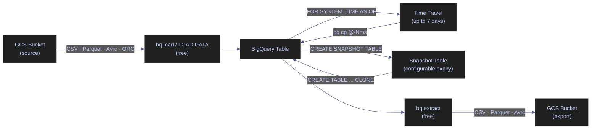

# BigQuery Data Loading and Export

> [!quote]
> "Getting information off the Internet is like taking a drink from a fire hydrant."
>
> — **Mitch Kapor**, founder of Lotus Development

BigQuery ingests data primarily from Cloud Storage (GCS), supporting CSV, Parquet, Avro, ORC, and newline-delimited JSON. Parquet is the recommended format for production loads — it is columnar, compressed, and carries its own schema, eliminating the need for schema specification or header row handling. For a deeper comparison of when to choose each format, see [serialization-formats](https://alp78.github.io/elysium/14-Data-Architecture/Pipeline-Patterns/serialization-formats). This note covers load and export operations via both `bq` CLI and the `LOAD DATA` SQL statement, hive-partitioned directory structures, table snapshots, and BigQuery's built-in time travel capability for recovering from data corruption.

## Loading Data from GCS

Loading data from GCS into BigQuery requires two IAM roles: `bigquery.dataEditor` on the target dataset (grants permission to create, update, and delete table data) and `storage.objectViewer` on the source GCS bucket (grants read-only access to objects). Both roles are scoped at the dataset or bucket level respectively — granting them at the project level is broader than necessary and should be avoided in production. Load jobs run asynchronously and are **free** — BigQuery does not charge for loading data from GCS. Each load job supports up to 10,000 source files and 15 TB total uncompressed input; compressed CSV and JSON files are limited to 4 GB per file because BigQuery must decompress them in memory. Individual uncompressed files may not exceed 5 TB. Parquet, Avro, and ORC files have no per-file compression limit because they use block-level compression that BigQuery reads natively. Ensure `bigquery.googleapis.com` is enabled before running any `bq` command. Load jobs are capped at 1,000 per table per day and 100,000 per project per day — if you need higher throughput, use streaming inserts instead.

> [!warning] Frequent Small Loads Cause Table Fragmentation
>
> Running many small load jobs (e.g., every minute) fragments the table's internal storage and increases metadata overhead. BigQuery optimizes storage in the background, but high-frequency batch loads can outpace the optimizer.

> [!success] Batch Loads at Pipeline Boundaries
>
> Aggregate data into fewer, larger load jobs aligned with pipeline cadence (hourly, daily). For near-real-time requirements below a 1-minute boundary, use the BigQuery Storage Write API or streaming inserts rather than repeated `bq load` calls.

### bq load | Load from GCS

`bq load` creates an asynchronous load job that reads one or more GCS URIs and writes to a target table. Use glob patterns (`gs://bucket/prefix/*`) to load multiple files in a single job. The target table must already exist, or pass `--autodetect` or `--schema` to create it on first load. The default write disposition is `WRITE_APPEND` — rows are appended to an existing table. Pass `--replace` to truncate the table before loading.

#### bq load | CSV | load CSV from GCS

**When to run:** when landing raw CSV files from an external source into a BigQuery staging table.
**Trigger:** a pipeline step has written CSV files to a GCS bucket and the next step needs the data queryable in BigQuery.
**Context:** runs from any shell with `bq` CLI authenticated. Creates an asynchronous load job. State-changing — creates or appends to the target table. Requires `bigquery.dataEditor` on the target dataset and `storage.objectViewer` on the source bucket.
**Purpose:** ingest CSV data from GCS into a BigQuery table with schema auto-detection.

Supported source formats: `CSV`, `NEWLINE_DELIMITED_JSON`, `PARQUET`, `AVRO`, `ORC`. The `--skip_leading_rows=1` flag skips the header row, and `--autodetect` infers the schema from the first 500 rows of the data. For production, specify an explicit schema with the `--schema` flag or a `schema.json` file to eliminate sampling ambiguity.

> [!info]- Flag breakdown
>
> - `--source_format=CSV` — tells BigQuery to parse the input as comma-separated values.
> - `--skip_leading_rows=1` — skips the first row (header). Without this, the header row is loaded as data and causes type errors.
> - `--autodetect` — BigQuery samples the first 500 rows to infer column names and types. Only applies to CSV and JSON; Parquet/Avro/ORC carry embedded schemas.
> - `stoxx_bronze.staging_ohlcv` — fully-qualified target table in `dataset.table` format. If the table does not exist, BigQuery creates it using the auto-detected schema.
> - `gs://stoxx-bq-bucket/exports/eurostoxx50_ohlcv.csv` — GCS URI of the source file. Supports glob patterns (`*`) to load multiple files.

*Load the EURO STOXX 50 OHLCV CSV file from GCS into a staging table with auto-detected schema.*

```bash
bq load --source_format=CSV --skip_leading_rows=1 --autodetect \
  stoxx_bronze.staging_ohlcv gs://stoxx-bq-bucket/exports/eurostoxx50_ohlcv.csv
```

```text
Waiting on bqjob_r1132afb7d3d4852e_0000019d80df8c60_1 ... (1s) Current status: DONE
```

The `DONE` status confirms the load job completed successfully. BigQuery created the `staging_ohlcv` table with an auto-detected schema derived from the CSV header and the first 500 rows.

> [!warning] Autodetect Infers Schema from a Sample and Can Mistype Columns
>
> `--autodetect` reads the first 500 rows of a CSV to infer types. If row 501 has a longer string or a different date format, the load fails or silently truncates data. Columns that contain only integers in the sample but later contain floats will be typed as `INTEGER`, causing load failures on subsequent appends.

> [!success] Use Explicit Schemas for CSV Production Loads
>
> Pass `--schema` or a `schema.json` file to `bq load` for all CSV loads in production. This eliminates sampling ambiguity entirely. For new pipelines, switch to Parquet — the schema is embedded in the file and `--autodetect` is never needed.

#### bq load | Parquet | load Parquet from GCS (recommended)

**When to run:** when loading production data into BigQuery from GCS where the source files are in Parquet format.
**Trigger:** a pipeline step has written Parquet files to GCS and the data needs to be queryable in BigQuery.
**Context:** runs from any shell with `bq` CLI authenticated. Creates an asynchronous load job. State-changing — creates or appends to the target table. No `--autodetect` or `--skip_leading_rows` needed because Parquet embeds its own schema.
**Purpose:** ingest Parquet data from GCS into a BigQuery table using the embedded schema.

Parquet embeds its schema in the file footer, so `--autodetect` and `--skip_leading_rows` are not required and are silently ignored if passed. The columnar layout and built-in Snappy compression make Parquet the preferred format for production loads — file sizes are typically 70–90% smaller than equivalent CSV, and type mapping (dates, timestamps, decimals) is exact rather than inferred.

*Load the EURO STOXX 50 OHLCV Parquet file from GCS into a table using the embedded schema.*

```bash
bq load --source_format=PARQUET \
  stoxx_bronze.staging_ohlcv gs://stoxx-bq-bucket/exports/eurostoxx50_ohlcv.parquet
```

```text
Waiting on bqjob_r742f3fd62f1cd3e5_0000019d80dfb9de_1 ... (1s) Current status: DONE
```

> [!tip] Prefer Parquet for All Production Loads
>
> Parquet eliminates three classes of CSV loading errors:
>
> - **Schema ambiguity** — types are declared in the file, not sampled from data.
> - **Header handling** — no `--skip_leading_rows` needed; no risk of loading the header as a data row.
> - **Delimiter and quoting bugs** — Parquet is binary; no CSV escaping issues.
>
> The only reason to use CSV is when you receive data from an external source that does not support Parquet export.

#### bq load | Hive partitioning | load from Hive-partitioned GCS layout

**When to run:** when GCS files are organized in a hive-style directory structure with key-value path segments (e.g., `year=2025/month=03/`).
**Trigger:** the upstream pipeline writes files into date- or category-partitioned GCS directories and you want BigQuery to recognize the directory keys as partition columns.
**Context:** runs from any shell with `bq` CLI authenticated. State-changing — creates or appends to the target table. The source URI must end with `/*` to match all partitions. Requires the same IAM roles as a standard load.
**Purpose:** ingest files from a hive-partitioned GCS layout into a BigQuery table, automatically mapping directory segments to partition columns.

Hive partitioning is a directory naming convention originating from Apache Hive where each subdirectory encodes a column name and value as a `key=value` path segment. For example, `gs://bucket/data/year=2025/month=03/file.parquet` encodes `year=2025` and `month=03`. The `--hive_partitioning_mode=AUTO` flag tells BigQuery to detect these segments and map them to BigQuery partition columns automatically. `AUTO` mode infers both the key names and their types; `STRINGS` mode maps all keys as STRING regardless of content; `CUSTOM` mode requires an explicit schema definition for the partition keys.

*Load all Parquet files from a hive-partitioned GCS layout, mapping directory segments to BigQuery partition columns.*

```bash
bq load --source_format=PARQUET --hive_partitioning_mode=AUTO \
  stoxx_bronze.ohlcv_partitioned 'gs://stoxx-bq-bucket/data/*'
```

| Flag | Syntax | Description |
|---|---|---|
| `--source_format` | `bq load --source_format=PARQUET` | Source file format: `PARQUET`, `CSV`, `AVRO`, `ORC`, `NEWLINE_DELIMITED_JSON` |
| `--skip_leading_rows` | `bq load --skip_leading_rows=1` | Number of rows to skip at start of CSV file (`1` for header row) |
| `--autodetect` | `bq load --autodetect` | Infer schema from first 500 rows — CSV/JSON only; ignored for Parquet/Avro/ORC |
| `--schema` | `bq load --schema field:TYPE,...` | Explicit schema as inline definition or path to JSON file |
| `--hive_partitioning_mode` | `bq load --hive_partitioning_mode=AUTO` | Map GCS directory segments to partition columns: `AUTO`, `CUSTOM`, `STRINGS` |
| `--hive_partitioning_source_uri_prefix` | `bq load --hive_partitioning_source_uri_prefix=gs://bucket/prefix` | Base prefix stripped before hive partition key detection |
| `--replace` | `bq load --replace` | Truncate and replace table contents instead of appending (`WRITE_TRUNCATE`) |
| `--time_partitioning_field` | `bq load --time_partitioning_field=date` | Use a DATE or TIMESTAMP column for partition pruning |
| `--time_partitioning_type` | `bq load --time_partitioning_type=DAY` | Partition granularity: `HOUR`, `DAY`, `MONTH`, `YEAR` (default: `DAY`) |
| `--time_partitioning_expiration` | `bq load --time_partitioning_expiration=86400` | Seconds after partition time before partition data expires |
| `--clustering_fields` | `bq load --clustering_fields=symbol,date` | Cluster table on up to 4 fields for query performance |
| `--max_bad_records` | `bq load --max_bad_records=10` | Allow N malformed rows before failing the job (default: `0`) |
| `--allow_jagged_rows` | `bq load --allow_jagged_rows` | Allow missing trailing optional columns in CSV import data |
| `--allow_quoted_newlines` | `bq load --allow_quoted_newlines` | Allow quoted newlines in CSV import data |
| `--ignore_unknown_values` | `bq load --ignore_unknown_values` | Allow and ignore extra values not represented in the table schema |
| `--null_marker` | `bq load --null_marker=NULL` | Custom string representing NULL values in CSV data |
| `--quote` | `bq load --quote='"'` | Quote character for CSV fields (default: `"`) |
| `--field_delimiter` | `bq load --field_delimiter=','` | CSV field separator character (default: `,`) |
| `--encoding` | `bq load --encoding=UTF-8` | Character encoding of source data: `UTF-8` or `ISO-8859-1` |
| `--schema_update_option` | `bq load --schema_update_option=ALLOW_FIELD_ADDITION` | Allow schema changes during append: `ALLOW_FIELD_ADDITION`, `ALLOW_FIELD_RELAXATION` |
| `--destination_kms_key` | `bq load --destination_kms_key=projects/.../cryptoKeys/key` | Cloud KMS key for encrypting the destination table |
| `--projection_fields` | `bq load --projection_fields=field1,field2` | Subset of fields to load from Datastore backup (Datastore only) |
| `--use_avro_logical_types` | `bq load --use_avro_logical_types` | Interpret Avro logical types as BigQuery types (TIMESTAMP, DATE) instead of raw types |
| `--parquet_enable_list_inference` | `bq load --parquet_enable_list_inference` | Use schema inference for Parquet LIST logical type |
| `--parquet_enum_as_string` | `bq load --parquet_enum_as_string` | Infer Parquet ENUM logical type as STRING |

### LOAD DATA | SQL-based loading from GCS

The `LOAD DATA` SQL statement is an alternative to `bq load` that runs entirely within a BigQuery SQL session. It supports the same source formats and options as `bq load` but can be embedded in scheduled queries, stored procedures, and multi-statement scripts — making it the preferred approach for automated pipelines that already run SQL.

#### LOAD DATA INTO | load CSV from GCS via SQL

**When to run:** when loading data from GCS as part of a SQL-based pipeline or scheduled query, rather than a shell-based workflow.
**Trigger:** a scheduled query fires, or a stored procedure reaches the ingestion step.
**Context:** runs inside a BigQuery SQL session (console, `bq query`, or API). State-changing — creates or appends to the target table. Same IAM requirements as `bq load`.
**Purpose:** ingest GCS data into a BigQuery table using a SQL statement that can be scheduled, versioned, and composed with other SQL steps.

> [!info]- Clause breakdown
>
> - `LOAD DATA INTO dataset.table` — target table; `INTO` appends to an existing table or creates it. Use `OVERWRITE` instead to truncate first.
> - `FROM FILES(...)` — GCS source configuration. `format` sets the file format; `uris` is a JSON array of GCS paths (supports globs). `skip_leading_rows` works the same as the CLI flag.
> - Schema can be specified inline as `LOAD DATA INTO dataset.table(col1 TYPE, col2 TYPE, ...)` or omitted for auto-detection.

*Load the EURO STOXX 50 OHLCV CSV from GCS into a staging table using the SQL LOAD DATA statement.*

```sql
LOAD DATA INTO stoxx_bronze.staging_ohlcv
FROM FILES(
  format = 'CSV',
  skip_leading_rows = 1,
  uris = ['gs://stoxx-bq-bucket/exports/eurostoxx50_ohlcv.csv']
)
```

```text
Created bq-wh-nb.stoxx_bronze.staging_ohlcv
```

*Verify the loaded data.*

```sql
SELECT symbol, date, close, volume
FROM stoxx_bronze.staging_ohlcv
ORDER BY symbol, date
LIMIT 5
```

| symbol | date | close | volume |
|---|---|---|---|
| ABI.BR | 2026-04-07 | 61.62 | 2181929 |
| AD.AS | 2026-04-07 | 41.69 | 2256560 |
| ADS.DE | 2026-04-07 | 130.85 | 755796 |
| ADYEN.AS | 2026-04-07 | 844.2 | 138746 |
| AI.PA | 2026-04-07 | 181.5 | 933085 |

> [!tip] LOAD DATA in Scheduled Queries
>
> `LOAD DATA` can be wrapped in a BigQuery scheduled query to run on a cron cadence. Combined with `LOAD DATA OVERWRITE`, this provides a fully SQL-native ingestion pipeline that truncates and reloads a staging table on each run — no shell scripts or Cloud Functions required.

## Exporting Data to GCS

### bq extract | Export BigQuery table to GCS

`bq extract` exports a BigQuery table or view to one or more GCS objects. Export jobs are free — no charge for reading BigQuery data during export; cost comes only from the resulting GCS storage. Requires `bigquery.dataViewer` on the source table (grants read access to table data and metadata) and `storage.objectCreator` on the destination bucket (grants permission to create new objects). Supported export formats: `PARQUET`, `CSV`, `NEWLINE_DELIMITED_JSON`, `AVRO`.

#### bq extract | Parquet | export table to GCS as Parquet

**When to run:** when exporting BigQuery table data to GCS for downstream consumption, archival, or cross-platform transfer.
**Trigger:** a pipeline step requires data in GCS (e.g., feeding a Dataflow job, populating a data lake, or archiving for compliance).
**Context:** runs from any shell with `bq` CLI authenticated. Creates an asynchronous extract job. Read-only on the source table. Requires `bigquery.dataViewer` and `storage.objectCreator`.
**Purpose:** write a BigQuery table to GCS in Parquet format for downstream consumption.

Use the `*` wildcard in the destination URI to enable parallel sharded export. BigQuery cannot write a single output file larger than approximately 1 GB; the wildcard is required for any table that exceeds this size. For tables under 1 GB, a single-file URI (without `*`) works but limits parallelism.

*Export the EURO STOXX 50 OHLCV table to GCS as sharded Parquet files.*

```bash
bq extract --destination_format=PARQUET \
  stoxx_bronze.eurostoxx50_ohlcv gs://stoxx-bq-bucket/export/eurostoxx50_ohlcv-*.parquet
```

```text
Waiting on bqjob_r66b528194a01b031_0000019d80df3303_1 ... (0s) Current status: DONE
```

The `DONE` status confirms the extract job completed. BigQuery wrote one shard (`eurostoxx50_ohlcv-000000000000.parquet`, 7,155 bytes) because the 50-row table is well under the 1 GB single-file limit.

#### bq extract | GZIP | export with compression

**When to run:** when the downstream consumer benefits from compressed files (e.g., reducing GCS storage cost, faster cross-region transfer).
**Trigger:** export destination is a cold-storage bucket, a cross-region transfer, or a system that reads compressed CSV natively.
**Context:** same as standard extract. The `--compression` flag adds a compression pass after export. CSV supports GZIP and DEFLATE; Parquet supports SNAPPY and ZSTD (already compressed internally by default).
**Purpose:** export table data to GCS with an explicit compression codec applied to the output files.

GZIP compression reduces CSV export file size significantly. See [compression](https://alp78.github.io/elysium/01-Shell/02-File-Operations/04-compression) for algorithm trade-offs.

*Export the EURO STOXX 50 OHLCV table to GCS as GZIP-compressed CSV shards.*

```bash
bq extract --destination_format=CSV --compression=GZIP \
  stoxx_bronze.eurostoxx50_ohlcv gs://stoxx-bq-bucket/export/eurostoxx50_ohlcv-*.csv.gz
```

```text
Waiting on bqjob_r71bce700759650dd_0000019d80df4216_1 ... (0s) Current status: DONE
```

The CSV export (4,682 bytes uncompressed) was written as a single GZIP shard (`eurostoxx50_ohlcv-000000000000.csv.gz`, 1,548 bytes) — a 67% size reduction.

> [!info] Export Sharding Is Required for Large Tables
>
> The `*` wildcard in the export destination path tells BigQuery to shard the output across multiple files. BigQuery cannot write a single file larger than ~1 GB. For tables under 1 GB, sharding still works (produces a single shard with suffix `-000000000000`) but is not strictly required. The shards can be read back together with `gs://bucket/prefix-*.parquet`.

| Flag | Syntax | Description |
|---|---|---|
| `--destination_format` | `bq extract --destination_format=PARQUET` | Output file format: `PARQUET`, `CSV`, `NEWLINE_DELIMITED_JSON`, `AVRO` |
| `--compression` | `bq extract --compression=GZIP` | Compression codec: `GZIP`, `DEFLATE`, `SNAPPY`, `ZSTD`, `NONE` (default: `NONE`) |
| `--field_delimiter` | `bq extract --field_delimiter=','` | CSV field separator character (default: `,`) |
| `--print_header` | `bq extract --print_header=true` | Include header row in CSV output (default: `true`) |
| `--use_avro_logical_types` | `bq extract --use_avro_logical_types` | Export Avro logical types as their corresponding types (TIMESTAMP, DATE) instead of raw types |

## Time Travel and Snapshots

BigQuery retains historical versions of every table for a configurable window — 7 days by default, adjustable from 2 to 7 days per dataset via `max_time_travel_hours` (valid range: 48–168 hours). Time travel requires no manual setup and adds storage overhead proportional to the volume of row changes. The `stoxx_bronze` dataset uses the default 168-hour (7-day) window. For recovery beyond the 7-day window, use `CREATE SNAPSHOT TABLE` to create point-in-time copies with configurable expiration.

### Time Travel | FOR SYSTEM_TIME AS OF | query historical table state

Time travel lets you query a table as it existed at any point within the configured window. This is the first tool to reach for when investigating data corruption, accidental deletes, or pipeline regressions.

#### FOR SYSTEM_TIME AS OF | query table state at a past timestamp

**When to run:** when you need to inspect the state of a table at a specific point in the past — typically after discovering data corruption, an accidental DELETE, or unexpected row counts.
**Trigger:** a pipeline audit reveals row count drift, a downstream report shows unexpected values, or an operator reports an accidental DML statement.
**Context:** runs as a standard BigQuery SQL query. Read-only — does not modify the table. The timestamp must fall within the table's `max_time_travel_hours` window (default: 168 hours / 7 days).
**Purpose:** retrieve the exact row count (or full contents) of a table as it existed at a specific past timestamp, without modifying the current table.

| Clause | Purpose | Type |
|---|---|---|
| `FOR SYSTEM_TIME AS OF` | Tells BigQuery to read the table's historical version at the specified timestamp | Time travel qualifier |
| `TIMESTAMP_SUB(CURRENT_TIMESTAMP(), INTERVAL 3 DAY)` | Computes the timestamp 3 days before the current time | Timestamp arithmetic |
| `COUNT(*)` | Returns the total number of rows in the historical snapshot | Aggregate function |

*Count the rows in the eurostoxx50_ohlcv table as it existed 3 days ago.*

```bash
bq query --use_legacy_sql=false \
  'SELECT COUNT(*) AS row_count FROM `stoxx_bronze.eurostoxx50_ohlcv` FOR SYSTEM_TIME AS OF TIMESTAMP_SUB(CURRENT_TIMESTAMP(), INTERVAL 3 DAY)'
```

| row_count |
|---|
| 50 |

The table contained 50 rows 3 days ago — the same as the current count, confirming no rows were added, deleted, or lost in the interim. If this number differed from the current count, it would indicate a DML operation (INSERT, UPDATE, DELETE, or MERGE) occurred within the last 3 days.

#### bq cp | restore table from time travel snapshot

**When to run:** when a time travel query confirms that data corruption or accidental deletion occurred, and you need to restore the table to its previous state.
**Trigger:** the `FOR SYSTEM_TIME AS OF` query reveals a pre-corruption row count or data state that you want to recover.
**Context:** runs from any shell with `bq` CLI authenticated. State-changing — creates a new table from the historical snapshot. The source table suffix `@-Nms` references the table state N milliseconds before the current time. Does not modify the original table.
**Purpose:** copy a historical snapshot of a table to a new table for inspection or to replace the corrupted version.

The suffix `@-86400000` references the table state 86,400,000 milliseconds (24 hours) before the current time. Any millisecond offset within the `max_time_travel_hours` window is valid. You can also use an absolute timestamp with `@<unix_millis>`.

*Copy the eurostoxx50_ohlcv table from its state 24 hours ago into a new restored table.*

```bash
bq cp stoxx_bronze.eurostoxx50_ohlcv@-86400000 stoxx_bronze.ohlcv_restored
```

```text
Waiting on bqjob_ra69ce3bb1ea8df4_0000019d80dff422_1 ... (0s) Current status: DONE
Table 'bq-wh-nb:stoxx_bronze.eurostoxx50_ohlcv@-86400000' successfully copied to 'bq-wh-nb:stoxx_bronze.ohlcv_restored'
```

The `successfully copied` confirmation means BigQuery created `ohlcv_restored` as a full, independent copy of the table's state from 24 hours ago. This table can be queried, compared to the current version, or used to overwrite the original via `INSERT INTO ... SELECT` or `bq cp --force`.

> [!warning] Time Travel Has a 7-Day Hard Limit
>
> If a table was dropped or corrupted more than 7 days ago, time travel data is permanently gone. The `max_time_travel_hours` ceiling is 168 hours (7 days) — it cannot be extended.

> [!success] Supplement Time Travel with Snapshots for Long-Term Recovery
>
> Set `max_time_travel_hours = 168` on all critical datasets and add a scheduled `CREATE SNAPSHOT TABLE` job (see below) for retention beyond 7 days. Export to GCS via `bq extract` on a regular cadence as a third recovery tier.

#### bq update | configure time travel window on a dataset

**When to run:** when you need to adjust the time travel retention window for a dataset — either extending it for critical production data or reducing it for high-churn staging data to save storage cost.
**Trigger:** initial dataset setup, or a storage cost audit reveals that time travel bytes on staging datasets are disproportionately large.
**Context:** runs from any shell with `bq` CLI authenticated. State-changing — modifies the dataset's `maxTimeTravelHours` property. Applies to all existing and future tables in the dataset. Requires `bigquery.dataOwner` on the dataset.
**Purpose:** set the time travel retention window for all tables in a dataset.

BigQuery stores all row versions within the time travel window. The storage overhead depends on mutation volume: a table with frequent updates or deletes accumulates more historical bytes than an append-only table. **Factors that drive overhead:** the ratio of mutated rows to total rows per load cycle, the frequency of load cycles, and the row width. An append-only table with daily loads adds roughly 14% overhead (7 daily snapshots / 50 rows × average retention). A table where 100% of rows are replaced daily (`WRITE_TRUNCATE`) stores up to 7 full copies — nearly 700% overhead. For staging tables with `--replace` loads, reducing the window to 48 hours cuts overhead to ~2 copies.

*Set the time travel window to 168 hours (7 days) on the stoxx_bronze dataset.*

```bash
bq update --max_time_travel_hours=168 stoxx_bronze
```

```text
Dataset 'bq-wh-nb:stoxx_bronze' successfully updated.
```

*Verify the setting.*

```bash
bq show --format=prettyjson stoxx_bronze 2>&1 | grep maxTimeTravelHours
```

```text
  "maxTimeTravelHours": "168",
```

> [!tip] Right-Size Time Travel by Dataset Tier
>
> - **Critical production datasets** (`stoxx_gold`, `stoxx_silver`): `max_time_travel_hours = 168` — full 7-day recovery window.
> - **High-churn staging datasets** (`stoxx_bronze` with `--replace` loads): consider `max_time_travel_hours = 48` to reduce storage overhead from 7 full copies to 2.
> - **Ephemeral/scratch datasets**: `max_time_travel_hours = 48` — minimum allowed value, lowest cost.

### Snapshots | CREATE SNAPSHOT TABLE | point-in-time table copies

Table snapshots are lightweight, read-only copies of a table at a specific point in time. Unlike time travel (which is bounded by the 7-day window), snapshots persist until their expiration timestamp — which can be set to any future date. Snapshots are stored efficiently: BigQuery only charges for data in the snapshot that is no longer present in the base table, so a freshly created snapshot of an unchanged table has near-zero storage cost.

#### CREATE SNAPSHOT TABLE | create a point-in-time snapshot

**When to run:** before a high-risk migration, schema change, or bulk DML operation — or on a regular schedule for audit retention.
**Trigger:** a planned DDL/DML operation that could corrupt or lose data, or a scheduled job for periodic backup.
**Context:** runs as a BigQuery SQL statement. State-changing — creates a new snapshot table. The snapshot dataset must be in the same region and organization as the base table. Requires `bigquery.tables.create` on the target dataset and `bigquery.tables.getData` on the source table.
**Purpose:** create a persistent, read-only copy of a table at the current point in time that survives beyond the 7-day time travel window.

| Clause | Purpose |
|---|---|
| `CREATE SNAPSHOT TABLE` | Creates a new read-only snapshot table |
| `CLONE source_table` | Specifies the base table to snapshot |
| `OPTIONS(expiration_timestamp = ...)` | Sets when BigQuery automatically deletes the snapshot |

*Create a 7-day snapshot of the eurostoxx50_ohlcv table.*

```sql
CREATE SNAPSHOT TABLE stoxx_bronze.eurostoxx50_ohlcv_snap
CLONE stoxx_bronze.eurostoxx50_ohlcv
OPTIONS(
  expiration_timestamp = TIMESTAMP_ADD(CURRENT_TIMESTAMP(), INTERVAL 7 DAY)
)
```

```text
Created bq-wh-nb.stoxx_bronze.eurostoxx50_ohlcv_snap
```

The snapshot is a read-only copy of all 50 rows as they exist at the moment of creation. It expires automatically in 7 days. To restore from the snapshot, use `CREATE TABLE ... CLONE snapshot_table`.

> [!tip] Schedule Snapshots for Long-Term Audit Retention
>
> Wrap the `CREATE SNAPSHOT TABLE` statement in a BigQuery scheduled query to run daily or weekly. Use dynamic snapshot naming with `EXECUTE IMMEDIATE` and `FORMAT_DATE` to create date-stamped snapshots:
>
> ```sql
> DECLARE snap STRING;
> SET snap = CONCAT('stoxx_bronze.ohlcv_snap_', FORMAT_DATE('%Y%m%d', CURRENT_DATE()));
> EXECUTE IMMEDIATE FORMAT("CREATE SNAPSHOT TABLE `%s` CLONE stoxx_bronze.eurostoxx50_ohlcv OPTIONS(expiration_timestamp = TIMESTAMP_ADD(CURRENT_TIMESTAMP(), INTERVAL 30 DAY))", snap);
> ```

> [!tip] Related Patterns
>
> - The `bq load` workflow mirrors the [bronze-layer-loading](https://alp78.github.io/elysium/04-SQL-Server/04-Applied-SQL-Server-for-Data-Pipelines/bronze-layer-loading) pattern used for SQL Server ingestion — both follow the same stage-then-validate approach for landing raw data into an analytical store.
> - Once data is loaded, [bq-engineering](https://alp78.github.io/elysium/05-DB-Queries/02-BigQuery/bq-engineering) covers the advanced query patterns that transform and consume it.

## Data Format Comparison

| Format | Schema | Compression | Per-File Limit (compressed) | Best For |
|---|---|---|---|---|
| Parquet | Embedded in footer | Columnar (Snappy default) | No limit (block-level) | Production loads, analytics, data lake interchange |
| Avro | Embedded in header | Row-level (Deflate/Snappy) | No limit (block-level) | Streaming, row-oriented workloads, schema evolution |
| CSV | None (autodetect or explicit) | Optional (GZIP) | 4 GB compressed | External sources, simple flat data, human-readable |
| NEWLINE_DELIMITED_JSON | None (autodetect or explicit) | Optional (GZIP) | 4 GB compressed | Semi-structured data, API responses |
| ORC | Embedded | Columnar (ZLIB/Snappy) | No limit (block-level) | Hive ecosystem compatibility |

The 4 GB per-file limit on compressed CSV and JSON exists because BigQuery must decompress the entire file in memory before processing. Parquet, Avro, and ORC use block-level compression that BigQuery reads natively without full decompression.



## Related

- [dataset-and-table-management](https://alp78.github.io/elysium/06-GCP/03-BigQuery/01-dataset-and-table-management) — Tables must exist (or use `--autodetect`) before loading
- [querying-and-cost-optimization](https://alp78.github.io/elysium/06-GCP/03-BigQuery/03-querying-and-cost-optimization) — Querying tables after data is loaded
- [job-management](https://alp78.github.io/elysium/06-GCP/03-BigQuery/04-job-management) — Load and export operations create BQ jobs; monitor and cancel them
- [gcs-object-operations](https://alp78.github.io/elysium/06-GCP/02-Storage/02-gcs-object-operations) — Managing the GCS objects that feed BigQuery loads
- [gcs-buckets-and-lifecycle](https://alp78.github.io/elysium/06-GCP/02-Storage/01-gcs-buckets-and-lifecycle) — Lifecycle rules to auto-expire staging data after loading
- [data-flow-architecture](https://alp78.github.io/elysium/14-Data-Architecture/Pipeline-Patterns/data-flow-architecture) — Complete data movement topology showing how bq load/extract fits into the stack
- [Terraform BigQuery provisioning](https://alp78.github.io/elysium/07-Terraform/01-Fundamentals/01-terraform-overview) — IaC for creating BigQuery datasets, tables, and scheduled queries
- [serialization-formats](https://alp78.github.io/elysium/14-Data-Architecture/Pipeline-Patterns/serialization-formats) — Detailed format comparison (Parquet vs Avro vs CSV vs JSON)

## References

- [Loading data into BigQuery](https://cloud.google.com/bigquery/docs/loading-data) — GCS load job configuration, format support, quotas
- [LOAD DATA SQL statement reference](https://cloud.google.com/bigquery/docs/reference/standard-sql/load-statements) — SQL-based loading syntax, hive partitioning, schema specification
- [Exporting table data](https://cloud.google.com/bigquery/docs/exporting-data) — `bq extract` options, sharding, compression
- [Time travel](https://cloud.google.com/bigquery/docs/time-travel) — `FOR SYSTEM_TIME AS OF`, `max_time_travel_hours`, snapshot restoration
- [Table snapshots](https://cloud.google.com/bigquery/docs/table-snapshots-intro) — `CREATE SNAPSHOT TABLE`, storage costs, scheduled snapshots
- [Table snapshots with scheduled queries](https://cloud.google.com/bigquery/docs/table-snapshots-scheduled) — Automating periodic snapshots via scheduled queries
- [BigQuery quotas and limits](https://cloud.google.com/bigquery/quotas) — Load job limits (1,000/table/day, 100,000/project/day), file size limits, row limits
- *Google BigQuery: The Definitive Guide* (Lakshmanan & Tigani) — load job fragmentation warnings, compressed file staging benchmarks

