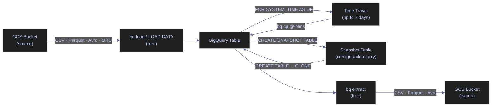

# Data Loading and Export

> [!quote]+
> "Getting information off the Internet is like taking a drink from a fire hydrant."
>
> — **Mitch Kapor**, founder of Lotus Development

> [!abstract]- Summary
>
> Documents moving data between Cloud Storage and BigQuery with `bq load`, `LOAD DATA`, and `bq extract`, then extends into built-in recovery with time travel and snapshot tables so you can ingest files, export tables, and restore historical state without leaving the BigQuery ecosystem.
>
> **Loading from GCS**
> - Prerequisites: enable `bigquery.googleapis.com`, grant `bigquery.dataEditor` on target datasets and `storage.objectViewer` on source buckets, and understand that load jobs are asynchronous and free
> - `bq load` patterns cover CSV with `--skip_leading_rows`, `--autodetect`, and explicit `--schema`; Parquet as the preferred production format; hive-style paths with `--hive_partitioning_mode`; and table-shape options such as `--replace`, `--time_partitioning_field`, `--time_partitioning_type`, `--clustering_fields`, and `--schema_update_option`
> - `LOAD DATA` provides the same ingestion capability from SQL with `INTO` or `OVERWRITE`, `FROM FILES(...)`, and a form that can live inside scheduled queries, stored procedures, and multi-statement scripts
> - Operational limits include up to 10,000 source files and 15 TB uncompressed input per load job, a 4 GB compressed-file ceiling for CSV and JSON, a 5 TB limit for individual uncompressed files, and load-job quotas of 1,000 per table per day and 100,000 per project per day
>
> **Exporting to GCS**
> - `bq extract` exports tables or views to `PARQUET`, `CSV`, `NEWLINE_DELIMITED_JSON`, or `AVRO`, requires `bigquery.dataViewer` on the source and `storage.objectCreator` on the destination bucket, and keeps export jobs free while GCS storage remains billable
> - Export examples cover Parquet sharding with a `*` wildcard, CSV compression with `--compression=GZIP`, and format-specific flags such as `--field_delimiter`, `--print_header`, and `--use_avro_logical_types`
>
> **Recovery and retention**
> - Query historical table state with `FOR SYSTEM_TIME AS OF`, restore prior versions with `bq cp table@-Nms` or `@<unix_millis>`, and set dataset retention with `bq update --max_time_travel_hours=48..168`
> - Use `CREATE SNAPSHOT TABLE ... CLONE ... OPTIONS(expiration_timestamp=...)` for read-only point-in-time copies that outlive the rolling time-travel window
>
> **Format selection**
> - The note compares `PARQUET`, `AVRO`, `CSV`, `NEWLINE_DELIMITED_JSON`, and `ORC` by schema handling, compression model, compressed-file limits, and operational fit, with Parquet recommended for production loads
>
> **Operations and safety**
> - When to use: batch ingestion from GCS, SQL-native scheduled loads, cross-system exports, corruption investigation, and point-in-time recovery
> - Warnings: many small loads fragment tables, CSV autodetect can mistype columns from a 500-row sample, large exports require wildcard sharding, and time travel cannot exceed 168 hours
> - Recommendations: prefer Parquet, batch loads at pipeline boundaries, switch to the BigQuery Storage Write API or streaming for sub-minute ingestion, right-size `max_time_travel_hours` by dataset tier, and schedule snapshots for long-term retention

> [!warning] Live-run boundary
>
> This note's original runnable examples depend on a writable BigQuery dataset and a writable GCS bucket in `bq-wh-nb`. On `2026-04-15`, `bq-wh-nb` was already deleted, and `dagflow-poc` currently exposes no private BigQuery datasets, so the `bq load`, `LOAD DATA`, `bq extract`, time-travel restore, and snapshot examples were not rerun.
>
> The commands and outputs below remain useful as an operator runbook, but treat them as historically validated patterns rather than current proof that the load/export path is live.
>
> [!note]- Glossary
>
> **BigQuery**
> - Google's serverless analytical database service that stores tables, runs SQL, and manages load, export, and recovery workflows without user-managed database servers.
> - Every command and retention feature in this note is implemented by BigQuery rather than by the underlying storage bucket.
>
> > [!info] Control plane plus storage
> >
> > BigQuery is not just a query engine. It also owns the job system, historical row versions, snapshot tables, and table metadata used throughout this note.
>
> ---
>
> **Cloud Storage / `gs://` URI**
> - Google Cloud object storage and its URI scheme used as the source or destination path for `bq load`, `LOAD DATA`, and `bq extract`.
> - The note assumes data moves through buckets, so understanding bucket paths is required before any load or export example makes sense.
>
> > [!warning] Region alignment still matters
> >
> > Buckets and datasets can exist in different locations, but cross-region movement affects latency, egress cost, and operational design. Do not treat `gs://` as a location-free abstraction.
>
> ---
>
> **Load job**
> - An asynchronous BigQuery ingestion operation that reads files from Cloud Storage and writes rows into a destination table.
> - Load jobs are the unit behind `bq load` and `LOAD DATA`, including quotas, free pricing, and table-fragmentation guidance in the note.
>
> > [!warning] Small jobs add overhead
> >
> > Frequent tiny loads create metadata churn and fragmented storage layout. BigQuery will optimize in the background, but not always fast enough to hide a poor load cadence.
>
> ---
>
> **IAM role**
> - A named Google Cloud permission bundle such as `bigquery.dataEditor`, `bigquery.dataViewer`, `storage.objectViewer`, or `storage.objectCreator`.
> - This note maps roles to each direction of data movement so you can distinguish authorization failures from syntax or format problems.
>
> > [!warning] Source and destination rights differ
> >
> > Load workflows need read access on the bucket and write access on the table. Export workflows flip that pattern, so reusing the same principal without checking both sides often fails.
>
> ---
>
> **`bq load`**
> - The BigQuery CLI command that starts a load job from one or more Cloud Storage objects into a BigQuery table.
> - The note uses `bq load` for shell-driven ingestion, flag-based schema control, and file-format-specific behavior.
>
> > [!info] Table creation can be implicit
> >
> > If the destination table does not exist, `bq load` can create it when you supply an explicit schema or allow schema detection for supported formats.
>
> ---
>
> **`LOAD DATA`**
> - A GoogleSQL statement that loads external files into a BigQuery table from within a SQL session instead of from a shell command.
> - The note positions it as the SQL-native alternative when ingestion belongs inside scheduled queries, procedures, or multi-statement scripts.
>
> > [!info] Useful in SQL pipelines
> >
> > `LOAD DATA` keeps orchestration close to the rest of your SQL logic, which simplifies versioning and removes the need for separate wrapper scripts in some pipelines.
>
> ---
>
> **Write disposition / `WRITE_APPEND`, `WRITE_TRUNCATE`, `OVERWRITE`, `--replace`**
> - The rule that controls whether a load adds rows to an existing table or replaces the table contents before writing new rows.
> - The note uses these modes to distinguish safe append patterns from full-refresh staging workflows that intentionally rewrite a table.
>
> > [!warning] Truncate changes recovery math
> >
> > Repeated full-refresh loads create far more time-travel overhead than append-only patterns because BigQuery must retain prior versions of all replaced rows.
>
> ---
>
> **Source file format / `CSV`, `PARQUET`, `AVRO`, `ORC`, `NEWLINE_DELIMITED_JSON`**
> - The serialization format of files stored in Cloud Storage before BigQuery loads or after BigQuery exports them.
> - Format choice determines whether schema is embedded, what compression limits apply, and which flags or failure modes matter during ingestion.
>
> > [!info] Format drives operational complexity
> >
> > Human-readable formats are easier to inspect manually, but they usually need more schema handling and quoting discipline than self-describing binary formats.
>
> ---
>
> **Parquet**
> - A columnar file format that stores schema in the file footer and usually uses efficient built-in compression such as Snappy.
> - The note recommends Parquet for production loads because it avoids CSV header handling, sampling-based schema mistakes, and many delimiter-related failures.
>
> > [!info] Best default for analytics
> >
> > Parquet is especially strong for warehouse ingestion because BigQuery can preserve richer type information and read compressed blocks natively.
>
> ---
>
> **`--autodetect`**
> - A `bq load` option that infers a schema from sample rows instead of requiring you to declare columns explicitly.
> - The note treats it as convenient for ad hoc CSV or JSON loads but risky for production because inferred types can be wrong.
>
> > [!warning] Sample-based inference is brittle
> >
> > If the sampled rows are not representative, later rows can fail the load or land in an unintended type. This is why the note pushes explicit schemas or Parquet for durable pipelines.
>
> ---
>
> **Hive partitioning**
> - A directory-layout convention where each path segment encodes a partition key and value as `key=value`, such as `year=2026/month=04`.
> - The note uses hive partitioning to show how BigQuery can derive partition columns from GCS object paths during load.
>
> > [!warning] Path structure becomes schema
> >
> > If upstream writers change the directory naming convention, partition detection breaks or silently produces the wrong keys. Treat the path layout as part of the contract.
>
> ---
>
> **Schema file / `schema.json`**
> - A JSON document that explicitly declares BigQuery column names, types, modes, and nested fields for a load target.
> - The note recommends schema files when CSV ingestion must be predictable and sampling ambiguity is unacceptable.
>
> > [!info] Better for complex tables
> >
> > Inline schemas are fine for short flat examples, but JSON schemas scale better when tables contain many columns, repeated fields, or nested records.
>
> ---
>
> **`bq extract`**
> - The BigQuery CLI command that runs an extract job to write a table or view out to one or more Cloud Storage objects.
> - The note uses it for downstream lake delivery, archival, and cross-system handoff after data is already in BigQuery.
>
> > [!info] Export job itself is free
> >
> > BigQuery does not bill for reading the source table during export. The follow-on cost is the data you store in Cloud Storage and any transfer that happens afterward.
>
> ---
>
> **Export sharding wildcard / `*`**
> - A destination-path wildcard that lets BigQuery split one export into multiple output objects with numeric suffixes.
> - The note relies on it because large exports cannot be written as a single file and because even small exports benefit from a consistent shard pattern.
>
> > [!warning] Required above single-file limits
> >
> > If the output exceeds BigQuery's approximate 1 GB single-file ceiling, omitting the wildcard causes the export to fail instead of producing a larger monolithic object.
>
> ---
>
> **Time travel**
> - BigQuery's built-in historical row-version retention that lets you query or copy a table as it existed earlier within a bounded recovery window.
> - The note uses time travel for corruption analysis, table restore workflows, and storage-overhead planning.
>
> > [!warning] Recovery window is finite
> >
> > Time travel is automatic, but it is not archival backup. Once the configured window passes, the historical version is gone unless you created a separate snapshot or export.
>
> ---
>
> **`FOR SYSTEM_TIME AS OF`**
> - A GoogleSQL clause that tells BigQuery to read a table at a past timestamp instead of its current state.
> - The note uses it as the safest first step when you need to inspect what the table looked like before deciding whether to restore anything.
>
> > [!info] Read before restore
> >
> > Querying the old state is often better than restoring immediately because it confirms whether the historical version actually contains the rows or values you need.
>
> ---
>
> **Snapshot decorator / `@-Nms`, `@<unix_millis>`**
> - A suffix on a table reference that identifies a specific historical version by relative millisecond offset or absolute Unix-millisecond timestamp.
> - The note uses this syntax with `bq cp` to restore a prior table state into a new table without altering the original object first.
>
> > [!warning] Milliseconds are exact
> >
> > The decorator is not a fuzzy time expression. If you choose the wrong offset or timestamp, you restore the wrong version even though the command succeeds.
>
> ---
>
> **`max_time_travel_hours`**
> - A dataset-level BigQuery setting that controls how long historical table versions are retained for time-travel access.
> - The note uses it to balance recovery depth against storage overhead, especially between append-only production data and high-churn staging data.
>
> > [!warning] Range is bounded
> >
> > The valid range is 48 to 168 hours. You can reduce the window to save storage, but you cannot extend it beyond seven days inside BigQuery time travel itself.
>
> ---
>
> **Snapshot table**
> - A persistent, read-only BigQuery table created from another table's current state and stored independently of the rolling time-travel mechanism.
> - The note recommends snapshots when you need recovery points that last longer than the time-travel window or survive destructive migrations.
>
> > [!info] Different from time travel
> >
> > Time travel is automatic and temporary; snapshots are explicit and durable until their own expiration or manual deletion.
>
> ---
>
> **`CLONE`**
> - The BigQuery SQL keyword used in snapshot creation and table restoration statements to derive a new table from an existing table or snapshot state.
> - The note uses `CLONE` to show that restoring or preserving data does not always require a full export and reload cycle.
>
> > [!info] Metadata-first copy primitive
> >
> > `CLONE` is designed for fast point-in-time duplication inside BigQuery. It is operationally different from shipping bytes out to GCS and back in again.
>
> ---
>
> **Scheduled query**
> - A managed BigQuery job that runs SQL on a schedule without requiring an external cron host or custom orchestrator.
> - The note uses scheduled queries as the automation surface for SQL-native `LOAD DATA` ingestion and recurring snapshot creation.
>
> > [!info] Good fit for repeatable SQL
> >
> > When the whole workflow can live in SQL, scheduled queries reduce moving parts and centralize logic inside BigQuery rather than splitting it between shells and SQL.
>
> ---
>
> **BigQuery Storage Write API**
> - BigQuery's low-latency ingestion API for near-real-time writes that would be inefficient as frequent batch load jobs.
> - The note points to it as the correct escalation path when minute-level or sub-minute ingestion would otherwise create excessive small-load fragmentation.
>
> > [!warning] Different operating model
> >
> > The Storage Write API is not a drop-in replacement for `bq load`. It changes ingestion semantics, tooling, and operational expectations, so use it only when batch loading is no longer the right pattern.

## Loading Data from GCS

Loading data from GCS into BigQuery requires two IAM roles: `bigquery.dataEditor` on the target dataset (grants permission to create, update, and delete table data) and `storage.objectViewer` on the source GCS bucket (grants read-only access to objects). Both roles are scoped at the dataset or bucket level respectively — granting them at the project level is broader than necessary and should be avoided in production. Load jobs run asynchronously and are **free** — BigQuery does not charge for loading data from GCS. Each load job supports up to 10,000 source files and 15 TB total uncompressed input; compressed CSV and JSON files are limited to 4 GB per file because BigQuery must decompress them in memory. Individual uncompressed files may not exceed 5 TB. Parquet, Avro, and ORC files have no per-file compression limit because they use block-level compression that BigQuery reads natively. Ensure `bigquery.googleapis.com` is enabled before running any `bq` command. Load jobs are capped at 1,000 per table per day and 100,000 per project per day — if you need higher throughput, use streaming inserts instead.

> [!info] Load jobs are atomic
>
> A successful load job makes the new data visible all at once. Queries against the destination table either see the state before the load or the full post-load state, not a partial subset of files that happened to finish first.

> [!warning] Frequent Small Loads Cause Table Fragmentation
>
> Running many small load jobs (e.g., every minute) fragments the table's internal storage and increases metadata overhead. BigQuery optimizes storage in the background, but high-frequency batch loads can outpace the optimizer.

> [!success] Batch Loads at Pipeline Boundaries
>
> Aggregate data into fewer, larger load jobs aligned with pipeline cadence (hourly, daily). For near-real-time requirements below a 1-minute boundary, use the BigQuery Storage Write API or streaming inserts rather than repeated `bq load` calls.

### bq load | Load from GCS

`bq load` creates an asynchronous load job that reads one or more GCS URIs and writes to a target table. Use glob patterns (`gs://bucket/prefix/*`) to load multiple files in a single job. The target table must already exist, or pass `--autodetect` or `--schema` to create it on first load. The default write disposition is `WRITE_APPEND` — rows are appended to an existing table. Pass `--replace` to truncate the table before loading.

#### bq load | CSV | load CSV from GCS

When landing raw CSV files from an external source into a BigQuery staging table. It is typically triggered by a pipeline step has written CSV files to a GCS bucket and the next step needs the data queryable in BigQuery. Runs from any shell with `bq` CLI authenticated. Creates an asynchronous load job. State-changing — creates or appends to the target table. Requires `bigquery.dataEditor` on the target dataset and `storage.objectViewer` on the source bucket. Ingest CSV data from GCS into a BigQuery table with schema auto-detection.

Supported source formats: `CSV`, `NEWLINE_DELIMITED_JSON`, `PARQUET`, `AVRO`, `ORC`. The `--skip_leading_rows=1` flag skips the header row, and `--autodetect` infers the schema from the first 500 rows of the data. For production, specify an explicit schema with the `--schema` flag or a `schema.json` file to eliminate sampling ambiguity.

> [!info]- Flag breakdown
>
> - `--source_format=CSV` — tells BigQuery to parse the input as comma-separated values.
> - `--skip_leading_rows=1` — skips the first row (header). Without this, the header row is loaded as data and causes type errors.
> - `--autodetect` — BigQuery samples the first 500 rows to infer column names and types. Only applies to CSV and JSON; Parquet/Avro/ORC carry embedded schemas.
> - `stoxx_bronze.staging_ohlcv` — fully-qualified target table in `dataset.table` format. If the table does not exist, BigQuery creates it using the auto-detected schema.
> - `gs://stoxx-bq-bucket/exports/eurostoxx50_ohlcv.csv` — GCS URI of the source file. Supports glob patterns (`*`) to load multiple files.

*Load the EURO STOXX 50 OHLCV CSV file from GCS into a staging table with auto-detected schema.*

```bash
bq load --source_format=CSV --skip_leading_rows=1 --autodetect \
  stoxx_bronze.staging_ohlcv gs://stoxx-bq-bucket/exports/eurostoxx50_ohlcv.csv
```

```text
Waiting on bqjob_r1132afb7d3d4852e_0000019d80df8c60_1 ... (1s) Current status: DONE
```

The `DONE` status confirms the load job completed successfully. BigQuery created the `staging_ohlcv` table with an auto-detected schema derived from the CSV header and the first 500 rows.

> [!warning] Autodetect Infers Schema from a Sample and Can Mistype Columns
>
> `--autodetect` reads the first 500 rows of a CSV to infer types. If row 501 has a longer string or a different date format, the load fails or silently truncates data. Columns that contain only integers in the sample but later contain floats will be typed as `INTEGER`, causing load failures on subsequent appends.

> [!success] Use Explicit Schemas for CSV Production Loads
>
> Pass `--schema` or a `schema.json` file to `bq load` for all CSV loads in production. This eliminates sampling ambiguity entirely. For new pipelines, switch to Parquet — the schema is embedded in the file and `--autodetect` is never needed.

#### bq load | Parquet | load Parquet from GCS (recommended)

When loading production data into BigQuery from GCS where the source files are in Parquet format. It is typically triggered by a pipeline step has written Parquet files to GCS and the data needs to be queryable in BigQuery. Runs from any shell with `bq` CLI authenticated. Creates an asynchronous load job. State-changing — creates or appends to the target table. No `--autodetect` or `--skip_leading_rows` needed because Parquet embeds its own schema. Ingest Parquet data from GCS into a BigQuery table using the embedded schema.

Parquet embeds its schema in the file footer, so `--autodetect` and `--skip_leading_rows` are not required and are silently ignored if passed. The columnar layout and built-in Snappy compression make Parquet the preferred format for production loads — file sizes are typically 70–90% smaller than equivalent CSV, and type mapping (dates, timestamps, decimals) is exact rather than inferred.

*Load the EURO STOXX 50 OHLCV Parquet file from GCS into a table using the embedded schema.*

```bash
bq load --source_format=PARQUET \
  stoxx_bronze.staging_ohlcv gs://stoxx-bq-bucket/exports/eurostoxx50_ohlcv.parquet
```

```text
Waiting on bqjob_r742f3fd62f1cd3e5_0000019d80dfb9de_1 ... (1s) Current status: DONE
```

> [!tip] Prefer Parquet for All Production Loads
>
> Parquet eliminates three classes of CSV loading errors:
>
> - **Schema ambiguity** — types are declared in the file, not sampled from data.
> - **Header handling** — no `--skip_leading_rows` needed; no risk of loading the header as a data row.
> - **Delimiter and quoting bugs** — Parquet is binary; no CSV escaping issues.
>
> The only reason to use CSV is when you receive data from an external source that does not support Parquet export.

#### bq load | Hive partitioning | load from Hive-partitioned GCS layout

When GCS files are organized in a hive-style directory structure with key-value path segments (e.g., `year=2025/month=03/`). It is typically triggered by the upstream pipeline writes files into date- or category-partitioned GCS directories and you want BigQuery to recognize the directory keys as partition columns. Runs from any shell with `bq` CLI authenticated. State-changing — creates or appends to the target table. The source URI must end with `/*` to match all partitions. Requires the same IAM roles as a standard load. Ingest files from a hive-partitioned GCS layout into a BigQuery table, automatically mapping directory segments to partition columns.

Hive partitioning is a directory naming convention originating from Apache Hive where each subdirectory encodes a column name and value as a `key=value` path segment. For example, `gs://bucket/data/year=2025/month=03/file.parquet` encodes `year=2025` and `month=03`. The `--hive_partitioning_mode=AUTO` flag tells BigQuery to detect these segments and map them to BigQuery partition columns automatically. `AUTO` mode infers both the key names and their types; `STRINGS` mode maps all keys as STRING regardless of content; `CUSTOM` mode requires an explicit schema definition for the partition keys.

*Load all Parquet files from a hive-partitioned GCS layout, mapping directory segments to BigQuery partition columns.*

```bash
bq load --source_format=PARQUET --hive_partitioning_mode=AUTO \
  stoxx_bronze.ohlcv_partitioned 'gs://stoxx-bq-bucket/data/*'
```

| Flag | Syntax | Description |
|---|---|---|
| `--source_format` | `bq load --source_format=PARQUET` | Source file format: `PARQUET`, `CSV`, `AVRO`, `ORC`, `NEWLINE_DELIMITED_JSON` |
| `--skip_leading_rows` | `bq load --skip_leading_rows=1` | Number of rows to skip at start of CSV file (`1` for header row) |
| `--autodetect` | `bq load --autodetect` | Infer schema from first 500 rows — CSV/JSON only; ignored for Parquet/Avro/ORC |
| `--schema` | `bq load --schema field:TYPE,...` | Explicit schema as inline definition or path to JSON file |
| `--hive_partitioning_mode` | `bq load --hive_partitioning_mode=AUTO` | Map GCS directory segments to partition columns: `AUTO`, `CUSTOM`, `STRINGS` |
| `--hive_partitioning_source_uri_prefix` | `bq load --hive_partitioning_source_uri_prefix=gs://bucket/prefix` | Base prefix stripped before hive partition key detection |
| `--replace` | `bq load --replace` | Truncate and replace table contents instead of appending (`WRITE_TRUNCATE`) |
| `--time_partitioning_field` | `bq load --time_partitioning_field=date` | Use a DATE or TIMESTAMP column for partition pruning |
| `--time_partitioning_type` | `bq load --time_partitioning_type=DAY` | Partition granularity: `HOUR`, `DAY`, `MONTH`, `YEAR` (default: `DAY`) |
| `--time_partitioning_expiration` | `bq load --time_partitioning_expiration=86400` | Seconds after partition time before partition data expires |
| `--clustering_fields` | `bq load --clustering_fields=symbol,date` | Cluster table on up to 4 fields for query performance |
| `--max_bad_records` | `bq load --max_bad_records=10` | Allow N malformed rows before failing the job (default: `0`) |
| `--allow_jagged_rows` | `bq load --allow_jagged_rows` | Allow missing trailing optional columns in CSV import data |
| `--allow_quoted_newlines` | `bq load --allow_quoted_newlines` | Allow quoted newlines in CSV import data |
| `--ignore_unknown_values` | `bq load --ignore_unknown_values` | Allow and ignore extra values not represented in the table schema |
| `--null_marker` | `bq load --null_marker=NULL` | Custom string representing NULL values in CSV data |
| `--quote` | `bq load --quote='"'` | Quote character for CSV fields (default: `"`) |
| `--field_delimiter` | `bq load --field_delimiter=','` | CSV field separator character (default: `,`) |
| `--encoding` | `bq load --encoding=UTF-8` | Character encoding of source data: `UTF-8` or `ISO-8859-1` |
| `--schema_update_option` | `bq load --schema_update_option=ALLOW_FIELD_ADDITION` | Allow schema changes during append: `ALLOW_FIELD_ADDITION`, `ALLOW_FIELD_RELAXATION` |
| `--destination_kms_key` | `bq load --destination_kms_key=projects/.../cryptoKeys/key` | Cloud KMS key for encrypting the destination table |
| `--projection_fields` | `bq load --projection_fields=field1,field2` | Subset of fields to load from Datastore backup (Datastore only) |
| `--use_avro_logical_types` | `bq load --use_avro_logical_types` | Interpret Avro logical types as BigQuery types (TIMESTAMP, DATE) instead of raw types |
| `--parquet_enable_list_inference` | `bq load --parquet_enable_list_inference` | Use schema inference for Parquet LIST logical type |
| `--parquet_enum_as_string` | `bq load --parquet_enum_as_string` | Infer Parquet ENUM logical type as STRING |

### LOAD DATA | SQL-based loading from GCS

The `LOAD DATA` SQL statement is an alternative to `bq load` that runs entirely within a BigQuery SQL session. It supports the same source formats and options as `bq load` but can be embedded in scheduled queries, stored procedures, and multi-statement scripts — making it the preferred approach for automated pipelines that already run SQL.

#### LOAD DATA INTO | load CSV from GCS via SQL

When loading data from GCS as part of a SQL-based pipeline or scheduled query, rather than a shell-based workflow. It is typically triggered by a scheduled query fires, or a stored procedure reaches the ingestion step. Runs inside a BigQuery SQL session (console, `bq query`, or API). State-changing — creates or appends to the target table. Same IAM requirements as `bq load`. Ingest GCS data into a BigQuery table using a SQL statement that can be scheduled, versioned, and composed with other SQL steps.

> [!info]- Clause breakdown
>
> - `LOAD DATA INTO dataset.table` — target table; `INTO` appends to an existing table or creates it. Use `OVERWRITE` instead to truncate first.
> - `FROM FILES(...)` — GCS source configuration. `format` sets the file format; `uris` is a JSON array of GCS paths (supports globs). `skip_leading_rows` works the same as the CLI flag.
> - Schema can be specified inline as `LOAD DATA INTO dataset.table(col1 TYPE, col2 TYPE, ...)` or omitted for auto-detection.

*Load the EURO STOXX 50 OHLCV CSV from GCS into a staging table using the SQL LOAD DATA statement.*

```sql
LOAD DATA INTO stoxx_bronze.staging_ohlcv
FROM FILES(
  format = 'CSV',
  skip_leading_rows = 1,
  uris = ['gs://stoxx-bq-bucket/exports/eurostoxx50_ohlcv.csv']
)
```

```text
Created bq-wh-nb.stoxx_bronze.staging_ohlcv
```

*Verify the loaded data.*

```sql
SELECT symbol, date, close, volume
FROM stoxx_bronze.staging_ohlcv
ORDER BY symbol, date
LIMIT 5
```

| symbol | date | close | volume |
|---|---|---|---|
| ABI.BR | 2026-04-07 | 61.62 | 2181929 |
| AD.AS | 2026-04-07 | 41.69 | 2256560 |
| ADS.DE | 2026-04-07 | 130.85 | 755796 |
| ADYEN.AS | 2026-04-07 | 844.2 | 138746 |
| AI.PA | 2026-04-07 | 181.5 | 933085 |

> [!tip] LOAD DATA in Scheduled Queries
>
> `LOAD DATA` can be wrapped in a BigQuery scheduled query to run on a cron cadence. Combined with `LOAD DATA OVERWRITE`, this provides a fully SQL-native ingestion pipeline that truncates and reloads a staging table on each run — no shell scripts or Cloud Functions required.

## Exporting Data to GCS

### bq extract | Export BigQuery table to GCS

`bq extract` exports a BigQuery table or view to one or more GCS objects. Export jobs are free — no charge for reading BigQuery data during export; cost comes only from the resulting GCS storage. Requires `bigquery.dataViewer` on the source table (grants read access to table data and metadata) and `storage.objectCreator` on the destination bucket (grants permission to create new objects). Supported export formats: `PARQUET`, `CSV`, `NEWLINE_DELIMITED_JSON`, `AVRO`.

#### bq extract | Parquet | export table to GCS as Parquet

When exporting BigQuery table data to GCS for downstream consumption, archival, or cross-platform transfer. It is typically triggered by a pipeline step requires data in GCS (e.g., feeding a Dataflow job, populating a data lake, or archiving for compliance). Runs from any shell with `bq` CLI authenticated. Creates an asynchronous extract job. Read-only on the source table. Requires `bigquery.dataViewer` and `storage.objectCreator`. Write a BigQuery table to GCS in Parquet format for downstream consumption.

Use the `*` wildcard in the destination URI to enable parallel sharded export. BigQuery cannot write a single output file larger than approximately 1 GB; the wildcard is required for any table that exceeds this size. For tables under 1 GB, a single-file URI (without `*`) works but limits parallelism.

*Export the EURO STOXX 50 OHLCV table to GCS as sharded Parquet files.*

```bash
bq extract --destination_format=PARQUET \
  stoxx_bronze.eurostoxx50_ohlcv gs://stoxx-bq-bucket/export/eurostoxx50_ohlcv-*.parquet
```

```text
Waiting on bqjob_r66b528194a01b031_0000019d80df3303_1 ... (0s) Current status: DONE
```

The `DONE` status confirms the extract job completed. BigQuery wrote one shard (`eurostoxx50_ohlcv-000000000000.parquet`, 7,155 bytes) because the 50-row table is well under the 1 GB single-file limit.

#### bq extract | GZIP | export with compression

When the downstream consumer benefits from compressed files (e.g., reducing GCS storage cost, faster cross-region transfer). It is typically triggered by export destination is a cold-storage bucket, a cross-region transfer, or a system that reads compressed CSV natively. Same as standard extract. The `--compression` flag adds a compression pass after export. CSV supports GZIP and DEFLATE; Parquet supports SNAPPY and ZSTD (already compressed internally by default). Export table data to GCS with an explicit compression codec applied to the output files.

GZIP compression reduces CSV export file size significantly. See [compression](https://alp78.github.io/elysium/01-Shell/02-File-Operations/04-compression) for algorithm trade-offs.

*Export the EURO STOXX 50 OHLCV table to GCS as GZIP-compressed CSV shards.*

```bash
bq extract --destination_format=CSV --compression=GZIP \
  stoxx_bronze.eurostoxx50_ohlcv gs://stoxx-bq-bucket/export/eurostoxx50_ohlcv-*.csv.gz
```

```text
Waiting on bqjob_r71bce700759650dd_0000019d80df4216_1 ... (0s) Current status: DONE
```

The CSV export (4,682 bytes uncompressed) was written as a single GZIP shard (`eurostoxx50_ohlcv-000000000000.csv.gz`, 1,548 bytes) — a 67% size reduction.

> [!info] Export Sharding Is Required for Large Tables
>
> The `*` wildcard in the export destination path tells BigQuery to shard the output across multiple files. BigQuery cannot write a single file larger than ~1 GB. For tables under 1 GB, sharding still works (produces a single shard with suffix `-000000000000`) but is not strictly required. The shards can be read back together with `gs://bucket/prefix-*.parquet`.

| Flag | Syntax | Description |
|---|---|---|
| `--destination_format` | `bq extract --destination_format=PARQUET` | Output file format: `PARQUET`, `CSV`, `NEWLINE_DELIMITED_JSON`, `AVRO` |
| `--compression` | `bq extract --compression=GZIP` | Compression codec: `GZIP`, `DEFLATE`, `SNAPPY`, `ZSTD`, `NONE` (default: `NONE`) |
| `--field_delimiter` | `bq extract --field_delimiter=','` | CSV field separator character (default: `,`) |
| `--print_header` | `bq extract --print_header=true` | Include header row in CSV output (default: `true`) |
| `--use_avro_logical_types` | `bq extract --use_avro_logical_types` | Export Avro logical types as their corresponding types (TIMESTAMP, DATE) instead of raw types |

## Time Travel and Snapshots

BigQuery retains historical versions of every table for a configurable window — 7 days by default, adjustable from 2 to 7 days per dataset via `max_time_travel_hours` (valid range: 48–168 hours). Time travel requires no manual setup and adds storage overhead proportional to the volume of row changes. The `stoxx_bronze` dataset uses the default 168-hour (7-day) window. For recovery beyond the 7-day window, use `CREATE SNAPSHOT TABLE` to create point-in-time copies with configurable expiration.

### Time Travel | FOR SYSTEM_TIME AS OF | query historical table state

Time travel lets you query a table as it existed at any point within the configured window. This is the first tool to reach for when investigating data corruption, accidental deletes, or pipeline regressions.

#### FOR SYSTEM_TIME AS OF | query table state at a past timestamp

When you need to inspect the state of a table at a specific point in the past — typically after discovering data corruption, an accidental DELETE, or unexpected row counts. It is typically triggered by a pipeline audit reveals row count drift, a downstream report shows unexpected values, or an operator reports an accidental DML statement. Runs as a standard BigQuery SQL query. Read-only — does not modify the table. The timestamp must fall within the table's `max_time_travel_hours` window (default: 168 hours / 7 days). Retrieve the exact row count (or full contents) of a table as it existed at a specific past timestamp, without modifying the current table.

| Clause | Purpose | Type |
|---|---|---|
| `FOR SYSTEM_TIME AS OF` | Tells BigQuery to read the table's historical version at the specified timestamp | Time travel qualifier |
| `TIMESTAMP_SUB(CURRENT_TIMESTAMP(), INTERVAL 3 DAY)` | Computes the timestamp 3 days before the current time | Timestamp arithmetic |
| `COUNT(*)` | Returns the total number of rows in the historical snapshot | Aggregate function |

*Count the rows in the eurostoxx50_ohlcv table as it existed 3 days ago.*

```bash
bq query --use_legacy_sql=false \
  'SELECT COUNT(*) AS row_count FROM `stoxx_bronze.eurostoxx50_ohlcv` FOR SYSTEM_TIME AS OF TIMESTAMP_SUB(CURRENT_TIMESTAMP(), INTERVAL 3 DAY)'
```

| row_count |
|---|
| 50 |

The table contained 50 rows 3 days ago — the same as the current count, confirming no rows were added, deleted, or lost in the interim. If this number differed from the current count, it would indicate a DML operation (INSERT, UPDATE, DELETE, or MERGE) occurred within the last 3 days.

#### bq cp | restore table from time travel snapshot

When a time travel query confirms that data corruption or accidental deletion occurred, and you need to restore the table to its previous state. It is typically triggered by the `FOR SYSTEM_TIME AS OF` query reveals a pre-corruption row count or data state that you want to recover. Runs from any shell with `bq` CLI authenticated. State-changing — creates a new table from the historical snapshot. The source table suffix `@-Nms` references the table state N milliseconds before the current time. Does not modify the original table. Copy a historical snapshot of a table to a new table for inspection or to replace the corrupted version.

The suffix `@-86400000` references the table state 86,400,000 milliseconds (24 hours) before the current time. Any millisecond offset within the `max_time_travel_hours` window is valid. You can also use an absolute timestamp with `@<unix_millis>`.

*Copy the eurostoxx50_ohlcv table from its state 24 hours ago into a new restored table.*

```bash
bq cp stoxx_bronze.eurostoxx50_ohlcv@-86400000 stoxx_bronze.ohlcv_restored
```

```text
Waiting on bqjob_ra69ce3bb1ea8df4_0000019d80dff422_1 ... (0s) Current status: DONE
Table 'bq-wh-nb:stoxx_bronze.eurostoxx50_ohlcv@-86400000' successfully copied to 'bq-wh-nb:stoxx_bronze.ohlcv_restored'
```

The `successfully copied` confirmation means BigQuery created `ohlcv_restored` as a full, independent copy of the table's state from 24 hours ago. This table can be queried, compared to the current version, or used to overwrite the original via `INSERT INTO ... SELECT` or `bq cp --force`.

> [!warning] Time Travel Has a 7-Day Hard Limit
>
> If a table was dropped or corrupted more than 7 days ago, time travel data is permanently gone. The `max_time_travel_hours` ceiling is 168 hours (7 days) — it cannot be extended.

> [!success] Supplement Time Travel with Snapshots for Long-Term Recovery
>
> Set `max_time_travel_hours = 168` on all critical datasets and add a scheduled `CREATE SNAPSHOT TABLE` job (see below) for retention beyond 7 days. Export to GCS via `bq extract` on a regular cadence as a third recovery tier.

#### bq update | configure time travel window on a dataset

When you need to adjust the time travel retention window for a dataset — either extending it for critical production data or reducing it for high-churn staging data to save storage cost. It is typically triggered by initial dataset setup, or a storage cost audit reveals that time travel bytes on staging datasets are disproportionately large. Runs from any shell with `bq` CLI authenticated. State-changing — modifies the dataset's `maxTimeTravelHours` property. Applies to all existing and future tables in the dataset. Requires `bigquery.dataOwner` on the dataset. Set the time travel retention window for all tables in a dataset.

BigQuery stores all row versions within the time travel window. The storage overhead depends on mutation volume: a table with frequent updates or deletes accumulates more historical bytes than an append-only table. **Factors that drive overhead:** the ratio of mutated rows to total rows per load cycle, the frequency of load cycles, and the row width. An append-only table with daily loads adds roughly 14% overhead (7 daily snapshots / 50 rows × average retention). A table where 100% of rows are replaced daily (`WRITE_TRUNCATE`) stores up to 7 full copies — nearly 700% overhead. For staging tables with `--replace` loads, reducing the window to 48 hours cuts overhead to ~2 copies.

*Set the time travel window to 168 hours (7 days) on the stoxx_bronze dataset.*

```bash
bq update --max_time_travel_hours=168 stoxx_bronze
```

```text
Dataset 'bq-wh-nb:stoxx_bronze' successfully updated.
```

*Verify the setting.*

```bash
bq show --format=prettyjson stoxx_bronze 2>&1 | grep maxTimeTravelHours
```

```text
  "maxTimeTravelHours": "168",
```

> [!tip] Right-Size Time Travel by Dataset Tier
>
> - **Critical production datasets** (`stoxx_gold`, `stoxx_silver`): `max_time_travel_hours = 168` — full 7-day recovery window.
> - **High-churn staging datasets** (`stoxx_bronze` with `--replace` loads): consider `max_time_travel_hours = 48` to reduce storage overhead from 7 full copies to 2.
> - **Ephemeral/scratch datasets**: `max_time_travel_hours = 48` — minimum allowed value, lowest cost.

### Snapshots | CREATE SNAPSHOT TABLE | point-in-time table copies

Table snapshots are lightweight, read-only copies of a table at a specific point in time. Unlike time travel (which is bounded by the 7-day window), snapshots persist until their expiration timestamp — which can be set to any future date. Snapshots are stored efficiently: BigQuery only charges for data in the snapshot that is no longer present in the base table, so a freshly created snapshot of an unchanged table has near-zero storage cost.

#### CREATE SNAPSHOT TABLE | create a point-in-time snapshot

Before a high-risk migration, schema change, or bulk DML operation — or on a regular schedule for audit retention. It is typically triggered by a planned DDL/DML operation that could corrupt or lose data, or a scheduled job for periodic backup. Runs as a BigQuery SQL statement. State-changing — creates a new snapshot table. The snapshot dataset must be in the same region and organization as the base table. Requires `bigquery.tables.create` on the target dataset and `bigquery.tables.getData` on the source table. Create a persistent, read-only copy of a table at the current point in time that survives beyond the 7-day time travel window.

| Clause | Purpose |
|---|---|
| `CREATE SNAPSHOT TABLE` | Creates a new read-only snapshot table |
| `CLONE source_table` | Specifies the base table to snapshot |
| `OPTIONS(expiration_timestamp = ...)` | Sets when BigQuery automatically deletes the snapshot |

*Create a 7-day snapshot of the eurostoxx50_ohlcv table.*

```sql
CREATE SNAPSHOT TABLE stoxx_bronze.eurostoxx50_ohlcv_snap
CLONE stoxx_bronze.eurostoxx50_ohlcv
OPTIONS(
  expiration_timestamp = TIMESTAMP_ADD(CURRENT_TIMESTAMP(), INTERVAL 7 DAY)
)
```

```text
Created bq-wh-nb.stoxx_bronze.eurostoxx50_ohlcv_snap
```

The snapshot is a read-only copy of all 50 rows as they exist at the moment of creation. It expires automatically in 7 days. To restore from the snapshot, use `CREATE TABLE ... CLONE snapshot_table`.

> [!tip] Schedule Snapshots for Long-Term Audit Retention
>
> Wrap the `CREATE SNAPSHOT TABLE` statement in a BigQuery scheduled query to run daily or weekly. Use dynamic snapshot naming with `EXECUTE IMMEDIATE` and `FORMAT_DATE` to create date-stamped snapshots:
>
> ```sql
> DECLARE snap STRING;
> SET snap = CONCAT('stoxx_bronze.ohlcv_snap_', FORMAT_DATE('%Y%m%d', CURRENT_DATE()));
> EXECUTE IMMEDIATE FORMAT("CREATE SNAPSHOT TABLE `%s` CLONE stoxx_bronze.eurostoxx50_ohlcv OPTIONS(expiration_timestamp = TIMESTAMP_ADD(CURRENT_TIMESTAMP(), INTERVAL 30 DAY))", snap);
> ```

> [!tip] Related Patterns
>
> - The `bq load` workflow mirrors the [bronze-layer-loading](https://alp78.github.io/elysium/04-SQL-Server/04-Applied-SQL-Server-for-Data-Pipelines/bronze-layer-loading) pattern used for SQL Server ingestion — both follow the same stage-then-validate approach for landing raw data into an analytical store.
> - Once data is loaded, [bq-engineering](https://alp78.github.io/elysium/05-DB-Queries/02-BigQuery/bq-engineering) covers the advanced query patterns that transform and consume it.

## Data Format Comparison

| Format | Schema | Compression | Per-File Limit (compressed) | Best For |
|---|---|---|---|---|
| Parquet | Embedded in footer | Columnar (Snappy default) | No limit (block-level) | Production loads, analytics, data lake interchange |
| Avro | Embedded in header | Row-level (Deflate/Snappy) | No limit (block-level) | Streaming, row-oriented workloads, schema evolution |
| CSV | None (autodetect or explicit) | Optional (GZIP) | 4 GB compressed | External sources, simple flat data, human-readable |
| NEWLINE_DELIMITED_JSON | None (autodetect or explicit) | Optional (GZIP) | 4 GB compressed | Semi-structured data, API responses |
| ORC | Embedded | Columnar (ZLIB/Snappy) | No limit (block-level) | Hive ecosystem compatibility |

The 4 GB per-file limit on compressed CSV and JSON exists because BigQuery must decompress the entire file in memory before processing. Parquet, Avro, and ORC use block-level compression that BigQuery reads natively without full decompression.



## Related

- [dataset-and-table-management](https://alp78.github.io/elysium/06-GCP/03-BigQuery/01-dataset-and-table-management) — Tables must exist (or use `--autodetect`) before loading
- [querying-and-cost-optimization](https://alp78.github.io/elysium/06-GCP/03-BigQuery/03-querying-and-cost-optimization) — Querying tables after data is loaded
- [job-management](https://alp78.github.io/elysium/06-GCP/03-BigQuery/04-job-management) — Load and export operations create BQ jobs; monitor and cancel them
- [gcs-object-operations](https://alp78.github.io/elysium/06-GCP/02-Storage/02-gcs-object-operations) — Managing the GCS objects that feed BigQuery loads
- [gcs-buckets-and-lifecycle](https://alp78.github.io/elysium/06-GCP/02-Storage/01-gcs-buckets-and-lifecycle) — Lifecycle rules to auto-expire staging data after loading
- [data-flow-architecture](https://alp78.github.io/elysium/14-Data-Architecture/Pipeline-Patterns/data-flow-architecture) — Complete data movement topology showing how bq load/extract fits into the stack
- [Terraform BigQuery provisioning](https://alp78.github.io/elysium/07-Terraform/01-Fundamentals/01-terraform-overview) — IaC for creating BigQuery datasets, tables, and scheduled queries
- [serialization-formats](https://alp78.github.io/elysium/14-Data-Architecture/Pipeline-Patterns/serialization-formats) — Detailed format comparison (Parquet vs Avro vs CSV vs JSON)

## References

- [Loading data into BigQuery](https://cloud.google.com/bigquery/docs/loading-data) — GCS load job configuration, format support, quotas
- [LOAD DATA SQL statement reference](https://cloud.google.com/bigquery/docs/reference/standard-sql/load-statements) — SQL-based loading syntax, hive partitioning, schema specification
- [Exporting table data](https://cloud.google.com/bigquery/docs/exporting-data) — `bq extract` options, sharding, compression
- [Time travel](https://cloud.google.com/bigquery/docs/time-travel) — `FOR SYSTEM_TIME AS OF`, `max_time_travel_hours`, snapshot restoration
- [Table snapshots](https://cloud.google.com/bigquery/docs/table-snapshots-intro) — `CREATE SNAPSHOT TABLE`, storage costs, scheduled snapshots
- [Table snapshots with scheduled queries](https://cloud.google.com/bigquery/docs/table-snapshots-scheduled) — Automating periodic snapshots via scheduled queries
- [BigQuery quotas and limits](https://cloud.google.com/bigquery/quotas) — Load job limits (1,000/table/day, 100,000/project/day), file size limits, row limits
- *Google BigQuery: The Definitive Guide* (Lakshmanan & Tigani) — load job fragmentation warnings, compressed file staging benchmarks
