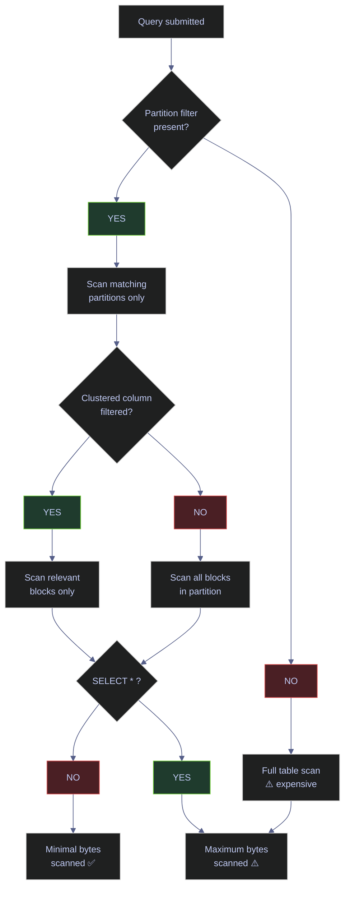

# Querying and Cost Optimization

> [!quote] Werner Vogels on Cost Awareness
> "Cost awareness is a lost art. We need to regain that art."
>
> — **Werner Vogels**, AWS re:Invent keynote (2019)

> [!abstract]- Summary
>
> Covers BigQuery query execution and scan-cost control with `bq query`, dry runs, destination tables, parameterized caching, query guardrails, and pricing telemetry so you can run GoogleSQL from the CLI without accidentally turning broad scans into recurring spend.
>
> **Running queries**
> - Prerequisites: enable `bigquery.googleapis.com`, grant `roles/bigquery.jobUser` plus `roles/bigquery.dataViewer`, and authenticate with `gcloud auth application-default login` or `GOOGLE_APPLICATION_CREDENTIALS`
> - Use `bq query --use_legacy_sql=false` for interactive GoogleSQL, stdin-fed `.sql` files, and output formats such as `table`, `prettyjson`, and `csv`
> - Materialize results with `--destination_table`, `--replace`, `--append_table`, `--allow_large_results`, and optional destination partitioning, clustering, schema-update, and CMEK flags
> - Use named `--parameter='name:TYPE:value'` bindings for reusable, injection-safe queries, with cache reuse subject to table freshness, deterministic SQL, result size, and `--nouse_cache`
>
> **Guardrails and cost controls**
> - `--dry_run` validates SQL and estimates bytes scanned before execution using `bytes / 1,099,511,627,776 * $6.25` on on-demand pricing
> - `--maximum_bytes_billed` blocks oversized queries at plan time, `.bigqueryrc` or `constraints/bigquery.maximumBytesBilled` can enforce defaults, and `--batch` trades lower priority for longer timeout without changing on-demand scan pricing
>
> **Optimization patterns**
> - The 80/20 rules are: partition tables, filter directly on partition columns, never rely on `SELECT *`, cluster on common in-partition filters, dry-run first, and use materialized views for repeated aggregations that tolerate refresh lag
> - The note distinguishes on-demand optimization (`total_bytes_processed`) from Editions optimization (`total_slot_ms`)
>
> **Cost tracking and pricing**
> - Audit spend through `region-<region>.INFORMATION_SCHEMA.JOBS_BY_PROJECT`, excluding parent `SCRIPT` jobs and converting bytes to TiB or slot milliseconds to slot-hours as appropriate
> - Quick-reference sections cover on-demand scan cost, on-demand vs Editions break-even logic, storage pricing, and Storage Read / Write API charges
>
> **Operations and safety**
> - When to use: ad hoc CLI querying, exploratory analysis, automated query guardrails, cost review, and user-level spend attribution
> - Warnings: legacy SQL remains available unless you disable it, `SELECT *` scales cost with every scanned column, wrapping partition columns in functions disables pruning, cached results are bypassed by common conditions, and unbounded queries need byte caps
> - Recommendations: dry-run first, keep byte caps on exploratory workloads, enumerate columns explicitly, combine partitioning with clustering, and use materialized views only when a few minutes of staleness fits the SLA
>
> [!note]- Glossary
>
> **BigQuery job**
> - A managed unit of work BigQuery creates for a query, load, extract, or copy operation, with its own metadata, billing signals, and lifecycle.
> - This note focuses on query jobs because every CLI example eventually becomes a job recorded in `INFORMATION_SCHEMA.JOBS`.
>
> > [!info] Jobs are auditable
> >
> > Query cost analysis in BigQuery starts from job metadata rather than from shell history. If you want to know who spent money, inspect the jobs they submitted.
>
> ---
>
> **GoogleSQL / `--use_legacy_sql=false`**
> - BigQuery's modern SQL dialect and the CLI flag that forces queries to use it instead of the older legacy SQL parser.
> - The note assumes GoogleSQL syntax everywhere, so using the wrong dialect breaks examples and removes newer query features.
>
> > [!warning] Legacy mode still exists
> >
> > BigQuery keeps legacy SQL for backward compatibility. If you omit the flag in mixed environments, a query can fail or behave differently for reasons that look unrelated to cost.
>
> ---
>
> **Application Default Credentials / `gcloud auth application-default login`, `GOOGLE_APPLICATION_CREDENTIALS`**
> - Google client-library and CLI authentication context established either interactively with ADC login or by pointing to a service-account key file.
> - The note includes CLI query workflows, so successful authentication is a prerequisite before IAM and SQL even matter.
>
> > [!warning] CLI auth has layers
> >
> > Being logged into `gcloud` for interactive commands does not always mean ADC is set for libraries or all local tools. Verify which credential path the workflow actually uses.
>
> ---
>
> **On-demand pricing**
> - BigQuery's pay-per-scan model where query cost is driven by bytes processed, with the first 1 TiB per month free and the rest billed per TiB scanned.
> - The note centers its guardrails and examples on this pricing model because scan volume directly determines cost.
>
> > [!info] Scan size becomes spend
> >
> > On-demand pricing rewards pruning columns and partitions aggressively. A cheaper query is usually just a query that reads less data.
>
> ---
>
> **Editions / slots**
> - BigQuery's reserved-compute pricing model where you pay for slot-hours instead of bytes scanned, with Standard, Enterprise, and Enterprise Plus capacity tiers.
> - The note contrasts Editions with on-demand so you know when the right optimization metric changes from bytes to slot time.
>
> > [!warning] Different metric, same query
> >
> > A query that is cheap on on-demand because it scans few bytes can still be operationally expensive on Editions if it burns many slot-milliseconds. Always optimize against the billing model you actually bought.
>
> ---
>
> **Columnar storage**
> - A storage layout where data is grouped by column rather than by full row, letting BigQuery read only referenced columns for many analytical queries.
> - The note's anti-`SELECT *` guidance depends on this behavior: unused columns are avoidable scan cost.
>
> > [!info] Projection saves money
> >
> > Columnar systems make narrow `SELECT` lists operationally meaningful. Choosing only the needed columns is a pricing decision, not just a style preference.
>
> ---
>
> **`bq query`**
> - The BigQuery CLI command that submits GoogleSQL for execution and prints results or writes them to a destination table.
> - Nearly every workflow in this note starts with `bq query`, then layers cost, caching, output, or destination controls on top.
>
> > [!info] One command, many modes
> >
> > The same command supports interactive reads, dry runs, saved-result writes, parameter binding, JSON or CSV output, and batch execution. Most operational variation lives in flags rather than in different tools.
>
> ---
>
> **Dry run / `--dry_run`**
> - A planning-only query mode that validates SQL and reports estimated bytes processed without executing the query or billing for it.
> - The note treats dry runs as the first line of defense against accidental large scans on on-demand pricing.
>
> > [!warning] Estimate before execution
> >
> > A dry run prevents cost surprises only if you do it before the real query. Running it afterward is just a postmortem on spend you already incurred.
>
> ---
>
> **Cost metric / `total_bytes_processed`, `total_slot_ms`**
> - The primary BigQuery job metrics used to reason about pricing: bytes scanned for on-demand, slot milliseconds consumed for Editions.
> - The note uses this distinction to show why the same `INFORMATION_SCHEMA` view supports two different cost-accounting models.
>
> > [!info] Match metric to billing
> >
> > Tracking `total_bytes_processed` in a slot-based environment or `total_slot_ms` in an on-demand environment gives you the wrong optimization target even when the query text is identical.
>
> ---
>
> **`--maximum_bytes_billed`**
> - A per-query byte ceiling that causes BigQuery to fail the query during planning if the scan estimate exceeds the configured budget.
> - The note uses it as the hard-stop companion to dry runs in exploratory workflows and automated pipelines.
>
> > [!warning] Fail closed on purpose
> >
> > A blocked query is the intended outcome when the estimate is too high. Do not treat the error as noise; it is the guardrail doing exactly what it was configured to do.
>
> ---
>
> **Destination table / `--destination_table`**
> - A BigQuery table that receives query results instead of printing them to stdout.
> - The note uses destination tables when repeated downstream reads would cost more than materializing the result once.
>
> > [!info] Materialize to avoid rescans
> >
> > If a query result will be reused by dashboards, exports, or later SQL, writing it once can be cheaper and more stable than recomputing it repeatedly.
>
> ---
>
> **Write disposition / `WRITE_TRUNCATE`, `WRITE_APPEND`, `WRITE_EMPTY`**
> - The rule that determines whether query results overwrite an existing table, append to it, or fail when the target already exists.
> - The note uses these modes to make destination-table writes explicit instead of leaving persistence behavior ambiguous.
>
> > [!warning] Persistence can be destructive
> >
> > `WRITE_TRUNCATE` or `--replace` is convenient for refresh tables, but it can also wipe the previous result set instantly. Be clear about whether the target is disposable or authoritative.
>
> ---
>
> **Named parameter / `--parameter`, `@name`**
> - A typed value bound to a query at runtime and referenced inside GoogleSQL with `@parameter_name` syntax.
> - The note uses parameters to keep query structure stable for cache reuse and to prevent user input from being treated as SQL text.
>
> > [!info] Parameters are typed
> >
> > BigQuery validates parameter types at compile time. That catches many mistakes before any bytes are scanned and avoids manual string quoting in shell commands.
>
> ---
>
> **Query results cache / `--nouse_cache`**
> - BigQuery's 24-hour reuse of prior query results when the query text and referenced data are still cache-eligible.
> - The note frames caching as both a cost lever and a source of confusion when results are unexpectedly fresh or unexpectedly recomputed.
>
> > [!warning] Cache eligibility is fragile
> >
> > Non-deterministic functions, table modifications, large result sets, scripting, or an explicit cache bypass all force fresh execution even if the SQL text looks the same.
>
> ---
>
> **`SELECT *`**
> - A SQL projection that asks BigQuery to read every column in the result set instead of only the columns you actually need.
> - The note treats `SELECT *` as a cost anti-pattern because columnar storage makes unused columns directly translatable into wasted scan bytes.
>
> > [!warning] Convenience scales badly
> >
> > `SELECT *` feels harmless on tiny tables and becomes expensive only when the table grows. That delayed pain is why teams often normalize a habit that later blows up cost.
>
> ---
>
> **Partition pruning**
> - BigQuery's ability to skip entire table partitions when a query filter can be resolved against the partition boundary at planning time.
> - The note's first cost rule depends on pruning because it is often the largest single reduction in bytes scanned.
>
> > [!warning] Functions can defeat pruning
> >
> > Wrapping the partition column in per-row expressions such as `DATE(created_at)` can prevent BigQuery from proving which partitions are needed. Filter on the raw partition column whenever possible.
>
> ---
>
> **`require_partition_filter`**
> - A table setting that forces queries to include a partition filter before BigQuery will run them against a partitioned table.
> - The note recommends it as a production guardrail to prevent accidental full-table scans by analysts, views, or dashboards.
>
> > [!warning] Downstream consumers must comply
> >
> > Enabling the setting protects cost, but it also breaks existing queries and views that do not supply the required filter. Audit dependencies before turning it on broadly.
>
> ---
>
> **Clustering**
> - A BigQuery storage optimization that orders data within a table or partition by selected columns so irrelevant blocks can be skipped during scans.
> - The note pairs clustering with partitioning because clustering is the next major scan-reduction lever once partition pruning is already in place.
>
> > [!info] Best inside partitions
> >
> > Clustering is especially effective when many queries already narrow the time range and then filter within that slice by symbols, IDs, or other selective dimensions.
>
> ---
>
> **Materialized view**
> - A BigQuery-managed stored query result that is refreshed automatically so repeated queries can read precomputed data instead of recomputing the full aggregation.
> - The note recommends materialized views for hot repeated workloads where query reuse matters more than perfectly current base-table state.
>
> > [!warning] Freshness is not instantaneous
> >
> > Materialized views reduce repeated work, but refresh is not guaranteed to be instantaneous. Do not promise near-real-time SLAs unless you have verified refresh lag under production load.
>
> ---
>
> **`INFORMATION_SCHEMA.JOBS_BY_PROJECT`**
> - A regional metadata view that exposes query-job history, including submitter identity, bytes scanned, slot time, and statement type.
> - The note uses it to attribute BigQuery cost by user or service account instead of guessing from billing totals alone.
>
> > [!warning] Region qualifier is required
> >
> > The view is regional, so the prefix must match where the jobs ran, such as `region-US` or `region-EU`. Querying the wrong region yields misleadingly empty or incomplete results.
>
> ---
>
> **Storage APIs / Storage Read API, Storage Write API**
> - BigQuery's non-SQL data-plane APIs for large reads and low-latency writes, priced separately from ordinary query scans.
> - The note includes them in the pricing reference so engineers do not assume every BigQuery cost shows up as SQL bytes scanned.
>
> > [!info] Separate billing surfaces
> >
> > Query pricing, storage pricing, and API pricing are related but distinct. A low SQL bill does not mean the project is cheap if read or write APIs are carrying significant volume.

## Running Queries with bq

The `bq` command-line tool is the primary interface for running BigQuery queries from the terminal. All operations create BigQuery jobs tracked in `INFORMATION_SCHEMA.JOBS`.

**Prerequisites:**

- API: `bigquery.googleapis.com` enabled on the project
- IAM: `roles/bigquery.jobUser` to create query jobs; `roles/bigquery.dataViewer` on the target dataset
- Authentication: `gcloud auth application-default login` or `GOOGLE_APPLICATION_CREDENTIALS` pointing to a service account key

### bq CLI | bq query | run queries

`bq query` runs a SQL query and prints results to stdout. By default the result is formatted as a table and the job runs as an interactive query with a 6-hour timeout. Fully-qualified table names require backtick notation: `` `project.dataset.table` ``.

#### Count all rows in a table

Any time you need a quick sanity check on table size after a load or migration. It is typically triggered by first interaction with a new or unfamiliar table. `bq` CLI, requires `roles/bigquery.jobUser` + `roles/bigquery.dataViewer`. Read-only — no table mutation. Confirm the table is populated and get a baseline row count.

*Count total rows in the `eurostoxx50_ohlcv` bronze table.*

```bash
bq query --use_legacy_sql=false \
  'SELECT COUNT(*) AS total_rows FROM `bq-wh-nb.stoxx_bronze.eurostoxx50_ohlcv`'
```

```text
+------------+
| total_rows |
+------------+
|         50 |
+------------+
```

> [!warning] Always Use Standard SQL
>
> Always set `--use_legacy_sql=false`. BigQuery has two SQL dialects: legacy SQL (the original) and standard SQL (GoogleSQL, the modern version). Legacy SQL has different syntax and fewer features. Always use `--use_legacy_sql=false`. Some teams set this as an alias: `alias bq='bq --use_legacy_sql=false'`.

> [!success] Set a Shell Alias to Enforce Standard SQL
>
> Add `alias bq='bq --use_legacy_sql=false'` to your `.bashrc` or `.zshrc` so the flag is applied automatically. In dbt profiles and Python client code, set `use_legacy_sql=False` in the job configuration to prevent accidental legacy SQL usage.

| Flag | Syntax | Description |
|---|---|---|
| `--use_legacy_sql` | `--use_legacy_sql=false` | Use GoogleSQL (standard SQL). Always set to `false`; legacy SQL is deprecated. |
| `--project_id` | `--project_id=my-project` | Override the active project for this query. |
| `--location` | `--location=EU` | Dataset region. Must match the region of the queried tables. |
| `--format` | `--format=csv` | Output format: `table` (default), `prettyjson`, `json`, `csv`, `sparse`. |
| `--synchronous_mode` | `--nosynchronous_mode` | Run asynchronously without waiting for job completion. |
| `--job_id` | `--job_id=my-job-123` | Assign a custom job ID for tracking and deduplication. |
| `--label` | `--label=env:prod` | Attach key-value labels to the job (visible in INFORMATION_SCHEMA). |
| `--max_rows` | `--max_rows=1000` | Maximum number of rows to display in results. Default: `100`. |
| `--time_partitioning_type` | `--time_partitioning_type=DAY` | Partitioning granularity for the destination table: `DAY`, `HOUR`, `MONTH`, or `YEAR`. |
| `--time_partitioning_field` | `--time_partitioning_field=date` | Column used for time-based partitioning on the destination table. |
| `--time_partitioning_expiration` | `--time_partitioning_expiration=86400` | Partition expiration in seconds for the destination table. |
| `--range_partitioning` | `--range_partitioning=col,0,1000,10` | Integer-range partitioning: `column,start,end,interval`. |
| `--require_partition_filter` | `--require_partition_filter` | Enforce a partition filter on queries against the destination table. |
| `--clustering_fields` | `--clustering_fields=symbol,date` | Comma-separated list of up to four columns to cluster the destination table by. |
| `--destination_kms_key` | `--destination_kms_key=projects/p/locations/l/keyRings/r/cryptoKeys/k` | Cloud KMS key to encrypt the destination table. |
| `--schema_update_option` | `--schema_update_option=ALLOW_FIELD_ADDITION` | Allow schema changes when appending/overwriting: `ALLOW_FIELD_ADDITION`, `ALLOW_FIELD_RELAXATION`. |
| `--create_session` | `--create_session` | Create a new BigQuery session and return its session ID. |
| `--session_id` | `--session_id=SESSION_ID` | Run the query within an existing named session. |
| `--continuous` | `--continuous` | Run as a continuous (streaming) query job. |
| `--connection_property` | `--connection_property=KEY=VALUE` | Set a connection property (e.g., service account) for the query job. |

### bq CLI | bq query --dry_run | estimate cost before executing

A dry run returns the estimated bytes to be scanned without executing or billing. The cost formula is `bytes / 1,099,511,627,776 * $6.25`. Without a `WHERE` clause on a partitioned column, the same table can estimate orders of magnitude more bytes — always add partition filters before executing.

#### Dry-run a filtered column projection

Before every non-trivial query, especially on unfamiliar tables or during exploratory analysis. It is typically triggered by any query that might scan more than 1 GB. `bq` CLI with `--dry_run` flag. Free, instant, read-only — no bytes are billed. Estimate scan cost and decide whether to proceed, add filters, or narrow the column list.

*Dry-run a four-column projection filtered to 2026 — returns estimated bytes without executing.*

```bash
bq query --use_legacy_sql=false --dry_run \
  'SELECT symbol, date, close, volume FROM `bq-wh-nb.stoxx_bronze.eurostoxx50_ohlcv` WHERE date >= "2026-01-01"'
```

```text
Query successfully validated. Assuming the tables are not modified, running this query will process 1564 bytes of data.
```

#### Dry-run a full-table SELECT * for cost contrast

Immediately after the filtered dry run, to quantify the savings from column selection and filtering. It is typically triggered when building a cost argument for partitioning or column pruning. Same `--dry_run` flag. Free, read-only. Show the byte difference between a pruned query and a full-table scan on the same table.

*Dry-run a `SELECT *` with no filters on the same table — shows the full-table scan cost.*

```bash
bq query --use_legacy_sql=false --dry_run \
  'SELECT * FROM `bq-wh-nb.stoxx_bronze.eurostoxx50_ohlcv`'
```

```text
Query successfully validated. Assuming the tables are not modified, running this query will process 4724 bytes of data.
```

The filtered four-column query (1,564 bytes) scans 33% of what `SELECT *` scans (4,724 bytes) on this small table. On production tables with billions of rows, this ratio translates directly to dollar savings — a 10 TiB table at $6.25/TiB costs $62.50 per full scan vs. ~$20.63 for the filtered projection.

> [!tip] The Dry Run Habit
>
> Make `--dry_run` your default first step before any non-trivial query. It is free, instant, and prevents accidental large scans. The cost calculation: `bytes_processed / 1,099,511,627,776 * 6.25` dollars.

| Flag | Syntax | Description |
|---|---|---|
| `--dry_run` | `--dry_run` | Validate the query and estimate bytes scanned without executing or billing. |

### bq CLI | bq query --destination_table | save results to a table

`--destination_table` writes query results to a BigQuery table instead of stdout. `--replace` overwrites the table if it exists (equivalent to `WRITE_TRUNCATE`). `--allow_large_results` is required for result sets exceeding 128 MB — without it, BigQuery buffers the entire result in memory and fails on large outputs.

#### Write an aggregation result to a destination table

When a query result needs to persist for downstream consumption (dashboards, exports, dbt downstream models) rather than one-time inspection. It is typically triggered by the query is expensive and will be re-read multiple times, or it feeds a downstream pipeline step. `bq` CLI. Requires `roles/bigquery.dataEditor` on the destination dataset in addition to query permissions. State-changing — creates or overwrites the target table. Materialize query results to avoid re-scanning the source table on every read.

*Aggregate average close price and volume per symbol from 2026 data and write the result to `stoxx_gold.symbol_avg_2026`.*

```bash
bq query --use_legacy_sql=false \
  --destination_table=stoxx_gold.symbol_avg_2026 \
  --replace \
  --allow_large_results \
  'SELECT symbol, ROUND(AVG(close), 2) AS avg_close, ROUND(AVG(volume), 0) AS avg_volume
   FROM `bq-wh-nb.stoxx_bronze.eurostoxx50_ohlcv`
   WHERE date >= "2026-01-01"
   GROUP BY symbol
   ORDER BY avg_close DESC'
```

```text
+----------+-----------+------------+
|  symbol  | avg_close | avg_volume |
+----------+-----------+------------+
| RMS.PA   |    1648.5 |    75005.0 |
| RHM.DE   |    1531.0 |   204156.0 |
| ASML.AS  |    1113.8 |   747131.0 |
| ADYEN.AS |     844.2 |   138746.0 |
| ARGX.BR  |     648.6 |   103685.0 |
| MUV2.DE  |     546.4 |   247361.0 |
| MC.PA    |    466.85 |   446476.0 |
| ALV.DE   |     367.2 |   639480.0 |
| OR.PA    |     350.8 |   398227.0 |
| RACE.MI  |    286.75 |   504633.0 |
+----------+-----------+------------+
```

| Flag | Syntax | Description |
|---|---|---|
| `--destination_table` | `--destination_table=dataset.table` | Write results to this table instead of stdout. |
| `--replace` | `--replace` | Overwrite the destination table if it already exists. |
| `--append_table` | `--append_table` | Append results to the destination table. |
| `--allow_large_results` | `--allow_large_results` | Required for result sets > 128 MB. Writes directly to destination, bypassing the in-memory buffer. |
| `--create_disposition` | `--create_disposition=CREATE_IF_NEEDED` | Whether to create the destination table if it does not exist. |
| `--write_disposition` | `--write_disposition=WRITE_TRUNCATE` | `WRITE_TRUNCATE` (overwrite), `WRITE_APPEND` (add rows), or `WRITE_EMPTY` (fail if exists). |

### bq CLI | bq query --parameter | parameterized queries for caching

Parameterized queries substitute typed values into the query at runtime using `@parameter_name` syntax. They serve two purposes: **caching** — queries with identical structure share cached results regardless of parameter values, reducing repeat-scan costs; and **injection prevention** — user-supplied values are never interpreted as SQL syntax.

Query results are cached for 24 hours. The cache is **bypassed** when:

- The query calls non-deterministic functions (`CURRENT_TIMESTAMP()`, `RAND()`, `SESSION_USER()`)
- Any table referenced in the query was modified since the last cached result
- The result set exceeds 10 GB compressed
- The query uses DML statements or scripting
- `--nouse_cache` is explicitly set

#### Filter by symbol and date using named parameters

When building reusable queries for dashboards, APIs, or scheduled reports where the filter values change but the query shape stays constant. It is typically triggered by a query will be executed repeatedly with different filter values (e.g., different symbols, date ranges, or thresholds). `bq` CLI with one `--parameter` flag per parameter. Read-only. Parameters are type-checked at query compilation time — type mismatches fail before scanning. Leverage the query cache across executions and prevent SQL injection from externally supplied values.

> [!info]- Clause-by-clause breakdown
>
> - `--parameter='symbol_filter:STRING:ASML.AS'` — declares a named parameter `symbol_filter` of type `STRING` with value `ASML.AS`. The value is bound at runtime and never parsed as SQL.
> - `--parameter='start_date:DATE:2026-04-01'` — declares a `DATE` parameter. BigQuery validates the format (`YYYY-MM-DD`) at compile time.
> - `WHERE symbol = @symbol_filter AND date >= @start_date` — references both parameters by name. The `@` prefix distinguishes parameters from column names.
> - Re-running this query with `symbol_filter:STRING:MC.PA` hits the cache if the table has not changed — no bytes scanned, no cost.

*Query ASML closing prices from April 2026 onward, passing symbol and date as typed parameters.*

```bash
bq query --use_legacy_sql=false \
  --parameter='symbol_filter:STRING:ASML.AS' \
  --parameter='start_date:DATE:2026-04-01' \
  'SELECT symbol, date, close, volume
   FROM `bq-wh-nb.stoxx_bronze.eurostoxx50_ohlcv`
   WHERE symbol = @symbol_filter AND date >= @start_date
   ORDER BY date DESC LIMIT 5'
```

```text
+---------+------------+--------+--------+
| symbol  |    date    | close  | volume |
+---------+------------+--------+--------+
| ASML.AS | 2026-04-07 | 1113.8 | 747131 |
+---------+------------+--------+--------+
```

| Flag | Syntax | Description |
|---|---|---|
| `--parameter` | `--parameter='name:TYPE:value'` | Define a query parameter. Format: `name:type:value`. Repeat for multiple parameters. Types: `STRING`, `INT64`, `FLOAT64`, `DATE`, `TIMESTAMP`, `BOOL`, `BYTES`, `NUMERIC`, `BIGNUMERIC`, `GEOGRAPHY`, `JSON`. |
| `--nouse_cache` | `--nouse_cache` | Force fresh execution, bypassing the query results cache. |

### bq CLI | bq query | run queries from a SQL file

For queries longer than a single line, store them in a `.sql` file and pipe them to `bq query` via stdin redirection. This is the standard pattern for complex queries in CI pipelines and automation scripts where inline SQL becomes unreadable.

#### Pipe a SQL file to bq query

When working with multi-line queries in version-controlled `.sql` files, or in CI/CD pipelines where queries are managed as artifacts. It is typically triggered by any query that exceeds ~3 lines or is shared across team members. `bq` CLI with shell stdin redirection (`<`). The `.sql` file must contain valid GoogleSQL. Read-only unless the SQL itself contains DML. Separate query logic from shell invocation for readability, version control, and reuse.

*Pipe a SQL file containing a multi-line query to `bq query`.*

```bash
bq query --use_legacy_sql=false < query.sql
```

The output format and behavior are identical to inline queries — `bq query` does not distinguish between stdin and inline SQL.

#### Format output as prettyjson

When debugging result shapes, inspecting nested/repeated fields, or feeding output to a JSON parser. It is typically triggered by the default `table` format truncates wide columns or the consumer expects JSON. `bq` CLI with `--format=prettyjson`. Read-only. Get machine-readable output with human-friendly indentation.

*Query ASML closing prices and format the result as indented JSON.*

```bash
bq query --use_legacy_sql=false --format=prettyjson \
  'SELECT symbol, date, close FROM `bq-wh-nb.stoxx_bronze.eurostoxx50_ohlcv`
   WHERE symbol = "ASML.AS" ORDER BY date DESC LIMIT 3'
```

```text
[
  {
    "close": "1113.8",
    "date": "2026-04-07",
    "symbol": "ASML.AS"
  }
]
```

#### Format output as CSV

When piping query results into downstream tools (`awk`, `cut`, pandas, Excel) or exporting to flat files. It is typically triggered by the consumer expects delimited text, not formatted tables. `bq` CLI with `--format=csv`. Read-only. Output includes a header row. Produce pipe-friendly delimited output without table-drawing characters.

*Same query formatted as CSV for downstream piping.*

```bash
bq query --use_legacy_sql=false --format=csv \
  'SELECT symbol, date, close FROM `bq-wh-nb.stoxx_bronze.eurostoxx50_ohlcv`
   WHERE symbol = "ASML.AS" ORDER BY date DESC LIMIT 3'
```

```text
symbol,date,close
ASML.AS,2026-04-07,1113.8
```

| Flag | Syntax | Description |
|---|---|---|
| `--format` | `--format=table` | Output format: `table` (default), `prettyjson`, `json`, `csv`, `sparse`. |

### bq CLI | bq query --maximum_bytes_billed | set a per-query cost cap

`--maximum_bytes_billed` hard-stops a query if it would scan more than the specified number of bytes, returning an error instead of executing the scan. The check happens during query planning (before any data is read), so a blocked query incurs zero cost. Use this as a safety net in automated pipelines and exploratory environments where accidental full-table scans would be expensive.

#### Block a query that exceeds a byte budget

As a guardrail on every exploratory or automated query, especially in shared projects where multiple users run ad-hoc queries. It is typically triggered by setting up a new pipeline, onboarding a new analyst, or hardening an existing query workflow. `bq` CLI. Read-only — the query is never executed if it exceeds the limit. The error is returned at plan time. Prevent accidental cost spikes by failing queries that would scan more data than the budget allows.

*Set a 100-byte cap to demonstrate the error — the `eurostoxx50_ohlcv` table exceeds this limit.*

```bash
bq query --use_legacy_sql=false \
  --maximum_bytes_billed=100 \
  'SELECT * FROM `bq-wh-nb.stoxx_bronze.eurostoxx50_ohlcv`'
```

```text
BigQuery error in query operation: Error processing job
'bq-wh-nb:bqjob_r637f1681ea5303e9_0000019d80dfbe1f_1':
Query exceeded limit for bytes billed: 100. 10485760 or higher required.
```

The error message reports the minimum bytes required (10,485,760 = 10 MB) to execute this query. To allow it, set `--maximum_bytes_billed` to at least that value. In production, use `--dry_run` first to get the exact estimate, then set the cap slightly above it.

> [!tip] Set a Team-Wide Byte Budget
>
> Configure `--maximum_bytes_billed` as a default in your `.bigqueryrc` file or enforce it via a BigQuery custom quota or organization policy (`constraints/bigquery.maximumBytesBilled`). 10 GB ($0.05) is a safe default for exploratory queries. Remove the cap explicitly for known large analytical jobs with `--maximum_bytes_billed=0` (unlimited).

| Flag | Syntax | Description |
|---|---|---|
| `--maximum_bytes_billed` | `--maximum_bytes_billed=10000000000` | Fail the query if it would scan more than this many bytes. Set in bytes (10 GB = `10000000000`). `0` = unlimited. |
| `--batch` | `--batch` | Run as a batch job (queued, lower priority, waits for available slots). No cost difference on on-demand pricing. Batch jobs have a 24-hour timeout vs. 6 hours for interactive. |

## Cost Optimization — The 80/20 Rules

These five practices account for the vast majority of BigQuery cost reduction on on-demand pricing. The root cause of most overruns is the same: queries that scan more data than they need.



**1. Always use partitioned tables.** A query with `WHERE date >= '2026-01-01'` on a date-partitioned table scans only the matching partitions. Without partitioning, it scans the entire table. This alone reduces costs by 90%+ for time-filtered queries. Enforce with `require_partition_filter = TRUE` on production tables to prevent accidental full scans — but audit all views and dashboards referencing the table first, as the constraint applies transitively.

> [!warning] Wrapping Partition Columns in Functions Disables Pruning
>
> `WHERE DATE(created_at) = '2026-04-01'` wraps the partition column in a function, forcing BigQuery to evaluate every row instead of pruning partitions. Dynamic expressions (subquery results) and per-row timezone conversions have the same effect. The filter must be a constant expression resolvable at query-planning time.

> [!success] Use Direct Partition Column Comparisons
>
> `WHERE created_at >= '2026-04-01' AND created_at < '2026-04-02'` allows BigQuery to push the filter down to the Spanner metadata layer and eliminate partitions without opening any data files. For timezone-sensitive queries, filter on UTC with a 1-day buffer, then filter on local time within the result set.

**2. Never `SELECT *` in production.** Select only the columns you need. BigQuery is columnar — unused columns are never read from storage. `SELECT symbol, close` on a 20-column table scans ~10% of the data that `SELECT *` scans. In dbt models and SQL views, always enumerate columns explicitly.

**3. Use `--dry_run` before every expensive query.** This is free, instant, and tells you exactly how many bytes will be scanned. Pair it with `--maximum_bytes_billed` as a hard stop.

**4. Clustering reduces scan within partitions.** If you frequently filter by `symbol` within a date partition, clustering by `symbol` organizes the data so only the relevant storage blocks are read. Clustering uses file-level min/max headers (cached in memory) to skip entire files without disk I/O. Partitioning is optimal for low-cardinality fields (under a few thousand distinct values); above that threshold, clustering provides the selectivity. An additional benefit: filtering on columns *correlated* with clustering columns can also reduce bytes scanned, even when the filter is not on the clustering column itself.

**5. Materialized views for repeated queries.** If your dashboard runs the same aggregation every 5 minutes, create a materialized view — BigQuery maintains it automatically and queries read the pre-computed result. Materialized view refresh happens within ~5 minutes of a base-table change but is capacity-dependent and can be delayed — do not assume near-realtime freshness in production SLAs.

### BigQuery | INFORMATION_SCHEMA.JOBS | query cost tracking

`INFORMATION_SCHEMA.JOBS_BY_PROJECT` exposes the full audit trail for all query jobs in a project, including bytes scanned, slot usage, and job metadata. Query it regularly to identify the most expensive queries and users. On **on-demand pricing**, optimize for `total_bytes_processed`. On **Editions (slot-based) pricing**, optimize for `total_slot_ms` instead — bytes scanned are irrelevant when you pay per slot-hour.

#### Aggregate cost per user over the past 30 days

Weekly or monthly as part of a cost review cycle, or ad-hoc after an unexpected billing spike. It is typically triggered by monthly cost audit, new team onboarding, or an alert from Cloud Billing that the BigQuery budget threshold was breached. GoogleSQL against the regional `INFORMATION_SCHEMA` view. Requires `roles/bigquery.resourceViewer` or `roles/bigquery.admin`. Read-only. The `region-US` qualifier must match the region where the datasets are located. Rank users by estimated on-demand cost to identify who and what is driving spend.

| Field | Source | Type | Meaning |
|---|---|---|---|
| `user_email` | `JOBS_BY_PROJECT.user_email` | STRING | The email of the identity (user or service account) that submitted the job. |
| `queries` | `COUNT(*)` | INT64 | Number of query jobs submitted by this user in the time window. |
| `tb_scanned` | `SUM(total_bytes_processed) / POW(2,40)` | FLOAT64 | Total tebibytes scanned across all jobs. `POW(2,40)` converts bytes → TiB. |
| `cost_usd` | `tb_scanned * 6.25` | FLOAT64 | Estimated on-demand cost at $6.25/TiB (current default rate for US multi-region). |

> [!info]- Clause-by-clause breakdown
>
> - `IFNULL(total_bytes_processed, 0)` — `total_bytes_processed` is `NULL` for failed jobs and metadata-only queries (e.g., dry runs). `IFNULL` prevents NULL propagation in the `SUM`.
> - `statement_type != 'SCRIPT'` — excludes parent script jobs. Without this filter, scripted queries are double-counted (once for the parent `SCRIPT` job, once for each child statement).
> - `job_type = 'QUERY'` — limits to query jobs, excluding `LOAD`, `EXTRACT`, and `COPY` jobs that do not incur scan costs.
> - `POW(2,40)` — converts bytes to tebibytes (1 TiB = 1,099,511,627,776 bytes). BigQuery pricing uses TiB, not TB.
> - The `region-US` prefix is required — `INFORMATION_SCHEMA.JOBS_BY_PROJECT` is regional. Use `region-EU` for EU-located datasets.

*Aggregate bytes scanned and estimated on-demand cost per user for the past 30 days, excluding script parent jobs.*

```sql
SELECT user_email,
  COUNT(*) AS queries,
  ROUND(SUM(IFNULL(total_bytes_processed, 0)) / POW(2,40), 8) AS tb_scanned,
  ROUND(SUM(IFNULL(total_bytes_processed, 0)) / POW(2,40) * 6.25, 6) AS cost_usd
FROM `region-US`.INFORMATION_SCHEMA.JOBS_BY_PROJECT
WHERE creation_time > TIMESTAMP_SUB(CURRENT_TIMESTAMP(), INTERVAL 30 DAY)
  AND job_type = 'QUERY'
  AND statement_type != 'SCRIPT'
GROUP BY user_email ORDER BY cost_usd DESC;
```

| user_email | queries | tb_scanned | cost_usd |
|---|---|---|---|
| bq-wh-sa@bq-wh-nb.iam.gserviceaccount.com | 3 | 0.0 | 0.0 |
| alexper.recovery@gmail.com | 3 | 0.0 | 0.0 |

Both identities show zero cost because all recent queries targeted small tables (< 10 MB, which rounds to 0.0 TiB). The service account `bq-wh-sa` represents the pipeline service account used by Cloud Composer / Airflow. In production, service accounts often dominate cost because they run scheduled queries at scale — sort by `cost_usd DESC` to surface them immediately.

> [!tip] Slot-Based Cost Tracking for Editions Pricing
>
> If the project uses BigQuery Editions (slot-based pricing), replace `total_bytes_processed` with `total_slot_ms` and compute cost as `SUM(total_slot_ms) / 1000 / 3600 * slot_hourly_rate` (e.g., `$0.04` for Standard Edition). On Editions, bytes scanned are irrelevant — the billing dimension is slot-hours consumed. Both metrics are available in the same `INFORMATION_SCHEMA.JOBS_BY_PROJECT` view.

### BigQuery | cost estimation quick reference

| Data scanned | Cost (on-demand at $6.25/TiB) |
|---|---|
| 1 GB | ~$0.006 |
| 10 GB | ~$0.06 |
| 100 GB | ~$0.57 |
| 1 TiB | $6.25 |
| 10 TiB | $62.50 |
| 100 TiB | $625.00 |

The first 1 TiB/month is free on on-demand pricing. Prices above are for US multi-region; other regions may differ.

### BigQuery | on-demand vs editions | pricing model comparison

On-demand and Editions (slot-based) are the two BigQuery compute pricing models. The choice determines what to optimize for.

| Dimension | On-Demand | Editions (Standard/Enterprise/Enterprise Plus) |
|---|---|---|
| **Billing unit** | Bytes scanned per query | Slot-hours consumed |
| **Rate** | $6.25/TiB scanned | \$0.04–\$0.06/slot-hour (varies by edition and commitment) |
| **Free tier** | 1 TiB/month | None |
| **Optimize for** | `total_bytes_processed` | `total_slot_ms` |
| **Cost predictability** | Variable — depends on query patterns | Fixed — based on reserved slots |
| **Break-even** | Below ~467 TiB/month at 100 Standard slots | Above ~467 TiB/month consistently |
| **Idle slot sharing** | N/A | Enterprise and Enterprise Plus only |
| **BigQuery ML** | Included | Enterprise and Enterprise Plus only |

> [!info] When to Consider Editions
>
> Editions pricing makes sense when monthly scan volume is predictable and consistently exceeds the break-even point. 100 Standard Edition slots at $0.04/slot-hour cost ~$2,920/month (730 hours). That buys unlimited compute — but only beats on-demand if the equivalent on-demand cost would be higher. For variable or burst-heavy workloads, on-demand with `--maximum_bytes_billed` guardrails is safer.

### BigQuery | storage pricing quick reference

| Storage class | Rate (per GB/month) | Trigger |
|---|---|---|
| Active storage | $0.02 | Default for all tables |
| Long-term storage | $0.01 | Automatic after 90 consecutive days without modification |
| Storage Read API | $1.10/TiB read | Bulk reads bypassing SQL (ML training, Spark) — 300 TB/month free |
| Storage Write API (committed) | $0.025/GB | Replaces legacy streaming inserts — batch/default mode is free |

Long-term storage discount is automatic — tables unmodified for 90 consecutive days get a 50% storage price reduction with no action required.

## Related

- [dataset-and-table-management](https://alp78.github.io/elysium/06-GCP/03-BigQuery/01-dataset-and-table-management) — Partitioning and clustering are configured at table creation
- [data-loading-and-export](https://alp78.github.io/elysium/06-GCP/03-BigQuery/02-data-loading-and-export) — How data gets into BigQuery for querying
- [job-management](https://alp78.github.io/elysium/06-GCP/03-BigQuery/04-job-management) — Monitoring query jobs, canceling runaway scans
- [gcp-apis-and-services](https://alp78.github.io/elysium/06-GCP/01-Core/02-gcp-apis-and-services) — `bigquery.googleapis.com` must be enabled
- [BigQuery query patterns](https://alp78.github.io/elysium/05-DB-Queries/BigQuery/bq-fundamentals) — SQL query patterns against BigQuery
- [BigQuery Terraform blocks](https://alp78.github.io/elysium/07-Terraform/Block-Library/data-services) — IaC for partitioned and clustered table definitions

## References

- [BigQuery pricing overview](https://cloud.google.com/bigquery/pricing) — on-demand, Editions, storage, and API pricing
- [BigQuery Editions overview](https://cloud.google.com/bigquery/docs/editions-intro) — Standard, Enterprise, Enterprise Plus comparison
- [Query caching](https://cloud.google.com/bigquery/docs/cached-queries) — cache behavior, bypass conditions, TTL
- [INFORMATION_SCHEMA.JOBS](https://cloud.google.com/bigquery/docs/information-schema-jobs) — job metadata schema and columns
- [bq command-line reference](https://cloud.google.com/bigquery/docs/reference/bq-cli-reference) — complete flag reference for all `bq` subcommands
- [Querying partitioned tables](https://cloud.google.com/bigquery/docs/querying-partitioned-tables) — partition pruning, `require_partition_filter`
- [Creating clustered tables](https://cloud.google.com/bigquery/docs/creating-clustered-tables) — clustering columns, automatic reclustering
- [Materialized views](https://cloud.google.com/bigquery/docs/materialized-views-intro) — auto-refresh, staleness, query rewrite
- [BI Engine overview](https://cloud.google.com/bigquery/docs/bi-engine-intro) — in-memory acceleration, preferred tables, limitations
- [Storage Read API](https://cloud.google.com/bigquery/docs/reference/storage) — bulk read pricing, free tier

**ChromaDB sources:**

- *Google BigQuery: The Definitive Guide* (Lakshmanan & Tigani) — partition metadata in Spanner, clustering file headers, reclustering behavior
- *Data Engineering Design Patterns* — slot-based optimization, materialized view refresh latency
