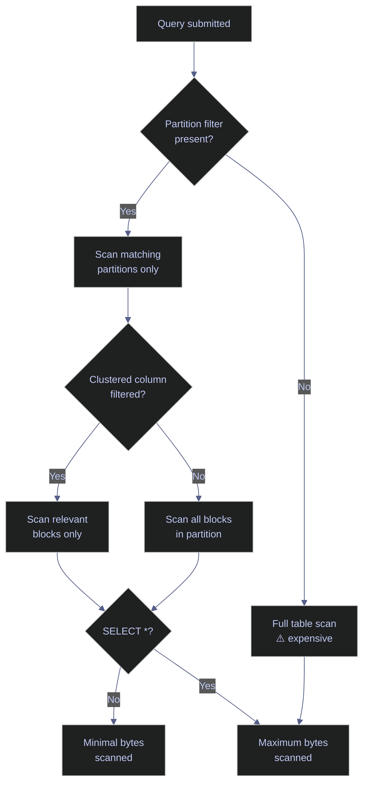

# BigQuery Querying and Cost Optimization

> [!quote]
> "Cost awareness is a lost art. We need to regain that art."
>
> — **Werner Vogels**, AWS re:Invent keynote (2019)

BigQuery offers two pricing models: **on-demand** ($5 per TB scanned, first 1 TB/month free) and **capacity-based** (reserved compute slots via BigQuery editions, billed per slot-hour regardless of bytes scanned). This note focuses on on-demand, which is the default for most teams. A single `SELECT *` on a 10 TB table costs $50 — and runs every time someone executes it. Senior data engineers always dry-run queries before executing them, always use partitioned tables, and never select columns they don't need.

## Running Queries with bq

The `bq` command-line tool is the primary interface for running BigQuery queries from the terminal. All operations create BigQuery jobs tracked in `INFORMATION_SCHEMA.JOBS`.

**Prerequisites:**
- API: `bigquery.googleapis.com` enabled on the project
- IAM: `roles/bigquery.jobUser` to create query jobs; `roles/bigquery.dataViewer` on the target dataset
- Authentication: `gcloud auth application-default login` or `GOOGLE_APPLICATION_CREDENTIALS` pointing to a service account key

### Running BigQuery Queries with bq query

`bq query` runs a SQL query and prints results to stdout. By default the result is formatted as a table and the job runs as an interactive query with a 6-hour timeout. Fully-qualified table names require backtick notation: `` `project.dataset.table` ``.

```bash
bq query --use_legacy_sql=false \
  'SELECT COUNT(*) AS total_rows FROM `data-platform-prod.project_data.ohlcv`'
```

> [!todo] Missing output cell — paste a representative result from a real run.

> [!warning] Always Use Standard SQL
>
> Always Set `--use_legacy_sql=false`.
> BigQuery has two SQL dialects: legacy SQL (the original) and standard SQL (GoogleSQL, the modern version). Legacy SQL has different syntax and fewer features. Always use `--use_legacy_sql=false`. Some teams set this as an alias: `alias bq='bq --use_legacy_sql=false'`.

> [!success] Set a Shell Alias to Enforce Standard SQL
>
> Add `alias bq='bq --use_legacy_sql=false'` to your `.bashrc` or `.zshrc` so the flag is applied automatically. In dbt profiles and Python client code, set `use_legacy_sql=False` in the job configuration to prevent accidental legacy SQL usage.

| Flag | Syntax | Description |
|---|---|---|
| `--use_legacy_sql` | `--use_legacy_sql=false` | Use GoogleSQL (standard SQL). Always set to `false`; legacy SQL is deprecated. |
| `--project_id` | `--project_id=my-project` | Override the active project for this query. |
| `--location` | `--location=EU` | Dataset region. Must match the region of the queried tables. |
| `--format` | `--format=csv` | Output format: `table` (default), `prettyjson`, `json`, `csv`, `sparse`. |
| `--synchronous_mode` | `--nosynchronous_mode` | Run asynchronously without waiting for job completion. |
| `--job_id` | `--job_id=my-job-123` | Assign a custom job ID for tracking and deduplication. |
| `--label` | `--label=env:prod` | Attach key-value labels to the job (visible in INFORMATION_SCHEMA). |

### BigQuery Dry Run — Estimate Cost Before Executing

A dry run returns the estimated bytes to be scanned (e.g., "Estimated 4.2 GB will be processed" = $0.02 at $5/TB). Without a `WHERE` clause on a partitioned column, the same table might estimate 2.1 TB ($10.50) — add partition filters.

```bash
bq query --use_legacy_sql=false --dry_run \
  'SELECT * FROM `project_data.large_table` WHERE date >= "2025-01-01"'
```

```text
Query successfully validated. Assuming the tables are not modified, running this query will process 1073741824 bytes. This query will be billed to your project.
```

> [!tip] The Dry Run Habit
>
> Make `--dry_run` your default first step before any non-trivial query. It is free, instant, and prevents accidental large scans. The cost calculation: `bytes_processed / 1_000_000_000_000 * 5` dollars.

| Flag | Syntax | Description |
|---|---|---|
| `--dry_run` | `--dry_run` | Validate the query and estimate bytes scanned without executing or billing. |

### Saving BigQuery Results to a Destination Table

`--destination_table` writes results to a table. `--replace` overwrites the table if it exists (vs. append). `--allow_large_results` is required for result sets exceeding 128 MB.

```bash
bq query --use_legacy_sql=false \
  --destination_table=project_data.results \
  --replace \
  --allow_large_results \
  'SELECT symbol, AVG(close) as avg_close FROM `project_data.ohlcv` GROUP BY symbol'
```

> [!todo] Missing output cell — paste a representative result from a real run.

| Flag | Syntax | Description |
|---|---|---|
| `--destination_table` | `--destination_table=dataset.table` | Write results to this table instead of stdout. |
| `--replace` | `--replace` | Overwrite the destination table if it already exists. |
| `--append_table` | `--append_table` | Append results to the destination table. |
| `--allow_large_results` | `--allow_large_results` | Required for result sets > 128 MB. Writes directly to destination, bypassing the in-memory buffer. |
| `--create_disposition` | `--create_disposition=CREATE_IF_NEEDED` | Whether to create the destination table if it does not exist. |
| `--write_disposition` | `--write_disposition=WRITE_TRUNCATE` | `WRITE_TRUNCATE` (overwrite), `WRITE_APPEND` (add rows), or `WRITE_EMPTY` (fail if exists). |

### BigQuery Parameterized Queries for Caching and Injection Prevention

Parameterized queries substitute typed values into the query at runtime using `@parameter_name` syntax. Queries with the same structure but different parameter values share the same cached result, reducing costs. They also prevent SQL injection by ensuring user-supplied values are never interpreted as SQL.

Query results are cached for 24 hours. The cache is **bypassed** when: the query uses non-deterministic functions (`CURRENT_TIMESTAMP()`, `RAND()`), the queried table was modified in the past 24 hours, or the result set exceeds 10 GB.

```bash
bq query --use_legacy_sql=false \
  --parameter='index_name:STRING:market_index' \
  --parameter='start_date:DATE:2025-01-01' \
  'SELECT * FROM `project_data.ohlcv` WHERE _index = @index_name AND date >= @start_date'
```

> [!todo] Missing output cell — paste a representative result from a real run.

| Flag | Syntax | Description |
|---|---|---|
| `--parameter` | `--parameter='name:TYPE:value'` | Define a query parameter. Format: `name:type:value`. Repeat for multiple parameters. Types: `STRING`, `INT64`, `FLOAT64`, `DATE`, `TIMESTAMP`. |
| `--nouse_cache` | `--nouse_cache` | Force fresh execution, bypassing the query results cache. |

### Running BigQuery Queries from a SQL File

For queries longer than a single line, store them in a `.sql` file and pipe them to `bq query` via stdin redirection. This is the standard pattern for complex queries in CI pipelines and automation scripts.

```bash
bq query --use_legacy_sql=false < query.sql
```

> [!todo] Missing output cell — paste a representative result from a real run.

#### Formatting Query Output

`bq query` supports five output formats controlled by `--format`. Use `prettyjson` when debugging API response structure; use `csv` when piping results into downstream tools.

```bash
bq query --use_legacy_sql=false --format=prettyjson 'SELECT ...'
```

```bash
bq query --use_legacy_sql=false --format=csv 'SELECT ...'
```

| Flag | Syntax | Description |
|---|---|---|
| `--format` | `--format=table` | Output format: `table` (default), `prettyjson`, `json`, `csv`, `sparse`. |

### Setting a Per-Query Cost Cap

`--maximum_bytes_billed` hard-stops a query if it would scan more than the specified number of bytes, returning an error instead of executing the scan. Use this as a safety net in automated pipelines and exploratory environments where accidental full-table scans would be expensive.

```bash
bq query --use_legacy_sql=false \
  --maximum_bytes_billed=10000000000 \
  'SELECT * FROM `project_data.large_table`'
```

```text
Error: Query exceeded resource limits. 43521425408 bytes processed, 10000000000 bytes billed limit.
```

> [!tip] Set a Team-Wide Byte Budget
>
> Configure `--maximum_bytes_billed` as a default in your `bq` configuration or enforce it via an organization policy. 10 GB ($0.05) is a safe default for exploratory queries. Remove the cap explicitly for known large analytical jobs.

| Flag | Syntax | Description |
|---|---|---|
| `--maximum_bytes_billed` | `--maximum_bytes_billed=10000000000` | Fail the query if it would scan more than this many bytes. Set in bytes (10 GB = `10000000000`). |
| `--batch` | `--batch` | Run as a batch job (lower priority, waits for available slots; no cost difference). |

## Cost Optimization — The 80/20 Rules

These six practices account for the vast majority of BigQuery cost reduction. The root cause of most overruns is the same: queries that scan more data than they need.



> [!warning] Full-Table Scan on Unpartitioned Data
>
> Running a query without a partition filter on a large unpartitioned table scans the entire table. A 5 TB table costs $25 per execution regardless of how few rows the `WHERE` clause ultimately returns.

> [!success] Partition and Filter
>
> Partition tables by date or ingestion time and always include a filter on the partition column (`WHERE date >= '2025-01-01'`). This is the single highest-leverage cost optimization in BigQuery — it can reduce scan by 90%+ for time-filtered queries.

**1. Always use partitioned tables.** A query with `WHERE date >= '2025-01-01'` on a date-partitioned table scans only the matching partitions. Without partitioning, it scans EVERYTHING. This alone reduces costs by 90%+ for time-filtered queries.

> [!warning] SELECT * in Production
>
> `SELECT *` on a wide table reads every column. BigQuery is columnar — you pay for every column you read, not just the ones used by the query.

> [!success] Specify Only the Columns You Need
>
> `SELECT symbol, close` on a 20-column table scans ~10% of the data that `SELECT *` scans. In dbt models and SQL views, always enumerate columns explicitly.

**2. Never `SELECT *` in production.** Select only the columns you need. BigQuery is columnar — unused columns are never read. `SELECT symbol, close` on a 20-column table scans 10% of the data that `SELECT *` scans.

**3. Use `--dry_run` before every expensive query.** This is free and tells you exactly how many bytes will be scanned.

**4. Clustering reduces scan within partitions.** If you frequently filter by `symbol` within a date partition, clustering by `symbol` organizes the data so only the relevant blocks are read.

**5. Materialized views for repeated queries.** If your dashboard runs the same aggregation every 5 minutes, create a materialized view — BigQuery maintains it automatically and queries read the pre-computed result.

### Query Cost Tracking

`INFORMATION_SCHEMA.JOBS_BY_PROJECT` exposes the full audit trail for all query jobs in a project, including bytes scanned and computed cost. Query it weekly to identify the most expensive queries and users.

#### INFORMATION_SCHEMA.JOBS — cost tracking by user and query

Groups all query jobs from the past 7 days by user, summing bytes scanned and converting to estimated on-demand cost. Run this weekly to identify which users and queries are driving the most spend.

```sql
SELECT user_email,
  COUNT(*) AS queries,
  ROUND(SUM(total_bytes_processed) / POW(2,40), 2) AS tb_scanned,
  ROUND(SUM(total_bytes_processed) / POW(2,40) * 5, 2) AS cost_usd
FROM `region-EU`.INFORMATION_SCHEMA.JOBS_BY_PROJECT
WHERE creation_time > TIMESTAMP_SUB(CURRENT_TIMESTAMP(), INTERVAL 7 DAY)
  AND job_type = 'QUERY'
GROUP BY user_email ORDER BY cost_usd DESC;
```

### BigQuery Cost Estimation Quick Reference

| Data scanned | Cost (on-demand) |
|---|---|
| 1 GB | $0.005 |
| 10 GB | $0.05 |
| 100 GB | $0.50 |
| 1 TB | $5.00 |
| 10 TB | $50.00 |
| 100 TB | $500.00 |

## Related

- [dataset-and-table-management](https://alp78.github.io/elysium/06-GCP/BigQuery/dataset-and-table-management) — Partitioning and clustering are configured at table creation
- [data-loading-and-export](https://alp78.github.io/elysium/06-GCP/BigQuery/data-loading-and-export) — How data gets into BigQuery for querying
- [job-management](https://alp78.github.io/elysium/06-GCP/BigQuery/job-management) — Monitoring query jobs, canceling runaway scans
- [gcp-projects-and-apis](https://alp78.github.io/elysium/06-GCP/Core/gcp-projects-and-apis) — `bigquery.googleapis.com` must be enabled
- [BigQuery query patterns](https://alp78.github.io/elysium/05-DB-Queries/BigQuery/bq-fundamentals) — SQL query patterns against BigQuery
- [BigQuery Terraform blocks](https://alp78.github.io/elysium/07-Terraform/Block-Library/tf-data-services) — IaC for partitioned and clustered table definitions

## References

- [BigQuery on-demand pricing](https://cloud.google.com/bigquery/pricing#on_demand_pricing)
- [Query caching](https://cloud.google.com/bigquery/docs/cached-queries)
- [INFORMATION_SCHEMA.JOBS](https://cloud.google.com/bigquery/docs/information-schema-jobs)
