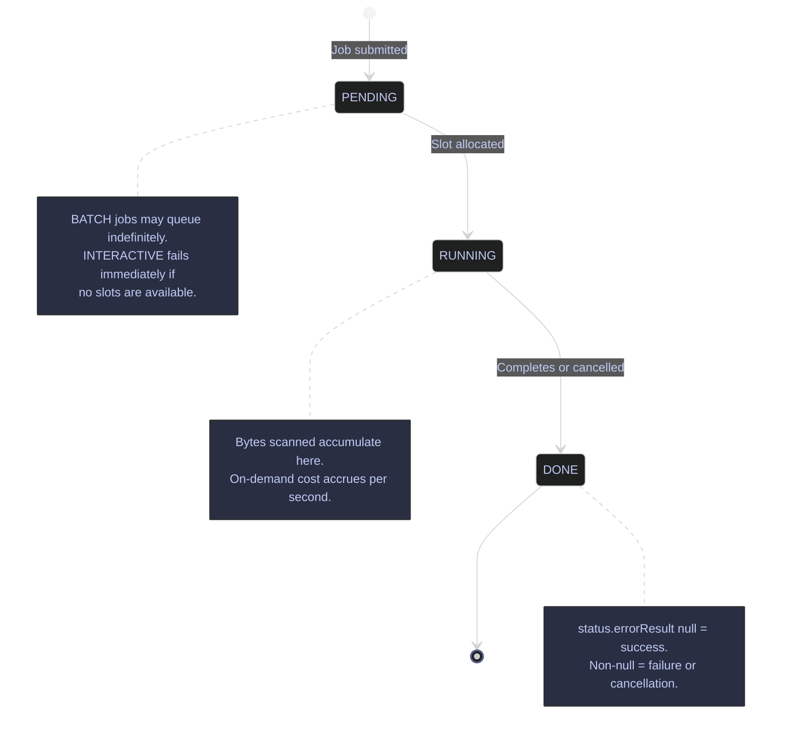

# BigQuery Job Management

> [!quote] John Gall on System Complexity
> "A complex system that works is invariably found to have evolved from a simple system that worked."
>
> — **John Gall**, *Systemantics* (1975)

Every BigQuery operation — query, load, export, copy — creates a job. Jobs are the unit of work in BigQuery. Understanding how to list jobs, inspect their details (including errors and bytes processed), and cancel runaway jobs is essential for incident response and cost governance. The job history is your primary audit trail for understanding what ran, who ran it, and how much it cost.

Job history is retained in `INFORMATION_SCHEMA.JOBS` for 180 days (the view is partitioned by `creation_time`). The `bq ls -j` command surfaces the same history but defaults to the last 100 jobs. IAM requirements for job management:

- **`roles/bigquery.jobUser`** — grants `bigquery.jobs.create` and `bigquery.jobs.get` on the caller's own jobs. Sufficient for listing, inspecting, and canceling your own jobs.
- **`roles/bigquery.admin`** — grants `bigquery.jobs.listAll` (see all users' jobs) and `bigquery.jobs.cancel` (cancel any user's job). Required for project-wide job triage and cost governance.

> [!info] All Four Operation Types Create Trackable Jobs
>
> `QUERY`, `LOAD`, `EXTRACT` (export), and `COPY` all appear in `bq ls -j` and `INFORMATION_SCHEMA.JOBS`. On-demand pricing charges per byte scanned during `QUERY` and `EXTRACT` jobs; `LOAD` and `COPY` jobs are free but still consume slot time.

## Job Operations via bq CLI

The `bq` CLI provides three core job management operations: listing recent jobs, inspecting job details, and canceling running jobs. For datasets in non-US/EU regions, pass `--location=<region>` to all `bq` job commands — omitting it returns a "job not found" error even when the job ID is correct.

### bq CLI | bq ls -j | list recent jobs

`bq ls -j` lists jobs submitted by the current user, sorted by creation time descending. The default limit is 100 jobs. Use `-a` to list all users' jobs across the project (requires `roles/bigquery.admin` with the `bigquery.jobs.listAll` permission). The output columns — `jobId`, `Job Type`, `State`, `Start Time`, `Duration` — provide the minimum context needed for quick triage of recent executions.

#### List recent jobs for the current user

**When to run:** after submitting queries to check their status, or at the start of a triage session to see what ran recently.
**Trigger:** routine check, investigating a slow or failed query, or auditing recent activity before running a cost query.
**Context:** `bq` CLI. Read-only. Requires `roles/bigquery.jobUser` (own jobs only). No cost — metadata operations are free.
**Purpose:** surface the most recent jobs for the authenticated user, sorted by creation time descending, to identify job IDs for further inspection or cancellation.

The `-j` flag switches `bq ls` from its default mode (listing datasets) to listing jobs. `--max_results` defaults to 100; `--max_results=10` limits output for quick triage.

| Column | Description |
|---|---|
| `jobId` | Unique job identifier. Pass this to `bq show -j` or `bq cancel`. |
| `Job Type` | One of `query`, `load`, `extract`, `copy`. |
| `State` | `SUCCESS`, `FAILURE`, or `RUNNING`. Maps to `DONE` state internally — `SUCCESS`/`FAILURE` are display labels for jobs where `state = DONE`. |
| `Start Time` | Wall-clock time the job began executing (after slot allocation). |
| `Duration` | Elapsed time from start to completion. `0:00:00` for jobs that failed before execution. |

*List the 10 most recent jobs submitted by the current user.*

```bash
bq ls -j --max_results=10
```

```text
                    jobId                      Job Type    State      Start Time         Duration
 -------------------------------------------- ---------- --------- ----------------- ----------------
  1a85a69d-21cf-4854-a5ff-bcf62e340657         query      SUCCESS   12 Apr 11:03:47   0:00:00.160000
  fc598cdd-cfd0-441d-97b1-7f524b9ac73d         query      SUCCESS   12 Apr 11:03:46   0:00:00.182000
  51a8557f-667c-4c42-81c9-d5602367f454         query      SUCCESS   12 Apr 11:03:43   0:00:00.235000
  b47bcd8c-ca31-4b67-9a76-3ae0c492a261         query      SUCCESS   12 Apr 11:03:43   0:00:00.234000
  8a13af69-432c-4b09-8c58-59d68a87ca7c         query      SUCCESS   12 Apr 11:03:42   0:00:00.263000
  7afeabc3-41d7-4b2e-87cb-49aebbd4c88b         query      FAILURE   12 Apr 11:03:08   0:00:00
  20c1dc4e-10bf-40cb-aa5c-1c2332fff6dd         query      FAILURE   12 Apr 11:03:05   0:00:00
  8f2fe6ea-7b73-41ad-8c23-22903ba46670         query      SUCCESS   12 Apr 11:03:03   0:00:00.193000
  46cd80d6-5150-4b3d-a21a-1614d8a7016e         query      SUCCESS   12 Apr 11:03:00   0:00:00.515000
  bqjob_r6f208572699b7c68_0000019d80eb95ef_1   query      SUCCESS   12 Apr 11:00:16   0:00:00.677000
```

Two jobs show `FAILURE` with `Duration: 0:00:00` — these failed before execution began (e.g., access denied, syntax error). The `jobId` format varies: BigQuery assigns UUID-style IDs for jobs created via the REST API or client libraries, and `bqjob_r...` prefixed IDs for jobs created via `bq query` directly.

#### List all users' jobs across the project

**When to run:** when investigating cost spikes or runaway queries that may have been submitted by another user or service account.
**Trigger:** cost alert fired, or a downstream table is unexpectedly locked/modified and you need to identify the responsible job.
**Context:** `bq` CLI. Read-only. Requires `roles/bigquery.admin` which grants `bigquery.jobs.listAll` — without it, `-a` silently returns only your own jobs.
**Purpose:** surface all jobs across all principals in the project so you can identify which user or service account submitted a given job.

*List the 10 most recent jobs from all users in the project.*

```bash
bq ls -j -a --max_results=10
```

```text
                 jobId                   Job Type    State      Start Time         Duration
 -------------------------------------- ---------- --------- ----------------- ----------------
  d91f6d8a-c1eb-42c7-9253-305bb4b545f5   query      FAILURE   12 Apr 11:03:50   0:00:00
  1a85a69d-21cf-4854-a5ff-bcf62e340657   query      SUCCESS   12 Apr 11:03:47   0:00:00.160000
  fc598cdd-cfd0-441d-97b1-7f524b9ac73d   query      SUCCESS   12 Apr 11:03:46   0:00:00.182000
  51a8557f-667c-4c42-81c9-d5602367f454   query      SUCCESS   12 Apr 11:03:43   0:00:00.235000
  b47bcd8c-ca31-4b67-9a76-3ae0c492a261   query      SUCCESS   12 Apr 11:03:43   0:00:00.234000
  8a13af69-432c-4b09-8c58-59d68a87ca7c   query      SUCCESS   12 Apr 11:03:42   0:00:00.263000
  7afeabc3-41d7-4b2e-87cb-49aebbd4c88b   query      FAILURE   12 Apr 11:03:08   0:00:00
  20c1dc4e-10bf-40cb-aa5c-1c2332fff6dd   query      FAILURE   12 Apr 11:03:05   0:00:00
  8f2fe6ea-7b73-41ad-8c23-22903ba46670   query      SUCCESS   12 Apr 11:03:03   0:00:00.193000
  46cd80d6-5150-4b3d-a21a-1614d8a7016e   query      SUCCESS   12 Apr 11:03:00   0:00:00.515000
```

In a single-user project like `bq-wh-nb`, the `-a` output is identical to the non-`-a` output. In a shared project with service accounts and analysts, the `-a` flag adds jobs from all principals — this is the only way to spot a service account's runaway query from the CLI.

| Flag | Syntax | Description |
|---|---|---|
| `-j` | `bq ls -j` | List jobs instead of datasets. Required — without it, `bq ls` lists datasets. |
| `-a` | `bq ls -j -a` | List all users' jobs (requires `roles/bigquery.admin` with `bigquery.jobs.listAll`). Without `-a`, only the authenticated user's jobs appear. |
| `--max_results` | `--max_results=<n>` | Number of jobs to return (default: 100). Also accepts `-n`. |
| `--min_creation_time` | `--min_creation_time=<epoch_ms>` | Filter jobs created after this epoch millisecond timestamp. |
| `--max_creation_time` | `--max_creation_time=<epoch_ms>` | Filter jobs created before this epoch millisecond timestamp. |
| `--job_type` | `--job_type=query\|load\|extract\|copy` | Filter by job type. |
| `--location` | `--location=<region>` | Required for jobs in non-US/EU regions. Omitting returns "not found" even when the job ID exists. |
| `--project_id` | `--project_id=<project>` | Target a specific project (defaults to active `gcloud` project). |
| `--format` | `--format=prettyjson` | Output format: `prettyjson`, `json`, `csv`, `table` (default). |

### bq CLI | bq show -j | inspect job details

`bq show -j <job_id>` returns the full job resource as JSON: the SQL executed, bytes scanned, slot usage, timing breakdown, and error messages. Use this after a job fails to read the `status.errors` array, or after a successful job to calculate its on-demand cost from `totalBytesProcessed`.

#### Inspect a successful job's full resource

**When to run:** after a job completes to understand its cost, slot consumption, and execution plan — or after a failure to read the error message.
**Trigger:** a job completed with unexpected cost or duration, a job failed and you need the error detail, or you want to confirm cache behavior.
**Context:** `bq` CLI. Read-only. Requires `roles/bigquery.jobUser` for own jobs; `roles/bigquery.admin` for another user's jobs. No cost.
**Purpose:** retrieve the complete job JSON resource including the SQL text, bytes scanned, slot usage, timing breakdown, and error array.

Retrieves the complete job resource. Use `--format=prettyjson` for a readable JSON dump; use `--format=json` for machine parsing.

| Field | Path | Description |
|---|---|---|
| SQL text | `configuration.query.query` | The full SQL statement that was executed. |
| Legacy SQL | `configuration.query.useLegacySql` | `true` if the query used legacy SQL dialect. |
| Priority | `configuration.query.priority` | `INTERACTIVE` (default, immediate execution) or `BATCH` (queued, may wait). |
| Bytes processed | `statistics.query.totalBytesProcessed` | Bytes scanned. Divide by `1,099,511,627,776` (1 TiB) × `$6.25` for on-demand cost. |
| Bytes billed | `statistics.query.totalBytesBilled` | Actual billed bytes (minimum 10 MB per query, rounded up to nearest MB). |
| Cache hit | `statistics.query.cacheHit` | `true` if the result was served from cache (no charge on on-demand). |
| Statement type | `statistics.query.statementType` | `SELECT`, `INSERT`, `UPDATE`, `DELETE`, `MERGE`, `CREATE_TABLE_AS_SELECT`, etc. |
| Slot time | `statistics.totalSlotMs` | Total slot-milliseconds consumed. Higher values indicate heavier compute. |
| Creation time | `statistics.creationTime` | Epoch milliseconds when the job was submitted. |
| Start time | `statistics.startTime` | Epoch milliseconds when execution began (after slot allocation). |
| End time | `statistics.endTime` | Epoch milliseconds when the job completed. Subtract `startTime` for execution duration. |
| State | `status.state` | Always `DONE` for completed jobs. Check `status.errorResult` to distinguish success from failure. |
| Error result | `status.errorResult` | Present if the job failed. Contains `reason` (e.g., `accessDenied`, `invalidQuery`) and `message`. |
| Errors array | `status.errors` | Array of all errors encountered. May contain multiple entries for compound failures. |

*Inspect the full job resource for a successful cost-recovery query.*

```bash
bq show -j --format=prettyjson bqjob_r5f562c8c0b311212_0000019d80eb8254_1
```

```text
{
  "configuration": {
    "jobType": "QUERY",
    "query": {
      "priority": "INTERACTIVE",
      "query": "SELECT user_email, COUNT(*) AS total_jobs ... FROM `region-US`.INFORMATION_SCHEMA.JOBS ...",
      "useLegacySql": false,
      "writeDisposition": "WRITE_TRUNCATE"
    }
  },
  "statistics": {
    "creationTime": "1775984411308",
    "startTime": "1775984411498",
    "endTime": "1775984413110",
    "totalBytesProcessed": "4048",
    "totalSlotMs": "1722",
    "query": {
      "cacheHit": false,
      "totalBytesBilled": "20971520",
      "totalBytesProcessed": "4048",
      "totalSlotMs": "1722",
      "statementType": "SELECT"
    }
  },
  "status": {
    "state": "DONE"
  },
  "user_email": "alexper.recovery@gmail.com"
}
```

This job processed 4,048 bytes but was billed for 20,971,520 bytes (20 MB) — the BigQuery minimum billing floor of 10 MB per query, rounded up. On-demand cost: `20,971,520 / 1,099,511,627,776 × $6.25 ≈ $0.00012`. The `cacheHit: false` confirms the query was executed, not served from cache. Execution duration: `(1775984413110 - 1775984411498) / 1000 = 1.6 seconds`.

#### Inspect a failed job's error details

**When to run:** after `bq ls -j` shows a `FAILURE` row and you need the exact error message.
**Trigger:** a job shows `FAILURE` status with `Duration: 0:00:00` in the listing.
**Context:** same as above — `bq show -j` with the failed job's ID.
**Purpose:** read the `status.errorResult` object to understand the failure reason and take corrective action.

*Inspect a failed job to read the error detail.*

```bash
bq show -j --format=prettyjson 7afeabc3-41d7-4b2e-87cb-49aebbd4c88b
```

```text
{
  "configuration": {
    "jobType": "QUERY",
    "query": {
      "priority": "INTERACTIVE",
      "query": "SELECT ... FROM `bq-wh-nb`.`region-eu`.INFORMATION_SCHEMA.TABLE_STORAGE t LEFT JOIN ...",
      "useLegacySql": false
    }
  },
  "statistics": {
    "creationTime": "1775984587557",
    "startTime": "1775984588044",
    "endTime": "1775984588044",
    "query": {}
  },
  "status": {
    "errorResult": {
      "message": "Access Denied: Table bq-wh-nb:region-eu.INFORMATION_SCHEMA.COLUMNS: User does not have permission to query table ..., or perhaps it does not exist.",
      "reason": "accessDenied"
    },
    "errors": [
      {
        "message": "Access Denied: Table bq-wh-nb:region-eu.INFORMATION_SCHEMA.COLUMNS: ...",
        "reason": "accessDenied"
      }
    ],
    "state": "DONE"
  },
  "user_email": "alexper.recovery@gmail.com"
}
```

The `status.state` is `DONE` — BigQuery does not have a `FAILED` state. Failure is represented by `DONE` with a non-null `status.errorResult`. Here the `reason: "accessDenied"` indicates the caller lacked `bigquery.tables.get` on `INFORMATION_SCHEMA.COLUMNS` in the `region-eu` dataset. The `statistics.query` object is empty because no bytes were scanned — the job was rejected before execution.

> [!info] Common Error Reasons in `status.errorResult`
>
> | `reason` | Meaning | Typical Fix |
> |---|---|---|
> | `accessDenied` | Missing IAM permission on the target table or dataset | Grant `roles/bigquery.dataViewer` on the dataset |
> | `invalidQuery` | SQL syntax error or reference to a non-existent column/table | Fix the SQL and re-run |
> | `notFound` | The referenced table, dataset, or project does not exist | Verify the fully-qualified table name |
> | `quotaExceeded` | Project-level quota (concurrent queries, bytes per day) exceeded | Wait and retry, or request a quota increase |
> | `resourcesExceeded` | Query exceeded memory limits (too many `GROUP BY` keys, too-wide `JOIN`) | Restructure the query to reduce memory |
> | `rateLimitExceeded` | Too many API calls per second | Implement exponential backoff |

| Flag | Syntax | Description |
|---|---|---|
| `-j` | `bq show -j <job_id>` | Required — indicates the resource is a job (not a dataset or table). Also accepts `--job=true`. |
| `--format` | `--format=prettyjson` | Output format: `prettyjson` (human-readable JSON), `json` (compact, machine-parseable), `csv`, `table` (default). |
| `--location` | `--location=<region>` | Required for jobs in non-US/EU regions. Ignored if the job ID is fully qualified (`project:location.job_id`). |
| `--project_id` | `--project_id=<project>` | Target a specific project (defaults to active `gcloud` project). |

### bq CLI | bq cancel | cancel a running job

`bq cancel <job_id>` sends a cancellation request to a `RUNNING` or `PENDING` job. Cancellation is best-effort — the job transitions to `DONE` state promptly in most cases, but may complete a brief continuation before stopping. The REST API equivalent (`jobs.cancel`) returns immediately; the `bq` CLI waits for completion by default unless `--nosync` is passed.

#### Cancel a running or pending job

**When to run:** when a query is consuming unexpected resources (visible via `bq ls -j` showing `RUNNING` state with growing duration) or when a query was submitted by mistake.
**Trigger:** a long-running query is detected in `bq ls -j`, or a cost alert fires mid-execution.
**Context:** `bq` CLI. State-changing — sends a cancellation request. Requires `roles/bigquery.jobUser` for own jobs; `roles/bigquery.admin` + `bigquery.jobs.cancel` for another user's jobs. The `bq cancel` command waits for the cancellation to complete by default; pass `--nosync` to return immediately.
**Purpose:** stop a running job to prevent further byte scanning and cost accumulation.

The job ID is available from `bq ls -j` output or from the BigQuery console job history tab. The cancellation is best-effort — BigQuery may scan a small amount of additional bytes between the cancel request and actual termination.

*Cancel job `bqjob_r5f562c8c0b311212_0000019d80eb8254_1` in the US region.*

```bash
bq cancel bqjob_r5f562c8c0b311212_0000019d80eb8254_1
```

```text
Successfully requested cancellation of job bq-wh-nb:US.bqjob_r5f562c8c0b311212_0000019d80eb8254_1
```

> [!warning] On-Demand Charges Accumulate Until Cancellation Completes
>
> BigQuery on-demand pricing charges per byte scanned. A `SELECT *` against a large unpartitioned table begins accumulating cost the moment it enters `RUNNING` state. Canceling late in execution still incurs a charge — the final bill reflects bytes scanned up to the point cancellation took effect, not zero. On a 10 TiB table, even a partial scan can cost tens of dollars.

> [!success] Run a Dry Run Before Executing Large Queries
>
> Use `bq query --dry_run` to inspect bytes that would be scanned before committing to execution. Combined with early cancellation for runaway jobs, this limits unintended cost. See [querying-and-cost-optimization](https://alp78.github.io/elysium/06-GCP/03-BigQuery/03-querying-and-cost-optimization) for dry-run syntax.

| Flag | Syntax | Description |
|---|---|---|
| `--location` | `--location=<region>` | Required for jobs in non-US/EU regions |
| `--project_id` | `--project_id=<project>` | Target a specific project |
| `--nosync` | `--nosync` | Return immediately without waiting for the cancellation to complete (default: `false` — waits for completion) |

### bq CLI | job IDs | locate job identifiers

Job IDs are assigned by BigQuery when a job is created. They appear in four places:

- **`bq query` output** — printed to stderr when the query starts (e.g., `Waiting on bqjob_r5f562c8c0b311212_0000019d80eb8254_1 ...`)
- **`bq ls -j` listings** — the `jobId` column in the output table
- **BigQuery console** — the job history tab under the project shows fully-qualified IDs in the format `project:location.job_id`
- **[Cloud Logging](https://alp78.github.io/elysium/06-GCP/Logging/cloud-logging)** — BigQuery audit log entries (resource type `bigquery_resource`) include the job ID in `protoPayload.serviceData.jobCompletedEvent.job.jobName`

When passing a job ID to `bq show -j` or `bq cancel`, you can use either the short form (`job_id`) or the fully-qualified form (`project:location.job_id`). If using the short form for a job in a non-default region, pass `--location=<region>` explicitly — otherwise the lookup returns "job not found."

## Job States Reference

BigQuery jobs transition through three states. All jobs end in `DONE` regardless of outcome — success, failure, and cancellation are all represented as `DONE` with different `status.errorResult` content. There is no separate `FAILED` or `CANCELLED` state — the caller must inspect `status.errorResult` to distinguish outcomes.

Job priority affects state transitions: `INTERACTIVE` jobs (the default for `bq query`) fail immediately if no slots are available. `BATCH` jobs (set via `--batch` flag or `priority: "BATCH"` in the API) queue in `PENDING` state indefinitely until slots become available, making them suitable for non-urgent ETL workloads. Batch jobs that are not scheduled within 24 hours are automatically promoted to interactive priority.



| State | Meaning | Watch | Action |
|---|---|---|---|
| `PENDING` | Queued, waiting for slot allocation. | Normal for `BATCH` jobs. Prolonged `PENDING` on `INTERACTIVE` jobs indicates slot starvation. | If an interactive job is stuck in `PENDING`, check reservation utilization or switch to a different reservation. |
| `RUNNING` | Currently executing. Bytes scanned and slot-milliseconds accumulate. | Duration growing beyond expectations. | Cancel with `bq cancel` if the job appears runaway. The final cost reflects bytes scanned up to cancellation. |
| `DONE` | Terminal state for all outcomes. | Check `status.errorResult`: `null` = success; non-null = failure or cancellation. | For failures, read `status.errorResult.reason` and `status.errors[].message` to diagnose. |

## Cost Recovery with INFORMATION_SCHEMA

`INFORMATION_SCHEMA.JOBS` is a system view that retains job metadata for 180 days, partitioned by `creation_time` and clustered by `project_id` and `user_email`. Unlike `bq ls -j` which is limited to tabular display of basic fields, SQL against `INFORMATION_SCHEMA.JOBS` gives full analytical power: aggregation by user, date, job type, error rate, cache hit ratio, and cost attribution. The view is region-scoped — query `` `region-US`.INFORMATION_SCHEMA.JOBS `` for US-region jobs and `` `region-EU`.INFORMATION_SCHEMA.JOBS `` for EU-region jobs.

> [!warning] INFORMATION_SCHEMA Queries Are Never Cached
>
> Results from `INFORMATION_SCHEMA` views are never served from the query cache, regardless of whether the same query was run recently. Each execution scans the underlying metadata. Filter on `creation_time` to limit the scan window and reduce slot consumption.

> [!success] Always Filter on creation_time
>
> `creation_time` is the partitioning column. Adding `WHERE creation_time > TIMESTAMP_SUB(CURRENT_TIMESTAMP(), INTERVAL 30 DAY)` prunes partitions and keeps the query fast. Without this filter, the query scans the full 180-day window.

### INFORMATION_SCHEMA | JOBS | cost attribution by user

This subsection demonstrates two production cost-recovery queries against `INFORMATION_SCHEMA.JOBS`: a per-user cost summary and a daily cost trend. Both exclude `SCRIPT` statement types to avoid double-counting parent/child job bytes.

#### Aggregate cost by user for the last 30 days

**When to run:** at the end of a billing cycle, or when a cost alert fires and you need to identify which principal is responsible for the spend.
**Trigger:** monthly cost review, billing spike investigation, or onboarding a new service account.
**Context:** `bq query` running GoogleSQL against `INFORMATION_SCHEMA.JOBS`. Read-only. Requires `roles/bigquery.jobUser` + `bigquery.jobs.listAll` (via `roles/bigquery.admin`) to see all users' jobs. The query itself is billed as a metadata scan.
**Purpose:** attribute on-demand query cost to each user or service account over a 30-day window.

> [!info]- Clause-by-Clause Breakdown
>
> - **`COUNT(*) AS total_jobs`** — total query jobs per user in the window.
> - **`COUNTIF(error_result IS NOT NULL) AS failed_jobs`** — jobs that ended in error. Failed jobs may still have scanned bytes (e.g., a query that fails mid-execution).
> - **`COUNTIF(cache_hit = true) AS cache_hits`** — jobs served from cache at zero cost. A low cache-hit ratio on repeated queries suggests non-deterministic functions or frequent table updates.
> - **`ROUND(SUM(IFNULL(total_bytes_processed, 0)) / POW(2,30), 4) AS gb_scanned`** — total gigabytes scanned. `IFNULL` handles `NULL` for failed jobs that scanned no bytes.
> - **`ROUND(SUM(IFNULL(total_bytes_processed, 0)) / POW(2,40) * 6.25, 6) AS cost_usd`** — estimated on-demand cost at $6.25/TiB. Divide bytes by `2^40` (1 TiB) then multiply by the rate.
> - **`ROUND(SUM(IFNULL(total_slot_ms, 0)) / 1000, 2) AS total_slot_sec`** — cumulative slot-seconds consumed. Useful for capacity planning if migrating to Editions (slot-based) pricing.
> - **`WHERE statement_type != "SCRIPT"`** — excludes parent script jobs whose `total_bytes_processed` sums all child jobs, which would double-count bytes.

| Field | Source Column | Type | Meaning |
|---|---|---|---|
| `user_email` | `user_email` | STRING | The IAM principal (user or service account) that submitted the job. |
| `total_jobs` | `COUNT(*)` | INT64 | Number of query jobs in the window. |
| `failed_jobs` | `COUNTIF(error_result IS NOT NULL)` | INT64 | Jobs that ended with an error. |
| `cache_hits` | `COUNTIF(cache_hit = true)` | INT64 | Jobs served from the 24-hour result cache (zero cost). |
| `gb_scanned` | `total_bytes_processed` | FLOAT64 | Cumulative gigabytes scanned across all jobs. |
| `cost_usd` | `total_bytes_processed` | FLOAT64 | Estimated on-demand cost at $6.25/TiB. |
| `total_slot_sec` | `total_slot_ms` | FLOAT64 | Cumulative slot-seconds — a proxy for compute intensity. |

*Aggregate on-demand query cost by user for the last 30 days in the US region.*

```sql
SELECT
  user_email,
  COUNT(*) AS total_jobs,
  COUNTIF(error_result IS NOT NULL) AS failed_jobs,
  COUNTIF(cache_hit = true) AS cache_hits,
  ROUND(SUM(IFNULL(total_bytes_processed, 0)) / POW(2,30), 4) AS gb_scanned,
  ROUND(SUM(IFNULL(total_bytes_processed, 0)) / POW(2,40) * 6.25, 6) AS cost_usd,
  ROUND(SUM(IFNULL(total_slot_ms, 0)) / 1000, 2) AS total_slot_sec
FROM `region-US`.INFORMATION_SCHEMA.JOBS
WHERE creation_time > TIMESTAMP_SUB(CURRENT_TIMESTAMP(), INTERVAL 30 DAY)
  AND job_type = 'QUERY'
  AND statement_type != 'SCRIPT'
GROUP BY user_email
ORDER BY cost_usd DESC
```

| user_email | total_jobs | failed_jobs | cache_hits | gb_scanned | cost_usd | total_slot_sec |
|---|---|---|---|---|---|---|
| bq-wh-sa@bq-wh-nb.iam.gserviceaccount.com | 3 | 0 | 0 | 0.0 | 0.0 | 0.02 |
| alexper.recovery@gmail.com | 6 | 0 | 0 | 0.0 | 0.0 | 4.8 |

Both principals show zero cost — the `stoxx` tables are small (< 1 MB total), well below the 10 MB minimum billing floor per query. In a production environment with TiB-scale tables, this query surfaces the top spenders instantly. The service account `bq-wh-sa` consumed 0.02 slot-seconds across 3 jobs, confirming it runs only lightweight scheduled loads.

#### Daily cost trend for the last 30 days

**When to run:** alongside the per-user summary to identify which days had the highest spend.
**Trigger:** cost spike on a specific date visible in billing reports — this query pinpoints the day.
**Context:** same as above. Read-only metadata query.
**Purpose:** break down cost by day to correlate spikes with deployments, ETL runs, or ad-hoc exploration.

| Field | Source Column | Type | Meaning |
|---|---|---|---|
| `query_date` | `FORMAT_TIMESTAMP("%Y-%m-%d", creation_time)` | STRING | Calendar date of job submission. |
| `jobs` | `COUNT(*)` | INT64 | Total query jobs on that date. |
| `errors` | `COUNTIF(error_result IS NOT NULL)` | INT64 | Failed jobs on that date. |
| `cache_hits` | `COUNTIF(cache_hit = true)` | INT64 | Cache-served jobs (zero cost). |
| `mb_scanned` | `total_bytes_processed` | FLOAT64 | Megabytes scanned (useful for small-scale projects where GB would show 0.0). |
| `slot_sec` | `total_slot_ms` | FLOAT64 | Slot-seconds consumed. |

*Daily query cost breakdown for the last 30 days in the US region.*

```sql
SELECT
  FORMAT_TIMESTAMP('%Y-%m-%d', creation_time) AS query_date,
  COUNT(*) AS jobs,
  COUNTIF(error_result IS NOT NULL) AS errors,
  COUNTIF(cache_hit = true) AS cache_hits,
  ROUND(SUM(IFNULL(total_bytes_processed, 0)) / POW(2,20), 2) AS mb_scanned,
  ROUND(SUM(IFNULL(total_slot_ms, 0)) / 1000, 2) AS slot_sec
FROM `region-US`.INFORMATION_SCHEMA.JOBS
WHERE creation_time > TIMESTAMP_SUB(CURRENT_TIMESTAMP(), INTERVAL 30 DAY)
  AND job_type = 'QUERY'
  AND statement_type != 'SCRIPT'
GROUP BY query_date
ORDER BY query_date DESC
```

| query_date | jobs | errors | cache_hits | mb_scanned | slot_sec |
|---|---|---|---|---|---|
| 2026-04-12 | 9 | 0 | 0 | 0.01 | 6.58 |
| 2026-03-22 | 3 | 0 | 0 | 0.0 | 0.02 |

The 2026-04-12 spike (9 jobs, 6.58 slot-seconds) corresponds to the current session's exploratory queries against `INFORMATION_SCHEMA` itself. The 2026-03-22 baseline (3 jobs, 0.02 slot-seconds) represents the initial dataset setup. In a production environment, this view reveals weekly ETL patterns, ad-hoc exploration spikes, and the impact of query optimization efforts over time.

## Related

- [querying-and-cost-optimization](https://alp78.github.io/elysium/06-GCP/03-BigQuery/03-querying-and-cost-optimization) — Dry runs before execution and INFORMATION_SCHEMA cost queries
- [data-loading-and-export](https://alp78.github.io/elysium/06-GCP/03-BigQuery/02-data-loading-and-export) — Load and export operations also create BQ jobs
- [cloud-logging](https://alp78.github.io/elysium/06-GCP/Logging/cloud-logging) — BigQuery jobs emit audit logs visible in Cloud Logging
- [cloud-monitoring-metrics](https://alp78.github.io/elysium/06-GCP/Logging/cloud-monitoring-metrics) — `bigquery.googleapis.com/query/count` and slot usage metrics

## References

- [BigQuery job management](https://cloud.google.com/bigquery/docs/managing-jobs)
- [INFORMATION_SCHEMA.JOBS](https://cloud.google.com/bigquery/docs/information-schema-jobs)
