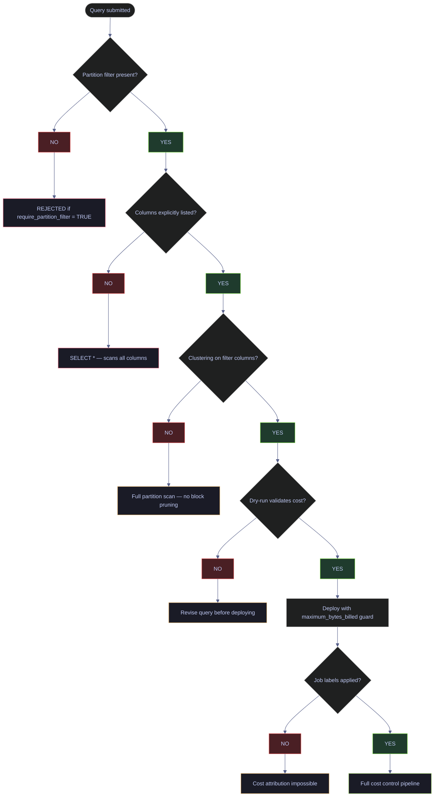
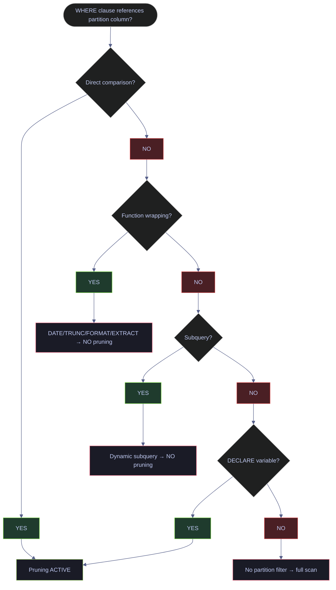

# BigQuery Problems

> [!quote]+
> "Every great developer you know got there by solving problems they were unqualified to solve until they actually did it."
>
> — **Patrick McKenzie**, kalzumeus.com

> [!abstract]- Summary
>
> Catalogs 25 production BigQuery failure modes for an EU BMR-regulated financial index platform using on-demand pricing, dbt, scheduled queries, materialized views, and Cloud Run-fed warehouse loads, so engineers can prevent cost spikes, correctness bugs, concurrency failures, and audit gaps before they hit client-facing analytics.
>
> **Platform context**
> - BigQuery is the analytical warehouse behind client index consumption, analyst queries, dbt transformations, scheduled-query outputs, dashboard materialized views, and `INFORMATION_SCHEMA` cost monitoring
> - Data lands from a SQL Server gold layer through Cloud Run export jobs, on-demand pricing is the main billing model, and audit trail plus reproducibility are mandatory because the platform sits inside an EU BMR-regulated workflow
> - Each problem section follows the same operator-facing structure: what happens, root cause, consequences, prevention protocol, and fix procedure
>
> **Critical — Cost explosion / data loss**
> - Uncontrolled full-table scans from missing partition filters, `SELECT *`, dashboard auto-refresh, and missing byte caps under on-demand pricing
> - Project-wide concurrent interactive DML limits, `resourcesExceeded` failures from oversized queries, accidental table or dataset deletion, and streaming-insert cost explosions
>
> **High — Data quality / performance**
> - `FLOAT64` precision loss in financial math, partition pruning defeated by function wrapping, and missing clustering on common filter columns
> - Expensive incremental `MERGE` patterns, slot starvation during peak usage, silent `NULL` propagation in calculations, and materialized views falling behind freshness expectations
>
> **Moderate — Operational pain**
> - Schema evolution breaking downstream consumers, scheduled queries failing without alerting, and cross-region query or egress costs
> - Table-level DML concurrency conflicts, external-table performance traps, authorized-view and policy-tag conflicts, `INFORMATION_SCHEMA` overhead, and time-travel expiry blocking historical reproduction
>
> **Low — Annoyances / technical debt**
> - Missing `require_partition_filter`, weak label discipline for cost attribution, legacy wildcard table sharding, BI Engine cache misses from dynamic SQL, and stale views after source-table renames
>
> **bq CLI flag reference**
> - Consolidates the core operational flags for `bq query`, `bq load`, `bq update`, `bq cancel`, `bq extract`, `bq cp`, and `bq rm`
>
> **Operations and safety**
> - When to use: design reviews, pre-production hardening, incident triage, postmortems, regulated reproducibility checks, and cost-governance runbooks
> - Warnings: on-demand scan costs compound silently, the 20 concurrent interactive DML limit is hard, time travel expires permanently, region and security boundaries are easy to cross incorrectly, and some failures surface only when queried
> - Recommendations: codify prevention in Terraform, dbt, Airflow, Cloud Billing, and CI checks; dry-run and cap large queries; enforce partition filters and labels; and treat each prevention protocol plus fix procedure as an operational runbook

> [!warning] Historical output boundary
>
> This note is primarily conceptual, but many sections include live `bq-wh-nb` outputs captured when that warehouse still existed. On `2026-04-15`, `bq-wh-nb` was already deleted, so those embedded result sets now function as historical evidence, not current platform state.
>
> Numeric quotas, pricing examples, and platform limits in this note are version-sensitive. Re-check the current BigQuery quotas and pricing documentation before turning any threshold, concurrency ceiling, or cost formula here into automation or policy.
>
> [!note]- Glossary
>
> **BigQuery**
> - Google Cloud's analytical database service that stores tables, executes SQL, manages jobs, and exposes operational metadata for warehouse workloads.
> - Every problem in this note is BigQuery-specific, even when the surrounding platform also uses dbt, Airflow, Cloud Run, or SQL Server.
>
> > [!info] Service behavior matters
> >
> > BigQuery looks simple at query time, but many of the real production risks live in its pricing model, storage layout, quotas, and system views rather than in SQL syntax alone.
>
> ---
>
> **Audit trail / reproducibility**
> - The requirement that you can explain what data, query, code path, and point-in-time state produced a published result.
> - The note treats this as non-negotiable because regulated financial calculations cannot rely on best-effort reconstruction after the fact.
>
> > [!warning] Recovery windows expire
> >
> > Reproducibility is not guaranteed just because BigQuery supports time travel. If retention, logging, labels, and snapshots are missing, historical reconstruction eventually becomes impossible.
>
> ---
>
> **On-demand pricing**
> - BigQuery's pay-per-scan billing model where query cost is driven primarily by bytes processed rather than by reserved compute capacity.
> - The note uses on-demand pricing as the baseline because many of the listed incidents are really scan-amplification failures expressed as money.
>
> > [!warning] Small mistakes compound fast
> >
> > An individual query may look cheap until a dashboard, retry loop, or scheduled job repeats it continuously. On-demand risk is often multiplicative rather than singular.
>
> ---
>
> **DML / `INSERT`, `UPDATE`, `DELETE`, `MERGE`, `TRUNCATE`**
> - BigQuery statements that mutate table data instead of only reading it.
> - The note treats DML as a concurrency and reliability risk because mutations consume shared quota, can conflict with each other, and are harder to reason about than pure reads.
>
> > [!warning] Mutations share scarce slots
> >
> > A project can run out of DML headroom long before it runs out of ideas for parallelism. Treat mutating workloads as capacity-managed operations, not as infinitely parallel tasks.
>
> ---
>
> **`MERGE`**
> - A BigQuery DML statement that conditionally inserts, updates, or deletes rows by matching a source dataset against a target table.
> - The note highlights `MERGE` because it is central to incremental pipelines and also a common source of full-table scans, long-running mutations, and quota contention.
>
> > [!warning] Incremental does not guarantee cheap
> >
> > A logically incremental `MERGE` can still scan a huge target table if the matching predicates do not align with partitioning or clustering. The intent of the statement does not control the cost by itself.
>
> ---
>
> **Streaming inserts / Storage Write API**
> - BigQuery's low-latency ingestion path for row-by-row or near-real-time writes outside ordinary batch load jobs.
> - The note includes it because streaming is operationally attractive but can become a cost trap when used for workloads that should stay batched.
>
> > [!warning] Convenience has a price
> >
> > Streaming is not just "faster load." It changes cost, ingestion semantics, and downstream behavior, so using it by default can create a permanently expensive pipeline shape.
>
> ---
>
> **Partitioned table**
> - A BigQuery table physically divided by time or range boundaries so only relevant segments need to be scanned for qualifying queries.
> - The note treats partitioning as the first structural defense against cost explosion and runaway scan volume.
>
> > [!info] Structure beats discipline
> >
> > Good user habits help, but partitioning is stronger because it changes the storage shape itself. When the table is designed well, cost control becomes easier to enforce automatically.
>
> ---
>
> **Partition pruning**
> - BigQuery's ability to skip irrelevant table partitions when a filter can be resolved against the partition boundary during planning.
> - Several problem sections depend on pruning because a table can be partitioned correctly and still scan excessively if pruning is not triggered.
>
> > [!warning] Expressions can disable it
> >
> > Wrapping the partition column in functions or otherwise hiding it behind dynamic expressions can prevent pruning. The presence of a date filter does not automatically mean BigQuery can use it efficiently.
>
> ---
>
> **`require_partition_filter`**
> - A BigQuery table option that rejects queries lacking a partition predicate on a partitioned table.
> - The note uses it as a preventive guardrail because relying on human discipline alone is not enough on shared analytical platforms.
>
> > [!warning] Protection changes compatibility
> >
> > Enabling the option is desirable, but it can also break existing dashboards, views, or ad hoc habits. Guardrails should be deployed deliberately, not assumed to be transparent.
>
> ---
>
> **Clustering**
> - A BigQuery storage optimization that orders data within tables or partitions by selected columns so irrelevant blocks can be skipped.
> - The note treats clustering as the second major scan-reduction lever after partitioning, especially for repeated filters on business keys.
>
> > [!info] Best with real access patterns
> >
> > Clustering helps when it matches how queries actually filter data. Choosing columns by intuition instead of observed workload often wastes the feature.
>
> ---
>
> **Wildcard table / `_TABLE_SUFFIX`**
> - A legacy BigQuery pattern where many sharded tables are queried together with a wildcard name and optionally filtered by the special `_TABLE_SUFFIX` pseudo-column.
> - The note includes it because older sharded designs still exist and create scan and governance problems that native partitioned tables solve better.
>
> > [!warning] No built-in guardrail
> >
> > Wildcard queries do not get the same enforcement features as native partitioned tables. Forgetting `_TABLE_SUFFIX` can silently fan out across years of shards.
>
> ---
>
> **`FLOAT64`**
> - BigQuery's binary floating-point numeric type, optimized for approximate arithmetic rather than exact decimal financial calculations.
> - The note flags it because financial index math can be wrong in subtle ways even when the query runs successfully.
>
> > [!warning] Approximation is the bug
> >
> > Floating-point issues are dangerous because they often look plausible. A value can be mathematically wrong without triggering any explicit error or quota boundary.
>
> ---
>
> **`NUMERIC`**
> - BigQuery's exact decimal type designed for fixed-precision arithmetic such as prices, weights, and ratios that must not accumulate binary rounding error.
> - The note positions `NUMERIC` as the safer choice when monetary or index calculations require reproducible decimal results.
>
> > [!info] Exactness has storage tradeoffs
> >
> > Exact decimal types are usually worth the cost for regulated financial outputs. Precision errors are typically more expensive than the marginal storage or compute overhead.
>
> ---
>
> **`NULL` propagation**
> - The way SQL expressions often return `NULL` when any contributing operand is `NULL`, unless the expression is explicitly guarded.
> - The note includes this because silent null behavior can mask missing upstream data and turn data-quality issues into understated aggregates or blank downstream values.
>
> > [!warning] Silence looks clean
> >
> > `NULL` propagation is dangerous precisely because it often produces no hard failure. A dashboard that quietly shows blanks or lower totals can be harder to catch than a crashed job.
>
> ---
>
> **Slot / `total_slot_ms`**
> - The unit of BigQuery compute capacity and the metric used to measure how much processing time a query consumed.
> - The note uses slot behavior to discuss starvation, contention, compute intensity, and the distinction between scan-heavy and CPU-heavy workloads.
>
> > [!info] Cost and capacity are related
> >
> > Even when on-demand pricing bills by bytes, slot pressure still determines latency and concurrency. Fast enough and cheap enough are separate dimensions.
>
> ---
>
> **Materialized view**
> - A BigQuery-managed precomputed query result that is refreshed automatically to serve repeated reads more efficiently than recomputing the full source query every time.
> - The note includes materialized views because they can solve repeated-query cost problems while also introducing freshness and fallback surprises.
>
> > [!warning] Freshness is conditional
> >
> > A materialized view can be valid, deployed, and still not represent the latest source data at the moment someone queries it. Operational SLAs must account for refresh behavior.
>
> ---
>
> **Scheduled query**
> - A managed BigQuery job that executes SQL on a schedule without requiring an external orchestrator to trigger it manually.
> - The note treats scheduled queries as convenient but operationally risky when alerting, ownership, or dependency visibility is weak.
>
> > [!warning] Managed does not mean monitored
> >
> > A scheduled query can fail repeatedly while remaining "managed" in the control plane. Without explicit alerts and ownership, automation simply hides the failure loop.
>
> ---
>
> **Time travel**
> - BigQuery's bounded historical row-version retention that lets you query or restore past table states for a limited number of hours or days.
> - The note uses time travel in both recovery and reproducibility scenarios, especially around accidental deletion and historical reruns.
>
> > [!warning] Retention is finite
> >
> > Time travel feels like a safety net until the window expires. If you need historical reproducibility beyond the retention limit, you must create a different preservation mechanism in advance.
>
> ---
>
> **External table**
> - A BigQuery table definition that reads data in place from an external storage system such as Cloud Storage instead of storing the data natively inside BigQuery.
> - The note includes external tables because they are tempting for quick access patterns but often underperform native tables for repeated analytical workloads.
>
> > [!warning] External is not free lunch
> >
> > Avoid assuming that skipping a load step makes the system simpler overall. Performance, pruning, statistics, and downstream ergonomics can all degrade when data never becomes native.
>
> ---
>
> **Authorized view**
> - A BigQuery view granted access to underlying data so consumers can query the view without direct access to the source tables.
> - The note covers authorized views because they are part of secure-sharing patterns and can conflict with other fine-grained security mechanisms.
>
> > [!info] Access is mediated by the view
> >
> > Authorized views are powerful because they separate data exposure from table-level grants. They are also subtle because the access path becomes indirect rather than obvious from table IAM alone.
>
> ---
>
> **Policy tag / column-level security**
> - A metadata classification and access-control mechanism that restricts visibility of specific columns based on taxonomy-backed permissions.
> - The note includes policy tags because column security can interact badly with authorized views and downstream expectations about accessible schemas.
>
> > [!warning] Security layers can collide
> >
> > Combining multiple protection mechanisms is not automatically additive. One layer can block or invalidate another in ways that only surface when a view or query is executed.
>
> ---
>
> **`INFORMATION_SCHEMA`**
> - BigQuery's family of system views that expose metadata about jobs, tables, options, views, and other warehouse objects through SQL.
> - The note uses these views heavily for cost monitoring, dependency discovery, and operational audits.
>
> > [!warning] Metadata can still cost
> >
> > `INFORMATION_SCHEMA` queries are often cheaper than data-table scans, but they are not magically free or cached in every case. Poorly scoped metadata queries can become their own operational issue.
>
> ---
>
> **Label / job label**
> - Key-value metadata attached to BigQuery resources or jobs so teams can group, govern, and attribute cost or ownership consistently.
> - The note treats labels as essential infrastructure for cost attribution because unlabeled spend is hard to assign or remediate after the fact.
>
> > [!warning] Missing labels erase blame lines
> >
> > Costs without ownership metadata become shared pain with no clear operator. Once a job is finished, some missing attribution details cannot be reconstructed cleanly.
>
> ---
>
> **BI Engine**
> - BigQuery's in-memory acceleration layer for repeated analytical queries, especially dashboard-style workloads.
> - The note includes BI Engine because reservation spend is only worthwhile when cacheable query patterns actually hit the accelerator.
>
> > [!warning] Dynamic SQL defeats caching
> >
> > Buying acceleration does not help if the query text changes constantly. Cache architecture rewards stable query shapes, not just expensive reservations.
>
> ---
>
> **Airflow pool**
> - An orchestration-level concurrency control in Apache Airflow that caps how many tasks of a given class can run simultaneously.
> - The note uses Airflow pools as the operational fix for BigQuery DML quotas because warehouse limits must be reflected upstream in the orchestrator.
>
> > [!info] Orchestration must know the quota
> >
> > BigQuery will enforce the limit whether Airflow understands it or not. Pools turn an external hard limit into an explicit scheduling rule instead of a recurring failure pattern.

## Table of Contents

**Critical — Cost Explosion / Data Loss**

1. [Uncontrolled Full-Table Scans ($$$)](#1-uncontrolled-full-table-scans-)
2. [DML Quota Exceeded (20 Concurrent Mutations)](#2-dml-quota-exceeded-20-concurrent-mutations)
3. [Resources Exceeded During Query](#3-resources-exceeded-during-query)
4. [Accidental Table/Dataset Deletion](#4-accidental-tabledataset-deletion)
5. [Streaming Insert Cost Explosion](#5-streaming-insert-cost-explosion)

**High — Data Quality / Performance**

1. [FLOAT64 Precision Loss in Financial Calculations](#6-float64-precision-loss-in-financial-calculations)
2. [Partition Pruning Not Triggered](#7-partition-pruning-not-triggered)
3. [No Clustering on Filter Columns](#8-no-clustering-on-filter-columns)
4. [MERGE Scans Everything (Expensive Incremental)](#9-merge-scans-everything-expensive-incremental)
5. [Slot Starvation During Peak Hours](#10-slot-starvation-during-peak-hours)
6. [NULL Propagation Hiding Data Quality Issues](#11-null-propagation-hiding-data-quality-issues)
7. [Materialized View Silently Stale](#12-materialized-view-silently-stale)

**Moderate — Operational Pain**

1. [Schema Evolution Breaks Downstream](#13-schema-evolution-breaks-downstream)
2. [Scheduled Query Fails Silently](#14-scheduled-query-fails-silently)
3. [Cross-Region Query Costs](#15-cross-region-query-costs)
4. [DML Concurrency Conflict on Same Table](#16-dml-concurrency-conflict-on-same-table)
5. [External Table Performance Trap](#17-external-table-performance-trap)
6. [Authorized View + Column-Level Security Conflict](#18-authorized-view-column-level-security-conflict)
7. [INFORMATION_SCHEMA Queries Are Expensive](#19-information_schema-queries-are-expensive)
8. [Time Travel Expiry — Can't Reproduce Historical Calculation](#20-time-travel-expiry-cant-reproduce-historical-calculation)

**Low — Annoyances / Technical Debt**

1. [No require_partition_filter Enforced](#21-no-require_partition_filter-enforced)
2. [Label/Tag Discipline Missing](#22-labeltag-discipline-missing)
3. [Wildcard Table Queries (Legacy Sharding)](#23-wildcard-table-queries-legacy-sharding)
4. [BI Engine Cache Misses](#24-bi-engine-cache-misses)
5. [Stale Views After Source Rename](#25-stale-views-after-source-rename)

---

## Critical — Cost Explosion / Data Loss

These problems trigger immediate cost spikes or permanent data loss. Address preventively — all five have architectural fixes that can be implemented before incidents occur.

### BigQuery | On-Demand Pricing | uncontrolled full-table scans

#### What happens

An analyst debugs a data discrepancy in `analytics.daily_prices` by running `SELECT * FROM analytics.daily_prices WHERE index_code = 'MSCI_WORLD'` on a 5TB table. The partition filter is omitted because the WHERE clause filters by `index_code`, not the partition column. BigQuery scans all 5TB — $31.25 for a single query. Repeated 10 times during debugging: $312. A BI dashboard tool configured to refresh this query every 5 minutes runs 288 queries per day: ~$4,500/day from one misconfigured dashboard.

#### Root cause

BigQuery uses columnar storage (Capacitor format) and charges $6.25 per TB scanned on on-demand pricing. The engine reads every column listed in `SELECT *` across every partition unless partition pruning is triggered. Filter predicates on non-partition columns (like `index_code`) are applied *after* data is read from storage — they do not reduce bytes billed. Column selection reduces bytes billed proportionally because BigQuery reads only referenced columns.

#### Consequences

- A single analyst incident can generate hundreds of dollars in charges with no warning
- Dashboard tools with auto-refresh multiply the cost by refresh frequency × concurrent users
- `SELECT *` on wide tables (100+ columns) reads columns that are never used in the query result
- Cost attribution is impossible without job labels, so finance cannot identify the responsible team
- On-demand budget alerts trigger after the spend, not before

> [!danger] Cost Trigger
>
> At $6.25/TB, a 5TB table costs $31.25 per unfiltered scan. A dashboard refreshing every 5 minutes on this table costs $4,500/day or $135,000/month. Always validate query cost before deploying to production dashboards.

> [!success] Enable Partition Filter + Dry Run Before Deploying
>
> Always run `bq query --dry_run` before deploying any query to a production dashboard. Enable `require_partition_filter = TRUE` on all large partitioned tables so unfiltered queries are rejected at execution time rather than silently billed.

#### Prevention protocol

##### Enforce partition filter requirement

Immediately after creating any partitioned table, or retroactively on existing production tables missing this guard. It is typically triggered by table creation or audit reveals `require_partition_filter` is not set. DDL statement in a BigQuery SQL session. State-changing — alters table metadata. Requires `bigquery.tables.update` permission. Reject any query that omits a partition column predicate at execution time, before scanning a single byte.

*Alter the table to require a partition filter on every query.*

```sql
ALTER TABLE analytics.daily_prices
SET OPTIONS (require_partition_filter = TRUE);
```

For new tables, declare it in Terraform to enforce it as infrastructure-as-code:

```hcl
resource "google_bigquery_table" "daily_prices" {
  dataset_id = google_bigquery_dataset.analytics.dataset_id
  table_id   = "daily_prices"

  time_partitioning {
    type                     = "DAY"
    field                    = "price_date"
    require_partition_filter = true
  }

  clustering = ["index_code", "instrument_isin"]

  labels = {
    env    = "production"
    domain = "index-data"
  }
}
```

##### Set maximum_bytes_billed in dbt profiles

During initial dbt project setup or after a cost incident reveals uncontrolled query costs. It is typically triggered by dbt configuration review or runaway query incident. Dbt `profiles.yml` configuration. Read-only at config time — enforced at query execution time by BigQuery. Hard-cap the bytes any single dbt query can scan, causing it to fail before billing if the estimate exceeds the limit.

```yaml
# profiles.yml
production:
  type: bigquery
  method: oauth
  project: bq-wh-nb
  dataset: analytics
  location: EU
  maximum_bytes_billed: 10737418240  # 10 GB hard limit per query
  timeout_seconds: 300
  threads: 4
```

##### Use dry-run to check cost before executing

Before deploying any query to a production dashboard, scheduled query, or dbt model. It is typically triggered by new query development, dashboard configuration, or pre-deployment validation. `bq query --dry_run` from any shell with gcloud credentials. Read-only — no data is scanned, no cost is incurred. Estimate the bytes BigQuery will bill for the query, allowing cost validation before execution.

*Dry-run a full-table scan on `stoxx_silver.eurostoxx50_ohlcv` to see the full cost.*

```bash
bq query \
  --dry_run \
  --use_legacy_sql=false \
  'SELECT * FROM `bq-wh-nb.stoxx_silver.eurostoxx50_ohlcv`'
```

```text
Query successfully validated. Assuming the tables are not modified, running this query will process 5981992 bytes of data.
```

*Dry-run a column-selective, filtered query on the same table.*

```bash
bq query \
  --dry_run \
  --use_legacy_sql=false \
  'SELECT symbol, date, close
   FROM `bq-wh-nb.stoxx_silver.eurostoxx50_ohlcv`
   WHERE symbol = "ASML.AS"'
```

```text
Query successfully validated. Assuming the tables are not modified, running this query will process 1616957 bytes of data.
```

> [!info] Reading dry-run output
>
> The `bytes` figure is what BigQuery will bill. Divide by 1,099,511,627,776 (1 TB) and multiply by $6.25 to get estimated cost.
>
> - **Full scan:** 5,981,992 bytes (5.70 MB) — scans all 12 columns across all 67,155 rows.
> - **Selective query:** 1,616,957 bytes (1.54 MB) — reads only 3 columns (`symbol`, `date`, `close`). The `WHERE symbol = 'ASML.AS'` filter does not reduce bytes scanned (no partitioning), but column selection alone produces a **3.7× reduction**.
> - On a 5 TB production table, this difference scales from $31.25 (full scan) to ~$8.45 (column-selective) per query. With a dashboard refreshing every 5 minutes, that compounds to $4,500/day vs $1,216/day — column selection alone saves $3,284/day, but partition pruning is required to reach sub-dollar costs.

##### Monitor top-cost queries daily using INFORMATION_SCHEMA

Daily as a scheduled cost-monitoring sweep, or immediately after a cost spike alert. It is typically triggered by routine daily review, or Cloud Billing budget alert at 80% of monthly expected spend. SQL query against `region-<location>.INFORMATION_SCHEMA.JOBS`. Read-only. Requires `bigquery.jobs.list` permission at the project level. The region must match the dataset location (e.g., `region-europe-west1` for datasets in `europe-west1`, `region-eu` for EU multi-region). Identify the most expensive queries in the last 7 days by bytes processed, enabling targeted cost reduction.

| Field | Source | Type | Meaning |
|---|---|---|---|
| `job_id` | `INFORMATION_SCHEMA.JOBS.job_id` | STRING | Unique job identifier — use to drill into job details via `bq show --job` |
| `user_email` | `INFORMATION_SCHEMA.JOBS.user_email` | STRING | Identity that submitted the job — service account or user email |
| `statement_type` | `INFORMATION_SCHEMA.JOBS.statement_type` | STRING | SQL statement type: `SELECT`, `INSERT`, `MERGE`, `CREATE_TABLE_AS_SELECT`, etc. |
| `total_bytes_processed` | `INFORMATION_SCHEMA.JOBS.total_bytes_processed` | INT64 | Raw bytes read from storage — determines cost on on-demand pricing |
| `estimated_cost_usd` | Computed: `total_bytes_processed / 1 TB × $6.25` | FLOAT64 | Estimated on-demand cost in USD for this single query execution |
| `total_slot_ms` | `INFORMATION_SCHEMA.JOBS.total_slot_ms` | INT64 | Total slot-milliseconds consumed — indicates compute intensity |

*List the 10 most expensive queries in the last 7 days by bytes processed.*

```sql
SELECT
  job_id,
  user_email,
  statement_type,
  creation_time,
  total_bytes_processed,
  total_bytes_billed,
  total_slot_ms,
  ROUND(total_bytes_processed / POW(1024, 4) * 6.25, 6) AS estimated_cost_usd
FROM `bq-wh-nb`.`region-europe-west1`.INFORMATION_SCHEMA.JOBS
WHERE
  creation_time >= TIMESTAMP_SUB(CURRENT_TIMESTAMP(), INTERVAL 7 DAY)
  AND job_type = 'QUERY'
  AND state = 'DONE'
ORDER BY total_bytes_processed DESC
LIMIT 10;
```

| job_id | statement_type | total_bytes_processed | total_bytes_billed | total_slot_ms | estimated_cost_usd |
|---|---|---|---|---|---|
| `8f2fe6ea-7b73-41ad-...` | SELECT | 31,457,280 | 31,457,280 | 121 | $0.000179 |
| `bqjob_r2123aa490b37...` | SELECT | 10,485,760 | 10,485,760 | 26 | $0.000060 |
| `8a13af69-432c-4b09-...` | SELECT | 10,485,760 | 10,485,760 | 62 | $0.000060 |
| `bqjob_rda971b9379ea...` | SELECT | 10,485,760 | 10,485,760 | 52 | $0.000060 |
| `bqjob_r6e93a58ca33b...` | SELECT | 10,485,760 | 10,485,760 | 43 | $0.000060 |

> [!info]- Interpreting the cost monitoring output
>
> - **`total_bytes_processed`** is the raw data read from Capacitor storage. This is the billing basis for on-demand pricing.
> - **`total_bytes_billed`** is the amount BigQuery actually charges for — always rounded up to the nearest 10 MB minimum. For queries scanning less than 10 MB, `total_bytes_billed` is 10,485,760 (10 MB) regardless of actual data read.
> - **`total_slot_ms`** measures compute work. A query scanning many bytes but using few slot-ms is I/O-bound (wide scan). A query with high slot-ms relative to bytes is CPU-bound (complex aggregations, joins).
> - The `bq-wh-nb` instance shows sub-cent costs because the tables are small (< 6 MB). On a production platform with TB-scale tables, the same query pattern would cost orders of magnitude more — the pattern is what matters, not the absolute cost here.

##### Select only needed columns — never SELECT * in production models

`SELECT *` reads every column in every partition. In columnar storage, each unneeded column adds proportional scan cost. Always list only the columns the consumer actually needs, and always include a partition filter.

> [!danger] SELECT * is an anti-pattern in persistent code
>
> `SELECT *` in a dbt model, scheduled query, or dashboard data source scans every column on every execution. On a 100-column, 5 TB table, the cost is $31.25 per run. Listing 5 specific columns reduces bytes billed by ~95%.

> [!success] Always use explicit column lists with partition filters
>
> Replace `SELECT *` with explicit column names and add partition predicates. Validate with `bq query --dry_run` before deploying.

*Anti-pattern — full-table scan reading all columns and all partitions.*

```sql
SELECT * FROM analytics.daily_prices;
```

*Correct pattern — targeted column selection with partition filter.*

```sql
SELECT
  price_date,
  index_code,
  instrument_isin,
  close_price,
  adjusted_close_price
FROM analytics.daily_prices
WHERE price_date BETWEEN '2026-01-01' AND '2026-03-22'
  AND index_code = 'MSCI_WORLD';
```

#### Fix procedure

1. Identify the expensive query from the INFORMATION_SCHEMA cost monitoring query above.
2. Check if the table has `require_partition_filter` disabled:

*Query TABLE_OPTIONS for partition filter enforcement status across all tables in a dataset.*

```sql
SELECT table_name, option_name, option_value
FROM `bq-wh-nb.stoxx_gold`.INFORMATION_SCHEMA.TABLE_OPTIONS
WHERE option_name = 'require_partition_filter';
```

> [!info] Empty result = no enforcement
>
> An empty result set means no table in the dataset has `require_partition_filter` set. This is the default state — and the `bq-wh-nb` instance currently returns empty for all three datasets (`stoxx_bronze`, `stoxx_silver`, `stoxx_gold`), confirming that no partition filter enforcement exists on any table.

3. Enable partition filter requirement immediately:

*Enable require_partition_filter on a specific table via bq CLI.*

```bash
bq update \
  --time_partitioning_field price_date \
  --require_partition_filter \
  bq-wh-nb:analytics.daily_prices
```

4. If the offending query is a dashboard, open the BI tool, identify the data source query, add the appropriate date filter, and verify with dry-run before republishing.
5. Add a Cloud Billing budget alert at 80% of monthly expected spend to catch future incidents.

---

### BigQuery | DML Quota | concurrent mutation limit exceeded

#### What happens

An Airflow DAG refreshes the `analytics.index_levels` partitioned table. The DAG has 25 parallel tasks, each running a `MERGE` statement targeting a different monthly partition. Tasks 1–20 start normally. Tasks 21–25 fail immediately with: `Quota exceeded: Your project exceeded quota for concurrent interactive DML statements`. The index publishing pipeline fails, client-facing data is not updated, and the on-call engineer gets paged at 07:00.

#### Root cause

BigQuery enforces a hard project-level quota of **20 concurrent interactive DML statements** (INSERT, UPDATE, DELETE, MERGE, TRUNCATE). This is not a soft limit — it is enforced at the project level, not the table level. A MERGE that runs for 10 minutes holds one DML slot for the entire duration. With 25 parallel Airflow tasks each running a MERGE, 5 will always fail. The quota applies separately to interactive and batch jobs (batch DML has a separate, lower-priority queue).

#### Consequences

- Pipeline fails mid-run, leaving some partitions updated and others stale — partial state that is very hard to debug
- Retry logic without backoff immediately re-queues the failed tasks, potentially blocking other pipelines in the same project
- Client-facing index levels are inconsistent — some dates show new values, others show the previous run's values
- Audit trail gaps if the failure is not logged with sufficient context for BMR compliance

> [!danger] Quota Hard Limit
>
> The 20 concurrent interactive DML limit is project-wide, not per-table or per-dataset. All teams sharing a project compete for the same 20 slots. If another team's ETL is running 15 MERGEs, your pipeline has only 5 slots available.

> [!success] Cap DML Concurrency with an Airflow Pool
>
> Create an Airflow pool (`bigquery_dml_pool`) with a max concurrency of 15–16 and assign all DML tasks to it. This ensures your pipeline never exceeds the project-wide quota, leaving headroom for other teams.

#### Prevention protocol

##### Inspect the current DML queue

Before launching any parallelized DML pipeline (e.g., Airflow DAG with 10+ MERGE tasks). It is typically triggered by pre-flight check before batch DML execution, or during a quota-exceeded incident. SQL query against `region-<location>.INFORMATION_SCHEMA.JOBS`. Read-only. Requires `bigquery.jobs.list`. Determine how many DML slots are currently occupied project-wide before adding more.

| Field | Source | Type | Meaning |
|---|---|---|---|
| `job_id` | `INFORMATION_SCHEMA.JOBS.job_id` | STRING | Unique job identifier — use with `bq cancel` to terminate stuck jobs |
| `statement_type` | `INFORMATION_SCHEMA.JOBS.statement_type` | STRING | DML type: `INSERT`, `UPDATE`, `DELETE`, `MERGE`, or `TRUNCATE_TABLE` |
| `running_seconds` | Computed: `TIMESTAMP_DIFF(CURRENT_TIMESTAMP(), start_time, SECOND)` | INT64 | Elapsed wall-clock time since job started — long-running DML blocks quota slots |
| `target_table` | `destination_table.table_id` | STRING | The table being mutated — identifies which pipeline or task holds the slot |

*List all currently running DML jobs to assess quota headroom.*

```sql
SELECT
  job_id,
  user_email,
  statement_type,
  start_time,
  TIMESTAMP_DIFF(CURRENT_TIMESTAMP(), start_time, SECOND) AS running_seconds,
  destination_table.table_id                               AS target_table,
  total_bytes_processed
FROM `bq-wh-nb`.`region-europe-west1`.INFORMATION_SCHEMA.JOBS
WHERE
  creation_time >= TIMESTAMP_SUB(CURRENT_TIMESTAMP(), INTERVAL 1 HOUR)
  AND state = 'RUNNING'
  AND statement_type IN ('INSERT', 'UPDATE', 'DELETE', 'MERGE', 'TRUNCATE_TABLE')
ORDER BY start_time;
```

> [!info] Empty result = full quota available
>
> An empty result means no DML jobs are currently running, and all 20 interactive DML slots are available. On the `bq-wh-nb` instance, this query returns empty because the pipeline runs on a schedule — outside of scheduled execution windows, no DML jobs are active.

##### Serialize DML per table using Airflow pools

Create a pool with a max concurrency below the quota limit. Create the pool via the Airflow CLI: `airflow pools set bigquery_dml_pool 16 "BigQuery DML concurrency limit (max 20 project-wide)"`. Then reference it in the DAG:

*Assign a DML task to the Airflow pool to cap project-wide concurrency at 16.*

```python
from airflow.providers.google.cloud.operators.bigquery import BigQueryInsertJobOperator

merge_task = BigQueryInsertJobOperator(
    task_id="merge_index_levels_2026_03",
    configuration={
        "query": {
            "query": "",
            "useLegacySql": False,
        }
    },
    project_id="bq-wh-nb",
    location="EU",
    pool="bigquery_dml_pool",    # Limits concurrency across all DML tasks
    pool_slots=1,
    dag=dag,
)
```

##### Use INSERT OVERWRITE for partition-level refreshes

For partition-level refreshes, use `INSERT OVERWRITE` (partition swap) instead of MERGE where possible. Partition overwrites are also DML but are faster and less resource-intensive.

*Overwrite a single partition — avoids scanning the entire target table.*

```sql
INSERT INTO analytics.index_levels
PARTITION (price_date = '2026-03-22')
SELECT * FROM staging.index_levels_staging
WHERE price_date = '2026-03-22';
```

4. Route bulk inserts through the Storage Write API rather than DML for high-frequency pipelines (covered in detail in [5. Streaming Insert Cost Explosion](#5-streaming-insert-cost-explosion)).

##### Use batch DML for non-urgent background jobs

Route non-urgent DML to batch priority to avoid competing with interactive DML quota.

*Set job priority to BATCH to use separate quota pool.*

```python
job_config = bigquery.QueryJobConfig(
    priority=bigquery.QueryPriority.BATCH,
    use_query_cache=False,
)
```

#### Fix procedure

1. Identify which jobs are holding DML slots (use the DML queue inspection query from the prevention section above).
2. Cancel stuck/runaway jobs if necessary:

*Cancel a specific BigQuery job by job ID.*

```bash
bq cancel --project_id=bq-wh-nb <job_id>
```

```text
Job 'bq-wh-nb:europe-west1.<job_id>' successfully cancelled.
```

3. Requeue failed tasks with a sequentialized approach — set `max_active_tasks` on the TaskGroup to 15:

```python
with TaskGroup("merge_partitions", dag=dag) as merge_group:
    # ... task definitions ...
    pass

# Limit concurrency at the TaskGroup level
merge_group.max_active_tasks = 15
```

4. After the incident, implement the Airflow pool from step 2 of prevention, and add monitoring (see [14. Scheduled Query Fails Silently](#14-scheduled-query-fails-silently) for alert setup pattern).

---

### BigQuery | Query Execution | resources exceeded during query

#### What happens

A data analyst runs an ad-hoc query joining three large tables: `analytics.daily_prices` (1B rows), `analytics.index_weights` (500M rows), and `analytics.esg_scores` (200M rows) — all without partition filters, to produce a time-series cross-sectional analysis. After 10 minutes, the query fails with: `Resources exceeded during query execution: The query could not be executed in the allotted memory`. No partial results are returned. The analyst has paid to scan ~3TB of data ($18.75) and received nothing.

#### Root cause

BigQuery executes queries in a distributed shuffle-based execution engine. Large JOINs require materializing intermediate results across worker nodes (shuffle). When the shuffle data exceeds available memory across all assigned slots, the query fails. On-demand pricing assigns slots dynamically, but memory per slot is bounded. Wide Cartesian-like JOINs (e.g., joining on a non-unique key), queries with many GROUP BY dimensions, and ARRAY_AGG on large groups are common triggers. The failure is an execution error, not a quota error — the job will not automatically retry.

#### Consequences

- Analyst paid \$10–50 in scan costs and received no result
- Long-running queries (10+ minutes) block slot allocation for other users
- Complex analytical queries for index methodology validation may be impossible without query restructuring
- Pressure on engineers to "just make it work" leads to premature slot reservation purchases

> [!warning] Identify the bottleneck
>
> Check `totalBytesProcessed` vs `totalBytesBilled` in job metadata. Also check `INFORMATION_SCHEMA.JOBS.query_info.resource_warning` — BigQuery sometimes logs a warning before the failure.

> [!success] Break Large Joins into Temp Tables
>
> Add partition filters to all tables in the JOIN before executing. If the query still exceeds memory, use `CREATE TEMP TABLE` to materialize filtered intermediate results, then join the smaller temp tables. This limits shuffle scope to manageable data volumes.

#### Prevention protocol

##### Inspect query execution stats to find the shuffle bottleneck

After a query fails with `Resources exceeded` to identify which stage spilled. It is typically triggered by query execution failure with resource exhaustion error. SQL query against `region-<location>.INFORMATION_SCHEMA.JOBS`. Read-only. Identify which query stage spilled shuffle data to disk, pinpointing the bottleneck join or aggregation.

*Retrieve shuffle spill details for a specific failed job.*

```sql
SELECT
  job_id,
  total_bytes_processed,
  total_slot_ms,
  query_info.resource_warning,
  JSON_VALUE(job_statistics, '$.queryPlan[0].shuffleOutputBytesSpilled') AS spilled_bytes
FROM `bq-wh-nb`.`region-europe-west1`.INFORMATION_SCHEMA.JOBS
WHERE job_id = '<your_job_id>';
```

##### Always add partition filters to reduce input data before JOIN

*Anti-pattern — unfiltered multi-table join scanning entire tables.*

```sql
SELECT
  p.instrument_isin,
  p.close_price,
  w.weight,
  e.esg_score
FROM analytics.daily_prices p
JOIN analytics.index_weights w USING (instrument_isin, index_code)
JOIN analytics.esg_scores e USING (instrument_isin);
```

*Correct pattern — partition-filtered, date-scoped join minimizing shuffle data.*

```sql
SELECT
  p.instrument_isin,
  p.close_price,
  w.weight,
  e.esg_score
FROM analytics.daily_prices p
JOIN analytics.index_weights w
  ON  p.instrument_isin = w.instrument_isin
  AND p.index_code      = w.index_code
  AND w.effective_date  = '2026-03-22'
JOIN analytics.esg_scores e
  ON  p.instrument_isin  = e.instrument_isin
  AND e.score_date BETWEEN '2026-01-01' AND '2026-03-22'
WHERE p.price_date = '2026-03-22'
  AND p.index_code = 'MSCI_WORLD';
```

##### Break complex queries into CTEs materialized as temp tables

*Step 1: materialize filtered prices into a temp table to limit shuffle scope.*

```sql
CREATE TEMP TABLE filtered_prices AS
SELECT instrument_isin, index_code, close_price
FROM analytics.daily_prices
WHERE price_date = '2026-03-22'
  AND index_code = 'MSCI_WORLD';

-- step 2: join against the small temp table
SELECT
  fp.instrument_isin,
  fp.close_price,
  w.weight,
  e.esg_score
FROM filtered_prices fp
JOIN analytics.index_weights w
  ON  fp.instrument_isin = w.instrument_isin
  AND fp.index_code      = w.index_code
  AND w.effective_date   = '2026-03-22'
JOIN analytics.esg_scores e
  ON  fp.instrument_isin = e.instrument_isin
  AND e.score_date       = '2026-03-22';
```

##### Use approximate aggregation for exploratory queries

When exact results are not required, approximate aggregation functions avoid full deduplication.

*Exact COUNT DISTINCT — expensive, requires full deduplication.*

```sql
SELECT COUNT(DISTINCT instrument_isin) FROM analytics.daily_prices;
```

*Approximate equivalent — fast, ~1% error, fine for exploration.*

```sql
SELECT APPROX_COUNT_DISTINCT(instrument_isin) FROM analytics.daily_prices;
```

*HyperLogLog sketches for repeated approximations across multiple queries.*

```sql
SELECT HLL_COUNT.MERGE(hll_sketch) FROM analytics.daily_prices_hll_sketches;
```

#### Fix procedure

1. Check the failed job ID in the Cloud Console → BigQuery → Job History, or via CLI:

```bash
bq show --format=prettyjson --job <job_id> | jq '.statistics.query.queryPlan[] | {name, shuffleOutputBytes, shuffleOutputBytesSpilled}'
```

2. Identify which query stage spilled the most shuffle data — that is the bottleneck join or aggregation.
3. Add partition filters to the tables in that stage, or break the query into two steps using `CREATE TEMP TABLE`.
4. If the query is part of a dbt model, split it into two models: a filtered staging model and an aggregation model, using `{{ ref() }}` to chain them.
5. For recurring analytical queries with unavoidable large shuffles, consider reserving slots (BigQuery Editions) to guarantee memory capacity.

---

### BigQuery | Table Management | accidental table or dataset deletion

#### What happens

A dbt developer refactors the `finance.corporate_actions` model, changing the target dataset from `staging` to `finance`. The dbt run includes a `--full-refresh` flag. The production `finance.corporate_actions` table — containing 5 years of corporate action history used for index backcalculation — is dropped and recreated from the current incremental slice. Five years of history are gone. Alternatively: a Terraform `apply` on a refactored module drops a dataset because the resource was moved without a `moved {}` block.

#### Root cause

BigQuery does not have a confirmation prompt for `DROP TABLE` or `DROP DATASET`. dbt's `--full-refresh` flag explicitly drops and recreates tables. Terraform destroy is triggered automatically when a managed resource is removed from state. BigQuery's time travel feature retains data for up to 7 days (configurable) after deletion, making recovery possible within that window.

#### Consequences

- Loss of historical data required for BMR-regulated index backcalculation
- Pipeline failures for all downstream models that depend on the deleted table
- Potential regulatory breach if audit data cannot be reproduced
- Recovery under time pressure (7-day window) adds operational risk

> [!danger] Irreversible After 7 Days
>
> BigQuery time travel defaults to 7 days. After that, deleted data is permanently gone unless you have snapshots or GCS exports. For EU BMR compliance, establish a snapshot routine for all critical reference and history tables.

> [!success] Enable deletion_protection and Schedule Daily Snapshots
>
> Set `deletion_protection = true` in Terraform for all production tables. Create daily snapshot tables (`CREATE SNAPSHOT TABLE`) with a 5-year expiry for all tables that feed published index levels. For immediate recovery within 7 days, use `FOR SYSTEM_TIME AS OF`.

#### Prevention protocol

##### Enable deletion_protection on all production tables

*Terraform resource with deletion_protection set to true.*

```hcl
resource "google_bigquery_table" "corporate_actions" {
  dataset_id          = google_bigquery_dataset.finance.dataset_id
  table_id            = "corporate_actions"
  deletion_protection = true   # Prevents accidental Terraform destroy

  time_partitioning {
    type  = "DAY"
    field = "action_date"
  }

  labels = {
    env         = "production"
    criticality = "high"
    domain      = "corporate-actions"
  }
}
```

##### Do NOT set default_table_expiration_ms on production datasets

Setting `default_table_expiration_ms` on a production dataset causes all new tables to auto-delete after the expiration window — silently destroying data.

*Terraform dataset resource without expiration — correct for production.*

```hcl
resource "google_bigquery_dataset" "finance" {
  dataset_id  = "finance"
  location    = "EU"
  description = "Production financial data"

  labels = {
    env = "production"
  }
}
```

##### Set on_schema_change: fail in dbt model configs

*dbt project config with on_schema_change set to fail — prevents silent schema mutations.*

```yaml
# dbt_project.yml
models:
  my_project:
    finance:
      +materialized: incremental
      +on_schema_change: fail     # Fail loudly rather than silently alter
      +incremental_strategy: merge
      +partition_by:
        field: action_date
        data_type: date
        granularity: day
```

##### Set time travel window to maximum on critical tables

*Set 7-day (168-hour) time travel retention — the maximum allowed.*

```sql
ALTER TABLE finance.corporate_actions
SET OPTIONS (max_time_travel_hours = 168);
```

##### Schedule daily snapshots for audit compliance

*Create a snapshot clone with 90-day expiry — run daily via Cloud Scheduler + Cloud Run.*

```sql
CREATE SNAPSHOT TABLE finance.corporate_actions_snapshot_20260323
  CLONE finance.corporate_actions
  OPTIONS (expiration_timestamp = TIMESTAMP_ADD(CURRENT_TIMESTAMP(), INTERVAL 90 DAY));
```

#### Fix procedure

1. Act immediately — every hour counts against the 7-day time travel window.
2. Recover using time travel (specify a timestamp before the deletion):

*Recover data from 2 hours ago using FOR SYSTEM_TIME AS OF.*

```sql
CREATE TABLE finance.corporate_actions_recovered AS
SELECT *
FROM finance.corporate_actions
FOR SYSTEM_TIME AS OF TIMESTAMP_SUB(CURRENT_TIMESTAMP(), INTERVAL 2 HOUR);
```

3. Verify row counts match expectations:

*Check row count and date range of the recovered table.*

```sql
SELECT COUNT(*), MIN(action_date), MAX(action_date)
FROM finance.corporate_actions_recovered;
```

4. Rename the recovered table to replace the original:

*Copy recovered table over the original, then remove the recovery table.*

```bash
bq cp --project_id=bq-wh-nb \
  finance.corporate_actions_recovered \
  finance.corporate_actions

bq rm --project_id=bq-wh-nb \
  finance.corporate_actions_recovered
```

5. If the table was deleted more than 7 days ago, restore from the most recent snapshot or GCS export.
6. Document the incident and add `deletion_protection = true` to the Terraform resource immediately.

---

### BigQuery | Streaming API | insert cost explosion

#### What happens

A Cloud Run job exports corporate action events from SQL Server to BigQuery using the legacy streaming API. The developer wrote a loop that calls `rows.insert_rows_json()` once per row. Processing 1 million events takes 45 minutes and generates 1 million API calls. Cost: streaming inserts are billed at $0.012 per 200MB of data — but the real problem is the per-call overhead: latency per insert is 100–500ms, making this 45x slower than a batch load job. Additionally, streamed rows are not available for DML (UPDATE/DELETE) for up to 30 minutes.

#### Root cause

BigQuery has three data ingestion mechanisms with dramatically different cost and performance profiles: (1) **Load jobs**: free, batch, supports all formats, data immediately available for all DML. (2) **Storage Write API**: low cost ($0.025/GB), streaming, supports exactly-once semantics, high throughput. (3) **Legacy Streaming API**: $0.012/200MB, low throughput per connection, not immediately DML-accessible. The legacy streaming API was designed for low-latency single-event ingestion (e.g., clickstream), not batch financial data loads.

#### Consequences

- Cloud Run export jobs run 45x longer, consuming more CPU and memory → higher Cloud Run costs
- BigQuery streaming insert costs add up: 1M rows/day × 365 = $365M rows/year at row-level API overhead
- Rows recently inserted via streaming cannot be updated or deleted for ~30 minutes, breaking downstream MERGE operations
- Duplicate rows if the Cloud Run job retries without idempotency checks

> [!danger] Use load jobs for batch data — streaming API is for real-time event streams only
>
> Load jobs from GCS are **free** in BigQuery. There is no per-byte charge for batch loads. For a financial platform moving data from SQL Server → GCS → BigQuery, load jobs should be the default ingestion path. Streaming is for real-time event streams only.

> [!success] Refactor to GCS → bq load Pattern
>
> Replace all `insert_rows_json()` calls in batch pipelines with a two-step pattern: write Parquet to GCS first, then trigger a `bq load` job. This eliminates streaming costs entirely and makes data immediately available for DML operations.

#### Prevention protocol



```mermaid
%%{init: {'theme': 'dark', 'themeVariables': {
  'primaryColor': '#292e42',
  'primaryTextColor': '#c0caf5',
  'primaryBorderColor': '#565f89',
  'lineColor': '#565f89',
  'secondaryColor': '#1a1b26',
  'tertiaryColor': '#24283b',
  'noteTextColor': '#c0caf5',
  'noteBkgColor': '#292e42',
  'textColor': '#c0caf5',
  'fontSize': '14px'
}}}%%
flowchart TD
    A([New data to load into BigQuery]) --> B{Latency requirement?}
    B -->|Daily / Hourly batch| C[Write Parquet to GCS]
    B -->|Near-real-time seconds| D{Volume per second?}
    B -->|Real-time milliseconds single events| E[Legacy Streaming API]
    C --> F[bq load job from GCS]
    D -->|High throughput| G[Storage Write API — batched]
    D -->|Low throughput| E
    F --> H["Cost: FREE<br>DML-ready: immediately<br>Latency: minutes"]
    G --> I["Cost: $0.025/GB<br>DML-ready: immediately<br>Latency: seconds"]
    E --> J["Cost: $0.012/200MB<br>DML-ready: ~30 min delay<br>Latency: ms"]
    style F fill:#1a1b26,stroke:#9ece6a
    style G fill:#1a1b26,stroke:#e0af68
    style E fill:#1a1b26,stroke:#f7768e
    style H fill:#292e42,stroke:#9ece6a
    style I fill:#292e42,stroke:#e0af68
    style J fill:#292e42,stroke:#f7768e
```

##### Use load jobs for all batch financial data

The GCS → BigQuery load job pattern is the standard Cloud Run export path. Load jobs are free.

*Cloud Run export job: write Parquet to GCS, then trigger a free BigQuery load job.*

```python
from google.cloud import bigquery, storage
import pandas as pd
import pyarrow as pa
import pyarrow.parquet as pq

def export_corporate_actions_to_bq(project_id: str, dataset: str, table: str):
    """Export corporate actions from SQL Server gold layer to BigQuery via GCS."""

    # Step 1: Write data to GCS as Parquet (done by Cloud Run job)
    gcs_uri = f"gs://my-platform-staging/corporate_actions/dt=2026-03-23/*.parquet"

    # Step 2: Load from GCS into BigQuery — FREE
    bq_client = bigquery.Client(project=project_id)

    job_config = bigquery.LoadJobConfig(
        source_format=bigquery.SourceFormat.PARQUET,
        write_disposition=bigquery.WriteDisposition.WRITE_TRUNCATE,  # or WRITE_APPEND
        time_partitioning=bigquery.TimePartitioning(
            type_=bigquery.TimePartitioningType.DAY,
            field="action_date",
        ),
        clustering_fields=["index_code", "instrument_isin"],
        autodetect=False,
        schema=[
            bigquery.SchemaField("action_date",      "DATE",    mode="REQUIRED"),
            bigquery.SchemaField("instrument_isin",  "STRING",  mode="REQUIRED"),
            bigquery.SchemaField("index_code",       "STRING",  mode="REQUIRED"),
            bigquery.SchemaField("action_type",      "STRING",  mode="REQUIRED"),
            bigquery.SchemaField("adjustment_factor","NUMERIC", mode="NULLABLE"),
        ],
    )

    table_ref = f"{project_id}.{dataset}.{table}"
    load_job = bq_client.load_table_from_uri(gcs_uri, table_ref, job_config=job_config)
    load_job.result()  # Wait for job to complete

    print(f"Loaded {load_job.output_rows} rows into {table_ref}")
```

##### Use Storage Write API for genuine real-time requirements

If real-time streaming is genuinely required, use the Storage Write API with batching — much cheaper and faster than the legacy streaming API.

*Stream rows via the Storage Write API with batch grouping of 1,000 rows.*

```python
from google.cloud.bigquery_storage_v1 import BigQueryWriteClient
from google.cloud.bigquery_storage_v1.types import (
    ProtoRows, WriteStream, AppendRowsRequest
)

# Batch rows into groups of 1000 before appending
BATCH_SIZE = 1000

def stream_rows_via_storage_write_api(rows: list[dict], project: str, dataset: str, table: str):
    client = BigQueryWriteClient()
    parent = client.table_path(project, dataset, table)
    write_stream = client.create_write_stream(
        parent=parent,
        write_stream=WriteStream(type_=WriteStream.Type.COMMITTED),
    )

    for i in range(0, len(rows), BATCH_SIZE):
        batch = rows[i:i + BATCH_SIZE]
        # ... serialize batch to ProtoRows and append
        # See Google Cloud docs for full serialization example
```

##### Cost comparison across ingestion methods

| Method | Cost per GB | Latency | DML-ready | Use case |
|---|---|---|---|---|
| Load Job (GCS) | **Free** | Minutes | Immediately | Batch ETL, daily exports |
| Storage Write API | $0.025/GB | Seconds | Immediately | Streaming with throughput |
| Legacy Streaming | $0.012/200MB | ms | ~30 min delay | Real-time single events only |

#### Fix procedure

1. Identify whether the pipeline truly needs real-time latency or if batch (hourly/daily) is acceptable. For financial index data from SQL Server: batch is almost always acceptable.
2. Refactor the Cloud Run export job to write Parquet to GCS first, then trigger a BigQuery load job.
3. Remove all calls to `insert_rows_json()` in the batch pipeline path.
4. Verify load job costs are zero by checking INFORMATION_SCHEMA.JOBS:

*Check that LOAD jobs show zero bytes billed — confirming free ingestion.*

```sql
SELECT job_type, statement_type, total_bytes_billed, total_bytes_processed
FROM `bq-wh-nb`.`region-europe-west1`.INFORMATION_SCHEMA.JOBS
WHERE job_type = 'LOAD'
  AND creation_time >= TIMESTAMP_SUB(CURRENT_TIMESTAMP(), INTERVAL 1 DAY);
```

> [!info] Interpreting load job billing
>
> `total_bytes_billed` should be `0` for all LOAD jobs — BigQuery does not charge for batch load operations from GCS. If `total_bytes_billed` is non-zero for a LOAD job, the job may be using a different ingestion method or there is a billing configuration issue.

---



---

## High — Data Quality / Performance

These problems produce incorrect results or severe performance degradation. Many are invisible in query output — only cost monitoring or audit validation reveals them.

### BigQuery | Data Types | FLOAT64 precision loss in financial calculations

#### What happens

Index constituent weights are stored as `FLOAT64` in the `analytics.index_weights` table. A validation query checks that constituent weights sum to 1.0 for each index on each date. The query returns `0.9999999999999998` for the MSCI World index. An automated audit validation script that checks `SUM(weight) = 1.0` fails. The pipeline is halted pending investigation. The root cause is not a data error — it is FLOAT64's fundamental inability to represent certain decimal fractions exactly.

#### Root cause

`FLOAT64` (IEEE 754 double-precision) stores numbers as binary fractions. Decimal values like `0.1`, `0.2`, and `0.3` cannot be represented exactly in binary — they become repeating fractions. When you sum 1,500 constituent weights that are each imprecisely stored, the errors compound. `NUMERIC` (DECIMAL) in BigQuery stores numbers as exact decimal values with up to 38 digits of precision and 9 decimal places, making it the correct type for stored financial values. For intermediate calculation results that chain many operations (e.g., cumulative index return calculations), `BIGNUMERIC` (76 digits precision, 38 decimal places) prevents precision exhaustion in long calculation chains.

#### Consequences

- Audit validation failures trigger false alarms, causing pipeline halts
- Index levels calculated from FLOAT64 weights are technically incorrect (error is tiny but non-zero)
- EU BMR compliance requires exact reproducibility — FLOAT64 arithmetic is non-deterministic across platforms
- Comparisons like `weight = 0.0025` silently fail because the stored value is `0.0024999999999999...`

> [!danger] Never use FLOAT64 for financial data
>
> FLOAT64 is appropriate for scientific calculations where approximate values are acceptable. For index weights, prices, returns, and any value that feeds client-published index levels, use NUMERIC or BIGNUMERIC. This is a correctness issue, not just a precision preference.

> [!success] Declare All Financial Columns as NUMERIC
>
> Define all financial value columns (`weight`, `close_price`, `market_cap_usd`, `adjustment_factor`) as `NUMERIC` in table schemas. Migrate existing `FLOAT64` columns by creating a new table with `CAST(col AS NUMERIC)` and swapping with `bq cp`.

#### Prevention protocol

##### Define all financial columns as NUMERIC in table schemas

*Correct schema for an index weights table — all financial values use NUMERIC, not FLOAT64.*

```sql
CREATE TABLE analytics.index_weights (
  effective_date   DATE      NOT NULL,
  index_code       STRING    NOT NULL,
  instrument_isin  STRING    NOT NULL,
  weight           NUMERIC   NOT NULL,   -- Exact decimal, not FLOAT64
  market_cap_usd   NUMERIC,              -- Financial value — use NUMERIC
  free_float_mcap  NUMERIC,
  _loaded_at       TIMESTAMP NOT NULL
)
PARTITION BY effective_date
CLUSTER BY index_code, instrument_isin
OPTIONS (require_partition_filter = TRUE);
```

##### Demonstrate the precision difference

*FLOAT64 vs NUMERIC arithmetic — basic addition.*

```sql
SELECT
  CAST(0.1 AS FLOAT64) + CAST(0.2 AS FLOAT64) AS float_sum,
  CAST(0.1 AS NUMERIC) + CAST(0.2 AS NUMERIC) AS numeric_sum,
  CAST(0.1 AS FLOAT64) + CAST(0.2 AS FLOAT64) = 0.3 AS float_equals_point3,
  CAST(0.1 AS NUMERIC) + CAST(0.2 AS NUMERIC) = 0.3 AS numeric_equals_point3;
```

| float_sum | numeric_sum | float_equals_point3 | numeric_equals_point3 |
|---|---|---|---|
| 0.30000000000000004 | 0.3 | false | true |

> [!info] Why FLOAT64 fails the equality check
>
> `0.1 + 0.2` in FLOAT64 produces `0.30000000000000004` because neither `0.1` nor `0.2` can be represented exactly as binary fractions. The error is ~5.5 × 10⁻¹⁷ — negligible in isolation, but compounding across thousands of constituent weights produces audit-visible drift. The `= 0.3` comparison fails because `0.30000000000000004 ≠ 0.3`. NUMERIC stores values as exact decimal, so `0.1 + 0.2 = 0.3` evaluates to `true`.

*Weight sum comparison — simulating constituent weight summation.*

```sql
WITH weights AS (
  SELECT 0.3333 AS w UNION ALL
  SELECT 0.3333 UNION ALL
  SELECT 0.3334
)
SELECT
  SUM(CAST(w AS FLOAT64))  AS float_sum,
  SUM(CAST(w AS NUMERIC))  AS numeric_sum
FROM weights;
```

| float_sum | numeric_sum |
|---|---|
| 1.0 | 1 |

> [!info] Why this particular example sums correctly in FLOAT64
>
> With only 3 weights that happen to be exactly representable in binary, the FLOAT64 sum is `1.0`. With 1,500 constituents whose weights are not round binary fractions (e.g., 0.000667, 0.001234, 0.000891), the accumulated error becomes visible. The risk is not in the simple demo — it is in production-scale summation where the compounding effect surfaces.

3. Add a NUMERIC type enforcement check in dbt schema tests:

```yaml
# models/analytics/schema.yml
models:
  - name: index_weights
    columns:
      - name: weight
        data_tests:
          - not_null
          - dbt_utils.expression_is_true:
              expression: "weight > 0 AND weight <= 1"
        meta:
          data_type: NUMERIC   # Documented for schema contract enforcement
```

4. Migrate existing FLOAT64 columns to NUMERIC:

```sql
-- Migration: add new NUMERIC column, backfill, rename
ALTER TABLE analytics.index_weights
ADD COLUMN weight_numeric NUMERIC;

UPDATE analytics.index_weights
SET weight_numeric = CAST(weight AS NUMERIC)
WHERE TRUE;

-- Then in a new table creation (BigQuery doesn't support DROP COLUMN in all scenarios):
CREATE TABLE analytics.index_weights_v2 AS
SELECT
  effective_date,
  index_code,
  instrument_isin,
  CAST(weight AS NUMERIC) AS weight,
  CAST(market_cap_usd AS NUMERIC) AS market_cap_usd
FROM analytics.index_weights;
```

#### Fix procedure

##### Identify all FLOAT64 columns in production tables

During a data type audit, or after discovering precision-related failures in validation checks. It is typically triggered by audit validation failure, or proactive schema review for financial correctness. SQL query against `INFORMATION_SCHEMA.COLUMNS`. Read-only. Enumerate all FLOAT64 columns that may need migration to NUMERIC for financial accuracy.

*List all FLOAT64 columns in the stoxx_gold analytics dataset.*

```sql
SELECT table_name, column_name, data_type
FROM `bq-wh-nb.stoxx_gold`.INFORMATION_SCHEMA.COLUMNS
WHERE data_type = 'FLOAT64'
  AND table_name NOT LIKE 'v_%'
ORDER BY table_name, column_name;
```

| table_name | column_name | data_type |
|---|---|---|
| index_performance | avg_dividend_yield | FLOAT64 |
| index_performance | avg_market_cap | FLOAT64 |
| index_performance | avg_pb | FLOAT64 |
| index_performance | avg_pe | FLOAT64 |
| index_performance | cumulative_factor | FLOAT64 |
| index_performance | daily_return | FLOAT64 |
| index_performance | rolling_30d_return | FLOAT64 |
| index_performance | rolling_30d_volatility | FLOAT64 |
| index_performance | rolling_90d_return | FLOAT64 |
| index_performance | ytd_return | FLOAT64 |
| scores_daily | composite_score | FLOAT64 |
| scores_daily | current_price | FLOAT64 |
| scores_daily | day_change_pct | FLOAT64 |
| scores_daily | index_weight | FLOAT64 |
| scores_daily | momentum_score | FLOAT64 |
| scores_daily | relative_value_score | FLOAT64 |
| scores_quarterly | beta | FLOAT64 |
| scores_quarterly | governance_score | FLOAT64 |
| scores_quarterly | quality_score | FLOAT64 |

> [!warning] 47 FLOAT64 columns across stoxx_gold tables feed published outputs
>
> The `bq-wh-nb` instance has 47 FLOAT64 columns across 3 base tables in `stoxx_gold` alone. Key financial columns — `index_weight`, `daily_return`, `cumulative_factor`, `composite_score`, `current_price` — are all FLOAT64. These feed the `v_stock_dashboard` view consumed by analysts. Migration to NUMERIC should prioritize `index_weight` and `daily_return` first, as these compound across aggregation chains.

> [!success] Prioritize migration by aggregation chain depth
>
> Columns that are summed, averaged, or multiplied across many rows (like `index_weight` and `daily_return`) accumulate more error than standalone values (like `current_price`). Migrate aggregation-chain columns to NUMERIC first, then extend to remaining columns in subsequent sprints.

2. For each identified column, assess financial impact: is this column used in calculations that feed published index levels? If yes, it must be migrated.
3. Create a new table with NUMERIC columns, backfill from the FLOAT64 source with `CAST(col AS NUMERIC)`, validate row counts and spot-check values, then swap with `bq cp`.
4. Update all upstream pipeline schemas (dbt models, Cloud Run export schemas) to use NUMERIC from the source.
5. Update audit validation queries to compare against `ROUND(SUM(weight), 6) = 1.0` as a temporary measure during migration, then remove the ROUND once NUMERIC is in place.

---

### BigQuery | Partition Pruning | pruning not triggered by function wrapping

#### What happens

The `analytics.daily_prices` table is partitioned by `price_date` (DATE type). A scheduled query filters data with `WHERE DATE(price_date) = '2026-03-22'`. Although the filter appears to target a single day, the `DATE()` function wrapped around the partition column prevents BigQuery from applying partition pruning. The query scans the entire 5TB table instead of a single day's 2GB partition — 2,500x more data than necessary, costing $31.25 instead of $0.01.

#### Root cause

BigQuery's partition pruning requires that the filter expression directly reference the partition column with a comparison operator (`=`, `<`, `>`, `BETWEEN`, `IN`). Any transformation applied to the partition column — including scalar functions like `DATE()`, `TIMESTAMP_TRUNC()`, `FORMAT_DATE()`, or even string concatenation — prevents the query planner from statically determining which partitions to read. The planner cannot invert arbitrary functions to determine the affected partition range.

#### Consequences

- Scheduled queries and dbt models that appear correct run at 100–2500x expected cost
- Performance is indistinguishable from an unpartitioned table
- The partition structure provides zero benefit despite the storage and maintenance overhead
- Hard to detect: the query returns correct results, only the cost and performance reveal the problem

> [!warning] Functions on partition columns silently disable pruning
>
> `WHERE DATE(price_date) = '2026-03-22'` scans the entire table. BigQuery cannot invert arbitrary functions to determine partition ranges. The query returns correct results at 2,500× expected cost with no warning.

> [!success] Always compare the partition column directly
>
> Use `WHERE price_date = '2026-03-22'` — no function wrapping. Validate with `bq query --dry_run` before deploying any scheduled query or dbt model against a partitioned table.

#### Prevention protocol



##### Use direct column comparisons — never functions on partition columns

*Anti-patterns — function wrapping prevents partition pruning entirely.*

```sql
WHERE DATE(price_date) = '2026-03-22'
WHERE TIMESTAMP_TRUNC(price_date, DAY) = '2026-03-22'
WHERE FORMAT_DATE('%Y-%m-%d', price_date) = '2026-03-22'
WHERE EXTRACT(YEAR FROM price_date) = 2026
```

*Correct patterns — direct comparison enables partition pruning.*

```sql
WHERE price_date = '2026-03-22'
WHERE price_date BETWEEN '2026-01-01' AND '2026-03-31'
WHERE price_date >= '2026-01-01' AND price_date < '2026-04-01'
WHERE price_date IN ('2026-03-21', '2026-03-22')
```

2. For ingestion-time partitioned tables, use the `_PARTITIONDATE` pseudo-column:

```sql
-- Ingestion-time partitioned tables
WHERE _PARTITIONDATE = '2026-03-22'
WHERE _PARTITIONDATE BETWEEN '2026-01-01' AND '2026-03-31'
```

##### Verify partition pruning via job stats

After deploying a query to validate that pruning is working as expected. It is typically triggered by post-deployment validation or cost review. SQL query against `region-<location>.INFORMATION_SCHEMA.JOBS`. Read-only. Compare bytes processed against expected partition size — a mismatch indicates pruning failure.

*Check bytes processed for a specific job to verify pruning.*

```sql
SELECT
  job_id,
  total_bytes_processed,
  ROUND(total_bytes_processed / POW(1024, 3), 2) AS gb_processed,
  query
FROM `bq-wh-nb`.`region-europe-west1`.INFORMATION_SCHEMA.JOBS
WHERE job_id = '<your_job_id>';
```

##### Subqueries in WHERE clauses also block pruning

*Anti-pattern — subquery prevents static partition analysis.*

```sql
WHERE price_date = (SELECT MAX(price_date) FROM analytics.trading_calendar)
```

*Correct pattern — parameterized variable enables static analysis.*

```sql
DECLARE target_date DATE DEFAULT '2026-03-22';
SELECT * FROM analytics.daily_prices WHERE price_date = target_date;
```

#### Fix procedure

1. Audit all scheduled queries and dbt models for function-wrapped partition column filters:

```bash
# Search dbt models for common pruning anti-patterns
grep -rn "DATE(price_date)|DATE(effective_date)|TIMESTAMP_TRUNC" models/
```

2. Replace all `DATE(partition_col) = 'X'` patterns with `partition_col = 'X'`.
3. Validate fix with dry-run before and after:

```bash
# Before fix — should show ~5TB
bq query --dry_run --use_legacy_sql=false \
  'SELECT * FROM analytics.daily_prices WHERE DATE(price_date) = "2026-03-22"'

# After fix — should show ~2GB
bq query --dry_run --use_legacy_sql=false \
  'SELECT * FROM analytics.daily_prices WHERE price_date = "2026-03-22"'
```

---

### BigQuery | Clustering | missing clustering on filter columns

#### What happens

The `analytics.daily_prices` table is partitioned by `price_date`. Each daily partition contains 500,000 rows across 3,000 instruments and 50 indices. An analyst queries data for a single index (`index_code = 'MSCI_EM'`) on a single date. Partition pruning works correctly — only today's partition is read. But within that partition, all 500,000 rows are scanned to find the ~10,000 rows belonging to `MSCI_EM`. Without clustering, BigQuery has no way to skip rows within a partition.

#### Root cause

BigQuery clustering physically sorts and co-locates data by the specified columns within each partition. When you filter on a cluster column, BigQuery reads only the data blocks that contain matching values — this is called "block pruning." Without clustering, every query that filters on `index_code` or `instrument_isin` scans the entire partition. Clustering is free (no storage overhead, no maintenance jobs) and reduces bytes billed proportionally to the column selectivity.

#### Consequences

- Queries on large partitions scan 10–100x more data than necessary
- Cost scales linearly with partition size even for highly selective queries
- Performance degradation as partition sizes grow over time
- Analysts experience slow queries and complain about BigQuery performance, masking the real issue

> [!tip] Clustering is free — add it at table creation
>
> Clustering has no storage overhead and no maintenance jobs. It is applied automatically by BigQuery as data is written. For a table with four cluster columns, each highly selective filter reduces bytes billed proportionally. The only cost of not clustering is paid on every query.

#### Prevention protocol

##### Add clustering to all partitioned tables

Add clustering by the top filter columns, in order of selectivity (most selective first).

*Add clustering to an existing table — triggers a background re-clustering job.*
ALTER TABLE analytics.daily_prices
CLUSTER BY index_code, instrument_isin, currency_code;

-- define clustering at table creation
CREATE TABLE analytics.daily_prices (
  price_date           DATE      NOT NULL,
  index_code           STRING    NOT NULL,
  instrument_isin      STRING    NOT NULL,
  currency_code        STRING    NOT NULL,
  open_price           NUMERIC,
  high_price           NUMERIC,
  low_price            NUMERIC,
  close_price          NUMERIC   NOT NULL,
  adjusted_close_price NUMERIC,
  volume               INT64,
  _source_system       STRING,
  _loaded_at           TIMESTAMP NOT NULL
)
PARTITION BY price_date
CLUSTER BY index_code, instrument_isin
OPTIONS (require_partition_filter = TRUE);

```
2. In Terraform:
```hcl

resource "google_bigquery_table" "daily_prices" {
  dataset_id = "analytics"
  table_id   = "daily_prices"

time_partitioning {
    type                     = "DAY"
    field                    = "price_date"
    require_partition_filter = true
  }

clustering = ["index_code", "instrument_isin"]  # Up to 4 columns
}

```
##### Measure clustering impact

*Cost comparison — same query on clustered vs unclustered table. Expect ~80% reduction in bytes processed.*
SELECT instrument_isin, SUM(close_price * volume) AS traded_value
FROM analytics.daily_prices          -- clustered by index_code, instrument_isin
WHERE price_date = '2026-03-22'
  AND index_code = 'MSCI_EM'
GROUP BY instrument_isin;
```

#### Fix procedure

##### Identify tables missing clustering

During a quarterly cost optimization review, or after observing high bytes-processed on filtered queries. It is typically triggered by cost review or performance investigation. SQL query against `INFORMATION_SCHEMA.COLUMNS`. Read-only. Enumerate all tables without clustering and identify candidates by checking which columns are commonly used in WHERE clauses.

> [!info] TABLE_STORAGE not available on all project configurations
>
> The `INFORMATION_SCHEMA.TABLE_STORAGE` view requires specific IAM permissions and is not available on all projects. If unavailable, use `INFORMATION_SCHEMA.COLUMNS` with `clustering_ordinal_position IS NOT NULL` to check clustering status, and `bq show --format=prettyjson <table>` for size information.

*Check clustering status across all tables in a dataset via COLUMNS metadata.*

```sql
SELECT
  table_name,
  column_name AS cluster_col,
  clustering_ordinal_position
FROM `bq-wh-nb.stoxx_gold`.INFORMATION_SCHEMA.COLUMNS
WHERE clustering_ordinal_position IS NOT NULL
ORDER BY table_name, clustering_ordinal_position;
```

> [!warning] All stoxx_gold tables have no clustering configured
>
> This query returns empty on the `bq-wh-nb` instance — no table in `stoxx_gold`, `stoxx_silver`, or `stoxx_bronze` has clustering configured. For `scores_daily` (635 rows, filtered by `_index` and `symbol`) and `index_performance` (5,351 rows, filtered by `_index` and `perf_date`), adding clustering on `_index, symbol` would reduce block reads on selective queries.

> [!success] Add clustering retroactively
>
> `ALTER TABLE stoxx_gold.scores_daily CLUSTER BY _index, symbol;` triggers a background re-clustering job with no downtime. Validate the improvement with `bq query --dry_run` before and after.

2. Review INFORMATION_SCHEMA.JOBS for the most common filter columns used against large tables, then apply clustering on those columns.
3. `ALTER TABLE ... CLUSTER BY` on an existing table triggers a background re-clustering job. Monitor until complete before comparing costs.

---

### BigQuery | MERGE Statement | expensive incremental full-table scan

#### What happens

A dbt incremental model uses the default `merge` strategy to update `analytics.index_levels` (1 billion rows, partitioned by `level_date`). The Cloud Run job exports 100 new rows for today. dbt generates a MERGE statement that joins the 100-row source against the 1-billion-row target to find rows to update or insert. The MERGE scans the entire 1B row table — approximately 2TB — costing $12.50 to load 100 rows. Running this 288 times per day (every 5 minutes) costs $3,600/day.

#### Root cause

BigQuery's MERGE statement evaluates the `WHEN MATCHED` condition across all rows in both the source and target that join on the merge key. Without predicates that restrict which partitions of the target are considered, the engine must scan every partition to find potential matches. dbt's default `merge` strategy does not add partition predicates unless explicitly configured with `incremental_predicates`.

#### Consequences

- Incremental model refresh cost scales with total table size, not incremental data size
- As the table grows over time, costs increase even with a constant daily row count
- High slot consumption for a simple insert/update operation blocks other queries
- Economic unsustainability: a table that grows to 10B rows would cost $125/merge

> [!warning] MERGE cost scales with total table size, not incremental data size
>
> dbt's default `merge` strategy scans the entire target table to find matching rows. A MERGE loading 100 new rows into a 1B-row table scans ~2TB — $12.50 per run. At 288 runs/day that is $3,600/day.

> [!success] Use `insert_overwrite` for date-partitioned tables
>
> Switch to `incremental_strategy = 'insert_overwrite'` for tables where new data arrives by partition. This replaces the target partition entirely, scanning only that partition rather than the full table. For late-arriving updates, add `incremental_predicates` to restrict the MERGE to a recent date window.

#### Prevention protocol

##### Use insert_overwrite for date-partitioned tables

*dbt model using insert_overwrite — replaces only the target partition, not the full table.*

```sql
-- dbt model: models/analytics/index_levels.sql
{{
  config(
    materialized      = 'incremental',
    incremental_strategy = 'insert_overwrite',
    partition_by      = {
      'field': 'level_date',
      'data_type': 'date',
      'granularity': 'day'
    },
    cluster_by        = ['index_code'],
    on_schema_change  = 'fail'
  )
}}

SELECT
  level_date,
  index_code,
  index_level,
  index_return_1d,
  index_return_mtd,
  calculation_method,
  _loaded_at
FROM {{ ref('stg_index_levels') }}


  -- Only process today's data
  WHERE level_date = CURRENT_DATE()

```

##### Use incremental_predicates when MERGE is required

When MERGE is genuinely necessary (e.g., late-arriving updates to past dates), add `incremental_predicates` to restrict the target scan.

*dbt model with incremental_predicates — restricts MERGE to the last 7 days of target data.*

```sql
-- dbt model with incremental_predicates
{{
  config(
    materialized            = 'incremental',
    incremental_strategy    = 'merge',
    unique_key              = ['level_date', 'index_code'],
    incremental_predicates  = [
      "DBT_INTERNAL_DEST.level_date >= DATE_SUB(CURRENT_DATE(), INTERVAL 7 DAY)"
    ],
    partition_by = {'field': 'level_date', 'data_type': 'date', 'granularity': 'day'}
  )
}}
```

3. Cost comparison — validate before deploying strategy change:

```bash
# Estimate cost of current MERGE (without predicates)
bq query --dry_run --use_legacy_sql=false \
  "MERGE analytics.index_levels T
   USING staging.index_levels_new S ON T.level_date = S.level_date AND T.index_code = S.index_code
   WHEN MATCHED THEN UPDATE SET T.index_level = S.index_level
   WHEN NOT MATCHED THEN INSERT ROW"
# Likely: ~2TB scanned

# Estimate cost with partition predicate
bq query --dry_run --use_legacy_sql=false \
  "MERGE analytics.index_levels T
   USING staging.index_levels_new S ON T.level_date = S.level_date AND T.index_code = S.index_code
   WHEN MATCHED AND T.level_date = CURRENT_DATE() THEN UPDATE SET T.index_level = S.index_level
   WHEN NOT MATCHED THEN INSERT ROW"
# Expected: ~2GB scanned (today's partition only)
```

#### Fix procedure

##### Identify expensive MERGE jobs

*List the most expensive MERGE jobs in the last 7 days.*

```sql
SELECT job_id, total_bytes_processed,
       ROUND(total_bytes_processed / POW(1024, 4) * 6.25, 2) AS cost_usd,
       query
FROM `bq-wh-nb`.`region-europe-west1`.INFORMATION_SCHEMA.JOBS
WHERE statement_type = 'MERGE'
  AND creation_time >= TIMESTAMP_SUB(CURRENT_TIMESTAMP(), INTERVAL 7 DAY)
ORDER BY total_bytes_processed DESC
LIMIT 10;
```

2. For each expensive MERGE, evaluate whether `insert_overwrite` is viable (new data arrives by partition) or `incremental_predicates` are needed (late-arriving updates to recent partitions).
3. Update dbt model config and validate cost reduction with dry-run.
4. Run `dbt run --full-refresh` on the model once after changing strategy to rebuild cleanly.

---

### BigQuery | Slot Management | slot starvation during peak hours

#### What happens

At 09:00 CET, index calculation pipelines start, analysts begin running queries, and dashboards auto-refresh. The project is on on-demand pricing. Simple queries that take 5 seconds at midnight take 5 minutes at 09:00. A client-facing dashboard that queries `analytics.index_levels` shows "Loading..." for 4 minutes. The on-call engineer checks the BigQuery console and sees a queue of 200 pending queries.

#### Root cause

On-demand BigQuery pricing gives each project up to 2,000 concurrent slots (soft limit). Slots are shared across all queries in the project. When demand exceeds available slots, queries are queued. Query queueing is fair-schedule based — there is no priority mechanism in on-demand pricing. ETL pipelines, analyst ad-hoc queries, and dashboard refreshes all compete for the same pool. There is no guaranteed latency in on-demand mode.

#### Consequences

- Client-facing dashboards become unusable during business hours
- SLA breaches for index level publication times
- Analysts lose trust in the platform and resort to downloading data to Excel
- On-demand slot queuing can cause cascading failures in time-sensitive pipelines

> [!warning] On-demand pricing provides no SLA and no query priority
>
> On-demand mode shares 2,000 slots across all project workloads. There is no mechanism to prioritize a client-facing dashboard over an analyst's ad-hoc exploration query. During peak hours, all queries queue equally.

> [!success] Use BigQuery Editions reservations to isolate workloads
>
> Purchase ENTERPRISE edition slot reservations and assign separate reservation assignments to ETL, analytics, and dashboards. This guarantees each workload a dedicated slot pool, eliminating contention. For dashboards specifically, BI Engine bypasses the slot queue entirely for pinned tables.

#### Prevention protocol

##### Monitor slot utilization over time

*Slot utilization by 15-minute window for the last 7 days — identifies peak contention periods.*

```sql
SELECT
  TIMESTAMP_TRUNC(period_start, MINUTE) AS period,
  SUM(period_slot_ms) / (1000 * 60 * 15) AS avg_slots_used,
  COUNT(DISTINCT job_id)                  AS concurrent_jobs
FROM `bq-wh-nb`.`region-europe-west1`.INFORMATION_SCHEMA.JOBS_TIMELINE
WHERE period_start >= TIMESTAMP_SUB(CURRENT_TIMESTAMP(), INTERVAL 7 DAY)
GROUP BY 1
ORDER BY avg_slots_used DESC
LIMIT 100;
```

##### Use BigQuery Editions reservations to isolate workloads

*Terraform: separate slot reservations for ETL and analytics workloads.*

```hcl
# Terraform: BigQuery Editions reservations
resource "google_bigquery_reservation" "etl_reservation" {
  name     = "etl-pipeline-reservation"
  location = "EU"
  slot_capacity    = 500   # Reserved for ETL pipelines
  edition          = "ENTERPRISE"
  ignore_idle_slots = true  # Allow idle slots to be used by others
}

resource "google_bigquery_reservation" "analytics_reservation" {
  name     = "analytics-reservation"
  location = "EU"
  slot_capacity    = 300   # Reserved for analyst queries
  edition          = "ENTERPRISE"
  ignore_idle_slots = true
}

resource "google_bigquery_reservation_assignment" "etl_assignment" {
  reservation = google_bigquery_reservation.etl_reservation.id
  assignee    = "projects/bq-wh-nb"
  job_type    = "QUERY"
}
```

##### Use BI Engine for dashboard queries

In-memory acceleration bypasses slot queueing entirely for tables pinned to the reservation.

*Terraform: 10 GB BI Engine reservation for dashboard acceleration.*

```hcl
resource "google_bigquery_bi_reservation" "default" {
  location = "EU"
  size     = 10737418240  # 10 GB BI Engine reservation
}
```

#### Fix procedure

1. During a slot starvation incident, identify and cancel long-running low-priority queries:

*List all running queries sorted by elapsed time — longest-running first.*

```sql
SELECT job_id, user_email, total_slot_ms,
       TIMESTAMP_DIFF(CURRENT_TIMESTAMP(), start_time, SECOND) AS seconds_running,
       LEFT(query, 100) AS query_preview
FROM `bq-wh-nb`.`region-europe-west1`.INFORMATION_SCHEMA.JOBS
WHERE state = 'RUNNING'
  AND job_type = 'QUERY'
ORDER BY seconds_running DESC;
```

```bash
bq cancel --project_id=bq-wh-nb <long_running_job_id>
```

```text
Job 'bq-wh-nb:EU.<long_running_job_id>' successfully cancelled.
```

2. As an immediate mitigation, move ETL jobs to BATCH priority to free interactive slots for dashboards:

```python
job_config = bigquery.QueryJobConfig(priority=bigquery.QueryPriority.BATCH)
```

3. Long-term: evaluate slot reservation purchase based on JOBS_TIMELINE analysis. A reservation of 500 slots at ENTERPRISE edition costs approximately $0.04/slot/hour — compare against on-demand queuing cost.

---

### BigQuery | NULL Handling | silent NULL propagation in calculations

#### What happens

The index return calculation model computes: `SAFE_DIVIDE(current_level - previous_level, previous_level)` to get daily returns. For 3 instruments, `previous_level` is NULL (new listings with no prior day). `SAFE_DIVIDE` returns NULL for these rows. The NULL values flow into the downstream `AVG(daily_return)` aggregation, which silently excludes them. The index level is calculated on incomplete constituent data. No error is raised. The published index level is wrong.

#### Root cause

SQL's NULL semantics: any arithmetic operation involving NULL returns NULL. Aggregate functions like `SUM`, `AVG`, `MAX`, and `MIN` silently exclude NULL values. `COUNT(*)` counts NULLs but `COUNT(col)` does not. This is standard SQL behavior, but it means that data quality issues (missing values) are silently absorbed into calculations rather than surfaced as errors. In financial calculations, silent partial data is more dangerous than an explicit failure.

#### Consequences

- Published index levels are calculated on incomplete constituent data with no indication of the issue
- The error is invisible in the output — the result is a number, just the wrong number
- BMR audit trail cannot demonstrate that the calculation used complete data
- NULLs in weights cause `SUM(weight)` to be less than 1.0 without any warning

> [!danger] Silent NULL propagation in financial calculations
>
> A NULL in a constituent weight silently reduces the effective index weight sum below 100%. The index level appears valid but is calculated on incomplete data. Always assert NULL counts explicitly before aggregation in financial pipelines.

> [!success] Add NULL Gate Before Aggregation
>
> Insert a NULL-rate quality check after each transformation stage. Use `COUNTIF(weight IS NULL)` in the same SELECT as the aggregation and fail the pipeline explicitly if null counts exceed threshold — do not let NULLs flow silently into published calculations.

#### Prevention protocol

##### Add NULL rate quality gates after each transformation stage

*Insert NULL rate metrics into an audit table and fail if threshold is exceeded.*

```sql
-- Quality check: log NULL rates to audit table
INSERT INTO audit.data_quality_checks (check_date, table_name, column_name, null_count, total_rows, null_rate)
SELECT
  CURRENT_DATE()               AS check_date,
  'index_weights'              AS table_name,
  'weight'                     AS column_name,
  COUNTIF(weight IS NULL)      AS null_count,
  COUNT(*)                     AS total_rows,
  COUNTIF(weight IS NULL) / COUNT(*) AS null_rate
FROM analytics.index_weights
WHERE effective_date = CURRENT_DATE();

-- Fail pipeline if NULL rate exceeds threshold
SELECT IF(
  (SELECT null_rate FROM audit.data_quality_checks
   WHERE check_date = CURRENT_DATE() AND column_name = 'weight') > 0.001,
  ERROR('NULL rate in index_weights.weight exceeds 0.1% threshold'),
  'OK'
);
```

##### Use explicit NULL handling in calculations

*Anti-pattern — silent NULL propagation, missing values excluded from aggregation without warning.*

```sql
SELECT
  index_code,
  SUM(weight * close_price) AS weighted_price_sum
FROM analytics.index_weights w
JOIN analytics.daily_prices p USING (instrument_isin, price_date)
GROUP BY index_code;
```

*Correct pattern — explicit NULL handling with NULL count logging for audit trail.*

```sql
SELECT
  index_code,
  SUM(IFNULL(weight, 0) * IFNULL(close_price, 0)) AS weighted_price_sum,
  COUNTIF(weight IS NULL)                           AS null_weight_count,
  COUNTIF(close_price IS NULL)                      AS null_price_count,
  COUNT(*)                                          AS total_constituents
FROM analytics.index_weights w
JOIN analytics.daily_prices p USING (instrument_isin, price_date)
WHERE w.effective_date = '2026-03-22'
  AND p.price_date     = '2026-03-22'
GROUP BY index_code;
```

3. Add dbt tests for NULL rates:

```yaml
# models/analytics/schema.yml
models:
  - name: index_weights
    columns:
      - name: weight
        data_tests:
          - not_null
          - dbt_utils.expression_is_true:
              expression: "weight > 0"
      - name: instrument_isin
        data_tests:
          - not_null
          - relationships:
              to: ref('instruments')
              field: isin
```

#### Fix procedure

1. Identify tables and columns with high NULL rates:

```sql
-- NULL audit across critical columns
SELECT column_name,
       COUNTIF(weight IS NULL) AS null_weights,
       COUNTIF(market_cap_usd IS NULL) AS null_mcap,
       COUNT(*) AS total_rows
FROM analytics.index_weights
WHERE effective_date = CURRENT_DATE()
GROUP BY 1;
```

2. For each NULL, trace back to the source: is this a legitimate missing value (new listing, no prior day) or a pipeline defect?
3. Add explicit handling with business rules documented in code comments.
4. Rerun affected calculations after fixing the NULL handling logic.

---

### BigQuery | Materialized Views | silently stale view fallback

#### What happens

A client-facing dashboard queries `analytics_mv.index_levels_summary` — a materialized view over `analytics.index_levels`. The base table receives DML updates 20 times per day as indices are recalculated. BigQuery's auto-refresh for the materialized view cannot keep up with the DML frequency. The view exceeds its `max_staleness` window. BigQuery falls back to querying the base table directly — scanning 500GB instead of the 2GB materialized view, costing 250x more per query. Worse, the dashboard team does not know this is happening: queries return results as normal, just slower and more expensive.

#### Root cause

BigQuery materialized views auto-refresh when the base table changes, subject to a `max_staleness` interval. When the base table receives DML faster than the view can refresh, or when refresh jobs fail, the view becomes stale beyond `max_staleness`. BigQuery's fallback behavior is to query the base table directly — this maintains correctness but silently abandons all performance and cost benefits of the materialized view. There is no error or warning surfaced to the querying user.

#### Consequences

- Dashboard query costs increase 50–250x without any visible indication
- Dashboard performance degrades from seconds to minutes
- Reserved slot allocations for dashboard workloads are consumed by unexpectedly large scans
- The materialized view infrastructure creates a false sense of cost control

#### Prevention protocol

##### Monitor materialized view staleness

*Check refresh freshness across all materialized views in a dataset.*

```sql
-- Check materialized view freshness
SELECT
  table_name,
  last_refresh_time,
  TIMESTAMP_DIFF(CURRENT_TIMESTAMP(), last_refresh_time, MINUTE) AS minutes_since_refresh,
  refresh_watermark,
  staleness_seconds
FROM `bq-wh-nb.analytics_mv`.INFORMATION_SCHEMA.MATERIALIZED_VIEWS
ORDER BY minutes_since_refresh DESC;
```

##### Set appropriate max_staleness based on business requirements

*Create a materialized view with staleness tolerance and auto-refresh interval.*

```sql
CREATE MATERIALIZED VIEW analytics_mv.index_levels_summary
OPTIONS (
  enable_refresh    = TRUE,
  refresh_interval_minutes = 60,
  max_staleness     = INTERVAL 4 HOUR   -- Tolerate up to 4 hours staleness
)
AS
SELECT
  level_date,
  index_code,
  index_level,
  index_return_1d,
  CURRENT_TIMESTAMP() AS _mv_refreshed_at
FROM analytics.index_levels
WHERE level_date >= DATE_SUB(CURRENT_DATE(), INTERVAL 90 DAY);
```

##### Trigger manual refresh from the pipeline after DML completes

*Force a materialized view refresh after the index level update pipeline finishes.*

```bash
bq query \
  --project_id=bq-wh-nb \
  --use_legacy_sql=false \
  'CALL BQ.REFRESH_MATERIALIZED_VIEW("bq-wh-nb.analytics_mv.index_levels_summary")'
```

##### Set up Cloud Monitoring alert for failed refresh jobs

*Terraform: alert policy that fires on any materialized view refresh failure.*

```yaml
# Cloud Monitoring alert policy (via Terraform)
resource "google_monitoring_alert_policy" "mv_refresh_failure" {
  display_name = "BigQuery Materialized View Refresh Failure"
  conditions {
    display_name = "MV refresh job failed"
    condition_matched_log {
      filter = <<-EOT
        resource.type="bigquery_resource"
        protoPayload.methodName="google.cloud.bigquery.v2.JobService.InsertJob"
        protoPayload.status.code!=0
        protoPayload.serviceData.jobCompletedEvent.job.jobStatistics.materializedViewStatistics IS NOT NULL
      EOT
    }
  }
  notification_channels = [google_monitoring_notification_channel.pagerduty.id]
}
```

#### Fix procedure

1. Confirm staleness is the issue by checking `last_refresh_time` from INFORMATION_SCHEMA.MATERIALIZED_VIEWS.
2. Manually trigger a refresh:

```bash
bq query --use_legacy_sql=false \
  'CALL BQ.REFRESH_MATERIALIZED_VIEW("bq-wh-nb.analytics_mv.index_levels_summary")'
```

3. If refreshes keep failing, inspect the reason:

```sql
SELECT state, error_result.reason, error_result.message
FROM `bq-wh-nb`.`region-europe-west1`.INFORMATION_SCHEMA.JOBS
WHERE job_type = 'QUERY'
  AND REGEXP_CONTAINS(query, r'index_levels_summary')
  AND creation_time >= TIMESTAMP_SUB(CURRENT_TIMESTAMP(), INTERVAL 1 DAY)
ORDER BY creation_time DESC;
```

4. If the base table DML frequency is too high for auto-refresh, disable `enable_refresh`, set `max_staleness` to a large value, and trigger refresh explicitly from the pipeline after the DML completes.

---

## Moderate — Operational Pain

These problems cause pipeline failures, silent staleness, or escalating manual toil. Each has a preventive fix that eliminates the recurrence pattern.

### BigQuery | Schema Evolution | column rename breaks downstream

#### What happens

The SQL Server gold layer renames the column `close_px` to `close_price` in the `prices` table. The Cloud Run export job immediately picks up the new column name. After the next export, the BigQuery staging table `staging.prices` has a `close_price` column but not `close_px`. All 12 dbt models that reference `close_px` fail with `Unrecognized name: close_px`. Three materialized views break. Five scheduled queries start returning errors. The index calculation pipeline fails. The on-call engineer spends 3 hours tracking down all references.

#### Root cause

BigQuery views, scheduled queries, and dbt models reference table columns by name at query time, not at definition time. A rename in the upstream schema immediately breaks all downstream consumers. BigQuery has no built-in column lineage tracking that can enumerate all consumers of a given column. Finding all dependents requires scanning INFORMATION_SCHEMA.VIEWS and searching scheduled query definitions manually.

#### Consequences

- Cascading failures across all pipeline layers simultaneously
- No centralized way to identify all affected objects without manual investigation
- Index calculation pipeline down until all references are updated
- Risk of missing a reference in a rarely-run query that fails weeks later

> [!warning] BigQuery has no built-in column lineage tracking
>
> There is no native mechanism to enumerate all views, scheduled queries, or dbt models that reference a given column. A rename that takes 10 seconds in SQL Server can generate 3–5 hours of downstream investigation in BigQuery.

> [!success] Scan INFORMATION_SCHEMA.VIEWS before any rename
>
> Run `REGEXP_CONTAINS(view_definition, r'\bclose_px\b')` across all datasets before committing to a rename. Combine with dbt contracts (`contract: enforced: true`) so dbt validates the schema contract at compile time and fails loudly rather than silently querying the wrong column.

#### Prevention protocol

##### Enable dbt contracts to catch schema changes at compile time

*dbt schema contract — enforces column names and types at dbt run time.*

```yaml
# models/staging/schema.yml
models:
  - name: stg_prices
    config:
      contract:
        enforced: true
    columns:
      - name: close_price
        data_type: NUMERIC
        constraints:
          - type: not_null
      - name: price_date
        data_type: DATE
        constraints:
          - type: not_null
```

##### Find all views referencing a specific column before renaming

Before any column rename in a source table. It is typically triggered by planned schema change in the upstream data model. SQL query against `INFORMATION_SCHEMA.VIEWS`. Read-only. Enumerate all views that reference the column being renamed, preventing silent breakage.

*Search view definitions for references to a column name across a dataset.*

```sql
SELECT
  table_name,
  view_definition
FROM `bq-wh-nb.stoxx_gold`.INFORMATION_SCHEMA.VIEWS
WHERE REGEXP_CONTAINS(view_definition, r'\bclose\b');
```

| table_name | view_definition |
|---|---|
| v_latest_prices | `SELECT symbol, date, open, high, low, close, volume FROM (SELECT *, ROW_NUMBER() OVER ...` |
| v_stock_dashboard | `SELECT s.composite_rank AS rank, s.symbol, d.short_name, d.sector, d.country, s.current_price ...` |

> [!info] Live output from `bq-wh-nb`
>
> Searching for `\bclose\b` in `stoxx_gold` returns `v_latest_prices` — this view references the `close` column from `stoxx_silver.eurostoxx50_ohlcv`. Renaming `close` in the silver table would break this view silently.

##### Use column aliasing as a migration bridge

*Migration step — keep both column names temporarily during the transition.*

```sql
ALTER TABLE staging.prices ADD COLUMN close_price NUMERIC;
UPDATE staging.prices SET close_price = close_px WHERE TRUE;
-- Downstream migrations can proceed incrementally before dropping close_px
```

4. Add integration tests in CI that run after schema changes:

```yaml
# .github/workflows/bigquery-schema-tests.yml
- name: Run dbt schema tests
  run: |
    dbt test --select staging --store_failures
    dbt test --select analytics --store_failures
```

#### Fix procedure

1. Run the INFORMATION_SCHEMA query above to enumerate all affected views.
2. List all scheduled queries via CLI:

*List all transfer configurations (scheduled queries) in the project.*

```bash
bq ls --transfer_config --transfer_location=europe-west1 --project_id=bq-wh-nb
bq show --transfer_config <transfer_config_id>
```

3. Update all dbt models, views, and scheduled queries to use the new column name.
4. Run `dbt compile` first to catch any missed references before executing.
5. Redeploy all updated objects in dependency order.

---

### BigQuery | Scheduled Queries | silent failure without alerting

#### What happens

A scheduled query refreshes `analytics.esg_aggregates` daily at 06:00. The service account used by the scheduled query had its `bigquery.jobs.create` role removed during a quarterly IAM review. Starting Monday, the query fails with `Access Denied: BigQuery: Permission denied`. No alert is configured. The failure is discovered on Wednesday when an analyst notices stale ESG data. Three days of ESG aggregate data is missing.

#### Root cause

BigQuery scheduled queries run under a service account and log results to INFORMATION_SCHEMA.JOBS. However, failures do not proactively notify anyone — there is no built-in alerting for scheduled query failures. Cloud Monitoring can alert on BigQuery job failures, but this requires explicit configuration. The default state is silent failure.

#### Consequences

- Data consumers discover stale data days after the failure, with no context on when it stopped working
- Backfilling 3 days of aggregates may require manual intervention and re-running expensive queries
- Regulatory gap: ESG data used in client reports was stale for 3 days without detection

> [!warning] Scheduled query failures are silent by default
>
> BigQuery does not alert on failed scheduled queries. The failure is logged in `INFORMATION_SCHEMA.JOBS` with `error_result IS NOT NULL`, but nothing notifies anyone proactively. Days of stale data can accumulate before discovery.

> [!success] Add a Cloud Monitoring log-based alert on BigQuery job failures
>
> Configure a log-based alert policy (see Terraform example below) that fires on any `severity=ERROR` BigQuery job event. Route to Slack and PagerDuty. Pair with a daily INFORMATION_SCHEMA query that checks for failed jobs in the last 24 hours as a fallback sweep.

#### Prevention protocol

##### Monitor scheduled query failures with a daily INFORMATION_SCHEMA check

Daily as a scheduled sweep, or immediately after discovering stale data. It is typically triggered by routine monitoring or data freshness complaint. SQL query against `region-<location>.INFORMATION_SCHEMA.JOBS`. Read-only. Enumerate all failed jobs in the last 24 hours to detect silent scheduled query failures.

| Field | Source | Type | Meaning |
|---|---|---|---|
| `error_result.reason` | `INFORMATION_SCHEMA.JOBS.error_result` | STRING | Error category: `accessDenied`, `notFound`, `invalidQuery`, `bytesBilledLimitExceeded`, etc. |
| `error_result.message` | `INFORMATION_SCHEMA.JOBS.error_result` | STRING | Human-readable error description with specific details |

*List all failed queries in the last 24 hours with error details.*

```sql
SELECT
  job_id,
  user_email,
  creation_time,
  error_result.reason  AS error_reason,
  error_result.message AS error_message,
  LEFT(query, 200)     AS query_preview
FROM `bq-wh-nb`.`region-europe-west1`.INFORMATION_SCHEMA.JOBS
WHERE
  creation_time >= TIMESTAMP_SUB(CURRENT_TIMESTAMP(), INTERVAL 24 HOUR)
  AND job_type = 'QUERY'
  AND state    = 'DONE'
  AND error_result IS NOT NULL
ORDER BY creation_time DESC;
```

| job_id | error_reason | error_message | query_preview |
|---|---|---|---|
| `bqjob_r44922d2f3bec...` | bytesBilledLimitExceeded | Query exceeded limit for bytes billed: 100. 10485760 or higher required. | `SELECT * FROM stoxx_gold.index_performance` |
| `bqjob_r637f1681ea53...` | bytesBilledLimitExceeded | Query exceeded limit for bytes billed: 100. 10485760 or higher required. | `SELECT * FROM stoxx_bronze.eurostoxx50_ohlcv` |
| `bqjob_r5e8e6625d4e7...` | invalidQuery | Unrecognized name: row_count at [1:47] | `SELECT table_name, table_type, creation_time, row_count FROM ...` |

> [!info] Interpreting the failed jobs output
>
> The `bq-wh-nb` instance shows three types of failures captured in a single day:
>
> - **`bytesBilledLimitExceeded`**: a `maximum_bytes_billed` cap (set to 100 bytes — intentionally restrictive for testing) rejected queries that would scan 10 MB+. In production, this error fires when a query exceeds the configured cost guard.
> - **`invalidQuery`**: a syntax error referencing a non-existent column (`row_count` in `INFORMATION_SCHEMA.TABLES`). These errors indicate broken queries that need debugging.
> - **`notFound`**: references to `TABLE_STORAGE` which is not available on this project configuration.

##### Create a Cloud Monitoring alert for BigQuery job failures

*Terraform: log-based alert policy that fires on any BigQuery job failure.*

```hcl
# Terraform: alert on scheduled query failures
resource "google_monitoring_alert_policy" "scheduled_query_failures" {
  display_name = "BigQuery Scheduled Query Failure"
  combiner     = "OR"

  conditions {
    display_name = "Scheduled query job failed"
    condition_matched_log {
      filter = <<-EOT
        resource.type="bigquery_resource"
        severity="ERROR"
        protoPayload.methodName="google.cloud.bigquery.v2.JobService.InsertJob"
      EOT
      label_extractors = {
        "job_id" = "EXTRACT(protoPayload.serviceData.jobCompletedEvent.job.jobName.jobId)"
      }
    }
  }

  notification_channels = [
    google_monitoring_notification_channel.slack_data_engineering.name,
    google_monitoring_notification_channel.pagerduty.name
  ]

  severity = "WARNING"
}
```

##### Verify scheduled query service account permissions after IAM changes

```bash
# List all scheduled query service accounts
bq ls --transfer_config --transfer_location=EU | grep -i service_account

# Verify a service account has required roles
gcloud projects get-iam-policy bq-wh-nb \
  --flatten="bindings[].members" \
  --filter="bindings.members:serviceAccount:bq-scheduled-queries@bq-wh-nb.iam.gserviceaccount.com"
```

#### Fix procedure

1. Identify the failed scheduled query and its service account:

*List transfer configurations for the project.*

```bash
bq ls --transfer_config --transfer_location=europe-west1 --project_id=bq-wh-nb
bq show --transfer_config <config_id>
```

2. Restore the required IAM roles:

*Restore the required IAM roles to the scheduled query service account.*

```bash
gcloud projects add-iam-policy-binding bq-wh-nb \
  --member="serviceAccount:bq-wh-sa@bq-wh-nb.iam.gserviceaccount.com" \
  --role="roles/bigquery.jobUser"

gcloud projects add-iam-policy-binding bq-wh-nb \
  --member="serviceAccount:bq-wh-sa@bq-wh-nb.iam.gserviceaccount.com" \
  --role="roles/bigquery.dataEditor"
```

3. Manually trigger a backfill run for each missed date via the Cloud Console or Transfer API.
4. Add the monitoring alert from the prevention section to prevent silent failures going forward.

---

### BigQuery | Cross-Region | query result egress costs

#### What happens

The BigQuery dataset `analytics` is located in `EU` (multi-region). A Cloud Run job deployed in `us-central1` submits query jobs to this dataset. BigQuery processes the query in the EU region, but the job submission originates from the US. Although BigQuery query costs are region-agnostic for data-at-rest, the query results (potentially several GB) are transferred back to the US Cloud Run instance, incurring network egress charges of \$0.08–\$0.12/GB. A job that transfers 50GB of results per day costs \$4/day (\$1,460/year) just in egress.

#### Root cause

BigQuery stores data in the specified region. Query compute runs in that region. Results delivered to a client outside that region traverse Google's network. Egress from GCP regions to external IPs or other regions incurs data transfer charges. Additionally, cross-region queries may have higher latency due to round-trip network overhead.

#### Consequences

- Unexpected egress costs accumulate silently — not visible in BigQuery billing line items
- Higher latency for Cloud Run jobs in a different region than the dataset
- Data residency complications for EU GDPR compliance if results traverse US infrastructure

> [!warning] Network egress costs do not appear in BigQuery billing line items
>
> Egress charges are billed under the Networking service, not BigQuery. A pipeline transferring 50 GB/day of query results from EU to US costs ~$4/day ($1,460/year) that is invisible in BigQuery cost monitoring dashboards.

> [!success] Co-locate all compute in the same GCP region as the BigQuery dataset
>
> Deploy Cloud Run jobs, Cloud Composer, and Dataflow in `europe-west4` (or whichever single region is within the EU multi-region) to keep all data transfers intra-region and free of egress charges.

#### Prevention protocol

##### Deploy all compute in the same region as BigQuery

*Terraform: enforce region consistency between Cloud Run and BigQuery datasets.*

```hcl
# Terraform: enforce region consistency
variable "gcp_region" {
  default = "europe-west4"  # Netherlands — single region within EU multi-region
}

resource "google_cloud_run_service" "bq_export_job" {
  name     = "bq-export-job"
  location = var.gcp_region   # Same region as BigQuery data
}

resource "google_bigquery_dataset" "analytics" {
  dataset_id = "analytics"
  location   = "EU"           # BigQuery multi-region covers europe-west4
}
```

2. Use dataset replicas for cross-region access patterns if unavoidable:

```hcl
# Cross-region dataset replica (BigQuery Editions required)
resource "google_bigquery_dataset" "analytics_us_replica" {
  dataset_id = "analytics_us"
  location   = "US"

  # Configure replication from EU source
}
```

3. Check network egress costs separately in Cloud Billing by filtering on service `Cloud Storage` and `Networking`:

```bash
# Cloud Billing export analysis for egress costs
bq query --use_legacy_sql=false \
  "SELECT service.description, SUM(cost) AS total_cost
   FROM \`bq-wh-nb.billing_export.gcp_billing_export_v1_*\`
   WHERE DATE(usage_start_time) >= '2026-01-01'
     AND service.description LIKE '%Networking%'
   GROUP BY 1 ORDER BY 2 DESC"
```

#### Fix procedure

1. Identify cross-region compute deployments:

*List all Cloud Run and Cloud Functions deployments with their regions.*

```bash
gcloud run services list --format="table(name,region)" --project=bq-wh-nb
gcloud functions list --format="table(name,region)" --project=bq-wh-nb
```

2. Redeploy any services running in a different region than the BigQuery dataset.
3. For Airflow (Cloud Composer), verify the environment is in the same region as BigQuery.

---

### BigQuery | DML Concurrency | table-level lock conflicts

#### What happens

Two Airflow tasks run concurrently: one inserts new index level rows for today into `analytics.index_levels`, and another updates historical rows for a corporate action adjustment. Both target the same table simultaneously. One task fails with: `Table "index_levels" is currently busy. Please try again later.` This is distinct from the 20-slot quota issue — this is a per-table concurrency conflict on DML operations.

#### Root cause

BigQuery serializes DML operations on the same table at the partition level for some operations (INSERT into different partitions can be concurrent), but UPDATE and DELETE acquire table-level locks. A concurrent INSERT and UPDATE/DELETE on the same table will conflict. MERGE operations also acquire exclusive locks during execution. The conflict resolution is immediate failure — BigQuery does not queue the second operation.

#### Consequences

- One of two simultaneous DML operations always fails, requiring retry logic
- Partial pipeline state: some data is written, some is not
- Complex retry logic is needed in Airflow to handle BQ concurrency conflicts without double-counting

> [!warning] UPDATE and DELETE acquire table-level locks — no queuing, immediate failure
>
> BigQuery does not queue the second DML operation. It fails immediately with `Table is currently busy`. A concurrent INSERT into a different partition and an UPDATE on any row of the same table will conflict. The failing task must be retried after the first completes.

> [!success] Use Airflow task dependencies to serialize DML on the same table
>
> Set explicit `>>` ordering between tasks that touch the same table. For Cloud Run export jobs, implement exponential backoff retry on the `currently busy` error (see code example below).

#### Prevention protocol

##### Serialize DML operations per table using Airflow task dependencies

*Airflow DAG with explicit sequential ordering for tasks targeting the same table.*

```python
from airflow import DAG
from airflow.providers.google.cloud.operators.bigquery import BigQueryInsertJobOperator

with DAG("index_levels_refresh", ...) as dag:

    insert_new_levels = BigQueryInsertJobOperator(
        task_id="insert_new_index_levels",
        configuration={"query": {"query": INSERT_SQL, "useLegacySql": False}},
        project_id="bq-wh-nb",
    )

    apply_ca_adjustments = BigQueryInsertJobOperator(
        task_id="apply_corporate_action_adjustments",
        configuration={"query": {"query": UPDATE_SQL, "useLegacySql": False}},
        project_id="bq-wh-nb",
    )

    # Ensure sequential execution on the same table
    insert_new_levels >> apply_ca_adjustments
```

##### Use partition-scoped operations to minimize lock scope

*Target specific partition only — narrower lock scope than table-level operations.*

```sql
INSERT INTO analytics.index_levels
PARTITION (level_date = '2026-03-22')
SELECT * FROM staging.index_levels_today;

-- partition DELETE instead of table-level UPDATE
DELETE FROM analytics.index_levels
WHERE level_date = '2026-03-22'
  AND index_code = 'MSCI_WORLD';
```

##### Implement retry with exponential backoff

*Python retry wrapper for BigQuery DML with exponential backoff on table-busy errors.*

```python
import time
from google.api_core.exceptions import GoogleAPIError
from google.cloud import bigquery

def run_dml_with_retry(client: bigquery.Client, query: str, max_retries: int = 5) -> None:
    for attempt in range(max_retries):
        try:
            job = client.query(query)
            job.result()
            return
        except GoogleAPIError as e:
            if "currently busy" in str(e).lower() and attempt < max_retries - 1:
                wait_secs = (2 ** attempt) + 1  # Exponential backoff: 3, 5, 9, 17s
                print(f"Table busy, retry {attempt + 1}/{max_retries} in {wait_secs}s")
                time.sleep(wait_secs)
            else:
                raise
```

#### Fix procedure

1. Identify the conflicting jobs:

*List failed DML jobs in the last hour to find table-busy conflicts.*

```sql
SELECT job_id, statement_type, start_time, error_result.message
FROM `bq-wh-nb`.`region-europe-west1`.INFORMATION_SCHEMA.JOBS
WHERE creation_time >= TIMESTAMP_SUB(CURRENT_TIMESTAMP(), INTERVAL 1 HOUR)
  AND statement_type IN ('INSERT', 'UPDATE', 'DELETE', 'MERGE')
  AND error_result IS NOT NULL
ORDER BY start_time;
```

2. Re-run the failed task after the conflicting operation completes.
3. Add sequential task ordering in the Airflow DAG for all tasks targeting the same table.

---

### BigQuery | External Tables | performance trap from missing optimizations

#### What happens

A data engineer creates an external table pointing to Parquet files in GCS as a quick way to query staging data. The table works correctly. However, every query against it reads directly from GCS with no caching, no clustering, no statistics. A query that takes 2 seconds on a native BigQuery table takes 25 seconds on the external table. Dashboards using the external table for "live" data are slow and expensive.

#### Root cause

BigQuery external tables (a.k.a. federated queries) read data from GCS, Cloud Bigtable, Google Sheets, or Cloud SQL at query time. There is no Capacitor columnar format, no clustering, no statistics collection, and no query cache. Each query reads raw files from GCS, paying GCS read API costs and BigQuery processing costs. For Parquet files, column projection works (only referenced columns are read), but row filtering requires reading and decoding all rows in all files.

#### Consequences

- Queries 5–20x slower than equivalent native BigQuery tables
- No benefit from BigQuery's optimizations (clustering, partition pruning, caching)
- GCS data reads are not cached — repeated identical queries pay full cost each time
- External table queries cannot benefit from BI Engine acceleration

> [!warning] External tables bypass all BigQuery optimizations
>
> No caching, no clustering, no statistics, no BI Engine. Every query reads raw GCS files. Repeated identical queries pay full cost each time. Performance is 5–20× slower than native tables for the same data.

> [!success] Use external tables for landing only — load immediately into native tables
>
> External tables are acceptable for validating a GCS landing file before ingestion. As soon as the data is confirmed, run a `bq load` job to create a native table. All downstream consumers — dbt, dashboards, scheduled queries — must point to the native table, never the external table.

#### Prevention protocol

##### Use external tables only for landing and staging

*External table for one-off ingestion verification — immediately load into native table for production use.*

```sql
CREATE EXTERNAL TABLE staging_ext.prices_landing
OPTIONS (
  format = 'PARQUET',
  uris   = ['gs://my-platform-staging/prices/dt=2026-03-23/*.parquet']
);

-- immediately load into native table for all downstream use
CREATE TABLE staging.prices_20260323
AS SELECT * FROM staging_ext.prices_landing;
```

##### Automate GCS → native table load in the pipeline

*bq load — free, fast, produces native table with full optimization support.*

```bash
bq load \
  --project_id=bq-wh-nb \
  --location=EU \
  --source_format=PARQUET \
  --time_partitioning_field=price_date \
  --time_partitioning_type=DAY \
  --clustering_fields=index_code,instrument_isin \
  analytics.daily_prices \
  'gs://my-platform-staging/prices/dt=2026-03-23/*.parquet'
```

3. Document the architectural principle:

```yaml
# data_platform_principles.yml
bigquery:
  external_tables:
    allowed_uses:
      - staging_zone_validation
      - one_off_migration_queries
    prohibited_uses:
      - production_analytical_queries
      - dashboard_data_sources
      - dbt_source_tables_in_production
```

#### Fix procedure

1. Identify external tables in production datasets:

*List all external tables in a dataset.*

```sql
SELECT table_name, table_type
FROM `bq-wh-nb.stoxx_gold`.INFORMATION_SCHEMA.TABLES
WHERE table_type = 'EXTERNAL';
```

> [!info] No external tables on bq-wh-nb
>
> This query returns empty on the `bq-wh-nb` instance — all tables are native `BASE TABLE` or `VIEW` types. This is the correct state for a production dataset.

2. For each external table used by dashboards or dbt, replace with a native table populated by a load job.
3. Update dbt sources to point to the native table.
4. Drop the external table after confirming all consumers use the native table.

---

### BigQuery | Column Security | authorized view and policy tag conflict

#### What happens

The data team creates an authorized view `analytics_restricted.index_levels_public` that exposes only non-sensitive columns to external clients. The authorized view is granted access to the source table `analytics.index_levels`. An external client queries the view and receives `Access Denied: BigQuery BigQuery: Permission denied while reading table analytics.index_levels, column: benchmark_fee`. The view was not designed to expose `benchmark_fee`, but column-level security on the source table evaluates access using the querying user's identity, not the view's identity.

#### Root cause

BigQuery authorized views allow a view to access a table even if the querying user does not have direct table access — but column-level security (policy tags) is evaluated against the **end user's identity**, not the view's identity. If the end user lacks access to a policy-tagged column and that column exists in the source table (even if not selected by the view), the query may fail depending on how the policy tag is configured.

#### Consequences

- External clients receive cryptic Access Denied errors on what appears to be a permitted operation
- The authorized view mechanism does not fully isolate users from column-level policies
- Debugging requires understanding the interaction between authorized views, policy tags, and IAM

#### Prevention protocol

##### Test authorized views with the actual consumer identity

*Test an authorized view by impersonating the consumer's service account.*

```sql
bq --impersonate_service_account=external-client@bq-wh-nb.iam.gserviceaccount.com \
  query --use_legacy_sql=false \
  'SELECT * FROM analytics_restricted.index_levels_public LIMIT 1'
```

##### Use separate sanitized base tables for external views

*Create a separate base table that deliberately omits sensitive columns.*

```sql
CREATE TABLE analytics_restricted.index_levels_external AS
SELECT
  level_date,
  index_code,
  index_level,
  index_return_1d
  -- deliberately omit: benchmark_fee, internal_methodology_notes
FROM analytics.index_levels;
```

3. Use row-level security (row access policies) instead of column-level security when the access pattern is user-specific:

```sql
CREATE ROW ACCESS POLICY index_levels_external_access
ON analytics.index_levels
GRANT TO ("serviceAccount:external-client@bq-wh-nb.iam.gserviceaccount.com")
FILTER USING (is_published = TRUE);
```

#### Fix procedure

1. Check which policy tags exist on the source table columns:

*Inspect schema for policy tags on a specific table.*

```bash
bq show --schema --format=prettyjson bq-wh-nb:stoxx_gold.index_performance | \
  jq '.[] | select(.policyTags) | {name, policyTags}'
```

2. Grant the external user access to the specific policy tags they need, or remove the policy tag from columns not selected by the authorized view.
3. Test the fix with the consumer's service account before declaring resolved.

---

### BigQuery | INFORMATION_SCHEMA | metadata query cost overhead

#### What happens

An engineer writes a cost monitoring query: `SELECT * FROM INFORMATION_SCHEMA.JOBS`. On a busy project with hundreds of jobs per day, this query scans days of job history metadata. The query processes several GB and costs \$0.02–\$0.10 per run. Scheduled to run every hour for cost monitoring, it costs \$50/month in monitoring overhead — spending money to find where money is being spent.

#### Root cause

`INFORMATION_SCHEMA` tables in BigQuery contain metadata about jobs, tables, and schemas. `INFORMATION_SCHEMA.JOBS` stores the full query text, statistics, and metadata for every job in the project. Without a `creation_time` filter, it scans all available history (up to 180 days for JOBS). This metadata storage is substantial on active projects. Always constrain INFORMATION_SCHEMA queries with time bounds and use the most specific view available.

#### Consequences

- Cost monitoring infrastructure itself becomes a significant cost center
- Slow metadata queries give the impression of BigQuery being slow
- `SELECT *` on INFORMATION_SCHEMA views retrieves dozens of columns, many of which are large nested structs

#### Prevention protocol

##### Always add creation_time filter and select only needed columns

*Anti-pattern — no time filter, SELECT * on INFORMATION_SCHEMA.JOBS.*

```sql
SELECT * FROM `bq-wh-nb`.`region-europe-west1`.INFORMATION_SCHEMA.JOBS;
```

*Correct pattern — time-bounded, column-selective.*

```sql
SELECT
  job_id,
  user_email,
  creation_time,
  total_bytes_processed,
  total_bytes_billed,
  statement_type,
  error_result.message AS error_message,
  LEFT(query, 500)     AS query_preview
FROM `bq-wh-nb`.`region-europe-west1`.INFORMATION_SCHEMA.JOBS
WHERE
  creation_time >= TIMESTAMP_SUB(CURRENT_TIMESTAMP(), INTERVAL 24 HOUR)
  AND job_type = 'QUERY'
ORDER BY total_bytes_processed DESC
LIMIT 100;
```

##### Use JOBS_BY_PROJECT for narrower scope

*Project-scoped view — faster than JOBS for project-level monitoring.*

```sql
SELECT job_id, creation_time, total_bytes_processed
FROM `bq-wh-nb`.`region-europe-west1`.INFORMATION_SCHEMA.JOBS_BY_PROJECT
WHERE creation_time >= TIMESTAMP_SUB(CURRENT_TIMESTAMP(), INTERVAL 1 HOUR);
```

##### Use Cloud Billing export for historical cost analysis

*Billing export table — much cheaper than querying INFORMATION_SCHEMA for historical analysis.*

```sql
SELECT
  DATE(usage_start_time)   AS usage_date,
  service.description      AS service,
  SUM(cost)                AS total_cost
FROM `bq-wh-nb.billing_export.gcp_billing_export_v1_*`
WHERE DATE(usage_start_time) >= DATE_SUB(CURRENT_DATE(), INTERVAL 30 DAY)
  AND service.description = 'BigQuery'
GROUP BY 1, 2
ORDER BY 1 DESC;
```

#### Fix procedure

1. Add `creation_time` filters to all existing INFORMATION_SCHEMA monitoring queries.
2. Check the cost of existing monitoring queries:

*Find INFORMATION_SCHEMA queries that are themselves expensive.*

```sql
SELECT job_id, ROUND(total_bytes_billed / POW(1024, 3) * 0.00625, 4) AS cost_usd, query
FROM `bq-wh-nb`.`region-europe-west1`.INFORMATION_SCHEMA.JOBS
WHERE REGEXP_CONTAINS(query, r'INFORMATION_SCHEMA')
  AND creation_time >= TIMESTAMP_SUB(CURRENT_TIMESTAMP(), INTERVAL 7 DAY)
ORDER BY total_bytes_billed DESC;
```

3. Rewrite any query costing more than $0.01 per execution to include proper time bounds.

---

### BigQuery | Time Travel | expiry prevents historical reproduction

#### What happens

A client challenges the index level published on 2026-03-10, which is 14 days ago. The EU BMR requires the data provider to demonstrate reproducibility of the calculation. A data engineer attempts to query the historical state of `analytics.index_weights` as of that date: `SELECT * FROM analytics.index_weights FOR SYSTEM_TIME AS OF '2026-03-10 00:00:00'`. The query fails: `Time travel is not supported for the given timestamp`. BigQuery's time travel window for that table is 7 days. The historical state is gone.

#### Root cause

BigQuery time travel retains all versions of table data for a configurable window (default: 7 days, maximum: 7 days). After expiry, historical versions are permanently deleted. For a financial platform under EU BMR regulation, 7 days of time travel is grossly insufficient — regulatory inquiries can arrive months after the fact. The solution requires a separate snapshot or export strategy for long-term audit retention.

#### Consequences

- Inability to reproduce a published index level for regulatory audit
- Potential regulatory breach under EU BMR Article 11 (record-keeping requirements)
- Client disputes cannot be investigated with precision
- Legal liability if the calculation cannot be demonstrated to be correct

> [!danger] EU BMR Record-Keeping
>
> EU BMR requires data and methodology to be retained for a minimum of 5 years. BigQuery's 7-day time travel provides zero regulatory compliance. A dedicated snapshot and archival strategy is mandatory for all tables that feed client-published index levels.

> [!info] BigQuery fail-safe window
>
> After the 7-day time travel window expires, BigQuery retains an additional 7-day **fail-safe** copy of deleted or modified data. This copy is not queryable directly — it requires a Google Cloud Support case to initiate recovery. It is not a substitute for snapshots but provides a last-resort recovery path within 14 days total. Beyond 14 days, the data is permanently gone without external backups.

> [!success] Implement Daily Snapshots with 5-Year Retention
>
> Run a daily Cloud Run job that creates `CREATE SNAPSHOT TABLE` clones of all index-feeding tables with `expiration_timestamp` set 5 years out. Back this up with a `bq extract` to a GCS bucket with an immutable retention policy (`retention_period = 157766400`).

#### Prevention protocol

##### Set time travel window to maximum on all critical tables

*Set 7-day (168-hour) time travel retention — the maximum allowed.*

```sql
ALTER TABLE analytics.index_weights
SET OPTIONS (max_time_travel_hours = 168);

ALTER TABLE analytics.index_levels
SET OPTIONS (max_time_travel_hours = 168);
```

##### Create daily snapshots for long-term audit retention

*Cloud Run job that creates daily snapshot clones with 5-year BMR retention.*

```python
from google.cloud import bigquery
from datetime import date, timedelta

SNAPSHOT_TABLES = [
    "analytics.index_levels",
    "analytics.index_weights",
    "analytics.daily_prices",
    "analytics.corporate_actions",
]

def create_daily_snapshots(project_id: str, snapshot_dataset: str = "audit_snapshots"):
    client = bigquery.Client(project=project_id)
    today = date.today().strftime("%Y%m%d")
    expiry = date.today() + timedelta(days=365 * 5)  # 5-year retention for BMR

    for source_table in SNAPSHOT_TABLES:
        table_name = source_table.split(".")[1]
        snapshot_table = f"{project_id}.{snapshot_dataset}.{table_name}_snapshot_{today}"

        query = f"""
        CREATE SNAPSHOT TABLE `{snapshot_table}`
        CLONE `{project_id}.{source_table}`
        OPTIONS (
          expiration_timestamp = TIMESTAMP '{expiry.strftime("%Y-%m-%d")} 00:00:00 UTC'
        )
        """
        client.query(query).result()
        print(f"Created snapshot: {snapshot_table}")
```

##### Export critical tables to GCS as Parquet for long-term archival

*Daily export to GCS — retained by GCS lifecycle policy.*

```bash
bq extract \
  --project_id=bq-wh-nb \
  --location=EU \
  --destination_format=PARQUET \
  --compression=SNAPPY \
  "analytics.index_levels" \
  "gs://my-platform-audit-archive/index_levels/dt=$(date +%Y%m%d)/*.parquet"
```

##### Configure GCS bucket lifecycle for long-term retention

*Terraform: GCS bucket with Nearline/Coldline lifecycle transitions and 5-year immutable retention.*

```hcl
resource "google_storage_bucket" "audit_archive" {
  name     = "my-platform-audit-archive"
  location = "EU"

  lifecycle_rule {
    action {
      type          = "SetStorageClass"
      storage_class = "NEARLINE"
    }
    condition {
      age = 90  # Move to Nearline after 90 days
    }
  }

  lifecycle_rule {
    action {
      type          = "SetStorageClass"
      storage_class = "COLDLINE"
    }
    condition {
      age = 365  # Move to Coldline after 1 year
    }
  }

  retention_policy {
    retention_period = 157766400  # 5 years in seconds
    is_locked        = true       # Immutable — prevents tampering
  }
}
```

#### Fix procedure

1. For data within 7 days: use `FOR SYSTEM_TIME AS OF` with a timestamp within the window.
2. For data beyond 7 days: restore from the daily snapshot table:

```sql
-- Query historical state from daily snapshot
SELECT *
FROM `bq-wh-nb.audit_snapshots.index_weights_snapshot_20260310`
WHERE index_code = 'MSCI_WORLD';
```

3. If no snapshot exists: restore from GCS Parquet export:

```bash
bq load \
  --source_format=PARQUET \
  audit_recovery.index_weights_20260310 \
  'gs://my-platform-audit-archive/index_weights/dt=20260310/*.parquet'
```

4. Implement the snapshot creation pipeline from prevention step 2 immediately to prevent recurrence.

---

## Low — Annoyances / Technical Debt

These problems accumulate silently over months and become expensive to reverse. Each fix is low-effort but yields sustained cost or operational improvement.

### BigQuery | Partition Filter | require_partition_filter not enforced

#### What happens

The `analytics.daily_prices` table is partitioned by `price_date` to improve query performance and reduce costs. However, the `require_partition_filter` option is not enabled. Analysts routinely run queries without date filters — `SELECT instrument_isin, AVG(close_price) FROM analytics.daily_prices WHERE index_code = 'MSCI_WORLD'` — triggering full table scans on every execution. The partition structure provides no cost benefit because nothing forces its use.

#### Root cause

BigQuery's `require_partition_filter` is an opt-in table option. It must be explicitly set. When disabled (the default), queries without partition filters succeed — they simply scan the entire table. This is a sensible default for flexibility but creates a cost risk in production tables.

#### Consequences

- Partition investment provides zero ROI if queries don't use it
- Cost and performance are equivalent to an unpartitioned table for unfiltered queries
- Difficult to enforce through code review alone — needs to be enforced at the table level

> [!tip] `require_partition_filter` costs nothing and cannot be bypassed at query time
>
> Once set, any query without a qualifying partition predicate is rejected with `Unrecognized name` before scanning a single byte. It is the single most effective cost control for large partitioned tables. Set it at table creation in Terraform so it is never missing by default.

#### Prevention protocol

##### Enable on all production partitioned tables

*Enable require_partition_filter and verify it is set.*

```sql
ALTER TABLE analytics.daily_prices
SET OPTIONS (require_partition_filter = TRUE);

-- verify it's enabled
SELECT table_name, option_name, option_value
FROM `bq-wh-nb.stoxx_gold`.INFORMATION_SCHEMA.TABLE_OPTIONS
WHERE option_name = 'require_partition_filter'
  AND option_value = 'TRUE';
```

##### Include in Terraform resource definitions as non-negotiable

*Terraform: require_partition_filter always set for production tables.*

```hcl
resource "google_bigquery_table" "daily_prices" {
  time_partitioning {
    type                     = "DAY"
    field                    = "price_date"
    require_partition_filter = true  # Always set for production tables
  }
}
```

##### Audit all tables for missing enforcement

*Check which tables lack require_partition_filter — tables with NULL need it enabled.*

```sql
SELECT
  t.table_name,
  t.table_type,
  o.option_value AS partition_filter_required
FROM `bq-wh-nb.stoxx_gold`.INFORMATION_SCHEMA.TABLES t
LEFT JOIN `bq-wh-nb.stoxx_gold`.INFORMATION_SCHEMA.TABLE_OPTIONS o
  ON  t.table_name  = o.table_name
  AND o.option_name = 'require_partition_filter'
WHERE t.table_type = 'BASE TABLE'
ORDER BY t.table_name;
```

> [!warning] All stoxx_gold base tables lack partition filter enforcement
>
> This query returns NULL for `partition_filter_required` on all three base tables (`index_performance`, `scores_daily`, `scores_quarterly`) — none have partitioning configured at all, so `require_partition_filter` cannot be set until partitioning is added first.

#### Fix procedure

Run `ALTER TABLE ... SET OPTIONS (require_partition_filter = TRUE)` on all partitioned production tables identified in the audit query. Test immediately with a dry-run to confirm partition filters are being applied by existing queries. Fix any queries that break.

---

### BigQuery | Labels | cost attribution discipline missing

#### What happens

After 18 months of production operation, the finance team asks which teams and pipelines are responsible for the $45,000 monthly BigQuery bill. Without job labels, it is impossible to break down costs by team, pipeline, or data domain. INFORMATION_SCHEMA.JOBS shows `user_email` (service accounts, not teams) but no business context. Every cost inquiry requires manual cross-referencing of service account names to team ownership — a multi-hour exercise with imprecise results.

#### Root cause

BigQuery supports labels on datasets, tables, and query jobs. Labels are key-value pairs that propagate to Cloud Billing export data, enabling cost attribution by any dimension. Labels must be applied at the time of resource creation or job submission — they cannot be retroactively applied to completed jobs.

#### Consequences

- Cost attribution by team, environment, or business domain is impossible
- Showback/chargeback models cannot be implemented
- Identifying the owner of expensive queries requires detective work
- No way to set team-level budget alerts in Cloud Monitoring

> [!tip] Labels propagate to Cloud Billing export — they are the only attribution mechanism
>
> Job labels set in dbt `profiles.yml` or in the Python `QueryJobConfig` appear in `gcp_billing_export_v1_*` as filterable dimensions. Once applied, cost can be broken down by team, pipeline, environment, or domain without any changes to monitoring infrastructure. Labels cannot be retroactively applied to completed jobs.

#### Prevention protocol

##### Apply labels to all Terraform-managed resources

*Terraform: standard label set for datasets and tables.*

```hcl
resource "google_bigquery_dataset" "analytics" {
  dataset_id = "analytics"
  location   = "EU"

  labels = {
    env         = "production"
    team        = "data-engineering"
    domain      = "index-data"
    cost_center = "cc-data-platform"
  }
}

resource "google_bigquery_table" "index_levels" {
  labels = {
    env         = "production"
    team        = "index-engineering"
    domain      = "index-levels"
    criticality = "high"
    bmr_scope   = "true"
  }
}
```

##### Apply labels to dbt query jobs

*dbt profiles.yml — labels on all dbt jobs for cost attribution.*

```yaml
# profiles.yml — labels on all dbt jobs
production:
  type: bigquery
  job_labels:
    orchestrator: "dbt"
    environment: "production"
    team: "data-engineering"
    pipeline: "{{ env_var('DBT_PIPELINE_NAME', 'unknown') }}"
```

##### Apply labels in Python BigQuery client

*Python: job-level labels for Cloud Run export pipelines.*

```python
job_config = bigquery.QueryJobConfig(
    labels={
        "pipeline":    "index-level-export",
        "team":        "data-engineering",
        "environment": "production",
        "cost_center": "cc-data-platform",
    }
)
```

##### Cost breakdown by label in Cloud Billing export

*Query billing export to break down BigQuery costs by label dimensions.*

```sql
SELECT
  labels.key,
  labels.value,
  SUM(cost) AS total_cost_usd
FROM `bq-wh-nb.billing_export.gcp_billing_export_v1_*`
CROSS JOIN UNNEST(labels) AS labels
WHERE DATE(usage_start_time) >= DATE_SUB(CURRENT_DATE(), INTERVAL 30 DAY)
  AND service.description = 'BigQuery'
GROUP BY 1, 2
ORDER BY total_cost_usd DESC;
```

#### Fix procedure

1. Identify unlabeled tables and datasets:

*Find tables without any labels set.*

```sql
SELECT table_name
FROM `bq-wh-nb.stoxx_gold`.INFORMATION_SCHEMA.TABLES
WHERE table_name NOT IN (
  SELECT DISTINCT table_name
  FROM `bq-wh-nb.stoxx_gold`.INFORMATION_SCHEMA.TABLE_OPTIONS
  WHERE option_name = 'labels'
);
```

2. Add labels to all resources via Terraform import + label addition. For datasets/tables not yet in Terraform, import them first.
3. Going forward: add label requirements to PR review checklist and CI checks.

---

### BigQuery | Table Sharding | legacy wildcard table queries

#### What happens

A legacy data pipeline from 2021 creates date-sharded tables: `prices_20260101`, `prices_20260102`, ..., `prices_20260322`. A scheduled query aggregates across all of them using `FROM prices_*`. BigQuery treats the `_TABLE_SUFFIX` filter as a partition-equivalent filter, but without a `_TABLE_SUFFIX` predicate, all tables are scanned. The pattern is also incompatible with clustering, cannot benefit from `require_partition_filter`, and makes schema evolution across shards difficult.

#### Root cause

Date sharding was a common BigQuery pattern before native partitioning was mature. It provides approximate partition pruning via `_TABLE_SUFFIX` filters, but is strictly inferior to native partitioning in every dimension: cost (table metadata overhead), performance (multiple table opens), manageability (schema consistency across shards), and clustering (unavailable on wildcard queries).

#### Consequences

- `FROM prices_*` without `_TABLE_SUFFIX` scans all historical shards — potentially years of data
- New analysts are unaware of the `_TABLE_SUFFIX` convention and write queries without it
- Schema changes require updating every shard individually
- Cannot use `require_partition_filter` to enforce filter discipline

> [!warning] `FROM table_*` without `_TABLE_SUFFIX` scans every shard — including years of history
>
> New team members are unaware of the sharding convention. A single unguarded wildcard query on a table sharded since 2020 scans 5+ years of data. There is no table-level guard equivalent to `require_partition_filter`.

> [!success] Migrate sharded tables to a single native partitioned table
>
> The migration is a one-time load: `INSERT INTO prices_partitioned SELECT * FROM prices_*`. After migration, `require_partition_filter = true` prevents unguarded scans permanently. Until migration, always add `WHERE _TABLE_SUFFIX BETWEEN '...' AND '...'` to every wildcard query.

#### Prevention protocol

##### Always use _TABLE_SUFFIX filter in wildcard queries

*Anti-pattern — scans all shards with no suffix filter.*

```sql
SELECT * FROM `bq-wh-nb.analytics.prices_*`;
```

*Correct pattern — filter to recent shards only.*

```sql
SELECT *
FROM `bq-wh-nb.analytics.prices_*`
WHERE _TABLE_SUFFIX BETWEEN '20260101' AND '20260322';
```

##### Migrate from sharded tables to a single partitioned table

*Step 1: Create target partitioned table and load all shards into it.*

```bash
bq query --use_legacy_sql=false "
CREATE TABLE analytics.prices_partitioned (
  price_date DATE NOT NULL,
  instrument_isin STRING NOT NULL,
  close_price NUMERIC
)
PARTITION BY price_date
CLUSTER BY instrument_isin
OPTIONS (require_partition_filter = TRUE)
"

# step 2: load all shards via wildcard load job
bq query --use_legacy_sql=false "
INSERT INTO analytics.prices_partitioned
SELECT * FROM \`bq-wh-nb.analytics.prices_*\`
"
```

After running the migration commands, complete the cutover:

3. Validate that row counts match between the sharded tables and the new partitioned table.
4. Update all consumers (scheduled queries, dbt models, dashboards) to reference the new table.
5. Drop the sharded tables after a validation period confirms no regressions.

#### Fix procedure

1. Identify all date-sharded table patterns:

*Find tables matching the date-sharded naming pattern.*

```sql
SELECT table_name FROM `bq-wh-nb.stoxx_gold`.INFORMATION_SCHEMA.TABLES
WHERE REGEXP_CONTAINS(table_name, r'_\d{8}$')  -- Date-sharded pattern
ORDER BY table_name;
```

2. Add `_TABLE_SUFFIX` filters to all existing wildcard queries immediately.
3. Schedule migration to a partitioned table for the next maintenance window.

---

### BigQuery | BI Engine | cache misses from dynamic queries

#### What happens

The team purchases a 10GB BI Engine reservation for the EU region to accelerate dashboard queries. After deployment, cache hit rates are below 20%. Investigation reveals that Looker Studio dashboards are using dynamic date range parameters (`last_N_days` relative filters) that generate a different SQL query text on each execution. BI Engine caches by query hash — each unique query string is treated as a cache miss. The BI Engine reservation is consuming budget without delivering the expected speedup.

#### Root cause

BI Engine uses an in-memory cache keyed on query hash (the exact SQL text). Queries with dynamic parameters, user-specific filters, or timestamp-based expressions (`CURRENT_DATE()`, `NOW()`) generate unique SQL strings on each execution, preventing cache reuse. Queries must be structurally identical (same SQL text, same parameters) to benefit from BI Engine caching.

#### Consequences

- BI Engine reservation cost ($X/GB/hour) is wasted if cache hit rate is low
- Dashboard performance does not improve despite the reservation spend
- Difficult to diagnose without cache hit rate monitoring

> [!warning] `CURRENT_DATE()` generates a unique query hash on every execution
>
> BI Engine caches by exact SQL string hash. Any dynamic expression — `CURRENT_DATE()`, `NOW()`, `DATE_SUB(CURRENT_DATE(), INTERVAL N DAY)` — produces a different string every day, every hour, or every run. There is no cache hit from a query that was structurally identical yesterday.

> [!success] Use fixed date parameters and monitor hit rate before purchasing reservation
>
> Replace `CURRENT_DATE()` expressions with parameterized date fields (`@start_date`, `@end_date`) in dashboard tooling. Check hit rate via `INFORMATION_SCHEMA.JOBS` before sizing the BI Engine reservation. If hit rate stays below 30% after parameterization, reserved slots are a better investment.

#### Prevention protocol

##### Monitor BI Engine cache hit rates

*BI Engine usage metrics — calculate hit rate from INFORMATION_SCHEMA.JOBS.*

```sql
SELECT
  DATE(creation_time)          AS query_date,
  bi_reservation_usage.reservation_id,
  COUNTIF(bi_reservation_usage.input_to_cache = TRUE)   AS cache_writes,
  COUNTIF(bi_reservation_usage.accelerated = TRUE)      AS cache_hits,
  COUNT(*)                                               AS total_queries,
  SAFE_DIVIDE(
    COUNTIF(bi_reservation_usage.accelerated = TRUE),
    COUNT(*)
  )                                                      AS hit_rate
FROM `bq-wh-nb`.`region-europe-west1`.INFORMATION_SCHEMA.JOBS,
     UNNEST(bi_reservation_usage) AS bi_reservation_usage
WHERE creation_time >= TIMESTAMP_SUB(CURRENT_TIMESTAMP(), INTERVAL 7 DAY)
GROUP BY 1, 2
ORDER BY 1 DESC;
```

##### Parameterize queries for cache reuse

*Anti-pattern — CURRENT_DATE() generates unique query string every day.*

```sql
SELECT * FROM analytics.index_levels
WHERE level_date >= DATE_SUB(CURRENT_DATE(), INTERVAL 30 DAY);
```

*Correct pattern — fixed date parameters produce cacheable query strings.*

```sql
SELECT * FROM analytics.index_levels
WHERE level_date >= @start_date AND level_date <= @end_date;
```

##### Use BI Engine preferred tables

*Terraform: BI Engine reservation with preferred tables — guarantees specific tables stay in cache.*

```hcl
resource "google_bigquery_bi_reservation" "analytics" {
  location = "EU"
  size     = 10737418240  # 10 GB

  preferred_tables {
    project_id = "bq-wh-nb"
    dataset_id = "analytics_mv"
    table_id   = "index_levels_summary"
  }
}
```

#### Fix procedure

1. Calculate current BI Engine utilization value (cost vs cache hits).
2. Identify the top queries served from BI Engine datasets and check if they're cacheable.
3. Rewrite dynamic SQL in dashboard tools to use fixed parameters.
4. If cache hit rate remains below 30% after parameterization, reduce BI Engine reservation size and redirect budget to reserved slots.

---

### BigQuery | View Dependencies | stale views after source rename

#### What happens

The `staging.instruments` table is renamed to `staging.instruments_master` during a data model refactoring. The rename is done with `bq cp` followed by `bq rm`. Fifteen BigQuery views in `analytics` and `analytics_restricted` reference `staging.instruments`. After the rename, none of the views fail at definition time — BigQuery views are not validated at creation. They fail only when queried: `Table 'staging.instruments' was not found`. An analyst running a report at 08:00 discovers 15 broken views.

#### Root cause

BigQuery views store the view definition as a SQL string and validate it only at query execution time, not at definition time. A view referencing a renamed or dropped table remains in a syntactically valid but semantically broken state until someone queries it. There is no built-in dependency tracking that proactively notifies view owners when a referenced table changes.

#### Consequences

- Silent breakage: views appear healthy in the schema browser but fail when queried
- Discovery during business hours causes analyst-visible failures
- Without lineage tracking, enumerating all affected views requires scanning all view definitions

> [!warning] BigQuery views fail at query time, not at definition time
>
> A view referencing a renamed or dropped table is syntactically valid in the schema browser. It returns no error until someone queries it — which may be during business hours, in a client-facing report, or months later in a rarely-run audit query.

> [!success] Scan INFORMATION_SCHEMA.VIEWS before every table rename
>
> Run `REGEXP_CONTAINS(view_definition, r'\btable_name\b')` across all datasets as a pre-rename checklist step. Automate view compilation validation in CI with a `dry_run=True` query against every view in affected datasets after any schema change.

#### Prevention protocol

##### Enumerate all views referencing a table before renaming

Before any table rename, drop, or major schema change. It is typically triggered by planned schema refactoring or table migration. SQL query against `region-<location>.INFORMATION_SCHEMA.VIEWS`. Read-only. Identify all views that will break when the source table is renamed or dropped.

*Find all views referencing a specific table across all datasets.*

```sql
SELECT
  table_schema AS view_dataset,
  table_name   AS view_name,
  view_definition
FROM `bq-wh-nb.stoxx_gold`.INFORMATION_SCHEMA.VIEWS
WHERE REGEXP_CONTAINS(view_definition, r'eurostoxx50_ohlcv')
ORDER BY view_dataset, view_name;
```

##### Add a CI check that validates all views after schema changes

*Python: dry-run every view in a dataset to detect broken references.*

```python
from google.cloud import bigquery

def validate_all_views(project_id: str, dataset_id: str) -> list[str]:
    """Run dry-run query against every view to detect broken references."""
    client = bigquery.Client(project=project_id)
    broken_views = []

    views = client.list_tables(f"{project_id}.{dataset_id}")
    for view_ref in views:
        table = client.get_table(view_ref)
        if table.table_type != "VIEW":
            continue
        try:
            job_config = bigquery.QueryJobConfig(dry_run=True, use_query_cache=False)
            query = f"SELECT * FROM `{project_id}.{dataset_id}.{table.table_id}` LIMIT 0"
            client.query(query, job_config=job_config)
        except Exception as e:
            broken_views.append(f"{dataset_id}.{table.table_id}: {e}")
            print(f"BROKEN: {dataset_id}.{table.table_id}")

    return broken_views

if __name__ == "__main__":
    broken = validate_all_views("bq-wh-nb", "analytics")
    if broken:
        raise SystemExit(f"Found {len(broken)} broken views:\n" + "\n".join(broken))
```

##### Use safe rename pattern until ALTER TABLE RENAME is available

BigQuery does not yet support `ALTER TABLE ... RENAME TO`. The safe migration pattern is: create new table, copy data, update all views, validate with dry-run, then drop old table.

#### Fix procedure

1. Run the INFORMATION_SCHEMA query above to find all broken views.
2. Update each broken view definition:

```sql
CREATE OR REPLACE VIEW analytics.instrument_details AS
SELECT *
FROM staging.instruments_master  -- Updated reference
JOIN analytics.index_weights USING (instrument_isin);
```

3. Validate all updated views with the CI validation script.
4. Add the INFORMATION_SCHEMA dependency scan to the pre-rename runbook for all future table renames.

---

## bq CLI Flag Reference

Commands used throughout this note with their key flags.

### bq query

| Flag | Syntax | Description |
|---|---|---|
| `--dry_run` | `bq query --dry_run` | Validate query and estimate bytes processed without executing |
| `--use_legacy_sql=false` | `bq query --use_legacy_sql=false` | Use standard SQL syntax (default is legacy SQL) |
| `--location` | `bq query --location=europe-west1` | Specify the processing location for the query |
| `--format` | `bq query --format=csv` | Output format: `csv`, `json`, `prettyjson`, `sparse`, `pretty` |
| `--maximum_bytes_billed` | `bq query --maximum_bytes_billed=10737418240` | Hard cap on bytes billed — query fails if estimate exceeds this |
| `--label` | `bq query --label=team:data-eng` | Attach a key:value label to the query job for cost attribution |
| `--project_id` | `bq query --project_id=bq-wh-nb` | Run query in a specific project |

### bq load

| Flag | Syntax | Description |
|---|---|---|
| `--source_format` | `bq load --source_format=PARQUET` | Input file format: `PARQUET`, `CSV`, `AVRO`, `JSON`, `ORC` |
| `--time_partitioning_field` | `bq load --time_partitioning_field=date` | Partition the target table by this DATE/TIMESTAMP column |
| `--time_partitioning_type` | `bq load --time_partitioning_type=DAY` | Partition granularity: `DAY`, `HOUR`, `MONTH`, `YEAR` |
| `--clustering_fields` | `bq load --clustering_fields=symbol,date` | Cluster the target table by these columns (up to 4) |
| `--autodetect` | `bq load --autodetect` | Auto-detect schema from source data |
| `--replace` | `bq load --replace` | Replace existing table data (equivalent to WRITE_TRUNCATE) |

### bq update

| Flag | Syntax | Description |
|---|---|---|
| `--require_partition_filter` | `bq update --require_partition_filter` | Enable partition filter enforcement on the table |
| `--time_partitioning_field` | `bq update --time_partitioning_field=date` | Specify the partition column (required with `--require_partition_filter`) |
| `--set_label` | `bq update --set_label=env:production` | Add or update a label on the resource |

### bq cancel

| Flag | Syntax | Description |
|---|---|---|
| `--project_id` | `bq cancel --project_id=bq-wh-nb <job_id>` | Cancel a running job in the specified project |

### bq extract

| Flag | Syntax | Description |
|---|---|---|
| `--destination_format` | `bq extract --destination_format=PARQUET` | Output format: `PARQUET`, `CSV`, `AVRO`, `JSON` |
| `--compression` | `bq extract --compression=SNAPPY` | Compression: `SNAPPY`, `GZIP`, `DEFLATE`, `ZSTD`, `NONE` |
| `--location` | `bq extract --location=EU` | Processing location for the extract job |

### bq cp / bq rm

| Flag | Syntax | Description |
|---|---|---|
| `--project_id` | `bq cp --project_id=bq-wh-nb src dest` | Copy a table within or across datasets |
| `-f` | `bq rm -f dataset.table` | Force delete without confirmation prompt |
| `-r` | `bq rm -r -f dataset` | Recursively delete a dataset and all its tables |

---

## Related

- [querying-and-cost-optimization](https://alp78.github.io/elysium/06-GCP/BigQuery/querying-and-cost-optimization) — BigQuery query patterns and cost control
- [dataset-and-table-management](https://alp78.github.io/elysium/06-GCP/BigQuery/dataset-and-table-management) — Dataset and table administration
- [data-loading-and-export](https://alp78.github.io/elysium/06-GCP/BigQuery/data-loading-and-export) — Load jobs, streaming, export
- [gcp-billing-and-pricing](https://alp78.github.io/elysium/06-GCP/Cost-Management/gcp-billing-and-pricing) — BigQuery pricing model
- [gcp-cost-monitoring-and-budgets](https://alp78.github.io/elysium/06-GCP/Cost-Management/gcp-cost-monitoring-and-budgets) — Cost monitoring and alerts
- [gcp-total-cost-of-ownership](https://alp78.github.io/elysium/06-GCP/Cost-Management/gcp-total-cost-of-ownership) — TCO calculations
- [dbt-bigquery-adapter](https://alp78.github.io/elysium/11-dbt/Adapters/dbt-bigquery-adapter) — dbt-specific BigQuery configuration
- [cloud-run](https://alp78.github.io/elysium/06-GCP/Serverless/cloud-run) — Cloud Run export job patterns referenced throughout
- [bigquery-resources](https://alp78.github.io/elysium/07-Terraform/GCP/bigquery-resources) — Terraform IaC for tables, datasets, reservations, BI Engine
- [airflow-bigquery](https://alp78.github.io/elysium/12-Orchestration/Airflow/airflow-bigquery) — Airflow operators, pools, and DML concurrency patterns

---

## Sources

- BigQuery Query Performance Optimization Guide 2025 (e6data)
- Avoiding 8 Common BigQuery Query Mistakes (DoiT)
- 14 BigQuery Shortfalls (Medium)
- SQL Anti-Patterns for BigQuery (TDS)
- FLOAT vs NUMERIC in BigQuery (Medium)
- BigQuery Pricing Explained 2026 (BIX Tech)
- Hidden Costs of BigQuery Queuing (Revefi)
- BigQuery Troubleshoot Queries (Google Cloud Docs)
