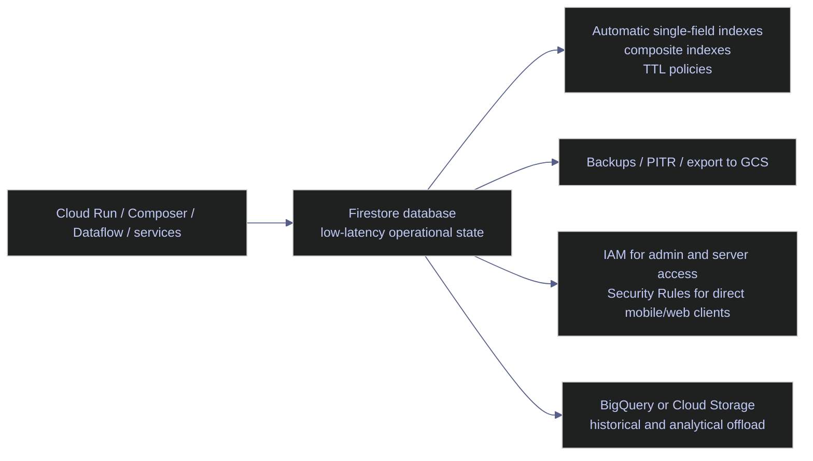

# Firestore Data Model and Operations

> [!quote] Query-driven modeling
>
> In document databases, the questions you need to answer should shape the document model and indexes.
>
> Source: *Financial Data Engineering.epub*

> [!abstract]- Summary
>
> Covers Cloud Firestore as a managed Google Cloud document database from the operator viewpoint, with production guidance for service selection, database design, protection controls, recovery workflows, and infrastructure-as-code in data-engineering environments.
>
> **Service fit and operating modes**
> - Positions Firestore against BigQuery, Cloud SQL / AlloyDB, Cloud Storage, and Pub/Sub so current operational state stays in Firestore while analytics, relational workloads, blobs, and transport move to the correct service
> - Distinguishes `FIRESTORE_NATIVE` from Datastore mode, including API surface, real-time capability, index model, and why Native mode is the default for new workloads
> - Explains regional versus multi-region placement, regional `99.99%` versus multi-region `99.999%` availability targets, and why the live `main` database is in `europe-west1`
>
> **Data model, limits, and indexing**
> - Covers collections, documents, subcollections, collection groups, the `1 MiB` document limit, `20`-level nesting, `10 MiB` request limit, transaction duration, and index-entry limits that constrain schema shape
> - Explains composite indexes, single-field exemptions, index fanout, TTL on `expires_at`, hotspot risk from sequential IDs or indexed timestamps, and the `500/50/5` traffic-ramp rule
> - Separates IAM for administrators, service accounts, `gcloud`, Terraform, and server workloads from Security Rules for direct mobile and web clients
>
> **Operational commands and recovery**
> - Uses read-only `gcloud` checks to confirm the active account, active project, named database `main`, database metadata, indexes, TTL state, delete protection, PITR posture, backups, and export or import targets before any mutation
> - Shows controlled workflows for creating databases, enabling delete protection or PITR, creating composite indexes and single-field exemptions, configuring TTL, and using bulk delete, export, import, scheduled backup, and restore-to-new-database patterns
> - Captures the current live posture: project `bq-wh-nb`, database `main`, location `europe-west1`, edition `STANDARD`, TTL on `pipeline_runs.expires_at`, delete protection disabled, PITR disabled, and no managed backup schedules or backup artifacts
>
> **Infrastructure as code and platform patterns**
> - Provides Terraform patterns for `google_firestore_database`, `google_firestore_index`, `google_firestore_field`, and `google_firestore_backup_schedule` so location, retention, delete protection, and index policy remain reviewable and reproducible
> - Maps Firestore to data-engineering control-plane use cases such as checkpoints, cursors, config documents, feature flags, leases, and recent run metadata, while defining the archive boundary to BigQuery or Cloud Storage
>
> **Operations and safety**
> - Warnings: mode is fixed at creation, parent deletes do not remove subcollections, TTL is asynchronous, imports can overwrite matching document IDs, bulk delete ignores later writes, and named-database commands must target `--database='main'`
> - Recommendations table: Native mode by default, deliberate location choice, delete protection, PITR, backup schedules, compact documents, index exemptions for non-query timestamps, and index definitions treated as deployable infrastructure
> - Troubleshooting: 7 failure modes covering named-database targeting mistakes, missing composite indexes, delayed TTL cleanup, absent backups, disabled PITR, hotspotting, and partial bulk-delete expectations

> [!note]- Glossary
>
> **Firestore database**
> - A named Cloud Firestore data store inside a Google Cloud project that owns collections, indexes, recovery controls, and administrative settings.
> - It is the unit every `gcloud firestore` command, protection toggle, backup policy, and restore workflow in this note targets.
>
> > [!warning] Default database assumptions
> >
> > Many examples on the internet assume `'(default)'`. This environment uses the named database `main`, so database-scoped commands must target it explicitly.
>
> ---
>
> **Native mode**
> - Firestore's document-database operating mode with Firestore APIs, real-time updates, and the index behavior expected by modern Firestore client libraries.
> - It is the correct baseline for the operational patterns in this note and the default choice for new workloads.
>
> > [!info] Baseline for new workloads
> >
> > Native mode is not a performance tweak. It is the platform identity of the database and determines which features, tooling, and client behavior are available.
>
> ---
>
> **Datastore mode**
> - A compatibility mode that preserves Datastore-style APIs and semantics instead of the Native Firestore feature set.
> - It matters mainly when a legacy Datastore application must be preserved rather than redesigned.
>
> > [!warning] Compatibility over new features
> >
> > Datastore mode is not a neutral alternative. Choosing it gives up Firestore-specific capabilities such as the normal client model and real-time features.
>
> ---
>
> **Regional location**
> - A Firestore deployment in one Google Cloud region with synchronous replication across zones inside that region.
> - It is usually the low-latency, lower-cost choice when compute and operators are concentrated in one geography.
>
> > [!info] Co-locate compute deliberately
> >
> > The practical question is not only availability. It is whether Cloud Run, Composer, or other operational compute sits close enough to avoid cross-region write latency.
>
> ---
>
> **Multi-region location**
> - A Firestore deployment replicated across multiple regions for stronger resilience against a regional outage.
> - It is the higher-availability choice when Firestore is business-critical and a single-region failure is unacceptable.
>
> > [!warning] Latency for resilience
> >
> > Multi-region durability and `99.999%` availability usually come with higher cost and slightly slower writes than a co-located regional design.
>
> ---
>
> **Collection**
> - A logical container of Firestore documents that defines a query scope and a path segment in the database hierarchy.
> - It is the base unit for modeling operational records such as `pipeline_runs`, `config`, or `leases`.
>
> > [!info] Query root matters
> >
> > A root collection is often easier to query, clean up, protect with TTL, and export than the same records buried under many parent documents.
>
> ---
>
> **Document**
> - A JSON-like Firestore record with typed fields, addressed by a full path and limited to `1 MiB`.
> - It is the atomic object read, written, indexed, expired by TTL, and recovered in the workflows shown here.
>
> > [!warning] Keep documents bounded
> >
> > Large payloads, logs, or ever-growing arrays turn one document into a cost and latency problem quickly. Blobs belong in Cloud Storage, not inside Firestore documents.
>
> ---
>
> **Subcollection**
> - A collection nested under a document rather than stored at the database root.
> - It is useful for parent-local grouping, but it changes query patterns, cleanup logic, and restore expectations.
>
> > [!warning] Parent delete caveat
> >
> > Deleting a parent document does not recursively delete its child subcollections. Lifecycle and cleanup have to be designed explicitly.
>
> ---
>
> **Collection group**
> - The logical union of every collection that shares the same name anywhere in the database hierarchy.
> - It enables fleet-wide queries, bulk admin operations, and TTL or export decisions that span many parent documents.
>
> > [!info] Cross-parent query scope
> >
> > Collection-group queries often need their own composite indexes because the database is traversing many repeated nested paths, not one collection root.
>
> ---
>
> **Composite index**
> - A Firestore index across multiple fields that supports query shapes combining filters and ordering beyond automatic single-field indexing.
> - It determines whether many production queries succeed at all instead of failing with `FAILED_PRECONDITION`.
>
> > [!warning] Built before query use
> >
> > Firestore does not degrade gracefully when a required composite index is missing. The query fails until the index is created and reaches `READY`.
>
> ---
>
> **Single-field exemption**
> - A per-field override that changes Firestore's default single-field indexing behavior for one collection or collection group field.
> - It is how operators reduce unnecessary write cost and latency on fields that are never queried.
>
> > [!info] Shared field budget
> >
> > TTL configuration and indexing configuration both consume the same single-field configuration budget, so exemption planning is part of platform capacity planning.
>
> ---
>
> **Index fanout**
> - The number of index entries Firestore must update for one document write.
> - It is one of the main reasons high-write collections slow down or become expensive.
>
> > [!warning] Writes pay everywhere
> >
> > Large arrays, many indexed fields, and extra composite indexes multiply write work even when the application updates only one logical record.
>
> ---
>
> **TTL policy / `expires_at`**
> - A retention policy that tells Firestore to expire documents based on one timestamp field per collection group, often a field such as `expires_at`.
> - It is the steady-state cleanup mechanism for short-lived operational metadata such as recent run history or deduplication records.
>
> > [!warning] Expiry is delayed
> >
> > TTL is asynchronous. It is appropriate for lifecycle management, not for "delete this immediately" guarantees during an incident.
>
> ---
>
> **Point-in-time recovery / `PITR`**
> - A recovery feature that allows reads or restore operations against an earlier state of the database within a limited window.
> - It matters when accidental updates or deletes must be investigated or reversed without relying solely on exports or backups.
>
> > [!info] Seven-day recovery window
> >
> > When enabled, Firestore exposes a seven-day recovery period with one-minute granularity beyond the most recent hour. If it is off today, it cannot help with today's loss event.
>
> ---
>
> **Scheduled backup**
> - A managed recurring backup policy that creates recoverable backup artifacts on a daily or weekly cadence.
> - It extends recovery beyond the PITR window and supports restore workflows that do not depend on application-level reingestion.
>
> > [!warning] Restore is separate
> >
> > Firestore backups do not imply in-place overwrite. Recovery planning still requires a destination database and a cutover decision.
>
> ---
>
> **Managed export**
> - A Firestore admin operation that writes a consistent export of selected collection groups to a Cloud Storage prefix.
> - It is the clean way to archive operational history, stage data for BigQuery loading, or prepare for a controlled migration.
>
> > [!info] BigQuery load path
> >
> > Firestore exports are designed for admin workflows and can be loaded into BigQuery. Use narrow `--collection-ids` scopes so cost and blast radius stay controlled.
>
> ---
>
> **Bulk delete**
> - A managed Firestore operation that deletes documents from selected collection groups without custom application code.
> - It is the exceptional cleanup tool when TTL is too slow or a collection needs one-time removal at scale.
>
> > [!danger] Delete set is fixed
> >
> > Bulk delete only removes documents matching the operation when it starts. Documents created or changed afterward are outside that delete set and can still remain.
>
> ---
>
> **Delete protection**
> - A database-level setting that blocks whole-database deletion until an administrator disables the protection.
> - It is the guardrail that prevents one mistaken admin action from removing the entire Firestore database.
>
> > [!info] Database-level safety guardrail
> >
> > Delete protection does not defend individual documents, but it is one of the cheapest high-value controls for the database resource itself.
>
> ---
>
> **Named database / `main`**
> - A Firestore database whose ID is not `'(default)'`, such as the live database `main` used in this environment.
> - It changes CLI targeting, restore planning, and operational assumptions across every administrative workflow.
>
> > [!warning] Tooling may default wrong
> >
> > Some commands and examples assume the default database implicitly. In a named-database project, that assumption can produce confusing errors or act on the wrong target.
>
> ---
>
> **IAM**
> - Google Cloud Identity and Access Management roles and permissions applied to projects, databases, service accounts, and administrative actions.
> - It is the authorization boundary for `gcloud`, Terraform, backups, restore, and server-side access to Firestore.
>
> > [!warning] Server-side authority boundary
> >
> > If a Cloud Run service, Dataflow job, or administrator is blocked, the first place to look is IAM. Security Rules do not grant those server-side permissions.
>
> ---
>
> **Security Rules**
> - Firestore's policy language for controlling document access by untrusted mobile and web clients that talk directly to the database.
> - It matters when application clients bypass a trusted server and need fine-grained document-level access checks.
>
> > [!warning] Client-side access only
> >
> > Security Rules are not a replacement for IAM and do not secure exports, backups, restore operations, or server automation that already runs with Google Cloud identities.
>
> ---
>
> **Hotspot**
> - Contention on a narrow key range or a single heavily updated document that drives latency, retries, and write failures.
> - It is the operational symptom created by sequential IDs, indexed sequential timestamps, or concentrated write traffic.
>
> > [!warning] Sequential keys hurt
> >
> > Hotspots are often self-inflicted by seemingly tidy key design. Human-readable monotonic IDs are convenient until the write path bottlenecks on one part of the keyspace.
>
> ---
>
> **`500/50/5` rule**
> - Firestore guidance for warming up a new collection or narrow key range by starting near `500` operations per second and increasing traffic by `50%` every five minutes.
> - It gives operators a practical rollout pattern that reduces the risk of hotspotting during launches or migrations.
>
> > [!info] Ramp traffic intentionally
> >
> > The rule is about operational pacing, not a hard service quota. It matters most when traffic is being introduced to a fresh key range that has not been exercised before.
>
> ---
>
> **Infrastructure as code / Terraform**
> - The practice of declaring Firestore databases, indexes, field settings, and backup schedules in reviewable configuration instead of only clicking them in the console.
> - It keeps location, delete protection, PITR, TTL, and index policy reproducible across environments and auditable in code review.
>
> > [!warning] Drift becomes runtime failure
> >
> > In Firestore, configuration drift is not cosmetic. Missing indexes, disabled protection controls, or inconsistent field settings surface later as broken queries or recovery gaps.


## Mental Model / Architecture Model

Firestore is most valuable when it acts as an operational data service close to application or pipeline control flow, while analytical or high-volume event history is pushed to more appropriate systems.



The practical reading is simple:

- Firestore is strong when the question is "what is the current state of this job, config, lease, run, or control-plane object?"
- Firestore is weak when the question is "scan or aggregate a large history set cheaply" or "hold a replayable event stream with queue semantics."

## Core Concepts

This section builds the service model before the operational commands.

### Firestore | service positioning | where Firestore fits in Google Cloud

Firestore is a low-latency document database for operational data, application state, and lightweight transactional workloads. It is not a warehouse, not a queue, and not an object store.

| Service | Best at | Weak at | Typical data-engineering use |
|---|---|---|---|
| **Firestore** | Low-latency document reads and writes, flexible schema, operational state, metadata, control-plane records | Large analytical scans, joins, queue semantics, very high sustained hot-key traffic | Pipeline checkpoints, job state, config registry, feature flags, run metadata, dedup tokens |
| **BigQuery** | Analytical scans, SQL, aggregations, historical reporting, cost-efficient large reads | Per-row operational lookups, low-latency transactional state | Run history analytics, cost reporting, SLA trend analysis, audit exploration |
| **Cloud SQL / AlloyDB** | Relational integrity, joins, SQL transactions, normalized schemas | Global-scale low-ops document workloads, large fan-out real-time listeners | Transactional control data with strict relational rules |
| **Cloud Storage** | Large blobs, files, immutable artifacts, cheap retention | Millisecond operational lookups or frequent tiny updates | Export archives, raw payloads, backup artifacts, replay manifests |
| **Pub/Sub** | Asynchronous delivery, buffering, replayable message retention, fan-out | Serving current operational state or document lookup workloads | Event transport and backpressure boundary |

For data engineers, Firestore usually sits beside the pipeline, not underneath the warehouse. It stores the current answer to operational questions while BigQuery stores history and Pub/Sub carries events between stages.

### Firestore | operating modes | Native mode versus Datastore mode

Mode is decided at database creation time. It is a foundational platform decision, not a runtime toggle.

| Dimension | Native mode | Datastore mode |
|---|---|---|
| Primary API surface | Firestore APIs and Firestore client libraries | Datastore APIs and Datastore client libraries |
| Data model | Documents, collections, subcollections | Entities, kinds, namespaces |
| Real-time capabilities | Available | Not available |
| Index model | Firestore indexes | Datastore indexes |
| Recommended for new workloads | Yes | No, except migration or legacy compatibility cases |
| Best fit | Operational document database | Existing Datastore-based systems |

> [!warning] Mode is not a casual setup choice
>
> A database's mode is chosen when the database is created. The practical consequence is that API surface, client libraries, index behavior, and feature availability all follow from that initial choice.
>
> Do not treat mode selection as a detail you can clean up later.

> [!success] Default to Native mode for new work
>
> Choose Native mode unless you are intentionally preserving Datastore compatibility. It is the correct baseline for Firestore-backed data-engineering control planes.

The live database in the current project is `projects/bq-wh-nb/databases/main`, and it is `FIRESTORE_NATIVE`.

### Firestore | location strategy | latency, durability, and co-location

Firestore location is an architectural decision with direct consequences for latency, availability, disaster recovery, and cost. Google documents that regional databases replicate across at least three zones in one region, while multi-region databases replicate across five zones in three regions.

| Location choice | Best when | Tradeoff |
|---|---|---|
| **Regional** | Pipeline compute is concentrated in one region and write latency matters | Lower availability target than multi-region |
| **Multi-region** | Firestore is business-critical and must remain resilient across regional failure | Higher cost and usually higher write latency |

The current live database is regional in `europe-west1`. That is a sensible choice when your Cloud Run jobs, Composer environment, or other operational compute is also in Europe and you want lower write latency for control-plane state.

### Firestore | data model | platform implications of document shape

Firestore alternates collection and document path segments. That shape is not only a modeling concern; it controls query patterns, delete workflows, and index requirements.

| Structure | What it is | Operational implication |
|---|---|---|
| Root collection | Top-level collection under the database | Simplest target for collection-scoped queries and admin commands |
| Document | JSON-like record with typed fields | Maximum size is `1 MiB`; writes update the document and all relevant indexes |
| Subcollection | Collection nested under a document | Parent deletion does not automatically delete child subcollections |
| Collection group | All collections sharing the same name | Useful for fleet-wide admin actions and cross-parent queries |

For operational metadata, a flat root collection is often the better default:

- `pipeline_runs/{run_id}` is simpler for fleet-wide failed-run inspection, TTL policies, backup retention, and bulk deletes.
- `pipelines/{pipeline_id}/runs/{run_id}` is reasonable only when parent-local grouping is more important than fleet-wide operations.

### Firestore | limits and scaling | what constrains design

The official limits below matter because they drive schema shape, index design, and recovery strategy.

| Limit or behavior | Value | Why it matters operationally |
|---|---|---|
| Maximum document size | `1 MiB` | Run history, checkpoints, or config blobs must stay compact; large payloads belong in Cloud Storage |
| Maximum field depth in maps and arrays | `20` | Deeply nested control metadata becomes fragile and hard to query |
| Maximum API request size | `10 MiB` | Large transactional or batch-style mutations hit request limits quickly |
| Transaction time limit | `270 seconds` with `60-second` idle expiration | Long-running orchestration logic should not hold Firestore transactions open |
| Maximum composite indexes | `1000` with billing enabled | Index sprawl is real; version-control query shapes |
| Maximum single-field configurations | `1000` with billing enabled | TTL and index exemptions both consume this budget |
| Maximum index entries per document | `40,000` | Large arrays and many indexed fields can make one document expensive to write |
| Maximum indexed field value size | `1500 bytes` before truncation | Long strings are dangerous query keys and poor index candidates |
| Export and import request rate | `20` per minute per project | Bulk admin workflows need pacing and scheduling |

Hotspots are the next operational boundary. Firestore documentation recommends the `500/50/5` rule for warming up new collections or narrow key ranges: start around `500` operations per second and then increase by `50%` every five minutes. Sequential document IDs, sequential indexed timestamps, and aggressive writes to one document all work against that guidance.

### Firestore | indexes, TTL, and cost | why write patterns matter

Firestore automatically indexes fields unless you exempt them. That default is convenient for development, but it makes write cost and write latency a function of document shape.

| Mechanism | Good for | Risk if unmanaged |
|---|---|---|
| Automatic single-field indexes | Fast iteration and simple filters | Index fanout on fields you never query |
| Composite indexes | Known production query shapes | Operational drift when query shape changes but index deployment does not |
| Single-field exemptions | High-write timestamp fields, large strings, large arrays, TTL fields | Missing exemptions increase write latency and storage cost |
| TTL policy | Cleanup of operational history | Teams expect immediate deletion, but TTL is asynchronous |

Firestore best practices explicitly call out TTL fields as a common exemption target: the TTL field must be a timestamp, indexing is enabled by default, and that indexing can hurt performance at higher write rates if the field is never queried.

### Firestore | security boundary | IAM versus Security Rules

You must separate server-side control from client-side control.

| Control plane | Primary mechanism | Use it for | Do not use it for |
|---|---|---|---|
| Admin and server access | **IAM** | `gcloud`, Terraform, backups, restore, exports, Cloud Run services, Dataflow jobs, Composer workers | Direct mobile or web client authorization |
| Direct mobile and web clients | **Security Rules** | Enforcing document-level access patterns for untrusted client SDKs | Replacing IAM for server jobs or admin tooling |

The operator rule is simple:

- If the caller is a server workload or administrator, use IAM and service accounts.
- If the caller is a browser or mobile client talking directly to Firestore, use Security Rules.

Mixing the two leads to false assumptions, especially in incident response. A broken IAM binding blocks admin commands. A broken Security Rule blocks direct client access. They are not the same failure domain.

## Operational Commands And Workflows

All commands below are written as live-safe patterns against the current project context. Read-only inspection commands use the verified project `bq-wh-nb` and the current named database `main`. State-changing commands include pre-check guidance and verification steps. If a command needs a resource that is not present in the current project, the command is presented as a controlled pattern rather than as something you should copy blind.

### PowerShell / Linux | gcloud | confirm the active project and database context

These commands answer the first operational question: "Which identity, project, and database will this command actually touch?"

#### Print the active account

Before any Firestore admin command, especially in a shared workstation or Cloud Shell session. It is typically triggered by you open a new shell, switch configurations, or are about to make a state change. `gcloud` CLI, read-only. Requires an authenticated account but does not mutate any resource. Confirm which identity will authorize Firestore admin actions.

*Print the active `gcloud` account that will execute Firestore admin commands.*

```bash
gcloud auth list --filter=status:ACTIVE --format="value(account)"
```

```text
alexper.recovery@gmail.com
```

#### Print the active project

Immediately after confirming the account and before using any `gcloud firestore` command. It is typically triggered by you suspect a configuration switch, or a command could hit the wrong project. `gcloud` CLI, read-only. Confirm which Google Cloud project is the default target for the current shell session.

*Print the active Google Cloud project from the current `gcloud` configuration.*

```bash
gcloud config get-value project
```

```text
bq-wh-nb
```

#### List Firestore databases in the active project

Before any database-scoped admin action. It is typically triggered by you need to know whether the project uses `'(default)'` or a named database, or you want to verify location and delete protection state. `gcloud` CLI, read-only. Requires metadata access to the project. Show which Firestore databases exist in the active project so later commands target the correct database ID.

| Field | Source column | Type | Meaning |
|---|---|---|---|
| `name` | `name` | string | Fully qualified resource name of the Firestore database |
| `type` | `type` | enum | Database mode, such as `FIRESTORE_NATIVE` |
| `locationId` | `locationId` | string | Region or multi-region where the database lives |
| `deleteProtectionState` | `deleteProtectionState` | enum | Whether database deletion is blocked |
| `pointInTimeRecoveryEnablement` | `pointInTimeRecoveryEnablement` | enum | Whether PITR is enabled |

*List Firestore databases in the active project and surface the settings that change operational risk.*

```bash
gcloud firestore databases list \
  --format="table(name,type,locationId,deleteProtectionState,pointInTimeRecoveryEnablement)"
```

| NAME | TYPE | LOCATION_ID | DELETE_PROTECTION_STATE | POINT_IN_TIME_RECOVERY_ENABLEMENT |
|---|---|---|---|---|
| `projects/bq-wh-nb/databases/main` | `FIRESTORE_NATIVE` | `europe-west1` | `DELETE_PROTECTION_DISABLED` | `POINT_IN_TIME_RECOVERY_DISABLED` |

The important result is that this project does not use `'(default)'`. Any command aimed at `'(default)'` will fail with `NOT_FOUND`.

#### Describe the current Firestore database configuration

After listing databases and before changing delete protection, PITR, or location-dependent integrations. It is typically triggered by you need to verify the current configuration of the exact database you are about to touch. `gcloud` CLI, read-only. Retrieve the current platform settings that govern recovery window, real-time behavior, and destructive-risk posture.

| Field | Source column | Type | Meaning |
|---|---|---|---|
| `name` | `name` | string | Fully qualified database resource name |
| `locationId` | `locationId` | string | Database location |
| `type` | `type` | enum | Native mode or Datastore mode |
| `databaseEdition` | `databaseEdition` | enum | Standard or Enterprise |
| `deleteProtectionState` | `deleteProtectionState` | enum | Whether database deletion is blocked |
| `pointInTimeRecoveryEnablement` | `pointInTimeRecoveryEnablement` | enum | Whether PITR is enabled |
| `realtimeUpdatesMode` | `realtimeUpdatesMode` | enum | Whether real-time updates are enabled |
| `versionRetentionPeriod` | `versionRetentionPeriod` | duration | Recovery-read retention window supported by the database |

*Describe the live `main` Firestore database in the active project.*

```bash
gcloud firestore databases describe \
  --database='main' \
  --format="table(name,locationId,type,databaseEdition,deleteProtectionState,pointInTimeRecoveryEnablement,realtimeUpdatesMode,versionRetentionPeriod)"
```

| NAME | LOCATION_ID | TYPE | DATABASE_EDITION | DELETE_PROTECTION_STATE | POINT_IN_TIME_RECOVERY_ENABLEMENT | REALTIME_UPDATES_MODE | VERSION_RETENTION_PERIOD |
|---|---|---|---|---|---|---|---|
| `projects/bq-wh-nb/databases/main` | `europe-west1` | `FIRESTORE_NATIVE` | `STANDARD` | `DELETE_PROTECTION_DISABLED` | `POINT_IN_TIME_RECOVERY_DISABLED` | `REALTIME_UPDATES_MODE_ENABLED` | `3600s` |

The live reading is important:

- `main` is a Standard edition Native-mode database.
- Delete protection is currently disabled.
- PITR is currently disabled.
- Real-time updates are enabled.
- With PITR disabled, the version retention period is currently `3600s`, not seven days.

| Flag | Syntax | Description |
|---|---|---|
| `--filter` | `gcloud auth list --filter=status:ACTIVE` | Limits `gcloud auth list` output to the active identity |
| `--format` | `--format="table(...)"` | Controls output shape so the command is readable and script-safe |
| `--database` | `--database='main'` | Targets a named Firestore database instead of the default database |

### PowerShell / Linux | gcloud | create and update database settings

These commands are state-changing. Run the read-only inspection commands above first, and do not create or reconfigure a database until you have confirmed the active account, active project, intended database ID, and intended location.

#### Create a new Firestore database

During initial environment provisioning or when intentionally adding a separate database for testing, regional isolation, or customer separation. It is typically triggered by A new environment needs its own Firestore database, or the project currently lacks the intended database. `gcloud` CLI, state-changing. Requires `roles/datastore.owner`. Database location and mode are foundational choices. Create a new Firestore database with explicit mode, location, and deletion-risk posture instead of relying on console defaults.

> [!warning] Creation choices are architectural
>
> Before running the create command, verify:
>
> - The active project is correct.
> - The database ID is new and intentionally named.
> - The location matches the compute region strategy.
> - You want Native mode rather than Datastore mode.
> - You understand whether PITR and delete protection should be enabled from day one.

> [!success] Use an explicit create command
>
> Create databases with all critical settings visible in the command. Silent defaults make reviews and incident reconstruction harder later.

*Create a new Native-mode Firestore database in the active project with delete protection enabled at creation time.*

```bash
gcloud firestore databases create \
  --project='bq-wh-nb' \
  --database='metadata-eu' \
  --location='europe-west1' \
  --edition=standard \
  --type=firestore-native \
  --delete-protection
```

If you run this command, verify the result with `gcloud firestore databases describe --database='metadata-eu'`. If the database is meant for production control-plane data, decide whether PITR should also be enabled immediately.

#### Enable delete protection or PITR on an existing database

After provisioning if these protections were omitted, or during a hardening pass before production use. It is typically triggered by the describe output shows `DELETE_PROTECTION_DISABLED` or `POINT_IN_TIME_RECOVERY_DISABLED`. `gcloud` CLI, state-changing. Requires database update permission. Raise the safety baseline of an existing database without recreating it.

> [!warning] Do not confuse protection scopes
>
> Delete protection blocks database deletion.
> PITR improves recovery from document-level accidental change.
> Neither setting replaces scheduled backups for longer retention.

> [!success] Turn on the protections deliberately
>
> Treat delete protection, PITR, and scheduled backups as separate controls. Use all three when the database holds production metadata you cannot cheaply reconstruct.

*Enable delete protection on the current `main` database.*

```bash
gcloud firestore databases update \
  --database='main' \
  --delete-protection
```

*Enable PITR on the current `main` database.*

```bash
gcloud firestore databases update \
  --database='main' \
  --enable-pitr
```

After either command, re-run `gcloud firestore databases describe --database='main'` and confirm the target field changed to `ENABLED`.

| Flag | Syntax | Description |
|---|---|---|
| `--project` | `--project='bq-wh-nb'` | Forces the command to the intended Google Cloud project |
| `--database` | `--database='metadata-eu'` | Names the database being created or updated |
| `--location` | `--location='europe-west1'` | Sets the region or multi-region at creation time |
| `--edition` | `--edition=standard` | Chooses Standard or Enterprise edition |
| `--type` | `--type=firestore-native` | Chooses Native mode or Datastore mode |
| `--delete-protection` | `--delete-protection` | Enables protection against database deletion |
| `--enable-pitr` | `--enable-pitr` | Enables seven-day point-in-time recovery |

### PowerShell / Linux | gcloud | inspect indexes and TTL policies

Index and TTL configuration are infrastructure, not application trivia. They change write latency, storage cost, cleanup behavior, and failure modes.

#### List composite indexes in the current database

Before deploying a new query shape, after a failed precondition error, or during environment drift inspection. It is typically triggered by A planned query needs a composite index, or an environment behaves differently than another. `gcloud` CLI, read-only. Requires metadata access to the database. Show which composite indexes already exist and which collection groups they govern.

| Field | Source column | Type | Meaning |
|---|---|---|---|
| `name` | `name` | string | Full resource name of the index, including collection group and index ID |
| `queryScope` | `queryScope` | enum | Whether the index applies to a collection or collection group |
| `state` | `state` | enum | Build status such as `READY` |

*List composite indexes in the live `main` database.*

```bash
gcloud firestore indexes composite list \
  --database='main' \
  --format=json
```

| Index resource | Collection group | Query scope | Indexed fields | State |
|---|---|---|---|---|
| `projects/bq-wh-nb/databases/main/collectionGroups/prices/indexes/CICAgJim14AK` | `prices` | `COLLECTION_GROUP` | `date ASC`, `close DESC`, `__name__ DESC` | `READY` |
| `projects/bq-wh-nb/databases/main/collectionGroups/stocks/indexes/CICAgOjXh4EK` | `stocks` | `COLLECTION` | `country ASC`, `current_price ASC`, `__name__ ASC` | `READY` |
| `projects/bq-wh-nb/databases/main/collectionGroups/pipeline_runs/indexes/CICAgJiUsZIK` | `pipeline_runs` | `COLLECTION` | `status ASC`, `started_at DESC`, `__name__ DESC` | `READY` |

The practical lesson is that the current environment already versioned one important operational query shape: failed or status-filtered pipeline runs ordered by start time.

#### Inspect TTL fields in the current database

When verifying cleanup behavior or checking whether old operational records should already be disappearing. It is typically triggered by historical control-plane data is growing, or the team believes TTL is configured but documents remain visible. `gcloud` CLI, read-only. Show which collection-group fields are configured as TTL expiry fields.

| Field | Source column | Type | Meaning |
|---|---|---|---|
| `name` | `name` | string | Fully qualified field resource name |
| `ttlConfig.state` | `ttlConfig.state` | enum | Whether TTL is active for the field |
| `indexConfig.usesAncestorConfig` | `indexConfig.usesAncestorConfig` | boolean | Whether the field still inherits default single-field indexing behavior |

*List TTL-enabled fields in the live `main` database.*

```bash
gcloud firestore fields ttls list \
  --database='main' \
  --format="table(name,ttlConfig.state,indexConfig.usesAncestorConfig)"
```

| NAME | STATE | USES_ANCESTOR_CONFIG |
|---|---|---|
| `projects/bq-wh-nb/databases/main/collectionGroups/pipeline_runs/fields/expires_at` | `ACTIVE` | `True` |

This output shows that `pipeline_runs.expires_at` is the live TTL field today. The field still inherits ancestor index behavior, which means it remains indexed unless you add a single-field exemption.

#### Create a composite index safely

After a query design review has identified a stable production query shape that needs explicit index support. It is typically triggered by A Firestore query fails with `FAILED_PRECONDITION`, or a new operational query is being promoted into production. `gcloud` CLI, state-changing. Index builds are asynchronous and may take time. Create the exact composite index that a known query shape needs.

> [!warning] Create only stable indexes
>
> Every composite index increases storage, write amplification, and admin surface area.
> Do not create indexes for exploratory one-off queries in a production database.

> [!success] Version-control query shapes
>
> Treat a composite index as part of the deployment contract for a production query. Add it intentionally and keep the query and the index definition together in reviewable infrastructure code.

*Create the `status ASC + started_at DESC` index for `pipeline_runs` in the `main` database.*

```bash
gcloud firestore indexes composite create \
  --database='main' \
  --collection-group='pipeline_runs' \
  --field-config=field-path=status,order=ascending \
  --field-config=field-path=started_at,order=descending
```

Verify completion with `gcloud firestore indexes composite list --database='main' --format=json` and confirm the new index reaches `READY`.

#### Enable TTL and exempt the expiry field from unnecessary indexing

When a collection group contains short-lived operational data such as run history, replay manifests, dedup tokens, or checkpoints. It is typically triggered by storage is growing without bound, or a timestamp field exists purely for expiry and not for query filtering. `gcloud` CLI, state-changing. These are separate operations: one configures TTL, the other changes indexing behavior. Automate cleanup while reducing avoidable write fanout on a sequential expiry timestamp field.

> [!warning] TTL is not immediate deletion
>
> Firestore documents with expired TTL fields continue to appear until the asynchronous TTL service deletes them.
>
> Use TTL for lifecycle management, not for second-by-second enforcement or security guarantees.

> [!success] Pair TTL with a field-exemption review
>
> If the expiry timestamp is not used in queries, exempt it from indexing so it stops contributing to write fanout.

*Enable `expires_at` as the TTL field for the `pipeline_runs` collection group.*

```bash
gcloud firestore fields ttls update expires_at \
  --database='main' \
  --collection-group='pipeline_runs' \
  --enable-ttl
```

*Disable default indexing on the same high-write expiry field if your application never filters on it.*

```bash
gcloud firestore indexes fields update expires_at \
  --database='main' \
  --collection-group='pipeline_runs' \
  --disable-indexes
```

After changing either setting, re-run the TTL inspection command and `gcloud firestore indexes fields list --database='main'` to confirm the field now reflects the intended TTL and indexing posture.

| Flag | Syntax | Description |
|---|---|---|
| `--database` | `--database='main'` | Targets the named Firestore database |
| `--collection-group` | `--collection-group='pipeline_runs'` | Chooses the collection group or repeated nested collection name |
| `--field-config` | `--field-config=field-path=status,order=ascending` | Defines one field inside a composite index |
| `--query-scope` | `--query-scope=collection-group` | Changes index scope when needed |
| `--enable-ttl` | `--enable-ttl` | Marks the field as the TTL expiry field |
| `--disable-indexes` | `--disable-indexes` | Exempts a field from default single-field indexing |

### PowerShell / Linux | gcloud | back up, export, import, and restore data

Recovery workflows are where teams most often discover they never verified the real database name, real location, or real recovery control posture.

#### List backup schedules for the current database

During a hardening review, before a maintenance window, or after onboarding a new environment. It is typically triggered by you need to confirm whether automated backups exist at all. `gcloud` CLI, read-only. Show whether the database currently has scheduled backups configured.

*List backup schedules configured for the live `main` database.*

```bash
gcloud firestore backups schedules list \
  --database='main' \
  --format=json
```

```text
[]
```

There are currently no scheduled backups for `main`.

#### List existing backups in the current Firestore region

Before planning restore, clone, or disaster-recovery exercises. It is typically triggered by you need to know whether recoverable backup artifacts already exist in the database location. `gcloud` CLI, read-only. Show which backup artifacts exist in the database's region.

*List Firestore backups in `europe-west1`, the current database location.*

```bash
gcloud firestore backups list \
  --location='europe-west1' \
  --format=json
```

```text
[]
```

The live project currently has no managed Firestore backups in `europe-west1`.

#### Create a weekly backup schedule

Before placing the database into production or before accepting that historical operational metadata must be recoverable beyond the PITR window. It is typically triggered by A hardening review shows no backup schedule is present. `gcloud` CLI, state-changing. Requires backup schedule permissions on the database. Add a managed backup policy with explicit cadence and retention.

> [!warning] Backups and PITR solve different problems
>
> PITR supports recent surgical recovery.
> Scheduled backups support longer retention and restore to a new database.
>
> One is not a substitute for the other.

> [!success] Set retention deliberately
>
> Choose a retention period that matches operational replay, audit, or rollback needs. Firestore scheduled backups support retention up to 14 weeks.

*Create a weekly Sunday backup schedule with 28-day retention for the `main` database.*

```bash
gcloud firestore backups schedules create \
  --database='main' \
  --retention=28d \
  --recurrence=weekly \
  --day-of-week=SUN
```

Verify with `gcloud firestore backups schedules list --database='main'`.

#### Export collection groups to Cloud Storage

Before major data migrations, before destructive cleanup, or when offloading history for analytics or offline processing. It is typically triggered by you need a portable snapshot in Cloud Storage or want to load a Firestore export into BigQuery. `gcloud` CLI, state-changing. Requires billing, a writable Cloud Storage bucket, and Firestore plus Storage permissions. Produce a managed export without reading documents through an SDK.

> [!warning] Export location must be real
>
> Do not invent a bucket name and run the command blind. First verify the bucket exists, is writable from the project, and is located near the Firestore database.

> [!success] Export narrowly when possible
>
> Use `--collection-ids` for operational datasets such as `pipeline_runs`, `config`, or `checkpoints` so export scope, cost, and later import blast radius stay controlled.

*Export only the `pipeline_runs` collection group from the `main` database to a verified Cloud Storage prefix.*

```bash
gcloud firestore export 'gs://YOUR_EXISTING_BUCKET/firestore/main/pipeline-runs-2026-04-13' \
  --database='main' \
  --collection-ids='pipeline_runs'
```

If you need the export for BigQuery loading, prefer narrow collection-group exports. Firestore documentation explicitly states that Firestore exports can be loaded into BigQuery.

#### Import from a managed export prefix

During controlled restore or migration workflows where the source is an existing Firestore managed export. It is typically triggered by you have a known-good export prefix and need to load it into an existing target database. `gcloud` CLI, state-changing. Import overwrites documents with matching IDs that already exist in the target database. Load data from a managed export back into Firestore without writing custom loader code.

> [!danger] Import can overwrite live documents
>
> Firestore import preserves document IDs. If a document with the same ID already exists, the import overwrites it.
>
> Never run an import into a production database until you have verified the source export, target database, and collision consequences.

> [!success] Prefer restore to a new database when possible
>
> If the goal is investigation or validation, restore into a new database first. That isolates the blast radius and lets you compare states safely.

*Import only the `pipeline_runs` collection group from a known managed export prefix into `main`.*

```bash
gcloud firestore import 'gs://YOUR_EXISTING_BUCKET/firestore/main/pipeline-runs-2026-04-13' \
  --database='main' \
  --collection-ids='pipeline_runs'
```

After import, verify critical document counts and document IDs before allowing applications to rely on the result.

#### Restore a new database from a backup

During disaster recovery, restore testing, or forensic comparison against a backup artifact. It is typically triggered by A known backup exists and the team needs a safe recovery target. `gcloud` CLI, state-changing. Restore creates or targets a destination database in the same location as the source backup. Recover data into a separate database instead of disturbing the current primary database.

> [!warning] Restore workflow changes which database applications should target
>
> Restoring data is only half of the incident. The other half is deciding whether applications should be repointed, dual-read, or kept on the original database while you validate the restore.

> [!success] Restore into a separate destination first
>
> Make the restore database explicit, validate it, and only then decide whether traffic should move.

*Restore a backup into a new database named `main-restore-20260413`.*

```bash
gcloud firestore databases restore \
  --source-backup='projects/bq-wh-nb/locations/europe-west1/backups/BACKUP_ID' \
  --destination-database='main-restore-20260413'
```

After restore, use `gcloud firestore databases describe --database='main-restore-20260413'` and application-level validation before any cutover decision.

| Flag | Syntax | Description |
|---|---|---|
| `--database` | `--database='main'` | Targets the database being backed up, exported, or imported |
| `--retention` | `--retention=28d` | Keeps backups for the specified period |
| `--recurrence` | `--recurrence=weekly` | Chooses daily or weekly schedule cadence |
| `--day-of-week` | `--day-of-week=SUN` | Sets the weekly backup day in UTC |
| `--collection-ids` | `--collection-ids='pipeline_runs'` | Restricts export or import to selected collection groups |
| `--location` | `--location='europe-west1'` | Targets the backup location |
| `--source-backup` | `--source-backup='projects/.../backups/BACKUP_ID'` | Identifies the backup artifact to restore from |
| `--destination-database` | `--destination-database='main-restore-20260413'` | Names the destination database for restore |

### Terraform | google provider | manage Firestore as code

Terraform is where Firestore stops being an ad-hoc console service and becomes a reviewable platform component.

#### Declare the Firestore database

Define database identity, location, delete protection, and PITR in version control so environment creation is reproducible.

*Declare a production-style Native-mode Firestore database with PITR and delete protection enabled.*

```hcl
resource "google_firestore_database" "firestore_main" {
  project     = var.project_id
  name        = "main"
  location_id = "europe-west1"
  type        = "FIRESTORE_NATIVE"

  concurrency_mode                  = "PESSIMISTIC"
  app_engine_integration_mode       = "DISABLED"
  point_in_time_recovery_enablement = "POINT_IN_TIME_RECOVERY_ENABLED"
  delete_protection_state           = "DELETE_PROTECTION_ENABLED"
  deletion_policy                   = "ABANDON"
}
```

`deletion_policy = "ABANDON"` is a strong default for production because it keeps `terraform destroy` from deleting the live database. If you want Terraform to be able to delete the database intentionally, use `DELETE` only with strong review controls.

#### Declare composite indexes and field settings

Indexes and field exemptions are part of production query design and write-path performance.

*Declare the `pipeline_runs` composite index and disable indexing on the `expires_at` field while keeping TTL on the same field.*

```hcl
resource "google_firestore_index" "pipeline_runs_status_started_at" {
  project    = var.project_id
  database   = google_firestore_database.firestore_main.name
  collection = "pipeline_runs"

  fields {
    field_path = "status"
    order      = "ASCENDING"
  }

  fields {
    field_path = "started_at"
    order      = "DESCENDING"
  }
}

resource "google_firestore_field" "pipeline_runs_expires_at" {
  project    = var.project_id
  database   = google_firestore_database.firestore_main.name
  collection = "pipeline_runs"
  field      = "expires_at"

  ttl_config {}

  index_config {
    indexes = []
  }
}
```

This pattern matters because TTL and indexing are not separate design domains. The same timestamp field can drive retention and still be a poor index candidate for a high-write collection.

#### Declare backup schedules

Backups should not depend on someone remembering to click a console button.

*Create a weekly Firestore backup schedule with 28-day retention.*

```hcl
resource "google_firestore_backup_schedule" "weekly_main_backup" {
  project   = var.project_id
  database  = google_firestore_database.firestore_main.name
  retention = "2419200s"

  weekly_recurrence {
    day = "SUNDAY"
  }
}
```

The Google provider also supports daily recurrence. Keep backup cadence aligned with data-change frequency and incident recovery expectations.

## Warnings, Limitations, And Anti-Patterns

These are the mistakes that turn a useful operational store into a source of cost or reliability pain.

### Firestore | anti-patterns | where teams usually get hurt

| Anti-pattern | Why it is harmful | Better pattern |
|---|---|---|
| Using Firestore as the analytical system of record | Reads are billed per document and Firestore is not optimized for large scans or joins | Offload history to BigQuery or export to Cloud Storage |
| Treating Firestore like a queue | Firestore does not provide queue semantics, consumer groups, or durable replay like Pub/Sub | Use Pub/Sub for transport and Firestore for current state |
| Using sequential document IDs or high-write sequential indexed timestamps | Causes hotspotting and write contention | Use scattered IDs and exempt non-query timestamp fields from indexing |
| Storing large raw payloads or logs inside documents | Hits the `1 MiB` document limit and inflates write cost | Store blobs in Cloud Storage and keep references in Firestore |
| Assuming parent deletion removes subcollections | Child collections survive parent deletion | Design explicit cleanup paths or use collection-group cleanup workflows |
| Leaving delete protection, PITR, and backups disabled in production | Makes a single operator mistake disproportionately expensive | Turn on the controls intentionally and verify them periodically |

### Firestore | lifecycle caveats | what does not happen automatically

> [!warning] Deletion is rarely one-step
>
> Several common assumptions are wrong:
>
> - Deleting a parent document does not delete its subcollections.
> - TTL deletion is asynchronous, not immediate.
> - Import can overwrite existing documents with matching IDs.
> - Bulk delete does not delete documents added or modified after the operation starts.

> [!success] Design explicit lifecycle workflows
>
> Put lifecycle policy in the model:
>
> - Add `expires_at` to short-lived data.
> - Use collection-group-aware cleanup.
> - Keep exports or backups before destructive operations.
> - Validate restore targets before cutover.

## Recommendations And Best Practices

The defaults below are what keep Firestore useful for data-engineering control planes instead of letting it drift into accidental complexity.

### Firestore | production defaults | decisions worth making early

| Recommendation | Why it matters |
|---|---|
| Prefer Native mode for new workloads | It keeps you on the Firestore platform and feature set rather than legacy Datastore behavior |
| Choose the location deliberately with compute co-location in mind | Cross-region hops add latency and failure surface |
| Turn on delete protection for production databases | It blocks catastrophic database deletion mistakes |
| Turn on PITR when the metadata cannot be cheaply reconstructed | It shortens recovery from accidental change |
| Add backup schedules for longer retention | PITR is not a long-term retention substitute |
| Keep documents compact and purpose-built | Smaller documents reduce write cost, latency, and schema confusion |
| Exempt non-query sequential timestamp fields from indexing | It reduces write fanout and avoids the `500 writes per second` sequential-index limit |
| Treat indexes as deployable infrastructure | Environment drift here shows up as runtime query failures |
| Add `schema_version`, `updated_at`, and `owner` fields to operational documents | They make migrations and incident response less ambiguous |

## Data Engineering Scenarios

The patterns below are Firestore use cases that fit the service well from a platform point of view.

### Firestore | control-plane records | checkpoints, cursors, and config

These are low-cardinality, frequently read, operational records that represent current truth rather than historical analytics.

| Use case | Good Firestore shape | Why Firestore fits |
|---|---|---|
| Job cursor / watermark | `pipeline_checkpoints/{pipeline_name}` | One current document per pipeline is cheap to read and easy to update atomically |
| Runtime config registry | `config/{pipeline_name}` | Operators can update one document and services can reread it cheaply |
| Feature flag or kill switch | `feature_flags/{flag_name}` | Low-latency reads and simple operational toggles |
| Lease or lock metadata | `leases/{resource_id}` | Small document with ownership and expiry fields |

*Example checkpoint document for a pipeline watermark or replay cursor.*

```json
{
  "schema_version": 1,
  "pipeline": "daily-stocks-ingest",
  "cursor_type": "event_time",
  "cursor_value": "2026-04-13T11:00:00Z",
  "updated_at": "2026-04-13T11:03:12Z",
  "updated_by": "cloud-run-job/daily-stocks-ingest",
  "owner": "data-platform"
}
```

### Firestore | operational history | run metadata and incident breadcrumbs

Run metadata is a good Firestore workload when you need current and recent operational visibility, not warehouse-style analytics over large history.

| Field | Why it should exist |
|---|---|
| `status` | Supports current-state dashboards and operational filters |
| `started_at` / `finished_at` | Supports ordering and incident timeline reconstruction |
| `expires_at` | Supports TTL-driven cleanup of old run metadata |
| `attempt` | Makes retries explicit |
| `last_error` | Keeps the most useful failure context close to the run record |
| `schema_version` | Protects you from silent shape drift over time |

*Example run metadata document for a Firestore-backed pipeline control plane.*

```json
{
  "schema_version": 2,
  "pipeline": "daily-stocks-ingest",
  "status": "failed",
  "attempt": 3,
  "started_at": "2026-04-13T10:00:00Z",
  "finished_at": "2026-04-13T10:04:51Z",
  "last_error": {
    "class": "DeadlineExceeded",
    "stage": "score-gold",
    "message": "BigQuery job exceeded configured timeout"
  },
  "expires_at": "2026-05-13T10:04:51Z",
  "owner": "data-platform"
}
```

### Firestore | archive boundary | when to offload instead of retaining forever

Firestore should keep recent operational truth and bounded operational history. It should not become the forever-home for run history, detailed logs, or replayable event bodies.

| Keep in Firestore | Offload elsewhere |
|---|---|
| Current configuration | Historical config change audit at scale |
| Latest checkpoint | Full replay archive |
| Recent run metadata with TTL | Long retention SLA trend analysis in BigQuery |
| Lightweight incident breadcrumb | Large error payloads or stack traces in Cloud Storage or logging systems |

## Troubleshooting And Common Failures

Troubleshooting starts with confirming the exact database name and current control posture. Many Firestore incidents are actually targeting mistakes or missing control-plane resources.

### Firestore | failure modes | symptoms, confirmation, and action

| Symptom | Likely cause | How to confirm | Action |
|---|---|---|---|
| `NOT_FOUND` when listing indexes on `'(default)'` | The project uses a named database | `gcloud firestore databases list` | Retarget commands to `--database='main'` or the correct database name |
| Query fails with `FAILED_PRECONDITION` | Missing composite index | Review error details and `gcloud firestore indexes composite list` | Create the index and wait for `READY` |
| Old run documents still appear after expiry | TTL is configured but asynchronous | `gcloud firestore fields ttls list` and inspect `expires_at` | Wait for TTL processing or use controlled bulk delete for urgent cleanup |
| Restore plan fails because there are no backups | Backup schedule was never configured | `gcloud firestore backups schedules list` and `gcloud firestore backups list` | Add backup schedules and stop assuming PITR or exports already exist |
| PITR recovery is unavailable | PITR is disabled | `gcloud firestore databases describe --database='main'` | Enable PITR for the future; use export or backup strategy for current recovery |
| High write latency or contention | Hotspotting or index fanout | Check document ID pattern, indexed sequential fields, and collection write shape | Scatter IDs, exempt fields, and ramp traffic with `500/50/5` guidance |
| Bulk delete finishes but some documents remain | Documents were added or modified after the operation began | Check operation timing and remaining documents | Re-run cleanup or use a better retention pattern such as TTL |

## Decision Matrix Or When-To-Use Guidance

Use this matrix when deciding whether Firestore should own a platform concern.

| Question | Choose Firestore when... | Choose something else when... |
|---|---|---|
| Do you need the current value quickly? | You need sub-second operational reads of small documents | You need large scans, joins, or analytical aggregation |
| Is the data naturally document-shaped? | Each control-plane record fits cleanly into one bounded document | The model needs relational integrity across many tables |
| Is retention intentionally bounded? | You can TTL or archive old history | You need cheap long-term retention and broad queryability |
| Is query shape known ahead of time? | A small set of operational queries can be indexed intentionally | Ad-hoc exploration across large history is the norm |
| Is this transport or state? | It is state, metadata, config, or lightweight event record | It is transport, replay, fan-out, or queueing |

## Quick Reference

The table below summarizes the current live environment discovered from read-only `gcloud` inspection on 2026-04-13.

| Item | Current value | Operational implication |
|---|---|---|
| Active project | `bq-wh-nb` | All default `gcloud` commands hit this project unless overridden |
| Active account | `alexper.recovery@gmail.com` | This identity is authorizing Firestore admin commands |
| Firestore database | `main` | The project does not use `'(default)'` |
| Database location | `europe-west1` | Region choice should match compute placement and Eventarc trigger region |
| Database mode | `FIRESTORE_NATIVE` | Native-mode operational guidance applies |
| Edition | `STANDARD` | Standard edition features and limits apply |
| Delete protection | `DISABLED` | Database deletion is not currently guarded |
| PITR | `DISABLED` | Recovery window is not the seven-day PITR window |
| TTL field | `pipeline_runs.expires_at` | Recent run history is configured for TTL cleanup |
| Backup schedules | none | The database currently has no scheduled managed backups |
| Existing backups | none | Restore from managed backup is not currently available |

The shortest safe admin checklist is:

1. Confirm `gcloud auth list --filter=status:ACTIVE`.
2. Confirm `gcloud config get-value project`.
3. Confirm `gcloud firestore databases list`.
4. Confirm `gcloud firestore databases describe --database='main'`.
5. Only then run a state-changing command.
